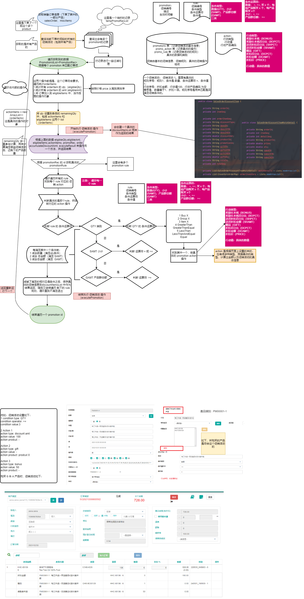

##### 销售订单业务


1. 首先需要选择或者自己填入一个下单的客户client，这个客户也许会有对应的折扣，这个在计算产品折扣的时候会用到
2. 选择买产品的渠道、对应的付款类型、**商店**、订单日期、送货类型（**这个涉及到运费问题，不同的送货类型，运行不一样**）、邮政编码、发送时间等、是否使用 乐本钱（可以用来抵扣一部分付款）
3. 记住产品是放在商店里面出售的，但是入库的时候是入库在仓库里面的（有对应的仓库管理和商店管理），产品入仓库则是在【销售订单-采购订单】模块进行采购具体的产品和到具体的仓库里面，则对应的仓库里已经有了产品。在这里就需要了解商店对应的仓库是哪一个，这个在【系统设定-商店设定】设置的，新增或者删除商店及添加对应的 storewarehouseMap 映射。仓库也有对应的管理模块【仓库设定】，产品则是在【系统设定-产品设定】设置。同样的【采购订单】也有对应的【采购订单状态】来进行管理和查看。


​	这里假如1号商店对应的1号仓库产品不足，2号仓库有的话，就可以通过【库存转移】转移产品到1号仓库中。


4. 到这就选好了基本的一些订单属性了，随后选择想下单的产品来下单，当选择产品以及数量之后，会查询这个产品满足的促销活动获得对应的下单折扣。【促销活动】模块的功能了。



这里保存下单之后订单是一个新建状态，还没有进行付款以及运送，付款运送之后这个订单也就完成了。在未运送、未付款的时候可以调整预留库存，**选择的产品有可能是这个仓库的不同批号的产品**。代码逻辑，选择产品的时候会根据对应的产品到inventory表中去查找数量大于0的这个产品的库存，设置到订单项里面用来查看这个产品使用了哪个批号（根据过期时间、编号、数量排序 升序，先使用时间最早的）

5. 预留库存的话是用来调整订单的数量，先预留出数量给这个订单。创建订单会创建订单的sales_order_hist和sales_order记录历史记录和当前订单，discount_item（和历史表），discount_item_match_detail（折扣的细节） ，misc_item，对应的历史表来记录操作历史
6. 废止订单相当于订单作废，相对应的创建订单设置的数据重更新设置回去，库存回填到对应的数据中去。

#### 促销活动业务逻辑

##### 所涉及的一些表结构和数据

```mysql
SELECT * FROM promotions p WHERE promo_id ='COUPON_20221101001';
SELECT * FROM promo_rule pr WHERE promo_id = 'COUPON_20221101001';
SELECT * FROM promo_action pa WHERE promo_id = 'COUPON_20221101001';
```
对应的表结构和数据

```mysql
CREATE TABLE `promotions` (
  `promo_id` varchar(50) COLLATE utf8mb4_bin NOT NULL,
  `name_en` varchar(200) COLLATE utf8mb4_bin NOT NULL,
  `name_t_ch` varchar(240) COLLATE utf8mb4_bin DEFAULT NULL,
  `name_s_ch` varchar(240) COLLATE utf8mb4_bin DEFAULT NULL,
  `from_date` datetime DEFAULT NULL,
  `to_date` datetime DEFAULT NULL,
  `promo_desc` text COLLATE utf8mb4_bin,
  `img_url` varchar(200) COLLATE utf8mb4_bin DEFAULT NULL,
  `video_url` varchar(200) COLLATE utf8mb4_bin DEFAULT NULL,
  `target_product_id` varchar(200) COLLATE utf8mb4_bin DEFAULT NULL,
  `target_client_id` varchar(50) COLLATE utf8mb4_bin DEFAULT NULL,
  `use_once` tinyint(1) NOT NULL DEFAULT '0',
  `one_per_client` tinyint(1) NOT NULL DEFAULT '0',
  `only_first_order` tinyint(1) NOT NULL DEFAULT '0',
  `coupon` tinyint(1) NOT NULL DEFAULT '0',
  `channel` varchar(5) COLLATE utf8mb4_bin DEFAULT NULL,
  `store_id` varchar(50) COLLATE utf8mb4_bin DEFAULT NULL,
  `discount_price` decimal(38,10) DEFAULT NULL,
  `save_value` decimal(38,10) DEFAULT NULL,
  `status` varchar(1) COLLATE utf8mb4_bin NOT NULL DEFAULT 'A' COMMENT 'A-Active, D-Deleted, S-Suspended',
  `remarks` varchar(50) COLLATE utf8mb4_bin DEFAULT NULL,
  `mon` tinyint(1) NOT NULL DEFAULT '0',
  `tue` tinyint(1) NOT NULL DEFAULT '0',
  `wed` tinyint(1) NOT NULL DEFAULT '0',
  `thu` tinyint(1) NOT NULL DEFAULT '0',
  `fri` tinyint(1) NOT NULL DEFAULT '0',
  `sat` tinyint(1) NOT NULL DEFAULT '0',
  `sun` tinyint(1) NOT NULL DEFAULT '0',
  `created_by` varchar(50) COLLATE utf8mb4_bin DEFAULT NULL,
  `created_date` datetime DEFAULT NULL,
  `lastupdated_by` varchar(50) COLLATE utf8mb4_bin DEFAULT NULL,
  `lastupdated_date` datetime DEFAULT NULL,
  `days` varchar(200) COLLATE utf8mb4_bin DEFAULT NULL,
  `priority` tinyint(3) DEFAULT NULL,
  `target_client_level` varchar(50) COLLATE utf8mb4_bin DEFAULT NULL,
  `client_created_days` int(11) DEFAULT NULL,
  PRIMARY KEY (`promo_id`)
) ENGINE=InnoDB DEFAULT CHARSET=utf8mb4 COLLATE=utf8mb4_bin

CREATE TABLE `promo_rule` (
  `promo_id` varchar(50) COLLATE utf8mb4_bin NOT NULL,
  `rule_id` varchar(50) COLLATE utf8mb4_bin NOT NULL,
  `rule_seq` int(11) NOT NULL,
  `rule_desc` varchar(200) COLLATE utf8mb4_bin DEFAULT NULL,
  `cdtn_type` varchar(5) COLLATE utf8mb4_bin NOT NULL COMMENT 'QTY, AMT, SAMT',
  `cdtn_operator` varchar(5) COLLATE utf8mb4_bin NOT NULL COMMENT 'LT, LE, GT, GE, EQ, BUYX, GRPX, ITMX',
  `cdtn_value` int(11) DEFAULT NULL,
  `cdtn_target_product_id` varchar(200) COLLATE utf8mb4_bin DEFAULT NULL COMMENT '必须包含产品组id',
  `cdtn_include_all` tinyint(1) DEFAULT '0' COMMENT 'true：全部包含，false：其中一个',
  PRIMARY KEY (`promo_id`,`rule_id`,`rule_seq`)
) ENGINE=InnoDB DEFAULT CHARSET=utf8mb4 COLLATE=utf8mb4_bin

CREATE TABLE `promo_action` (
  `promo_id` varchar(50) COLLATE utf8mb4_bin NOT NULL,
  `rule_id` varchar(50) COLLATE utf8mb4_bin NOT NULL,
  `rule_seq` int(11) NOT NULL,
  `action_seq` int(11) NOT NULL,
  `action_type` varchar(5) COLLATE utf8mb4_bin NOT NULL COMMENT 'GIFT, DCPCT, DCAMT',
  `action_value` decimal(38,10) DEFAULT NULL,
  `action_target_product_id` varchar(50) COLLATE utf8mb4_bin DEFAULT NULL,
  `action_target_client_id` varchar(50) COLLATE utf8mb4_bin DEFAULT NULL,
  PRIMARY KEY (`promo_id`,`rule_id`,`rule_seq`,`action_seq`)
) ENGINE=InnoDB DEFAULT CHARSET=utf8mb4 COLLATE=utf8mb4_bin
```

示例数据

promotions

| promo_id           | name_en                                | name_t_ch                              | name_s_ch                              | from_date | to_date | promo_desc | img_url | video_url | target_product_id  | target_client_id | use_once | one_per_client | only_first_order | coupon | channel | store_id | discount_price | save_value | status | remarks | mon  | tue  | wed  | thu  | fri  | sat  | sun  | created_by | created_date        | lastupdated_by | lastupdated_date    | days | priority | target_client_level | client_created_days |
| ------------------ | -------------------------------------- | -------------------------------------- | -------------------------------------- | --------- | ------- | ---------- | ------- | --------- | ------------------ | ---------------- | -------- | -------------- | ---------------- | ------ | ------- | -------- | -------------- | ---------- | ------ | ------- | ---- | ---- | ---- | ---- | ---- | ---- | ---- | ---------- | ------------------- | -------------- | ------------------- | ---- | -------- | ------------------- | ------------------- |
| COUPON_20221101001 | HS-FD00250有機玫瑰花錫蘭紅茶满2件打5折 | HS-FD00250有機玫瑰花錫蘭紅茶满2件打5折 | HS-FD00250有機玫瑰花錫蘭紅茶满2件打5折 |           |         |            |         |           | COUPON_20221101001 |                  | 0        | 0              | 0                | 1      |         |          |                |            | A      |         | 1    | 1    | 1    | 1    | 1    | 1    | 1    | GRACE      | 2022-11-01 10:44:03 | GRACE          | 2022-11-01 10:47:58 |      | 2        |                     |                     |

promo_rule

| promo_id           | rule_id               | rule_seq | rule_desc                              | cdtn_type | cdtn_operator | cdtn_value | cdtn_target_product_id | cdtn_include_all |
| ------------------ | --------------------- | -------- | -------------------------------------- | --------- | ------------- | ---------- | ---------------------- | ---------------- |
| COUPON_20221101001 | COUPON_20221101001R01 | 1        | HS-FD00250有機玫瑰花錫蘭紅茶满2件打8折 | QTY       | GE            | 2          |                        |                  |

promo_action

| promo_id           | rule_id               | rule_seq | action_seq | action_type | action_value  | action_target_product_id | action_target_client_id |
| ------------------ | --------------------- | -------- | ---------- | ----------- | ------------- | ------------------------ | ----------------------- |
| COUPON_20221101001 | COUPON_20221101001R01 | 1        | 1          | DCPCT       | 50.0000000000 |                          |                         |

其他一些条件映射的表

```mysql
-- 促销活动对应的商店条件
CREATE TABLE `promotion_store_map` (
  `pro_store_id` varchar(50) COLLATE utf8mb4_bin NOT NULL,
  `store_id` varchar(50) COLLATE utf8mb4_bin NOT NULL,
  PRIMARY KEY (`pro_store_id`,`store_id`)
) ENGINE=InnoDB DEFAULT CHARSET=utf8mb4 COLLATE=utf8mb4_bin
```

数据


产品对应的类别的表，因为活动可以设置对应的一个产品，就是通过这个来映射的，有两个表。这就能实现当购物车页面下单多个产品之后筛选到具体的某个活动。

```mysql
-- 类别，包括折扣和其他类别，促销活动是属于折扣
CREATE TABLE `category` (
  `category_id` varchar(200) COLLATE utf8mb4_bin NOT NULL,
  `category_type` varchar(10) COLLATE utf8mb4_bin DEFAULT NULL,
  `name_en` varchar(200) COLLATE utf8mb4_bin NOT NULL,
  `name_t_ch` varchar(240) COLLATE utf8mb4_bin DEFAULT NULL,
  `name_s_ch` varchar(240) COLLATE utf8mb4_bin DEFAULT NULL,
  `img_url` varchar(200) COLLATE utf8mb4_bin DEFAULT NULL,
  `created_by` varchar(50) COLLATE utf8mb4_bin DEFAULT NULL,
  `created_date` datetime DEFAULT NULL,
  `lastupdated_by` varchar(50) COLLATE utf8mb4_bin DEFAULT NULL,
  `lastupdated_date` datetime DEFAULT NULL,
  PRIMARY KEY (`category_id`)
) ENGINE=InnoDB DEFAULT CHARSET=utf8mb4 COLLATE=utf8mb4_bin
```

数据


```mysql
CREATE TABLE `category_product_map` (
  `category_id` varchar(200) COLLATE utf8mb4_bin NOT NULL,
  `product_id` varchar(50) COLLATE utf8mb4_bin NOT NULL,
  PRIMARY KEY (`category_id`,`product_id`)
) ENGINE=InnoDB DEFAULT CHARSET=utf8mb4 COLLATE=utf8mb4_bin
```


##### 促销活动设置页面


具体的一些条件如：产品


可以进行添加产品，相应的也可以选择一个产品组，一个产品组里面设置了多个产品，是同一个效果。

规则有多个：小计、数量、产品群总额三类


与之规则对应的则是有具体的行动：

1. 数量规则所对应的行动


2. 数量规则所对应的规则设置和行动


3. 产品群总额所对应的规则和行动


   一个规则里面可以设置多个行动的，但是会优先行动之最高的。

##### 优惠券设置页面


##### 活动过滤逻辑

最终的sql语句如下：其中包括一些时间条件和客户条件的设置。

```mysql
SELECT
	t1.*
FROM
	promotions t1
WHERE
	1 = 1
	AND status2 = 'A'
	AND coupon = FALSE
	AND t1.from_date <= '2023-09-14 16:13:07'
	AND t1.to_date >= '2023-09-14 16:13:07'
	AND (t1.days IS NULL OR find_in_set('14', t1.days)>0)
	AND ( t1.thu = TRUE OR (t1.sun != TRUE AND t1.mon != TRUE AND t1.tue != TRUE AND t1.wed != TRUE AND t1.thu != TRUE AND t1.fri != TRUE AND t1.sat != TRUE))
	AND (find_in_set('U', t1.target_client_id)>0 OR t1.target_client_id IS NULL)
	AND (find_in_set('BA', t1.target_client_level)>0 OR t1.target_client_level IS NULL)
	AND (t1.store_id IN (SELECT
		DISTINCT t3.pro_store_id
	FROM
		promotion_store_map t3
	WHERE
		t3.store_id = 'S00002') OR t1.store_id IS NULL)
	AND (t1.target_product_id IN (
	SELECT
		t2.category_id 
	FROM
		category_product_map t2,
		category t3
	WHERE
		t2.category_id = t3.category_id
		AND t3.category_type = 'DSCNT'
		AND t2.product_id IN ('HS-FD00250'))
	OR t1.target_product_id IS NULL)
ORDER BY
	t1.priority ,t1.promo_id ;
```

- `	AND t1.from_date <= '2023-09-14 16:13:07' AND t1.to_date >= '2023-09-14 16:13:07'` 是开始时间和结束时间。
- `AND (t1.days IS NULL OR find_in_set('14', t1.days)>0)` 是可以具体到哪一天。
- `	AND ( t1.thu = TRUE OR (t1.sun != TRUE AND t1.mon != TRUE AND t1.tue != TRUE AND t1.wed != TRUE AND t1.thu != TRUE AND t1.fri != TRUE AND t1.sat != TRUE))` 可以具体到哪个星期。
- `AND (find_in_set('U', t1.target_client_id)>0 OR t1.target_client_id IS NULL)` 具体的客户类别。
- `AND (find_in_set('BA', t1.target_client_level)>0 OR t1.target_client_level IS NULL)` 会员等级，是VIP客户或者普通客户。

最终这些条件从页面上会传递过来，当一个客户将产品加入购物车并查看页面的时候。

优惠券只能使用一张。所以在页面上优惠券也会传递过来，因为优惠券就是采用促销活动作为一个设置的，应用的是具体的促销活动，可以使用优惠码或者是从下拉框使用，两者不能同时使用。

对应的，优惠券也有具体的一些条件，包括时间、商店、类型等条件。

获取到所有的促销活动之后，会根据活动的规则一一去匹配是否满足当前的购物活动。记住：这些活动获取到了之后会按照优先级进行排序的，从高到低，如果优先级一样则是按照促销活动的编号进行排序，从A-Z，当前项目中的优先级是1->高，2->中，3->低，所以上面的sql是一个升序排序的。

##### 具体的匹配

逻辑流程如这个图


在后面又进行了一些修改，针对活动规则进行了优先级的要求，如下是整个检查促销的一个代码

```java
public CheckPromoResponse checkPromotion(CheckPromoRequest request) {
		CheckPromoResponse response = new CheckPromoResponse();
	
		List<SalesOrderDiscountItem> discountItemList = new ArrayList();
		SalesOrder order = request.getSalesOrderForm().getSalesOrder();
		String assignedClientType = request.getSalesOrderForm().getAssignedClientType();
		// 可以选择跳过，即不使用促销
		if (order.isSkipPromotion()) {
			return response;
		}
        // 具体的购买的 order item
		List<SalesOrderItem> orderItems = request.getSalesOrderForm().getSalesOrderItems();
		List<SalesOrderMiscItem> miscItems = request.getSalesOrderForm().getMiscItems();
		if (orderItems == null) {
			return response;			
		}

        List<PromotionRec> couponPromoList = new ArrayList<>();
    // 这里即是去获取所有的促销活动
        List<PromotionRec> tempPromoRecList = this.eligiblePromotion(order, orderItems, request.getSystemId(), miscItems, assignedClientType, couponPromoList);
		List<PromotionRec> promotionIdList = new ArrayList<>();
    // 手动促销的方式
		if (request.getSalesOrderForm().isUseManualPromoList()) {
			for (int i=0; i<request.getSalesOrderForm().getEligiblePromoList().size(); i++) {
				PromotionKey newPromoKey = new PromotionKey(request.getSystemId(), request.getSalesOrderForm().getEligiblePromoList().get(i).getPromotionId());
				PromotionRec newPromoRec = new PromotionRec();
				newPromoRec.setTargetProductId(request.getSalesOrderForm().getEligiblePromoList().get(i).getTargetProductId());
				newPromoRec.setKey(newPromoKey);
				promotionIdList.add(newPromoRec);								
			}			
		} else { // 自动匹配
				try {
				    boolean firstOrderProCanAdd; // 这里有一个首单优惠的判断
				    long clientCreateDays = 0;
				    long clientCreateDaysForOld = 0;
				    if (StringUtils.isBlank(order.getClientId())) {
                        firstOrderProCanAdd = false;
                    } else {
                        ClientKey clientKey = new ClientKey(request.getSystemId(), order.getClientId());
                        ClientRec clientRec = (ClientRec) DatabaseService.getInstance().getPersistentStoreManager().get(clientKey);
                        // 购买金额 <= 0 且是客户为90天内的新客户
                        firstOrderProCanAdd = SalesService.getInstance().checkFirstOrderByTotalAmt(order.getClientId(), request);
                        Calendar createDateCalendar = Calendar.getInstance();
                        createDateCalendar.setTime(new Date(clientRec.getCreatedDate().getTime()));
                        LocalDate createDateLocalDate = LocalDate.of(createDateCalendar.get(Calendar.YEAR), createDateCalendar.get(Calendar.MONTH) + 1, createDateCalendar.get(Calendar.DAY_OF_MONTH));
                        clientCreateDays = createDateLocalDate.until(LocalDate.now(), ChronoUnit.DAYS);

                        Calendar createOrderDateCalendar = Calendar.getInstance();
                        if (!StringUtils.isBlank(order.getOrderId())){
                            createOrderDateCalendar.setTime(new Date(order.getOrderDate().getTime()));
                            LocalDate createOrderDateLocalDate = LocalDate.of(createOrderDateCalendar.get(Calendar.YEAR), createOrderDateCalendar.get(Calendar.MONTH) + 1, createOrderDateCalendar.get(Calendar.DAY_OF_MONTH));
                            clientCreateDaysForOld = createDateLocalDate.until(createOrderDateLocalDate, ChronoUnit.DAYS);
                        }
                    }
                    // 做了一些条件限制，一些满足条件的才加入到list中
					for (int i=0; i<tempPromoRecList.size(); i++) {
					    // you can add promotion to list only if all conditions are met.
                        if (tempPromoRecList.get(i).isOnePerClient()) {
                            String promotionId = tempPromoRecList.get(i).getPersistentKey().getPromotionId();
                            DiscountClientMapKey dcMapKey = new DiscountClientMapKey(request.getSystemId(), "P", promotionId, order.getClientId());
                            DiscountClientMapRec dcMapRec = (DiscountClientMapRec) DatabaseService.getInstance().getPersistentStoreManager().get(dcMapKey);
                            if (dcMapRec != null) {
                                if (StringUtils.isBlank(order.getOrderId()) || !order.getOrderId().equals(dcMapRec.getOrderId())) {
                                    continue;
                                }
                            }
                        }
                        if (tempPromoRecList.get(i).isOnlyFirstOrder() && !firstOrderProCanAdd) {
                            continue;
                        }
                        Integer newClientLimitedDays = tempPromoRecList.get(i).getClientCreatedDays();
                        if (newClientLimitedDays != null) {
                            if(StringUtils.isBlank(order.getOrderId()) && clientCreateDays > newClientLimitedDays) {
                                continue;
                            }
                            if(StringUtils.isNotBlank(order.getOrderId()) && clientCreateDaysForOld > newClientLimitedDays) {
                                continue;
                            }
                        }
                        promotionIdList.add(tempPromoRecList.get(i));
					}
				}
				catch (Exception e) {
			        response.setDiscountItems(discountItemList);
					return response;
				}
		
		}

		List<SalesOrderItem> eligibleItems = new ArrayList();
		List<SalesOrderItem> actionItems = new ArrayList<> (orderItems);
		
        log.debug("-----number of eligiblePromotion : " + promotionIdList.size());

        /*
         * promotions order: 把小计的单独拿出来放最后算，其它非小计的保持目前优先级不变
         * 促销活动(非小计类促销) > 优惠卷 > 乐本钱 > 促销活动(小计类促销)
         * samt 即是 小计
         */
        // find samt type of promotion,and reorder the promotion list, first: skip all samt type
        List<PromotionConditionRec> newPromotionIdList = new ArrayList<>(); 
    // 从这些list中找到小计的促销，并一开始需要跳过这些促销
        List<PromotionConditionRec> samtPromotions = findSamtPromotions(promotionIdList, request.getSystemId());
        int c = 0;
        for (PromotionRec p : promotionIdList) {
            PromotionConditionRec rec = new PromotionConditionRec();
            try {
                PropertyUtils.copyProperties(rec, p);
            } catch (IllegalAccessException | InvocationTargetException | NoSuchMethodException e) {
                log.error("copy properties from PromotionRec to PromotionConditionRec error: ", e);
            }
            // last is coupon
            if (c == (promotionIdList.size() - 1) && !couponPromoList.isEmpty() &&
                    p.getPersistentKey().getPromotionId().equals(couponPromoList.get(0).getPersistentKey().getPromotionId())) {
                rec.setSkipSamt(false);
            } else {
                rec.setSkipSamt(true);
            }
            rec.setSkipQty(false);
            rec.setSkipGamt(false);
            newPromotionIdList.add(rec);
            c++;
        }
        int b = 0;
        if (order.isUseBonus()) {
            PromotionConditionRec bonusRec = new PromotionConditionRec();
            bonusRec.setUseBonus(true);
            newPromotionIdList.add(bonusRec);
            b = 1;
        }
    // 所以这些小计类的促销在后面了
        newPromotionIdList.addAll(samtPromotions);

        if (newPromotionIdList.size() > 0) {
            double accumulateDiscountAmt = 0d;
            for (int i = 0; i < newPromotionIdList.size(); i++) {
                PromotionConditionRec promotionConditionRec = newPromotionIdList.get(i);
                // 用了乐本钱的情况下，做一些判断
                if (promotionConditionRec.getUseBonus()) {
                    //get client can use bonus
                    int usedBonus = 0;
                    if (StringUtils.isNotBlank(order.getClientId())) {
                        int availabBonus =
                            SalesService.getInstance().getAvailableBonus(order.getClientId(), request.getSystemId());
                        int orderUsedBonus = 0;
                        if (StringUtils.isNotBlank(order.getOrderId())) {
                            try {
                                SalesOrderKey salesOrderKey =
                                    new SalesOrderKey(request.getSystemId(), order.getOrderId());
                                SalesOrderRec salesOrderRec =
                                    (SalesOrderRec) DatabaseService.getInstance().getPersistentStoreManager().get(
                                        salesOrderKey);
                                if (salesOrderRec != null)
                                    orderUsedBonus = salesOrderRec.getBonusUsed().intValue();
                            }
                            catch (Exception e) {
                                log.error("get salesOrder bonusUsed for promotion error: ", e);
                            }
                        }
                        availabBonus = availabBonus + orderUsedBonus;//all bonus is sum availab and cur order used
                        double curTotalAmt = order.getSubTotal() - accumulateDiscountAmt;
                        if (curTotalAmt >= availabBonus)
                            usedBonus = availabBonus;
                        else
                            usedBonus = (int) Math.floor(curTotalAmt);
                    }
                    response.setUsedBonus(usedBonus);
                    log.debug("--------------------- use bonus " + usedBonus);
                    accumulateDiscountAmt -= (usedBonus > 0 ? usedBonus : 0d);
                    continue;
                }
                boolean isCoupon = false;
                // coupon used, before last promotion execute, calculate coupon numbers first if couponList is existed and last promotion is coupon type 这里是判断到这个促销活动是不是优惠券，如果是的话也要做一些金额上的优惠之类的操作
                if (i == (newPromotionIdList.size() - 1 - b - samtPromotions.size()) && !couponPromoList.isEmpty() &&
                        newPromotionIdList.get(i).getPersistentKey().getPromotionId().equals(couponPromoList.get(0).getPersistentKey().getPromotionId())) {
                    checkCouponAvailable(request, response, accumulateDiscountAmt);
                    isCoupon = true;
                }
            	double eligibleQty = 0d;
            	double eligibleAmt = 0d;
            	eligibleItems = new ArrayList();

            	//for each promotion calculate the eligible amount and qty计算数量是因为促销活动规则有大于多少个的优惠
                if (orderItems != null && orderItems.size()>0) {
                	//find out the eligible items of this promotion and calculate total eligible qty and amount
                    for (int j = 0; j < orderItems.size(); j++) {               	
                    	// the item type is KitItem item skip 跳过组合产品中的子产品
                    	if (orderItems.get(j).getItemType().equalsIgnoreCase(ERPProductType.KitItem.getValue()+"")) {
                    		continue;
                    	}              	
                        if (this.eligibleOrderItem(orderItems.get(j).getProductId(), newPromotionIdList.get(i).getTargetProductId(), request.getSystemId())) {
	                    	eligibleQty += orderItems.get(j).getQty();
	                    	eligibleAmt += orderItems.get(j).getQty()* orderItems.get(j).getPrice();            		        
	                    	eligibleItems.add(orderItems.get(j));
                    	}  
                }

                if (eligibleItems.size() == 0) {
                    continue;
                }
                // 这些orderitems是按照价格进行排序了的，因为SalesOrderItem重写了compareto方法，价格的降序排序 public int compareTo(SalesOrderItem obj) {
		//sort in ascending order
		// return this.price - obj.price;
		//sort in descending order
		//return (int) (obj.price - this.price);
	//}
                Collections.sort(eligibleItems);
                log.debug("---------------------eligibleQty " + eligibleQty);
                log.debug("---------------------eligibleAmt " + eligibleAmt);
                for (int j = 0; j < eligibleItems.size(); j++) {               	
                	eligibleItems.get(j).setRemainingQty(eligibleItems.get(j).getQty());
                    log.debug("---------------------eligibleItem:　" + eligibleItems.get(j).getProductId() + " " + eligibleItems.get(j).getPrice() + " " +eligibleItems.get(j).getRemainingQty());
                }
                
                for (int j = 0; j < actionItems.size(); j++) {               	
                	actionItems.get(j).setRemainingQty(actionItems.get(j).getQty());
                    log.debug("---------------------actionItem:　" + actionItems.get(j).getProductId() + " " + actionItems.get(j).getPrice() + " " +actionItems.get(j).getRemainingQty());                     
                }
                
                
        		ExecuteResult limitItemrRsult = new ExecuteResult();
        		limitItemrRsult.errorCode = ErrorCode.Success;
        		// 真正执行的算法规则
                 List<SalesOrderDiscountItem> newDiscountItems = executePromotion (eligibleQty, eligibleAmt, eligibleItems, actionItems, promotionConditionRec, request.getSystemId(), order, accumulateDiscountAmt, limitItemrRsult);
                
                log.debug("limitItemResult :" + limitItemrRsult.errorCode);
                
                //check for 1 per group or 1 per item exceeds limit 一些购买限制的条件，如每组限买3个等，返回一个提示信息
                if (limitItemrRsult.errorCode != ErrorCode.Success) {
                	response.setReturnCode(limitItemrRsult.errorCode);
                	response.setErrorProductList(limitItemrRsult.errorProductList);
                	response.setQty(limitItemrRsult.qty);
                	response.setLimit(limitItemrRsult.limit);
                	response.setProductId(limitItemrRsult.productId);                	
                    log.debug("execeeds limit break-----return-----------------");                     
                	break;
                }
                
                
                for (int k=0; k<newDiscountItems.size(); k++) {
                    SalesOrderDiscountItem item = newDiscountItems.get(k);
                    item.setCouponDis(isCoupon);
                    if (!item.getDiscountType().equals(ActionType.ShipDiscountPct.getValue())
                            && !item.getDiscountType().equals(ActionType.ShipDiscountAmt.getValue())) {
                        accumulateDiscountAmt += item.getDiscountAmt();
                    }
                }
                // 加入到所有的促销折扣结果中，给前端显示
                discountItemList.addAll(newDiscountItems);           
            }
            
            // calculate the total discount amount for each order items 具体的一些金额细分的数据,下面一些代码
	        
        response.setDiscountItems(discountItemList);
        response.setOrderItems(orderItems);
		return response;
	}
```

executePromotion

```java
public List <SalesOrderDiscountItem> executePromotion (double eligibleQty,  double eligibleAmt,  List<SalesOrderItem> eligibleItems,  List<SalesOrderItem> actionItems,  PromotionRec promoRec, String systemId, SalesOrder order,  double accumulateDiscountAmt, ExecuteResult executeResult) {
      List <SalesOrderDiscountItem> discountItemList = new ArrayList();
      List <PromoRuleRec> rulesRecList = new ArrayList();
      List <PromoActionDetail> actionRecList = new ArrayList();
      
      double remainingQty = eligibleQty;
      double remainingAmt = eligibleAmt;
      double discountAmt = 0d;
//    int currentPos = 0;
        UsageResult result = new UsageResult();
        UsageResult reverseResult;
        result.currentPos = 0;
        boolean skipSamt = false, skipGamt = false, skipQty = false;
        PromotionConditionRec promoRecCondition;
        if (promoRec instanceof PromotionConditionRec) {
            promoRecCondition = (PromotionConditionRec)promoRec;
            skipSamt = promoRecCondition.getSkipSamt();
            skipGamt = promoRecCondition.getSkipGamt();
            skipQty = promoRecCondition.getSkipQty();
        }

        String promotionId = promoRec.getKey().getPromotionId();
        String returnValue = " t1, t1 ";
       StringBuilder hql = new StringBuilder("select");
       hql.append(returnValue).append("from PromoRuleRec t1");
       hql.append(" where 1=1");

       if (StringUtils.isNotBlank(promotionId)) {
           hql.append(" and t1.persistentKey.promotionId = '");
           hql.append(promotionId);
           hql.append("'");
       }      
        hql.append(" order by t1.cdtnType desc, t1.cdtnValue desc"); // 同一个规则里面条件值大的先执行。
       
      try {
         
            PromoRuleKey promoKey = new PromoRuleKey();
            promoKey.setEpId(systemId);

            List<Object[]> rList =
                DatabaseService.getInstance().getPersistentStoreManager().pagingQuery(
                    promoKey,
                    hql.toString(),
                    0,
                    Integer.MAX_VALUE);
            if (rList != null && rList.size() > 0) {
               rulesRecList = rList.stream().map(rec -> {
                  PromoRuleRec promoRuleRec = (PromoRuleRec) rec[0];                        
                    return promoRuleRec;
                }).collect(Collectors.toList());
                
             log.debug("--------promotion--------------------- " + promotionId+ " " + rulesRecList.size());
  
               int rulePos = 0;
               boolean exit = false;
               boolean gamtUsed = false;
               boolean samtUsed = false;   
               
                for (int i = 0; i < rulesRecList.size(); i++) {                 
                   exit = false;
                   boolean itemChecked = false;
                   PromoRuleRec ruleRec = rulesRecList.get(i);
                 log.debug("-------In rule--------------------- " + ruleRec.getPersistentKey().getRuleId());
                   
                   
                   StringBuilder hqlAction = new StringBuilder("select t1, t2, t3 ");
                   hqlAction.append(" from PromoActionRec t1 left join ProductRec t2 on t1.actionTargetProductId = t2.persistentKey.productId");
                    hqlAction.append(
                        " left join WebProductRec t3 on t2.persistentKey.productId = t3.persistentKey.productId");
                   hqlAction.append(" where 1=1");

                   hqlAction.append(" and t1.persistentKey.promotionId = '");
                   hqlAction.append(ruleRec.getKey().getPromotionId());
                   hqlAction.append("'");

                   hqlAction.append(" and t1.persistentKey.ruleId = '");
                   hqlAction.append(ruleRec.getKey().getRuleId());
                   hqlAction.append("'");
                   
                   hqlAction.append(" and t1.persistentKey.ruleSeq = '");
                   hqlAction.append(ruleRec.getKey().getRuleSeq());
                   hqlAction.append("'");
                   
                    PromoActionKey actionKey = new PromoActionKey();
                    actionKey.setEpId(systemId);

                    List<Object[]> actionList =
                        DatabaseService.getInstance().getPersistentStoreManager().pagingQuery(
                            actionKey,
                            hqlAction.toString(),
                            0,
                            Integer.MAX_VALUE);
                    
                    if (actionList != null && actionList.size() > 0) {
                        actionRecList = actionList.stream().map(rec -> {
                            PromoActionDetail promoActionDetail = new PromoActionDetail();
                            PromoActionRec promoActionRec = (PromoActionRec) rec[0];
                            ProductRec productRec = (ProductRec) rec[1];
                            WebProductRec webProductRec = (WebProductRec) rec[2];
                            promoActionDetail.setPromoActionRec(promoActionRec);
                            if (productRec != null) {
                                promoActionDetail.setProductNameEN(productRec.getNameEN());
                                promoActionDetail.setProductNameZHCN(productRec.getNameZHCN());
                                promoActionDetail.setProductNameZHTW(productRec.getNameZHTW());
                            }
                            if (webProductRec != null) {
                                promoActionDetail.setWebProductId(webProductRec.getWebProductId());
                            }
                            return promoActionDetail;
                        }).collect(Collectors.toList());

                    }

                    while (!exit ) {
                   
                      if (ruleRec.getCdtnType().equals(ConditionType.Qty.getValue()) && !skipQty) {
   
                         boolean conditionMatched = false;
                         log.debug("-------------QTY Type--------------------- " + ruleRec.getPersistentKey().getRuleId()+ " " + ruleRec.getCdtnOperator() + " " + remainingQty + " " + ruleRec.getCdtnValue());
                         
                         switch (ConditionOperator.getOpeator(ruleRec.getCdtnOperator())) {
                            case BuyX:
                                if (remainingQty > ruleRec.getCdtnValue()) {
                                   remainingQty -= ruleRec.getCdtnValue();                                    
                                   result = this.useEligibleItems(ruleRec.getCdtnValue(), eligibleItems, result.currentPos);                                  
                                   log.debug("----------------------------------BuyX " + ruleRec.getCdtnValue() + " " + result.currentPos);
                                   conditionMatched = true;                                
                                } else {
                                   exit = true;
                                }
   
                               break;

                            case GroupX:
                               
                               if (!itemChecked) {
                                   if (remainingQty > ruleRec.getCdtnValue()) {
                                      executeResult.errorCode = ErrorCode.PromoExceedsGroupLimit;
                                      
                                      executeResult.productId = "";
                                      
                                      for (int x=0; x<eligibleItems.size(); x++) {
                                         executeResult.productId = executeResult.productId +  eligibleItems.get(x).getProductId() + "\n";
                                         executeResult.qty = executeResult.qty +  (int) eligibleItems.get(x).getQty();
                                      }
                                      executeResult.limit = ruleRec.getCdtnValue();                                     
                                      return null;                                   
                                   }
                                  
                               }
                               
                               itemChecked = true;

                                remainingQty -= 1;                                     
                                result = this.useEligibleItems(1, eligibleItems, result.currentPos);                                   
                                log.debug("----------------------------------GroupX " + ruleRec.getCdtnValue() + " " + result.currentPos);
                                conditionMatched = true;                                
   
                               break;

                            case ItemX:
                               
                               if (!itemChecked) {
                                  itemExceedsLimit(ruleRec.getCdtnValue(), eligibleItems, executeResult);
                                   if (executeResult.errorCode != ErrorCode.Success) {                                    
                                      return null;                                   
                                   }
                                  
                               }
                               
                               itemChecked = true;
                               
                                remainingQty -= 1;                                     
                                result = this.useEligibleItems(1, eligibleItems, result.currentPos);                                   
                                log.debug("----------------------------------ItemX " + ruleRec.getCdtnValue() + " " + result.currentPos);
                                conditionMatched = true;                                
                               
                               break;

                            
                            case GreaterThan:
                                break;
                             case GreaterThanEqual:
                                
                                if (remainingQty >= ruleRec.getCdtnValue()) {
                                   result = this.useEligibleItems(remainingQty, eligibleItems, result.currentPos);                                    
                                   remainingQty = 0;  //set the condition to exit the while loop
                                   conditionMatched = true;
                                } else {
                                   exit = true;
                                }
                                                                
                                break;
                             case LessThan:
                                break;
                             case LessThanAndEqual:
                                break;
                             case Equal:                              
   
                                if (remainingQty >= ruleRec.getCdtnValue()) {
                                   remainingQty -= ruleRec.getCdtnValue();  
                                   result = this.useEligibleItems(ruleRec.getCdtnValue(), eligibleItems, result.currentPos);                                  
                                   conditionMatched = true;
                                } else {
//                                    remainingQty = 0;                               
                                   exit = true;
                                }
                                
                                break;
                             default:
                         }

                         if (conditionMatched) {
                               for (int k = 0; k < actionRecList.size(); k++) {                                        
                                SalesOrderDiscountItem discountItem = new SalesOrderDiscountItem(); 
                                discountItem.setPromotionId(promotionId);
                                discountItem.setDescEN(ruleRec.getRuleDesc());                                
                                discountItem.setMatchDetails(result.deepClone());                               
                                discountItem.setRuleId(ruleRec.getKey().getRuleId());
                                discountItem.setRuleSeq(ruleRec.getKey().getRuleSeq());
   
                                boolean actionTaken = true;
                                PromoActionRec actionRec = actionRecList.get(k).getPromoActionRec(); 
                                discountItem.setDiscountType(actionRec.getActionType());
                                    if (actionRec.getActionTargetProductId() != null) {
                                        discountItem.setProductNameEN(actionRecList.get(k).getProductNameEN());
                                        discountItem.setProductNameZHCN(actionRecList.get(k).getProductNameZHCN());
                                        discountItem.setProductNameZHTW(actionRecList.get(k).getProductNameZHTW());
                                        discountItem.setWebProductId(actionRecList.get(k).getWebProductId());
                                    }
                                log.debug("----------------------------------Action " +"k " +actionRec.getActionType() + " " + actionRec.getActionValue());
                               switch (ActionType.getAction(actionRec.getActionType())) {
                                   case Gift:
                                      discountItem.setProductId(actionRec.getActionTargetProductId());
                                      discountItem.setGiftQty((actionRec.getActionValue() != null ? actionRec.getActionValue().doubleValue() :0d));
                                      discountItem.setOrderItemSeq(eligibleItems.get(result.currentPos).getItemSeq());
                                      
                                      break;
                                   case DiscountPct:
                                      
                                      double resultAmt = 0;
                                      if (ConditionOperator.getOpeator(ruleRec.getCdtnOperator()) == ConditionOperator.BuyX) {
                                                resultAmt = eligibleItems.get(result.currentPos).getPrice() * 1;
                                            } else {
                                                for (int n=0; n<result.matchDetailList.size(); n++) {
                                                    resultAmt += result.matchDetailList.get(n).getPrice() * result.matchDetailList.get(n).getQty();
                                                }
                                            }
                                      
                                      double discounbtAmt = resultAmt/100*(actionRec.getActionValue() != null ? actionRec.getActionValue().doubleValue() :0d)*-1;                                          
                                      discountItem.setDiscountAmt(discounbtAmt);
                                      discountItem.setOrderItemSeq(eligibleItems.get(result.currentPos).getItemSeq());
                                      break;
                                   case DiscountAmt:
                                      discountItem.setDiscountAmt((actionRec.getActionValue() != null ? actionRec.getActionValue().doubleValue() :0d)*-1);
                                      discountItem.setOrderItemSeq(eligibleItems.get(result.currentPos).getItemSeq());
                                      break;
                                   case ShipDiscountAmt:
                                       discountItem.setDiscountAmt((actionRec.getActionValue() != null ? actionRec.getActionValue().doubleValue() :0d)*-1);
                                            discountItem.setOrderItemSeq(eligibleItems.get(result.currentPos).getItemSeq());
                                      break;
                                   case ShipDiscountPct:
                                       discountItem.setDiscountAmt((actionRec.getActionValue() != null ? actionRec.getActionValue().doubleValue() :0d));
                                            discountItem.setOrderItemSeq(eligibleItems.get(result.currentPos).getItemSeq());
                                      break;
                                   case Bonus:
                                      discountItem.setGiftQty((actionRec.getActionValue() != null ? actionRec.getActionValue().doubleValue() :0d));
                                      discountItem.setOrderItemSeq(eligibleItems.get(result.currentPos).getItemSeq());
                                      break;
                                   case GetXFree:                                 
                                      if (remainingQty > 0) {
                                         double discountQty = 0;
                                         if (remainingQty >= (actionRec.getActionValue() != null ? actionRec.getActionValue().doubleValue() :0d)) {
                                            remainingQty -= (actionRec.getActionValue() != null ? actionRec.getActionValue().doubleValue() :0d);
                                            discountQty = (actionRec.getActionValue() != null ? actionRec.getActionValue().doubleValue() :0d);
                                         } else {
                                            discountQty = (actionRec.getActionValue() != null ? actionRec.getActionValue().doubleValue() :0d) - remainingQty;
                                            remainingQty = 0;
                                         }
                                         
                                         log.debug("----------------------------------GetXFree " + actionRec.getActionValue() + " " + result.currentPos);
                                         
// get lowest price                                          reverseResult = this.reverseUseEligibleItems((actionRec.getActionValue() != null ? actionRec.getActionValue().doubleValue() :0d), eligibleItems, result.currentPos);                                   
                                         reverseResult = this.useEligibleItems((actionRec.getActionValue() != null ? actionRec.getActionValue().doubleValue() :0d), eligibleItems, result.currentPos);                                  
   
                                         log.debug("----------------------------------GetXFree After" + actionRec.getActionValue() + " " + reverseResult.currentPos);
                                         
                                         
                                         for (int n = 0; n < reverseResult.matchDetailList.size(); n++) {
                                            
                                              SalesOrderDiscountItem getFreeItem = new SalesOrderDiscountItem(); 
                                              getFreeItem.setPromotionId(promotionId);
                                              getFreeItem.setDiscountType(actionRec.getActionType());
                                              getFreeItem.setDescEN(ruleRec.getRuleDesc());
                                              getFreeItem.setMatchDetails(result.deepClone());                                               
                                              getFreeItem.setProductId(reverseResult.matchDetailList.get(n).getProductId());     
                                              getFreeItem.setDiscountAmt(discountQty*reverseResult.matchDetailList.get(n).getPrice()*-1);
                                              getFreeItem.setOrderItemSeq(eligibleItems.get(reverseResult.currentPos).getItemSeq());
                                              getFreeItem.setRuleId(ruleRec.getKey().getRuleId());
                                              getFreeItem.setRuleSeq(ruleRec.getKey().getRuleSeq());
                                              if(!mergeDiscountItem ( getFreeItem, discountItemList))
                                                 discountItemList.add(getFreeItem);
//                                         discountItemList.add(getFreeItem);

                                         }
                                         
                                         actionTaken = false; //the getFree Item already added to the discount list, to prevent to duplicate input below
                                         
                                         log.debug("------------------------------------discountItem " + discountItem.getProductId() + " " + discountItem.getDiscountAmt());
                                         
                                      } else {
                                         actionTaken = false;
                                      }
                                      break;
                                   case GetXFreeCheapest:                                 
                                      if (remainingQty > 0) {                                          
                                         double discountQty = 0;
                                         if (remainingQty >= (actionRec.getActionValue() != null ? actionRec.getActionValue().doubleValue() :0d)) {
                                            remainingQty -= (actionRec.getActionValue() != null ? actionRec.getActionValue().doubleValue() :0d); 
                                            discountQty = (actionRec.getActionValue() != null ? actionRec.getActionValue().doubleValue() :0d);
                                         } else {
                                            discountQty = (actionRec.getActionValue() != null ? actionRec.getActionValue().doubleValue() :0d) - remainingQty;
                                            remainingQty = 0;
                                         }
                                         
                                         log.debug("----------------------------------GetXFree " + actionRec.getActionValue() + " " + result.currentPos);
                                         
                                         reverseResult = this.reverseUseEligibleItems((actionRec.getActionValue() != null ? actionRec.getActionValue().doubleValue() :0d), eligibleItems, result.currentPos);                                   
//                                       reverseResult = this.useEligibleItems((actionRec.getActionValue() != null ? actionRec.getActionValue().doubleValue() :0d), eligibleItems, result.currentPos);                                  
   
                                         log.debug("----------------------------------GetXFree After" + actionRec.getActionValue() + " " + reverseResult.currentPos);
                                         
                                         
                                         for (int n = 0; n < reverseResult.matchDetailList.size(); n++) {
                                            
                                              SalesOrderDiscountItem getFreeItem = new SalesOrderDiscountItem(); 
                                              getFreeItem.setPromotionId(promotionId);
                                              getFreeItem.setDiscountType(actionRec.getActionType());
                                              getFreeItem.setDescEN(ruleRec.getRuleDesc());
                                              getFreeItem.setMatchDetails(reverseResult.deepClone());
                                              getFreeItem.setProductId(reverseResult.matchDetailList.get(n).getProductId());                                                                          
//                                            getFreeItem.setDiscountAmt((actionRec.getActionValue() != null ? actionRec.getActionValue().doubleValue() :0d)*reverseResult.matchDetailList.get(n).getPrice()*-1);
                                              getFreeItem.setDiscountAmt(discountQty*reverseResult.matchDetailList.get(n).getPrice()*-1);
                                              getFreeItem.setOrderItemSeq(eligibleItems.get(reverseResult.currentPos).getItemSeq());
                                              getFreeItem.setRuleId(ruleRec.getKey().getRuleId());
                                              getFreeItem.setRuleSeq(ruleRec.getKey().getRuleSeq());
                                              if(!mergeDiscountItem ( getFreeItem, discountItemList))
                                                 discountItemList.add(getFreeItem);

                                         }
                                         
                                         actionTaken = false; //the getFree Item already added to the discount list, to prevent to duplicate input below
                                         
                                         log.debug("------------------------------------discountItem " + discountItem.getProductId() + " " + discountItem.getDiscountAmt());
                                         
                                      } else {
                                         actionTaken = false;
                                      }
                                      break;                                    
                                      
                                   case Discount2ItemPctCheapest:                                 
                                      if (remainingQty > 0) {                                          
                                         if (remainingQty >= ruleRec.getCdtnValue()) {
                                            remainingQty -= ruleRec.getCdtnValue(); 
                                         } else {
                                            remainingQty = 0;
                                         }
                                         
                                         log.debug("----------------------------------2nd item " + actionRec.getActionValue() + " " + result.currentPos);
                                         
                                         reverseResult = this.reverseUseEligibleItems(ruleRec.getCdtnValue(), eligibleItems, result.currentPos);                                    
   
                                         log.debug("----------------------------------2nd item After" + actionRec.getActionValue() + " " + reverseResult.currentPos);
                                         
                                         
                                         for (int n = 0; n < reverseResult.matchDetailList.size(); n++) {
                                            
                                            log.debug("----------------------------------matchDetailList " + reverseResult.matchDetailList.get(n).getPrice() + " " + reverseResult.matchDetailList.get(n).getQty());

                                            SalesOrderDiscountItem getFreeItem = new SalesOrderDiscountItem(); 
                                              getFreeItem.setPromotionId(promotionId);
                                              getFreeItem.setDiscountType(actionRec.getActionType());
                                              getFreeItem.setDescEN(ruleRec.getRuleDesc());
                                              getFreeItem.setMatchDetails(reverseResult.deepClone());
                                              getFreeItem.setProductId(reverseResult.matchDetailList.get(n).getProductId());                                                                          
                                              getFreeItem.setDiscountAmt((actionRec.getActionValue() != null ? actionRec.getActionValue().doubleValue() :0d)/100*reverseResult.matchDetailList.get(n).getPrice()*reverseResult.matchDetailList.get(n).getQty()*-1);
                                              getFreeItem.setOrderItemSeq(eligibleItems.get(reverseResult.currentPos).getItemSeq());
                                              getFreeItem.setRuleId(ruleRec.getKey().getRuleId());
                                              getFreeItem.setRuleSeq(ruleRec.getKey().getRuleSeq());
                                              if(!mergeDiscountItem ( getFreeItem, discountItemList))
                                                 discountItemList.add(getFreeItem);

                                         }
                                         
                                         actionTaken = false; //the getFree Item already added to the discount list, to prevent to duplicate input below
                                         
                                         log.debug("------------------------------------discountItem " + discountItem.getProductId() + " " + discountItem.getDiscountAmt());
                                         
                                      } else {
                                         actionTaken = false;
                                      }
                                      break;                                       
                                      
                                      
                                   case DiscountPrice:
                                      
                                      //find if discount price item is in sale order items, if found, what is the qty
//                                    SalesOrderItem actionItem = this.useActionItems(1, actionItems, actionRec.getActionTargetProductId());
                                         
                                         
                                         
                                      for (int n = 0; n < actionItems.size(); n++) {
                                         if (actionItems.get(n).getProductId().equalsIgnoreCase(actionRec.getActionTargetProductId()) 
                                               && !actionItems.get(n).getItemType().equalsIgnoreCase(ERPProductType.KitItem.getValue()+"")) {
                                              SalesOrderDiscountItem priceDiscountItem = new SalesOrderDiscountItem(); 
                                              priceDiscountItem.setPromotionId(promotionId);
                                              priceDiscountItem.setDiscountType(actionRec.getActionType());
                                              priceDiscountItem.setDescEN(ruleRec.getRuleDesc());
                                              priceDiscountItem.setMatchDetails(result.deepClone());                                             
//                                            priceDiscountItem.setProductId(reverseResult.matchDetailList.get(n).getProductId());                                                                            
                                              priceDiscountItem.setDiscountAmt(((actionRec.getActionValue() != null ? actionRec.getActionValue().doubleValue() :0d))* actionItems.get(n).getQty() *-1);
                                              priceDiscountItem.setOrderItemSeq(actionItems.get(n).getItemSeq());
                                              priceDiscountItem.setRuleId(ruleRec.getKey().getRuleId());
                                              priceDiscountItem.setRuleSeq(ruleRec.getKey().getRuleSeq());
                                              if(!mergeDiscountItem ( priceDiscountItem, discountItemList))
                                                 discountItemList.add(priceDiscountItem);
                                         }
                                      }
                                      
                                      actionTaken = false; //the Price Discount Item already added to the discount list, to prevent to duplicate input below
                                                                            
                                      break;
                                   default:
                                }
                                                          
                               if (actionTaken) {
                                  
                                  boolean found = false;
                                  
                                  
                                  found = mergeDiscountItem ( discountItem, discountItemList);
                                  
//                                //sum discount amt for action type DiscountPct and DiscountAmt by same order item seq  
//                                for (int j=0; j<discountItemList.size(); j++) {                                         
//                                   SalesOrderDiscountItem dItem = discountItemList.get(j);                                         
//
//                                   if (dItem.getDiscountType().equalsIgnoreCase(discountItem.getDiscountType()) 
//                                         && dItem.getOrderItemSeq() == discountItem.getOrderItemSeq() 
//                                         && dItem.getRuleId().equalsIgnoreCase(discountItem.getRuleId()) 
//                                         && dItem.getRuleSeq() == discountItem.getRuleSeq()                                             
//                                         && (discountItem.getDiscountType().equalsIgnoreCase(ActionType.DiscountAmt.getValue()) 
//                                               || discountItem.getDiscountType().equalsIgnoreCase(ActionType.DiscountPct.getValue())
//                                            )
//                                      ) {
//                                      dItem.setDiscountAmt(dItem.getDiscountAmt() + discountItem.getDiscountAmt());
//                                      
//                                      for (int m=0; m<discountItem.getMatchDetails().size(); m++) {                                             
//                                         boolean foundDetail = false;
//                                         for (int l=0; l<discountItemList.get(j).getMatchDetails().size(); l++ ) {
//                                            SalesOrderDiscountItemMatchDetail dItemDetail = discountItemList.get(j).getMatchDetails().get(l);
//                                            if (dItemDetail.getProductId().equalsIgnoreCase(discountItem.getMatchDetails().get(m).getProductId())) {
//                                               dItemDetail.setQty(dItemDetail.getQty()+discountItem.getMatchDetails().get(m).getQty());
//                                               foundDetail = true;
//                                            }                                                                                                 
//                                         }
//                                         
//                                         if (!foundDetail) 
//                                            discountItemList.get(j).getMatchDetails().add(discountItem.getMatchDetails().get(m));                                             
//                                      }
//                                      
//                                      found = true;
//                                      break;
//                                   }                                       
//                                }

                                        if (!found)
                                            discountItemList.add(discountItem);
                                    }
                                }
                            }

                        } else if (ruleRec.getCdtnType().equals(ConditionType.Qty.getValue()) && skipQty) {
                            exit = true;
                        }
                        // end of qty
                      
                      // gamt
                      if (ruleRec.getCdtnType().equals(ConditionType.GroupAmt.getValue()) && !skipGamt) {
                         rulePos++;
                         
                         
                         double totalDiscountAmt = 0d;
                         
                         log.debug("----------------discountItemList size------------------ " + discountItemList.size());

                         for (int o=0; o<discountItemList.size(); o++) {
                            
                            if (discountItemList.get(o).getDiscountType().equalsIgnoreCase(ActionType.GetXFree.getValue()) 
                                  || discountItemList.get(o).getDiscountType().equalsIgnoreCase(ActionType.GetXFreeCheapest.getValue())
                                  || discountItemList.get(o).getDiscountType().equalsIgnoreCase(ActionType.DiscountPct.getValue())
                                  || discountItemList.get(o).getDiscountType().equalsIgnoreCase(ActionType.DiscountAmt.getValue())                                  
                                  || discountItemList.get(o).getDiscountType().equalsIgnoreCase(ActionType.Discount2ItemPctCheapest.getValue())                                 
                                  ) {
                               totalDiscountAmt += discountItemList.get(o).getDiscountAmt();                                           
                            }
                         }
                         
                         
                         double eligibleDiscountAmt = eligibleAmt + totalDiscountAmt;// + negative number                             
                         log.debug("-------------GAMT---eligibleDiscountAmt------------------ " + eligibleDiscountAmt);
                         
                         
                         boolean conditionMatched = false;
                         log.debug("-------------GMAT------------------ " + ruleRec.getPersistentKey().getRuleId() + " " + eligibleDiscountAmt + " " + ruleRec.getCdtnOperator() +  " " + ruleRec.getCdtnValue());
                         
                         if (gamtUsed) {
                              exit = true;
                              continue;
                         }
   
                         switch (ConditionOperator.getOpeator(ruleRec.getCdtnOperator())) {
                         case BuyX:
                         case GreaterThan:
                         case LessThan:
                         case LessThanAndEqual:
                         case Equal:                              
                           break;
                         case GreaterThanEqual:                       
                            if ( eligibleDiscountAmt >= ruleRec.getCdtnValue()) {
                               conditionMatched = true;
                                 exit = true;
                            }
                                                            
                            break;
                         default:
                         }
                            // include product
                            boolean include = true;
                            if (ruleRec.getTargetProductId() != null) {
                                List<String> ids = PromotionService.getInstance().getProductIdsByCategoryId(ruleRec.getTargetProductId(), systemId);
                                boolean includeAll = ruleRec.getIncludeAll();
                                List<String> orderItemIds = eligibleItems.stream().map(SalesOrderItem::getProductId).collect(Collectors.toList());
                                if (includeAll) {
                                    include = orderItemIds.containsAll(ids);
                                } else {
                                    include = orderItemIds.stream().anyMatch(ids::contains);
                                }
                            }
                         if (conditionMatched && include) {
                            gamtUsed = true;
         
                               for (int k = 0; k < actionRecList.size(); k++) {                                        
                            
                                  SalesOrderDiscountItem discountItem = new SalesOrderDiscountItem(); 
                                discountItem.setPromotionId(promotionId);
                                discountItem.setDescEN(ruleRec.getRuleDesc());
                                int theLastItemSeq = eligibleItems.get(eligibleItems.size() - 1).getItemSeq();

                                List<SalesOrderDiscountItemMatchDetail> matchDetailList = Lists.newArrayList();
                                log.debug("-----------------------dfdfdf----------------------GMAT------eligibleItems qty------------ " +  eligibleItems.size());

                                for (int z =0; z< eligibleItems.size(); z++ ) {
                                   SalesOrderDiscountItemMatchDetail detail = new SalesOrderDiscountItemMatchDetail();
                                   detail.setProductId(eligibleItems.get(z).getProductId());
                                   detail.setPrice(eligibleItems.get(z).getPrice());
                                   detail.setQty(eligibleItems.get(z).getQty());
                                   detail.setDiscountPct(eligibleItems.get(z).getDiscountPct());
                                   matchDetailList.add(detail);
                                }
                                
                                
                                boolean actionTaken = true;
                                PromoActionRec actionRec = actionRecList.get(k).getPromoActionRec(); 
                                discountItem.setDiscountType(actionRec.getActionType());
                                    if (actionRec.getActionTargetProductId() != null) {
                                        discountItem.setProductNameEN(actionRecList.get(k).getProductNameEN());
                                        discountItem.setProductNameZHCN(actionRecList.get(k).getProductNameZHCN());
                                        discountItem.setProductNameZHTW(actionRecList.get(k).getProductNameZHTW());
                                        discountItem.setWebProductId(actionRecList.get(k).getWebProductId());
                                    }
                                  
                               switch (ActionType.getAction(actionRec.getActionType())) {
                                   case Gift:
                                      discountItem.setProductId(actionRec.getActionTargetProductId());
                                      discountItem.setGiftQty((actionRec.getActionValue() != null ? actionRec.getActionValue().doubleValue() :0d));
                                      discountItem.setOrderItemSeq(theLastItemSeq);
                                      discountItem.setMatchDetails(matchDetailList);
                                      break;
                                   case DiscountPct:
                                      if (eligibleDiscountAmt > 0d) {
                                         discountItem.setDiscountAmt(eligibleDiscountAmt/100*(actionRec.getActionValue() != null ? actionRec.getActionValue().doubleValue() :0d)*-1);
                                         discountItem.setOrderItemSeq(theLastItemSeq);
                                         discountItem.setMatchDetails(matchDetailList);
                                      } else {
                                         actionTaken = false; //skip this discount action item 
                                      }
                                      break;
                                   case DiscountAmt:
                                      discountItem.setDiscountAmt((actionRec.getActionValue() != null ? actionRec.getActionValue().doubleValue() :0d)*-1);
                                      discountItem.setOrderItemSeq(theLastItemSeq);
                                      discountItem.setMatchDetails(matchDetailList);
                                      break;
                                   case ShipDiscountAmt:
                                            discountItem.setDiscountAmt((actionRec.getActionValue() != null ? actionRec.getActionValue().doubleValue() :0d)*-1);
                                            discountItem.setOrderItemSeq(theLastItemSeq);
                                            discountItem.setMatchDetails(matchDetailList);
                                      break;
                                   case ShipDiscountPct:
                                            discountItem.setDiscountAmt((actionRec.getActionValue() != null ? actionRec.getActionValue().doubleValue() :0d));
                                            discountItem.setOrderItemSeq(theLastItemSeq);
                                            discountItem.setMatchDetails(matchDetailList);
                                      break;
                                   case Bonus:
                                      discountItem.setGiftQty((actionRec.getActionValue() != null ? actionRec.getActionValue().doubleValue() :0d));
                                      discountItem.setOrderItemSeq(theLastItemSeq);
                                      discountItem.setMatchDetails(matchDetailList);
                                      break;
                                   case BonusPct:
                                      
                                      double bonusValue = 50d;
                                      
                                         SysParameterRec sysParameterRec =
                                         ParameterService.getInstance().getSysParameter(
                                             SystemConstant.getInstance().getSystemId(),
                                             SysParameterId.HSBonusValue);
                                                                         
                                         if (sysParameterRec != null) {
                                            bonusValue = Double.parseDouble(sysParameterRec.getValue());  
                                         }
                                         
                                      totalDiscountAmt = 0d;
                                      
                                      for (int o=0; o<discountItemList.size(); o++) {                                          
                                            totalDiscountAmt += discountItemList.get(o).getDiscountAmt();                                           
                                      }
                                                                            
                                      eligibleDiscountAmt = eligibleAmt + totalDiscountAmt;// + negative number                                        
                                         
                                      if (eligibleDiscountAmt > 0) {                                        
                                         //discountItem.setGiftQty((int)(Math.floor(eligibleDiscountAmt/bonusValue)*(actionRec.getActionValue() != null ? actionRec.getActionValue().doubleValue() - 100 :0d)/100));
                                          // remove -100
                                         discountItem.setGiftQty((int)(Math.floor(eligibleDiscountAmt/bonusValue)*(actionRec.getActionValue() != null ? actionRec.getActionValue().doubleValue() :0d)/100));
                                         discountItem.setOrderItemSeq(theLastItemSeq);
                                         discountItem.setMatchDetails(matchDetailList);
                                      } else {
                                         actionTaken = false; //skip this discount action item                                        
                                      }
                                      break;
                                   case GetXFree:                                 
                                      break;
                                   default:
                                }
                                                          
                               if (actionTaken) 
                                  discountItemList.add(discountItem);
   
                               }                     
                         }
                      } else if (ruleRec.getCdtnType().equals(ConditionType.GroupAmt.getValue()) && skipGamt) {
                            exit = true;
                        }
                        // end of gamt
                      
                      
                      
                      // smat
                      if (ruleRec.getCdtnType().equals(ConditionType.SubTotalAmt.getValue()) && !skipSamt) {
                         rulePos++;
                         
                         double totalDiscountAmt = 0d;
                         
                         log.debug("----------------discountItemList size------------------ " + discountItemList.size());

                         for (int o=0; o<discountItemList.size(); o++) {
                                if (discountItemList.get(o).getDiscountType().equalsIgnoreCase(ActionType.GetXFree.getValue())
                                        || discountItemList.get(o).getDiscountType().equalsIgnoreCase(ActionType.GetXFreeCheapest.getValue())
                                        || discountItemList.get(o).getDiscountType().equalsIgnoreCase(ActionType.DiscountPct.getValue())
                                        || discountItemList.get(o).getDiscountType().equalsIgnoreCase(ActionType.DiscountAmt.getValue())
                                        || discountItemList.get(o).getDiscountType().equalsIgnoreCase(ActionType.Discount2ItemPctCheapest.getValue())
                                ) {
                                    totalDiscountAmt += discountItemList.get(o).getDiscountAmt();
                                }
                         }
                         
                         log.debug("----------------totalDiscountAmt------------------ " + totalDiscountAmt);

                            double eligibleDiscountAmt =
                                order.getSubTotal()
                                    + totalDiscountAmt
                                    + accumulateDiscountAmt;// + negative number
                         log.debug("----------------eligibleDiscountAmt------------------ " + eligibleDiscountAmt);
                         
                         
                         boolean conditionMatched = false;
                         log.debug("----------------SMAT------------------ " + ruleRec.getPersistentKey().getRuleId() + " " + eligibleDiscountAmt + " " + ruleRec.getCdtnOperator() +  " " + ruleRec.getCdtnValue());

                            if (samtUsed) {
                                exit = true;
                                continue;
                            }
                         switch (ConditionOperator.getOpeator(ruleRec.getCdtnOperator())) {
                         case BuyX:
                           break;
                         case GreaterThan:
                            if ( eligibleDiscountAmt > ruleRec.getCdtnValue()) {
                               conditionMatched = true;
                                 exit = true;
                            }
                            break;
                         case GreaterThanEqual:                       
                            if ( eligibleDiscountAmt >= ruleRec.getCdtnValue()) {
                               conditionMatched = true;
                                 exit = true;
                            }
                                                            
                            break;
                         case LessThan:
                            break;
                         case LessThanAndEqual:
                            break;
                         case Equal:                              
                            if ( eligibleDiscountAmt == ruleRec.getCdtnValue()) {
                               conditionMatched = true;
                            }
                            
                            break;
                         default:
                         }
                           // include product
                            boolean include = true;
                            if (ruleRec.getTargetProductId() != null) {
                                List<String> ids = PromotionService.getInstance().getProductIdsByCategoryId(ruleRec.getTargetProductId(), systemId);
                                boolean includeAll = ruleRec.getIncludeAll();
                                List<String> orderItemIds = eligibleItems.stream().map(SalesOrderItem::getProductId).collect(Collectors.toList());
                                if (includeAll) {
                                    include = orderItemIds.containsAll(ids);
                                } else {
                                    include = orderItemIds.stream().anyMatch(ids::contains);
                                }
                            }
                      
                         if (conditionMatched && include) {
                             samtUsed = true;
   
                               for (int k = 0; k < actionRecList.size(); k++) {                                        
                            
                                  SalesOrderDiscountItem discountItem = new SalesOrderDiscountItem(); 
                                discountItem.setPromotionId(promotionId);
                                discountItem.setDescEN(ruleRec.getRuleDesc());
   
                                boolean actionTaken = true;
                                PromoActionRec actionRec = actionRecList.get(k).getPromoActionRec();
                                discountItem.setDiscountType(actionRec.getActionType());
                                    if (actionRec.getActionTargetProductId() != null) {
                                        discountItem.setProductNameEN(actionRecList.get(k).getProductNameEN());
                                        discountItem.setProductNameZHCN(actionRecList.get(k).getProductNameZHCN());
                                        discountItem.setProductNameZHTW(actionRecList.get(k).getProductNameZHTW());
                                        discountItem.setWebProductId(actionRecList.get(k).getWebProductId());
                                    }
                                  
                               switch (ActionType.getAction(actionRec.getActionType())) {
                                   case Gift:
                                      discountItem.setProductId(actionRec.getActionTargetProductId());
                                      discountItem.setGiftQty((actionRec.getActionValue() != null ? actionRec.getActionValue().doubleValue() :0d));
                                      discountItem.setOrderItemSeq(-1);
                                      break;
                                   case DiscountPct:
                                      if (eligibleDiscountAmt > 0d) {
                                         discountItem.setDiscountAmt(eligibleDiscountAmt/100*(actionRec.getActionValue() != null ? actionRec.getActionValue().doubleValue() :0d)*-1);
                                         discountItem.setOrderItemSeq(-1);
                                      } else {
                                         actionTaken = false; //skip this discount action item 
                                      }
                                      break;
                                   case DiscountAmt:
                                      discountItem.setDiscountAmt((actionRec.getActionValue() != null ? actionRec.getActionValue().doubleValue() :0d)*-1);
                                      discountItem.setOrderItemSeq(-1);
                                      break;
                                   case ShipDiscountAmt:
                                       discountItem.setDiscountAmt((actionRec.getActionValue() != null ? actionRec.getActionValue().doubleValue() :0d)*-1);
                                            discountItem.setOrderItemSeq(-1);
                                      break;
                                   case ShipDiscountPct:
                                       discountItem.setDiscountAmt((actionRec.getActionValue() != null ? actionRec.getActionValue().doubleValue() :0d));
                                            discountItem.setOrderItemSeq(-1);
                                      break;
                                   case Bonus:
                                      discountItem.setGiftQty((actionRec.getActionValue() != null ? actionRec.getActionValue().doubleValue() :0d));
                                      discountItem.setOrderItemSeq(-1);
                                      break;
                                   case BonusPct:
                                      
                                      double bonusValue = 50d;
                                      
                                         SysParameterRec sysParameterRec =
                                         ParameterService.getInstance().getSysParameter(
                                             SystemConstant.getInstance().getSystemId(),
                                             SysParameterId.HSBonusValue);
                                                                         
                                         if (sysParameterRec != null) {
                                            bonusValue = Double.parseDouble(sysParameterRec.getValue());  
                                         }
                                         
//                                    for (int o=0; o<discountItemList.size(); o++) {                                          
//                                       totalDiscountAmt += discountItemList.get(o).getDiscountAmt();                                           
//                                    }
//                                                                       
//                                    eligibleDiscountAmt = eligibleAmt + totalDiscountAmt;// + negative number                                        
                                      log.debug("-------BonusPct--------eligibleDiscountAmt------------------ " + eligibleDiscountAmt + "---  " + Math.floor(eligibleDiscountAmt/bonusValue));
                                                                               
                                      if (eligibleDiscountAmt > 0) {                                        
                                         //discountItem.setGiftQty((int)(Math.floor(eligibleDiscountAmt/bonusValue)*(actionRec.getActionValue() != null ? actionRec.getActionValue().doubleValue() - 100 :0d)/100));
                                                discountItem.setGiftQty((int)(Math.floor(eligibleDiscountAmt/bonusValue)*(actionRec.getActionValue() != null ? actionRec.getActionValue().doubleValue():0d)/100));
                                         discountItem.setOrderItemSeq(-1);
                                      } else {
                                         actionTaken = false; //skip this discount action item                                        
                                      }                                     
                                      break;
                              case BonusGained:
                                            int timer = (int) Math.floor(eligibleDiscountAmt / ruleRec.getCdtnValue());
                                            int extraBonusGained =
                                                (int) (Math.floor(
                                                    actionRec.getActionValue() != null
                                                        ? actionRec.getActionValue().doubleValue()
                                                        : 0d)
                                                    * timer);
                                 // set extraBonusGained in discountItems
                                 discountItem.setGiftQty(extraBonusGained);
                                 discountItem.setOrderItemSeq(-1);
                                 break;
                                        case LadderAmt:
                                            int multipleAmt = (int) Math.floor(eligibleDiscountAmt / ruleRec.getCdtnValue());
                                            double amt = (actionRec.getActionValue() != null ? actionRec.getActionValue().doubleValue() : 0d) * multipleAmt * -1;
                                            discountItem.setDiscountAmt(amt);
                                            discountItem.setOrderItemSeq(-1);
                                            break;
                                        case LadderGift:
                                            int multipleGift  = (int) Math.floor(eligibleDiscountAmt / ruleRec.getCdtnValue());
                                            discountItem.setProductId(actionRec.getActionTargetProductId());
                                            discountItem.setGiftQty((actionRec.getActionValue() != null ? actionRec.getActionValue().doubleValue() :0d) * multipleGift);
                                            discountItem.setOrderItemSeq(-1);
                                            break;
                                   case GetXFree:                                 
                                      break;
                                   default:
                                }
                                                          
                               if (actionTaken) 
                                  discountItemList.add(discountItem);
                               }                     
                         }
                      } else if (ruleRec.getCdtnType().equals(ConditionType.SubTotalAmt.getValue()) && skipSamt) {
                            exit = true;
                      }
                        // end of samt                                              
                      if (remainingQty <= 0 || rulePos >= rulesRecList.size() ) {
                         exit = true;
                      }                   
                    } // end of while 
                }
            }         
      } catch (Exception e) {
         log.error("Failed to executePromotion.", e);
      } 
      return discountItemList; 
   }
```


#### home端购物业务

产品、文章分为多个类别，可以在后端管理模块修改或添加类别选择产品加入购物车，购物车有一个数据库表shopping_cart来保存，加入购物车的时候会去获取这个产品对应的**促销活动**，会反应到结算页面，随后调用第三方支付接口进行支付，支付成功之后回调我们设置好的成功页面或者是失败页面或者是取消支付页面，取消支付之后可以重新进行支付。

**新创建的订单是属于 NEW 状态**，支付成功之后，第三方会保存这个订单编号的数据，我们系统每隔半小时，根据我们本地的订单数据查询72小时之内，5分钟之后的未支付的订单号，去查询第三方的关于这些订单编号的数据（是否已经支付），支付了的话，更新我们本地的订单编号里面的数据paid_amount字段，以及**新增一条支付数据到 gateway_payment 中**（是为了判断上面的那些本地查询出来的订单是否已经支付，支付了就不用再去查询了）。这样一条数据就能够在后端的订单状态那边看到了，后面可以进行其他的一些操作。

