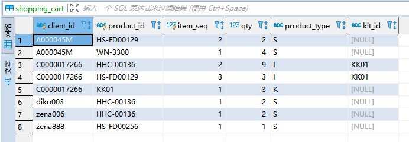

##### 销售订单业务

1. 首先需要选择或者自己填入一个下单的客户client，这个客户也许会有对应的折扣，这个在计算产品折扣的时候会用到
2. 选择买产品的渠道、对应的付款类型、**商店**、订单日期、送货类型（**这个涉及到运费问题，不同的送货类型，运行不一样**）、邮政编码、发送时间等、是否使用 乐本钱（可以用来抵扣一部分付款）
3. 记住产品是放在商店里面出售的，但是入库的时候是入库在仓库里面的（有对应的仓库管理和商店管理），产品入仓库则是在【销售订单-采购订单】模块进行采购具体的产品和到具体的仓库里面，则对应的仓库里已经有了产品。在这里就需要了解商店对应的仓库是哪一个，这个在【系统设定-商店设定】设置的，新增或者删除商店及添加对应的 storewarehouseMap 映射。仓库也有对应的管理模块【仓库设定】，产品则是在【系统设定-产品设定】设置。同样的【采购订单】也有对应的【采购订单状态】来进行管理和查看。

​	这里假如1号商店对应的1号仓库产品不足，2号仓库有的话，就可以通过【库存转移】转移产品到1号仓库中。

4. 到这就选好了基本的一些订单属性了，随后选择想下单的产品来下单，当选择产品以及数量之后，会查询这个产品满足的促销活动获得对应的下单折扣。【促销活动】模块的功能了。

这里保存下单之后订单是一个新建状态，还没有进行付款以及运送，付款运送之后这个订单也就完成了。在未运送、未付款的时候可以调整预留库存，**选择的产品有可能是这个仓库的不同批号的产品**。代码逻辑，选择产品的时候会根据对应的产品到inventory表中去查找数量大于0的这个产品的库存，设置到订单项里面用来查看这个产品使用了哪个批号（根据过期时间、编号、数量排序 升序，先使用时间最早的）

5. 预留库存的话是用来调整订单的数量，先预留出数量给这个订单。创建订单会创建订单的sales_order_hist和sales_order记录历史记录和当前订单，discount_item（和历史表），discount_item_match_detail（折扣的细节） ，misc_item，对应的历史表来记录操作历史
6. 废止订单相当于订单作废，相对应的创建订单设置的数据重更新设置回去，库存回填到对应的数据中去。

##### home端购物业务

产品、文章分为多个类别，可以在后端管理模块修改或添加类别选择产品加入购物车，购物车有一个数据库表shopping_cart来保存，加入购物车的时候会去获取这个产品对应的**促销活动**，会反应到结算页面，随后调用第三方支付接口进行支付，支付成功之后回调我们设置好的成功页面或者是失败页面或者是取消支付页面，取消支付之后可以重新进行支付。

**新创建的订单是属于 NEW 状态**，支付成功之后，第三方会保存这个订单编号的数据，我们系统每隔半小时，根据我们本地的订单数据查询72小时之内，5分钟之后的未支付的订单号，去查询第三方的关于这些订单编号的数据（是否已经支付），支付了的话，更新我们本地的订单编号里面的数据paid_amount字段，以及**新增一条支付数据到 gateway_payment 中**（是为了判断上面的那些本地查询出来的订单是否已经支付，支付了就不用再去查询了）。这样一条数据就能够在后端的订单状态那边看到了，后面可以进行其他的一些操作。

