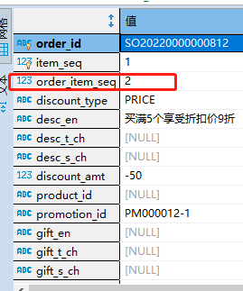
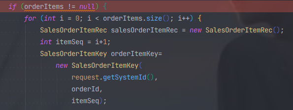
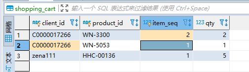

#### **项目中遇到的问题，怎样解决的**

#### **页面前端获取后端数据的时候，耗时比较长** 

具体情况：页面中的一个下拉框中显示的数据是通过访问后端获取的，点击的时候去获取数据的。但生产上出现了一个问题，就是点击下拉框 的时候，开始访问后端获取数据，前端页面耗时比较久，有时可能耗费10s才能拿到这些数据。但是这些数据又不是很多，就很奇怪。

##### **分析原因**：

1. 入手点先从这个查询数据的代码入手。发现查询逻辑并不复杂，只是简单的通过SQL语句进行查询数据的操作，然后再是整理数据返回前端。所以这里应该是没有什么问题的。

2. 分析SQL语句既然上面代码的逻辑上没有什么很多耗时的操作，那么是否是在查询数据库的时候耗费的时间比较长呢？继而分析SQL语句看。查看语句，语句也是简单的一个查询单表分页的语句，也没有很复杂的子查询以及各种连接在里面。将语句整理拷贝到数据库工具执行，发现有时执行快，有时执行慢。

3. 分析数据库方面的问题上面的项目里的数据库不是连的本地数据库，而是远程数据库。将语句放到本地数据库执行，执行很快；但是，将语句放到远程数据库时，执行却不是很稳定。

得出结论，远程数据库方面的问题。有可能有多个方面的问题。

- a：网络方面的问题也许网络此时不是特别好，连接查询就慢了

- b：数据库的压力查询数据库的连接情况，通过 show processlists 看到有十几个连接连着，想是不是连接池创建了多个连接，占用了资源的问题。kill 掉了一些连接后也没啥变化。

- c：查询缓存之类的...

- d：最后解决后面几天也关注这个问题，但是一直没有重现了。

说明：项目连接本地数据库的时候查询数据的速度是很快的。

#### **关于促销活动，满减，赠送的bug**

第一个问题：促销活动折扣细节和具体的下单项没有匹配上。促销活动是数量大于5个，价格折扣为10（这里是要具体的产品WN-5053，每个价格少10块）比如**先下单** **WN-5053** 产品，5个，不满足条件，没有折扣详情。此时下单order item列表

| 序号 | 产品    |
| ---- | ------- |
| 1    | WN-5053 |

然后再下单一个产品 WN-3300，5个，满足了促销活动（有具体的sql查询是否满足的），此时折扣详情是discount item



这里的order_item_seq 是2，此时是第二个订单项的折扣。此时，页面上从后端保存购物车产品的表里获取这个用户添加到购物车里的产品也是 ：

| 序号 | 产品    |
| ---- | ------- |
| 1    | WN-5053 |
| 2    | WN-3300 |

但是返回到前端时，页面上产品的顺序却是反了过来，变成了WN-3300先，WN-5053后。随后保存订单，后端处理数据，数据处理时，订单的item seq 是根据前端传递过来的 order items 循环（i+1，从0开始）生成的，



这就导致了保存到后端表里面的数据第一个 order item（产品 WN-3300） 的item seq是1（实际上这个产品是后下单的，item seq 是2才对），数据保存出错。结果保存变成了这样，**错误的结果**

| 序号 | 产品    |
| ---- | ------- |
| 1    | WN-3300 |
| 2    | WN-5053 |

最后导致到前端页面显示的时候，原本是WN-3300产品的促销活动，却显示到了WN-5053产品下面去了，显示是根据discount item的 order_item_seq 和 order_item的 item_seq 比较来的。

##### **为什么会导致这样呢？**

是返回到前端页面的产品顺序发生了改变，后添加的却跑到了先添加的前面去了。这就会导致保存的时候序号不一致。

那为什么顺序会发生改变呢？因为我们是添加到购物车里面去的，后端需要去购物车里面通过 sql 查询拿到购物车里面的数据。



这是表里面的数据，但是sql里面有按照product_id 进行分组，分组之后，默认会按照 product_id 进行排序操作，MySQL的group by 原理。

`SELECT sc.product_id ,sum(qty) FROM shopping_cart sc WHERE sc.client_id ="C00000017266" GROUP BY sc.product_id`

排完序之后在返回到前端页面就变成了 WN-3300 在前，WN-5053 在后，实际上顺序应该是按照表的item seq 来。

##### 解决问题

在语句后面添加 `ORDER **BY** sc.item_seq;` 之后就按照正常添加的顺序返回到前端了，也就解决了这个问题。（sql不是我写的，这是一个bug然后修复了）。

##### **总结：**

这里是MySQL的一个隐藏的知识点，导致数据出现了问题。

#### 报表难点

父子报表之间传值与返回值、中文不显示、excel未对齐、数据换行、


#### 使用Disruptor进行订单事件的分发、使用ReentrantLock、事务控制订单的并发

#### 使用CompletableFuture异步任务优化接口速度

在一个查询产品详情页的接口里面，有多类数据需要返回，如产品详细信息、产品满足的促销活动、产品的评论、所属的类别、库存查询、产品推荐等。

其中的一些接口是没有数据的依赖关系的，经分析是可以并发进行的，然后想到了使用CompletableFuture异步任务组合的方式，使用CompletableFuture.allOf(future1,future2)进行一个任务的并行操作，使用多线程去处理，处理完成之后返回给前端。

详情页接口：getCombineProductInfo 

慢一点的接口： getWebCategoryProduct


#### 下单sql优化

inventory 库存表，原始建表语句

```mysql
CREATE TABLE `inventory` (
  `inventory_id` varchar(50) COLLATE utf8mb4_bin NOT NULL,
  `warehouse_id` varchar(50) COLLATE utf8mb4_bin DEFAULT NULL,
  `shipment_id` varchar(50) COLLATE utf8mb4_bin DEFAULT NULL,
  `status` varchar(1) COLLATE utf8mb4_bin NOT NULL DEFAULT 'A' COMMENT 'A-Active, C-CLosed, S-Suspended',
  `received_date` date NOT NULL,
  `expiry_date` date DEFAULT NULL,
  `product_id` varchar(50) COLLATE utf8mb4_bin NOT NULL,
  `location_id` varchar(50) COLLATE utf8mb4_bin DEFAULT NULL,
  `lot_id` varchar(50) COLLATE utf8mb4_bin DEFAULT NULL,
  `cost_price` decimal(38,10) DEFAULT NULL,
  `cost_base_ccy` decimal(38,10) DEFAULT NULL,
  `qty_qoh` decimal(38,10) DEFAULT NULL,
  `qty_atp` decimal(38,10) DEFAULT NULL,
  `created_by` varchar(50) COLLATE utf8mb4_bin DEFAULT NULL,
  `created_date` datetime DEFAULT NULL,
  `lastupdated_by` varchar(50) COLLATE utf8mb4_bin DEFAULT NULL,
  `lastupdated_date` datetime DEFAULT NULL,
  PRIMARY KEY (`inventory_id`),
  KEY `warehouse_id` (`warehouse_id`,`product_id`)
) ENGINE=InnoDB DEFAULT CHARSET=utf8mb4 COLLATE=utf8mb4_bin
```

在product_id字段上添加索引，加快sql查询时间

```mysql
PRIMARY KEY (`inventory_id`),
KEY `warehouse_id` (`warehouse_id`,`product_id`),
INDEX `idx_inventory_product_id` (`product_id`), -- 新加索引
```

订单表 sales_order，原始建表语句

```mysql
CREATE TABLE `sales_order` (
  `order_id` varchar(50) COLLATE utf8mb4_bin NOT NULL,
  `order_seq` int(11) DEFAULT NULL,
  `parent_id` varchar(50) COLLATE utf8mb4_bin DEFAULT NULL,
  `client_id` varchar(50) COLLATE utf8mb4_bin DEFAULT NULL,
  `manufacturer_id` varchar(50) COLLATE utf8mb4_bin DEFAULT NULL,
  `account_id` varchar(50) COLLATE utf8mb4_bin DEFAULT NULL,
  `store_id` varchar(50) COLLATE utf8mb4_bin DEFAULT NULL,
  `warehouse_id` varchar(50) COLLATE utf8mb4_bin DEFAULT NULL,
  `order_side` varchar(5) COLLATE utf8mb4_bin DEFAULT NULL,
  `order_date` date NOT NULL,
  `ship_id` varchar(50) COLLATE utf8mb4_bin DEFAULT NULL,
  `payment_id` varchar(50) COLLATE utf8mb4_bin DEFAULT NULL,
  `ship_date` date DEFAULT NULL,
  `target_ship_date` date DEFAULT NULL,
  `target_ship_period` varchar(50) COLLATE utf8mb4_bin DEFAULT NULL,
  `pay_date` date DEFAULT NULL,
  `start_pay_time` datetime DEFAULT NULL,
  `ship_method` varchar(10) COLLATE utf8mb4_bin DEFAULT NULL,
  `ship_contact` varchar(80) COLLATE utf8mb4_bin DEFAULT NULL,
  `ship_phone` varchar(50) COLLATE utf8mb4_bin DEFAULT NULL,
  `ship_address` text COLLATE utf8mb4_bin,
  `ship_area` varchar(50) COLLATE utf8mb4_bin DEFAULT NULL,
  `ship_postal_code` varchar(50) COLLATE utf8mb4_bin DEFAULT NULL,
  `ship_country` varchar(50) COLLATE utf8mb4_bin DEFAULT NULL,
  `ship_remarks` varchar(200) COLLATE utf8mb4_bin DEFAULT NULL,
  `remarks` varchar(200) COLLATE utf8mb4_bin DEFAULT NULL,
  `status` varchar(5) COLLATE utf8mb4_bin NOT NULL DEFAULT 'A' COMMENT 'A-Active, D-Deleted, S-Suspended',
  `channel` varchar(5) COLLATE utf8mb4_bin DEFAULT NULL,
  `referral_by` varchar(200) COLLATE utf8mb4_bin DEFAULT NULL COMMENT 'Recommend AE',
  `pay_method` varchar(20) COLLATE utf8mb4_bin NOT NULL,
  `sub_total` decimal(38,10) DEFAULT NULL,
  `adjustment` decimal(38,10) DEFAULT NULL,
  `grand_total` decimal(38,10) DEFAULT NULL,
  `bonus_used` decimal(38,10) DEFAULT NULL,
  `ship_charges` decimal(38,10) DEFAULT NULL,
  `pay_amount` decimal(38,10) DEFAULT NULL,
  `paid_amount` decimal(38,10) DEFAULT NULL,
  `total_cost` decimal(38,10) DEFAULT NULL,
  `total_weight` decimal(38,10) DEFAULT NULL,
  `total_cbm` decimal(38,10) DEFAULT NULL,
  `ccy` varchar(3) COLLATE utf8mb4_bin DEFAULT NULL,
  `ex_rate` decimal(38,10) DEFAULT NULL,
  `bonus_earned` decimal(38,10) DEFAULT NULL,
  `total_return_amt` decimal(38,10) DEFAULT NULL,
  `bonus_returned` decimal(38,10) DEFAULT NULL,
  `skip_bonus` tinyint(1) DEFAULT '0',
  `skip_promotion` tinyint(1) DEFAULT '0',
  `checked_use_bonus` varchar(1) COLLATE utf8mb4_bin DEFAULT 'N' COMMENT 'Y-Checked Bonus Used;N-Unchecked Bonus Used',
  `bonus_estimated` varchar(50) COLLATE utf8mb4_bin DEFAULT NULL,
  `created_by` varchar(50) COLLATE utf8mb4_bin DEFAULT NULL,
  `created_date` datetime DEFAULT NULL,
  `lastupdated_by` varchar(50) COLLATE utf8mb4_bin DEFAULT NULL,
  `lastupdated_date` datetime DEFAULT NULL,
  `assigned_client_type` varchar(1) COLLATE utf8mb4_bin DEFAULT NULL,
  `is_bonus_settled` varchar(5) COLLATE utf8mb4_bin DEFAULT NULL,
  `bonus_used_returned` decimal(38,10) DEFAULT NULL,
  `pay_fail` bit(1) DEFAULT NULL,
  `received_date` date DEFAULT NULL,
  `close_date` date DEFAULT NULL,
  PRIMARY KEY (`order_id`),
  KEY `index_order` (`parent_id`)
) ENGINE=InnoDB DEFAULT CHARSET=utf8mb4 COLLATE=utf8mb4_bin
```

经过判断，client_id 字段是经常查询的字段，所以添加索引。

```mysql
INDEX `client_id_index` (`client_id`),
```


#### 使用 redis 的 Redisson 优化多个系统下单问题

redis 使用 一主二从部署，并部署3个哨兵实例，用来监控redis，选举主节点、通知redis实例。

