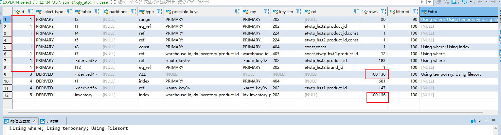
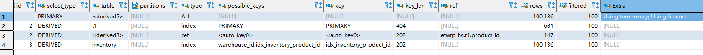
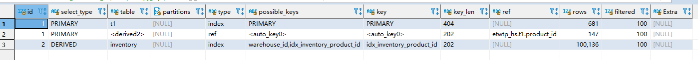
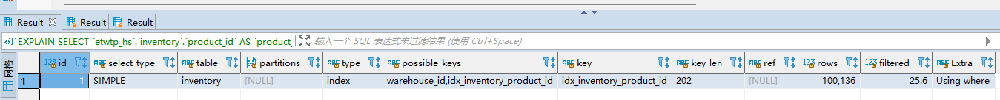
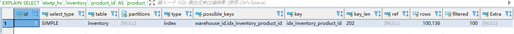

#### [没大项目经验，哪里冒出来的项目亮点？](https://juejin.cn/post/7290021456879484991)

#### **项目中遇到的问题，怎样解决的**

[大厂面试官问你，在项目中遇到了什么问题？怎么解决的？ - 掘金 (juejin.cn)](https://juejin.cn/post/7028191820009963533)

首先你在面试之前需要就你项目过程当中的一些问题去提炼一些难解决的一个点。

什么样的问题是难解决的？常见问题、偏门问题、正常问题以及踩坑问题

因此就我个人的经验来说，你需要准备的是**一些常见的、但是有一定技术深度的一些互联网专用的一个问题**。

对于这种样子的情况，其实也没有一个标准的答案，一定是说哪个更好，而是更多的是说你对应的这个问题的技术深度，以及解决问题、思考问题的一个手段，是否达到了面试官对你这个岗位的要求。

#### **页面前端获取后端数据的时候，耗时比较长** 

具体情况：页面中的一个下拉框中显示的数据是通过访问后端获取的，点击的时候去获取数据的。但生产上出现了一个问题，就是点击下拉框 的时候，开始访问后端获取数据，前端页面耗时比较久，有时可能耗费10s才能拿到这些数据。但是这些数据又不是很多，就很奇怪。

##### 分析原因

1. 入手点先从这个查询数据的代码入手。发现查询逻辑并不复杂，只是简单的通过SQL语句进行查询数据的操作，然后再是整理数据返回前端。所以这里应该是没有什么问题的。

2. 分析SQL语句既然上面代码的逻辑上没有什么很多耗时的操作，那么是否是在查询数据库的时候耗费的时间比较长呢？继而分析SQL语句看。查看语句，语句也是简单的一个查询单表分页的语句，也没有很复杂的子查询以及各种连接在里面。将语句整理拷贝到数据库工具执行，发现有时执行快，有时执行慢。

3. 分析数据库方面的问题上面的项目里的数据库不是连的本地数据库，而是远程数据库。将语句放到本地数据库执行，执行很快；但是，将语句放到远程数据库时，执行却不是很稳定。

得出结论，远程数据库方面的问题。有可能有多个方面的问题。

- a：网络方面的问题也许网络此时不是特别好，连接查询就慢了

- b：数据库的压力查询数据库的连接情况，通过 show processlists 看到有十几个连接连着，想是不是连接池创建了多个连接，占用了资源的问题。kill 掉了一些连接后也没啥变化。

- c：查询缓存之类的...

- d：最后解决后面几天也关注这个问题，但是一直没有重现了。

说明：项目连接本地数据库的时候查询数据的速度是很快的。

#### sql的优化过程分析

首先是接口需要控制运行速度在800ms内，该接口中sql查询语句的一个查询占用时间不是很确定，从200-500ms都可能有，查看sql语句的执行计划。

```mysql
EXPLAIN 
select t1.*,t2.*,t4.*,t5.*,
sum(t7.qty_atp), 
1 , 
case when (case when sum(t7.qty_atp) is null then v.kit_atp else (sum(t7.qty_atp) + COALESCE(v.kit_atp,0)) end) > 0 then 1 else 0 end as inventoryAtp,
t12.*  
from web_product t1  
left join product t2 on t1.product_id = t2.product_id  
left join product_price t4 on t1.product_id = t4.product_id and t4.price_type = 'L' 
left join product_price t5 on t1.product_id = t5.product_id and t5.price_type = 'M' 
left join inventory t7 on t1.product_id = t7.product_id and t2.product_type != 'K' 
and t7.warehouse_id = '2' and t7.status = 'A' and t7.warehouse_id in(select t8.warehouse_id from store_warehouse_map t8 where t8.store_id = 'S00001')  
left join kit_product_qtp_view v on t1.product_id = v.kit_id and t2.product_type = 'K'  
left join brand t12 on t2.brand_id = t12.brand_id   
where t2.status != 'S'  and t1.product_id in  ('WN-07968', 'HS-FD00050', 'HS-FD00038', 'HS-FD00072', 'HS-FD00252', 'HS-FD00199', 
'HS-FD00069', 'HS-FD00254', 'HS-FD00062', 'HS-FD00074', 'HS-FD00222', 'HS-FD00256', 'HS-FD00221', 'HS-FD00278', 'HHC-0285', 
'SD-0800001', 'MR-0800001', 'WN-3827', 'WN-07454', 'WN-3043', 'MR-0800002', 'WN-07461', 'WN-3844', 'WN-07970', 'WN-07471', 
'WN-07477', 'WN-07512', 'WN-07442', 'WN-07460', 'WN-3820') 
group by t1.product_id  
order by FIELD(t1.product_id,'WN-07968', 'HS-FD00050', 'HS-FD00038', 'HS-FD00072', 'HS-FD00252', 'HS-FD00199', 'HS-FD00069',
'HS-FD00254', 'HS-FD00062', 'HS-FD00074', 'HS-FD00222', 'HS-FD00256', 'HS-FD00221', 'HS-FD00278', 'HHC-0285', 'SD-0800001', 
'MR-0800001', 'WN-3827', 'WN-07454', 'WN-3043', 'MR-0800002', 'WN-07461', 'WN-3844', 'WN-07970', 'WN-07471', 'WN-07477', 
'WN-07512', 'WN-07442', 'WN-07460', 'WN-3820' );
```

首先声明其中一些点：web_product 中数据为734，product_id 是主键索引；product_price 数据 2166，RIMARY KEY (product_id,price_type,ccy)  是主键索引；inventory  101280，索引如下

```mysql
  PRIMARY KEY (`inventory_id`),
  KEY `warehouse_id` (`warehouse_id`,`product_id`),
  KEY `idx_inventory_product_id` (`product_id`)
```

kit_product_qtp_view 是一个视图 89行，数据不会很多（这个是针对单视图搜索）；

```mysql
SELECT
    `ktipdinventory`.`kit_id` AS `kit_id`,
    min(`ktipdinventory`.`kitAtp`) AS `kit_atp`
FROM
    (SELECT
        `t1`.`kit_id` AS `kit_id`, sum(`t2`.`qty_atp`) AS `sumAtp`, `t1`.`qty` AS `kitQty`,(sum(`t2`.`qty_atp`) DIV `t1`.`qty`) AS `kitAtp`
    FROM
        `etwtp_hs`.`product_kit` `t1`
    LEFT JOIN (
        SELECT
            `etwtp_hs`.`inventory`.`product_id` AS `product_id`,
            sum(`etwtp_hs`.`inventory`.`qty_atp`) AS `qty_atp`
        FROM
            `etwtp_hs`.`inventory`
        GROUP BY
            `etwtp_hs`.`inventory`.`product_id`) `t2` ON `t1`.`product_id` = `t2`.`product_id`
    GROUP BY
        `t1`.`kit_id`, `t1`.`product_id`) `ktipdinventory`
GROUP BY
    `ktipdinventory`.`kit_id`
HAVING
    min(`ktipdinventory`.`kitAtp`) > 0;
```

brand 8行，brand_id是主键索引；store_warehouse_map 56行，PRIMARY KEY (`store_id`,`warehouse_id`) 是主键索引，执行计划如下：



能够看到有两个关于inventory的链表查询是**全表**扫描来的，这里要重点分析。

- 对于id列，相同的是连接查询，前面的驱动表，后面的是被驱动表，上面1-8行都是相同的id。
- 对于select_type列，**对于采用物化的方式执行的包含派生表的查询是 DERIVED**，物化表是不相关子查询的一个优化，是一个临时表。
- 对于table列，<derived> 的显示是 对于物化表的一个单表查询方式，表示**该查询是针对将派生表物化之后的表进行查询的**。
- 对于type列，是单表访问的方法，我们这里需要重点关注 all（全表扫描）的单表查询

当然，上面是多个表的一个连表查询。看到有8行id为1的，上面我们连了7个表，但是在我们连表查询里面有一个不相关的子查询 `select t8.warehouse_id from store_warehouse_map t8 where t8.store_id = 'S00001'`，可以看到有一个table是t8，也就是t8和t7会被优化为连接查询。其中还有一个id为1的table是 derived3，应该是视图所代表的表。

##### ref 列分析

**当使用索引列等值匹配的条件去执行查询时，也就是在访问方法是 const 、 eq_ref 、 ref 、 ref_or_null 、unique_subquery 、 index_subquery 其中之一时， ref 列展示的就是与索引列作等值匹配的东东是个啥**。

##### type 列分析

能够看到这些连表查询在单表访问上都是用上了索引的：

- range：普通的二级索引列上的范围查询
- eq_ref：连表查询时候的二级索引查询
- ref：普通的二级索引列与常量进行等值匹配时来查询某个表
- const：对主键索引或者是唯一二级索引的等值匹配

##### 问题分析

但是在下面的查询上却有all。我们通过数据量知道，这些连接查询中数据量大的是inventory表 t7，查看连接查询中的t7的访问，可以看到t8（是和前面的表结果一起作为了驱动表）和t7（被驱动表），t7的查询是ref，用的索引key列是 warehouse_id，具体的匹配的是 ref是 const,etwtp_hs.t2.product_id 。这里查询的是t8和t7的连表查询的一个结果，也就是满足 warehouse_id in (select t8.warehouse_id from store_warehouse_map t8 where t8.store_id = 'S00001') 的 inventory表记录。

至于上面连表太多了，拆分出来上面数据量多的连表查询看看：去掉了其他的一些表，查看执行计划，看是否有all查询。

```mysql
EXPLAIN 
select t1.*,t2.*,
sum(t7.qty_atp), 
1 , 
case when (case when sum(t7.qty_atp) is null then v.kit_atp else (sum(t7.qty_atp) + COALESCE(v.kit_atp,0)) end) > 0 then 1 else 0 end as inventoryAtp
from web_product t1  
left join product t2 on t1.product_id = t2.product_id  
left join inventory t7 on t1.product_id = t7.product_id and t2.product_type != 'K' 
and t7.warehouse_id = '2' and t7.status = 'A' and t7.warehouse_id in(select t8.warehouse_id from store_warehouse_map t8 where t8.store_id = 'S00001')  
left join kit_product_qtp_view v on t1.product_id = v.kit_id and t2.product_type = 'K' 
where t2.status != 'S'  and t1.product_id in  ('WN-07968', 'HS-FD00050', 'HS-FD00038', 'HS-FD00072', 'HS-FD00252', 'HS-FD00199', 
'HS-FD00069', 'HS-FD00254', 'HS-FD00062', 'HS-FD00074', 'HS-FD00222', 'HS-FD00256', 'HS-FD00221', 'HS-FD00278', 'HHC-0285', 
'SD-0800001', 'MR-0800001', 'WN-3827', 'WN-07454', 'WN-3043', 'MR-0800002', 'WN-07461', 'WN-3844', 'WN-07970', 'WN-07471', 
'WN-07477', 'WN-07512', 'WN-07442', 'WN-07460', 'WN-3820') 
group by t1.product_id  
order by FIELD(t1.product_id,'WN-07968', 'HS-FD00050', 'HS-FD00038', 'HS-FD00072', 'HS-FD00252', 'HS-FD00199', 'HS-FD00069',
'HS-FD00254', 'HS-FD00062', 'HS-FD00074', 'HS-FD00222', 'HS-FD00256', 'HS-FD00221', 'HS-FD00278', 'HHC-0285', 'SD-0800001', 
'MR-0800001', 'WN-3827', 'WN-07454', 'WN-3043', 'MR-0800002', 'WN-07461', 'WN-3844', 'WN-07970', 'WN-07471', 'WN-07477', 
'WN-07512', 'WN-07442', 'WN-07460', 'WN-3820' );
```

执行计划如下：同样，仍然有查询的单表rows预估有100136，这个数据量只有inventory表有，所以我们可以分析这个简化一点的sql查询了，还可以看到这里t7 里的子查询t8，也是被优化成了连表查询了。


两次的出现是哪里呢？目前表中只有一个inventory，但是有一个视图，视图也是查询inventory表而得到的数据，猜测是这个视图是全表扫描了inventory表。

分析视图的执行计划，上面给出了视图的sql语句，对inventory做了全表扫描，然后对product_id分组后，连表查询。



可以看到对inventory表的查询也就是第4行记录用了索引遍历的方式，因为我们的product_id是有索引的，这是一个物化表的子查询，第2、3行记录是表t1和物化表连表查询的方式，t1表用的是primary索引，物化表则使用了ref，二级索引等值匹配，匹配的值是t1.product_id的值。但是第一行是一个全表扫描有点不明白，但继续拆分sql，

```mysql
   EXPLAIN
   SELECT
        `t1`.`kit_id` AS `kit_id`, sum(`t2`.`qty_atp`) AS `sumAtp`, `t1`.`qty` AS `kitQty`,(sum(`t2`.`qty_atp`) DIV `t1`.`qty`) AS `kitAtp`
    FROM
        `etwtp_hs`.`product_kit` `t1`
    LEFT JOIN (
        SELECT
            `etwtp_hs`.`inventory`.`product_id` AS `product_id`,
            sum(`etwtp_hs`.`inventory`.`qty_atp`) AS `qty_atp`
        FROM
            `etwtp_hs`.`inventory`
        GROUP BY
            `etwtp_hs`.`inventory`.`product_id`) `t2` ON `t1`.`product_id` = `t2`.`product_id`
    GROUP BY
        `t1`.`kit_id`, `t1`.`product_id`;
```

这个执行计划和我们上面看到的第2、3、4行几乎是一致的，所以对于上面的第一行则是对这个表做一个访问。



其实上面7-9行的一个记录就是和上面未拆分视图的一样，貌似是因为这个导致执行可能慢了，因为是查询了所有的记录，虽然有索引可以用上。

##### 结论

最后发现这个接口的sql查询，最后并没有用上这个表的查询结果，可以去掉。但是如果有用上该怎么优化呢？

- 视图里面可以传参数吗？--- 不能传递参数，存储过程或函数才可以，对全表查询的加上product_id的条件后再分组。
- 要不将hibernate的映射改成原生sql，就可以针对如果有对inventory表的全表扫描的时候，可以加上product_id的条件，先过滤，然后在进行一个映射操作，但是这个映射可能也会耗时，还可能没有框架快。这里还可以查询出主键id，然后通过主键去查找需要很多字段的一个查询，如果是用的mybatis的话，它会帮我们映射。

加了where条件

```mysql
SELECT
    `etwtp_hs`.`inventory`.`product_id` AS `product_id`,
    sum(`etwtp_hs`.`inventory`.`qty_atp`) AS `qty_atp`
FROM
    `etwtp_hs`.`inventory`
	WHERE product_id in  ('WN-07968', 'HS-FD00050', 'HS-FD00038', 'HS-FD00072', 'HS-FD00252', 'HS-FD00199', 
'HS-FD00069', 'HS-FD00254', 'HS-FD00062', 'HS-FD00074', 'HS-FD00222', 'HS-FD00256', 'HS-FD00221', 'HS-FD00278', 'HHC-0285', 
'SD-0800001', 'MR-0800001', 'WN-3827', 'WN-07454', 'WN-3043', 'MR-0800002', 'WN-07461', 'WN-3844', 'WN-07970', 'WN-07471', 
'WN-07477', 'WN-07512', 'WN-07442', 'WN-07460', 'WN-3820')
GROUP BY
    `etwtp_hs`.`inventory`.`product_id`;
    -- 耗时60ms内
```

执行计划：这里的是25.6%，type是index，是代表了用了索引遍历的方式去访问的单表。



没有加where条件

```mysql
    SELECT
            `etwtp_hs`.`inventory`.`product_id` AS `product_id`,
            sum(`etwtp_hs`.`inventory`.`qty_atp`) AS `qty_atp`
        FROM
            `etwtp_hs`.`inventory`
        GROUP BY
            `etwtp_hs`.`inventory`.`product_id`;
   -- 多次查询耗时差不多都是150ms-300ms
```

执行计划，能看到filtered这里是100%




#### **关于促销活动，满减，赠送的bug**

第一个问题：促销活动折扣细节和具体的下单项没有匹配上。促销活动是数量大于5个，价格折扣为10（这里是要具体的产品WN-5053，每个价格少10块）比如**先下单** **WN-5053** 产品，5个，不满足条件，没有折扣详情。此时下单order item列表

| 序号 | 产品    |
| ---- | ------- |
| 1    | WN-5053 |

然后再下单一个产品 WN-3300，5个，满足了促销活动（有具体的sql查询是否满足的），此时折扣详情是discount item


这里的order_item_seq 是2，此时是第二个订单项的折扣。此时，页面上从后端保存购物车产品的表里获取这个用户添加到购物车里的产品也是 ：

| 序号 | 产品    |
| ---- | ------- |
| 1    | WN-5053 |
| 2    | WN-3300 |

但是返回到前端时，页面上产品的顺序却是反了过来，变成了WN-3300先，WN-5053后。随后保存订单，后端处理数据，数据处理时，订单的item seq 是根据前端传递过来的 order items 循环（i+1，从0开始）生成的，


这就导致了保存到后端表里面的数据第一个 order item（产品 WN-3300） 的item seq是1（实际上这个产品是后下单的，item seq 是2才对），数据保存出错。结果保存变成了这样，**错误的结果**

| 序号 | 产品    |
| ---- | ------- |
| 1    | WN-3300 |
| 2    | WN-5053 |

最后导致到前端页面显示的时候，原本是WN-3300产品的促销活动，却显示到了WN-5053产品下面去了，显示是根据discount item的 order_item_seq 和 order_item的 item_seq 比较来的。

##### **为什么会导致这样呢？**

是返回到前端页面的产品顺序发生了改变，后添加的却跑到了先添加的前面去了。这就会导致保存的时候序号不一致。

那为什么顺序会发生改变呢？因为我们是添加到购物车里面去的，后端需要去购物车里面通过 sql 查询拿到购物车里面的数据。


这是表里面的数据，但是sql里面有按照product_id 进行分组，分组之后，默认会按照 product_id 进行排序操作，MySQL的group by 原理。

`SELECT sc.product_id ,sum(qty) FROM shopping_cart sc WHERE sc.client_id ="C00000017266" GROUP BY sc.product_id`

排完序之后在返回到前端页面就变成了 WN-3300 在前，WN-5053 在后，实际上顺序应该是按照表的item seq 来。

##### 解决问题

在语句后面添加 `ORDER BY sc.item_seq;` 之后就按照正常添加的顺序返回到前端了，也就解决了这个问题。（sql不是我写的，这是一个bug然后修复了）。

##### 总结

这里是MySQL的一个隐藏的知识点，导致数据出现了问题。

#### 报表难点

父子报表之间传值与返回值、中文不显示、excel未对齐、数据换行、字段写错而编译导出报错等。


#### 使用Disruptor进行订单事件的分发、使用ReentrantLock、事务控制订单的并发

##### Disruptor 的队列，订单事件的分发

```java
private Disruptor<SalesOrderMessageEvent> disruptor;
private RingBuffer<SalesOrderMessageEvent> ringBuffer;
private static int queueSize = 512;
private int workerCount = 50;
// 事件的处理
private EventHandler<SalesOrderMessageEvent> handler =  new SalesOrderMessageEventHandler();;
private int responseTimeoutTime = 90_000;
private SalesOrderEventProcessor[] processors = new SalesOrderEventProcessor[workerCount];

...
// 在系统启动的时候会对上面的属性进行初始化
    public void start() throws Exception {
    disruptor = new Disruptor<>(() -> {
        return new SalesOrderMessageEvent();
    }, queueSize, Executors.defaultThreadFactory());
    for (int j = 0; j < workerCount; j++) {
        processors[j] = new SalesOrderEventProcessor();
    }//Asynchronous processing with multiple processors
	// 对事件进行处理和分发
    disruptor.handleEventsWith(handler);//Simultaneous processing of single processors
    //disruptor.handleEventsWithWorkerPool(processors);//Asynchronous processing with multiple processors

    ringBuffer = disruptor.start();

    modInventoryService = Executors.newCachedThreadPool();

    log.info("Init disruptor of with size {}", queueSize);
    setReady(true);

    checkUnpaidOrder();
}
```

SalesOrderMessageEventHandler

```java
public class SalesOrderMessageEventHandler implements EventHandler<SalesOrderMessageEvent> {

    private static Logger log = LoggerFactory.getLogger(SalesOrderMessageEventHandler.class);
    
    @Override
    public void onEvent(SalesOrderMessageEvent event, long sequence, boolean endOfBatch) throws Exception {
        
        SalesOrderMessage message = event.getSalesOrderMessage();
        
        log.info("message type = <{}>", message.getMessageType());
        
        ResponseProcessor<SalesOrderMessage> processor = new SalesOrderCallbackProcessor(); 
        try {
            if (MessageType.CreatSalesOrder.equals(message.getMessageType())) {
                SalesOrderResponse response = SalesService.getInstance().createSalesOrder(message.getRequest());

                log.info("CreatSalesOrder SalesOrder response = <{}>", response);
                if (processor != null) {
                    processor.process(GsonBuilder.create2().toJson(response), event);
                }
            } else if (MessageType.ModifySalesOrder.equals(message.getMessageType())) {
                SalesOrderResponse response = SalesService.getInstance().modSalesOrder(message.getRequest());

                log.info("ModifySalesOrder SalesOrder response = <{}>", response);
                if (processor != null) {
                    processor.process(GsonBuilder.create2().toJson(response), event);
                }
            } else if (MessageType.CancelSalesOrder.equals(message.getMessageType())) {
                SalesOrderResponse response = SalesService.getInstance().cancelOrder(message.getRequest());

                log.info("CancelOrder SalesOrder response = <{}>", response);
                if (processor != null) {
                    processor.process(GsonBuilder.create2().toJson(response), event);
                }
            } else if (MessageType.ShipSalesOrder.equals(message.getMessageType())) {
                SalesOrderResponse response = SalesService.getInstance().shipOrder(message.getRequest());

                log.info("ShipSalesOrder SalesOrder response = <{}>", response);
                if (processor != null) {
                    processor.process(GsonBuilder.create2().toJson(response), event);
                }
            } else if (MessageType.PaySalesOrder.equals(message.getMessageType())) {
                SalesOrderResponse response = SalesService.getInstance().payOrder(message.getRequest());

                log.info("PaySalesOrder SalesOrder response = <{}>", response);
                if (processor != null) {
                    processor.process(GsonBuilder.create2().toJson(response), event);
                }
            } else if (MessageType.VoidSalesOrder.equals(message.getMessageType())) {
                SalesOrderResponse response = SalesService.getInstance().voidOrder(message.getRequest());

                log.info("VoidSalesOrder SalesOrder response = <{}>", response);
                if (processor != null) {
                    processor.process(GsonBuilder.create2().toJson(response), event);
                }
            }
        }
        catch (Exception ex) {
            log.error("Exception in handling sales order message, seq : {}", sequence, ex);
           if (processor != null)
                processor.failed(ex, event);
        }
        finally {
            event.reset();
        }
    }
}
```

前端订单的相关操作会将操作作为一个事件发布到ringbuffer中

```java
// 例如：这里是一个修改订单的操作
SalesOrderMessage message =new SalesOrderMessage(MessageType.ModifySalesOrder);
message.setRequest(request);

String result  = SalesService.getInstance().publishEventAndReceive(message);

return GsonBuilder.create2().fromJson(result, SalesOrderResponse.class);

public String publishEventAndReceive(SalesOrderMessage message) {
    // 取下一个可用的序号
    long seq = ringBuffer.next();
    AsyncFuture future = new DefaultAsyncFuture();
    message.setSleeper(future);
    try {
        // 获取到对象，设置传递的message
        SalesOrderMessageEvent event = ringBuffer.get(seq);
        event.reset();
        event.setSalesOrderMessage(message);
    }
    catch (Exception ex) {
        log.error("Exception in publish sales order event, seq : {}. - {}", seq, ex);
    }
    finally {
        // 发布到环形对列中去
        ringBuffer.publish(seq);
    }
    return future.get(responseTimeoutTime);
}
```

lock工具类

```java
package com.etwealth.mo.server.fundtransaction;

import java.io.IOException;
import java.io.InputStreamReader;
import java.nio.charset.StandardCharsets;
import java.util.Arrays;
import java.util.List;
import java.util.Properties;
import java.util.concurrent.TimeUnit;
import java.util.stream.Collectors;

import com.etwealth.mo.server.fundtransaction.imp.ReentryLocker;
import org.redisson.Redisson;
import org.redisson.api.RLock;
import org.redisson.api.RedissonClient;
import org.redisson.config.Config;

public class LockerUtil {

    private static Locker locker = new ReentryLocker();

    private static int DEFAULTTIMEOUT = 30;

    public static volatile RedissonClient redisson;
    public static Properties properties = new Properties();
    static {
        try {
            properties.load(
                new InputStreamReader(
                    LockerUtil.class.getResourceAsStream("/com/etwealth/mo/server/app.properties"),
                    StandardCharsets.UTF_8));
        }
        catch (IOException e) {
            e.printStackTrace();
        }
    }

    public static boolean lock(Object... obj) throws InterruptedException {
        return locker.tryLock(DEFAULTTIMEOUT, TimeUnit.SECONDS, (Object[]) obj);
    }

    public static void unLock(Object... obj) {
        try {
            List<Object> unLockList = Arrays.asList((Object[]) obj).stream().distinct().collect(Collectors.toList());
            locker.unLock(unLockList.toArray(new Object[unLockList.size()]));
        }
        catch (Exception e) {
            //ignore.
        }
    }
// redisson 相关
    public static RLock getRedissonLock(String lockKey) {
        return getRedissonClient().getLock(lockKey);
    }

    public static boolean redissonTryLock(RLock rLock) throws Exception {
        int maxWaitSeconds = Integer.parseInt(properties.getProperty("app.redisson.maxWaitSeconds"));
        int maxHoldLockSeconds = Integer.parseInt(properties.getProperty("app.redisson.maxHoldSeconds"));
        return rLock.tryLock(maxWaitSeconds, maxHoldLockSeconds, TimeUnit.SECONDS);
    }

    public static void redissonUnLock(RLock rLock) throws Exception{
        rLock.unlock();
    }

    public static RedissonClient getRedissonClient() {
        if (redisson == null) {
            synchronized (LockerUtil.class) {
                if (redisson == null) {
                    String redisMasterURL = properties.getProperty("app.redisson.master.sentinel");
                    String redisSlaveURL = properties.getProperty("app.redisson.slave.sentinel");
                    String redisPass = properties.getProperty("app.redisson.password");
                    String redisMasterName = properties.getProperty("app.redisson.master.name");
                    Config redissonConfig = new Config();
                    redissonConfig.useSentinelServers().addSentinelAddress(redisMasterURL, redisSlaveURL, "127.0.0.1:26382")
                            .setMasterName(redisMasterName).setPassword(redisPass);
                    redisson = Redisson.create(redissonConfig);
                }
            }
        }
        return redisson;
    }

    public static void main(String[] args) throws InterruptedException {
        RLock lock = getRedissonLock("productId:001");
        System.out.println(lock);
        boolean b = lock.tryLock(10, 10, TimeUnit.SECONDS);
        System.out.println("lock1 success!b1:" + b);
        boolean b3 = lock.tryLock(10, 10, TimeUnit.SECONDS);
        System.out.println("lock1 success!b3:" + b3);
        RLock lock2 = getRedissonLock( "productId:001");
        System.out.println(lock2);
        boolean b1 = lock2.tryLock(10, 10, TimeUnit.SECONDS);
        System.out.println("lock2 success!b2:" + b1);
        TimeUnit.SECONDS.sleep(10);
        lock.unlock();
        System.out.println("lock1 unlock!");
        lock2.unlock();
        System.out.println("lock2 unlock!");
    }
}
```

##### 使用Redisson控制订单的并发问题

这里有一个注意点：需要对订单id进行加锁处理。在后面的更新修改版本中，有关于订单的操作，取消、创建、修改、废止订单的操作都使用 Redisson 进行了一个分布式的加锁操作。因为有两三个服务器，这时jvm的加锁已经不再适用了。还有一个点，订单的相关操作都放到了

- 创建订单

```java
...
clientRedissonLock = LockerUtil.getRedissonLock("clientId-"+order.getClientId());
locked = LockerUtil.redissonTryLock(clientRedissonLock);
if (!locked) {
   throw new RuntimeException(
         "cannot redisson lock for place order:" + order.getClientId());
}
         //check create new order time
         if (checkOrderChanged(request.getSystemId(), order.getClientId(), order.getCreateNewOrderTime(), null)) {
             response.setReturnCode(ErrorCode.ClientOrderChanged);
             return response;
         }
```

在这里首先是**对这个客户进行了一个加锁操作**，相当于在多个环境下，该客户只能在同一时刻创建一个订单。**随后，在对产品的库存做修改的时候也使用了Redisson来控制库存的并发安全**。

```java
// 获取需要修改库存的所有产品，对它们都加锁处理。
List<String> productIdList =
                orderItems.stream().map(SalesOrderItem::getProductId).collect(Collectors.toList());
productLocked = lockProducts(productIdList,request.getSystemId());//lock products by redission
if (productLocked == null) {
    errorCode = ErrorCode.InventoryProblem;
    response.setReturnCode(errorCode);
    log.info("failed lock products for order");
    return response;
}
```

- 修改、取消、废止订单：加锁的是订单id，同样对库存也进行了加锁处理。

#### 使用CompletableFuture异步任务优化接口速度

在一个查询产品详情页的接口里面，有多类数据需要返回，如产品详细信息、产品满足的促销活动、产品的评论、所属的类别、库存查询、产品推荐等。

其中的一些接口是没有数据的依赖关系的，经分析是可以并发进行的，然后想到了使用CompletableFuture异步任务组合的方式，使用CompletableFuture.allOf(future1,future2)进行一个任务的并行操作，使用多线程去处理，处理完成之后返回给前端。

详情页接口：getCombineProductInfo 

慢一点的接口： getWebCategoryProduct


#### 下单sql优化

inventory 库存表，原始建表语句

```mysql
CREATE TABLE `inventory` (
  `inventory_id` varchar(50) COLLATE utf8mb4_bin NOT NULL,
  `warehouse_id` varchar(50) COLLATE utf8mb4_bin DEFAULT NULL,
  `shipment_id` varchar(50) COLLATE utf8mb4_bin DEFAULT NULL,
  `status` varchar(1) COLLATE utf8mb4_bin NOT NULL DEFAULT 'A' COMMENT 'A-Active, C-CLosed, S-Suspended',
  `received_date` date NOT NULL,
  `expiry_date` date DEFAULT NULL,
  `product_id` varchar(50) COLLATE utf8mb4_bin NOT NULL,
  `location_id` varchar(50) COLLATE utf8mb4_bin DEFAULT NULL,
  `lot_id` varchar(50) COLLATE utf8mb4_bin DEFAULT NULL,
  `cost_price` decimal(38,10) DEFAULT NULL,
  `cost_base_ccy` decimal(38,10) DEFAULT NULL,
  `qty_qoh` decimal(38,10) DEFAULT NULL,
  `qty_atp` decimal(38,10) DEFAULT NULL,
  `created_by` varchar(50) COLLATE utf8mb4_bin DEFAULT NULL,
  `created_date` datetime DEFAULT NULL,
  `lastupdated_by` varchar(50) COLLATE utf8mb4_bin DEFAULT NULL,
  `lastupdated_date` datetime DEFAULT NULL,
  PRIMARY KEY (`inventory_id`),
  KEY `warehouse_id` (`warehouse_id`,`product_id`)
) ENGINE=InnoDB DEFAULT CHARSET=utf8mb4 COLLATE=utf8mb4_bin
```

在product_id字段上添加索引，加快sql查询时间

```mysql
PRIMARY KEY (`inventory_id`),
KEY `warehouse_id` (`warehouse_id`,`product_id`),
INDEX `idx_inventory_product_id` (`product_id`), -- 新加索引
```

订单表 sales_order，原始建表语句

```mysql
CREATE TABLE `sales_order` (
  `order_id` varchar(50) COLLATE utf8mb4_bin NOT NULL,
  `order_seq` int(11) DEFAULT NULL,
  `parent_id` varchar(50) COLLATE utf8mb4_bin DEFAULT NULL,
  `client_id` varchar(50) COLLATE utf8mb4_bin DEFAULT NULL,
  `manufacturer_id` varchar(50) COLLATE utf8mb4_bin DEFAULT NULL,
  `account_id` varchar(50) COLLATE utf8mb4_bin DEFAULT NULL,
  `store_id` varchar(50) COLLATE utf8mb4_bin DEFAULT NULL,
  `warehouse_id` varchar(50) COLLATE utf8mb4_bin DEFAULT NULL,
  `order_side` varchar(5) COLLATE utf8mb4_bin DEFAULT NULL,
  `order_date` date NOT NULL,
  `ship_id` varchar(50) COLLATE utf8mb4_bin DEFAULT NULL,
  `payment_id` varchar(50) COLLATE utf8mb4_bin DEFAULT NULL,
  `ship_date` date DEFAULT NULL,
  `target_ship_date` date DEFAULT NULL,
  `target_ship_period` varchar(50) COLLATE utf8mb4_bin DEFAULT NULL,
  `pay_date` date DEFAULT NULL,
  `start_pay_time` datetime DEFAULT NULL,
  `ship_method` varchar(10) COLLATE utf8mb4_bin DEFAULT NULL,
  `ship_contact` varchar(80) COLLATE utf8mb4_bin DEFAULT NULL,
  `ship_phone` varchar(50) COLLATE utf8mb4_bin DEFAULT NULL,
  `ship_address` text COLLATE utf8mb4_bin,
  `ship_area` varchar(50) COLLATE utf8mb4_bin DEFAULT NULL,
  `ship_postal_code` varchar(50) COLLATE utf8mb4_bin DEFAULT NULL,
  `ship_country` varchar(50) COLLATE utf8mb4_bin DEFAULT NULL,
  `ship_remarks` varchar(200) COLLATE utf8mb4_bin DEFAULT NULL,
  `remarks` varchar(200) COLLATE utf8mb4_bin DEFAULT NULL,
  `status` varchar(5) COLLATE utf8mb4_bin NOT NULL DEFAULT 'A' COMMENT 'A-Active, D-Deleted, S-Suspended',
  `channel` varchar(5) COLLATE utf8mb4_bin DEFAULT NULL,
  `referral_by` varchar(200) COLLATE utf8mb4_bin DEFAULT NULL COMMENT 'Recommend AE',
  `pay_method` varchar(20) COLLATE utf8mb4_bin NOT NULL,
  `sub_total` decimal(38,10) DEFAULT NULL,
  `adjustment` decimal(38,10) DEFAULT NULL,
  `grand_total` decimal(38,10) DEFAULT NULL,
  `bonus_used` decimal(38,10) DEFAULT NULL,
  `ship_charges` decimal(38,10) DEFAULT NULL,
  `pay_amount` decimal(38,10) DEFAULT NULL,
  `paid_amount` decimal(38,10) DEFAULT NULL,
  `total_cost` decimal(38,10) DEFAULT NULL,
  `total_weight` decimal(38,10) DEFAULT NULL,
  `total_cbm` decimal(38,10) DEFAULT NULL,
  `ccy` varchar(3) COLLATE utf8mb4_bin DEFAULT NULL,
  `ex_rate` decimal(38,10) DEFAULT NULL,
  `bonus_earned` decimal(38,10) DEFAULT NULL,
  `total_return_amt` decimal(38,10) DEFAULT NULL,
  `bonus_returned` decimal(38,10) DEFAULT NULL,
  `skip_bonus` tinyint(1) DEFAULT '0',
  `skip_promotion` tinyint(1) DEFAULT '0',
  `checked_use_bonus` varchar(1) COLLATE utf8mb4_bin DEFAULT 'N' COMMENT 'Y-Checked Bonus Used;N-Unchecked Bonus Used',
  `bonus_estimated` varchar(50) COLLATE utf8mb4_bin DEFAULT NULL,
  `created_by` varchar(50) COLLATE utf8mb4_bin DEFAULT NULL,
  `created_date` datetime DEFAULT NULL,
  `lastupdated_by` varchar(50) COLLATE utf8mb4_bin DEFAULT NULL,
  `lastupdated_date` datetime DEFAULT NULL,
  `assigned_client_type` varchar(1) COLLATE utf8mb4_bin DEFAULT NULL,
  `is_bonus_settled` varchar(5) COLLATE utf8mb4_bin DEFAULT NULL,
  `bonus_used_returned` decimal(38,10) DEFAULT NULL,
  `pay_fail` bit(1) DEFAULT NULL,
  `received_date` date DEFAULT NULL,
  `close_date` date DEFAULT NULL,
  PRIMARY KEY (`order_id`),
  KEY `index_order` (`parent_id`)
) ENGINE=InnoDB DEFAULT CHARSET=utf8mb4 COLLATE=utf8mb4_bin
```

经过判断，client_id 字段是经常查询的字段，所以添加索引。

```mysql
INDEX `client_id_index` (`client_id`),
```


#### 使用 redis 的 Redisson 优化多个系统下单问题

redis 使用 一主二从部署，并部署3个哨兵实例，用来监控redis，选举主节点、通知redis实例。

##### 使用Redisson的分布式锁控制产品的库存并发问题

项目中使用了这样的代码对产品进行加锁从而达到产品库存并发的安全性

```java
public Map<String, RLock> lockProducts(List<String> productIdList, String epId) throws Exception {
    if (productIdList == null || productIdList.size()<=0 || epId == null)
        return null;
    Map<String, RLock> productLocked = new HashedMap();
    boolean isBeginLocked = false;
    RLock beginLock = null;
    int errorCode = 0;
    try {
        productIdList = productIdList.stream().distinct().collect(Collectors.toList());
        //redisson lock begin
        beginLock = LockerUtil.getRedissonLock("productIdLock");
        isBeginLocked = LockerUtil.redissonTryLock(beginLock);
        if (!isBeginLocked) {
            throw new Exception("try lock redisson faild");
        }
        for (String pdID : productIdList) {
            RLock redPdLock = LockerUtil.getRedissonLock("productId-" + pdID);
            boolean isRedLocked = LockerUtil.redissonTryLock(redPdLock);//try lock the product,max wait times is {{app.redisson.maxWaitSeconds}} seconds and this theard max hold lock is {{app.redisson.maxHoldSeconds}} seconds
            if (!isRedLocked) {
                log.info("try lock redisson faild for create order,productId:<{}>", pdID);
                /*if (isBeginLocked)
                    LockerUtil.redissonUnLock(beginLock);
                unLockRedissonPds(productLocked);*/
                errorCode = 1;
                throw new Exception("try lock redisson faild");
            }
            else
                productLocked.put(pdID, redPdLock);
            log.info("redis locked--- productId:<{}>", pdID);
        }
        LockerUtil.redissonUnLock(beginLock);
    }
    catch (Exception e) {
        errorCode = 1;
        throw e;
    }
    finally {
        if (errorCode != 0) {
            try {
                if (isBeginLocked)
                    LockerUtil.redissonUnLock(beginLock);
            }
            catch (Exception e) {
                log.error("rediss unlock error:", e);
            }
            unLockRedissonPds(productLocked);
        }
    }

    //redisson lock end
    //db lock begin
    //        StringBuilder testDbLocksql = new StringBuilder("select t1.persistentKey.productId,1 from ProductRec t1");
    //        String idInString = productIdList.stream().collect(Collectors.joining("', '", "'", "'"));
    //        testDbLocksql.append(String.format(" where t1.persistentKey.productId in  (%s)", idInString));
    //        SalesOrderKey salesOrderKey = new SalesOrderKey();
    //        salesOrderKey.setEpId(epId);
    //        List<Object[]> rListTest =
    //            DatabaseService.getInstance().getPersistentStoreManager().pagingQuery(
    //                salesOrderKey,
    //                testDbLocksql.toString(),
    //                0,
    //                Integer.MAX_VALUE,
    //                true);
    //db lock end
    return productLocked.keySet().size() > 0 ? productLocked : null;
}
```

做了一个定时任务自动补货功能的时候，需要创建库存转移，其中涉及到产品库存的变化，如果有多个机器上都有定时任务，那么则会有一个并发的问题，此时则需要对这个操作做并发安全处理，其实页面上操作可能也会有，但是可能性很小。这里有一个问题，即是一个机器补货成功就可，其他机器不需要再次进行捕获，否则，多次补货会导致库存出现问题。

实现思路，再一个线程获取到了产品的分布式锁之后，其他线程则会等待，当前线程执行完成之后，对redis上的一个值进行设置，代表已经执行成功或者失败。**当则其他线程获取了锁后**，判断redis上的值，1 的话则不需要执行，0 则代码执行失败，需要继续执行。

```java
public InventoryInOutResponse newTransfer(InventoryInOutRequest request) {
   InventoryInOutResponse response = new InventoryInOutResponse();

   boolean locked = false;
   InventoryAdjKey rollBackKey = null;
   InventoryInOutForm form = Objects.requireNonNull(request.getForm(), "inventory InOut form should not be null.");
   
   if (form == null) {
      response.setReturnCode(ErrorCode.Failed);
      log.error("assetInOutForm is empty");
      return response;
   }

    InventoryTransfer inventoryTransfer = form.getInventoryTransfer();
    List<InventoryTransferItem> transferItems = form.getTransferItems();
   
       InventoryAdjKey inventoryAdjKey = new InventoryAdjKey();
       Map<String, RLock> lockedProducts = null;
   //form valiation 
   try {
      ErrorCode errorCode = ErrorCode.Success;
      if (errorCode == ErrorCode.Success) {
				// 对产品进行分布式加锁处理
               lockedProducts = SalesService.getInstance().lockProducts(getProductIds(transferItems), request.getSystemId());
               if (lockedProducts == null) {
                   errorCode = ErrorCode.InventoryProblem;
                   response.setReturnCode(errorCode);
                   log.info("failed lock products for inventory order");
                   if (request instanceof AutoTransferInventoryInOutRequest) {
                       CheckAndReplenishmentStockFrom1To2Action.setLockedState(CheckAndReplenishmentStockFrom1To2Action.LOCK_FAIL);
                   }
                   return response;
               }

               // only in case of auto replenish transfer schedule job 在这里进行了判断
               if (request instanceof AutoTransferInventoryInOutRequest) {
                   if (LockerUtil.getRedissonClient().getAtomicLong(TRANSFER_DONE).get() == 1) {
                       log.info("other threads have already done this operation.");
// 将值设置到当前线程的threadlocal中
                      CheckAndReplenishmentStockFrom1To2Action.setOperationDone(false);
                       response.setReturnCode(ErrorCode.Failed);
                       return response;
                   }
               }
         // If there are many machines, when executing this code in a scheduled job to automatically replenish stock, multiple adjId values will be generated.
               // so lock need to be done before that.
          if (adjIdGenerator == null) {
             adjIdGenerator = new AdjIdGenerator();
          }
          String adjId = adjIdGenerator.generatorOrderId(request.getSystemId());  
            inventoryAdjKey.setEpId(request.getSystemId());
            inventoryAdjKey.setAdjId(adjId);

            
         log.info("-------------------------generate---------------adjId : " +  " " + adjId);
            
            
         rollBackKey = inventoryAdjKey;
         locked = LockerUtil.lock(inventoryAdjKey.getAdjId());
         if (!locked) {
            throw new RuntimeException(
                  "cannot acquire lock for inventory transfer" + inventoryAdjKey.getAdjId());
         }
               
         DatabaseService.getInstance().getPersistentStoreManager().begin(inventoryAdjKey);


         InventoryAdjRec inventoryAdjRec = new InventoryAdjRec(inventoryAdjKey);
         inventoryAdjRec.setCreatedBy(request.getActor().getUserId());
         
         
         inventoryAdjRec.setLastupdatedBy(request.getActor().getUserId());
         inventoryAdjRec.setLastupdatedDate(TimeUtil.getCurrentTime());
         inventoryAdjRec.setCreatedDate(TimeUtil.getCurrentTime());
         inventoryAdjRec.setStatus("A");
         inventoryAdjRec.setReferenceNo(inventoryTransfer.getReferenceNo());
         inventoryAdjRec.setReason(inventoryTransfer.getReason());
         inventoryAdjRec.setRemark(inventoryTransfer.getRemark());
         inventoryAdjRec.setRemark2(inventoryTransfer.getRemark2());
         inventoryAdjRec.setRemark3(inventoryTransfer.getRemark3());
         inventoryAdjRec.setFromWarehouseId(inventoryTransfer.getFromWarehouseId());
         inventoryAdjRec.setToWarehouseId(inventoryTransfer.getToWarehouseId());
         inventoryAdjRec.setReceivedDate(inventoryTransfer.getReceivedDate());
         inventoryAdjRec.setInputDate(TimeUtil.getCurrentDate());
         inventoryAdjRec.setClientId(inventoryTransfer.getClientId());
         inventoryAdjRec.setTotalAmount(new BigDecimal(inventoryTransfer.getTotalAmount()));
         inventoryAdjRec.setTotalCost(new BigDecimal(inventoryTransfer.getTotalCost()));
         inventoryAdjRec.setAction2(InventoryAction.Transfer.getValue());

         DatabaseService.getInstance().getPersistentStoreManager().putInCurrentTransaction(inventoryAdjKey, inventoryAdjRec);   
         
         //createSalesOrderItemRec 
               if (transferItems != null) {
                   for (int i = 0; i < transferItems.size(); i++) {
                       InventoryAdjItemRec itemRec = new InventoryAdjItemRec();
                       int itemSeq = i+1;
                       InventoryAdjItemKey itemKey=
                            new InventoryAdjItemKey(
                                request.getSystemId(),
                                adjId,
                                itemSeq);

                       itemRec.setPersistentKey(itemKey);
                       itemRec.setProductId(transferItems.get(i).getProductId());
                       itemRec.setLotId(transferItems.get(i).getLotId());
                       itemRec.setQty(new BigDecimal(transferItems.get(i).getQty()));
                       itemRec.setCost(new BigDecimal(transferItems.get(i).getCost()));
                       itemRec.setPrice(new BigDecimal(transferItems.get(i).getPrice()));
                       itemRec.setAmount(new BigDecimal(transferItems.get(i).getAmount()));
                       itemRec.setFromWarehouseId(inventoryTransfer.getFromWarehouseId());
                       itemRec.setToWarehouseId(inventoryTransfer.getToWarehouseId());
                       itemRec.setExpiryDate(transferItems.get(i).getExpiryDate());

                       
                       
                       DatabaseService.getInstance().getPersistentStoreManager().putInCurrentTransaction(itemKey,itemRec);
                                               
                     transferInventory(adjId,
                           transferItems.get(i).getProductId(), 
                           inventoryTransfer.getFromWarehouseId(), 
                           inventoryTransfer.getToWarehouseId(), 
                           transferItems.get(i).getLotId(), 
                           transferItems.get(i).getQty(), 
                           request.getSystemId(), 
                           request.getActor().getUserId(), 
                           itemSeq, 
                           "A",
                           inventoryTransfer.getRemark(),
                           false);
                 
                   }
               }               
         
         DatabaseService.getInstance().getPersistentStoreManager().commit(inventoryAdjKey);
         
         response.setReturnCode(ErrorCode.Success);
         response.setAdjId(inventoryAdjKey.getAdjId());

               // 成功执行，设置值为1
               if (request instanceof AutoTransferInventoryInOutRequest) {
                   LockerUtil.getRedissonClient().getAtomicLong(TRANSFER_DONE).set(1);
               }
      } else {
         response.setReturnCode(errorCode);
      }
   } catch (Exception e) {
      log.error("Failed to inventoryInOut.", e);
      if (rollBackKey != null) {
         try {
            DatabaseService.getInstance().getPersistentStoreManager().rollback(rollBackKey);
         } catch (Exception e1) {
            log.error("Failed roll back.", e);
         }
      }
      response.setReturnCode(ErrorCode.Failed);
       // 失败设置为0
           if (request instanceof AutoTransferInventoryInOutRequest) {
               LockerUtil.getRedissonClient().getAtomicLong(TRANSFER_DONE).set(0);
           }
   } finally {
      if (locked)
         LockerUtil.unLock(inventoryAdjKey.getAdjId());
       // 最终需要对产品解锁
           SalesService.getInstance().unLockRedissonPds(lockedProducts);
   }
   return response;
}
```

不能在finally中判断，因为如果前面获取锁失败，或者其他线程已经执行成功之后，需要传递一个值到当前线程中的threadlocal中，随后返回进行判断。

对于调用方

```java
private static final Logger LOGGER = LoggerFactory.getLogger(CheckAndReplenishmentStockFrom1To2Action.class);
public static final String LOCK_FAIL = "LOCK_ERROR";
public static final String LOCK_SUCCESS = "LOCK_SUCCESS";
public static final String TRANSFER_DONE = "TRANSFER_DONE";
private static final ThreadLocal<Boolean> booleanDone = new ThreadLocal<>();
private static final ThreadLocal<String> lockState = new ThreadLocal<>();

public BaseResponse doAction(BaseRequest request) {
    // 初始化数据
    booleanDone.set(true);
    lockState.set(LOCK_SUCCESS);
    LockerUtil.getRedissonClient().getAtomicLong(TRANSFER_DONE).set(-1);
    // 中间省略了数据的构造过程，下面这个过程可以开启多个线程进行调用测试
    
    // new transfer
    LOGGER.info("Thread.currentThread.Name: " + Thread.currentThread().getName() + " start to operate");
    try {
        InventoryInOutResponse inventoryInOutResponse = InventoryService.getInstance().newTransfer(inventoryInOutRequest);
        if (inventoryInOutResponse.getReturnCode() == ErrorCode.Success) {
            LOGGER.info("all product 【{}】 transfer success.", productIds);
            response.setReturnCode(ErrorCode.Success);

            sendEmail(inventoryInOutResponse.getAdjId(), request);
        } else if (LOCK_FAIL.equals(lockState.get())) { // because the ErrorCode.InventoryProblem is not only use in this case, so need other something else to identify the error message
            LOGGER.info("current thread: {} get lock failed.", Thread.currentThread().getName());
            response.setReturnCode(ErrorCode.Failed);
        } else if (!booleanDone.get()) {
            LOGGER.info("other threads has already done transfer operation! current thread {} not need to do this work.", Thread.currentThread().getName());
            response.setReturnCode(ErrorCode.Failed);
        } else {
            LOGGER.info("all product 【{}】 transfer fail.", productIds);
            response.setReturnCode(ErrorCode.Failed);
        }
    } catch (Exception e) {
        LOGGER.error("Failed to create new transfer, productIds: 【{}】, exception: ", productIds, e);
        response.setReturnCode(ErrorCode.Failed);
    }
    LOGGER.info("Thread.currentThread.Name: " + Thread.currentThread().getName() + " end to operate");
}
public static void setOperationDone(boolean value) {
    booleanDone.set(value);
}

public static void setLockedState(String value) {
    lockState.set(value);
}
```

获取锁失败或者其他线程执行成功或者失败，都会在自己线程里面设置一个对应的值，然后再调用方进行判断是哪种情况。

#### 定时任务配置

```xml
<?xml version="1.0" encoding="UTF-8"?>
<beans xmlns="http://www.springframework.org/schema/beans" xmlns:context="http://www.springframework.org/schema/context"
    xmlns:xsi="http://www.w3.org/2001/XMLSchema-instance"
    xmlns:task="http://www.springframework.org/schema/task"
    xsi:schemaLocation="http://www.springframework.org/schema/beans
      http://www.springframework.org/schema/beans/spring-beans-4.3.xsd
      http://www.springframework.org/schema/context
      http://www.springframework.org/schema/context/spring-context-4.3.xsd
      http://www.springframework.org/schema/task
      http://www.springframework.org/schema/task/spring-task-3.2.xsd">
    <!--可以使用注解 @Scheduled -->
    <task:annotation-driven />
    <!--  cron: second, minute, hour, day, month, weekday  cron="0 0 0 * * ?"-->
    <task:scheduled-tasks scheduler="scheduler">
        <task:scheduled  ref="scheduledTask" method="checkAndReplenishmentStockFrom1to2" cron="0 */2 * * * ?"  />
    </task:scheduled-tasks>

    <task:scheduler id="scheduler" pool-size="10" />
    <!--具体的执行方法是在这里面的-->
    <bean id="scheduledTask" class="com.etwealth.mo.server.backoffice.regularjob.scheduler.Scheduler">
        <property name="systemId" value="${app.systemId}" />
    </bean>
</beans>
```


#### health smart 项目，数据库模式

##### Percona XtraDB Cluster

官网：https://docs.percona.com/percona-xtradb-cluster/8.0/

> [Percona XtraDB Cluster](https://www.percona.com/software/mysql-database/percona-xtradb-cluster) is a database clustering solution for MySQL. It ensures high availability, prevents downtime and data loss, and provides linear scalability for a growing environment.

[高可用MySQL数据库之PXC集群](https://zhuanlan.zhihu.com/p/346698374)

hs的mysql模式，香港用的多主集群Percona XtraDB Cluster，目前有三台mysql节点。以后可能会考虑主从模式读写分离，目前会继教保持这一套多主模式。

由原来的单个数据库改成了2多个数据库。

```properties
store.persistent.url=jdbc:mysql://192.168.2.35:3306/etwtp_hs?useSSL=false&zeroDateTimeBehavior=convertToNull&serverTimezone=GMT%2B8&allowPublicKeyRetrieval=true
store.persistent.driver_class = com.mysql.jdbc.Driver
store.persistent.dialect = com.etwealth.mo.server.dbadapter.MySQL5Dialect
```

修改后

```properties
store.persistent.url = jdbc:mysql:loadbalance://192.168.2.91:3306,192.168.2.92:3306/hserp?useSSL=false&zeroDateTimeBehavior=convertToNull&serverTimezone=GMT%2B8&allowPublicKeyRetrieval=true
store.persistent.driver_class = com.mysql.jdbc.Driver
store.persistent.dialect = com.etwealth.mo.server.dbadapter.MySQL5Dialect
```

多了一个数据库，但是这两个数据库并未设置成主从模式，而是都是主节点，使用了上面的 Percona XtraDB Cluster模式。注意url多了一个 loadbalance。

使用案例：[官方文档](https://dev.mysql.com/doc/connector-j/en/connector-j-usagenotes-j2ee-concepts-managing-load-balanced-connections.html)

```mysql
jdbc:mysql:loadbalance://[host1][:port],[host2][:port][,[host3][:port]]...[/[database]] 
[?propertyName1=propertyValue1[&propertyName2=propertyValue2]...]
```

有两个属性和这个相关：https://blog.csdn.net/qq422243639/article/details/83513298

- loadBalanceConnectionGroup：提供了从不同源进行组连接的能力，用同一个类加载器加载你选择的数据源，如果他们有相同的配置，而你想将他们按照逻辑上的单租管理，那么给他们统一命名。这是管理的关键点：如果你没有给一个loadBalanceConnectionGroup命名，你就不能管理这些链接。所有的loadBalance连接分享同一个组的值，不管应用怎么创建他们，都会被统一管理。
- loadBalanceEnableJMX：当你定义一个loadBalanceConnectionGroup，管理连接的能力将被暴露出来，如果你想通过外部管理，通过JMX这是属性为true,这将打开JMX管理和监控连接组的能力，除此之外，使用-Dcom.sun.management.jmxremote这个参数启动项目，你可以使用JMX工具，如jconsole，执行你的操作管理连接。

项目的版本是，sbt版本：`"mysql" % "mysql-connector-java" % "5.1.46"`

```xml
<dependency>
    <groupId>mysql</groupId>
    <artifactId>mysql-connector-java</artifactId>
    <version>5.1.46</version>
</dependency>
```

可以观察到有关负载均衡的类在MySQL中就这些：`package com.mysql.jdbc;`


主要是这个类：`LoadBalancedConnectionProxy`

```java
/**
 * A proxy for a dynamic com.mysql.jdbc.Connection implementation that load balances requests across a series of MySQL JDBC connections, where the balancing
 * takes place at transaction commit.
 * 
 * Therefore, for this to work (at all), you must use transactions, even if only reading data.
 * 
 * This implementation will invalidate connections that it detects have had communication errors when processing a request. Problematic hosts will be added to a
 * global blacklist for loadBalanceBlacklistTimeout ms, after which they will be removed from the blacklist and made eligible once again to be selected for new
 * connections.
 * 
 * This implementation is thread-safe, but it's questionable whether sharing a connection instance amongst threads is a good idea, given that transactions are
 * scoped to connections in JDBC.
 */
public class LoadBalancedConnectionProxy extends MultiHostConnectionProxy implements PingTarget {
    ...
}
```

最主要是这个方法：`pickNewConnection`

```java
/**
 * Picks the "best" connection to use for the next transaction based on the BalanceStrategy in use.
 * 
 * @throws SQLException
 */
@Override
synchronized void pickNewConnection() throws SQLException {
    if (this.isClosed && this.closedExplicitly) {
        return;
    }

    if (this.currentConnection == null) { // startup
        this.currentConnection = this.balancer.pickConnection(this, Collections.unmodifiableList(this.hostList),
                Collections.unmodifiableMap(this.liveConnections), this.responseTimes.clone(), this.retriesAllDown);
        return;
    }

    if (this.currentConnection.isClosed()) {
        invalidateCurrentConnection();
    }

    int pingTimeout = this.currentConnection.getLoadBalancePingTimeout();
    boolean pingBeforeReturn = this.currentConnection.getLoadBalanceValidateConnectionOnSwapServer();

    for (int hostsTried = 0, hostsToTry = this.hostList.size(); hostsTried < hostsToTry; hostsTried++) {
        ConnectionImpl newConn = null;
        try {// 选择一个连接
            newConn = this.balancer.pickConnection(this, Collections.unmodifiableList(this.hostList), Collections.unmodifiableMap(this.liveConnections),
                    this.responseTimes.clone(), this.retriesAllDown);

            if (this.currentConnection != null) {
                if (pingBeforeReturn) {
                    if (pingTimeout == 0) {
                        newConn.ping();
                    } else {
                        newConn.pingInternal(true, pingTimeout);
                    }
                }

                syncSessionState(this.currentConnection, newConn);
            }

            this.currentConnection = newConn;
            return;

        } catch (SQLException e) {
            if (shouldExceptionTriggerConnectionSwitch(e) && newConn != null) {
                // connection error, close up shop on current connection
                invalidateConnection(newConn);
            }
        }
    }

    // no hosts available to swap connection to, close up.
    this.isClosed = true;
    this.closedReason = "Connection closed after inability to pick valid new connection during load-balance.";
}
```

可以看到它会挑选一个连接，选择的策略有这么几种；在类`LoadBalancedConnectionProxy`构造方法中。

```java
String strategy = this.localProps.getProperty("loadBalanceStrategy", "random");
if ("random".equals(strategy)) {
    this.balancer = (BalanceStrategy) Util.loadExtensions(null, props, RandomBalanceStrategy.class.getName(), "InvalidLoadBalanceStrategy", null)
        .get(0);
} else if ("bestResponseTime".equals(strategy)) {
    this.balancer = (BalanceStrategy) Util
        .loadExtensions(null, props, BestResponseTimeBalanceStrategy.class.getName(), "InvalidLoadBalanceStrategy", null).get(0);
} else if ("serverAffinity".equals(strategy)) {
    this.balancer = (BalanceStrategy) Util.loadExtensions(null, props, ServerAffinityStrategy.class.getName(), "InvalidLoadBalanceStrategy", null)
        .get(0);
} else {
    this.balancer = (BalanceStrategy) Util.loadExtensions(null, props, strategy, "InvalidLoadBalanceStrategy", null).get(0);
}
```

##### 对强一致性的数据使用主库进行读写操作

配置了两个数据源

```xml
<bean id="SessionFactory"
   class="org.springframework.orm.hibernate4.LocalSessionFactoryBean">
   <property name="mappingResources" value="/com/etwealth/mo/server/services/hbm.xml" />
       <property name="annotatedClasses" value="com.etwealth.mo.server.stores.envers.OftpRevision" />
   <property name="hibernateProperties">
      <props>
         <prop key="hibernate.connection.provider_class">org.hibernate.connection.C3P0ConnectionProvider</prop>
         <prop key="hibernate.connection.driver_class">${store.persistent.driver_class}</prop>
         <prop key="hibernate.connection.url">${store.persistent.slave.url}</prop>
         <prop key="hibernate.connection.username">${store.persistent.userName}</prop>
         <prop key="hibernate.connection.password">${store.persistent.password}</prop>
         <prop key="hibernate.connection.CharSet">utf8</prop>
         <prop key="hibernate.connection.characterEncoding">utf8</prop>
         <prop key="hibernate.connection.useUnicode">true</prop>
         <prop key="hibernate.dialect">${store.persistent.dialect}</prop>
         <prop key="hibernate.dialect.storage_engine">innodb</prop> <!-- Used at org.hibernate.dialect.MySQLDialect, myisam (default setting), innodb (cluster setting) -->
         <prop key="hibernate.jdbc.fetch_size">1000</prop>
         <prop key="hibernate.show_sql">true</prop>
         <prop key="hibernate.c3p0.min_size">${store.persistent.slave.minSize}</prop>
         <prop key="hibernate.c3p0.max_size">${store.persistent.slave.maxSize}</prop>
         <prop key="hibernate.c3p0.timeout">1800</prop>
         <prop key="hibernate.c3p0.max_statements">0</prop>
         <prop key="hibernate.c3p0.acquire_increment">3</prop>
         <prop key="hibernate.c3p0.idle_test_period">300</prop>
         <prop key="hibernate.c3p0.validate">true</prop>
         <prop key="hibernate.jdbc.batch_size">20</prop>
         <prop key="hibernate.current_session_context_class">thread</prop>
         <prop key="hibernate.hbm2ddl.auto">update</prop>
         <prop key="org.hibernate.envers.store_data_at_delete">true</prop>
         <prop key="org.hibernate.envers.audit_table_suffix">_aud</prop> <!-- cluster is case sensitive -->
      </props>
   </property>
</bean>
   <bean id="SessionFactoryMaster"
         class="org.springframework.orm.hibernate4.LocalSessionFactoryBean">
       <property name="mappingResources" value="/com/etwealth/mo/server/services/hbm.xml" />
       <property name="annotatedClasses" value="com.etwealth.mo.server.stores.envers.OftpRevision" />
       <property name="hibernateProperties">
           <props>
               <prop key="hibernate.connection.provider_class">org.hibernate.connection.C3P0ConnectionProvider</prop>
               <prop key="hibernate.connection.driver_class">${store.persistent.driver_class}</prop>
               <prop key="hibernate.connection.url">${store.persistent.master.url}</prop>
               <prop key="hibernate.connection.username">${store.persistent.userName}</prop>
               <prop key="hibernate.connection.password">${store.persistent.password}</prop>
               <prop key="hibernate.connection.CharSet">utf8</prop>
               <prop key="hibernate.connection.characterEncoding">utf8</prop>
               <prop key="hibernate.connection.useUnicode">true</prop>
               <prop key="hibernate.dialect">${store.persistent.dialect}</prop>
               <prop key="hibernate.dialect.storage_engine">innodb</prop> <!-- Used at org.hibernate.dialect.MySQLDialect, myisam (default setting), innodb (cluster setting) -->
               <prop key="hibernate.jdbc.fetch_size">1000</prop>
               <prop key="hibernate.show_sql">true</prop>
               <prop key="hibernate.c3p0.min_size">${store.persistent.master.minSize}</prop>
               <prop key="hibernate.c3p0.max_size">${store.persistent.master.maxSize}</prop>
               <prop key="hibernate.c3p0.timeout">1800</prop>
               <prop key="hibernate.c3p0.max_statements">0</prop>
               <prop key="hibernate.c3p0.acquire_increment">3</prop>
               <prop key="hibernate.c3p0.idle_test_period">300</prop>
               <prop key="hibernate.c3p0.validate">true</prop>
               <prop key="hibernate.jdbc.batch_size">20</prop>
               <prop key="hibernate.current_session_context_class">thread</prop>
               <prop key="hibernate.hbm2ddl.auto">update</prop>
               <prop key="org.hibernate.envers.store_data_at_delete">true</prop>
               <prop key="org.hibernate.envers.audit_table_suffix">_aud</prop> <!-- cluster is case sensitive -->
           </props>
       </property>
   </bean>


<bean id="DatabaseStore"
   class="com.etwealth.mo.server.common.stores.MODatabaseStore">
   <property name="enabled" value="${store.persistent.enabled}" />
       <property name="masterEqId" value="${store.persistent.master.based.system}" />
   <property name="sessionFactories">
      <map>
         <entry key="${app.systemId}" value-ref="SessionFactory" />
               <entry key="${store.persistent.master}" value-ref="SessionFactoryMaster" />
      </map>
   </property>
</bean>
-- app.systemId = OFTP 从
-- store.persistent.master = OFTPMASTER 主
```

在使用的时候通过变量指定是否使用主数据库：

```java
List<Object[]> rList =
    DatabaseService.getInstance().getPersistentStoreManager().pagingQuery(
        searchInventoryKey,
        hql.toString(),
        0,
        Integer.MAX_VALUE, true); // true 就是是否使用主数据库进行查询。

public <K extends StoreKey, V extends StoreRec> List<Object[]> pagingQuery(K k, String hql, int firstResult, int maxResult, boolean usMaster)
        throws Exception {
    return store.pagingQuery(k, hql, firstResult, maxResult, usMaster);
}
```

#### 使用延迟队列自动取消30分钟内未支付的订单

常见的市面上的解决方案：https://mp.weixin.qq.com/s/iJ8GeAg1kcNWSrA6X4GPpg

具体的代码案例在：readingNotes\并发编程之美\7-5同步队列-DelayQueue.md。

这里面有一个踩坑的点：有这样一个场景，在订单的高峰期间，**可能有很多针对几个促销产品的下单但是没有付款的订单，这些订单的自动取消的时间很相近**，然后自动取消的同时，可能会有下单、修改等操作，产品的库存可能会不一致。假如原来A购买了之后还有5个，买了2个，如果在客户未付款后，订单自动取消，开启了事务之后，需要退回产品的库存，但是事务是还没有提交的。

- 用户自己取消，刚好卡在了自动取消的时间点上

因为这个自动取消订单的操作没有加入到disruptor中去，就有可能发生用户取消中途，自动取消也在执行，都获取到了这个库存id，然后进行一个回退操作，出现库存不一致。

- 刚好在自动取消的时候，用户要求工作人员修改这个订单，数据库中记录的映射就会改变，比如之前orderid 001对应 2个库存，但是修改为了3个库存，此时自动取消可能会查询到3个库存的记录，随后将订单取消了。
- 貌似还有一个场景，忘记了

解决方案，**将自动取消的操作加入到disruptor中，使其顺序消费**。还有一点就是对产品进行一个加锁处理，使其同一时刻只能有一个订单对同一个产品库存进行操作。
