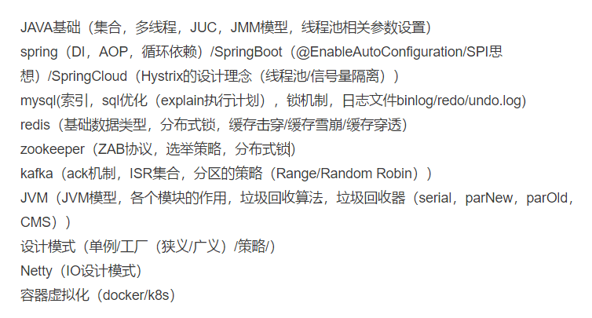

#### 自己遇到

#### 知识星球的球友

上海零数科技一面: 

1. 自我介绍
2. 离职原因? 
3. 说一下你负责的项目里, 你做了哪些事情 
4. mysql主键索引和唯一索引区别 
5. 主键数据不是自增的会有什么问题吗? 
6. 间隙锁了解过吗? 举个例子,他会锁那些数据?
7. 有了解过mvcc吗? 
9. 了解过索引下推吗? 
8. mysql一行语句的执行流程? 
10. mysql的主从复制怎么实现的? 具体点 
11. AQS有没有了解过?他的逻辑是怎么实现的,多线程去争抢锁的时候,他是怎么去维护锁的 
12. cas会有哪些问题? 会不会导致aba? 
13. reentrantlock和sychrnized区别 
14. jdk对sychrnized做了很多优化, 你能说说是那些吗? (锁升级的过程, 面试官问还有没有其他的 
15. jvm垃圾回收器, 你对那个比较熟一点? 说说CMS的垃圾回收过程? 初始化标记的时候他是怎么处理的? 具体他是怎么中断用户线程的? 
16. NIO和BIO了解吗? 更细节一些, 比如一个请求过来了,NIO怎么处理,BIO怎么处理? 
17.  如果现在有abc三个线程,我想先执行a,再执行b,再执行c,你有什么办法可以实现? 
18. java线程状态,他们之间的流转关系是怎样的?  
19. tcp和udp了解过吗? 三次握手和四次挥手就不用说了, 说说其他的?  
20. tcp怎么保证可靠性, 网络抖动这种问题他怎么解决的? 
21. (面试官发现我网络这块不太行,开始钻了)tcp里有哪些概念,你了解过吗? 
22. 数据结构和算法这块熟悉吗? 链表和数组有什么区别? 
23. 怎么解决链表查询慢的问题? 告诉你最大值最小值，比如说列表它是有序的，从1~10，我现在想查5，你怎么做快速查询的?怎么降低他的复杂度(我还是没理解要怎么做,懂得老哥麻烦评论区教教) 
24. 红黑树熟悉吗? 遍历的时候怎么遍历的? 
25. 快速排序怎么做的你知道吗? 他的具体实现?口述 
26. 方便投屏共享写个算法吗? 就写个冒泡排序(这里看得出来面试官很想结束了) 
27. 反问

##### 网上收集的货拉拉面试题：

https://juejin.cn/post/7289333769236758569

###### 一面

1. 先让介绍项目，超卖问题项目是怎么实现的？有什么改进的想法？
2. 线程池的核心参数？
3. 在秒杀的过程中，比如只有 10 个名额，有 100 个人去抢，页面上需要做一些什么处理？
4. HashSet 了解吗？HashMap 了解吗？从 0 个 put 20 个数据进去，整个过程是怎么样的？HashMap 扩容机制？是 put 12 个数据之前扩容还是之后扩容？什么时候装红黑树？为什么是 8 的时候转，为什么是 6 的时候退化回链表？
5. ConcurrenHashMap 了解吗？用到哪些锁？
6. CAS 原理了解吗？
7. synchronized 有多少种锁？锁升级。
8. MySQL 有哪些锁？
9. 一条 SQL 执行的全流程？
10. 地址输入 URL 到数据返回页面，整个流程？
11. 域名服务器寻址？

###### 二面

1. 问了一下项目的锁，问怎么优化？
2. 怎么进行项目部署的？
3. 之前搭过最复杂的项目是什么？
4. 你感觉这种架构有什么好处？为什么要进行微服务拆分？
5. Nacos 用过吗？
6. CAP 理论？Base 理论？
7. MQ 用过吗？
8. 有什么技术优势？

