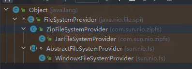

##### Java 文件拷贝方式？哪一种最高效

1. 利用 java.io 类库，直接为源文件构建一个 FileInputStream 读取，然后再为目标文件构建一个 FileOutputStream，完成写入工作。

```java
public static void copyFileByStream(File source, File dest) throws
        IOException {
    try (InputStream is = new FileInputStream(source);
         OutputStream os = new FileOutputStream(dest);){
        byte[] buffer = new byte[1024];
        int length;
        while ((length = is.read(buffer)) > 0) {
            os.write(buffer, 0, length);
        }
    }
}
// or 
public static void copyFileByChannel(File source, File dest) throws
        IOException {
    try (FileChannel sourceChannel = new FileInputStream(source)
            .getChannel();
         FileChannel targetChannel = new FileOutputStream(dest).getChannel
                 ();){
        for (long count = sourceChannel.size() ;count>0 ;) {
            long transferred = sourceChannel.transferTo(
                    sourceChannel.position(), count, targetChannel);            sourceCh
            count -= transferred;
        }
    }
}
```

2. 使用Java标准类库提供的 Files.copy。

对于 Copy 的效率，这个其实与操作系统和配置等情况相关，总体上来说，**使用NIO的transferTo/From 的方式可能更快，因为它更能利用现代操作系统底层机制，避免不必要拷贝和上下文切换**。

基于 NIO transferTo 的实现方式，在 Linux 和 Unix 上，则会使用到零拷贝技术，**数据传输并不需要用户态参与，省去了上下文切换的开销和不必要的内存拷贝，进而可能提高应用拷贝性能**。注意，transferTo 不仅仅是可以用在文件拷贝中，与其类似的，例如读取磁盘文件，然后进行 Socket 发送，同样可以享受这种机制带来的性能和扩展性提高。

Files.copy的两种方式

```java
private static long copy(InputStream source, OutputStream sink)
    throws IOException
{
    long nread = 0L;
    byte[] buf = new byte[BUFFER_SIZE];
    int n;
    while ((n = source.read(buf)) > 0) {
        sink.write(buf, 0, n);
        nread += n;
    }
    return nread;
}

public static Path copy(Path source, Path target, CopyOption... options)
    throws IOException
{
    FileSystemProvider provider = provider(source);
    if (provider(target) == provider) {
        // same provider
        provider.copy(source, target, options);
    } else {
        // different providers
        CopyMoveHelper.copyToForeignTarget(source, target, options);
    }
    return target;
}
```

FileSystemProvider 实现类



第二种方法是底层是**用本地技术实现的用户态拷贝**。


#### 零拷贝技术

#### IO多路复用：select/poll/epoll

#### Reactor 和 Proactor

参考： https://www.xiaolincoding.com/os/8_network_system/zero_copy.html