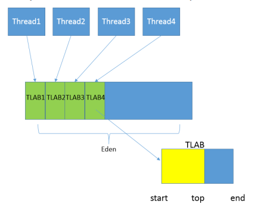

#### JVM

##### 垃圾回收器的基本原理是什么？垃圾回收器可以马上回收内存吗？有什么办法主动通知虚拟机进行垃圾回收？

对于GC来说，当程序员创建对象时，GC就开始监控这个对象的地址、大小以及使用情况。通常，GC采用有向图的方式记录和管理堆(heap)中的所有对象。通过这种方式确定哪些对象是"**可达的**"，哪些对象是"不可达的"。当GC确定一些对象为"不可达"时，GC就有责任回收这些内存空间。

程序员可以手动执行System.gc()，通知GC运行，但是Java语言规范并不保证GC一定会执行。

##### 什么时候发生 Minor GC？full gc

**当 eden 区满了的时候触发Minor GC**；**通常我们把老年代 GC 叫作 Major GC**，**将对整个堆进行的清理叫作 Full GC**，但是这个也没有那么绝对，因为不同的老年代 GC 算法其实表现差异很大，例如 CMS，“concurrent”就体现在清理工作是与工作线程一起并发运行的。

##### 有过JVM相关的命令使用吗？

`jps`，`jinfo`，`jstack`

需要结合实际的使用经验，因为后面又问了如何排查是什么导致了程序占用高内存或者是cpu。

##### 强引用、软引用、弱引用、幻象引用有什么区别？具体使用场景是什么？

不同的引用类型，主要体现的是**对象不同的可达性（reachable）状态和对垃圾收集**的影响。

**强引用（Strong Reference）**，最常见的普通对象引用，只要还有强引用指向一个对象，就能表明对象还“活着”，垃圾收集器不会碰这种对象。当被赋值为null或超出作用域，被垃圾回收。

**软引用（SoftReference）**，是一种相对强引用弱化一些的引用，可以让对象豁免一些垃圾收集，只有当 JVM 认为内存不足时，才会去试图回收软引用指向的对象。JVM 会确保在抛出 OutOfMemoryError 之前，清理软引用指向的对象。**软引用通常用来实现内存敏感的缓存**，如果还有空闲内存，就可以暂时保留缓存，当内存不足时清理掉，这样就保证了使用缓存的同时，不会耗尽内存。

**弱引用（WeakReference）**，**并不能使对象豁免垃圾收集，仅仅是提供一种访问在弱引用状态下对象的途径**。这就可以用来构建一种没有特定约束的关系，比如，维护一种非强制性的映射关系，如果试图获取时对象还在，就使用它，否则重现实例化。它同样是很多缓存实现的选择。

虚引用，你不能通过它访问对象,。幻象引用仅仅是提供了一种确保对象被 finalize 以后，做某些事情的机制。get方法返回会是null。

参考：docs\java\jvm\四种引用和常用参数.md

**问题**

利用软引用和弱引用，我们可以将访问到的对象，重新指向强引用，也就是人为的改变了对象的可达性状态。所以对于软引用、弱引用之类，垃圾收集器可能会存在二次确认的问题，以保证处于弱引用状态的对象，没有改变为强引用。

这里可能会出现问题。如果我们错误的保持了强引用（比如，赋值给了 static 变量），那么对象可能就没有机会变回类似弱引用的可达性状态了，就会产生内存泄漏。所以，检查弱引用指向对象是否被垃圾收集，也是诊断是否有特定内存泄漏的一个思路，如果我们的框架使用到弱引用又怀疑有内存泄漏，就可以从这个角度检查。

##### 有哪些方法可以动态的生成一个类

有一种笨办法，直接用 ProcessBuilder 之类启动 javac 进程，并指定上面生成的文件作为输入，进行编译。最后，再利用类加载器，在运行时加载即可。可以考虑使用 Java Compiler API，这是 JDK 提供的标准 API，里面提供了与 javac 对等的编译器功能，具体请参考java.compiler相关文档。

只要符合jvm规范的字节码就可以编译成一个类了。通常我们可以利用 Java 字节码操纵工具和类库来实现，比如**ASM、Javassist、cglib** 等。

**字节码和类加载到底是怎么无缝进行转换的**？**发生在整个类加载过程的哪一步**？**如何利用字节码操纵技术，实现基本的动态代理逻辑**？**除了动态代理，字节码操纵技术还有那些应用场景**？

首先，我们来理解一下，类从字节码到 Class 对象的转换，**在类加载过程中，这一步是通过下面的方法提供的功能，或者 defineClass 的其他本地对等实现**。

```java
protected final Class<?> defineClass(String name, byte[] b, int off, int len,
                                     ProtectionDomain protectionDomain)
```

本地代码实现。**可以看出，只要能够生成出规范的字节码，不管是作为 byte 数组的形式，还是放到 ByteBuffer 里，都可以平滑地完成字节码到 Java 对象的转换过程**。

```java
private native Class<?> defineClass0(String name, byte[] b, int off, int len,
                                     ProtectionDomain pd);
private native Class<?> defineClass1(String name, byte[] b, int off, int len,
                                     ProtectionDomain pd, String source);
private native Class<?> defineClass2(String name, java.nio.ByteBuffer b,
                                     int off, int len, ProtectionDomain pd,
                                     String source);
```

在jdk11中，jdk的动态代理的实现代码也可以看到相关的使用。

```java
public static Object newProxyInstance(ClassLoader loader,
                                          Class<?>[] interfaces,
                                          InvocationHandler h) {
    Objects.requireNonNull(h);

    final Class<?> caller = System.getSecurityManager() == null
        ? null
        : Reflection.getCallerClass();

    /*
         * Look up or generate the designated proxy class and its constructor.
         */
    Constructor<?> cons = getProxyConstructor(caller, loader, interfaces);

    return newProxyInstance(caller, cons, h);
}
private static Constructor<?> getProxyConstructor(Class<?> caller,
                                                      ClassLoader loader,
                                                      Class<?>... interfaces)
{
    // optimization for single interface
    if (interfaces.length == 1) {
        Class<?> intf = interfaces[0];
        if (caller != null) {
            checkProxyAccess(caller, loader, intf);
        }
        return proxyCache.sub(intf).computeIfAbsent(
            loader,
            (ld, clv) -> new ProxyBuilder(ld, clv.key()).build() // 这里使用到了
        );
    } else {
        // interfaces cloned
        final Class<?>[] intfsArray = interfaces.clone();
        if (caller != null) {
            checkProxyAccess(caller, loader, intfsArray);
        }
        final List<Class<?>> intfs = Arrays.asList(intfsArray);
        return proxyCache.sub(intfs).computeIfAbsent(
            loader,
            (ld, clv) -> new ProxyBuilder(ld, clv.key()).build()
        );
    }
}
```

具体的类则是 `ProxyBuilder`

```java
Constructor<?> build() {
    // 在这个方法里面调用的
    Class<?> proxyClass = defineProxyClass(module, interfaces);
    final Constructor<?> cons;
    try {
        cons = proxyClass.getConstructor(constructorParams);
    } catch (NoSuchMethodException e) {
        throw new InternalError(e.toString(), e);
    }
    AccessController.doPrivileged(new PrivilegedAction<Void>() {
        public Void run() {
            cons.setAccessible(true);
            return null;
        }
    });
    return cons;
}
```

`build()`方法。对应逻辑是实现在ProxyBuilder 这个静态内部类中，ProxyGenerator 生成字节码，并以 byte 数组的形式保存，然后通过调用 Unsafe 提供的 defineClass 入口。

```
...
byte[] proxyClassFile = ProxyGenerator.generateProxyClass(
        proxyName, interfaces.toArray(EMPTY_CLASS_ARRAY), accessFlags);
try {
    Class<?> pc = UNSAFE.defineClass(proxyName, proxyClassFile,
                                     0, proxyClassFile.length,
                                     loader, null);
    reverseProxyCache.sub(pc).putIfAbsent(loader, Boolean.TRUE);
    return pc;
```

上面是二进制字节码信息到Class文件的转换过程。

**如何生成自己需要的字节码**？

JDK 内部动态代理的逻辑，可以参考java.lang.reflect.ProxyGenerator的内部实现。我觉得可以认为这是种另类的字节码操纵技术，其利用了DataOutputStrem提供的能力，配合hard-coded 的各种 JVM 指令实现方法，生成所需的字节码数组。可参考如下代码：

```java
private void codeLocalLoadStore(int lvar, int opcode, int opcode_0,
 DataOutputStream out)
 throws IOException
{
 assert lvar >= 0 && lvar <= 0xFFFF;
 // 根据变量数值，以不同格式，dump 操作码
    if (lvar <= 3) {
 out.writeByte(opcode_0 + lvar);
 } else if (lvar <= 0xFF) {
 out.writeByte(opcode);
 out.writeByte(lvar & 0xFF);
 } else {
 // 使用宽指令修饰符，如果变量索引不能用无符号 byte
 out.writeByte(opc_wide);
 out.writeByte(opcode);
 out.writeShort(lvar & 0xFFFF);
 }
}
```

这种实现方式的好处是没有太多依赖关系，简单实用，但是前提是你需要懂各种JVM 指令，知道怎么处理那些偏移地址等，实际门槛非常高，所以并不适合大多数的普通开发场景。

JDK 内部就集成了 ASM 类库，虽然并未作为公共 API 暴露出来，但是它广泛应用在，如java.lang.instrumentation API 底层实现，或者Lambda Call Site生成的内部逻辑中。可以参考类似 LamdaForm 的字节码生成逻辑：java.lang.invoke.InvokerBytecodeGenerator。

**动态代码生成是具体发生在什么阶段呢**？

**就是在 newProxyInstance 生成代理类实例的时候**。我选取了 JDK 自己采用的ASM 作为示例，一起来看看用 ASM 实现的简要过程，请参考下面的示例代码片段。

第一步，生成对应的类，其实和我们去写 Java 代码很类似，只不过改为用 ASM 方法和指定参数，代替了我们书写的源码。

```java
ClassWriter cw = new ClassWriter(ClassWriter.COMPUTE_FRAMES);
 
cw.visit(V1_8,                      // 指定 Java 版本
 ACC_PUBLIC, // 说明是 public 类型
 "com/mycorp/HelloProxy", // 指定包和类的名称
 null, // 签名，null 表示不是泛型
 "java/lang/Object", // 指定父类
 new String[]{ "com/mycorp/Hello" }); // 指定需要实现的接口
```

更进一步，我们可以按照需要为代理对象实例，生成需要的方法和逻辑。

```java
MethodVisitor mv = cw.visitMethod(
 ACC_PUBLIC, // 声明公共方法
 "sayHello", // 方法名称
 "()Ljava/lang/Object;", // 描述符
 null, // 签名，null 表示不是泛型
 null); // 可能抛出的异常，如果有，则指定字符串数组
 
mv.visitCode();
// 省略代码逻辑实现细节
cw.visitEnd();                      // 结束类字节码生成
```

上面的代码虽然有些晦涩，但总体还是能多少理解其用意，不同的 visitX 方法提供了创建类型，创建各种方法等逻辑。ASM API，广泛的使用了Visitor模式，它所针对的场景是将算法和对象结构解耦，非常适合字节码操纵的场合，因为我们大部分情况都是依赖于特定结构修改或者添加新的方法、变量或者类型等。

按照前面的分析，字节码操作最后大都应该是生成 byte 数组，ClassWriter 提供了一个简便的方法。cw.toByteArray()。

然后，就可以进入我们熟知的类加载过程了。[A Guide to Java Bytecode Manipulation with ASM | Baeldung](https://www.baeldung.com/java-asm)

**字节码操纵技术，除了动态代理，还可以应用在什么地方**？

各种 Mock 框架、ORM 框架、IOC 容器、部分 Profiler 工具，或者运行时诊断工具等、生成形式化代码的工具

试想，假如我们有这样一个需求，需要添加某个功能，例如**对某类型资源如网络通信的消耗进行统计，重点要求是，不开启时必须是零开销，而不是低开销**，可以利用我们今天谈到的或者相关的技术实现吗？

> 可以考虑用javaagent+字节码处理拦截方法进行统计：对httpclient中的方法进行拦截，增加header或者转发等进行统计。开启和关闭只要增加一个javaagent启动参数就行。（Java Agent 可以使用 Agentmain 方法作为入口点，通过 Instrumentation API 提供的回调函数来修改字节码。可以使用字节码操作库，如 ASM 或 CGLib，来读取和修改字节码。在修改字节码后，Java Agent 可以将修改后的字节码重新加载到 JVM 中，实现方法的增强。）

可以用这个去问 gpt，使用Java Agent进行方法增强时，一个典型的案例是实现应用性能监控。具体步骤

1. 创建一个Java Agent。该方法在JVM启动时被调用，并且可以拦截加载的Java类。在premain方法中，可以使用Instrumentation API提供的回调函数来修改字节码。

```java
import java.lang.instrument.*;  
import java.security.ProtectionDomain;  
  
public class PerformanceMonitorAgent {  
    public static void premain(String agentArgs, Instrumentation inst) {  
        inst.addTransformer(new AgentTransformer());  
    }  
}
```

2. 实现AgentTransformer类。在AgentTransformer类中，需要实现ClassFileTransformer接口，并重写transform方法。该方法接受一个ClassFileTransformer参数，并提供一个新的字节码。

```java
import java.lang.instrument.*;  
import java.security.ProtectionDomain;  
import java.util.*;  
import java.io.*;  
import javassist.*;  
  
public class AgentTransformer implements ClassFileTransformer {  
    @Override  
    public byte[] transform(ClassLoader loader, String className, Class<?> classBeingRedefined, ProtectionDomain protectionDomain, byte[] classfileBuffer) throws IllegalClassFormatException {  
        try {  
            // 使用Javassist库读取和修改字节码  
            ClassPool cp = ClassPool.getDefault();  
            CtClass cc = cp.get(className.replace("/", "."));  
            // 获取需要修改的方法，并添加监控代码  
            CtMethod m = cc.getDeclaredMethod("targetMethod");  
            m.insertBefore("{ System.out.println(\"Start executing method: " + m.getName() + "\"); }");  
            m.insertAfter("{ System.out.println(\"End executing method: " + m.getName() + "\"); }");  
            // 保存修改后的字节码，并返回给JVM重新加载  
            return cc.toBytecode();  
        } catch (Exception e) {  
            e.printStackTrace();  
            return classfileBuffer; // 如果修改失败，则返回原始字节码  
        }  
    }  
}
```

在上面的代码中，我们使用了Javassist库来读取和修改字节码。通过获取需要修改的方法，我们可以在方法的开头和结尾添加监控代码，用于记录方法的执行时间等性能指标。最后，将修改后的字节码返回给JVM重新加载。

3. 将Java Agent打包为JAR文件。将编写的Java Agent打包为一个JAR文件，并在Manifest文件中指定Agent的入口类和版本信息。例如：

- 创建一个新的文本文件，命名为Manifest.txt，并输入以下内容：`Premain-Class: PerformanceMonitorAgent`（假设PerformanceMonitorAgent为Agent的入口类）。
- 将PerformanceMonitorAgent.class文件和Manifest.txt文件打包为一个JAR文件，例如：`jar cvfm monitor-agent.jar Manifest.txt PerformanceMonitorAgent.class`

##### 哪些区域可能发生OutOfMemoryError?

堆内存不足是最常见的 OOM 原因之一，抛出的错误信息是“java.lang.OutOfMemoryError:Java heap space”，原因可能千奇百怪，例如，可能存在内存泄漏问题；也很有可能就是堆的大小不合理，比如我们要处理比较可观的数据量，但是没有显式指定 JVM 堆大小或者指定数值偏小；或者出现 JVM 处理引用不及时，导致堆积起来，内存无法释放等。

Java 虚拟机栈和本地方法栈，这里要稍微复杂一点。如果我们写一段程序不断的进行递归调用，而且没有退出条件，就会导致不断地进行压栈。类似这种情况，JVM 实际会抛出 StackOverFlowError；当然，如果 JVM 试图去扩展栈空间的的时候失败，则会抛出 OutOfMemoryError。

对于老版本的 Oracle JDK，因为永久代的大小是有限的，并且 JVM 对永久代垃圾回收（如，常量池回收、卸载不再需要的类型）非常不积极，所以当我们不断添加新类型的时候，永久代出现 OutOfMemoryError 也非常多见，尤其是在运行时存在大量动态类型生成的场合；类似 Intern 字符串缓存占用太多空间，也会导致 OOM 问题。对应的异常信息，会标记出来和永久代相关：“java.lang.OutOfMemoryError: PermGen space”。随着元数据区的引入，方法区内存已经不再那么窘迫，所以相应的 OOM 有所改观，出现 OOM，异常信息则变成了：“java.lang.OutOfMemoryError: Metaspace”。

直接内存不足也会导致OOM。

##### 在试图分配一个100M bytes 大数组的时候发生了 OOME，但是 GC 日志显示，明明堆上还有远不止100M 的空间，你觉得可能问题的原因是什么

- 垃圾收集算法有关

如果新生代是使用serial收集器，那么使用**标记-复制**算法，那么它需要两块eden和survivor来进行处理，但是默认当遇到超大对象时会直接将超大对象放置到老年代中，而不用走正常对象的存活次数记录。因为要放置的是一个byte数组，那么必然需要申请连续的空间，当空间不足时，会进行gc操作。如果是serial old 收集器的话，那么使用的**标记-整理**算法。可能空间是不连续的，就不够分配了。

##### 如何监控和诊断JVM堆内和堆外内存使用？

可以使用综合性的图形化工具，如 **JConsole、VisualVM**（注意，从 Oracle JDK 9 开始，VisualVM 已经不再包含在 JDK 安装包中）等。这些工具具体使用起来相对比较直观，直接连接到 Java 进程，然后就可以在图形化界面里掌握内存使用情况。

**使用命令行工具进行运行时查询，如jstat和jmap等工具，也可以使用 jmap 等提供的命令**，生成堆转储（Heap Dump）文件，然后利用jhat 或 Eclipse MAT 等堆转储分析工具进行详细分析。

如果使用的是Tomcat、Weblogic 等 Java EE 服务器，这些服务器同样提供了内存管理相关的功能。

**从某种程度上来说，GC 日志等输出，同样包含着丰富的信息**。

堆外内存中的直接内存，前面的工具基本不适用，可以使用 JDK 自带的 **Native Memory Tracking（NMT）**特性，它会从 JVM 本地内存分配的角度进行解读。

**Java Mission Control（JMC）**，这是一个非常强大的工具，不仅仅能够使用JMX进行普通的管理、监控任务，还可以配合Java FlightRecorder（JFR）技术，以非常低的开销，收集和分析 JVM 底层的 Profiling 和事件等信息。https://blog.csdn.net/suremeng/article/details/51584785

##### TLAB Thread Local Allocation Buffer

JVM 为每个线程分配的一个私有缓存区域，否则，多线程同时分配内存时，为避免操作同一地址，可能需要使用加锁等机制，进而影响分配速度。TLAB仍然在堆上它是分配在 Eden 区域内的。里面有start、end起始地址，top指针表示已经分配到哪里了。当分配新对象，JVM就会移动 top，当 top 和 end 相遇时，即表示该缓存已满，JVM 会试图再从 Eden 里分配一块儿。



##### 一些JVM参数

-Xmx value：最大堆体积

-Xms value：最小堆体积

-XX:NewRatio=value ：老年代和新生代的比例。默认是2，意味着老年代是新生代的 2 倍大，新生代是堆大
小的 1/3。

-XX:SurvivorRatio：Eden和Survior的比例配置

##### Java常见的垃圾收集器（Oracle JDK）

**Serial GC**，收集工作时单线程的，并且在进行垃圾收集过程中会有“stop the world”状态，是Client模式下JVM的默认选项。老年贷实现单独称作 Serial Old，采用了标记-整理（Mark-Compact）算法，新生代使用了标记-复制算法。对应参数：-XX:+UseSerialGC。

**ParNew GC**，新生代GC实现，它实际是 **Serial GC 的多线程版本**，最常见的应用场景是配合老年代的 CMS GC 工作，下面是对应参数：-XX:+UseConcMarkSweepGC -XX:+UseParNewGC。

**CMS（Concurrent Mark Sweep） GC，基于标记 - 清除（Mark-Sweep）算法，设计目标是尽量减少停顿时间**，这一点对于 Web 等反应时间敏感的应用非常重要，一直到今天，仍然有很多系统使用 CMS GC。但是，CMS 采用的标记 - 清除算法，存在着内存碎片化问题，所以难以避免在长时间运行等情况下发生 full GC，导致恶劣的停顿。另外，既然强调了并发（Concurrent），CMS 会占用更多 CPU 资源，并和用户线程争抢。CMS 已经在 JDK9 中被标记为废弃（deprecated）。

**Parallel GC**，在早期 JDK 8 等版本中，它是 server 模式 JVM 的默认 GC 选择，也被称作是**吞吐量优先的 GC**。它的算法和 Serial GC 比较相似，尽管实现要复杂的多，**其特点是新生代和老年代 GC 都是并行进行的，在常见的服务器环境中更加高效**。 开启选项：-XX:UseParallelGC。Parallel GC 引入了开发者友好的配置项，我们可以直接设置暂停时间或吞吐量等目标，JVM 会自动进行适应性调整，例如下面参数：

```java
-XX:MaxGCPauseMillis=value
-XX:GCTimeRatio=N // GC 时间和用户时间比例 = 1 / (N+1)
```

**G1 GC 这是一种兼顾吞吐量和停顿时间的 GC 实现**，是 Oracle JDK 9 以后的默认 GC 选项。G1 可以直观的设定停顿时间的目标，相比于 CMS GC，G1 未必能做到 CMS 在最好情况下的延时停顿，但是最差情况要好很多。 G1 GC 仍然存在着年代的概念，类似棋盘的一个个 region。Region 之间是复制算法，但整体上实际可看作是标记 - 整理（Mark-Compact）算法，可以有效地避免内存碎片，尤其是当 Java 堆非常大的时候，G1 的优势更加明显。

**Epsilon GC**，简单说就是个不做垃圾收集的 GC，似乎有点奇怪，有的情况下，例如在进行性能测试的时候，可能需要明确判断 GC 本身产生了多大的开销，这就是其典型应用场景。

**ZGC**，这是 Oracle 开源出来的一个超级 GC 实现，具备令人惊讶的扩展能力，比如支持T bytes 级别的堆大小，并且保证绝大部分情况下，延迟都不会超过 10 ms。虽然目前还处于实验阶段，仅支持 Linux 64 位的平台，但其已经表现出的能力和潜力都非常令人期待。

##### 可回收对象，GC ROOT的对象有哪些

可达性分析。**虚拟机栈和本地方法栈中正在引用的对象、静态属性引用的对象和常量**。

##### 垃圾收集算法

参考：docs\java\jvm\垃圾收集.md

##### 查看默认GC

`java -XX:+PrintCommandLineFlags -version`

```shell
-XX:ConcGCThreads=3 -XX:G1ConcRefinementThreads=13 -XX:GCDrainStackTargetSize=64 -XX:InitialHeapSize=263751104 -XX:MarkStackSize=4194304 -XX:MaxHeapSize=4220017664 -XX:MinHeapSize=6815736 -XX:+PrintCommandLineFlags -XX:ReservedCodeCacheSize=251658240 -XX:+SegmentedCodeCache -XX:+UseCompressedClassPointers -XX:+UseCompressedOops -XX:+UseG1GC -XX:-UseLargePagesIndividualAllocation
java version "17.0.7" 2023-04-18 LTS
Java(TM) SE Runtime Environment (build 17.0.7+8-LTS-224)
Java HotSpot(TM) 64-Bit Server VM (build 17.0.7+8-LTS-224, mixed mode, sharing)
```

##### GC 调优思路

###### 调优的目的

性能角度：通常关注三个方面，**内存占用（footprint）、延时（latency）和吞吐量（throughput）**，大多数情况下调优会侧重于其中一个或者两个方面的目标，很少有情况可以兼顾三个不同的角度。**也可能需要考虑其他 GC 相关的场景**，例如，OOM 也可能与不合理的 GC 相关参数有关；或者，应用启动速度方面的需求，GC 也会是个考虑的方面。

###### 调优思路

**理解应用需求和问题，确定调优目标**。假设，我们开发了一个应用服务，但发现偶尔会出现性能抖动，出现较长的服务停顿。评估用户可接受的响应时间和业务量，将目标简化为，希望 GC 暂停尽量控制在 200ms 以内，并且保证一定标准的吞吐量。

**掌握 JVM 和 GC 的状态，定位具体的问题，确定真的有 GC 调优的必要**。具体有很多方法，比如，通过 jstat 等工具查看 GC 等相关状态，可以开启 GC 日志，或者是利用操作系统提供的诊断工具等。例如，通过追踪 GC 日志，就可以查找是不是 GC 在特定时间发生了长时间的暂停，进而导致了应用响应不及时。

这里需要思考，**选择的 GC 类型是否符合我们的应用特征**，如果是，具体问题表现在哪里，是 Minor GC 过长，还是 Mixed GC 等出现异常停顿情况；如果不是，考虑切换到什么类型，如 CMS 和 G1 都是更侧重于低延迟的 GC 选项。

**通过分析确定具体调整的参数或者软硬件配置**。

**验证是否达到调优目标**，如果达到目标，即可以考虑结束调优；否则，重复完成分析、调整、验证这个过程。

[G1 调优指南](https://docs.oracle.com/javase/9/gctuning/garbage-first-garbage-collector-tuning.htm#JSGCT-GUID-4914A8D4-DE41-4250-B68E-816B58D4E278)

##### happens-before

参考：\readingNotes\并发编程的艺术\Java并发编程的艺术.md

##### JVM优化Java代码时都做了什么？

JVM 在对代码执行的优化可分为**运行时（runtime）优化和即时编译器（JIT）优化**。运行时优化主要是解释执行和动态编译通用的一些机制，比如说锁机制（如偏斜锁）、内存分配机制（如 TLAB）等。除此之外，还有一些专门用于优化解释执行效率的，比如说模版解释器、内联缓存（inline cache，用于优化虚方法调用的动态绑定）。

JVM 的即时编译器优化是指将热点代码以方法为单位转换成机器码，直接运行在底层硬件之上。它采用了多种优化方式，包括静态编译器可以使用的如方法内联、逃逸分析，也包括基于程序运行 profile 的投机性优化（speculative/optimistic optimization）。这个怎么理解呢？比如我有一条 instanceof 指令，在编译之前的执行过程中，测试对象的类一直是同一个，那么即时编译器可以假设编译之后的执行过程中还会是这一个类，并且根据这个类直接返回 instanceof 的结果。如果出现了其他类，那么就抛弃这段编译后的机器码，并且切换回解释执行。

JVM 的优化方式仅仅作用在运行应用代码的时候。如果应用代码本身阻塞了，比如说并发时等待另一线程的结果，这就不在 JVM 的优化范畴啦。
