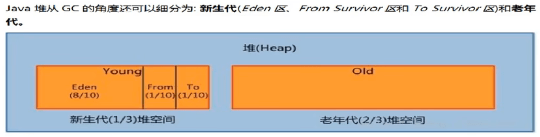
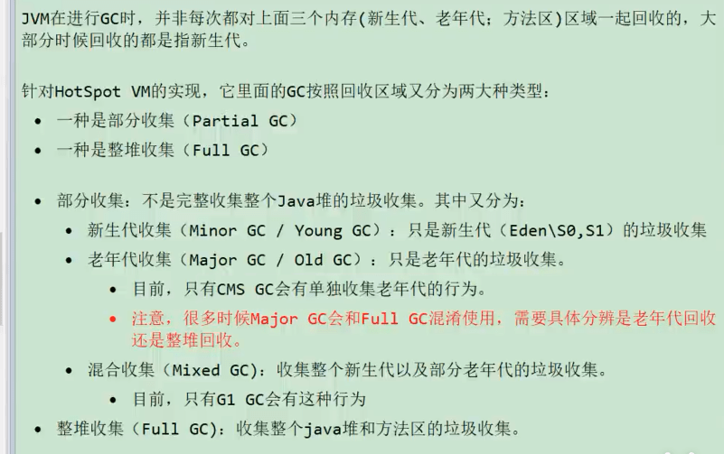

#### JVM

##### 为什么区分新生代和老年代，为什么区分Eden区和survival区



1. 主流垃圾回收器 cms、g1都使用了分代收集算法。
2. 正常系统运行时会有海量的临时对象产生，这些对象大都是朝生夕死，对于这些对象我们把它们放到新生代。
3. 新生代满了之后需要清理垃圾对象，我们会把有效对象复制到老年代，以便后续继续使用。
4. 为了区分哪些对象可以被复制到老年代，所以在新生代划分了s0和s1
5. 细化后的新生代内部被再次划分一边保证高速读写同时内存连续。
   - 新对象会保存在Eden区（开始是空的，所以是连续的），Eden区满了会把存活对象复制到s0（开始是空的）
   - 清空Eden区（再次写入又是连续的）
   - s0和s1互相交换，原来的s1等待写入
   - Eden区满了重复上面步骤
6. Eden区通过复制清除算法保证了读写连续性

##### 垃圾回收器的基本原理是什么？垃圾回收器可以马上回收内存吗？有什么办法主动通知虚拟机进行垃圾回收？

对于GC来说，当程序员创建对象时，GC就开始监控这个对象的地址、大小以及使用情况。通常，GC采用有向图的方式记录和管理堆(heap)中的所有对象。通过这种方式确定哪些对象是"**可达的**"，哪些对象是"不可达的"。当GC确定一些对象为"不可达"时，GC就有责任回收这些内存空间。

程序员可以手动执行System.gc()，通知GC运行，但是Java语言规范并不保证GC一定会执行。

##### 可达性分析算法，那如果在该算法中被判定不可达对象，是不是一定会被回收呢？

具体对象的回收是垃圾收集器来执行的，比如cms收集器，在并发标记阶段，用户线程就可能将不可达的对象使用，从而变成是可达对象，此时这个原先不可达对象就没有被回收了。

##### 并发标记带来了什么问题

**为什么遍历对象图的时候必须在一个能保障一致性的快照中**？

###### 三色标记

《深入理解Java虚拟机(第三版)》中是这样描述的：在遍历对象图的过程中，把访问到的对象**按照"是否访问过"这个条件**标记成以下三种颜色：

**白色：表示对象尚未被垃圾回收器访问过**。显然，在可达性分析刚刚开始的阶段，所有的对象都是白色的，若在分析结束的阶段，仍然是白色的对象，即代表不可达。

**黑色：表示对象已经被垃圾回收器访问过，且这个对象的所有引用都已经扫描过**。黑色的对象代表已经扫描过，它是安全存活的，如果有其它的对象引用指向了黑色对象，无须重新扫描一遍。黑色对象不可能直接（不经过灰色对象）指向某个白色对象。

**灰色：表示对象已经被垃圾回收器访问过，但这个对象至少存在一个引用还没有被扫描过**。


可以看到，灰色对象是黑色对象与白色对象之间的中间态。当标记过程结束后，只会有黑色和白色的对象，而白色的对象就是需要被回收的对象。

在可达性分析的扫描过程中，如果只有垃圾回收线程在工作，那肯定不会有任何问题。

**但是垃圾回收器和用户线程同时运行呢？这个时候就有点意思了。**

垃圾回收器在对象图上面标记颜色，而同时用户线程在修改引用关系，引用关系修改了，那么对象图就变化了，这样就有可能出现两种后果：

**一种是把原本消亡的对象错误的标记为存活，这不是好事，但是其实是可以容忍的，只不过产生了一点逃过本次回收的浮动垃圾而已，下次清理就可以。**

**一种是把原本存活的对象错误的标记为已消亡，这就是非常严重的后果了，一个程序还需要使用的对象被回收了，那程序肯定会因此发生错误。**

###### SATB

原始快照，Snapshot At The Beginning

剩余的内容访问博客：[面试官:你说你熟悉jvm?那你讲一下并发的可达性分析](https://juejin.cn/post/6844904070788939790) 这里面有一些错误的地方，查看这边博客：https://juejin.cn/post/6844904084126826504


##### 什么时候发生 Minor GC？full gc

**当 eden 区满了的时候触发Minor GC**；**通常我们把老年代 GC 叫作 Major GC**，**将对整个堆进行的清理叫作 Full GC**，但是这个也没有那么绝对，因为不同的老年代 GC 算法其实表现差异很大，例如 CMS，“concurrent”就体现在清理工作是与工作线程一起并发运行的。

[【尚硅谷JVM精讲与GC调优教程（宋红康主讲，含jvm面试真题）】] (https://www.bilibili.com/video/BV1Dz4y1A7FB/?p=29&share_source=copy_web&vd_source=3b1efacb505b91ba7db831546c052ed8) 29 讲



###### 老年代GC(Major Gc/Full GC)触发机制:

- 指发生在老年代的GC，对象从老年代消失时，我们说“MajorGc”或“Fu11 GC”发生

  - 出现了Major GC，经常会伴随至少一次的Minor Gc(但非绝对的，在ParallelScavenge收集器的收集策略里就有直接进行Major Gc的策略选择过程)。

  - 也就是在老年代空间不足时，会先尝试触发MinorGc。如果之后空间还不足，则触发Major Gc

- Major Gc的速度一般会比Minor GC慢10倍以上，STW的时间更长。
- 如果Major Gc 后，内存还不足，就报OOM了。

###### Fu11 GC触发机制:

触发Fu11 GC 执行的情况有如下五种:

(1)调用system.gc()时，系统建议执行Fu11 GC，但是不必然执行

(2)老年代空间不足

(3)方法区空间不足

(4)通过Minor Gc后进入老年代的平均大小大于老年代的可用内存

(5)由Eden区、survivor space0(From Space)区向survivor spacel(To Space)区复制时，对象大小大于To Space可用内存，则把该对象转存到老年代，且老年代的可用内存小于该对象大小

说明:**fu11 gc是开发或调优中尽量要避免的。这样暂时时间会短一些**。

##### 有过JVM相关的命令使用吗？

`jps`，`jinfo`，`jstack`

需要结合实际的使用经验，因为后面又问了如何排查是什么导致了程序占用高内存或者是cpu。

##### 强引用、软引用、弱引用、幻象引用有什么区别？具体使用场景是什么？

不同的引用类型，主要体现的是**对象不同的可达性（reachable）状态和对垃圾收集**的影响。

**强引用（Strong Reference）**，最常见的普通对象引用，只要还有强引用指向一个对象，就能表明对象还“活着”，垃圾收集器不会碰这种对象。当被赋值为null或超出作用域，被垃圾回收。

**软引用（SoftReference）**，是一种相对强引用弱化一些的引用，可以让对象豁免一些垃圾收集，只有当 JVM 认为内存不足时，才会去试图回收软引用指向的对象。JVM 会确保在抛出 OutOfMemoryError 之前，清理软引用指向的对象。**软引用通常用来实现内存敏感的缓存**，如果还有空闲内存，就可以暂时保留缓存，当内存不足时清理掉，这样就保证了使用缓存的同时，不会耗尽内存。

**弱引用（WeakReference）**，**并不能使对象豁免垃圾收集，仅仅是提供一种访问在弱引用状态下对象的途径**。这就可以用来构建一种没有特定约束的关系，比如，维护一种非强制性的映射关系，如果试图获取时对象还在，就使用它，否则重现实例化。它同样是很多缓存实现的选择。

虚引用，你不能通过它访问对象,。幻象引用仅仅是提供了一种确保对象被 finalize 以后，做某些事情的机制。get方法返回会是null。

参考：docs\java\jvm\四种引用和常用参数.md

**问题**

利用软引用和弱引用，我们可以将访问到的对象，重新指向强引用，也就是人为的改变了对象的可达性状态。所以对于软引用、弱引用之类，垃圾收集器可能会存在二次确认的问题，以保证处于弱引用状态的对象，没有改变为强引用。

这里可能会出现问题。如果我们错误的保持了强引用（比如，赋值给了 static 变量），那么对象可能就没有机会变回类似弱引用的可达性状态了，就会产生内存泄漏。所以，检查弱引用指向对象是否被垃圾收集，也是诊断是否有特定内存泄漏的一个思路，如果我们的框架使用到弱引用又怀疑有内存泄漏，就可以从这个角度检查。

##### 有哪些方法可以动态的生成一个类

docs\java\有哪些方法可以动态生成一个类.md

##### 哪些区域可能发生OutOfMemoryError?

**堆内存不足是最常见的 OOM 原因之一**，抛出的错误信息是“java.lang.OutOfMemoryError:Java heap space”，原因可能千奇百怪，例如，可能存在内存泄漏问题；也很有可能就是堆的大小不合理，比如我们要处理比较可观的数据量，但是没有显式指定 JVM 堆大小或者指定数值偏小；或者出现 JVM 处理引用不及时，导致堆积起来，内存无法释放等。

**Java 虚拟机栈和本地方法栈**，这里要稍微复杂一点。如果我们写一段程序不断的进行递归调用，而且没有退出条件，就会导致不断地进行压栈。类似这种情况，JVM 实际会抛出 StackOverFlowError；当然，如果 JVM 试图去扩展栈空间的的时候失败，则会抛出 OutOfMemoryError。

**方法区**：对于老版本的 Oracle JDK，因为永久代的大小是有限的，并且 JVM 对永久代垃圾回收（如，常量池回收、卸载不再需要的类型）非常不积极，所以当我们不断添加新类型的时候，永久代出现 OutOfMemoryError 也非常多见，尤其是在运行时存在大量动态类型生成的场合；类似 Intern 字符串缓存占用太多空间，也会导致 OOM 问题。对应的异常信息，会标记出来和永久代相关：“java.lang.OutOfMemoryError: PermGen space”。随着元数据区的引入，方法区内存已经不再那么窘迫，所以相应的 OOM 有所改观，出现 OOM，异常信息则变成了：“java.lang.OutOfMemoryError: Metaspace”。[调试排错 - Java 内存分析之堆内存和MetaSpace内存 | Java 全栈知识体系 (pdai.tech)](https://www.pdai.tech/md/java/jvm/java-jvm-oom.html)

**直接内存**：直接内存不足也会导致OOM。有一个参数来设置直接内存大小：-XX:MaxDirectMemorySize=100m，报错信息是java.lang.OutOfMemoryError:Direct buffer memory

##### OOM如何解决

1、要解决00M异常或heap space的异常，一般的手段是首先通过内存映像分析工具(如Eclipse Memory Analyzer)对dump 出来的堆转储快照进行分析，重点是确认内存中的对象是否是必要的，也就是要先分清楚到底是出现了内存泄漏(Memory Leak)还是内存溢出(Memory Overflow)。

2、如果是**内存泄漏**，可进一步通过工具査看泄漏对象到GC Roots 的引用链。于是就能找到泄漏对象是通过怎样的路径与GC Roots 相关联并导致垃圾收集器无法自动回收它们的。掌握了泄漏对象的类型信息，以及GC Roots 引用链的信息，就可以比较准确地定位出泄漏代码的位置。

3、如果不存在内存泄漏，换句话说就是内存中的对象确实都还必须存活着，那就应当检查虚与机器物理内存对比看是否还可以调大，从代码上检查是否拟机的堆参数(-Xmx与-Xms)，是否存在某些对象生命周期过长、持有状态时间过长的情况，尝试减少程序运行期的内存消耗。

##### 在试图分配一个100M bytes 大数组的时候发生了 OOME，但是 GC 日志显示，明明堆上还有远不止100M 的空间，你觉得可能问题的原因是什么

- 垃圾收集算法有关

如果新生代是使用serial收集器，那么使用**标记-复制**算法，那么它需要两块eden和survivor来进行处理，但是默认当遇到超大对象时会直接将超大对象放置到老年代中，而不用走正常对象的存活次数记录。因为要放置的是一个byte数组，那么必然需要申请连续的空间，当空间不足时，会进行gc操作。如果是serial old 收集器的话，那么使用的**标记-整理**算法。可能空间是不连续的，就不够分配了。

##### 如何监控和诊断JVM堆内和堆外内存使用？

可以使用综合性的图形化工具，如 **JConsole、VisualVM**（注意，从 Oracle JDK 9 开始，VisualVM 已经不再包含在 JDK 安装包中）等。这些工具具体使用起来相对比较直观，直接连接到 Java 进程，然后就可以在图形化界面里掌握内存使用情况。

**使用命令行工具进行运行时查询，如jstat和jmap等工具，也可以使用 jmap 等提供的命令**，生成堆转储（Heap Dump）文件，然后利用jhat 或 Eclipse MAT 等堆转储分析工具进行详细分析。

如果使用的是Tomcat、Weblogic 等 Java EE 服务器，这些服务器同样提供了内存管理相关的功能。

**从某种程度上来说，GC 日志等输出，同样包含着丰富的信息**。

堆外内存中的直接内存，前面的工具基本不适用，可以使用 JDK 自带的 **Native Memory Tracking（NMT）**特性，它会从 JVM 本地内存分配的角度进行解读。

**Java Mission Control（JMC）**，这是一个非常强大的工具，不仅仅能够使用JMX进行普通的管理、监控任务，还可以配合Java FlightRecorder（JFR）技术，以非常低的开销，收集和分析 JVM 底层的 Profiling 和事件等信息。https://blog.csdn.net/suremeng/article/details/51584785

##### TLAB Thread Local Allocation Buffer

JVM 为每个线程分配的一个私有缓存区域，否则，多线程同时分配内存时，为避免操作同一地址，可能需要使用加锁等机制，进而影响分配速度。TLAB仍然在堆上它是分配在 Eden 区域内的。里面有start、end起始地址，top指针表示已经分配到哪里了。当分配新对象，JVM就会移动 top，当 top 和 end 相遇时，即表示该缓存已满，JVM 会试图再从 Eden 里分配一块儿。


##### 一些JVM参数

-Xmx value：最大堆体积

-Xms value：最小堆体积

-XX:NewRatio=value ：老年代和新生代的比例。默认是2，意味着老年代是新生代的 2 倍大，新生代是堆大
小的 1/3。

-XX:SurvivorRatio：Eden和Survior的比例配置

##### Java常见的垃圾收集器（Oracle JDK）

**Serial GC**，收集工作时单线程的，并且在进行垃圾收集过程中会有“stop the world”状态，是Client模式下JVM的默认选项。老年贷实现单独称作 Serial Old，采用了标记-整理（Mark-Compact）算法，新生代使用了标记-复制算法。对应参数：-XX:+UseSerialGC。

**ParNew GC**，新生代GC实现，它实际是 **Serial GC 的多线程版本**，最常见的应用场景是配合老年代的 CMS GC 工作，下面是对应参数：-XX:+UseConcMarkSweepGC -XX:+UseParNewGC。

**CMS（Concurrent Mark Sweep） GC，基于标记 - 清除（Mark-Sweep）算法，设计目标是尽量减少停顿时间**，这一点对于 Web 等反应时间敏感的应用非常重要，一直到今天，仍然有很多系统使用 CMS GC。但是，CMS 采用的标记 - 清除算法，存在着内存碎片化问题，所以难以避免在长时间运行等情况下发生 full GC，导致恶劣的停顿。另外，既然强调了并发（Concurrent），CMS 会占用更多 CPU 资源，并和用户线程争抢。CMS 已经在 JDK9 中被标记为废弃（deprecated）。

**Parallel GC**，在早期 JDK 8 等版本中，它是 server 模式 JVM 的默认 GC 选择，也被称作是**吞吐量优先的 GC**。它的算法和 Serial GC 比较相似，尽管实现要复杂的多，**其特点是新生代和老年代 GC 都是并行进行的，在常见的服务器环境中更加高效**。 开启选项：-XX:UseParallelGC。Parallel GC 引入了开发者友好的配置项，我们可以直接设置暂停时间或吞吐量等目标，JVM 会自动进行适应性调整，例如下面参数：

```java
-XX:MaxGCPauseMillis=value
-XX:GCTimeRatio=N // GC 时间和用户时间比例 = 1 / (N+1)
```

**G1 GC 这是一种兼顾吞吐量和停顿时间的 GC 实现**，是 Oracle JDK 9 以后的默认 GC 选项。G1 可以直观的设定停顿时间的目标，相比于 CMS GC，G1 未必能做到 CMS 在最好情况下的延时停顿，但是最差情况要好很多。 G1 GC 仍然存在着年代的概念，类似棋盘的一个个 region。Region 之间是复制算法，但整体上实际可看作是标记 - 整理（Mark-Compact）算法，可以有效地避免内存碎片，尤其是当 Java 堆非常大的时候，G1 的优势更加明显。

**Epsilon GC**，简单说就是个不做垃圾收集的 GC，似乎有点奇怪，有的情况下，例如在进行性能测试的时候，可能需要明确判断 GC 本身产生了多大的开销，这就是其典型应用场景。

**ZGC**，这是 Oracle 开源出来的一个超级 GC 实现，具备令人惊讶的扩展能力，比如支持T bytes 级别的堆大小，并且保证绝大部分情况下，延迟都不会超过 10 ms。虽然目前还处于实验阶段，仅支持 Linux 64 位的平台，但其已经表现出的能力和潜力都非常令人期待。

##### 可回收对象，GC ROOT的对象有哪些

可达性分析。**虚拟机栈和本地方法栈中正在引用的对象、静态属性引用的对象和常量**。

##### 垃圾收集算法

参考：docs\java\jvm\垃圾收集.md

##### 查看默认GC

`java -XX:+PrintCommandLineFlags -version`

```shell
-XX:ConcGCThreads=3 -XX:G1ConcRefinementThreads=13 -XX:GCDrainStackTargetSize=64 -XX:InitialHeapSize=263751104 -XX:MarkStackSize=4194304 -XX:MaxHeapSize=4220017664 -XX:MinHeapSize=6815736 -XX:+PrintCommandLineFlags -XX:ReservedCodeCacheSize=251658240 -XX:+SegmentedCodeCache -XX:+UseCompressedClassPointers -XX:+UseCompressedOops -XX:+UseG1GC -XX:-UseLargePagesIndividualAllocation
java version "17.0.7" 2023-04-18 LTS
Java(TM) SE Runtime Environment (build 17.0.7+8-LTS-224)
Java HotSpot(TM) 64-Bit Server VM (build 17.0.7+8-LTS-224, mixed mode, sharing)
```

##### GC 调优思路

###### 调优的目的

性能角度：通常关注三个方面，**内存占用（footprint）、延时（latency）和吞吐量（throughput）**，大多数情况下调优会侧重于其中一个或者两个方面的目标，很少有情况可以兼顾三个不同的角度。**也可能需要考虑其他 GC 相关的场景**，例如，OOM 也可能与不合理的 GC 相关参数有关；或者，应用启动速度方面的需求，GC 也会是个考虑的方面。

###### 调优思路

**理解应用需求和问题，确定调优目标**。假设，我们开发了一个应用服务，但发现偶尔会出现性能抖动，出现较长的服务停顿。评估用户可接受的响应时间和业务量，将目标简化为，希望 GC 暂停尽量控制在 200ms 以内，并且保证一定标准的吞吐量。

**掌握 JVM 和 GC 的状态，定位具体的问题，确定真的有 GC 调优的必要**。具体有很多方法，比如，通过 jstat 等工具查看 GC 等相关状态，可以开启 GC 日志，或者是利用操作系统提供的诊断工具等。例如，通过追踪 GC 日志，就可以查找是不是 GC 在特定时间发生了长时间的暂停，进而导致了应用响应不及时。

这里需要思考，**选择的 GC 类型是否符合我们的应用特征**，如果是，具体问题表现在哪里，是 Minor GC 过长，还是 Mixed GC 等出现异常停顿情况；如果不是，考虑切换到什么类型，如 CMS 和 G1 都是更侧重于低延迟的 GC 选项。

**通过分析确定具体调整的参数或者软硬件配置**。

**验证是否达到调优目标**，如果达到目标，即可以考虑结束调优；否则，重复完成分析、调整、验证这个过程。

[G1 调优指南](https://docs.oracle.com/javase/9/gctuning/garbage-first-garbage-collector-tuning.htm#JSGCT-GUID-4914A8D4-DE41-4250-B68E-816B58D4E278)

##### happens-before

参考：\readingNotes\并发编程的艺术\Java并发编程的艺术.md

##### JVM优化Java代码时都做了什么？

JVM 在对代码执行的优化可分为**运行时（runtime）优化和即时编译器（JIT）优化**。运行时优化主要是解释执行和动态编译通用的一些机制，比如说锁机制（如偏斜锁）、内存分配机制（如 TLAB）等。除此之外，还有一些专门用于优化解释执行效率的，比如说模版解释器、内联缓存（inline cache，用于优化虚方法调用的动态绑定）。

JVM 的即时编译器优化是指将热点代码以方法为单位转换成机器码，直接运行在底层硬件之上。它采用了多种优化方式，包括静态编译器可以使用的如方法内联、逃逸分析，也包括基于程序运行 profile 的投机性优化（speculative/optimistic optimization）。这个怎么理解呢？比如我有一条 instanceof 指令，在编译之前的执行过程中，测试对象的类一直是同一个，那么即时编译器可以假设编译之后的执行过程中还会是这一个类，并且根据这个类直接返回 instanceof 的结果。如果出现了其他类，那么就抛弃这段编译后的机器码，并且切换回解释执行。

JVM 的优化方式仅仅作用在运行应用代码的时候。如果应用代码本身阻塞了，比如说并发时等待另一线程的结果，这就不在 JVM 的优化范畴啦。

##### [亿级流量电商系统JVM参数设置优化](https://www.bilibili.com/video/BV1rC4y127Np?p=24)

##### jvm加载class文件的原理（类加载器和类加载过程）

讲一下各种的类加载器，加载了什么内容，类的加载过程

##### 为什么不要使用Finalize方法

一个对象要被回收，需要经过两次标过程，一次是没有找到与GCRoots的引用链，它将被第一次标记。随后进行一次筛选(如果对象覆盖了finalize)，我们可以在finalize方法中去拯救(变为存活对象)。
1、finalize方法执行线程优先级很低。如果去掉线程休眠则会先输出 i am dead。


2、finalize方法只能执行一次。后续再一次回收，对象是不能被拯救的。也就是finalize里面的方法不会执行。


可以用try-finally 替代。

##### 扩容新生代为什么可以提高GC效率？


新生代空间200m，每隔5s GC一次，每次GC耗时100ms。T1+T2

新生代空间400m，每隔10s GC一次，每次GC耗时200ms。但是因为间隔时间长了，假如一个A对象的存活时间是6s，在没扩容之前GC后，还存活，需要有一个赋值到s0的操作。扩容后，A对象就变成垃圾了，不需要复制这一步骤，少了T2这个时间，T1时间是远远小于T2时间的。2*T1
##### 如何排查JVM的问题

https://juejin.cn/post/7022694129859559455

对于还在正常运⾏的系统：

1. 可以使⽤jmap来查看JVM中各个区域的使⽤情况；
2. 可以通过jstack来查看线程的运⾏情况，⽐如哪些线程阻塞、是否出现了死锁；
3. 可以通过jstat命令来查看垃圾回收的情况，特别是fullgc，如果发现fullgc⽐较频繁，那么就得进⾏调优了；
4. 通过各个命令的结果，或者jvisualvm等⼯具来进⾏分析；
5. ⾸先，初步猜测频繁发送fullgc的原因，如果频繁发⽣fullgc但是⼜⼀直没有出现内存溢出，那么表示fullgc实际上是回收了很多对象了，所以这些对象最好能在younggc过程中就直接回收掉，避免这些对象进⼊到⽼年代，对于这种情况，就要考虑这些存活时间不⻓的对象是不是⽐较⼤，导致年轻代放不下，直接进⼊到了⽼年代，尝试加⼤年轻代的⼤⼩，如果改完之后，fullgc减少，则证明修改有效；
6. 同时，还可以找到占⽤CPU最多的线程，定位到具体的⽅法，优化这个⽅法的执⾏，看是否能避免某些对象的创建，从⽽节省内存。

##### Tomcat 类加载机制

###### [图解Tomcat类加载机制(阿里面试题) - aspirant - 博客园 (cnblogs.com)](https://www.cnblogs.com/aspirant/p/8991830.html) 
