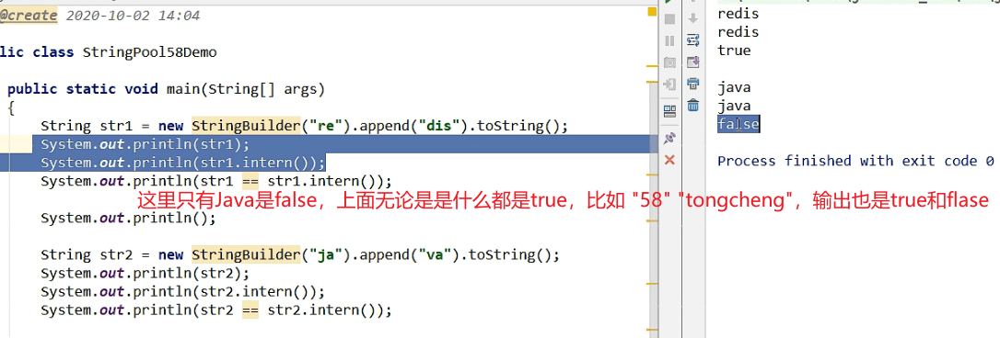
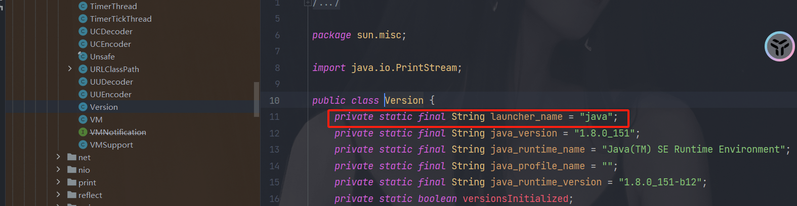
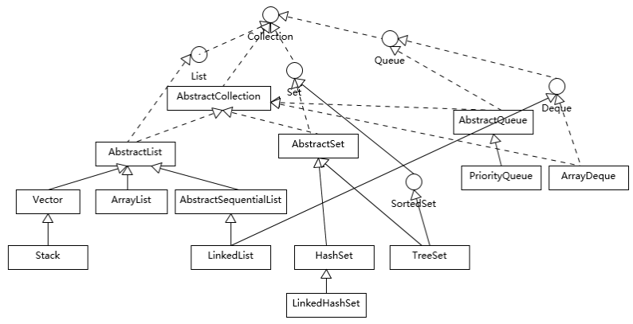
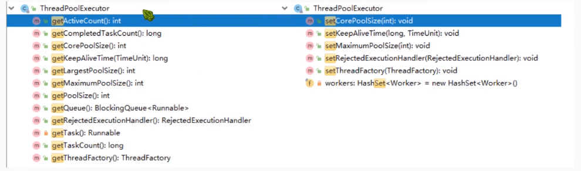
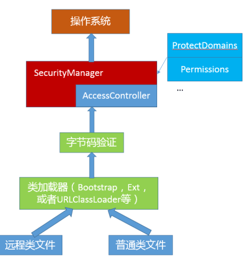

### Java基础

##### 对Java平台的理解

可以从多方面讲解

- **Java语言特性**：泛型、Lambda 等语言特性；基础类库，包括集合、IO/NIO、网络、并发、安全
  等基础类库。

- **JVM 基础概念和基础**： Java 的类加载机制，常用版本 JDK（如 JDK8）内嵌的 Class-Loader，例如 Bootstrap、 Application 和 Extension Class-loader；类加载大致过程：加载、验证、链接、初始化。自定义 Class-Loader 等。还有垃圾收集的基本原理，最常见的垃圾收集器，如 SerialGC、Parallel GC、 CMS、 G1 等。

- **JDK 包含哪些工具或者 Java 领域内其他工具等**：如编译器（javac）、运行时环境、安全工具、诊断（jmap，jstack，jstat）和监控工具（jconsole）等。

- **编译期**

  > Java的编译是编译成 .class 的字节码文件，而不是可以直接执行的机器码，通过字节码和Java虚拟机实现了“一次编译，到处执行”的基础。

- **运行时**

  > 在运行时，JVM 会通过类加载器（Class-Loader）加载字节码，解释或者编译执行。主流 Java 版本中，如 JDK 8 实际是解释和编译混合的一种模式，即所谓的混合模式（-Xmixed）。通常运行在 server 模式的 JVM，会进行上万次调用以收集足够的信息进行高效的编译，client 模式这个门限是 1500 次。Oracle Hotspot JVM 内置了两个不同的 JIT compiler，C1 对应前面说的 client 模式，适用于对于启动速度敏感的应用，比如普通 Java 桌面应用；C2 对应 server 模式，它的优化是为长时间运行的服务器端应用设计的。默认是采用所谓的分层编译（TieredCompilation）。
  >
  > Java 虚拟机启动时，**可以指定不同的参数对运行模式进行选择**。 比如，**指定“-Xint”，就是告诉 JVM 只进行解释执行，不对代码进行编译，这种模式抛弃了 JIT 可能带来的性能优势**。
  >
  > “-Xcomp”参数，这是告诉 JVM 关闭解释器，不要进行解释执行，或者叫作最大优化级别。会导致JVM 启动变慢非常多，同时有些 JIT 编译器优化方式，比如分支预测，如果不进行profiling，往往并不能进行有效优化。

##### 谈谈 final、finally、finalize的理解

- final 可以用来修饰类、方法、变量，分别有不同的意义，final 修饰的 class 代表不可以继承扩展，final 的变量是不可以修改的，而 final 的方法也是不可以重写的（override）。final不是不可变 immutable！

  > final class，可以有效避免API 使用者更改基础功能，某种程度上，这是保证平台安全的必要手段。
  >
  > 并发中定义只读数据，减少额外同步开销。

- finally 则是 Java 保证重点代码一定要被执行的一种机制。try-finally  或 try-catch-finally。除非在前面执行了 system.exit(1)。

- finalize 是基础类 java.lang.Object 的一个方法，**它的设计目的是保证对象在被垃圾收集前完成特定资源的回收**。finalize 机制现在已经不推荐使用，并且在 JDK 9 开始被标记为deprecated。你无法保证 finalize 什么时候执行，执行的是否符合预期。

##### Math.round(11.5)等於多少?Math.round(-11.5)等於多少?

- ceil的意思英文意义是天花板，该方法就表示向上取整，Math.ceil(11.3)的结果为12,Math.ceil(-11.3)的结果是-11。
- floor的英文意义是地板，该方法就表示向下取整，Math.floor(11.6)的结果为11,Math.floor(-11.6)的结果是-12。
- 最难掌握的是round方法，它表示“四舍五入”，算法为Math.floor(x+0.5)，即将原来的数字加上0.5后再向下取整，所以，Math.round(11.5)的结果为12，Math.round(-11.5)的结果为-11。

##### Overload和Override的区别？

Overload：重载。表示同一个类中可以有多个名称相同的方法，但是这些方法的参数个数、类型、顺序不同。

Override：重写。表示子类中的方法可以与父类中的某个方法的名称和参数完全相同。子类的方法的**修饰符（访问权限）**比父类的 ***大***，子类方法抛出的 **异常** 要小于父类的方法抛出的异常。

##### 接口和抽象类

接口既可以继承接口，也可以实现(implements)接口。接口的方法修饰符默认 public static abstract

- 抽象类可以继承具体类。抽象类和普通类的唯一区别 **不能创建实例对象和允许有abstract方法**。

- abstract的method是否可同时是static,是否可同时是native，是否可同时是synchronized?

> abstract的method不可以是static的，因为抽象的方法是要被子类实现的，而static与子类无关。native方法表示该方法要用另外一种依赖平台的编程语言实现的，不存在着被子类实现的问题，所以，它也不能是抽象的，不能与abstract混用。
>
> 关于synchronized与abstract合用的问题，我觉得也不行，因为在我几年的学习和开发中，从来没见到过这种情况，并且我觉得synchronized应该是作用在一个具体的方法上才有意义。而且，方法上的synchronized同步所使用的同步锁对象是this，而抽象方法上无法确定this是什么。

##### 下面这条语句一共创建了多少个对象：String s="a"+"b"+"c"+"d";

对于如下代码：

```Java
String s1 = "a"; 
String s2 = s1 + "b";
String s3 = "a" + "b";
System.out.println(s2 == "ab"); // false
System.out.println(s3 == "ab"); // true
```

第一条语句打印的结果为false，第二条语句打印的结果为true，这说明**javac编译可以对字符串常量直接相加的表达式进行优化，不必要等到运行期再去进行加法运算处理，而是在编译时去掉其中的加号，直接将其编译成一个这些常量相连的结果**。

题目中的第一行代码被编译器在编译时优化后，相当于直接定义了一个”abcd”的字符串，所以，上面的代码应该只创建了一个String对象。

```Java
String s = "a" + "b" + "c" + "d";
System.out.println(s == "abcd"); // true
```

甲骨文jdk（1.7），javac会进行常量折叠，全字面量字符串相加是可以折叠为一个字面常量，而且是进入常量池的。这个问题涉及到了字符串常量池和字符串拼接。通过编译器优化后，得到的效果是 `String s = "abcd";`

两个深入阅读的链接：

字符串常量池：[Java中的字符串常量池 - 技术小黑屋 (droidyue.com)](https://droidyue.com/blog/2014/12/21/string-literal-pool-in-java/) 

字符串拼接内部实现： [Java细节：字符串的拼接 - 技术小黑屋 (droidyue.com)](https://droidyue.com/blog/2014/08/30/java-details-string-concatenation/) 

##### 字符串常量池

String.intern() 是一个本地方法，作用是如果字符串常量池中已经包含了一个等于此对象的字符串，则返回代表池中这个字符串的String对象的引用；否则，会将此string对象包含的字符串添加到常量池中，并且返回此string对象的引用。Java8运行时常量池从方法区中的一部分，改成了用原空间来代替了。



为什么呢？因为有一个初始化的Java字符串（JDK自带的），在加载sun.misc.Version这个类的时候进入常量池。

```java
public final class System {

    /* register the natives via the static initializer.
     *
     * VM will invoke the initializeSystemClass method to complete
     * the initialization for this class separated from clinit.
     * Note that to use properties set by the VM, see the constraints
     * described in the initializeSystemClass method.
     */
    private static native void registerNatives();
}
// 是通过这个方法加载的。initializeSystemClass
```



##### try catch finally 执行顺序

**try {} 里有一个return语句，那么紧跟在这个try后的finally{}里的code会不会被执行，什么时候被执行，在return前还是后？**

> 我们知道finally{}中的语句是一定会执行的，那么这个可能正常脱口而出就是return之前，return之后可能就出了这个方法了，鬼知道跑哪里去了，但**更准确的应该是在return中间执行**，请看下面程序代码的运行结果：
>
> 可以看字节码的相关这篇博客：[Java中try finally 的原理(字节码解释)](https://juejin.cn/post/6844903520475283469)
>
> **finally 的代码块编译后都会接到 try 代码块之后**。
>
> 1.如果 try 代码块中return ,就return 了。
>
> 2.如果 try 代码块后还有代码继续执行，则会出现 goto 指令，跳转到下段指令，然后在 exception table 中注册了 any 异常。如果在 try 内抛了异常，就会去异常表找到 any，然后跳转到对应的 target 代码段继续执行。

```Java
System.out.println(test2()); // 主函数 ，结果是1
public int test2() {
    int x = 1;
    try {
        return x;
    } finally {
        ++x;
    }
}
```

运行结果是1，为什么呢？主函数调用子函数并得到结果的过程，好比主函数准备一个空罐子，当子函数要返回结果时，先把结果放在罐子里，然后再将程序逻辑返回到主函数。所谓返回，就是子函数说，我不运行了，你主函数继续运行吧，这没什么结果可言，结果是在说这话之前放进罐子里的。

- finally语句会在return语句（无论是在try也还是catch）之前执行。

- 在执行finally语句之前，已将方法内的返回值保存起来，finally语句块对该值进行操作都不会改变该值。

**try catch finally中return 代码返回位置不一样，返回什么结果**

```java
public static String doTryFinally1() {
    String name = null;
    try {
        name = "zhuang";
        return name;
    } finally {
        name = "zhuang111111";
    }
}
public static String doTryFinally2() {
    String name = null;
    try {
        name = "zhuang";
        return name;
    } catch (Exception e) {
        e.printStackTrace();
    } finally {
        name = "zhuang111111";
        return name;
    }
}
// 输出结果：
// doTryFinally1 : zhuang
// doTryFinally2 : zhuang111111
```

**try catch finally 里面自定义异常代码块，catch的应该是哪个**

```java
public static String doTryFinally6() {
    String name = null;
    try {
        name = "zhuang";
        int a = 1/0;
    } catch (Exception e) {
        name = "444444";
        return name;
    } finally {
        name = "zhuang111111";
    }
    return name;
}
// 输出：444444
```

**多级异常**：

有三级catch语句进行异常捕捉，捕获到的条件是try语句块抛出的异常是catch语句中的异常或者其子类，**捕捉顺序为由上至下**（上级catch的异常不能是下一级catch异常的超类（父类，superclass）），**若第一级catch未捕获，则由下一级catch验证捕捉，若异常已被捕捉，则之后的catch语句块就不会再捕捉**。

第一级捕获异常：这三个异常是 NullPointerException extends RuntimeException，RuntimeException extends Exception 的关系。

```java
@Test
void nullPointExceptionTest(){
    Staff staff = null;
    try{
        staff.getAge();
    }catch (NullPointerException e){
        System.out.println("NullPointerException");
    }catch (RuntimeException e){
        System.out.println("RuntimeException");
    }catch (Exception e){
        System.out.println("Exception");
    }
}
// 输出 NullPointerException
```
第二级：第一级未捕获异常

```java
@Test
void mutilLevelCatchTest1(){
    ArrayList<Object> list = new ArrayList<>();
    try{
        list.get(7);
    }catch (NullPointerException e){
        System.out.println("NullPointerException");
    }catch (RuntimeException e){
        System.out.println("RuntimeException");
    }catch (Exception e){
        System.out.println("Exception");
    }
}
// 输出：RuntimeException
```
##### 能将 int 强制转换为 byte 类型的变量吗？如果该值大于 byte 类型的范围，将会出现什么现象？ 

可以进行强制转换，但是Java中int是32位的，而byte是8位的，所以如果强制转换的话，int类型的高24位将会被丢弃。因为byte类型的范围是从-128到127。

##### Java中存在内存泄漏吗？请简要说明

**内存泄漏：所谓内存泄漏就是指一个不再被程序使用的对象或变量一直占据在内存中**。Java中有垃圾回收机制，它可以保证当对象不再被引用时候，对象将自动被垃圾回收机制从内存中清除。

由于Java使用有向图的方式进行垃圾回收管理，可以消除引用循环的问题，例如有两个对象，相互引用，只要它们和根进程不可达，那么GC也是可以回收它们的。

java中的内存泄露的情况：**长生命周期的对象持有短生命周期对象的引用就很可能发生内存泄露，尽管短生命周期对象已经不再需要，但是因为长生命周期对象持有它的引用而导致不能被回收，这就是java中内存泄露的发生场景**，通俗地说，就是程序员可能创建了一个对象，以后一直不再使用这个对象，这个对象却一直被引用，即这个对象无用但是却无法被垃圾回收器回收的，这就是java中可能出现内存泄露的情况，例如，缓存系统，我们加载了一个对象放在缓存中(例如放在一个全局map对象中)，然后一直不再使用它，这个对象一直被缓存引用，但却不再被使用。

##### [【大厂面试真题解析】虾皮 Shopee 后端一面十四问 (qq.com)](https://mp.weixin.qq.com/s/p865pgnPWThNlgNjmnoKwQ)  

##### static关键字，构造器显示调用，static代码块执行顺序，父子类初始化顺序等

```java
public class Initializationblock {
    int intA;
    int intB;
	// 构造器
    public Initializationblock() {
        System.out.println("无参构造器00000000");
    }

    public Initializationblock(int a) {
        System.out.println("一个参数的构造器");
        
    }
	// 代码块
    {
        intA = 10;
        intB = 15;
        System.out.println("构造初始化块11111");
    }

    {
        System.out.println("构造初始化块22222");
    }

    {
        System.out.println("构造初始化块33333");
    }

    //静态初始化块
    static {
        System.out.println("静态初始化块01010101");
    }

    static {
        System.out.println("静态初始化块0202020202");
    }
    
    public void method(){
    	{
    		System.out.println("普通初始化块");
    	}
    }
}
```

**没继承**：静态代码块 --》 构造代码块 --》 构造函数 --》 普通代码块

**有继承**：父类静态块 --》子类静态块 --》父类代码块 --》父类构造器--》子类代码块-》子类构造器。

##### switch case的穿透

##### 

##### 形参实参，包装类参数，基本类型参数，方法传递参数（引用类型、基本类型）

在方法里面修改参数的值，实参的变化

##### 静态代理和动态代理区别

##### Java反射机制，动态代理是基于什么原理？

赋予程序在运行时**自省**（introspect，官方用语）的能力。通过反射我们可以直接操作类或者对象，比如获取某个对象的类定义，获取类声明的属性和方法，调用方法或者构造对象，甚至可以运行时修改类定义。

**动态代理是一种方便运行时动态构建代理、动态处理代理方法调用的机制**，很多场景都是利
用类似机制做到的，比如用来包装 RPC 调用、面向切面的编程（AOP）。

实现动态代理的方式很多，比如 JDK 自身提供的动态代理，就是**主要利用了上面提到的反**
**射机制**。还有其他的实现方式，比如利用传说中更高性能的字节码操作机制，类似 ASM、
cglib（基于 ASM）、Javassist。

**动态代理解决了什么问题？**

通过代理可以让调用者与实现者之间解耦。通过代理实现对目标代码的调用。如RPC调用，框架内部的寻址、序列化、反序列化等。

##### int和integer，integer值缓存范围，装箱、拆箱和包装类

Integer 是 int 的包装类。在Java5中引入了自动装箱和自动拆箱的功能，Java可跟据上下文自动进行转换。

> 构建 Integer 对象的**传统方式**是直接调用构造器，直接 new 一个对象。但是根据实践，我们发现大部分数据操作都是集中在有限的、较小的数值范围，因而，在 Java 5 中新增了**静态工厂方法 valueOf，在调用它的时候会利用一个缓存机制，带来了明显的性能改进**。按照 Javadoc，这个值默认缓存是 -128 到 127 之间。
>
> ```java
> public static Integer valueOf(int i) {
>     if (i >= IntegerCache.low && i <= IntegerCache.high)
>         return IntegerCache.cache[i + (-IntegerCache.low)];
>     return new Integer(i);
> }
> ```

自动装箱、拆箱实际上算是一种**语法糖**。

javac 替我们自动把**装箱转换为Integer.valueOf()，把拆箱替换为Integer.intValue()**。

```java
Integer integer = 1; // 装箱
int unboxing = integer ++;
// 反编译之后
0: iconst_1
1: invokestatic  #2                  // Method java/lang/Integer.valueOf:(I)Ljava/lang/Integer;
8: invokevirtual #3                  // Method java/lang/Integer.intValue:()I

```

Short、Byte，同样是缓存了 -128 到 127 之间的数值。Character，缓存范围’\u0000’ 到 ‘\u007F’。Boolean，缓存了 true/false 对应实例。

Integer 的缓存最大值127是可以进行修改的

```java
// high value may be configured by property
int h = 127;
String integerCacheHighPropValue =
    sun.misc.VM.getSavedProperty("java.lang.Integer.IntegerCache.high");
if (integerCacheHighPropValue != null) {
    try {
        int i = parseInt(integerCacheHighPropValue);
        i = Math.max(i, 127);
        // Maximum array size is Integer.MAX_VALUE
        h = Math.min(i, Integer.MAX_VALUE - (-low) -1);
    } catch( NumberFormatException nfe) {
        // If the property cannot be parsed into an int, ignore it.
    }
}
high = h;
```

**原始类型线程安全**

原始数据类型的变量，显然要使用并发相关手段，才能保证线程安全。线程安全需要，推荐使用AtomicInteger、AtomicLong。比较宽的数据类型，比如 float、double，甚至不能保证更新操作的原子性，可能出现程序读取到只更新了一半数据位的数值。

##### 对于 i+1 的数据溢出为负数的问题

##### 一个null值问题

```java
public class NULL {
    // 静态方法
    public static void haha() {
        System.out.println("haha");
    }

    public static void main(String[] args) {
        // 编译通过，可以输出 haha
        ((NULL)null).haha();
    }
}
```

null可以强转成Java的任何类型的。


---
#### 集合



##### hashmap的原理，什么时候重写hashcode()和equals()方法

##### hashmap为什么是8转成树结构，怎么转换的

https://blog.csdn.net/kyle_wu_/article/details/113578055

```java
* 0:    0.60653066
* 1:    0.30326533
* 2:    0.07581633
* 3:    0.01263606
* 4:    0.00157952
* 5:    0.00015795
* 6:    0.00001316
* 7:    0.00000094
* 8:    0.00000006
* more: less than 1 in ten million
```

如果 hashCode 分布良好，也就是 hash 计算的结果离散好的话，那么红黑树这种形式是很少会被用到的，因为各个值都均匀分布，很少出现链表很长的情况。在理想情况下，链表长度符合泊松分布，各个长度的命中概率依次递减，当长度为 8 的时候，概率仅为 0.00000006。这是一个小于千万分之一的概率，通常我们的 Map 里面是不会存储这么多的数据的，所以通常情况下，并不会发生从链表向红黑树的转换。

##### ArrayList源码及扩展 

new ArrayList<>(20)；不需要进行扩容

ArrayList 是继承自 AbstractList，实现了 List 接口和 RandomAccess 接口（这个接口可以实现快速访问，为什么可以实现快速访问呢？）。它的底层数据结构是数组。为什么有了数组还要有Arrayslit呢？做一个对比，数组在创建的时候是要提供一个固定大小来进行初始化，而Arraylist不用。并且ArrayList还支持动态扩容。当开始创建一个ArrayList的时候，它的默认初始容量是一个空的数组对象，随后当调用 add（）方法添加第一个数据的时候，会来计算数组的容量。以此来确保容量足够大（一开始的时候默认是10）。每次调用 add() 方法，都会计算容量，当容量不够时，数组会进行动态扩容。调用 grow() 方法来进行扩容操作。当满足条件

```Java
private void ensureExplicitCapacity(int minCapacity) {
    modCount++;

    // overflow-conscious code
    if (minCapacity - elementData.length > 0)
        grow(minCapacity);
}
```

然后开始触法扩容。扩容为原来1.5倍，oldCapacity的0.5倍 ，源代码：

```Java
private void grow(int minCapacity) {
    // overflow-conscious code
    int oldCapacity = elementData.length;
    int newCapacity = oldCapacity + (oldCapacity >> 1);
    if (newCapacity - minCapacity < 0)
        newCapacity = minCapacity;
    if (newCapacity - MAX_ARRAY_SIZE > 0)
        newCapacity = hugeCapacity(minCapacity);
    // minCapacity is usually close to size, so this is a win:
    elementData = Arrays.copyOf(elementData, newCapacity);
}
```

##### ArrayList、LinkedList、Vector区别

- Vector：Java早期提供的线程安全的动态数组，内部使用对象数组，顺序存储，适合随机访问，扩容增加一倍。
- ArrayList：线程不安全，动态数组，内部使用对象数组，扩容增加50%，为原来的1.5倍，顺序存储，适合随机访问。
- LinkedList：线程不安全，双向链表。

##### Hashtable、HashMap、TreeMap、LinkedHashMap 有什么不同？

Hashtable 是早期 Java 类库提供的一个哈希表实现，本身是同步的，**不支持 null 键和值**。

HashMap 不是同步的，**支持 null 键和值**等。

TreeMap 则是基于红黑树的一种提供顺序访问的 Map，和 HashMap 不同，它的 get、put、remove 之类操作都是 O（log(n)）的时间复杂度，具体顺序可以由指定的Comparator 来决定，或者根据键的自然顺序来判断。

LinkedHashMap **通常提供的是遍历顺序符合插入顺序**，它的实现是通过为条目（键值对）维护一个双向链表。

##### List,Set, Map是否继承自Collection接口？List、Map、Set三个接口，存取元素时，各有什么特点？

List、Set是继承自Collection，Map不是，它是一个单独的接口。

首先，List与Set具有相似性，它们都是单列元素的集合，所以，它们有一个共同的父接口，叫Collection。Set中不存在有重复的元素，因为HashSet内部维护了一个HashMap，当添加相同对象的时候源代码如下：

```Java
/**
     * Adds the specified element to this set if it is not already present.
     * More formally, adds the specified element <tt>e</tt> to this set if
     * this set contains no element <tt>e2</tt> such that
     * <tt>(e==null&nbsp;?&nbsp;e2==null&nbsp;:&nbsp;e.equals(e2))</tt>.
     * If this set already contains the element, the call leaves the set
     * unchanged and returns <tt>false</tt>.
     *
     * @param e element to be added to this set
     * @return <tt>true</tt> if this set did not already contain the specified
     * element
     */
// 将指定的元素添加到此集合（如果尚未存在）。 更正式地，将指定的元素e添加到此集合，如果此集合不包含元素e2 ，使得(e==null ? e2==null : e.equals(e2)) 。 如果该集合已经包含该元素，则该呼叫将保持不变，并返回false 。
public boolean add(E e) {
    return map.put(e, PRESENT)==null;
}
```

Set取元素时，不能细说要取第几个，只能以Iterator接口取得所有的元素，再逐一遍历各个元素。

List表示有先后顺序的集合。List以特定次序来持有元素，可有重复元素。Set无法拥有重复元素,内部排序。Map保存key-value值，value可多值。

**Set**

TreeSet 支持自然顺序访问，但是添加、删除、包含等操作要相对低效（log(n) 时间）。

HashSet 则是利用哈希算法，理想情况下，如果哈希散列正常，可以提供常数时间的添加、删除、包含等操作，但是它不保证有序。

LinkedHashSet，**内部构建了一个记录插入顺序的双向链表**，因此提供了按照插入顺序遍历的能力，与此同时，也保证了常数时间的添加、删除、包含等操作，这些操作性能略低于 HashSet，因为需要维护链表的开销。

在遍历元素时，HashSet 性能受自身容量影响，所以初始化时，除非有必要，不然不要将其背后的 HashMap 容量设置过大。而对于 LinkedHashSet，由于其内部链表提供的方便，遍历性能只和元素多少有关系。

##### Hashtable、ConcurrentHashMap  为什么不允许key、value为空？并发的map都不允许为null

###### 源码层次

- Hashtable

至于key为null的话，在获取 int hash = key.hashCode(); 的时候就会报 java.lang.NullPointerException 异常了。value 为null的话，在put的时候就进行了判断：

```java
// Make sure the value is not null
if (value == null) {
    throw new NullPointerException();
}
```

这是因为Hashtable使用的是**安全失败机制（fail-safe）**，这种机制会使你此次读到的数据不一定是最新的数据。

如果你使用null值，就会使得其无法判断对应的key是不存在还是为空，因为你无法再调用一次contain(key）来对key是否存在进行判断，ConcurrentHashMap同理。

- ConcurrentHashMap

ConcurrentHashMap 为什么不允许key或value为空？

在put的时候就判断了：

```java
if (key == null || value == null) throw new NullPointerException();
```

###### null会带来二义性

不允许null值的出现的主要原因是他可能会在并发的情况下带来难以容忍的二义性。如果在HashMap等非并发容器中，你可以通过contains方法来判断，这个key是究竟不存在，还是本来就是null。**但是在并发容器中，如果允许空值的存在的话，你就没法判断真正的情况**。用作者的话说就是：在Maps或者Sets集合中允许null值的存在，就是公开邀请错误进入你的程序。而这些错误，只有在发生错误的情况下才能被发现。

试想一下，**当我们首先从map中get某个key，由于map中这个key不存在，那么会返回null，这之后我们通过contains进行判断，此时如果有线程并发写入了一条value为null的值，那么contains的结果就为true**。**这样就会与真实的情况不一致了，这就是二义性**。


#### 异常

##### **error和exception有什么区别?**

Error类和Exception类的父类都是**throwable**类。区别：

- Error类一般是指与虚拟机相关的问题，不可预料到的情况，如系统崩溃，虚拟机错误，内存空间不足，方法调用栈溢出等。对于这类错误的导致的应用程序中断，仅靠程序本身无法恢复和预防，遇到这样的错误，建议让程序终止。

  > OutOfMemoryError、NoSuchMethodError、NoSuchFieldError、StackOverflowError、NoClassDefFoundError

- **Exception类表示程序可以处理的异常，可以捕获且可能恢复**。遇到这类异常，应该尽可能处理异常，使程序恢复运行，而不应该随意终止异常。

Exception 又有两个分支 ，一 个是运行时异常 RuntimeException ， 一个是 CheckedException。

- RuntimeException**不需要显示捕获**，**运行时异常**。如 NullPointerException、ArrayIndexOutOfBoundsException、IllegalArgumentException、NumberFormatException

- CheckedException**需要显示捕获**，**检查异常**。如IOException、InterruptedException。

##### NolassDefFoundError和ClassNotFoundException有什么区别?

- NoClassDefFoundError它是error，ClassNotFoundException是Exception。

- NoClassDefFoundError是JVM运行时通过classpath加载类时，找不到对应的类而抛出的错误。ClassNotFoundException则是编译过程中如果可能出现此异常，则必须将此异常抛出。

  发生的场景

  NoClassDefFoundError：

  - 类依赖的class或者jar不存在。
  - 类文件存在，但是在不同的域中。
  - 大小写问题，javac编译的时候时无视大小写的，编译出来的class文件和想要的不一样。

  ClassNotFoundException：

  - 调用Class.forName()方法时找不到指定的类。
  - 调用ClassLoader中的findSystemClass()方法时找不到指定的类


---

#### 并发、多线程

##### 为什么线程崩溃崩溃不会导致 JVM 崩溃

问题：[美团一面：为什么线程崩溃崩溃不会导致 JVM 崩溃？ (qq.com)](https://mp.weixin.qq.com/s/2by1oM9pEAyf07PpmgRLZQ) 

###### 1 线程崩溃，进程一定崩溃吗？

**一般来说如果线程是因为非法访问内存引起的崩溃，那么进程肯定会崩溃**，为什么系统要让进程崩溃呢，这主要是因为在进程中，**各个线程的地址空间是共享的**，既然是共享，那么某个线程对地址的非法访问就会导致内存的不确定性，进而可能会影响到其他线程，这种操作是危险的，操作系统会认为这很可能导致一系列严重的后果，于是干脆让整个进程崩溃。

- 针对只读内存写入数据
- 访问了进程没有权限访问的地址空间（比如内核空间）
- 访问了不存在的内存

###### 2 进程是如何崩溃的-信号机制简介

那么线程崩溃后，进程是如何崩溃的呢，这背后的机制到底是怎样的，答案是**信号**，大家想想要干掉一个正在运行的进程是不是经常用 kill -9 pid 这样的命令，这里的 kill 其实就是给指定 pid 发送终止信号的意思，其中的 9 就是信号，其实信号有很多类型的，在 Linux 中可以通过 `kill -l`查看所有可用的信号。

`kill -l`

那么发个信号进程怎么就崩溃了呢，这背后的原理到底是怎样的？

其背后的机制如下

1. CPU 执行正常的进程指令
2. 调用 kill 系统调用向进程发送信号
3. 进程收到操作系统发的信号，CPU 暂停当前程序运行，并将控制权转交给操作系统
4. 调用 kill 系统调用向进程发送信号（假设为 11，即 SIGSEGV，一般非法访问内存报的都是这个错误）
5. **操作系统根据情况执行相应的信号处理程序（函数），一般执行完信号处理程序逻辑后会让进程退出**

注意上面的第五步，如果进程没有注册自己的信号处理函数，那么操作系统会执行默认的信号处理程序（一般最后会让进程退出），但如果注册了，则会执行自己的信号处理函数，这样的话就给了进程一个垂死挣扎的机会，它收到 kill 信号后，可以调用 exit() 来退出，**但也可以使用 sigsetjmp，siglongjmp 这两个函数来恢复进程的执行**。

###### 如何让正在运行的 Java 工程的优雅停机

JVM 自己定义了信号处理函数，这样当发送 kill pid 命令（默认会传 15 也就是 SIGTERM）后，JVM 就可以在信号处理函数中执行一些资源清理之后再调用 exit 退出。

###### 3 为什么线程崩溃不会导致 JVM 进程崩溃

现在我们再来看看开头这个问题，相信你多少会心中有数，想想看在 Java 中有哪些是常见的由于非法访问内存而产生的 Exception 或 error 呢，常见的是大家熟悉的 StackoverflowError 或者 NPE（NullPointerException）,NPE 我们都了解，属于是访问了不存在的内存。

但为什么栈溢出（Stackoverflow）也属于非法访问内存呢，这得简单聊一下进程的虚拟空间，也就是前面提到的共享地址空间。

现代操作系统为了保护进程之间不受影响，所以使用了虚拟地址空间来隔离进程，进程的寻址都是针对虚拟地址，每个进程的虚拟空间都是一样的，而线程会共用进程的地址空间。

那么 stackoverflow 是怎么发生的呢，进程每调用一个函数，都会分配一个栈桢，然后在栈桢里会分配函数里定义的各种局部变量，假设现在调用了一个无限递归的函数，那就会持续分配栈帧，但 stack 的大小是有限的（Linux 中默认为 8 M，可以通过 ulimit -a 查看），如果无限递归很快栈就会分配完了，此时再调用函数试图分配超出栈的大小内存，就会发生段错误，也就是 stackoverflowError。

既然 StackoverflowError 或者 NPE 都属于非法访问内存， JVM 为什么不会崩溃呢，有了上一节的铺垫，相信你不难回答，**其实就是因为 JVM 自定义了自己的信号处理函数，拦截了 SIGSEGV 信号，针对这两者不让它们崩**。

##### [《八股文》多线程硬核50问！](https://mp.weixin.qq.com/s/CSGIhOiXd5mQTMVZfqxY1g) 

##### hashmap 多线程下循环问题

JDK1.8之前出现死循环的原因：可参考 [多线程下HashMap的死循环(1.7版本)](https://blog.csdn.net/dingjianmin/article/details/79780350)   [HashMap死循环](https://juejin.cn/post/6911999881150365703) [疫苗：Java HashMap的死循环 | 酷 壳 - CoolShell](https://coolshell.cn/articles/9606.html)

HashMap在多线程环境下，同时进行**put**操作，并且同时进行**扩容**时，会出现**链表环**，导致死循环。因为jdk1.8之前采用的是**头插法**，新加入的冲突元素将会插到原有链表的头部。**扩容之后，链表上的元素顺序会反过来。这也是造成死循环的原因之一**

JDK1.8解决之前版本出现的死循环：

jdk1.8后是直接把节点放到扩容后原有链表的**尾部**

其实JDK1.8也会出现死循环，只是原因不同：

**1）链表转换为树**

**2）对树进行操作时**

https://blog.csdn.net/yueyezhufeng/article/details/126099528

主要出现问题的地方是：

```java
static <K,V> TreeNode<K,V> balanceInsertion(TreeNode<K,V> root,
                                            TreeNode<K,V> x) {
    x.red = true;
    for (TreeNode<K,V> xp, xpp, xppl, xppr;;) {
        if ((xp = x.parent) == null) {
            x.red = false;
            return x;
        }
        else if (!xp.red || (xpp = xp.parent) == null)
            return root;
        if (xp == (xppl = xpp.left)) {
            if ((xppr = xpp.right) != null && xppr.red) {
                xppr.red = false;
                xp.red = false;
                xpp.red = true;
                x = xpp;
            }
            else {
                if (x == xp.right) {
                    root = rotateLeft(root, x = xp);
                    xpp = (xp = x.parent) == null ? null : xp.parent;
                }
                if (xp != null) {
                    xp.red = false;
                    if (xpp != null) {
                        // 这里出现问题
                        xpp.red = true;
                        root = rotateRight(root, xpp);
                    }
                }
            }
        }
        else {
            if (xppl != null && xppl.red) {
                xppl.red = false;
                xp.red = false;
                xpp.red = true;
                x = xpp;
            }
            else {
                if (x == xp.left) {
                    root = rotateRight(root, x = xp);
                    xpp = (xp = x.parent) == null ? null : xp.parent;
                }
                if (xp != null) {
                    xp.red = false;
                    if (xpp != null) {
                        xpp.red = true;
                        root = rotateLeft(root, xpp);
                    }
                }
            }
        }
    }
}
```

##### 线程的状态之间的转换

##### 多线程，notify()和notifyAll()的区别，以及synchronized关键字

##### AQS的理解

##### 线程的run()方法和没有使用start()方法的差别。

##### 一个线程调用两次start()方法会出现什么情况

第二次调用必然会抛出IllegalThreadStateException，运行时异常，多次调用被认为是编程错误。

##### 线程池如何分配线程数，核心参数如何配置？

- cpu密集型

- io密集型，不需要cpu一直调度
- 混合型

想调试出一个符合当前任务情况的核心参数，最好的方式是测试。将项目部署到测试环境中，根据各种压测得到一个相对符合的参数，如果每次修改都需要重新部署，成本太高了。

此时可以实现一个动态监控以及修改线程池的方案。核心参数无非就是。

corePoolSize，核心线程数；（CPU核心情况）

maximumPoolSize，最大线程数；

workQueue，工作队列（根据内存情况设置具体的一个大小，任务允许的延迟时间，拒绝策略则是要根据具体的一个业务来确定）

线程池中提供了获取核心线程的get方法，同时也提供了动态修改核心属性的set方法。



可以通过一个图形化页面做一个展示。有一些开源项目可以对线程池进行监控，比如，hippo4j，还可以和spring boot进行整合。

##### synchronized 底层如何实现？什么是锁的升级、降级？

synchronized 代码块是由一对monitorenter/monitorexit 指令实现的，Monitor 对象是同步的基本实现单元。

锁的升级、降级，就是 JVM 优化 synchronized 运行的机制，当 JVM 检测到不同的竞争状况时，会自动切换到适合的锁实现，这种切换就是锁的升级、降级。

##### Synchronized由什么样的缺陷? Java Lock是怎么弥补这些缺陷的?

- **synchronized的缺陷**

1. **效率低**：锁的释放情况少，只有代码执行完毕或者异常结束才会释放锁；试图获取锁的时候不能设定超时，不能中断一个正在使用锁的线程，相对而言，Lock可以中断和设置超时
2. **不够灵活**：加锁和释放的时机单一，每个锁仅有一个单一的条件(某个对象)，相对而言，读写锁更加灵活
3. **无法知道是否成功获得锁**，相对而言，Lock可以拿到状态

- **Lock解决相应问题**

Lock类这里不做过多解释，主要看里面的4个方法:

1. `lock()`: 加锁
2. `unlock()`: 解锁
3. `tryLock()`: 尝试获取锁，返回一个boolean值
4. `tryLock(long,TimeUtil)`: 尝试获取锁，可以设置超时

Synchronized只有锁只与一个条件(是否获取锁)相关联，不灵活，后来**Condition与Lock的结合**解决了这个问题。

多线程竞争一个锁时，其余未得到锁的线程只能不停的尝试获得锁，而不能中断。高并发的情况下会导致性能下降。ReentrantLock的lockInterruptibly()方法可以优先考虑响应中断。 一个线程等待时间过长，它可以中断自己，然后ReentrantLock响应这个中断，不再让这个线程继续等待。有了这个机制，使用ReentrantLock时就不会像synchronized那样产生死锁了。

**区别**

- **存在层次上**

synchronized: Java的关键字，在jvm层面上

Lock: 是一个接口

- **锁的释放**

synchronized: 1、以获取锁的线程执行完同步代码，释放锁 2、线程执行发生异常，jvm会让线程释放锁

Lock: 在finally中必须释放锁，不然容易造成线程死锁

- **锁的获取**

synchronized: 假设A线程获得锁，B线程等待。如果A线程阻塞，B线程会一直等待

Lock: 分情况而定，Lock有多个锁获取的方式，大致就是可以尝试获得锁，线程可以不用一直等待(可以通过tryLock判断有没有锁)

- **锁的释放（死锁产生）**

synchronized: 在发生异常时候会自动释放占有的锁，因此不会出现死锁

Lock: 发生异常时候，不会主动释放占有的锁，必须手动unlock来释放锁，可能引起死锁的发生

- **锁的状态**

synchronized: 无法判断

Lock: 可以判断

- **锁的类型**

synchronized: 可重入 不可中断 非公平

Lock: 可重入 可判断 可公平（两者皆可）

- **性能**

synchronized: 少量同步

Lock: 大量同步

Lock可以提高多个线程进行读操作的效率。（可以通过readwritelock实现读写分离） 在资源竞争不是很激烈的情况下，Synchronized的性能要优于ReetrantLock，但是在资源竞争很激烈的情况下，Synchronized的性能会下降几十倍，但是ReetrantLock的性能能维持常态；

ReentrantLock提供了多样化的同步，比如有时间限制的同步，可以被Interrupt的同步（synchronized的同步是不能Interrupt的）等。在资源竞争不激烈的情形下，性能稍微比synchronized差点点。但是当同步非常激烈的时候，synchronized的性能一下子能下降好几十倍。而ReentrantLock确还能维持常态。

- **调度**

synchronized: 使用Object对象本身的wait 、notify、notifyAll调度机制

Lock: 可以使用Condition进行线程之间的调度

- **用法**

synchronized: 在需要同步的对象中加入此控制，synchronized可以加在方法上，也可以加在特定代码块中，括号中表示需要锁的对象。

Lock: 一般使用ReentrantLock类做为锁。在加锁和解锁处需要通过lock()和unlock()显示指出。所以一般会在finally块中写unlock()以防死锁。

- **底层实现**

synchronized: 底层使用指令码方式来控制锁的，映射成字节码指令就是增加来两个指令：monitorenter和monitorexit。当线程执行遇到monitorenter指令时会尝试获取内置锁，如果获取锁则锁计数器+1，如果没有获取锁则阻塞；当遇到monitorexit指令时锁计数器-1，如果计数器为0则释放锁。

Lock: 底层是CAS乐观锁，依赖AbstractQueuedSynchronizer类，把所有的请求线程构成一个CLH队列。而对该队列的操作均通过Lock-Free（CAS）操作。

------

著作权归@pdai所有 原文链接：https://pdai.tech/md/interview/x-interview.html

##### 如何定位并修复死锁

**定位死锁最常见的方式就是利用 jstack 等工具获取线程栈，然后定位互相之间的依赖关系，进而找到死锁**。如果是比较明显的死锁，往往 jstack 等就能直接定位，类似 JConsole甚至可以在图形界面进行有限的死锁检测。如果程序运行时发生了死锁，绝大多数情况下都是无法在线解决的，只能重启、修正程序本身问题。所以，代码开发阶段互相审查，或者利用工具进行预防性排查，往往也是很重要的。

##### Java并发包提供的工具类

CountDownLatch、CyclicBarrier、Semaphore 等。强大的 Executor 框架，可以创建各种不同类型的线程池，调度任务运行等。

各种线程安全的容器，比如最常见的 ConcurrentHashMap、有序的ConcunrrentSkipListMap，或者通过类似快照机制，实现线程安全的动态数组CopyOnWriteArrayList 、CopyOnWriteArraySet等。

各种并发队列实现，如各种 BlockedQueue 实现，比较典型的 ArrayBlockingQueue、SynchorousQueue 或针对特定场景的 PriorityBlockingQueue 等。

##### 并发包中的 ConcurrentLinkedQueue 和 LinkedBlockingQueue有什么区别？

Concurrent 类型基于 lock-free，在常见的多线程访问场景，一般可以提供较高吞吐量。

而 LinkedBlockingQueue 内部则是基于锁，并提供了 BlockingQueue 的等待性方法。

##### 除了Unsafe，还可以怎样实现CAS

- 使用 java.util.concurrent.atomic.AtomicLongFieldUpdater，它是基于反射机制创建，我们需
  要保证类型和字段名称正确。

```java
private static final AtomicLongFieldUpdater<AtomicBTreePartition> lockFieldUpdater =
        AtomicLongFieldUpdater.newUpdater(AtomicBTreePartition.class, "lock");
 
private void acquireLock(){
    long t = Thread.currentThread().getId();
    while (!lockFieldUpdater.compareAndSet(this, 0L, t)){
        // 等待一会儿，数据库操作可能比较慢
         …
    }
}
```

- Java9以后，使用 Variable Handle API 这是源自于JEP 193，提供了各种粒度的原子或者有序性的操作等

```java
private static final VarHandle HANDLE = MethodHandles.lookup().findStaticVarHandle
        (AtomicBTreePartition.class, "lock");
 
private void acquireLock(){
    long t = Thread.currentThread().getId();
    while (!HANDLE.compareAndSet(this, 0L, t)){
        // 等待一会儿，数据库操作可能比较慢
        …
    }
}
```

##### jvm gc的时候为什么需要 STW(stop the world)

因为用户线程中的变量也就是GC Roots对象会一直发生改变，可能前面是非垃圾，后面用户线程结束了之后，就变成了垃圾，需要回收，此时我们前面定义的是非垃圾了，回收不到。

**GPT解释**

JVM（Java Virtual Machine）的垃圾收集（GC）过程涉及到多个线程，包括负责GC的线程和应用线程。为了确保垃圾收集过程中不会发生线程安全问题，JVM需要将所有应用线程暂停（Stop-The-World，简称STW），以确保一致的内存视图和避免数据竞争。

STW的原因如下：

1. **一致性内存视图**：在多线程环境中，每个线程都有自己的工作内存，用于缓存部分数据。为了确保垃圾收集器看到的内存状态与应用程序看到的内存状态一致，需要暂停所有应用线程。
2. **避免数据竞争**：如果垃圾收集过程中应用线程还在运行，可能会修改内存中的数据，导致垃圾收集器收集错误的数据。STW确保垃圾收集器只处理应该被回收的数据。
3. **减少GC停顿时间**：虽然STW会导致应用线程暂停，但如果不停顿应用线程，可能会导致更长的GC停顿时间，因为GC可能需要多次遍历和应用线程的交互。
4. **优化分配策略**：STW期间，垃圾收集器可以更好地优化内存分配策略，例如重新整理对象布局或进行其他优化。

##### 线程的虚假唤醒


##### ThreadLocal的Entry为什么要继承WeakReference? 

苏三说技术的回答：https://www.zhihu.com/question/458432418/answer/2486131184

（1）使用InheritableThreadLocal时，如果父线程中重新set值，在子线程中能够正确的获取修改后的新值吗？

不能，`InheritableThreadLocal` 的值是在线程创建时从父线程复制过来的，并且之后只会在自己的线程中改变，而不会再次从父线程中复制。所以，如果你在父线程中改变了`InheritableThreadLocal`的值，子线程中的值不会自动更新。

```java
static InheritableThreadLocal<Integer> threadLocal = new InheritableThreadLocal<>();

private static void test1() {
    threadLocal.set(10); // 初始值
    System.out.println("父线程获取数据-初始值：" + threadLocal.get()); // 输出10
    new Thread(() -> {
        System.out.println("子线程获取数据：" + threadLocal.get()); // 输出10
        threadLocal.set(20); // 子线程中修改值
        System.out.println("子线程获取数据：" + threadLocal.get()); // 输出20
    }).start();
    threadLocal.set(30); // 父线程中修改值
    System.out.println("父线程获取数据：" + threadLocal.get()); // 输出30
    // 子线程中的值，只是在创建的时候会从父线程中复制父线程的值，后续父线程改变了，子线程是不会感知到改变的
}
```

（2）ThreadLocal变量为什么建议要定义成static的？

静态变量被所有的对象所共享，在内存中只有一个副本【存放在方法区】，它当且仅当在类初次加载时会被初始化【加final和不加final的static变量初始化的位置不一样】。而非静态变量是对象所拥有的，在创建对象的时候被初始化，存在多个副本，各个对象拥有的副本互不影响。在一个线程内，没有被static修饰的ThreadLocal变量实例，会随着所在的类多次创建而被多次实例化，虽然ThreadLocal限制了变量的作用域，但这样频繁的创建变量实例是没有必要的。

因此，如果把ThreadLocal声明为某个类的实例变量（而不是静态变量），那么每创建一个该类的实例就会导致一个新的TSO（thread specific object，即与线程相关的变量）实例被创建。

#### 使用线程池注意事项

##### 线程池为什么需要执行shutdown或者shutdownnow方法？

（20-30k）


#### Java应用开发中的注入攻击

- 最常见的 SQL 注入攻击

```sql
Select * from use_info where username = “input_usr_name” and password = “input_pwd”
```

但是，如果我输入的 input_pwd 是类似下面的文本

```mysql
 “ or “”=”
```

那么sql就变成了

```sql
Select * from use_info where username = “input_usr_name” and password = “” or “” = “”
```

类似场景可以利用注入的不同 SQL语句，进行各种不同目的的攻击，甚至还可以加上“;delete xxx”之类语句。

**防止**：

1. 对输入进行校验
2. 在 Java 应用进行数据库访问时，如果不用完全动态的 SQL，而是利用PreparedStatement，可以有效防范 SQL 注入。
3. 在数据库层面，如果对查询、修改等权限进行了合理限制，就可以在一定程度上避免被注入删除等高破坏性的代码。

- 操作系统命令注入。

Java 语言提供了类似 Runtime.exec(…) 的 API，可以用来执行特定命令，假设我们构建了一个应用，以输入文本作为参数，执行下面的命令：ls –la input_file_name

但是如果用户输入是 “input_file_name;rm –rf /*”，这就有可能出现问题了。

- XML 注入攻击。Java 核心类库提供了全面的 XML 处理、转换等各种 API，而 XML自身是可以包含动态内容的，例如 XPATH，如果使用不当，可能导致访问恶意内容。

##### 哪些 Java API 和工具构成了 Java安全基础

###### 第一，运行时安全机制

在类加载过程中，进行字节码验证，以防止不合规的代码影响 JVM 运行或者载入其他恶意代码。

类加载器本身也可以对代码之间进行隔离，例如，应用无法获取启动类加载器（Bootstrap Class-Loader）对象实例，不同的类加载器也可以起到容器的作用，隔离模块之间不必要的可见性等。

利用 SecurityManger 机制和相关的组件，限制代码的运行时行为能力，其中，你可以定制 policy 文件和各种粒度的权限定义，限制代码的作用域和权限，例如对文件系统的操作权限，或者监听某个网络端口的权限等。



从原则上来说，Java 的 GC 等资源回收管理机制，都可以看作是运行时安全的一部分，如果相应机制失效，就会导致 JVM 出现 OOM 等错误，可看作是另类的拒绝服务。

###### 第二，Java提供的安全框架API

加密、解密 API。授权、鉴权 API。安全通信相关的类库，比如基本 HTTPS 通信协议相关标准实现，如TLS 1.3；或者附属的类似证书撤销状态判断（OSCP）等协议实现。

###### 第三，jdk 集成的各种安全工具

keytool，这是个强大的工具，可以管理安全场景中不可或缺的秘钥、证书等，并且可以管理 Java 程序使用的 keystore 文件。

jarsigner，用于对 jar 文件进行签名或者验证。

在应用实践中，如果对安全要求非常高，建议打开 SecurityManager，`-Djava.security.manager`请注意其开销，通常只要开启 SecurityManager，就会导致 10% ~ 15% 的性能下降，在JDK 9 以后，这个开销有所改善。

##### 如何写出安全的代码

我们可以用特定类型的安全风险为例，如拒绝服务（DoS）攻击，分析 Java 开发者需要重点考虑的点。DoS 是一种常见的网络攻击，有人也称其为“洪水攻击”。最常见的表现是，**利用大量机器发送请求，将目标网站的带宽或者其他资源耗尽，导致其无法响应正常用户的请求**。

从 Java 语言的角度，更加需要重视的是程序级别的攻击，也就是利用 Java、JVM或应用程序的瑕疵，进行低成本的 DoS 攻击，这也是想要写出安全的 Java 代码所必须考虑的。

哈希碰撞攻击，就是个典型的例子，对方可以轻易消耗系统有限的 CPU和线程资源。从这个角度思考，类似加密、解密、图形处理等计算密集型任务，都要防范被恶意滥用，以免攻击者通过直接调用或者间接触发方式，消耗系统资源。

利用 Java 构建类似上传文件或者其他接受输入的服务，需要对消耗系统内存或存储的上限有所控制，因为我们不能将系统安全依赖于用户的合理使用。其中特别注意的是涉及解压缩功能时，就需要防范Zip bomb等特定攻击。

Java 程序中需要明确释放的资源有很多种，比如文件描述符、数据库连接，甚至是再入锁，任何情况下都应该保证资源释放成功，否则即使平时能够正常运行，也可能被攻击者利用而耗尽某类资源，这也算是可能的 DoS 攻击来源。

###### 建议

Java序列化方面，敏感信息不要被序列化，建议使用transient 关键字将其保护起来。反序列化中，建议在readObject 中实现与对象构件过程相同的安全检查和数据检查。

业务代码方面：a+b<c，可能发生溢出，可以改成 a < c - b；

```java
try {
// 业务代码
} catch (Exception e) {
throw new RuntimeException(hostname + port + “ doesn’t response”);
}
```

异常尽量少暴露信息，也是保证安全的基本原则之一。

###### 开发和测试阶段

没有必要所有都需要自己去从头实现，尽量使用广泛验证过的工具、类库，不管是来自于 JDK 自身，还是Apache等第三方组织，都在社区的反馈下持续地完善代码安全。也可以**参考《阿里巴巴 Java 开发手册》代码规约标准**。但是，规约会增加一定的开发成本，可能对迭代的节奏有影响。

开发流程中，以 OpenJDK 团队为例：

在早期设计阶段，就由安全专家组对新特性进行风险评估。

开发过程中，尤其是 code review 阶段，应用 OpenJDK 自身定制的代码规范。

利用多种静态分析工具如FindBugs、Parfait等，帮助早期发现潜在安全风险，并对相应问题采取零容忍态度，强制要求解决。

甚至 OpenJDK 会默认将任何（编译等）警告，都当作错误对待，并体现在 CI 流程中。

在代码 check-in 等关键环节，利用 hook 机制去调用规则检查工具，以保证不合规代码不能进入 OpenJDK 代码库。

关于静态分析工具的选择，我们选取的原则是“足够好”。没有什么工具能够发现所有问题，所以在保证功能的前提下，影响更大的是分析效率，换句话说是代码分析的噪音高低。不管分析有多么的完备，如果太多误报，就会导致有用信息被噪音覆盖，也不利于后续其他程序化的处理，反倒不利于排查问题。

###### 部署阶段

JDK 自身的也是个软件，难免会存在实现瑕疵，我们平时看到 JDK 更新的安全漏洞补丁，其实就是在修补这些漏洞。我最近还注意到，某大厂后台被曝出了使用的 JDK 版本存在序列化相关的漏洞。类似这种情况，大多数都是因为使用的 JDK 是较低版本，算是可以通过部署解决的问题。

如果是安全敏感型产品，建议关注 JDK 在加解密方面的[路线图](https://java.com/en/jre-jdk-cryptoroadmap.html)，同样的标准也应用于其他语言和平台，很多早期认为非常安全的算法，已经被攻破，及时地升级基础软件是安全的必要条件。
