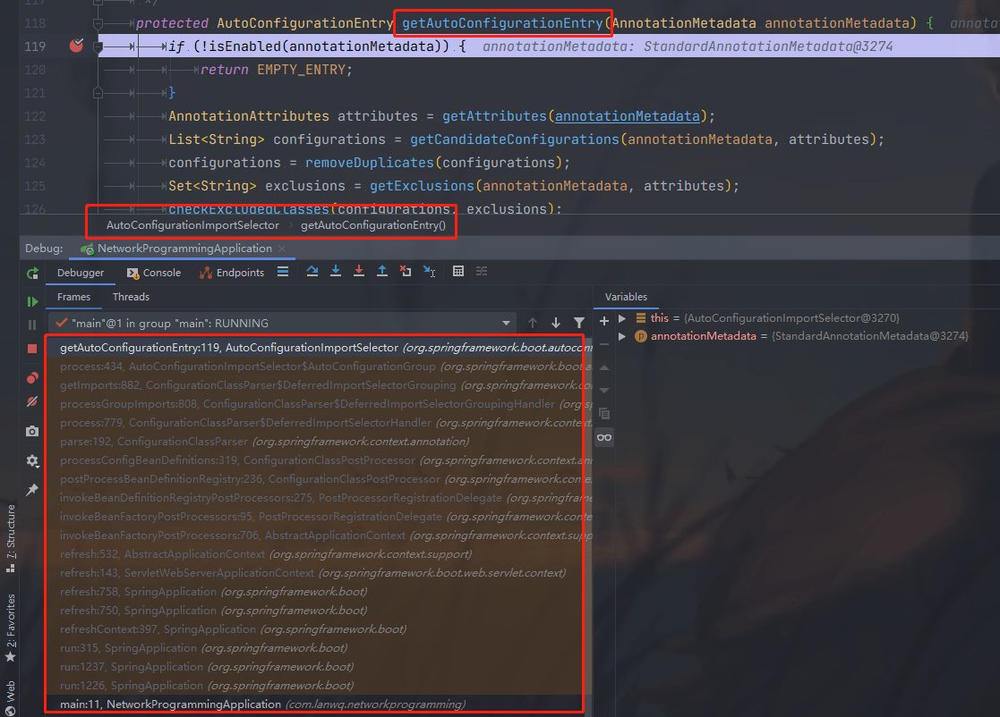
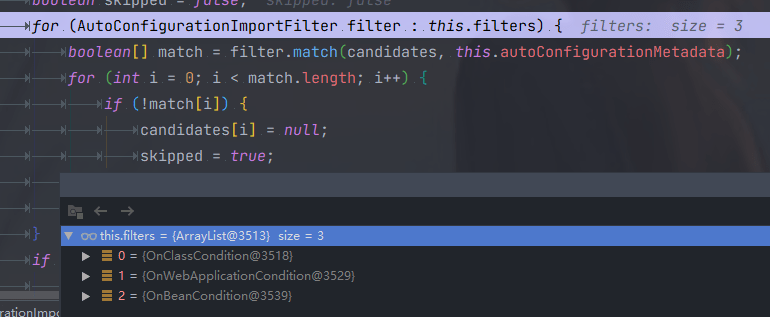

### Web

##### JSP静态包含和动态包含的区别？

- 静态包含，<%@include file="xxx.jsp"%>为jsp中的编译指令，其文件的包含是发生在jsp向servlet转换的时期；动态包含，<jsp:include page="xxx.jsp">是jsp中的动作指令，其文件的包含是发生在编译时期，也就是将java文件编译为class文件的时期。
- 使用静态包含只会产生一个class文件，而使用动态包含则会产生多个class文件。
- 使用**静态包含**，包含页面和被包含页面的request对象为同一对象，因为静态包含只是将被包含的页面的内容复制到包含的页面中去；而**动态包含**包含页面和被包含页面**不是同一个页面**，被包含的页面的request对象可以取到的参数范围要相对大些，不仅可以取到传递到包含页面的参数，同样也能取得在包含页面向下传递的参数。

##### JSP的一些内置对象

##### Cookie和Session的区别？

Cookie是会话技术。cookie数据存放在客户的浏览器上，session数据放在服务器上

cookie不是很安全，别人可以分析存放在本地的COOKIE并进行COOKIE欺骗,如果主要考虑到安全应当使用session。

session会在一定时间内保存在服务器上。当访问量增多时，占用服务器的性能，如果考虑到减轻服务器的性能方面应该使用cookie。

单个cookie在客户端的限制是3K，就是说一个站点在客户端存放的COOKIE不能3K。

##### Tomcat容器是如何创建servlet类实例？用到了什么原理？

当容器启动时，会读取在webapps目录下所有web应用中的web.xml文件，然后对web.xml文件进行解析，并读取servlet的注册信息。然后将每个应用的中注册的servlet类都进行实例化，通过反射的方法，有时也在第一次请求的时候实例化。   

 在注册servlet时加上<load-on-startup>1<load-on-startup>，它表示是否再web应用程序启动的时候就加载这个servlet。指定**启动的servlet的加载的先后顺序**，它的值必须是一个整数。如果该元素的值是一个**负数或者没有设置，则容器会当servlet被请求时再加载**。如果值为**正整数或者0**时，表示容器在应用启动时就加载并初始化这个servlet，**值越小，servlet的优先级越高，就越先被加载**。值相同时，容器就会自己选择顺序来加载。

##### [图解Tomcat类加载机制(阿里面试题) - aspirant - 博客园 (cnblogs.com)](https://www.cnblogs.com/aspirant/p/8991830.html) 

##### servlet 生命周期

> https://blog.csdn.net/zhouym_/article/details/90741337 
>
> servlet的生命周期就是从servlet出现到销毁的全过程。主要分为以下几个阶段：
> 加载类—>实例化(为对象分配空间)—>初始化(为对象的属性赋值)—>请求处理(服务阶段)—>销毁
>
> 服务器启动时(web.xml中配置load-on-startup=1，默认为0)或者第一次请求该servlet时，就会初始化一个Servlet对象，也就是会执行初始化方法init(ServletConfig conf),该servlet对象去处理所有客户端请求，service(ServletRequest req,ServletResponse res)方法中执行，最后服务器关闭时，才会销毁这个servlet对象，执行destroy()方法。其中加载阶段无法观察，但是初始化、服务、销毁阶段是可以观察到的。
>
> 

- 为什么创建的servlet是继承自httpServlet，而不是直接实现Servlet接口

> HttpServlet继承了GenericServlet，GenericServlet是一个通用的Servlet，那么他的作用是什么呢？大概的就是将实现Servlet接口的方法，简化编写servlet的步骤，GenericServlet 实现了Servlet接口和ServletConfig接口
>
> ```jav
> public interface Servlet {
> 	void init(ServletConfig var1) throws ServletException;
> 	ServletConfig getServletConfig();
> 	void service(ServletRequest var1, ServletResponse var2) throws ServletException, IOException;
> 	String getServletInfo();
> 	void destroy();
> }
> 
> Servlet生命周期的三个关键方法，init、service、destroy。还有另外两个方法，一个getServletConfig()方法来获取ServletConfig对象，ServletConfig对象可以获取到Servlet的一些信息，ServletName、ServletContext、InitParameter、InitParameterNames、通过查看ServletConfig这个接口就可以知道
> ```
>
> 三个生命周期运行的方法，获取ServletConfig，而通过ServletConfig又可以获取到ServletContext。而GenericServlet实现了Servlet接口后，也就说明我们可以直接继承GenericServlet，就可以使用上面我们所介绍Servlet接口中的那几个方法了，能拿到ServletConfig，也可以拿到ServletContext，不过那样太麻烦，不能直接获取ServletContext，所以GenericServlet除了实现Servlet接口外，还实现了ServletConfig接口，那样，就可以直接获取ServletContext了


#### Spring

##### spring mvc的原理

##### spring 事务

注解、声明式

##### @Transaction 什么时候失效

##### spring 中使用到的模式

- 工厂模式
- 建造者模式

```java
// 加载 xml 文件，建造者模式+工厂模式使用。 org.springframework.beans.factory.xml.DefaultDocumentLoader#loadDocument 
public Document loadDocument(InputSource inputSource, EntityResolver entityResolver,
                             ErrorHandler errorHandler, int validationMode, boolean namespaceAware) throws Exception {

    DocumentBuilderFactory factory = createDocumentBuilderFactory(validationMode, namespaceAware);
    if (logger.isTraceEnabled()) {
        logger.trace("Using JAXP provider [" + factory.getClass().getName() + "]");
    }
    DocumentBuilder builder = createDocumentBuilder(factory, entityResolver, errorHandler);
    return builder.parse(inputSource);
}
```

- 模板方法模式

```java
//org.springframework.beans.factory.xml.DefaultBeanDefinitionDocumentReader#doRegisterBeanDefinitions, 这里的 root  是 <beans xxxx></beans>
protected void doRegisterBeanDefinitions(Element root) {
		// Any nested <beans> elements will cause recursion in this method. In
		// order to propagate and preserve <beans> default-* attributes correctly,
		// keep track of the current (parent) delegate, which may be null. Create
		// the new (child) delegate with a reference to the parent for fallback purposes,
		// then ultimately reset this.delegate back to its original (parent) reference.
		// this behavior emulates a stack of delegates without actually necessitating one.
		BeanDefinitionParserDelegate parent = this.delegate;
		this.delegate = createDelegate(getReaderContext(), root, parent);

		if (this.delegate.isDefaultNamespace(root)) {
			String profileSpec = root.getAttribute(PROFILE_ATTRIBUTE);
			if (StringUtils.hasText(profileSpec)) {
				String[] specifiedProfiles = StringUtils.tokenizeToStringArray(
						profileSpec, BeanDefinitionParserDelegate.MULTI_VALUE_ATTRIBUTE_DELIMITERS);
				// We cannot use Profiles.of(...) since profile expressions are not supported
				// in XML config. See SPR-12458 for details.
				if (!getReaderContext().getEnvironment().acceptsProfiles(specifiedProfiles)) {
					if (logger.isDebugEnabled()) {
						logger.debug("Skipped XML bean definition file due to specified profiles [" + profileSpec +
								"] not matching: " + getReaderContext().getResource());
					}
					return;
				}
			}
		}
// 模板方法模式，提供给子类进行实现，默认是没有实现的，protected 方法
		preProcessXml(root);
		parseBeanDefinitions(root, this.delegate);
		postProcessXml(root);

		this.delegate = parent;
	}
```

- 观察者模式（spring 的事件监听机制使用的是这个模式）

#### SpringBoot

##### SpringBoot 是如何实现自动装配的

spring boot的核心注解：`@SpringBootApplication`

```java
@Target(ElementType.TYPE)
@Retention(RetentionPolicy.RUNTIME)
@Documented
@Inherited
@SpringBootConfiguration
@EnableAutoConfiguration
@ComponentScan(excludeFilters = { @Filter(type = FilterType.CUSTOM, classes = TypeExcludeFilter.class),
      @Filter(type = FilterType.CUSTOM, classes = AutoConfigurationExcludeFilter.class) })
public @interface SpringBootApplication {
}

@Target(ElementType.TYPE)
@Retention(RetentionPolicy.RUNTIME)
@Documented
@Configuration
public @interface SpringBootConfiguration {
}
```

###### 核心注解

`@EnableAutoConfiguration`：启用 SpringBoot 的自动配置机制

`@Configuration`：允许在上下文中注册额外的 bean 或导入其他配置类

`@ComponentScan`： 扫描被`@Component` (`@Service`,`@Controller`)注解的 bean，注解默认会扫描启动类所在的包下所有的类 ，可以自定义不扫描某些 bean。如下图所示，容器中将排除`TypeExcludeFilter`和`AutoConfigurationExcludeFilter`。

**@EnableAutoConfiguration:实现自动装配的核心注解**

```java
@Target({ElementType.TYPE})
@Retention(RetentionPolicy.RUNTIME)
@Documented
@Inherited
@AutoConfigurationPackage //作用：将main包下的所有组件注册到容器中
@Import({AutoConfigurationImportSelector.class}) //加载自动装配类 xxxAutoconfiguration
public @interface EnableAutoConfiguration {
    String ENABLED_OVERRIDE_PROPERTY = "spring.boot.enableautoconfiguration";

    Class<?>[] exclude() default {};

    String[] excludeName() default {};
}
```

**AutoConfigurationImportSelector**

```java
public class AutoConfigurationImportSelector implements DeferredImportSelector, BeanClassLoaderAware, ResourceLoaderAware, BeanFactoryAware, EnvironmentAware, Ordered {

}
public interface DeferredImportSelector extends ImportSelector {

}
public interface ImportSelector {
    String[] selectImports(AnnotationMetadata importingClassMetadata);
}
```

AutoConfigurationImportSelector 实现了这个方法：该方法主要用于**获取所有符合条件的类的全限定类名，这些类需要被加载到 IoC 容器中**。

```java
private static final String[] NO_IMPORTS = new String[0];

public String[] selectImports(AnnotationMetadata annotationMetadata) {
    // <1>.判断自动装配开关是否打开
    if (!this.isEnabled(annotationMetadata)) {
        return NO_IMPORTS;
    } else {
        //<2>.获取所有需要装配的bean
        AutoConfigurationMetadata autoConfigurationMetadata = AutoConfigurationMetadataLoader.loadMetadata(this.beanClassLoader);
        AutoConfigurationImportSelector.AutoConfigurationEntry autoConfigurationEntry = this.getAutoConfigurationEntry(autoConfigurationMetadata, annotationMetadata);
        return StringUtils.toStringArray(autoConfigurationEntry.getConfigurations());
    }
}
```

将断点打到这个方法，发现不会进入。

org.springframework.context.annotation.ConfigurationClassParser.processImports 在这个方法里面有执行 selector.selectImports 的调用。

```java
private void processImports(ConfigurationClass configClass, SourceClass currentSourceClass,
			Collection<SourceClass> importCandidates, boolean checkForCircularImports) {
    ...
    if (candidate.isAssignable(ImportSelector.class)) {
        // Candidate class is an ImportSelector -> delegate to it to determine imports
        Class<?> candidateClass = candidate.loadClass();
        ImportSelector selector = BeanUtils.instantiateClass(candidateClass, ImportSelector.class);
        ParserStrategyUtils.invokeAwareMethods(
                selector, this.environment, this.resourceLoader, this.registry);
        if (selector instanceof DeferredImportSelector) { // 如果实现了接口DeferredImportSelector 则添加到名为deferredImportSelectors的list中暂存
            this.deferredImportSelectorHandler.handle(
                    configClass, (DeferredImportSelector) selector);
        }
        else { // 否则执行selectImports方法
            String[] importClassNames = selector.selectImports(currentSourceClass.getMetadata());
            Collection<SourceClass> importSourceClasses = asSourceClasses(importClassNames);
            processImports(configClass, currentSourceClass, importSourceClasses, false);
        }
    }
    ...
}
```

调用栈如图：



```java
public void parse(Set<BeanDefinitionHolder> configCandidates) {
    for (BeanDefinitionHolder holder : configCandidates) {
        BeanDefinition bd = holder.getBeanDefinition();
        try {
            if (bd instanceof AnnotatedBeanDefinition) {
                // 先解析扫描bean, 在此方法中向deferredImportSelectorHandler中添加了一个对象, 存储了可延迟导入的selector列表
                parse(((AnnotatedBeanDefinition) bd).getMetadata(), holder.getBeanName());
            }
            else if (bd instanceof AbstractBeanDefinition && ((AbstractBeanDefinition) bd).hasBeanClass()) {
                parse(((AbstractBeanDefinition) bd).getBeanClass(), holder.getBeanName());
            }
            else {
                parse(bd.getBeanClassName(), holder.getBeanName());
            }
        }
        catch (BeanDefinitionStoreException ex) {
            throw ex;
        }
        catch (Throwable ex) {
            throw new BeanDefinitionStoreException(
                    "Failed to parse configuration class [" + bd.getBeanClassName() + "]", ex);
        }
    }
    // 执行对象的process方法
    this.deferredImportSelectorHandler.process();
}
```

org.springframework.context.annotation.ConfigurationClassParser.DeferredImportSelectorHandler#process 

```java
public void process() {
   List<DeferredImportSelectorHolder> deferredImports = this.deferredImportSelectors;
   this.deferredImportSelectors = null;
   try {
      if (deferredImports != null) {
         DeferredImportSelectorGroupingHandler handler = new DeferredImportSelectorGroupingHandler();
         deferredImports.sort(DEFERRED_IMPORT_COMPARATOR);
         // 这里需要注册
         deferredImports.forEach(handler::register);
         handler.processGroupImports();
      }
   }
   finally {
      this.deferredImportSelectors = new ArrayList<>();
   }
}
```

org.springframework.context.annotation.ConfigurationClassParser.DeferredImportSelectorGroupingHandler.register

```java
public void register(DeferredImportSelectorHolder deferredImport) {
    // 调用org.springframework.boot.autoconfigure.AutoConfigurationImportSelector.getImportGroup 返回AutoConfigurationGroup.class
    Class<? extends Group> group = deferredImport.getImportSelector().getImportGroup();
    // 创建Group对象, 用DeferredImportSelectorGrouping包装并存入到map中
    DeferredImportSelectorGrouping grouping = this.groupings.computeIfAbsent(
            (group != null ? group : deferredImport),
            key -> new DeferredImportSelectorGrouping(createGroup(group)));
    // 向deferredImports对象添加元素, 后面会使用
    grouping.add(deferredImport);
    // 存入map中 key为启动类的元数据 value是启动类
    this.configurationClasses.put(deferredImport.getConfigurationClass().getMetadata(),
            deferredImport.getConfigurationClass());
}
```

org.springframework.context.annotation.ConfigurationClassParser.DeferredImportSelectorGroupingHandler.processGroupImports

```java
public void processGroupImports() {
    for (DeferredImportSelectorGrouping grouping : this.groupings.values()) { // 只有一个元素, 上个方法放入的
        grouping.getImports().forEach(entry -> { // 重点解析
            // 获取主配置类 启动类
            ConfigurationClass configurationClass = this.configurationClasses.get(entry.getMetadata());
            try {
                // 逐个执行导入 至此执行完成后, 扫描出的类都会注册到BeanDefinition中 等待Spring容器对对象实例化和初始化
                processImports(configurationClass, asSourceClass(configurationClass),
                        asSourceClasses(entry.getImportClassName()), false);
            }
            catch (BeanDefinitionStoreException ex) {
                throw ex;
            }
            catch (Throwable ex) {
                throw new BeanDefinitionStoreException(
                        "Failed to process import candidates for configuration class [" +
                                configurationClass.getMetadata().getClassName() + "]", ex);
            }
        });
    }
}
```

org.springframework.context.annotation.ConfigurationClassParser.DeferredImportSelectorGrouping.getImports

```java
public Iterable<Group.Entry> getImports() {
    // 前面放入的一个元素 此处循环
    for (DeferredImportSelectorHolder deferredImport : this.deferredImports) {
        // group为AutoConfigurationGroup对象 执行org.springframework.boot.autoconfigure.AutoConfigurationImportSelector.AutoConfigurationGroup.process方法
        this.group.process(deferredImport.getConfigurationClass().getMetadata(),
                deferredImport.getImportSelector());
    }
    // 对map结果去重、排序并返回
    return this.group.selectImports();
}
```

org.springframework.boot.autoconfigure.AutoConfigurationImportSelector.AutoConfigurationGroup.process

```java
public void process(AnnotationMetadata annotationMetadata,
        DeferredImportSelector deferredImportSelector) {
    // 断言
    Assert.state(
            deferredImportSelector instanceof AutoConfigurationImportSelector,
            () -> String.format("Only %s implementations are supported, got %s",
                    AutoConfigurationImportSelector.class.getSimpleName(),
                    deferredImportSelector.getClass().getName()));
    // 调用getAutoConfigurationEntry检索spring.factories文件, 存储并排除文件中配置的bean
    AutoConfigurationEntry autoConfigurationEntry = ((AutoConfigurationImportSelector) deferredImportSelector)
            .getAutoConfigurationEntry(getAutoConfigurationMetadata(),  // 获取了所有包中的spring.factories文件配置参数
                annotationMetadata);

    this.autoConfigurationEntries.add(autoConfigurationEntry);
    for (String importClassName : autoConfigurationEntry.getConfigurations()) {
        // 将过滤后的类存入到entries map中
        this.entries.putIfAbsent(importClassName, annotationMetadata);
    }
}
```

调用`getAutoConfigurationEntry()`方法，这个方法主要负责加载自动配置类的。调用栈如上图

```java
protected AutoConfigurationEntry getAutoConfigurationEntry(
        AutoConfigurationMetadata autoConfigurationMetadata,
        AnnotationMetadata annotationMetadata) {
    if (!isEnabled(annotationMetadata)) {
        return EMPTY_ENTRY;
    }
    //(2) 获取EnableAutoConfiguration注解的属性,获取EnableAutoConfiguration注解中的 exclude 和 excludeName
    AnnotationAttributes attributes = getAttributes(annotationMetadata);
    //(3) 扫描各个包下META-INF/spring.factories文件中配置EnableAutoConfiguration 大约100+ 
    List<String> configurations = getCandidateConfigurations(annotationMetadata, attributes);
    //(4) Link转Array
    configurations = removeDuplicates(configurations);
    // 获取注解上排除的类  @SpringBootApplication(exclude= {DataSourceAutoConfiguration.class})
    Set<String> exclusions = getExclusions(annotationMetadata, attributes);
    checkExcludedClasses(configurations, exclusions);
    // 去掉排除的类
    configurations.removeAll(exclusions);
    // 使用filter过滤 过滤不存在的类(尝试加载 异常说明不存在)
    configurations = filter(configurations, autoConfigurationMetadata);
    // 发送一个AutoConfigurationImportEvent事件通知
    fireAutoConfigurationImportEvents(configurations, exclusions);
    return new AutoConfigurationEntry(configurations, exclusions);
}
```

流程

```java
protected List<String> getCandidateConfigurations(AnnotationMetadata metadata, AnnotationAttributes attributes) {
   List<String> configurations = SpringFactoriesLoader.loadFactoryNames(getSpringFactoriesLoaderFactoryClass(),
         getBeanClassLoader());
   Assert.notEmpty(configurations, "No auto configuration classes found in META-INF/spring.factories. If you "
         + "are using a custom packaging, make sure that file is correct.");
   return configurations;
}

public static List<String> loadFactoryNames(Class<?> factoryType, @Nullable ClassLoader classLoader) {
    String factoryTypeName = factoryType.getName();
    return loadSpringFactories(classLoader).getOrDefault(factoryTypeName, Collections.emptyList());
}
```

```java
/**
	 * 加载Factories文件
	 *
	 * @param classLoader factories文件解析之后的map
	 * @return
	 */
private static Map<String, List<String>> loadSpringFactories(ClassLoader classLoader) {
    // 现在缓存中查找，classLoader为key
    Map<String, List<String>> result = cache.get(classLoader);
    if (result != null) {
        return result;
    }

    result = new HashMap<>();
    try {
        // 获取资源，这里固定目录为：META-INF/spring.factories
        Enumeration<URL> urls = classLoader.getResources(FACTORIES_RESOURCE_LOCATION);
        while (urls.hasMoreElements()) {
            URL url = urls.nextElement();
            UrlResource resource = new UrlResource(url);
            // 将资源加载为Properties
            Properties properties = PropertiesLoaderUtils.loadProperties(resource);
            // 遍历配置
            for (Map.Entry<?, ?> entry : properties.entrySet()) {
                String factoryTypeName = ((String) entry.getKey()).trim();
                // 获取value的数组，一般为类的全限定名
                // 比如 org.springframework.beans.BeanInfoFactory=org.springframework.beans.ExtendedBeanInfoFactory
                String[] factoryImplementationNames =
                    StringUtils.commaDelimitedListToStringArray((String) entry.getValue());
                // 添加到result
                for (String factoryImplementationName : factoryImplementationNames) {
                    result.computeIfAbsent(factoryTypeName, key -> new ArrayList<>())
                        .add(factoryImplementationName.trim());
                }
            }
        }

        // 对value进行去重
        result.replaceAll((factoryType, implementations) -> implementations.stream().distinct()
                          .collect(Collectors.collectingAndThen(Collectors.toList(), Collections::unmodifiableList)));
        // 添加到缓存中
        cache.put(classLoader, result);
    } catch (IOException ex) {
        throw new IllegalArgumentException("Unable to load factories from location [" +
                                           FACTORIES_RESOURCE_LOCATION + "]", ex);
    }
    return result;
}
```

获取需要自动装配的所有配置类，读取`META-INF/spring.factories`

> spring-boot/spring-boot-project/spring-boot-autoconfigure/src/main/resources/META-INF/spring.factories


不光是这个依赖下的`META-INF/spring.factories`被读取到，所有 Spring Boot Starter 下的`META-INF/spring.factories`都会被读取到。

所以，你可以清楚滴看到， druid 数据库连接池的 Spring Boot Starter 就创建了`META-INF/spring.factories`文件。

如果，我们自己要创建一个 Spring Boot Starter，这一步是必不可少的。

最后使用filter过滤掉了不符合条件的类。

```java
@Configuration
// 检查相关的类：RabbitTemplate 和 Channel是否存在
// 存在才会加载
@ConditionalOnClass({ RabbitTemplate.class, Channel.class })
@EnableConfigurationProperties(RabbitProperties.class)
@Import(RabbitAnnotationDrivenConfiguration.class)
public class RabbitAutoConfiguration {
}
```



