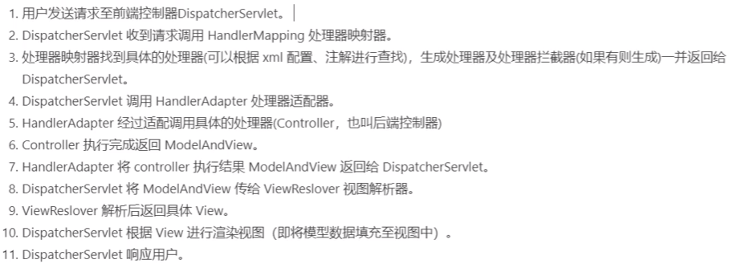
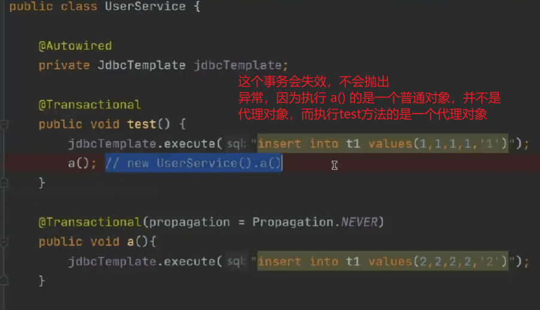
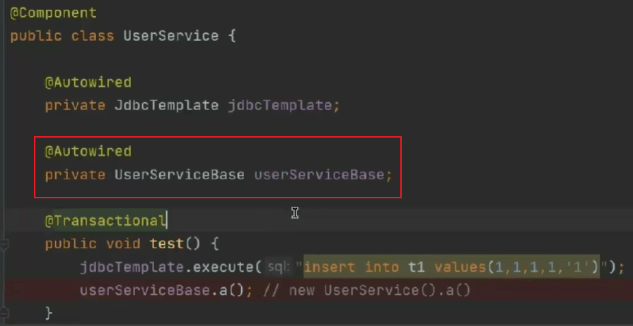

#### Web

##### JSP静态包含和动态包含的区别？

- 静态包含，<%@include file="xxx.jsp"%>为jsp中的编译指令，其文件的包含是发生在jsp向servlet转换的时期；动态包含，<jsp:include page="xxx.jsp">是jsp中的动作指令，其文件的包含是发生在编译时期，也就是将java文件编译为class文件的时期。
- 使用静态包含只会产生一个class文件，而使用动态包含则会产生多个class文件。
- 使用**静态包含**，包含页面和被包含页面的request对象为同一对象，因为静态包含只是将被包含的页面的内容复制到包含的页面中去；而**动态包含**包含页面和被包含页面**不是同一个页面**，被包含的页面的request对象可以取到的参数范围要相对大些，不仅可以取到传递到包含页面的参数，同样也能取得在包含页面向下传递的参数。

##### JSP的一些内置对象

##### Cookie和Session的区别？

Cookie是会话技术。cookie数据存放在客户的浏览器上，session数据放在服务器上

cookie不是很安全，别人可以分析存放在本地的COOKIE并进行COOKIE欺骗,如果主要考虑到安全应当使用session。

session会在一定时间内保存在服务器上。当访问量增多时，占用服务器的性能，如果考虑到减轻服务器的性能方面应该使用cookie。

单个cookie在客户端的限制是3K，就是说一个站点在客户端存放的COOKIE不能3K。

##### Tomcat容器是如何创建servlet类实例？用到了什么原理？

当容器启动时，会读取在webapps目录下所有web应用中的web.xml文件，然后对web.xml文件进行解析，并读取servlet的注册信息。然后将每个应用的中注册的servlet类都进行实例化，通过反射的方法，有时也在第一次请求的时候实例化。   

 在注册servlet时加上<load-on-startup>1<load-on-startup>，它表示是否再web应用程序启动的时候就加载这个servlet。指定**启动的servlet的加载的先后顺序**，它的值必须是一个整数。如果该元素的值是一个**负数或者没有设置，则容器会当servlet被请求时再加载**。如果值为**正整数或者0**时，表示容器在应用启动时就加载并初始化这个servlet，**值越小，servlet的优先级越高，就越先被加载**。值相同时，容器就会自己选择顺序来加载。

##### [图解Tomcat类加载机制(阿里面试题) - aspirant - 博客园 (cnblogs.com)](https://www.cnblogs.com/aspirant/p/8991830.html) 

##### servlet 生命周期

> https://blog.csdn.net/zhouym_/article/details/90741337 
>
> servlet的生命周期就是从servlet出现到销毁的全过程。主要分为以下几个阶段：
> 加载类—>实例化(为对象分配空间)—>初始化(为对象的属性赋值)—>请求处理(服务阶段)—>销毁
>
> 服务器启动时(web.xml中配置load-on-startup=1，默认为0)或者第一次请求该servlet时，就会初始化一个Servlet对象，也就是会执行初始化方法init(ServletConfig conf),该servlet对象去处理所有客户端请求，service(ServletRequest req,ServletResponse res)方法中执行，最后服务器关闭时，才会销毁这个servlet对象，执行destroy()方法。其中加载阶段无法观察，但是初始化、服务、销毁阶段是可以观察到的。
>
> 

- 为什么创建的servlet是继承自httpServlet，而不是直接实现Servlet接口

> HttpServlet继承了GenericServlet，GenericServlet是一个通用的Servlet，那么他的作用是什么呢？大概的就是将实现Servlet接口的方法，简化编写servlet的步骤，GenericServlet 实现了Servlet接口和ServletConfig接口
>
> ```jav
> public interface Servlet {
> 	void init(ServletConfig var1) throws ServletException;
> 	ServletConfig getServletConfig();
> 	void service(ServletRequest var1, ServletResponse var2) throws ServletException, IOException;
> 	String getServletInfo();
> 	void destroy();
> }
> 
> Servlet生命周期的三个关键方法，init、service、destroy。还有另外两个方法，一个getServletConfig()方法来获取ServletConfig对象，ServletConfig对象可以获取到Servlet的一些信息，ServletName、ServletContext、InitParameter、InitParameterNames、通过查看ServletConfig这个接口就可以知道
> ```
>
> 三个生命周期运行的方法，获取ServletConfig，而通过ServletConfig又可以获取到ServletContext。而GenericServlet实现了Servlet接口后，也就说明我们可以直接继承GenericServlet，就可以使用上面我们所介绍Servlet接口中的那几个方法了，能拿到ServletConfig，也可以拿到ServletContext，不过那样太麻烦，不能直接获取ServletContext，所以GenericServlet除了实现Servlet接口外，还实现了ServletConfig接口，那样，就可以直接获取ServletContext了

##### servlet 3 异步

https://cloud.tencent.com/developer/article/1810816

#### Spring

##### spring mvc的原理

源码解析在文件：readingNotes/Spring源码解析/Spring-MVC 源码

图示：


文字版本：



##### spring 事务

注解、声明式

##### @Transactional 执行流程

Spring事务底层是基于数据库事务和AOP机制的；

1. ⾸先对于使⽤了@Transactional注解的Bean，Spring会创建⼀个代理对象作为Bean；
2. 当调⽤代理对象的⽅法时，会先判断该⽅法上是否加了@Transactional注解；
3. 如果加了，那么则利⽤事务管理器创建⼀个数据库连接；
4. **并且修改数据库连接的autocommit属性为false，禁⽌此连接的⾃动提交**，这是实现Spring事务⾮常重要的⼀步；然后执⾏当前⽅法，⽅法中会执⾏sql；执⾏完当前⽅法后，如果没有出现异常就直接提交事务；如果出现了异常，并且这个异常是需要回滚的就会回滚事务，否则仍然提交事务；
5. Spring事务的隔离级别对应的就是数据库的隔离级别；
6. Spring事务的传播机制是Spring事务⾃⼰实现的，也是Spring事务中最复杂的；
7. Spring事务的传播机制是基于数据库连接来做的，⼀个数据库连接⼀个事务，如果传播机制配置为需要新开⼀个事务，那么实际上就是先建⽴⼀个数据库连接，在此新数据库连接上执⾏sql。

https://juejin.cn/post/7022694129859559455

##### @Transactional 什么时候失效

https://juejin.cn/post/6844904096747503629

###### Transactional 用于那些地方

- 类
- 方法
- 接口（不推荐使用这种方法，因为一旦标注在Interface上并且配置了Spring AOP 使用CGLib动态代理，将会导致@Transactional注解失效）

###### Propagation 属性

`propagation` 代表事务的传播行为，默认值为 `Propagation.REQUIRED`，其他的属性信息如下：

- `Propagation.REQUIRED`：如果当前存在事务，则加入该事务，如果当前不存在事务，则创建一个新的事务。( 也就是说如果A方法和B方法都添加了注解，在默认传播模式下，A方法内部调用B方法，会把两个方法的事务合并为一个事务 ）。
- `Propagation.SUPPORTS`：如果当前存在事务，则加入该事务；如果当前不存在事务，则以非事务的方式继续运行。
- `Propagation.MANDATORY`：如果当前存在事务，则加入该事务；如果当前不存在事务，则抛出异常。
- `Propagation.REQUIRES_NEW`：重新创建一个新的事务，如果当前存在事务，暂停当前的事务。( 当类A中的 a 方法用默认`Propagation.REQUIRED`模式，类B中的 b方法加上采用 `Propagation.REQUIRES_NEW`模式，然后在 a 方法中调用 b方法操作数据库，然而 a方法抛出异常后，b方法并没有进行回滚，因为`Propagation.REQUIRES_NEW`会暂停 a方法的事务 )
- `Propagation.NOT_SUPPORTED`：以非事务的方式运行，如果当前存在事务，暂停当前的事务。
- `Propagation.NEVER`：以非事务的方式运行，如果当前存在事务，则抛出异常。
- `Propagation.NESTED` ：和 Propagation.REQUIRED 效果一样。

###### isolation 属性

`isolation` ：事务的隔离级别，默认值为 `Isolation.DEFAULT`。

- Isolation.DEFAULT：使用底层数据库默认的隔离级别。
- Isolation.READ_UNCOMMITTED
- Isolation.READ_COMMITTED
- Isolation.REPEATABLE_READ
- Isolation.SERIALIZABLE

###### timeout 属性

`timeout` ：事务的超时时间，默认值为 -1。如果超过该时间限制但事务还没有完成，则自动回滚事务。

###### readOnly 属性

`readOnly` ：指定事务是否为只读事务，默认值为 false；为了忽略那些不需要事务的方法，比如读取数据，可以设置 read-only 为 true。

###### rollbackFor 属性

`rollbackFor` ：用于指定能够触发事务回滚的异常类型，可以指定多个异常类型。

###### noRollbackFor属性

`noRollbackFor`：抛出指定的异常类型，不回滚事务，也可以指定多个异常类型。

###### 失效场景



解决方法：定义另一个类，通过这个类调用 a()，这个NEVER就会抛出异常。UserServiceBase 是代理对象。也可以将UserSerivce自己注入自己。




1. **@Transactional 应用在非 public 修饰的方法上**。

   > 
   >
   > 之所以会失效是因为在Spring AOP 代理时，如上图所示 `TransactionInterceptor` （事务拦截器）在目标方法执行前后进行拦截，`DynamicAdvisedInterceptor`（CglibAopProxy 的内部类）的 intercept 方法或 `JdkDynamicAopProxy` 的 invoke 方法会间接调用 `AbstractFallbackTransactionAttributeSource`的 `computeTransactionAttribute` 方法，获取Transactional 注解的事务配置信息。
   >
   > ```java
   > protected TransactionAttribute computeTransactionAttribute(Method method,
   >     Class<?> targetClass) {
   >         // Don't allow no-public methods as required.
   >         if (allowPublicMethodsOnly() && !Modifier.isPublic(method.getModifiers())) {
   >         return null;
   > }
   > 
   > ```
   >
   > 此方法会检查目标方法的修饰符是否为 public，不是 public则不会获取@Transactional 的属性配置信息。
   >
   > **注意：`protected`、`private` 修饰的方法上使用 `@Transactional` 注解，虽然事务无效，但不会有任何报错，这是我们很容犯错的一点**。

2. **@Transactional 注解属性 propagation 设置错误**

   > `TransactionDefinition.PROPAGATION_SUPPORTS`：如果当前存在事务，则加入该事务；如果当前没有事务，则以非事务的方式继续运行。 `TransactionDefinition.PROPAGATION_NOT_SUPPORTED`：以非事务方式运行，如果当前存在事务，则把当前事务挂起。 `TransactionDefinition.PROPAGATION_NEVER`：以非事务方式运行，如果当前存在事务，则抛出异常。

3. **@Transactional 注解属性 rollbackFor 设置错误**

   > `rollbackFor` 可以指定能够触发事务回滚的异常类型。Spring默认抛出了未检查`unchecked`异常（继承自 `RuntimeException` 的异常）或者 `Error`才回滚事务；其他异常不会触发回滚事务。如果在事务中抛出其他类型的异常，但却期望 Spring 能够回滚事务，就需要指定 **rollbackFor**属性。
   >
   > 
   >
   > ```java
   > // 希望自定义的异常可以进行回滚
   > @Transactional(propagation= Propagation.REQUIRED,rollbackFor= MyException.class
   > ```
   >
   > 若在目标方法中抛出的异常是 `rollbackFor` 指定的异常的子类，事务同样会回滚。Spring源码如下：
   >
   > ```java
   > private int getDepth(Class<?> exceptionClass, int depth) {
   >         if (exceptionClass.getName().contains(this.exceptionName)) {
   >             // Found it!
   >             return depth;
   > }
   >         // If we've gone as far as we can go and haven't found it...
   >         if (exceptionClass == Throwable.class) {
   >             return -1;
   > }
   > return getDepth(exceptionClass.getSuperclass(), depth + 1);
   > }
   > 
   > ```
   >
   
4. **同一个类中方法调用，导致@Transactional失效**

   > 开发中避免不了会对同一个类里面的方法调用，比如有一个类Test，它的一个方法A，A再调用本类的方法B（不论方法B是用public还是private修饰），但方法A没有声明注解事务，而B方法有。则外部调用方法A之后，方法B的事务是不会起作用的。这也是经常犯错误的一个地方。
   >
   > 那为啥会出现这种情况？其实这还是由于使用`Spring AOP`代理造成的，因为只有当事务方法被当前类以外的代码调用时，才会由`Spring`生成的代理对象来管理。

5. **异常被你的 catch“吃了”导致@Transactional失效**

   > ```java
   > @Transactional
   > private Integer A() throws Exception {
   >     int insert = 0;
   >     try {
   >         CityInfoDict cityInfoDict = new CityInfoDict();
   >         cityInfoDict.setCityName("2");
   >         cityInfoDict.setParentCityId(2);
   >         /**
   >              * A 插入字段为 2的数据
   >              */
   >         insert = cityInfoDictMapper.insert(cityInfoDict);
   >         /**
   >              * B 插入字段为 3的数据
   >              */
   >         b.insertB();
   >     } catch (Exception e) {
   >         e.printStackTrace();
   >     }
   > }
   > ```
   >
   > 如果B方法内部抛了异常，而A方法此时try catch了B方法的异常，那这个事务还能正常回滚吗？
   >
   > 答案：不能！
   >
   > 会抛出异常：org.springframework.transaction.UnexpectedRollbackException: Transaction rolled back because it has been marked as rollback-only
   >
   > 因为当`ServiceB`中抛出了一个异常以后，`ServiceB`标识当前事务需要`rollback`。但是`ServiceA`中由于你手动的捕获这个异常并进行处理，`ServiceA`认为当前事务应该正常`commit`。此时就出现了前后不一致，也就是因为这样，抛出了前面的`UnexpectedRollbackException`异常。
   >
   > `spring`的事务是在调用业务方法之前开始的，业务方法执行完毕之后才执行`commit` or `rollback`，事务是否执行取决于是否抛出`runtime异常`。如果抛出`runtime exception` 并在你的业务方法中没有catch到的话，事务会回滚。
   >
   > 在业务方法中一般不需要catch异常，如果非要catch一定要抛出`throw new RuntimeException()`，或者注解中指定抛异常类型`@Transactional(rollbackFor=Exception.class)`，否则会导致事务失效，数据commit造成数据不一致，所以有些时候try catch反倒会画蛇添足。

6. **数据库引擎不支持事务**

   > 常用的MySQL数据库默认使用支持事务的`innodb`引擎。一旦数据库引擎切换成不支持事务的`myisam`，那事务就从根本上失效了。


##### spring 中使用到的模式

###### 工厂模式

- BeanFactory
- FactoryBean

###### 建造者模式

```java
// 加载 xml 文件，建造者模式+工厂模式使用。 org.springframework.beans.factory.xml.DefaultDocumentLoader#loadDocument 
public Document loadDocument(InputSource inputSource, EntityResolver entityResolver,
                             ErrorHandler errorHandler, int validationMode, boolean namespaceAware) throws Exception {

    DocumentBuilderFactory factory = createDocumentBuilderFactory(validationMode, namespaceAware);
    if (logger.isTraceEnabled()) {
        logger.trace("Using JAXP provider [" + factory.getClass().getName() + "]");
    }
    DocumentBuilder builder = createDocumentBuilder(factory, entityResolver, errorHandler);
    return builder.parse(inputSource);
}
```

###### 模板方法模式

- JdbcTemplate
- DefaultBeanDefinitionDocumentReader

```java
//org.springframework.beans.factory.xml.DefaultBeanDefinitionDocumentReader#doRegisterBeanDefinitions, 这里的 root  是 <beans xxxx></beans>
protected void doRegisterBeanDefinitions(Element root) {
		// Any nested <beans> elements will cause recursion in this method. In
		// order to propagate and preserve <beans> default-* attributes correctly,
		// keep track of the current (parent) delegate, which may be null. Create
		// the new (child) delegate with a reference to the parent for fallback purposes,
		// then ultimately reset this.delegate back to its original (parent) reference.
		// this behavior emulates a stack of delegates without actually necessitating one.
		BeanDefinitionParserDelegate parent = this.delegate;
		this.delegate = createDelegate(getReaderContext(), root, parent);

		if (this.delegate.isDefaultNamespace(root)) {
			String profileSpec = root.getAttribute(PROFILE_ATTRIBUTE);
			if (StringUtils.hasText(profileSpec)) {
				String[] specifiedProfiles = StringUtils.tokenizeToStringArray(
						profileSpec, BeanDefinitionParserDelegate.MULTI_VALUE_ATTRIBUTE_DELIMITERS);
				// We cannot use Profiles.of(...) since profile expressions are not supported
				// in XML config. See SPR-12458 for details.
				if (!getReaderContext().getEnvironment().acceptsProfiles(specifiedProfiles)) {
					if (logger.isDebugEnabled()) {
						logger.debug("Skipped XML bean definition file due to specified profiles [" + profileSpec +
								"] not matching: " + getReaderContext().getResource());
					}
					return;
				}
			}
		}
// 模板方法模式，提供给子类进行实现，默认是没有实现的，protected 方法
		preProcessXml(root);
		parseBeanDefinitions(root, this.delegate);
		postProcessXml(root);

		this.delegate = parent;
	}
```

###### 观察者模式

- spring 的事件监听机制使用的是这个模式

###### 访问者模式

- PropertyAccess 接口，属性访问器，用来访问和设置某个对象的某个属性

###### 适配器模式

- AdvisorAdapter 接口，适配了 Advisor

###### 装饰器模式

- BeanWrapper

###### 代理模式

- AOP

###### 策略模式

- InstantiationStrategy 

  有两个实现类，SimpleInstantiationStrategy 和 CglibSubclassingInstantiationStrategy

###### 委派模式

- BeanDefinitionParserDelegate

###### 责任链模式

- BeanPostPocessor

##### 为什么设计 IOC 这个东西，为什么使用

IOC是一种思想：**IOC 让程序员不在关注怎么去创建对象，而是关注与对象创建之后的操作，把对象的创建、初始化、销毁等工作交给spring容器来做**。

###### 传统方式

我们使用对象的时候，都需要去new出来对象，对象与对象之间存在强依赖的关系，耦合度非常高，且依赖关系都写死在了代码里面，项目不易修改和维护，必须要修改代码才行。

- 创建了许多重复对象，造成大量资源浪费；
- 更换实现类需要改动多个地方；
- 创建和配置组件工作繁杂，给组件调用方带来极大不便

透过现象看本质，这些问题的出现都是同一个原因：**组件的调用方参与了组件的创建和配置工作**。

如果我们编码时，有一个「东西」能帮助我们创建和配置好那些组件，我们只负责调用该多好。这个「东西」就是容器。

###### IOC 方式

我们可以将需要使用到的类或者接口放在spring 的容器里面，不像传统方式在代码中通过new对象，对象之间相互依赖，导致以后增加接口的话，只能去修改这些相互依赖的地方的源代码，耦合度太高。spring的话就不一样了，我们增加了新的接口或者类，只需要加入到容器中并使用依赖注入，将其依赖进去就行了。

[我们到底为什么要用 IoC 和 AOP](https://www.cnblogs.com/RudeCrab/p/14365296.html)

对象交由容器管理后，默认是单例的，这就解决了资源浪费问题。

若要更换实现类，只需更改 Bean 的声明配置，即可达到无感知更换。

```java
public class UserServiceImpl implements UserService{
    ...
}

// 将该实现类声明为 Bean
@Component
public class OtherUserServiceImpl implements UserService{
    ...
}
```

现在组件的使用和组件的创建与配置完全分离开来。调用方只需调用组件而无需关心其他工作，这极大提高了我们的开发效率，也让整个应用充满了灵活性、扩展性。

##### AOP的理解

###### 没有AOP会怎样

但这里的复用的都是**核心业务逻辑**，并不能复用一些**辅助逻辑**，比如：日志记录、性能统计、安全校验、事务管理，等等。这些边缘逻辑往往贯穿你整个核心业务，传统 OOP 很难将其封装：

```java
public class UserServiceImpl implements UserService {
    @Override
    public void doService() {
        System.out.println("---安全校验---");
        System.out.println("---性能统计 Start---");
        System.out.println("---日志打印 Start---");
        System.out.println("---事务管理 Start---");

        System.out.println("业务逻辑");

        System.out.println("---事务管理 End---");
        System.out.println("---日志打印 End---");
        System.out.println("---性能统计 End---");
    }
}
```

为了方便演示，这里只用了打印语句，就算如此这代码看着也很难受，而且这些逻辑是所有业务方法都要加上，想想都恐怖。

OOP 是至上而下的编程方式，犹如一个树状图，A调用B、B调用C，或者A继承B、B继承C。这种方式对于业务逻辑来说是合适的，通过调用或继承以复用。而辅助逻辑就像一把闸刀横向贯穿所有方法，如图2-4所示


这一条条横线仿佛切开了 OOP 的树状结构，犹如一个大蛋糕被切开多层，每一层都会执行相同的辅助逻辑，所以大家将这些辅助逻辑称为层面或者切面。

代理模式用来增加或增强原有功能再适合不过了，但切面逻辑的难点不是**不修改原有业务**，而是**对所有业务生效**。对一个业务类增强就得新建一个代理类，对所有业务增强，每个类都要新建代理类，这无疑是一场灾难。而且这里只是演示了一个日志打印的切面逻辑，如果我再加一个性能统计切面，就得新建一个切面代理类来代理日志打印的代理类，一旦切面多起来这个代理类嵌套就会非常深。

面向切面编程（Aspect-oriented programming，缩写为 AOP）正是为了解决这一问题而诞生的技术。

###### 面向切面编程

AOP 不是 OOP 的对立面，它是对 OOP 的一种补充。OOP 是纵向的，AOP 是横向的，两者相结合方能构建出良好的程序结构。AOP 技术，**让我们能够不修改原有代码，便能让切面逻辑在所有业务逻辑中生效**。

```java
@Aspect // 声明一个切面
@Component
public class MyAspect {
    // 原业务方法执行前
    @Before("execution(public void com.rudecrab.test.service.*.doService())")
    public void methodBefore() {
        System.out.println("===AspectJ 方法执行前===");
    }

    // 原业务方法执行后
    @AfterReturning("execution(* com.rudecrab.test.service..doService(..))")
    public void methodAddAfterReturning() {
        System.out.println("===AspectJ 方法执行后===");
    }
}
```

无论你有一个业务方法，还是一万个业务方法，对我们开发者来说只需编写一次切面逻辑，就能让所有业务方法生效，极大提高了我们的开发效率。

场景：

1. 统一日志处理

2. 统一异常处理

3. 访问限制（权限，限流等）

4. 事务处理

5. 缓存管理等

6. āop是面向切画编程，通过代理的方式jdk或cglib为程序统一添办功第，解决公共可题

##### spring 中有2个id相同的bean，会报错吗？

（1）如果是xml配置的bean，**在一个xml文件里面有2个id相同的bean，在启动的时候就会报错**，且报错发生在spring对xml文件进行解析的时候，然后转化为BeanDefinition阶段。**如果是在2个xml文件中**，使用了2个id相同的bean，那么ioc容器会在加载bean的时候，**用后者覆盖前者，所以最终只保留一个**（具体是因为加载xml文件是一个一个加载的，多个xml文件中的相同bean id不会有影响）。报错位置：


​	代码，通过证明在识别xml文件的bean对象时候，转化成BeanDefinition报错了。

```xml
<bean id="teacher" class="springtest.lookup.bean.Teacher"/>
<bean id="teacher" class="springtest.lookup.bean.Teacher"/>
```

  > ```java
  > protected void checkNameUniqueness(String beanName, List<String> aliases, Element beanElement) {
  > String foundName = null;
  > 
  > if (StringUtils.hasText(beanName) && this.usedNames.contains(beanName)) {
  >    foundName = beanName;
  > }
  > if (foundName == null) {
  >    foundName = CollectionUtils.findFirstMatch(this.usedNames, aliases);
  > }
  > if (foundName != null) {
  >    error("Bean name '" + foundName + "' is already used in this <beans> element", beanElement);
  > }
  > 
  > this.usedNames.add(beanName);
  > this.usedNames.addAll(aliases);
  > }
  > ```

（2）到了spring3.x版本之后，增加了注解配置方式。可以通过@Configuration来声明一个配置类，然后使用@Bean声明一个Bean，如果我们在同一个配置类里面声明多个相同id的bean，IoC容器就会只会注册第一个声明的Bean，后续重复名字的Bean相当于就会直接忽略。像这样一段代码，在Spring IoC容器中，**就只会保留service1这个实例**。**后续相同名字的Bean就不会再加载，当然也不会报错**。

```java
@Configuration
public class SpringConfiguration {
@Bean( name = "service" )
public Service1 service1( ){
	return new Service1( );
}
@Bean( name = "service" )
public Service2 service2( ){
    return new Service2( );
    }
}
```

（3）如果使用@Autowired注解来实现依赖注入的话，**它是根据类型来注入的**。因为IOC容器只有Service1的实例，所以启动的时候会提示找不到Service2这个实例。

```java
@Autowired
private Service1 service1;
@Autowired
private Service2 service2;
```

如果是@Resource，是根据名称来注入的。那么在IoC容器中只能获取到Service1的实例，于是，Spring会把Service1这个实例赋值给Service2，这个时候，就会提示类型不匹配的错误。

```java
@Resource( name="service" )
private Service1 service1;
@Resource( name="service" )
private Service2 service2;
```

这个需要配置注解驱动开发，使用了 context标签会注入下面这些类


```xml
<context:annotation-config/>
<context:component-scan base-package="springtest.annotation"/>
```

代码报错位置：


##### spring中@Configuration和@Component的区别

原文链接：https://blog.csdn.net/qq_39002724/article/details/112556115

###### 使用@Component

```java
@Component
public class TestConfiguration {

    @Bean
    public Alarm alarm(){
        Alarm alarm = new Alarm();
        alarm.setAlarmDataHistory(alarmDataHistory());
        return alarm;
    }

    @Bean
    public AlarmDataHistory alarmDataHistory(){
        return new AlarmDataHistory();
    }
}
```

后来测试发现，Alarm中AlarmDataHistory对象的hashcode值，和通过alarmDataHistory()返回的hashcode值不一样。违反了spring的单例原则。

###### 使用@Configuration

现在将@Component换成@Configuration，其他不变

测试发现，Alarm中AlarmDataHistory对象的hashcode值，和通过alarmDataHistory()返回的hashcode值是一样的。

先说原因：通过@Configuration方式，最终生成的是TestConfiguration的cglib代理类，此时Alarm中的AlarmDataHistory对象，和通过alarmDataHistory()返回AlarmDataHistory对象，是spring容器的同一个对象。
而使用@Component时，每次生成的都是新的对象。

