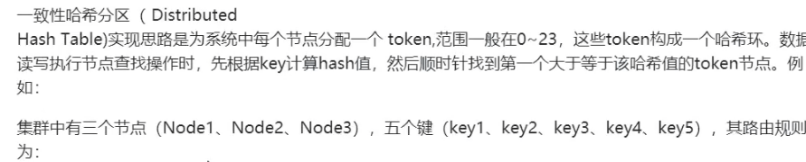
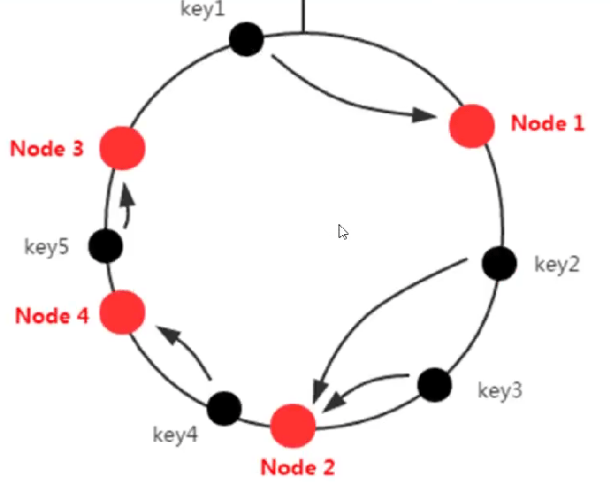
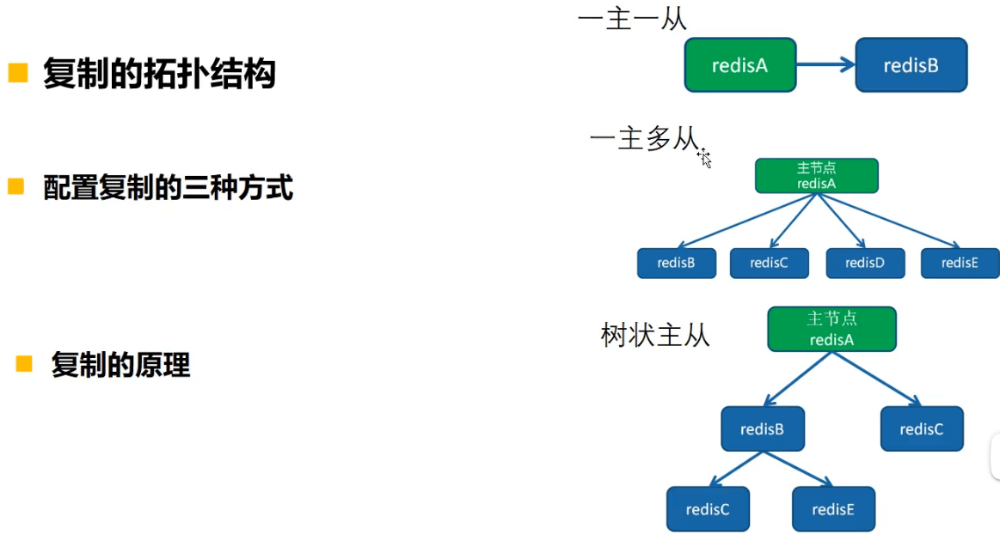
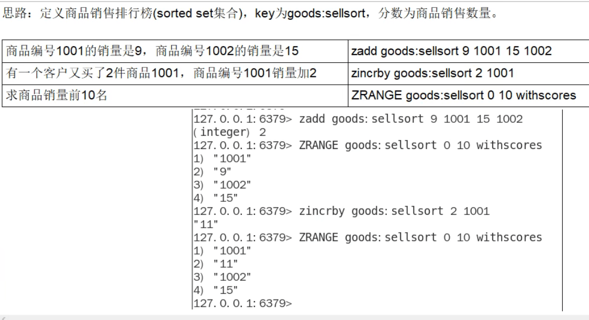

#### Redis

##### redis双写如何保持数据一致性，哨兵集群和切片集群的区别

##### redis如何处理bigkey，有什么问题

问题：

1. 使用Redis自带的`--bigkeys`参数来查找
2. 分析RDB文件

##### redis内存碎片

1. **Redis 存储存储数据的时候向操作系统申请的内存空间可能会大于数据实际需要的存储空间。**

   每次分配的内存空间都是以最近字节数的2的倍数来分配的。

2. 频繁修改数据，导致空间前后不一致。

直接通过 `config set` 命令将 `activedefrag` 配置项设置为 `yes` 即可。

##### redis并发访问

原子操作：

1. **把多个操作在 Redis 中实现成一个操作，也就是单命令操作**；
2. **把多个操作写到一个 Lua 脚本中，以原子性方式执行单个 Lua 脚本**。 

##### redis实现分布式锁

###### 单个节点

使用一个变量用来判断是否加锁成功，如 lock_key，加锁成功为1，释放为0，

使用 `SETNX` 实现加锁操作。存在则不设置，不存在则创建。使用 `DEL`实现释放锁操作。类似于：

```java
// 加锁
SETNX lock_key 1
// 业务逻辑
DO THINGS
// 释放锁
DEL lock_key
```

（1）在使用`setnx`后，操作共享数据时发生异常，没有执行到 `del` 命令，导致一直被该客户端持有，其他客户端获取不到锁。解决：给锁变量设置一个过期时间，过期后，删除。

（2）**如果客户端 A 执行了 SETNX 命令加锁后，假设客户端 B 执行了DEL 命令释放锁，此时，客户端 A 的锁就被误释放了**。如果客户端 C 正好也在申请加锁，就可以成功获得锁，进而开始操作共享数据。这样一来，客户端 A 和 C 同时在对共享数据进行操作，数据就会被修改错误。解决：针对这种让**每个客户端给所变量设置一个唯一值，这个可以用来标识客户端，释放锁时，判断是不是和这个值相等，相等才释放（可使用lua脚本完成多个命令）**。

###### 多个节点的分布式锁

使用 RedLock 算法。

**Redlock 算法的基本思路，是让客户端和多个独立的 Redis 实例依次请求加锁，如果客户端能够和半数以上的实例成功地完成加锁操作，那么我们就认为，客户端成功地获得分布式锁了，否则加锁失败**。这样一来，**即使有单个 Redis 实例发生故障，因为锁变量在其它实例上也有保存，所以，客户端仍然可以正常地进行锁操作，锁变量并不会丢失**。  

第一步：客户端获取当前时间

第二步：客户端按顺序依次向 N 个 Redis 实例执行加锁操作 

这里的加锁操作和在单实例上执行的加锁操作一样，使用 SET 命令，带上 NX，EX/PX 选项，以及带上客户端的唯一标识。当然，**如果某个 Redis 实例发生故障了，为了保证在这种情况下，Redlock 算法能够继续运行，我们需要给加锁操作设置一个超时时间**。

**如果客户端在和一个 Redis 实例请求加锁时，一直到超时都没有成功，那么此时，客户端会和下一个 Redis 实例继续请求加锁**。**加锁操作的超时时间需要远远地小于锁的有效时间，一般也就是设置为几十毫秒**。

第三步：一旦客户端完成了和所有 Redis 实例的加锁操作，客户端就要计算整个加锁过程的总耗时。

客户端只有在满足下面的这两个条件时，才能认为是加锁成功 ：

- 条件一：**客户端从超过半数（大于等于 N/2+1）的 Redis 实例上成功获取到了锁**；  
- 条件二：**客户端获取锁的总耗时没有超过锁的有效时间**。  

在满足了这两个条件后，我们**需要重新计算这把锁的有效时间，计算的结果是锁的最初有效时间减去客户端为获取锁的总耗时**。**如果锁的有效时间已经来不及完成共享数据的操作了，我们可以释放锁，以免出现还没完成数据操作，锁就过期了的情况**。

###### redission 实现自动续期锁的过期时间

Redisson 中的分布式锁自带自动续期机制，使用起来非常简单，原理也比较简单，其提供了一个专门用来监控和续期锁的 **Watch Dog（ 看门狗）**，如果操作共享资源的线程还未执行完成的话，Watch Dog 会不断地延长锁的过期时间，进而保证锁不会因为超时而被释放。

默认情况下，每过 10 秒，看门狗就会执行续期操作，将锁的超时时间设置为 30 秒。看门狗续期前也会先判断是否需要执行续期操作，需要才会执行续期，否则取消续期操作。

------

著作权归所有 原文链接：https://javaguide.cn/distributed-system/distributed-lock.html


##### redis实现事务ACID

###### 原子性

命令入队时就报错，会放弃事务执行，保证原子性；

命令入队时没报错，实际执行时报错，不保证原子性；

EXEC 命令执行时实例故障，如果开启了 AOF 日志，可以保证原子性。

###### 一致性

命令入队时就报错：**事务本身就会被放弃执行，所以可以保证数据库的一致性**。

命令入队时没报错，实际执行时报错 ：**有错误的命令不会被执行，正确的命令可以正常执行，也不会改变数据库的一致性**。

EXEC 命令执行时实例故障：

- 没开启RDB或AOF，实例故障重启后，数据都没有了，数据库是一致的。
- 使用了RDB，因为 RDB 快照不会在事务执行时执行，所以，事务命令操作的结果不会被保存到 RDB 快照中，使用 RDB 快照进行恢复时，数据库里的数据也是一致的。
- 使用了AOF，而事务操作还没有被记录到 AOF 日志时，实例就发生了故障，那么，使用 AOF 日志恢复的数据库数据是一致的；如果只有部分操作被记录到了AOF 日志，我们可以使用 redis-check-aof 清除事务中已经完成的操作，数据库恢复后也是一致的。

###### 隔离性

1.  **并发操作在 EXEC 命令前执行，此时，隔离性的保证要使用 WATCH 机制来实现，否则隔离性无法保证**； 
2.  **并发操作在 EXEC 命令后执行，此时，隔离性可以保证**。

###### 持久性

因为AOF和RDB都存在丢失数据的风险，所以不能保证持久性。

##### redis持久化策略，AOF和RDB

AOF日志重写的时候，有一处拷贝，两处日志。

RDB则是在某一时刻将数据保存为二进制数据，此时复制是阻塞的。

##### 使用redis实现延迟任务

https://blog.csdn.net/weixin_38399962/article/details/101511408

##### redis只读缓存、读写缓存（数据不一致问题）

**只读缓存**：**当 Redis 用作只读缓存时，应用要读取数据的话，会先调用 Redis GET 接口，查询数据是否存在**。而**所有的数据写请求，会直接发往后端的数据库，在数据库中增删改**。**对于删改的数据来说，如果 Redis 已经缓存了相应的数据，应用需要把这些缓存的数据删除，Redis 中就没有这些数据了**。

好处是：**所有最新的数据都在数据库，数据库提供了持久性的保障**。

问题1：**数据库、缓存一方失败时**

当数据库删改数据出现异常，缓存中已经删除了是最新数据，数据库是旧数据，再读取则读到的是数据库的旧数据；当删改数据库正常，缓存删除异常，则缓存是旧数据，数据库是新数据。

解决

> **可以把要删除的缓存值或者是要更新的数据库值暂存到消息队列中**（例如使用 Kafka 消息队列）。**当应用没有能够成功地删除缓存值或者是更新数据库值时，可以从消息队列中重新读取这些值，然后再次进行删除或更新**。
>
> **如果能够成功地删除或更新，我们就要把这些值从消息队列中去除，以免重复操作，此时，我们也可以保证数据库和缓存的数据一致了**。**否则的话，我们还需要再次进行重试**。**如果重试超过的一定次数，还是没有成功，我们就需要向业务层发送报错信息了**。

问题2：**删除缓存、更新数据库时有大量并发读操作**

1：先删缓存，再更新数据库。线程A删除缓存，还没更新数据库，线程B开始读取数据，线程B发现缓存缺失，然后去数据库读取数据，读到旧值，然后将读取到的旧值更新到缓存，这时缓存中的数据就是旧值了，发生数据不一致。此时A再更新数据库。

解决：**延迟双删**。在A更新数据库后，sleep一小段时间，再执行一次删除缓存的操作。**线程 A sleep 的时间，就需要大于线程 B 读取数据再写入缓存的时间**。

2：先更新数据库，在删除缓存。**如果线程 A 删除了数据库中的值，但还没来得及删除缓存值，线程 B 就开始读取数据了，那么此时，线程 B 查询缓存时，发现缓存命中，就会直接从缓存中读取旧值**。

总结：


**读写缓存**：**除了读请求会发送到缓存进行处理（直接在缓存中查询数据是否存在)，所有的写请求也会发送到缓存，在缓存中直接对数据进行增删改操作**。

不同之处在于，**最新的数据在redis中**。有两种写回策略：

- 同步直写

  写请求发给缓存的同时，也会发给后端数据库进行处理，等到缓存和数据库都写完数据，才给客户端返回。但是同步直写会降低缓存的访问性能。**当有数据一致性问题时，一般选择同步直写策略**。

- 异步写回

  **所有写请求都优先在缓存中处理**。**等到这些增改的数据要被冲缓存中淘汰出来时，缓存将他们写会后端数据库**。这样一来，处理这些数据的操作是在缓存中进行的，很快就能完成。只不过，**如果发生了掉电，而它们还没有被写回数据库，就会有丢失的风险了**。

选择：

- 如果需要对写请求进行加速，我们选择读写缓存；
- 如果写请求很少，或者是只需要提升读请求的响应速度的话，我们选择只读缓存

##### MySQL和redis数据一致性问题

[【经典问题】mysql和redis数据一致性问题](https://www.cnblogs.com/Johnyzh/p/17944675)


##### redis 内存默认配置，如何查看和修改

- 如果不设置**最大内存大小**或者设置最大内存大小为0，在64位操作系统下不限制内存大小，32位则最多使用3GB内存。一般推荐redis设置为最大物理内存的四分之三。
- 如何修改redis内存设置？
  - 通过修改配置文件，maxmemory 104857600(byte)
  - 通过命令修改，config get maxmemroy，config set maxmemory 1

- 如何查看内存使用情况？info memory

##### 如果redis内存使用超过了设置最大值会怎样？


我们可以设置最大内存为1个字节来测试。

##### 过期策略

###### 定期删除和惰性删除

定期删除，指的是redis默认是每隔100ms就**随机抽取一些**设置了过期时间的key，检查是否过期，如果过期就删除。

假设redis里放了10W个key，都设置了过期时间，你每隔几百毫秒就检查全部的key，那redis很有可能就挂了，CPU负载会很高，都消耗在检查过期的key上。注意，这里不是每隔100ms就遍历所有设置过期时间的key，那样就是一场性能灾难。实际上redis是每隔100ms就**随机抽取**一些key来检查和删除的。

定期删除可能会导致很多过期的key到了时间并没有被删除掉。这个时候就可以用到惰性删除了。惰性删除是指在你获取某个key的时候，redis会检查一下，这个key如果设置了过期时间并且已经过期了，此时就会删除，不会给你返回任何东西。

但即使是这样，依旧有问题。如果定期删除漏掉了很多过期的key，然后你也没及时去查，也就没走惰性删除。**此时依旧有可能大量过期的key堆积在内存里，导致内存耗尽**。

这个时候就需要**内存淘汰机制**了。

##### 缓存替换策略（淘汰机制）

**默认情况下，redis不会淘汰数据**。

不进行淘汰的策略：**neoviction**，会返回一个写操作的错误。

**设置了过期时间**的淘汰策略：

- **volatile-ttl 在筛选时，会针对设置了过期时间的键值对，根据过期时间的先后进行删除，越早过期的越先被删除**。
- **volatile-random 就像它的名称一样，在设置了过期时间的键值对中，进行随机删除**。
- **volatile-lru 会使用 LRU 算法筛选设置了过期时间的键值对**。**LRU(Least Recently Used 最近最少使用)**
- **volatile-lfu 会使用 LFU 算法选择设置了过期时间的键值对**。**LFU(Least Frequently Used 最不经常使用)**

**在所有数据范围时间**的淘汰策略：

- **allkeys-random 策略，从所有键值对中随机选择并删除数据**；
- **allkeys-lru 策略，使用 LRU 算法在所有数据中进行筛选**。
- **allkeys-lfu 策略，使用 LFU 算法在所有数据中进行筛选**。

###### 如何设置？

```shell
config set maxmemory-policy allkeys-lru
# 或者修改配置文件
```

##### 缓存雪崩

**缓存雪崩是指大量的应用请求无法在 Redis 缓存中进行处理，紧接着，应用将大量请求发送到数据库层，导致数据库层的压力激增**。

原因：

1 **缓存中有大量数据同时过期，导致大量请求无法得到处理**。

解决方案：

- **微调过期时间**

  **我们可以避免给大量的数据设置相同的过期时间，如果业务层的确要求有些数据同时失效，你可以在用 EXPIRE 命令给每个数据设置过期时间时，给这些数据的过期时间增加一个较小的随机数**。

- **服务降级，是指发生缓存雪崩时，针对不同的数据采取不同的处理方式**

  - **当业务应用访问的是非核心数据（例如电商商品属性）时，暂时停止从缓存中查询这些数据，而是直接返回预定义信息、空值或是错误信息**；
  - **当业务应用访问的是核心数据（例如电商商品库存）时，仍然允许查询缓存，如果缓存缺失，也可以继续通过数据库读取**。

2 **Redis 示例发生故障宕机**

解决方案：

- 在业务系统中实现服务熔断或请求限流机制
  - **服务熔断：是指在发生缓存雪崩时，为了防止引发连锁的数据库雪崩，甚至是整个系统的崩溃，我们暂停业务应用对缓存系统的接口访问**
  - **请求限流：在业务系统的请求入口前端控制每秒进入系统的请求数，避免过多的请求被发送到数据库**

- 事前预防，搭建缓存高可靠集群
- 一致性hash环的集群特性导致

##### 缓存击穿

**缓存击穿是指，针对某个访问非常频繁的热点数据的请求，无法在缓存中进行处理，紧接着，访问该数据的大量请求，一下子都发送到了后端数据库，导致了数据库压力激增，会影响数据库处理其他请求。缓存击穿的情况，经常发生在热点数据过期失效时**。

解决方案

**对热点数据不设置过期时间**

##### 缓存穿透

**缓存穿透是指要访问的数据既不在 Redis 缓存中，也不在数据库中，导致请求在访问缓存时，发生缓存缺失，再去访问数据库时，发现数据库中也没有要访问的数据**

原因：

- **业务层误操作：缓存中的数据和数据库中的数据被误删除了，所以缓存和数据库中都没有数据**；
- **恶意攻击：专门访问数据库中没有的数据**。

解决方案

1. **返回默认的空值或者缺省值**。
2. **使用布隆过滤器，判断数据是否存在**。有可能会误判，因为hash函数计算的位置有可能会是同一个。

3. **在请求入口的前端进行请求检测**。**缓存穿透的一个原因是有大量的恶意请求访问不存在的数据**，所以，一个有效的应对方案是在请求入口前端，**对业务系统接收到的请求进行合法性检测，把恶意的请求（例如请求参数不合理、请求参数是非法值、请求字段不存在）直接过滤掉**，不让它们访问后端缓存和数据库

##### redis和memcached，如何选择？

###### 功能和持久化

reis的功能更强大，支持5中数据结构，string、list、hash、set、zset。支持AOF和RDB的持久化方式。事务、LUA、MQ、时间序列的功能。

memcached kv的简单存储，不支持持久化。拓展性差，没有redis功能丰富。

###### 内存管理

redis：过期和内存淘汰策略。适合做数据存储。

memcached：预分配池的管理，内存 slab 块，根据增长因子

###### IO

redis：IO多路复用，命令还是单线程的。单线程。

memcached：非阻塞的IO，并且是多路复用。多线程。


### 其他面试题

可以学习参考下这个 [小林coding-Redis 常见面试题](https://www.xiaolincoding.com/redis/base/redis_interview.html)

#### Redis 6.0 之前为什么一直不使用多线程？


#### Redis 6.0之后为什么又用上了多线程？


#### redis哪些高级功能

保存时间序列数据、作为队列使用、geo

#### redis 如何解决key冲突？


#### 提高缓存命中率


第二点，例如，缓存可以用20g，mysql100g，则可以提前加载20%的数据。

#### Redis 集群方案什么情况下会导致整个集群不可用

A、B、C节点集群，B节点失败（主故障，没有替代方案）整个集群不可用。


#### redis 的哈希槽的概念

##### 数据分布理论

分布式数据库首先要解决把整个数据集按照分区规则映射到多个节点的问题，即把数据集划分到多个节点上，每个节点负责整体数据的一个子集。

需要关注的重点是数据分区的规则。常见的分区规则有哈希分区和顺序分区两种，哈希分区离散度好、数据分布业务无关、无法顺序访问；顺序分区离散度倾斜、数据分布业务相关、可顺序访问。

##### 节点取余分区

##### 一致性哈希分区




当集群中增加节点时，比如在node2和node3之间增加一个节点node4，此时在访问节点key4时，不能在node4中命中，更一般的，介于node2和node4之间的key均失效，这样的失效方式太过于“集中”和“暴力”，更好的方式因该是“平滑”和“分散”地失效。




##### 虚拟一致性hash分区


##### 虚拟槽分区


#### redi槽16384个原因


#### Redis集群会有写操作丢失吗？

会，不会保持强一致性。**因为主从之间是通过异步的方式去同步数据的**，对用户来说时已经返回了结果，但是如果在异步同步数据的时候，主节点宕机了，从节点不会接收到数据。



#### Redis常见性能问题和解决方案有哪些？

##### 常见性能问题


#### 热点数据和冷数据是什么

数据更新之前至少读取了2次才能放缓存。

##### 热数据

点赞数量、收藏数、分享数，这类数据是不断地变化的，可以同步到redis中。

访问频率很高的数据，考虑使用缓存。

##### 冷数据


[P2 秒杀抢购超卖Bug实战重现(bilibili.com)](https://www.bilibili.com/video/BV1rC4y127Np?p=2)

#### 秒杀抢购超卖bug

##### 初始代码

这段代码和下面的是有点不一样的，但是主要的一开始的逻辑是一样的：[48_boot整合redis搭建超卖程序](https://www.bilibili.com/video/BV1Hy4y1B78T?p=49)


这个是原始业务逻辑，能够看到基本上是一样的。单机版的时候加上这个锁，**最开始这个锁还是没有加上的**，这是已经优化了一次了。

##### 使用 synchronized加锁

但是此时用synchronized还是用reentrantlock呢？

- reentrantlock 有trylock，等待时间内，拿不到再放弃。
- synchronized 则是有释放锁其他线程才能获取到。


分布式情况下还是会出现stock库存的问题。单机锁只在自己的服务器有效。当使用了ngnix进行多服务的部署之后，就是一个分布式的微服务了。


当一瞬间有100个或者更多请求访问则会出现问题，可以使用jmeter进行测试。


为什么呢？因为当请求获取到时候时同时获取到库存100，然后做了库存减1操作，就出现了同时卖的问题。

##### 使用 setnx 进行加锁

解决方案1代码，使用了 setnx 进行获取：需要用finally来执行删除锁的操作，防止执行业务中途出现异常的情况。

这里还有一个情况是：**部署微服务的jar包的服务器挂了，代码层面根本没有走到finally这里，没办法保证解锁，这个key没有被删除，所以需要加入一个过期时间限定key**。

过期时间不安全情况：下面代码中，加锁和设置过期时间会有并发问题，因为它们不是一个原子性的操作，需要用一条命令来完成。


此时对一个商品进行秒杀和减库存操作，但是当有高并发请求的时候，会有很多请求获取锁，只有一个请求可以获取到锁，其他都返回业务代码。

情况1：此时如果一个请求A获取到了商品，然后执行到了finally，此时，锁已经过期了，**也就是说上面的try语句执行时间超过了锁的过期时间，锁自动过期了**，**然后B请求过来了，B请求此时就可以获取到锁，执行业务代码**。但是A请求还没执行完代码，随后执行finally中代码，此时如果不添加client_id进行判断的话则会直接将这个lockkey删除，**造成误删，导致B请求添加的锁失效**。

解决方案，**每个请求都添加一个独一无二的clientId来分辨，使用一个if进行判断**。但是还是上面的情况下，**如果执行到了if语句，判断为true之后，此时卡顿了一下，redis添加的过期时间到了，此时也会过期，导致会删除B请求添加的锁**。`stringRedisTemplate.opsForValue().get(lockKey)`返回的是添加的clientId。而删除和获取的是同一个lockkey也就是 ’product_101‘。所以A会删除B添加的锁。此时如何处理呢？

也就是说这里判断和删除不是原子性的操作

- 可以使用lua脚本进行操作。


这里使用的 Jedis 来执行 lua 脚本的。


- redis 自身的事务进行操作（不推荐，推荐使用lua脚本）


有一个问题，**redis是保证了AP的**，所以会有一个情况：**redis 异步复制造成锁丢失**，比如主节点没来得及把刚刚set进来的数据给从节点，主节点就宕机了。牺牲了一致性。

**zookeeper的话则是保证了CP的**，主节点同步子节点全部成功后才会返回。牺牲了高可用。

**另一种解决方案，最终方案**

此时可以对A请求的锁进行一个**延时**处理，也就是Redisson的加锁。使用一个**锁续命**。在开启业务逻辑的时候，同时启动一个后台线程，定时任务每过10s，检查锁是否还在，还在则继续加锁，添加10s。当主线程结束之后，锁删除了，然后结束子线程。也就是可以使用 Redisson 提供的加锁进行操作。

##### Redisson 加锁


**上面代码加锁优化**

- 缩小锁的粒度。将没有并发问题的业务代码放到加锁代码的外面。
- 分段锁。比如一个产品有200库存，优化为10个库存key，每段20个库存，第一段product_1，product_2...，使用轮询查询哪个段。

可能上面代码还会出现一个问题：


解决方法，只对当前线程持有的锁解锁


**加锁原理**


##### 主从节点，加锁后，主节点宕机该如何

加锁之后，可能主节点宕机了，但是没有同步到从节点，从节点已经选举成了主节点，此时没有加锁的信息的，会导致key的丢失。

**使用 zookeeper、RedLock；**

使用redLock加锁，不能做多余的操作，在搭建一个从节点，也会有主从数据同步不及时问题。同时，可以使用redis的AOF的always持久化策略，保证redis命令的正确持久化，防止加锁成功后，但是写aof日志失败的情况，随后重启redis导致key丢失的情况。


#### 应用场景

##### String 字符串

- 对于商品或者文章喜欢或者是不喜欢

```shell
INCR ITEMS:1
INCR ITEMS:1

DECR ITEMS:1
DECR ITEMS:1
```

其他场景


##### Hash 哈希，对应 map<string, map<key, value>>

- 对象缓存


- 购物车早期使用，中小厂使用

新增商品 -> hset shopcar:uid1024 334488 1

新增商品 -> hset shopcar:uid1024 334477 1

增加商品数量 -> hincrby shopcar:uid1024 334477 1

商品总数 ->hlen shopcar:uid1024

全部选择一> hgetall shopcar:uid1024


##### List 列表

- 微信文章订阅公众号

1 大V作者李永乐老师和CSDN发布了文章分别是 11 和 22。

2 阳哥关注了他们两个，只要他们发布了新文章，就会安装进我的List，lpush likearticle:阳哥id 11 22。

3 查看阳哥自己的号订阅的全部文章，类似分页，下面0~10就是一次显示10条lrange likearticle:阳哥id 0 10。

##### Set 无序集合

- 微信抽奖小程序（使用 spop key ）


- 微信朋友圈点赞


- 微博好友关注社交关系


```shell
127.0.0.1: 6379> sadd s1 1 2 3 4 5
(integer) 5
127.0.0.1:6379>sadd s2 3 4 5 6 7
(integer) 5
127.0.0.1:6379> SINTER S1 S2
1)"3"
2)"4"
3)"5"
```

共同关注：我去到局座张召忠的微博，马上获得我和局座共同关注的人。

我关注的人也关注他：我关注了华为余承东，余承东也关注了局座召忠，我和余总有共同爱好

```shell
127.0.0.1:6379> sadd s1 1 2 3 4 5 
(integer) 5
127.0.0.1:6379> sadd s2 3 4 5 6 7
(integer) 5
127.0.0.1: 6379> SISMEMBER S1 3
(integer)1
127.0.0.1:6379> SISMEMBER S2 3
(integer) 1
127.0.0.1: 6379>
```

- QQ内推可能认识的人


##### Zset 有序集合

- 根据商品销售对商品进行排序显示



- 抖音热搜


