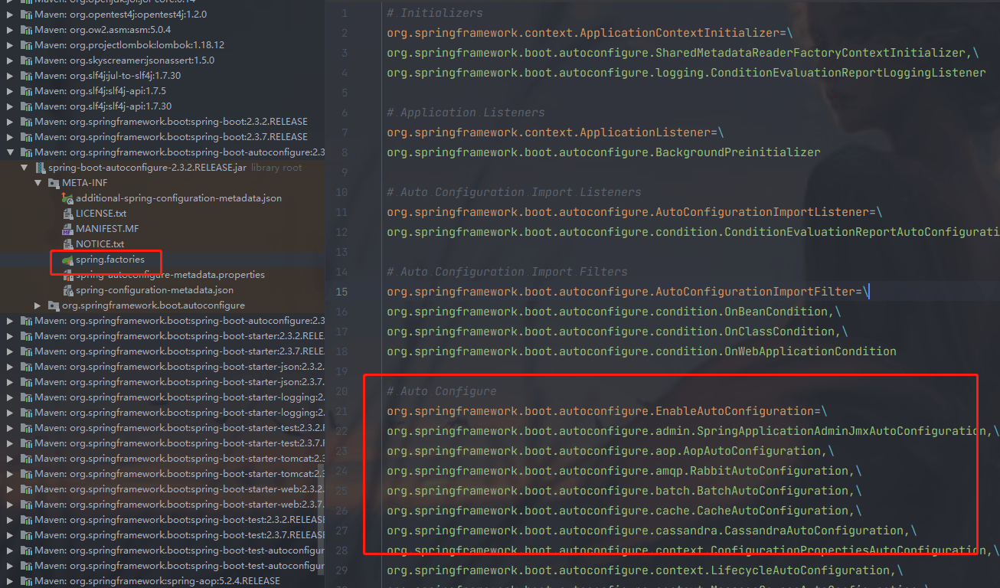
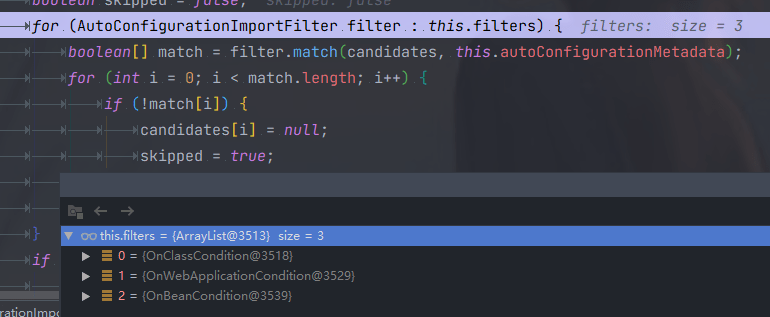

#### SpringBoot

##### SpringBoot 是如何实现自动装配的

spring boot的核心注解：`@SpringBootApplication`

```java
@Target(ElementType.TYPE)
@Retention(RetentionPolicy.RUNTIME)
@Documented
@Inherited
@SpringBootConfiguration
@EnableAutoConfiguration
@ComponentScan(excludeFilters = { @Filter(type = FilterType.CUSTOM, classes = TypeExcludeFilter.class),
      @Filter(type = FilterType.CUSTOM, classes = AutoConfigurationExcludeFilter.class) })
public @interface SpringBootApplication {
}

@Target(ElementType.TYPE)
@Retention(RetentionPolicy.RUNTIME)
@Documented
@Configuration
public @interface SpringBootConfiguration {
}
```

###### 核心注解

`@EnableAutoConfiguration`：启用 SpringBoot 的自动配置机制

`@Configuration`：允许在上下文中注册额外的 bean 或导入其他配置类

`@ComponentScan`： 扫描被`@Component` (`@Service`,`@Controller`)注解的 bean，注解默认会扫描启动类所在的包下所有的类 ，可以自定义不扫描某些 bean。如下图所示，容器中将排除`TypeExcludeFilter`和`AutoConfigurationExcludeFilter`。

**@EnableAutoConfiguration:实现自动装配的核心注解**

```java
@Target({ElementType.TYPE})
@Retention(RetentionPolicy.RUNTIME)
@Documented
@Inherited
@AutoConfigurationPackage //作用：将main包下的所有组件注册到容器中
@Import({AutoConfigurationImportSelector.class}) //加载自动装配类 xxxAutoconfiguration
public @interface EnableAutoConfiguration {
    String ENABLED_OVERRIDE_PROPERTY = "spring.boot.enableautoconfiguration";

    Class<?>[] exclude() default {};

    String[] excludeName() default {};
}
```

**AutoConfigurationImportSelector**

```java
public class AutoConfigurationImportSelector implements DeferredImportSelector, BeanClassLoaderAware, ResourceLoaderAware, BeanFactoryAware, EnvironmentAware, Ordered {

}
public interface DeferredImportSelector extends ImportSelector {

}
public interface ImportSelector {
    String[] selectImports(AnnotationMetadata importingClassMetadata);
}
```

AutoConfigurationImportSelector 实现了这个方法：该方法主要用于**获取所有符合条件的类的全限定类名，这些类需要被加载到 IoC 容器中**。

```java
private static final String[] NO_IMPORTS = new String[0];

public String[] selectImports(AnnotationMetadata annotationMetadata) {
    // <1>.判断自动装配开关是否打开
    if (!this.isEnabled(annotationMetadata)) {
        return NO_IMPORTS;
    } else {
        //<2>.获取所有需要装配的bean
        AutoConfigurationMetadata autoConfigurationMetadata = AutoConfigurationMetadataLoader.loadMetadata(this.beanClassLoader);
        AutoConfigurationImportSelector.AutoConfigurationEntry autoConfigurationEntry = this.getAutoConfigurationEntry(autoConfigurationMetadata, annotationMetadata);
        return StringUtils.toStringArray(autoConfigurationEntry.getConfigurations());
    }
}
```

将断点打到这个方法，发现不会进入。

org.springframework.context.annotation.ConfigurationClassParser.processImports 在这个方法里面有执行 selector.selectImports 的调用。

```java
private void processImports(ConfigurationClass configClass, SourceClass currentSourceClass,
			Collection<SourceClass> importCandidates, boolean checkForCircularImports) {
    ...
    if (candidate.isAssignable(ImportSelector.class)) {
        // Candidate class is an ImportSelector -> delegate to it to determine imports
        Class<?> candidateClass = candidate.loadClass();
        ImportSelector selector = BeanUtils.instantiateClass(candidateClass, ImportSelector.class);
        ParserStrategyUtils.invokeAwareMethods(
                selector, this.environment, this.resourceLoader, this.registry);
        if (selector instanceof DeferredImportSelector) { // 如果实现了接口DeferredImportSelector 则添加到名为deferredImportSelectors的list中暂存
            this.deferredImportSelectorHandler.handle(
                    configClass, (DeferredImportSelector) selector);
        }
        else { // 否则执行selectImports方法
            String[] importClassNames = selector.selectImports(currentSourceClass.getMetadata());
            Collection<SourceClass> importSourceClasses = asSourceClasses(importClassNames);
            processImports(configClass, currentSourceClass, importSourceClasses, false);
        }
    }
    ...
}
```

调用栈如图：


```java
public void parse(Set<BeanDefinitionHolder> configCandidates) {
    for (BeanDefinitionHolder holder : configCandidates) {
        BeanDefinition bd = holder.getBeanDefinition();
        try {
            if (bd instanceof AnnotatedBeanDefinition) {
                // 先解析扫描bean, 在此方法中向deferredImportSelectorHandler中添加了一个对象, 存储了可延迟导入的selector列表
                parse(((AnnotatedBeanDefinition) bd).getMetadata(), holder.getBeanName());
            }
            else if (bd instanceof AbstractBeanDefinition && ((AbstractBeanDefinition) bd).hasBeanClass()) {
                parse(((AbstractBeanDefinition) bd).getBeanClass(), holder.getBeanName());
            }
            else {
                parse(bd.getBeanClassName(), holder.getBeanName());
            }
        }
        catch (BeanDefinitionStoreException ex) {
            throw ex;
        }
        catch (Throwable ex) {
            throw new BeanDefinitionStoreException(
                    "Failed to parse configuration class [" + bd.getBeanClassName() + "]", ex);
        }
    }
    // 执行对象的process方法
    this.deferredImportSelectorHandler.process();
}
```

org.springframework.context.annotation.ConfigurationClassParser.DeferredImportSelectorHandler#process 

```java
public void process() {
   List<DeferredImportSelectorHolder> deferredImports = this.deferredImportSelectors;
   this.deferredImportSelectors = null;
   try {
      if (deferredImports != null) {
         DeferredImportSelectorGroupingHandler handler = new DeferredImportSelectorGroupingHandler();
         deferredImports.sort(DEFERRED_IMPORT_COMPARATOR);
         // 这里需要注册
         deferredImports.forEach(handler::register);
         handler.processGroupImports();
      }
   }
   finally {
      this.deferredImportSelectors = new ArrayList<>();
   }
}
```

org.springframework.context.annotation.ConfigurationClassParser.DeferredImportSelectorGroupingHandler.register

```java
public void register(DeferredImportSelectorHolder deferredImport) {
    // 调用org.springframework.boot.autoconfigure.AutoConfigurationImportSelector.getImportGroup 返回AutoConfigurationGroup.class
    Class<? extends Group> group = deferredImport.getImportSelector().getImportGroup();
    // 创建Group对象, 用DeferredImportSelectorGrouping包装并存入到map中
    DeferredImportSelectorGrouping grouping = this.groupings.computeIfAbsent(
            (group != null ? group : deferredImport),
            key -> new DeferredImportSelectorGrouping(createGroup(group)));
    // 向deferredImports对象添加元素, 后面会使用
    grouping.add(deferredImport);
    // 存入map中 key为启动类的元数据 value是启动类
    this.configurationClasses.put(deferredImport.getConfigurationClass().getMetadata(),
            deferredImport.getConfigurationClass());
}
```

org.springframework.context.annotation.ConfigurationClassParser.DeferredImportSelectorGroupingHandler.processGroupImports

```java
public void processGroupImports() {
    for (DeferredImportSelectorGrouping grouping : this.groupings.values()) { // 只有一个元素, 上个方法放入的
        grouping.getImports().forEach(entry -> { // 重点解析
            // 获取主配置类 启动类
            ConfigurationClass configurationClass = this.configurationClasses.get(entry.getMetadata());
            try {
                // 逐个执行导入 至此执行完成后, 扫描出的类都会注册到BeanDefinition中 等待Spring容器对对象实例化和初始化
                processImports(configurationClass, asSourceClass(configurationClass),
                        asSourceClasses(entry.getImportClassName()), false);
            }
            catch (BeanDefinitionStoreException ex) {
                throw ex;
            }
            catch (Throwable ex) {
                throw new BeanDefinitionStoreException(
                        "Failed to process import candidates for configuration class [" +
                                configurationClass.getMetadata().getClassName() + "]", ex);
            }
        });
    }
}
```

org.springframework.context.annotation.ConfigurationClassParser.DeferredImportSelectorGrouping.getImports

```java
public Iterable<Group.Entry> getImports() {
    // 前面放入的一个元素 此处循环
    for (DeferredImportSelectorHolder deferredImport : this.deferredImports) {
        // group为AutoConfigurationGroup对象 执行org.springframework.boot.autoconfigure.AutoConfigurationImportSelector.AutoConfigurationGroup.process方法
        this.group.process(deferredImport.getConfigurationClass().getMetadata(),
                deferredImport.getImportSelector());
    }
    // 对map结果去重、排序并返回
    return this.group.selectImports();
}
```

org.springframework.boot.autoconfigure.AutoConfigurationImportSelector.AutoConfigurationGroup.process

```java
public void process(AnnotationMetadata annotationMetadata,
        DeferredImportSelector deferredImportSelector) {
    // 断言
    Assert.state(
            deferredImportSelector instanceof AutoConfigurationImportSelector,
            () -> String.format("Only %s implementations are supported, got %s",
                    AutoConfigurationImportSelector.class.getSimpleName(),
                    deferredImportSelector.getClass().getName()));
    // 调用getAutoConfigurationEntry检索spring.factories文件, 存储并排除文件中配置的bean
    AutoConfigurationEntry autoConfigurationEntry = ((AutoConfigurationImportSelector) deferredImportSelector)
            .getAutoConfigurationEntry(getAutoConfigurationMetadata(),  // 获取了所有包中的spring.factories文件配置参数
                annotationMetadata);

    this.autoConfigurationEntries.add(autoConfigurationEntry);
    for (String importClassName : autoConfigurationEntry.getConfigurations()) {
        // 将过滤后的类存入到entries map中
        this.entries.putIfAbsent(importClassName, annotationMetadata);
    }
}
```

调用`getAutoConfigurationEntry()`方法，这个方法主要负责加载自动配置类的。调用栈如上图

```java
protected AutoConfigurationEntry getAutoConfigurationEntry(
        AutoConfigurationMetadata autoConfigurationMetadata,
        AnnotationMetadata annotationMetadata) {
    if (!isEnabled(annotationMetadata)) {
        return EMPTY_ENTRY;
    }
    //(2) 获取EnableAutoConfiguration注解的属性,获取EnableAutoConfiguration注解中的 exclude 和 excludeName
    AnnotationAttributes attributes = getAttributes(annotationMetadata);
    //(3) 扫描各个包下META-INF/spring.factories文件中配置EnableAutoConfiguration 大约100+ 
    List<String> configurations = getCandidateConfigurations(annotationMetadata, attributes);
    //(4) Link转Array
    configurations = removeDuplicates(configurations);
    // 获取注解上排除的类  @SpringBootApplication(exclude= {DataSourceAutoConfiguration.class})
    Set<String> exclusions = getExclusions(annotationMetadata, attributes);
    checkExcludedClasses(configurations, exclusions);
    // 去掉排除的类
    configurations.removeAll(exclusions);
    // 使用filter过滤 过滤不存在的类(尝试加载 异常说明不存在)
    configurations = filter(configurations, autoConfigurationMetadata);
    // 发送一个AutoConfigurationImportEvent事件通知
    fireAutoConfigurationImportEvents(configurations, exclusions);
    return new AutoConfigurationEntry(configurations, exclusions);
}
```

流程

```java
protected List<String> getCandidateConfigurations(AnnotationMetadata metadata, AnnotationAttributes attributes) {
   List<String> configurations = SpringFactoriesLoader.loadFactoryNames(getSpringFactoriesLoaderFactoryClass(),
         getBeanClassLoader());
   Assert.notEmpty(configurations, "No auto configuration classes found in META-INF/spring.factories. If you "
         + "are using a custom packaging, make sure that file is correct.");
   return configurations;
}

public static List<String> loadFactoryNames(Class<?> factoryType, @Nullable ClassLoader classLoader) {
    String factoryTypeName = factoryType.getName();
    return loadSpringFactories(classLoader).getOrDefault(factoryTypeName, Collections.emptyList());
}
```

```java
/**
	 * 加载Factories文件
	 *
	 * @param classLoader factories文件解析之后的map
	 * @return
	 */
private static Map<String, List<String>> loadSpringFactories(ClassLoader classLoader) {
    // 现在缓存中查找，classLoader为key
    Map<String, List<String>> result = cache.get(classLoader);
    if (result != null) {
        return result;
    }

    result = new HashMap<>();
    try {
        // 获取资源，这里固定目录为：META-INF/spring.factories
        Enumeration<URL> urls = classLoader.getResources(FACTORIES_RESOURCE_LOCATION);
        while (urls.hasMoreElements()) {
            URL url = urls.nextElement();
            UrlResource resource = new UrlResource(url);
            // 将资源加载为Properties
            Properties properties = PropertiesLoaderUtils.loadProperties(resource);
            // 遍历配置
            for (Map.Entry<?, ?> entry : properties.entrySet()) {
                String factoryTypeName = ((String) entry.getKey()).trim();
                // 获取value的数组，一般为类的全限定名
                // 比如 org.springframework.beans.BeanInfoFactory=org.springframework.beans.ExtendedBeanInfoFactory
                String[] factoryImplementationNames =
                    StringUtils.commaDelimitedListToStringArray((String) entry.getValue());
                // 添加到result
                for (String factoryImplementationName : factoryImplementationNames) {
                    result.computeIfAbsent(factoryTypeName, key -> new ArrayList<>())
                        .add(factoryImplementationName.trim());
                }
            }
        }

        // 对value进行去重
        result.replaceAll((factoryType, implementations) -> implementations.stream().distinct()
                          .collect(Collectors.collectingAndThen(Collectors.toList(), Collections::unmodifiableList)));
        // 添加到缓存中
        cache.put(classLoader, result);
    } catch (IOException ex) {
        throw new IllegalArgumentException("Unable to load factories from location [" +
                                           FACTORIES_RESOURCE_LOCATION + "]", ex);
    }
    return result;
}
```

获取需要自动装配的所有配置类，读取`META-INF/spring.factories`

> spring-boot/spring-boot-project/spring-boot-autoconfigure/src/main/resources/META-INF/spring.factories



不光是这个依赖下的`META-INF/spring.factories`被读取到，所有 Spring Boot Starter 下的`META-INF/spring.factories`都会被读取到。

所以，你可以清楚滴看到， druid 数据库连接池的 Spring Boot Starter 就创建了`META-INF/spring.factories`文件。

如果，我们自己要创建一个 Spring Boot Starter，这一步是必不可少的。

最后使用filter过滤掉了不符合条件的类。

```java
@Configuration
// 检查相关的类：RabbitTemplate 和 Channel是否存在
// 存在才会加载
@ConditionalOnClass({ RabbitTemplate.class, Channel.class })
@EnableConfigurationProperties(RabbitProperties.class)
@Import(RabbitAnnotationDrivenConfiguration.class)
public class RabbitAutoConfiguration {
}
```



##### spring boot如何启动 Tomcat 的

```xml
<dependency>
    <groupId>org.springframework.boot</groupId>
    <artifactId>spring-boot-starter-web</artifactId>
</dependency>
```

添加如上 Web 的依赖，Spring Boot 就帮我们内置了 Servlet 容器，默认使用的是 Tomcat，同样也支持修改，比如可以使用 jetty、Undertow 等。

因为内置了启动容器，应用程序可以直接通过 Maven 命令将项目编译成可执行的 jar 包，通过 java -jar 命令直接启动，不需要再像以前一样，打包成 War 包，然后部署在 Tomcat 中。

原理：https://blog.csdn.net/niceyoo/article/details/109954382

首先，spring boot在启动时会先创建一个 spring 容器。

调用run方法之后，会运行到 ConfigurableApplicationContext  这个类的 run 方法里面，启动tomcat相关的代码在`context = createApplicationContext();`和 `refreshContext(context)` 方法里。

```java
public ConfigurableApplicationContext run(String... args) {
   StopWatch stopWatch = new StopWatch();
   stopWatch.start();
   ConfigurableApplicationContext context = null;
   Collection<SpringBootExceptionReporter> exceptionReporters = new ArrayList<>();
   configureHeadlessProperty();
   SpringApplicationRunListeners listeners = getRunListeners(args);
   listeners.starting();
   try {
      ApplicationArguments applicationArguments = new DefaultApplicationArguments(args);
      ConfigurableEnvironment environment = prepareEnvironment(listeners, applicationArguments);
      configureIgnoreBeanInfo(environment);
      Banner printedBanner = printBanner(environment);
      context = createApplicationContext();
      exceptionReporters = getSpringFactoriesInstances(SpringBootExceptionReporter.class,
            new Class[] { ConfigurableApplicationContext.class }, context);
      prepareContext(context, environment, listeners, applicationArguments, printedBanner);
       // 这个方法里面去创建了tomcat
      refreshContext(context);
      afterRefresh(context, applicationArguments);
      stopWatch.stop();
      if (this.logStartupInfo) {
         new StartupInfoLogger(this.mainApplicationClass).logStarted(getApplicationLog(), stopWatch);
      }
      listeners.started(context);
      callRunners(context, applicationArguments);
   }
   catch (Throwable ex) {
      handleRunFailure(context, ex, exceptionReporters, listeners);
      throw new IllegalStateException(ex);
   }

   try {
      listeners.running(context);
   }
   catch (Throwable ex) {
      handleRunFailure(context, ex, exceptionReporters, null);
      throw new IllegalStateException(ex);
   }
   return context;
}
```

上面方法进入之后，refreshContext() 方法传递的 context，经由 refresh() 方法强转成父类 AbstractApplicationContext，具体调用过程如下。

```java
public void refresh() throws BeansException, IllegalStateException {
   synchronized (this.startupShutdownMonitor) {
      try {
		...
         // Initialize other special beans in specific context subclasses. 主要是这个方法
         onRefresh();
         // Check for listener beans and register them.
         registerListeners();
         // Instantiate all remaining (non-lazy-init) singletons.
         finishBeanFactoryInitialization(beanFactory);
         // Last step: publish corresponding event.
         finishRefresh();
      }
       ...
   }
}
```

在这个方法中我们主要关心 onRefresh() 方法，onRefresh() 方法是调用其子类实现的，也就是 ServletWebServerApplicationContext，

```java
protected void onRefresh() {
   super.onRefresh();
   try {
      createWebServer();
   }
   catch (Throwable ex) {
      throw new ApplicationContextException("Unable to start web server", ex);
   }
}
private void createWebServer() {
    WebServer webServer = this.webServer;
    ServletContext servletContext = getServletContext();
    if (webServer == null && servletContext == null) {
        // 获取 servlet 工厂
        ServletWebServerFactory factory = getWebServerFactory();
        this.webServer = factory.getWebServer(getSelfInitializer());
        getBeanFactory().registerSingleton("webServerGracefulShutdown",
                                           new WebServerGracefulShutdownLifecycle(this.webServer));
        getBeanFactory().registerSingleton("webServerStartStop",
                                           new WebServerStartStopLifecycle(this, this.webServer));
    }
    else if (servletContext != null) {
        try {
            getSelfInitializer().onStartup(servletContext);
        }
        catch (ServletException ex) {
            throw new ApplicationContextException("Cannot initialize servlet context", ex);
        }
    }
    initPropertySources();
}
```


来看一下 TomcatServletWebServerFactory 的 getWebServer() 方法：

```java
public WebServer getWebServer(ServletContextInitializer... initializers) {
    if (this.disableMBeanRegistry) {
        Registry.disableRegistry();
    }
		/** 1、创建Tomcat实例 **/
    Tomcat tomcat = new Tomcat();
    File baseDir = this.baseDirectory != null ? this.baseDirectory : this.createTempDir("tomcat");
    tomcat.setBaseDir(baseDir.getAbsolutePath());
    Connector connector = new Connector(this.protocol);
    connector.setThrowOnFailure(true);
    tomcat.getService().addConnector(connector);
    this.customizeConnector(connector);
    /** 2、给创建好的tomcat设置连接器connector **/
    tomcat.setConnector(connector);
    /** 设置不自动部署 **/
    tomcat.getHost().setAutoDeploy(false);
    /** 3、配置Tomcat容器引擎 **/
    this.configureEngine(tomcat.getEngine());
    Iterator var5 = this.additionalTomcatConnectors.iterator();

    while(var5.hasNext()) {
        Connector additionalConnector = (Connector)var5.next();
        tomcat.getService().addConnector(additionalConnector);
    }
		/**
 		 * 准备Tomcat的StandardContext，并添加到Tomcat中，同时把initializers 注册到类型为
 		 * TomcatStarter的ServletContainerInitializer中
 		 **/
    this.prepareContext(tomcat.getHost(), initializers);
    /** 将创建好的Tomcat包装成WebServer返回**/
    return this.getTomcatWebServer(tomcat);
}

public Engine getEngine() {
    Service service = this.getServer().findServices()[0];
    if (service.getContainer() != null) {
        return service.getContainer();
    } else {
        Engine engine = new StandardEngine();
        engine.setName("Tomcat");
        engine.setDefaultHost(this.hostname);
        engine.setRealm(this.createDefaultRealm());
        service.setContainer(engine);
        return engine;
    }
}
```

getWebServer() 这个方法创建了 Tomcat 对象，并且做了两件重要的事情：

把连接器 Connector 对象添加到 Tomcat 中;
配置容器引擎，configureEngine(tomcat.getEngine());
首先说一下这个 Connector 连接器，Tomcat 有两个核心功能：

处理 Socket 连接，负责网络字节流与 Request 和 Response 对象的转化。
加载和管理 Servlet，以及具体处理 Request 请求。
针对这两个功能，Tomcat 设计了两个核心组件来分别完成这两件事，即：连接器(Connector)和容器(Container)。

整个过程大致就是：Connector 连接器接收连接请求，创建Request和Response对象用于和请求端交换数据，然后分配线程让Engine（也就是Servlet容器）来处理这个请求，并把产生的Request和Response对象传给Engine。当Engine处理完请求后，也会通过Connector将响应返回给客户端。

这里面提到了 Engine，这个是 Tomcat 容器里的顶级容器(Container)，我们可以通过 Container 类查看其他的子容器：Engine、Host、Context、Wrapper。

4者的关系是：Engine 是最高级别的容器，Engine 子容器是 Host，Host 的子容器是 Context，Context 子容器是 Wrapper，所以这4个容器的关系就是父子关系，即：Wrapper > Context > Host > Engine （>表示继承）

```java
private void configureEngine(Engine engine) {
   engine.setBackgroundProcessorDelay(this.backgroundProcessorDelay);
   for (Valve valve : this.engineValves) {
      engine.getPipeline().addValve(valve);
   }
}
```

其中 engine.setBackgroundProcessorDelay(this.backgroundProcessorDelay) 是指定背景线程的执行间隔，例如背景线程会在每隔多长时间后判断session是否失效之类。

再回到 getWebServer() 方法，最终 getWebServer() 方法返回了 TomcatWebServer。

`return getTomcatWebServer(tomcat);`

```java
protected TomcatWebServer getTomcatWebServer(Tomcat tomcat) {
   return new TomcatWebServer(tomcat, getPort() >= 0, getShutdown());
}
public TomcatWebServer(Tomcat tomcat, boolean autoStart, Shutdown shutdown) {
    Assert.notNull(tomcat, "Tomcat Server must not be null");
    this.tomcat = tomcat;
    this.autoStart = autoStart;
    this.gracefulShutdown = (shutdown == Shutdown.GRACEFUL) ? new GracefulShutdown(tomcat) : null;
    initialize();
}
private void initialize() throws WebServerException {
    // 启动spring boot经常看到这句话
    logger.info("Tomcat initialized with port(s): " + getPortsDescription(false));
    synchronized (this.monitor) {
        try {
            addInstanceIdToEngineName();
            Context context = findContext();
            context.addLifecycleListener((event) -> {
                if (context.equals(event.getSource()) && Lifecycle.START_EVENT.equals(event.getType())) {
                    // Remove service connectors so that protocol binding doesn't
                    // happen when the service is started.
                    removeServiceConnectors();
                }
            });

            // Start the server to trigger initialization listeners
            this.tomcat.start();
            // We can re-throw failure exception directly in the main thread
            rethrowDeferredStartupExceptions();
            try {
                ContextBindings.bindClassLoader(context, context.getNamingToken(), getClass().getClassLoader());
            }
            catch (NamingException ex) {
                // Naming is not enabled. Continue
            }
            // Unlike Jetty, all Tomcat threads are daemon threads. We create a
            // blocking non-daemon to stop immediate shutdown
            startDaemonAwaitThread();
        }
        catch (Exception ex) {
            stopSilently();
            destroySilently();
            throw new WebServerException("Unable to start embedded Tomcat", ex);
        }
    }
}
```

##### 配置文件加载顺序

###### 内部配置文件加载顺序

优先级1：项目路径下的config文件夹配置文件
优先级2：项目的根目录下面配置文件
优先级3：资源路径下的config文件夹配置文件
优先级4：资源路径下配置文件


***加载顺序为上文的排列顺序，高优先级配置的属性会生效***。

###### 外部配置文件加载顺序

https://docs.spring.io/spring-boot/docs/current/reference/html/features.html#features.external-config

***我们只需要记住 命令行参数 是最高的优先级加载顺序。***

##### spring boot 做单元测试

[如何在 Spring Boot 应用中做单元测试？（文末福利） (qq.com)](https://mp.weixin.qq.com/s/NK0wlFbfbnCg12j38vpIaQ)

##### 一个spring boot项目能处理多少个请求

https://www.cnblogs.com/thisiswhy/p/17559808.html

