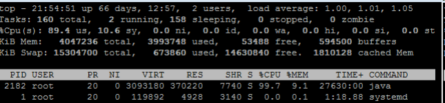
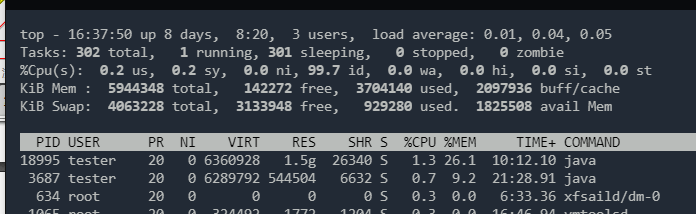
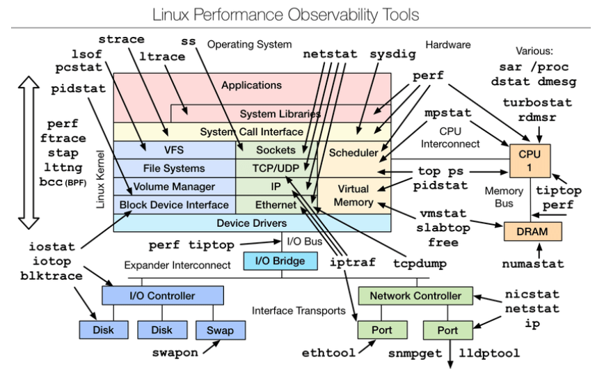
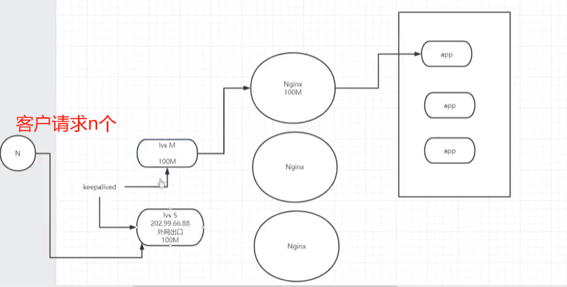

#### 如何保持接口幂等性（如何避免重复提交）

产生接口幂等性问题

- 网络波动, 可能会引起重复请求
- 用户重复操作,用户在操作时候可能会无意触发多次下单交易,甚至没有响应而有意触发多次交易应用
- 使用了失效或超时重试机制(Nginx重试、RPC重试或业务层重试等)
- 页面重复刷新
- 使用浏览器后退按钮重复之前的操作,导致重复提交表单
- 使用浏览器历史记录重复提交表单
- 浏览器重复的HTTP请求
- 定时任务重复执行
- 用户双击提交按钮

解决

- 按钮只可以操作一次（前端控制多次提交）

- 功能上允许重复提交，但保证重复提交不会产生动作。请求带上token，根据token来避免重复请求。

- 使用Post/Redirect/Get模式

  在提交后执行页面重定向,这就是所谓的Post-Redirect—Get(PRG)模式,简单来说就是当用户提交连表单后,跳转到一个重定向的信息页面,这样就避免用户按F5刷新导致的重复提交,而且也不会出现浏览器表单重复提交的警告,也能消除按浏览器前进和后退导致同样重复提交的问题。

- 数据库实现

  - 悲观锁

  - 唯一索引：

    使用唯一主键去做防重表的唯一索引,比如使用订单号作为防重表的唯一索引,每一次请求都根据订单号向防重表中插入一条数据,插入成功说明可以处理后面的业务,当处理完业务逻辑之后删除防重表中的订单号数据,后续如果有重复请求,则会因为防重表唯一索引原因导致插入失败,直接返回操作失败,直到第一次请求返回结果,可以看出防重表作用就是加锁的功能。

  - 乐观锁

    如果更新已有数据,可以进行加锁更新,也可以设计表结构时使用乐观锁,通过version来做乐观锁,这样既能保证执行效率,又能保证幂等, 乐观锁的version版本在更新业务数据要自增
    `update table set version = version + 1 where id = #{id} and version = #{version}`

- JVM锁实现

  JVM 锁实现是指通过 JVM 提供的内置锁如 Lock 或者是 synchronized 来实现幂等性。使用 JVM 锁来实现幂等性的一般流程为：首先通过 Lock 对代码段进行加锁操作，然后再判断此订单是否已经被处理过，如果未处理则开启事务执行订单处理，处理完成之后提交事务并释放锁。问题是只适用于单机环境。

- 分布式锁实现

  分布式锁实现幂等性的逻辑是，在每次执行方法之前先判断是否可以获取到分布式锁，如果可以，则表示为第一次执行方法，否则直接舍弃请求即可。

  需要注意的是分布式锁的 key 必须为业务的唯一标识，我们通常使用 [Redis](https://cloud.tencent.com/product/crs?from=10680) 或者 ZooKeeper 来实现分布式锁；如果使用 Redis 的话，则用 set 命令来创建和获取分布式锁，执行示例如下：

  ```sh
  127.0.0.1:6379> set lock true ex 30 nx
  OK # 创建锁成功
  ## ex 是用来设置超时时间的；而 nx 是 not exists 的意思，用来判断键是否存在。如果返回的结果为“OK”，则表示创建锁成功，否则表示重复请求，应该舍弃
  ```

- 缓冲队列

  将请求都快速地接收下来后放入缓冲队列中,后续使用异步任务处理队列中的数据,过滤掉重复的请求,该解决方案优点是同步处理改成异步处理、高吞吐量,缺点则是不能及时地返回请求结果,需要后续轮询得处理结果

#### 如何保持数据一致性

#### es和MySQL使用场景（关系型和非关系型数据库）

##### 关系型数据库

关系型数据库指的是使用关系模型（二维表格模型）来组织数据的数据库。

关系模型可以简单理解为二维表格模型，而一个关系型数据库就是由二维表及其之间的关系组成的一个数据组织。

Oracle、MySQL、Microsoft SQL Server、SQLite、PostgreSQL、IBM DB2

###### 优点

1. 易于维护：都是使用表结构，数据库的ACID属性，大大降低了数据冗余和数据不一致的概率。
2. 使用方便：SQL语言通用。
3. 多个表之间的复杂 SQL 查询。
4. 提供了对事务的支持，能保证系统中事务的正确执行，支持回滚。
5. 存储在磁盘中，安全可靠。

###### 缺点

1. 海量数据的读写效率：磁盘IO是一个很大的瓶颈。
2. 高扩展性和可用性。
   - 固定表结构，灵活度低，无法快速容纳新的数据类型。
   - 数据库难以横向扩展，当一个应用系统的用户量和访问量与日俱增的时候，数据库没有办法像web Server那样简单的通过添加更多的硬件和服务节点来拓展性能和负载能力。
3. 高并发读写能力差：网站类用户的并发型访问非常高，而一台数据库的最大连接数有限。

##### 非关系型数据库（NOSQL）

通常指数据以对象的形式存储在数据库中，而对象之间的关系通过每个对象自身的属性来决定，**常用于存储非结构化的数据**。

1. 面向高性能并发读写的**key-value**数据库

主要特点是具有极高的并发读写性能，例如Redis、Tokyo Cabint等。

2. 面向海量数据访问的**面向文档**数据库

特点是，可以在海量的数据库快速的查询数据。例如MongoDB以及CouchDB。

3. 面向**可拓展的分布式**数据库

解决的主要问题是传统数据库的扩展性上的缺陷。

###### 优点

1. 格式灵活：存储格式可以是 key，value形式，文档形式，图片形式等等，使用灵活，应用场景广泛，而关系型数据库支支持基础类型。
2. 速度快：nosql 可以使用硬盘或者随机存储器作为载体，而关系型数据库只能使用硬盘。
3. 高扩展性
4. 成本低：nosql数据库部署简单，基本都是开源软件。

###### 缺点

但是由于Nosql约束少，所以也不能够像sql那样提供where字段属性的查询。因此适合存储较为简单的数据。有一些不能够持久化数据，所以需要和关系型数据库结合。

1. 没有事务处理，无法保证数据的完整性和安全性。
2. 复杂表关联查询不容易实现。
3. 不支持sql，学习和使用成本较高。
4. 功能没有关系型数据库完善。

#### es如何支持百万数据查询的

#### playframework有什么优势

https://blog.csdn.net/Ellis_li/article/details/103493809

#### 如何自动取消30分钟没有付款的订单？

订单创建成功，提交了事务之后，如果加入延迟队列失败，此时应该怎么处理？

可以将创建订单和订单id加入到延迟队列里的这两个操作放在同一个事务里面去处理，两者都成功则能保证都有数据，否则回滚事务。

#### 后台服务出现明显变慢，谈谈诊断思路

来自极客时间《Java核心技术面试精讲》-33

##### 问题的定义

服务是突然变慢还是长时间运行后观察到变慢？类似问题是否重复出现？慢”的定义是什么，我能够理解是系统对其他方面的请求的反应延时变长吗?

##### 理清问题的症状，这更便于定位具体的原因

问题可能来自于 Java 服务自身，也可能仅仅是受系统里其他服务的影响。初始判断可以先确认是否出现了意外的程序错误，例如检查应用本身的错误日志。 对于分布式系统，很多公司都会实现更加系统的日志、性能等监控系统。

> 一些 Java 诊断工具也可以用于这个诊断，例如通过 [JFR（Java Flight Recordera>）](https://docs.oracle.com/javacomponents/jmc-5-4/jfr-runtime-guide/about.htm#JFRUH173)，监控应用是否大量出现了某种类型的异常。 如果有，那么异常可能就是个突破点。 如果没有，可以先检查系统级别的资源等情况，监控 CPU、内存等资源是否被其他进程大量占用，并且这种占用是否不符合系统正常运行状况。

监控 Java 服务自身，例如 GC 日志里面是否观察到 Full GC 等恶劣情况出现，或者是否Minor GC 在变长等;利用jstat 等工具，获取内存使用的统计信息也是个常用手段;利用jstack 等工具检查是否出现死锁等。

如果还不能确定具体问题，对应用进行 Profiling 也是个办法，但因为它会对系统产生侵入性，如果不是非常必要，大多数情况下并不建议在生产系统进行。

定位了程序错误或者JVM 配置的问题后，就可以采取相应的补救措施，然后验证是否解决，否则还需要重复上面部分过程。

##### 单体应用的调优

Charlie Hunt曾将其方法论总结为两类：

- **自上而下**。从应用的顶层，逐步深入到具体的不同模块，或者更近一步的技术细节单元找到可能的问题和解决办法。这是最常见的性能分析思路，也是大多数工程师的选择。
- **自下而上**。从类似 CPU 这种硬件底层，判断类似Cache-Miss之类的问题和调优机会出发点是指令级别优化。这往往是专业的性能工程师才能掌握的技能，并且需要专业工具配合，大多数是移植到新的平台上，或需要提供极致性能时才会进行。

首先是试图排除功能性错误，然后就是典型的自上而下分析思路。

第二，我们一起来看看自上而下分析中，各个阶段的常见工具和思路，需要注意的是，具体的工具在不同的操作系统上可能区别非常大。

###### 系统性能分析

系统性能分析中，**CPU、内存和 IO** 是主要关注项。对于 CPU，如果是常见的 Linux，可以先用 top 命令查看负载状况，下图是我截取的一个状态。 





可以看到，其平均负载（load average）的三个值（分别是 1 分钟、5 分钟、15 分钟）非常低，并且暂时看并没有升高迹象。如果这些数值非常高（例如，超过 50%、60%），并且短期平均值高于长期平均值，则表明负载很重；如果还有升高的趋势，那么就要非常警惕了。

如何找到最耗CPU的Java线程：

1. 利用top命令获取相应 pid， ”-H“ 代表 thread 模式，可以配合grep使用。`top -H`

2. 然后转换成 16 进制。`printf "%x" pid`

   ```shell
   [tester@localhost ~]$ printf "%x" 21786
   551a[tester@localhost ~]$ printf "%x" 21338
   535a[tester@localhost ~]$ 
   ```

3. 最后利用 jstack 获取的线程栈，对比相应的 ID 即可。

也可以使用vmstat，查看上下文切换的数量，比如：下面就是指定时间间隔为 1s，收集 10 次。

`vmstat 1 10`

```shell
[tester@localhost ~]$ vmstat 1 10
procs -----------memory---------- ---swap-- -----io---- -system-- ------cpu-----
 r  b   swpd   free   buff  cache   si   so    bi    bo   in   cs us sy id wa st
 1  0 929792 146352      4 2087244    0    0     3    12    5    9  3  0 96  0  0
 0  0 929792 146180      4 2087244    0    0     0     0  407  671  0  0 100  0  0
 0  0 929792 146180      4 2087244    0    0     0     0  405  674  0  0 100  0  0
 0  0 929792 146212      4 2087244    0    0     0     0  440  722  0  0 100  0  0
 0  0 929792 146212      4 2087244    0    0     0    32  469  731  0  0 100  0  0
 0  0 929792 146148      4 2087244    0    0     0     0  333  611  0  0 100  0  0
 0  0 929792 146180      4 2087244    0    0     0     0  340  620  0  0 100  0  0
 0  0 929792 146212      4 2087244    0    0     0     0  340  616  0  0 100  0  0
 0  0 929792 146212      4 2087244    0    0     0     0  388  673  0  0 100  0  0
 0  0 929792 146212      4 2087244    0    0     0    28  345  626  0  0 100  0  0
[tester@localhost ~]$ 
```

如果每秒上下文（cs，context switch）切换很高，并且比系统中断高很多（in，system interrupt），就表明很有可能是因为不合理的多线程调度所导致。当然还需要利用pidstat等手段，进行更加具体的定位。

**使用 free之类查看内存使用**

**使用 iostat 查看磁盘健康状况**

[Linux Performance (brendangregg.com)](https://www.brendangregg.com/linuxperf.html)

###### 工具图



###### jvm 层面性能分析

利用 JMC、JConsole 等工具进行运行时监控。

利用各种工具，在运行时进行堆转储分析，或者获取各种角度的统计数据（如jstat -gcutil 分析 GC、内存分带等）。

GC 日志等手段，诊断 Full GC、Minor GC，或者引用堆积等。

对于**应用**[Profiling](https://en.wikipedia.org/wiki/Profiling_(computer_programming))，简单来说就是利用一些侵入性的手段，收集程序运行时的细节，以定位性能问题瓶颈。所谓的细节，就是例如内存的使用情况、最频繁调用的方法是什么，或者上下文切换的情况等。

> 相对于静态代码分析，Profiling 是通过收集程序运行时的信息来研究程序行为的动态分析方法。其目的在于定位程序需要被优化的部分，从而提高程序的运行速度或是内存使用效率。

一般不建议生产系统进行 Profiling，大多数是在性能测试阶段进行。但是，当生产系统确实存在这种需求时，也不是没有选择。我建议使用 JFR 配合JMC来做 Profiling，因为它是从 Hotspot JVM 内部收集底层信息，并经过了大量优化，性能开销非常低，通常是低于 2% 的；并且如此强大的工具，也已经被 Oracle 开源出来！所以，JFR/JMC 完全具备了生产系统 Profiling 的能力，目前也确实在真正大规模部署的云产品上使用过相关技术，快速地定位了问题。它的使用也非常方便，你不需要重新启动系统或者提前增加配置。例如，你可以在运行时启动 JFR 记录，并将这段时间的信息写入文件：

`Jcmd <pid> JFR.start duration=120s filename=myrecording.jfr`

然后，使用 JMC 打开“.jfr 文件”就可以进行分析了，方法、异常、线程、IO 等应有尽有，其功能非常强大。如果你想了解更多细节，可以参考相关[指南](https://blog.takipi.com/oracle-java-mission-control-the-ultimate-guide/)。

##### 对接外部接口需要注意哪些问题？

1. 写好接口文档，方便后续维护和团队协作
2. 统一化的报文结构
3. 标准化的服务状态码
   status._code200;//请求成功
4. 统一化请求日志记录，及异常记录
5. 

```java
GlobalExceptionHandler...
logger.error("服务异常"，exception);
```

	6. 当请求延迟过高，可以快速失败
	6. 重试机制

```java
// 服务列表
serverList {ser1,ser2,ser3}
retrycount 0;
retrymax=10;
maxrequesttime 200ms
getxxoo(){
try{
//尝试请求数据
calldata(serverList)
}catch(请求失败500类异常 ||请求超时ca11data的网络请求方法中){
// 拦戴器记录日志
serverList,remove(刚才请求的服务器)
// 重试次数过多
if (retrycount =retrymax)
return"当前访间不可用箱后再试”
retrycount ++
// 递归调用本方法
```

9.事务问题，可回滚

```java
getData(){
分布式事务开启
getl();
get2();
get3();
事务结束
要么全成功要么全失败
修改数据时使用tryModify()临时保存数据或通过Seata类似的柜架实现
```

10. 数据一致性问题

11. 

```java
有并发修改数据时，如果需要保证一致性，需要使用分布式锁
修改方法
modifyxx({
tryLock(id)
httppost(url,data)
releaseLock(id)}
```

##### 对于高并发、高可用问题的常见处理方式

高并发

> 关键点：
> 1.号找瓶项
> 2.分治思想，业务拆分，流程折分
> 3.限流，突然qps变高
> 4.分流，cdn 缓存：机房分不到多个节点，动静分流
> 5.流量清洗 waf：可能无效的请求，刷单、重复点击、网站攻击
> 6.多级缓存设计，后端缓存，客户端缓存（不是频繁更改的数据）
> 7.日志溯源
> 8.资源隔离（资源消耗比较大的放到配置好的服务器）
> 9.弹性扩缩容
> 10.降级处理，前后端兜底数据。

高可用

> 1 容器化管理
>
> 2 keepalived：有主备交换
>
> 3 lvs：专门的负载均衡服务器



##### 对称加密算法

DES
