##  CAP 理论

> [CAP & BASE理论 | JavaGuide](https://javaguide.cn/distributed-system/theorem&algorithm&protocol/cap&base-theorem.html#cap-理论) 

#### 简介

**CAP** 也就是 **Consistency（一致性）**、**Availability（可用性）**、**Partition Tolerance（分区容错性）** 这三个单词首字母组合。

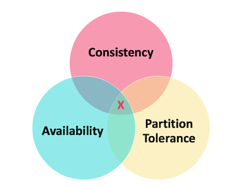


CAP 理论的提出者布鲁尔在提出 CAP 猜想的时候，并没有详细定义 **Consistency**、**Availability**、**Partition Tolerance** 三个单词的明确定义。因此，对于 CAP 的民间解读有很多，一般比较被大家推荐的是下面这种版本的解读。

在理论计算机科学中，CAP 定理（CAP theorem）指出对于一个分布式系统来说，当设计读写操作时，只能同时满足以下三点中的两个：

- **一致性（Consistency）** : **所有节点访问同一份最新的数据副本**。
- **可用性（Availability）**: **非故障的节点在合理的时间内返回合理的响应**（不是错误或者超时的响应）。
- **分区容错性（Partition Tolerance）** : **分布式系统出现网络分区的时候，仍然能够对外提供服务**。

##### **什么是网络分区？**

分布式系统中，多个节点之前的网络本来是连通的，但是因为某些故障（比如部分节点网络出了问题）某些节点之间不连通了，整个网络就分成了几块区域，这就叫 **网络分区**。

##### 不是所谓的“3 选 2”

大部分人解释这一定律时，常常简单的表述为：“一致性、可用性、分区容忍性三者你只能同时达到其中两个，不可能同时达到”。实际上这是一个非常具有误导性质的说法，而且在 CAP 理论诞生 12 年之后，CAP 之父也在 2012 年重写了之前的论文。

> **当发生网络分区的时候，如果我们要继续服务，那么强一致性和可用性只能 2 选 1。也就是说当网络分区之后 P 是前提，决定了 P 之后才有 C 和 A 的选择。也就是说分区容错性（Partition tolerance）我们是必须要实现的。**
>
> 简而言之就是：**CAP 理论中分区容错性 P 是一定要满足的，在此基础上，只能满足可用性 A 或者一致性 C**。

因此，**分布式系统理论上不可能选择 CA 架构，只能选择 CP 或者 AP 架构。** 比如 ZooKeeper、HBase 就是 CP 架构，Cassandra、Eureka 就是 AP 架构，Nacos 不仅支持 CP 架构也支持 AP 架构。

**为啥不可能选择 CA 架构呢？** 举个例子：若系统出现“分区”，系统中的某个节点在进行写操作。为了保证 C， 必须要禁止其他节点的读写操作，这就和 A 发生冲突了。如果为了保证 A，其他节点的读写操作正常的话，那就和 C 发生冲突了。

**选择 CP 还是 AP 的关键在于当前的业务场景，没有定论，比如对于需要确保强一致性的场景如银行一般会选择保证 CP 。**

另外，需要补充说明的一点是： **如果网络分区正常的话（系统在绝大部分时候所处的状态），也就说不需要保证 P 的时候，C 和 A 能够同时保证**。

#### CAP 实际应用案例

下图是 Dubbo 的架构图。**注册中心 Registry 在其中扮演了什么角色呢？提供了什么服务呢？**

注册中心负责服务地址的注册与查找，相当于目录服务，服务提供者和消费者只在启动时与注册中心交互，注册中心不转发请求，压力较小。

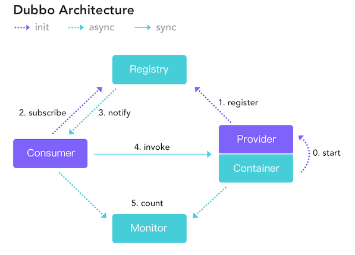

常见的可以作为注册中心的组件有：ZooKeeper、Eureka、Nacos...。

1. **ZooKeeper 保证的是 CP。** 任何时刻对 ZooKeeper 的读请求都能得到一致性的结果，但是， ZooKeeper 不保证每次请求的可用性比如在 Leader 选举过程中或者半数以上的机器不可用的时候服务就是不可用的。
2. **Eureka 保证的则是 AP。** Eureka 在设计的时候就是优先保证 A （可用性）。在 Eureka 中不存在什么 Leader 节点，每个节点都是一样的、平等的。因此 Eureka 不会像 ZooKeeper 那样出现选举过程中或者半数以上的机器不可用的时候服务就是不可用的情况。 Eureka 保证即使大部分节点挂掉也不会影响正常提供服务，只要有一个节点是可用的就行了。只不过这个节点上的数据可能并不是最新的。
3. **Nacos 不仅支持 CP 也支持 AP。**

### 总结

在进行分布式系统设计和开发时，我们不应该仅仅局限在 CAP 问题上，还要关注系统的扩展性、可用性等等。

在系统发生“分区”的情况下，CAP 理论只能满足 CP 或者 AP。要注意的是，这里的前提是系统发生了“分区”

如果系统没有发生“分区”的话，节点间的网络连接通信正常的话，也就不存在 P 了。这个时候，我们就可以同时保证 C 和 A 了。

总结：**如果系统发生“分区”，我们要考虑选择 CP 还是 AP。如果系统没有发生“分区”的话，我们要思考如何保证 CA 。**

## BASE 理论

#### 简介

**BASE** 是 **Basically Available（基本可用）** 、**Soft-state（软状态）** 和 **Eventually Consistent（最终一致性）** 三个短语的缩写。BASE 理论是对 CAP 中一致性 C 和可用性 A 权衡的结果，其来源于对大规模互联网系统分布式实践的总结，是基于 CAP 定理逐步演化而来的，它大大降低了我们对系统的要求。

#### BASE 理论的核心思想

即使无法做到强一致性，但每个应用都可以根据自身业务特点，采用适当的方式来使系统达到最终一致性。

> 也就是牺牲数据的一致性来满足系统的高可用性，系统中一部分数据不可用或者不一致时，仍需要保持系统整体“主要可用”。

**BASE 理论本质上是对 CAP 的延伸和补充，更具体地说，是对 CAP 中 AP 方案的一个补充。**

**为什么这样说呢？**

CAP 理论这节我们也说过了：

> 如果系统没有发生“分区”的话，节点间的网络连接通信正常的话，也就不存在 P 了。这个时候，我们就可以同时保证 C 和 A 了。因此，**如果系统发生“分区”，我们要考虑选择 CP 还是 AP。如果系统没有发生“分区”的话，我们要思考如何保证 CA 。**

因此，**AP 方案只是在系统发生分区的时候放弃一致性，而不是永远放弃一致性**。**在分区故障恢复后，系统应该达到最终一致性**。这一点其实就是 BASE 理论延伸的地方。

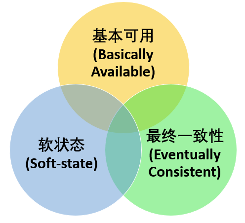

#### 基本可用

基本可用是指分布式系统在出现不可预知故障的时候，**允许损失部分可用性**。但是，这绝不等价于系统不可用。

**什么叫允许损失部分可用性呢？**

- **响应时间上的损失**: 正常情况下，处理用户请求需要 0.5s 返回结果，但是由于系统出现故障，处理用户请求的时间变为 3 s。
- **系统功能上的损失**：正常情况下，用户可以使用系统的全部功能，但是由于系统访问量突然剧增，系统的部分非核心功能无法使用。

#### 软状态

软状态指允许系统中的数据存在中间状态（**CAP 理论中的数据不一致**），并认为该中间状态的存在不会影响系统的整体可用性，即**允许系统在不同节点的数据副本之间进行数据同步的过程存在延时**。

#### 最终一致性

最终一致性强调的是系统中所有的数据副本，在经过一段时间的同步后，最终能够达到一个一致的状态。因此，最终一致性的本质是需要系统保证最终数据能够达到一致，而不需要实时保证系统数据的强一致性。

> 分布式一致性的 3 种级别：
>
> 1. **强一致性** ：系统写入了什么，读出来的就是什么。
> 2. **弱一致性** ：不一定可以读取到最新写入的值，也不保证多少时间之后读取到的数据是最新的，只是会尽量保证某个时刻达到数据一致的状态。
> 3. **最终一致性** ：弱一致性的升级版，系统会保证在一定时间内达到数据一致的状态。
>
> **业界比较推崇是最终一致性级别，但是某些对数据一致要求十分严格的场景比如银行转账还是要保证强一致性。**

那实现最终一致性的具体方式是什么呢? [《分布式协议与算法实战》](http://gk.link/a/10rZM) 中是这样介绍：

> - **读时修复** : 在读取数据时，检测数据的不一致，进行修复。比如 Cassandra 的 Read Repair 实现，具体来说，在向 Cassandra 系统查询数据的时候，如果检测到不同节点 的副本数据不一致，系统就自动修复数据。
> - **写时修复** : 在写入数据，检测数据的不一致时，进行修复。比如 Cassandra 的 Hinted Handoff 实现。具体来说，Cassandra 集群的节点之间远程写数据的时候，如果写失败 就将数据缓存下来，然后定时重传，修复数据的不一致性。
> - **异步修复** : 这个是最常用的方式，通过定时对账检测副本数据的一致性，并修复。

比较推荐 **写时修复**，这种方式对性能消耗比较低。

###  总结

**ACID 是数据库事务完整性的理论，CAP 是分布式系统设计理论，BASE 是 CAP 理论中 AP 方案的延伸**。


> 原文链接：https://pdai.tech/md/interview/x-interview-2.html

### 全局唯一ID

#### 全局唯一ID有哪些实现方案？

常见的分布式ID生成方式，大致分类的话可以分为两类：

1. **一种是类DB型的**，根据设置不同起始值和步长来实现趋势递增，需要考虑服务的容错性和可用性;
   - UUID：因为是本地生成，性能极高，但是生成的ID太长，16字节128位，通常需要字符串类型存储，且无序，所以很多场景不适用，也不适用于作为MySQL数据库的主键和索引（MySql官方建议，主键越短越好；对于InnoDB引擎，索引的无序性可能会引起数据位置频繁变动，严重影响性能）。
   - 数据库自增ID：每次获取ID都需要DB的IO操作，DB压力大，性能低。数据库宕机则是毁灭性打击，不过可以部署数据库集群保持高可用。
   - 对数据库自增ID的优化，每次获取一个号段的值。用完之后再去数据库获取新的号段，可以大大减轻数据库的压力。号段越长，性能越高，同时如果数据库宕机，号段没有用完，短时间还可以对外提供服务。（[美团的Leaf](https://github.com/Meituan-Dianping/Leaf)、[滴滴的TinyId](https://github.com/didi/tinyid)）
2. **另一种是类snowflake型**，这种就是将64位划分为不同的段，每段代表不同的涵义，**基本就是时间戳、机器ID和序列数**。这种方案就是需要考虑时钟回拨的问题以及做一些 buffer的缓冲设计提高性能。

#### 数据库方式实现方案？有什么缺陷？

##### MySQL为例

我们将分布式系统中数据库的同一个业务表的自增ID设计成不一样的起始值，然后设置固定的步长，步长的值即为分库的数量或分表的数量。

以MySQL举例，利用给字段设置`auto_increment_increment`和`auto_increment_offset`来保证ID自增。

1. `auto_increment_offset`：表示自增长字段从那个数开始，他的取值范围是1 .. 65535。
2. `auto_increment_increment`：表示自增长字段每次递增的量，其默认值是1，取值范围是1 .. 65535。

缺点也很明显，首先它**强依赖DB**，当DB异常时整个系统不可用。虽然配置主从复制可以尽可能的增加可用性，但是**数据一致性在特殊情况下难以保证**。主从切换时的不一致可能会导致重复发号。还有就是**ID发号性能瓶颈限制在单台MySQL的读写性能**。

##### 使用redis实现

Redis实现分布式唯一ID主要是通过提供像 `INCR` 和 `INCRBY` 这样的自增原子命令，由于Redis自身的单线程的特点所以能保证生成的 ID 肯定是唯一有序的。

但是单机存在性能瓶颈，无法满足高并发的业务需求，所以可以采用集群的方式来实现。集群的方式又会涉及到和数据库集群同样的问题，所以也需要设置分段和步长来实现。

为了避免长期自增后数字过大可以通过与当前时间戳组合起来使用，另外为了保证并发和业务多线程的问题可以采用 Redis + Lua的方式进行编码，保证安全。

Redis 实现分布式全局唯一ID，它的性能比较高，生成的数据是有序的，对排序业务有利，但是同样它依赖于redis，**需要系统引进redis组件，增加了系统的配置复杂性**。

当然现在Redis的使用性很普遍，所以如果其他业务已经引进了Redis集群，则可以资源利用考虑使用Redis来实现。

#### 雪花算法ID

Snowflake，雪花算法是由Twitter开源的分布式ID生成算法，以划分命名空间的方式将 64-bit位分割成多个部分，每个部分代表不同的含义。而 Java中64bit的整数是Long类型，所以在 Java 中 SnowFlake 算法生成的 ID 就是 long 来存储的。

- **第1位**占用1bit，其值始终是0，可看做是符号位不使用。
- **第2位**开始的41位是时间戳，41-bit位可表示2^41个数，每个数代表毫秒，那么雪花算法可用的时间年限是`(1L<<41)/(1000L360024*365)`=69 年的时间。
- **中间的10-bit位**可表示机器数，即2^10 = 1024台机器，但是一般情况下我们不会部署这么台机器。如果我们对IDC（互联网数据中心）有需求，还可以将 10-bit 分 5-bit 给 IDC，分5-bit给工作机器。这样就可以表示32个IDC，每个IDC下可以有32台机器，具体的划分可以根据自身需求定义。
- **最后12-bit位**是自增序列，可表示2^12 = 4096个数。

这样的划分之后相当于**在一毫秒一个数据中心的一台机器上可产生4096个有序的不重复的ID**。但是我们 IDC 和机器数肯定不止一个，所以毫秒内能生成的有序ID数是翻倍的。

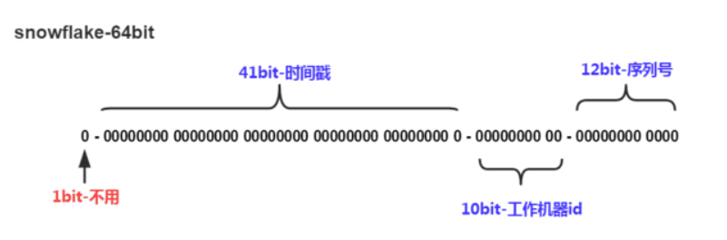

##### 雪花算法有什么问题？有哪些解决思路？

###### 有哪些问题？

1. 时钟回拨问题；
2. 趋势递增，而不是绝对递增；
3. 不能在一台服务器上部署多个分布式ID服务；
4. 强依赖机器时钟，如果机器上时钟回拨，会导致发号重复或者服务处于不可用状态。

Java 生成 snowflake 代码：[雪花算法snowflake分布式id生成原理详解，以及对解决时钟回拨问题几种方案讨论](https://blog.csdn.net/weixin_36586120/article/details/118018414)

###### 如何解决时钟回拨？

以百度的UidGenerator为例，CachedUidGenerator方式主要通过采取如下一些措施和方案规避了时钟回拨问题和增强唯一性：

1. **自增列**：UidGenerator的workerId在实例每次重启时初始化，且就是数据库的自增ID，从而完美的实现每个实例获取到的workerId不会有任何冲突。
2. **RingBuffer**：UidGenerator不再在每次取ID时都实时计算分布式ID，而是利用RingBuffer数据结构预先生成若干个分布式ID并保存。
3. **时间递增**：传统的雪花算法实现都是通过System.currentTimeMillis()来获取时间并与上一次时间进行比较，这样的实现严重依赖服务器的时间。而UidGenerator的时间类型是AtomicLong，且通过incrementAndGet()方法获取下一次的时间，从而脱离了对服务器时间的依赖，也就不会有时钟回拨的问题

（这种做法也有一个小问题，即分布式ID中的时间信息可能并不是这个ID真正产生的时间点，例如：获取的某分布式ID的值为3200169789968523265，它的反解析结果为{"timestamp":"2019-05-02 23:26:39","workerId":"21","sequence":"1"}，但是这个ID可能并不是在"2019-05-02 23:26:39"这个时间产生的）。

[浩鲸科技：为什么要用雪花ID替代数据库自增ID？](https://juejin.cn/post/7307066138487521289)

### 分布式锁

#### 实现一个分布式锁，需要满足哪些条件

- **高性能**:我们这个分布式锁可能会有很多的服务器来获取，所以我们一定要能够高性能的获取和释放;
- **高可网**:不能因为某一个分布式锁获取的服务不可用，导致所有服务都拿不到或释放锁，所以要满足高可用要求;
- **锁失效机制**:假设某个应用获取到锁之后，一直没有来释放锁，可能服务本身已经挂掉了，不能一直不释放导致其他服务一直获取不到锁;
- **非阻塞特性**:在某个服务来获取锁时，假设该锁已经被另一个服务获取，我们要能直接返回失败，不能一直等待。

#### 有哪些方案可以实现分布式锁

- 使用场景 
  - 需要保证一个方法在同一时间内只能被同一个线程执行
- 实现方式: 
  - 加锁和解锁
- 方案,考虑因素(性能,稳定,实现难度,死锁) 
  - 基于数据库做分布式锁--乐观锁(基于版本号)和悲观锁(基于排它锁)
  - 基于 redis 做分布式锁:setnx(key,当前时间+过期时间)和Redlock机制
  - 基于 zookeeper 做分布式锁:临时有序节点来实现的分布式锁,Curator
  - 基于 Consul 做分布式锁

#### 基于数据库如何实现分布式锁，有什么缺陷？

##### 基于数据库表（锁表，很少使用）

最简单的方式可能就是直接创建一张锁表，然后通过操作该表中的数据来实现了。当我们想要获得锁的时候，就可以在该表中增加一条记录，想要释放锁的时候就删除这条记录。

```mysql
CREATE TABLE database_lock (
	`id` BIGINT NOT NULL AUTO_INCREMENT,
	`resource` int NOT NULL COMMENT '锁定的资源',
	`description` varchar(1024) NOT NULL DEFAULT "" COMMENT '描述',
	PRIMARY KEY (id),
	UNIQUE KEY uiq_idx_resource (resource)
) ENGINE=InnoDB DEFAULT CHARSET=utf8mb4 COMMENT='数据库分布式锁表';
```

当我们想要获得锁时，可以插入一条数据：

```sql
INSERT INTO database_lock(resource, description) VALUES (1, 'lock');
```

当需要释放锁的时，可以删除这条数据：

```sql
DELETE FROM database_lock WHERE resource=1;
```

##### 基于悲观锁

###### **悲观锁实现思路**？

可以基于唯一索引实现，插入相同的锁比如：uniqueLock，插入成功则获取锁成功，插入失败则获取锁失败。

1. 在对任意记录进行修改前，先尝试为该记录加上排他锁（exclusive locking）。
2. 如果加锁失败，说明该记录正在被修改，那么当前查询可能要等待或者抛出异常。 具体响应方式由开发者根据实际需要决定。
3. 如果成功加锁，那么就可以对记录做修改，事务完成后就会解锁了。
4. 其间如果有其他对该记录做修改或加排他锁的操作，都会等待我们解锁或直接抛出异常。

###### 以MySQL InnoDB中使用悲观锁为例

要使用悲观锁，我们必须关闭mysql数据库的自动提交属性，因为MySQL默认使用autocommit模式，也就是说，当你执行一个更新操作后，MySQL会立刻将结果进行提交。set autocommit=0;

```mysql
//0.开始事务
begin;/begin work;/start transaction; (三者选一就可以)
//1.查询出商品信息
select status from t_goods where id=1 for update;
//2.根据商品信息生成订单
insert into t_orders (id,goods_id) values (null,1);
//3.修改商品status为2
update t_goods set status=2;
//4.提交事务
commit;/commit work;
```

上面的查询语句中，我们使用了`select…for update`的方式，这样就通过开启排他锁的方式实现了悲观锁。此时在t_goods表中，id为1的 那条数据就被我们锁定了，其它的事务必须等本次事务提交之后才能执行。这样我们可以保证当前的数据不会被其它事务修改。

上面我们提到，使用`select…for update`会把数据给锁住，不过我们需要注意一些锁的级别，MySQL InnoDB默认行级锁。**行级锁都是基于索引的，如果一条SQL语句用不到索引是不会使用行级锁的，会使用表级锁把整张表锁住**，这点需要注意。

##### 基于乐观锁

乐观并发控制（又名“乐观锁”，Optimistic Concurrency Control，缩写“OCC”）是一种并发控制的方法。它假设多用户并发的事务在处理时不会彼此互相影响，各事务能够在不产生锁的情况下处理各自影响的那部分数据。在提交数据更新之前，每个事务会先检查在该事务读取数据后，有没有其他事务又修改了该数据。如果其他事务有更新的话，正在提交的事务会进行回滚。

###### 以使用版本号实现乐观锁为例？

使用版本号时，可以在数据初始化时指定一个版本号，每次对数据的更新操作都对版本号执行+1操作。并判断当前版本号是不是该数据的最新的版本号。

```sql
1.查询出商品信息
select (status,status,version) from t_goods where id=#{id}
2.根据商品信息生成订单
3.修改商品status为2
update t_goods 
set status=2,version=version+1
where id=#{id} and version=#{version};
```

需要注意的是，乐观锁机制往往基于系统中数据存储逻辑，因此也具备一定的局限性。由于乐观锁机制是在我们的系统中实现的，对于来自外部系统的用户数据更新操作不受我们系统的控制，因此可能会造成脏数据被更新到数据库中。在系统设计阶段，我们应该充分考虑到这些情况，并进行相应的调整（如将乐观锁策略在数据库存储过程中实现，对外只开放基于此存储过程的数据更新途径，而不是将数据库表直接对外公开）。

- **缺陷**

对数据库依赖，开销问题，行锁变表锁问题，无法解决数据库单点和可重入的问题。

#### 基于redis如何实现分布式锁？有什么缺陷？

##### 最基本的Jedis方案

###### **加锁**： set NX PX + 重试 + 重试间隔

##### 基于RedLock实现分布式锁

假设有两个服务A、B都希望获得锁，有一个包含了5个redis master的Redis Cluster，执行过程大致如下:

1. 客户端获取当前时间戳，单位: 毫秒
2. 服务A轮寻每个master节点，尝试创建锁。(这里锁的过期时间比较短，一般就几十毫秒) RedLock算法会尝试在大多数节点上分别创建锁，假如节点总数为n，那么大多数节点指的是n/2+1。
3. 客户端计算成功建立完锁的时间，如果建锁时间小于超时时间，就可以判定锁创建成功。如果锁创建失败，则依次(遍历master节点)删除锁。
4. 只要有其它服务创建过分布式锁，那么当前服务就必须轮寻尝试获取锁。

##### 基于Redisson实现分布式锁

**过程**

1. 线程去获取锁，获取成功: 执行lua脚本，保存数据到redis数据库。
2. 线程去获取锁，获取失败: 订阅了解锁消息，然后再尝试获取锁，获取成功后，执行lua脚本，保存数据到redis数据库。

**互斥**

如果这个时候客户端B来尝试加锁，执行了同样的一段lua脚本。第一个if判断会执行“exists myLock”，发现myLock这个锁key已经存在。接着第二个if判断，判断myLock锁key的hash数据结构中，是否包含客户端B的ID，但明显没有，那么客户端B会获取到pttl myLock返回的一个数字，代表myLock这个锁key的剩余生存时间。此时客户端B会进入一个while循环，不听的尝试加锁。

**watch dog自动延时机制**

客户端A加锁的锁key默认生存时间只有30秒，如果超过了30秒，客户端A还想一直持有这把锁，怎么办？其实只要客户端A一旦加锁成功，就会启动一个watch dog看门狗，它是一个后台线程，会每隔10秒检查一下，如果客户端A还持有锁key，那么就会不断的延长锁key的生存时间。

**可重入**？

每次lock会调用incrby，每次unlock会减一。

##### 方案比较

1. 借助Redis实现分布式锁时，有一个共同的缺陷: 当获取锁被决绝后，需要不断的循环，重新发送获取锁(创建key)的请求，直到请求成功。这就造成空转，浪费宝贵的CPU资源。
2. RedLock算法本身有争议，并不能保证健壮性。
3. Redisson实现分布式锁时，除了将key新增到某个指定的master节点外，还需要由master自动异步的将key和value等数据同步至绑定的slave节点上。那么问题来了，如果master没来得及同步数据，突然发生宕机，那么通过故障转移和主备切换，slave节点被迅速升级为master节点，新的客户端加锁成功，旧的客户端的watch dog发现key存在，误以为旧客户端仍然持有这把锁，这就导致同时存在多个客户端持有同名锁的问题了。

#### 基于zookeeper如何实现分布式锁

- **顺序节点**

创建一个用于发号的节点“/test/lock”，然后以它为父亲节点的前缀为“/test/lock/seq-”依次发号：

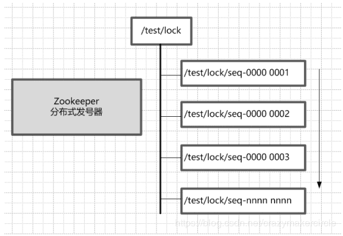

- **获得最小号得锁**

由于序号的递增性，可以规定排号最小的那个获得锁。所以，每个线程在尝试占用锁之前，首先判断自己是排号是不是当前最小，如果是，则获取锁。

- **节点监听机制**

每个线程抢占锁之前，先抢号创建自己的ZNode。同样，释放锁的时候，就需要删除抢号的Znode。抢号成功后，如果不是排号最小的节点，就处于等待通知的状态。等谁的通知呢？不需要其他人，只需要等前一个Znode 的通知就可以了。当前一个Znode 删除的时候，就是轮到了自己占有锁的时候。第一个通知第二个、第二个通知第三个，击鼓传花似的依次向后。

### 分布式事务

#### 分布式事务有哪些解决方案？

#### 什么是分布式的XA协议？

XA协议是一个基于**数据库**的**分布式事务协议**，其分为两部分：**事务管理器**和**本地资源管理器**。事务管理器作为一个全局的调度者，负责对各个本地资源管理器统一号令提交或者回滚。`二阶提交协议（2PC）`和`三阶提交协议（3PC）`就是根据此协议衍生出来而来。主流的诸如Oracle、MySQL等数据库均已实现了XA接口。

XA接口是双向的系统接口，在事务管理器（Transaction Manager）以及一个或多个资源管理器（Resource Manager）之间形成通信桥梁。也就是说，在基于XA的一个事务中，我们可以针对多个资源进行事务管理，例如一个系统访问多个数据库，或即访问数据库、又访问像消息中间件这样的资源。这样我们就能够实现在多个数据库和消息中间件直接实现全部提交、或全部取消的事务。**XA规范不是java的规范，而是一种通用的规范**。

#### 什么是2PC

两段提交顾名思义就是要进行两个阶段的提交：

- 第一阶段，准备阶段（投票阶段）；
- 第二阶段，提交阶段（执行阶段）。

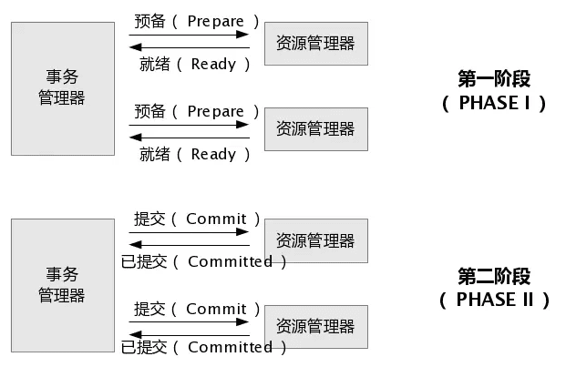

业务服务化（SOA）以后，一个下单流程就会用到多个服务，各个服务都无法保证调用的其他服务的成功与否，这个时候就需要一个全局的角色（**协调者**）对各个服务（**参与者**）进行协调。

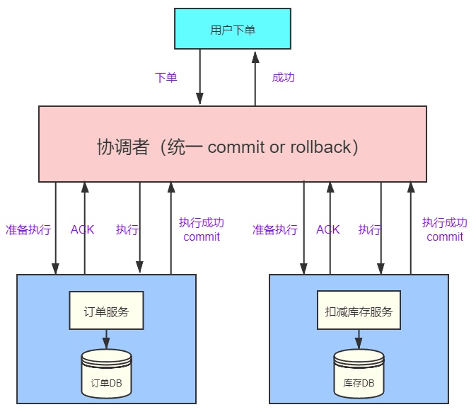

一个下单请求过来通过协调者，给每一个参与者发送Prepare消息，执行本地数据脚本但不提交事务。

如果协调者收到了参与者的失败消息或者超时，直接给每个参与者发送回滚(Rollback)消息；否则，发送提交（Commit）消息；参与者根据协调者的指令执行提交或者回滚操作，释放所有事务处理过程中被占用的资源，显然2PC做到了所有操作要么全部成功、要么全部失败。

##### **两段提交（2PC）的缺点**：

二阶段提交看似能够提供原子性的操作，但它存在着严重的缺陷：

- **网络抖动导致的数据不一致**：第二阶段中协调者向参与者发送commit命令之后，一旦此时发生网络抖动，导致一部分参与者接收到了commit请求并执行，可其他未接到commit请求的参与者无法执行事务提交。进而导致整个分布式系统出现了数据不一致。
- **超时导致的同步阻塞问题**：2PC中的所有的参与者节点都为事务阻塞型，当某一个参与者节点出现通信超时，其余参与者都会被动阻塞占用资源不能释放。
- **单点故障的风险**：由于严重的依赖协调者，一旦协调者发生故障，而此时参与者还都处于锁定资源的状态，无法完成事务commit操作。虽然协调者出现故障后，会重新选举一个协调者，可无法解决因前一个协调者宕机导致的参与者处于阻塞状态的问题。

##### 如何处理协调者和参与者之间的通信故障？

- 消息队列：参与者和协调者通过MQ来通信，参与者写消息到MQ，协调者消费，并进行事务处理，如果协调者出现问题，则可以使用备份事务管理器。

- 超时机制:在2PC协议中，每个阶段都有一个预定的超时时间。如果在超时时间内没有收到响应，协调者将会进行相应的处理。例如，如果在第一阶段中协调者无法收到参与者的响应，它可以将参与者视为失败，并通知所有其他参与者回滚事务。
- 心跳机制:协调者可以定期向参与者发送心跳消息，以检测参与者的状态。如果协调者在一段时间内没有收2.
  到参与者的响应，它可以将参与者视为失败并进行相应的处理。
- 预备性提交:在第一阶段中，协调者可以请求参与者进行预备性提交，并在得到所有参与者的预备性提交确认后，将事务提交请求发给所有参与者。如果在第二阶段中，协调者法收到某个参与者的确认消息，则可以向该参与者发送回滚请求。
- 备份协调者:在2PC中，可以使用备份协调者来提高系统的可靠性。备份协调者可以监控协调者的状态，并4在协调者失效时接替其工作。

#### 什么是3PC

三段提交（3PC）是对两段提交（2PC）的一种升级优化，**3PC在2PC的第一阶段和第二阶段中插入一个准备阶段**。保证了在最后提交阶段之前，各参与者节点的状态都一致。同时在协调者和参与者中都引入超时机制，当参与者各种原因未收到协调者的commit请求后，会对本地事务进行commit，不会一直阻塞等待，解决了2PC的单点故障问题，但3PC还是没能从根本上解决数据一致性的问题。

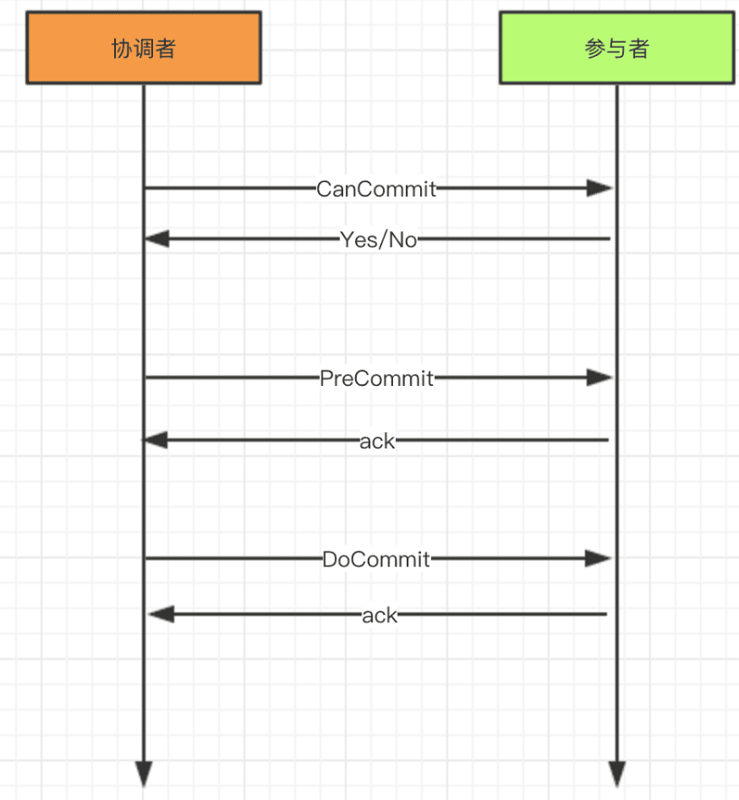

**3PC的三个阶段分别是CanCommit、PreCommit、DoCommit**：

- **CanCommit**：协调者向所有参与者发送CanCommit命令，询问是否可以执行事务提交操作。如果全部响应YES则进入下一个阶段。
- **PreCommit**：协调者向所有参与者发送PreCommit命令，询问是否可以进行事务的预提交操作，参与者接收到PreCommit请求后，如参与者成功的执行了事务操作，则返回Yes响应，进入最终commit阶段。一旦参与者中有向协调者发送了No响应，或因网络造成超时，协调者没有接到参与者的响应，协调者向所有参与者发送abort请求，参与者接受abort命令执行事务的中断。
- **DoCommit**：在前两个阶段中所有参与者的响应反馈均是YES后，协调者向参与者发送DoCommit命令正式提交事务，如协调者没有接收到参与者发送的ACK响应，会向所有参与者发送abort请求命令，执行事务的中断。

#### 什么是TCC

TCC（Try-Confirm-Cancel）又被称补偿事务，TCC与2PC的思想很相似，事务处理流程也很相似，但**2PC是应用于在DB层面，TCC则可以理解为在应用层面的2PC，是需要我们编写业务逻辑来实现**。

TCC它的核心思想是："针对每个操作都要注册一个与其对应的确认（Try）和补偿（Cancel）"。

还拿下单扣库存解释下它的三个操作：

- **Try阶段**：下单时通过Try操作去扣除库存预留资源。
- **Confirm阶段**：确认执行业务操作，在只预留的资源基础上，发起购买请求。
- **Cancel阶段**：只要涉及到的相关业务中，有一个业务方预留资源未成功，则取消所有业务资源的预留请求。

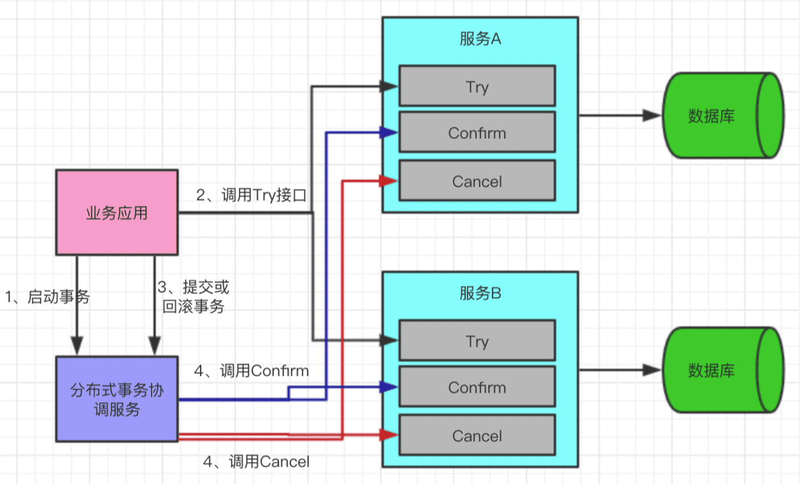

**TCC的缺点**：

- 应用侵入性强：TCC由于基于在业务层面，至使每个操作都需要有try、confirm、cancel三个接口。
- 开发难度大：代码开发量很大，要保证数据一致性confirm和cancel接口还必须实现幂等性。

**TCC的优点**：

很好的保持分布式事务的一致性，有补偿机制。

###### 案例

【【面试精选】成功上岸！！阿里大佬带你2天刷完分布式面试题，比啃书效果好多了！！】 https://www.bilibili.com/video/BV17g4y1W7Ci/?p=6&share_source=copy_web&vd_source=3b1efacb505b91ba7db831546c052ed8

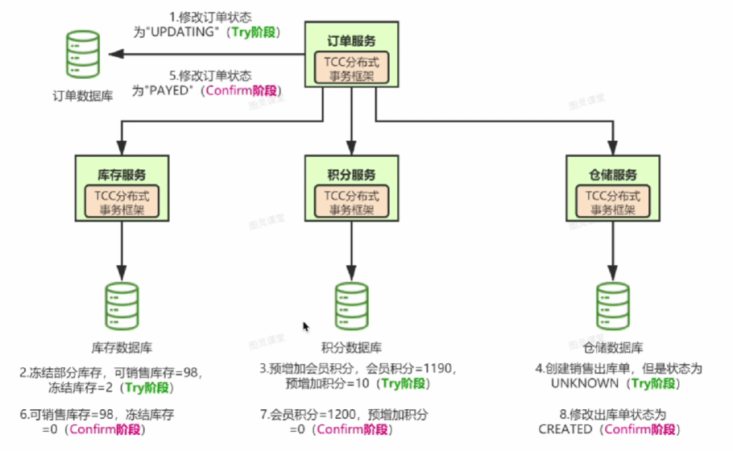

如果是失败了

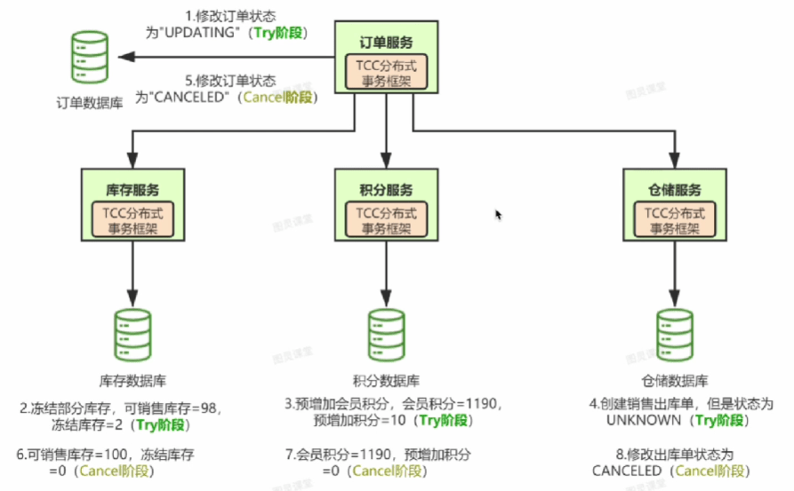

