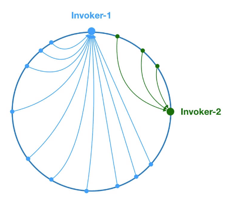
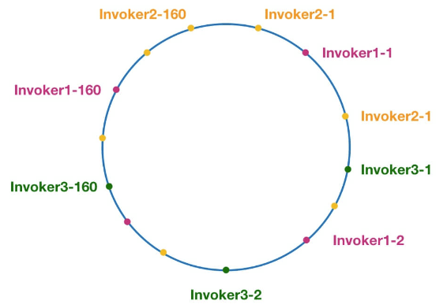
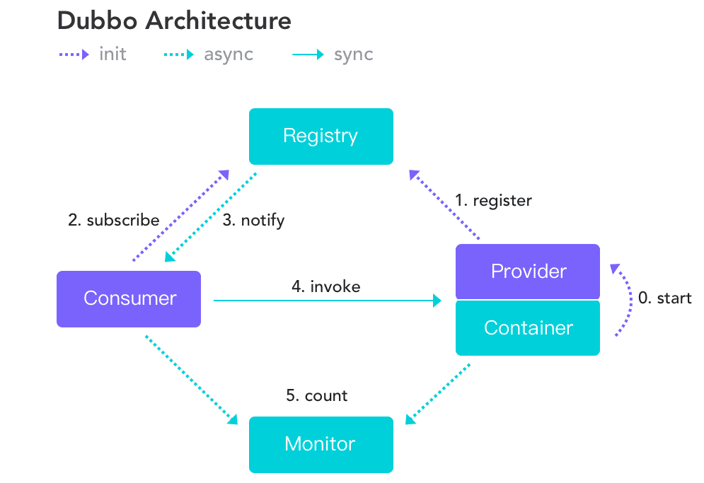
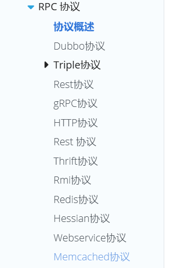

### 微服务(dubbo、zookeeper、springcloud、ES)

#### 微服务

##### 用几个词概括一下微服务的特点

单一职责、 团队独立、 技术独立、 前后端分离、 数据库分离、独立部署、 服务治理

#### dubbo

[Dubbo面试题（总结最全面的面试题）](https://juejin.cn/post/6844904127076499463)

[官网的参考手册](https://cn.dubbo.apache.org/zh-cn/overview/mannual/java-sdk/reference-manual/)

##### springcloud 和 dubbo 的区别

##### 服务调用超时会怎么样？

- dubbo 在调用服务不成功时，默认是会重试两次。这个配置可以进行修改，有很多属性可以修改，协议，超时时间等。

```java
import org.apache.dubbo.rpc.RpcContext;
import org.apache.dubbo.config.annotation.Service;
/**
 * @Service 注解是dubbo的注解，不是spring的，可以对其设置一个调用的超时时间：timeout = 2000。
 * 还可以设置其他的一些属性
 * 服务接口实现类配置：
 * @Service(interfaceClass = YourService.class)：指定服务接口。
 * 超时配置：
 * @Service(timeout = 3000)：设置服务的超时时间（毫秒）。
 * 版本配置：
 * @Service(version = "1.0")：指定服务的版本号。
 * 集群配置：
 * @Service(cluster = "failfast")：设置集群容错模式，例如 failfast、failsafe、failover 等。
 */
@Service(timeout = 2000, retries = 2)
public class DemoServiceImpl implements DemoService {
    @Override
    public String sayHello(String name) {
        log.info("Hello " + name + ", request from consumer: " + RpcContext.getContext().getRemoteAddress());
        try {
            Thread.sleep(1000);
        } catch (InterruptedException e) {
            e.printStackTrace();
        }
        return "Hello " + name + ", response from provider: " + RpcContext.getContext().getLocalAddress();
    }
}
```

##### dubbo和open feign的区别

dubbo

1. **通信协议：** Dubbo 使用 RPC（远程过程调用）协议进行通信，支持多种序列化协议，如Hessian、JSON等。
2. **服务治理：** Dubbo 提供了强大的服务治理和负载均衡能力，包括服务注册、发现、路由、负载均衡等。
3. **传输协议：** Dubbo 可以使用多种传输协议，包括dubbo协议、http协议等。
4. **中心化配置：** Dubbo 支持中心化的配置管理，可以通过注册中心配置服务提供者和消费者的一些行为。
5. **异步调用：** Dubbo 支持异步调用，可以通过异步方式提高系统的并发能力。

openFeign

1. **通信协议：** OpenFeign 基于 HTTP 协议，使用了 Spring Cloud 的服务治理功能。
2. **服务治理：** OpenFeign通常与Spring Cloud一起使用，利用Eureka或其他服务注册中心进行服务的发现和治理。
3. **传输协议：** OpenFeign 主要基于 HTTP，通常用于微服务之间的 HTTP 通信。
4. **中心化配置：** OpenFeign 常常与 Spring Cloud Config 等工具一起使用，实现中心化的配置管理。
5. **声明式REST调用：** OpenFeign 提供了声明式的 REST 调用方式，通过简单的注解，开发者可以轻松定义和调用服务。

##### dubbo的 SPI 机制

简单来说就是自己实现一个负载均衡策略，然后将实现类放入到 `META-INF/dubbo/org.apache.dubbo.rpc.cluster.LoadBalance` 配置文件中，在程序运行过程中读取配置文件，通过反射加载实现类。

##### 负载均衡（轮询）

###### Weighted RandomLoadBalance 根据权重随机选择（对加权随机算法的实现）

这是Dubbo默认采用的一种负载均衡策略。假如有两个提供相同服务的服务器 S1,S2，S1的权重为7，S2的权重为3，我们把这些权重值分布在坐标区间会得到：S1->[0, 7) ，S2->[7, 10)。我们生成[0, 10) 之间的随机数，随机数落到对应的区间，我们就选择对应的服务器来处理请求。

缺点：存在慢的提供者累积请求的问题，比如：第二台机器很慢，但没挂，当请求调到第二台时就卡在那，久而久之，所有请求都卡在调到第二台上。

###### LeastActive LoadBalance 最小活跃负载均衡

初始状态下所有服务提供者的活跃数均为 0，每收到一个请求后，对应的服务提供者的活跃数 +1，当这个请求处理完之后，活跃数 -1。**Dubbo 就认为谁的活跃数越少，谁的处理速度就越快，性能也越好，**。

**多个服务提供者的活跃数相等怎么办**？**再走一遍 RandomLoadBalance**。

使慢的提供者收到更少请求，因为越慢的提供者的调用前后计数差会越大；相对的，处理能力越强的节点，处理更多的请求。

###### ConsistentHash LoadBalance 一致性 hash 负载均衡策略 

在分库分表、各种集群中就经常使用这个负载均衡策略，`ConsistentHashLoadBalance` 中没有权重的概念，具体是哪个服务提供者处理请求是由你的请求的参数决定的，也就是说相同参数的请求总是发到同一个服务提供者。



Dubbo 为了避免数据倾斜问题（节点不够分散，大量请求落到同一节点），还引入了虚拟节点的概念。通过虚拟节点可以让节点更加分散，有效均衡各个节点的请求量。



当某一台提供者挂时，原本发往该提供者的请求，基于虚拟节点，平摊到其它提供者，不会引起剧烈变动。

###### RoundRobinLoadBalance 加权轮询负载均衡

**轮询就是把请求依次分配给每个服务提供者**。加权轮询就是在轮询的基础上，**让更多的请求落到权重更大的服务提供者上**。比如假如有两个提供相同服务的服务器 S1,S2，S1的权重为7，S2的权重为3。

如果我们有 10 次请求，那么 7 次会被 S1处理，3次被 S2处理。

但是，如果是 `RandomLoadBalance` 的话，很可能存在10次请求有9次都被 S1 处理的情况（概率性问题）。

缺点：同样存在慢的提供者累积请求的问题

##### dubbo的架构和分层

###### 五个角色

注册中心registry:服务注册与发现

服务提供者provider:暴露服务

服务消费者consumer:调用远程服务

监控中心monitor:统计服务的调用次数和调用时间

容器container:服务允许容器

###### 调用流程

1:container容器负责启动、加载、运行provider

2:provider在启动时，向regisitry中心注册自己提供的服务

3:consumer在启动时，向regisitry中心订阅自己所需的服务

4:regisitry返回服务提供者列表给consumer，如果有变更，registry将基于长连接推送变更数据给consumer

5:consumer调用provider服务，基于负载均衡算法进行调用

6:consumer调用provider的统计，基于短链接定时每分钟-次统计到monitor

###### 分层

接口服务层(service):面向开发者，业务代码、接口、实现等

配置层(Config):对外配置接口，以ServiceConfg和 Referenceconfig为中心

服务代理层(Proxy):对生产者和消费者、dubbo都会产生一个代理类封装调用细节，业务层对远程调用无感，支持jdk动态代理、Javasist等。

服务注册层(Registry):封装服务地址的注册和发现，以服务URL为中心，支持zookeeper、redis等作为注册中心。

路由层(Cluster): 封装多个提供者的路由和负载均衡，并桥接注册中心

监控层(Monitor):RPC调用次数和调用时间监控

远程调用层(Protocol):封装RPC调用，**支持dubbo、http、netty等协议**

信息交换层(Exchange):封装请求响应模式，同步转异步

网络传输层(Transport):抽象 mina 和 netty 为统一接口，统一网络传输接口

数据序列化层(Serialize):数据传输的序列化和反序列化，支持json、hessian等

###### 图示



##### dubbo集群容错策略有哪些

也就是从consumer调用provider失败后，如何处理？

Failover Cluster失败自动切换:dubbo的默认容错方案，当调用失败时自动切换到其他可用的节点，具体的重试次数和间隔时间可通过引用服务的时候配置，默认重试次数为1也就是只调用一次。

Failback Cluster失败自动恢复:在调用失败，记录日志和调用信息，然后返回空结果给consumer，并且通过定时任务每隔5秒对失败的调用进行重试

Failfast Cluster快速失败:只会调用一次，失败后立刻抛出异常

Failsafe Cluster失败安全:调用出现异常，记录日志不抛出，返回空结果

Forking Cluster并行调用多个服务提供者:通过线程池创建多个线程，并发调用多个provider，结果保存到阻塞队列，只要有一个provider成功返回了结果，就会立刻返回结果

Broadcast Cluster广播模式:逐个调用每个provider，如果其中一台报错，在循环调用结束后，抛出异常。

##### dubbo如何完成服务引入的

1. 当程序员使用@Reference注解来引入个服务时，Dubbo会将注解和服务的信息解析出来，得到当前所引用的服务名、服务接口是什么。
2. 然后从注册中心进行查询服务信息，得到服务的提供者信息，并存在消费端的服务目录中（类似于本地缓存）
3. 并绑定一些监听器用来监听动态配置中心的变更
4. 然后根据查询得到的服务提供者信息生成一个服务接口的代理对象，并放入Spring容器中作为Bean

##### dubbo支持的协议

[RPC 协议 | Apache Dubbo](https://cn.dubbo.apache.org/zh-cn/overview/mannual/java-sdk/reference-manual/protocol/)




##### 支持的注册中心

Zookeeper(官方推荐)

优点：支持分布式

缺点：受限于Zookeeperl的特性

Multicast::组播协议允许将一台主机发送的数据通过网络路由器和交换机复制到多个加入此组播的主机，是一种
一对多的通讯方式。每一台服务提供方和服务消费方都可以看作是注册中心的一部分
优点：去中心化，不需要单独安装软件

缺点：Provider和Consumer和Registry不能跨机房（路由）

不需要启动任何中心节点，只要广播地址一样，就可以互相发现，组播受网络结构限制，只适合小规模应用或开发阶段使用。

Redis
优点：支持集群，性能高

缺点：要求服务器时间同步.否则可能出现集群失败问题

Simple
优点：标准RPC服务.没有兼容问题

缺点：不支持集群

**这些都可以在文档中找到**

##### dubbo中zk集群挂掉，消费者和提供者还能通信吗？

因为当启动dubbo容器时，消费者会去zookeeper?拉取注册的生产者地址列表，并将其缓存在本地。每次发起用时，都会按照本地的地址列表，以负载均衡的策略去进行调用。但是zookeeper挂掉则后续新的生产者无法被消费
者发现。

- 注册中心对等集群，任意一台宕掉后，会自动切换到另一台
- 注册中心全部宕掉，服务提供者和消费者仍可以通过本地缓存通讯
- 服务提供者无状态，任一台宕机后，不影响使用
- 服务提供者全部宕机，服务消费者会无法使用，并无限次重连等待服务者恢复

##### dubbo接口如何调试

https://blog.csdn.net/weixin_43291944/article/details/114356508

1. 通过代码
2. 通过telnet localhost 20080
3. jemeter
4. dubbo-admin 控制台
5. 泛化调用 GenericService

#### session 的分布式方案

1、采用无状态服务，抛弃session
2、存入cookie(有安全风险)
3、服务器之间进行 Session 同步，这样可以保证每个服务器上都有全部的 Session 信息，不过当服务器数量比较多的时候，同步是会有延迟甚至同步失败;
4、IP 绑定策略
使用 Nginx(或其他复杂均衡软硬件)中的IP 绑定策略，同一个IP 只能在指定的同一个机器访问，但是这样做失去了负载均衡的意义，当挂掉一台服务器的时候，会影响一批用户的使用，风险很大;
5、使用 Redis 存储
把 Session 放到 Redis 中存储，虽然架构上变得复杂，并且需要多访问一次 Redis ，但是这种方案带来的好处也是很大的:

- 实现了 Session 共享;
- 可以水平扩展(增加 Redis 服务器)
- 服务器重启 Session 不丢失(不过也要注意 Session 在 Redis 中的刷新/失效机制)
- 不仅可以跨服务器 Session 共享，甚至可以跨平台(例如网页端和 APP 端)。

#### zookeeper

[P27 zk的watch机制实现原理 11:58 (bilibili.com)](https://www.bilibili.com/video/BV17g4y1W7Ci?p=27)
