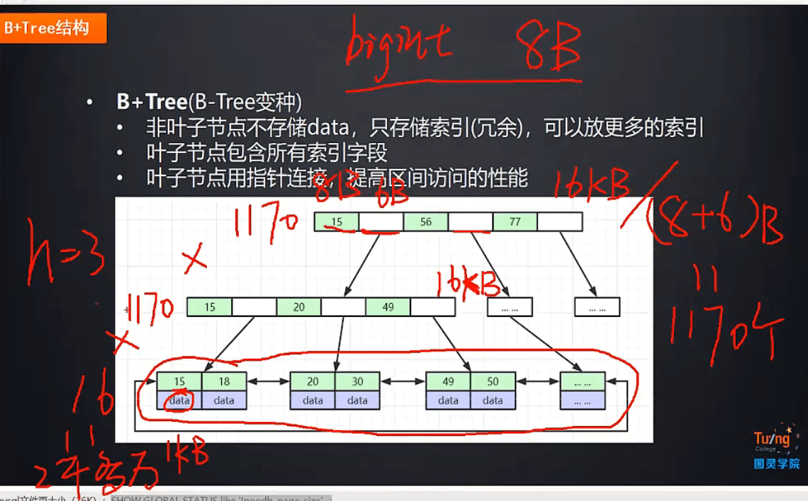
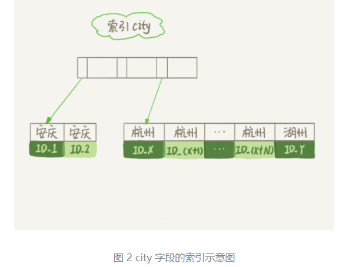
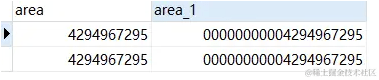
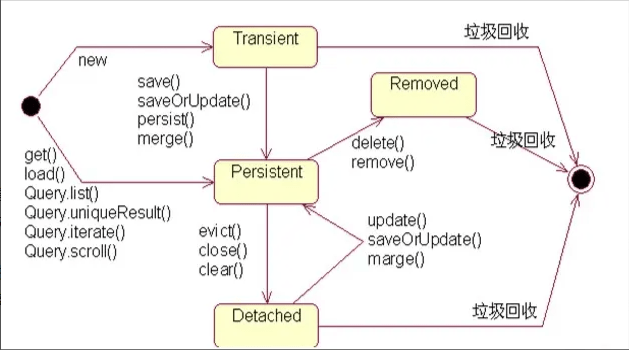

### 数据库

##### 说说事务的概念

ACID

##### 说说preparedStatement和statement的区别

- 效率：预编译PreparedStatement会比普通会话对象效率高，数据库不会对相同的sql语句再次编译。

- 安全性：可以有效地避免**sql注入攻击**，sql注入攻击就是从客户端驶入一些非法的特殊字符，而使服务器端在构造sql语句的时候仍然能够正确构造，从而收集程序和服务器的信息和数据。

  实例：比如“select * from t_user where username=' ” + username+"' and password = ' " + " ' ";

  账号是1密码输入 1 or 1 = 1，这个语句中的where部分没有起到筛选数据的作用。

##### SQL查询出来的结果分页展示一般怎么做？

Oracle：

```mysql
select * from 
	(select *,rownum as num from table where num < pageSize*pageNumber) t where t.num > pageSize*(pageNumber-1);
-- 或者
select * from 
(select *,rownum as tempid from student )  t 
where t.tempid between ” + pageSize*(pageNumber-1) + ” and ” +pageSize*pageNumber;
```

Mysql:

```mysql
 select * from students limit ” + pageSize*(pageNumber-1) + “,” + pageSize;
```

##### JDBC的ResultSet是什么？

在查询数据库后会返回一个ResultSet，它就像是**查询结果集的一张数据表**。
**ResultSet对象维护了一个游标**，指向当前的数据行。开始的时候这个游标指向的是第一行。如果调用了ResultSet的next()方法游标会下移一行，如果没有更多的数据了，next()方法会返回false。可以在for循环中用它来遍历数据集。
默认的ResultSet是不能更新的，游标也只能往下移。也就是说你只能从第一行到最后一行遍历一遍。不过也可以创建可以回滚或者可更新的ResultSet。

#### MySQL

##### MySQL索引的结构、如何创建索引、创建索引遵循的原则

##### SQL优化

##### 两千万数据 B+ 树高度是多少？

MySQL默认的一页的数据为 16384 byte = 16KB，show glbal status like 'Innodb_page_size'; 大概3层左右



##### index 索引为啥查询很快

> B+ 树的查询效率，log n，相比全表扫描当然很快。

##### MySQL的几种日志（redo、undo、binlog）的区别和作用、explain 的字段的理解

##### MySQL的explain解读

##### MySQL同一个SQL语句在2个时间段执行计划会不同吗？

可能，会因为数据量而优化器选择索引不一样

##### 超大分页和深度分页如何处理

这是由于 MySQL 并不是跳过 offset 的行数，而是取 offset + limit 行，然后丢弃前 offset 行，返回 limit 行，当offset特别大的时候，效率就非常的低下。

```mysql
##查询语句
select id from product limit 10000000, 10
##优化方式一
SELECT * FROM product WHERE ID > =(select id from product limit 10000000, 1) limit 10
##优化方式二
SELECT * FROM product a JOIN (select id from product limit 10000000, 10) b ON a.ID = b.id
```

这种要求id是一种递增的方式存储的。但是一般情况下，查询都是带有 where 条件和 order by 的，这种情况的话，参考下面这个案例：[MySQL 千万数据量深分页优化，拒绝线上故障！ - 掘金 (juejin.cn) ](https://juejin.cn/post/6963532526921089061)UPDT_TIME 应该是有索引的。

```mysql
mysql> DESC MCS_PROD;
+-----------------------+--------------+------+-----+---------+----------------+
| Field                 | Type         | Null | Key | Default | Extra          |
+-----------------------+--------------+------+-----+---------+----------------+
| MCS_PROD_ID           | int(11)      | NO   | PRI | NULL    | auto_increment |
| MCS_CODE              | varchar(100) | YES  |     |         |                |
| MCS_NAME              | varchar(500) | YES  |     |         |                |
| UPDT_TIME             | datetime     | NO   | MUL | NULL    |                |
+-----------------------+--------------+------+-----+---------+----------------+
4 rows in set (0.01 sec)
-- 500w的数据量
-- sql查询，带有一个时间条件和排序
SELECT
 MCS_PROD_ID,
 MCS_CODE,
 MCS_NAME,
 UPDT_TIME
FROM
 MCS_PROD
WHERE
 UPDT_TIME >= '1970-01-01 00:00:00.0' ORDER BY UPDT_TIME
LIMIT xx, xx
```

看这个语句：

```mysql
mysql> SELECT MCS_PROD_ID,MCS_CODE,MCS_NAME FROM MCS_PROD WHERE (UPDT_TIME >= '1970-01-01 00:00:00.0') ORDER BY UPDT_TIME LIMIT 100000, 1;
+-------------+-------------------------+------------------+---------------------+
| MCS_PROD_ID | MCS_CODE                | MCS_NAME         | UPDT_TIME           |
+-------------+-------------------------+------------------+---------------------+
|      181789 | XA601709733186213015031 | 尺、桡骨LC-DCP骨板 | 2020-10-19 16:22:19 |
+-------------+-------------------------+------------------+---------------------+
1 row in set (3.66 sec)

mysql> EXPLAIN SELECT MCS_PROD_ID,MCS_CODE,MCS_NAME FROM MCS_PROD WHERE (UPDT_TIME >= '1970-01-01 00:00:00.0') ORDER BY UPDT_TIME LIMIT 100000, 1;
+----+-------------+----------+------------+-------+---------------+------------+---------+------+---------+----------+-----------------------+
| id | select_type | table    | partitions | type  | possible_keys | key        | key_len | ref  | rows    | filtered | Extra                 |
+----+-------------+----------+------------+-------+---------------+------------+---------+------+---------+----------+-----------------------+
|  1 | SIMPLE      | MCS_PROD | NULL       | range | MCS_PROD_1    | MCS_PROD_1 | 5       | NULL | 2296653 |   100.00 | Using index condition |
+----+-------------+----------+------------+-------+---------------+------------+---------+------+---------+----------+-----------------------+
1 row in set, 1 warning (0.01 sec)
```

1. 首先查询了表 MCS_PROD，进行过滤 UPDT_TIME 条件，查询出展示列（涉及回表操作）进行排序以及 LIMIT
2. LIMIT 100000, 1 的意思是扫描满足条件的 100001 行，**然后扔掉前 100000 行**。

MySQL 耗费了 **大量随机 I/O 在回表查询聚簇索引的数据上**，而这 100000 次随机 I/O 查询数据不会出现在结果集中。

- 子查询优化：类似于上面的优化

```mysql
mysql> SELECT MCS_PROD_ID,MCS_CODE,MCS_NAME FROM MCS_PROD WHERE MCS_PROD_ID >= ( SELECT m1.MCS_PROD_ID FROM MCS_PROD m1 WHERE m1.UPDT_TIME >= '1970-01-01 00:00:00.0' ORDER BY m1.UPDT_TIME LIMIT 3000000, 1) LIMIT 1;
+-------------+-------------------------+------------------------+
| MCS_PROD_ID | MCS_CODE                | MCS_NAME               |
+-------------+-------------------------+------------------------+
|     3021401 | XA892010009391491861476 | 金属解剖型接骨板T型接骨板A |
+-------------+-------------------------+------------------------+
1 row in set (0.76 sec)

mysql> EXPLAIN SELECT MCS_PROD_ID,MCS_CODE,MCS_NAME FROM MCS_PROD WHERE MCS_PROD_ID >= ( SELECT m1.MCS_PROD_ID FROM MCS_PROD m1 WHERE m1.UPDT_TIME >= '1970-01-01 00:00:00.0' ORDER BY m1.UPDT_TIME LIMIT 3000000, 1) LIMIT 1;
+----+-------------+----------+------------+-------+---------------+------------+---------+------+---------+----------+--------------------------+
| id | select_type | table    | partitions | type  | possible_keys | key        | key_len | ref  | rows    | filtered | Extra                    |
+----+-------------+----------+------------+-------+---------------+------------+---------+------+---------+----------+--------------------------+
|  1 | PRIMARY     | MCS_PROD | NULL       | range | PRIMARY       | PRIMARY    | 4       | NULL | 2296653 |   100.00 | Using where              |
|  2 | SUBQUERY    | m1       | NULL       | range | MCS_PROD_1    | MCS_PROD_1 | 5       | NULL | 2296653 |   100.00 | Using where; Using index |
+----+-------------+----------+------------+-------+---------------+------------+---------+------+---------+----------+--------------------------+
2 rows in set, 1 warning (0.77 sec)
```

- 延迟关联：使用的join

```mysql
mysql> SELECT MCS_PROD_ID,MCS_CODE,MCS_NAME FROM MCS_PROD INNER JOIN (SELECT m1.MCS_PROD_ID FROM MCS_PROD m1 WHERE m1.UPDT_TIME >= '1970-01-01 00:00:00.0' ORDER BY m1.UPDT_TIME LIMIT 3000000, 1) AS  MCS_PROD2 USING(MCS_PROD_ID);
+-------------+-------------------------+------------------------+
| MCS_PROD_ID | MCS_CODE                | MCS_NAME               |
+-------------+-------------------------+------------------------+
|     3021401 | XA892010009391491861476 | 金属解剖型接骨板T型接骨板A |
+-------------+-------------------------+------------------------+
1 row in set (0.75 sec)

mysql> EXPLAIN SELECT MCS_PROD_ID,MCS_CODE,MCS_NAME FROM MCS_PROD INNER JOIN (SELECT m1.MCS_PROD_ID FROM MCS_PROD m1 WHERE m1.UPDT_TIME >= '1970-01-01 00:00:00.0' ORDER BY m1.UPDT_TIME LIMIT 3000000, 1) AS  MCS_PROD2 USING(MCS_PROD_ID);
+----+-------------+------------+------------+--------+---------------+------------+---------+-----------------------+---------+----------+--------------------------+
| id | select_type | table      | partitions | type   | possible_keys | key        | key_len | ref                   | rows    | filtered | Extra                    |
+----+-------------+------------+------------+--------+---------------+------------+---------+-----------------------+---------+----------+--------------------------+
|  1 | PRIMARY     | <derived2> | NULL       | ALL    | NULL          | NULL       | NULL    | NULL                  | 2296653 |   100.00 | NULL                     |
|  1 | PRIMARY     | MCS_PROD   | NULL       | eq_ref | PRIMARY       | PRIMARY    | 4       | MCS_PROD2.MCS_PROD_ID |       1 |   100.00 | NULL                     |
|  2 | DERIVED     | m1         | NULL       | range  | MCS_PROD_1    | MCS_PROD_1 | 5       | NULL                  | 2296653 |   100.00 | Using where; Using index |
+----+-------------+------------+------------+--------+---------------+------------+---------+-----------------------+---------+----------+--------------------------+
3 rows in set, 1 warning (0.00 sec)
```

- 书签记录

我们可以先使用书签 **记录获取上次取数据的位置**，下次就可以直接从该位置开始扫描，这样可以 **避免使用 OFFEST**，假设需要查询 3000000 行数据后的第 1 条记录，查询可以这么写。

```mysql
mysql> SELECT MCS_PROD_ID,MCS_CODE,MCS_NAME FROM MCS_PROD WHERE MCS_PROD_ID < 3000000 ORDER BY UPDT_TIME LIMIT 1;
+-------------+-------------------------+---------------------------------+
| MCS_PROD_ID | MCS_CODE                | MCS_NAME                        |
+-------------+-------------------------+---------------------------------+
|         127 | XA683240878449276581799 | 股骨近端-1螺纹孔锁定板（纯钛）YJBL01 |
+-------------+-------------------------+---------------------------------+
1 row in set (0.00 sec)

mysql> EXPLAIN SELECT MCS_PROD_ID,MCS_CODE,MCS_NAME FROM MCS_PROD WHERE MCS_PROD_ID < 3000000 ORDER BY UPDT_TIME LIMIT 1;
+----+-------------+----------+------------+-------+---------------+------------+---------+------+------+----------+-------------+
| id | select_type | table    | partitions | type  | possible_keys | key        | key_len | ref  | rows | filtered | Extra       |
+----+-------------+----------+------------+-------+---------------+------------+---------+------+------+----------+-------------+
|  1 | SIMPLE      | MCS_PROD | NULL       | index | PRIMARY       | MCS_PROD_1 | 5       | NULL |    2 |    50.00 | Using where |
+----+-------------+----------+------------+-------+---------------+------------+---------+------+------+----------+-------------+
1 row in set, 1 warning (0.00 sec)
```

##### 这里复习一下order by 的原理



从图中可以看到，满足 city='杭州’条件的行，是从 ID_X 到 ID_(X+N) 的这些记录。  

**通常情况下**，这个语句执行流程如下所示 ：  

1. 初始化 sort buffer，**确定放入 name、city、age 这三个字段**（因为查询的是这三个字段）；
2. 从索引 city 找到第一个满足 city=“杭州” 条件的主键 id，也就是图中的 ID_X;
3. **到主键 id 索引取出整行，取 name、city、age 三个字段的值，存入 sort_buffer 中**； 
4. 从索引 city 取下一个记录的主键 id；
5. 重复步骤 3、4 直到 city 的值不满足查询条件为止，对应的主键 id 也就是图中的 ID_Y；
6. 对 sort_buffer 中的数据按照字段 name 做**快速排序**；
7. **按照排序结果取前 1000 行返回给客户端**。

[覆盖索引，延迟关联](https://www.cnblogs.com/wang-meng/p/ae6d1c4a7b553e9a5c8f46b67fb3e3aa.html)

[实战！聊聊如何解决MySQL深分页问题](https://cloud.tencent.com/developer/article/1884103)

##### count(*) 走索引吗？

https://blog.csdn.net/LJFPHP/article/details/105255694

**1 结论**

（1）索引长度最小的字段会优先被count(*)选择，一般是int类型的
（2）如果索引长度一致，那么选择基数最小的（这部分是猜测，但是综合各种文章，感觉还是有可信度的）
（3）如果索引基数一致，选择索引长度最小的
（4）大表的count()查询优化手段就是新增tinyint类型的标识字段，速度可以得到有效提升

**2 其他**

（1）**这些sql都是建立在没有where条件的基础上**。

如果有where条件，那么就会使用where条件中的索引，这样的话，count查询的速度是不能保证的。目前没什么好办法，除非你的where条件用到的索引刚好符合咱们上面说的，基数小，索引长度小。

（2）**如果只是要手动统计一个达标有多少条数据，可以采用另一种方式**

```mysql
SELECT TABLE_ROWS FROM `information_schema`.tables WHERE table_name='xxx'
```

缺点：不够实时，这个类似于定时统计表条数写入的关系，如果对数据要求不是很精准的话，可以用这个。

##### 为什么不用红黑树，二叉搜索树

不用二叉搜索树：顺序插入会退化成链表

红黑树：当数据量很多的情况，树的树高会很高。

##### 为什么建议InnoDB表必须建立一个主键，并且推荐使用自增主键

InnoDB的索引需要用一个主键索引来维护。默认会建立一个rowid隐藏列，作为主键索引。因为自增主键在新建数据页的时候，不容易发生也分裂。uuid 比较相对于整型来说是性能较差的。uuid所占的空间比较多。

##### 优化数据库的一些方法

> 1.硬件主要在存储层优化
> 2.网络
> 3.操作系统调优
> 4.表结构设计优化，字段大小、字段类型
> 5.sql优化
> 6.减少函数使用
> 7.索引优化
> 8.大字段及全文检索优化
> 9.连接池优化
> 10.事务优化
> 11.数据库集群化
> 12.加入缓存
> 13.冷热存储
> 14.分库分表

##### int(1)、int(20) 存储大小有区别

- 我们知道在 MySQL 中 int 类型占4个字节，对于无符号整形最大值为：2^32-1 = 4294967295，下面我们看看int(1)、int(20)可以存储 int 类型最大值？

```mysql
INSERT INTO `test_table` (`area`, `area_1`) VALUES (4294967295, 4294967295)
> Affected rows: 1
> 查询时间: 0.002s
```

- 可以看到，int(1)、int(20) 都可以存储 int 类型最大值，说明对存储大小无影响。那么我们的1和20用什么作用呢？答案就是对齐填充，当联合零填充（zerofill） 使用时，我们配置的值才会体现效果。

零填充

- 所谓零填充就是当我们数字位小于我们指定位数时，使用0填充补全位数，比如指定位数为4位，数为23，那么实际会被填充为 0023

```mysql
CREATE TABLE `test_table` (
  `id` bigint(20) unsigned NOT NULL AUTO_INCREMENT,
  `area` int(1) unsigned zerofill DEFAULT NULL,
  `area_1` int(20) unsigned zerofill DEFAULT NULL,
  PRIMARY KEY (`id`)
) ENGINE=InnoDB AUTO_INCREMENT=3 DEFAULT CHARSET=utf8mb4;
```

效果



我们可以看到 area_1 不足20位时使用0补齐到20位，area 指定位数为 1 位实际并没有效果，因为数字至少为1位，对 NULL 不生效。但实践中并不推荐，对数据库依赖性太强。

##### 如何查看数据库的死锁

```mysql
# 1、查询是否锁表
show OPEN TABLES where In_use > 0;
#  2、查询进程
show processlist;
# 3、查看正在锁的事务
SELECT * FROM INFORMATION_SCHEMA.INNODB_LOCKS;
# 4、查看等待锁的事务
SELECT * FROM INFORMATION_SCHEMA.INNODB_LOCK_WAITS;
```


---

#### hibernate

##### 说一下mybaits和hibernate的区别

**共同点：**

MyBaits和HiBernate都是通过ORM对象关系映射框架，都是持久层数据框架。

**不同点：**

- HiBernate它重量级的框架，而MyBaits是轻量级的框架。
- HiBernate对JDBC的封装比较深，对开发者写sql的能力不是很高，只需要通过Hql语句操作对象即可完成数据的持久化操作了。
- MyBaits也是对JDBC的封装，但是没有Hibernate那么深，它的sql语句，都在配置里，可以通过重写配置里sql，来实现数据优化，实施起来也比较方便。
- 处理大数据的时候，建议使用MyBaits它优化sql语句更方便。

##### 在hibernate进行多表查询每个表中各取几个字段，也就是说查询出来的结果集没有一个实体类与之对应如何解决？

- 按照Object[]数组取出数据，对应组装成一个bean。
- 对每个表所对应的bean，有那个field就定义多少个构造函数。

##### 介绍下hibernate的二级缓存。

回答思路：1. 什么hibernate的缓存？2. hibernate的session就是一级缓存，为什么有了一级缓存还要有二级缓存？3. 如何配置hibernate的二级缓存。

- 1，缓存就是把以前从数据库中查询出来和使用过的对象保存在内存中（一个数据结构中），这个数据结构通常是或类似HashMap，当以后要使用某个对象时，先查询缓存中是否有这个对象，如果有则使用缓存中的对象，如果没有则去查询数据库，并将查询出来的对象保存在缓存中，以便下次使用。
- 2，**Hibernate的Session就是一种缓存，我们通常将之称为Hibernate的一级缓存**，当想使用session从数据库中查询出一个对象时，Session也是先从自己内部查看是否存在这个对象，存在则直接返回，不存在才去访问数据库，并将查询的结果保存在自己内部。
- **注意**：**Session代表一次会话过程，一个Session与一个数据库连接相关，所以Session最好不要长时间打开，通常仅用于一个事务当中，在事务结束时就应该关闭。并且Session是线程不安全的，当多个线程共享一个session时容易出现问题。**通常只有那种全局意义上的缓存才是真正的缓存应用，才有较大的缓存价值，因此，Hibernate的Session这一级缓存的缓存作用并不明显，应用价值不大。**Hibernate的二级缓存就是要为Hibernate配置一种全局缓存，让多个线程和多个事务都可以共享这个缓存。**我们希望的是一个人使用过，其他人也可以使用，session没有这种效果。
- 二级缓存是独立于Hibernate的软件部件，属于第三方的产品，多个厂商和组织都提供有缓存产品，例如，EHCache和OSCache等等。在Hibernate中使用二级缓存，**首先就要在hibernate.cfg.xml配置文件中配置使用哪个厂家的缓存产品**，接着**需要配置该缓存产品自己的配置文件**，最后**要配置Hibernate中的哪些实体对象要纳入到二级缓存的管理中。**

##### hibernate的三种状态转换

Hibernate Pojo的三态分别为transient（瞬时态）,persistent（持久态）,detached（游离态）

1. 官方给出的三态与Session的关系如下：

**transient:** never persistent, not associated with any Session
**persistent:** associated with a unique Session
**detached:** previously persistent, not associated with any Session

2. 三种状态间相互转换关系，及他们在数据库、session中的状态如下：

a.当我们new一个pojo时，它处于**瞬时态**，此时与session、数据库均无任何关联。

b.此后，我们获得session并开启hibernate事务，调用save(),persist(),saveOrUpdate()方法，将pojo转变为**持久态**，此时session中存有这个pojo，但直到transaction.commit()被调用时，sql语句才会执行，此后数据库中也才有此条数据。

c.但当commit()并且session.close()执行过后，pojo就变为了**游离态**，也就是说，数据库中有该记录，但session中不再有。

d.持久化状态的实例，也可以重新变成瞬时态，那就是调用delete()方法。

e.通过get()或load()方法得到的pojo是持久态的。

f.游离态的pojo可以通过update(),saveOrUpdate(),lock()和replicate()方法重新成为持久态。

g.调用merge()方法后，pojo维持原态，但内容会被更新到数据库。




