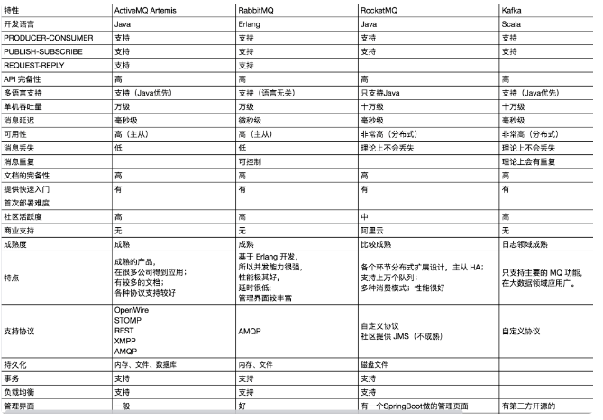

### 消息中间件

[RabbitMQ面试题](https://juejin.cn/post/6844904125935665160) 

##### 为什么用消息队列中间件、以及缺点

1. **通过异步处理提高系统性能（减少响应所需时间）**
2. **削峰/限流**
3. **降低系统耦合性**
4. **实现分布式事务**

缺点

- 系统可用性降低
- 系统复杂程度提高
- 一致性问题

##### 消费队列如何防止重复消费以及哪个地方会出现问题

防止消费者重复消费

1. 使用Mysql的唯一索引约束来解决这个问题
2. 使用redis的setnx指令来解决，第一次setnx返回true,第二次就返回false
3. 使用去重表来解决，然后定时清除去重表的数据即可
4. 当然了，处理都需要考虑业务的问题，从业务方面区进行去重

注：RocketMQ给每个消息分配了一个messageId,可以一定程度上用这个值来处理，但是还是有问题，假设客户端同一个消息发了两个订单，但是messageId是一样的，这样就有问题了

[【RabbitMQ】RabbitMQ如何做到保证消息100%不丢失？](https://blog.csdn.net/bookssea/article/details/123119980) 

##### MQ如何保证消息顺序

全局有序和局部有序：MQ只需要保证局部有序即可

RocketMQ是如何保证有序的？

情况一：当topic只有一个queue的时候，那么就是天然有序的

情况二：有多个queue就需要进行处理

1. 生产者使用select把需要有序的消息放到同一个queue中
2. 消费者使用oredrly横向取消息进行处理，默认情况下是从多个queue取消息的，横向取那么就有序了，拿之前需要锁队列，是为了生产者短时间不能再发送消息？同时其他消息者就不能消费了，估计是这样

RabbitMQ:

- 保证exchange只有一个队列，并且一个队列只对应一个消费者才可以保证消息有序被处理。

Kafka：

- 保证一个topic只有一个partition分区即可，在多个partition的情况下，可以把需要有序的一组消息路由到同一个partition分区下面即可

##### 如何保证RabbitMQ消息的可靠传输

**生产者丢失消息**：从生产者弄丢数据这个角度来看，RabbitMQ提供transaction和confirm模式来确保生产者不丢消息。

**消息队列丢数据**：消息持久化。

**消费者丢失消息**：消费者丢数据一般是因为采用了自动确认消息模式，改为手动确认消息。

##### 消息队列对比

[详解ＭＱ消息队列及四大主流ＭＱ的优缺点 - 墨天轮 (modb.pro)](https://www.modb.pro/db/542085) 

##### 订单超时自动关闭

原理：下单投放消息到A交换机（过期时间30分钟），**消息到aa队列（绑定死信交换机）**，**不设置aa队列的消费者**(故此消息一直未消费)。

30分钟后，过期消息投递到死信交换机，死信队列，由死信消费者消费，判断订单id是否支付，执行业务逻辑，支付->return；未支付->关闭订单，返还库存。

[RabbitMQ实现订单30分钟超时自动关闭](https://blog.csdn.net/zhangshengqiang168/article/details/104718979) 

##### rabbitmq 消息不消费问题

- 看服务端有没有连接上消息队列 （https://blog.csdn.net/qq_33036061/article/details/106634425）
- 检查队列绑定的路由器是不是一致
- 查看接口，是否被调用到
- 消费端是否有进行手动确认，如果有设置手动，需要手动ack（相关链接博客：[线上RabbitMQ消息不消费问题](https://juejin.cn/post/7052196492622168072)）

一种现象：消费者接收不到MQ的消费数据，MQ管理后台数据阻塞。

问题：阻塞的队列（queue）找不到消费者（consumer）服务器。

