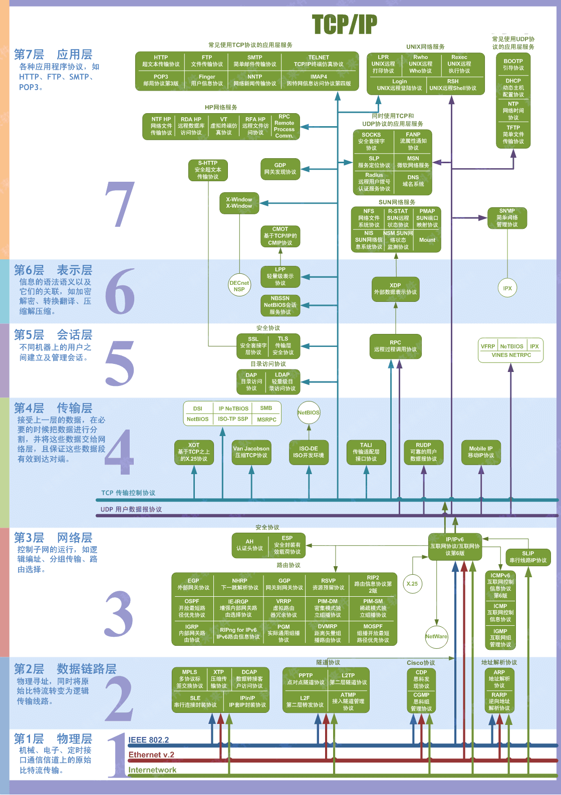

### 网络与IO

#### 网络模型7层、5层、4层协议

https://javaguide.cn/cs-basics/network/osi-and-tcp-ip-model.html

**OSI 的七层体系结构概念清楚，理论也很完整，但是它比较复杂而且不实用，而且有些功能在多个层中重复出现。**

如这个图：

**既然 OSI 七层模型这么厉害，为什么干不过 TCP/IP 四 层模型呢？**

的确，OSI 七层模型当时一直被一些大公司甚至一些国家政府支持。这样的背景下，为什么会失败呢？我觉得主要有下面几方面原因：

1. OSI 的专家缺乏实际经验，他们在完成 OSI 标准时缺乏商业驱动力
2. OSI 的协议实现起来过分复杂，而且运行效率很低
3. OSI 制定标准的周期太长，因而使得按 OSI 标准生产的设备无法及时进入市场（20 世纪 90 年代初期，虽然整套的 OSI 国际标准都已经制定出来，但基于 TCP/IP 的互联网已经抢先在全球相当大的范围成功运行了）
4. OSI 的层次划分不太合理，有些功能在多个层次中重复出现。

OSI 七层模型虽然失败了，但是却提供了很多不错的理论基础。为了更好地去了解网络分层，OSI 七层模型还是非常有必要学习的。

#### TCP/IP四层模型

**TCP/IP 四层模型** 是目前被广泛采用的一种模型,我们可以将 TCP / IP 模型看作是 OSI 七层模型的精简版本，由以下 4 层组成：

1. 应用层
2. 传输层
3. 网络层
4. 网络接口层

需要注意的是，我们并不能将 TCP/IP 四层模型 和 OSI 七层模型完全精确地匹配起来，不过可以简单将两者对应起来，如下图所示：

##### 应用层（Application Layer）

**应用层位于传输层之上，主要提供两个终端设备上的应用程序之间信息交换的服务，它定义了信息交换的格式，消息会交给下一层传输层来传输。** 我们把应用层交互的数据单元称为报文。

应用层协议定义了网络通信规则，对于不同的网络应用需要不同的应用层协议。在互联网中应用层协议很多，如支持 Web 应用的 HTTP 协议，支持电子邮件的 SMTP 协议等等。

###### 常见协议：

> **HTTP（Hypertext Transfer Protocol，超文本传输协议）**：基于 TCP 协议，是一种用于传输超文本和多媒体内容的协议，主要是为 Web 浏览器与 Web 服务器之间的通信而设计的。当我们使用浏览器浏览网页的时候，我们网页就是通过 HTTP 请求进行加载的。
>
> **SMTP（Simple Mail Transfer Protocol，简单邮件发送协议）**：基于 TCP 协议，是一种用于发送电子邮件的协议。注意 ⚠️：SMTP 协议只负责邮件的发送，而不是接收。要从邮件服务器接收邮件，需要使用 POP3 或 IMAP 协议。
>
> **POP3/IMAP（邮件接收协议）**：基于 TCP 协议，两者都是负责邮件接收的协议。IMAP 协议是比 POP3 更新的协议，它在功能和性能上都更加强大。IMAP 支持邮件搜索、标记、分类、归档等高级功能，而且可以在多个设备之间同步邮件状态。几乎所有现代电子邮件客户端和服务器都支持 IMAP。
>
> **FTP（File Transfer Protocol，文件传输协议）** : 基于 TCP 协议，是一种用于在计算机之间传输文件的协议，可以屏蔽操作系统和文件存储方式。注意 ⚠️：FTP 是一种不安全的协议，因为它在传输过程中不会对数据进行加密。建议在传输敏感数据时使用更安全的协议，如 SFTP。
>
> **Telnet（远程登陆协议）**：基于 TCP 协议，用于通过一个终端登陆到其他服务器。Telnet 协议的最大缺点之一是所有数据（包括用户名和密码）均以明文形式发送，这有潜在的安全风险。这就是为什么如今很少使用 Telnet，而是使用一种称为 SSH 的非常安全的网络传输协议的主要原因。
>
> **SSH（Secure Shell Protocol，安全的网络传输协议）**：基于 TCP 协议，通过加密和认证机制实现安全的访问和文件传输等业务
>
> **RTP（Real-time Transport Protocol，实时传输协议）**：通常基于 UDP 协议，但也支持 TCP 协议。它提供了端到端的实时传输数据的功能，但不包含资源预留存、不保证实时传输质量，这些功能由 WebRTC 实现。
>
> **DNS（Domain Name System，域名管理系统）**: 基于 UDP 协议，用于解决域名和 IP 地址的映射问题。

##### 传输层（Transport Layer）

**传输层的主要任务就是负责向两台终端设备进程之间的通信提供通用的数据传输服务。** 应用进程利用该服务传送应用层报文。“通用的”是指并不针对某一个特定的网络应用，而是多种应用可以使用同一个运输层服务。

###### **传输层常见协议**：

**TCP（Transmisson Control Protocol，传输控制协议 ）**：提供 **面向连接** 的，**可靠** 的数据传输服务。

**UDP（User Datagram Protocol，用户数据协议）**：提供 **无连接** 的，**尽最大努力** 的数据传输服务（不保证数据传输的可靠性），简单高效。

##### 网络层（Network Layer）

**网络层负责为分组交换网上的不同主机提供通信服务。** 在发送数据时，网络层把运输层产生的报文段或用户数据报封装成分组和包进行传送。在 TCP/IP 体系结构中，由于网络层使用 IP 协议，因此分组也叫 IP 数据报，简称数据报。

⚠️ 注意：**不要把运输层的“用户数据报 UDP”和网络层的“IP 数据报”弄混**。

**网络层的还有一个任务就是选择合适的路由，使源主机运输层所传下来的分组，能通过网络层中的路由器找到目的主机。**

这里强调指出，网络层中的“网络”二字已经不是我们通常谈到的具体网络，而是指计算机网络体系结构模型中第三层的名称。

互联网是由大量的异构（heterogeneous）网络通过路由器（router）相互连接起来的。互联网使用的网络层协议是无连接的网际协议（Internet Protocol）和许多路由选择协议，因此互联网的网络层也叫做 **网际层** 或 **IP 层**。

###### **网络层常见协议**：

> **IP（Internet Protocol，网际协议）**：TCP/IP 协议中最重要的协议之一，主要作用是定义数据包的格式、对数据包进行路由和寻址，以便它们可以跨网络传播并到达正确的目的地。目前 IP 协议主要分为两种，一种是过去的 IPv4，另一种是较新的 IPv6，目前这两种协议都在使用，但后者已经被提议来取代前者。
>
> **ARP（Address Resolution Protocol，地址解析协议）**：ARP 协议解决的是网络层地址和链路层地址之间的转换问题。因为一个 IP 数据报在物理上传输的过程中，总是需要知道下一跳（物理上的下一个目的地）该去往何处，但 IP 地址属于逻辑地址，而 MAC 地址才是物理地址，ARP 协议解决了 IP 地址转 MAC 地址的一些问题。
>
> **ICMP（Internet Control Message Protocol，互联网控制报文协议）**：一种用于传输网络状态和错误消息的协议，常用于网络诊断和故障排除。例如，Ping 工具就使用了 ICMP 协议来测试网络连通性。
>
> **NAT（Network Address Translation，网络地址转换协议）**：NAT 协议的应用场景如同它的名称——网络地址转换，应用于内部网到外部网的地址转换过程中。具体地说，在一个小的子网（局域网，LAN）内，各主机使用的是同一个 LAN 下的 IP 地址，但在该 LAN 以外，在广域网（WAN）中，需要一个统一的 IP 地址来标识该 LAN 在整个 Internet 上的位置。
>
> **OSPF（Open Shortest Path First，开放式最短路径优先）** ）：一种内部网关协议（Interior Gateway Protocol，IGP），也是广泛使用的一种动态路由协议，基于链路状态算法，考虑了链路的带宽、延迟等因素来选择最佳路径。
>
> **RIP(Routing Information Protocol，路由信息协议）**：一种内部网关协议（Interior Gateway Protocol，IGP），也是一种动态路由协议，基于距离向量算法，使用固定的跳数作为度量标准，选择跳数最少的路径作为最佳路径。
>
> **BGP（Border Gateway Protocol，边界网关协议）**：一种用来在路由选择域之间交换网络层可达性信息（Network Layer Reachability Information，NLRI）的路由选择协议，具有高度的灵活性和可扩展性。

##### 网络接口层（Network Interface Layer）

我们可以把网络接口层看作是数据链路层和物理层的合体。

1. 数据链路层(data link layer)通常简称为链路层（ 两台主机之间的数据传输，总是在一段一段的链路上传送的）。**数据链路层的作用是将网络层交下来的 IP 数据报组装成帧，在两个相邻节点间的链路上传送帧。每一帧包括数据和必要的控制信息（如同步信息，地址信息，差错控制等）**。
2. **物理层的作用是实现相邻计算机节点之间比特流的透明传送，尽可能屏蔽掉具体传输介质和物理设备的差异**。

网络接口层重要功能和协议如下图所示

#### 总结

#### 为什么分层

我觉得主要有 3 方面的原因：

1. **各层之间相互独立**：各层之间相互独立，各层之间不需要关心其他层是如何实现的，只需要知道自己如何调用下层提供好的功能就可以了（可以简单理解为接口调用）**。这个和我们对开发时系统进行分层是一个道理**。
2. **提高了整体灵活性**：每一层都可以使用最适合的技术来实现，你只需要保证你提供的功能以及暴露的接口的规则没有改变就行了。**这个和我们平时开发系统的时候要求的高内聚、低耦合的原则也是可以对应上的**。
3. **大问题化小**：分层可以将复杂的网络问题分解为许多比较小的、界线比较清晰简单的小问题来处理和解决。这样使得复杂的计算机网络系统变得易于设计，实现和标准化。 **这个和我们平时开发的时候，一般会将系统功能分解，然后将复杂的问题分解为容易理解的更小的问题是相对应的，这些较小的问题具有更好的边界（目标和接口）定义**。

#### TCP/IP协议，三次握手，四次挥手、TCP和UDP的区别

##### 三次握手

**一次握手**：客户端发送带有 SYN（SEQ=x） 标志的数据包 -> 服务端，然后客户端进入 **SYN_SEND** 状态，等待服务器的确认；

**二次握手**：服务端发送带有 SYN+ACK(SEQ=y,ACK=x+1) 标志的数据包 –> 客户端,然后服务端进入 **SYN_RECV** 状态；

> 服务端传回发送端所发送的 ACK 是为了告诉客户端：“我接收到的信息确实就是你所发送的信号了”，这表明从客户端到服务端的通信是正常的。回传 SYN 则是为了建立并确认从服务端到客户端的通信。

**三次握手**：客户端发送带有 ACK(ACK=y+1) 标志的数据包 –> 服务端，然后客户端和服务器端都进入**ESTABLISHED** 状态，完成 TCP 三次握手。

##### 为什么需要三次握手

> https://javaguide.cn/cs-basics/network/tcp-connection-and-disconnection.html

三次握手的目的是建立可靠的通信信道，说到通讯，简单来说就是数据的发送与接收，而三次握手最主要的目的就是双方确认自己与对方的发送与接收是正常的。

1. **第一次握手**：Client 什么都不能确认；Server 确认了对方发送正常，自己接收正常
2. **第二次握手**：Client 确认了：自己发送、接收正常，对方发送、接收正常；Server 确认了：对方发送正常，自己接收正常
3. **第三次握手**：Client 确认了：自己发送、接收正常，对方发送、接收正常；Server 确认了：自己发送、接收正常，对方发送、接收正常

三次握手就能确认双方收发功能都正常，缺一不可。

##### 四次挥手

1. **第一次挥手**：客户端发送一个 FIN（SEQ=x） 标志的数据包->服务端，用来关闭客户端到服务器的数据传送。然后，客户端进入 **FIN-WAIT-1** 状态。
2. **第二次挥手**：服务器收到这个 FIN（SEQ=X） 标志的数据包，它发送一个 ACK （ACK=x+1）标志的数据包->客户端 。然后，此时服务端进入 **CLOSE-WAIT** 状态，客户端进入 **FIN-WAIT-2** 状态。
3. **第三次挥手**：服务端关闭与客户端的连接并发送一个 FIN (SEQ=y)标志的数据包->客户端请求关闭连接，然后，服务端进入 **LAST-ACK** 状态。
4. **第四次挥手**：客户端发送 ACK (ACK=y+1)标志的数据包->服务端并且进入**TIME-WAIT**状态，服务端在收到 ACK (ACK=y+1)标志的数据包后进入 CLOSE 状态。此时，如果客户端等待 **2MSL** 后依然没有收到回复，就证明服务端已正常关闭，随后，客户端也可以关闭连接了。

**只要四次挥手没有结束，客户端和服务端就可以继续传输数据**。

##### 为什么需要四次挥手

TCP 是全双工通信，可以双向传输数据。任何一方都可以在数据传送结束后发出连接释放的通知，待对方确认后进入半关闭状态。当另一方也没有数据再发送的时候，则发出连接释放通知，对方确认后就完全关闭了 TCP 连接。

举个例子：A 和 B 打电话，通话即将结束后。

1. **第一次挥手**：A 说“我没啥要说的了”。
2. **第二次挥手**：B 回答“我知道了”，但是 B 可能还会有要说的话，A 不能要求 B 跟着自己的节奏结束通话。
3. **第三次挥手**：于是 B 可能又巴拉巴拉说了一通，最后 B 说“我说完了”。
4. **第四次挥手**：A 回答“知道了”，这样通话才算结束。

#### select、poll、epoll之间的区别(搜狗面试)

[select、poll、epoll之间的区别(搜狗面试)](https://www.cnblogs.com/aspirant/p/9166944.html) 

#### HTTPS 是如何保证传输安全的？

[HTTPS 是如何保证传输安全的？](https://mp.weixin.qq.com/s/_SNaXy4qeWGhhPFg8O1zmw)

#### 常见的远程调用有哪些？

1.网络协议与封装，所有的网络请求都是基于TCP或UDP协议的
2.常用框架
3.长短连接（复用）

答案：

1. 自定义协议实现C/SRPC调用（实现复杂，需解决的问题多）
2.UDP广播类型（常见用于即时通讯类，速度快，但需要二次确认）】
3.目前主流的基于http协议调用(Restful风格的api,springcloud微服务阔用使用的就是http
4.dubboi协议（阿里出品，长连接，二进制封装数据，性能较高）
5.soap协议（古老的webservice系列框架，基于xml实现数据封装，http协议传输）
6.异步晌应式(WebFlux+Spring Data Reactive)】
7.服务器推（不主动调用，常见系统通知类）