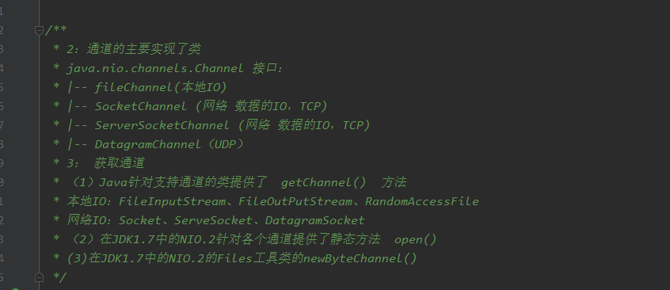
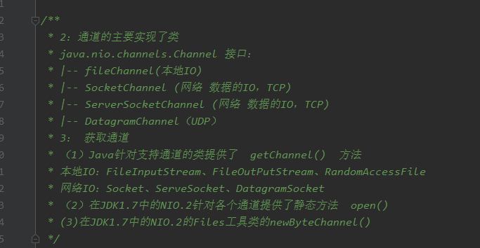

### Java的NIO

```
@Test
public void test3() throws IOException {
        // 获取一个输入通道
        FileChannel inChannel = FileChannel.open(Paths.get("D:\\迅雷下载\\FSDSS-021AV.mp4"), StandardOpenOption.READ);
        // 获取一个输出通道
        FileChannel outChannel = FileChannel.open(Paths.get("D:\\迅雷下载\\FSDSS-0212AV.mp4"), StandardOpenOption.WRITE, StandardOpenOption.READ,
                StandardOpenOption.CREATE);

        inChannel.transferTo(0, inChannel.size(), outChannel);

        inChannel.close();
        outChannel.close();
}
```

#### 通道的一些实现类 





