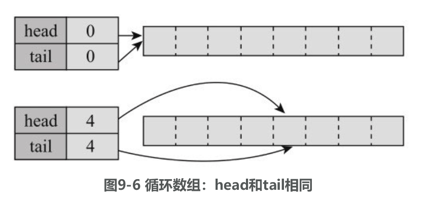
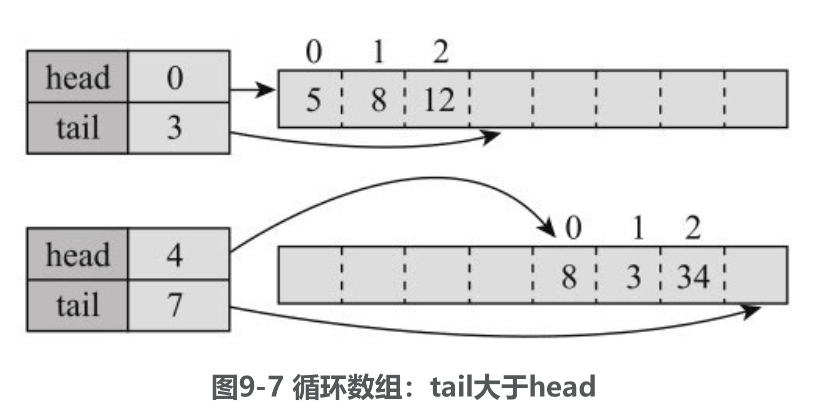
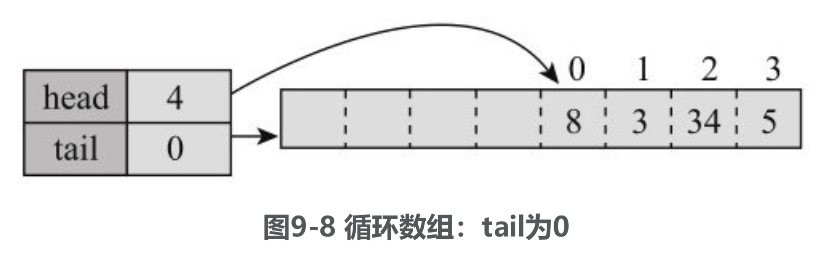
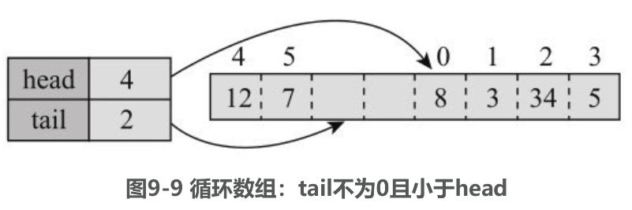
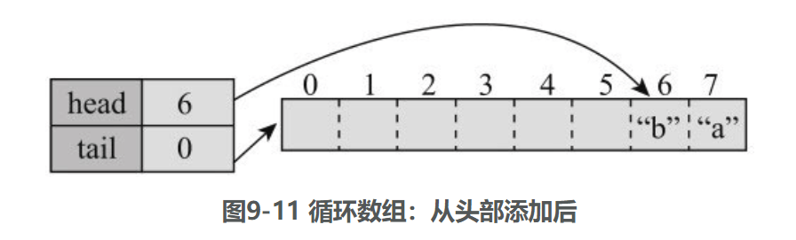

## ArrayDeque

LinkedList实现了队列接口Queue和双端队列接口Deque, Java容器类中还有一个双端队列的实现类ArrayDeque，它是基于数组实现的。

ArrayDeque有如下构造方法：

```java
public ArrayDeque()        
public ArrayDeque(int numElements)        
public ArrayDeque(Collection<? extends E> c)
```

numElements表示元素个数，初始分配的空间会至少容纳这么多元素，但空间不是正好 numElements 这么大。ArrayDeque实现了Deque接口，同LinkedList一样，它的队列长度也是没有限制的， Deque扩展了Queue，有队列的所有方法，还可以看作栈，有栈的基本方法push/pop/peek，还有明确的操作两端的方法如addFirst/removeLast等。

### 1 实现原理

ArrayDeque 内部主要有如下实例变量：

```java
// 循环数组
private transient E[] elements; 
private transient int head;        
private transient int tail;
```

elements就是存储元素的数组。ArrayDeque的高效来源于head和tail这两个变量，**它们使得物理上简单的从头到尾的数组变为了一个逻辑上循环的数组**，避免了在头尾操作时的移动。

#### 1.1 循环数组

对于一般数组，比如arr，第一个元素为arr[0]，最后一个为arr[arr.length-1]。但对于ArrayDeque中的数组，它是一个逻辑上的循环数组，所谓循环是指元素到数组尾之后可以接着从数组头开始，数组的长度、第一个和最后一个元素都与head和tail这两个变量有关，具体来说：

（1）**如果head和tail相同**，则数组为空，长度为0。



（2）**如果tail大于head**，则第一个元素为elements[head]，最后一个为elements[tail-1]，长度为tail-head，元素索引从head到tail-1。



（3）**如果tail小于head，且为0**，则第一个元素为elements[head]，最后一个为elements [elements.length-1]，元素索引从head到elements.length-1。



（4）**如果tail小于head，且大于0，则会形成循环**，第一个元素为elements[head]，最后一个是elements[tail-1]，元素索引从head到elements.length-1，然后再从0到tail-1。



#### 1.2 构造方法

默认的构造方法，分配了一个长度为16的数组，如果有参数numElements则为，如果长度小于8，则是8；如果大于等于8，分配的实际长度是严格大于 numElements 并且为 2 的整数次幂的最小数。比如，如果为10，则分配16，如果为32，则分配 64。

```java
    public ArrayDeque() {
        elements = new Object[16];
    }

    public ArrayDeque(int numElements) {
        allocateElements(numElements);
    }

    public ArrayDeque(Collection<? extends E> c) {
        allocateElements(c.size());
        addAll(c);
    }

    /**
     * Allocates empty array to hold the given number of elements.
     *
     * @param numElements  the number of elements to hold
     */
    private void allocateElements(int numElements) {
        elements = new Object[calculateSize(numElements)];
    }

    private static int calculateSize(int numElements) {
        int initialCapacity = MIN_INITIAL_CAPACITY;
        // Find the best power of two to hold elements.
        // Tests "<=" because arrays aren't kept full.
        if (numElements >= initialCapacity) {
            initialCapacity = numElements;
            initialCapacity |= (initialCapacity >>>  1);
            initialCapacity |= (initialCapacity >>>  2);
            initialCapacity |= (initialCapacity >>>  4);
            initialCapacity |= (initialCapacity >>>  8);
            initialCapacity |= (initialCapacity >>> 16);
            initialCapacity++;

            if (initialCapacity < 0)   // Too many elements, must back off
                initialCapacity >>>= 1;// Good luck allocating 2 ^ 30 elements
        }
        return initialCapacity;
    }
```

为什么要为2的幂次数呢？我们待会会看到，这样会使得很多操作的效率很高。为什么要严格大于numElements呢？**因为循环数组必须时刻至少留一个空位，tail变量指向下一个空位，为了容纳numElements个元素，至少需要numElements+1个位置**。

#### 1.3 从尾部添加

add 方法是：

```java
    public boolean add(E e) {
        addLast(e);
        return true;
    }

    /**
     * Inserts the specified element at the end of this deque.
     *
     * <p>This method is equivalent to {@link #add}.
     *
     * @param e the element to add
     * @throws NullPointerException if the specified element is null
     */
    public void addLast(E e) {
        if (e == null)
            throw new NullPointerException();
        elements[tail] = e;
        if ( (tail = (tail + 1) & (elements.length - 1)) == head)
            doubleCapacity();
    }
```

将元素添加到 tail 处，然后 tail 指向下一个位置，如果队列满了，则调用 doubleCapacity() 扩展数组。tail的下一个位置是(tail+1) & (elements.length-1)，如果与head相同，则队列就满了。

进行与操作保证了索引在正确范围，**与(elements.length-1)相与就可以得到下一个正确位置**，是因为elements.length是2的幂次方，(elements.length-1)的后几位全是1，无论是正数还是负数，与(elements.length-1)相与都能得到期望的下一个正确位置。

doubleCapacity()将数组扩大为2倍。

```java
    private void doubleCapacity() {
        assert head == tail;
        int p = head;
        int n = elements.length;
        int r = n - p; // number of elements to the right of p
        int newCapacity = n << 1;
        if (newCapacity < 0)
            throw new IllegalStateException("Sorry, deque too big");
        Object[] a = new Object[newCapacity];
        System.arraycopy(elements, p, a, 0, r);
        System.arraycopy(elements, 0, a, r, p);
        elements = a;
        head = 0;
        tail = n;
    }
```

分配一个长度翻倍的新数组a，将head右边的元素复制到新数组开头处，再复制左边的元素到新数组中，最后重新设置head和tail, head设为0, tail设为n

#### 1.4 从头部添加

addFirst()方法的代码为：

```java
    /**
     * Inserts the specified element at the front of this deque.
     *
     * @param e the element to add
     * @throws NullPointerException if the specified element is null
     */
    public void addFirst(E e) {
        if (e == null)
            throw new NullPointerException();
        elements[head = (head - 1) & (elements.length - 1)] = e;
        if (head == tail)
            doubleCapacity();
    }
```

**在头部添加，要先让head指向前一个位置，然后再赋值给head所在位置**。head的前一个位置是(head-1) & (elements.length-1)。刚开始head为0，如果elements.length为8，则(head-1) & (elements.length-1)的结果为7。如下单吗：

```java
    Deque<String> queue = new ArrayDeque<>(7);        
	queue.addFirst("a");        
	queue.addFirst("b");
```

执行完后，内部结构如图9-11所示



#### 1.5 从头部删除

removeFirst方法的代码为：

```java
   public E removeFirst() {
        E x = pollFirst();
        if (x == null)
            throw new NoSuchElementException();
        return x;
    }

    public E pollFirst() {
        int h = head;
        @SuppressWarnings("unchecked")
        E result = (E) elements[h];
        // Element is null if deque empty
        if (result == null)
            return null;
        elements[h] = null;     // Must null out slot
        head = (h + 1) & (elements.length - 1);
        return result;
    }
```

代码比较简单，将原头部位置置为null，然后head置为下一个位置，下一个位置为(h+1) & (elements.length-1)。

#### 1.6 查看长度

ArrayDeque没有单独的字段维护长度，其size方法的代码为：

```java
    public int size() {
        return (tail - head) & (elements.length - 1);
    }
```

#### 1.7 检查给定元素是否存在

```java
    public boolean contains(Object o) {
        if (o == null)
            return false;
        int mask = elements.length - 1;
        int i = head;
        Object x;
        while ( (x = elements[i]) != null) {
            if (o.equals(x))
                return true;
            i = (i + 1) & mask;
        }
        return false;
    }
```

就是从head开始遍历并进行对比，循环过程中没有使用tail，而是到元素为null就结束了，这是因为在**ArrayDeque中，有效元素不允许为null**。

#### 1.8 toArray 方法

```java
    public Object[] toArray() {
        return copyElements(new Object[size()]);
    }

    private <T> T[] copyElements(T[] a) {
        if (head < tail) {
            System.arraycopy(elements, head, a, 0, size());
        } else if (head > tail) {
            int headPortionLen = elements.length - head;
            System.arraycopy(elements, head, a, 0, headPortionLen);
            System.arraycopy(elements, 0, a, headPortionLen, tail);
        }
        return a;
    }
```

如果head小于tail，就是从head开始复制size个，否则，复制逻辑与doubleCapacity方法中的类似，先复制从head到末尾的部分，然后复制从0到tail的部分。

#### 2 ArrayDeque 特点分析

ArrayDeque实现了双端队列，内部使用循环数组实现，这决定了它有如下特点。

1）在两端添加、删除元素的效率很高，动态扩展需要的内存分配以及数组复制开销可以被平摊，具体来说，添加N个元素的效率为O(N)。

2）根据元素内容查找和删除的效率比较低，为O(N)。

3）与ArrayList和LinkedList不同，没有索引位置的概念，不能根据索引位置进行操作。

ArrayDeque和LinkedList都实现了Deque接口，应该用哪一个呢？**如果只需要Deque接口，从两端进行操作，一般而言，ArrayDeque效率更高一些，应该被优先使用**；**如果同时需要根据索引位置进行操作，或者经常需要在中间进行插入和删除，则应该选LinkedList**。

