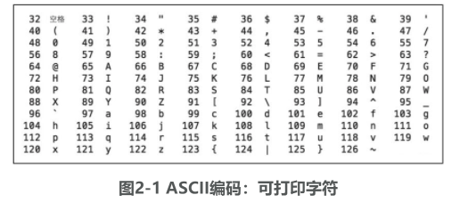
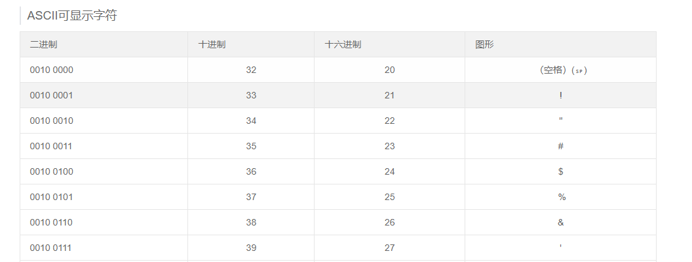
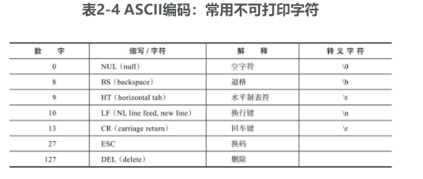
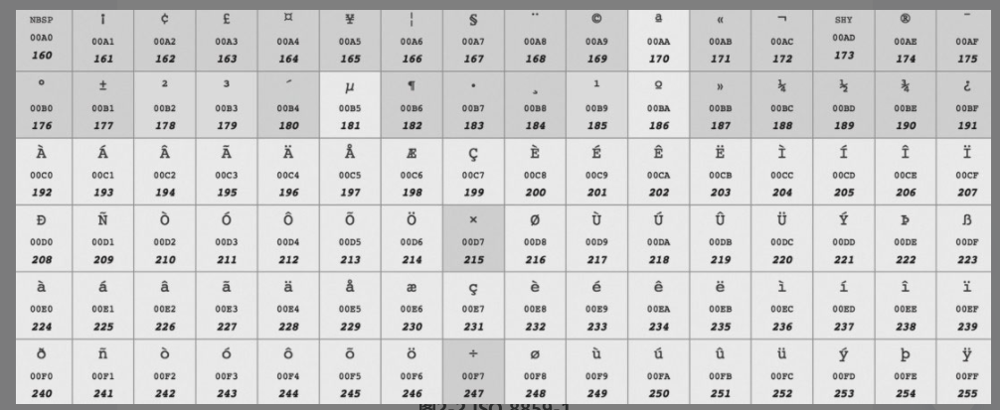
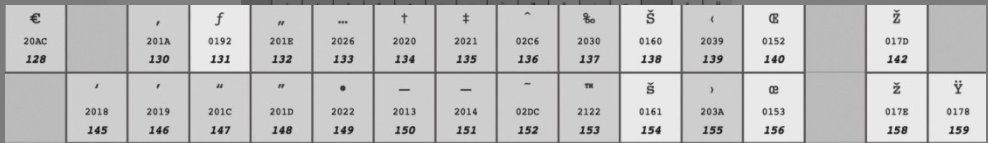
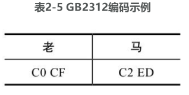
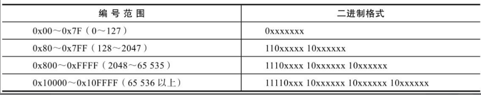
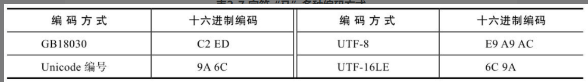
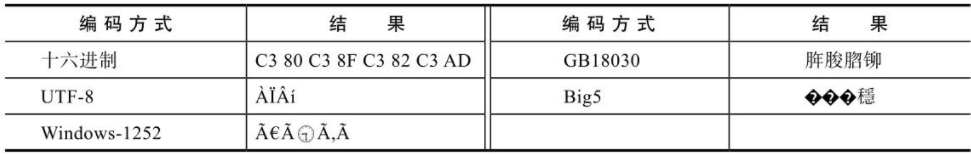
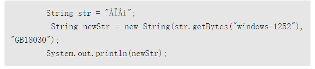

## **编码**

### **常见的非 Unicode 编码** 

下面我们看一些主要的非Unicode编码，包括ASCII、ISO 8859-1、Windows-1252、GB2312、GBK、GB18030和Big5。

#### **ASCII**  

世界上虽然有各种各样的字符，但计算机发明之初没有考虑那么多，基本上只考虑了美国的需求。美国大概只需要 128 个字符，所以就规定了 128 个字符的二进制表示方法。这个方法是一个标准，称为 **ASCII 编码**，全称是AmericanStandard Code for InformationInterchange，即美国信息互换标准代码。 

128 个字符用 7 位刚好可以表示，计算机存储的最小单位是 byte，即 8 位，ASCII 码中最高位设置为 0，剩下的 7 位表示字符。这 7 位可以看作数字 0~127，ASCII 码规定了从 0~127 的每个数字代表什么含义。

我们先来看数字32～126的含义，如图2-1所示，除了中文之外，我们平常用的字符基本都涵盖了，键盘上的字符大部分也都涵盖了。



这些数字用二进制来表示：可以参考：https://www.sojson.com/ascii.html 。如上面所说，使用的是一个字节，8 位来表示一个字符的。 

 

数字32～126表示的字符都是可打印字符，0～31和127表示一些不可以打印的字符，这些字符一般用于控制目的，这些字符中大部分都是不常用的，表2-4列出了其中相对常用的字符。 



ASCII 码对美国是够用了，但是对其他国家而言却是不够的，于是，各个国家的各种计算机厂商就发明了各种各样的编码方式以表示自己国家的字符，为了保持鱼 ASCII 码的兼容性，一般都是将最高位设置为 1。也就是说当最高位为 0 的时候，表示 ASCII 码，当为 1 时，就是各个国家自己的字符。在这些扩展的编码中，在西欧国家中流行的是**ISO 8859-1**和**Windows-1252**，在中国是**GB2312、GBK、GB18030和Big5**，我们逐个介绍这些编码。 

#### **ISO 8859-1**  

ISO 8859-1 又称 Latin-1，**他也是使用一个字节（8位）表示一个字符**，其中0~127与 ASCII 一样，128~255规定了不同的含义。在 128~255中，128~159表示一些控制字符，这些字符也不常用。160~255表是一些西欧字符，如图2-2所示。 

如：00A0 表是的是16进制，转换为二进制是：160 

 

#### **Windows-1252**  

ISO 8859-1虽然号称是标准，用于西欧国家，但它连欧元（€）这个符号都没有，因为欧元比较晚，而标准比较早。实际中使用更为广泛的是Windows-1252编码，这个编码与ISO 8859-1基本是一样的，区别只在于数字128～159。**也是用一个字节表示**。 



 **图2-3 Windows-1252编码：区别于ISO8859-1的部分** 

这个编码中加入了欧元符号以及一些其他常用的字符。基本上可以认为，**ISO8859-1已被Windows-1252取代**，在很多应用程序中，即使文件声明它采用的是ISO 8859-1编码，解析的时候依然被当作Windows-1252编码。

HTML5甚至明确规定，如果文件声明的是ISO 8859-1编码，它应该被看作Win-dows-1252编码。为什么要这样呢？因为大部分人搞不清楚ISO 8859-1和Windows-1252的区别，当他说ISO 8859-1的时候，其实他指的是Windows-1252，所以标准干脆就这么强制规定了。 

#### **GB2312** 

美国和西欧字符用一个字节就够了，但中文显然是不够的。中文第一个标准是GB2312。**GB2312标准主要针对的是简体中文常见字符**，包括约7000个汉字和一些罕用词和繁体字。

**GB2312固定使用两个字节表示汉字，在这两个字节中，最高位都是1，如果是0，就认为是ASCII字符**。在这两个字节中，其中高位字节范围是0xA1～0xF7，低位字节范围是0xA1～0xFE。比如，“老马”的GB2312编码（**十六进制表示**）如表2-5所示。



```tex
C0 CF是两个字节。C0 -----> 1100 0000; CF ------> 1100 1111
C2 ED是两个字节。C2 ------> 1100  0010;  ED --------> 1110  1101
```

#### **GBK**  

GBK建立在GB2312的基础上，向下兼容GB2312，也就是说，GB2312编码的字符和二进制表示，在GBK编码里是完全一样的。GBK增加了14 000多个汉字，共计约21 000个汉字，其中包括繁体字。 

GBK同样使用固定的两个字节表示，其中高位字节范围是0x81～0xFE，低位字节范围是0x40～0x7E和0x80～0xFE。 

> 解释：高位字节是指，前面的一个字节例如 C0 CF 的二进制是：1100 0000 1100 1111，前面8位，1100 0000 就是 高位字节，后面的 1100 1111 是低位字节。 

需要注意的是，低位字节是从0x40（也就是64）开始的，也就是说，低位字节的最高位可能为0。那怎么知道它是汉字的一部分，还是一个ASCII字符呢？其实很简单，因为汉字是用固定两个字节表示的，在解析二进制流的时候，如果第一个字节的最高位为1，那么就将下一个字节读进来一起解析为一个汉字，而不用考虑它的最高位，解析完后，跳到第三个字节继续解析。 

#### **GB18030**

GB18030向下兼容GBK，增加了55 000多个字符，共76 000多个字符，包括了很多少数民族字符，以及中日韩统一字符。 
用两个字节已经表示不了GB18030中的所有字符，GB18030使用变长编码，有的字符是两个字节，有的是四个字节。在两字节编码中，字节表示范围与GBK一样。在四字节编码中，第一个字节的值为0x81～0xFE，第二个字节的值为0x30～0x39，第三个字节的值为0x81～0xFE，第四个字节的值为0x30～0x39。 

解析二进制时，如何知道是两个字节还是4个字节表示一个字符呢？看第二个字节的范围，如果是0x30～0x39就是4个字节表示，因为两个字节编码中第二个字节都比这个大。 

#### **Big5** 

Big5是针对繁体中文的，广泛用于我国台湾地区和我国香港特别行政区等地。Big5包括13 000多个繁体字，和GB2312类似，一个字符同样固定使用两个字节表示。在这两个字节中，高位字节范围是0x81～0xFE，低位字节范围是0x40～0x7E和0xA1～0xFE。

### **编码汇总**

ASCII 编码是基础，使用一个字节表示，最高位设位0，其他 7 位表示 128 个字符。其他编码都是i兼容 ASCII 的，最高位使用 1 来进行区分。 

西欧主要使用Windows-1252，使用一个字节，增加了额外128个字符。

我国内地的三个主要编码GB2312、GBK、GB18030有时间先后关系，表示的字符数越来越多，且后面的兼容前面的，GB2312和GBK都是用两个字节表示，而GB18030则使用两个或四个字节表示。 

我国香港特别行政区和我国台湾地区的主要编码是Big5。

但如果有高位为1的字符，除了GB2312、GBK、GB18030外，其他编码都是不兼容的。比如，Windows-1252和中文的各种编码是不兼容的，即使Big5和GB18030都能表示繁体字，其表示方式也是不一样的，而这就会出现所谓的乱码，具体我们稍后介绍。 

### **常见的 Unicode 编码** 

以上我们介绍了中文和西欧的字符与编码，但世界上还有很多其他国家的字符，每个国家的各种计算机厂商都对自己常用的字符进行编码，在编码的时候基本忽略了其他国家的字符和编码，甚至忽略了同一国家的其他计算机厂商，这样造成的结果就是，出现了太多的编码，且互相不兼容。 

世界上所有的字符能不能统一编码呢？可以，这就是Unicode。

**Unicode 做了一件事，就是给世界上所有字符都分配了一个唯一的数字编号，这个编号范围从0x000000～0x10FFFF，包括110多万**。但**大部分常用字符都在0x0000～0xFFFF之间**，即65 536个数字之内。每个字符都有一个Unicode编号，这个编号一般写成十六进制，在前面加U+。**大部分中文的编号范围为U+4E00～U+9FFF**，例如，“马”的Unicode是U+9A6C。

简单理解， Unicode 主要做了这么一件事，就是给所有字符分配了唯一数字编号。它并没有规定这个编号怎么对应到二进制表示，这是与上面介绍的其他的编码不同的，其他编码都既规定了能表示哪些字符，又规定了每个字符对应的二进制是什么，而 Unicode 本身只规定了每个字符的数字编号是多少。 

那编号怎么对应到二进制表示呢？有多种方案，主要有UTF-32、UTF-16和UTF-8。

#### **UTF-32** 

这个最简单，**就是字符编号的整数二进制形式，4个字节**。 

但有个细节，就是字节的排列顺序，如果第一个字节是整数二进制中的最高位，最后一个字节是整数二进制中的最低位，那这种字节序就叫“大端”（Big Endian, BE），否则，就叫“小端”（Little Endian, LE）。对应的编码方式分别是UTF-32BE和UTF-32LE。 

可以看出，每个字符都用4个字节表示，非常浪费空间，实际采用的也比较少。

#### **UTF-16** 

UTF-16使用变长字节表示：1）对于编号在U+0000～U+FFFF的字符（常用字符集），直接用两个字节表示。需要说明的是，U+D800～U+DBFF的编号其实是没有定义的。

2）字符值在U+10000～U+10FFFF的字符（也叫做增补字符集），需要用4个字节表示。前两个字节叫高代理项，范围是U+D800～U+DBFF；后两个字节叫低代理项，范围是U+DC00～U+DFFF。数字编号和这个二进制表示之间有一个转换算法，本书就不介绍了。

区分是两个字节还是4个字节表示一个字符就看前两个字节的编号范围，如果是U+D800～U+DBFF，就是4个字节，否则就是两个字节。

UTF-16也有和UTF-32一样的字节序问题，如果高位存放在前面就叫大端（BE），编码就叫UTF-16BE，否则就叫小端，编码就叫UTF-16LE。 

UTF-16常用于系统内部编码，UTF-16比UTF-32节省了很多空间，但是任何一个字符都至少需要两个字节表示，对于美国和西欧国家而言，还是很浪费的。

#### **UTF-8**

UTF-8使用变长字节表示，每个字符使用的字节个数与其Unicode编号的大小有关，编号小的使用的字节就少，编号大的使用的字节就多，使用的字节个数为1～4不等。 

具体来说，各个Unicode编号范围对应的二进制格式如表2-6所示。

​												 **表2-6 UTF-8编码的编号范围与对应的二进制格式**



表2-6中的**x表示可以用的二进制位，而每个字节开头的1或0是固定的**。

小于128的，编码与ASCII码一样，最高位为0。其他编号的第一个字节有特殊含义，最高位有几个连续的1就表示用几个字节表示，而其他字节都以10开头。 

**对于一个Unicode编号，具体怎么编码呢？**首先将其看作整数，转化为二进制形式（去掉高位的0），然后将二进制位从右向左依次填入对应的二进制格式x中，填完后，如果对应的二进制格式还有没填的x，则设为0。

例如，“马”的 Unicode 编号是 0x9A6C，整数编号是 39532（这个是十进制），其对应的 UTF-8 二进制格式是： 

> 1110xxxx 10xxxxxx 10xxxxxx

整数编号39532的二进制格式是：原始格式是（1001 1010 0110 1100） 1001 101001 101100（写成了表格中第三类的格式）

> 1001 101001 101100

将这个二进制从右到左依次填入二进制格式中，结果就是其 UTF-8 的编码：

> 11101001 10101001 10101100

十六进制表示为**0xE9A9AC**。和UTF-32/UTF-16不同，UTF-8是兼容ASCII的，对大部分中文而言，一个中文字符需要用三个字节表示。 

#### **Unicode 编码小结**

Unicode给世界上所有字符都规定了一个统一的编号，编号范围达到110多万，但大部分字符都在65 536以内。Unicode本身没有规定怎么把这个编号对应到二进制形式。 

UTF-32/UTF-16/UTF-8都在做一件事，就是把Unicode编号对应到二进制形式，其对应方法不同而已。UTF-32使用4个字节，UTF-16大部分是两个字节，少部分是4个字节，它们都不兼容ASCII编码，都有字节顺序的问题。**UTF-8使用1～4个字节表示，兼容ASCII编码，英文字符使用1个字节，中文字符大多用3个字节。** 

### **编码转换** 

有了Unicode之后，每一个字符就有了多种不兼容的编码方式，比如说“马”这个字符，它的各种编码方式对应的十六进制如表2-7所示。

 **表2-7 字符“马”多种编码方式**



这几种格式之间可以借助Unicode编号进行编码转换。可以认为：**每种编码都有一个映射表，存储其特有的字符编码和Unicode编号之间的对应关系，这个映射表是一个简化的说法，实际上可能是一个映射或转换方法**。 

编码转换的具体过程可以是：**一个字符从A编码转到B编码，先找到字符的A编码格式，通过A的映射表找到其Unicode编号，然后通过Unicode编号再查B的映射表，找到字符的B编码格式**。 

举例来说，“马”从GB18030转到UTF-8，先查GB18030->Unicode编号表，得到其编号是9A 6C，然后查Uncode编号->UTF-8表，得到其UTF-8编码：E9 A9 AC。 

编码转换改变了字符的二进制内容，但并没有改变字符看上去的样子。 

#### **乱码的原因**  

理解了编码，我们来看乱码。乱码有两种常见原因：**一种比较简单，就是简单的解析错误**；另外一种比较复杂，**在错误解析的基础上进行了编码转换**。我们分别介绍。

##### **1. 解析错误**

看个简单的例子。一个法国人采用Windows-1252编码写了个文件，发送给了一个中国人，中国人使用GB18030来解析这个字符，看到的可能就是乱码。比如，法国人发送的是Pékin, Windows-1252的二进制（采用十六进制）是50 E9 6B 69 6E，第二个字节E9对应é，其他都是ASCII码，中国人收到的也是这个二进制，但是他把它看成了GB18030编码，GB18030中E9 6B对应的是字符“閗”，于是他看到的就是“P閗in”，这看来就是一个乱码。反之也是一样的，一个GB18030编码的文件如果被看作Windows-1252也是乱码。 

切换查看编码的方式并么有改变数据的二进制本身，而只是改变了解析数据的方式，从而改变了数据看起来的样子，这与前面提到的编码正好相反。

##### **2. 错误的解析和编码转换** 

如果怎么改变查看方式都不对，那很有可能就不仅仅是解析二进制的方式不对，而是文本在错误解析的基础上还进行了编码转换。我们举个例子来说明：

（1）两个字 “老马”，本来的编码格式是 **GB18030**，编码（十六进制）是 C0 CF C2 ED。

（2）这个二进制形式被错误当成了**Windows-1252**编码，解读成了字符“ÀÏÂí”。

（3）随后这个字符进行了编码转换，转换成了UTF-8编码，形式还是“ÀÏÂí”，但二进制变成了C3 80 C3 8F C3 82 C3 AD，每个字符两个字节。

（4）这个时候再按照GB18030解析，字符就变成了乱码形式“脌脧脗铆”，而且这时无论怎么切换查看编码的方式，这个二进制看起来都是乱码。

**这种情况是乱码产生的主要原因**。这种情况其实很常见，计算机程序为了便于统一处理，经常会将所有编码转换为一种方式，比如UTF-8，在转换的时候，需要知道原来的编码是什么，但可能会搞错，而一旦搞错并进行了转换，就会出现这种乱码。这种情况下，无论怎么切换查看编码方式都是不行的，如表2-8所示                           

​    **表2-8 用不同编码方式查看错误转换后的二进制**



虽然有这么多形式，但我们看到的乱码形式很可能是“ÀÏÂí”，因为在例子中UTF-8是编码转换的目标编码格式，既然转换为了UTF-8，一般也是要按UTF-8查看。

#### **从乱码中恢复**

“乱”主要是因为发生了一次错误的编码转换，所谓恢复，是指要恢复两个关键信息：一个是原来的二进制编码方式A；另一个是错误解读的编码方式B。

恢复的基本思路是尝试进行逆向操作，假定按一种编码转换方式B获取乱码的二进制格式，然后再假定一种编码解读方式A解读这个二进制，查看其看上去的形式，这要尝试多种编码，如果能找到看着正常的字符形式，应该就可以恢复。

##### **（1）使用编辑器（UltraEdit）**

##### **（2）使用 Java**

1）public byte[] getBytes(String charsetName)，这个方法可以获取一个字符串的给定编码格式的二进制形式。

2）public String(byte bytes[], String charsetName)，这个构造方法以给定的二进制数组bytes按照编码格式charsetName解读为一个字符串。将A看作GB18030，将B看作Windows-1252，进行恢复的Java代码如下所示：



先按照B编码（Windows-1252）获取字符串的二进制，然后按A编码（GB18030）解读这个二进制，得到一个新的字符串，然后输出这个字符串的形式，输出为“老马”。 

### char的真正含义

char用于表示一个字符，这个字符可以是中文字符，也可以是英文字符。例如： char c = 'A'; char d = '马';

但为什么字符类型也可以进行算术运算和比较呢？它的本质到底是什么呢？

在Java内部进行字符处理时，采用的都是Unicode，具体编码格式是UTF-16BE。简单回顾一下，UTF-16使用两个或4个字节表示一个字符，Unicode编号范围在65 536以内的占两个字节，超出范围的占4个字节，BE就是先输出高位字节，再输出低位字节，这与整数的内存表示是一致的。

**char本质上是一个固定占用两个字节的无符号正整数，这个正整数对应于Unicode编号，用于表示那个Unicode编号对应的字符**。

**由于固定占用两个字节，char只能表示Unicode编号在65536以内的字符，而不能表示超出范围的字符**。那超出范围的字符怎么表示呢？使用两个char。

char 有多种赋值方式：

```java 
char c = 'A'; 1
char c = '马'; 2 
char c = 39532; 3
char c = 0x9a6c; 4 
char c = '\u9a6c'; 5
```

第1种赋值方式是最常见的，将一个能用ASCII码表示的字符赋给一个字符变量。第2种赋值方式也很常见，但这里是个中文字符，需要注意的是，直接写字符常量的时候应该注意文件的编码，比如，GBK编码的代码文件按UTF-8打开，字符会变成乱码，赋值的时候是按当前的编码解读方式，将这个字符形式对应的Unicode编号值赋给变量，“马”对应的Unicode编号是39532，所以第2种赋值方式和第3种赋值方式是一样的。第3种赋值方式是直接将十进制的常量赋给字符。第4种赋值方式是将十六进制常量赋给字符，第5种赋值方式是按Unicode字符形式。所以，第2、3、4、5种赋值方式都是一样的，本质都是将Unicode编号39532赋给了字符。

**由于char本质上是一个整数**，所以可以进行整数能做的一些运算，在进行运算时会被看作int，但由于char占两个字节，运算结果不能直接赋值给char类型，需要进行强制类型转换，这和byte、short参与整数运算是类似的。char类型的比较就是其Unicode编号的比较。 

char的加减运算就是按其Unicode编号进行运算，一般对字符做加减运算没什么意义，但ASCII码字符是有意义的。比如大小写转换，大写A～Z的编号是65～90，小写a～z的编号是97～122，正好相差32，所以大写转小写只需加32，而小写转大写只需减32。加减运算的另一个应用是加密和解密，将字符进行某种可逆的数学运算可以做加解密。 

char的位运算可以看作是对应整数的位运算，只是它是无符号数，也就是说，有符号右移>>和无符号右移>>>的结果是一样的。既然char本质上是整数，查看char的二进制表示，同样可以用Integer的方法，

```java 
char c = '马';
System.out.println(Integer.toBinaryString(c));
输出：1001101001101100
```

