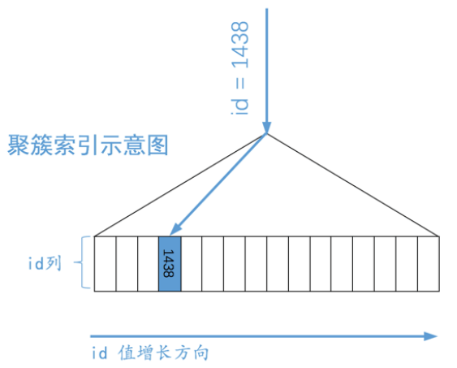
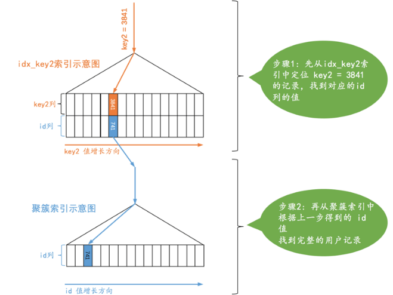
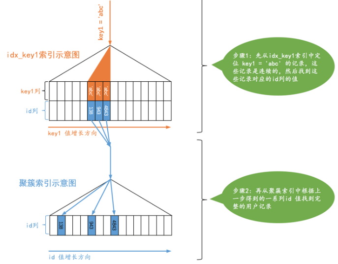
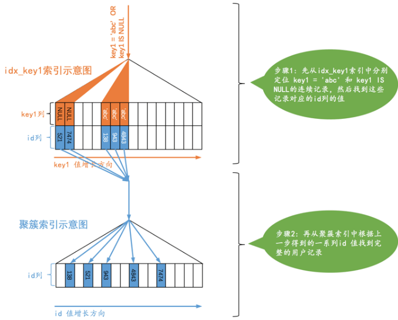
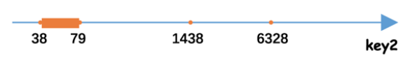

### 10 单表访问方法 

先创建一个表：

```mysql
CREATE TABLE single_table ( 
	id INT NOT NULL AUTO_INCREMENT, 
	key1 VARCHAR(100), 
	key2 INT, 
	key3 VARCHAR(100), 
	key_part1 VARCHAR(100), 
	key_part2 VARCHAR(100), 
	key_part3 VARCHAR(100), 
	common_field VARCHAR(100), 
	PRIMARY KEY (id), 
	KEY idx_key1 (key1), 
	UNIQUE KEY idx_key2 (key2), 
	KEY idx_key3 (key3), 
	KEY idx_key_part(key_part1, key_part2, key_part3) 
) Engine = InnoDB CHARSET = utf8;
```

我们为表创建了一些索引：

- 为 id 列建立的聚簇索引。 
- 为 key1 列建立的 idx_key1 二级索引。 
- 为 key2 列建立的 idx_key2 二级索引，而且该索引是唯一二级索引。 
- 为 key3 列建立的 idx_key3 二级索引。 
- 为 key_part1 、 key_part2 、 key_part3 列建立的 idx_key_part 二级索引，这也是一个联合索引

```mysql
CREATE PROCEDURE single_table_procedure()
BEGIN 
  declare i int;
  set i=1;
  while(i<=10000)do
    insert into single_table(key1,key2,key3,key_part1,key_part2,key_part3) 
    values(CONCAT("ab", i), i+1, CONCAT("bc",i), CONCAT("ab",CONCAT(i,"c")), CONCAT("bb", i+1), CONCAT("bc",CONCAT(i,"d")));
    set i=i+1;
  end while;
END;
```

#### 1 访问方法

- 使用全表进行扫描

  这种执行方式很好理解，就是把表的每一行记录都扫一遍嘛，把符合搜索条件的记录加入到结果集就完了。 不管是啥查询都可以使用这种方式执行，当然，这种也是最笨的执行方式。

- 使用索引进行查询

  全表扫描的代价太大了。如果查询语句中的搜索条件可以使用到某个索引，那直接使用索引来查询可能会加快查询执行时间。

  - 针对主键或者一二级索引的等值查询
  - 针对普通二级索引的等值查询
  - 针对索引列的范围查询
  - 直接扫描整个索引

**设计 MySQL 的大叔把 MySQL 执行查询语句的方式称之为 访问方法 或者 访问类型** 。不同的方法，最后结果一样，执行时间却会相差很大。

#### 2 const 

有时候我们通过主键列来定位一条记录：

```mysql
SELECT * FROM single_table WHERE id = 1438;
```

explain 执行的结果是这样的，可以看到 type 处是 const 的。

| id   | select_type | table | partitions | type  | possible_keys | key     | key_len | ref   | rows | filtered | Extra |
| ---- | ----------- | ----- | ---------- | ----- | ------------- | ------- | ------- | ----- | ---- | -------- | ----- |
| 1    | SIMPLE      | st    |            | const | PRIMARY       | PRIMARY | 4       | const | 1    | 100.0    |       |

MySQL 会直接利用主键值在聚簇索引中定位对应的用户记录，就像这样:



这是简化了的图。我们想突出的重点就是： B+ 树叶子节点中的记录是按照索引列排序的，对于的聚 簇索引来说，它对应的 B+ 树叶子节点中的记录就是按照 id 列排序的。类似的，我们**根据唯一二级索引列**来定位一条记录的速度也是贼快 的，比如下边这个查询：

```mysql
SELECT * FROM single_table WHERE key2 = 3841;
```

explain一下结果如下。type 为 const；

| id   | select_type | table | partitions | type  | possible_keys | key      | key_len | ref   | rows | filtered | Extra |
| ---- | ----------- | ----- | ---------- | ----- | ------------- | -------- | ------- | ----- | ---- | -------- | ----- |
| 1    | SIMPLE      | st    |            | const | idx_key2      | idx_key2 | 5       | const | 1    | 100.0    |       |

这个查询的执行过程的示意图就是这样：



可以看到这个查询的执行分两步，第一步先从 idx_key2 对应的 B+ 树索引中根据 key2 列与常数的等值比较条件 定位到一条二级索引记录，然后再根据该记录的 id 值到聚簇索引中获取到完整的用户记录。

设计 MySQL 的大叔认为通过主键或者唯一二级索引列与常数的等值比较来定位一条记录是像坐火箭一样快的，所 以他们把这种**通过主键或者唯一二级索引列来定位一条记录的访问方法定义为： const** ，意思是常数级别的，代 价是可以忽略不计的。

不过这种 **const 访问方法只能在主键列或者唯一二级索引列和一个常数进行等值比较时才有效**。这是因为只有该索引中全部列都采用等值比较才可以定位唯一的一条记录。

对于唯一二级索引来说，查询该列为 NULL 值的情况比较特殊，比如这样：

```mysql
SELECT * FROM single_table WHERE key2 IS NULL;
```

因为唯一二级索引列并不限制 NULL 值的数量，所以上述语句可能访问到多条记录，也就是说上边这个语句不可

以使用 const 访问方法来执行。

#### 3 ref

有时候我们**对某个普通的二级索引列与常数进行等值比较**，比如这样：

```mysql
SELECT * FROM single_table WHERE key1 = 'abc';
EXPLAIN SELECT * FROM single_table st WHERE st.key1 ="ab123";
```

使用explain查看，type 是 ref的。

| id   | select_type | table | partitions | type | possible_keys | key      | key_len | ref   | rows | filtered | Extra |
| ---- | ----------- | ----- | ---------- | ---- | ------------- | -------- | ------- | ----- | ---- | -------- | ----- |
| 1    | SIMPLE      | st    |            | ref  | idx_key1      | idx_key1 | 303     | const | 1    | 100.0    |       |

对于这个查询，我们当然可以选择全表扫描来逐一对比搜索条件是否满足要求，我们也可以先使用二级索引找到 对应记录的 id 值，然后再回表到聚簇索引中查找完整的用户记录。**由于普通二级索引并不限制索引列值的唯一 性，所以可能找到多条对应的记录**，也就是说使用二级索引来执行查询的代价取决于等值匹配到的二级索引记录条数。如果匹配的记录较少，则回表的代价还是比较低的，所以 MySQL 可能选择使用索引而不是全表扫描的方式 来执行查询。设计 MySQL 的大叔就把这种**搜索条件为二级索引列与常数等值比较，采用二级索引来执行查询的访 问方法称为： ref** 。



从图示中可以看出，对于普通的二级索引来说，通过索引列进行等值比较后可能匹配到多条连续的记录，而不是 像主键或者唯一二级索引那样最多只能匹配1条记录，所以这种 ref 访问方法比 const 差了那么一丢丢，但是在 二级索引等值比较时匹配的记录数较少时的效率还是很高的（如果匹配的二级索引记录太多那么回表的成本就太大了）。

需要注意的是这两种情况：

- **二级索引列值为 NULL 的情况**

  不论是普通的二级索引，还是唯一二级索引，它们的索引列对包含 NULL 值的数量并不限制，所以我们采用 key IS NULL 这种形式的搜索条件最多只能使用 ref 的访问方法，而不是 const 的访问方法。

- **对于某个包含多个索引列的二级索引来说，只要是最左边的连续索引列是与常数的等值比较就可能采用 ref 的访问方法**。

  ```mysql
  -- ref 查询，使用 联合索引
  SELECT * FROM single_table WHERE key_part1 = 'god like'; 
  SELECT * FROM single_table WHERE key_part1 = 'god like' AND key_part2 = 'legendary';
  SELECT * FROM single_table WHERE key_part1 = 'god like' AND key_part2 = 'legendary' AND key_part3 = 'penta kill';
  ```

查询sql

```mysql
EXPLAIN SELECT * FROM single_table st WHERE st.key_part1 ="ab100c" AND st.key_part2 = 'bb100'
```

结果


| id   | select_type | table | partitions | type | possible_keys | key          | key_len | ref         | rows | filtered | Extra |      |
| ---- | ----------- | ----- | ---------- | ---- | ------------- | ------------ | ------- | ----------- | ---- | -------- | ----- | ---- |
| 1    | SIMPLE      | st    |            | ref  | idx_key_part  | idx_key_part | 606     | const,const | 1    | 100.0    |       |      |

但如果最左边的连续索引列并不全是等值比较的话，他的访问方法就不能称为 ref 了。如：查询sql

```mysql
SELECT * FROM single_table WHERE key_part1 = 'god like' AND key_part2 > 'legendary';
EXPLAIN SELECT * FROM single_table st WHERE st.key_part1 ="ab100c" AND st.key_part2 > 'bb79';
```

结果是：type是 range 查询。

| id   | select_type | table | partitions | type  | possible_keys | key          | key_len | ref  | rows | filtered | Extra                 |
| ---- | ----------- | ----- | ---------- | ----- | ------------- | ------------ | ------- | ---- | ---- | -------- | --------------------- |
| 1    | SIMPLE      | st    |            | range | idx_key_part  | idx_key_part | 606     |      | 1    | 100.0    | Using index condition |

#### 4 ref_or_null 

有时候我们**不仅想找出某个二级索引列的值等于某个常数的记录，还想把该列的值为 NULL 的记录也找出来**，就像下边这个查询:

```mysql
SELECT * FROM single_demo WHERE key1 = 'abc' OR key1 IS NULL;
-- ref_or_null 查询，使用 二级索引
EXPLAIN SELECT * FROM single_table st WHERE st.key1 = "ab123" OR st.key1 IS NULL ;
```

explain 执行语句的结果：extra 中显示的是 Using index condition 表示使用了 二级索引，type是 ref_or_null。

| id   | select_type | table | partitions | type        | possible_keys | key      | key_len | ref   | rows | filtered | Extra                 |
| ---- | ----------- | ----- | ---------- | ----------- | ------------- | -------- | ------- | ----- | ---- | -------- | --------------------- |
| 1    | SIMPLE      | st    |            | ref_or_null | idx_key1      | idx_key1 | 303     | const | 2    | 100.0    | Using index condition |

**当使用二级索引而不是全表扫描的方式执行该查询时，这种类型的查询使用的访问方法就称为 ref_or_null** ，这个 ref_or_null 访问方法的执行过程如下：



可以看到，上边的查询相当于先分别从 idx_key1 索引对应的 B+ 树中找出 key1 IS NULL 和 key1 = 'abc' 的两 个连续的记录范围，然后根据这些二级索引记录中的 id 值再回表查找完整的用户记录。

#### eq_ref 

**连接查询中对被驱动表使用主键值或者唯一二级索引列的值进行等值查找的查询执行方式称之为： eq_ref** 。 

#### 5 range 

复杂的查询如：

```mysql
SELECT * FROM single_table WHERE key2 IN (1438, 6328) OR (key2 >= 38 AND key2 <= 79);
```

我们可以用全表扫描方式来执行这个查询，不过也可以使用 二级索引 + 回表的方式执行，如果采用 二级索引 + 回表 的方式来执行的话，那么此时的搜索条件就不只是要求索引列与常数的等值匹配了，而是索引列需要匹配某个或某些范围的值。设计 MySQL 的大叔把这种**利用索引进行范围匹配的访问方法称之为： range** 。

如果把这几个所谓的 key2 列的值需要满足的 范围 在数轴上体现出来的话，那应该是这个样子：



也就是从数学的角度看，每一个所谓的范围都是数轴上的一个 区间 ，3个范围也就对应着3个区间：

- 范围1： key2 = 1438

- 范围2： key2 = 6328

- 范围3： key2 ∈ [38, 79] ，注意这里是闭区间

我们可以把那种**索引列等值匹配的情况称之为 单点区间** ，上边所说的 范围1 和 范围2 都可以被称为单点区间，像 范围3 这种的我们可以称为连续范围区间。

#### 6 index 

下面这个查询：

```mysql
SELECT key_part1, key_part2, key_part3 FROM single_table WHERE key_part2 = 'abc';
-- 示例
EXPLAIN SELECT key_part1, key_part2, key_part3 FROM single_table WHERE key_part2 = 'bb799';
```

结果：type 处是 index， extra 是 Using where; Using index，使用了 where 和 index（采用遍历二级索引的执行方式，实际上是没有用上索引的，只是遍历了这个idx_key_part的联合索引）

| id   | select_type | table        | partitions | type  | possible_keys | key          | key_len | ref  | rows  | filtered | Extra                    |
| ---- | ----------- | ------------ | ---------- | ----- | ------------- | ------------ | ------- | ---- | ----- | -------- | ------------------------ |
| 1    | SIMPLE      | single_table |            | index |               | idx_key_part | 909     |      | 10047 | 10.0     | Using where; Using index |

由于 key_part2 并不是联合索引 idx_key_part 最左索引列，所以我们无法使用 ref 或者 range 访问方法来执行 这个语句。但是这个查询符合下边这两个条件：

- 它的查询列表只有3个列： key_part1 , key_part2 , key_part3 ，而索引 idx_key_part 又包含这三个列。 
- 搜索条件中只有 key_part2 列。这个列也包含在索引 idx_key_part 中。

**也就是说我们可以直接通过遍历 idx_key_part 索引的叶子节点的记录来比较 key_part2 = 'abc' 这个条件是否 成立，把匹配成功的二级索引记录的 key_part1 , key_part2 , key_part3 列的值直接加到结果集中就行了**。**由于二级索引记录比聚簇索记录小的多**（聚簇索引记录要存储所有用户定义的列以及所谓的隐藏列，而二级索引记 录只需要存放索引列和主键），**而且这个过程也不用进行回表操作，所以直接遍历二级索引比直接遍历聚簇索引 的成本要小很多**，设计 MySQL 的大叔就把这种**采用遍历二级索引记录的执行方式称之为： index** 。

#### 7 all 

最直接的查询执行方式就是我们已经提了无数遍的**全表扫描**，**对于 InnoDB 表来说也就是直接扫描聚簇索引**，设 计 MySQL 的大叔把这种**使用全表扫描执行查询的方式称之为： all** 。

```mysql
-- all 查询
EXPLAIN SELECT * FROM single_table WHERE key_part2 = 'bb799';
```

| id   | select_type | table        | partitions | type | possible_keys | key  | key_len | ref  | rows  | filtered | Extra       |
| ---- | ----------- | ------------ | ---------- | ---- | ------------- | ---- | ------- | ---- | ----- | -------- | ----------- |
| 1    | SIMPLE      | single_table |            | ALL  |               |      |         |      | 10047 | 10.0     | Using where |

#### 8 注意事项 

##### 8.1 重温 二级索引+回表

一般情况下只能利用单个二级索引执行查询，比方说下边的这个查询：

> SELECT * FROM single_table WHERE key1 = 'abc' AND key2 > 1000;

查询优化器会识别到这个查询中的两个搜索条件:

- key1 = 'abc'
- key2 >1000

**优化器一般会根据 single_table 表的统计数据来判断到底使用哪个条件到对应的二级索引中查询扫描的行数会更少，选择那个扫描行数较少的条件到对应的二级索引中查询**（关于如何比较的细节我们后边的章节中会唠叨）。**然后将从该二级索引中查询到的结果经过回表得到完整的用户记录后再根据其余的 WHERE 条件过滤记录**。

**一般来说，等值查找比范围查找需要扫描的行数更少**（也就是 ref 的访问方法一般比 range 好，但这也不总是一 定的，也可能采用 ref 访问方法的那个索引列的值为特定值的行数特别多），所以这里假设优化器决定使用 idx_key1 索引进行查询，那么整个查询过程可以分为两个步骤：

1. **使用二级索引定位记录的阶段，也就是根据条件 key1 = 'abc' 从 idx_key1 索引代表的 B+ 树中找 到对应的二级索引记录**。
2. **回表阶段，也就是根据上一步骤中找到的记录的主键值进行 回表 操作，也就是到聚簇索引中找到对 应的完整的用户记录，再根据条件 key2 > 1000 到完整的用户记录继续过滤。将最终符合过滤条件的记录返 回给用户**。

这里需要特别提醒大家的一点是，**因为二级索引的节点中的记录只包含索引列和主键，所以在步骤1中使用 idx_key1 索引进行查询时只会用到与 key1 列有关的搜索条件，其余条件，比如 key2 > 1000 这个条件在步骤1 中是用不到的，只有在步骤2完成回表操作后才能继续针对完整的用户记录中继续过滤**。

##### 8.2 明确range使用的范围区间

其实对于 B+ 树索引来说，只要索引列和常数使用 = 、 <> 、 IN 、 NOT IN 、 IS NULL 、 IS NOT NULL 、 > 、 < 、 >= 、 <= 、 BETWEEN 、 != （不等于也可以写成 <> ）或者 LIKE 操作符连接起来，就可以产生一个所谓的 区间 。

> 小贴士：
>
> LIKE操作符比较特殊，只有在匹配完整字符串或者匹配字符串前缀时才可以利用索引，具体原因我们在前边的章节中唠叨过了，这里就不赘述了。 IN操作符的效果和若干个等值匹配操作符`=`之间用`OR`连接起来是一样的，也就是说会产生多个单点区间，比如下边这两个语句的效果是一样的： 
>
> SELECT * FROM single_table WHERE key2 IN (1438, 6328); 
>
> SELECT * FROM single_table WHERE key2 = 1438 OR key2 = 6328; 

###### and 和 or 提取范围区间

###### 8.2.1 所有搜索条件都可以使用某个索引的情况

有时候每个搜索条件都可以使用到某个索引，比如下边这个查询语句：

SELECT * FROM single_table WHERE key2 > 100 AND key2 > 200；

key2 > 100 和 key2 > 200 交集当然就是 key2 > 200 了，也就是说上边这个查询使用 idx_key2 的范围区间就
是 (200, +∞) 。

我们再看一下使用 OR 将多个搜索条件连接在一起的情况：

SELECT * FROM single_table WHERE key2 > 100 OR key2 > 200;

也就是说上边这个查询使用 idx_key2 的范围区间就是 (100， +∞) 。

###### 8.2.2 有的搜索条件无法使用索引的情况

**and情况**

SELECT * FROM single_table WHERE key2 > 100 AND common_field = 'abc';

请注意，这个查询语句中能利用的索引只有 idx_key2 一个，而 idx_key2 这个二级索引的记录中又不包含
common_field 这个字段，所以在使用二级索引 idx_key2 定位记录的阶段用不到 common_field = 'abc' 这个条件，这个条件是在回表获取了完整的用户记录后才使用的，而 范围区间 是为了到索引中取记录中提出的概念，所以在确定 范围区间 的时候不需要考虑 common_field = 'abc' 这个条件，我们在为某个索引确定范围区间的时候只需要把用不到相关索引的搜索条件替换为 TRUE 就好了。

所以上面的查询替换后就是这样：

SELECT * FROM single_table WHERE key2 > 100 AND TRUE;

优化后就是：SELECT * FROM single_table WHERE key2 > 100;

**看一下or的情况**

SELECT * FROM single_table WHERE key2 > 100 OR common_field = 'abc';

替换后：SELECT * FROM single_table WHERE key2 > 100 OR TRUE;

优化后：SELECT * FROM single_table WHERE TRUE;

这也就说说明如果我们强制使用 idx_key2 执行查询的话，对应的范围区间就是 (-∞, +∞) ，也就是需要将全部二级索引的记录进行回表，这个代价肯定比直接全表扫描都大了。也就是说**一个使用到索引的搜索条件和没有使用该索引的搜索条件使用 OR 连接起来后是无法使用该索引的**。

###### 8.2.3  复杂搜索条件下找出范围匹配的区间

```mysql
SELECT * FROM single_table WHERE  
       (key1 > 'xyz' AND key2 = 748 ) OR 
       (key1 < 'abc' AND key1 > 'lmn') OR 
       (key1 LIKE '%suf' AND key1 > 'zzz' AND (key2 < 8000 OR common_field = 'abc')) ;
```

分析：

- 首先查看 WHERE 子句中的搜索条件都涉及到了哪些列，哪些列可能使用到索引。

  这个查询的搜索条件涉及到了 key1 、 key2 、 common_field 这3个列，然后 key1 列有普通的二级索引
  idx_key1 ， key2 列有唯一二级索引 idx_key2 。

- 对于那些可能用到的索引，分析它们的范围区间。

  - 假设我们使用 idx_key1 执行查询。

    - 我们需要把那些用不到该索引的搜索条件暂时移除掉，移除方法也简单，直接把它们替换为 TRUE
      就好了。上边的查询中除了有关 key2 和 common_field 列不能使用到 idx_key1 索引外， key1 
      LIKE '%suf' 也使用不到索引，所以把这些搜索条件替换为 TRUE 之后的样子就是这样：

       (key1 > 'xyz' AND TRUE ) OR 
       (key1 < 'abc' AND key1 > 'lmn') OR 
       (TRUE AND key1 > 'zzz' AND (TRUE OR TRUE))

      优化后：

       (key1 > 'xyz') OR 
       (key1 < 'abc' AND key1 > 'lmn') OR 
       (key1 > 'zzz')

    - 替换掉永远为 TRUE 或 FALSE 的条件

      因为符合 key1 < 'abc' AND key1 > 'lmn' 永远为 FALSE ，所以上边的搜索条件可以被写成这样：
       (key1 > 'xyz') OR (key1 > 'zzz')

    - 继续化简区间

      key1 > 'xyz' 和 key1 > 'zzz' 之间使用 OR 操作符连接起来的，意味着要取并集，所以最终的结果化简的到的区间就是： key1 > xyz 。也就是说：**上边那个有一坨搜索条件的查询语句如果使用idx_key1 索引执行查询的话，需要把满足 key1 > xyz 的二级索引记录都取出来，然后拿着这些记录的id再进行回表，得到完整的用户记录之后再使用其他的搜索条件进行过滤**。

  - 假设我们使用 idx_key2 执行查询

    - 我们需要把那些用不到该索引的搜索条件暂时使用 TRUE 条件替换掉，其中有关 key1 和
      common_field 的搜索条件都需要被替换掉，替换结果就是：

      (TRUE AND key2 = 748 ) OR 
       (TRUE AND TRUE) OR 
       (TRUE AND TRUE AND (key2 < 8000 OR TRUE))

      简化之后：

      key2 = 748 OR TRUE 最后 TRUE。

    这个结果也就意味着如果我们要使用 idx_key2 索引执行查询语句的话，需要扫描 idx_key2 二级索
    引的所有记录，然后再回表，这不是得不偿失么，所以这种情况下不会使用 idx_key2 索引的。

##### 8.3 索引合并 

我们前边说过 MySQL 在一般情况下执行一个查询时最多只会用到单个二级索引，但不是还有特殊情况么，在这些 特殊情况下也可能在一个查询中使用到多个二级索引，设计 MySQL 的大叔把这种使用到多个索引来完成一次查询 的执行方法称之为： index merge ，具体的索引合并算法有下边三种。

###### 8.3.1 Intersection 合并

Intersection 翻译过来的意思是 交集 。这里是说某个查询可以使用多个二级索引，将从多个二级索引中查询到 的结果取交集，比方说下边这个查询：

```mysql
SELECT * FROM single_table WHERE key1 = 'a' AND key3 = 'b';
```

假设这个查询使用 Intersection 合并的方式执行的话，那这个过程就是这样的:

- 从 idx_key1 二级索引对应的 B+ 树中取出 key1 = 'a' 的相关记录。
- 从 idx_key3 二级索引对应的 B+ 树中取出 key3 = 'b' 的相关记录。
- 二级索引的记录都是由 索引列 + 主键 构成的，所以我们可以计算出这两个结果集中 id 值的交集。
- 按照上一步生成的 id 值列表进行回表操作，也就是从聚簇索引中把指定 id 值的完整用户记录取出来，返回 给用户。

为啥不直接使用 idx_key1 或者 idx_key3 只根据某个搜索条件去读取一个二级索引，然后回表后再过滤另外一个搜索条件呢？这里要分析一下两种查询执行方式之间需要的成本代价。

只读取一个二级索引的成本： 

- 按照某个搜索条件读取一个二级索引

- 根据从该二级索引得到的主键值进行回表操作，然后再过滤其他的搜索条件

 读取多个二级索引之后取交集成本：

- 按照不同的搜索条件分别读取不同的二级索引 
- 将从多个二级索引得到的主键值取交集，然后进行回表操作

虽然读取多个二级索引比读取一个二级索引消耗性能，但是**读取二级索引的操作是 顺序I/O ，而回表操作是 随机I/O** ，所以**如果只读取一个二级索引时需要回表的记录数特别多，而读取多个二级索引之后取交集的记录数非常少，当节省的因为 回表 而造成的性能损耗比访问多个二级索引带来的性能损耗更高时，读取多个二级索引后 取交集比只读取一个二级索引的成本更低**。

MySQL 在某些特定情况下才可能会使用到 Intersection 索引合并。

1. 情况一：**二级索引列是等值匹配的情况，对于联合索引来说，在联合索引中的每个列都必须等值匹配，不能出现只出现匹配部分列的情况**。

   > 原因：之所以在二级索引列都是等值匹配的情况下才可能使用 Intersection 索 引合并，是因为**只有在这种情况下根据二级索引查询出的结果集是按照主键值排序的**。

   比方说下边这个查询可能用到 idx_key1 和 idx_key_part 这两个二级索引进行 Intersection 索引合并的操作：

   ```mysql
   SELECT * FROM single_table WHERE key1 = 'a' AND key_part1 = 'a' AND key_part2 = 'b'
   AND key_part3 = 'c';
   ```

   而下边这两个查询就不能进行 Intersection 索引合并：

   ```mysql
   SELECT * FROM single_table WHERE key1 > 'a' AND key_part1 = 'a' AND key_part2 = 'b'
   AND key_part3 = 'c';
   SELECT * FROM single_table WHERE key1 = 'a' AND key_part1 = 'a';
   ```

   第一个查询是因为对 key1 进行了范围匹配，第二个查询是因为联合索引 idx_key_part 中的 key_part2 列并没有出现在搜索条件中，所以这两个查询不能进行 Intersection 索引合并

2. 情况二：**主键列可以是范围匹配**。

   比方说下边这个查询可能用到主键和 idx_key1 进行 Intersection 索引合并的操作：

   ```mysql
    SELECT * FROM single_table WHERE id > 100 AND key1 = 'a';
   ```

   之所以在二级索引列都是等值匹配的情况下才可能使用 Intersection 索引合并，是因为**只有在这种情况下根据二级索引查询出的结果集是按照主键值排序的**。

    Intersection 索引合并会把从多个二级索引中查询出的主键值求交集，如果从各个二级索引中查询的到的结果集本身就是已经按照主键排好序的，那么求交集的过程就很easy啦。假设某个查询使用Intersection 索引合并的方式从 idx_key1 和 idx_key2 这两个二级索引中获取到的主键值分别是：

   - 从 idx_key1 中获取到已经排好序的主键值：1、3、5 

   - 从 idx_key2 中获取到已经排好序的主键值：2、3、

   那么求交集的过程就是这样：逐个取出这两个结果集中最小的主键值，如果两个值相等，则加入最后的交集结果中，否则丢弃当前较小的主键值，再取该丢弃的主键值所在结果集的后一个主键值来比较，直到某个结果集中的主键值用完了:

   > - 先取出这两个结果集中较小的主键值做比较，因为 1 < 2 ，所以把 idx_key1 的结果集的主键值 1 丢弃，取出后边的 3 来比较。
   >
   > - 因为 3 > 2 ，所以把 idx_key2 的结果集的主键值 2 丢弃，取出后边的 3 来比较。
   >
   > - 因为 3 = 3 ，所以把 3 加入到最后的交集结果中，继续两个结果集后边的主键值来比较。
   >
   > - 后边的主键值也不相等，所以最后的交集结果中只包含主键值 3 。

时间复杂度是 O(n) ，但是如果从各个二级索引中查询出的结果集并不是按照主键排序的话，那就要先把结果集中的主键值排序完再来做上边的那个过程，就比较耗时了。

另外，不仅是多个二级索引之间可以采用 Intersection 索引合并，索引合并也可以有聚簇索引参加，也就是我们上边写的 情况二 ：在搜索条件中有主键的范围匹配的情况下也可以使用 Intersection 索引合并索引合并。为啥主键这就可以范围匹配了？还是得回到应用场景里，比如看下边这个查询：

SELECT * FROM single_table WHERE key1 = 'a' AND id > 100;

假设这个查询可以采用 Intersection 索引合并，我们理所当然的以为这个查询会分别按照 id > 100 这个条件从聚簇索引中获取一些记录，在通过 key1 = 'a' 这个条件从 idx_key1 二级索引中获取一些记录，然后再求交集，其实这样就把问题复杂化了，没必要从聚簇索引中获取一次记录。别忘了二级索引的记录中都带有主键值的，所以可以在从 idx_key1 中获取到的主键值上直接运用条件 id > 100 过滤就行了，这样多简单。所以涉及主键的搜索条件只不过是为了从别的二级索引得到的结果集中过滤记录罢了，是不是等值匹配不重要。

当然，上边说的 情况一 和 情况二 只是发生 Intersection 索引合并的必要条件，不是充分条件。也就是说即使情况一、情况二成立，也不一定发生 Intersection 索引合并，这得看优化器的心情。**优化器只有在单独根据搜索条件从某个二级索引中获取的记录数太多，导致回表开销太大，而通过 Intersection 索引合并后需要回表的记录数大大减少时才会使用 Intersection 索引合并**。

###### 8.3.2 union 合并

有时候 OR 关系的不同搜索条件会使用到不同的索引，比方说这样：

```mysql
SELECT * FROM single_table WHERE key1 = 'a' OR key3 = 'b'
```

Intersection 是交集的意思，这适用于使用不同索引的搜索条件之间使用 AND 连接起来的情况； Union 是并集 的意思，**适用于使用不同索引的搜索条件之间使用 OR 连接起来的情况**。与 Intersection 索引合并类似， MySQL 在某些特定的情况下才可能会使用到 Union 索引合并.

1. 二级索引列是等值匹配的情况，对于联合索引来说，在联合索引中的每个列都必须等值匹配，不能 出现只出现匹配部分列的情况。

   比方说下边这个查询可能用到 idx_key1 和 idx_key_part 这两个二级索引进行 Union 索引合并的操作：

   ```mysql 
   SELECT * FROM single_table WHERE key1 = 'a' OR ( key_part1 = 'a' AND key_part2 = 'b' AND key_part3 = 'c');
   ```

   而这个就不行：

   ```mysql
   SELECT * FROM single_table WHERE key1 > 'a' OR (key_part1 = 'a' AND key_part2 = 'b' AND key_part3 = 'c');
   SELECT * FROM single_table WHERE key1 = 'a' OR key_part1 = 'a';
   ```

   第一个查询是因为对 key1 进行了范围匹配，第二个查询是因为联合索引 idx_key_part 中的 key_part2 列 并没有出现在搜索条件中，所以这两个查询不能进行 Union 索引合并。

2. 主键列可以是范围匹配

3. 使用 Intersection 索引合并的搜索条件

###### 8.3.3 Sort-Union 合并

Union 索引合并的使用条件太苛刻，必须保证各个二级索引列在进行等值匹配的条件下才可能被用到，比方说下 边这个查询就无法使用到 Union 索引合并：

```mysql
SELECT * FROM single_table WHERE key1 < 'a' OR key3 > 'z'
```

这是因为根据 key1 < 'a' 从 idx_key1 索引中获取的二级索引记录的主键值不是排好序的，根据 key3 > 'z' 从 idx_key3 索引中获取的二级索引记录的主键值也不是排好序的，但是 key1 < 'a' 和 key3 > 'z' 这两个 条件又特别让我们动心，所以我们可以这样：

- 先根据 key1 < 'a' 条件从 idx_key1 二级索引总获取记录，并按照记录的主键值进行排序 
- 再根据 key3 > 'z' 条件从 idx_key3 二级索引总获取记录，并按照记录的主键值进行排序 
- 因为上述的两个二级索引主键值都是排好序的，剩下的操作和 Union 索引合并方式就一样了。

我们把上述这种先按照二级索引记录的主键值进行排序，之后按照 Union 索引合并方式执行的方式称之为 SortUnion 索引合并，很显然，这种 Sort-Union 索引合并比单纯的 Union 索引合并多了一步对二级索引记录的主键 值排序的过程。

###### 8.3.4 **索引合并注意事项**


###### 8.3.5 **联合索引替代Intersection索引合并**

SELECT * FROM single_table WHERE key1 = 'a' AND key3 = 'b';

这个查询之所以可能使用 Intersection 索引合并的方式执行，还不是因为 idx_key1 和 idx_key3 是两个单独的 B+ 树索引，你要是把这两个列搞一个联合索引，那直接使用这个联合索引就把事情搞定了，何必用啥索引合并呢，就像这样：

```mysql
ALTER TABLE single_table drop index idx_key1, idx_key3, add index idx_key1_key3(key1, key
3);
```

这样我们把没用的 idx_key1 、 idx_key3 都干掉，再添加一个联合索引 idx_key1_key3 ，使用这个联合索引进行查询简直是又快又好，既不用多读一棵 B+ 树，也不用合并结果，何乐而不为？