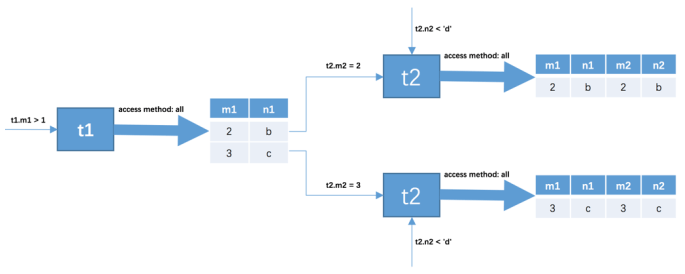

#### 1 连接简介

##### 1.1 连接的本质

创建表并插入一些数据.

```mysql
CREATE TABLE tt1 (m1 int, n1 char(1));
CREATE TABLE tt2 (m2 int, n2 char(1));
INSERT INTO tt1 VALUES(1, 'a'), (2, 'b'), (3, 'c');
INSERT INTO tt2 VALUES(2, 'b'), (3, 'c'), (4, 'd');
```

查询数据

```mysql
-- tt1
m1|n1|
--|--|
 1|a |
 2|b |
 3|c |
-- tt2
m2|n2|
--|--|
 2|b |
 3|c |
 4|d |
```

**连接 的本质就是把各个连接表中的记录都取出来依次匹配的组合加入结果集并返回给用户**。所以我们把 t1 和t2 两个表连接起来的过程如下图所示.


这个过程看起来就是把 t1 表的记录和 t2 的记录连起来组成新的更大的记录，所以这个查询过程称之为连接查询。连接查询的结果集中包含一个表中的每一条记录与另一个表中的每一条记录相互匹配的组合，像这样的结果集就可以称之为 **笛卡尔积**  。

上面的图是这个语句产生的： SELECT * FROM tt1, tt2;会产生9条记录  。

##### 1.2 连接过程简介 

如果我们乐意，我们可以连接任意数量张表，但是如果没有任何限制条件的话，这些表连接起来产生的 笛卡尔积 可能是非常巨大的。比方说3个100行记录的表连接起来产生的 笛卡尔积 就有 100×100×100=1000000 行数据！所以在连接的时候过滤掉特定记录组合是有必要的，在连接查询中的过滤条件可以分成两种：

- 涉及单表的条件

这种只设计单表的过滤条件我们之前都提到过一万遍了，我们之前也一直称为 **搜索条件** ，比如 t1.m1 > 1是只针对 t1 表的过滤条件 。

- 涉及两表的条件

这种过滤条件我们之前没见过，比如 t1.m1 = t2.m2 、 t1.n1 > t2.n2。比如下面的语句：

```mysql
SELECT * FROM t1, t2 WHERE t1.m1 > 1 AND t1.m1 = t2.m2 AND t2.n2 < 'd  
```

那么这个连接查询的大致执行过程如下：

1. 首先确定第一个需要查询的表，这个表称为**驱动表**。单表中执行搜索语句之前已经学过了，**从const、ref、ref_or_null、range、index、all这些执行方法中选取代价最小的去执行查询** 。此处假设使用 t1 作为驱动表，那么就需要到 t1表中找满足 t1.m1 > 1 的记录，因为表中的数据太少，我们也没在表上建立二级索引，所以此处查询 t1 表的访问方法就设定为 **all** 吧，也就是采用全表扫描的方式执行单表查询 。

   满足这个条件的记录有两条。(2, 'b'), (3, 'c')

2. 针对上一步骤中**从驱动表产生的结果集中的每一条记录，分别需要到 t2 表中查找匹配的记录，所谓 匹配的记录 ，指的是符合过滤条件的记录**。因为是根据 t1 表中的记录去找 t2 表中的记录，所以 t2 表也可以被称之为 **被驱动表** 。上一步骤从驱动表中得到了2条记录，所以需要查询2次 t2 表。此时涉及两个表的列的过滤条件 t1.m1 = t2.m2 就派上用场了。
   
   - 当 t1.m1 = 2 时，过滤条件 t1.m1 = t2.m2 就相当于 t2.m2 = 2 ，所以此时 t2 表相当于有了 t2.m2 =2 、 t2.n2 < 'd' 这两个过滤条件，然后到 t2 表中执行单表查询。
   - 当 t1.m1 = 3 时，过滤条件 t1.m1 = t2.m2 就相当于 t2.m2 = 3 ，所以此时 t2 表相当于有了 t2.m2 =3 、 t2.n2 < 'd' 这两个过滤条件，然后到 t2 表中执行单表查询 。

也就是说整个连接查询最后的结果只有两条符合过滤条件的记录：  

| m1   | n1   | m2   | n2   |
| ---- | ---- | ---- | ---- |
| 2    | b    | 2    | b    |
| 3    | c    | 3    | c    |

从上边两个步骤可以看出来，我们上边唠叨的**这个两表连接查询共需要查询1次 t1 表，2次 t2 表**。当然这是在特定的过滤条件下的结果，**如果我们把 t1.m1 > 1 这个条件去掉，那么从 t1 表中查出的记录就有3条，就需要查询3次 t2 表了**。也就是说在两表连接查询中，**驱动表只需要访问一次，被驱动表可能被访问多次**。  

##### 1.3 内连接和外连接 

```mysql
CREATE TABLE student (
number INT NOT NULL AUTO_INCREMENT COMMENT '学号',
name VARCHAR(5) COMMENT '姓名',
major VARCHAR(30) COMMENT '专业',
PRIMARY KEY (number)
) Engine=InnoDB CHARSET=utf8 COMMENT '学生信息表';

INSERT INTO student VALUES 
(20180101, '杜子腾', '软件学院'),
(20180102, '范统', '计算机科学与工程'),
(20180103, '史珍香', '计算机科学与工程');

CREATE TABLE score (
number INT COMMENT '学号',
subject VARCHAR(30) COMMENT '科目',
score TINYINT COMMENT '成绩',
PRIMARY KEY (number, score)
) Engine=InnoDB CHARSET=utf8 COMMENT '学生成绩表';

INSERT INTO score VALUES 
(20180101, '母猪的产后护理', 78),
(20180101, '论萨达姆的战争准备', 88),
(20180102, '论萨达姆的战争准备', 98),
(20180102, '母猪的产后护理', 100);
```

创建两个有现实意义的表，插入一些数据。查询学生的考试成绩：

`SELECT * FROM student, score WHERE student.number = score.number;  `结果如下：

| number   | name   | major            | number   | subject            | score |
| -------- | ------ | ---------------- | -------- | ------------------ | ----- |
| 20180101 | 杜子腾 | 软件学院         | 20180101 | 母猪的产后护理     | 78    |
| 20180101 | 杜子腾 | 软件学院         | 20180101 | 论萨达姆的战争准备 | 88    |
| 20180102 | 范统   | 计算机科学与工程 | 20180102 | 论萨达姆的战争准备 | 98    |
| 20180102 | 范统   | 计算机科学与工程 | 20180102 | 母猪的产后护理     | 100   |

**驱动表中的记录即使在被驱动表中没有匹配的记录，也仍然需要加入到结果集**。为了解决这个问题，就有了 **内连接 和 外连接** 的概念 。

- 对于 内连接 的两个表，驱动表中的记录在被驱动表中找不到匹配的记录，该记录不会加入到最后的结果集，我们上边提到的连接都是所谓的 内连接  。
- 对于 外连接 的两个表，驱动表中的记录即使在被驱动表中没有匹配的记录，也仍然需要加入到结果集 。
  - **左外连接**（选取左侧的表为驱动表）
  - **右外连接**（选取右侧的表为驱动表）

可是这样仍然存在问题，即使对于外连接来说，有时候我们也并不想把驱动表的全部记录都加入到最后的结果集。把过滤条件分为两种不就解决了这个问题了么，所以放在不同地方的过滤条件是有不同语义的： 

- **where** 子句中的过滤条件

  **WHERE 子句中的过滤条件就是我们平时见的那种，不论是内连接还是外连接，凡是不符合 WHERE 子句中的过滤条件的记录都不会被加入最后的结果集**。

- **ON** 子句中的过滤条件 

  **对于外连接的驱动表的记录来说，如果无法在被驱动表中找到匹配 ON 子句中的过滤条件的记录，那么该记录仍然会被加入到结果集中，对应的被驱动表记录的各个字段使用 NULL 值填充**。

需要注意的是，这个 **ON 子句是专门为外连接驱动表中的记录在被驱动表找不到匹配记录时应不应该把该记录加入结果集这个场景下提出的**，所以如果把 ON 子句放到内连接中， MySQL 会把它和 WHERE 子句一样对待，也就是说：**内连接中的WHERE子句和ON子句是等价的**。  

一般情况下，我们都把只涉及单表的过滤条件放到 WHERE 子句中，把涉及两表的过滤条件都放到 ON 子句中，我们也一般把放到 ON 子句中的过滤条件也称之为 **连接条件**。

###### 1.3.1 左连接的语法

`SELECT * FROM t1 LEFT [OUTER] JOIN t2 ON 连接条件 [WHERE 普通过滤条件];  ` 

需要注意的是，**对于左（外）连接和右（外）连接来说，必须使用 ON 子句来指出连接条件**。看下查询语句，需要把所有学生的成绩信息都查询出来，即使缺考的也需要。

```mysql
SELECT s1.number, s1.name, s2.subject, s2.score FROM student AS s1 LEFT JOIN score
AS s2 ON s1.number = s2.number;
```


从结果集中可以看出来，虽然 史珍香 并没有对应的成绩记录，但是由于采用的是连接类型为左（外）连接，所以仍然把她放到了结果集中，只不过在对应的成绩记录的各列使用 NULL 值填充而已。

###### 1.3.2 右外连接写法 

`SELECT * FROM t1 RIGHT [OUTER] JOIN t2 ON 连接条件 [WHERE 普通过滤条件];  `

###### 1.3.3 内连接写法

**内连接和外连接的根本区别就是在驱动表中的记录不符合 ON 子句中的连接条件时不会把该记录加入到最后的结果集**  。**由于在内连接中ON子句和WHERE子句是等价的，所以内连接中不要求强制写明ON子句**。

####   2 连接的原理 

MySQL 采用了什么样的算法来进行表与表之间的连接。

##### 2.1 嵌套循环连接（Nested-Loop Join）

我们上边已经大致介绍过 t1 表和 t2 表执行内连接查询的大致过程，我们温习一下：

- 步骤1：选取驱动表，使用与驱动表相关的过滤条件，选取代价最低的单表访问方法来执行对驱动表的单表查询。
- 步骤2：对上一步骤中查询驱动表得到的结果集中每一条记录，都分别到被驱动表中查找匹配的记录。  

如果有3个表进行连接的话，那么 步骤2 中得到的结果集就像是新的驱动表，然后第三个表就成为了被驱动表，重复上边过程，也就是 步骤2 中得到的结果集中的每一条记录都需要到 t3 表中找一找有没有匹配的记录。

这个过程就像是一个嵌套的循环，所以**这种驱动表只访问一次，但被驱动表却可能被多次访问，访问次数取决于对驱动表执行单表查询后的结果集中的记录条数的连接执行方式称之为 嵌套循环连接 （ Nested-Loop Join ）**，这是最简单，也是最笨拙的一种连接查询算法。 

##### 2.2 使用索引加快连接速度 

我们知道在 嵌套循环连接 的 步骤2 中可能需要访问多次被驱动表，如果访问被驱动表的方式都是全表扫描的话，那要扫描很多次，但是别忘了，查询 t2 表其实就相当于一次单表扫描，我们可以利用索引来加快查询速度。回到开始的例子：

`SELECT * FROM t1, t2 WHERE t1.m1 > 1 AND t1.m1 = t2.m2 AND t2.n2 < 'd `

这里使用的就是 嵌套循环连接。



可以看到，原来的 t1.m1 = t2.m2 这个涉及两个表的过滤条件在针对 t2 表做查询时关于 t1 表的条件就已经确定了，所以我们只需要单单优化对 t2 表的查询了，上述两个对 t2 表的查询语句中利用到的列是 m2 和 n2 列，我们可以

- 在 m2 列上建立索引，因为对 m2 列的操作是等值查找。比如 t2.m2 = 2 、 t2.m2 = 3 等，所以可能使用到ref 的访问方法，假设使用 ref 的访问方法去执行对 t2 表的查询的话，**需要回表之后再判断 t2.n2 < d 这个条件是否成立** 。

  我们知道在单表中使用主键值或者唯一二级索引列的值进行等值查找的方式称之为 const ，而设计 MySQL 的大叔把在**连接查询中对被驱动表使用主键值或者唯一二级索引列的值进行等值查找的查询执行方式称之为： eq_ref** 。 

- 在 n2 列上建立索引，涉及到的条件是 t2.n2 < 'd' ，可能用到 range 的访问方法，假设使用 range 的访问方法对 t2 表的查询的话，**需要回表之后再判断在 m2 列上的条件是否成立**。 

假设 m2 和 n2 列上都存在索引的话，那么就需要从这两个里边儿**挑一个代价更低的去执行对 t2 表的查询**。当然，**建立了索引不一定使用索引，只有在 二级索引 + 回表 的代价比全表扫描的代价更低时才会使用索引**。  

另外，**有时候连接查询的查询列表和过滤条件中可能只涉及被驱动表的部分列，而这些列都是某个索引的一部分，这种情况下即使不能使用 eq_ref 、 ref 、 ref_or_null 或者 range 这些访问方法执行对被驱动表的查询的话，也可以使用索引扫描**，也就是 index 的访问方法来查询被驱动表。所以我们建议在真实工作中最好不要使用 * 作为查询列表，最好把真实用到的列作为查询列表。

##### 2.3 基于块的嵌套循环连接（Block Nested-Loop Join）

扫描一个表的过程其实是先把这个表从磁盘上加载到内存中，然后从内存中比较匹配条件是否满足。现实生活中的表可不像 t1 、 t2 这种只有3条记录，成千上万条记录都是少的，几百万、几千万甚至几亿条记录的表到处都是。内存里可能并不能完全存放的下表中所有的记录，所以在扫描表前边记录的时候后边的记录可能还在磁盘上，等扫描到后边记录的时候可能内存不足，所以需要把前边的记录从内存中释放掉。

我们前面又说过，使用 **嵌套循环连接** 算法的两表连接过程中，被驱动表可是要访问很多次的，如果这个被驱动表中的数据特别多而且不能使用索引进行访问，那就相当于要从磁盘上读好几次这个表，这个 I/O 代价就非常大了。 所以我们要 **尽量减少访问被驱动表的次数  **。

######  连接查询和比较过程：

当被驱动表中的数据非常多时，每次访问被驱动表，被驱动表的记录会被加载到内存中，在内存中的每一条记录只会和驱动表结果集的一条记录做匹配，之后就会被从内存中清除掉。然后再从驱动表结果集中拿出另一条记录，再一次把被驱动表的记录加载到内存中一遍，周而复始，驱动表结果集中有多少条记录，就得把被驱动表从磁盘上加载到内存中多少次。

所以我们可不可以把被驱动表的记录加载到内存的时候，一次性和多条驱动表中的记录做匹配，这样就可以大大减少重复从磁盘上加载被驱动表的代价了。

所以，MySQL 提出了一个 **Join Buffer** 的概念，**join buffer 就是执行连接查询前申请的一块固定大小的内存，先把若干条驱动表结果集中的记录装在这个 join buffer 中，然后开始扫描被驱动表，每一条被驱动表的记录一次性和 join buffer 中的多条驱动表记录做匹配**，因为匹配的过程都是在内存中完成的，所以这样可以显著减少被驱动表的 I/O 代价。  

**注意这里是驱动表多条记录，被驱动表一条记录**。


最好的情况是 join buffer 足够大，能容纳驱动表结果集中的所有记录，这样只需要访问一次被驱动表就可以完成连接操作了。设计 MySQL 的大叔把这种**加入了 join buffer 的嵌套循环连接算法称之为 基于块的嵌套连接（Block Nested-Loop Join）算法**。

这个 join buffer 的大小是可以通过启动参数或者系统变量 **join_buffer_size** 进行配置，默认大小为 262144字节 （也就是 256KB ），最小可以设置为 128字节 。当然，对于优化被驱动表的查询来说，最好是为被驱动表加上效率高的索引，如果实在不能使用索引，并且自己的机器的内存也比较大可以尝试调大 join_buffer_size 的值来对连接查询进行优化。

另外需要注意的是，**驱动表的记录并不是所有列都会被放到 join buffer 中，只有查询列表中的列和过滤条件中的列才会被放到 join buffer 中**，所以再次提醒我们，**最好不要把 * 作为查询列表，只需要把我们关心的列放到查询列表就好了，这样还可以在 join buffer 中放置更多的记录**。  

