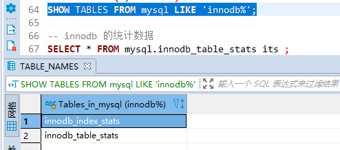
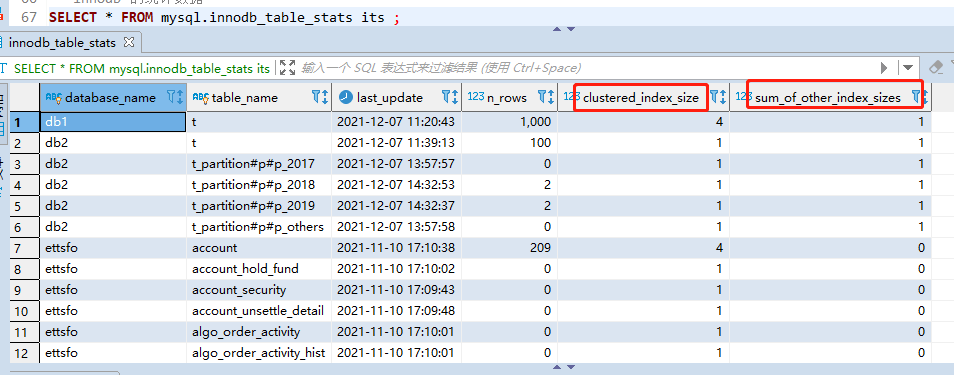

### 13 InnoDB统计数据

#### 1 两种不同的统计数据存储方式

 InnoDB 提供了两种存储统计数据的方式： 

- **永久性的统计数据**
  这种统计数据存储在磁盘上，也就是服务器重启之后这些统计数据还在。 
- **非永久性的统计数据**
  这种统计数据存储在内存中，当服务器关闭时这些这些统计数据就都被清除掉了，等到服务器重启之后，在 某些适当的场景下才会重新收集这些统计数据。

设计 MySQL 的大叔们给我们提供了系统变量 innodb_stats_persistent 来控制到底采用哪种方式去存储统计数 据。**在 MySQL 5.6.6 之前， innodb_stats_persistent 的值默认是 OFF ，也就是说 InnoDB 的统计数据默认是存 储到内存的，之后的版本中 innodb_stats_persistent 的值默认是 ON ，也就是统计数据默认被存储到磁盘中**。

不过 InnoDB 默认是以表为单位来收集和存储统计数据的，也就是说我们可以把某些表的统计数据（以及该表的 索引统计数据）存储在磁盘上，把另一些表的统计数据存储在内存中。怎么做到的呢？我们可以在创建和修改表 的时候通过指定 STATS_PERSISTENT 属性来指明该表的统计数据存储方式：

```mysql
CREATE TABLE 表名 (...) Engine=InnoDB, STATS_PERSISTENT = (1|0); 
ALTER TABLE 表名 Engine=InnoDB, STATS_PERSISTENT = (1|0);
```

**当 STATS_PERSISTENT=1 时，表明我们想把该表的统计数据永久的存储到磁盘上，当 STATS_PERSISTENT=0 时，表明我们想把该表的统计数据临时的存储到内存中**。**如果我们在创建表时未指定 STATS_PERSISTENT 属性，那默认采用系统变量 innodb_stats_persistent 的值作为该属性的值**。

#### 2 基于磁盘的永久性统计数据

当我们选择把某个表以及该表索引的统计数据存放到磁盘上时，实际上是把这些统计数据存储到了两个表里：



可以看到，这两个表都位于 mysql 系统数据库下边，其中

- innodb_table_stats 存储了关于表的统计数据，**每一条记录对应着一个表的统计数据**。 
- innodb_index_stats 存储了关于索引的统计数据，**每一条记录对应着一个索引的一个统计项的统计数据**。

##### 2.1 innodb_table_stats

注意这个表的主键是 (database_name,table_name) ，也就是**innodb_table_stats表的每条记录代表着一个表的统计信息**。



- clustered_index_size：**表的聚簇索引占用的页面数量**，估计值
- sum_of_other_index_sizes：**表的其他索引占用的页面数量**，估计值

- n_row：**表中记录的条数** ，这个记录是一个估计值。

注意**这个表的主键是 (database_name,table_name)** ，也就是**innodb_table_stats表的每条记录代表着一个表的统计信息**。