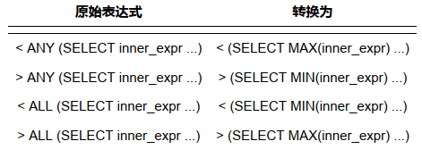

#### 1 条件化简

我们编写的查询语句的搜索条件本质上是一个表达式，这些表达式可能比较繁杂，或者不能高效的执行， MySQL的查询优化器会为我们简化这些表达式。为了方便大家理解，我们后边举例子的时候都使用诸如 a 、 b 、 c 之类的简单字母代表某个表的列名。

##### 1.1 移除不必要的括号

有时候表达式里有许多无用的括号，比如这样：  

`((a = 5 AND b = c) OR ((a > c) AND (c < 5)))  `

优化器会把用不上的括号给干掉，就是这样：

`(a = 5 AND b = c) OR (a > c AND c < 5)  `

##### 1.2 常量传递 

有时候某个表达式是某个列和某个常量做等值匹配，比如这样：  a = 5  

当这个表达式和其他涉及列 a 的表达式使用 AND 连接起来时，可以将其他表达式中的 a 的值替换为 5 ，比如这样 ：a = 5 AND b > a   就可以转换成 a=5 AND b >5;

##### 1.3 等值传递 

a = b and b = c and c = 5  可以简化为 a = 5 and b = 5 and c = 5  ；

##### 1.4 移除没用的条件 

对于一些明显永远为 TRUE 或者 FALSE 的表达式，优化器会移除掉它们，比如这个表达式：  

(a < 1 and b = b) OR (a = 6 OR 5 != 5)   很明显 b=b这个永远为 TRUE，5 != 5 这个表达式永远为 FALSE ，所以简化后的表达式就是这样的：(a < 1 and TRUE) OR (a = 6 OR FALSE)  ，继续简化为 a < 1 OR a = 6  。

##### 1.5 表达式计算 

在查询开始执行之前，如果表达式中只包含常量的话，它的值会被先计算出来，比如这个：

a=5+1 ，会被简化成 a=6。

但是这里需要注意的是，如果某个列并不是以单独的形式作为表达式的操作数时，比如出现在函数中，出现在某个更复杂表达式中，就像这样  ：

ABS(a) > 5，**优化器是不会尝试对这些表达式进行化简的**。所以如果可以的话，**最好让索引列以单独的形式出现在表达式中**  。

##### 1.6 HAVING 子句和WHERE 子句的合并 

如果查询语句中没有出现诸如 SUM 、 MAX 等等的聚集函数以及 GROUP BY 子句，优化器就把 HAVING 子句和WHERE 子句合并起来  。

##### 1.7 常量表检测 

- 查询的表中一条记录没有，或者只有一条记录  
- 使用主键等值匹配或者唯一二级索引列等值匹配作为搜索条件来查询某个表 。

设计 MySQL 的大叔觉得这两种查询花费的时间特别少，少到可以忽略，所以也把**通过这两种方式查询的表称之为 常量表 （英文名： constant tables ）**。**优化器在分析一个查询语句时，先首先执行常量表查询，然后把查询中涉及到该表的条件全部替换成常数，最后再分析其余表的查询成本**，比方说这个查询语句：
 `SELECT * FROM table1 INNER JOIN table2 ON table1.column1 = table2.column2 WHERE table1.primary_key = 1;  `

很明显，这个查询可以使用主键和常量值的等值匹配来查询 table1 表，也就是在这个查询中 table1 表相当于常量表 ，在分析对 table2 表的查询成本之前，就会执行对 table1 表的查询，并把查询中涉及 table1 表的条件都替换掉，也就是上边的语句会被转换成这样：  

`SELECT table1表记录的各个字段的常量值, table2.* FROM table1 INNER JOIN table2
ON table1表column1列的常量值 = table2.column2;  ` 

#### 2 外连接消除

我们前边说过， 内连接 的驱动表和被驱动表的位置可以相互转换，而 左（外）连接 和 右（外）连接 的驱动表和被驱动表是固定的。这就导致 内连接 可能通过优化表的连接顺序来降低整体的查询成本而 外连接 却无法优化表的连接顺序。

我们把这种**在外连接查询中，指定的 WHERE 子句中包含被驱动表中的列不为 NULL 值的条件称之为 空值拒绝（英文名： reject-NULL ）**。在被驱动表的WHERE子句符合空值拒绝的条件后，外连接和内连接可以相互转换。这种转换带来的好处就是查询优化器可以通过评估表的不同连接顺序的成本，选出成本最低的那种连接顺序来执行查询。  

`SELECT * FROM t1 LEFT JOIN t2 ON t1.m1 = t2.m2;  `

查询结果：

```mysql
+------+------+------+------+
| m1 | n1 | m2 | n2 |
+------+------+------+------+
| 2 | b | 2 | b |
| 3 | c | 3 | c |
| 1 | a | NULL | NULL |
+------+------+------+------+
```

优化：`SELECT * FROM t1 LEFT JOIN t2 ON t1.m1 = t2.m2 WHERE t2.n2 IS NOT NULL; ` 

或者指定一个不为null的值， `SELECT * FROM t1 LEFT JOIN t2 ON t1.m1 = t2.m2 WHERE t2.m2 = 2  `。也就等价于了：`SELECT * FROM t1 INNER JOIN t2 ON t1.m1 = t2.m2 WHERE t2.m2 = 2; `

```mysql
+------+------+------+------+
| m1 | n1 | m2 | n2 |
+------+------+------+------+
| 2 | b | 2 | b |
| 3 | c | 3 | c |
+------+------+------+------+
```

#### 3 子查询优化 

- select 语句中

  `SELECT (SELECT m1 FROM t1 LIMIT 1);  ` 第二个select语句

- from 语句中

  `SELECT m, n FROM (SELECT m2 + 1 AS m, n2 AS n FROM t2 WHERE m2 > 2) AS t;  ` 括号内的 select 语句。

- WHERE 或 ON 子句中

  `SELECT * FROM t1 WHERE m1 IN (SELECT m2 FROM t2); `

- ORDER BY 子句中

- GROUP BY 子句中

##### 3.1 子查询分类

###### 3.1.1 按返回的结果集区分子查询 

因为子查询本身也算是一个查询，所以可以按照它们返回的不同结果集类型而把这些子查询分为不同的类型 ：

- 标量子查询

  **那些只返回一个单一值的子查询称之为 标量子查询** ，比如这样：  

  SELECT (SELECT m1 FROM t1 LIMIT 1);  

  这个查询语句中的**子查询都返回一个单一的值，也就是一个 标量** 。这些**标量子查询可以作为一个单一值或者表达式的一部分出现在查询语句的各个地方**。  

- 行子查询

  顾名思义，**就是返回一条记录的子查询**，不过这条记录需要包含多个列 。

  SELECT * FROM t1 WHERE (m1, n1) = (SELECT m2, n2 FROM t2 LIMIT 1); 

- 列子查询

  列子查询自然就是查询出一个列的数据喽，不过这个列的数据需要包含多条记录。

  SELECT * FROM t1 WHERE m1 IN (SELECT m2 FROM t2); 

  其中的 (SELECT m2 FROM t2) 就是一个列子查询，表明查询出 t2 表的 m2 列的值作为外层查询 IN 语句的参数。   

- 表子查询 

  顾名思义，就是子查询的结果既包含很多条记录，又包含很多个列  

  SELECT * FROM t1 WHERE (m1, n1) IN (SELECT m2, n2 FROM t2);

  其中的 (SELECT m2, n2 FROM t2) 就是一个表子查询，这里需要和行子查询对比一下，行子查询中我们用了 LIMIT 1 来保证子查询的结果只有一条记录，表子查询中不需要这个限制。

###### 3.1.2 按与外层查询关系来区分子查询

- 不相关子查询

  **如果子查询可以单独运行出结果，而不依赖于外层查询的值，我们就可以把这个子查询称之为 不相关子查询** 。我们前边介绍的那些子查询全部都可以看作不相关子查询。

- 相关子查询

  **如果子查询的执行需要依赖于外层查询的值，我们就可以把这个子查询称之为 相关子查询**。

  SELECT * FROM t1 WHERE m1 IN (SELECT m2 FROM t2 WHERE n1 = n2);

  例子中的子查询是 (SELECT m2 FROM t2 WHERE n1 = n2) ，可是这个查询中有一个搜索条件是 n1 = n2 ，别忘了 n1 是表 t1 的列，也就是外层查询的列，也就是说子查询的执行需要依赖于外层查询的值，所以这个子查询就是一个 相关子查询。

###### 3.1.3 子查询在布尔表达式中的使用

- 使用 = 、 > 、 < 、 >= 、 <= 、 <> 、 != 、 <=> 作为布尔表达式的操作符

  SELECT * FROM t1 WHERE m1 < (SELECT MIN(m2) FROM t2);

  SELECT * FROM t1 WHERE (m1, n1) = (SELECT m2, n2 FROM t2 LIMIT 1);

- [NOT] IN/ANY/SOME/ALL子查询

  - SELECT * FROM t1 WHERE (m1, n2) **IN** (SELECT m2, n2 FROM t2);

  - SELECT * FROM t1 WHERE m1 > **ANY**(SELECT m2 FROM t2);

    这个查询的意思就是对于 t1 表的某条记录的 m1 列的值来说，如果子查询 (SELECT m2 FROM t2) 的结果集中存在一个小于 m1 列的值，那么整个布尔表达式的值就是 TRUE ，否则为 FALSE ，也就是说只要m1 列的值大于子查询结果集中最小的值，整个表达式的结果就是 TRUE ，所以上边的查询本质上等价于这个查询：

    SELECT * FROM t1 WHERE m1 > (SELECT MIN(m2) FROM t2);

  另外，**=ANY相当于判断子查询结果集中是否存在某个值和给定的操作数相等，它的含义和IN是相同的**。

  - SELECT * FROM t1 WHERE m1 > ALL(SELECT m2 FROM t2);

- EXISTS子查询（[NOT] EXISTS (子查询)）

  SELECT * FROM t1 WHERE EXISTS (SELECT 1 FROM t2);

  也就是说只要 (SELECT 1 FROM t2) 这个查询中有记录，那么整个 EXISTS 表达式的结果就为 TRUE。

###### 3.1.4 子查询语法注意事项

- 子查询必须用小括号扩起来。

- **在 SELECT 子句中的子查询必须是标量子查询**。

  如果子查询结果集中有多个列或者多个行，都不允许放在 SELECT 子句中，也就是查询列表中，比如这样就
  是非法的：
  mysql> SELECT (SELECT m1, n1 FROM t1); 

  ERROR 1241 (21000): Operand should contain 1 column(s)

- **对于 [NOT] IN/ANY/SOME/ALL 子查询来说，子查询中不允许有 LIMIT 语句**。

  比如这样是非法的：
   mysql> SELECT * FROM t1 WHERE m1 IN (SELECT * FROM t2 LIMIT 2); 

   ERROR 1235 (42000): This version of MySQL doesn't yet support 'LIMIT & IN/ALL/ANY/SOME subquery'

  **子查询中的这些语句也就是多余的了：ORDER BY 子句**

  - ORDER BY 子句
    子查询的结果其实就相当于一个集合，集合里的值排不排序一点儿都不重要，比如下边这个语句中的ORDER BY 子句简直就是画蛇添足：
    SELECT * FROM t1 WHERE m1 IN (SELECT m2 FROM t2 ORDER BY m2);

  - DISTINCT 语句
    集合里的值去不去重也没啥意义，比如这样：
    SELECT * FROM t1 WHERE m1 IN (SELECT DISTINCT m2 FROM t2);

  - 没有聚集函数以及 HAVING 子句的 GROUP BY 子句。
    在没有聚集函数以及 HAVING 子句时， GROUP BY 子句就是个摆设，比如这样：
    SELECT * FROM t1 WHERE m1 IN (SELECT m2 FROM t2 GROUP BY m2);

    对于这些冗余的语句，查询优化器在一开始就把它们给干掉了。

- 不允许在一条语句中增删改某个表的记录时同时还对该表进行子查询。

  比方说这样：
   mysql> DELETE FROM t1 WHERE m1 < (SELECT MAX(m1) FROM t1); 

   ERROR 1093 (HY000): You can't specify target table 't1' for update in FROM clause

##### 3.2 子查询在 MySQL 中是怎么执行的

还是之前的表 single_table

```mysql
CREATE TABLE single_table ( 
	id INT NOT NULL AUTO_INCREMENT, 
	key1 VARCHAR(100), 
	key2 INT, 
	key3 VARCHAR(100), 
	key_part1 VARCHAR(100), 
	key_part2 VARCHAR(100), 
	key_part3 VARCHAR(100), 
	common_field VARCHAR(100), 
	PRIMARY KEY (id), 
	KEY idx_key1 (key1), 
	UNIQUE KEY idx_key2 (key2), 
	KEY idx_key3 (key3), 
	KEY idx_key_part(key_part1, key_part2, key_part3) 
) Engine = InnoDB CHARSET = utf8;
-- 插入数据
CREATE PROCEDURE single_table_procedure()
BEGIN 
  declare i int;
  set i=1;
  while(i<=10000)do
    insert into single_table(key1,key2,key3,key_part1,key_part2,key_part3) 
    values(CONCAT("ab", i), i+1, CONCAT("bc",i), CONCAT("ab",CONCAT(i,"c")), CONCAT("bb", i+1), CONCAT("bc",CONCAT(i,"d")));
    set i=i+1;
  end while;
END;
```

###### 3.2.1 标量子查询、行子查询的执行方式

- SELECT 子句中，我们前边说过的在查询列表中的子查询必须是标量子查询。
- 子查询使用 = 、 > 、 < 、 >= 、 <= 、 <> 、 != 、 <=> 等操作符和某个操作数组成一个布尔表达式，这样的子查询必须是标量子查询或者行子查询。

SELECT * FROM s1  WHERE key1 = (SELECT common_field FROM s2 WHERE key3 = 'a' LIMIT 1);

**对于包含不相关的标量子查询或者行子查询的查询语句来说，MySQL会分别独立的执行外层查询和子查询，就当作两个单表查询就好了**。**先执行子查询，再执行外层查询**。

对于**相关**的标量子查询或者行子查询来说，比如下边这个查询：

SELECT * FROM s1 WHERE  key1 = (SELECT common_field FROM s2 WHERE s1.key3 = s2.key3 LIMIT 1);

它的执行方式就是这样的：

- 先从外层查询中获取一条记录，本例中也就是先从 s1 表中获取一条记录。
- 然后从上一步骤中获取的那条记录中找出子查询中涉及到的值，本例中就是从 s1 表中获取的那条记录中找出 s1.key3 列的值，然后执行子查询。
- 最后根据子查询的查询结果来检测外层查询 WHERE 子句的条件是否成立，如果成立，就把外层查询的那条记录加入到结果集，否则就丢弃。
- 再次执行第一步，获取第二条外层查询中的记录，依次类推。

###### 3.2.2 IN子查询优化

（后续再看这部分内容！！！）

###### 物化表的提出（不相关子查询）

对比如这样一条的不相关的 IN 子查询：

SELECT * FROM s1  WHERE key1 IN (SELECT common_field FROM s2 WHERE key3 = 'a');

如果子查询的结果集中的记录条数很少，那么把子查询和外层查询分别看成两个单独的单表查询效率还是蛮高的，但是如果单独执行子查询后的结果集太多的话，就会导致这些问题：

- 结果集太多，可能内存中都放不下。

- 对于外层查询来说，如果子查询的结果集太多，那就意味着 IN 子句中的参数特别多，这就导致：

  - 无法有效的使用索引，只能对外层查询进行全表扫描。

  - 在对外层查询执行全表扫描时，由于 IN 子句中的参数太多，这会导致检测一条记录是否符合和 IN 子句中的参数匹配花费的时间太长。

    > 比如 IN 子句种的参数只有2个：
    >
    > SELECT * FROM tbl_name WHERE column IN (a, b); 
    >
    > 这样相当于需要对 tbl_name 表中的每条记录判断一下它的 column 列是否符合 column = a OR column = b 。在 IN 子句中的参数比较少时这并不是什么问题，如果 IN 子句中的参数比较多时，比如这样：
    >
    > SELECT * FROM tbl_name WHERE column IN (a, b, c ..., ...);
    >
    > 那么这样每条记录需要判断一下它的 column 列是否符合 column = a OR column = b OR column = c OR ... ，这样性能耗费可就多了。

为了解决这个问题，**不直接将不相关子查询的结果集当作外层查询的参数，而是将该结果集写入一个临时表里**。写入临时表的过程是这样的：

- 该临时表的列就是子查询结果集中的列。

- 写入临时表的记录会被去重。

  我们说 IN 语句是判断某个操作数在不在某个集合中，集合中的值重不重复对整个 IN 语句的结果并没有啥子关系，所以我们在将结果集写入临时表时对记录进行去重可以让临时表变得更小。

- 一般情况下子查询结果集不会大的离谱，所以会为它建立**基于内存的使用 Memory 存储引擎的临时表**，而且**会为该表建立哈希索引**。

  IN语句的本质就是判断某个操作数在不在某个集合里，如果集合中的数据建立了哈希索引，那么这个匹配的过程就是超级快的。

如果子查询的结果集非常大，超过了系统变量 tmp_table_size 或者 max_heap_table_size ，临时表会转而使用基于磁盘的存储引擎来保存结果集中的记录，索引类型也对应转变为 B+ 树索引。

**这个将子查询结果集中的记录保存到临时表的过程称之为 物化 （英文名：Materialize ）**。为了方便起见，我们就把那个存储子查询结果集的临时表称之为 **物化表**。正因为物化表中的记录都建立了索引（基于内存的物化表有哈希索引，基于磁盘的有B+树索引），通过索引执行 IN 语句判断某个操作数在不在子查询结果集中变得非常快，从而提升了子查询语句的性能。

###### 物化表转连接

再重新看一下上面的查询语句：

SELECT * FROM s1  WHERE key1 IN (SELECT common_field FROM s2 WHERE key3 = 'a'); 

当我们把子查询进行物化之后，假设子查询物化表的名称为 materialized_table ，该物化表存储的子查询结果集的列为 m_val ，那么这个查询其实可以从下边两种角度来看待：

- 从表 s1 的角度来看待，整个查询的意思其实是：对于 s1 表中的每条记录来说，如果该记录的key1 列的值在子查询对应的物化表中，则该记录会被加入最终的结果集。画个图表示一下就是这样：

  

- 从子查询物化表的角度来看待，整个查询的意思其实是：对于子查询物化表的每个值来说，如果能在 s1 表中找到对应的 key1 列的值与该值相等的记录，那么就把这些记录加入到最终的结果集。画个图表示一下就是这样：

  

也就是说其实上边的查询就相当于表 s1 和子查询物化表 materialized_table 进行内连接：

SELECT s1.* FROM s1 INNER JOIN materialized_table ON key1 = m_val;

转化成内连接之后就有意思了，**查询优化器可以评估不同连接顺序需要的成本是多少，选取成本最低的那种查询方式执行查询**。我们分析一下上述查询中使用外层查询的表 s1 和物化表 materialized_table 进行内连接的成本都是由哪几部分组成的:

- 如果使用 s1 表作为驱动表的话，总查询成本由下边几个部分组成：
  - 物化子查询时需要的成本
  - 扫描 s1 表时的成本
  - s1表中的记录数量 × 通过 m_val = xxx 对 materialized_table 表进行单表访问的成本（我们前边说过物化表中的记录是不重复的，并且为物化表中的列建立了索引，所以这个步骤显然是非常快的）。
- 如果使用 materialized_table 表作为驱动表的话，总查询成本由下边几个部分组成：
  - 物化子查询时需要的成本
  - 扫描物化表时的成本
  - 物化表中的记录数量 × 通过 key1 = xxx 对 s1 表进行单表访问的成本（非常庆幸 key1 列上建立了索引，所以这个步骤是非常快的）。

MySQL 查询优化器会通过运算来选择上述成本更低的方案来执行查询。

###### 将子查询转换为 semi-join（半连接）

虽然将子查询进行物化之后再执行查询都会有建立临时表的成本，但是不管怎么说，我们见识到了将子查询转换为连接的强大作用，设计 MySQL 的大叔继续开脑洞：能不能不进行物化操作直接把子查询转换为连接呢？让我们重新审视一下上边的查询语句：

SELECT * FROM s1  WHERE key1 IN (SELECT common_field FROM s2 WHERE key3 = 'a'); 

我们可以把这个查询理解成：**对于 s1 表中的某条记录，如果我们能在 s2 表（准确的说是执行完 WHERE s2.key3 = 'a' 之后的结果集）中找到一条或多条记录，这些记录的 common_field 的值等于 s1 表记录的 key1 列的值，那么该条 s1 表的记录就会被加入到最终的结果集**。这个过程其实和把 s1 和 s2 两个表连接起来的效果很像：

SELECT s1.* FROM s1 INNER JOIN s2  ON s1.key1 = s2.common_field  WHERE s2.key3 = 'a';

只不过我们不能保证对于 s1 表的某条记录来说，在 s2 表（准确的说是执行完 WHERE s2.key3 = 'a' 之后的结果集）中有多少条记录满足 s1.key1 = s2.common_field 这个条件，不过我们可以分三种情况讨论：

- 情况一：对于 s1 表的某条记录来说， **s2 表中没有任何记录满足 s1.key1 = s2.common_field 这个条件**，那么该记录自然也不会加入到最后的结果集。
- 情况二：对于 s1 表的某条记录来说， **s2 表中有且只有记录满足 s1.key1 = s2.common_field 这个条件**，那么该记录会被加入最终的结果集。
- 情况三：对于 s1 表的某条记录来说， **s2 表中至少有2条记录满足 s1.key1 = s2.common_field 这个条件**，那么该记录会被多次加入最终的结果集。

对于 s1 表的某条记录来说，由于我们只关心 s2 表中是否存在记录满足 s1.key1 = s2.common_field 这个条件，而不关心具体有多少条记录与之匹配，又因为有 情况三 的存在，我们上边所说的 IN 子查询和两表连接之间并不完全等价。

###### 半连接

但是将子查询转换为连接又真的可以充分发挥优化器的作用，所以设计 MySQL 的大叔在这里提出了一个新概念 --- **半连接 （英文名： semi-join ）**。将 s1 表和 s2 表进行半连接的意思就是：**对于 s1 表的某条记录来说，我们只关心在 s2 表中是否存在与之匹配的记录是否存在，而不关心具体有多少条记录与之匹配，最终的结果集中只保留 s1 表的记录**。我们假设MySQL内部是这么改写上边的子查询的：

SELECT s1.* FROM s1 SEMI JOIN s2 ON s1.key1 = s2.common_field  WHERE key3 = 'a';

###### 实现半连接方法

- Table pullout （子查询中的表上拉）

  当子查询的查询列表处只有主键或者唯一索引列时，可以直接把子查询中的表 上拉 到外层查询的 FROM 子句中，并把子查询中的搜索条件合并到外层查询的搜索条件中，比如这个：

  SELECT * FROM s1  WHERE key2 IN (SELECT key2 FROM s2 WHERE key3 = 'a'); 

  由于 key2 列是 s2 表的唯一二级索引列，所以我们可以直接把 s2 表上拉到外层查询的 FROM 子句中，并且
  把子查询中的搜索条件合并到外层查询的搜索条件中，上拉之后的查询就是这样的：

  SELECT s1.* FROM s1 INNER JOIN s2 ON s1.key2 = s2.key2  WHERE s2.key3 = 'a';

  为啥当子查询的查询列表处只有主键或者唯一索引列时，就可以直接将子查询转换为连接查询呢？哎呀，主
  键或者唯一索引列中的数据本身就是不重复的嘛！所以对于同一条 s1 表中的记录，你不可能找到两条以上的符合 s1.key2 = s2.key2 的记录呀。

- DuplicateWeedout execution strategy （重复值消除）

  SELECT * FROM s1  WHERE key1 IN (SELECT common_field FROM s2 WHERE key3 = 'a'); 

  对于这个查询来说，转换为半连接查询后， s1 表中的某条记录可能在 s2 表中有多条匹配的记录，所以该条记录可能多次被添加到最后的结果集中，为了消除重复，我们可以建立一个临时表，比方说这个临时表长这样：

  ```mysql
  CREATE TABLE tmp ( 
       id PRIMARY KEY 
   );
  ```

  这样在执行连接查询的过程中，每当某条 s1 表中的记录要加入结果集时，就首先把这条记录的 id 值加入到这个临时表里，如果添加成功，说明之前这条 s1 表中的记录并没有加入最终的结果集，现在把该记录添加到最终的结果集；如果添加失败，说明这条之前这条 s1 表中的记录已经加入过最终的结果集，这里直接把它丢弃就好了，这种使用临时表消除 semi-join 结果集中的重复值的方式称之为 DuplicateWeedout。

- LooseScan execution strategy （松散索引扫描）

  SELECT * FROM s1  WHERE key3 IN (SELECT key1 FROM s2 WHERE key1 > 'a' AND key1 < 'b');

  在子查询中，对于 s2 表的访问可以使用到 key1 列的索引，而恰好子查询的查询列表处就是 key1 列，这样在将该查询转换为半连接查询后，如果将 s2 作为驱动表执行查询的话，那么执行过程就是这样：

  

  

  如图所示，在 s2 表的 idx_key1 索引中，值为 'aa' 的二级索引记录一共有3条，那么只需要取第一条的值到 s1 表中查找 s1.key3 = 'aa' 的记录，如果能在 s1 表中找到对应的记录，那么就把对应的记录加入到结果集。依此类推，其他值相同的二级索引记录，也只需要取第一条记录的值到 s1 表中找匹配的记录，这种虽然是扫描索引，但只取值相同的记录的第一条去做匹配操作的方式称之为 **松散索引扫描** 。

- Semi-join Materialization execution strategy

  我们之前介绍的先把外层查询的 IN 子句中的不相关子查询进行物化，然后再进行外层查询的表和物化表的连接本质上也算是一种 semi-join ，只不过由于物化表中没有重复的记录，所以可以直接将子查询转为连接查询。

- FirstMatch execution strategy （首次匹配）

  FirstMatch 是一种最原始的半连接执行方式，跟我们年少时认为的相关子查询的执行方式是一样一样的，就是说先取一条外层查询的中的记录，然后到子查询的表中寻找符合匹配条件的记录，如果能找到一条，则将该外层查询的记录放入最终的结果集并且停止查找更多匹配的记录，如果找不到则把该外层查询的记录丢弃掉；然后再开始取下一条外层查询中的记录，重复上边这个过程。

对于某些使用 IN 语句的相关子查询，比方这个查询：

SELECT * FROM s1 WHERE key1 IN (SELECT common_field FROM s2 WHERE s1.key3 = s2.key3);

它也可以很方便的转为半连接，转换后的语句类似这样：

SELECT s1.* FROM s1 SEMI JOIN s2  ON s1.key1 = s2.common_field AND s1.key3 = s2.key3;

然后就可以使用我们上边介绍过的 DuplicateWeedout 、 LooseScan 、 FirstMatch 等半连接执行策略来执行查询，当然，如果子查询的查询列表处只有主键或者唯一二级索引列，还可以直接使用 table pullout 的策略来执行查询，但是需要大家注意的是，**由于相关子查询并不是一个独立的查询，所以不能转换为物化表来执行查询**。

###### semi-join的适用条件

当然，并不是所有包含 IN 子查询的查询语句都可以转换为 semi-join ，只有形如这样的查询才可以被转换为 semi-join ：

SELECT ... FROM outer_tables  WHERE expr IN (SELECT ... FROM inner_tables ...) AND ... 

或者这样的形式也可以：

SELECT ... FROM outer_tables  WHERE (oe1, oe2, ...) IN (SELECT ie1, ie2, ... FROM inner_tables ...) AND ...

文字表示则是：

- 该子查询必须是和 IN 语句组成的布尔表达式，并且在外层查询的 WHERE 或者 ON 子句中出现。
- 外层查询也可以有其他的搜索条件，只不过和 IN 子查询的搜索条件必须使用 AND 连接起来。
- 该子查询必须是一个单一的查询，不能是由若干查询由 UNION 连接起来的形式。
- 该子查询不能包含 GROUP BY 或者 HAVING 语句或者聚集函数。

###### 不适用于semi-join的情况

对于一些不能将子查询转位 semi-join 的情况，典型的比如下边这几种：

- 外层查询的WHERE条件中有其他搜索条件与IN子查询组成的布尔表达式使用 OR 连接起来

  SELECT * FROM s1  WHERE key1 IN (SELECT common_field FROM s2 WHERE key3 = 'a') OR key2 > 100;

- 使用 NOT IN 而不是 IN 的情况

  SELECT * FROM s1  WHERE key1 NOT IN (SELECT common_field FROM s2 WHERE key3 = 'a');

- 在 SELECT 子句中的IN子查询的情况

  SELECT key1 IN (SELECT common_field FROM s2 WHERE key3 = 'a') FROM s1 ;

- 子查询中包含 GROUP BY 、 HAVING 或者聚集函数的情况

  SELECT * FROM s1  WHERE key2 IN (SELECT COUNT(*) FROM s2 GROUP BY key1);

- 子查询中包含 UNION 的情况

  SELECT * FROM s1 WHERE key1 IN ( 
       SELECT common_field FROM s2 WHERE key3 = 'a' 
       UNION 
       SELECT common_field FROM s2 WHERE key3 = 'b' 
   );

MySQL 仍然留了两手绝活来优化不能转为 semi-join 查询的子查询，那就是：

- 对于不相关子查询来说，可以尝试把它们物化之后再参与查询

  比如我们上边提到的这个查询：

  SELECT * FROM s1  WHERE key1 NOT IN (SELECT common_field FROM s2 WHERE key3 = 'a')

  先将子查询物化，然后再判断 key1 是否在物化表的结果集中可以加快查询执行的速度。

  > 请注意这里将子查询物化之后不能转为和外层查询的表的连接，只能是先扫描s1表，然后对s1表的某条记录来说，判断该记录的key1值在不在物化表中。

- 不管子查询是相关的还是不相关的，都可以把 IN 子查询尝试专为 EXISTS 子查询

  其实对于任意一个IN子查询来说，都可以被转为 EXISTS 子查询，通用的例子如下：

  outer_expr IN (SELECT inner_expr FROM ... WHERE subquery_where)

  可以被转换为：

  EXISTS (SELECT inner_expr FROM ... WHERE subquery_where AND outer_expr=inner_expr)

  当然这个过程中有一些特殊情况，比如在 outer_expr 或者 inner_expr 值为 NULL 的情况下就比较特殊。因
  为有 NULL 值作为操作数的表达式结果往往是 NULL ，比方说：

  ```mysql
  SELECT NULL IN (1, 2, 3);
   +-------------------+ 
   | NULL IN (1, 2, 3) | 
   +-------------------+ 
   |              NULL | 
   +-------------------+
   
   SELECT 1 IN (1, 2, 3); 
   +----------------+ 
   | 1 IN (1, 2, 3) | 
   +----------------+ 
   |              1 | 
   +----------------+
   
   SELECT NULL IN (NULL);
   +----------------+ 
   | NULL IN (NULL) | 
   +----------------+ 
   |           NULL | 
   +----------------+ 
  ```

  而 EXISTS 子查询的结果肯定是 TRUE 或者 FASLE ：

  ```mysql
  SELECT EXISTS (SELECT 1 FROM s1 WHERE NULL = 1); 
   +------------------------------------------+ 
   | EXISTS (SELECT 1 FROM s1 WHERE NULL = 1) | 
   +------------------------------------------+ 
   |                                        0 | 
   +------------------------------------------+
   
  SELECT EXISTS (SELECT 1 FROM s1 WHERE 1 = NULL); 
   +------------------------------------------+ 
   | EXISTS (SELECT 1 FROM s1 WHERE 1 = NULL) | 
   +------------------------------------------+ 
   |                                        0 | 
   +------------------------------------------+
   
  SELECT EXISTS (SELECT 1 FROM s1 WHERE NULL = NULL); 
   +---------------------------------------------+ 
   | EXISTS (SELECT 1 FROM s1 WHERE NULL = NULL) | 
   +---------------------------------------------+ 
   |                                           0 | 
   +---------------------------------------------+
  ```

  但是幸运的是，我们大部分使用 IN 子查询的场景是把它放在 WHERE 或者 ON 子句中，而 WHERE 或者 ON 子句是不区分 NULL 和 FALSE 的，比方说：

  ```mysql
  SELECT 1 FROM s1 WHERE NULL; 
  Empty set (0.00 sec) 
  ```

  所以只要我们的 IN 子查询是放在 WHERE 或者 ON 子句中的，那么 IN -> EXISTS 的转换就是没问题的。说了
  这么多，为啥要转换呢？这是因为不转换的话可能用不到索引，比方说下边这个查询：

  ```mysql
  SELECT * FROM s1 WHERE key1 IN (SELECT key3 FROM s2 where s1.common_field = s2.common_field) OR key2 > 1000;
  ```

  这个查询中的子查询是一个相关子查询，而且子查询执行的时候不能使用到索引，但是将它转为 EXISTS 子查询后却可以使用到索引：

  ```mysql
  SELECT * FROM s1  WHERE EXISTS (SELECT 1 FROM s2 where s1.common_field = s2.common_field AND s2.key3 = s1.key1)  OR key2 > 1000;
  ```

  转为 EXISTS 子查询时便可以使用到 s2 表的 idx_key3 索引了。

  需要注意的是，如果 IN 子查询不满足转换为 semi-join 的条件，又不能转换为物化表或者转换为物化表的成本太大，那么它就会被转换为 EXISTS 查询。

  > 在MySQL5.5以及之前的版本没有引进semi-join和物化的方式优化子查询时，优化器都会把IN子查询转换为EXISTS子查询，好多同学就惊呼我明明写的是一个不相关子查询，为啥要按照执行相关子查询的方式来执行呢？所以当时好多声音都是建议大家把子查询转为连接，不过随着MySQL的发展，最近的版本中引入了非常多的子查询优化策略，大家可以稍微放心的使用子查询了，内部的转换工作优化器会为大家自动实现。

##### 3.2.3 ANY/ALL 子查询优化

如果ANY/ALL子查询是不相关子查询的话，它们在很多场合都能转换成我们熟悉的方式去执行，比方说：



##### 3.2.5  [NOT] EXISTS子查询的执行

如果 [NOT] EXISTS 子查询是不相关子查询，可以先执行子查询，得出该 [NOT] EXISTS 子查询的结果是 TRUE 还是 FALSE ，并重写原先的查询语句，比如对这个查询来说：

```mysql
SELECT * FROM s1  WHERE EXISTS (SELECT 1 FROM s2 WHERE key1 = 'a')  OR key2 > 100;
```

因为这个语句里的子查询是不相关子查询，所以优化器会首先执行该子查询，假设该EXISTS子查询的结果为 TRUE ，那么接着优化器会重写查询为：

```mysql
SELECT * FROM s1 WHERE TRUE OR key2 > 100;
```

进一步简化后就变成了：

```mysql
SELECT * FROM s1 WHERE TRUE;
```

对于相关的 [NOT] EXISTS 子查询来说，比如这个查询：

```mysql
SELECT * FROM s1 WHERE EXISTS (SELECT 1 FROM s2 WHERE s1.common_field = s2.common_field);
```

很不幸，这个查询只能按照我们年少时的那种执行相关子查询的方式来执行。不过如果 [NOT] EXISTS 子查询中如果可以使用索引的话，那查询速度也会加快不少，比如：

```mysql
SELECT * FROM s1 WHERE EXISTS (SELECT 1 FROM s2 WHERE s1.common_field = s2.key1);
```

上边这个 EXISTS 子查询中可以使用 idx_key1 来加快查询速度。

##### 3.2.6  对于派生表的优化

我们前边说过把子查询放在外层查询的 FROM 子句后，那么这个子查询的结果相当于一个 派生表 ，比如下边这个查询：

```mysql
SELECT * FROM  ( 
    SELECT id AS d_id,  key3 AS d_key3 FROM s2 WHERE key1 = 'a' 
   ) AS derived_s1 WHERE d_key3 = 'a';
```

子查询 ( SELECT id AS d_id,  key3 AS d_key3 FROM s2 WHERE key1 = 'a') 的结果就相当于一个派生表，这个表的名称是 derived_s1 ，该表有两个列，分别是 d_id 和 d_key3。

对于含有 派生表 的查询， MySQL 提供了两种执行策略：

- 最容易想到的就是把派生表物化。

  我们可以将派生表的结果集写到一个内部的临时表中，然后就把这个物化表当作普通表一样参与查询。当然，在对派生表进行物化时，设计 MySQL 的大叔使用了一种称为 **延迟物化** 的策略，也就是在查询中真正使用到派生表时才回去尝试物化派生表，而不是还没开始执行查询呢就把派生表物化掉。比方说对于下边这个含有派生表的查询来说：

  ```mysql
  SELECT * FROM ( 
           SELECT * FROM s1 WHERE key1 = 'a' 
       ) AS derived_s1 INNER JOIN s2 
       ON derived_s1.key1 = s2.key1  WHERE s2.key2 = 1;
  ```

  如果采用物化派生表的方式来执行这个查询的话，那么执行时首先会到 s1 表中找出满足 s1.key2 = 1 的记录，如果压根儿找不到，说明参与连接的 s1 表记录就是空的，所以整个查询的结果集就是空的，所以也就没有必要去物化查询中的派生表了。

- 将派生表和外层的表合并，也就是将查询重写为没有派生表的形式。

  我们来看这个贼简单的包含派生表的查询：

  ```mysql
  SELECT * FROM (SELECT * FROM s1 WHERE key1 = 'a') AS derived_s1;
  ```

  这个查询本质上就是想查看 s1 表中满足 key1 = 'a' 条件的的全部记录，所以和下边这个语句是等价的：

  ```mysql
  SELECT * FROM s1 WHERE key1 = 'a';
  ```

  对于一些稍微复杂的包含派生表的语句，比如我们上边提到的那个：

  ```mysql
  SELECT * FROM ( 
           SELECT * FROM s1 WHERE key1 = 'a' 
       ) AS derived_s1 INNER JOIN s2 
       ON derived_s1.key1 = s2.key1 
       WHERE s2.key2 = 1;
  ```

  我们可以将派生表与外层查询的表合并，然后将派生表中的搜索条件放到外层查询的搜索条件中，就像这样：

  ```mysql
  SELECT * FROM s1 INNER JOIN s2  ON s1.key1 = s2.key1 WHERE s1.key1 = 'a' AND s2.key2 = 1;
  ```

  这样通过将外层查询和派生表合并的方式成功的消除了派生表，也就意味着我们没必要再付出创建和访问临时表的成本了。可是并不是所有带有派生表的查询都能被成功的和外层查询合并，当派生表中有这些语句就不可以和外层查询合并：
  
  - 聚集函数，比如MAX()、MIN()、SUM()啥的
  - DISTINCT
  - GROUP BY
  - HAVING
  - LIMIT
  - UNION 或者 UNION ALL
  - 派生表对应的子查询的 SELECT 子句中含有另一个子查询
  - ...
  
  所以 MySQL 在执行带有派生表的时候，优先尝试把派生表和外层查询合并掉，如果不行的话，再把派生表物化掉执行查询。