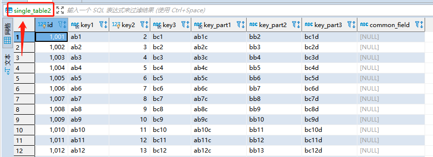
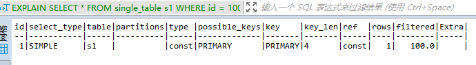

### 15、16 explain 详解

一条查询语句在经过 MySQL **查询优化器的各种基于成本和规则的优化会后**生成一个所谓的 **执行计划** ，这个执行计划展示了接下来具体执行查询的方式，比如多表连接的顺序是什么，对于每个表采用什么访问方法来具体执行查询等等。

我们可以使用 EXPLAIN 来查看具体的某个查询的执行计划。


每个列代表的信息：

| 列名          | 描述                                                       |
| ------------- | ---------------------------------------------------------- |
| id            | 在一个大的查询语句中每个SELECT 关键字都对应一个唯一的id    |
| select_type   | SELECT 关键字对应的那个查询的类型                          |
| table         | 表名                                                       |
| partitions    | 匹配的分区信息                                             |
| type          | 针对单表的访问方法                                         |
| possible_keys | 可能用到的索引                                             |
| key           | 实际上用上的索引                                           |
| key_len       | 实际使用到的索引长度                                       |
| ref           | 当使用索引列等值查询的时候，与索引列进行等值匹配的对象信息 |
| rows          | 预估的需要读取的记录数                                     |
| filtered      | 某个表经过搜索条件过滤后剩余记录条数百分比                 |
| extra         | 一些额外的信息                                             |

示例表

```mysql
CREATE TABLE single_table ( 
	id INT NOT NULL AUTO_INCREMENT, 
	key1 VARCHAR(100), 
	key2 INT, 
	key3 VARCHAR(100), 
	key_part1 VARCHAR(100), 
	key_part2 VARCHAR(100), 
	key_part3 VARCHAR(100), 
	common_field VARCHAR(100), 
	PRIMARY KEY (id), 
	KEY idx_key1 (key1), 
	UNIQUE KEY idx_key2 (key2), 
	KEY idx_key3 (key3), 
	KEY idx_key_part(key_part1, key_part2, key_part3) 
) Engine = InnoDB CHARSET = utf8;
```

还有一个表结构相同的表 single_table2，使用这两个表进行数据的查询。

使用sql进行数据插入

```mysql
INSERT INTO single_table2 SELECT * FROM single_table;
SELECT * FROM single_table2 st ;
```




可以使用以下执行计划进行数据的插入：

```mysql
DROP PROCEDURE single_table_procedure ;
CREATE PROCEDURE single_table_procedure()
BEGIN 
  declare i int;
  set i=1;
  while(i<=10000)do
    insert into single_table(key1,key2,key3,key_part1,key_part2,key_part3) 
    values(CONCAT("ab", i), i+1, CONCAT("bc",i), CONCAT("ab",CONCAT(i,"c")), CONCAT("bb", i+1), CONCAT("bc",CONCAT(i,"d")));
    set i=i+1;
  end while;
END;
```


### 输出的各列详解

#### table

不论我们的查询语句有多复杂，里边儿包含了多少个表，**到最后也是需要对每个表进行单表访问的**，所以设计MySQL 的大叔规定**EXPLAIN语句输出的每条记录都对应着某个单表的访问方法，该条记录的table列代表着该表的表名**。

```mysql
EXPLAIN SELECT * FROM single_table st ;
```
查询结果

| id   | select_type | table | partitions | type | possible_keys | key  | key_len | ref  | rows | filtered | Extra |      |
| ---- | ----------- | ----- | ---------- | ---- | ------------- | ---- | ------- | ---- | ---- | -------- | ----- | ---- |
| 1    | SIMPLE      | st    |            | ALL  |               |      |         |      | 9937 | 100.0    |       |      |

这个查询语句只涉及对 s1 表的单表查询，所以 EXPLAIN 输出中只有一条记录，其中的 table 列的值是 s1 ，表明这条记录是用来说明对 s1 表的单表访问方法的。

**连表查询**的例子

```mysql
EXPLAIN SELECT * FROM single_table s1 INNER JOIN single_table s2;
```

查询结果


可以看到这个连接查询的执行计划中有两条记录，这两条记录的 table 列分别是 s1 和 s2 ，这两条记录用来分别说明对 s1 表和 s2 表的访问方法是什么。

#### id

查询sql

```mysql
EXPLAIN SELECT * FROM single_table WHERE key1 IN (SELECT key1 FROM single_table2) OR key3 = 'a';
```


查询有多个select关键字的话，每出现一个 SELECT 关键字，MySQL就会为它分配一个唯一的id，比如上面的查询就有2个id。这个例子是包含子查询的查询语句。

对于连接查询来说，一个 SELECT 关键字后边的 FROM 子句中可以跟随多个表，**所以在连接查询的执行计划中，每个表都会对应一条记录，但是这些记录的id值都是相同的**。如上面table部分解释的连接查询是两个id为1的记录。


**在连接查询的执行计划中，每个表都会对应一条记录，这些记录的id列的值是相同的，出现在前边的表表示驱动表，出现在后边的表表示被驱动表**。所以从上边的 EXPLAIN 输出中我们可以看出，查询优化器准备让 s1 表作为驱动表，让 s2 表作为被驱动表来执行查询。

**查询优化器可能对涉及子查询的查询语句进行重写，从而转换为连接查询**。所以如果我们想知道查询优化器对某个包含子查询的语句是否进行了重写，直接查看执行计划就好了。

```mysql
EXPLAIN SELECT * FROM single_table WHERE key1 IN (SELECT key3 FROM single_table2 WHERE common_field='a');
```


可以看到，虽然我们的查询语句是一个子查询，但是执行计划中 s1 和 s2 表对应的记录的 id 值全部是 1 ，这就表明了查询优化器将子查询转换为了连接查询。

对于包含 UNION 子句的查询语句来说，每个 SELECT 关键字对应一个 id 值也是没错的，不过还是有点儿特别的东西，比方说下边这个查询：

```mysql
-- union 查询时，id字段，第三行数据table是 <union1,2>，是因为使用了临时表来去重
EXPLAIN SELECT * FROM single_table UNION SELECT * FROM single_table2;
```


跟 UNION 对比起来， UNION ALL 就不需要为最终的结果集进行去重，它只是单纯的把多个查询的结果集中的记录合并成一个并返回给用户，所以也就不需要使用临时表。所以在包含 UNION ALL 子句的查询的执行计划中，就没有那个 id 为 NULL 的记录，如下所示：

```mysql
-- union all，id则没有第三行记录
EXPLAIN SELECT * FROM single_table UNION ALL SELECT * FROM single_table2;
```


#### select_type

通过上边的内容我们知道，一条大的查询语句里边可以包含若干个 SELECT 关键字，每个 SELECT 关键字代表着一个小的查询语句，而每个 SELECT 关键字的 FROM 子句中都可以包含若干张表（这些表用来做连接查询），每一张表都对应着执行计划输出中的一条记录，对于在同一个 SELECT 关键字中的表来说，它们的 id 值是相同的。

##### SIMPLE

Simple SELECT (not using UNION or subqueries) 

**查询语句中不包含 UNION 或者子查询的查询都算作是 SIMPLE 类型**。

`EXPLAIN SELECT * FROM single_table st ;`

| id   | select_type | table | partitions | type | possible_keys | key  | key_len | ref  | rows | filtered | Extra |      |
| ---- | ----------- | ----- | ---------- | ---- | ------------- | ---- | ------- | ---- | ---- | -------- | ----- | ---- |
| 1    | SIMPLE      | st    |            | ALL  |               |      |         |      | 9937 | 100.0    |       |      |

##### PRIMARY

Outermost SELECT

对于包含 UNION 、 UNION ALL 或者子查询的大查询来说，它是由几个小查询组成的，其中最左边的那个查询的 select_type 值就是 PRIMARY

```mysql
-- union 查询时，id字段，第三行数据table是 <union1,2>，是因为使用了临时表来去重
EXPLAIN SELECT * FROM single_table UNION SELECT * FROM single_table2;
```


##### UNION

Second or later SELECT statement in a UNION

对于包含 UNION 或者 UNION ALL 的大查询来说，它是由几个小查询组成的，其中除了最左边的那个小查询以
外，其余的小查询的 select_type 值就是 UNION ，可以对比上一个例子的效果。

##### UNION RESULT

Result of a UNION

MySQL 选择使用临时表来完成 UNION 查询的去重工作，针对该临时表的查询的 select_type 就是 UNION 
RESULT ，例子上边有。

##### SUBQUERY

First SELECT in subquery

**如果包含子查询的查询语句不能够转为对应的 semi-join 的形式，并且该子查询是不相关子查询，并且查询优化器决定采用将该子查询物化的方案来执行该子查询时**，该子查询的第一个 SELECT 关键字代表的那个查询的 select_type 就是 SUBQUERY。 

```mysql
EXPLAIN SELECT * FROM single_table s1 WHERE key1 IN (SELECT key1 FROM single_table2 s2) OR key3 = 'a';
```


可以看到，外层查询的 select_type 就是 PRIMARY ，子查询的 select_type 就是 SUBQUERY 。需要大家注意的是，**由于select_type为SUBQUERY的子查询由于会被物化，所以只需要执行一遍**。

##### DEPENDENT SUBQUERY

First SELECT in subquery, dependent on outer query

**如果包含子查询的查询语句不能够转为对应的 semi-join 的形式**，并且该子查询是**相关子查询**，则该子查询的第一个 SELECT 关键字代表的那个查询的 select_type 就是 DEPENDENT SUBQUERY ，比如下边这个查询：

```mysql
EXPLAIN SELECT * FROM single_table s1 WHERE key1 IN (SELECT key1 FROM single_table2 s2 WHERE s1.key2 = s2.key2) OR key3 = 'a';
```


需要大家注意的是，**select_type为DEPENDENT SUBQUERY的查询可能会被执行多次**。

##### DEPENDENT UNION

Second or later SELECT statement in a UNION, dependent on outer query

**在包含 UNION 或者 UNION ALL 的大查询中，如果各个小查询都依赖于外层查询的话，那除了最左边的那个小查询之外，其余的小查询的 select_type 的值就是 DEPENDENT UNION** 。比方说下边这个查询：

```mysql
EXPLAIN SELECT * FROM single_table s1 WHERE key1 IN (SELECT key1 FROM single_table2 s2 WHERE key1 = 'a' UNION SELECT key1 FROM single_table s1 WHERE key1 = 'b'); 
```


大查询里包含了一个子查询，子查询里又是由 UNION 连起来的两个小查询。从执行计划中可以看出来， SELECT key1 FROM s2 WHERE key1 = 'a' 这个小查询由于是子查询中第一个查询，所以它的 select_type 是 DEPENDENT SUBQUERY ，而 SELECT key1 FROM s1 WHERE key1 = 'b' 这个查询的select_type 就是 DEPENDENT UNION。

##### DERIVED

Derived table

**对于采用物化的方式执行的包含派生表的查询**，该派生表对应的子查询的 select_type 就是 DERIVED ，比方说下边这个查询：

```mysql
EXPLAIN SELECT * FROM (SELECT key1, count(*) as c FROM single_table s1 GROUP BY key1) AS derived_s1 where c > 1;
```


从执行计划中可以看出， id 为 2 的记录就代表子查询的执行方式，它的 select_type 是 DERIVED ，说明该子查询是以物化的方式执行的。 id 为 1 的记录代表外层查询，大家注意看它的 table 列显示的是<derived2> ，表示该查询是针对将派生表物化之后的表进行查询的。

> 如果派生表可以通过和外层查询合并的方式执行的话，执行计划又是另一番景象，大家可以试试

##### MATERIALIZED

Materialized subquery

**当查询优化器在执行包含子查询的语句时，选择将子查询物化之后与外层查询进行连接查询时**，该子查询对应的 select_type 属性就是 MATERIALIZED ，比如下边这个查询：

```mysql
EXPLAIN SELECT * FROM single_table s1 WHERE key1 IN (SELECT key1 FROM single_table2 s2);
```


执行计划的第三条记录的 id 值为 2 ，说明该条记录对应的是一个单表查询，从它的 select_type 值为MATERIALIZED 可以看出，查询优化器是要把子查询先转换成物化表。然后看执行计划的前两条记录的 id 值都为 1 ，说明这两条记录对应的表进行连接查询，需要注意的是第二条记录的 table 列的值是<subquery2> ，说明该表其实就是 id 为 2 对应的子查询执行之后产生的物化表，然后将 s1 和该物化表进行连接查询。


##### UNCACHEABLE SUBQUERY

A subquery for which the result cannot be cached and must be re-evaluated for each row of the outer query

不常用

##### UNCACHEABLE UNION

The second or later select in a UNION that belongs to an uncacheable subquery (see UNCACHEABLE
SUBQUERY)

不常用

#### partitions

分区，一般情况下我们的查询语句的执行计划的 partitions 列的值都是 NULL 。

#### type

##### system

**当表中只有一条记录并且该表使用的存储引擎的统计数据是精确的**，比如MyISAM、Memory，那么对该表的访问方法就是 system 。

```mysql
CREATE TABLE t(i int) Engine=MyISAM;
INSERT INTO t VALUES(1); 
EXPLAIN SELECT * FROM t; 
```

可以将表改成使用InnoDB存储引擎，试试看执行计划的type列是什么。

##### const

**当我们根据主键或者唯一二级索引列与常数进行等值匹配时**，对单表的访问方法就是 const 。

`EXPLAIN SELECT * FROM single_table s1 WHERE id = 5; `

##### eq_ref

**在连接查询时，如果被驱动表是通过主键或者唯一二级索引列等值匹配的方式进行访问的**（如果该主键或者唯一二级索引是联合索引的话，所有的索引列都必须进行等值比较），则**对该被驱动表的访问方法就是eq_ref** ，比方说：

`EXPLAIN SELECT * FROM single_table s1 INNER JOIN single_table2 s2 ON s1.id = s2.id; `


从执行计划的结果中可以看出， MySQL 打算将 s1 作为驱动表， s2 作为被驱动表，重点关注 s2 的访问方法是 eq_ref ，表明在访问 s2 表的时候可以通过主键的等值匹配来进行访问。

##### ref

**当通过普通的二级索引列与常量进行等值匹配时来查询某个表，那么对该表的访问方法就可能是 ref**。

##### fulltext

##### ref_or_null

当对普通二级索引进行等值匹配查询，该索引列的值也可以是 NULL 值时，那么对该表的访问方法就可能是 ref_or_null：

```mysql
EXPLAIN SELECT * FROM single_table s1 WHERE key1 = 'a' OR key1 IS NULL;
```


##### index_merge

一般情况下对于某个表的查询只能使用到一个索引，但我们唠叨单表访问方法时特意强调了在某些场景下可以使用 Intersection 、 Union 、 Sort-Union 这三种索引合并的方式来执行查询。

```mysql
EXPLAIN SELECT * FROM single_table s1 WHERE key1 = 'a' OR key3 = 'a'; 
```


从执行计划的 type 列的值是 index_merge 就可以看出， MySQL 打算使用索引合并的方式来执行对 s1 表的查询。

##### unique_subquery

类似于两表连接中被驱动表的 eq_ref 访问方法， unique_subquery 是针对**在一些包含 IN 子查询的查询语句中，如果查询优化器决定将 IN 子查询转换为 EXISTS 子查询，而且子查询可以使用到主键进行等值匹配的话，那么该子查询执行计划的 type 列的值就是 unique_subquery** ，比如下边的这个查询语句：

```mysql
EXPLAIN SELECT * FROM single_table s1 WHERE key2 IN (SELECT id FROM single_table2 s2 where s1.key1 = s2.key1) OR key3 = 'a'; 
```


可以看到执行计划的第二条记录的 type 值就是 unique_subquery ，说明在执行子查询时会使用到 id 列的索引。

##### index_query

index_subquery 与 unique_subquery 类似，**只不过访问子查询中的表时使用的是普通的索引**，比如这样：

```mysql
EXPLAIN SELECT * FROM single_table s1 WHERE common_field IN (SELECT key3 FROM single_table2 s2 where s1.key1 = s2.key1) OR key3 = 'a'; 
```


我这里用的是ref的查询方法，有点不一样，和书上的。

##### range

**如果使用索引获取某些 范围区间 的记录，那么就可能使用到 range 访问方法**，比如下边的这个查询：

```mysql
EXPLAIN SELECT * FROM single_table s1 WHERE key1 IN ('a', 'b', 'c'); 
```


##### index

**当我们可以使用索引覆盖，但需要扫描全部的索引记录时，该表的访问方法就是 index** ，比如：

```mysql
EXPLAIN SELECT key_part2 FROM single_table s1 WHERE key_part3 = 'a'; 
```


##### all

全表扫描 `EXPLAIN SELECT * FROM s1; `

#### possible_keys和key

 possible_keys 列表示在某个查询语句中，对某个表执行单表查询时可能用到的索引有哪些， key 列表示实际用到的索引有哪些。


不过有一点比较特别，就是在使用 index 访问方法来查询某个表时， possible_keys 列是空的，而 key 列展示的是实际使用到的索引，比如这样：

```mysql
EXPLAIN SELECT key_part2 FROM single_table s1 WHERE key_part3 = 'a'; 
```


另外需要注意的一点是，**possible_keys列中的值并不是越多越好，可能使用的索引越多，查询优化器计算查询成本时就得花费更长时间，所以如果可以的话，尽量删除那些用不到的索引**。

#### key_len

key_len 列表示当优化器决定使用某个索引执行查询时，该索引记录的最大长度，它是由这三个部分构成的：

- 对于使用固定长度类型的索引列来说，它实际占用的存储空间的最大长度就是该固定值，对于指定字符集的变长类型的索引列来说，比如某个索引列的类型是 VARCHAR(100) ，使用的字符集是 utf8 ，那么该列实际占用的最大存储空间就是 100 × 3 = 300 个字节。
- 如果该索引列可以存储 NULL 值，则 key_len 比不可以存储 NULL 值时多1个字节。
- 对于变长字段来说，都会有2个字节的空间来存储该变长列的实际长度。

比如下边这个查询：

```mysql
EXPLAIN SELECT * FROM single_table s1 WHERE id = 1001; 
```



由于 id 列的类型是 INT ，并且不可以存储 NULL 值，所以在使用该列的索引时 key_len 大小就是 4 。当索引列可以存储 NULL 值时，比如：

```mysql
EXPLAIN SELECT * FROM single_table s1 WHERE key2 = 5; 
```


可以看到 key_len 列就变成了 5 ，比使用 id 列的索引时多了 1 。

对于可变长度的索引列来说，比如下边这个查询：

```mysql
EXPLAIN SELECT * FROM single_table s1 WHERE key1 = 'a'; 
```


由于 key1 列的类型是 VARCHAR(100) ，所以该列实际最多占用的存储空间就是 300 字节，又因为该列允许存储NULL 值，所以 key_len 需要加 1 ，又因为该列是可变长度列，所以 key_len 需要加 2 ，所以最后 ken_len 的值就是 303 。

有的同学可能有疑问：你在前边唠叨 InnoDB 行格式的时候不是说，存储变长字段的实际长度不是可能占用1个字节或者2个字节么？为什么现在不管三七二十一都用了 2 个字节？这里需要强调的一点是，执行计划的生成是在MySQL server 层中的功能，并不是针对具体某个存储引擎的功能，设计 MySQL 的大叔在执行计划中输出key_len 列主要是为了让我们区分某个使用联合索引的查询具体用了几个索引列，而不是为了准确的说明针对某个具体存储引擎存储变长字段的实际长度占用的空间到底是占用1个字节还是2个字节。比方说下边这个使用到联合索引 idx_key_part 的查询：

```mysql
EXPLAIN SELECT key_part1 ,key_part2 FROM single_table st WHERE key_part1 = "ab2c";
```


我们可以从执行计划的 key_len 列中看到值是 303 ，这意味着 MySQL 在执行上述查询中只能用到 idx_key_part索引的一个索引列，而下边这个查询：

```mysql
EXPLAIN SELECT * FROM single_table s1 WHERE key_part1 = 'a' AND key_part2 = 'b'; 
```


这个查询的执行计划的 ken_len 列的值是 606 ，说明执行这个查询的时候可以用到联合索引idx_key_part 的两个索引列。

#### ref

**当使用索引列等值匹配的条件去执行查询时，也就是在访问方法是 const 、 eq_ref 、 ref 、 ref_or_null 、unique_subquery 、 index_subquery 其中之一时， ref 列展示的就是与索引列作等值匹配的东东是个啥，比如只是一个常数或者是某个列**。大家看下边这个查询：

```mysql
EXPLAIN SELECT * FROM single_table s1 WHERE key1 = 'a'; 
```


连表查询的时候

```mysql
EXPLAIN SELECT * FROM single_table s1 INNER JOIN single_table2 s2 ON s1.id = s2.id;
```


可以看到对被驱动表 s2 的访问方法是 eq_ref ，而对应的 ref 列的值是 test.s1.id ，这说明在对被驱动表进行访问时会用到 PRIMARY 索引，也就是聚簇索引与一个列进行等值匹配的条件，于 s2 表的 id 作等值匹配的对象就是 test.s1.id 列（注意这里把数据库名也写出来了）

有的时候与索引列进行等值匹配的对象是一个函数，比方说下边这个查询：

```mysql
EXPLAIN SELECT * FROM single_table s1 INNER JOIN single_table2 s2 ON s2.key1 = UPPER(s1.key1); 
```


我们看执行计划的第二条记录，可以看到对 s2 表采用 ref 访问方法执行查询，然后在查询计划的 ref 列里输出的是 func ，说明与 s2 表的 key1 列进行等值匹配的对象是一个函数。

#### rows

如果查询优化器决定使用全表扫描的方式对某个表执行查询时，执行计划的 rows 列就代表预计需要扫描的行数，如果使用索引来执行查询时，执行计划的 rows 列就代表预计扫描的索引记录行数。比如上面的查询：

```mysql
EXPLAIN SELECT * FROM single_table s1 WHERE key1 > 'z'; 
```


我们看到执行计划的 rows 列的值是 1，这意味着查询优化器在经过分析使用 idx_key1 进行查询的成本之后，觉得满足 key1 > 'z' 这个条件的记录只有 1 条。

#### filtered

condition filtering 的概念，就是 MySQL 在计算驱动表扇出时采用的一个策略：

- **如果使用的是全表扫描的方式执行的单表查询，那么计算驱动表扇出时需要估计出满足搜索条件的记录到底有多少条**。
- **如果使用的是索引执行的单表扫描，那么计算驱动表扇出的时候需要估计出满足除使用到对应索引的搜索条件外的其他搜索条件的记录有多少条**。

```mysql
EXPLAIN SELECT * FROM single_table s1 WHERE key1 > 'z' AND common_field = 'a'; 
```


从执行计划的 key 列中可以看出来，该查询使用 idx_key1 索引来执行查询，从 rows 列可以看出满足 key1 > 'z' 的记录有 1 条。执行计划的 filtered 列就代表查询优化器预测在这 1 条记录中，有多少条记录满足其余的搜索条件，也就是 common_field = 'a' 这个条件的百分比。此处 filtered 列的值是 10.00 ，说明查询优化器预测在 1 条记录中有 10.00% 的记录满足 common_field = 'a' 这个条件。

对于单表查询来说，这个 filtered 列的值没什么意义，我们更关注在连接查询中驱动表对应的执行计划记录的filtered 值，比方说下边这个查询：

```mysql
EXPLAIN SELECT * FROM single_table s1 INNER JOIN single_table2 s2 ON s1.key1 = s2.key1 WHERE s1.common_field = 'a';
```


从执行计划中可以看出来，查询优化器打算把 s1 当作驱动表， s2 当作被驱动表。我们可以看到驱动表 s1 表的执行计划的 rows 列为 9937 ， filtered 列为 10.00 ，这意味着驱动表 s1 的扇出值就是 9937 × 10.00% = 993.7 ，这说明还要对被驱动表执行大约 993 次查询。

#### extra

##### No Table Used

当查询语句的没有 FROM 子句时将会提示该额外信息，比如：

```mysql
EXPLAIN SELECT 1;
```


##### Impossible Where

查询语句的 WHERE 子句永远为 FALSE 时将会提示该额外信息，比方说：

```mysql
EXPLAIN SELECT * FROM single_table st WHERE 1!=1;
```


##### No matching min/max row

当查询列表处有 MIN 或者 MAX 聚集函数，但是并没有符合 WHERE 子句中的搜索条件的记录时，将会提示该额外信息，比方说：

```mysql
EXPLAIN SELECT min(key1) FROM single_table st WHERE key1 = "ab";
```


##### Using index

**当我们的查询列表以及搜索条件中只包含属于某个索引的列，也就是在可以使用索引覆盖的情况下**，在Extra 列将会提示该额外信息。比方说下边这个查询中只需要用到 idx_key1 而不需要回表操作：

```mysql
-- using index: 当我们的查询列表以及搜索条件中只包含属于某个索引的列，也就是在可以使用索引覆盖的情况下
EXPLAIN SELECT key1 FROM single_table WHERE key1 = 'a';
```


或是

```mysql
-- 使用了 联合索引，不需要回表操作。
EXPLAIN SELECT key_part2 FROM single_table WHERE key_part1 ='ab1c';
```

##### Using index condition

有些搜索条件中虽然出现了索引列，但却不能使用到索引，比如下边这个查询：

```mysql
-- 使用 json 格式
EXPLAIN format=JSON SELECT * FROM single_table st WHERE key1 < 'ab1000' AND key1 LIKE '%ab%';
EXPLAIN SELECT * FROM single_table st WHERE key1 < 'ab1000' AND key1 LIKE '%ab%';
```


其中的 key1 < 'ab1000' 可以使用到索引，但是 key1 LIKE '%ab%' 却无法使用到索引，**在以前版本的 MySQL 中，是按照下边步骤来执行这个查询的**：

- 先根据 key1 < 'ab1000' 这个条件，从二级索引 idx_key1 中获取到对应的二级索引记录。

- 根据上一步骤得到的二级索引记录中的主键值进行回表，找到完整的用户记录再检测该记录是否符合key1 LIKE '%ab%' 这个条件，将符合条件的记录加入到最后的结果集。

  但是虽然 key1 LIKE '%ab%' 不能组成范围区间参与 range 访问方法的执行，但这个条件毕竟只涉及到了key1 列，所以设计 MySQL 的大叔把上边的步骤改进了一下：

  - 先根据 key1 < 'ab1000' 这个条件，定位到二级索引 idx_key1 中对应的二级索引记录。

  - 对于指定的二级索引记录，先不着急回表，而是先检测一下该记录是否满足 key1 LIKE '%ab%' 这个条件，如果这个条件不满足，则该二级索引记录压根儿就没必要回表。

  - 对于满足 key1 LIKE '%ab%' 这个条件的二级索引记录执行回表操作。

    我们说回表操作其实是一个随机 IO ，比较耗时，所以上述修改虽然只改进了一点点，但是可以省去好多回表操作的成本。设计 MySQL 的大叔们把他们的这个改进称之为 **索引条件下推 （英文名： Index Condition Pushdown ）**。
    如果在查询语句的执行过程中将要使用 索引条件下推 这个特性，在 Extra 列中将会显示 Using index condition ，比如上面的查询。

##### Using where

**当我们使用全表扫描来执行对某个表的查询，并且该语句的 WHERE 子句中有针对该表的搜索条件时，在Extra 列中会提示上述额外信息**。比如下边这个查询：

```mysql
EXPLAIN SELECT * FROM single_table s1 WHERE common_field = 'a'; 
```


当使用索引访问来执行对某个表的查询，并且该语句的 WHERE 子句中有除了该索引包含的列之外的其他搜索条件时，在 Extra 列中也会提示上述额外信息。比如下边这个查询虽然使用 idx_key1 索引执行查询，但是搜索条件中除了包含 key1 的搜索条件 key1 = 'a' ，还有包含 common_field 的搜索条件，所以 Extra 列会显示 Using where 的提示：

```mysql
EXPLAIN SELECT * FROM single_table s1 WHERE key1 = 'a' AND common_field = 'a';
```


##### Using join buffer(Block Nested Loop)

在连接查询执行过程中，当被驱动表不能有效的利用索引加快访问速度， MySQL 一般会为其分配一块名叫join buffer 的内存块来加快查询速度，也就是我们所讲的 基于块的嵌套循环算法 ，比如下边这个查询语句：

```mysql
EXPLAIN SELECT * FROM single_table s1 INNER JOIN single_table2 s2 ON s1.common_field = s2.common_field; 
```


可以在对 s2 表的执行计划的 Extra 列显示了两个提示：

- Using join buffer (Block Nested Loop) ：这是因为对表 s2 的访问不能有效利用索引，只好退而求
  其次，使用 join buffer 来减少对 s2 表的访问次数，从而提高性能。
- Using where ：可以看到查询语句中有一个 s1.common_field = s2.common_field 条件，因为 s1 是驱动表， s2 是被驱动表，所以在访问 s2 表时， s1.common_field 的值已经确定下来了，所以实际上查询 s2 表的条件就是 s2.common_field = 一个常数 ，所以提示了 Using where 额外信息。

用上索引的话则是这种

```mysql
EXPLAIN SELECT * FROM single_table s1 INNER JOIN single_table2 s2 ON s1.key1 = s2.key1;
```


##### Not exists

**当我们使用左（外）连接时，如果 WHERE 子句中包含要求被驱动表的某个列等于 NULL 值的搜索条件，而且那个列又是不允许存储 NULL 值的，那么在该表的执行计划的 Extra 列就会提示 Not exists 额外信息**，比如这样：

```mysql
EXPLAIN SELECT * FROM single_table s1 LEFT JOIN single_table2 s2 ON s1.key1 = s2.key1 WHERE s2.id IS NULL; 
```


上述查询中 s1 表是驱动表， s2 表是被驱动表， s2.id 列是不允许存储 NULL 值的，而 WHERE 子句中又包含 s2.id IS NULL 的搜索条件，这意味着必定是驱动表的记录在被驱动表中找不到匹配 ON 子句条件的记录才会把该驱动表的记录加入到最终的结果集，所以对于某条驱动表中的记录来说，如果能在被驱动表中找到1条符合 ON 子句条件的记录，那么该驱动表的记录就不会被加入到最终的结果集，也就是说我们**没有必要到被驱动表中找到全部符合ON子句条件的记录**，这样可以稍微节省一点性能。

##### Using intersect(...) 、 Using union(...) 和 Using sort_union(...)

如果执行计划的 Extra 列出现了 Using intersect(...) 提示，说明准备使用 Intersect 索引合并的方式执行查询，括号中的 ... 表示需要进行索引合并的索引名称；如果出现了 Using union(...) 提示，说明准备使用 Union 索引合并的方式执行查询；出现了 Using sort_union(...) 提示，说明准备使用 Sort-Union 索引合并的方式执行查询。

##### Zero limit

当我们的 LIMIT 子句的参数为 0 时，表示压根儿不打算从表中读出任何记录，将会提示该额外信息，比如这样：

```mysql
EXPLAIN SELECT * FROM single_table s1 LIMIT 0;
```

##### Using filesort

有一些情况下对结果集中的记录进行排序是可以使用到索引的，比如下边这个查询：

```mysql
-- 这个不需要排序，直接根据索引 idx_key1 取出来就可以
EXPLAIN SELECT * FROM single_table st ORDER BY key1 LIMIT 10;
```

但是很多情况下排序操作无法使用到索引，只能在内存中（记录较少的时候）或者磁盘中（记录较多的时候）进行排序，设计 MySQL 的大叔把这种在内存中或者磁盘上进行排序的方式统称为文件排序（英文名：filesort ）。**如果某个查询需要使用文件排序的方式执行查询**，就会在执行计划的 Extra 列中显示 Using filesort 提示，比如：

```mysql
EXPLAIN SELECT * FROM single_table st ORDER BY key_part2 LIMIT 10;
```


需要注意的是，如果查询中需要使用 filesort 的方式进行排序的记录非常多，那么这个过程是很耗费性能的，我们最好想办法将使用 文件排序 的执行方式改为使用索引进行排序

##### Using temporary

**在许多查询的执行过程中， MySQL 可能会借助临时表来完成一些功能，比如去重、排序之类的**，比如我们在执行许多包含 DISTINCT 、 GROUP BY 、 UNION 等子句的查询过程中，如果不能有效利用索引来完成查询，MySQL 很有可能寻求通过建立内部的临时表来执行查询。如果查询中使用到了内部的临时表，在执行计划的 Extra 列将会显示 Using temporary 提示，比方说这样：

```mysql
-- Using temporary 借助临时表完成去重、排序等操作
EXPLAIN extended SELECT DISTINCT common_field FROM single_table;
```


```mysql
EXPLAIN SELECT common_field, COUNT(*) AS amount FROM single_table s1 GROUP BY common_field; 
```

 MySQL 会在包含 GROUP BY子句的查询中默认添加上 ORDER BY 子句，也就是说上述查询其实和下边这个查询等价：

```mysql
EXPLAIN SELECT common_field, COUNT(*) AS amount FROM single_table s1 GROUP BY common_field ORDER BY common_field; 
```

如果我们不想为包含 group by 子句的查询进行排序，需要我们显示的写上 ORDER BY NULL。

另外，执行计划中出现 Using temporary 并不是一个好的征兆，因为建立与维护临时表要付出很大成本的，所以我们**最好能使用索引来替代掉使用临时表**，比方说下边这个包含 GROUP BY 子句的查询就不需要使用临时表：

```mysql
EXPLAIN SELECT key1, COUNT(*) AS amount FROM single_table s1 GROUP BY key1;
```


##### Start temporary, End temporary

查询优化器会优先尝试将 IN 子查询转换成 semi-join ，而 semi-join 又有好多种执行策略，当执行策略为 DuplicateWeedout 时，也就是通过建立临时表来实现为外层查询中的记录进行去重操作时，驱动表查询执行计划的 Extra 列将显示 Start temporary 提示，被驱动表查询执行计划的 Extra 列将显示 End temporary 提示，就是这样：

```mysql
EXPLAIN SELECT * FROM single_table s1 WHERE key1 IN (SELECT key3 FROM single_table2 s2 WHERE common_field = 'a'); 
```


但是我这里没有显示 Start temporary 和 End temporary。

##### LooseScan

在将 In 子查询转为 semi-join 时，如果采用的是 LooseScan 执行策略，则在驱动表执行计划的 Extra 列就是显示 LooseScan 提示，比如这样：

```mysql
EXPLAIN SELECT * FROM single_table s1 WHERE key3 IN (SELECT key1 FROM single_table2 s2 WHERE key1 >'z'); 
```


##### FirstMatch(tbl_name)

在将 In 子查询转为 semi-join 时，如果采用的是 FirstMatch 执行策略，则在被驱动表执行计划的 Extra列就是显示 FirstMatch(tbl_name) 提示，比如这样：

```mysql
EXPLAIN SELECT * FROM single_table s1 WHERE common_field IN (SELECT key1 FROM single_table2 s2 where s1.key3 = s2.key3); 
```


### Json 格式的执行计划

在EXPLAIN 单词和真正的查询语句中间加上FORMAT=JSON 。

```mysql
EXPLAIN FORMAT=JSON SELECT * FROM single_table s1 INNER JOIN single_table2 s2 ON s1.key1 = s2.key2 WHERE s1.common_field = 'a'
```

```json
{
  "query_block": {
    "select_id": 1,
    "cost_info": {
      "query_cost": "3276.84"
    },
    "nested_loop": [
      {
        "table": {
          "table_name": "s1",
          "access_type": "ALL",
          "possible_keys": [
            "idx_key1"
          ],
          "rows_examined_per_scan": 9937,
          "rows_produced_per_join": 993,
          "filtered": "10.00",
          "cost_info": {
            "read_cost": "1885.66",
            "eval_cost": "198.74",
            "prefix_cost": "2084.40",
            "data_read_per_join": "1M"
          },
          "used_columns": [
            "id",
            "key1",
            "key2",
            "key3",
            "key_part1",
            "key_part2",
            "key_part3",
            "common_field"
          ],
          "attached_condition": "((`test`.`s1`.`common_field` = 'a') and (`test`.`s1`.`key1` is not null))"
        }
      },
      {
        "table": {
          "table_name": "s2",
          "access_type": "ref",
          "possible_keys": [
            "idx_key2"
          ],
          "key": "idx_key2",
          "used_key_parts": [
            "key2"
          ],
          "key_length": "5",
          "ref": [
            "test.s1.key1"
          ],
          "rows_examined_per_scan": 1,
          "rows_produced_per_join": 993,
          "filtered": "100.00",
          "index_condition": "(`test`.`s1`.`key1` = `test`.`s2`.`key2`)",
          "cost_info": {
            "read_cost": "993.70",
            "eval_cost": "198.74",
            "prefix_cost": "3276.84",
            "data_read_per_join": "1M"
          },
          "used_columns": [
            "id",
            "key1",
            "key2",
            "key3",
            "key_part1",
            "key_part2",
            "key_part3",
            "common_field"
          ]
        }
      }
    ]
  }
}
```

### Extended Explain

在我们使用 EXPLAIN 语句查看了某个查询的执行计划后，紧接着还可以使用 SHOW WARNINGS 语句查看与这个查询的执行计划有关的一些扩展信息：

```mysql
EXPLAIN SELECT s1.key1, s2.key1 FROM single_table s1 LEFT JOIN single_table2 s2 ON s1.key1 = s2.key1 WHERE s2.common_field IS NOT NULL;
SHOW WARNINGS;
```


我这里warning没有信息，可惜。

我们最常见的就是 Code 为 1003 的信息，当 Code 值为 1003 时， Message 字段展示的信息**类似于**查询优化器将我们的查询语句重写后的语句。比如我们上边的查询本来是一个左（外）连接查询，但是有一个 s2.common_field IS NOT NULL的条件，着就会导致查询优化器把左（外）连接查询优化为内连接查询，从 SHOW WARNINGS 的 Message 字段也可以看出来，原本的 LEFT JOIN 已经变成了 JOIN 。

但是大家一定要注意，我们说 Message 字段展示的信息**类似于**查询优化器将我们的查询语句重写后的语句，并不是等价于，也就是说 Message 字段展示的信息并不是标准的查询语句，在很多情况下并不能直接拿到黑框框中运行，它只能作为帮助我们理解查 MySQL 将如何执行查询语句的一个参考依据而已。