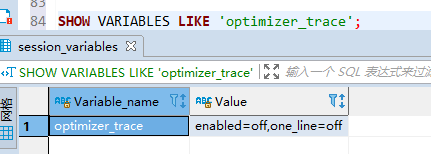
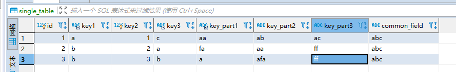
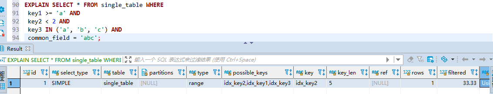

### optimizer trace表的神器功效

对于 MySQL 5.6 以及之前的版本来说，查询优化器就像是一个黑盒子一样，你只能通过 EXPLAIN 语句查看到最后优化器决定使用的执行计划，却无法知道它为什么做这个决策。

在 MySQL 5.6 以及之后的版本中，设计 MySQL 的大叔贴心的为这部分小伙伴提出了一个 optimizer trace 的功能，这个功能可以让我们方便的查看优化器生成执行计划的整个过程，这个功能的开启与关闭由系统变量optimizer_trace 决定，我们看一下：

`SHOW VARIABLES LIKE 'optimizer_trace';`



可以看到 enabled 值为 off ，表明这个功能默认是关闭的。

> one_line的值是控制输出格式的，如果为on那么所有输出都将在一行中展示，不适合人阅读,所以我们就保持其默认值为off吧

如果想打开这个功能，必须首先把 enabled 的值改为 on ，就像这样：

`SET optimizer_trace = 'enabled=on'`;

然后我们就可以输入我们想要查看优化过程的查询语句，当该查询语句执行完成后，就可以到information_schema 数据库下的 OPTIMIZER_TRACE 表中查看完整的优化过程。这个 OPTIMIZER_TRACE 表有4个列，分别是：

- QUERY ：表示我们的查询语句。
- TRACE ：表示优化过程的JSON格式文本。
- MISSING_BYTES_BEYOND_MAX_MEM_SIZE ：由于优化过程可能会输出很多，如果超过某个限制时，多余的文本将不会被显示，这个字段展示了被忽略的文本字节数
- INSUFFICIENT_PRIVILEGES ：表示是否没有权限查看优化过程，默认值是0，只有某些特殊情况下才会是1 ，我们暂时不关心这个字段的值。

步骤：

1. 打开optimizer trace功能 (默认情况下它是关闭的)

2. 这里输入你自己的查询语句

3. 从OPTIMIZER_TRACE表中查看上一个查询的优化过程

   `SELECT * FROM information_schema.OPTIMIZER_TRACE;`

4. 可能你还要观察其他语句执行的优化过程，重复上边的第2、3步

5. 当你停止查看语句的优化过程时，把optimizer trace功能关闭

   `SET optimizer_trace="enabled=off";`

现在我们有一个搜索条件比较多的查询语句，它的执行计划如下：所有记录如下：



执行计划：



查看具体的这条语句优化，最终选择了全表扫描，执行 query 语句，查看表 information_schema.OPTIMIZER_TRACE。

```mysql 
SELECT * FROM information_schema.OPTIMIZER_TRACE;
```

我这里是全表扫描，查询结果如下：

```tex
mysql> SELECT * FROM information_schema.OPTIMIZER_TRACE\G;
*************************** 1. row ***************************
 QUERY: SELECT * FROM test.single_table WHERE
 key1 >= 'a' AND
 key2 < 2 AND
 key3 IN ('a', 'b', 'c') AND
 common_field = 'abc'
 TRACE: {
  "steps": [
    {
      "join_preparation": { # prepare阶段
        "select#": 1,
        "steps": [
          {
            "IN_uses_bisection": true
          },
          {
            "expanded_query": "/* select#1 */ select `single_table`.`id` AS `id`,`single_table`.`key1` AS `key1`,`single_table`.`key2` AS `key2`,`single_table`.`key3` AS `key3`,`single_table`.`key_part1` AS `key_part1`,`single_table`.`key_part2` AS `key_part2`,`single_table`.`key_part3` AS `key_part3`,`single_table`.`common_field` AS `common_field` from `single_table` where ((`single_table`.`key1` >= 'a') and (`single_table`.`key2` < 2) and (`single_table`.`key3` in ('a','b','c')) and (`single_table`.`common_field` = 'abc'))"
          }
        ]
      }
    },
    {
      "join_optimization": { # optimize阶段
        "select#": 1,
        "steps": [
          {
            "condition_processing": {
              "condition": "WHERE",
              # 原始搜索条件
              "original_condition": "((`single_table`.`key1` >= 'a') and (`single_table`.`key2` < 2) and (`single_table`.`key3` in ('a','b','c')) and (`single_table`.`common_field` = 'abc'))",
              "steps": [
                {
                  "transformation": "equality_propagation",
                  # 等值传递转换
                  "resulting_condition": "((`single_table`.`key1` >= 'a') and (`single_table`.`key2` < 2) and (`single_table`.`key3` in ('a','b','c')) and (`single_table`.`common_field` = 'abc'))"
                },
                {
                  "transformation": "constant_propagation",
                  # 常量传递转换
                  "resulting_condition": "((`single_table`.`key1` >= 'a') and (`single_table`.`key2` < 2) and (`single_table`.`key3` in ('a','b','c')) and (`single_table`.`common_field` = 'abc'))"
                },
                {
                  "transformation": "trivial_condition_removal",
                  # 去除没用的条件
                  "resulting_condition": "((`single_table`.`key1` >= 'a') and (`single_table`.`key2` < 2) and (`single_table`.`key3` in ('a','b','c')) and (`single_table`.`common_field` = 'abc'))"
                }
              ]
            }
          },
          { # 替换虚拟生成列
            "substitute_generated_columns": {
            }
          },
          { # 表的依赖信息
            "table_dependencies": [
              {
                "table": "`single_table`",
                "row_may_be_null": false,
                "map_bit": 0,
                "depends_on_map_bits": [
                ]
              }
            ]
          },
          {
            "ref_optimizer_key_uses": [
            ]
          },
          { # 预估不同单表访问方法的访问成本
            "rows_estimation": [
              {
                "table": "`single_table`",
                "range_analysis": { 
                  "table_scan": { # 全表扫描的行数以及成本
                    "rows": 3,
                    "cost": 3.7
                  },
                  # 分析可能使用的索引
                  "potential_range_indexes": [
                    {
                      "index": "PRIMARY", # 主键不可用
                      "usable": false,
                      "cause": "not_applicable"
                    },
                    {
                      "index": "idx_key2",  # idx_key2可能被使用
                      "usable": true,
                      "key_parts": [
                        "key2"
                      ]
                    },
                    {
                      "index": "idx_key1", # idx_key1可能被使用
                      "usable": true,
                      "key_parts": [
                        "key1",
                        "id"
                      ]
                    },
                    {
                      "index": "idx_key3", # idx_key3可能被使用
                      "usable": true,
                      "key_parts": [
                        "key3",
                        "id"
                      ]
                    },
                    {
                      "index": "idx_key_part", # idx_keypart不可用
                      "usable": false,
                      "cause": "not_applicable"
                    }
                  ],
                  "setup_range_conditions": [
                  ],
                  "group_index_range": {
                    "chosen": false,
                    "cause": "not_group_by_or_distinct"
                  },
                  # 分析各种可能使用的索引的成本
                  "analyzing_range_alternatives": {
                    "range_scan_alternatives": [
                      {
                        "index": "idx_key2", # 使用idx_key2的成本分析
                        "ranges": [ # 使用idx_key2的范围区间
                          "NULL < key2 < 2"
                        ],
                        "index_dives_for_eq_ranges": true, # 是否使用index dive
                        "rowid_ordered": false, # 使用该索引获取的记录是否按照主键排序
                        "using_mrr": false, # 是否使用mrr
                        "index_only": false, # 是否是索引覆盖访问
                        "rows": 1, # 使用该索引获取的记录条数
                        "cost": 2.21, # 使用该索引的成本
                        "chosen": true # 是否选择该索引
                      },
                      { # 使用idx_key1的成本分析
                        "index": "idx_key1",
                        "ranges": [
                          "a <= key1"
                        ],
                        "index_dives_for_eq_ranges": true,
                        "rowid_ordered": false,
                        "using_mrr": false,
                        "index_only": false,
                        "rows": 3,
                        "cost": 4.61,
                        "chosen": false,
                        "cause": "cost" # 因为成本太大所以不选择该索引
                      },
                      { # 使用idx_key3的成本分析
                        "index": "idx_key3",
                        "ranges": [ # 使用idx_key3的范围区间
                          "a <= key3 <= a",
                          "b <= key3 <= b",
                          "c <= key3 <= c"
                        ],
                        "index_dives_for_eq_ranges": true,
                        "rowid_ordered": false,
                        "using_mrr": false,
                        "index_only": false,
                        "rows": 3,
                        "cost": 6.61,
                        "chosen": false,
                        "cause": "cost" # 因为成本太大所以不选择该索引
                      }
                    ], 
                    # 分析使用索引合并的成本
                    "analyzing_roworder_intersect": {
                      "usable": false,
                      "cause": "too_few_roworder_scans"
                    }
                  },
                  # 对于上述单表查询s1最优的访问方法
                  "chosen_range_access_summary": {
                    "range_access_plan": {
                      "type": "range_scan",
                      "index": "idx_key2",
                      "rows": 1,
                      "ranges": [
                        "NULL < key2 < 2"
                      ]
                    },
                    "rows_for_plan": 1,
                    "cost_for_plan": 2.21,
                    "chosen": true
                  }
                }
              }
            ]
          },
          {
          # 分析各种可能的执行计划
 #（对多表查询这可能有很多种不同的方案，单表查询的方案上边已经分析过了，直接选取idx_key2就好）
            "considered_execution_plans": [
              {
                "plan_prefix": [
                ],
                "table": "`single_table`",
                "best_access_path": {
                  "considered_access_paths": [
                    {
                      "rows_to_scan": 1,
                      "access_type": "range",
                      "range_details": {
                        "used_index": "idx_key2"
                      },
                      "resulting_rows": 1,
                      "cost": 2.41,
                      "chosen": true
                    }
                  ]
                },
                "condition_filtering_pct": 100,
                "rows_for_plan": 1,
                "cost_for_plan": 2.41,
                "chosen": true
              }
            ]
          },
          { # 尝试给查询添加一些其他的查询条件
            "attaching_conditions_to_tables": {
              "original_condition": "((`single_table`.`key1` >= 'a') and (`single_table`.`key2` < 2) and (`single_table`.`key3` in ('a','b','c')) and (`single_table`.`common_field` = 'abc'))",
              "attached_conditions_computation": [
              ],
              "attached_conditions_summary": [
                {
                  "table": "`single_table`",
                  "attached": "((`single_table`.`key1` >= 'a') and (`single_table`.`key2` < 2) and (`single_table`.`key3` in ('a','b','c')) and (`single_table`.`common_field` = 'abc'))"
                }
              ]
            }
          },
          { # 再稍稍的改进一下执行计划
            "refine_plan": [
              {
                "table": "`single_table`",
                "pushed_index_condition": "(`single_table`.`key2` < 2)",
                "table_condition_attached": "((`single_table`.`key1` >= 'a') and (`single_table`.`key3` in ('a','b','c')) and (`single_table`.`common_field` = 'abc'))"
              }
            ]
          }
        ]
      }
    },
    { # execute阶段
      "join_execution": {
        "select#": 1,
        "steps": [
        ]
      }
    }
  ]
}
# 因优化过程文本太多而丢弃的文本字节大小，值为0时表示并没有丢弃
MISSING_BYTES_BEYOND_MAX_MEM_SIZE: 0
# 权限字段
          INSUFFICIENT_PRIVILEGES: 0
1 row in set (0.00 sec)
```

优化过程大致分为了三个阶段：

- prepare 阶段
- optimize 阶段
- execute 阶段

我们所说的基于成本的优化主要集中在 optimize 阶段，**对于单表查询来说，我们主要关注 optimize 阶段的 "rows_estimation" 这个过程，这个过程深入分析了对单表查询的各种执行方案的成本**；

**对于多表连接查询来说，我们更多需要关注 "considered_execution_plans" 这个过程，这个过程里会写明各种不同的连接方式所对应的成本**。反正优化器最终会选择成本最低的那种方案来作为最终的执行计划，也就是我们使用 EXPLAIN 语句所展现出的那种方案。