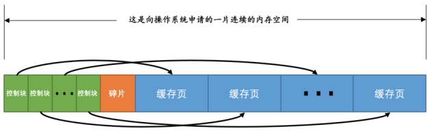
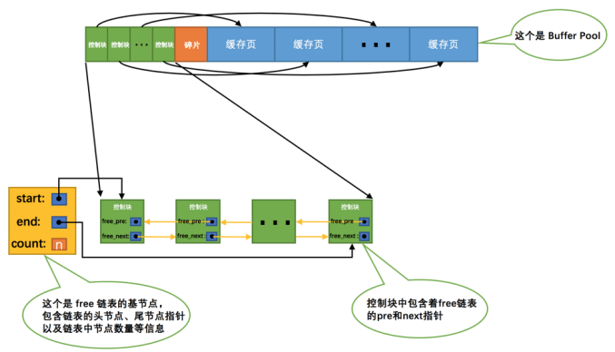
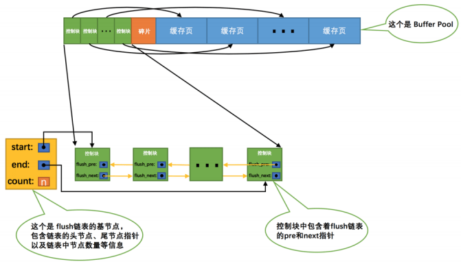
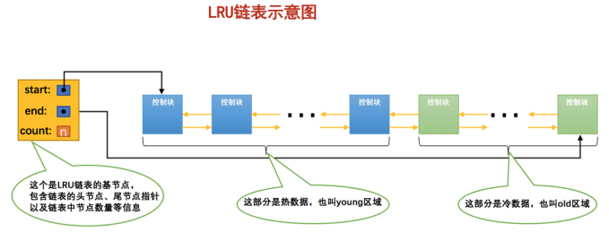
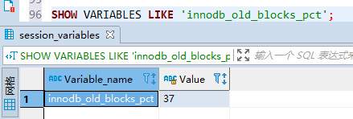
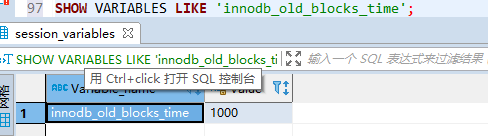
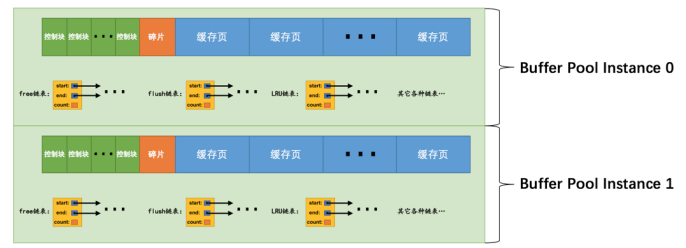
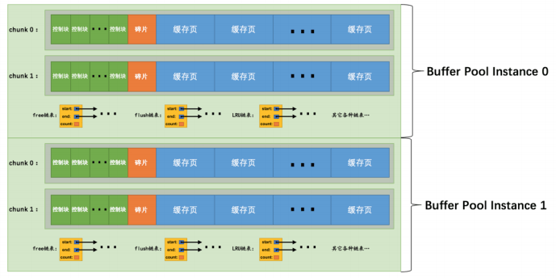
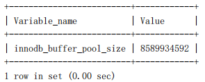

### 18 InnoDB 的Buffer

#### 1 缓存的重要性

对于使用 InnoDB 作为存储引擎的表来说，不管是用于存储用户数据的索引（包括聚簇索引和二级索引），还是各种系统数据，**都是以 页 的形式存放在 表空间 中的，而所谓的 表空间 只不过是InnoDB 对文件系统上一个或几个实际文件的抽象**，也就是说**我们的数据说到底还是存储在磁盘上的**。但是各位也都知道，磁盘的速度慢的跟乌龟一样，怎么能配得上“快如风，疾如电”的 CPU 呢？

所以，InnoDB 存储引擎在处理客户端请求的时候，当需要访问某个页的数据时，就会把完整的页的数据全部加载到内存中，也就是说**即使我们只需要访问一个页的一条记录，那也需要先把整个页的数据加载到内存中**。将整个页加载到内存中后就可以进行读写访问了，在进行完读写访问之后并不着急把该页对应的内存空间释放掉，而是将其 缓存起来这样将来有请求再次访问该页面时，就可以省去磁盘 IO 的开销了。

#### 2 InnoDB 的 Buffer Pool

##### 2.1 Buffer Pool 是什么？

设计 InnoDB 的大叔**为了缓存磁盘中的页，在 MySQL 服务器启动的时候就向操作系统申请了一片连续的内存**，他们给这片内存起了个名，叫做 **Buffer Pool （中文名是 缓冲池 ）**。**默认情况下 Buffer Pool 只有 128M 大小**。当然如果你嫌弃这个 128M 太大或者太小，可以在启动服务器的时候配置 innodb_buffer_pool_size 参数的值，它表示 Buffer Pool 的大小，就像这样：

> [server]
>
> innodb_buffer_pool_size = 268435456 单位：字节
>
> 其中， 268435456 的单位是字节，也就是我指定 Buffer Pool 的大小为 256M 。需要注意的是， Buffer Pool 也不能太小，最小值为 5M (当小于该值时会自动设置成 5M )。

注意：**是连续的内存**。

##### 2.2  Buffer Pool 的内部组成 

**Buffer Pool 中默认的缓存页大小和在磁盘上默认的页大小是一样的，都是 16KB** 。为了更好的管理这些在Buffer Pool 中的缓存页，设计 InnoDB 的大叔**为每一个缓存页都创建了一些所谓的 控制信息** ，这些**控制信息包括该页所属的表空间编号、页号、缓存页在 Buffer Pool 中的地址、链表节点信息、一些锁信息以及 LSN 信息**，当然还有一些别的控制信息。

每个缓存页对应的控制信息占用的内存大小是相同的，我们就把**每个页对应的控制信息占用的一块内存**称为一个**控制块** 吧，**控制块和缓存页是一一对应的**，**它们都被存放到 Buffer Pool 中，其中控制块被存放到 Buffer Pool的前边，缓存页被存放到 Buffer Pool 后边**，所以整个 Buffer Pool 对应的内存空间看起来就是这样的：



控制块和缓存页之间的那个 碎片 是个什么玩意儿？你想想啊，**每一个控制块都对应一个缓存页，那在分配足够多的控制块和缓存页后，可能剩余的那点儿空间不够一对控制块和缓存页的大小**，自然就用不到喽，这个用不到的那点儿内存空间就被称为 **碎片** 了。

当然，如果你把 Buffer Pool 的大小设置的刚刚好的话，也可能不会产生 碎片。

> 每个控制块大约占用缓存页大小的5%，在MySQL5.7.21这个版本中，每个控制块占用的大小是808字节。而我们设置的innodb_buffer_pool_size并不包含这部分控制块占用的内存空间大小，也就是说InnoDB在为Buffer Pool向操作系统申请连续的内存空间时，这片连续的内存空间一般会比innodb_buffer_pool_size的值大5%左右。

##### 2.3 free 链表的管理

当我们最初启动 MySQL 服务器的时候，需要完成对 Buffer Pool 的初始化过程，就是**先向操作系统申请 Buffer Pool 的内存空间，然后把它划分成若干对控制块和缓存页**。但是此时并没有真实的磁盘页被缓存到 Buffer Pool中，因为还没有用到，之后随着程序的运行，会不断的有磁盘中的页被缓存到 Buffer Pool 中。

那么问题来了，**从磁盘上读取一个页到 Buffer Pool 中的时候该放到哪个缓存页的位置呢**？或者说怎么区分 Buffer Pool 中哪些缓存页是空闲的，哪些已经被使用了呢？

**我们最好在某个地方记录一下Buffer Pool中哪些缓存页是可用的**，这个时候缓存页对应的 控制块 就派上大用场了，**我们可以把所有空闲的缓存页对应的控制块作为一个节点放到一个链表**中，这个链表也可以被称作 free链表 （或者说空闲链表）。**刚刚完成初始化的 Buffer Pool 中所有的缓存页都是空闲的，所以每一个缓存页对应的控制块都会被加入到 free链表 中**，假设该 Buffer Pool 中可容纳的缓存页数量为 n ，那增加了 free链表 的效果图就是这样的：



从图中可以看出，我们为了管理好这个 free链表 ，特意为这个链表定义了一个 **基节点** ，里边儿包含着链表的**头节点地址，尾节点地址，以及当前链表中节点的数量**等信息。这里需要注意的是，**链表的基节点占用的内存空间并不包含在为 Buffer Pool 申请的一大片连续内存空间之内，而是单独申请的一块内存空间**。

> 链表基节点占用的内存空间并不大，在MySQL5.7.21这个版本里，每个基节点只占用40字节大小。后边我们即将介绍许多不同的链表，它们的基节点和free链表的基节点的内存分配方式是一样一样的，都是单独申请的一块40字节大小的内存空间，并不包含在为Buffer Pool申请的一大片连续内存空间之内。

有了这个 free链表 之后事儿就好办了，**每当需要从磁盘中加载一个页到 Buffer Pool 中时，就从 free链表 中取一个空闲的缓存页，并且把该缓存页对应的 控制块 的信息填上**（该页所属的表空间编号、页号、缓存页在 Buffer Pool 中的地址、链表节点信息、一些锁信息以及 LSN 信息，然后**把该缓存页对应的 free链表 节点从链表中移除**，表示该缓存页已经被使用了。

##### 2.4 缓存页的哈希处理

我们前边说过，当我们需要访问某个页中的数据时，就会把该页从磁盘加载到 Buffer Pool 中，如果该页已经在 Buffer Pool 中的话直接使用就可以了。那么问题也就来了，**我们怎么知道该页在不在 Buffer Pool 中呢**？难不成需要依次遍历 Buffer Pool 中各个缓存页么？一个 Buffer Pool 中的缓存页这么多都遍历完岂不是要累死？

再回头想想，我们其实是根据 **表空间号 + 页号** 来定位一个页的，也就相当于 **表空间号 + 页号 是一个 key**，**缓存页 就是对应的 value** ，怎么通过一个 key 来快速找着一个 value 呢？哈哈，那肯定是哈希表喽～

所以我们可以用 表空间号 + 页号 作为 key ， 缓存页 作为 value 创建一个哈希表，在需要访问某个页的数据时，**先从哈希表中根据 表空间号 + 页号 看看有没有对应的缓存页，如果有，直接使用该缓存页就好；如果没有，那就从 free链表 中选一个空闲的缓存页，然后把磁盘中对应的页加载到该缓存页的位置**。

##### 2.5 flush 链表的管理

**如果我们修改了 Buffer Pool 中某个缓存页的数据，那它就和磁盘上的页不一致了，这样的缓存页也被称为 脏页 （英文名： dirty page ）**。

当然，最简单的做法就是每发生一次修改就立即同步到磁盘上对应的页上，但是频繁的往磁盘中写数据会严重的影响程序的性能。所以每次修改缓存页后，我们并不着急立即把修改同步到磁盘上，而是在未来的某个时间点进行同步，至于这个同步的时间点我们后边会作说明。

**但是如果不立即同步到磁盘的话，那之后再同步的时候我们怎么知道 Buffer Pool 中哪些页是 脏页 ，哪些页从来没被修改过呢**？

总不能把所有的缓存页都同步到磁盘上吧，假如 Buffer Pool 被设置的很大，比方说 300G ，那一次性同步这么多数据岂不是要慢死！所以，**我们不得不再创建一个存储脏页的链表**，**凡是修改过的缓存页对应的控制块都会作为一个节点加入到一个链表中，因为这个链表节点对应的缓存页都是需要被刷新到磁盘上的，所以也叫 flush链表**。

链表的构造和 free链表 差不多，假设某个时间点 Buffer Pool 中的脏页数量为 n ，那么对应的 flush链表 就长这样：



##### 2.6 LRU（Least Recently Used） 链表的管理

###### 2.6.1 缓存不够的窘境 

Buffer Pool 对应的内存大小毕竟是有限的，如果需要缓存的页占用的内存大小超过了 Buffer Pool 大小，**也就是 free链表 中已经没有多余的空闲缓存页的时候**岂不是很尴尬，发生了这样的事儿该咋办？

**当然是把某些旧的缓存页从 Buffer Pool 中移除，然后再把新的页放进来喽**～ 那么问题来了，移除哪些缓存页呢？

为了回答这个问题，我们还需要回到我们设立 Buffer Pool 的初衷，我们就是想减少和磁盘的 IO 交互，最好每次在访问某个页的时候它都已经被缓存到 Buffer Pool 中了。假设我们一共访问了 n 次页，那么**被访问的页已经在缓存中的次数除以 n 就是所谓的 缓存命中率** ，我们的期望就是让 缓存命中率 越高越好。

从这个角度出发，回想一下我们的微信聊天列表，排在前边的都是最近很频繁使用的，排在后边的自然就是最近很少使用的，假列表能容纳下的联系人有限，你是会把最近很频繁使用的留下还是最近很少使用的留下呢？废话，当然是留下最近很频繁使用的了～

###### 2.6.2 简单的 LRU 链表 

管理 Buffer Pool 的缓存页其实也是这个道理，当 Buffer Pool 中不再有空闲的缓存页时，**就需要淘汰掉部分最近很少使用的缓存页**。不过，我们怎么知道哪些缓存页最近频繁使用，哪些最近很少使用呢？呵呵，神奇的链表再一次派上了用场，我们可以再创建一个链表，**由于这个链表是为了 按照最近最少使用 的原则去淘汰缓存页的**，所以这个链表可以被称为 **LRU 链表（Least Recently Used）**。当我们需要访问某个页时，可以i这样处理 LRU 链表：

- **如果该页不在 Buffer Pool 中，在把该页从磁盘加载到 Buffer Pool 中的缓存页时，就把该缓存页对应的控制块 作为节点塞到链表的头部**。
- **如果该页已经缓存在 Buffer Pool 中，则直接把该页对应的 控制块移动到 LRU链表的头部**。

也就是说：**只要我们使用到某个缓存页，就把该缓存页调整到 LRU链表 的头部，这样 LRU链表 尾部就是最近最少使用的缓存页喽**（头部也就是最近使用的了），所以当 Buffer Pool 中的空闲缓存页使用完时，到 LRU链表 的尾部找些缓存页淘汰就OK啦。

###### 2.6.3 划区域的 LRU 链表

上边的这个简单的 LRU链表 用了没多长时间就发现问题了，因为存在这两种比较尴尬的情况：

- 情况一：**InnoDB 提供了一个看起来比较贴心的服务—— 预读 （英文名： read ahead ）**。**所谓 预读，就是 InnoDB 认为执行当前的请求可能之后会读取某些页面，就预先把它们加载到 Buffer Pool 中**。根据触发方式的不同，预读又可以细分为下边两种：

  - **线性预读**

    设计 InnoDB 的大叔提供了一个系统变量 **innodb_read_ahead_threshold** ，**如果顺序访问了某个区（ extent ）的页面超过这个系统变量的值，就会触发一次 异步 读取下一个区中全部的页面到 BufferPool 的请求**，注意 异步 读取意味着从磁盘中加载这些被预读的页面并不会影响到当前工作线程的正常执行。这个 innodb_read_ahead_threshold 系统变量的值默认是 56 ，我们可以在服务器启动时通过启动参数或者服务器运行过程中直接调整该系统变量的值，不过它是一个全局变量，注意使用 SET GLOBAL 命令来修改哦。

  - **随机预读**

    **如果 Buffer Pool 中已经缓存了某个区的13个连续的页面**，不论这些页面是不是顺序读取的，都会触发一次 异步 读取本区中所有其的页面到 Buffer Pool 的请求。设计 InnoDB 的大叔同时提供了**innodb_random_read_ahead** 系统变量，它的默认值为 OFF ，也就意味着 InnoDB 并不会默认开启随机预读的功能，如果我们想开启该功能，可以通过修改启动参数或者直接使用 SET GLOBAL 命令把该变量的值设置为 ON 。

  预读本来是个好事儿，如果预读到 Buffer Pool 中的页成功的被使用到，那就可以极大的提高语句执行的效率。可是如果用不到呢？这些预读的页都会放到 LRU 链表的头部，但是**如果此时 Buffer Pool 的容量不太大而且很多预读的页面都没有用到的话，这就会导致处在 LRU链表 尾部的一些缓存页会很快的被淘汰掉，也就是所谓的 劣币驱逐良币 ，会大大降低缓存命中率**。

- 情况二：有的小伙伴可能会写一些需要**扫描全表的查询语句**（比如没有建立合适的索引或者压根儿没有WHERE子句的查询）。扫描全表意味着什么？**意味着将访问到该表所在的所有页**！假设这个表中记录非常多的话，那该表会占用特别多的 页 ，当需要访问这些页时，会把它们统统都加载到 Buffer Pool 中，这也就意味着吧唧一下Buffer Pool 中的所有页都被换了一次血，其他查询语句在执行时又得执行一次从磁盘加载到 Buffer Pool的操作。而这种全表扫描的语句执行的频率也不高，每次执行都要把 Buffer Pool 中的缓存页换一次血，这严重的影响到其他查询对 Buffer Pool 的使用，从而大大降低了缓存命中率。

总结一下上边说的可能降低 Buffer Pool 的两种情况：

- **加载到 Buffer Pool 中的页不一定被用到**。
- **如果非常多的使用频率偏低的页被同时加载到 Buffer Pool 时，可能会把那些使用频率非常高的页从Buffer Pool 中淘汰掉**。

因为有这两种情况的存在，所以设计 InnoDB 的大叔把这个 LRU链表 按照一定比例分成两截，分别是:

- **一部分存储使用频率非常高的缓存页，所以这一部分链表也叫做热数据，或者称作 young 区域**。
- **另一部分存储使用频率不是很高的缓存页，所以这一部分链表也叫做 冷数据 ，或者称 old区域**。

  

大家要特别注意一个事儿：**我们是按照某个比例将LRU链表分成两半的，不是某些节点固定是young区域的，某些节点固定是old区域的，随着程序的运行，某个节点所属的区域也可能发生变化**。那这个划分成两截的比例怎么确定呢？对于 InnoDB 存储引擎来说，我们可以通过查看系统变量 innodb_old_blocks_pct 的值来确定 old 区域在 LRU链表 中所占的比例，比方说这样：

`SHOW VARIABLES LIKE 'innodb_old_blocks_pct';`



从结果可以看出来，**默认情况下， old 区域在 LRU链表 中所占的比例是 37% ，也就是说 old 区域大约占 LRU链表 的 3/8** 。这个比例我们是可以设置的，我们可以在启动时修改 innodb_old_blocks_pct 参数来控制 old 区域在 LRU链表 中所占的比例，比方说这样修改配置文件：

> [server]
>
> innodb_old_blocks_pct = 40

这样我们在启动服务器后， old 区域占 LRU链表 的比例就是 40% 。当然，如果在服务器运行期间，我们也可以修改这个系统变量的值，不过需要注意的是，**这个系统变量属于 全局变量 ，一经修改，会对所有客户端生效**，所以我们只能这样修改：

`SET GLOBAL innodb_old_blocks_pct = 40;`

有了这个被划分成 young 和 old 区域的 LRU 链表之后，设计 InnoDB 的大叔就可以针对我们上边提到的两种可能降低缓存命中率的情况进行优化了:

- **针对预读的页面可能不进行后续访问情况的优化**

  设计 InnoDB 的大叔规定，**当磁盘上的某个页面在初次加载到Buffer Pool中的某个缓存页时，该缓存页对应的控制块会被放到old区域的头部**。这样针对预读到 Buffer Pool 却不进行后续访问的页面就会被逐渐从old 区域逐出，而不会影响 young 区域中被使用比较频繁的缓存页。

- **针对全表扫描时，短时间内访问大量使用频率非常低的页面情况的优化**

  在进行全表扫描时，虽然首次被加载到 Buffer Pool 的页被放到了 old 区域的头部，但是后续会被马上访问到，每次进行访问的时候又会把该页放到 young 区域的头部，这样仍然会把那些使用频率比较高的页面给顶下去。

  有同学会想：可不可以在第一次访问该页面时不将其从 old 区域移动到 young 区域的头部，后续访问时再将其移动到 young 区域的头部。回答是：行不通！因为设计 InnoDB 的大叔规定**每次去页面中读取一条记录时，都算是访问一次页面，而一个页面中可能会包含很多条记录，也就是说读取完某个页面的记录就相当于访问了这个页面好多次**。

  咋办？全表扫描有一个特点，那就是它的执行频率非常低，谁也不会没事儿老在那写全表扫描的语句玩，而且在执行全表扫描的过程中，即使某个页面中有很多条记录，也就是去多次访问这个页面所花费的时间也非常少的。所以我们只需要规定，**在对某个处在 old 区域的缓存页进行第一次访问时就在它对应的控制块中记录下来这个访问时间，如果后续的访问时间与第一次访问的时间在某个时间间隔内，那么该页面就不会被从old区域移动到young区域的头部，否则将它移动到young区域的头部**。上述的这个间隔时间是由系统变量innodb_old_blocks_time 控制的，你看：`SHOW VARIABLES LIKE 'innodb_old_blocks_time';`

  

这个 innodb_old_blocks_time 的默认值是 1000 ，它的单位是毫秒，也就意味着对于从磁盘上被加载到LRU 链表的 old 区域的某个页来说，如果第一次和最后一次访问该页面的时间间隔小于 1s （很明显在一次全表扫描的过程中，多次访问一个页面中的时间不会超过 1s ），那么该页是不会被加入到 young 区域的～

当然，像 innodb_old_blocks_pct 一样，我们也可以在服务器启动或运行时设置 innodb_old_blocks_time 的值,如果我们把 innodb_old_blocks_time 的值设置为 0 ，那么每次我们访问一个页面时就会把该页面放到 young 区域的头部。

综上所述，正是因为将 LRU 链表划分为 young 和 old 区域这两个部分，又添加了 innodb_old_blocks_time 这个系统变量，才使得预读机制和全表扫描造成的缓存命中率降低的问题得到了遏制，因为用不到的预读页面以及全表扫描的页面都只会被放到 old 区域，而不影响 young 区域中的缓存页。

###### 2.6.4 更进一步优化 LRU 链表 

LRU链表 这就说完了么？没有，早着呢～ 对于 young 区域的缓存页来说，我们每次访问一个缓存页就要把它移动到 LRU链表 的头部，这样开销是不是太大啦，毕竟在 young 区域的缓存页都是热点数据，也就是可能被经常访问的，这样频繁的对 LRU链表 进行节点移动操作是不是不太好啊？是的，为了解决这个问题其实我们还可以提出一些优化策略，比如只有被访问的缓存页位于 young 区域的 1/4 的后边，才会被移动到 LRU链表 头部，这样就可以降低调整 LRU链表 的频率，从而提升性能（也就是说如果某个缓存页对应的节点在 young 区域的 1/4 中，再次访问该缓存页时也不会将其移动到 LRU 链表头部）。

最根本是：**尽量高效的提高 Buffer Pool 的缓存命中率**。

##### 2.7 其他的一些链表 

为了更好的管理 Buffer Pool 中的缓存页，除了我们上边提到的一些措施，设计 InnoDB 的大叔们还引进了其他的一些 链表 ，比如 unzip LRU链表 用于管理解压页， zip clean链表 用于管理没有被解压的压缩页， zipfree数组 中每一个元素都代表一个链表，它们组成所谓的 伙伴系统 来为压缩页提供内存空间等等，反正是为了更好的管理这个 Buffer Pool 引入了各种链表或其他数据结构。

##### 2.8 刷新脏页到磁盘 

后台有专门的线程每隔一段时间负责把脏页刷新到磁盘，这样可以不影响用户线程处理正常的请求。主要有两种刷新路径：

- **从 LRU 链表的冷数据中刷新一部分页面到磁盘**

  **后台线程会定时从 LRU链表 尾部开始扫描一些页面，扫描的页面数量可以通过系统变量innodb_lru_scan_depth 来指定，如果从里边儿发现脏页，会把它们刷新到磁盘。这种刷新页面的方式被称之为 BUF_FLUSH_LRU** 。

- **从 flush链表 中刷新一部分页面到磁盘**

  **后台线程也会定时从 flush链表 中刷新一部分页面到磁盘，刷新的速率取决于当时系统是不是很繁忙，这种刷新页面的方式被称之为 BUF_FLUSH_LIST**。

**有时候后台线程刷新脏页的进度比较慢，导致用户线程在准备加载一个磁盘页到 Buffer Pool 时没有可用的缓存页，这时就会尝试看看 LRU链表 尾部有没有可以直接释放掉的未修改页面，如果没有的话会不得不将 LRU链表 尾部的一个脏页同步刷新到磁盘**（和磁盘交互是很慢的，这会降低处理用户请求的速度）。这种刷新单个页面到磁盘中的刷新方式被称之为 BUF_FLUSH_SINGLE_PAGE 。

##### 2.9 多个 Buffer Pool 实例

我们上边说过， Buffer Pool 本质是 InnoDB 向操作系统申请的一块连续的内存空间，在多线程环境下，访问Buffer Pool 中的各种链表都需要加锁处理啥的，在 Buffer Pool 特别大而且多线程并发访问特别高的情况下，单一的 Buffer Pool 可能会影响请求的处理速度。所以**在 Buffer Pool 特别大的时候，我们可以把它们拆分成若干个小的 Buffer Pool ，每个 Buffer Pool 都称为一个 实例 ，它们都是独立的，独立的去申请内存空间，独立的管理各种链表**，独立的吧啦吧啦，**所以在多线程并发访问时并不会相互影响，从而提高并发处理能力**。我们可以在服务器启动的时候通过设置 innodb_buffer_pool_instances 的值来修改 Buffer Pool 实例的个数，比方说这样：

> [server]
>
> innodb_buffer_pool_instances = 2

这样就表明我们要创建2个 Buffer Pool 实例，示意图就是这样：



> 为了简便，我只把各个链表的基节点画出来了，大家应该心里清楚这些链表的节点其实就是每个缓存页
>
> 对应的控制块！

那每个 Buffer Pool 实例实际占多少内存空间呢？其实使用这个公式算出来的：

> innodb_buffer_pool_size/innodb_buffer_pool_instances

也就是总共的大小除以实例的个数，结果就是每个 Buffer Pool 实例占用的大小。

不过也不是说 Buffer Pool 实例创建的越多越好，分别管理各个 Buffer Pool 也是需要性能开销的，设计InnoDB 的大叔们规定：当innodb_buffer_pool_size的值小于1G的时候设置多个实例是无效的，InnoDB会默认把innodb_buffer_pool_instances 的值修改为1。而我们鼓励在 Buffer Pool 大小或等于1G的时候设置多个 Buffer Pool 实例。

##### 2.10 innodb_buffer_pool_chunk_size 

在 MySQL 5.7.5 之前， Buffer Pool 的大小只能在服务器启动时通过配置 innodb_buffer_pool_size 启动参数来调整大小，在服务器运行过程中是不允许调整该值的。不过设计 MySQL 的大叔在 5.7.5 以及之后的版本中支持了在服务器运行过程中调整 Buffer Pool 大小的功能，但是有一个问题，**就是每次当我们要重新调整 BufferPool 大小时，都需要重新向操作系统申请一块连续的内存空间，然后将旧的 Buffer Pool 中的内容复制到这一块新空间，这是极其耗时的**。所以设计 MySQL 的大叔们决定**不再一次性为某个 Buffer Pool 实例向操作系统申请一大片连续的内存空间，而是以一个所谓的 chunk 为单位向操作系统申请空间**。也就是说**一个 Buffer Pool 实例其实是由若干个 chunk 组成的，一个 chunk 就代表一片连续的内存空间，里边儿包含了若干缓存页与其对应的控制块**，画个图表示就是这样:



上图代表的 Buffer Pool 就是由2个实例组成的，每个实例中又包含2个 chunk。

正是因为发明了这个 chunk 的概念，我们在服务器运行期间调整 Buffer Pool 的大小时就是以 chunk 为单位增加或者删除内存空间，而不需要重新向操作系统申请一片大的内存，然后进行缓存页的复制。这个**所谓的 chunk的大小是我们在启动操作 MySQL 服务器时通过 innodb_buffer_pool_chunk_size 启动参数指定的，它的默认值是 134217728 ，也就是 128M** 。不过需要注意的是，i**nnodb_buffer_pool_chunk_size的值只能在服务器启动时指定，在服务器运行过程中是不可以修改的**。

> 为什么不允许在服务器运行过程中修改innodb_buffer_pool_chunk_size的值？还不是因为innodb_buffer_pool_chunk_size的值代表InnoDB向操作系统申请的一片连续的内存空间的大小，如果你在服务器运行过程中修改了该值，就意味着要重新向操作系统申请连续的内存空间并且将原先的缓存页和它们对应的控制块复制到这个新的内存空间中，这是十分耗时的操作！ 
>
> 另外，这个innodb_buffer_pool_chunk_size的值并不包含缓存页对应的控制块的内存空间大小，所以实际上InnoDB向操作系统申请连续内存空间时，每个chunk的大小要比innodb_buffer_pool_chunk_size的值大一些，约5%。

##### 2.11 配置 Buffer Pool 时的注意事项

- innodb_buffer_pool_size 必须是 innodb_buffer_pool_chunk_size × innodb_buffer_pool_instances 的倍数（这主要是想保证每一个 Buffer Pool 实例中包含的 chunk 数量相同）。

  **假设我们指定的 innodb_buffer_pool_chunk_size 的值是 128M ， innodb_buffer_pool_instances 的值是16 ，那么这两个值的乘积就是 2G** ，也就是说 innodb_buffer_pool_size 的值必须是 2G 或者 2G 的整数倍。比方说我们在启动 MySQL 服务器是这样指定启动参数的：

  >  mysqld --innodb-buffer-pool-size=8G --innodb-buffer-pool-instances=16
  >
  > innodb_buffer_pool_size 的值是 8G ，符合规定，所以在服务器启动完成之后我们查看一下该变量的值就是我们指定的 8G （8589934592字节）
  >
  >  show variables like 'innodb_buffer_pool_size';
  >
  > 

  如果我们指定的 innodb_buffer_pool_size 大于 2G 并且不是 2G 的整数倍，那么服务器会自动的把innodb_buffer_pool_size 的值调整为 2G 的整数倍

- 如果在服务器启动时， innodb_buffer_pool_chunk_size × innodb_buffer_pool_instances 的值已经大于 innodb_buffer_pool_size 的值，那么 innodb_buffer_pool_chunk_size 的值会被服务器自动设置为innodb_buffer_pool_size/innodb_buffer_pool_instances 的值。

比方说我们在启动服务器时指定的 innodb_buffer_pool_size 的值为 2G ，innodb_buffer_pool_instances 的值为16， innodb_buffer_pool_chunk_size 的值为 256M ：

>  mysqld --innodb-buffer-pool-size=2G --innodb-buffer-pool-instances=16 --innodb-buffer-pool-chunk-size=256M
>
> 由于 256M × 16 = 4G ，而 4G > 2G ，所以 innodb_buffer_pool_chunk_size 值会被服务器改写为innodb_buffer_pool_size/innodb_buffer_pool_instances 的值，也就是： 2G/16 = 128M 

##### 2.12 Buffer Pool 中存储的其他信息 

##### 2.13 查看Buffer Pool 的状态信息 

设计 MySQL 的大叔贴心的给我们提供了 SHOW ENGINE INNODB STATUS 语句来查看关于 InnoDB 存储引擎运行过程中的一些状态信息，其中就包括 Buffer Pool 的一些信息；

```sql

=====================================
2022-01-19 11:28:26 0x3f6c INNODB MONITOR OUTPUT
=====================================
Per second averages calculated from the last 55 seconds
-----------------
BACKGROUND THREAD
-----------------
srv_master_thread loops: 64 srv_active, 0 srv_shutdown, 559033 srv_idle
srv_master_thread log flush and writes: 559093
----------
SEMAPHORES
----------
OS WAIT ARRAY INFO: reservation count 79
OS WAIT ARRAY INFO: signal count 75
RW-shared spins 0, rounds 164, OS waits 72
RW-excl spins 0, rounds 9, OS waits 0
RW-sx spins 0, rounds 0, OS waits 0
Spin rounds per wait: 164.00 RW-shared, 9.00 RW-excl, 0.00 RW-sx
------------
TRANSACTIONS
------------
Trx id counter 10935104
Purge done for trx's n:o < 10935103 undo n:o < 0 state: running but idle
History list length 0
LIST OF TRANSACTIONS FOR EACH SESSION:
---TRANSACTION 283248511125296, not started
0 lock struct(s), heap size 1136, 0 row lock(s)
--------
FILE I/O
--------
I/O thread 0 state: wait Windows aio (insert buffer thread)
I/O thread 1 state: wait Windows aio (log thread)
I/O thread 2 state: wait Windows aio (read thread)
I/O thread 3 state: wait Windows aio (read thread)
I/O thread 4 state: wait Windows aio (read thread)
I/O thread 5 state: wait Windows aio (read thread)
I/O thread 6 state: wait Windows aio (write thread)
I/O thread 7 state: wait Windows aio (write thread)
I/O thread 8 state: wait Windows aio (write thread)
I/O thread 9 state: wait Windows aio (write thread)
Pending normal aio reads: [0, 0, 0, 0] , aio writes: [0, 0, 0, 0] ,
 ibuf aio reads:, log i/o's:, sync i/o's:
Pending flushes (fsync) log: 0; buffer pool: 0
1737 OS file reads, 866 OS file writes, 157 OS fsyncs
0.00 reads/s, 0 avg bytes/read, 0.00 writes/s, 0.00 fsyncs/s
-------------------------------------
INSERT BUFFER AND ADAPTIVE HASH INDEX
-------------------------------------
Ibuf: size 1, free list len 0, seg size 2, 0 merges
merged operations:
 insert 0, delete mark 0, delete 0
discarded operations:
 insert 0, delete mark 0, delete 0
Hash table size 34679, node heap has 2 buffer(s)
Hash table size 34679, node heap has 0 buffer(s)
Hash table size 34679, node heap has 0 buffer(s)
Hash table size 34679, node heap has 0 buffer(s)
Hash table size 34679, node heap has 0 buffer(s)
Hash table size 34679, node heap has 0 buffer(s)
Hash table size 34679, node heap has 0 buffer(s)
Hash table size 34679, node heap has 2 buffer(s)
0.00 hash searches/s, 0.00 non-hash searches/s
---
LOG
---
Log sequence number 5061141108
Log flushed up to   5061141108
Pages flushed up to 5061141108
Last checkpoint at  5061141099
0 pending log flushes, 0 pending chkp writes
88 log i/o's done, 0.00 log i/o's/second
----------------------
BUFFER POOL AND MEMORY
----------------------
# 代表 Buffer Pool 向操作系统申请的连续内存空间大小，包括全部控制块、缓存页、以及碎片的大小
Total large memory allocated 137297920 

# 为数据字典信息分配的内存空间大小，注意这个内存空间和 Buffer Pool 没啥关系，不包括在 Total memory allocated 中
Dictionary memory allocated 236901 

# 代表该 Buffer Pool 可以容纳多少缓存 页 ，注意，单位是 页 ！
Buffer pool size   8192
# 代表当前 Buffer Pool 还有多少空闲缓存页，也就是 free链表 中还有多少个节点。
Free buffers       6399
# 代表 LRU 链表中的页的数量，包含 young 和 old 两个区域的节点数量
Database pages     1789
# 代表 LRU 链表 old 区域的节点数量。
Old database pages 676
# 代表脏页数量，也就是 flush链表 中节点的数量
Modified db pages  0
# 正在等待从磁盘上加载到 Buffer Pool 中的页面数量。当准备从磁盘中加载某个页面时，会先为这个页面在 Buffer Pool 中分配一个缓存页以及它对应的控制块，然后把这个控制块添加到 LRU 的 old 区域的头部，但是这个时候真正的磁盘页并没有被加载进来， Pending reads 的值会跟着加1。
Pending reads      0
# 即将从 LRU 链表中刷新到磁盘中的页面数量,即将从 flush 链表中刷新到磁盘中的页面数量,即将以单个页面的形式刷新到磁盘中的页面数量
Pending writes: LRU 0, flush list 0, single page 0 
Pages made young 0, not young 0
0.00 youngs/s, 0.00 non-youngs/s
Pages read 1702, created 87, written 732
0.00 reads/s, 0.00 creates/s, 0.00 writes/s
No buffer pool page gets since the last printout
Pages read ahead 0.00/s, evicted without access 0.00/s, Random read ahead 0.00/s
LRU len: 1789, unzip_LRU len: 0
I/O sum[0]:cur[0], unzip sum[0]:cur[0]
--------------
ROW OPERATIONS
--------------
0 queries inside InnoDB, 0 queries in queue
0 read views open inside InnoDB
Process ID=5152, Main thread ID=6552, state: sleeping
Number of rows inserted 1487, updated 2, deleted 0, read 1012891
0.00 inserts/s, 0.00 updates/s, 0.00 deletes/s, 0.00 reads/s
----------------------------
END OF INNODB MONITOR OUTPUT
============================

```

- Pages made young ：代表 LRU 链表中曾经从 old 区域移动到 young 区域头部的节点数量。

这里需要注意，一个节点每次只有从 old 区域移动到 young 区域头部时才会将 Pages made young 的值加1，也就是说如果该节点本来就在 young 区域，由于它符合在 young 区域1/4后边的要求，下一次访问这个页面时也会将它移动到 young 区域头部，但这个过程并不会导致 Pages made young 的值加1。

- Page made not young ：在将 innodb_old_blocks_time 设置的值大于0时，首次访问或者后续访问某个处在 old 区域的节点时由于不符合时间间隔的限制而不能将其移动到 young 区域头部时， Page made notyoung 的值会加1。

这里需要注意，对于处在 young 区域的节点，如果由于它在 young 区域的1/4处而导致它没有被移动到young 区域头部，这样的访问并不会将 Page made not young 的值加1。

- youngs/s ：代表每秒从 old 区域被移动到 young 区域头部的节点数量。

- non-youngs/s ：代表每秒由于不满足时间限制而不能从 old 区域移动到 young 区域头部的节点数量。

- Pages read 、 created 、 written ：代表读取，创建，写入了多少页。后边跟着读取、创建、写入的速率。

- Buffer pool hit rate ：表示在过去某段时间，平均访问1000次页面，有多少次该页面已经被缓存到Buffer Pool 了。

- young-making rate ：表示在过去某段时间，平均访问1000次页面，有多少次访问使页面移动到 young 区域的头部了。

需要大家注意的一点是，这里统计的将页面移动到 young 区域的头部次数不仅仅包含从 old 区域移动到young 区域头部的次数，还包括从 young 区域移动到 young 区域头部的次数（访问某个 young 区域的节点，只要该节点在 young 区域的1/4处往后，就会把它移动到 young 区域的头部）。

- not (young-making rate) ：表示在过去某段时间，平均访问1000次页面，有多少次访问没有使页面移动到 young 区域的头部。

需要大家注意的一点是，这里统计的没有将页面移动到 young 区域的头部次数不仅仅包含因为设置了innodb_old_blocks_time 系统变量而导致访问了 old 区域中的节点但没把它们移动到 young 区域的次数，还包含因为该节点在 young 区域的前1/4处而没有被移动到 young 区域头部的次数。

- LRU len ：代表 LRU链表 中节点的数量。

- unzip_LRU ：代表 unzip_LRU链表 中节点的数量（由于我们没有具体唠叨过这个链表，现在可以忽略它的

值）。

- I/O sum ：最近50s读取磁盘页的总数。

- I/O cur ：现在正在读取的磁盘页数量。

- I/O unzip sum ：最近50s解压的页面数量。

- I/O unzip cur ：正在解压的页面数量。

#### 3 总结

1. 磁盘太慢，用内存作为缓存很有必要。

2. Buffer Pool 本质上是 InnoDB 向操作系统申请的一段连续的内存空间，可以通过innodb_buffer_pool_size 来调整它的大小。

3. Buffer Pool 向操作系统申请的连续内存由控制块和缓存页组成，每个控制块和缓存页都是一一对应的，在填充足够多的控制块和缓存页的组合后， Buffer Pool 剩余的空间可能产生不够填充一组控制块和缓存页，这部分空间不能被使用，也被称为 **碎片** 。 

4. InnoDB 使用了许多 链表 来管理 Buffer Pool 。
5. free链表 中每一个节点都代表一个空闲的缓存页，在将磁盘中的页加载到 Buffer Pool 时，会从 free链表 中寻找空闲的缓存页。

6. 为了快速定位某个页是否被加载到 Buffer Pool ，使用 表空间号 + 页号 作为 key ，缓存页作为 value ，建立哈希表。

7. 在 Buffer Pool 中被修改的页称为 脏页 ，脏页并不是立即刷新，而是被加入到 flush链表 中，待之后的某个时刻同步到磁盘上。

8. LRU链表 分为 young 和 old 两个区域，可以通过 innodb_old_blocks_pct 来调节 old 区域所占的比例。首次从磁盘上加载到 Buffer Pool 的页会被放到 old 区域的头部，在 innodb_old_blocks_time 间隔时间内访问该页不会把它移动到 young 区域头部。在 Buffer Pool 没有可用的空闲缓存页时，会首先淘汰掉 old 区域的一些页。

9. 我们可以通过指定 innodb_buffer_pool_instances 来控制 Buffer Pool 实例的个数，每个 Buffer Pool 实例中都有各自独立的链表，互不干扰。

10. 自 MySQL 5.7.5 版本之后，可以在服务器运行过程中调整 Buffer Pool 大小。每个 Buffer Pool 实例由若干个 chunk 组成，每个 chunk 的大小可以在服务器启动时通过启动参数调整。

11. 可以用下边的命令查看 Buffer Pool 的状态信息：`SHOW ENGINE INNODB STATUS`