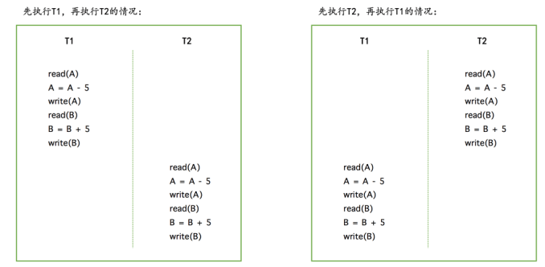
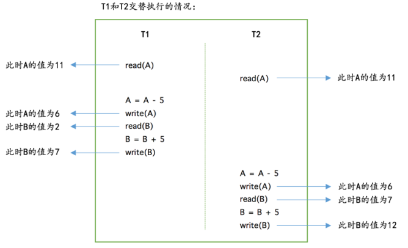
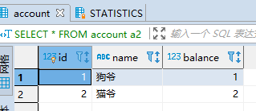

### 事务简介 

#### 1 事务起源 

对于大部分程序员来说，他们的任务就是把现实世界的业务场景映射到数据库世界 。比如银行账户表：

```mysql
CREATE TABLE account (
id INT NOT NULL AUTO_INCREMENT COMMENT '自增id',
name VARCHAR(100) COMMENT '客户名称',
balance INT COMMENT '余额',
PRIMARY KEY (id)
) Engine=InnoDB CHARSET=utf8;
INSERT INTO test.account (name,balance) VALUES 
('狗爷',11)
,('猫爷',2);
```

##### 1.1 原子性（Atomicity）

现实世界中转账操作是一个不可分割的操作，也就是说要么压根儿就没转，要么转账成功，不能存在中间的状态，也就是转了一半的这种情况。设计数据库的大叔们把这种要么全做，要么全不做的规则称之为 **原子性**。  

##### 1.2 隔离性（Isolation）

现实世界中的两次状态转换应该是互不影响的，比如说狗哥向猫爷同时进行的两次金额为5元的转账（假设可以在两个ATM机上同时操作）。那么最后狗哥的账户里肯定会少10元，猫爷的账户里肯定多了10元。但是到对应的数据库世界中，事情又变的复杂了一些。

为了简化问题，我们粗略的假设狗哥向猫爷转账5元的过程是由下边几个步骤组成的：  

步骤一：读取狗哥账户的余额到变量A中，这一步骤简写为 read(A) 。
步骤二：将狗哥账户的余额减去转账金额，这一步骤简写为 A = A - 5 。
步骤三：将狗哥账户修改过的余额写到磁盘里，这一步骤简写为 write(A) 。
步骤四：读取猫爷账户的余额到变量B，这一步骤简写为 read(B) 。
步骤五：将猫爷账户的余额加上转账金额，这一步骤简写为 B = B + 5 。
步骤六：将猫爷账户修改过的余额写到磁盘里，这一步骤简写为 write(B) 。  

我们将狗哥向猫爷同时进行的两次转账操作分别称为 T1 和 T2 ，在现实世界中 T1 和 T2 是应该没有关系的，可以先执行完 T1 ，再执行 T2 ，或者先执行完 T2 ，再执行 T1 ，对应的数据库操作就像这样 。



但是很不幸，真实的数据库中 T1 和 T2 的操作可能交替执行，比如这样 ：



如果按照上图中的执行顺序来进行两次转账的话，最终狗哥的账户里还剩 6 元钱，相当于只扣了5元钱，但是猫爷的账户里却成了 12 元钱，相当于多了10元钱，这银行岂不是要亏死了？

所以对于现实世界中状态转换对应的某些数据库操作来说，**不仅要保证这些操作以 原子性 的方式执行完成，而且要保证其它的状态转换不会影响到本次状态转换，这个规则被称之为 隔离性**  。

##### 1.3 一致性（Consistency）

数据库世界只是现实世界的一个映射，现实世界中存在的约束当然也要在数据库世界中有所体现。**如果数据库中的数据全部符合现实世界中的约束（all defined rules）**，我们说这些数据就是一致的，或者说符合 **一致性** 的。  

如何保证数据库中数据的一致性（就是符合所有现实世界的约束）呢？  

- 数据库本身能为我们保证一部分一致性需求。

  我们知道 MySQL 数据库可以为表建立主键、唯一索引、外键、声明某个列为 NOT NULL 来拒绝 NULL 值的插入。比如说当我们对某个列建立唯一索引时，如果插入某条记录时该列的值重复了，那么 MySQL 就会报错并且拒绝插入。

- 更多的一致性需求需要靠写业务代码的程序员自己保证 。

##### 1.4 持久性（Durability）

当现实世界的一个状态转换完成后，这个转换的结果将永久的保留，这个规则被设计数据库的大叔们称为 持久性。   

当把现实世界的状态转换映射到数据库世界时， 持久性 意味着该转换对应的数据库操作所修改的数据都应该在磁盘上保留下来，不论之后发生了什么事故，本次转换造成的影响都不应该被丢失掉 。

#### 2 事物的概念 


#### 3 MySQL 中的事务的语法 

##### 3.1 开启事务 

- begin [work];
- start transaction; 后面可以跟参数
  - READ ONLY ：标识当前事务是一个只读事务，也就是属于该事务的数据库操作只能读取数据，而不能修改数据。  
  - READ WRITE ：标识当前事务是一个读写事务，也就是属于该事务的数据库操作既可以读取数据，也可以修改数据 。
  - WITH CONSISTENT SNAPSHOT ：启动一致性读 。
  - 可以设置多个，但是不能同时后面是 读写事务。 `START TRANSACTION READ WRITE, WITH CONSISTENT SNAPSHOT  `

##### 3.2 提交事务 

`commit [work];`

##### 3.3 手动终止事务 

如果我们写了几条语句之后发现上边的某条语句写错了，我们可以手动的使用下边这个语句来将数据库恢复到事务执行之前的样子。

 `ROLLBACK [WORK]`  

这里需要强调一下， ROLLBACK 语句是我们程序员手动的去回滚事务时才去使用的，如果事务在执行过程中遇到了某些错误而无法继续执行的话，事务自身会自动的回滚。

##### 3.4 支持事务的存储引擎 

MySQL 中并不是所有存储引擎都支持事务的功能，目前只有 InnoDB 和 NDB 存储引擎支持，如果某个事务中包含了修改使用不支持事务的存储引擎的表，那么**对该使用不支持事务的存储引擎的表所做的修改将无法进行回滚**。

##### 3.5 自动提交 

MySQL 中有一个系统变量 autocommit ：  


可以看到它的默认值为 ON ，也就是说默认情况下，如果我们不显式的使用 START TRANSACTION 或者 BEGIN 语句开启一个事务，那么每一条语句都算是一个独立的事务，这种特性称之为事务的 **自动提交**  。 

可以设置为 false；set autocommit = false;

##### 3.6 隐式提交

当我们使用 START TRANSACTION 或者 BEGIN 语句开启了一个事务，或者把系统变量 autocommit 的值设置为 OFF时，事务就不会进行 自动提交 ，但是**如果我们输入了某些语句之后就会 悄悄的 提交掉**，就像我们输入了COMMIT 语句了一样，这种因为某些特殊的语句而导致事务提交的情况称为 隐式提交 ，这些会导致事务隐式提交的语句包括.

- **定义或修改数据库对象的数据定义语言**（Data definition language，缩写为： DDL ）  

所谓的数据库对象，指的就是 数据库 、 表 、 视图 、 存储过程 等等这些东西。当我们使用 CREATE 、ALTER 、 DROP 等语句去修改这些所谓的数据库对象时，就会隐式的提交前边语句所属于的事务，就像这样:

```mysql
BEGIN;
SELECT ... # 事务中的一条语句
UPDATE ... # 事务中的一条语句
... # 事务中的其它语句
CREATE TABLE ... # 此语句会隐式的提交前边语句所属于的事务
```

- 隐式使用或修改 mysql 数据库中的表 

当我们使用 ALTER USER 、 CREATE USER 、 DROP USER 、 GRANT 、 RENAME USER 、 REVOKE 、 SET PASSWORD 等语句时也会隐式的提交前边语句所属于的事务。

- 事务控制或关于锁定的语句 

当我们在一个事务还没提交或者回滚时就又使用 START TRANSACTION 或者 BEGIN 语句开启了另一个事务时，会隐式的提交上一个事务，比如这样：  

```mysql
BEGIN;
SELECT ... # 事务中的一条语句
UPDATE ... # 事务中的一条语句
... # 事务中的其它语句
BEGIN; # 此语句会隐式的提交前边语句所属于的事务
```

或者当前的 autocommit 系统变量的值为 OFF ，我们手动把它调为 ON 时，也会隐式的提交前边语句所属的事务。或者使用 LOCK TABLES 、 UNLOCK TABLES 等关于锁定的语句也会隐式的提交前边语句所属的事务 。

- 加载数据的语句 

比如我们使用 LOAD DATA 语句来批量往数据库中导入数据时，也会隐式的提交前边语句所属的事务。

- 关于 MySQL 复制的一些语句  

使用 START SLAVE 、 STOP SLAVE 、 RESET SLAVE 、 CHANGE MASTER TO 等语句时也会隐式的提交前边语句所属的事务 。

- 其它的一些语句  

使用 ANALYZE TABLE 、 CACHE INDEX 、 CHECK TABLE 、 FLUSH 、 LOAD INDEX INTO CACHE 、 OPTIMIZE TABLE 、 REPAIR TABLE 、 RESET 等语句也会隐式的提交前边语句所属的事务。  

##### 3.7 保存点 

保存点：**就是在事务对应的数据库语句中打几个点**，我们在调用 ROLLBACK 语句时可以指定会滚到哪个点，而不是回到最初的原点。  定义保存点的语法如下 ：

`SAVEPOINT 保存点名称;  `

当我们想回滚到某个保存点时，可以使用下边这个语句（下边语句中的单词 WORK 和SAVEPOINT 是可有可无的），不过如果 ROLLBACK 语句后边不跟随保存点名称的话，会直接回滚到事务执行之前的状态。  

`ROLLBACK [WORK] TO [SAVEPOINT] 保存点名称;  `

删除一个保存点：

`RELEASE SAVEPOINT 保存点名称;  `

示例：

```mysql
BEGIN;
UPDATE account SET balance = balance  - 10 WHERE id = 1;
-- 设置保存点 s1
SAVEPOINT s1;
SELECT * FROM account a2 ;
-- 更新错了
UPDATE account SET balance  = balance  + 1 WHERE id = 2;
-- 回滚到 s1 处
ROLLBACK TO s1;
SELECT * FROM account a2 ;
COMMIT ;
```


