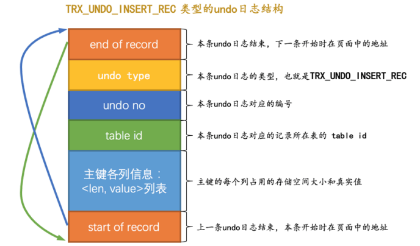
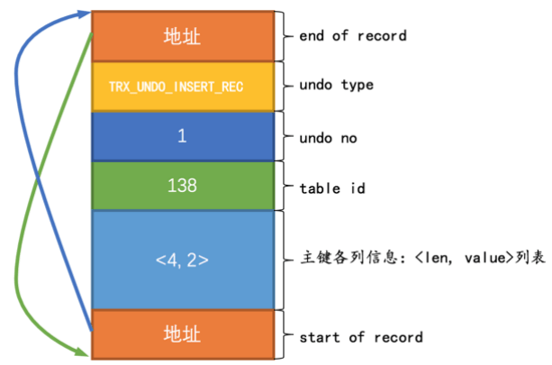
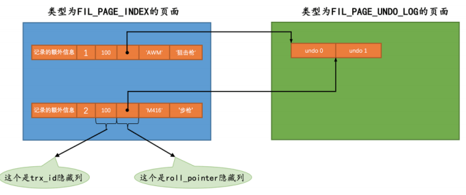

### undo 日志（上）

#### 1 事务回滚的需求

事务要保证原子性，但是有时候偏偏事务执行到一半会出现一些情况：

- 情况一：事务执行过程中可能遇到各种错误，比如服务器本身的错误，操作系统错误，甚至是突然断电导致的错误。
- 情况二：程序员可以在事务执行过程中手动输入 ROOLBACK 语句结束当前的事务的执行。

这两种情况都会导致事务执行到一半就结束，但是事务执行过程中可能已经修改了很多东西，为了保证事务的原子性，我们需要把东西改回原先的样子，这个过程就称之为 **回滚** （英文名： **rollback** ）。

回滚，每当我们需要对一条记录做改动时（这里的改动指的是 insert、delete、update），都需要留一手---**把回滚时所需要的东西给记录下来**。比如：

- 插入一条记录，至少要把这条记录的主键值记录下来，之后回滚可以把这个主键值对应的记录删掉就好了。
- 你删除了一条记录，至少要把这条记录中的内容都记下来，之后回滚时再把这些内容组成的记录插入到表中就好了。
- 你修改了一条记录，至少要把修改这条记录前的旧值都记录下来，这样之后回滚时再把这条记录更新为旧值就好了。

**设计数据库的大叔把这些为了回滚而记录的这些东东称之为撤销日志，英文名为 undo log**。不同类型的操作产生的 undo 日志的格式也是不同的。

#### 2 事务id

##### 2.1 事务分配id的时机

一个事务可以是一个只读事务或者是一个读写事务：

- 我们可以通过 START TRANSACTION READ ONLY 语句开启一个只读事务。在只读事务中不可以对普通的表（其他事务也能访问到的表）进行增、删、改操作，但可以对临时表做增、删、改操作。
- 我们可以通过 START TRANSACTION READ WRITE 语句开启一个读写事务，或者使用 BEGIN 、 START TRANSACTION 语句开启的事务默认也算是读写事务。在读写事务中可以对表执行增删改查操作。

**如果某个事务执行过程中对某个表执行了增、删、改操作，那么 InnoDB 存储引擎就会给它分配一个独一无二的事务id** ，分配方式如下：

- 对于**只读事务**来说，**只有在它第一次对某个用户创建的临时表执行增、删、改操作时才会为这个事务分配一个 事务id ，否则的话是不分配 事务id 的**。
- 对于**读写事务**来说，**只有在它第一次对某个表（包括用户创建的临时表）执行增、删、改操作时才会为这个事务分配一个 事务id ，否则的话也是不分配 事务id 的**。

##### 2.2 事务id是怎么生成的

这个 事务id 本质上就是一个数字，它的分配策略和我们前边提到的对隐藏列 row_id （当用户没有为表创建主键和 UNIQUE 键时 InnoDB 自动创建的列）的分配策略大抵相同，具体策略如下：

- **服务器会在内存中维护一个全局变量，每当需要为某个事务分配一个 事务id 时，就会把该变量的值当作 事务id 分配给该事务，并且把该变量自增1**。
- **每当这个变量的值为 256 的倍数时，就会将该变量的值刷新到系统表空间的页号为 5 的页面中一个称之为Max Trx ID 的属性处，这个属性占用 8 个字节的存储空间**。
- **当系统下一次重新启动时，会将上边提到的 Max Trx ID 属性加载到内存中，将该值加上256之后赋值给我们前边提到的全局变量**（因为在上次关机时该全局变量的值可能大于 Max Trx ID 属性值）。

这样就可以保证整个系统中分配的 事务id 值是一个递增的数字。先被分配 id 的事务得到的是较小的 事务id ，后被分配 id 的事务得到的是较大的 事务id 。

##### 2.3 trx_id 隐藏列 

 介绍InnoDB 记录行格式的时候重点强调过：**聚簇索引的记录除了会保存完整的用户数据以外，而且还会自动添加名为trx_id、roll_pointer的隐藏列，如果用户没有在表中定义主键以及UNIQUE键，还会自动添加一个名为row_id的隐藏列**。所以一条记录在页面中的真实结构看起来就是这样的：


其中的 **trx_id 列**其实还蛮好理解的，就是**某个对这个聚簇索引记录做改动的语句所在的事务对应的 事务id** 而已（此处的改动可以是 INSERT 、 DELETE 、 UPDATE 操作）。

#### 3 undo 日志的格式

一个事务在执行过程中可能新增、删除、更新若干条记录，也就是说需要记录很多条对应的 undo日志 ，这些 undo日志 会被从 0 开始编号，也就是说**根据生成的顺序分别被称为 第0号undo日志 、 第1号undo日志 、...、 第n号undo日志 等，这个编号也被称之为 undo no**。

这些 undo日志 是被记录到类型为 FIL_PAGE_UNDO_LOG（对应的十六进制是 0X0002） 的页面中。这些页面可以从系统表空间中分配，也可以从一种专门存放 undo日志 的表空间，也就是所谓的 undo tablespace 中分配。

创建一个 undo_demo 的表：

```mysql
CREATE TABLE undo_demo (
 id INT NOT NULL,
 key1 VARCHAR(100),
 col VARCHAR(100),
 PRIMARY KEY (id),
 KEY idx_key1 (key1)
)Engine=InnoDB CHARSET=utf8
```

这个表中有3个列，其中 id 列是主键，我们为 key1 列建立了一个二级索引， col 列是一个普通的列。我们前边介绍 InnoDB 的数据字典时说过，每个表都会被分配一个唯一的 table id ，我们可以通过系统数据库information_schema 中的 innodb_sys_tables 表来查看某个表对应的 table id 是什么，现在我们查看一下undo_demo 对应的 table id 是多少:

```mysql
SELECT * FROM information_schema.innodb_sys_tables WHERE name = 'test/undo_demo';
```


我这里是 1436。

##### 3.1 INSERT 操作对应的 undo 日志

我们向表中插入一条记录会有 乐观插入 和悲观插入的区分，不管怎么插入最终是这条记录放到了一个数据页中。MySQL 设计值设计了一个类型为 TRX_UNDO_INSERT_REC 的 undo 日志，它的完整结构如下图所示：



根据示意图我们强调几点：

- undo no 在一个事务中是从 0 开始递增的，也就是说只要事务没提交，每生成一条 undo日志 ，那么该条日志的 undo no 就增1。

- 如果记录中的主键只包含一个列，那么在类型为 TRX_UNDO_INSERT_REC 的 undo日志 中只需要把该列占用的存储空间大小和真实值记录下来，如果记录中的主键包含多个列，那么每个列占用的存储空间大小和对应的真实值都需要记录下来（图中的 len 就代表列占用的存储空间大小， value 就代表列的真实值）。

  > 当我们向某个表中插入一条记录时，实际上需要向聚簇索引和所有的二级索引都插入一条记录。不过记录undo日志时，我们只需要考虑向聚簇索引插入记录时的情况就好了，因为其实聚簇索引记录和二级索引记录是一一对应的，我们在回滚插入操作时，只需要知道这条记录的主键信息，然后根据主键信息做对应的删除操作，做删除操作时就会顺带着把所有二级索引中相应的记录也删除掉。后边说到的DELETE操作和UPDATE操作对应的undo日志也都是针对聚簇索引记录而言的，我们之后就不强调了

现在我们向 undo_demo 中插入两条记录:

```mysql
BEGIN;
INSERT INTO undo_demo (id, key1, col) VALUES (1, 'AWM', '狙击枪'), (2, 'M416', '步枪');
```

因为记录的主键只包含一个 id 列，所以我们在对应的 undo日志 中只需要将待插入记录的 id 列占用的存储空间长度（ id 列的类型为 INT ， INT 类型占用的存储空间长度为 4 个字节）和真实值记录下来。本例中插入了两条记录，所以会产生两条类型为 TRX_UNDO_INSERT_REC 的 undo日志：

- 第一条 undo日志 的 undo no 为 0 ，记录主键占用的存储空间长度为 4 ，真实值为 1 。画一个示意图就是这样：

  

- 第二条 undo日志 的 undo no 为 1 ，记录主键占用的存储空间长度为 4 ，真实值为 2 。画一个示意图就是这样（与第一条 undo日志 对比， undo no 和主键各列信息有不同）

  

###### 3.1.1 roll pointer 隐藏列的含义

是时候揭开 roll_pointer 的真实面纱了，这个占用 7 个字节的字段其实一点都不神秘，本质上就是一个指向记录对应的 undo日志 的一个指针。比方说我们上边向 undo_demo 表里插入了2条记录，每条记录都有与其对应的一条 undo日志 。记录被存储到了类型为 FIL_PAGE_INDEX 的页面中（就是我们前边一直所说的 数据页 ），undo日志 被存放到了类型为 FIL_PAGE_UNDO_LOG 的页面中。效果如图所示：



从图中也可以更直观的看出来， **roll_pointer 本质就是一个指针，指向记录对应的undo日志**。这里的事务id是100。

##### 3.2 DELETE 操作对应的日志

我们知道插入到页面中的记录会根据记录头信息中的 next_record 属性组成一个单向链表，我们把这个链表称之为 正常记录链表 ；我们在前边唠叨数据页结构的时候说过，**被删除的记录其实也会根据记录头信息中的next_record 属性组成一个链表，只不过这个链表中的记录占用的存储空间可以被重新利用，所以也称这个链表为 垃圾链表** 。 Page Header 部分有一个称之为 PAGE_FREE 的属性，**它指向由被删除记录组成的垃圾链表中的头节点**。


上面是简化板的图。页面的 Page Header 部分的 PAGE_FREE 属性的值代表指向 垃圾链表 头节点的指针。假设现在我们准备使用 DELETE 语句把 正常记录链表 中的最后一条记录给删除掉，其实这个删除的过程需要经历两个阶段：

- 阶段一：仅仅将记录的 delete_mask 标识位设置为 1 ，其他的不做修改（其实会修改记录的 trx_id 、roll_pointer 这些隐藏列的值）。设计 InnoDB 的大叔把这个阶段称之为 delete mark 。

  

可以看到， 正常记录链表 中的最后一条记录的 delete_mask 值被设置为 1 ，但是并没有被加入到 垃圾链表 。也就是此时记录处于一个 中间状态。在删除语句所在的事务提交之前，被删除的记录一直都处于这种所谓的 中间状态 。

> 为什么会有这种奇怪的中间状态呢？主要是为了实现一个 MVCC 的功能。

- 阶段二：**当该删除语句所在的事务提交之后，会有专门的线程后来真正的把记录删除掉**。**所谓真正的删除就是把该记录从 正常记录链表 中移除，并且加入到 垃圾链表 中，然后还要调整一些页面的其他信息**，比如**页面中的用户记录数量 PAGE_N_RECS 、上次插入记录的位置 PAGE_LAST_INSERT 、垃圾链表头节点的指针PAGE_FREE 、页面中可重用的字节数量 PAGE_GARBAGE 、还有页目录的一些信息**等等。设计 InnoDB 的大叔把这个阶段称之为 **purge**。


对照着图我们还要注意一点，将被删除记录加入到 垃圾链表 时，实际上加入到链表的头节点处，会跟着修改 PAGE_FREE 属性的值。

从上边的描述中我们也可以看出来，在删除语句所在的事务提交之前，只会经历 阶段一 ，也就是 delete mark阶段（提交之后我们就不用回滚了，所以只需考虑对删除操作的 阶段一 做的影响进行回滚）。设计 InnoDB 的大叔为此设计了一种称之为 **TRX_UNDO_DEL_MARK_REC 类型的 undo日志** ，它的完整结构如下图所示：


对照着图，我们得注意下面几点：

- **在对一条记录进行 delete mark 操作前，需要把该记录的旧的 trx_id 和 roll_pointer 隐藏列的值都给记到对应的 undo日志 中来**，就是我们图中显示的 old trx_id 和 old roll_pointer 属性。这样有一个好处，那就是**可以通过 undo日志 的 old roll_pointer 找到记录在修改之前对应的 undo 日志**。比方说在一个事务中，我们先插入了一条记录，然后又执行对该记录的删除操作，这个过程的示意图就是这样：

  

从图中可以看出来，**执行完 delete mark 操作后，它对应的 undo 日志和 INSERT 操作对应的 undo 日志就串成了一个链表。这个很有意思啊，这个链表就称之为 版本链** ，现在貌似看不出这个 版本链 有啥用，等我们再往后看看，讲完 UPDATE 操作对应的 undo 日志后，这个所谓的 版本链 就慢慢的展现出它的牛逼之处了。

- 与类型为 TRX_UNDO_INSERT_REC 的 undo日志 不同，类型为 TRX_UNDO_DEL_MARK_REC 的 undo 日志还**多了一个 索引列各列信息 的内容**，也就是说**如果某个列被包含在某个索引中，那么它的相关信息就应该被记录到这个 索引列各列信息 部分，所谓的相关信息包括该列在记录中的位置（用 pos 表示），该列占用的存储空间大小（用 len 表示），该列实际值（用 value 表示）**。所以 索引列各列信息 存储的内容实质上就是<pos, len, value> 的一个列表。**这部分信息主要是用在事务提交后，对该 中间状态记录 做真正删除的阶段二，也就是 purge 阶段中使用的**。

该介绍的我们介绍完了，现在继续在上边那个事务id为 100 的事务中删除一条记录，比如我们把 id 为1的那条记录删除掉：

```mysql
BEGIN;
DELETE FROM undo_demo WHERE id = 1;
```

这个 delete mark 操作对应的 undo日志 的结构就是这样：


对照着这个图，我们得注意下边几点:

- 因为这条 undo 日志是 id 为 100 的事务中产生的第3条 undo 日志，所以它对应的 undo no 就是 2 。

- 在对记录做 delete mark 操作时，记录的 trx_id 隐藏列的值是 100 （也就是说对该记录最近的一次修改就发生在本事务中），所以把 100 填入 old trx_id 属性中。然后把记录的 roll_pointer 隐藏列的值取出来，填入 old roll_pointer 属性中，这样就可以通过 old roll_pointer 属性值找到最近一次对该记录做改动时产生的 undo日志 。

- 由于 undo_demo 表中有2个索引：一个是聚簇索引，一个是二级索引 idx_key1 。只要是包含在索引中的列，那么这个列在记录中的位置（ pos ），占用存储空间大小（ len ）和实际值（ value ）就需要存储到undo日志 中。

  - 对于主键来说，只包含一个 id 列，存储到 undo日志 中的相关信息分别是：

    - pos ： id 列是主键，也就是在记录的第一个列，它对应的 pos 值为 0 。 pos 占用1个字节来存储。
    - len ： id 列的类型为 INT ，占用4个字节，所以 len 的值为 4 。 len 占用1个字节来存储。
    - value ：在被删除的记录中 id 列的值为 1 ，也就是 value 的值为 1 。 value 占用4个字节来存储。

    
  
  所以对于 id 列来说，最终存储的结果就是 <0, 4, 1> ，存储这些信息占用的存储空间大小为 1 + 1 + 4 = 6 个字节。
  
  - 对于 idx_key1 来说，只包含一个 key1 列，存储到 undo日志 中的相关信息分别是：
  
    - pos ： key1 列是排在 id 列、 trx_id 列、 roll_pointer 列之后的，它对应的 pos 值为 3 。
    - pos 占用1个字节来存储。len ： key1 列的类型为 VARCHAR(100) ，使用 utf8 字符集，被删除的记录实际存储的内容是AWM ，所以一共占用3个字节，也就是所以 len 的值为 3 。 len 占用1个字节来存储。
    - value ：在被删除的记录中 key1 列的值为 AWM ，也就是 value 的值为 AWM 。 value 占用3个字节来存储。
  
    
  
    所以对于 key1 列来说，最终存储的结果就是 <3, 3, 'AWM'> ，存储这些信息占用的存储空间大小为 1 + 1 + 3 = 5 个字节。

从上边的叙述中可以看到， <0, 4, 1> 和 <3, 3, 'AWM'> 共占用 11 个字节。然后 index_col_infolen 本身占用 2 个字节，所以加起来一共占用 13 个字节，把数字 13 就填到了 index_col_info len 的属性中。

##### 3.3 UPDATE 操作对应的日志

###### 3.3.1 不更新主键的情况 

在不更新主键的情况下，又可以细分为被更新的列占用的存储空间不发生变化和发生变化的情况。

- 就地更新（in-place update）

**更新记录时，对于被更新的每个列来说，如果更新后的列和更新前的列占用的存储空间都一样大，那么就可以进行 就地更新 ，也就是直接在原记录的基础上修改对应列的值**。再次强调一边，是每个列在更新前后占用的存储空间一样大，有任何一个被更新的列更新前比更新后占用的存储空间大，或者更新前比更新后占用的存储空间小都不能进行 就地更新 。比方说现在 undo_demo 表里还有一条 id 值为 2 的记录，它的各个列占用的大小如图所示（因为采用 utf8 字符集，所以 '步枪' 这两个字符占用6个字节）


假如我们有这样的 UPDATE 语句：

```mysql
 UPDATE undo_demo  SET key1 = 'P92', col = '手枪'  WHERE id = 2;
```

在这个 UPDATE 语句中， col 列从 步枪 被更新为 手枪 ，前后都占用6个字节，也就是占用的存储空间大小未改变； key1 列从 M416 被更新为 P92 ，也就是从 4 个字节被更新为 3 个字节，这就不满足 就地更新 需要的条件了，所以不能进行 就地更新 。

但是如果 UPDATE 是这样：

```mysql
 UPDATE undo_demo  SET key1 = 'M249', col = '手枪'  WHERE id = 2;
```

由于各个被更新的列在更新前后占用的存储空间是一样大的，所以这样的语句可以执行 就地更新。

- 先删除掉旧记录，再插入新记录

**在不更新主键的情况下，如果有任何一个被更新的列更新前和更新后占用的存储空间大小不一致，那么就需要先把这条旧的记录从聚簇索引页面中删除掉，然后再根据更新后列的值创建一条新的记录插入到页面中**。

请注意一下，**我们这里所说的 删除 并不是 delete mark 操作，而是真正的删除掉，也就是把这条记录从 正常记录链表 中移除并加入到 垃圾链表 中，并且修改页面中相应的统计信息**（比如 PAGE_FREE 、PAGE_GARBAGE 等这些信息）。不过这里做真正删除操作的线程并不是在唠叨 DELETE 语句中做 purge 操作时使用的另外专门的线程，而是由用户线程同步执行真正的删除操作，真正删除之后紧接着就要根据各个列更新后的值创建的新记录插入。

**这里如果新创建的记录占用的存储空间大小不超过旧记录占用的空间，那么可以直接重用被加入到 垃圾链表 中的旧记录所占用的存储空间，否则的话需要在页面中新申请一段空间以供新记录使用，如果本页面内已经没有可用的空间的话，那就需要进行页面分裂操作，然后再插入新记录**。

针对不更新主键的情况，设计者设计了一种类型为 **TRX_UNDO_UPD_EXIST_REC 的 undo日志** ，它的完整结构如下：


其实大部分属性和我们介绍过的 TRX_UNDO_DEL_MARK_REC 类型的 undo日志 是类似的，不过还是要注意这么几点：

- n_updated 属性表示本条 UPDATE 语句执行后将有几个列被更新，后边跟着的 <pos, old_len, old_value>分别表示被更新列在记录中的位置、更新前该列占用的存储空间大小、更新前该列的真实值。
- 如果在 UPDATE 语句中更新的列包含索引列，那么也会添加 索引列各列信息 这个部分，否则的话是不会添加这个部分的。

现在继续在上边那个事务id为100的事务中更新一条记录，比如我们把id为2的那条记录更新一下

```mysql
BEGIN; # 显式开启一个事务，假设该事务的id为100
# 插入两条记录
INSERT INTO undo_demo(id, key1, col) VALUES (1, 'AWM', '狙击枪'), (2, 'M416', '步枪');
# 删除一条记录 
DELETE FROM undo_demo WHERE id = 1; 
# 更新一条记录
UPDATE undo_demo SET key1 = 'M249', col = '机枪' WHERE id = 2;
```

这个 UPDATE 语句更新的列大小都没有改动，所以可以采用 就地更新 的方式来执行，在真正改动页面记录时，会先记录一条类型为 TRX_UNDO_UPD_EXIST_REC 的 undo日志 ，长这样:


对照着这个图我们注意一下这几个地方:

- 因为这条 undo日志 是 id 为 100 的事务中产生的第4条 undo日志 ，所以它对应的 undo no 就是3。
- 这条日志的 roll_pointer 指向 undo no 为 1 的那条日志，也就是插入主键值为 2 的记录时产生的那条undo日志 ，也就是最近一次对该记录做改动时产生的 undo日志.
- 由于本条 UPDATE 语句中更新了索引列 key1 的值，所以需要记录一下 索引列各列信息 部分，也就是把主键和 key1 列更新前的信息填入。

###### 3.3.2 更新主键的情况

在聚簇索引中，记录是按照主键值的大小连成了一个单向链表的，如果我们更新了某条记录的主键值，意味着这条记录在聚簇索引中的位置将会发生改变，比如你将记录的主键值从1更新为10000，如果还有非常多的记录的主键值分布在 1 ~ 10000 之间的话，那么这两条记录在聚簇索引中就有可能离得非常远，甚至中间隔了好多个页面。针对 UPDATE 语句中更新了记录主键值的这种情况， InnoDB 在聚簇索引中分了两步处理：

- **将旧记录进行 delete mark 操作**

高能注意：这里是delete mark操作！也就是说**在 UPDATE语句所在的事务提交前，对旧记录只做一个 delete mark 操作，在事务提交后才由专门的线程做purge操作，把它加入到垃圾链表中**。这里一定要和我们上边所说的在不更新记录主键值时，先真正删除旧记录，再插入新记录的方式区分开

> 之所以只对旧记录做delete mark操作，是因为别的事务同时也可能访问这条记录，如果把它真正的删除加入到垃圾链表后，别的事务就访问不到了。这个功能就是所谓的MVCC.

- 根据更新后各列的值创建一条新记录，并将其插入到聚簇索引中（需重新定位插入的位置）

由于更新后的记录主键值发生了改变，所以需要重新从聚簇索引中定位这条记录所在的位置，然后把它插进去。

针对 UPDATE 语句更新记录主键值的这种情况，在对该记录进行 delete mark 操作前，会记录一条类型为TRX_UNDO_DEL_MARK_REC 的 undo日志 ；之后插入新记录时，会记录一条类型为 TRX_UNDO_INSERT_REC 的 undo日志 ，也就是说每对一条记录的主键值做改动时，会记录2条 undo日志。

### undo 日志（下）

