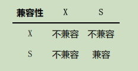
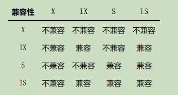

### 25 锁

#### 1 解决并发事务带来的问题的两种基本方式

并发事务访问相同记录大致可分为3种情况：

##### 读-读 情况：

即并发事务相继读取相同的记录。读取操作不会对记录产生问题，所以不会引起什么问题。

##### 写-写 情况：

即并发事务相继对相同的记录做出改动。

我们前边说过，在这种情况下会发生 脏写 的问题，任何一种隔离级别都不允许这种问题的发生。所以在多个未提交事务相继对一条记录做改动时，需要让它们排队执行，**这个排队的过程其实是通过 锁 来实现的**。这个所谓的 锁 其实是一个内存中的结构，在事务执行前本来是没有锁的，也就是说一开始是没有 锁结构 和记录进行关联的，如图所示：


**当一个事务想对这条记录做改动时，首先会看看内存中有没有与这条记录关联的 锁结构 ，当没有的时候就会在内存中生成一个 锁结构 与之关联**。比方说事务 T1 要对这条记录做改动，就需要生成一个 锁结构 与之关联：


其实在 锁结构 里有很多信息，不过为了简化理解，我们现在只把两个比较重要的属性拿了出来：

- trx信息 ：代表这个锁结构是哪个事务生成的。
- is_waiting ：代表当前事务是否在等待。

如图所示，当事务 T1 改动了这条记录后，就生成了一个 锁结构 与该记录关联，因为之前没有别的事务为这条记录加锁，所以 **is_waiting 属性就是 false ，我们把这个场景就称之为获取锁成功，或者加锁成功**，然后就可以继续执行操作了。

在事务 T1 提交之前，另一个事务 T2 也想对该记录做改动，那么先去看看有没有 锁结构 与这条记录关联，发现有一个 锁结构 与之关联后，然后也生成了一个 锁结构 与这条记录关联，不过 **锁结构 的is_waiting 属性值为 true ，表示当前事务需要等待，我们把这个场景就称之为获取锁失败，或者加锁失败，或者没有成功的获取到锁**，画个图表示就是这样:


在事务 T1 提交之后，就会把该事务生成的 锁结构 释放掉，然后看看还有没有别的事务在等待获取锁，发现了事务 T2 还在等待获取锁，所以把事务 T2 对应的锁结构的 is_waiting 属性设置为 false ，然后把该事务对应的线程唤醒，让它继续执行，此时事务 T2 就算获取到锁了。效果图就是这样:


总结一下后面内容可能用到的几种说法：

- 不加锁：意思就是不需要在内存中生成对应的 锁结构 ，可以直接执行操作。
- 获取锁成功或者加锁成功：意思就是**在内存中生成了对应的 锁结构** ，而且**锁结构的 is_waiting 属性为 false** ，也就是事务可以继续执行操作。
- 获取锁失败，或者加锁失败，或者没有获取到锁：意思就是**在内存中生成了对应的 锁结构** ，不过**锁结构的is_waiting 属性为 true** ，也就是事务需要等待，不可以继续执行操作。

##### 读-写 或 写-写 情况：

也就是一个事务进行读取操作，另一个进行改动操作。我们前边说过，这种情况下可能发生 脏读 、 不可重复读 、 幻读 的问题。

怎么解决 脏读 、 不可重复读 、 幻读 这些问题呢？其实有两种可选的解决方案：

- 方案一：**读操作利用多版本并发控制（MVCC)，写操作进行 加锁**。
- 方案二：**读、写操作都采用加锁方式**。

  如果我们的一些业务场景不允许读取记录的旧版本，而是每次都必须去读取记录的最新版本，比方在银行存款的事务中，你需要先把账户的余额读出来，然后将其加上本次存款的数额，最后再写到数据库中。在将账户余额读取出来后，就不想让别的事务再访问该余额，直到本次存款事务执行完成，其他事务才可以访问账户的余额。这样在读取记录的时候也就需要对其进行 加锁 操作，这样也就意味着 读 操作和 写 操作也像 写-写 操作那样排队执行。

很明显，采用 MVCC 方式的话， 读-写 操作彼此并不冲突，性能更高，采用 加锁 方式的话， 读-写 操作彼此需要排队执行，影响性能。一般情况下我们当然愿意采用 MVCC 来解决 读-写 操作并发执行的问题，但是业务在某些特殊情况下，要求必须采用 加锁 的方式执行，那也是没有办法的事。

##### 行锁

##### 1.1 一致性读（Consistent Reads）

**事务利用 MVCC 进行的读取操作称之为 一致性读，或者 一致性无锁读，有的也称为 快照读**。所有普通的 select 语句在 READ COMMITED 、REPEATABLE READ 隔离级别下都算是一致性读，比如：

```mysql
select * from t;
select * from t1 inner join t2 on t1.a = t2.a;
```

一致性读 并不会对表中的任何记录做 加锁 操作，其他事务可以自由的对表中的记录做改动。

##### 1.2 锁定读（Locking Reads）

###### 1 共享锁和独占锁

- 共享锁：英文名（Shared Locks），简称 S 锁。在事务读取一条记录时，需要先获取该记录的 S 锁。
- 独占锁：英文名（Exclusive Locks），简称 X 锁，也称 排他锁。在事务要改动一条记录时，需要先获取该记录的 X 锁。

假如事务 T1 首先获取了一条记录的S锁 之后，事务 T2 接着也要访问这条记录：

- 如果事务 T2 想要再获取一个记录的 S锁 ，那么事务 T2 也会获得该锁，也就意味着事务 T1 和 T2 在该记录上同时持有 S锁 。
- 如果事务 T2 想要再获取一个记录的 X锁 ，那么此操作会被阻塞，直到事务 T1 提交之后将 S锁 释放掉。

**如果事务 T1 首先获取了一条记录的 X锁 之后，那么不管事务 T2 接着想获取该记录的 S锁 还是 X锁 都会被阻塞，直到事务 T1 提交**。所以我们说 S 锁和 S锁是兼容的， S 锁和 X锁是不兼容的，**读读共享，读写互斥**。



###### 2 锁定读的语句

我们前边说在采用 加锁 方式解决 脏读 、 不可重复读 、 幻读 这些问题时，读取一条记录时需要获取一下该记录的 S锁 ，其实这是不严谨的，**有时候想在读取记录时就获取记录的 X锁 ，来禁止别的事务读写该记录**，为此设计 MySQL 的大叔提出了两种比较特殊的 SELECT 语句格式：

- **对读取的记录加 S 锁**；

  `SELECT ... FROM T LOCK IN SHARE MODE;`

  **也就是在普通的 SELECT 语句后边加 LOCK IN SHARE MODE** ，如果当前事务执行了该语句，那么它会为读取到的记录加 S锁 ，这样允许别的事务继续获取这些记录的 S锁 （比方说别的事务也使用 SELECT ... LOCK INSHARE MODE 语句来读取这些记录），但是不能获取这些记录的 X锁 （比方说使用 SELECT ... FOR UPDATE语句来读取这些记录，或者直接修改这些记录）。**如果别的事务想要获取这些记录的 X锁 ，那么它们会阻塞，直到当前事务提交之后将这些记录上的 S锁 释放掉**。

- **对读取的记录加 X 锁**；

  `SELECT ... FROM T FOR UPDATE;`

  也就是在普通的 SELECT 语句后边加 FOR UPDATE ，如果当前事务执行了该语句，那么它会为读取到的记录加 X锁 ，这样既不允许别的事务获取这些记录的 S锁 （比方说别的事务使用 SELECT ... LOCK IN SHAREMODE 语句来读取这些记录），也不允许获取这些记录的 X锁 （比方也说使用 SELECT ... FOR UPDATE 语句来读取这些记录，或者直接修改这些记录）。**如果别的事务想要获取这些记录的 S锁 或者 X锁 ，那么它们会阻塞，直到当前事务提交之后将这些记录上的 X锁 释放掉**。

##### 1.3 写操作 

平常用到的写操作无非是 DELETE、UPDATE、INSERT 这三种：

- **DELETE**

  对一条记录做 DELETE 操作的过程其实是**先在 B+ 树重定位到这条记录的位置，然后获取一下这条记录的X锁，然后再执行 delete mark 操作**。我们也可以把这个定位待删除记录在 B+ 树中位置的过程看成是一个获取 X锁 的 锁定读 。

- **UPDATE**

  在对一条记录做 UPDATE 操作时分为三种情况：

  - **如果未修改该记录的键值并且被更新的列占用的存储空间在修改前后未发生变**化，则先在 B+ 树中定位到这条记录的位置，然后再获取一下记录的 X锁 ，最后在原记录的位置进行修改操作。其实我们也可以把这个定位待修改记录在 B+ 树中位置的过程看成是一个获取 X锁 的 锁定读 。
  - **如果未修改该记录的键值并且至少有一个被更新的列占用的存储空间在修改前后发生变化**，则先在B+ 树中定位到这条记录的位置，然后获取一下记录的 X锁 ，将该记录彻底删除掉（就是把记录彻底移入垃圾链表），最后再插入一条新记录。这个定位待修改记录在 B+ 树中位置的过程看成是一个获取 X 锁 的 锁定读 ，新插入的记录由 INSERT 操作提供的 隐式锁 进行保护。
  - 如果修改了该记录的键值，则相当于在原记录上做 DELETE 操作之后再来一次 INSERT 操作，加锁操作就需要按照 DELETE 和 INSERT 的规则进行了。

- **INSERT**

  **一般情况下，新插入一条记录的操作并不加锁，设计 InnoDB 的大叔通过一种称之为 隐式锁 的东东来保护这条新插入的记录在本事务提交前不被别的事务访问**。

#### 2 多粒度锁 

前边提到的锁都是**针对记录的，也可以被称之为 行级锁或者 行锁**，**对一条记录加锁影响的也只是这条记录而已，我们就说这个锁的粒度比较细**；其实**一个事务也可以在 表 级别进行加锁，自然就被称之为 表级锁 或 者 表锁 ，对一个表加锁影响整个表中的记录，我们就说这个锁的粒度比较粗**。给表加的锁也可以分为 共享锁（ S锁 ）和 独占锁 （ X锁 ）。

##### 表锁

- 给表加 S 锁

  如果一个事务给表加了 S锁 ，那么：

  - 别的事务可以继续获得该表的 S锁
  - 别的事务可以继续获得该表中的某些记录的 S锁
  - 别的事务不可以继续获得该表的 X锁
  - 别的事务不可以继续获得该表中的某些记录的 X锁

- 给表加 X 锁

  如果一个事务给表加了 X 锁，那么：

  - 别的事务不可以继续获得该表的 X锁
  - 别的事务不可以继续获得该表中的某些记录的 X锁
  - 别的事务不可以继续获得该表的 X锁
  - 别的事务不可以继续获得该表中的某些记录的 X锁

其实也是和行锁一样，**读读共享，读写互斥**。


- 意向共享锁：（Intention Shared Lock）简称 IS 锁。当事务准备在某条记录上加 S锁 时，需要先在表级别加一个 IS 锁。
- 意向独占锁：（Intention Exclusive Lock）简称 IX 锁。当事务准备在某条记录上加 X锁 时，需要先在表级别加一个 IX锁 。

视角回到教学楼和教室上来：

- 如果有学生到教室中上自习，那么他先在整栋教学楼门口放一把 IS锁 （表级锁），然后再到教室门口放一把 S锁 （行锁）。
- 如果有维修工到教室中维修，那么它先在整栋教学楼门口放一把 IX锁 （表级锁），然后再到教室门口放一把 X锁 （行锁）。

之后：

- 如果有领导要参观教学楼，也就是想在教学楼门口前放 S锁 （表锁）时，首先要看一下教学楼门口有没有IX锁 ，如果有，意味着有教室在维修，需要等到维修结束把 IX锁 撤掉后才可以在整栋教学楼上加 S锁

- 如果有考试要占用教学楼，也就是想在教学楼门口前放 X锁 （表锁）时，首先要看一下教学楼门口有没有IS锁 或 IX锁 ，如果有，意味着有教室在上自习或者维修，需要等到学生们上完自习以及维修结束把 IS锁和 IX锁 撤掉后才可以在整栋教学楼上加 X锁 。

总结一下：**IS、IX锁是表级锁，它们的提出仅仅为了在之后加表级别的S锁和X锁时可以快速判断表中的记录是否被上锁，以避免用遍历的方式来查看表中有没有上锁的记录，也就是说其实IS锁和IX锁是兼容的，IX锁和IX锁是兼容的**。



#### 3 MySQL中的行锁和表锁

##### 3.1 其他存储引擎中的锁

对于 MyISAM 、 MEMORY 、 MERGE 这些存储引擎来说，它们只支持表级锁，而且这些引擎并不支持事务，所以使用这些存储引擎的锁一般都是针对当前会话来说的。比方说在 Session 1 中对一个表执行 SELECT 操作，就相当于为这个表加了一个表级别的 S锁 ，如果在 SELECT 操作未完成时， Session 2 中对这个表执行 UPDATE 操作，相当于要获取表的 X锁 ，此操作会被阻塞，直到 Session 1 中的 SELECT 操作完成，释放掉表级别的 S锁 后，Session 2 中对这个表执行 UPDATE 操作才能继续获取 X锁 ，然后执行具体的更新语句。

> **因为使用MyISAM、MEMORY、MERGE这些存储引擎的表在同一时刻只允许一个会话对表进行写操作，所以这些存储引擎实际上最好用在只读，或者大部分都是读操作，或者单用户的情景下**。另外，在MyISAM存储引擎中有一个称之为Concurrent Inserts的特性，支持在对MyISAM表读取时同时插入记录，这样可以提升一些插入速度.

##### 3.2 InnoDB 存储引擎中的锁

###### 1 InnoDB 中的表级别的锁

- 表级别的 S锁、X锁

  在对某个表执行 SELECT 、 INSERT 、 DELETE 、 UPDATE 语句时， InnoDB 存储引擎是不会为这个表添加表级别的 S锁 或者 X锁 的。

  另外，在对某个表执行一些诸如 ALTER TABLE、DROP TABLE 这类的 DDL 语句时，其他事务对这个表并发执行诸如 SELECT 、 INSERT 、 DELETE 、 UPDATE 的语句会发生阻塞，同理，某个事务中对某个表执行SELECT 、 INSERT 、 DELETE 、 UPDATE 语句时，在其他会话中对这个表执行 DDL 语句也会发生阻塞。这个过程其实是通过在 server层 使用一种称之为 **元数据锁 （英文名： Metadata Locks ，简称 MDL ）**东东来实现的，一般情况下也不会使用 InnoDB 存储引擎自己提供的表级别的 S锁 和 X锁。
  
  > DDL 语句会隐式的提交当前会话中的事务，这主要是DDL语句的执行一般都会在若干个特殊事务中完成，在开启这些特殊事务前，需要将当前会话中的事务提交掉.
  
  其实这个 InnoDB 存储引擎提供的表级 S锁 或者 X锁 是相当鸡肋，只会在一些特殊情况下，比方说崩溃恢复过程中用到。不过我们还是可以手动获取一下的，比方说在系统变量 autocommit=0，innodb_table_locks =1 时，手动获取 InnoDB 存储引擎提供的表 t 的 S锁 或者 X锁 可以这么写：
  
  	- LOCK TABLES t READ ： InnoDB 存储引擎会对表 t 加表级别的 S锁 。
  	- LOCK TABLES t WRITE ： InnoDB 存储引擎会对表 t 加表级别的 X锁 。
  
  不过请尽量避免在使用 InnoDB 存储引擎的表上使用 LOCK TABLES 这样的手动锁表语句，它们并不会提供什么额外的保护，只是会降低并发能力而已。（了解下）

- 表级别的 IS锁 、 IX锁

当我们在对使用 InnoDB 存储引擎的表的某些记录加 S锁 之前，那就需要先在表级别加一个 IS锁 ，当我们在对使用 InnoDB 存储引擎的表的某些记录加 X锁 之前，那就需要先在表级别加一个 IX锁。**IS锁 和 IX锁的使命只是为了后续在加表级别的 S锁 和 X锁 时判断表中是否有已经被加锁的记录，以避免用遍历的方式来查看表中有没有上锁的记录**。

- 表级别的 AUTO-INC 锁

  在使用 MySQL 过程中，我们可以为表的某个列添加 AUTO_INCREMENT 属性，之后在插入记录时，可以不指定该列的值，系统会自动为它赋上递增的值，比方说我们有一个表：

  ```mysql
   CREATE TABLE t (
   id INT NOT NULL AUTO_INCREMENT,
   c VARCHAR(100),
   PRIMARY KEY (id)
   ) Engine=InnoDB CHARSET=utf8;
  ```

  由于这个表的 id 字段声明了 AUTO_INCREMENT ，也就意味着在书写插入语句时不需要为其赋值，比方说这样： `INSERT INTO t(c) VALUES('aa'), ('bb');` 上边的插入语句并没有为 id 列显式赋值，所以系统会自动为它赋上递增的值，效果就是这样：

  ```mysql
   mysql> SELECT * FROM t;
   +----+------+
   | id | c |
   +----+------+
   | 1 | aa |
   | 2 | bb |
   +----+------+
   2 rows in set (0.00 sec)
  ```

  系统实现这种自动给 AUTO_INCREMENT 修饰的列递增赋值的原理主要是两个：

  - **采用 AUTO-INC 锁**，也就是在执行插入语句时就在表级别加一个 AUTO-INC 锁，然后为每条待插入记录的 AUTO_INCREMENT 修饰的列分配递增的值，在该语句执行结束后，再把 AUTO-INC 锁释放掉。这样一个事务在持有 AUTO-INC 锁的过程中，其他事务的插入语句都要被阻塞，可以保证一个语句中分配的递增值是连续的。

    如果我们的插入语句在执行前不可以确定具体要插入多少条记录（无法预计即将插入记录的数量），比方说使用 INSERT ... SELECT 、 REPLACE ... SELECT 或者 LOAD DATA 这种插入语句，一般是使用AUTO-INC 锁为 AUTO_INCREMENT 修饰的列生成对应的值。

    > 需要注意一下的是，这个AUTO-INC锁的作用范围只是单个插入语句，插入语句执行完成后，这个锁就被释放了.跟我们之前介绍的锁在事务结束时释放是不一样的。

  - 采用一个轻量级的锁，在为插入语句生成 AUTO_INCREMENT 修饰的列的值时获取一下这个轻量级锁，然后生成本次插入语句需要用到的 AUTO_INCREMENT 列的值之后，就把该轻量级锁释放掉，并不需要等到整个插入语句执行完才释放锁。

    如果我们的插入语句在执行前就可以确定具体要插入多少条记录，比方说我们上边举的关于表 t 的例子中，在语句执行前就可以确定要插入2条记录，那么一般采用轻量级锁的方式对 AUTO_INCREMENT 修的列进行赋值。这种方式可以避免锁定表，可以提升插入性能。

  > 设计InnoDB的大叔提供了一个称之为**innodb_autoinc_lock_mode**的**系统变量来控制到底使用上述两种方式中的哪种来为AUTO_INCREMENT修饰的列进行赋值**，当innodb_autoinc_lock_mode值为0时，一律采用AUTO-INC锁；当innodb_autoinc_lock_mode值为2时，一律采用轻量级锁；当innodb_autoinc_lock_mode值为1时，两种方式混着来（也就是在插入记录数量确定时采用轻量级锁，不确定时使用AUTO-INC锁）。不过当innodb_autoinc_lock_mode值为2时，可能会造成不同事务中的插入语句为AUTO_INCREMENT修饰的列生成的值是交叉的，在有主从复制的场景中是不安全的.

###### 2 InnoDB 中的行级锁

**行锁 ，也称为 记录锁 ，顾名思义就是在记录上加的锁**。不过设计 InnoDB 的大叔很有才，一个 行锁 玩出了各种花样，也就是把 行锁 分成了各种类型。换句话说即使对同一条记录加 行锁 ，如果类型不同，起到的功效也是不同的。之前用到的表：

```mysql
CREATE TABLE hero (
 number INT,
 name VARCHAR(100),
 country varchar(100),
 PRIMARY KEY (number)
) Engine=InnoDB CHARSET=utf8;
```

我们主要是想用这个表存储三国时的英雄，然后向这个表里插入几条记录：

```mysql
INSERT INTO hero VALUES
 (1, 'l刘备', '蜀'),
 (3, 'z诸葛亮', '蜀'),
 (8, 'c曹操', '魏'),
 (15, 'x荀彧', '魏'),
 (20, 's孙权', '吴');
```

现在表里的数据就是这样的：

```mysql
mysql> SELECT * FROM hero;
+--------+------------+---------+
| number | name | country |
+--------+------------+---------+
| 1 | l刘备 | 蜀 |
| 3 | z诸葛亮 | 蜀 |
| 8 | c曹操 | 魏 |
| 15 | x荀彧 | 魏 |
| 20 | s孙权 | 吴 |
+--------+------------+---------+
5 rows in set (0.01 sec)
```

我们把 hero 表中的聚簇索引的示意图画一下：


超级简化版本。。。只把索引中的记录给拿了出来，我们这里只是想强调聚簇索引中的记录是按照主键大小排序的，并且省略掉了聚簇索引中的隐藏列。

行锁类型

###### 2.1 Record Locks

我们前边提到的**记录锁就是这种类型**，也就是仅仅把一条记录锁上。作者起的名字（ **正经记录锁**）。官方的类型名称为：**LOCK_REC_NOT_GAP** 。比方说，我们把number为8的那条记录加一个 Record 锁的示意图如下：


 正经记录锁是有 S锁 和 X锁 之分的，让我们分别称之为 S型正经记录锁 和 X型正经记录锁 吧（听起来有点怪怪的），**当一个事务获取了一条记录的 S型正经记录锁 后，其他事务也可以继续获取该记录的 S型正经记录锁 ，但不可以继续获取 X型正经记录锁 ；当一个事务获取了一条记录的 X型正经记录锁 后，其他事务既不可以继续获取该记录的 S型正经记录锁 ，也不可以继续获取 X型正经记录锁**。

###### 2.2 Gap Locks（间隙锁）

我们说 **MySQL 在 REPEATABLE READ 隔离级别下是可以解决幻读问题的**，解决方案有两种，**可以使用 MVCC 方案解决，也可以采用 加锁 方案解决**。

但是在使用 加锁 方案解决时有个大问题，就是**事务在第一次执行读取操作时，那些幻影记录尚不存在，我们无法给这些幻影记录加上 正经记录锁** 。不过这难不倒设计 InnoDB 的叔，他们提出了一种称之为 Gap Locks 的锁，官方的类型名称为： **LOCK_GAP** ，我们也可以简称为 gap锁 。比方说我们把 number 值为 8 的那条记录加一个 gap锁 的示意图如下


如图中为 number 值为 8 的记录加了 gap锁 ，意味着不允许别的事务在 number 值为 8 的记录前边的 间隙插入新记录，其实就是 number 列的值 (3, 8) 这个区间的新记录是不允许立即插入的。比方说有另外一个事务再想插入一条 number 值为 4 的新记录，它定位到该条新记录的下一条记录的 number 值为8，而这条记录上又有一个 gap锁 ，所以就会阻塞插入操作，直到拥有这个 gap锁 的事务提交了之后， number 列的值在区间 (3, 8) 中的新记录才可以被插入。

**这个 gap锁 的提出仅仅是为了防止插入幻影记录而提出的**，**虽然有 共享gap锁 和 独占gap锁 这样的说法，但是它们起到的作用都是相同的**。而且如果你对一条记录加了 gap锁 （不论是 共享gap锁 还是 独占gap锁 ），并不会限制其他事务对这条记录加 正经记录锁 或者继续加 gap锁 ，再强调一遍， gap锁 的作用仅仅是为了防止插入幻影记录的而已。

不知道大家发现了一个问题没，给一条记录加了 gap锁 只是不允许其他事务往这条记录前边的间隙插入新记录，那对于最后一条记录之后的间隙，也就是 hero 表中 number 值为 20 的记录之后的间隙该咋办呢？也就是说给哪条记录加 gap锁 才能阻止其他事务插入 number 值在 (20, +∞) 这个区间的新记录呢？这时候应该想起我们在前边唠叨 数据页 时介绍的两条伪记录了：

- Infimum 记录，表示该页面中最小的记录。
- Supremum 记录，表示该页面中最大的记录。


这样就可以阻止其他事务插入 number 值在 (20, +∞) 这个区间的新记录。为了大家理解方便，之后的索引示意图中都会把这个 Supremum 记录画出来

###### 2.3 Next-Key Locks 

**有时候我们既想锁住某条记录，又想阻止其他事务在该记录前边的 间隙 插入新记录，所以设计 InnoDB 的大叔们就提出了一种称之为 Next-Key Locks 的锁，官方的类型名称为： LOCK_ORDINARY** ，我们也可以简称为**next-key锁** 。比方说我们把 number 值为 8 的那条记录加一个 next-key锁 的示意图如下：


next-key锁 的本质就是一个 正经记录锁 和一个 gap锁 的合体，它既能保护该条记录，又能阻止别的事务将新记录插入被保护记录前边的 间隙。

###### 2.4 Insert Intention Locks

我们说**一个事务在插入一条记录时需要判断一下插入位置是不是被别的事务加了所谓的 gap锁 （ next-key锁 也包含 gap锁 ，后边就不强调了），如果有的话，插入操作需要等待，直到拥有 gap锁 的那个事务提交**。但是设计 InnoDB 的大叔规定事务在等待的时候也需要在内存中生成一个 锁结构 ，表明有事务想在某个 间隙 中插入新记录，但是现在在等待。设计 InnoDB 的大叔就把这种类型的锁命名为 Insert IntentionLocks ，官方的类型名称为： **LOCK_INSERT_INTENTION** ，我们也可以称为 **插入意向锁**.

比方说我们把 number 值为 8 的那条记录加一个 插入意向锁 的示意图如下:


为了让大家彻底理解这个 插入意向锁 的功能，我们还是举个例子然后画个图表示一下。比方说现在 T1 为number 值为 8 的记录加了一个 gap锁 ，然后 T2 和 T3 分别想向 hero 表中插入 number 值分别为 4 、 5 的两条记录，所以现在为 number 值为 8 的记录加的锁的示意图就如下所示：


从图中可以看到，由于 T1 持有 gap锁 ，所以 T2 和 T3 需要生成一个 插入意向锁 的 锁结构 并且处于等待状态。当 T1 提交后会把它获取到的锁都释放掉，这样 T2 和 T3 就能获取到对应的 插入意向锁 了（本质上就是把插入意向锁对应锁结构的 is_waiting 属性改为 false ）， T2 和 T3 之间也并不会相互阻塞，它们可以同时获取到 number 值为8的 插入意向锁 ，然后执行插入操作。事实上**插入意向锁并不会阻止别的事务继续获取该记录上任何类型的锁**（ 插入意向锁 就是这么鸡肋）。

###### 2.5 隐式锁

我们前边说一个事务在执行 INSERT 操作时，如果即将插入的 间隙 已经被其他事务加了 gap锁 ，那么本次INSERT 操作会阻塞，并且当前事务会在该间隙上加一个 插入意向锁 ，否则一般情况下 INSERT 操作是不加锁的。**那如果一个事务首先插入了一条记录（此时并没有与该记录关联的锁结构），然后另一个事务**

1. 立即使用 SELECT ... LOCK IN SHARE MODE 语句读取这条事务，也就是在要获取这条记录的 S锁 ，或者使用 SELECT ... FOR UPDATE 语句读取这条事务或者直接修改这条记录，也就是要获取这条记录的 X 锁 ，该咋办？--- 这种情况可能会产生 脏读 问题。
2. 立即修改这条记录，也就是要获取这条记录的 X锁 ，该咋办？----- 这种情况可能产生 脏写 问题。

解决

这时候我们前边唠叨了很多遍的 事务id 又要起作用了。我们把聚簇索引和二级索引中的记录分开看一下：

- 情景一：对于聚簇索引记录来说，有一个 trx_id 隐藏列，该隐藏列记录着最后改动该记录的 事务id 。那么如果在当前事务中新插入一条聚簇索引记录后，该记录的 trx_id 隐藏列代表的的就是当前事务的事务id ，如果其他事务此时想对该记录添加 S锁 或者 X锁 时，首先会看一下该记录的 trx_id 隐藏列代表的事务是否是当前的活跃事务，如果是的话，那么就帮助当前事务创建一个 X锁 （也就是为当前事务创建一个锁结构， is_waiting 属性是 false ），然后自己进入等待状态（也就是为自己也创建一个锁结构， is_waiting 属性是 true ）。
- 情景二：对于二级索引记录来说，本身并没有 trx_id 隐藏列，但是在二级索引页面的 Page Header 部分有一个 PAGE_MAX_TRX_ID 属性，该属性代表对该页面做改动的最大的 事务id ，如果PAGE_MAX_TRX_ID 属性值小于当前最小的活跃 事务id ，那么说明对该页面做修改的事务都已经提交了，否则就需要在页面中定位到对应的二级索引记录，然后回表找到它对应的聚簇索引记录，然后再重复 情景一 的做法。

通过上边的叙述我们知道，一个事务对新插入的记录可以不显式的加锁（生成一个锁结构），但是由于事务id 这个牛逼的东东的存在，相当于加了一个 隐式锁 。别的事务在对这条记录加 S锁 或者 X锁时，由于 隐式锁 的存在，会先帮助当前事务生成一个锁结构，然后自己再生成一个锁结构后进入等待状态。


