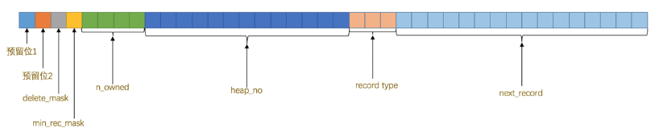

《MySQL 怎样运行的？-从跟上理解MySQL》---小孩子 

**摘抄**

InnoDB读取数据的方式：**将数据划分为若干个页，以页作为磁盘和内存之间交互的基本单位，InnoDB中页的大小 一般为 16 KB**。也就是在一般情况下，一次最少从磁盘中读取16KB的内容到内存中，一次最少把内存中的16KB 内容刷新到磁盘中。

### 4 InnoDB 行格式

我们平时是以记录为单位来向表中插入数据的，这些记录在磁盘上的存放方式也被称为 **行格式** 或者 **记录格式** 。 设计 InnoDB 存储引擎的大叔们到现在为止设计了4种不同类型的 行格式 ，分别是 **Compact** 、 **Redundant** 、 **Dynamic** 和 **Compressed** 行格式，随着时间的推移，他们可能会设计出更多的行格式，但是不管怎么变，在原理 上大体都是相同的。

##### 指定行格式语法

我们可以在创建或修改表的语句中指定 行格式 ： 

CREATE TABLE 表名 (列的信息) ROW_FORMAT=行格式名称

 ALTER TABLE 表名 ROW_FORMAT=行格式名称

比如我们在 xiaohaizi 数据库里创建一个演示用的表 record_format_demo ，可以这样指定它的 行格式 ：

```mysql 
mysql> USE xiaohaizi; Database changed
mysql> CREATE TABLE record_format_demo ( 
    ->c1 VARCHAR(10),
	->c2 VARCHAR(10) NOT NULL, 
    ->c3 CHAR(10), 
    ->c4 VARCHAR(10)
	-> ) CHARSET=ascii ROW_FORMAT=COMPACT; 
Query OK, 0 rows affected (0.03 sec)
```

这里刚刚创建的这个表的行格式就是 COMPACT，另外我们还显式指定了这个表的字符集为 ascii ， 因为 ascii 字符集只包括空格、标点符号、数字、大小写字母和一些不可见字符，所以我们的汉字是不能存到这 个表里的。我们现在向这个表中插入两条记录。

```mysql
mysql> INSERT INTO record_format_demo(c1, c2, c3, c4) VALUES('aaaa', 'bbb', 'cc', 'd'), ('eeee', 'fff', NULL, NULL); 
Query OK, 2 rows affected (0.02 sec) Records: 2 Duplicates: 0 Warnings: 0
```

查询结果是这样的：

```mysql
c1  |c2 |c3|c4|
----|---|--|--|
aaaa|bbb|cc|d |
eeee|fff|  |  |
```

比较各个行格式下的存储方式有啥不同吧。

#### 1 COMPACT 行格式


一条完整的记录其实可以被分为 **记录的额外信息** 和 **记录的真实数据** 两大部分，下边我 们详细看一下这两部分的组成。

##### 1.1 记录的额外信息

这部分信息是**服务器为了描述这条记录而不得不额外添加的一些信息**，这些额外信息分为3类，分别是 **变长字段 长度列表 、 NULL值列表 和 记录头信息** ，我们分别看一下。

###### 变长字段长度列表

MySQL支持一些变长的数据类型，比如 VARCHAR(M) 、 VARBINARY(M) 、各种 TEXT 类型，各种 BLOB 类 型，我们也可以把拥有这些数据类型的列称为 变长字段 ，变长字段中存储多少字节的数据是不固定的，所以我 们在存储真实数据的时候需要顺便把这些数据占用的字节数也存起来，这样才不至于把 MySQL 服务器搞懵，所以 这些变长字段占用的存储空间分为两部分：

- 真正的数据内容
- 占用的字节数

**在 Compact 行格式中，把所有变长字段的真实数据占用的字节长度都存放在记录的开头部位，从而形成一个变长 字段长度列表，各变长字段数据占用的字节数按照列的顺序逆序存放**，我们再次强调一遍，是逆序存放！

上面插入的数据记录('aaaa', 'bbb', 'cc', 'd')，因为使用的是 ascii 字符集，所以每个字符只需要一个字节来进行编码，第一条记录的存放效果：


这里的 01 03 04 是16进制（0x04, 0x03, 0x01）,对应的是 c1,c2,c4 列（c3 是 char，不是变长）。这里顺序是逆序放的。

由于第一行记录中 c1 、 c2 、 c4 列中的字符串都比较短，也就是说内容占用的字节数比较小，用1个字节就可 以表示，但是如果变长列的内容占用的字节数比较多，可能就需要用2个字节来表示。具体用1个还是2个字节来 表示真实数据占用的字节数， InnoDB 有它的一套规则。（暂时先不管规则是怎样的，InnoDB 自己实现的就好了）

需要注意的一点是，**变长字段长度列表只存储值为非 NULL 的列内容占用的长度，值为 NULL 的列的长度是不储存的**。对第二条记录来说 c4列值为null，所以第二条记录的 变长字段长度列表 只需要存储c1和c2的列的长度即可。


> 并不是所有记录都有这个 变长字段长度列表 部分，比方说表中所有的列都不是变长的数据类型的话， 这一部分就不需要有。

###### NULL 值列表 

我们知道表中的某些列可能存储 NULL 值，如果把这些 NULL 值都放到 记录的真实数据 中存储会很占地方，所 以 Compact 行格式把这些值为 NULL 的列统一管理起来，存储到 NULL 值列表中，它的处理过程是这样的

1. 首先统计表中允许存储 NULL 的列有哪些。

   我们前边说过，主键列、被 NOT NULL 修饰的列都是不可以存储 NULL 值的，所以在统计的时候不会把这些列 算进去。比方说表 record_format_demo 的3个列 c1 、 c3 、 c4 都是允许存储 NULL 值的，而 c2 列是被 NOT NULL 修饰，不允许存储 NULL 值。

2. 如果表中没有允许存储 NULL 的列，则 NULL值列表 也不存在了，否则将每个允许存储 NULL 的列对应一个 二进制位，二进制位按照列的顺序逆序排列，二进制位表示的意义如下：

   - 二进制位的值为 1 时，代表该列的值为 NULL。
   - 二进制位的值为 0 时，代表该列的值不为 NULL

   我们当前表允许3个值为 null 的列，所以

3. MySQL 规定 NULL值列表 必须用整数个字节的位表示，如果使用的二进制位个数不是整数个字节，则在字节 的高位补 0 。

   表 record_format_demo 只有3个值允许为 NULL 的列，对应3个二进制位，不足一个字节，所以在字节的高 位补 0 ，效果就是这样：
   

以此类推，如果一个表中有9个允许为 NULL ，那这个记录的 NULL 值列表部分就需要2个字节来表示了。

知道了规则之后，我们再返回头看表 record_format_demo 中的两条记录中的 NULL值列表 应该怎么储存。因为只 有 c1 、 c3 、 c4 这3个列允许存储 NULL 值，所以所有记录的 NULL值列表 只需要一个字节。

- 对于第一条记录来说， c1 、 c3 、 c4 这3个列的值都不为 NULL ，所以它们对应的二进制位都是 0 ，画个 图就是这样。

  

  所以第一条记录的 NULL 值列表，用十六进制表示就是：0x00；

- 对于第二条记录来说， c1 、 c3 、 c4 这3个列中 c3 和 c4 的值都为 NULL ，所以这3个列对应的二进制位的 情况就是

  

  所以第二条记录的 NULL值列表 用十六进制表示就是： 0x06 。

所以最后填充了 NULL值列表 后的示意图就是i这样：


###### 记录头信息 

除了 变长字段长度列表 、 NULL值列表 之外，还有一个用于描述记录的 记录头信息 ，它是由固定的 5 个字节组 成。 5 个字节也就是 40 个二进制位，不同的位代表不同的意思，如图：



| 名称         | 大小（单位：bit） | 描述                                                         |
| ------------ | ----------------- | ------------------------------------------------------------ |
| 预留位1      | 1                 | 没有使用                                                     |
| 预留位2      | 1                 | 没有使用                                                     |
| delete_mask  | 1                 | 标记该记录是否被删除                                         |
| min_rec_mask | 1                 | B+树的每层非叶子节点中的最小记录都会添加该标记               |
| n_owned      | 4                 | 表示当前记录拥有的记录数                                     |
| heap_no      | 13                | 表示当前记录在记录堆的位置信息                               |
| record_type  | 3                 | 表示当前记录的类型， 0 表示普通记录， 1 表示B+树非叶子节点记录， 2 表示最小记录， 3 表示最大记录 |
| next_record  | 16                | 表示下一条记录的相对位置                                     |

##### 1.2 记录的真实数据

对于 record_format_demo 表来说， 记录的真实数据 除了 c1 、 c2 、 c3 、 c4 这几个我们自己定义的列的数据 以外， MySQL 会为每个记录默认的添加一些列（也称为 隐藏列 ），具体的列如下：

| 列名           | 是否必须 | 占用空间 | 描述                   |
| -------------- | -------- | -------- | ---------------------- |
| row_id         | 否       | 6字节    | 行ID，唯一标识一条记录 |
| transaction_id | 是       | 6字节    | 事务ID                 |
| roll_pointer   | 是       | 7字节    | 回滚指针               |

> 实际上这几个列的真正名称其实是：DB_ROW_ID、DB_TRX_ID、DB_ROLL_PTR，我们为了美观才写成了row _id、transaction_id和roll_pointer。

这里需要提一下 InnoDB 表对主键的生成策略：**优先使用用户自定义主键作为主键**，如果用户没有定义主键，则 选取一个 Unique 键作为主键，如果表中连 Unique 键都没有定义的话，则 InnoDB 会为表默认添加一个名为 row_id 的隐藏列作为主键。所以我们从上表中可以看出：**InnoDB存储引擎会为每条记录都添加 transaction_id 和 roll_pointer 这两个列，但是 row_id 是可选的（在没有自定义主键以及Unique键的情况下才会添加该列）**。 这些隐藏列的值不用我们操心， InnoDB 存储引擎会自己帮我们生成的。

因为表 record_format_demo 并没有定义主键，所以 MySQL 服务器会为每条记录增加上述的3个列。现在看一下 加上 记录的真实数据 的两个记录长什么样吧：


看这个图的时候我们需要注意几点：

1. 表 record_format_demo 使用的是 ascii 字符集，所以 0x61616161 就表示字符串 'aaaa' ， 0x626262 就表 示字符串 'bbb' ，以此类推。
2. 注意第1条记录中 c3 列的值，它是 CHAR(10) 类型的，它实际存储的字符串是： 'cc' ，而 ascii 字符集中 的字节表示是 '0x6363' ，虽然表示这个字符串只占用了2个字节，但整个 c3 列仍然占用了10个字节的空 间，除真实数据以外的8个字节的统统都用空格字符填充，空格字符在 ascii 字符集的表示就是 0x20 。
3. 注意第2条记录中 c3 和 c4 列的值都为 NULL ，它们被存储在了前边的 NULL值列表 处，在记录的真实数据处 就不再冗余存储，从而节省存储空间。

###### char(m) 列的存储格式 

c3 列类型是 CHAR(10)，是一个定长字符集，也就是说表示一个字符采用固定的一个字节，如果采用变长的字符集（也就是表示一个字符需要的字节数不确定），c3 列的长度也会被存储到 变长字段 长度列表 中。

这就意味着：**对于 CHAR(M) 类型的列来说，当列采用的是定长字符集时，该列占用的字节数不会被加到变长字 段长度列表，而如果采用变长字符集时，该列占用的字节数也会被加到变长字段长度列表**。

#### 2 Redundant 行格式

我们现在要介绍的 Redundant 行格式是 MySQL5.0 之前用的一种行格式，也就是说它已经非常老了。


#### 3 行溢出数据

我们知道对于 VARCHAR(M) 类型的列最多可以占用 65535 个字节。其中的 M 代表该类型最多存储的字符数量，如 果我们使用 ascii 字符集的话，一个字符就代表一个字节，我们看看 VARCHAR(65535) 是否可用：

```mysql
mysql>CREATE TABLE varchar_size_demo( 
    ->c VARCHAR(65535) 
    -> ) CHARSET=ascii ROW_FORMAT=Compact;
ERROR 1118 (42000): Row size too large. The maximum row size for the used table type, not counting BLOBs, is 65535. This includes storage overhead, check the manual. You have to c hange some columns to TEXT or BLOBs mysql>
```

从报错信息里可以看出， MySQL 对一条记录占用的最大存储空间是有限制的，除了 BLOB 或者 TEXT 类型的列之 外，其他所有的列（不包括隐藏列和记录头信息）占用的字节长度加起来不能超过 65535 个字节。所以 MySQL 服 务器建议我们把存储类型改为 TEXT 或者 BLOB 的类型。这个 65535 个字节除了列本身的数据之外，还包括一些 其他的数据（ storage overhead ），比如说我们为了存储一个 VARCHAR(M) 类型的列，其实需要占用3部分存储 空间：

- 真实数据
- 真实数据占用字节的长度 
- NULL 值标识，如果该列有 NOT NULL 属性则可以没有这部分存储空间

如果该 VARCHAR 类型的列**没有 NOT NULL** 属性，那最多只能存储 65532 个字节的数据，因为真实数据的长度可能 占用2个字节(只有一列情况)， NULL 值标识需要占用1个字节：

```mysql
mysql> CREATE TABLE varchar_size_demo( 
    ->c VARCHAR(65532)
    -> ) CHARSET=ascii ROW_FORMAT=Compact; Query OK, 0 rows affected (0.02 sec)
```

如果 VARCHAR 类型的列**有 NOT NULL** 属性，那最多只能存储 65533 个字节的数据，因为真实数据的长度可能占用 2个字节，不需要 NULL 值标识：

```mysql
mysql> CREATE TABLE varchar_size_demo( 
    ->c VARCHAR(65533) NOT NULL
	-> ) CHARSET=ascii ROW_FORMAT=Compact; Query OK, 0 rows affected (0.02 sec)
```

如果 VARCHAR(M) 类型的列使用的不是 ascii 字符集，那会怎么样呢？来看一下：

```mysql
mysql> CREATE TABLE varchar_size_demo( ->
c VARCHAR(65532) -> ) CHARSET=gbk ROW_FORMAT=Compact;
ERROR 1074 (42000): Column length too big for column 'c' (max = 32767); use BLOB or TEXT i nstead

mysql> CREATE TABLE varchar_size_demo( ->
c VARCHAR(65532) -> ) CHARSET=utf8 ROW_FORMAT=Compact;
ERROR 1074 (42000): Column length too big for column 'c' (max = 21845); use BLOB or TEXT i nstead
```

从执行结果中可以看出，如果 VARCHAR(M) 类型的列使用的不是 ascii 字符集，那 M 的最大取值取决于该字符集 表示一个字符最多需要的字节数。在列的值允许为 NULL 的情况下， gbk 字符集表示一个字符最多需要 2 个字 节，那在该字符集下， M 的最大取值就是 32766 （也就是：65532/2），也就是说最多能存储 32766 个字符； utf8 字符集表示一个字符最多需要 3 个字节，那在该字符集下， M 的最大取值就是 21844 ，就是说最多能存储 21844 （也就是：65532/3）个字符。

>上述所言在列的值允许为NULL的情况下，gbk字符集下M的最大取值就是32766，utf8字符集下M的最大取 值就是21844，这都是在表中只有一个字段的情况下说的，一定要记住一个行中的所有列（不包括隐藏 列和记录头信息）占用的字节长度加起来不能超过65535个字节！

##### 3.1 记录中的数据太多产生的溢出 

我们以 ascii 字符集下的 varchar_size_demo 表为例，插入一条记录：

```mysql
mysql> CREATE TABLE varchar_size_demo( 
->c VARCHAR(65532)
-> ) CHARSET=ascii ROW_FORMAT=Compact; Query OK, 0 rows affected (0.01 sec)

mysql> INSERT INTO varchar_size_demo(c) VALUES(REPEAT('a', 65532)); 
Query OK, 1 row affected (0.00 sec)
```

其中的 REPEAT('a', 65532) 是一个函数调用，它表示生成一个把字符 'a' 重复 65532 次的字符串。前边说 过， MySQL 中磁盘和内存交互的基本单位是 页 ，也就是说 MySQL 是以 页 为基本单位来管理存储空间的，我们 的记录都会被分配到某个 页 中存储。而**一个页的大小一般是 16KB ，也就是 16384 字节，而一个 VARCHAR(M) 类 型的列就最多可以存储 65532 个字节，这样就可能造成一个页存放不了一条记录的尴尬情况**。

在 Compact 和 Reduntant 行格式中，**对于占用存储空间非常大的列，在 记录的真实数据 处只会存储该列的一部分数据，把剩余的数据分散存储在几个其他的页中**，**然后 记录的真实数据 处用20个字节存储指向这些页的地址 （当然这20个字节中还包括这些分散在其他页面中的数据的占用的字节数），从而可以找到剩余数据所在的页**， 如图所示：


从图中可以看出来，对于 Compact 和 Reduntant 行格式来说，如果某一列中的数据非常多的话，在本记录的真实 数据处只会存储该列的前 768 个字节的数据和一个指向其他页的地址，然后把剩下的数据存放到其他页中，这个 过程也叫做 行溢出 ，**存储超出 768 字节的那些页面也被称为 溢出页** 。画一个简图就是这样


最后需要注意的是，**不只是 VARCHAR(M) 类型的列，其他的 TEXT、BLOB 类型的列在存储数据非常多的时候 也会发生 行溢出** 。

##### 3.2 行溢出的临界点

那发生 行溢出 的临界点是什么呢？也就是说在列存储多少字节的数据时就会发生 行溢出 ？

**MySQL 中规定一个页中至少存放两行记录**，至于为什么这么规定我们之后再说，现在看一下这个规定造成的影 响。以上边的 varchar_size_demo 表为例，它只有一个列 c ，我们往这个表中插入两条记录，每条记录最少插入 多少字节的数据才会 行溢出 的现象呢？这得分析一下页中的空间都是如何利用的。

- 每个页除了存放我们的记录以外，也需要存储一些额外的信息，乱七八糟的额外信息加起来需要 136 个字节 的空间（现在只要知道这个数字就好了），其他的空间都可以被用来存储记录。
- 每个记录需要的额外信息是 27 字节。

这27个字节包括下边这些部分：

-  2个字节用于存储真实数据的长度
-  1个字节用于存储列是否是NULL值 
- 5个字节大小的头信息 
- 6个字节的 row_id 列 
- 6个字节的 transaction_id 列 
- 7个字节的 roll_pointer 列

假设一个列中存储的数据字节数为n，那么发生 行溢出 现象时需要满足这个式子

> 136 + 2×(27 + n) > 16384(16kb) ---- 2 x ：是两条记录

求解这个式子得出的解是： n > 8098 。也就是说如果一个列中存储的数据不大于 8098 个字节，那就不会发生 行溢出 ，否则就会发生 行溢出 。不过这个 8098 个字节的结论只是针对只有一个列的 varchar_size_demo 表来 说的，如果表中有多个列，那上边的式子和结论都需要改一改了，所以重点就是：**你不用关注这个临界点是什 么，只要知道如果我们想一个行中存储了很大的数据时，可能发生 行溢出 的现象**。

#### 4 Dynamic 和 Compressed 行格式

下边要介绍另外两个行格式， Dynamic 和 Compressed 行格式，我现在使用的 MySQL 版本是 5.7 ，它的默认行格 式就是 Dynamic ，这俩行格式和 Compact 行格式挺像，只不过在处理 行溢出 数据时有点儿分歧，它们不会在记 录的真实数据处存储字段真实数据的前 768 个字节，而是把所有的字节都存储到其他页面中，只在记录的真实数 据处存储其他页面的地址，就像这样


Compressed 行格式和 Dynamic 不同的一点是， Compressed 行格式会采用压缩算法对页面进行压缩，以节省空 间。

### 5 InnoDB 数据页结构

#### 5.1 不同类型的页

页是InnoDB管理存储空间的基本单位，一个页的大小一般是16kb。InnoDB 为不同的目的设计了许多种不同类型的页，比如存放表空间头部信息的页，存放 Insert Buffer 信息的页，存放 INODE 信息的页，存放 undo 日志信息的页等等。

我们表种记录的那种类型的页，官方称这种存放记录的页为**索引页**，鉴于我们还没有了解过索引 是个什么东西，而这些表中的记录就是我们日常口中所称的 数据 ，所以目前还是叫这种存放记录的页为 数据页 吧。

#### 5.2 数据页结构的快速浏览 

数据页代表的这块 16kb 大小的存储空间可以被划分成多个部分，不同部分有不同部分的功能，各个部分如图所示：


这7个部分存储内容如下所示：

| 名称             | 中文名             | 占用空间大小 | 简单描述                 |
| ---------------- | ------------------ | ------------ | ------------------------ |
| File Header      | 文件头部           | 38字节       | 页的一些通用信息         |
| Page Header      | 页面头部           | 56字节       | 数据页专有的一些信息     |
| Infimum+Supremum | 最小记录和最大记录 | 26字节       | 两个虚拟的行记录         |
| User Records     | 用户记录           | 不确定       | 实际存储的行记录内容     |
| Free Space       | 空闲空间           | 不确定       | 页中尚未使用的空间       |
| Page Directory   | 页面目录           | 不确定       | 页中的某些记录的相对位置 |
| File Trailer     | 文件尾部           | 8字节        | 检验页是否完整           |

#### 5.3 记录在页中的存储 

在页的7个组成部分中，我们自己存储的记录会按照我们指定的 行格式 存储到 User Records 部分。但是在一开 始生成页的时候，其实并没有 User Records 这个部分，每当我们插入一条记录，都会从 Free Space 部分，也就 是尚未使用的存储空间中申请一个记录大小的空间划分到 User Records 部分，当 Free Space 部分的空间全部 被 User Records 部分替代掉之后，也就意味着这个页使用完了，如果还有新的记录插入的话，就需要去申请新 的页了，这个过程的图示如下：


为了更好的管理在 User Records 中的这些记录， InnoDB 可费了一番力气呢，在哪费力气了呢？不就是把记录按 照指定的行格式一条一条摆在 User Records 部分么？其实这话还得从记录行格式的 记录头信息 中说起。

##### 5.3.1 记录头信息的秘密 

```mysql
mysql> CREATE TABLE page_demo( 
    ->c1 INT,
    ->c2 INT,
	->c3 VARCHAR(10000), PRIMARY KEY (c1)
-> ) CHARSET=ascii ROW_FORMAT=Compact; 
Query OK, 0 rows affected (0.03 sec)
```

这个新创建的 page_demo 表有3个列，其中 c1 和 c2 列是用来存储整数的， c3 列是用来存储字符串的。需要注 意的是，我们把 c1 列指定为主键，所以在具体的行格式中InnoDB就没必要为我们去创建那个所谓的 row_id 隐 藏列了。而且我们为这个表指定了 ascii 字符集以及 Compact 的行格式。所以这个表中记录的行格式示意图就是 这样的:


从图中可以看到，我们特意把 记录头信息 的5个字节的数据给标出来了，说明它很重要，我们再次先把这些 记 录头信息 中各个属性的大体意思浏览一下（我们目前使用 Compact 行格式进行演示）：

| 名称         | 大小（单位：bit） | 描述                                                         |
| ------------ | ----------------- | ------------------------------------------------------------ |
| 预留位1      | 1                 | 没有使用                                                     |
| 预留位2      | 1                 | 没有使用                                                     |
| delete_mask  | 1                 | 标记该记录是否被删除                                         |
| min_rec_mask | 1                 | B+树的每层非叶子节点中的最小记录都会添加该标记               |
| n_owned      | 4                 | 表示当前记录拥有的记录数                                     |
| heap_no      | 13                | 表示当前记录在记录堆的位置信息                               |
| record_type  | 3                 | 表示当前记录的类型， 0 表示普通记录， 1 表示B+树非叶子节点记录， 2 表示最小记录， 3 表示最大记录 |
| next_record  | 16                | 表示下一条记录的相对位置                                     |

page_demo 表的行格式简化图如下：


插入几条记录：

> mysql> INSERT INTO page_demo VALUES(1, 100, 'aaaa'), (2, 200, 'bbbb'), (3, 300, 'cccc'), (4, 400, 'dddd');
> Query OK, 4 rows affected (0.00 sec) Records: 4 Duplicates: 0 Warnings: 0

为了方便大家分析这些记录在 页 的 User Records 部分中是怎么表示的，我把记录中头信息和实际的列数据都用 十进制表示出来了（其实是一堆二进制位），所以这些记录的示意图就是:


看这个图的时候需要注意一下，各条记录在 User Records 中存储的时候并没有空隙，这里只是为了大家观看方 便才把每条记录单独画在一行中。我们对照着这个图来看看记录头信息中的各个属性是啥意思:

- delete_mask

  这个属性标记着当前记录是否被删除，占用1个二进制位，值为 0 的时候代表记录并没有被删除，为 1 的时 候代表记录被删除掉了。

  啥？**被删除的记录还在 页 中么**？是的，摆在台面上的和背地里做的可能大相径庭，**你以为它删除了，可它 还在真实的磁盘上**。**这些被删除的记录之所以不立即从磁盘上移除，是因为移除 它们之后把其他的记录在磁盘上重新排列需要性能消耗，所以只是打一个删除标记而已，所有被删除掉的记 录都会组成一个所谓的 垃圾链表 ，在这个链表中的记录占用的空间称之为所谓的 可重用空间 ，之后如果有 新记录插入到表中的话，可能把这些被删除的记录占用的存储空间覆盖掉**。

- min_rec_mask

  B+树的每层非叶子节点中的最小记录都会添加该标记，什么是个 B+ 树？什么是个非叶子节点？好吧，等会 再聊这个问题。反正我们自己插入的四条记录的 min_rec_mask 值都是 0 ，意味着它们都不是 B+ 树的非叶 子节点中的最小记录。

- n_owned

- heap_no

  这个属性表示当前记录在本 页 中的位置，从图中可以看出来，我们插入的4条记录在本 页 中的位置分别 是： 2 、 3 、 4 、 5 。是不是少了点啥？是的，怎么不见 heap_no 值为 0 和 1 的记录呢？

  这其实是设计 InnoDB 的大叔们玩的一个小把戏，**他们自动给每个页里边儿加了两个记录，由于这两个记录 并不是我们自己插入的，所以有时候也称为 伪记录 或者 虚拟记录** 。这两个伪记录一个代表 最小记录 ，一 个代表 最大记录 ，等一下哈~，记录可以比大小么？

  是的，记录也可以比大小，对于一条完整的记录来说，比较记录的大小就是比较 主键 的大小。比方说我们 插入的4行记录的主键值分别是： 1 、 2 、 3 、 4 ，这也就意味着这4条记录的大小从小到大依次递增。

  但是不管我们向 页 中插入了多少自己的记录，设计 InnoDB 的大叔们都规定他们定义的两条伪记录分别为最 小记录与最大记录。这两条记录的构造十分简单，**都是由5字节大小的 记录头信息 和8字节大小的一个固定 的部分组成的**，如图所示：
  

  由于这两条记录不是我们自己定义的记录，所以它们并不存放在 页 的 User Records 部分，**他们被单独放在 一个称为 Infimum + Supremum 的部分**，上面有页的结构。

  

  从图中我们可以看出来，最小记录和最大记录的 heap_no 值分别是 0 和 1 ，也就是说它们的位置最靠前。

- record_type

  这个属性表示当前记录的类型，一共有4种类型的记录， 0 表示普通记录， 1 表示B+树非叶节点记录， 2 表 示最小记录， 3 表示最大记录。从图中我们也可以看出来，我们自己插入的记录就是普通记录，它们的 record_type 值都是 0 ，而最小记录和最大记录的 record_type 值分别为 2 和 3 

- next_record

  很重要！！！**它表示从当前记录的真实数据到下一条记录的真实数据的地址偏移量**。比方说第一条记录的 next_record 值为 32 ，意味着从第一条记录的真实数据的地址处向后找 32 个字节便是下一条记录的 真实数据。如果你熟悉数据结构的话，就立即明白了，这其实是个 链表 ，可以通过一条记录找到它的下一 条记录。但是需要注意注意再注意的一点是， **下一条记录 指得并不是按照我们插入顺序的下一条记录，而 是按照主键值由小到大的顺序的下一条记录**。而且规定**Infimum记录（也就是最小记录） 的下一条记录就是 本页中主键值最小的用户记录，而本页中主键值最大的用户记录的下一条记录就是 Supremum记录（也就 是最大记录）** ，为了更形象的表示一下这个 next_record 起到的作用，我们用箭头来替代一下 next_record 中的地址偏移量：
  

  从图中可以看出，**我们的记录按照主键从小到大的顺序形成了一个单链表**。最大记录 的 next_record 的 值为 0 ，这也就是说最大记录是没有 下一条记录 了，它是这个单链表中的最后一个节点。如果从中删除掉 一条记录，这个链表也是会跟着变化的，比如我们把第2条记录删掉。

  删掉第二条记录之后的示意图：（可以类比到数据变化了之后，索引重新计算且变化）

  

  从中可以看出，删除第二条记录前后主要发生了这些变化：

  - 第2条记录并没有从存储空间中移除，而是把该条记录的 delete_mask 值设置为 1。
  - 第2条记录的 next_record 值变为了0，意味着该记录没有下一条记录了。
  - 第1条记录的 next_record 指向了第3条记录
  - 还有一点你可能忽略了，就是 最大记录 的 n_owned 值从 5 变成了 4 ，关于这一点的变化我们稍后会详 细说明的。

  > 所以，不论我们怎么对页中的记录做增删改操作，InnoDB始终会维护一条记录的单链表，链表中的各个 节点是按照主键值由小到大的顺序连接起来的。
  >
  > 你会不会觉得next_record这个指针有点儿怪，为啥要指向记录头信息和真实数据之间的位置 呢？为啥不干脆指向整条记录的开头位置，也就是记录的额外信息开头的位置呢？ 因为这个位置刚刚好，向左读取就是记录头信息，向右读取就是真实数据。我们前边还说过变 长字段长度列表、NULL值列表中的信息都是逆序存放，这样可以使记录中位置靠前的字段和它 们对应的字段长度信息在内存中的距离更近，可能会提高高速缓存的命中率。

  再来看一个有意思的事情，因为主键值为 2 的记录被我们删掉了，但是存储空间却没有回收，如果我们再次把这 条记录插入到表中，会发生什么事呢?

  > mysql> INSERT INTO page_demo VALUES(2, 200, 'bbbb');

  

  从图中可以看到， InnoDB 并没有因为新记录的插入而为它申请新的存储空间，而是直接复用了原来被删除记录 的存储空间。

  > 当数据页中存在多条被删除掉的记录时，这些记录的next_record属性将会把这些被删除掉的记录组成 一个垃圾链表，以备之后重用这部分存储空间。

##### 5.4 Page Directory (页目录)

现在了解了，记录在页中按照**主键值从小到大顺序串联成一个单链表**，那如果我们想**根据主键值查找页中的某 条记录该咋办呢**？比如说这样的查询语句：

> SELECT * FROM page_demo WHERE c1 = 3;

最笨的方法：从 Infimum 记录（最小记录）开始，沿着链表一直往后找，总有一天会找到（或者找不到[摊 手]），在找的时候还能投机取巧，因为链表中各个记录的值是按照从小到大顺序排列的，所以当链表的某个节点 代表的记录的主键值大于你想要查找的主键值时，你就可以停止查找了，因为该节点后边的节点的主键值依次递增。

这个方法在页中存储记录数量比较少的情况用起来没啥问题；但是如果一个页中存储了非常多的记录，这么查找对性能来说还是有损耗的，所以我们说这种遍历查找是一个笨办法。但是设计InnoDB的大叔们设计了一种方式，**是从书中的目录中找到的灵感**。

我们平常想从一本书中查找某个内容的时候，一般会先看目录，找到需要查找的内容对应的书的页码，然后到对 应的页码查看内容。设计 InnoDB 的大叔们为我们的记录也制作了一个类似的目录，他们的制作过程是这样的：

1. **将所有正常的记录（包括最大和最小记录，不包括标记为已删除的记录）划分为几个组**。
2. **每个组的最后一条记录（也就是组内最大的那条记录）的头信息中的 n_owned 属性表示该记录拥有多少条记 录，也就是该组内共有几条记录**。
3. **将每个组的最后一条记录的地址偏移量单独提取出来按顺序存储到靠近 页 的尾部的地方，这个地方就是所谓的 Page Directory ，也就是 页目录** （此时应该返回去看看页面各个部分的图）。页面目录中的这些地址偏移量被称为 **槽** （英文名： Slot ），所以这个页面目录就是由 槽 组成的。

比方说现在的 page_demo 表中正常的记录共有6条， InnoDB 会把它们分成两组，第一组中只有一个最小记录， 第二组中是剩余的5条记录，看下边的示意图：


从这个图中我们需要注意这么几点：

- 现在 页目录 部分中有两个槽，也就意味着我们的记录被分为了两个组，**槽1中的值是112，代表最大记录的地址偏移量（就是从页面的0字节开始数，数112个字节）；槽0 中的值是 99，代表最小记录的地址偏移量**。
- 注意最小和最大记录的头信息中的 n_owned 属性 
  - 最小记录的 n_owned 值为 1 ，这就代表着以最小记录结尾的这个分组中只有 1 条记录，也就是最小记录 本身。
  - 最大记录的 n_owned 值为 5 ，这就代表着以最大记录结尾的这个分组中只有 5 条记录，包括最大记录本 身还有我们自己插入的 4 条记录。

99 和 112 这样的地址偏移量很不直观，我们用箭头指向的方式替代数字，这样更易于我们理解，所以修改后的示意图就是这样：


我们可以从逻辑上看一下这些记录和页目录的关系：


为什么最小记录的 n_owned 值为1，而最大记录的 n_owned 值为 5 呢，这里头有什么猫腻么？

是的，设计 InnoDB 的大叔们对每个分组中的记录条数是有规定的：**对于最小记录所在的分组只能有 1 条记录， 最大记录所在的分组拥有的记录条数只能在 1~8 条之间，剩下的分组中记录的条数范围只能在是 4~8 条之间**。 所以分组是按照下边的步骤进行的：

- 初始情况下一个数据页里只有最小记录和最大记录两条记录，它们分属于两个分组。 
- 之后每插入一条记录，都会从 页目录 中找到主键值比本记录的主键值大并且差值最小的槽，然后把该槽对 应的记录的 n_owned 值加1，表示本组内又添加了一条记录，直到该组中的记录数等于8个。 
- **在一个组中的记录数等于8个后再插入一条记录时，会将组中的记录拆分成两个组，一个组中4条记录，另一 个5条记录**。**这个过程会在 页目录 中新增一个 槽 来记录这个新增分组中最大的那条记录的偏移量**。

继续添加一些记录：

> mysql> INSERT INTO page_demo VALUES(5, 500, 'eeee'), (6, 600, 'ffff'), (7, 700, 'gggg'), (8, 800, 'hhhh'), (9, 900, 'iiii'), (10, 1000, 'jjjj'), (11, 1100, 'kkkk'), (12, 1200, 'l lll'), (13, 1300, 'mmmm'), (14, 1400, 'nnnn'), (15, 1500, 'oooo'), (16, 1600, 'pppp');

哈，我们一口气又往表中添加了12条记录，现在页里边就一共有18条记录了（包括最小和最大记录），这些记录 被分成了5个组，如图所示:


因为把16条记录的全部信息都画在一张图里太占地方，让人眼花缭乱的，所以只保留了用户记录头信息中的 n_owned 和 next_record 属性，也省略了各个记录之间的箭头，我没画不等于没有啊。现在看怎么从这个 页目录 中查找记录。因为各个槽代表的记录的主键值都是从小到大排序的，所以我们可以使用所谓的 二分法 来进行 快速查找。4个槽的编号分别是： 0 、 1 、 2 、 3 、 4 ，所以初始情况下最低的槽就是 low=0 ，最高的槽就是 high=4 。比方说我们想找主键值为 6 的记录，过程是这样的：

1. 计算中间槽的位置： (0+4)/2=2 ，所以查看 槽2 对应记录的主键值为 8 ，又因为 8 > 6 ，所以设置 high=2 ， low 保持不变。

2. 重新计算中间槽的位置： (0+2)/2=1 ，所以查看 槽1 对应的主键值为 4 ，又因为 4 < 6 ，所以设置 low=1 ， high 保持不变。
3. 因为 high - low 的值为1，所以确定主键值为 5 的记录在 槽2 对应的组中。此刻我们需要找到 槽2 中主键 值最小的那条记录，然后沿着单向链表遍历 槽2 中的记录。但是我们前边又说过，**每个槽对应的记录都是该 组中主键值最大的记录，这里 槽2 对应的记录是主键值为 8 的记录**，怎么定位一个组中最小的记录呢？**别忘 了各个槽都是挨着的，我们可以很轻易的拿到 槽1 对应的记录**（主键值为 4 ），**该条记录的下一条记录就 是 槽2 中主键值最小的记录，该记录的主键值为 5** 。所以我们可以从这条主键值为 5 的记录出发，遍历 槽 2 中的各条记录，直到找到主键值为 6 的那条记录即可。由于一个组中包含的记录条数只能是1~8条，所以 遍历一个组中的记录的代价是很小的。

所以，在一个数据页中查找指定主键值的记录的过程分为两步：

1. **通过二分法确定该记录所在的槽，并找到该槽中主键值最小的那条记录**。
2. **通过记录的 next_record 属性遍历该槽所在组中的各个记录**。

##### 5.5 Page Header（页面头部）

设计 InnoDB 的大叔们为了能得到**一个数据页中存储的记录的状态信息**，比如本页中已经存储了多少条记录，第 一条记录的地址是什么，页目录中存储了多少个槽等等，特意在页中定义了一个叫 Page Header 的部分，它是 页 结构的第二部分，这个部分占用固定的 56 个字节，专门存储各种状态信息。

| 名称              | 占用空间大小（单位：字节） | 描述                                                         |
| ----------------- | -------------------------- | ------------------------------------------------------------ |
| PAGE_N_SLOTS      | 2                          | 在页目录中的槽数量                                           |
| PAGE_HEAP_TOP     | 2                          | 还未使用的空间最小地址，也就是说从该地址之后就是 Free Space  |
| PAGE_N_HEAP       | 2                          | 本页中的记录的数量（包括最小和最大记录以及标记为删除的记录） |
| PAGE_FREE         | 2                          | 第一个已经标记为删除的记录地址（各个已删除的记录通过 next_record 也会组成一个单链 表，这个单链表中的记录可以被重新利用） |
| PAGE_GARBAGE      | 2                          | 已删除记录占用的字节数                                       |
| PAGE_LAST_INSERT  | 2                          | 最后插入记录的位置                                           |
| PAGE_DIRECTION    | 2                          | 记录插入的方向                                               |
| PAGE_N_DIRECTION  | 2                          | 一个方向连续插入的记录数量                                   |
| PAGE_N_RECS       | 2                          | 该页中记录的数量（不包括最小和最大记录以及被标记为删除的记录） |
| PAGE_MAX_TRX_ID   | 8                          | 修改当前页的最大事务ID，该值仅在二级索引中定义               |
| PAGE_LEVEL        | 2                          | 当前页在B+树中所处的层级                                     |
| PAGE_INDEX_ID     | 8                          | 索引ID，表示当前页属于哪个索引                               |
| PAGE_BTR_SEG_LEAF | 10                         | B+树叶子段的头部信息，仅在B+树的Root页定义                   |
| PAGE_BTR_SEG_TOP  | 10                         | B+树非叶子段的头部信息，仅在B+树的Root页定义                 |

PAGE_DIRECTION 和 PAGE_N_DIRECTION 的意思：

- PAGE_DIRECTION
  **假如新插入的一条记录的主键值比上一条记录的主键值大，我们说这条记录的插入方向是右边，反之则是左 边**。用来表示最后一条记录插入方向的状态就是 PAGE_DIRECTION 。 
- PAGE_N_DIRECTION
  **假设连续几次插入新记录的方向都是一致的， InnoDB 会把沿着同一个方向插入记录的条数记下来，这个条 数就用 PAGE_N_DIRECTION 这个状态表示**。当然，如果最后一条记录的插入方向改变了的话，这个状态的值 会被清零重新统计。

##### 5.6 File Header（文件头部）

上边唠叨的 Page Header 是专门针对 数据页 记录的各种状态信息，比方说页里头有多少个记录了呀，有多少个 槽了呀。我们现在描述的 File Header 针对各种类型的页都通用，**也就是说不同类型的页都会以 File Header 作 为第一个组成部分，它描述了一些针对各种页都通用的一些信息**，比方说**这个页的编号是多少，它的上一个页、 下一个页是谁**啦吧啦吧啦～ **这个部分占用固定的 38 个字节**，是由下边这些内容组成的：

（先省略了。。。）


##### 5.7 File Trailer 

我们知道 InnoDB 存储引擎会把数据存储到磁盘上，但是磁盘速度太慢，需要以 页 为单位把数据加载到内存中处 理，如果该页中的数据在内存中被修改了，那么在修改后的某个时间需要把数据同步到磁盘中。但是在同步了一 半的时候中断电了咋办，这不是莫名尴尬么？**为了检测一个页是否完整（也就是在同步的时候有没有发生只同步一半的尴尬情况**），设计 InnoDB 的大叔们在每个页的尾部都加了一个 File Trailer 部分，**这个部分由 8 个字 节组成，可以分成2个小部分**：

- **前4个字节代表页的校验和**
  这个部分是和 File Header 中的校验和相对应的。每当一个页面在内存中修改了，在同步之前就要把它的校 验和算出来，因为 File Header 在页面的前边，所以校验和会被首先同步到磁盘，当完全写完时，校验和也 会被写到页的尾部，如果完全同步成功，则页的首部和尾部的校验和应该是一致的。如果写了一半儿断电 了，那么在 File Header 中的校验和就代表着已经修改过的页，而在 File Trialer 中的校验和代表着原先 的页，二者不同则意味着同步中间出了错。

-  **后4个字节代表页面被最后修改时对应的日志序列位置（LSN）**
  这个部分也是为了校验页的完整性的，只不过我们目前还没说 LSN 是个什么意思，所以大家可以先不用管这个属性。

这个 File Trailer 与 File Header 类似，都是所有类型的页通用的。

##### 总结 

1. InnoDB为了不同的目的而设计了不同类型的页，我们把用于存放记录的页叫做 **数据页** 。 
2. 一个数据页可以被大致划分为7个部分，分别是
  - File Header ，表示页的一些通用信息，占固定的38字节。
  -  Page Header ，表示数据页专有的一些信息，占固定的56个字节。
  -  Infimum + Supremum ，两个虚拟的伪记录，分别表示页中的最小和最大记录，占固定的 26 个字节。 
  - User Records ：真实存储我们插入的记录的部分，大小不固定。 
  - Free Space ：页中尚未使用的部分，大小不确定。
  - Page Directory ：页中的某些记录相对位置，也就是各个槽在页面中的地址偏移量，大小不固定，插 入的记录越多，这个部分占用的空间越多。 
  - File Trailer ：用于检验页是否完整的部分，占用固定的8个字节。
3. 每个记录的头信息中都有一个 next_record 属性，从而使页中的所有记录串联成一个 单链表 。
4.   InnoDB 会为把页中的记录划分为若干个组，每个组的最后一个记录的地址偏移量作为一个 槽 ，存放在 Page Directory 中，所以在一个页中根据主键查找记录是非常快的，分为两步：
  - 通过二分法确定该记录所在的槽。
  -  通过记录的next_record属性遍历该槽所在的组中的各个记录。
5. **每个数据页的 File Header 部分都有上一个和下一个页的编号，所以所有的数据页会组成一个 双链表** 。 
6. 为保证从内存中同步到磁盘的页的完整性，在页的首部和尾部都会存储页中数据的校验和和页面最后修改时 对应的 LSN 值，如果首部和尾部的校验和和 LSN 值校验不成功的话，就说明同步过程出现了问题。

