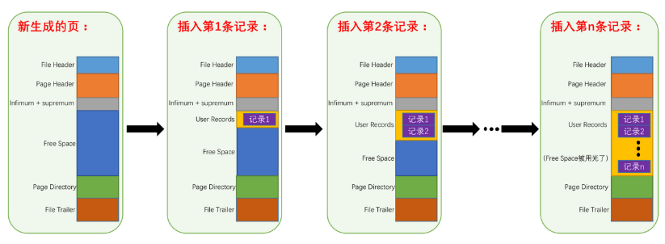
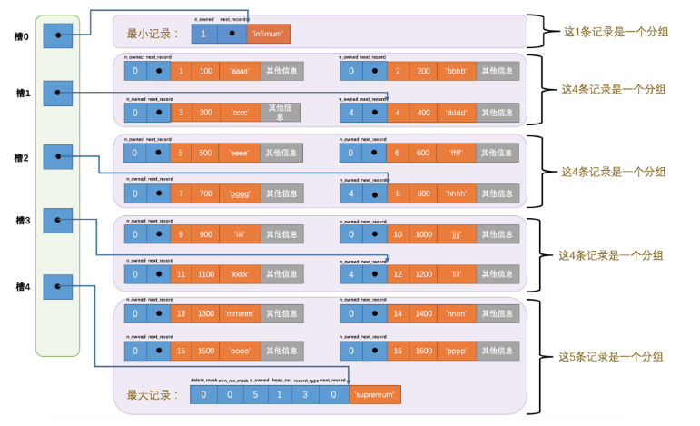
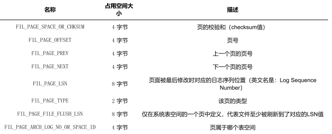

### 5 InnoDB 数据页结构

#### 5.1 不同类型的页

页是InnoDB管理存储空间的基本单位，一个页的大小一般是16kb。InnoDB 为不同的目的设计了许多种不同类型的页，比如存放表空间头部信息的页，存放 Insert Buffer 信息的页，存放 INODE 信息的页，存放 undo 日志信息的页等等。

我们表种记录的那种类型的页，官方称这种存放记录的页为**索引页**，鉴于我们还没有了解过索引 是个什么东西，而这些表中的记录就是我们日常口中所称的 数据 ，所以目前还是叫这种存放记录的页为 数据页 吧。

#### 5.2 数据页结构的快速浏览 

数据页代表的这块 16kb 大小的存储空间可以被划分成多个部分，不同部分有不同部分的功能，各个部分如图所示：


这7个部分存储内容如下所示：

| 名称             | 中文名             | 占用空间大小 | 简单描述                 |
| ---------------- | ------------------ | ------------ | ------------------------ |
| File Header      | 文件头部           | 38字节       | 页的一些通用信息         |
| Page Header      | 页面头部           | 56字节       | 数据页专有的一些信息     |
| Infimum+Supremum | 最小记录和最大记录 | 26字节       | 两个虚拟的行记录         |
| User Records     | 用户记录           | 不确定       | 实际存储的行记录内容     |
| Free Space       | 空闲空间           | 不确定       | 页中尚未使用的空间       |
| Page Directory   | 页面目录           | 不确定       | 页中的某些记录的相对位置 |
| File Trailer     | 文件尾部           | 8字节        | 检验页是否完整           |

#### 5.3 记录在页中的存储 

在页的7个组成部分中，我们自己存储的记录会按照我们指定的 行格式 存储到 User Records 部分。但是在一开 始生成页的时候，其实并没有 User Records 这个部分，每当我们插入一条记录，都会从 Free Space 部分，也就 是尚未使用的存储空间中申请一个记录大小的空间划分到 User Records 部分，当 Free Space 部分的空间全部 被 User Records 部分替代掉之后，也就意味着这个页使用完了，如果还有新的记录插入的话，就需要去申请新 的页了，这个过程的图示如下：



为了更好的管理在 User Records 中的这些记录， InnoDB 可费了一番力气呢，在哪费力气了呢？不就是把记录按 照指定的行格式一条一条摆在 User Records 部分么？其实这话还得从记录行格式的 记录头信息 中说起。

##### 5.3.1 记录头信息的秘密 

```mysql
mysql> CREATE TABLE page_demo( 
    ->c1 INT,
    ->c2 INT,
	->c3 VARCHAR(10000), PRIMARY KEY (c1)
-> ) CHARSET=ascii ROW_FORMAT=Compact; 
Query OK, 0 rows affected (0.03 sec)
```

这个新创建的 page_demo 表有3个列，其中 c1 和 c2 列是用来存储整数的， c3 列是用来存储字符串的。需要注 意的是，我们把 c1 列指定为主键，所以在具体的行格式中InnoDB就没必要为我们去创建那个所谓的 row_id 隐 藏列了。而且我们为这个表指定了 ascii 字符集以及 Compact 的行格式。所以这个表中记录的行格式示意图就是 这样的:


从图中可以看到，我们特意把 记录头信息 的5个字节的数据给标出来了，说明它很重要，我们再次先把这些 记 录头信息 中各个属性的大体意思浏览一下（我们目前使用 Compact 行格式进行演示）：

| 名称         | 大小（单位：bit） | 描述                                                         |
| ------------ | ----------------- | ------------------------------------------------------------ |
| 预留位1      | 1                 | 没有使用                                                     |
| 预留位2      | 1                 | 没有使用                                                     |
| delete_mask  | 1                 | 标记该记录是否被删除                                         |
| min_rec_mask | 1                 | B+树的每层非叶子节点中的最小记录都会添加该标记               |
| n_owned      | 4                 | 表示当前记录拥有的记录数                                     |
| heap_no      | 13                | 表示当前记录在记录堆的位置信息                               |
| record_type  | 3                 | 表示当前记录的类型， 0 表示普通记录， 1 表示B+树非叶子节点记录， 2 表示最小记录， 3 表示最大记录 |
| next_record  | 16                | 表示下一条记录的相对位置                                     |

page_demo 表的行格式简化图如下：


插入几条记录：

> mysql> INSERT INTO page_demo VALUES(1, 100, 'aaaa'), (2, 200, 'bbbb'), (3, 300, 'cccc'), (4, 400, 'dddd');
> Query OK, 4 rows affected (0.00 sec) Records: 4 Duplicates: 0 Warnings: 0

为了方便大家分析这些记录在 页 的 User Records 部分中是怎么表示的，我把记录中头信息和实际的列数据都用 十进制表示出来了（其实是一堆二进制位），所以这些记录的示意图就是:


看这个图的时候需要注意一下，各条记录在 User Records 中存储的时候并没有空隙，这里只是为了大家观看方 便才把每条记录单独画在一行中。我们对照着这个图来看看记录头信息中的各个属性是啥意思:

- delete_mask

  这个属性标记着当前记录是否被删除，占用1个二进制位，值为 0 的时候代表记录并没有被删除，为 1 的时 候代表记录被删除掉了。

  啥？**被删除的记录还在 页 中么**？是的，摆在台面上的和背地里做的可能大相径庭，**你以为它删除了，可它 还在真实的磁盘上**。**这些被删除的记录之所以不立即从磁盘上移除，是因为移除 它们之后把其他的记录在磁盘上重新排列需要性能消耗，所以只是打一个删除标记而已，所有被删除掉的记 录都会组成一个所谓的 垃圾链表 ，在这个链表中的记录占用的空间称之为所谓的 可重用空间 ，之后如果有 新记录插入到表中的话，可能把这些被删除的记录占用的存储空间覆盖掉**。

- min_rec_mask

  B+树的每层非叶子节点中的最小记录都会添加该标记，什么是个 B+ 树？什么是个非叶子节点？好吧，等会 再聊这个问题。反正我们自己插入的四条记录的 min_rec_mask 值都是 0 ，意味着它们都不是 B+ 树的非叶 子节点中的最小记录。

- n_owned

- heap_no

  这个属性表示当前记录在本 页 中的位置，从图中可以看出来，我们插入的4条记录在本 页 中的位置分别 是： 2 、 3 、 4 、 5 。是不是少了点啥？是的，怎么不见 heap_no 值为 0 和 1 的记录呢？

  这其实是设计 InnoDB 的大叔们玩的一个小把戏，**他们自动给每个页里边儿加了两个记录，由于这两个记录 并不是我们自己插入的，所以有时候也称为 伪记录 或者 虚拟记录** 。这两个伪记录一个代表 最小记录 ，一 个代表 最大记录 ，等一下哈~，记录可以比大小么？

  是的，记录也可以比大小，对于一条完整的记录来说，比较记录的大小就是比较 主键 的大小。比方说我们 插入的4行记录的主键值分别是： 1 、 2 、 3 、 4 ，这也就意味着这4条记录的大小从小到大依次递增。

  但是不管我们向 页 中插入了多少自己的记录，设计 InnoDB 的大叔们都规定他们定义的两条伪记录分别为最 小记录与最大记录。这两条记录的构造十分简单，**都是由5字节大小的 记录头信息 和8字节大小的一个固定 的部分组成的**，如图所示：
  

  由于这两条记录不是我们自己定义的记录，所以它们并不存放在 页 的 User Records 部分，**他们被单独放在 一个称为 Infimum + Supremum 的部分**，上面有页的结构。

  

  从图中我们可以看出来，最小记录和最大记录的 heap_no 值分别是 0 和 1 ，也就是说它们的位置最靠前。

- record_type

  这个属性表示当前记录的类型，一共有4种类型的记录， 0 表示普通记录， 1 表示B+树非叶节点记录， 2 表 示最小记录， 3 表示最大记录。从图中我们也可以看出来，我们自己插入的记录就是普通记录，它们的 record_type 值都是 0 ，而最小记录和最大记录的 record_type 值分别为 2 和 3 

- next_record

  很重要！！！**它表示从当前记录的真实数据到下一条记录的真实数据的地址偏移量**。比方说第一条记录的 next_record 值为 32 ，意味着从第一条记录的真实数据的地址处向后找 32 个字节便是下一条记录的 真实数据。如果你熟悉数据结构的话，就立即明白了，这其实是个 链表 ，可以通过一条记录找到它的下一 条记录。但是需要注意注意再注意的一点是， **下一条记录 指得并不是按照我们插入顺序的下一条记录，而 是按照主键值由小到大的顺序的下一条记录**。而且规定**Infimum记录（也就是最小记录） 的下一条记录就是 本页中主键值最小的用户记录，而本页中主键值最大的用户记录的下一条记录就是 Supremum记录（也就 是最大记录）** ，为了更形象的表示一下这个 next_record 起到的作用，我们用箭头来替代一下 next_record 中的地址偏移量：
  

  从图中可以看出，**我们的记录按照主键从小到大的顺序形成了一个单链表**。最大记录 的 next_record 的 值为 0 ，这也就是说最大记录是没有 下一条记录 了，它是这个单链表中的最后一个节点。如果从中删除掉 一条记录，这个链表也是会跟着变化的，比如我们把第2条记录删掉。

  删掉第二条记录之后的示意图：（可以类比到数据变化了之后，索引重新计算且变化）

  

  从中可以看出，删除第二条记录前后主要发生了这些变化：

  - 第2条记录并没有从存储空间中移除，而是把该条记录的 delete_mask 值设置为 1。
  - 第2条记录的 next_record 值变为了0，意味着该记录没有下一条记录了。
  - 第1条记录的 next_record 指向了第3条记录
  - **还有一点你可能忽略了，就是 最大记录 的 n_owned 值从 5 变成了 4** ，关于这一点的变化我们稍后会详 细说明的。

  > 所以，**不论我们怎么对页中的记录做增删改操作，InnoDB始终会维护一条记录的单链表，链表中的各个 节点是按照主键值由小到大的顺序连接起来的**。
  >
  > 你会不会觉得next_record这个指针有点儿怪，为啥要指向记录头信息和真实数据之间的位置 呢？为啥不干脆指向整条记录的开头位置，也就是记录的额外信息开头的位置呢？ **因为这个位置刚刚好，向左读取就是记录头信息，向右读取就是真实数据**。我们前边还说过变 长字段长度列表、NULL值列表中的信息都是逆序存放，这样可以使记录中位置靠前的字段和它 们对应的字段长度信息在内存中的距离更近，可能会提高高速缓存的命中率。

  再来看一个有意思的事情，因为主键值为 2 的记录被我们删掉了，但是存储空间却没有回收，如果我们再次把这 条记录插入到表中，会发生什么事呢?

  > mysql> INSERT INTO page_demo VALUES(2, 200, 'bbbb');

  

  从图中可以看到， InnoDB 并没有因为新记录的插入而为它申请新的存储空间，而是直接复用了原来被删除记录 的存储空间。

  > 当数据页中存在多条被删除掉的记录时，这些记录的next_record属性将会把这些被删除掉的记录组成 一个垃圾链表，以备之后重用这部分存储空间。

##### 5.4 Page Directory (页目录)

现在了解了，记录在页中按照**主键值从小到大顺序串联成一个单链表**，那如果我们想**根据主键值查找页中的某 条记录该咋办呢**？比如说这样的查询语句：

> SELECT * FROM page_demo WHERE c1 = 3;

最笨的方法：从 Infimum 记录（最小记录）开始，沿着链表一直往后找，总有一天会找到（或者找不到[摊 手]），在找的时候还能投机取巧，因为链表中各个记录的值是按照从小到大顺序排列的，所以当链表的某个节点 代表的记录的主键值大于你想要查找的主键值时，你就可以停止查找了，因为该节点后边的节点的主键值依次递增。

这个方法在页中存储记录数量比较少的情况用起来没啥问题；但是如果一个页中存储了非常多的记录，这么查找对性能来说还是有损耗的，所以我们说这种遍历查找是一个笨办法。但是设计InnoDB的大叔们设计了一种方式，**是从书中的目录中找到的灵感**。

我们平常想从一本书中查找某个内容的时候，一般会先看目录，找到需要查找的内容对应的书的页码，然后到对 应的页码查看内容。设计 InnoDB 的大叔们为我们的记录也制作了一个类似的目录，他们的制作过程是这样的：

1. **将所有正常的记录（包括最大和最小记录，不包括标记为已删除的记录）划分为几个组**。
2. **每个组的最后一条记录（也就是组内最大的那条记录）的头信息中的 n_owned 属性表示该记录拥有多少条记 录，也就是该组内共有几条记录**。
3. **将每个组的最后一条记录的地址偏移量单独提取出来按顺序存储到靠近 页 的尾部的地方，这个地方就是所谓的 Page Directory ，也就是 页目录** （此时应该返回去看看页面各个部分的图）。页面目录中的这些地址偏移量被称为 **槽** （英文名： Slot ），所以这个页面目录就是由 槽 组成的。

比方说现在的 page_demo 表中正常的记录共有6条， InnoDB 会把它们分成两组，第一组中只有一个最小记录， 第二组中是剩余的5条记录，看下边的示意图：


从这个图中我们需要注意这么几点：

- 现在 页目录 部分中有两个槽，也就意味着我们的记录被分为了两个组，**槽1中的值是112，代表最大记录的地址偏移量（就是从页面的0字节开始数，数112个字节）；槽0 中的值是 99，代表最小记录的地址偏移量**。
- 注意最小和最大记录的头信息中的 n_owned 属性 
  - 最小记录的 n_owned 值为 1 ，这就代表着以最小记录结尾的这个分组中只有 1 条记录，也就是最小记录 本身。
  - 最大记录的 n_owned 值为 5 ，这就代表着以最大记录结尾的这个分组中只有 5 条记录，包括最大记录本 身还有我们自己插入的 4 条记录。

99 和 112 这样的地址偏移量很不直观，我们用箭头指向的方式替代数字，这样更易于我们理解，所以修改后的示意图就是这样：


我们可以从逻辑上看一下这些记录和页目录的关系：


为什么最小记录的 n_owned 值为1，而最大记录的 n_owned 值为 5 呢，这里头有什么猫腻么？

是的，设计 InnoDB 的大叔们对每个分组中的记录条数是有规定的：**对于最小记录所在的分组只能有 1 条记录， 最大记录所在的分组拥有的记录条数只能在 1~8 条之间，剩下的分组中记录的条数范围只能在是 4~8 条之间**。 所以分组是按照下边的步骤进行的：

- 初始情况下一个数据页里只有最小记录和最大记录两条记录，它们分属于两个分组。 
- 之后每插入一条记录，都会从 页目录 中找到主键值比本记录的主键值大并且差值最小的槽，然后把该槽对 应的记录的 n_owned 值加1，表示本组内又添加了一条记录，直到该组中的记录数等于8个。 
- **在一个组中的记录数等于8个后再插入一条记录时，会将组中的记录拆分成两个组，一个组中4条记录，另一 个5条记录**。**这个过程会在 页目录 中新增一个 槽 来记录这个新增分组中最大的那条记录的偏移量**。

继续添加一些记录：

> mysql> INSERT INTO page_demo VALUES(5, 500, 'eeee'), (6, 600, 'ffff'), (7, 700, 'gggg'), (8, 800, 'hhhh'), (9, 900, 'iiii'), (10, 1000, 'jjjj'), (11, 1100, 'kkkk'), (12, 1200, 'l lll'), (13, 1300, 'mmmm'), (14, 1400, 'nnnn'), (15, 1500, 'oooo'), (16, 1600, 'pppp');

哈，我们一口气又往表中添加了12条记录，现在页里边就一共有18条记录了（包括最小和最大记录），这些记录 被分成了5个组，如图所示:



因为把16条记录的全部信息都画在一张图里太占地方，让人眼花缭乱的，所以只保留了用户记录头信息中的 n_owned 和 next_record 属性，也省略了各个记录之间的箭头，我没画不等于没有啊。现在看怎么从这个 页目录 中查找记录。因为各个槽代表的记录的主键值都是从小到大排序的，所以我们可以使用所谓的 二分法 来进行 快速查找。4个槽的编号分别是： 0 、 1 、 2 、 3 、 4 ，所以初始情况下最低的槽就是 low=0 ，最高的槽就是 high=4 。比方说我们想找主键值为 6 的记录，过程是这样的：

1. 计算中间槽的位置： (0+4)/2=2 ，所以查看 槽2 对应记录的主键值为 8 ，又因为 8 > 6 ，所以设置 high=2 ， low 保持不变。

2. 重新计算中间槽的位置： (0+2)/2=1 ，所以查看 槽1 对应的主键值为 4 ，又因为 4 < 6 ，所以设置 low=1 ， high 保持不变。
3. 因为 high - low 的值为1，所以确定主键值为 5 的记录在 槽2 对应的组中。此刻我们需要找到 槽2 中主键 值最小的那条记录，然后沿着单向链表遍历 槽2 中的记录。但是我们前边又说过，**每个槽对应的记录都是该 组中主键值最大的记录，这里 槽2 对应的记录是主键值为 8 的记录**，怎么定位一个组中最小的记录呢？**别忘 了各个槽都是挨着的，我们可以很轻易的拿到 槽1 对应的记录**（主键值为 4 ），**该条记录的下一条记录就 是 槽2 中主键值最小的记录，该记录的主键值为 5** 。所以我们可以从这条主键值为 5 的记录出发，遍历 槽 2 中的各条记录，直到找到主键值为 6 的那条记录即可。由于一个组中包含的记录条数只能是1~8条，所以 遍历一个组中的记录的代价是很小的。

所以，在一个数据页中查找指定主键值的记录的过程分为两步：

1. **通过二分法确定该记录所在的槽，并找到该槽中主键值最小的那条记录**。
2. **通过记录的 next_record 属性遍历该槽所在组中的各个记录**。

##### 5.5 Page Header（页面头部）

设计 InnoDB 的大叔们为了能得到**一个数据页中存储的记录的状态信息**，比如本页中已经存储了多少条记录，第 一条记录的地址是什么，页目录中存储了多少个槽等等，特意在页中定义了一个叫 Page Header 的部分，它是 页 结构的第二部分，这个部分占用固定的 56 个字节，专门存储各种状态信息。

| 名称              | 占用空间大小（单位：字节） | 描述                                                         |
| ----------------- | -------------------------- | ------------------------------------------------------------ |
| PAGE_N_SLOTS      | 2                          | 在页目录中的槽数量                                           |
| PAGE_HEAP_TOP     | 2                          | 还未使用的空间最小地址，也就是说从该地址之后就是 Free Space  |
| PAGE_N_HEAP       | 2                          | 本页中的记录的数量（包括最小和最大记录以及标记为删除的记录） |
| PAGE_FREE         | 2                          | 第一个已经标记为删除的记录地址（各个已删除的记录通过 next_record 也会组成一个单链 表，这个单链表中的记录可以被重新利用） |
| PAGE_GARBAGE      | 2                          | 已删除记录占用的字节数                                       |
| PAGE_LAST_INSERT  | 2                          | 最后插入记录的位置                                           |
| PAGE_DIRECTION    | 2                          | 记录插入的方向                                               |
| PAGE_N_DIRECTION  | 2                          | 一个方向连续插入的记录数量                                   |
| PAGE_N_RECS       | 2                          | 该页中记录的数量（不包括最小和最大记录以及被标记为删除的记录） |
| PAGE_MAX_TRX_ID   | 8                          | 修改当前页的最大事务ID，该值仅在二级索引中定义               |
| PAGE_LEVEL        | 2                          | 当前页在B+树中所处的层级                                     |
| PAGE_INDEX_ID     | 8                          | 索引ID，表示当前页属于哪个索引                               |
| PAGE_BTR_SEG_LEAF | 10                         | B+树叶子段的头部信息，仅在B+树的Root页定义                   |
| PAGE_BTR_SEG_TOP  | 10                         | B+树非叶子段的头部信息，仅在B+树的Root页定义                 |

PAGE_DIRECTION 和 PAGE_N_DIRECTION 的意思：

- PAGE_DIRECTION
  **假如新插入的一条记录的主键值比上一条记录的主键值大，我们说这条记录的插入方向是右边，反之则是左 边**。用来表示最后一条记录插入方向的状态就是 PAGE_DIRECTION 。 
- PAGE_N_DIRECTION
  **假设连续几次插入新记录的方向都是一致的， InnoDB 会把沿着同一个方向插入记录的条数记下来，这个条 数就用 PAGE_N_DIRECTION 这个状态表示**。当然，如果最后一条记录的插入方向改变了的话，这个状态的值 会被清零重新统计。

##### 5.6 File Header（文件头部）

上边唠叨的 Page Header 是专门针对 数据页 记录的各种状态信息，比方说页里头有多少个记录了呀，有多少个 槽了呀。我们现在描述的 File Header 针对各种类型的页都通用，**也就是说不同类型的页都会以 File Header 作 为第一个组成部分，它描述了一些针对各种页都通用的一些信息**，比方说**这个页的编号是多少，它的上一个页、 下一个页是谁**啦吧啦吧啦～ **这个部分占用固定的 38 个字节**，是由下边这些内容组成的：



目前几个比较重要的部分：

- FIL_PAGE_SPACE_OR_CHKSUM

  这个代表当前页面的校验和（checksum）。啥是个校验和？就是对于一个很长很长的字节串来说，我们会 通过某种算法来计算一个比较短的值来代表这个很长的字节串，这个比较短的值就称为 校验和 。这样在比 较两个很长的字节串之前先比较这两个长字节串的校验和，如果校验和都不一样两个长字节串肯定是不同 的，所以省去了直接比较两个比较长的字节串的时间损耗。

- FIL_PAGE_OFFSET

  每个页都有一个单独的页号，就和身份证一样，InnoDB 通过页号来唯一确定定位一个页。

- FIL_PAGE_TYPE
  这个代表当前 页 的类型，我们前边说过， InnoDB 为了不同的目的而把页分为不同的类型，我们上边介绍的 其实都是存储记录的 数据页 ，其实还有很多别的类型的页。

  | 类型名称                | 十六进制 | 描述                            |
  | ----------------------- | -------- | ------------------------------- |
  | FIL_PAGE_TYPE_ALLOCATED | 0x0000   | 最新分配，还没使用              |
  | FIL_PAGE_UNDO_LOG       | 0x0002   | Undo日志页                      |
  | FIL_PAGE_INODE          | 0x0003   | 段信息节点                      |
  | FIL_PAGE_IBUF_FREE_LIST | 0x0004   | Insert Buffer空闲列表           |
  | FIL_PAGE_IBUF_BITMAP    | 0x0005   | Insert Buffer位图               |
  | FIL_PAGE_TYPE_SYS       | 0x0006   | 系统页                          |
  | FIL_PAGE_TYPE_TRX_SYS   | 0x0007   | 事务系统数据                    |
  | FIL_PAGE_TYPE_FSP_HDR   | 0x0008   | 表空间头部信息                  |
  | FIL_PAGE_TYPE_XDES      | 0x0009   | 扩展描述页                      |
  | FIL_PAGE_TYPE_BLOB      | 0x000A   | BLOB页                          |
  | FIL_PAGE_INDEX          | 0x45BF   | 索引页，也就是我们所说的 数据页 |

  我们存放记录的数据页的类型其实是 FIL_PAGE_INDEX ，也就是所谓的 索引页。

- FIL_PAGE_PREV 和 FIL_PAGE_NEXT

  我们前边强调过， InnoDB 都是以页为单位存放数据的，有时候我们存放某种类型的数据占用的空间非常大 （比方说一张表中可以有成千上万条记录）， InnoDB 可能不可以一次性为这么多数据分配一个非常大的存 储空间，如果分散到多个不连续的页中存储的话需要把这些页关联起来， FIL_PAGE_PREV 和 FIL_PAGE_NEXT 就分别代表本页的上一个和下一个页的页号。这样通过建立一个双向链表把许许多多的页就都串联起来了，而无需这些页在物理上真正连着。需要注意的是，**并不是所有类型的页都有上一个和下一个页的属性**，不过 我们本集中唠叨的 数据页 （也就是类型为 FIL_PAGE_INDEX 的页）是有这两个属性的，所以所有的数据页其 实是一个双链表，就像这样：

  


##### 5.7 File Trailer 

我们知道 InnoDB 存储引擎会把数据存储到磁盘上，但是磁盘速度太慢，需要以 页 为单位把数据加载到内存中处 理，如果该页中的数据在内存中被修改了，那么在修改后的某个时间需要把数据同步到磁盘中。但是在同步了一 半的时候中断电了咋办，这不是莫名尴尬么？**为了检测一个页是否完整（也就是在同步的时候有没有发生只同步一半的尴尬情况**），设计 InnoDB 的大叔们在每个页的尾部都加了一个 File Trailer 部分，**这个部分由 8 个字 节组成，可以分成2个小部分**：

- **前4个字节代表页的校验和**
  这个部分是和 File Header 中的校验和相对应的。每当一个页面在内存中修改了，在同步之前就要把它的校 验和算出来，因为 File Header 在页面的前边，所以校验和会被首先同步到磁盘，当完全写完时，校验和也 会被写到页的尾部，如果完全同步成功，则页的首部和尾部的校验和应该是一致的。如果写了一半儿断电 了，那么在 File Header 中的校验和就代表着已经修改过的页，而在 File Trialer 中的校验和代表着原先 的页，二者不同则意味着同步中间出了错。

- **后4个字节代表页面被最后修改时对应的日志序列位置（LSN）**
  这个部分也是为了校验页的完整性的，只不过我们目前还没说 LSN 是个什么意思，所以大家可以先不用管这个属性。

这个 File Trailer 与 File Header 类似，都是所有类型的页通用的。

##### 总结 

1. InnoDB为了不同的目的而设计了不同类型的页，我们把用于存放记录的页叫做 **数据页** 。 
2. 一个数据页可以被大致划分为7个部分，分别是

  - File Header ，表示页的一些通用信息，占固定的38字节。
  - Page Header ，表示数据页专有的一些信息，占固定的56个字节。
  - Infimum + Supremum ，两个虚拟的伪记录，分别表示页中的最小和最大记录，占固定的 26 个字节。 
  - **User Records ：真实存储我们插入的记录的部分，大小不固定**。 
  - **Free Space ：页中尚未使用的部分，大小不确定**。
  - **Page Directory ：页中的某些记录相对位置，也就是各个槽在页面中的地址偏移量，大小不固定，插 入的记录越多，这个部分占用的空间越多**。 
  - File Trailer ：用于检验页是否完整的部分，占用固定的8个字节。

3. **每个记录的头信息中都有一个 next_record 属性，从而使页中的所有记录串联成一个 单链表** 。
4. InnoDB 会为把页中的记录划分为若干个组，每个组的最后一个记录的地址偏移量作为一个 槽 ，存放在 Page Directory 中，所以在一个页中根据主键查找记录是非常快的，分为两步：

  - 通过二分法确定该记录所在的槽。
  - 通过记录的next_record属性遍历该槽所在的组中的各个记录。

5. **每个数据页的 File Header 部分都有上一个和下一个页的编号，所以所有的数据页会组成一个 双链表** 。 
6. 为保证从内存中同步到磁盘的页的完整性，在页的首部和尾部都会存储页中数据的校验和和页面最后修改时 对应的 LSN 值，如果首部和尾部的校验和和 LSN 值校验不成功的话，就说明同步过程出现了问题。