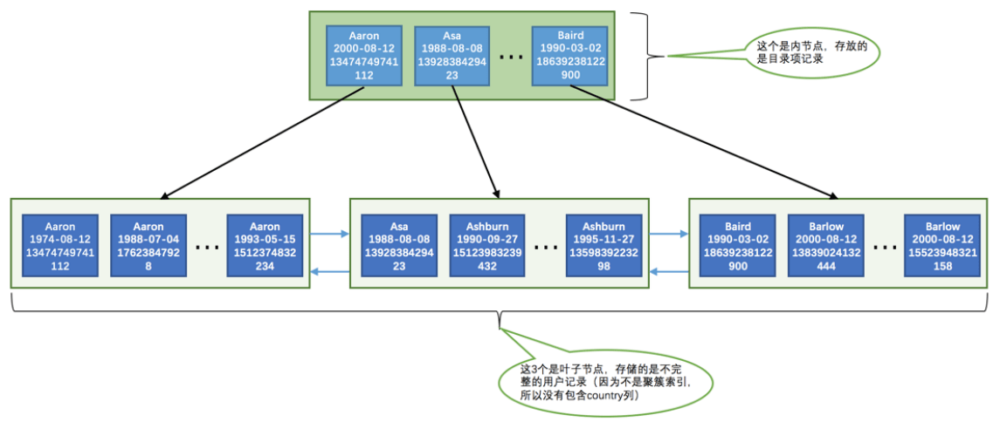
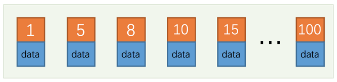
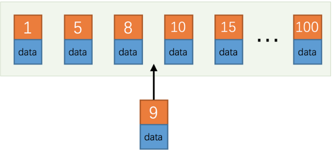

《MySQL 怎样运行的？-从跟上理解MySQL》---小孩子 

**摘抄**

### 7 索引使用

B+ 树索引，我们必须熟悉下边这些结论：

- 每个索引都对应一棵 B+ 树， B+ 树分为好多层，最下边一层是叶子节点，其余的是内节点。所有 用户记录 都存储在 B+ 树的叶子节点，所有 目录项记录 都存储在内节点。
- InnoDB 存储引擎会自动为主键（如果没有它会自动帮我们添加）建立 聚簇索引 ，聚簇索引的叶子节点包含 完整的用户记录。
- 我们可以为自己感兴趣的列建立 二级索引 ， 二级索引 的叶子节点包含的用户记录由 索引列 + 主键 组 成，所以如果想通过 二级索引 来查找完整的用户记录的话，需要通过 回表 操作，也就是在通过 二级索引 找到主键值之后再到 聚簇索引 中查找完整的用户记录。
- B+ 树中每层节点都是按照索引列值从小到大的顺序排序而组成了双向链表，而且每个页内的记录（不论是 用户记录还是目录项记录）都是按照索引列的值从小到大的顺序而形成了一个单链表。如果是 联合索引 的 话，则页面和记录先按照 联合索引 前边的列排序，如果该列值相同，再按照 联合索引 后边的列排序。
- 通过索引查找记录是从 B+ 树的根节点开始，一层一层向下搜索。由于每个页面都按照索引列的值建立了 Page Directory （页目录），所以在这些页面中的查找非常快。

#### 7.1 索引的代价

索引会在空间和时间上拖后腿：

- 空间上的代价

这个是显而易见的，每建立一个索引都要为它建立一棵 B+ 树，每一棵 B+ 树的每一个节点都是一个数据页， 一个页默认会占用 16KB 的存储空间，一棵很大的 B+ 树由许多数据页组成，那可是很大的一片存储空间呢。

- 时间上的代价

**每次对表中的数据进行增、删、改操作时，都需要去修改各个 B+ 树索引**。而且我们讲过， B+ 树每层节点都是按照索引列的值从小到大的顺序排序而组成了双向链表。不论是叶子节点中的记录，还是内节点中的记录 （也就是不论是用户记录还是目录项记录）都是按照索引列的值从小到大的顺序而形成了一个单向链表。而 增、删、改操作可能会对节点和记录的排序造成破坏，所以存储引擎需要额外的时间进行一些记录移位，页面分裂、页面回收啥的操作来维护好节点和记录的排序。

所以说，一个表上索引建的越多，就会占用越多的存储空间，在增删改记录的时候性能就越差。为了能建立又好 又少的索引，我们先得学学这些索引在哪些条件下起作用的。

#### 7.2 B+树索引适用的条件 

所有的技巧都是源自于对 B+ 树索引本质的理解，不理解返回去多看几遍。首先，B+树 索引并不是万能的，并不是所有的查询语句都能用到我们建立的索引。建立如下表：

```mysql
CREATE TABLE person_info( 
	id INT NOT NULL AUTO_INCREMENT, 
	name VARCHAR(100) NOT NULL, 
	birthday DATE NOT NULL, 
	phone_number CHAR(11) NOT NULL, 
	country varchar(100) NOT NULL, 
	PRIMARY KEY (id), 
	KEY idx_name_birthday_phone_number (name, birthday, phone_number) 
);
```

对于这个表我们需要注意两点：

- 主键列是id，它存储一个自动递增的数。所以 InnoDB 存储引擎会自动为 id 列建立聚簇索引。
- 我们额外定义了一个二级索引 idx_name_birthday_phone_number ，它是由3个列组成的联合索引。所以所以在这 个索引对应的 B+ 树的叶子节点处存储的用户记录只保留 **name 、 birthday 、 phone_number 这三个列的值 以及主键 id 的值，并不会保存 country 列的值**。

从这两点中可以再次看到，一个表中有多少索引就会建立多少颗 B+ 树，person_info 表会为聚簇索引 和 idx_name_birthday_phone_number 索引建立2棵 B+ 树。下边我们画一下索引 idx_name_birthday_phone_number 的示意图，不过既然我们已经掌握了 InnoDB 的 B+ 树索引原理，那我们在画 图的时候为了让图更加清晰，所以在**省略一些不必要的部分，比如记录的额外信息，各页面的页号等等，其中内 节点中目录项记录的页号信息我们用箭头来代替**，在记录结构中只保留 name 、 birthday 、 phone_number 、 id 这四个列的真实数据值，所以示意图就长这样。和《高性能MySQL》例子差不多，不过我没看。哈哈



内节点存储的是 目录项记录，叶子节点存储的是 用户记录（由于由于不是聚簇索引，所以用户记录是不完整的，缺少 country 列的 值）。从图中可以看出，这个 idx_name_birthday_phone_number 索引对应的 B+ 树中页面和记录的排序方式就是这样的：

- 先按照 name 列的值进行排序。 
- 如果 name 列的值相同，则按照 birthday 列的值进行排序。 
- 如果 birthday 列的值也相同，则按照 phone_number 的值进行排序

**这个排序非常重要**！！！！！**因为只要是页面和记录是排好序的，我们就可以通过二分法来快速定位查找**。后面都依赖这个进行理解。

##### 7.2.1 全值匹配

**如果我们的搜索条件中的列和索引列一致的话，这种情况就称为全值匹配**，比如：

```mysql 
SELECT * FROM person_info WHERE name = 'Ashburn' AND birthday = '1990-09-27' AND phone_num ber = '15123983239'
```

我们建立的 idx_name_birthday_phone_number 索引包含的3个列在这个查询语句中都展现出来了。大家可以想象 一下这个查询过程：

- 因为 B+ 树的数据页和记录先是按照 name 列的值进行排序的，所以先可以很快定位 name 列的值是 Ashburn 的记录位置。
- 在 name 列相同的记录里又是按照 birthday 列的值进行排序的，所以在 name 列的值是 Ashburn 的记录里又 可以快速定位 birthday 列的值是 '1990-09-27' 的记录。
-  如果很不幸， name 和 birthday 列的值都是相同的，那记录是按照 phone_number 列的值排序的，所以联合 索引中的三个列都可能被用到。

where 字句中的几个搜索条件的顺序对查询结果有啥影响不？比方下面这样：

```mysql 
SELECT * FROM person_info WHERE birthday = '1990-09-27' AND phone_number = '15123983239' A ND name = 'Ashburn';
```

答案是：没有影响。MySQL 会根据优化器选择索引。

##### 7.2.2   匹配最左边的列

其实我们的搜索语句中也可以不用包含全部来年黑松引种的列，只包含左边的列就行，比如：

```mysql 
SELECT * FROM person_info WHERE name = 'Ashburn';
```

或者包含多个左边的列也行：

```mysql 
SELECT * FROM person_info WHERE name = 'Ashburn' AND birthday = '1990-09-27';
```

那为什么搜索条件中必须出现左边的列才可以使用到这个 B+ 树索引呢？**回想一下索引树结构，目录项记录页 和 数据项记录页的形成**。比如下边的这个语句就用不到这个 B+树 索引么？

```mysql 
SELECT * FROM person_info WHERE birthday = '1990-09-27';
```

是的，的确用不到，因为B+树的数据页和记录树的数据页和记录先是按照 name 列的值排序的，在 name 列的值相同的情况下才使 用 birthday 列进行排序，也就是说 name 列的值不同的记录中 birthday 的值可能是无序的。那如果我就想在只使用 birthday 的值去通过 B+ 树索 引进行查找咋办呢？这好办，你再对 birthday 列建一个 B+ 树索引就行了。

但是需要特别注意的一点是：**如果我们想使用联合索引中尽可能多的列，搜索条件中的各个列必须是联合索引从最左边连续的列**。比方说联合索引 idx_name_birthday_phone_number 中列的定义顺序是 name 、 birthday 、 phone_number ，如果我们的搜索条件中只有 name 和 phone_number ，而没有中间的 birthday ， 比方说这样：

```mysql 
SELECT * FROM person_info WHERE name = 'Ashburn' AND phone_number = '15123983239';
```

这样只能用到 name 列的索引， birthday 和 phone_number 的索引就用不上了，因为 name 值相同的记录先按照 birthday 的值进行排序， birthday 值相同的记录才按照 phone_number 值进行排序。

##### 7.2.3 匹配列前缀

我们前边说过为某个列建立索引的意思其实就是在对应的 B+ 树的记录中使用该列的值进行排序，比方说 person_info 表上建立的联合索引 idx_name_birthday_phone_number 会先用 name 列的值进行排序，所以这个 联合索引对应的 B+ 树中的记录的 name 列的排列就是这样的：

> Aaron 
>
> Aaron
>
>  ...
> Aaron 
>
> Asa
>
> Ashburn
>
>  ...
>
> Ashburn 
>
> Baird 
>
> Barlow 
>
> ...
>
> Barlow

字符串排序的本质就是比较哪个字符串大一点儿，哪个字符串小一点，比较字符串大小就用到了该列的字符集和 比较规则。这里需要注意的是，一般的比较规则是逐个比较字符的大小，也就是说我们比较两个字符串的大小的过程其实是这样的：

- 先比较字符串的第一个字符，第一个字符小的那个字符串就比较小。
- 如果两个字符串的第一个字符相同，那就再比较第二个字符，第二个字符比较小的那个字符串就比较小。 
- 如果两个字符串的第二个字符也相同，那就接着比较第三个字符，依此类推

所以一个排好序的字符串列其实有这样的特点：

- 先按照字符串的第一个字符进行排序。 
- 如果第一个字符相同再按照第二个字符进行排序。 
- 如果第二个字符相同再按照第三个字符进行排序，依此类推。

也就是说这些字符串的前n个字符，也就是前缀都是排好序的，所以对于字符串类型的索引列来说，我们只匹配 它的前缀也是可以快速定位记录的，比方说我们想查询名字以 'As' 开头的记录，那就可以这么写查询语句：

```mysql 
SELECT * FROM person_info WHERE name LIKE 'As%';
```

但是需要注意的是，如果只给出后缀或者中间的某个字符串，比如这样： 

```mysql 
SELECT * FROM person_info WHERE name LIKE '%As%';
```

MySQL 就无法快速定位记录位置了，因为字符串中间有 As 的字符串并没有排好序，所以只能全表扫描了。

有时候我们有一些匹配某些字符串后缀的需求，比方说某个表有一个 url 列，该列中存储了许多url：


假设已经对该 url 列创建了索引，如果我们想查询以 com 为后缀的网址的话可以这样写查询条件： WHERE url LIKE '%com' ，但是这样的话无法使用该 url 列的索引。为了在查询时用到这个索引而不至于全表扫描，我们可以把后缀查询改写成前缀查询，不过我们就得把表中的数据全部逆序存储一下，也就是说我们可以这样保存 url 列中的数据：


这样再查找以 com 为后缀的网址时搜索条件便可以这么写： WHERE url LIKE 'moc%' ，这样就可以用到索引了。

##### 7.2.4 匹配范围值 

回头看我们 idx_name_birthday_phone_number 索引的 B+ 树示意图，**所有记录都是按照索引列的值从小到大的顺 序排好序的**，所以这极大的方便我们查找索引列的值在某个范围内的记录。比方说下边这个查询语句：

```mysql
SELECT * FROM person_info WHERE name > 'Asa' AND name < 'Barlow';
```

由于 B+ 树中的数据页和记录是先按 name 列排序的，所以我们上边的查询过程其实是这样的：

- 找到 name 值为 Asa 的记录。 
- 找到 name 值为 Barlow 的记录。
- 哦啦，由于所有记录都是由链表连起来的（记录之间用单链表，数据页之间用双链表），所以他们之间的记 录都可以很容易的取出来喽～ 
- 找到这些记录的主键值，再到聚簇索引中回表查找完整的记录

不过在使用联合进行范围查找的时候需要注意，**如果对多个列同时进行范围查找的话，只有对索引最左边的那个 列进行范围查找的时候才能用到 B+ 树索引**，比方说这样：

```mysql
SELECT * FROM person_info WHERE name > 'Asa' AND name < 'Barlow' AND birthday > '1980-01-0 1';
```

上边这查询可以分成两部分：

1. 通过条件 name > 'Asa' AND name < 'Barlow' 来对 name 进行范围，查找的结果可能有多条 name 值不同的 记录；
2. 对这些 name 值不同的记录继续通过 birthday > '1980-01-01' 条件继续过滤。

这样子对于联合索引 idx_name_birthday_phone_number 来说，只能用到 name 列的部分，而用不到 birthday 列 的部分，因为只有 name 值相同的情况下才能用 birthday 列的值进行排序，而这个查询中**通过 name 进行范围查 找的记录中可能并不是按照 birthday 列进行排序的**，所以在搜索条件中继续以 birthday 列进行查找时是用不到 这个 B+ 树索引的。

##### 7.2.5 精确匹配某一列并范围匹配另外一列 

对于同一个联合索引来说，虽然对多个列都进行范围查找时只能用到最左边那个索引列，但是如果左边的列是精 确查找，则右边的列可以进行范围查找，比方说这样：

```mysql
SELECT * FROM person_info WHERE name = 'Ashburn' AND birthday > '1980-01-01' AND birthday < '2000-12-31' AND phone_number > '15100000000';
```

这个查询的条件可以分为3个部分：

1. name = 'Ashburn' ，对 name 列进行精确查找，当然可以使用 B+ 树索引了。
2. birthday > '1980-01-01' AND birthday < '2000-12-31' ，**由于 name 列是精确查找，所以通过 name = 'Ashburn' 条件查找后得到的结果的 name 值都是相同的**，它们会再按照 birthday 的值进行排序。所以此时 对 birthday 列进行范围查找是可以用到 B+ 树索引的。
3. phone_number > '15100000000' ，通过 birthday 的范围查找的记录的 birthday 的值可能不同，所以这个 条件无法再利用 B+ 树索引了，只能遍历上一步查询得到的记录。

同理，下边的查询也是可能用到这个 idx_name_birthday_phone_number 联合索引的：

```mysql
SELECT * FROM person_info WHERE name = 'Ashburn' AND birthday = '1980-01-01' AND phone _number > '15100000000';
```

##### 7.2.6 用于排序

写语句过程中经常用到 ORDER BY 子句按照某种规则进行排序。一般情况下我们只能把记录都加载到内存中，再用一些排序算法，比如快速排序、归并排序、吧啦吧啦排序等等在内存中对 这些记录进行排序，有的时候可能查询的结果集太大以至于不能在内存中进行排序的话，还可能暂时借助磁盘的 空间来存放中间结果，排序操作完成后再把排好序的结果集返回到客户端。**在 MySQL 中，把这种在内存中或者磁 盘上进行排序的方式统称为文件排序**（英文名： filesort ），跟 文件 这个词儿一沾边儿，就显得这些排序操作非常慢了（磁盘和内存的速度比起来，就像是飞机和蜗牛的对比）。但是如我们上面的索引，下面语句：

```mysql
SELECT * FROM person_info ORDER BY name, birthday, phone_number LIMIT 10;
```

这个查询的结果集需要先按照 name 值排序，如果记录的 name 值相同，则需要按照 birthday 来排序，如果 birthday 的值相同，则需要按照 phone_number 排序。大家可以回过头去看我们建立的 idx_name_birthday_phone_number 索引的示意图，因为这个 B+ 树索引本身就是按照上述规则排好序的，所以直 接从索引中提取数据，然后进行 回表 操作取出该索引中不包含的列就好了。

###### 1 使用联合索引进行排序注意事项

对于 联合索引 有个问题需要注意， ORDER BY 的子句后边的列的顺序也必须按照索引列的顺序给出，如果给出 ORDER BY phone_number, birthday, name 的顺序，那也是用不了 B+ 树索引。

同理， ORDER BY name 、 ORDER BY name, birthday 这种匹配索引左边的列的形式可以使用部分的 B+ 树索引。 当联合索引左边列的值为常量，也可以使用后边的列进行排序，比如这样：

```mysql
SELECT * FROM person_info WHERE name = 'A' ORDER BY birthday, phone_number LIMIT 10;
```

###### 2 不可以使用索引进行排序的几种情况

###### **（1）ASC、DESC 混用**

> ORDER BY子句后的列如果不加ASC或者DESC默认是按照ASC排序规则排序的，也就是升序排序的。

如果我们查询的需求是先按照 name 列进行升序排列，再按照 birthday 列进行降序排列的话，比如说这样的 查询语句：

```mysql 
SELECT * FROM person_info ORDER BY name, birthday DESC LIMIT 10;
```

这样如果使用索引排序的话过程就是这样的：

- 先从索引的最左边确定 name 列最小的值，然后找到 name 列等于该值的所有记录，然后从 name 列等于该值 的最右边的那条记录开始往左找10条记录。 
- 如果 name 列等于最小的值的记录不足10条，再继续往右找 name 值第二小的记录，重复上边那个过程，直 到找到10条记录为止。

这样不能高效使用索引，而是采取更复杂的算法去从索引中取数据，设计者觉得这样还不如直接文件排序来的快，所以就规定使用联合索引的各个排序列的排序顺序必须是一致的。

###### **（2）WHERE 子句中出现非排序使用到的索引列**

如果WHERE子句中出现了非排序使用到的索引列，那么排序依然是使用不到索引的。

```mysql
SELECT * FROM person_info WHERE country = 'China' ORDER BY name LIMIT 10;
```

这个查询只能先把符合搜索条件 country = 'China' 的记录提取出来后再进行排序，是使用不到索引。注意和下边这个查询作区别：

```mysql
SELECT * FROM person_info WHERE name = 'A' ORDER BY birthday, phone_number LIMIT 10;
```

虽然这个查询也有搜索条件，但是 name = 'A' 可以使用到索引 idx_name_birthday_phone_number ，而且过滤剩 下的记录还是按照 birthday 、 phone_number 列排序的，所以还是可以使用索引进行排序的。

###### **（3）排序列包含非同一个索引的列**

有时候用来排序的多个列不是一个索引里的，这种情况也不能使用索引进行排序，比方说：

```mysql
SELECT * FROM person_info ORDER BY name, country LIMIT 10;
```

name 和 country 并不属于一个联合索引中的列，所以无法使用索引进行排序。

###### **（4）排序列使用了复杂的表达**

要想使用索引进行排序操作，必须保证索引列是以单独列的形式出现，而不是修饰过的形式，比方说这样：

```mysql
SELECT * FROM person_info ORDER BY UPPER(name) LIMIT 10;
```

使用了 UPPER 函数修饰过的列就不是单独的列啦，这样就无法使用索引进行排序啦。

##### 7.2.7 用于分组 

有时候我们为了方便统计表中的一些信息，会把表中的记录按照某些列进行分组。比如下边这个分组查询：

```mysql
SELECT name, birthday, phone_number, COUNT(*) FROM person_info GROUP BY name, birthday, ph one_number;
```

这个查询语句相当于做了3次分组操作：
1. 先把记录按照 name 值进行分组，所有 name 值相同的记录划分为一组。

2. 将每个 name 值相同的分组里的记录再按照 birthday 的值进行分组，将 birthday 值相同的记录放到一个小 分组里，所以看起来就像在一个大分组里又化分了好多小分组。

3. 再将上一步中产生的小分组按照 phone_number 的值分成更小的分组，所以整体上看起来就像是先把记录分 成一个大分组，然后把 大分组 分成若干个 小分组 ，然后把若干个 小分组 再细分成更多的 小小分组 。

然后针对那些 小小分组 进行统计，比如在我们这个查询语句中就是统计每个 小小分组 包含的记录条数。如果没 有索引的话，这个分组过程全部需要在内存里实现，而如果有了索引的话，恰巧这个分组顺序又和我们的 B+ 树 中的索引列的顺序是一致的，而我们的 B+ 树索引又是按照索引列排好序的，这不正好么，所以可以直接使用 B+ 树索引进行分组。

和使用 B+ 树索引进行排序是一个道理，分组列的顺序也需要和索引列的顺序一致，也可以只使用索引列中左边 的列进行分组。

##### 7.3 回表的代价 

以索引 idx_name_birthday_phone_number 为例，看下边这个查询：

```mysql
SELECT * FROM person_info WHERE name > 'Asa' AND name < 'Barlow';
```

在使用 idx_name_birthday_phone_number 索引进行查询时大致可以分为这两个步骤:

1. 从索引 idx_name_birthday_phone_number 对应的 B+ 树中取出 name 值在 Asa ～ Barlow 之间的用户记录。 
2. 由于索引 idx_name_birthday_phone_number 对应的 B+ 树用户记录中只包含 name 、 birthday 、 phone_number 、 id 这4个字段，而查询列表是 * ，意味着要查询表中所有字段，也就是还要包括 country 字段。这时需要把从上一步中获取到的每一条记录的 id 字段都到聚簇索引对应的 B+ 树中找到完整的用户记 录，也就是我们通常所说的 **回表**，然后把完整的用户记录返回给查询用户。

由于索引 idx_name_birthday_phone_number 对应的 B+ 树中的记录首先会按照 name 列的值进行排序，**所以值 在 Asa ～ Barlow 之间的记录在磁盘中的存储是相连的，集中分布在一个或几个数据页中，我们可以很快的把这 些连着的记录从磁盘中读出来，这种读取方式我们也可以称为 顺序I/O** 。根据第1步中获取到的记录的 id 字段 的值可能并不相连，而在聚簇索引中记录是根据 id （也就是主键）的顺序排列的，所以**根据这些并不连续的 id 值到聚簇索引中访问完整的用户记录可能分布在不同的数据页中，这样读取完整的用户记录可能要访问更多的数据页，这种读取方式我们也可以称为 随机I/O** 。一般情况下，顺序I/O比随机I/O的性能高很多，所以步骤1的执行 可能很快，而步骤2就慢一些。所以这个使用索引 idx_name_birthday_phone_number 的查询有这么两个特点：

- 会使用到两个 B+ 树索引，一个二级索引，一个聚簇索引。
- 访问二级索引使用 顺序I/O ，访问聚簇索引使用 随机I/O 。

**需要回表的记录越多，使用二级索引的性能就越低，甚至让某些查询宁愿使用全表扫描也不使用 二级索引** 。比 方说 name 值在 Asa ～ Barlow 之间的用户记录数量占全部记录数量90%以上，那么如果使用 idx_name_birthday_phone_number 索引的话，有90%多的 id 值需要回表，这不是吃力不讨好么，还不如直接去 扫描聚簇索引（也就是全表扫描）。

那什么时候采用全表扫描的方式，什么时候使用采用 **二级索引 + 回表** 的方式去执行查询呢？

这个就是传说中的 **查询优化器做的工作**，查询优化器会事先对表中的记录计算一些统计数据，然后再利用这些统计数据根据查询的 条件来计算一下需要回表的记录数，需要回表的记录数越多，就越倾向于使用全表扫描，反之倾向于使用 二级索 引 + 回表 的方式。

当然优化器做的分析工作不仅仅是这么简单，但是大致上是个这个过程。**一般情况下，限制查询获取较少的记录数会让优化器更倾向于选择使用 二级索引 + 回表 的方式进行查询，因为回表的记录越少， 性能提升就越高**，比方说上边的查询可以改写成这样：

```mysql
SELECT * FROM person_info WHERE name > 'Asa' AND name < 'Barlow' LIMIT 10;
```

添加了 LIMIT 10 的查询更容易让优化器采用 二级索引 + 回表 的方式进行查询。

对于有排序需求的查询，上边讨论的采用 全表扫描 还是 二级索引 + 回表 的方式进行查询的条件也是成立的， 比方说下边这个查询：

```mysql
SELECT * FROM person_info ORDER BY name, birthday, phone_number;
```

由于查询列表是 * ，所以如果使用二级索引进行排序的话，需要把排序完的二级索引记录全部进行回表操作，这 样操作的成本还不如直接遍历聚簇索引然后再进行文件排序（ filesort ）低，所以优化器会倾向于使用全表扫描 的方式执行查询。如果我们加了 LIMIT 子句，比如这样：

```mysql
SELECT * FROM person_info ORDER BY name, birthday, phone_number LIMIT 10;
```

这样需要回表的记录特别少，优化器就会倾向于使用 二级索引 + 回表 的方式执行查询。

###### 7.3.1 覆盖索引 

为了彻底告别 回表 操作带来的损耗，我们建议：**最好在查询列表里只包含索引列**，比如下面这样：

```mysql
SELECT name, birthday, phone_number FROM person_info WHERE name > 'Asa' AND name < 'Barlo w';
```

因为我们只查询 name , birthday , phone_number 这三个索引列的值，所以在通过 idx_name_birthday_phone_number 索引得到结果后就不必到 聚簇索引 中再查找记录的剩余列，也就是 country 列的值了，这样就省去了 回表 操作带来的性能损耗。

我们把这种**只需要用到索引的查询方式称为 索引覆盖** 。排序操作也优先使用 覆盖索引 的方式进行查询，比方说这个查询:

```mysql
SELECT name, birthday, phone_number FROM person_info ORDER BY name, birthday, phone_numbe r;
```

虽然这个查询中没有 LIMIT 子句，但是采用了 覆盖索引 ，所以查询优化器就会直接使用 idx_name_birthday_phone_number 索引进行排序而不需要回表操作了。

当然，如果业务需要查询出索引以外的列，那还是以保证业务需求为重。但是**我们很不鼓励用 * 号作为查询列 表，最好把我们需要查询的列依次标明**。

##### 7.4 如何挑选索引 

###### 7.4.1 只为用于搜索、排序或分组的列创建索引

也就是说，**只为出现在 WHERE 子句中的列、连接子句中的连接列，或者出现在 ORDER BY 或 GROUP BY 子句中的 列创建索引**。而出现在查询列表中的列就没必要建立索引了：

```mysql
SELECT birthday, country FROM person name WHERE name = 'Ashburn';
```

像查询列表中的 birthday 、 country 这两个列就不需要建立索引，我们只需要为出现在 WHERE 子句中的 name 列创建索引就可以了。

###### 7.4.2 考虑列的基数 

**列的基数 指的是某一列中不重复数据的个数**，比方说某个列包含值 2, 5, 8, 2, 5, 8, 2, 5, 8 ，虽然有 9 条 记录，但该列的基数却是 3 。也就是说，**在记录行数一定的情况下，列的基数越大，该列中的值越分散，列的基 数越小，该列中的值越集中**。这个 列的基数 指标非常重要，直接影响我们是否能有效的利用索引。假设某个列 的基数为 1 ，也就是所有记录在该列中的值都一样，那为该列建立索引是没有用的，因为所有值都一样就无法排序，无法进行快速查找了～ 而且如果某个建立了二级索引的列的重复值特别多，那么使用这个二级索引查出的记 录还可能要做回表操作，这样性能损耗就更大了。所以结论就是：**最好为那些列的基数大的列建立索引，为基数太小列的建立索引效果可能不好**。

###### 7.4.3 索引列的类型尽量小 

我们在定义表结构的时候要显式的指定列的类型，以整数类型为例，有 TINYINT 、 MEDIUMINT 、 INT 、 BIGINT 这么几种，它们占用的存储空间依次递增，我们这里所说的 **类型大小 指的就是该类型表示的数据范围的大小**。 能表示的整数范围当然也是依次递增，如果我们想要对某个整数列建立索引的话，**在表示的整数范围允许的情况 下，尽量让索引列使用较小的类型**，比如我们能使用 INT 就不要使用 BIGINT ，能使用 MEDIUMINT 就不要使用 INT ～ 这是因为：

- 数据类型越小，在查询时进行的比较操作越快。
- 数据类型越小，索引占用的存储空间就越少，在一个数据页内就可以放下更多的记录，从而减少磁盘 I/O 带 来的性能损耗，也就意味着可以把更多的数据页缓存在内存中，从而加快读写效率。

**这个建议对于表的主键来说更加适用**，**因为不仅是聚簇索引中会存储主键值，其他所有的二级索引的节点处都会 存储一份记录的主键值**，如果主键适用更小的数据类型，也就意味着节省更多的存储空间和更高效的 I/O 。

###### 7.4.4 索引字符串值的前缀

我们知道一个字符串其实是由若干个字符组成，如果我们在 MySQL 中使用 utf8 字符集去存储字符串的话，编码 一个字符需要占用 1~3 个字节。假设我们的字符串很长，那存储一个字符串就需要占用很大的存储空间。在我们 需要为这个字符串列建立索引时，那就意味着在对应的 B+ 树中有这么两个问题：

- B+ 树索引中的记录需要把该列的完整字符串存储起来，而且字符串越长，在索引中占用的存储空间越大。
- 如果 B+ 树索引中索引列存储的字符串很长，那在做字符串比较时会占用更多的时间。

我们前边儿说过索引列的字符串前缀其实也是排好序的，所以索引的设计者提出了个方案 --- **只对字符串的前几 个字符进行索引**也就是说**在二级索引的记录中只保留字符串前几个字符**。这样在查找记录时虽然不能精确的定位 到记录的位置，但是能定位到相应前缀所在的位置，然后根据前缀相同的记录的主键值回表查询完整的字符串值，再对比就好了。这样只在 B+ 树中存储字符串的前几个字符的编码，既节约空间，又减少了字符串的比较时间，还大概能解决排序的问题，何乐而不为，比方说我们在建表语句中只对 name 列的前10个字符进行索引可以这么写：

```mysql
CREATE TABLE person_info( 
	id INT NOT NULL AUTO_INCREMENT, 
	name VARCHAR(100) NOT NULL, 
	birthday DATE NOT NULL, 
	phone_number CHAR(11) NOT NULL, 
	country varchar(100) NOT NULL, 
	PRIMARY KEY (id), 
	KEY idx_name_birthday_phone_number (name(10), birthday, phone_number) 
);
```

name(10) 就表示在建立的 B+ 树索引中只保留记录的前 10 个字符的编码，这种**只索引字符串值的前缀的策略是 我们非常鼓励的，尤其是在字符串类型能存储的字符比较多的时候**。

###### 索引列前缀对排序的影响 

如果使用了索引列前缀，比方说前边只把 name 列的前10个字符放到了二级索引中，下边这个查询可能就有点儿 尴尬了：

```mysql
SELECT * FROM person_info ORDER BY name LIMIT 10;
```

因为二级索引中不包含完整的 name 列信息，所以无法对前十个字符相同，后边的字符不同的记录进行排序，也 就是**使用索引列前缀的方式无法支持使用索引排序**，只好乖乖的用文件排序喽。

###### 7.4.5 让索引里在比较表达式中单独出现 

假设表中有一个整数列 my_col ，我们为这个列建立了索引。下边的两个 WHERE 子句虽然语义是一致的，但是在 效率上却有差别：

1. where my_col*2 < 4;
2. where my_col < 4/2;

第1个 WHERE 子句中 my_col 列并不是以单独列的形式出现的，而是以 my_col * 2 这样的表达式的形式出现的， 存储引擎会依次遍历所有的记录，计算这个表达式的值是不是小于 4 ，所以这种情况下是使用不到为 my_col 列 建立的 B+ 树索引的。

而第2个 WHERE 子句中 my_col 列并是以单独列的形式出现的，这样的情况可以直接使用 B+ 树索引。

所以结论就是：**如果索引列在比较表达式中不是以单独列的形式出现，而是以某个表达式，或者函数调用形式出 现的话，是用不到索引的**。

###### 7.4.6 主键插入顺序

我们知道，对于一个使用 InnoDB 存储引擎的表来说，在我们没有显式的创建索引时，表中的数据实际上都是存 储在 聚簇索引 的叶子节点的。而记录又是存储在数据页中的，数据页和记录又是按照记录主键值从小到大的顺序进行排序，所以如果我们插入的记录的主键值是依次增大的话，那我们每插满一个数据页就换到下一个数据页继续插，而如果我们插入的主键值忽大忽小的话，这就比较麻烦了，假设某个数据页存储的记录已经满了，它存储的主键值在 1~100 之间：



如果此时再插入一条主键值为 9 的记录，那它插入的位置就如下图：



可这个数据页已经满了啊，再插进来咋办呢？我们需要把当前页面分裂成两个页面，把本页中的一些记录移动到 新创建的这个页中。页面分裂和记录移位意味着什么？意味着：**性能损耗**！所以如果我们想尽量避免这样无谓的 性能损耗，最好让插入的记录的主键值依次递增，这样就不会发生这样的性能损耗了。所以我们建议：**让主键具 有 AUTO_INCREMENT ，让存储引擎自己为表生成主键，而不是我们手动插入** ，比方说这样定义：

```mysql
CREATE TABLE person_info( 
	id INT NOT NULL AUTO_INCREMENT, 
	name VARCHAR(100) NOT NULL, 
	birthday DATE NOT NULL, 
	phone_number CHAR(11) NOT NULL, 
	country varchar(100) NOT NULL, 
	PRIMARY KEY (id), 
	KEY idx_name_birthday_phone_number (name(10), birthday, phone_number) 
);
```

id 列拥有 AUTO_INCREMENT 属性，在插入记录时存储引擎会自动为我们填入自增的主键值。

###### 7.4.7 冗余和重复索引

有时候有意无意的对同一列建了多个索引，比方说：

```mysql
CREATE TABLE person_info( 
	id INT NOT NULL AUTO_INCREMENT, 
	name VARCHAR(100) NOT NULL, 
	birthday DATE NOT NULL, 
	phone_number CHAR(11) NOT NULL, 
	country varchar(100) NOT NULL, 
	PRIMARY KEY (id), 
	KEY idx_name_birthday_phone_number (name(10), birthday, phone_number),
    KEY idx_name (name(10))
);
```

我们知道，通过 idx_name_birthday_phone_number 索引就可以对 name 列进行快速搜索，再创建一个专门针对 name 列的索引就算是一个 冗余 索引，维护这个索引只会增加维护的成本，并不会对搜索有什么好处。

另一种情况，我们可能会对某个列重复建立索引，比方说这样：

```mysql
CREATE TABLE repeat_index_demo ( 
    c1 INT PRIMARY KEY, 
    c2 INT,
    UNIQUE uidx_c1 (c1), 
    INDEX idx_c1 (c1)
);
```

我们看到， c1 既是主键、又给它定义为一个唯一索引，还给它定义了一个普通索引，可是主键本身就会生成聚簇索引，所以定义的唯一索引和普通索引是重复的，这种情况要避免。

##### 7.5 总结

1. B+ 树索引在空间和时间上都有代价，所以没事儿别瞎建索引。 
2. B+ 树索引适用于下边这些情况：
   - 全值匹配
   - 匹配左边的列 
   - 匹配范围值
   - 精确匹配某一列并范围匹配另外一列 
   - 用于排序 
   - 用于分组
3. 在使用索引时需要注意下边这些事项：
   - 只为用于搜索、排序或分组的列
   - 创建索引 为列的基数大的列创建索引 
   - 索引列的类型尽量小
   - 可以只对字符串值的前缀建立索引
   - 只有索引列在比较表达式中单独出现才可以适用索引 
   - 为了尽可能少的让聚簇索引发生页面分裂和记录移位的情况，建议让主键拥有AUTO_INCREMENT 属性。
   - 定位并删除表中的重复和冗余索引
   - 尽量使用覆盖索引进行查询，避免回表带来的性能损耗

### 添加修改索引

#### 创建和修改索引

```mysql
CREATE INDEX indexName ON table_name (column_name)
```

如果是CHAR，VARCHAR类型，length可以小于字段实际长度；如果是BLOB和TEXT类型，必须指定 length。

修改表结构(添加索引)

```mysql
ALTER table tableName ADD INDEX indexName(columnName)
```

创建表的时候直接指定

```mysql
CREATE TABLE mytable(  
ID INT NOT NULL,   
username VARCHAR(16) NOT NULL,  
INDEX [indexName] (username(length))   
);  
```

删除索引

```mysql
DROP INDEX [indexName] ON mytable; 
```

#### 使用 ALTER 命令添加修改和删除索引

有四种方式来添加数据表的索引：

该语句添加一个主键，这意味着索引值必须是唯一的，且不能为NULL。

```mysql
ALTER TABLE tbl_name ADD PRIMARY KEY (column_list);
```

该语句创建索引的值必须是唯一的（除了NULL外，NULL可能会出现多次）。

```mysql
ALTER TABLE tbl_name ADD UNIQUE index_name (column_list);
```

添加普通索引，索引值可出现多次。

```mysql
ALTER TABLE tbl_name ADD INDEX index_name (column_list);
```

该语句指定了索引为 FULLTEXT ，用于全文索引。

```mysql
ALTER TABLE tbl_name ADD FULLTEXT index_name (column_list);
```

以下实例为在表中添加索引：

```mysql
ALTER TABLE testalter_tbl ADD INDEX (c);
```

还可以在 ALTER 命令中使用 DROP 子句来删除索引：

```mysql
ALTER TABLE testalter_tbl DROP INDEX c;
```

#### ALTER 命令添加和删除主键

主键作用于列上（可以一个列或多个列联合主键），添加主键索引时，需要确保该主键默认不为空（NOT NULL）。实例如下

```mysql
ALTER TABLE testalter_tbl MODIFY i INT NOT NULL;
ALTER TABLE testalter_tbl ADD PRIMARY KEY (i);
```

也可以使用 ALTER 命令删除主键：删除主键时只需指定PRIMARY KEY，但在删除索引时，必须知道**索引名**。

```mysql
ALTER TABLE testalter_tbl DROP PRIMARY KEY;
```

#### 显示索引信息

```mysql
SHOW INDEX FROM table_name\G
```

