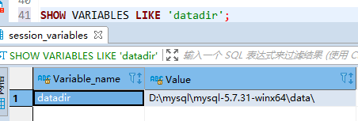
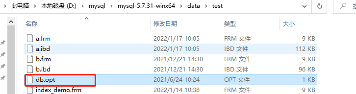

《MySQL 怎样运行的？-从跟上理解MySQL》---小孩子 

**摘抄**

### 8 MySQL 数据目录 

InnoDB 和 MyISAM 这两个存储引擎的数据如何在文件系统中存储的。

#### 1 MySQL 数据目录

MySQL服务器程序在启动时会到文件系统的某个目录下加载一些文件，之后在运行过程中产生的数据也都会存储 到这个目录下的某些文件中，这个目录就称为 **数据目录** 。

##### 1.1 数据目录和安装目录的区别

MySQL 的安装目录，安装目录下有个非常重要的 bin 目录，它里边存储了许多关于控制客户端程序和服务器的命令（许多可执行文件，比如mysql，mysqld，mysqld_safe 等等好几十个）。

而数据目录是用来存储MySQL在运行过程中产生的数据。

##### 1.2 如何确定MySQL中的数据目录 

使用查询语句命令：`SHOW VARIABLES LIKE 'datadir';`，如下是我的MySQL数据目录。



#### 2 数据目录的结构

##### 2.1 数据库在文件系统中的表示 

当创建一个数据库的时候，`CREATE DATABASE 数据库名`，在文件系统上实际发生了什么呢？其实很简单：每个数据库都对应数据目录下的一个子目录或者是一个文件夹，

- 在 数据目录 下创建一个和数据库名同名的子目录（或者说是文件夹）。
- 在该与数据库名同名的子目录下创建一个名为 db.opt 的文件，这个文件中包含了该数据库的各种属性，比 方说该数据库的字符集和比较规则是个啥。

数据库的 db.opt 文件



##### 2.2 表在文件系统中的表示 

我们的数据都是以记录的形式插入到表中的，每个表的信息其实可以分为两种：

1. **表结构的定义**
2. **表中的数据**

表结构就是表名称，表里面有多少列，每个列的数据类型是啥，有啥约束条件，用的是什么字符集和比较规则之类的信息。为了保存这些信息，InnoDB 和 myISM 都在数据目录下对应的数据库子目录下创建了一个专门用于描述表结构的文件，文件名称是这样的：

**表名.frm**

这 个后缀名为.frm是以二进制格式存储的，我们直接打开会是乱码的。

###### InnoDB 是如何存储表数据的

- **InnoDB 其实是使用 页 为基本单位来管理存储空间的，默认的 页 大小为 16KB** 。 
- **对于 InnoDB 存储引擎来说，每个索引都对应着一棵 B+ 树，该 B+ 树的每个节点都是一个数据页，数据页之间不必要是物理连续的，因为数据页之间有 双向链表 来维护着这些页的顺序**。 
- **InnoDB 的聚簇索引的叶子节点存储了完整的用户记录，也就是所谓的索引即数据，数据即索引**。

**为了更好的管理这些页，设计 InnoDB 的大叔们提出了一个 表空间或者文件空间的概念，这个表空间是一个抽象的概念，它可以对应文件系统上一个或多个真实文件**（不同表空间对应的文件数量可能不同）。**每一个 表空间 可以被划分为很多很多很多个 页 ，我们的表数据就存放在某个 表空间 下的某些页里**。设计 InnoDB 的大叔将表空间划分为几种不同的类型，我们一个一个看一下。

###### **（1）系统表空间（system tablespace）**

**这个所谓的 系统表空间 可以对应文件系统上一个或多个实际的文件，默认情况下， InnoDB 会在 数据目录 下创 建一个名为 ibdata1 （在你的数据目录下找找看有木有）、大小为 12M 的文件，这个文件就是对应的 系统表空 间 在文件系统上的表示**。这个文件是自扩展文件，也就是不够用时会自己增加文件大小。

我们可以修改配置文件

```tex
[server] innodb_data_file_path=data1:512M;data2:512M:autoextend
```

这样在 MySQL 启动之后就会创建这两个512M大小的文件作为 系统表空间 ，其中的 autoextend 表明这两个文件 如果不够用会自动扩展 data2 文件的大小。

我们也可以把 系统表空间 对应的文件路径不配置到 数据目录 下，甚至可以配置到单独的磁盘分区上，涉及到的 启动参数就是 innodb_data_file_path 和 innodb_data_home_dir 。

**在一个MySQL服务器中，系统表空间只有一份**。

###### **（2）独立表空间（file-per-table tablespace）**

在MySQL5.6.6以及之后的版本中， InnoDB 并不会默认的把各个表的数据存储到系统表空间中，而是**为每一个表 建立一个独立表空间，也就是说我们创建了多少个表，就有多少个独立表空间**。

使用独立表空间来存储数据的话，会在该表所属数据库对应的子目录下创建一个表示该独立表空间的文件，文件名与表名相同，只不过添加了一个 .idb 扩展名而已：

**表名.idb**

当然我们也可以自己指定使用 系统表空间 还是 独立表空间 来存储数据，这个功能由启动参数 innodb_file_per_table 控制。比如说我们想刻意将表数据都存储到 系统表空间 时，可以在启动 MySQL 服务器的时候这样配置：

> [server] innodb_file_per_table=0

当 innodb_file_per_table 的值为 0 时，代表使用系统表空间；当 innodb_file_per_table 的值为 1 时，代表 使用独立表空间。不过 innodb_file_per_table 参数只对新建的表起作用，对于已经分配了表空间的表并不起作 用。如果我们想把已经存在系统表空间中的表转移到独立表空间，可以使用下边的语法：

> ALTER TABLE 表名 TABLESPACE [=] innodb_file_per_table;

或者把已经存在独立表空间的表转移到系统表空间，可以使用下边的语法：

> ALTER TABLE 表名 TABLESPACE [=] innodb_system;

其中中括号扩起来的 = 可有可无，比方说我们想把 test 表从独立表空间移动到系统表空间，可以这么写:

> ALTER TABLE test TABLESPACE innodb_system;

###### **（3）其他类型的表空间**

随着MySQL的发展，除了上述两种老牌表空间之外，现在还新提出了一些不同类型的表空间，比如通用表空间 （general tablespace）、undo表空间（undo tablespace）、临时表空间（temporary tablespace）吧啦吧啦的，具体情况我们就不细唠叨了，等用到的时候再提。

###### MyISAM 是如何存储表数据的 

而且和 InnoDB 不同的是， MyISAM 并没有什么所谓的 表空 间 一说，表数据都存放到对应的数据库子目录下。假如 test 表使用 MyISAM 存储引擎的话，那么在它所在数据 库对应的 xiaohaizi 目录下会为 test 表创建这三个文件：

test.frm，test.MYD，test.MYI

其中 test.MYD 代表表的数据文件，也就是我们插入的用户记录； test.MYI 代表表的索引文件，我们为该表创建 的索引都会放到这个文件中。

##### 2.3 视图在文件系统中的表示 

我们知道 MySQL 中的视图其实是虚拟的表，也就是某个查询语句的一个别名而已，所以**在存储 视图 的时候是不需要存储真实的数据的，只需要把它的结构存储起来就行了**。和表一样，**描述视图结构的文件也会被存储到所属数据库对应的子目录下边，只会存储一个 视图名.frm 的文件**。

##### 2.4 其他的文件 

- 服务器进程文件。
- 服务器日志文件
- 默认/自动生成的SSL和RSA证书和密钥文件

#### 3 文件系统对数据库的影响 

- 数据库名称和表名称不得超过文件系统所允许的最大长度。

- 特殊字符的问题。

  为了避免因为数据库名和表名出现某些特殊字符而造成文件系统不支持的情况， **MySQL 会把数据库名和表名 中所有除数字和拉丁字母以外的所有字符在文件名里都映射成 @+编码值 的形式作为文件名**。比方说我们创建的表的名称为 'test?' ，由于 ? 不属于数字或者拉丁字母，所以会被映射成编码值，所以这个表对应 的 .frm 文件的名称就变成了 test@003f.frm。

- 文件长度受文件系统最大长度限制。

  对于 InnoDB 的独立表空间来说，每个表的数据都会被存储到一个与表名同名的 .ibd 文件中；对于 MyISAM 存储引擎来说，数据和索引会分别存放到与表同名的 .MYD 和 .MYI 文件中。这些文件会随着表中记录的增加 而增大，它们的大小受限于文件系统支持的最大文件大小。

#### 4 MySQL 系统数据库简介 

- mysql

  存储了MySQL的用户账户和权限信息，一些存储过程、事件的定义信息，一些运行过程中产生的日志信息，一些帮助信息以及时区信息等。

- information_schema

  这个数据库保存着MySQL服务器维护的所有其他数据库的信息，比如有哪些表、哪些视图、哪些触发器、哪些列、哪些索引吧啦吧啦。这些信息并不是真实的用户数据，而是一些描述性信息，有时候也称之为元数据。

- performance_schema

  这个数据库里主要保存MySQL服务器运行过程中的一些状态信息，算是对MySQL服务器的一个性能监控。 包括统计最近执行了哪些语句，在执行过程的每个阶段都花费了多长时间，内存的使用情况等等信息。

- sys

  这个数据库主要是通过视图的形式把 information_schema 和 performance_schema 结合起来，让程序员可以更方便的了解MySQL服务器的一些性能信息。

