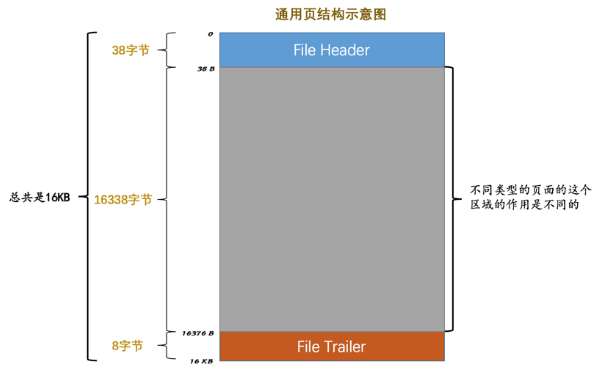
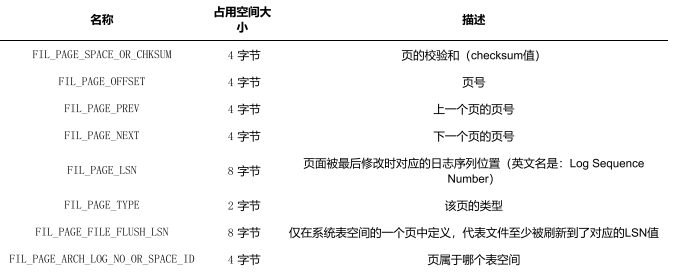
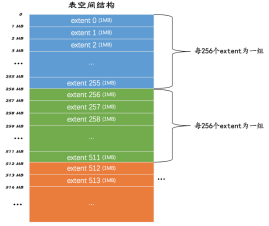
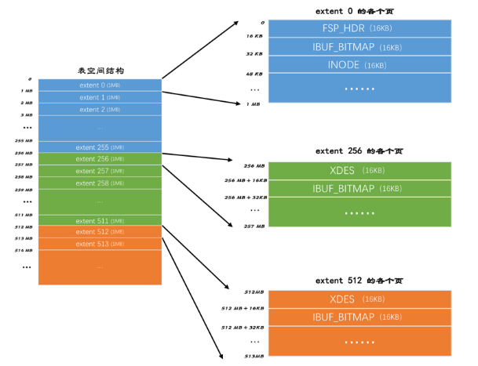

### 9 存放页面的大池子---InnoDB 的表空间

#### 1. 回顾一下

InnoDB是以页为单位管理存储空间的，我们的聚簇索引（也就是完整的表数据）和其他的二级索引 都是以 B+ 树的形式保存到表空间的，而 B+ 树的节点就是数据页。

我们前边说过，这个数据页的类型名其实 是： FIL_PAGE_INDEX ，除了这种存放索引数据的页面类型之外，InnoDB也为了不同的目的设计了若干种不同类型的页面。

>  **（这些部分不知道的时候查pdf）暂时不需要了解的这么详细**

##### 1.1 页面类型

| 类型名称                | 十六进制 | 描述                            |
| ----------------------- | -------- | ------------------------------- |
| FIL_PAGE_TYPE_ALLOCATED | 0x0000   | 最新分配，还没使用              |
| FIL_PAGE_UNDO_LOG       | 0x0002   | Undo日志页                      |
| FIL_PAGE_INODE          | 0x0003   | 段信息节点                      |
| FIL_PAGE_IBUF_FREE_LIST | 0x0004   | Insert Buffer空闲列表           |
| FIL_PAGE_IBUF_BITMAP    | 0x0005   | Insert Buffer位图               |
| FIL_PAGE_TYPE_SYS       | 0x0006   | 系统页                          |
| FIL_PAGE_TYPE_TRX_SYS   | 0x0007   | 事务系统数据                    |
| FIL_PAGE_TYPE_FSP_HDR   | 0x0008   | 表空间头部信息                  |
| FIL_PAGE_TYPE_XDES      | 0x0009   | 扩展描述页                      |
| FIL_PAGE_TYPE_BLOB      | 0x000A   | BLOB页                          |
| FIL_PAGE_INDEX          | 0x45BF   | 索引页，也就是我们所说的 数据页 |

因为页面类型前边都有个 FIL_PAGE 或者 FIL_PAGE_TYPE 的前缀，为简便起见我们后边唠叨页面类型的时候就把 这些前缀省略掉了，比方说 FIL_PAGE_TYPE_ALLOCATED 类型称为 ALLOCATED 类型， FIL_PAGE_INDEX 类型称为 INDEX 类型。

##### 1.2 页面通用部分 

我们前边说过数据页，也就是 INDEX 类型的页由7个部分组成，其中的两个部分是所有类型的页面都通用的：页面通用结构

从上图可以看出，任何类型的页都会包含这两个部分：

- File Header：记录页面的通用信息
- File Trailer：校验页是否完整，保证从内存到磁盘刷新时内容的一致性

File header 的各个组成部分

需要注意的几点：

- 表空间中的每一个页都对应着一个页号，也就是 FIL_PAGE_OFFSET ，这个页号由4个字节组成，也就是32个 比特位，所以一个表空间最多可以拥有2³²个页，如果按照页的默认大小16KB来算，**一个表空间最多支持 64TB的数据**。表空间的第一个页的页号为0，之后的页号分别是1，2，3...依此类推。

- 某些类型的页可以组成链表，链表中的页可以不按照物理顺序存储，而是根据 FIL_PAGE_PREV 和 FIL_PAGE_NEXT 来存储上一个页和下一个页的页号。需要注意的是，这两个字段主要是为了 INDEX 类型的 页，也就是我们之前一直说的数据页建立 B+ 树后，为每层节点建立双向链表用的，一般类型的页是不使用 这两个字段的。
- 每个页的类型由 FIL_PAGE_TYPE 表示，比如像数据页的该字段的值就是 0x45BF ，我们后边会介绍各种不同 类型的页，不同类型的页在该字段上的值是不同的。

#### 2. 独立表空间结构

我们知道 InnoDB 支持许多种类型的表空间，本章重点关注独立表空间和系统表空间的结构。它们的结构比较相 似，但是由于**系统表空间中额外包含了一些关于整个系统的信息**，所以我们先挑简单一点的独立表空间来唠叨， 稍后再说系统表空间的结构。

##### 2.1 区（extent）的概念

表空间中的页实在是太多了，为了更好的管理这些页面，设计 InnoDB 的大叔们提出了 区 （英文名： extent ） 的概念。**对于16KB的页来说，连续的64个页就是一个 区 ，也就是说一个区默认占用1MB空间大小**。不论系统表空间还是独立表空间，都可以看成是若干个区组成的，**每256个区分成一组**，图表示如下：

这些组的头几个页面的类型都是类似的，就像这样：记住，**连续的64个页是一个区，一个区默认1MB大小**

从上图可以得到一些信息

1. 第一个组（256个区）最开始的三个页面的类型是固定的，也就是extent 0 这个区最开始的3个页面的类型是固定的， 分别是：（这些类型在上边的表格里面有）
   - **FSP_HDR**类型：表空间头部信息。这个类型的页面是用来登记整个表空间的一些整体属性以及本组所有的 区 ，也就是 extent 0 ~ extent 255 这256个区的属性，真个表空间只有一个FSR_HDR类型的页面。
   - **IBUF_BITMAP** 类型：这个类型的页面是存储本组所有的区的所有页面关于 INSERT BUFFER 的信息。
   - **INODE** 类型：这个类型的页面存储了许多称为 INODE 的数据结构（段信息节点）。
2. 其余各组最开始的2个页面的类型是固定的，也就是说 extent 256 、 extent 512 这些区最开始的2个页面 的类型是固定的，分别是：
   - **XDES** 类型：**全称是 extent descriptor ，用来登记本组256个区的属性**，也就是说**对于在 extent 256 区中的该类型页面存储的就是 extent 256 ~ extent 511 这些区的属性，对于在 extent 512 区中的该 类型页面存储的就是 extent 512 ~ extent 767 这些区的属性**。上边介绍的 FSP_HDR 类型的页面其实 和 XDES 类型的页面的作用类似，只不过 FSP_HDR 类型的页面还会额外存储一些表空间的属性。
   - **IBUF_BITMAP** 类型：这个类型的页面是存储本组所有的区的所有页面关于 INSERT BUFFER 的信息

##### 2.2 段（segment）的概念 

为什么好好的要提出一个区（extent）的概念呢？

我们之前分析问题的套路是这样的：表中的记录存储到页里边，然后页作为节点构成B+树，这个B+树就是索引，然后是一堆聚簇索引和二级索引的区别。

如果数据量很少的话，比如说你的表中只有几十条、几百条数据的话，的确用不到 区 的概念， 因为简单的几个页就能把对应的数据存储起来，但是你架不住表里的记录越来越多呀~

表里的记录多了又怎样？ B+ 树的每一层中的页都会形成一个双向链表呀， File Header 中的 FIL_PAGE_PREV 和 FIL_PAGE_NEXT 字段不就是为了形成双向链表设置的么？

理论上来说不引入区（extent）概念并没啥影响，但是考虑下这个场景：

> 我们每向表中插入一条记录，本质上就是向该表的聚簇索引以及所有二级索引代表的 B+ 树的节点中插入数 据。而 B+ 树的每一层中的页都会形成一个双向链表，如果是以页为单位来分配存储空间的话，双向链表相 邻的两个页之间的物理位置可能离得非常远。我们介绍 B+ 树索引的适用场景的时候特别提到范围查询只需 要定位到最左边的记录和最右边的记录，然后沿着双向链表一直扫描就可以了，而如果链表中相邻的两个页 物理位置离得非常远，就是所谓的 随机I/O 。磁盘的速度和内存的速度差了好几个数量级，随 机I/O 是非常慢的，所以我们应该尽量让链表中相邻的页的物理位置也相邻，这样进行范围查询的时候才可 以使用所谓的 顺序I/O 。

所以才引入了 区 （ extent ）的概念，一个区就是在物理位置上连续的64个页。在表中数据量大 的时候，为某个索引分配空间的时候就不再按照页为单位分配了，而是按照 区 为单位分配，甚至在表中的数据 十分非常特别多的时候，可以一次性分配多个连续的区。虽然可能造成一点点空间的浪费（数据不足填充满整个 区），但是从性能角度看，**可以消除很多的随机 I/O** ，功大于过嘛！

我们提到的范围查询，其实是对 B+ 树叶子节点中的记录进行顺序扫描，而 如果不区分叶子节点和非叶子节点，统统把节点代表的页面放到申请到的区中的话，进行范围扫描的效果就大打 折扣了。所以设计 InnoDB 的大叔们对 B+ 树的叶子节点和非叶子节点进行了区别对待，也就是说叶子节点有自己 独有的 区 ，非叶子节点也有自己独有的 区 。**存放叶子节点的区的集合就算是一个 段 （ segment ），存放非叶 子节点的区的集合也算是一个 段 。也就是说一个索引会生成2个段，一个叶子节点段，一个非叶子节点段**。

默认情况下一个使用 InnoDB 存储引擎的表只有一个聚簇索引，一个索引会生成2个段，而段是以区为单位申请存 储空间的，一个区默认占用1M存储空间，所以默认情况下一个只存了几条记录的小表也需要2M的存储空间么？ 以后每次添加一个索引都要多申请2M的存储空间么？这对于存储记录比较少的表简直是天大的浪费。设计 InnoDB 的大叔们都挺节俭的，当然也考虑到了这种情况。

这个问题的症结在于到现在为止我们介绍的区都是非
常 纯粹 的，也就是一个区被整个分配给某一个段，或者说区中的所有页面都是为了存储同一个段的数据而存在 的，即使段的数据填不满区中所有的页面，那余下的页面也不能挪作他用。现在为了考虑以完整的区为单位分配 给某个段对于数据量较小的表太浪费存储空间的这种情况，设计 InnoDB 的大叔们提出了一个**碎片（fragment） 区的概念**，也就是**在一个碎片区中，并不是所有的页都是为了存储同一个段的数据而存在的，而是碎片区中的页 可以用于不同的目的**，比如有些页用于段A，有些页用于段B，有些页甚至哪个段都不属于。碎片区直属于表空 间，并不属于任何一个段。所以此后为某个段分配存储空间的策略是这样的：

- **在刚开始向表中插入数据的时候，段是从某个碎片区以单个页面为单位来分配存储空间的**。
- **当某个段已经占用了32个碎片区页面之后，就会以完整的区为单位来分配存储空间**。

所以现在**段**不能仅定义为是某些区的集合，**更精确的应该是某些零散的页面以及一些完整的区的集合**。除了索引 的叶子节点段和非叶子节点段之外， InnoDB 中还有为存储一些特殊的数据而定义的段，比如回滚段，当然我们 现在并不关心别的类型的段，现在只需要知道段是一些零散的页面以及一些完整的区的集合就好了。

##### 2.3 区的分类

通过上面知道了，表空间是由若干个区组成的，这些区大体上可以分为4中类型：

- 空闲的区：现在还没有用到这个区中的任何页面。
- 有剩余空间的碎片区：表示碎片区中还有可用的页面。
- 没有剩余空间的碎片区：表示碎片区中的所有页面都被使用，没有空闲页面。
- 附属于某个段的区：每一个索引都可以分为叶子节点段和非叶子节点段，除此之外InnoDB还会另外定义一些 特殊作用的段，在这些段中的数据量很大时将使用区来作为基本的分配单位。

这4种类型的区也可以被称为区的4种状态（ State ）：

| 状态名    | 含义                 |
| --------- | -------------------- |
| FREE      | 空闲的区             |
| FREE_FRAG | 有剩余空间的碎片区   |
| FULL_FRAG | 没有剩余空间的碎片区 |
| FSEG      | 附属于某个段的区     |

需要再次强调一遍的是，处于 FREE 、 FREE_FRAG 以及 FULL_FRAG 这三种状态的区都是独立的，算是直属于表空间；而**处于 FSEG 状态的区是附属于某个段的**。

