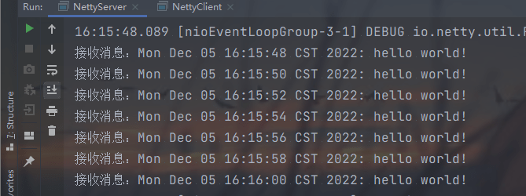

### 阻塞IO客户端与服务端之间通信

#### 客户端

```java
public class IOClient {
    public static void main(String[] args) {
        new Thread(()->{
            try {
                Socket socket = new Socket("127.0.0.1", 8000);
                while (true) {
                    socket.getOutputStream().write((new Date() + ": hello world").getBytes());
                    Thread.sleep(2000);
                }
            } catch (Exception e) {
                e.printStackTrace();
            }
        }).start();
    }
}

```
#### 服务端

```java
package com.lanwq.networkprogramming.learnnetty.two;

import java.io.IOException;
import java.io.InputStream;
import java.net.ServerSocket;
import java.net.Socket;

/**
 * @author Vin lan
 * @className IOServer
 * @description
 * @createTime 2022-12-02  16:53
 **/
public class IOServer {
    public static void main(String[] args) throws IOException {
        ServerSocket serverSocket = new ServerSocket(8000);
        // 收新连接线程
        new Thread(() -> {
            while (true) {
                try {
                    // 1 阻塞获取新连接
                    Socket socket = serverSocket.accept();
                    // 2 为每一个新连接创建一个新线程负责读取数据
                    new Thread(() -> {
                        try {
                            int len;
                            byte[] data = new byte[1024];
                            InputStream inputStream = socket.getInputStream();
                            // 3 按字节流方式读取数据
                            while ((len = inputStream.read(data)) != -1) {
                                System.out.println(new String(data, 0, len));
                            }
                        } catch (IOException e) {
                            e.printStackTrace();
                        }
                    }).start();
                } catch (IOException e) {
                    e.printStackTrace();
                }
            }
        }).start();
    }
}
```

有几个问题：

这里有个问题：在传统的IO模型中，每个连接创建成功之后都需要由一个线程来维护，每个线程都包含一个while死循环，那么1万个连接对应1万个线程，继而有1万个while死循环。
1.线程资源受限：线程是操作系统中非常宝贵的资源，同一时刻有大量的线程处于阻塞状态，是非常严重的资源浪费，操作系统耗不起。
2.线程切换效率低下：单机CPU核数固定，线程爆炸之后操作系统频繁进行线程切换，应用性能急剧下降。
3.除了以上两个问题，在IO编程中，我们看到数据读写是以字节流为单位的。

---

使用JDK原生的 NIO 来实现网络编程，详细看以下例子：

客户端和阻塞IO一样。

### JDK的 NIO 实现服务端：

```java
public class NIOServer {
    public static void main(String[] args) throws IOException {
        Selector serverSelector = Selector.open();
        Selector clientSelector = Selector.open();

        new Thread(() -> {
            try {
                // 对应 IO 编程中的服务端启动
                ServerSocketChannel listenerChannel = ServerSocketChannel.open();
                listenerChannel.socket().bind(new InetSocketAddress(8000));
                listenerChannel.configureBlocking(false);
                listenerChannel.register(serverSelector, SelectionKey.OP_ACCEPT);
                while (true) {
                    // 监听是否有连接，这里的 1 是只阻塞的时间为 1 ms
                    if (serverSelector.select(1) > 0) {
                        Set<SelectionKey> set = serverSelector.selectedKeys();
                        Iterator<SelectionKey> iterator = set.iterator();
                        while (iterator.hasNext()) {
                            SelectionKey key = iterator.next();
                            if (key.isAcceptable()) {
                                try {
                                    // (1)每来一个新的连接，不需要创建一个线程，而是直接注册到 clientSelector
                                    SocketChannel clientChannel = ((ServerSocketChannel) key.channel()).accept();
                                    clientChannel.configureBlocking(false);
                                    clientChannel.register(clientSelector, SelectionKey.OP_READ);
                                } catch (Exception e) {
                                    e.printStackTrace();
                                } finally {
                                    iterator.remove();
                                }
                            }
                        }
                    }
                }
            } catch (Exception e) {
                e.printStackTrace();
            }
        }).start();

        new Thread(() -> {
            try {
                while (true) {
                    // (2) 批量轮询哪些连接有数据可读
                    if (clientSelector.select(1) > 0) {
                        Set<SelectionKey> set = clientSelector.selectedKeys();
                        Iterator<SelectionKey> keyIterator = set.iterator();
                        while (keyIterator.hasNext()) {
                            SelectionKey key = keyIterator.next();
                            if (key.isReadable()) {
                                try {
                                    SocketChannel clientChannel = (SocketChannel) key.channel();
                                    ByteBuffer byteBuffer = ByteBuffer.allocate(1024);
                                    // (3) 面向buffer
                                    clientChannel.read(byteBuffer);
                                    byteBuffer.flip();
                                    System.out.println("读取到数据：" + Charset.defaultCharset().newDecoder().decode(byteBuffer).toString());
                                } catch (Exception e) {
                                    e.printStackTrace();
                                } finally {
                                    keyIterator.remove();
                                    key.interestOps(SelectionKey.OP_READ);
                                }
                            }
                        }
                    }
                }
            } catch (Exception e) {
                e.printStackTrace();
            }
        }).start();
    }
}
```

1. NIO模型中通常会有两个线程，每个线程都绑定一个轮询器Selector。在这个例子中，serverSelector负责轮询是否有新连接，clientSelector负责轮询连接是否有数据可读。

2. 服务端监测到新连接之后，不再创建一个新线程，而是直接将新连接绑定到clientSelector上，这样就不用IO模型中的1万个while循环死等，参见（1）。
3. clientSelector被一个while死循环包裹着，如果在某一时刻有多个连接有数据可读，那么通过clientSelector.select(1)方法可以轮询出来，进而批量处理，参见（2）。
4. 数据的读写面向Buffer，参见（3）。

不建议直接使用基于JDK原生NIO来进行网络开发，有如下一些原因：

1. JDK的NIO编程需要了解很多概念，编程复杂，对NIO入门非常不友好，编程模型不友好，ByteBuffer的API简直“反人类”。
2. 对NIO编程来说，一个比较合适的线程模型能充分发挥它的优势，而JDK没有实现，需要自己实现，就连简单的自定义协议拆包都要自己实现。
3. JDK的NIO底层由Epoll实现，该实现饱受诟病的空轮询Bug会导致CPU占用率飙升至100%。
4. 项目庞大之后，自行实现的NIO很容易出现各类Bug，维护成本较高，上面这些代码笔者都不能保证没有Bug。

### Netty 编程

**Netty是一个异步事件驱动的网络应用框架，用于快速开发可维护的高性能服务端和客户端**。Netty封装了JDK的NIO。

使用Netty而不使用JDK原生NIO的原因：

1. 使用JDK原生NIO需要了解太多概念，编程复杂，一不小心就Bug横飞。
2. Netty底层IO模型随意切换，而这一切只需要做微小的改动，改改参数，Netty可以直接从NIO模型变身为IO模型。
3. Netty自带的拆包/粘包、异常检测等机制让你从NIO的繁重细节中脱离出来，只需要关心业务逻辑即可。
4. Netty解决了JDK很多包括空轮询在内的Bug。
5. Netty底层对线程、Selector做了很多细小的优化，精心设计的Reactor线程模型可以做到非常高效的并发处理。
6. 自带各种协议栈，让你处理任何一种通用协议都几乎不用亲自动手。
7. Netty社区活跃，遇到问题随时邮件列表或者Issue。
8. Netty已经历各大RPC框架、消息中间件、分布式通信中间件线上的广泛验证，健壮性无比强大。

引入Netty的依赖来进行开发：

```xml
<dependency>
    <groupId>io.netty</groupId>
    <artifactId>netty-all</artifactId>
    <version>>4.1.42.Final</version>
</dependency>
```

#### 服务端实现部分

```java
package com.lanwq.networkprogramming.learnnetty.two;

import io.netty.bootstrap.ServerBootstrap;
import io.netty.channel.ChannelHandlerContext;
import io.netty.channel.ChannelInitializer;
import io.netty.channel.SimpleChannelInboundHandler;
import io.netty.channel.nio.NioEventLoopGroup;
import io.netty.channel.socket.nio.NioServerSocketChannel;
import io.netty.channel.socket.nio.NioSocketChannel;

/**
 * @author Vin lan
 * @className NettyServer
 * @description netty 服务端
 * @createTime 2022-12-05  15:54
 **/
public class NettyServer {
    public static void main(String[] args) {
        ServerBootstrap serverBootstrap = new ServerBootstrap();
        NioEventLoopGroup boss = new NioEventLoopGroup();
        NioEventLoopGroup worker = new NioEventLoopGroup();

        serverBootstrap.group(boss, worker)
                .channel(NioServerSocketChannel.class)
                .childHandler(new ChannelInitializer<NioSocketChannel>() {
                    @Override
                    protected void initChannel(NioSocketChannel ch) throws Exception {
                        ch.pipeline().addLast(new StringDecoder());
                        ch.pipeline().addLast(new SimpleChannelInboundHandler<String>() {
                            @Override
                            protected void channelRead0(ChannelHandlerContext ctx, String msg) throws Exception {
                                System.out.println(msg);
                            }
                        });
                    }
                }).bind(8000);
    }
}
```

1. **boss**对应IOServer.java中的**负责接收新连接的线程，主要负责创建新连接**。

2. **worker**对应IOServer.java中的**负责读取数据的线程，主要用于读取数据及业务逻辑处理**。

3. 然后指定服务端的IO模型为NIO，上述代码通过 .channel(NioServerSocketChannel.class)来指定IO模型，也可以有其他选择。如果你想指定IO模型为BIO，那么这里配置上OioServerSocketChannel.class类型即可。

4. 接着调用childHandler()方法，给这个引导类创建一个ChannelInitializer，主要是定义后续每个连接的数据读写。

   在ChannelInitializer这个类中，有一个泛型参数**NioSocketChannel**，**这个类就是Netty对NIO类型连接的抽象**，而前面的**NioServerSocketChannel也是对NIO类型连接的抽象**，NioServerSocketChannel和NioSocketChannel的概念可以与BIO编程模型中的ServerSocket和Socket两个概念对应。

#### 客户端实现部分

```java
package com.lanwq.networkprogramming.learnnetty.two;

import io.netty.bootstrap.Bootstrap;
import io.netty.channel.Channel;
import io.netty.channel.ChannelInitializer;
import io.netty.channel.nio.NioEventLoopGroup;
import io.netty.channel.socket.nio.NioSocketChannel;
import io.netty.handler.codec.string.StringEncoder;

import java.util.Date;


/**
 * @author Vin lan
 * @className NettyClient
 * @description
 * @createTime 2022-12-05  15:59
 **/
public class NettyClient {
    public static void main(String[] args) throws InterruptedException {
        Bootstrap bootstrap = new Bootstrap();
        NioEventLoopGroup group = new NioEventLoopGroup();
        bootstrap.group(group)
                .channel(NioSocketChannel.class)
                .handler(new ChannelInitializer<Channel>() {
                    @Override
                    protected void initChannel(Channel ch) throws Exception {
                        ch.pipeline().addLast(new StringEncoder());
                    }
                });
        Channel channel = bootstrap.connect("127.0.0.1", 8000).channel();
        while (true) {
            channel.writeAndFlush(new Date() + ": hello world!");
            Thread.sleep(2000);
        }
    }
}
```

控制台打印的输出数据：



#### 服务端自动绑定递增端口

```java
private static void bind(ServerBootstrap serverBootstrap, int port) {
    serverBootstrap.bind(8000).addListener(new GenericFutureListener<Future<? super Void>>() {
        @Override
        public void operationComplete(Future<? super Void> future) throws Exception {
            if (future.isSuccess()) {
                System.out.println("端口【" + port + "】绑定成功！");
            } else {
                System.out.println("端口【" + port + "】绑定失败！");
                bind(serverBootstrap, port + 1);
            }
        }
    });
}
```


我本地端口9001是被使用了的，所以绑定失败，继续绑定9002，成功！

#### 服务端启动其他方法

##### handler() 方法

```java
serverBootstrap.group(boss, worker)
        .channel(NioServerSocketChannel.class)
        .handler(new ChannelInitializer<NioSocketChannel>() {
            @Override
            protected void initChannel(NioSocketChannel ch) throws Exception {
                System.out.println("服务端启动中！");
            }
        })
    ...
```

handler()方法可以和前面分析的childHandler()方法对应起来：childHandler()方法用于指定处理新连接数据的读写处理逻辑；handler()方法用于指定在服务端启动过程中的一些逻辑，通常情况下用不到这个方法。

##### attr()方法

```java
serverBootstrap.attr(AttributeKey.newInstance("serverName"), "netty server")
```

attr()方法可以给服务端Channel，也就是NioServerSocketChannel指定一些自定义属性，然后通过channel.attr()取出这个属性。比如，上面的代码可以指定服务端Channel的serverName属性，属性值为nettyServer，其实就是给NioServerSocketChannel维护一个Map而已，通常情况下也用不上这个方法。

##### childAttr()方法

除了可以给服务端Channel即NioServerSocketChannel指定一些自定义属性，我们还可以给每一个连接都指定自定义属性。

```java
serverBootstrap.childAttr(AttributeKey.newInstance("childAttr"), "child value")
```

上面的childAttr()方法可以给每一个连接都指定自定义属性，后续我们可以通过channel.attr()方法取出该属性。

##### option()方法

option()方法可以给服务端Channel设置一些TCP参数，最常见的就是so_backlog，设置如下。

```java
serverBootstrap.option(ChannelOption.SO_BACKLOG, 1024)
```

这个设置表示系统用于临时存放已完成三次握手的请求的队列的最大长度，如果连接建立频繁，服务器处理创建新连接较慢，则可以适当调大这个参数。

##### childOption()方法

childOption()方法可以给每个连接都设置一些TCP参数。

```java
serverBootstrap
.childOption(ChannelOption.SO_KEEPALIVE, true)
.childOption(ChannelOption.TCP_NODELAY, true)
```

- **ChannelOption.SO_KEEPALIVE表示是否开启TCP底层心跳机制，true表示开启**。

- **ChannelOption.TCP_NODELAY表示是否开启Nagle算法，true表示关闭，false表示开启**。通俗地说，如果要求高实时性，有数据发送时就马上发送，就设置为关闭；如果需要减少发送次数，减少网络交互，就设置为开启。