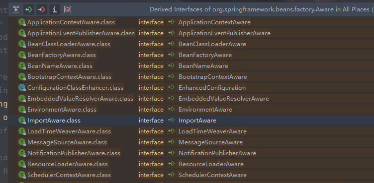

## Aware 接口

博客链接：[spring扩展接口解析3--Aware系列接口 - Lucky帅小武 - 博客园 (cnblogs.com)](https://www.cnblogs.com/jackion5/p/13283232.html) 

Spring的核心思想之一就是IOC（控制反转），而IOC的实现方式DI（依赖注入），也就是说当某个bean需要依赖另一个bean时，就可以采用依赖注入的方式将依赖的bean自动注入到该bean中。但是如果一个bean依赖的对象并非是一个bean，此时通过容器的依赖注入显然就无法实现了，不过Spring容器提供了扩展接口，当某个bean对某个对象有兴趣或者是想要获取该对象时，比如想要获取Spring容器本身的资源，此时就可以采用Aware接口来获取。

#### 2 spring 提供的 Aware 接口

spring 已经默认提供了一些Aware接口，可以用来获取我们所需要的资源。需要使用到某个对象就可以实现对应的Aware接口即可。



##### 2.1、BeanFactoryAware接口（获取BeanFactory对象）


##### 2.2、ApplicatioContextAware接口（获取ApplicationContext对象）

##### 2.3、BeanNameAware接口（获取当前bean的beanName） 

##### 2.4、ApplicationEventPublisherAware接口（获取容器中事件发布器,可以用于发布事件） 

##### 2.5、ResourceLoaderAware接口（获取资源加载器，用于获取外部资源文件） 

#### 3 使用

```java 
public class AwareBean implements BeanNameAware, BeanFactoryAware, ApplicationContextAware {

    private String beanName;

    private BeanFactory beanFactory;

    private ApplicationContext applicationContext;

    @Override
    public void setBeanFactory(BeanFactory beanFactory) throws BeansException {
        this.beanFactory = beanFactory;
    }

    @Override
    public void setBeanName(String beanName) {
        this.beanName = beanName;
    }

    @Override
    public void setApplicationContext(ApplicationContext applicationContext) throws BeansException {
        this.applicationContext = applicationContext;
    }

    public void test(){
        System.out.println("beanName:" + beanName);
        System.out.println("从BeanFactory中获取当前bean " + beanFactory.getBean(AwareBean.class).equals(this));
        System.out.println("从ApplicationContext中获取当前bean " + applicationContext.getBean(AwareBean.class).equals(this));
    }
}
```

输出：

```tex
1 beanName:awareBean
2 从BeanFactory中获取当前bean true
3 从ApplicationContext中获取当前bean true
```

#### 4 原理

当bean实现了Aware接口之后，由于实现了Aware接口的方法，所以bean在初始化的过程中就需要执行Aware接口的方法，准确的说是在bean填充属性之后，执行init方法之前。

具体执行的逻辑是在初始化bean的方法initializeBean方法中，由前面几篇文章可知，bean的初始化过程分成 createBeanInstance(创建bean) ->populateBean(属性注入) ->initializeBean(执行初始化方法) 三步

而Aware接口方法的执行就是在第三步initializeBean方法当中，源码如下:

```java
protected Object initializeBean(final String beanName, final Object bean, @Nullable RootBeanDefinition mbd) {
        if (System.getSecurityManager() != null) {
            AccessController.doPrivileged((PrivilegedAction<Object>) () -> {
                /** 1、执行Aware接口的方法*/
                invokeAwareMethods(beanName, bean);
                return null;
            }, getAccessControlContext());
        }
        else {
            /** 1、执行Aware接口的方法*/
            invokeAwareMethods(beanName, bean);
        }

        Object wrappedBean = bean;
        if (mbd == null || !mbd.isSynthetic()) {               /** 2、执行bean的前置处理器方法*/
            wrappedBean = applyBeanPostProcessorsBeforeInitialization(wrappedBean, beanName);
        }

        try {
            /** 3、执行初始化方法*/
            invokeInitMethods(beanName, wrappedBean, mbd);
        }
        catch (Throwable ex) {
            throw new BeanCreationException(
                    (mbd != null ? mbd.getResourceDescription() : null),
                    beanName, "Invocation of init method failed", ex);
        }
        if (mbd == null || !mbd.isSynthetic()) {               /** 4、执行bean的后置处理器方法*/
            wrappedBean = applyBeanPostProcessorsAfterInitialization(wrappedBean, beanName);
        }

        return wrappedBean;
    }
```

从源码中可看出bean的初始化方法中会先执行Aware接口的方法，然后才会去执行bean的具体的初始化方法。所以执行Aware接口的方法具体逻辑都在 invokeAwareMethods方法中实现，源码如下：

```java
/** 执行 Aware接口的方法 */
    private void invokeAwareMethods(final String beanName, final Object bean) {
        /**判断bean实现了Aware接口*/
        if (bean instanceof Aware) {
            //1.如果实现了BeanNameAware接口,则执行setBeanName方法
            if (bean instanceof BeanNameAware) {
                ((BeanNameAware) bean).setBeanName(beanName);
            }
            //2.如果实现了BeanClassLoaderAware接口,则执行setBeanClassLoader方法
            if (bean instanceof BeanClassLoaderAware) {
                ClassLoader bcl = getBeanClassLoader();
                if (bcl != null) {
                    ((BeanClassLoaderAware) bean).setBeanClassLoader(bcl);
                }
            }
            //3.如果实现了BeanFactoryAware接口,则执行BeanFactoryAware接口方法
            if (bean instanceof BeanFactoryAware) {
                ((BeanFactoryAware) bean).setBeanFactory(AbstractAutowireCapableBeanFactory.this);
            }
        }
    }
```

这里只有三种 aware 接口，其他的 aware 接口在哪里执行的呢？在初始化的时候就添加了一个 aware 的后置处理器，其他的都是在这个处理器里面处理的，因为 bean 初始化的时候分别会执行前置和后置处理器方法，而会执行 aware 接口的处理器是 ApplicationContextAwareProcessor>。此处理器是在初始化ApplicationContext时加入的执行ApplicationContext初始化方法时会执行refresh()方法，而refresh方法中第三步就是预处理BeanFactory方法prepareBeanFactory(beanFactory)方法，代码如下：

```java 
protected void prepareBeanFactory(ConfigurableListableBeanFactory beanFactory) {
   // Tell the internal bean factory to use the context's class loader etc.
   beanFactory.setBeanClassLoader(getClassLoader()); // 设置 beanFactory 的 classloader 为当前 context 的classloader
   beanFactory.setBeanExpressionResolver(new StandardBeanExpressionResolver(beanFactory.getBeanClassLoader())); // 设置beanFactory的表达式语言处理，spring3增加了表达式语言的支持
   beanFactory.addPropertyEditorRegistrar(new ResourceEditorRegistrar(this, getEnvironment())); // 为beanFactory增加了一个默认的 propertyEditor，这个主要是对 bean 的属性等设置管理的一个工具

   // Configure the bean factory with context callbacks. 忽略几个自动装配的接口
   beanFactory.addBeanPostProcessor(new ApplicationContextAwareProcessor(this));
   beanFactory.ignoreDependencyInterface(EnvironmentAware.class);
   beanFactory.ignoreDependencyInterface(EmbeddedValueResolverAware.class);
   beanFactory.ignoreDependencyInterface(ResourceLoaderAware.class);
   beanFactory.ignoreDependencyInterface(ApplicationEventPublisherAware.class);
   beanFactory.ignoreDependencyInterface(MessageSourceAware.class);
   beanFactory.ignoreDependencyInterface(ApplicationContextAware.class);
    ...
}
```

具体的执行的源码如下：

```java
class ApplicationContextAwareProcessor implements BeanPostProcessor {

   private final ConfigurableApplicationContext applicationContext;

   private final StringValueResolver embeddedValueResolver;


   /**
    * Create a new ApplicationContextAwareProcessor for the given context.
    */
   public ApplicationContextAwareProcessor(ConfigurableApplicationContext applicationContext) {
      this.applicationContext = applicationContext;
      this.embeddedValueResolver = new EmbeddedValueResolver(applicationContext.getBeanFactory());
   }


    // 在 bean 的初始话之前执行
   @Override
   @Nullable
   public Object postProcessBeforeInitialization(Object bean, String beanName) throws BeansException {
      if (!(bean instanceof EnvironmentAware || bean instanceof EmbeddedValueResolverAware ||
            bean instanceof ResourceLoaderAware || bean instanceof ApplicationEventPublisherAware ||
            bean instanceof MessageSourceAware || bean instanceof ApplicationContextAware)){
         return bean;
      }

      AccessControlContext acc = null;

      if (System.getSecurityManager() != null) {
         acc = this.applicationContext.getBeanFactory().getAccessControlContext();
      }

      if (acc != null) {
         AccessController.doPrivileged((PrivilegedAction<Object>) () -> {
            invokeAwareInterfaces(bean);
            return null;
         }, acc);
      }
      else {
         invokeAwareInterfaces(bean);
      }

      return bean;
   }

   private void invokeAwareInterfaces(Object bean) {
      if (bean instanceof EnvironmentAware) {
         ((EnvironmentAware) bean).setEnvironment(this.applicationContext.getEnvironment());
      }
      if (bean instanceof EmbeddedValueResolverAware) {
         ((EmbeddedValueResolverAware) bean).setEmbeddedValueResolver(this.embeddedValueResolver);
      }
      if (bean instanceof ResourceLoaderAware) {
         ((ResourceLoaderAware) bean).setResourceLoader(this.applicationContext);
      }
      if (bean instanceof ApplicationEventPublisherAware) {
         ((ApplicationEventPublisherAware) bean).setApplicationEventPublisher(this.applicationContext);
      }
      if (bean instanceof MessageSourceAware) {
         ((MessageSourceAware) bean).setMessageSource(this.applicationContext);
      }
      if (bean instanceof ApplicationContextAware) {
         ((ApplicationContextAware) bean).setApplicationContext(this.applicationContext);
      }
   }

}
```

#### 总结：

1、bean在初始化方法initializeBean方法中执行逻辑为先执行invokeAwareMethods执行BeanFactory提供的Aware子接口。

2、然后遍历执行BeanFactory的后置处理器方法，其中ApplicationContextAwareProcessor处理器会执行ApplicationContext提供的Aware子接口方法。

3、执行完Aware子接口方法之后，才会继续执行bean的初始化方法。