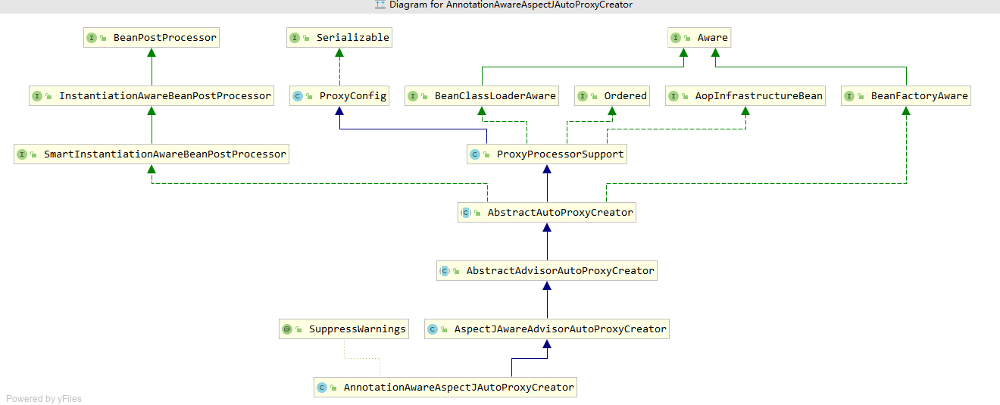
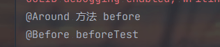

#### 6 容器的功能扩展 

在前面的章节中我们一直以BeanFacotry接口以及它的默认实现类XmlBeanFactory为例进行分析，但是， Spring中还提供了另一个接口ApplicationContext，用于扩展BeanFacotry中现有的功能。

ApplicationContext和BeanFacotry两者都是用于加载Bean的，但是相比之下，ApplicationContext提供了更多的扩展功能，简单一点说：ApplicationContext包含BeanFactory的所有功能。通常建议比BeanFactory优先。

同样，我们还是以 ClassPathXmlApplicationContext作为切入点，开始对整体功能进行分析。

```java 
ApplicationContext context = new ClassPathXmlApplicationContext("classpath:test.xml");

public ClassPathXmlApplicationContext(String configLocation) throws BeansException {
   this(new String[] {configLocation}, true, null);
}
public ClassPathXmlApplicationContext(
      String[] configLocations, boolean refresh, @Nullable ApplicationContext parent)
      throws BeansException {
   super(parent);
   setConfigLocations(configLocations);
   if (refresh) {
      refresh();
   }
}
```

设置路径是必不可少的步骤，ClassPathXmlApplicationContext中可以将配置文件路径以数组的方式传入，ClassPathXmlApplicationContext可以对数组进行解析并进行加载。而对于解析及功能实现都在refresh()中实现

##### **6.1 设置配置路径**

 在ClassPathXmlApplicationContext中支持多个配置文件以数组方式同时传入：

```java 
public void setConfigLocations(@Nullable String... locations) {
   if (locations != null) {
      Assert.noNullElements(locations, "Config locations must not be null");
      this.configLocations = new String[locations.length];
      for (int i = 0; i < locations.length; i++) {
         this.configLocations[i] = resolvePath(locations[i]).trim(); 解析给定的路径
      }
   }
   else {
      this.configLocations = null;
   }
}
```

此函数主要时用于解析给定的路径数组，当然，如果数组中包含特殊符号，如 ${var}， 那么在 **resolvePath** 中会搜寻匹配的系统变量并替换

##### **6.2 扩展功能**  

设置了路径之后，便可以根据路径做配置文件的解析以及各种功能的实现了。可以说refresh函数中包含了几乎ApplicationContext中提供的全部功能，而且此函数中逻辑非常清晰明了，使我们很容易分析对应的层次及逻辑。**AbstractApplicationContext.java**

```java 
public void refresh() throws BeansException, IllegalStateException {
   synchronized (this.startupShutdownMonitor) {
      // Prepare this context for refreshing. 准备刷新的上下文环境
      prepareRefresh();

      // Tell the subclass to refresh the internal bean factory. 初始化 BeanFactory，并进行 XML 文件读取
      ConfigurableListableBeanFactory beanFactory = obtainFreshBeanFactory();

      // Prepare the bean factory for use in this context. 对 BeanFactory 进行各种功能填充
      prepareBeanFactory(beanFactory);

      try {
         // Allows post-processing of the bean factory in context subclasses. 子类覆盖方法做额外的处理
         postProcessBeanFactory(beanFactory);

         // Invoke factory processors registered as beans in the context. 激活各种BeanFactory处理器
         invokeBeanFactoryPostProcessors(beanFactory);

         // Register bean processors that intercept bean creation. 注册拦截 bean 创建的 bean 处理器，这里只是注册，真正的调用是在 getBean 时候
         registerBeanPostProcessors(beanFactory);

         // Initialize message source for this context. 初始化 message 源，国际化处理
         initMessageSource();

         // Initialize event multicaster for this context. 初始化应用广播器，并放入 ApplicationEventMulticaster bean中
         initApplicationEventMulticaster();

         // Initialize other special beans in specific context subclasses. 留给子类来初始化其他的 bean
         onRefresh();

         // Check for listener beans and register them. 在所有注册的bean中查找 Listener bean，注册到消息广播器中
         registerListeners();

         // Instantiate all remaining (non-lazy-init) singletons. 初始化剩下的单实例（非惰性的）
         finishBeanFactoryInitialization(beanFactory);

         // Last step: publish corresponding event. 完成刷新过程，通知生命周期处理器 lifecyleProcessor 刷新过程，同时发出 ContextRefreshEvent 通知别人
         finishRefresh();
      }

      catch (BeansException ex) {
         if (logger.isWarnEnabled()) {
            logger.warn("Exception encountered during context initialization - " +
                  "cancelling refresh attempt: " + ex);
         }

         // Destroy already created singletons to avoid dangling resources.
         destroyBeans();

         // Reset 'active' flag.
         cancelRefresh(ex);

         // Propagate exception to caller.
         throw ex;
      }

      finally {
         // Reset common introspection caches in Spring's core, since we
         // might not ever need metadata for singleton beans anymore...
         resetCommonCaches();
      }
   }
}
```

##### **6.3 环境准备** 

**prepareRefresh();** 函数主要是做些准备工作，例如对系统属性及环境变量的初始化及验证。 

```java 
/**
* Prepare this context for refreshing, setting its startup date and
* active flag as well as performing any initialization of property sources.
*/
protected void prepareRefresh() {
   // Switch to active.
   this.startupDate = System.currentTimeMillis();
   this.closed.set(false);
   this.active.set(true);

   if (logger.isDebugEnabled()) {
      if (logger.isTraceEnabled()) {
         logger.trace("Refreshing " + this);
      }
      else {
         logger.debug("Refreshing " + getDisplayName());
      }
   }

   // Initialize any placeholder property sources in the context environment.
   initPropertySources(); 留给子类覆盖

   // Validate that all properties marked as required are resolvable:
   // see ConfigurablePropertyResolver#setRequiredProperties 验证需要的属性文件是否都已经放入环境中
   getEnvironment().validateRequiredProperties();

   // Store pre-refresh ApplicationListeners...
   if (this.earlyApplicationListeners == null) {
      this.earlyApplicationListeners = new LinkedHashSet<>(this.applicationListeners);
   }
   else {
      // Reset local application listeners to pre-refresh state.
      this.applicationListeners.clear();
      this.applicationListeners.addAll(this.earlyApplicationListeners);
   }

   // Allow for the collection of early ApplicationEvents,
   // to be published once the multicaster is available...
   this.earlyApplicationEvents = new LinkedHashSet<>();
}

protected void initPropertySources() {
   // For subclasses: do nothing by default.
}
```

网上有人说其实这个函数没什么用，因为最后两句代码才是最为关键的，但是却没有什么逻辑处理，initPropertySources是空的，没有任何逻辑，而getEnvironment().validateRequiredProperties也因为没有需要验证的属性而没有做任何处理。

其实这都是因为没有彻底理解才会这么说，这个函数如果用好了作用还是挺大的。那么，该怎么用呢？我们先探索下各个函数的作用。

（1）initPropertySources正符合Spring的开放式结构设计，给用户最大扩展Spring的能力。用户可以根据自身的需要重写initPropertySources方法，并在方法中进行个性化的属性处理及设置。

（2）validateRequiredProperties则是对属性进行验证，那么如何验证呢？我们举个融合两句代码的小例子来帮助大家理解。

假如现在有这样一个需求，工程在运行过程中用到的某个设置（例如VAR）是从系统环境变量中取得的，而如果用户没有在系统环境变量中配置这个参数，那么工程可能不会工作。这一要求可能会有各种各样的解决办法，当然，在Spring中可以这样做，你可以直接修改Spring的源码，例如修改ClassPathXmlApplicationContext。当然，最好的办法还是对源码进行扩展.

```java 
public class MyClassPathXmlApplicationContext extends ClassPathXmlApplicationContext {
    public MyClassPathXmlApplicationContext(String... locations) {    
      super(locations);
    }
    protected void initPropertySources() {
        getEnvironment().setRequiredProperties("VAR");
    }
}
```

我们自定义了继承自ClassPathXmlApplicationContext的MyClassPathXmlApplicationContext，并重写了initPropertySources方法，在方法中添加了我们的个性化需求，那么在验证的时候也就是程序走到getEnvironment().validateRequiredProperties()代码的时候，如果系统并没有检测到对应VAR的环境变量，那么将抛出异常。 

##### **6.4 加载 BeanFactory**  

obtainFreshBeanFactory方法从字面理解是获取BeanFactory。之前有说过，ApplicationContext是对BeanFactory的功能上的扩展，不但包含了BeanFactory的全部功能更在其基础上添加了大量的扩展应用，那么**obtainFreshBeanFactory**正是实现BeanFactory的地方，也就是经过了这个函数后ApplicationContext就已经拥有了BeanFactory的全部功能。  

```java 
protected ConfigurableListableBeanFactory obtainFreshBeanFactory() {
   refreshBeanFactory();
   return getBeanFactory();
}
实现功能委托给了 refreshBeanFactory() 方法
@Override
protected final void refreshBeanFactory() throws BeansException {
   if (hasBeanFactory()) {
      destroyBeans();
      closeBeanFactory();
   }
   try {
    // 创建默认的 DefaultListableBeanFactory
      DefaultListableBeanFactory beanFactory = createBeanFactory();
      beanFactory.setSerializationId(getId());
// 定制 beanFactory，设置相关属性，包括是否允许覆盖同名称的不同定义的对象以及循环依赖以及设置 @Autowired 和 @Qualifier 注解解析器 QualifierAnnotationAutowireCandidateResolver
      customizeBeanFactory(beanFactory); 
// 初始化 DocumentReader，并进行 XML 文件读取和解析
      loadBeanDefinitions(beanFactory); 
      synchronized (this.beanFactoryMonitor) {
         this.beanFactory = beanFactory; // 使用全局变量记录 BeanFactory 类实例
      }
   }
   catch (IOException ex) {
      throw new ApplicationContextException("I/O error parsing bean definition source for " + getDisplayName(), ex);
   }
}
```

###### **6.4.1 定制的 BeanFactory** 

这里已经开始了对BeanFactory的扩展，在基本容器的基础上，增加了是否允许覆盖是否允许扩展的设置并提供了注解**@Qualifier和@Autowired**的支持。 

```java 
protected void customizeBeanFactory(DefaultListableBeanFactory beanFactory) {
   if (this.allowBeanDefinitionOverriding != null) {
      beanFactory.setAllowBeanDefinitionOverriding(this.allowBeanDefinitionOverriding);
   }
   if (this.allowCircularReferences != null) {
      beanFactory.setAllowCircularReferences(this.allowCircularReferences);
   }
}
这里没有书中的这两个注解的解析代码，当前版本：5.2.4，书里面应该是3.x。但是类还是有的： QualifierAnnotationAutowireCandidateResolver 
```

###### **6.4.2 加载 BeanDefinition** 

在第一步中提到了将ClassPathXmlApplicationContext与XmlBeanFactory创建的对比，在实现配置文件的加载功能中除了我们在第一步中已经初始化的DefaultListableBeanFactory外，还需要XmlBeanDefinitionReader来读取XML，那么在这个步骤中首先要做的就是初始化XmlBeanDefinitionReader。**AbstractXmlApplicationContext.java** 

```java 
protected void loadBeanDefinitions(DefaultListableBeanFactory beanFactory) throws BeansException, IOException {
   // Create a new XmlBeanDefinitionReader for the given BeanFactory.
   XmlBeanDefinitionReader beanDefinitionReader = new XmlBeanDefinitionReader(beanFactory);

   // Configure the bean definition reader with this context's
   // resource loading environment. 环境变量设置
   beanDefinitionReader.setEnvironment(this.getEnvironment());
   beanDefinitionReader.setResourceLoader(this);
   beanDefinitionReader.setEntityResolver(new ResourceEntityResolver(this)); 前一个文章有提到这个类的用法


   // Allow a subclass to provide custom initialization of the reader,
   // then proceed with actually loading the bean definitions.
   initBeanDefinitionReader(beanDefinitionReader);
   loadBeanDefinitions(beanDefinitionReader);
}
protected void loadBeanDefinitions(XmlBeanDefinitionReader reader) throws BeansException, IOException {
   Resource[] configResources = getConfigResources();
   if (configResources != null) {
      reader.loadBeanDefinitions(configResources);
   }
   String[] configLocations = getConfigLocations();
   if (configLocations != null) {
      reader.loadBeanDefinitions(configLocations);
   }
}
```

使用XmlBeanDefinitionReader的loadBeanDefinitions方法进行配置文件的加载机注册相信大家已经不陌生，这完全就是开始BeanFactory的套路。因为在XmlBeanDefinitionReader中已经将之前初始化的DefaultListableBeanFactory注册进去了，所以XmlBeanDefinitionReader所读取的BeanDefinitionHolder都会注册到DefaultListableBeanFactory中，也就是经过此步骤，类型DefaultListableBeanFactory的变量beanFactory已经包含了所有解析好的配置。

##### **6.5 功能扩展** 

进入函数**prepareBeanFactory（对 BeanFactory 进行各种功能填充）**前，Spring已经完成了对配置的解析，而ApplicationContext在功能上的扩展也由此展开。 

```java 
/**
* Configure the factory's standard context characteristics,
* such as the context's ClassLoader and post-processors.
* @param beanFactory the BeanFactory to configure
*/
protected void prepareBeanFactory(ConfigurableListableBeanFactory beanFactory) {
   // Tell the internal bean factory to use the context's class loader etc.
   beanFactory.setBeanClassLoader(getClassLoader()); // 设置 beanFactory 的 classloader 为当前 context 的classloader
   beanFactory.setBeanExpressionResolver(new StandardBeanExpressionResolver(beanFactory.getBeanClassLoader())); // 设置beanFactory的表达式语言处理，spring3增加了表达式语言的支持
   beanFactory.addPropertyEditorRegistrar(new ResourceEditorRegistrar(this, getEnvironment())); // 为beanFactory增加了一个默认的 propertyEditor，这个主要是对 bean 的属性等设置管理的一个工具

   // Configure the bean factory with context callbacks. 忽略几个自动装配的接口
   beanFactory.addBeanPostProcessor(new ApplicationContextAwareProcessor(this));
   beanFactory.ignoreDependencyInterface(EnvironmentAware.class);
   beanFactory.ignoreDependencyInterface(EmbeddedValueResolverAware.class);
   beanFactory.ignoreDependencyInterface(ResourceLoaderAware.class);
   beanFactory.ignoreDependencyInterface(ApplicationEventPublisherAware.class);
   beanFactory.ignoreDependencyInterface(MessageSourceAware.class);
   beanFactory.ignoreDependencyInterface(ApplicationContextAware.class);

   // BeanFactory interface not registered as resolvable type in a plain factory.
   // MessageSource registered (and found for autowiring) as a bean. 设置了几个自动装配的特殊规则
   beanFactory.registerResolvableDependency(BeanFactory.class, beanFactory);
   beanFactory.registerResolvableDependency(ResourceLoader.class, this);
   beanFactory.registerResolvableDependency(ApplicationEventPublisher.class, this);
   beanFactory.registerResolvableDependency(ApplicationContext.class, this);

   // Register early post-processor for detecting inner beans as ApplicationListeners.
   beanFactory.addBeanPostProcessor(new ApplicationListenerDetector(this));

   // Detect a LoadTimeWeaver and prepare for weaving, if found. 增加对 AspectJ 的支持
   if (beanFactory.containsBean(LOAD_TIME_WEAVER_BEAN_NAME)) {
      beanFactory.addBeanPostProcessor(new LoadTimeWeaverAwareProcessor(beanFactory));
      // Set a temporary ClassLoader for type matching.
      beanFactory.setTempClassLoader(new ContextTypeMatchClassLoader(beanFactory.getBeanClassLoader()));
   }

   // Register default environment beans. 添加默认环境的 bean
   if (!beanFactory.containsLocalBean(ENVIRONMENT_BEAN_NAME)) {
      beanFactory.registerSingleton(ENVIRONMENT_BEAN_NAME, getEnvironment());
   }
   if (!beanFactory.containsLocalBean(SYSTEM_PROPERTIES_BEAN_NAME)) {
      beanFactory.registerSingleton(SYSTEM_PROPERTIES_BEAN_NAME, getEnvironment().getSystemProperties());
   }
   if (!beanFactory.containsLocalBean(SYSTEM_ENVIRONMENT_BEAN_NAME)) {
      beanFactory.registerSingleton(SYSTEM_ENVIRONMENT_BEAN_NAME, getEnvironment().getSystemEnvironment());
   }
}
```

上面函数中主要进行了几个方面的扩展。

- 增加对SPEL语言的支持。
- 增加对属性编辑器的支持。
- 增加对一些内置类，比如EnvironmentAware、MessageSourceAware的信息注入。
- 设置了依赖功能可忽略的接口。
- 注册一些固定依赖的属性。
- 增加AspectJ的支持（会在第7章中进行详细的讲解）。
- 将相关环境变量及属性注册以单例模式注册。

###### **6.5.1 增加 SPEL 语言的支持** 

Spring表达式语言全称为“Spring Expression Language”，缩写为“SpEL”，类似于Struts 2x中使用的OGNL表达式语言，**能在运行时构建复杂表达式、存取对象图属性、对象方法调用等**，并且能与Spring功能完美整合，比如能用来配置bean定义。SpEL是单独模块，只依赖于core模块，不依赖于其他模块，可以单独使用。SpEL使用#{…}作为定界符，所有在大框号中的字符都将被认为是SpEL，使用格式如下： 

```xml
<bean id="hello" class="springtest.aware.Hello">
    <property name="aaa" value="#{saxophone}"/>
</bean>
相当于
<bean id="hello" class="springtest.aware.Hello">
    <property name="aaa" ref="saxophone"/>
</bean>
```

在源码中通过代码**beanFactory.setBeanExpressionResolver(new StandardBeanExpressionResolver())**注册语言解析器，就可以对SPEL进行解析了，那么在注册解析器后Spring又是在什么时候调用这个解析器进行解析呢？

之前我们讲解过Spring在bean进行初始化的时候会有属性填充的一步，而在这一步中Spring会调用AbstractAutowireCapableBeanFactory类的applyPropertyValues函数来完成功能。就在这个函数中，会通过构造BeanDefinitionValueResolver类型实例valueResolver来进行属性值的解析。

同时，也是在这个步骤中一般通过**AbstractBeanFactory中的evaluateBeanDefinitionString方法去完成SPEL的解析**。

###### **6.5.2 增加属性注册编辑器** 

在Spring DI注入的时候可以把普通属性注入进来，但是像Date类型就无法被识别。例如

```java 
public class User {
    private Date date;
    public Date getDate() {
        return date;
    }
    public void setDate(Date date) {
        this.date = date;
    }
    @Override
    public String toString() {
        return "User{" +
                "date=" + date +
                '}';
    }
}
配置文件
<bean id="hello" class="springtest.aware.User">
    <property name="date" value="2021-08-25"/>
</bean>
```

当获取到这个 bean，然后打印的时候会报错。因为在User中的dataValue属性是Date类型的，而在XML中配置的却是String类型的，所以当然会报异常。 Spring针对此问题提供了两种解决办法。

**1 使用自定义属性编辑器** 

```java 
public class DatePropertyEditor extends PropertyEditorSupport {
    private String format = "yyyy-MM-dd";
    public void setFormat(String format) {
        this.format = format;
    }
    @Override
    public void setAsText(String text) throws IllegalArgumentException {
        SimpleDateFormat simpleDateFormat = new SimpleDateFormat(format);
        try{
            Date d = simpleDateFormat.parse(text);
            this.setValue(d);
        } catch (ParseException e) {
            e.printStackTrace();
        }
    }
}
```

使用自定义属性编辑器，通过继承PropertyEditorSupport，重写setAsText方法

```java 
public class DatePropertyEditor extends PropertyEditorSupport {
    private String format = "yyyy-MM-dd";
    public void setFormat(String format) {
        this.format = format;
    }
    @Override
    public void setAsText(String text) throws IllegalArgumentException {
        SimpleDateFormat simpleDateFormat = new SimpleDateFormat(format);
        try{
            Date d = simpleDateFormat.parse(text);
            this.setValue(d);
        } catch (ParseException e) {
            e.printStackTrace();
        }
    }
}
```

```xml
<?xml version="1.0" encoding="UTF-8"?>
<beans xmlns="http://www.springframework.org/schema/beans"
       xmlns:xsi="http://www.w3.org/2001/XMLSchema-instance"
       xsi:schemaLocation="http://www.springframework.org/schema/beans http://www.springframework.org/schema/beans/spring-beans.xsd">
    <bean id="user" class="springtest.property.User">
        <property name="date" value="2021-08-25"/>
    </bean>

新版本设置不一样，参考：https://blog.csdn.net/qq_20641565/article/details/78633098

<bean class="org.springframework.beans.factory.config.CustomEditorConfigurer">
    <property name="customEditors">
        <map>
            <entry key="java.util.Date" value="springtest.property.DatePropertyEditor"/>
        </map>
    </property>
</bean>
</beans>
```

**2 注册Spring自带的属性编辑器CustomDateEditor** 

（1）定义属性编辑器，实现 **PropertyEditorRegistrar** 接口

```java 
public class DatePropertyEditorRegistrar implements PropertyEditorRegistrar {
    @Override
    public void registerCustomEditors(PropertyEditorRegistry registry) {
        registry.registerCustomEditor(Date.class, new CustomDateEditor(new SimpleDateFormat("yyyy-MM-dd"), true));
    }
}
```

（2）注册到 spring 中

```xml
<bean class="org.springframework.beans.factory.config.CustomEditorConfigurer">
    <property name="propertyEditorRegistrars">
        <list>
            <bean class="springtest.property.DatePropertyEditorRegistrar"/>
        </list>
    </property>
</bean>
```

通过在配置文件中将自定义的DatePropertyEditorRegistrar注册进入org.Springframework.beans.factory.config.CustomEditorConfigurer的propertyEditorRegistrars属性中，可以具有与方法1同样的效果。

我们了解了自定义属性编辑器的使用，但是，似乎这与本节中围绕的核心代码**beanFactory.addPropertyEditorRegistrar(new ResourceEditorRegistrar(this, getEnvironment()))**并无联系，因为在注册自定义属性编辑器的时候使用的是**PropertyEditorRegistry的registerCustomEditor方法，**而这里使用的是ConfigurableListableBeanFactory的addPropertyEditorRegistrar方法。我们不妨深入探索一下ResourceEditorRegistrar的内部实现，**在ResourceEditorRegistrar中，我们最关心的方法是registerCustomEditors**。

省略。。。

###### **6.5.3 添加ApplicationContextAwareProcessor处理器** 

了解了属性编辑器的使用后，接下来我们继续通过AbstractApplicationContext的prepareBeanFactory方法的主线来进行函数跟踪。对于beanFactory.addBeanPostProcessor(newApplicationContextAwareProcessor(this))其实主要目的就是注册个BeanPostProcessor，而真正的逻辑还是在ApplicationContextAwareProcessor中。 

 ApplicationContextAwareProcessor实现BeanPostProcessor接口，我们回顾下之前讲过的内容，在bean实例化的时候，也就是Spring激活bean的init-method的前后，会调用BeanPost Processor的postProcessBeforeInitialization方法和postProcessAfterInitialization方法。

同样，对于ApplicationContextAwareProcessor我们也关心这两个方法。**当前版本里面注册的不是 这个类**，而是beanFactory.addBeanPostProcessor(new ApplicationListenerDetector(this));猜测应该放到别的方法中去了

###### **6.5.4 设置忽略依赖**  

当Spring将ApplicationContextAwareProcessor注册后，那么在invokeAwareInterfaces方法中间接调用的Aware类已经不是普通的bean了，如ResourceLoaderAware、ApplicationEventPublisher Aware等，那么当然需要在Spring做bean的依赖注入的时候忽略它们。而ignoreDependencyInterface的作用正是在此。 

```java 
beanFactory.addBeanPostProcessor(new ApplicationContextAwareProcessor(this));
beanFactory.ignoreDependencyInterface(EnvironmentAware.class);
beanFactory.ignoreDependencyInterface(EmbeddedValueResolverAware.class);
beanFactory.ignoreDependencyInterface(ResourceLoaderAware.class);
beanFactory.ignoreDependencyInterface(ApplicationEventPublisherAware.class);
beanFactory.ignoreDependencyInterface(MessageSourceAware.class);
beanFactory.ignoreDependencyInterface(ApplicationContextAware.class);
```

###### **6.5.5 注册依赖**  

Spring中有了忽略依赖的功能，当然也必不可少地会有注册依赖的功能。

```java 
 // BeanFactory interface not registered as resolvable type in a plain factory.
   // MessageSource registered (and found for autowiring) as a bean. 设置了几个自动装配的特殊规则
   beanFactory.registerResolvableDependency(BeanFactory.class, beanFactory);
   beanFactory.registerResolvableDependency(ResourceLoader.class, this);
   beanFactory.registerResolvableDependency(ApplicationEventPublisher.class, this);
   beanFactory.registerResolvableDependency(ApplicationContext.class, this);
```

当**注册了依赖解析后**，例如当注册了对BeanFactory.class的解析依赖后，当bean的属性注入的时候，一旦检测到属性为BeanFactory类型便会将beanFactory的实例注入进去。 

##### **6.6 BeanFactory的后处理器** 

```java 
// Allows post-processing of the bean factory in context subclasses.
postProcessBeanFactory(beanFactory);
```

BeanFacotry作为Spring中容器功能的基础，用于存放所有已经加载的bean，为了保证程序上的高可扩展性，Spring针对BeanFactory做了大量的扩展，比如我们熟知的PostProcessor等都是在这里实现的。 

###### **6.6.1 激活注册的BeanFactoryPostProcessor** 

正式开始介绍之前我们先了解下BeanFactoryPostProcessor的用法。**BeanFactoryPostProcessor接口跟BeanPostProcessor类似，可以对bean的定义（配置元数据）进行处理。也就是说，Spring IoC容器允许BeanFactoryPostProcessor在容器实际实例化任何其他的bean之前读取配置元数据，并有可能修改它**。如果你愿意，你可以配置多个BeanFactoryPostProcessor。**你还能通过设置“order”属性来控制BeanFactoryPostProcessor的执行次序**（仅当BeanFactoryPostProcessor实现了Ordered接口时你才可以设置此属性，因此在实现BeanFactoryPostProcessor时，就应当考虑实现Ordered接口）。请参考BeanFactoryPostProcessor和Ordered接口的JavaDoc以获取更详细的信息。

**如果你想改变实际的bean实例（例如从配置元数据创建的对象），那么你最好使用BeanPostProcessor**。同样地，**BeanFactoryPostProcessor的作用域范围是容器级的。它只和你所使用的容器有关**。如果你在容器中定义一个BeanFactoryPostProcessor，它仅仅对此容器中的bean进行后置处理。BeanFactoryPostProcessor不会对定义在另一个容器中的bean进行后置处理，即使这两个容器都是在同一层次上。**在Spring中存在对于BeanFactoryPostProcessor的典型应用，比如PropertyPlaceholderConfigurer**


**1.BeanFactoryPostProcessor的典型应用：PropertyPlaceholderConfigurer** 

有时候，阅读Spring的Bean描述文件时，你也许会遇到类似如下的一些配置：

```xml
<bean id="reportService" class="com.etwealth.mo.server.services.ReportService" factory-method="getInstance">
   <property name="mes" value="${app.mes}"/>
</bean>
```

其中竟然出现了变量引用：${bean.message}。这就是Spring的分散配置，可以在另外的配置文件中为bean.message指定值。

如在bean.property配置如下定义：**“app.mes=Hi,can you find me?”**当访问名为message的bean时，mes属性就会被置为字符串“ Hi,can you find me?”，但Spring框架是怎么知道存在这样的配置文件呢？这就要靠**PropertyPlaceholderConfigurer**这个类的bean:

```xml
<bean id="placeholderConfig" class="com.etwealth.mo.server.connection.EncryptablePropertyPlaceholderConfigurer">
    <property name="location" value="classpath:com/etwealth/mo/server/app.properties" />
</bean>
public class EncryptablePropertyPlaceholderConfigurer extends PropertyPlaceholderConfigurer { ... }
```

在这个bean中指定了配置文件为config/bean.properties。到这里似乎找到问题的答案了，但是其实还有个问题。这个“placeholderConfig”只不过是Spring框架管理的一个bean，并没有被别的bean或者对象引用，Spring的beanFactory是怎么知道要从这个bean中获取配置信息的呢？ 

从类图中可以看到：PropertyPlaceholderConfigurer这个类间接继承了BeanFactoryPostProcessor接口。


这是一个很特别的接口，当Spring加载任何实现了这个接口的bean的配置时，都会**在bean工厂载入所有bean的配置之后执行postProcessBeanFactory方法**。

在**PropertyResourceConfigurer**类中实现了**postProcessBeanFactory**方法，在方法中先后调用了mergeProperties、convertProperties、processProperties这3个方法，分别得到配置，将得到的配置转换为合适的类型，最后将配置内容告知BeanFactory。 

**2 使用自定义的 BeanFactoryPostProcessor** 


**3 激活BeanFactoryPostProcessor**  

了解了BeanFactoryPostProcessor的用法后便可以深入研究BeanFactoryPostProcessor的调用过程了。具体是在下面这个方法调用的

```java 
// Invoke factory processors registered as beans in the context.
invokeBeanFactoryPostProcessors(beanFactory);

/**
* Instantiate and invoke all registered BeanFactoryPostProcessor beans,
* respecting explicit order if given.
* <p>Must be called before singleton instantiation.
*/
protected void invokeBeanFactoryPostProcessors(ConfigurableListableBeanFactory beanFactory) {
   PostProcessorRegistrationDelegate.invokeBeanFactoryPostProcessors(beanFactory, getBeanFactoryPostProcessors());

   // Detect a LoadTimeWeaver and prepare for weaving, if found in the meantime
   // (e.g. through an @Bean method registered by ConfigurationClassPostProcessor)
   if (beanFactory.getTempClassLoader() == null && beanFactory.containsBean(LOAD_TIME_WEAVER_BEAN_NAME)) {
      beanFactory.addBeanPostProcessor(new LoadTimeWeaverAwareProcessor(beanFactory));
      beanFactory.setTempClassLoader(new ContextTypeMatchClassLoader(beanFactory.getBeanClassLoader()));
   }
}
public static void invokeBeanFactoryPostProcessors(
      ConfigurableListableBeanFactory beanFactory, List<BeanFactoryPostProcessor> beanFactoryPostProcessors) {

   // Invoke BeanDefinitionRegistryPostProcessors first, if any.
   Set<String> processedBeans = new HashSet<>();

// 对特殊类型的 BeanDefinitionRegistry 的处理
   if (beanFactory instanceof BeanDefinitionRegistry) {
      BeanDefinitionRegistry registry = (BeanDefinitionRegistry) beanFactory;
      List<BeanFactoryPostProcessor> regularPostProcessors = new ArrayList<>();
      List<BeanDefinitionRegistryPostProcessor> registryProcessors = new ArrayList<>();

// 硬编码注册的后处理器 beanFactoryPostProcessors
      for (BeanFactoryPostProcessor postProcessor : beanFactoryPostProcessors) {
         if (postProcessor instanceof BeanDefinitionRegistryPostProcessor) {
            BeanDefinitionRegistryPostProcessor registryProcessor =
                  (BeanDefinitionRegistryPostProcessor) postProcessor;
            registryProcessor.postProcessBeanDefinitionRegistry(registry); // BeanFactoryPostProcessor 的基础上还有自己定义的方法，需要先调用
            registryProcessors.add(registryProcessor); // 记录BeanDefinitionRegistryPostProcessor
         }
         else {
            regularPostProcessors.add(postProcessor); // 记录常规的 BeanFactoryPostProcessor
         }
      }

      // Do not initialize FactoryBeans here: We need to leave all regular beans
      // uninitialized to let the bean factory post-processors apply to them!  
不要在这里初始化FactoryBeans:我们需要不初始化所有常规bean，以便让bean工厂的后处理器应用于它们!
      // Separate between BeanDefinitionRegistryPostProcessors that implement
      // PriorityOrdered, Ordered, and the rest. 分离实现了 PriorityOrdered 接口和 Ordered 接口的 BeanDefinitionRegistryPostProcessors
      List<BeanDefinitionRegistryPostProcessor> currentRegistryProcessors = new ArrayList<>();

      // First, invoke the BeanDefinitionRegistryPostProcessors that implement PriorityOrdered. 
// 首先获取 实现了 PriorityOrdered 接口的 BeanDefinitionRegistryPostProcessors
      String[] postProcessorNames =
            beanFactory.getBeanNamesForType(BeanDefinitionRegistryPostProcessor.class, true, false);
      for (String ppName : postProcessorNames) {
         if (beanFactory.isTypeMatch(ppName, PriorityOrdered.class)) {
            currentRegistryProcessors.add(beanFactory.getBean(ppName, BeanDefinitionRegistryPostProcessor.class));
            processedBeans.add(ppName);
         }
      }
// 排序，按照优先级
      sortPostProcessors(currentRegistryProcessors, beanFactory);
      registryProcessors.addAll(currentRegistryProcessors);
// 激活 PriorityOrdered 接口的 BeanDefinitionRegistryPostProcessors
      invokeBeanDefinitionRegistryPostProcessors(currentRegistryProcessors, registry);
      currentRegistryProcessors.clear();

======================
      // Next, invoke the BeanDefinitionRegistryPostProcessors that implement Ordered.
// 然后获取 实现了 Ordered接口的 BeanDefinitionRegistryPostProcessors
      postProcessorNames = beanFactory.getBeanNamesForType(BeanDefinitionRegistryPostProcessor.class, true, false);
      for (String ppName : postProcessorNames) {
// 判断是否是已经处理了的 bean 
         if (!processedBeans.contains(ppName) && beanFactory.isTypeMatch(ppName, Ordered.class)) {
            currentRegistryProcessors.add(beanFactory.getBean(ppName, BeanDefinitionRegistryPostProcessor.class));
            processedBeans.add(ppName);
         }
      }
// 按照 order 排序
      sortPostProcessors(currentRegistryProcessors, beanFactory);
      registryProcessors.addAll(currentRegistryProcessors);
//  执行调用
      invokeBeanDefinitionRegistryPostProcessors(currentRegistryProcessors, registry); 
      currentRegistryProcessors.clear();
=================
      // Finally, invoke all other BeanDefinitionRegistryPostProcessors until no further ones appear.
// 最后获取所有的 BeanDefinitionRegistryPostProcessors，直到没有一个出现
      boolean reiterate = true;
      while (reiterate) {
         reiterate = false;
         postProcessorNames = beanFactory.getBeanNamesForType(BeanDefinitionRegistryPostProcessor.class, true, false);
         for (String ppName : postProcessorNames) {
            if (!processedBeans.contains(ppName)) {
               currentRegistryProcessors.add(beanFactory.getBean(ppName, BeanDefinitionRegistryPostProcessor.class));
               processedBeans.add(ppName);
               reiterate = true;
            }
         }
         sortPostProcessors(currentRegistryProcessors, beanFactory);
         registryProcessors.addAll(currentRegistryProcessors);
         invokeBeanDefinitionRegistryPostProcessors(currentRegistryProcessors, registry);
         currentRegistryProcessors.clear();
      }

      // Now, invoke the postProcessBeanFactory callback of all processors handled so far.
      invokeBeanFactoryPostProcessors(registryProcessors, beanFactory);
      invokeBeanFactoryPostProcessors(regularPostProcessors, beanFactory);
   }

   else { // 对普通类型的  BeanFactoryPostProcessor 处理
      // Invoke factory processors registered with the context instance.
      invokeBeanFactoryPostProcessors(beanFactoryPostProcessors, beanFactory);
   }

   // Do not initialize FactoryBeans here: We need to leave all regular beans
   // uninitialized to let the bean factory post-processors apply to them!
   String[] postProcessorNames =
         beanFactory.getBeanNamesForType(BeanFactoryPostProcessor.class, true, false);

   // Separate between BeanFactoryPostProcessors that implement PriorityOrdered,
   // Ordered, and the rest.
   List<BeanFactoryPostProcessor> priorityOrderedPostProcessors = new ArrayList<>();
   List<String> orderedPostProcessorNames = new ArrayList<>();
   List<String> nonOrderedPostProcessorNames = new ArrayList<>();
// 对后处理器进行分类
   for (String ppName : postProcessorNames) { 
      if (processedBeans.contains(ppName)) {
         // skip - already processed in first phase above 已经处理过的
      }
      else if (beanFactory.isTypeMatch(ppName, PriorityOrdered.class)) {
         priorityOrderedPostProcessors.add(beanFactory.getBean(ppName, BeanFactoryPostProcessor.class));
      }
      else if (beanFactory.isTypeMatch(ppName, Ordered.class)) {
         orderedPostProcessorNames.add(ppName);
      }
      else {
         nonOrderedPostProcessorNames.add(ppName);
      }
   }

   // First, invoke the BeanFactoryPostProcessors that implement PriorityOrdered. 按照优先级排序
   sortPostProcessors(priorityOrderedPostProcessors, beanFactory);
   invokeBeanFactoryPostProcessors(priorityOrderedPostProcessors, beanFactory);

   // Next, invoke the BeanFactoryPostProcessors that implement Ordered.
   List<BeanFactoryPostProcessor> orderedPostProcessors = new ArrayList<>(orderedPostProcessorNames.size());
   for (String postProcessorName : orderedPostProcessorNames) {
      orderedPostProcessors.add(beanFactory.getBean(postProcessorName, BeanFactoryPostProcessor.class));
   }
   sortPostProcessors(orderedPostProcessors, beanFactory);
   invokeBeanFactoryPostProcessors(orderedPostProcessors, beanFactory);

   // Finally, invoke all other BeanFactoryPostProcessors.
   List<BeanFactoryPostProcessor> nonOrderedPostProcessors = new ArrayList<>(nonOrderedPostProcessorNames.size());
   for (String postProcessorName : nonOrderedPostProcessorNames) {
      nonOrderedPostProcessors.add(beanFactory.getBean(postProcessorName, BeanFactoryPostProcessor.class));
   }
   invokeBeanFactoryPostProcessors(nonOrderedPostProcessors, beanFactory);


   // Clear cached merged bean definitions since the post-processors might have
   // modified the original metadata, e.g. replacing placeholders in values...
   beanFactory.clearMetadataCache();
}
```

###### **6.6.2 注册BeanPostProcessor**   

上文中提到了BeanFacotoryPostProcessors的调用，现在我们来探索下BeanPostProcessor，但是这里并不是调用，而是注册。**真正的调用其实是在bean的实例化阶段进行的**。这是一个很重要的步骤，也是很多功能BeanFactory不支持的重要原因。  

**Spring中大部分功能都是通过后处理器的方式进行扩展的**，这是Spring框架的一个特性，但是在**BeanFactory中其实并没有实现后处理器的自动注册**，**所以在调用的时候如果没有进行手动注册其实是不能使用的**。但是**在ApplicationContext中却添加了自动注册功能**， 

```java 
<?xml version="1.0" encoding="UTF-8"?>
<beans xmlns="http://www.springframework.org/schema/beans"
       xmlns:xsi="http://www.w3.org/2001/XMLSchema-instance"
       xsi:schemaLocation="http://www.springframework.org/schema/beans http://www.springframework.org/schema/beans/spring-beans.xsd">

    <bean id="car" class="springtest.CarFactoryBean">
        <property name="carInfo" value="超级跑车,400, 200000"/>
    </bean>
    <bean id="testAware" class="springtest.aware.TestAware"/>
    <bean id="hello" class="springtest.aware.Hello"/>

    <bean id="myBeanPostProcessor" class="springtest.beanpostprocessor.MyInstantiationAwareBeanPostProcessor"/>
</beans>
实现类
public class MyInstantiationAwareBeanPostProcessor  implements InstantiationAwareBeanPostProcessor {
    @Override
    public Object postProcessBeforeInitialization(Object bean, String beanName) throws BeansException {
        System.out.println("=====");
        return null;
    }
}
测试：
@Test
public void testAware() {
    ApplicationContext context = new ClassPathXmlApplicationContext("classpath:test.xml");
    MyInstantiationAwareBeanPostProcessor myBeanPostProcessor = (MyInstantiationAwareBeanPostProcessor) context.getBean("myBeanPostProcessor");
}
// 输出： 我的配置文件里面有 3 个 bean
car =====
testAware =====
hello =====
```

那么使用BeanFactory方式进行Spring的bean的加载时是不会有任何改变的，但是使用ApplicationContext方式获取bean的时候会在获取每个bean时打印出“====”，而这个特性就是在registerBeanPostProcessors方法中完成的。 

```java 
refresh() 方法里面的
// Register bean processors that intercept bean creation.
registerBeanPostProcessors(beanFactory);

protected void registerBeanPostProcessors(ConfigurableListableBeanFactory beanFactory) {
   PostProcessorRegistrationDelegate.registerBeanPostProcessors(beanFactory, this);
}
public static void registerBeanPostProcessors(
      ConfigurableListableBeanFactory beanFactory, AbstractApplicationContext applicationContext) {

   String[] postProcessorNames = beanFactory.getBeanNamesForType(BeanPostProcessor.class, true, false);

   // Register BeanPostProcessorChecker that logs an info message when
   // a bean is created during BeanPostProcessor instantiation, i.e. when
   // a bean is not eligible for getting processed by all BeanPostProcessors.
// BeanPostProcessorChecker 是一个普通的信息打印，可能会有些情况，当 spring 的配置中的后处理器还没有被注册就已经开始了 bean 的初始化时，便会打印 BeanPostProcessorChecker 中设定的信息
   int beanProcessorTargetCount = beanFactory.getBeanPostProcessorCount() + 1 + postProcessorNames.length;
   beanFactory.addBeanPostProcessor(new BeanPostProcessorChecker(beanFactory, beanProcessorTargetCount));

   // Separate between BeanPostProcessors that implement PriorityOrdered,
   // Ordered, and the rest.
   List<BeanPostProcessor> priorityOrderedPostProcessors = new ArrayList<>(); // 使用 PriorityOrdered 保证顺序
   List<BeanPostProcessor> internalPostProcessors = new ArrayList<>(); // MergedBeanDefinitionPostProcessor
   List<String> orderedPostProcessorNames = new ArrayList<>(); // 使用 Ordered 保持顺序
   List<String> nonOrderedPostProcessorNames = new ArrayList<>(); // 无序 BeanPostProcessor
   for (String ppName : postProcessorNames) {
      if (beanFactory.isTypeMatch(ppName, PriorityOrdered.class)) {
         BeanPostProcessor pp = beanFactory.getBean(ppName, BeanPostProcessor.class);
         priorityOrderedPostProcessors.add(pp); // 添加的是后处理器
         if (pp instanceof MergedBeanDefinitionPostProcessor) {
            internalPostProcessors.add(pp); // 添加的是后处理器
         }
      }
      else if (beanFactory.isTypeMatch(ppName, Ordered.class)) {
         orderedPostProcessorNames.add(ppName); // 添加的是 name
      }
      else {
         nonOrderedPostProcessorNames.add(ppName); // 添加的是name
      }
   }

   // First, register the BeanPostProcessors that implement PriorityOrdered.
   sortPostProcessors(priorityOrderedPostProcessors, beanFactory);
   registerBeanPostProcessors(beanFactory, priorityOrderedPostProcessors);

   // Next, register the BeanPostProcessors that implement Ordered.
   List<BeanPostProcessor> orderedPostProcessors = new ArrayList<>(orderedPostProcessorNames.size());
   for (String ppName : orderedPostProcessorNames) {
      BeanPostProcessor pp = beanFactory.getBean(ppName, BeanPostProcessor.class);
      orderedPostProcessors.add(pp);
      if (pp instanceof MergedBeanDefinitionPostProcessor) {
         internalPostProcessors.add(pp);
      }
   }
   sortPostProcessors(orderedPostProcessors, beanFactory);
   registerBeanPostProcessors(beanFactory, orderedPostProcessors);

   // Now, register all regular BeanPostProcessors.
   List<BeanPostProcessor> nonOrderedPostProcessors = new ArrayList<>(nonOrderedPostProcessorNames.size());
   for (String ppName : nonOrderedPostProcessorNames) {
      BeanPostProcessor pp = beanFactory.getBean(ppName, BeanPostProcessor.class);
      nonOrderedPostProcessors.add(pp);
      if (pp instanceof MergedBeanDefinitionPostProcessor) {
         internalPostProcessors.add(pp);
      }
   }
   registerBeanPostProcessors(beanFactory, nonOrderedPostProcessors);

   // Finally, re-register all internal BeanPostProcessors.
   sortPostProcessors(internalPostProcessors, beanFactory);
   registerBeanPostProcessors(beanFactory, internalPostProcessors);

   // Re-register post-processor for detecting inner beans as ApplicationListeners,
   // moving it to the end of the processor chain (for picking up proxies etc).
   beanFactory.addBeanPostProcessor(new ApplicationListenerDetector(applicationContext));
}
```

首先我们会发现，对于BeanPostProcessor的处理与BeanFactoryPostProcessor的处理极为相似，但是似乎又有些不一样的地方。经过反复的对比发现，对于BeanFactoryPostProcessor的处理要区分两种情况，一种方式是通过**硬编码方式的处理**，另一种是通过**配置文件方式的处理**。 

那么为什么在BeanPostProcessor的处理中只考虑了配置文件的方式而不考虑硬编码的方式呢？

提出这个问题，还是因为读者没有完全理解两者实现的功能。

**对于BeanFactoryPostProcessor的处理，不但要实现注册功能，而且还要实现对后处理器的激活操作，所以需要载入配置中的定义，并进行激活**；**而对于BeanPostProcessor并不需要马上调用**，再说，硬编码的方式实现的功能是将后处理器提取并调用，这里并不需要调用，当然不需要考虑硬编码的方式了，这里的功能只需要将配置文件的BeanPostProcessor提取出来并注册进入beanFactory就可以了。

对于beanFactory的注册，也不是直接注册就可以的。

在Spring中支持对于BeanPost Processor的排序，比如根据PriorityOrdered进行排序、根据Ordered进行排序或者无序，而Spring在BeanPostProcessor的激活顺序的时候也会考虑对于顺序的问题而先进行排序。

这里可能有个地方读者不是很理解，对于internalPostProcessors中存储的后处理器也就是MergedBeanDefinitionPostProcessor类型的处理器，在代码中似乎是被重复调用了，如：

```java 
for (String ppName : postProcessorNames) {
    if (beanFactory.isTypeMatch(ppName, PriorityOrdered.class)) {
        BeanPostProcessor pp = beanFactory.getBean(ppName, BeanPostProcessor.class);
        priorityOrderedPostProcessors.add(pp); // 添加的是后处理器
        if (pp instanceof MergedBeanDefinitionPostProcessor) {
            internalPostProcessors.add(pp); // 添加的是后处理器
        }
    }
    else if (beanFactory.isTypeMatch(ppName, Ordered.class)) {
        orderedPostProcessorNames.add(ppName); // 添加的是 name
    }
    else {
        nonOrderedPostProcessorNames.add(ppName); // 添加的是name
    }
}
```

其实不是，我们可以看看对于registerBeanPostProcessors方法的实现方式。 

```java 
private static void registerBeanPostProcessors(
      ConfigurableListableBeanFactory beanFactory, List<BeanPostProcessor> postProcessors) {
   for (BeanPostProcessor postProcessor : postProcessors) {
      beanFactory.addBeanPostProcessor(postProcessor);
   }
}
AbstractBeanFactory.java
public void addBeanPostProcessor(BeanPostProcessor beanPostProcessor) {
   Assert.notNull(beanPostProcessor, "BeanPostProcessor must not be null");
   // Remove from old position, if any
   this.beanPostProcessors.remove(beanPostProcessor);
   // Track whether it is instantiation/destruction aware
   if (beanPostProcessor instanceof InstantiationAwareBeanPostProcessor) {
      this.hasInstantiationAwareBeanPostProcessors = true;
   }
   if (beanPostProcessor instanceof DestructionAwareBeanPostProcessor) {
      this.hasDestructionAwareBeanPostProcessors = true;
   }
   // Add to end of list
   this.beanPostProcessors.add(beanPostProcessor);
}
```

可以看到，在registerBeanPostProcessors方法的实现中其实已经确保了beanPostProcessor的唯一性，个人猜想，之所以选择在registerBeanPostProcessors中没有进行重复移除操作或许是为了保持分类的效果，使逻辑更为清晰吧。 

###### **6.6.3 初始化信息资源** 

Spring 国际化 

###### 6.6.4 初始化 ApplicationEventMulticaster  事件广播器

在讲解Spring的时间传播器之前，我们还是先来看一下Spring的事件监听的简单用法。 

（1）定义监听事件。 

```java 
/**
* @author Vin lan
* @className TestEvent
* @description 定义监听事件
* @createTime 2021-08-26  11:25
**/
public class TestEvent extends ApplicationEvent {
    public String msg;
    /**
     * Create a new {@code ApplicationEvent}.
     *
     * @param source the object on which the event initially occurred or with
     *               which the event is associated (never {@code null})
     */
    public TestEvent(Object source) {
        super(source);
    }

    public TestEvent(Object source, String msg) {
        super(source);
        this.msg = msg;
    }
    public void print() {
        System.out.println(msg);
    }
}
```

（2）定义监听器。

```java 
public class TestListener implements ApplicationListener<TestEvent> {
    @Override
    public void onApplicationEvent(TestEvent event) {
        event.print();
    }
}
```

（3）添加配置文件

```xml
<?xml version="1.0" encoding="UTF-8"?>
<beans xmlns="http://www.springframework.org/schema/beans"
       xmlns:xsi="http://www.w3.org/2001/XMLSchema-instance"
       xsi:schemaLocation="http://www.springframework.org/schema/beans http://www.springframework.org/schema/beans/spring-beans.xsd">


    <bean id="testListener" class="springtest.listener.TestListener"/>
</beans>
```

（4）测试

```java 
// 测试监听事件
@Test
public void testListener() {
    ApplicationContext context = new ClassPathXmlApplicationContext("classpath:listener.xml");
    TestEvent event = new TestEvent("hello", "msg");
    context.publishEvent(event);
}
// 输出： msg
```

当程序运行时，Spring会将发出的TestEvent事件转给我们自定义的TestListener进行进一步处理。或许很多人一下子会反映出设计模式中的**观察者模式**，这确实是个典型的应用，可以在比较关心的事件结束后及时处理。

那么我们看看ApplicationEventMulticaster是如何被初始化的，以确保功能的正确运行。initApplicationEventMulticaster的方式比较简单，无非考虑两种情况。

- 如果用户自定义了事件广播器，那么使用用户自定义的事件广播器。
- 如果用户没有自定义事件广播器，那么使用默认的ApplicationEventMulticaster。

```java 
protected void initApplicationEventMulticaster() {
   ConfigurableListableBeanFactory beanFactory = getBeanFactory();
   if (beanFactory.containsLocalBean(APPLICATION_EVENT_MULTICASTER_BEAN_NAME)) {
      this.applicationEventMulticaster =
            beanFactory.getBean(APPLICATION_EVENT_MULTICASTER_BEAN_NAME, ApplicationEventMulticaster.class);
      if (logger.isTraceEnabled()) {
         logger.trace("Using ApplicationEventMulticaster [" + this.applicationEventMulticaster + "]");
      }
   }
   else {
      this.applicationEventMulticaster = new SimpleApplicationEventMulticaster(beanFactory);
      beanFactory.registerSingleton(APPLICATION_EVENT_MULTICASTER_BEAN_NAME, this.applicationEventMulticaster);
      if (logger.isTraceEnabled()) {
         logger.trace("No '" + APPLICATION_EVENT_MULTICASTER_BEAN_NAME + "' bean, using " +
               "[" + this.applicationEventMulticaster.getClass().getSimpleName() + "]");
      }
   }
}
```

按照之前介绍的顺序及逻辑，我们推断，**作为广播器，一定是用于存放监听器并在合适的时候调用监听器**，那么我们不妨进入默认的广播器实现SimpleApplicationEventMulticaster来一探究竟。

其中一段代码是我们感兴趣的； 

```java 
public void multicastEvent(final ApplicationEvent event, @Nullable ResolvableType eventType) {
   ResolvableType type = (eventType != null ? eventType : resolveDefaultEventType(event));
   Executor executor = getTaskExecutor();
   for (ApplicationListener<?> listener : getApplicationListeners(event, type)) {
      if (executor != null) {
         executor.execute(() -> invokeListener(listener, event));
      }
      else {
         invokeListener(listener, event);
      }
   }
}
protected void invokeListener(ApplicationListener<?> listener, ApplicationEvent event) {
   ErrorHandler errorHandler = getErrorHandler();
   if (errorHandler != null) {
      try {
         doInvokeListener(listener, event);
      }
      catch (Throwable err) {
         errorHandler.handleError(err);
      }
   }
   else {
      doInvokeListener(listener, event);
   }
}
最终调用到了 这个方法，就是我们定义监听器里面的方法
private void doInvokeListener(ApplicationListener listener, ApplicationEvent event) {
   try {
      listener.onApplicationEvent(event); 
   }
   catch (ClassCastException ex) {
      String msg = ex.getMessage();
      if (msg == null || matchesClassCastMessage(msg, event.getClass())) {
         // Possibly a lambda-defined listener which we could not resolve the generic event type for
         // -> let's suppress the exception and just log a debug message.
         Log logger = LogFactory.getLog(getClass());
         if (logger.isTraceEnabled()) {
            logger.trace("Non-matching event type for listener: " + listener, ex);
         }
      }
      else {
         throw ex;
      }
   }
}
```

可以推断，当产生Spring事件的时候会默认使用SimpleApplicationEventMulticaster的multicastEvent来广播事件，遍历所有监听器，并使用监听器中的onApplicationEvent方法来进行监听器的处理。而对于每个监听器来说其实都可以获取到产生的事件，但是是否进行处理则由事件监听器来决定。 

###### **6.6.5 注册监听器**   

之前在介绍Spring的广播器时反复提到了事件监听器，那么在Spring注册监听器的时候又做了哪些逻辑操作呢？ 

```java 
/**
* Add beans that implement ApplicationListener as listeners.
* Doesn't affect other listeners, which can be added without being beans.
*/
protected void registerListeners() {
   // Register statically specified listeners first.  硬编码方式注册的监听器处理器，指的应该是用setter方法直接注册的
   for (ApplicationListener<?> listener : getApplicationListeners()) {
      getApplicationEventMulticaster().addApplicationListener(listener);
   }


   // Do not initialize FactoryBeans here: We need to leave all regular beans
   // uninitialized to let post-processors apply to them!  配置文件注册的监听器处理器
   String[] listenerBeanNames = getBeanNamesForType(ApplicationListener.class, true, false);
   for (String listenerBeanName : listenerBeanNames) {
      getApplicationEventMulticaster().addApplicationListenerBean(listenerBeanName);
   }

   // Publish early application events now that we finally have a multicaster...
   Set<ApplicationEvent> earlyEventsToProcess = this.earlyApplicationEvents;
   this.earlyApplicationEvents = null;
   if (earlyEventsToProcess != null) {
      for (ApplicationEvent earlyEvent : earlyEventsToProcess) {
         getApplicationEventMulticaster().multicastEvent(earlyEvent);
      }
   }
}
```

##### **6.7 初始化非延迟加载单例**  

完成BeanFactory的初始化工作，其中包括**ConversionService**的设置、配置冻结以及非延迟加载的bean的初始化工作。

```java 
/**
* Finish the initialization of this context's bean factory,
* initializing all remaining singleton beans.
*/
protected void finishBeanFactoryInitialization(ConfigurableListableBeanFactory beanFactory) {
   // Initialize conversion service for this context.
   if (beanFactory.containsBean(CONVERSION_SERVICE_BEAN_NAME) &&
         beanFactory.isTypeMatch(CONVERSION_SERVICE_BEAN_NAME, ConversionService.class)) {
      beanFactory.setConversionService(
            beanFactory.getBean(CONVERSION_SERVICE_BEAN_NAME, ConversionService.class));
   }

   // Register a default embedded value resolver if no bean post-processor
   // (such as a PropertyPlaceholderConfigurer bean) registered any before:
   // at this point, primarily for resolution in annotation attribute values.
   if (!beanFactory.hasEmbeddedValueResolver()) {
      beanFactory.addEmbeddedValueResolver(strVal -> getEnvironment().resolvePlaceholders(strVal));
   }

   // Initialize LoadTimeWeaverAware beans early to allow for registering their transformers early.
   String[] weaverAwareNames = beanFactory.getBeanNamesForType(LoadTimeWeaverAware.class, false, false);
   for (String weaverAwareName : weaverAwareNames) {
      getBean(weaverAwareName);
   }

   // Stop using the temporary ClassLoader for type matching.
   beanFactory.setTempClassLoader(null);

   // Allow for caching all bean definition metadata, not expecting further changes.
// 冻结所有的 bean 定义，说明注册的 bean 定义将不被修改或任何进一步的处理。
   beanFactory.freezeConfiguration();

   // Instantiate all remaining (non-lazy-init) singletons.
// 初始化剩下的单实例（非惰性的）
   beanFactory.preInstantiateSingletons();
}
```

首先我们来了解一下ConversionService类所提供的作用。 

###### **1 ConversionService的设置**  

之前我们提到过使用自定义类型转换器从String转换为Date的方式，那么，在Spring中还提供了另一种转换方式：**使用Converter**。同样，我们使用一个简单的示例来了解下Converter的使用方式。

（1）定义转换器

```java 
public class String2DateConverter implements Converter<String, Date> {
    @Override
    public Date convert(String source) {
        try {
            return new SimpleDateFormat("yyyy-MM-dd").parse(source);
        } catch (ParseException e) {
            e.printStackTrace();
            return null;
        }
    }
}
```

（2）配置文件注册

```xml
<bean id="conversionService" class="org.springframework.context.support.ConversionServiceFactoryBean">
    <property name="converters">
        <list>
            <bean class="springtest.property.String2DateConverter"/>
        </list>
    </property>
</bean>
```

（3）测试

```java 
public void testProperty() {
    ApplicationContext context = new ClassPathXmlApplicationContext("classpath:testProperty.xml");
    User u = (User) context.getBean("user");
    System.out.println(u);
}
// 输出：User{date=Wed Aug 25 00:00:00 CST 2021}
```

###### 另一个用法：


通过以上的功能我们看到了Converter以及ConversionService提供的便利功能，其中的配置就是在当前函数中被初始化的。  

**2 冻结配置**  

冻结所有的bean定义，说明注册的bean定义将不被修改或进行任何进一步的处理。

```java 
public void freezeConfiguration() {
   this.configurationFrozen = true;
   this.frozenBeanDefinitionNames = StringUtils.toStringArray(this.beanDefinitionNames);
}
```

**3 初始化非延迟加载** 

ApplicationContext实现的默认行为就是在启动时将所有单例bean提前进行实例化。提前实例化意味着作为初始化过程的一部分，ApplicationContext实例会创建并配置所有的单例bean。通常情况下这是一件好事，**因为这样在配置中的任何错误就会即刻被发现**（否则的话可能要花几个小时甚至几天）。而这个实例化的过程就是在**finishBeanFactoryInitialization**中完成的。 

`DefaultListableBeanFactory.java`

```java 
public void preInstantiateSingletons() throws BeansException {
   if (logger.isTraceEnabled()) {
      logger.trace("Pre-instantiating singletons in " + this);
   }

   // Iterate over a copy to allow for init methods which in turn register new bean definitions.
   // While this may not be part of the regular factory bootstrap, it does otherwise work fine.
   List<String> beanNames = new ArrayList<>(this.beanDefinitionNames);

   // Trigger initialization of all non-lazy singleton beans...
   for (String beanName : beanNames) {
      RootBeanDefinition bd = getMergedLocalBeanDefinition(beanName);
      if (!bd.isAbstract() && bd.isSingleton() && !bd.isLazyInit()) {
         if (isFactoryBean(beanName)) {
            Object bean = getBean(FACTORY_BEAN_PREFIX + beanName);
            if (bean instanceof FactoryBean) {
               final FactoryBean<?> factory = (FactoryBean<?>) bean;
               boolean isEagerInit;
               if (System.getSecurityManager() != null && factory instanceof SmartFactoryBean) {
                  isEagerInit = AccessController.doPrivileged((PrivilegedAction<Boolean>)
                              ((SmartFactoryBean<?>) factory)::isEagerInit,
                        getAccessControlContext());
               }
               else {
                  isEagerInit = (factory instanceof SmartFactoryBean &&
                        ((SmartFactoryBean<?>) factory).isEagerInit());
               }
               if (isEagerInit) {
                  getBean(beanName);
               }
            }
         }
         else {
            getBean(beanName);
         }
      }
   }

   // Trigger post-initialization callback for all applicable beans...
   for (String beanName : beanNames) {
      Object singletonInstance = getSingleton(beanName);
      if (singletonInstance instanceof SmartInitializingSingleton) {
         final SmartInitializingSingleton smartSingleton = (SmartInitializingSingleton) singletonInstance;
         if (System.getSecurityManager() != null) {
            AccessController.doPrivileged((PrivilegedAction<Object>) () -> {
               smartSingleton.afterSingletonsInstantiated();
               return null;
            }, getAccessControlContext());
         }
         else {
            smartSingleton.afterSingletonsInstantiated();
         }
      }
   }
}
```

##### **6.8 finishRefresh**  生命周期

在Spring中还提供了**Lifecycle**接口，Lifecycle中包含start/stop方法，实现此接口后Spring会保证在启动的时候调用其start方法开始生命周期，并在Spring关闭的时候调用stop方法来结束生命周期，通常用来配置后台程序，在启动后一直运行（如对MQ进行轮询等）。而ApplicationContext的初始化最后正是保证了这一功能的实现。 

**Lifecycle**

```java 
public interface Lifecycle {
        /**
         * 生命周期开始
         */
        void start();
        /**
         * 生命周期结束
         */
        void stop();
        /**
         * 判断当前bean是否是开始状态
         */
        boolean isRunning();
}
```


```java 
/**
* Finish the refresh of this context, invoking the LifecycleProcessor's
* onRefresh() method and publishing the
* {@link org.springframework.context.event.ContextRefreshedEvent}.
*/
protected void finishRefresh() {
   // Clear context-level resource caches (such as ASM metadata from scanning).
   clearResourceCaches();


   // Initialize lifecycle processor for this context.
   initLifecycleProcessor();


   // Propagate refresh to lifecycle processor first.
   getLifecycleProcessor().onRefresh();


   // Publish the final event.
   publishEvent(new ContextRefreshedEvent(this));


   // Participate in LiveBeansView MBean, if active.
   LiveBeansView.registerApplicationContext(this);
}
```

###### **1 initLifecycleProcessor **

当ApplicationContext启动或停止时，它会通过LifecycleProcessor来与所有声明的bean的周期做状态更新，而在LifecycleProcessor的使用前首先需要初始化。调用 initLifecycleProcessor 方法

```java 
public interface LifecycleProcessor extends Lifecycle {

    /**
     * 刷新容器,自动开始生命周期
     */
    void onRefresh();

    /**
     * 关闭容器,自动结束生命周期
     */
    void onClose();

}
```

LifeCycle 的接口的子接口 LifecycleProcessor。

Spring 容器是有生命周期的，因为 AbstractApplicationContext 实现了接口 ConfigurableApplicationContext，而该结构继承自 LifeCycle 接口，实现代码如下：

```java
LifecycleProcessor getLifecycleProcessor() throws IllegalStateException {
        if (this.lifecycleProcessor == null) {
            throw new IllegalStateException("LifecycleProcessor not initialized - " +
                    "call 'refresh' before invoking lifecycle methods via the context: " + this);
        }
        return this.lifecycleProcessor;
    }
// 实现的方法，
@Override
	public void start() {
		getLifecycleProcessor().start();
		publishEvent(new ContextStartedEvent(this));
	}

	@Override
	public void stop() {
		getLifecycleProcessor().stop();
		publishEvent(new ContextStoppedEvent(this));
	}

	@Override
	public boolean isRunning() {
		return (this.lifecycleProcessor != null && this.lifecycleProcessor.isRunning());
	}
```

而调用 finishRefresh() 方法后，里面调用的是  initLifecycleProcessor，默认不指定的话是使用的默认 DefaultLifecycleProcessor，否则从 ConfigurableListableBeanFactory 中获取 name 为 lifecycleProcessor 的bean。

```java 
/**
* Initialize the LifecycleProcessor.
* Uses DefaultLifecycleProcessor if none defined in the context.
* @see org.springframework.context.support.DefaultLifecycleProcessor
*/
protected void initLifecycleProcessor() {
   ConfigurableListableBeanFactory beanFactory = getBeanFactory();
   if (beanFactory.containsLocalBean(LIFECYCLE_PROCESSOR_BEAN_NAME)) {
      this.lifecycleProcessor =
            beanFactory.getBean(LIFECYCLE_PROCESSOR_BEAN_NAME, LifecycleProcessor.class);
      if (logger.isTraceEnabled()) {
         logger.trace("Using LifecycleProcessor [" + this.lifecycleProcessor + "]");
      }
   }
   else {
      DefaultLifecycleProcessor defaultProcessor = new DefaultLifecycleProcessor();
      defaultProcessor.setBeanFactory(beanFactory);
      this.lifecycleProcessor = defaultProcessor;
      beanFactory.registerSingleton(LIFECYCLE_PROCESSOR_BEAN_NAME, this.lifecycleProcessor);
      if (logger.isTraceEnabled()) {
         logger.trace("No '" + LIFECYCLE_PROCESSOR_BEAN_NAME + "' bean, using " +
               "[" + this.lifecycleProcessor.getClass().getSimpleName() + "]");
      }
   }
}
```

继续查看 DefaultLifecycleProcessor 里实现的 start，stop，isRunning 方法。

```java 
/**
    * 执行startBeans(false)方法开启所有实现了Lifecycle接口的bean的生命周期
     */
    @Override
    public void start() {
        startBeans(false);
        this.running = true;
    }

    /**
     * 执行stopBeans()方法关闭所有实现了Lifecycle接口的bean的生命周期
     */
    @Override
    public void stop() {
        stopBeans();
        this.running = false;
    }

    @Override
    public void onRefresh() {
        startBeans(true);
        this.running = true;
    }

    @Override
    public void onClose() {
        stopBeans();
        this.running = false;
    }

    @Override
    public boolean isRunning() {
        return this.running;
    }

```

startBeans 源码分析：start 方法是 false。

```java 
/** 开始bean的生命周期
     * @param autoStartupOnly:自动开启还是手动开启
     * */
    private void startBeans(boolean autoStartupOnly) {
        /**
         * 1.调用getLifecycleBeans方法获取所有实现了Lifecycle接口的bean
         *  实现逻辑就是调用BeanFactory的getBeanNamesForType(LifeCycle.class)方法来获取所有bean
         * */
        Map<String, Lifecycle> lifecycleBeans = getLifecycleBeans();
        Map<Integer, LifecycleGroup> phases = new HashMap<>();
        /**
         * 2.遍历所有Lifecycle的bean,按不同阶段进行分组,同组的封装为 LifecycleGroup对象
         * */
        lifecycleBeans.forEach((beanName, bean) -> {
            if (!autoStartupOnly || (bean instanceof SmartLifecycle && ((SmartLifecycle) bean).isAutoStartup())) {
                int phase = getPhase(bean);
                LifecycleGroup group = phases.get(phase);
                if (group == null) {
                    group = new LifecycleGroup(phase, this.timeoutPerShutdownPhase, lifecycleBeans, autoStartupOnly);
                    phases.put(phase, group);
                }
                group.add(beanName, bean);
            }
        });
        /**
         * 3.遍历所有LifecycleGroup,调用LifecycleGroup的start方法
         * */
        if (!phases.isEmpty()) {
            List<Integer> keys = new ArrayList<>(phases.keySet());
            Collections.sort(keys);
            for (Integer key : keys) {
                phases.get(key).start();
            }
        }
    }
```

LifecycleGroup对象的start方法源码如下：

```java 
public void start() {
    if (this.members.isEmpty()) {
        return;
    }
    if (logger.isDebugEnabled()) {
        logger.debug("Starting beans in phase " + this.phase);
    }
    Collections.sort(this.members);
    for (LifecycleGroupMember member : this.members) {
        doStart(this.lifecycleBeans, member.name, this.autoStartupOnly);
    }
}
```

这里的 doStart 才是回到了 DefaultLifecycleProcessor 类里面：

```java 
private void doStart(Map<String, ? extends Lifecycle> lifecycleBeans, String beanName, boolean autoStartupOnly) {
        /**
         * 1.根据beanName从集合中获取Lifecycle对象并移除
         * */
        Lifecycle bean = lifecycleBeans.remove(beanName);
        if (bean != null && bean != this) {
            /**
             * 2.如果有依赖,则先开启依赖bean的生命周期
             * */
            String[] dependenciesForBean = getBeanFactory().getDependenciesForBean(beanName);
            for (String dependency : dependenciesForBean) {
                doStart(lifecycleBeans, dependency, autoStartupOnly);
            }
            if (!bean.isRunning() &&
                    (!autoStartupOnly || !(bean instanceof SmartLifecycle) || ((SmartLifecycle) bean).isAutoStartup())) {
                try {
                    /**
                     * 3.调用Lifecycle对象的start方法开启生命周期
                     * */
                    bean.start();
                }
                catch (Throwable ex) {
                    throw new ApplicationContextException("Failed to start bean '" + beanName + "'", ex);
                }
            }
        }
    }
```

stopBeans的整体逻辑和startBeans完全一样，只不过一个是执行LifeCycle的start方法一个是执行LifeCycle的stop方法。

###### 2 onRefresh 

启动所有实现了Lifecycle接口的bean。

```java 
DefaultLifecycleProcessor.java
@Override
public void onRefresh() {
   startBeans(true);
   this.running = true;
}

private void startBeans(boolean autoStartupOnly) {
   Map<String, Lifecycle> lifecycleBeans = getLifecycleBeans();
   Map<Integer, LifecycleGroup> phases = new HashMap<>();
   lifecycleBeans.forEach((beanName, bean) -> {
      if (!autoStartupOnly || (bean instanceof SmartLifecycle && ((SmartLifecycle) bean).isAutoStartup())) {
         int phase = getPhase(bean);
         LifecycleGroup group = phases.get(phase);
         if (group == null) {
            group = new LifecycleGroup(phase, this.timeoutPerShutdownPhase, lifecycleBeans, autoStartupOnly);
            phases.put(phase, group);
         }
         group.add(beanName, bean);
      }
   });
   if (!phases.isEmpty()) {
      List<Integer> keys = new ArrayList<>(phases.keySet());
      Collections.sort(keys);
      for (Integer key : keys) {
         phases.get(key).start();
      }
   }
}
```

###### **3 publishEvent**  

当完成ApplicationContext初始化的时候，要通过Spring中的事件发布机制来发出ContextRefreshedEvent事件，以保证对应的监听器可以做进一步的逻辑处理。  

```java 
AbstractApplicationContext.java
/**
* Publish the given event to all listeners.
* @param event the event to publish (may be an {@link ApplicationEvent}
* or a payload object to be turned into a {@link PayloadApplicationEvent})
* @param eventType the resolved event type, if known
* @since 4.2
*/
protected void publishEvent(Object event, @Nullable ResolvableType eventType) {
   Assert.notNull(event, "Event must not be null");

   // Decorate event as an ApplicationEvent if necessary
   ApplicationEvent applicationEvent;
   if (event instanceof ApplicationEvent) {
      applicationEvent = (ApplicationEvent) event;
   }
   else {
      applicationEvent = new PayloadApplicationEvent<>(this, event);
      if (eventType == null) {
         eventType = ((PayloadApplicationEvent<?>) applicationEvent).getResolvableType();
      }
   }


   // Multicast right now if possible - or lazily once the multicaster is initialized
   if (this.earlyApplicationEvents != null) {
      this.earlyApplicationEvents.add(applicationEvent);
   }
   else {
      getApplicationEventMulticaster().multicastEvent(applicationEvent, eventType);
   }


   // Publish event via parent context as well...
   if (this.parent != null) {
      if (this.parent instanceof AbstractApplicationContext) {
         ((AbstractApplicationContext) this.parent).publishEvent(event, eventType);
      }
      else {
         this.parent.publishEvent(event);
      }
   }
}
```

#### 7 AOP  

我们知道，使用**面向对象编程（OOP）**有一些弊端，**当需要为多个不具有继承关系的对象引入同一个公共行为时，例如日志、安全检测等，我们只有在每个对象里引用公共行为，这样程序中就产生了大量的重复代码，程序就不便于维护了**，所以就有了一个对面向对象编程的补充，即**面向方面编程（AOP），AOP所关注的方向是横向的，不同于OOP的纵向**。

Spring中提供了AOP的实现，但是在低版本Spring中定义一个切面是比较麻烦的，需要实现特定的接口，并进行一些较为复杂的配置。低版本Spring AOP的配置是被批评最多的地方。Spring听取了这方面的批评声音，并下决心彻底改变这一现状。在Spring 2.0中，Spring AOP已经焕然一新，你可以使用@AspectJ注解非常容易地定义一个切面，不需要实现任何的接口。

Spring 2.0采用**@AspectJ注解对POJO进行标注**，从而**定义一个包含切点信息**和增强横切逻辑的切面**。**

Spring 2.0可以将这个切面织入到匹配的目标Bean中。**@AspectJ注解使用AspectJ切点表达式语法进行切点定义，可以通过切点函数、运算符、通配符等高级功能进行切点定义**，拥有强大的连接点描述能力。我们先来直观地浏览一下Spring中的AOP实现。

具体一点的也可以参考博客：

[Spring AOP解析(1)--AOP的简介及使用 - Lucky帅小武 - 博客园 (cnblogs.com)](https://www.cnblogs.com/jackion5/p/13358657.html) 

[Spring AOP解析(2)--AOP的实现原理及源码解析 - Lucky帅小武 - 博客园 (cnblogs.com)](https://www.cnblogs.com/jackion5/p/13369376.html) 

> 前言：软件开发的目的是为了解决各种需求，而需求又分成业务需求和系统需求，比如有一个登录功能，那么用户输入密码之后登录就是业务需求，而在用户登录前后分别打印一行日志，这个就是系统需求；又或者用户访问系统的网页获取数据这个是业务需求，而用户每一次访问的时候，都需要进行一次用户权限校验，这个就是系统需求。可以看出业务需求是用户感知的，而系统需求是用户无感知的。业务需求和实现代码的对应关系往往是一一对应的关系，比如登录需求，就需要开发一个登录的接口；注册需求就需要开发一个注册接口。而系统需求往往是一对多的关系，比如打印用户操作日志功能，用户注册时需要打印日志，用户登录时还是需要打印日志。而如果在实现业务代码的时候，将系统需求的代码手动写入进去，那么就会导致系统需求的代码需要在每个业务代码中都需要加入，很显然就会导致很多的问题，比如维护比较困难，一旦需要改系统需求的代码，就需要将所有业务代码中的系统需求代码全部改一遍。如果我们将系统需求的实现代码抽离出来，由系统自动将系统需求的代码插入到业务代码中，很显然就解决了这个问题。而Spring的AOP思想就是这样的设计思想
>
> AOP，全称是Aspect Oriented Programming，也叫做面向方面编程，或者叫面向切面编程。比如日志打印、权限校验等系统需求就像一把刀一样，横切在各个业务功能模块之上，在AOP中这把刀就叫做切面。
>
> ###### 1.1、AOP基本概念
>
> joinPoint（连接点、切入点）：表示可以将横切的逻辑织入的地方，比如方法调用、方法执行、属性设置等
>
> pointCut（切点）：通过表达式定义的一组joinPoint的集合，比如定义一个pointCut为"com.lucky.test包下的所有Service中的add方法"，这样就可以定义哪些具体的joinPoint需要织入横切逻辑
>
> Advice（增强）：横切的具体逻辑，比如日志打印，权限校验等这些系统需求就需要在业务代码上增强功能，这些具体的横切逻辑就叫做Advice
>
> aspect（切面）：切点和增强组合一起就叫做切面，一个切面就定义了在哪些连接点需要织入什么横切逻辑
>
> target（目标）：需要织入切面的具体目标对象，比如在UserService类的addUser方法前面织入打印日志逻辑，那么UserService这个类就是目标对象
>
> weaving（织入）：将横切逻辑添加到目标对象的过程叫做织入
>
> 用这些概念造句总结就是：**在target的joinPoint处weaving一个或多个以Advice和pointCut组成的Aspect**
>
> #### 1.2、增强的类型
>
> 增强根据执行时机和完成功能的不同分成以下几种类型
>
> 1.2.1、前置增强（Before Advice）,在joinPoint代码执行之前执行，比如可以在前置增强中进行权限校验或者参数校验等,不合法的请求就可以直接在前置增强中处理掉了。
>
> 1.2.2、后置增强（After Advice）,后置增强根据时机又分成三种类型
>
> 1.2.2.1、返回增强（After Returning Advice）当joinPoint方法正常执行并返回结果时，返回增强才会执行
>
> 1.2.2.2、异常增强（After throwing Advice）当joinPoint方法抛异常之后，异常增强才会执行
>
> 1.2.2.3、最终增强（After Advice）无论joinPoint如何执行，都会执行最终增强，相当于是在finally中执行的逻辑一样
>
> 1.2.3、环绕增强（Around Advice）在joinPoint方法执行之前和之后都会执行增强逻辑，环绕增强相当于同时实现了前置增强和后置增强的功能
>
> 1.2.4、附加增强（Introuction）在不改变目标类的定义的情况下，为目标类附加了新的属性和行为，这就好比开发人员本来只需要干开发的工作，但是如果测试资源不足需要开发也参与测试工作，那么就需要在保持开发人员定义不变的情况下，附加测试人员的角色给开发人员身上，但是并没有改变此人是一个开发人员的本质。
>
> #### 1.3、织入的分类
>
> 根据织入的时机可以分成三种：
>
> 编译期织入：在编译时期就将Advice织入到目标对象中
>
> 类加载期织入：在目标对象所在类加载的时候织入Advice
>
> 运行时动态织入：在目标对象的方法运行时，动态织入Advice

PointCut 的类型： [@Pointcut切入点表达式](https://cloud.tencent.com/developer/article/1497814)   [spring aop中pointcut表达式完整版](https://www.cnblogs.com/itsoku123/p/10744244.html) 

##### **7.1 动态 AOP 使用示例**  

###### **（1）创建用于拦截的 bean** 

在实际工作中，此bean可能是满足业务需要的核心逻辑，例如**test方法中可能会封装着某个核心业务，但是，如果我们想在test前后加入日志来跟踪调试**，如果直接修改源码并不符合面向对象的设计方法，而且随意改动原有代码也会造成一定的风险，还好接下来的Spring帮我们做到了这一点。 

```java 
package springtest.aop;

/**
* @author Vin lan
* @className TestBean
* @description 创建用于拦截的 bean
* @createTime 2021-08-27  09:55
**/
public class TestBean {
    private String testStr = "testStr";

    public String getTestStr() {
        return testStr;
    }

    public void setTestStr(String testStr) {
        this.testStr = testStr;
    }
    public void test() {
        System.out.println("testgg");
    }
}
```

###### （2）创建 Advisor

Spring中摒弃了最原始的繁杂配置方式而采用 @AspectJ注解对POJO进行标注，使AOP的工作大大简化，例如，在AspectJTest类中，我们要做的就是**在所有类的test方法执行前在控制台中打印beforeTest，而在所有类的test方法执行后打印afterTest，同时又使用环绕的方式在所有类的方法执行前后再次分别打印before1和after1**。（我自己的版本：5.2.4）

```java 
package springtest.aop;

import org.aspectj.lang.ProceedingJoinPoint;
import org.aspectj.lang.annotation.*;

/**
* @author Vin lan
* @className AspectJTest
* @description 创建 advisor
* @createTime 2021-08-27  09:57
*
* execution(* com.sample.service.impl..*.*(..))
* execution（）     表达式的主体；
* 第一个 * 符号     表示返回值的类型任意；
* com.sample.service.impl AOP所切的服务的包名，即，我们的业务部分
* 包名后面的 ..    表示当前包及子包
* 第二个 *           表示类名,*即所有类。 此处可以自定义，
* .*(..)          表示任何方法名，括号表示参数，两个点表示任何参数类型，test后如果有 * 则表示以test开头的方法
**/
@Aspect
public class AspectJTest {
    @Pointcut("execution(* springtest.aop..*.test(..))")
    public void test() {
        System.out.println("AspectJTest test");
    }


    @Before("test()")
    public void beforeTest() {
        System.out.println("beforeTest");
    }


    @After("test()")
    public void afterTest() {
        System.out.println("afterTest");
    }


    @Around("test()")
    public Object aroundTest(ProceedingJoinPoint p) {
        System.out.println("before1");
        Object o = null;
        try {
            o = p.proceed();
        } catch (Throwable e) {
            e.printStackTrace();
        }
        System.out.println("after1");
        return o;
    }

}
```

###### （3）创建配置文件XML是Spring的基础。 

尽管Spring一再简化配置，并且大有使用注解取代XML配置之势，但是无论如何，至少现在XML还是Spring的基础。要在Spring中开启AOP功能，还需要在配置文件中作如下声明：

```xml
<?xml version="1.0" encoding="UTF-8"?>
<beans xmlns="http://www.springframework.org/schema/beans"
       xmlns:xsi="http://www.w3.org/2001/XMLSchema-instance" xmlns:aop="http://www.springframework.org/schema/aop"
       xsi:schemaLocation="http://www.springframework.org/schema/beans http://www.springframework.org/schema/beans/spring-beans.xsd http://www.springframework.org/schema/aop https://www.springframework.org/schema/aop/spring-aop.xsd">


    <aop:aspectj-autoproxy/>
    <bean id="test" class="springtest.aop.TestBean"/>
    <bean class="springtest.aop.AspectJTest"/>
</beans>
```

###### （4）测试 

```java 
// 测试AOP
@Test
public void testAop() {
    ApplicationContext context = new ClassPathXmlApplicationContext("classpath:testAop.xml");
    TestBean testBean = (TestBean) context.getBean("test");
    testBean.test();
}
// 输出：结果版本不同可能不一样
before1
beforeTest
testgg
after1
afterTest
```

Spring实现了对所有类的test方法进行增强，**使辅助功能可以独立于核心业务之外，方便与程序的扩展和解耦**。 

那么，Spring究竟是如何实现AOP的呢？

首先我们知道，Spring是否支持注解的AOP是由一个配置文件控制的，也就是**<aop:aspectj-autoproxy />**，当在配置文件中声明了这句配置的时候，Spring就会支持注解的AOP，那么我们的分析就从这句注解开始。（**自定义的标签类型和 tx（事务）的标签类型一样是自定义标签**） 

##### **7.2 动态AOP自定义标签** 

之前讲过Spring中的自定义注解，如果声明了自定义的注解，那么就一定会在程序中的某个地方注册了对应的解析器。我们搜索整个代码，尝试找到注册的地方，全局搜索后我们发现了在**AopNamespaceHandler**中对应着这样一段函数：（tx 有对应的：**TxNamespaceHandler** ） 

`AopNamespaceHandler.java`

```java 
public class AopNamespaceHandler extends NamespaceHandlerSupport {

   /**
    * Register the {@link BeanDefinitionParser BeanDefinitionParsers} for the
    * '{@code config}', '{@code spring-configured}', '{@code aspectj-autoproxy}'
    * and '{@code scoped-proxy}' tags.
    */
   @Override
   public void init() {
      // In 2.0 XSD as well as in 2.1 XSD.
      registerBeanDefinitionParser("config", new ConfigBeanDefinitionParser());
      registerBeanDefinitionParser("aspectj-autoproxy", new AspectJAutoProxyBeanDefinitionParser());
      registerBeanDefinitionDecorator("scoped-proxy", new ScopedProxyBeanDefinitionDecorator());


      // Only in 2.0 XSD: moved to context namespace as of 2.1
      registerBeanDefinitionParser("spring-configured", new SpringConfiguredBeanDefinitionParser());
   }

}
```

此处不再对Spring中的自定义注解方式进行讨论。有兴趣的读者可以回顾之前的内容。 

我们可以得知，在解析配置文件的时候，一旦遇到 aspectj-autoproxy 注解时就会使用解析器AspectJAutoProxyBeanDefinitionParser进行解析，那么我们来看一看**AspectJAutoProxyBeanDefinitionParser**的内部实现。

```java 
class AspectJAutoProxyBeanDefinitionParser implements BeanDefinitionParser {

   @Override
   @Nullable
   public BeanDefinition parse(Element element, ParserContext parserContext) {
      AopNamespaceUtils.registerAspectJAnnotationAutoProxyCreatorIfNecessary(parserContext, element);
      extendBeanDefinition(element, parserContext);
      return null;
   }
.....  
}
```

其中**registerAspectJAnnotationAutoProxyCreatorIfNecessary**函数是我们比较关心的，也是关键逻辑的实现。 

```java 
public static void registerAspectJAnnotationAutoProxyCreatorIfNecessary(
      ParserContext parserContext, Element sourceElement) {

   BeanDefinition beanDefinition = AopConfigUtils.registerAspectJAnnotationAutoProxyCreatorIfNecessary(
         parserContext.getRegistry(), parserContext.extractSource(sourceElement));
// 对于 proxy-target-class 以及 expose-proxy 属性的处理
   useClassProxyingIfNecessary(parserContext.getRegistry(), sourceElement);
// 注册组件并通知，便于监听器做进一步处理，其中 beanDefinition 的 className 为 AnnotationAwareAspectJAutoProxyCreator
   registerComponentIfNecessary(beanDefinition, parserContext);
}
```

在registerAspectJAnnotationAutoProxyCreatorIfNecessary方法中主要完成了3件事情，基本上每行代码就是一个完整的逻辑。

###### **1 注册或者升级AnnotationAwareAspectJAutoProxyCreator** 

对于AOP的实现，基本上都是靠 **AnnotationAwareAspectJAutoProxyCreator** 去完成，它可以根据@Point注解定义的切点来自动代理相匹配的bean。 

但是为了配置简便，Spring使用了自定义配置来帮助我们自动注册AnnotationAwareAspectJAutoProxyCreator，其注册过程就是在这里实现的。

下面是上面 BeanDefinition beanDefinition = AopConfigUtils.**registerAspectJAnnotationAutoProxyCreatorIfNecessary**(parserContext.getRegistry(), parserContext.extractSource(sourceElement)); 的方法实现

```java 
public static BeanDefinition registerAspectJAnnotationAutoProxyCreatorIfNecessary(
      BeanDefinitionRegistry registry, @Nullable Object source) {

   return registerOrEscalateApcAsRequired(AnnotationAwareAspectJAutoProxyCreator.class, registry, source);
}
// Escalate : （使）增强，使逐步上升

private static BeanDefinition registerOrEscalateApcAsRequired(
      Class<?> cls, BeanDefinitionRegistry registry, @Nullable Object source) {

   Assert.notNull(registry, "BeanDefinitionRegistry must not be null");
 /**
* The bean name of the internally managed auto-proxy creator.
*/
//  public static final String AUTO_PROXY_CREATOR_BEAN_NAME =
//      "org.springframework.aop.config.internalAutoProxyCreator";
// 如果已经存在了自动代理创建器且存在的自动代理创建器与现在的不一致那么需要根据优先级来判断到底需要使用哪个
   if (registry.containsBeanDefinition(AUTO_PROXY_CREATOR_BEAN_NAME)) {
      BeanDefinition apcDefinition = registry.getBeanDefinition(AUTO_PROXY_CREATOR_BEAN_NAME);
      if (!cls.getName().equals(apcDefinition.getBeanClassName())) {
         int currentPriority = findPriorityForClass(apcDefinition.getBeanClassName());
         int requiredPriority = findPriorityForClass(cls);
         if (currentPriority < requiredPriority) {
// 改变 bean 最重要的就是改变 bean 所对应的 className 属性
            apcDefinition.setBeanClassName(cls.getName());
         }
      }
// 如果已经存在自动代理创建器并且与将要创建的一直，那么无需再次创建
      return null;
   }

   RootBeanDefinition beanDefinition = new RootBeanDefinition(cls);
   beanDefinition.setSource(source);
   beanDefinition.getPropertyValues().add("order", Ordered.HIGHEST_PRECEDENCE);
   beanDefinition.setRole(BeanDefinition.ROLE_INFRASTRUCTURE);
   registry.registerBeanDefinition(AUTO_PROXY_CREATOR_BEAN_NAME, beanDefinition);
   return beanDefinition;
}
```

以上代码中实现了自动注册AnnotationAwareAspectJAutoProxyCreator类的功能，同时这里还涉及了一个优先级的问题，如果已经存在了自动代理创建器，而且存在的自动代理创建器与现在的不一致，那么需要根据优先级来判断到底需要使用哪个。  

###### 2.处理proxy-target-class以及expose-proxy属性 

```java 
// 对于 proxy-target-class 以及 expose-proxy 属性的处理
   useClassProxyingIfNecessary(parserContext.getRegistry(), sourceElement);

private static void useClassProxyingIfNecessary(BeanDefinitionRegistry registry, @Nullable Element sourceElement) {
   if (sourceElement != null) {
/**
* The {@code proxy-target-class} attribute as found on AOP-related XML tags.
*/
// public static final String PROXY_TARGET_CLASS_ATTRIBUTE = "proxy-target-class";
      boolean proxyTargetClass = Boolean.parseBoolean(sourceElement.getAttribute(PROXY_TARGET_CLASS_ATTRIBUTE));
      if (proxyTargetClass) {
         AopConfigUtils.forceAutoProxyCreatorToUseClassProxying(registry);
      }
/**
* The {@code expose-proxy} attribute as found on AOP-related XML tags.
*/
// private static final String EXPOSE_PROXY_ATTRIBUTE = "expose-proxy";
      boolean exposeProxy = Boolean.parseBoolean(sourceElement.getAttribute(EXPOSE_PROXY_ATTRIBUTE));
      if (exposeProxy) {
         AopConfigUtils.forceAutoProxyCreatorToExposeProxy(registry);
      }
   }
}
// 强制使用的过程其实也是一个属性设置的过程
public static void forceAutoProxyCreatorToUseClassProxying(BeanDefinitionRegistry registry) {
   if (registry.containsBeanDefinition(AUTO_PROXY_CREATOR_BEAN_NAME)) {
      BeanDefinition definition = registry.getBeanDefinition(AUTO_PROXY_CREATOR_BEAN_NAME);
      definition.getPropertyValues().add("proxyTargetClass", Boolean.TRUE);
   }
}
public static void forceAutoProxyCreatorToExposeProxy(BeanDefinitionRegistry registry) {
   if (registry.containsBeanDefinition(AUTO_PROXY_CREATOR_BEAN_NAME)) {
      BeanDefinition definition = registry.getBeanDefinition(AUTO_PROXY_CREATOR_BEAN_NAME);
      definition.getPropertyValues().add("exposeProxy", Boolean.TRUE);
   }
}
```

proxy-target-class：Spring AOP部分使用JDK动态代理或者CGLIB来为目标对象创建代理。（建议尽量使用JDK的动态代理），如果被代理的目标对象实现了至少一个接口，则会使用JDK动态代理。所有该目标类型实现的接口都将被代理。若该目标对象没有实现任何接口，则创建一个CGLIB代理。如果你希望强制使用CGLIB代理，（例如希望代理目标对象的所有方法，而不只是实现自接口的方法）那也可以。但是需要考虑以下两个问题。

（1）无法通知（advise）Final方法，因为它们不能被覆写。

（2）你需要将CGLIB二进制发行包放在classpath下面。

与之相较，JDK本身就提供了动态代理，强制使用CGLIB代理需要将<aop:config>的proxy-target-class属性设为true:  

```xml
<aop:config proxy-target-class="true"></aop:config>
```

当需要使用**CGLIB代理和@AspectJ自动代理支持**，可以按照以下方式设置<aop:aspectj-autoproxy>的proxy-target-class属性：

```xml
<aop:aspectj-autoproxy proxy-target-class="true"/>
```

而实际使用的过程中才会发现细节问题的差别，The devil is in the detail。 

- JDK动态代理：**其代理对象必须是某个接口的实现，它是通过在运行期间创建一个接口的实现类来完成对目标对象的代理**。
- CGLIB代理：**实现原理类似于JDK动态代理，只是它在运行期间生成的代理对象是针对目标类扩展的子类**。CGLIB是高效的代码生成包，底层是依靠ASM（开源的Java字节码编辑类库）操作字节码实现的，性能比JDK强。
- expose-proxy：**有时候目标对象内部的自我调用将无法实施切面中的增强**，如下示例：

```java 
public interface AService {
    public void a();
    public void b();
}

@Service 
public class AServiceImpl implements AService {
    @Transactional(propagation=Propagation.REQUIRED)
    public void a() {
        this.b();
    }
    @Transactional(propagation=Propagation.REQUIRES_NEW)
    public void b() {
        
    }
}
```

此处的this指向目标对象，因此调用this.b()将不会执行b事务切面，即不会执行事务增强，因此b方法的事务定义“@Transactional(propagation = Propagation.REQUIRES_NEW)”将不会实施，为了解决这个问题，我们可以这样做：  

```xml 
<aop:aspectj-autoproxy expose-proxy="true"/>
```

然后将以上代码中的“this.b();”修改为“((AService) AopContext.currentProxy()).b();”即可。通过以上的修改便可以完成对a和b方法的同时增强。 

##### **7.3 创建 AOP 代理** 

上文中讲解了通过自定义配置完成了对AnnotationAwareAspectJAutoProxyCreator类型的自动注册，那么这个类到底做了什么工作来完成AOP的操作呢？首先我们看看AnnotationAwareAspectJAutoProxyCreator类的层次结构，如图所示。



在类的层级中，我们看到AnnotationAwareAspectJAutoProxyCreator实现了BeanPostProcessor接口，而实现BeanPostProcessor后，当Spring加载这个Bean时会在实例化前调用其**postProcessAfterInitialization**方法，而我们对于AOP逻辑的分析也由此开始。  

在分析之前，创建bean的时候，有一个优化，分析如下。

```java
try {
   // Give BeanPostProcessors a chance to return a proxy instead of the target bean instance.
   Object bean = resolveBeforeInstantiation(beanName, mbdToUse);
   if (bean != null) {
      return bean;
   }
}

protected Object resolveBeforeInstantiation(String beanName, RootBeanDefinition mbd) {
    Object bean = null;
    if (!Boolean.FALSE.equals(mbd.beforeInstantiationResolved)) {
        // Make sure bean class is actually resolved at this point.
        if (!mbd.isSynthetic() && hasInstantiationAwareBeanPostProcessors()) {
            Class<?> targetType = determineTargetType(beanName, mbd);
            if (targetType != null) {
                // 在这里面会先执行 AnnotationAwareAspectJAutoProxyCreator 覆盖的发方法
                bean = applyBeanPostProcessorsBeforeInstantiation(targetType, beanName);
                if (bean != null) {
                    bean = applyBeanPostProcessorsAfterInitialization(bean, beanName);
                }
            }
        }
        mbd.beforeInstantiationResolved = (bean != null);
    }
    return bean;
}
```

继续往下走则会执行到寻找当前bean是否有增强位置，调用链如下：


执行初始化之前，先执行**postProcessBeforeInstantiation**方法org.springframework.aop.framework.autoproxy.AbstractAutoProxyCreator#postProcessBeforeInstantiation。执行链位置：


最终在这里的流程（也就是下面获取增强器的源码分析部分的流程）就已经去获取增强器并放入到了缓存 advisorsCache 中。


org.springframework.aop.framework.autoproxy.AbstractAutoProxyCreator#postProcessBeforeInstantiation源码分析。

```java
/** 目标对象源bean集合*/
    private final Set<String> targetSourcedBeans = Collections.newSetFromMap(new ConcurrentHashMap<>(16));
/** 提前曝光的代理引用集合*/
private final Map<Object, Object> earlyProxyReferences = new ConcurrentHashMap<>(16);

/** 代理类型集合*/
private final Map<Object, Class<?>> proxyTypes = new ConcurrentHashMap<>(16);

/** 增强bean集合,Advice、PointCut、Advisor、AopInfrastructureBean等类的bean会加入该集合*/
private final Map<Object, Boolean> advisedBeans = new ConcurrentHashMap<>(256);

@Override
public Object postProcessBeforeInstantiation(Class<?> beanClass, String beanName) {
    /**
     * 1.根据beanClass和beanName获取缓存的key
     * 如果是工厂bean则key = &beanName
     * 如果不是工厂bean则key = beanName
     * */
    Object cacheKey = getCacheKey(beanClass, beanName);

    /**
     * 2.如果targetSourcedBeans中不包含当前bean则进行判断
     * */
    if (!StringUtils.hasLength(beanName) || !this.targetSourcedBeans.contains(beanName)) {
        if (this.advisedBeans.containsKey(cacheKey)) {
            return null;
        }
        /**
         * 3.isInfrastructureClass方法是判断当前beanClass是否是AOP增强相关的接口
         *  判断beanClass是否是Advice、PointCut、Advisor、AopInfrastructureBean等接口的实现类
         *  如果是则加入到advisedBeans集合中
         * */
        if (isInfrastructureClass(beanClass) || shouldSkip(beanClass, beanName)) {
            this.advisedBeans.put(cacheKey, Boolean.FALSE);
            return null;
        }
    }

    /**
     * 4.根据beanClass和beanName获取自定义的TargetSource实例,如果存在的话则创建代理,如果不存在则直接跳过
     * TargetSource实例相当于就是目标对象bean的封装实例
     * */
    TargetSource targetSource = getCustomTargetSource(beanClass, beanName);
    if (targetSource != null) {
        if (StringUtils.hasLength(beanName)) {
            this.targetSourcedBeans.add(beanName);
        }
        /** 4.1.获取当前bean所有的增强数组  */
        Object[] specificInterceptors = getAdvicesAndAdvisorsForBean(beanClass, beanName, targetSource);
        /** 4.2.根据增强数组为目标对象创建代理对象 */
        Object proxy = createProxy(beanClass, beanName, specificInterceptors, targetSource);
        this.proxyTypes.put(cacheKey, proxy.getClass());
        /** 4.3.返回代理bean*/
        return proxy;
    }
    return null;
}
```
**核心步骤**，随后才是在调用 initializeBean 方法里面的后置处理器的 applyBeanPostProcessorsAfterInitialization 方法。在父类AbstractAutoProxyCreator的**postProcessAfterInitialization**中代码如下：


```java 
/**
* Create a proxy with the configured interceptors if the bean is
* identified as one to proxy by the subclass.
* @see #getAdvicesAndAdvisorsForBean
*/
@Override
public Object postProcessAfterInitialization(@Nullable Object bean, String beanName) {
   if (bean != null) {
// 根据指定的 bean 的 class 和 name 构建出个 key，格式：beanClassName_beanName
      Object cacheKey = getCacheKey(bean.getClass(), beanName);
// 如果它适合被代理，则需要封装指定的 bean
      if (this.earlyProxyReferences.remove(cacheKey) != bean) {
         return wrapIfNecessary(bean, beanName, cacheKey);
      }
   }
   return bean;
}

/**
* Wrap the given bean if necessary, i.e. if it is eligible for being proxied.
* @param bean the raw bean instance
* @param beanName the name of the bean
* @param cacheKey the cache key for metadata access
* @return a proxy wrapping the bean, or the raw bean instance as-is
*/
protected Object wrapIfNecessary(Object bean, String beanName, Object cacheKey) {
// 如果已经处理过了
   if (StringUtils.hasLength(beanName) && this.targetSourcedBeans.contains(beanName)) {
      return bean;
   }
// 无需增强
   if (Boolean.FALSE.equals(this.advisedBeans.get(cacheKey))) {
      return bean;
   }
// 给定的 bean 类是否代表一个基础设施类，基础设施类不应被代理，或者配置了指定 bean 不需要自动代理
   if (isInfrastructureClass(bean.getClass()) || shouldSkip(bean.getClass(), beanName)) {
      this.advisedBeans.put(cacheKey, Boolean.FALSE);
      return bean;
   }


   // Create proxy if we have advice. 如果存在增强方法则创建代理
   Object[] specificInterceptors = getAdvicesAndAdvisorsForBean(bean.getClass(), beanName, null);
// 如果获取到了增强则需要针对增强创建代理  
 if (specificInterceptors != DO_NOT_PROXY) {
      this.advisedBeans.put(cacheKey, Boolean.TRUE);
// 创建代理
      Object proxy = createProxy(
            bean.getClass(), beanName, specificInterceptors, new SingletonTargetSource(bean));
      this.proxyTypes.put(cacheKey, proxy.getClass());
      return proxy;
   }


   this.advisedBeans.put(cacheKey, Boolean.FALSE);
   return bean;
}
```

函数中我们已经看到了代理创建的雏形。当然，真正开始之前还需要经过一些判断，比如是否已经处理过或者是否是需要跳过的bean，而真正创建代理的代码是从getAdvicesAnd AdvisorsForBean开始的。 创建代理主要包含了两个步骤：

（1）获取增强方法或者增强器；

（2）根据获取的增强进行代理。核心逻辑的时序图如下图所示


​													AbstractAutoProxyCreator的postProcessAfterInitialization函数执行时序图  

虽然看似简单，但是每个步骤中都经历了大量复杂的逻辑。首先来看看获取增强方法的实现逻辑。类 `AbstractAdvisorAutoProxyCreator.java`

```java 
protected Object[] getAdvicesAndAdvisorsForBean(
      Class<?> beanClass, String beanName, @Nullable TargetSource targetSource) {


   List<Advisor> advisors = findEligibleAdvisors(beanClass, beanName);
   if (advisors.isEmpty()) {
      return DO_NOT_PROXY;
   }
   return advisors.toArray();
}
/**
* Find all eligible Advisors for auto-proxying this class.
* @param beanClass the clazz to find advisors for
* @param beanName the name of the currently proxied bean
* @return the empty List, not {@code null},
* if there are no pointcuts or interceptors
* @see #findCandidateAdvisors
* @see #sortAdvisors
* @see #extendAdvisors
*/
protected List<Advisor> findEligibleAdvisors(Class<?> beanClass, String beanName) {
   List<Advisor> candidateAdvisors = findCandidateAdvisors();
   List<Advisor> eligibleAdvisors = findAdvisorsThatCanApply(candidateAdvisors, beanClass, beanName);
   extendAdvisors(eligibleAdvisors);
   if (!eligibleAdvisors.isEmpty()) {
      eligibleAdvisors = sortAdvisors(eligibleAdvisors);
   }
   return eligibleAdvisors;
}
```

对于指定bean的增强方法的获取一定是包含两个步骤的，**获取所有的增强以及寻找所有增强中适用于bean的增强并应用**，那么findCandidateAdvisors与findAdvisorsThatCanApply便是做了这两件事情。当然，如果无法找到对应的增强器便返回DO_NOT_PROXY，其中DO_NOT_PROXY=null。  

###### **7.3.1 获取增强器**

由于我们分析的是**使用注解进行的AOP**，所以对于findCandidateAdvisors的实现其实是由**AnnotationAwareAspectJAutoProxyCreator**类完成的，我们继续跟踪AnnotationAwareAspectJAuto ProxyCreator的findCandidateAdvisors方法。 

```java 
@Override
protected List<Advisor> findCandidateAdvisors() {
   // Add all the Spring advisors found according to superclass rules. 当使用注解方式配置的 aop 的时候并不是丢弃了对 XML 配置的支持，在这里调用父类方法加载配置文件中的 AOP 声明
   List<Advisor> advisors = super.findCandidateAdvisors();
   // Build Advisors for all AspectJ aspects in the bean factory.
   if (this.aspectJAdvisorsBuilder != null) {
      advisors.addAll(this.aspectJAdvisorsBuilder.buildAspectJAdvisors());
   }
   return advisors;
}
```

AnnotationAwareAspectJAutoProxyCreator间接继承了AbstractAdvisorAutoProxyCreator，在实现获取增强的方法中除了保留父类的获取配置文件中定义的增强外，同时添加了获取Bean的注解增强的功能，那么其实现正是由this.aspectJAdvisorsBuilder.buildAspectJAdvisors()来实现的。

 在真正研究代码之前读者可以尝试着自己去想象一下解析思路，看看自己的实现与Spring是否有差别呢？或者我们一改以往的方式，先来了解函数提供的大概功能框架，读者可以在头脑中尝试实现这些功能点，看看是否有思路。

（1）获取所有beanName，这一步骤中所有在beanFacotry中注册的Bean都会被提取出来。

（2）遍历所有beanName，并找出声明AspectJ注解的类，进行进一步的处理。

（3）对标记为AspectJ注解的类进行增强器的提取。

（4）将提取结果加入缓存。

现在我们来看看函数实现，对Spring中所有的类进行分析，提取Advisor。

```java 
/**
* Look for AspectJ-annotated aspect beans in the current bean factory,
* and return to a list of Spring AOP Advisors representing them.
* <p>Creates a Spring Advisor for each AspectJ advice method.
* @return the list of {@link org.springframework.aop.Advisor} beans
* @see #isEligibleBean
*/
public List<Advisor> buildAspectJAdvisors() {
   List<String> aspectNames = this.aspectBeanNames;


   if (aspectNames == null) {
      synchronized (this) {
         aspectNames = this.aspectBeanNames;
         if (aspectNames == null) {
            List<Advisor> advisors = new ArrayList<>();
            aspectNames = new ArrayList<>();
// 获取所有的 beanName
            String[] beanNames = BeanFactoryUtils.beanNamesForTypeIncludingAncestors(
                  this.beanFactory, Object.class, true, false);
            for (String beanName : beanNames) {
// 不合格的bean 则略过，由子类定义规则，默认返回 true
               if (!isEligibleBean(beanName)) {
                  continue;
               }
               // We must be careful not to instantiate beans eagerly as in this case they
               // would be cached by the Spring container but would not have been weaved.
// 获取对应的 bean 的类型
               Class<?> beanType = this.beanFactory.getType(beanName);
               if (beanType == null) {
                  continue;
               }
// 如果存在 Aspect 注解
               if (this.advisorFactory.isAspect(beanType)) {
                  aspectNames.add(beanName);
                  AspectMetadata amd = new AspectMetadata(beanType, beanName);
                  if (amd.getAjType().getPerClause().getKind() == PerClauseKind.SINGLETON) {
                     MetadataAwareAspectInstanceFactory factory =
                           new BeanFactoryAspectInstanceFactory(this.beanFactory, beanName);
                     List<Advisor> classAdvisors = this.advisorFactory.getAdvisors(factory); // 解析标记 AspectJ 注解中的增强方法
                     if (this.beanFactory.isSingleton(beanName)) {
                        this.advisorsCache.put(beanName, classAdvisors);
                     }
                     else {
                        this.aspectFactoryCache.put(beanName, factory);
                     }
                     advisors.addAll(classAdvisors);
                  }
                  else {
                     // Per target or per this.
                     if (this.beanFactory.isSingleton(beanName)) {
                        throw new IllegalArgumentException("Bean with name '" + beanName +
                              "' is a singleton, but aspect instantiation model is not singleton");
                     }
                     MetadataAwareAspectInstanceFactory factory =
                           new PrototypeAspectInstanceFactory(this.beanFactory, beanName);
                     this.aspectFactoryCache.put(beanName, factory);
                     advisors.addAll(this.advisorFactory.getAdvisors(factory));
                  }
               }
            }
            this.aspectBeanNames = aspectNames;
            return advisors;
         }
      }
   }


   if (aspectNames.isEmpty()) {
      return Collections.emptyList();
   }
// 记录在缓存中
   List<Advisor> advisors = new ArrayList<>();
   for (String aspectName : aspectNames) {
      List<Advisor> cachedAdvisors = this.advisorsCache.get(aspectName);
      if (cachedAdvisors != null) {
         advisors.addAll(cachedAdvisors);
      }
      else {
         MetadataAwareAspectInstanceFactory factory = this.aspectFactoryCache.get(aspectName);
         advisors.addAll(this.advisorFactory.getAdvisors(factory));
      }
   }
   return advisors;
}
```


**可以看到这个增强的bean对象已经是找到了5个增强**。这里 advisorsCache 的数据是在初始化bean的时候，也就是createBean之后的入口，具体的执行链如下图。


至此，我们已经完成了Advisor的提取，在上面的步骤中最为重要也最为繁杂的就是增强器的获取。而这一功能委托给了getAdvisors方法去实现（this.advisorFactory.getAdvisors(factory)）。 

`ReflectiveAspectJAdvisorFactory.java`

```java 
public List<Advisor> getAdvisors(MetadataAwareAspectInstanceFactory aspectInstanceFactory) {
// 获取标记为 AspectJ 的类
   Class<?> aspectClass = aspectInstanceFactory.getAspectMetadata().getAspectClass();
// 获取标记为 AspectJ 的name
   String aspectName = aspectInstanceFactory.getAspectMetadata().getAspectName();
   validate(aspectClass); // 验证


   // We need to wrap the MetadataAwareAspectInstanceFactory with a decorator
   // so that it will only instantiate once.
   MetadataAwareAspectInstanceFactory lazySingletonAspectInstanceFactory =
         new LazySingletonAspectInstanceFactoryDecorator(aspectInstanceFactory);


   List<Advisor> advisors = new ArrayList<>();
// 获取增强的方法
   for (Method method : getAdvisorMethods(aspectClass)) {
      Advisor advisor = getAdvisor(method, lazySingletonAspectInstanceFactory, advisors.size(), aspectName);
      if (advisor != null) {
         advisors.add(advisor);
      }
   }


   // If it's a per target aspect, emit the dummy instantiating aspect.
   if (!advisors.isEmpty() && lazySingletonAspectInstanceFactory.getAspectMetadata().isLazilyInstantiated()) {
// 如果寻找的增强器不为空而且有配置了增强延迟初始化，那么需要在首位加入同步实例化增强器
      Advisor instantiationAdvisor = new SyntheticInstantiationAdvisor(lazySingletonAspectInstanceFactory);
      advisors.add(0, instantiationAdvisor);
   }


   // Find introduction fields.
   for (Field field : aspectClass.getDeclaredFields()) {
      Advisor advisor = getDeclareParentsAdvisor(field);
      if (advisor != null) {
         advisors.add(advisor);
      }
   }


   return advisors;
}

private List<Method> getAdvisorMethods(Class<?> aspectClass) {
   final List<Method> methods = new ArrayList<>();
   ReflectionUtils.doWithMethods(aspectClass, method -> {
      // Exclude pointcuts 排除  pointcuts 的方法
      if (AnnotationUtils.getAnnotation(method, Pointcut.class) == null) {
         methods.add(method);
      }
   }, ReflectionUtils.USER_DECLARED_METHODS);
   methods.sort(METHOD_COMPARATOR);
   return methods;
}
```

函数中首先完成了对增强器的获取，包括获取注解以及根据注解生成增强的步骤，然后考虑到在配置中可能会将增强配置成延迟初始化，那么需要在首位加入同步实例化增强器以保证增强使用之前的实例化，最后是对DeclareParents注解的获取，下面将详细介绍一下每个步骤。 

###### **1.普通增强器的获取 **

普通增强器的获取逻辑通过**getAdvisor**方法实现，实现步骤包括对切点的注解的获取以及根据注解信息生成增强。

```java 
public Advisor getAdvisor(Method candidateAdviceMethod, MetadataAwareAspectInstanceFactory aspectInstanceFactory,
      int declarationOrderInAspect, String aspectName) {

   validate(aspectInstanceFactory.getAspectMetadata().getAspectClass());
// 切点信息的获取
   AspectJExpressionPointcut expressionPointcut = getPointcut(
         candidateAdviceMethod, aspectInstanceFactory.getAspectMetadata().getAspectClass());
   if (expressionPointcut == null) {
      return null;
   }
// 根据切点信息生成增强器
   return new InstantiationModelAwarePointcutAdvisorImpl(expressionPointcut, candidateAdviceMethod,
         this, aspectInstanceFactory, declarationOrderInAspect, aspectName);
}
```

（1）**切点信息的获取**。所谓获取切点信息就是指定注解的表达式信息的获取，如**@Before("test()")。**  

```java 
private AspectJExpressionPointcut getPointcut(Method candidateAdviceMethod, Class<?> candidateAspectClass) {
   AspectJAnnotation<?> aspectJAnnotation =
         AbstractAspectJAdvisorFactory.findAspectJAnnotationOnMethod(candidateAdviceMethod); // 获取方法上的注解
   if (aspectJAnnotation == null) {
      return null;
   }
    // 使用  AspectJExpressionPointcut 示例封装获取到的信息
   AspectJExpressionPointcut ajexp =
         new AspectJExpressionPointcut(candidateAspectClass, new String[0], new Class<?>[0]);
// 提取得到的注解中的表达式  @Pointcut("execution(* springtest.aop..*.test(..))") 中的  execution(* springtest.aop..*.test(..)) 
   ajexp.setExpression(aspectJAnnotation.getPointcutExpression());
   if (this.beanFactory != null) {
      ajexp.setBeanFactory(this.beanFactory);
   }
   return ajexp;
}
/**
* Find and return the first AspectJ annotation on the given method
* (there <i>should</i> only be one anyway...).
*/
protected static AspectJAnnotation<?> findAspectJAnnotationOnMethod(Method method) {
   for (Class<?> clazz : ASPECTJ_ANNOTATION_CLASSES) {
      AspectJAnnotation<?> foundAnnotation = findAnnotation(method, (Class<Annotation>) clazz);
      if (foundAnnotation != null) {
         return foundAnnotation;
      }
   }
   return null;
}

private static final Class<?>[] ASPECTJ_ANNOTATION_CLASSES = new Class<?>[] {
      Pointcut.class, Around.class, Before.class, After.class, AfterReturning.class, AfterThrowing.class};

// 获取指定方法上的注解并使用 AspectJAnnotation 封装
private static <A extends Annotation> AspectJAnnotation<A> findAnnotation(Method method, Class<A> toLookFor) {
   A result = AnnotationUtils.findAnnotation(method, toLookFor);
   if (result != null) {
      return new AspectJAnnotation<>(result);
   }
   else {
      return null;
   }
}
```

（2）**根据切点信息生成增强**。

所有的增强都由Advisor的实现类**InstantiationModelAwarePointcutAdvisorImpl**统一封装的。 

```java 
public InstantiationModelAwarePointcutAdvisorImpl(AspectJExpressionPointcut declaredPointcut,
      Method aspectJAdviceMethod, AspectJAdvisorFactory aspectJAdvisorFactory,
      MetadataAwareAspectInstanceFactory aspectInstanceFactory, int declarationOrder, String aspectName) {

   this.declaredPointcut = declaredPointcut;
   this.declaringClass = aspectJAdviceMethod.getDeclaringClass();
   this.methodName = aspectJAdviceMethod.getName();
   this.parameterTypes = aspectJAdviceMethod.getParameterTypes();
   this.aspectJAdviceMethod = aspectJAdviceMethod;
   this.aspectJAdvisorFactory = aspectJAdvisorFactory;
   this.aspectInstanceFactory = aspectInstanceFactory;
   this.declarationOrder = declarationOrder;
   this.aspectName = aspectName;


   if (aspectInstanceFactory.getAspectMetadata().isLazilyInstantiated()) {
      // Static part of the pointcut is a lazy type.
      Pointcut preInstantiationPointcut = Pointcuts.union(
            aspectInstanceFactory.getAspectMetadata().getPerClausePointcut(), this.declaredPointcut);


      // Make it dynamic: must mutate from pre-instantiation to post-instantiation state.
      // If it's not a dynamic pointcut, it may be optimized out
      // by the Spring AOP infrastructure after the first evaluation.
      this.pointcut = new PerTargetInstantiationModelPointcut(
            this.declaredPointcut, preInstantiationPointcut, aspectInstanceFactory);
      this.lazy = true;
   }
   else {
      // A singleton aspect.
      this.pointcut = this.declaredPointcut;
      this.lazy = false;
      this.instantiatedAdvice = instantiateAdvice(this.declaredPointcut);
   }
}
```

在封装过程中只是简单地将信息封装在类的实例中，所有的信息单纯地赋值，在实例初始化的过程中还完成了对于增强器的初始化。因为不同的增强所体现的逻辑是不同的，比如@Before（“test()”）与@After（“test()”）**标签的不同就是增强器增强的位置不同，所以就需要不同的增强器来完成不同的逻辑，而根据注解中的信息初始化对应的增强器就是在instantiateAdvice函数中实现的**。 

```java 
private Advice instantiateAdvice(AspectJExpressionPointcut pointcut) {
   Advice advice = this.aspectJAdvisorFactory.getAdvice(this.aspectJAdviceMethod, pointcut,
         this.aspectInstanceFactory, this.declarationOrder, this.aspectName);
   return (advice != null ? advice : EMPTY_ADVICE);
}

public Advice getAdvice(Method candidateAdviceMethod, AspectJExpressionPointcut expressionPointcut,
      MetadataAwareAspectInstanceFactory aspectInstanceFactory, int declarationOrder, String aspectName) {


   Class<?> candidateAspectClass = aspectInstanceFactory.getAspectMetadata().getAspectClass();
   validate(candidateAspectClass);


   AspectJAnnotation<?> aspectJAnnotation =
         AbstractAspectJAdvisorFactory.findAspectJAnnotationOnMethod(candidateAdviceMethod);
   if (aspectJAnnotation == null) {
      return null;
   }


   // If we get here, we know we have an AspectJ method.
   // Check that it's an AspectJ-annotated class
   if (!isAspect(candidateAspectClass)) {
      throw new AopConfigException("Advice must be declared inside an aspect type: " +
            "Offending method '" + candidateAdviceMethod + "' in class [" +
            candidateAspectClass.getName() + "]");
   }


   if (logger.isDebugEnabled()) {
      logger.debug("Found AspectJ method: " + candidateAdviceMethod);
   }


   AbstractAspectJAdvice springAdvice;

// 根据不同的注解类型封装不同的增强器
   switch (aspectJAnnotation.getAnnotationType()) {
      case AtPointcut:
         if (logger.isDebugEnabled()) {
            logger.debug("Processing pointcut '" + candidateAdviceMethod.getName() + "'");
         }
         return null;
      case AtAround:
         springAdvice = new AspectJAroundAdvice(
               candidateAdviceMethod, expressionPointcut, aspectInstanceFactory);
         break;
      case AtBefore:
         springAdvice = new AspectJMethodBeforeAdvice(
               candidateAdviceMethod, expressionPointcut, aspectInstanceFactory);
         break;
      case AtAfter:
         springAdvice = new AspectJAfterAdvice(
               candidateAdviceMethod, expressionPointcut, aspectInstanceFactory);
         break;
      case AtAfterReturning:
         springAdvice = new AspectJAfterReturningAdvice(
               candidateAdviceMethod, expressionPointcut, aspectInstanceFactory);
         AfterReturning afterReturningAnnotation = (AfterReturning) aspectJAnnotation.getAnnotation();
         if (StringUtils.hasText(afterReturningAnnotation.returning())) {
            springAdvice.setReturningName(afterReturningAnnotation.returning());
         }
         break;
      case AtAfterThrowing:
         springAdvice = new AspectJAfterThrowingAdvice(
               candidateAdviceMethod, expressionPointcut, aspectInstanceFactory);
         AfterThrowing afterThrowingAnnotation = (AfterThrowing) aspectJAnnotation.getAnnotation();
         if (StringUtils.hasText(afterThrowingAnnotation.throwing())) {
            springAdvice.setThrowingName(afterThrowingAnnotation.throwing());
         }
         break;
      default:
         throw new UnsupportedOperationException(
               "Unsupported advice type on method: " + candidateAdviceMethod);
   }


   // Now to configure the advice...
   springAdvice.setAspectName(aspectName);
   springAdvice.setDeclarationOrder(declarationOrder);
   String[] argNames = this.parameterNameDiscoverer.getParameterNames(candidateAdviceMethod);
   if (argNames != null) {
      springAdvice.setArgumentNamesFromStringArray(argNames);
   }
   springAdvice.calculateArgumentBindings();


   return springAdvice;
}
```

从函数中可以看到，Spring会根据不同的注解生成不同的增强器，例如**AtBefore**会对应**AspectJMethodBeforeAdvice**，而在**AspectJMethodBeforeAdvice**中完成了增强方法的逻辑。我们尝试分析下几个常用的增强器实现。

- **MethodBeforeAdviceInterceptor**。 

我们首先查看**MethodBeforeAdviceInterceptor**类的内部实现。  

```java 
public class MethodBeforeAdviceInterceptor implements MethodInterceptor, BeforeAdvice, Serializable {

   private final MethodBeforeAdvice advice;
   /**
    * Create a new MethodBeforeAdviceInterceptor for the given advice.
    * @param advice the MethodBeforeAdvice to wrap
    */
   public MethodBeforeAdviceInterceptor(MethodBeforeAdvice advice) {
      Assert.notNull(advice, "Advice must not be null");
      this.advice = advice;
   }

   @Override
   public Object invoke(MethodInvocation mi) throws Throwable {
      this.advice.before(mi.getMethod(), mi.getArguments(), mi.getThis());
      return mi.proceed();
   }
}
其中的属性MethodBeforeAdvice代表着前置增强的AspectJMethodBeforeAdvice，跟踪before方法：
public class AspectJMethodBeforeAdvice extends AbstractAspectJAdvice implements MethodBeforeAdvice, Serializable {

   public AspectJMethodBeforeAdvice(
         Method aspectJBeforeAdviceMethod, AspectJExpressionPointcut pointcut, AspectInstanceFactory aif) {
      super(aspectJBeforeAdviceMethod, pointcut, aif);
   }

   @Override
   public void before(Method method, Object[] args, @Nullable Object target) throws Throwable {
      invokeAdviceMethod(getJoinPointMatch(), null, null);
   }

   @Override
   public boolean isBeforeAdvice() {
      return true;
   }

   @Override
   public boolean isAfterAdvice() {
      return false;
   }
}

protected Object invokeAdviceMethod(
      @Nullable JoinPointMatch jpMatch, @Nullable Object returnValue, @Nullable Throwable ex)
      throws Throwable {
   return invokeAdviceMethodWithGivenArgs(argBinding(getJoinPoint(), jpMatch, returnValue, ex));
}

protected Object invokeAdviceMethodWithGivenArgs(Object[] args) throws Throwable {
   Object[] actualArgs = args;
   if (this.aspectJAdviceMethod.getParameterCount() == 0) {
      actualArgs = null;
   }
   try {
      ReflectionUtils.makeAccessible(this.aspectJAdviceMethod);
      // TODO AopUtils.invokeJoinpointUsingReflection 激活增强方法
      return this.aspectJAdviceMethod.invoke(this.aspectInstanceFactory.getAspectInstance(), actualArgs);
   }
   catch (IllegalArgumentException ex) {
      throw new AopInvocationException("Mismatch on arguments to advice method [" +
            this.aspectJAdviceMethod + "]; pointcut expression [" +
            this.pointcut.getPointcutExpression() + "]", ex);
   }
   catch (InvocationTargetException ex) {
      throw ex.getTargetException();
   }
}
```

**invokeAdviceMethodWithGivenArgs**方法中的**aspectJAdviceMethod**正是对于前置增强的方法，在这里实现了调用。

- **AspectJAfterAdvice**。

后置增强与前置增强有稍许不一致的地方。回顾之前讲过的前置增强，大致的结构是在拦截器链中放置MethodBeforeAdviceInterceptor，而在MethodBeforeAdviceInterceptor中又放置了AspectJMethodBeforeAdvice，并在调用invoke时首先串联调用。但是在后置增强的时候却不一样，没有提供中间的类，而是直接在拦截器链中使用了中间的AspectJAfterAdvice。 

```java 
public class AspectJAfterAdvice extends AbstractAspectJAdvice
      implements MethodInterceptor, AfterAdvice, Serializable {


   public AspectJAfterAdvice(
         Method aspectJBeforeAdviceMethod, AspectJExpressionPointcut pointcut, AspectInstanceFactory aif) {
      super(aspectJBeforeAdviceMethod, pointcut, aif);
   }

   @Override
   public Object invoke(MethodInvocation mi) throws Throwable {
      try {
         return mi.proceed();
      }
      finally {
         invokeAdviceMethod(getJoinPointMatch(), null, null); 激活增强方法
      }
   }

   @Override
   public boolean isBeforeAdvice() {
      return false;
   }

   @Override
   public boolean isAfterAdvice() {
      return true;
   }
}
```

###### 2 增加同步实例化增强器 

如果寻找的增强器不为空而且又配置了增强延迟初始化，那么就需要在首位加入同步实例化增强器。同步实例化增强器SyntheticInstantiationAdvisor如下：

```java 
protected static class SyntheticInstantiationAdvisor extends DefaultPointcutAdvisor {
   public SyntheticInstantiationAdvisor(final MetadataAwareAspectInstanceFactory aif) {
      super(aif.getAspectMetadata().getPerClausePointcut(), (MethodBeforeAdvice)
            (method, args, target) -> aif.getAspectInstance());
   }
}
```

###### 3 获取DeclareParents注解  

**DeclareParents主要用于引介增强的注解形式的实现**，而其实现方式与普通增强很类似，只不过使用DeclareParentsAdvisor对功能进行封装。

`ReflectiveAspectJAdvisorFactory.getAdvisors`

```java 
// Find introduction fields.
for (Field field : aspectClass.getDeclaredFields()) {
   Advisor advisor = getDeclareParentsAdvisor(field);
   if (advisor != null) {
      advisors.add(advisor);
   }
}
private Advisor getDeclareParentsAdvisor(Field introductionField) {
   DeclareParents declareParents = introductionField.getAnnotation(DeclareParents.class);
   if (declareParents == null) {
      // Not an introduction field
      return null;
   }
   if (DeclareParents.class == declareParents.defaultImpl()) {
      throw new IllegalStateException("'defaultImpl' attribute must be set on DeclareParents");
   }
   return new DeclareParentsAdvisor(
         introductionField.getType(), declareParents.value(), declareParents.defaultImpl());
}
```

###### **7.3.2 寻找匹配的增强器**  

前面的函数中已经完成了所有增强器的解析，但是对于所有增强器来讲，并不一定都适用于当前的Bean，还要挑取出适合的增强器，也就是满足我们配置的通配符的增强器。

**引介增强：引介增强是一种特殊的增强，其它的增强是方法级别的增强，即只能在方法前或方法后添加增强。而引介增强则不是添加到方法上的增强， 而是添加到类方法级别的增强，即可以为目标类动态实现某个接口，或者动态添加某些方法**。参考博文：[spring学习笔记(14)引介增强详解：定时器实例：无侵入式动态增强类功能_jeanheo的博客-CSDN博客_引介增强](https://blog.csdn.net/qwe6112071/article/details/50962613)   

具体实现在**findAdvisorsThatCanApply**中。

**org.springframework.aop.framework.autoproxy.AbstractAdvisorAutoProxyCreator#findEligibleAdvisors**  

```java 
org.springframework.aop.framework.autoproxy.AbstractAdvisorAutoProxyCreator#findAdvisorsThatCanApply  
/**
* Search the given candidate Advisors to find all Advisors that
* can apply to the specified bean.
* @param candidateAdvisors the candidate Advisors
* @param beanClass the target's bean class
* @param beanName the target's bean name
* @return the List of applicable Advisors
* @see ProxyCreationContext#getCurrentProxiedBeanName()
*/
protected List<Advisor> findAdvisorsThatCanApply(
      List<Advisor> candidateAdvisors, Class<?> beanClass, String beanName) {
   ProxyCreationContext.setCurrentProxiedBeanName(beanName);
   try {
      return AopUtils.findAdvisorsThatCanApply(candidateAdvisors, beanClass);
   }
   finally {
      ProxyCreationContext.setCurrentProxiedBeanName(null);
   }
}
org.springframework.aop.support.AopUtils#findAdvisorsThatCanApply
public static List<Advisor> findAdvisorsThatCanApply(List<Advisor> candidateAdvisors, Class<?> clazz) {
   if (candidateAdvisors.isEmpty()) {
      return candidateAdvisors;
   }
   List<Advisor> eligibleAdvisors = new ArrayList<>();
   for (Advisor candidate : candidateAdvisors) { // 首先处理引介增强
      if (candidate instanceof IntroductionAdvisor && canApply(candidate, clazz)) {
         eligibleAdvisors.add(candidate);
      }
   }
   boolean hasIntroductions = !eligibleAdvisors.isEmpty();
   for (Advisor candidate : candidateAdvisors) {
      if (candidate instanceof IntroductionAdvisor) {
         // already processed   引介增强已经处理
         continue;
      }
      if (canApply(candidate, clazz, hasIntroductions)) { // 对于普通 bean 的处理
         eligibleAdvisors.add(candidate);
      }
   }
   return eligibleAdvisors;
}
```

findAdvisorsThatCanApply函数的主要功能是寻找所有增强器中适用于当前class的增强器。引介增强与普通的增强是处理不一样的，所以分开处理。而对于真正的匹配在canApply中实现。 

```java 
org.springframework.aop.support.AopUtils#canApply(org.springframework.aop.Advisor, java.lang.Class<?>, boolean)
public static boolean canApply(Advisor advisor, Class<?> targetClass, boolean hasIntroductions) {
   if (advisor instanceof IntroductionAdvisor) {
      return ((IntroductionAdvisor) advisor).getClassFilter().matches(targetClass);
   }
   else if (advisor instanceof PointcutAdvisor) {
      PointcutAdvisor pca = (PointcutAdvisor) advisor;
      return canApply(pca.getPointcut(), targetClass, hasIntroductions);
   }
   else {
      // It doesn't have a pointcut so we assume it applies.
      return true;
   }
}
org.springframework.aop.support.AopUtils#canApply(org.springframework.aop.Pointcut, java.lang.Class<?>, boolean)
* Can the given pointcut apply at all on the given class?
* <p>This is an important test as it can be used to optimize
* out a pointcut for a class.
public static boolean canApply(Pointcut pc, Class<?> targetClass, boolean hasIntroductions) {
   Assert.notNull(pc, "Pointcut must not be null");
   if (!pc.getClassFilter().matches(targetClass)) {
      return false;
   }


   MethodMatcher methodMatcher = pc.getMethodMatcher();
   if (methodMatcher == MethodMatcher.TRUE) {
      // No need to iterate the methods if we're matching any method anyway...
      return true;
   }


   IntroductionAwareMethodMatcher introductionAwareMethodMatcher = null;
   if (methodMatcher instanceof IntroductionAwareMethodMatcher) {
      introductionAwareMethodMatcher = (IntroductionAwareMethodMatcher) methodMatcher;
   }


   Set<Class<?>> classes = new LinkedHashSet<>();
   if (!Proxy.isProxyClass(targetClass)) {
      classes.add(ClassUtils.getUserClass(targetClass));
   }
   classes.addAll(ClassUtils.getAllInterfacesForClassAsSet(targetClass));


   for (Class<?> clazz : classes) {
      Method[] methods = ReflectionUtils.getAllDeclaredMethods(clazz);
      for (Method method : methods) {
         if (introductionAwareMethodMatcher != null ?
               introductionAwareMethodMatcher.matches(method, targetClass, hasIntroductions) :
               methodMatcher.matches(method, targetClass)) {
            return true;
         }
      }
   }


   return false;
}
```

###### **7.3.3 创建代理**  

在获取了所有对应bean的增强器后，便可以进行代理的创建了。 具体的创建代理的调用链如下：因为实现了后置处理器接口，所以会执行到。**此时 `specificInterceptors` 是由6个，所以当调用方法的时候会有多个执行连递归调用**。


```java 
org.springframework.aop.framework.autoproxy.AbstractAutoProxyCreator#wrapIfNecessary  

// Create proxy if we have advice.
Object[] specificInterceptors = getAdvicesAndAdvisorsForBean(bean.getClass(), beanName, null);
if (specificInterceptors != DO_NOT_PROXY) {
   this.advisedBeans.put(cacheKey, Boolean.TRUE);
   Object proxy = createProxy(
         bean.getClass(), beanName, specificInterceptors, new SingletonTargetSource(bean));
   this.proxyTypes.put(cacheKey, proxy.getClass());
   return proxy;
}
org.springframework.aop.framework.autoproxy.AbstractAutoProxyCreator#createProxy  

protected Object createProxy(Class<?> beanClass, @Nullable String beanName,
      @Nullable Object[] specificInterceptors, TargetSource targetSource) {

   if (this.beanFactory instanceof ConfigurableListableBeanFactory) {
      AutoProxyUtils.exposeTargetClass((ConfigurableListableBeanFactory) this.beanFactory, beanName, beanClass);
   }

   ProxyFactory proxyFactory = new ProxyFactory();
   proxyFactory.copyFrom(this); // 获取当前类中的相关属性

// 决定对于给定的 bean 是否应该使用 targetClass 而不是他的接口代理
   if (!proxyFactory.isProxyTargetClass()) {
      if (shouldProxyTargetClass(beanClass, beanName)) {
         proxyFactory.setProxyTargetClass(true);
      }
      else {
         evaluateProxyInterfaces(beanClass, proxyFactory);
      }
   }

   Advisor[] advisors = buildAdvisors(beanName, specificInterceptors);
   proxyFactory.addAdvisors(advisors); // 加入增强器
   proxyFactory.setTargetSource(targetSource); // 设置要代理的类
   customizeProxyFactory(proxyFactory);  // 定制代理

// 用来控制代理工厂被配置之后，是否还允许修改通知
   proxyFactory.setFrozen(this.freezeProxy);
   if (advisorsPreFiltered()) {
      proxyFactory.setPreFiltered(true);
   }

   return proxyFactory.getProxy(getProxyClassLoader());
}
```

对于代理类的创建及处理，Spring委托给了**ProxyFactory**去处理，而在此函数中主要是对ProxyFactory的初始化操作，进而对真正的创建代理做准备，这些初始化操作包括如下内容。

（1）获取当前类中的属性。

（2）添加代理接口。

（3）封装Advisor并加入到ProxyFactory中。

（4）设置要代理的类。

（5）当然在Spring中还为子类提供了定制的函数customizeProxyFactory，子类可以在此函数中进行对ProxyFactory的进一步封装。

（6）进行获取代理操作。

其中，封装Advisor并加入到ProxyFactory中以及创建代理是两个相对繁琐的过程，可以通过ProxyFactory提供的addAdvisor方法直接将增强器置入代理创建工厂中，但是将拦截器封装为增强器还是需要一定的逻辑的。

```java 
protected Advisor[] buildAdvisors(@Nullable String beanName, @Nullable Object[] specificInterceptors) {
   // Handle prototypes correctly...
   Advisor[] commonInterceptors = resolveInterceptorNames();

   List<Object> allInterceptors = new ArrayList<>();
   if (specificInterceptors != null) {
      allInterceptors.addAll(Arrays.asList(specificInterceptors));
      if (commonInterceptors.length > 0) {
         if (this.applyCommonInterceptorsFirst) {
            allInterceptors.addAll(0, Arrays.asList(commonInterceptors));
         }
         else {
            allInterceptors.addAll(Arrays.asList(commonInterceptors));
         }
      }
   }
   if (logger.isTraceEnabled()) {
      int nrOfCommonInterceptors = commonInterceptors.length;
      int nrOfSpecificInterceptors = (specificInterceptors != null ? specificInterceptors.length : 0);
      logger.trace("Creating implicit proxy for bean '" + beanName + "' with " + nrOfCommonInterceptors +
            " common interceptors and " + nrOfSpecificInterceptors + " specific interceptors");
   }


   Advisor[] advisors = new Advisor[allInterceptors.size()];
   for (int i = 0; i < allInterceptors.size(); i++) {
      advisors[i] = this.advisorAdapterRegistry.wrap(allInterceptors.get(i));
   }
   return advisors;
}
org.springframework.aop.framework.adapter.DefaultAdvisorAdapterRegistry#wrap
public Advisor wrap(Object adviceObject) throws UnknownAdviceTypeException {
   if (adviceObject instanceof Advisor) {
      return (Advisor) adviceObject;
   }
   if (!(adviceObject instanceof Advice)) {
      throw new UnknownAdviceTypeException(adviceObject);
   }
   Advice advice = (Advice) adviceObject;
   if (advice instanceof MethodInterceptor) {
      // So well-known it doesn't even need an adapter.
      return new DefaultPointcutAdvisor(advice);
   }
   for (AdvisorAdapter adapter : this.adapters) {
      // Check that it is supported.
      if (adapter.supportsAdvice(advice)) {
         return new DefaultPointcutAdvisor(advice);
      }
   }
   throw new UnknownAdviceTypeException(advice);
}
```

由于Spring中涉及过多的拦截器、增强器、增强方法等方式来对逻辑进行增强，**所以非常有必要统一封装成Advisor来进行代理的创建**，完成了增强的封装过程，那么解析最重要的一步就是代理的创建与获取了。 

```java 
org.springframework.aop.framework.ProxyFactory#getProxy(java.lang.ClassLoader)
public Object getProxy(@Nullable ClassLoader classLoader) {
   return createAopProxy().getProxy(classLoader);
}
```

最终创建完的代理对象中包含了拦截器：


###### 1 创建代理 

```java 
protected final synchronized AopProxy createAopProxy() {
   if (!this.active) {
      activate();
   }
   return getAopProxyFactory().createAopProxy(this);
}


代理工厂
private AopProxyFactory aopProxyFactory;
/**
* Return the AopProxyFactory that this ProxyConfig uses.
*/
public AopProxyFactory getAopProxyFactory() {
   return this.aopProxyFactory;
}


DefaultAopProxyFactory
public class DefaultAopProxyFactory implements AopProxyFactory, Serializable {


   @Override
   public AopProxy createAopProxy(AdvisedSupport config) throws AopConfigException {
      if (config.isOptimize() || config.isProxyTargetClass() || hasNoUserSuppliedProxyInterfaces(config)) {
         Class<?> targetClass = config.getTargetClass();
         if (targetClass == null) {
            throw new AopConfigException("TargetSource cannot determine target class: " +
                  "Either an interface or a target is required for proxy creation.");
         }
           /** 如果目标对象是一个接口,则创建JDK动态代理对象 */
         if (targetClass.isInterface() || Proxy.isProxyClass(targetClass)) {
            return new JdkDynamicAopProxy(config);
         }
          /**
             * 如果目标对象不是一个接口,则创建 CGLIB代理对象
             * */
         return new ObjenesisCglibAopProxy(config);
      }
      else {
          /** 创建 JDK动态代理对象 */
         return new JdkDynamicAopProxy(config);
      }
   }

   /**
    * Determine whether the supplied {@link AdvisedSupport} has only the
    * {@link org.springframework.aop.SpringProxy} interface specified
    * (or no proxy interfaces specified at all).
    */
   private boolean hasNoUserSuppliedProxyInterfaces(AdvisedSupport config) {
      Class<?>[] ifcs = config.getProxiedInterfaces();
      return (ifcs.length == 0 || (ifcs.length == 1 && SpringProxy.class.isAssignableFrom(ifcs[0])));
   }

}
```

到此已经完成了代理的创建，不管我们之前是否有阅读过Spring的源代码，但是都或多或少地听过对于Spring的代理中**JDKProxy**的实现和**CglibProxy**的实现。

Spring是如何选取的呢？网上的介绍到处都是，现在我们就从源代码的角度分析，看看到底Spring是如何选择代理方式的。

从if中的判断条件可以看到3个方面影响着Spring的判断。 

- optimize：用来控制通过CGLIB创建的代理是否使用激进的优化策略。除非完全了解AOP代理如何处理优化，否则不推荐用户使用这个设置。目前这个属性仅用于CGLIB代理，对于JDK动态代理（缺省代理）无效。
- proxyTargetClass：这个属性为true时，**目标类本身被代理而不是目标类的接口**。如果这个属性值被设为true，CGLIB代理将被创建，设置方式：**<aop:aspectj-autoproxy proxy-target-class="true"/>**。
- hasNoUserSuppliedProxyInterfaces：是否存在代理接口。 

下面是对JDK与Cglib方式的总结。

- **如果目标对象实现了接口，默认情况下会采用JDK的动态代理实现AOP**。
- **如果目标对象实现了接口，可以强制使用CGLIB实现AOP**。
- **如果目标对象没有实现了接口，必须采用CGLIB库，Spring会自动在JDK动态代理和CGLIB之间转换**。

JDK动态代理和CGLIB字节码生成的区别？

- **JDK动态代理只能对实现了接口的类生成代理，而不能针对类**。
- **CGLIB是针对类实现代理，主要是对指定的类生成一个子类，覆盖其中的方法，因为是继承，所以该类或方法最好不要声明成final**。

如何强制使用CGLIB实现AOP？

（1）添加CGLIB库，Spring_HOME/cglib/*.jar。

（2）在Spring配置文件中加入<aop:aspectj-autoproxy proxy-target-class="true"/>。

###### **2 获取代理** 

确定了使用哪种代理方式后便可以进行代理的创建了，但是创建之前有必要回顾一下两种方式的使用方法。

###### （1）JDK 代理使用示例

创建业务接口，业务对外提供的接口，包含着业务可以对外提供的功能。

```java 
public interface UserService {
    /**
     * 目标方法
     */
    public abstract void add();
}
```

创建业务接口实现类

```java 
public class UserServiceImpl implements  UserService {
    @Override
    public void add() {
        System.out.println("-------add()-----------");
    }
}
```

创建自定义的**InvocationHandler**，用于对接口提供的方法进行增强。

```java 
public class MyInvocationHandler implements InvocationHandler {
    // 目标对象
    private Object target;

    /**
     *
     * @param target 目标对象
     */
    public MyInvocationHandler(Object target) {
        super();
        this.target = target;
    }


    @Override
    public Object invoke(Object proxy, Method method, Object[] args) throws Throwable {
        System.out.println("-------------------before------------------");
        Object result = method.invoke(target, args);
        System.out.println("-------------------after-------------------");
        return result;
    }


    /**
     * 获取目标对象的代理对象
     * @return 代理对象
     */
    public Object getProxy() {
        return Proxy.newProxyInstance(Thread.currentThread().getContextClassLoader()
        ,target.getClass().getInterfaces(), this);
    }
}
```

测试：

```java 
// 测试 代理
@Test
public void testProxy() {
    // 实例化目标对象
    UserService userService = new UserServiceImpl();
    // 实例化 InvocationHandler
    MyInvocationHandler myInvocationHandler = new MyInvocationHandler(userService);
    // 根据目标对象生成代理对象
    UserService proxy = (UserService)myInvocationHandler.getProxy();
    // 调用代理对象的方法
    proxy.add();
}

输出：
-------------------before------------------
-------add()-----------
-------------------after-------------------
```

用起来很简单，其实这基本上就是AOP的一个简单实现了，在目标对象的方法执行之前和执行之后进行了增强。

Spring的AOP实现其实也是用了**Proxy和InvocationHandler**这两个东西的。

我们再次来回顾一下使用JDK代理的方式，在整个创建过程中，对于InvocationHandler的创建是最为核心的，在自定义的InvocationHandler中需要重写3个函数。 

- 构造函数，将代理的对象传入。
- invoke方法，此方法中实现了AOP增强的所有逻辑。
- getProxy方法，此方法千篇一律，但是必不可少。

###### 1.1 JDK代理执行源码分析

那么，我们看看Spring中的JDK代理实现是不是也是这么做的呢？继续之前的跟踪，到达JdkDynamicAopProxy的getProxy。 

```java 
public Object getProxy(@Nullable ClassLoader classLoader) {
   if (logger.isTraceEnabled()) {
      logger.trace("Creating JDK dynamic proxy: " + this.advised.getTargetSource());
   }
   Class<?>[] proxiedInterfaces = AopProxyUtils.completeProxiedInterfaces(this.advised, true);
   findDefinedEqualsAndHashCodeMethods(proxiedInterfaces);
   return Proxy.newProxyInstance(classLoader, proxiedInterfaces, this);
}
```

通过之前的示例我们知道，JDKProxy的使用关键是创建自定义的InvocationHandler，而InvocationHandler中包含了需要覆盖的函数getProxy，而当前的方法正是完成了这个操作。

再次确认一下JdkDynamicAopProxy也确实实现了InvocationHandler接口，那么我们就可以推断出，在JdkDynamicAopProxy中一定会有个invoke函数，并且**JdkDynamicAopProxy**会把AOP的核心逻辑写在其中。查看代码，果然有这样个函数：

```java 
public Object invoke(Object proxy, Method method, Object[] args) throws Throwable {
   Object oldProxy = null;
   boolean setProxyContext = false;


   TargetSource targetSource = this.advised.targetSource;
   Object target = null;


   try {
      if (!this.equalsDefined && AopUtils.isEqualsMethod(method)) { // equals 方法的处理
         // The target does not implement the equals(Object) method itself.
         return equals(args[0]);
      }
      else if (!this.hashCodeDefined && AopUtils.isHashCodeMethod(method)) { // hash 方法的处理
         // The target does not implement the hashCode() method itself.
         return hashCode();
      }
      else if (method.getDeclaringClass() == DecoratingProxy.class) {
         // There is only getDecoratedClass() declared -> dispatch to proxy config.
         return AopProxyUtils.ultimateTargetClass(this.advised);
      }
      else if (!this.advised.opaque && method.getDeclaringClass().isInterface() &&
            method.getDeclaringClass().isAssignableFrom(Advised.class)) {
         // Service invocations on ProxyConfig with the proxy config...
         return AopUtils.invokeJoinpointUsingReflection(this.advised, method, args);
      }


      Object retVal;
// 有时候目标对象内部的自我调用将无法实施切面中的增强则需要通过此属性暴露代理
      if (this.advised.exposeProxy) {
         // Make invocation available if necessary.
         oldProxy = AopContext.setCurrentProxy(proxy);
         setProxyContext = true;
      }


      // Get as late as possible to minimize the time we "own" the target,
      // in case it comes from a pool.
      target = targetSource.getTarget();
      Class<?> targetClass = (target != null ? target.getClass() : null);


      // Get the interception chain for this method. 获取当前方法的拦截链
      List<Object> chain = this.advised.getInterceptorsAndDynamicInterceptionAdvice(method, targetClass);


      // Check whether we have any advice. If we don't, we can fallback on direct
      // reflective invocation of the target, and avoid creating a MethodInvocation.
      if (chain.isEmpty()) { // 如果没有发现任何拦截器那么直接调用切点方法
         // We can skip creating a MethodInvocation: just invoke the target directly
         // Note that the final invoker must be an InvokerInterceptor so we know it does
         // nothing but a reflective operation on the target, and no hot swapping or fancy proxying.
         Object[] argsToUse = AopProxyUtils.adaptArgumentsIfNecessary(method, args);
         retVal = AopUtils.invokeJoinpointUsingReflection(target, method, argsToUse);
      }
      else {
         // We need to create a method invocation... 将拦截器封装在 ReflectiveMethodInvocation 中，以便于使用其 proceed进行拦截
         MethodInvocation invocation =
               new ReflectiveMethodInvocation(proxy, target, method, args, targetClass, chain);
         // Proceed to the joinpoint through the interceptor chain.
         retVal = invocation.proceed();
      }


      // Massage return value if necessary.
      Class<?> returnType = method.getReturnType();
      if (retVal != null && retVal == target &&
            returnType != Object.class && returnType.isInstance(proxy) &&
            !RawTargetAccess.class.isAssignableFrom(method.getDeclaringClass())) {
         // Special case: it returned "this" and the return type of the method
         // is type-compatible. Note that we can't help if the target sets
         // a reference to itself in another returned object.
         retVal = proxy;
      }
      else if (retVal == null && returnType != Void.TYPE && returnType.isPrimitive()) {
         throw new AopInvocationException(
               "Null return value from advice does not match primitive return type for: " + method);
      }
      return retVal;
   }
   finally {
      if (target != null && !targetSource.isStatic()) {
         // Must have come from TargetSource.
         targetSource.releaseTarget(target);
      }
      if (setProxyContext) {
         // Restore old proxy.
         AopContext.setCurrentProxy(oldProxy);
      }
   }
}
```

上面的函数中最主要的工作就是创建了一个拦截器链，并使用**ReflectiveMethodInvocation**类进行了链的封装，而在**ReflectiveMethodInvocation类的proceed方法中实现了拦截器的逐一调用，**那么我们继续来探究，在proceed方法中是怎么实现前置增强在目标方法前调用后置增强在目标方法后调用的逻辑呢？ 

```java 
public Object proceed() throws Throwable {
   // We start with an index of -1 and increment early. 执行完所有增强后 执行切点方法
   if (this.currentInterceptorIndex == this.interceptorsAndDynamicMethodMatchers.size() - 1) {
      return invokeJoinpoint();
   }
// 获取下一个要执行的拦截器
   Object interceptorOrInterceptionAdvice =
         this.interceptorsAndDynamicMethodMatchers.get(++this.currentInterceptorIndex);
   if (interceptorOrInterceptionAdvice instanceof InterceptorAndDynamicMethodMatcher) {
      // Evaluate dynamic method matcher here: static part will already have
      // been evaluated and found to match.  动态匹配
      InterceptorAndDynamicMethodMatcher dm =
            (InterceptorAndDynamicMethodMatcher) interceptorOrInterceptionAdvice;
      Class<?> targetClass = (this.targetClass != null ? this.targetClass : this.method.getDeclaringClass());
      if (dm.methodMatcher.matches(this.method, targetClass, this.arguments)) {
         return dm.interceptor.invoke(this);
      }
      else {
         // Dynamic matching failed.
         // Skip this interceptor and invoke the next in the chain.
         return proceed();
      }
   }
   else { 
      // It's an interceptor, so we just invoke it: The pointcut will have
      // been evaluated statically before this object was constructed. 普通拦截器，直接调用此拦截器
/**
* ExposeInvocationInterceptor, DelegatePerTargetObjectIntroductionInterceptor, MethodBeforeAdviceInterceptor, AspectJAroundAdvice, AspectJAfterAdvice
*/
      return ((MethodInterceptor) interceptorOrInterceptionAdvice).invoke(this);
   }
}
```

在proceed方法中，或许代码逻辑并没有我们想象得那么复杂，**ReflectiveMethodInvocation中的主要职责是维护了链接调用的计数器，记录着当前调用链接的位置，以便链可以有序地进行下去**，那么在这个方法中并没有我们之前设想的维护各种增强的顺序，而是将此工作委托给了各个增强器，使各个增强器在内部进行逻辑实现。 

###### （2）CGLIB使用示例 

CGLIB是一个强大的高性能的代码生成包。它广泛地被许多AOP的框架使用，例如Spring AOP和dynaop，为他们提供方法的Interception（拦截）。最流行的OR Mapping工具Hibernate也使用CGLIB来代理单端single-ended（多对一和一对一）关联（对集合的延迟抓取是采用其他机制实现的）。EasyMock和jMock是通过使用模仿（moke）对象来测试Java代码的包。它们都通过使用CGLIB来为那些没有接口的类创建模仿（moke）对象。 

CGLIB包的底层通过使用一个小而快的字节码处理框架ASM，来转换字节码并生成新的类。除了CGLIB包，脚本语言例如Groovy和BeanShell，也是使用ASM来生成Java的字节码。当然不鼓励直接使用ASM，因为它要求你必须对JVM内部结构包括class文件的格式和指令集都很熟悉。 

```java 
package springtest.aop.cglib;


import org.springframework.cglib.proxy.Enhancer;
import org.springframework.cglib.proxy.MethodInterceptor;
import org.springframework.cglib.proxy.MethodProxy;


import java.lang.reflect.Method;


/**
* @author Vin lan
* @className EnhancerDemo
* @description
* @createTime 2021-08-30  15:30
**/
public class EnhancerDemo {
    public static void main(String[] args) {
        Enhancer enhancer = new Enhancer();
        enhancer.setSuperclass(EnhancerDemo.class);
        enhancer.setCallback(new MethodInterceptorImpl());

        EnhancerDemo demo = (EnhancerDemo) enhancer.create();
        demo.test();
        System.out.println(demo);
    }

    public void test() {
        System.out.println("EnhancerDemo test()");
    }

    static class MethodInterceptorImpl implements MethodInterceptor {
        @Override
        public Object intercept(Object o, Method method, Object[] objects, MethodProxy methodProxy) throws Throwable {
            System.out.println("before invoke" + method);
            Object result = methodProxy.invokeSuper(o, objects);
            System.out.println("before invoke" + method);
            return result;
        }
    }
}

输出：
before invokepublic void springtest.aop.cglib.EnhancerDemo.test()
EnhancerDemo test()
before invokepublic void springtest.aop.cglib.EnhancerDemo.test()
before invokepublic java.lang.String java.lang.Object.toString()
before invokepublic native int java.lang.Object.hashCode()
before invokepublic native int java.lang.Object.hashCode()
before invokepublic java.lang.String java.lang.Object.toString()
springtest.aop.cglib.EnhancerDemo$$EnhancerByCGLIB$$c0ceece0@dcf3e99
```

###### 2.1 CGLIB创建代理源码分析

完成CGLIB代理的类是委托给Cglib2AopProxy类去实现的，我们进入这个类一探究竟。按照前面提供的示例，我们容易判断出来，Cglib2AopProxy的入口应该是在getProxy，也就是说在Cglib2AopProxy类的getProxy方法中实现了Enhancer的创建及接口封装。

```java 
org.springframework.aop.framework.CglibAopProxy#getProxy
public Object getProxy(@Nullable ClassLoader classLoader) {
   if (logger.isTraceEnabled()) {
      logger.trace("Creating CGLIB proxy: " + this.advised.getTargetSource());
   }

   try {
      Class<?> rootClass = this.advised.getTargetClass();
      Assert.state(rootClass != null, "Target class must be available for creating a CGLIB proxy");

      Class<?> proxySuperClass = rootClass;
      if (rootClass.getName().contains(ClassUtils.CGLIB_CLASS_SEPARATOR)) {
         proxySuperClass = rootClass.getSuperclass();
         Class<?>[] additionalInterfaces = rootClass.getInterfaces();
         for (Class<?> additionalInterface : additionalInterfaces) {
            this.advised.addInterface(additionalInterface);
         }
      }

      // Validate the class, writing log messages as necessary.
      validateClassIfNecessary(proxySuperClass, classLoader);

      // Configure CGLIB Enhancer...
      Enhancer enhancer = createEnhancer();
      if (classLoader != null) {
         enhancer.setClassLoader(classLoader);
         if (classLoader instanceof SmartClassLoader &&
               ((SmartClassLoader) classLoader).isClassReloadable(proxySuperClass)) {
            enhancer.setUseCache(false);
         }
      }
      enhancer.setSuperclass(proxySuperClass);
      enhancer.setInterfaces(AopProxyUtils.completeProxiedInterfaces(this.advised));
      enhancer.setNamingPolicy(SpringNamingPolicy.INSTANCE);
      enhancer.setStrategy(new ClassLoaderAwareGeneratorStrategy(classLoader));

      Callback[] callbacks = getCallbacks(rootClass); // 设置拦截器
      Class<?>[] types = new Class<?>[callbacks.length];
      for (int x = 0; x < types.length; x++) {
         types[x] = callbacks[x].getClass();
      }
      // fixedInterceptorMap only populated at this point, after getCallbacks call above
      enhancer.setCallbackFilter(new ProxyCallbackFilter(
            this.advised.getConfigurationOnlyCopy(), this.fixedInterceptorMap, this.fixedInterceptorOffset));
      enhancer.setCallbackTypes(types);

      // Generate the proxy class and create a proxy instance. 生成代理类以及创建代理
      return createProxyClassAndInstance(enhancer, callbacks);
   }
   catch (CodeGenerationException | IllegalArgumentException ex) {
      throw new AopConfigException("Could not generate CGLIB subclass of " + this.advised.getTargetClass() +
            ": Common causes of this problem include using a final class or a non-visible class",
            ex);
   }
   catch (Throwable ex) {
      // TargetSource.getTarget() failed
      throw new AopConfigException("Unexpected AOP exception", ex);
   }
}
```

以上函数完整地阐述了一个创建Spring中的Enhancer的过程，读者可以参考Enhancer的文档查看每个步骤的含义，这里最重要的是通过**getCallbacks**方法设置拦截器链。

```java 
private Callback[] getCallbacks(Class<?> rootClass) throws Exception {
   // Parameters used for optimization choices...
   boolean exposeProxy = this.advised.isExposeProxy();
   boolean isFrozen = this.advised.isFrozen();
   boolean isStatic = this.advised.getTargetSource().isStatic();


   // Choose an "aop" interceptor (used for AOP calls). 将拦截器封装在 DynamicAdvisedInterceptor 中
   Callback aopInterceptor = new DynamicAdvisedInterceptor(this.advised);


   // Choose a "straight to target" interceptor. (used for calls that are
   // unadvised but can return this). May be required to expose the proxy.
   Callback targetInterceptor;
   if (exposeProxy) {
      targetInterceptor = (isStatic ?
            new StaticUnadvisedExposedInterceptor(this.advised.getTargetSource().getTarget()) :
            new DynamicUnadvisedExposedInterceptor(this.advised.getTargetSource()));
   }
   else {
      targetInterceptor = (isStatic ?
            new StaticUnadvisedInterceptor(this.advised.getTargetSource().getTarget()) :
            new DynamicUnadvisedInterceptor(this.advised.getTargetSource()));
   }


   // Choose a "direct to target" dispatcher (used for
   // unadvised calls to static targets that cannot return this).
   Callback targetDispatcher = (isStatic ?
         new StaticDispatcher(this.advised.getTargetSource().getTarget()) : new SerializableNoOp());


   Callback[] mainCallbacks = new Callback[] {
         aopInterceptor,  // for normal advice 将拦截器链加入 CallBack 中
         targetInterceptor,  // invoke target without considering advice, if optimized
         new SerializableNoOp(),  // no override for methods mapped to this
         targetDispatcher, this.advisedDispatcher,
         new EqualsInterceptor(this.advised),
         new HashCodeInterceptor(this.advised)
   };

   Callback[] callbacks;

   // If the target is a static one and the advice chain is frozen,
   // then we can make some optimizations by sending the AOP calls
   // direct to the target using the fixed chain for that method.
   if (isStatic && isFrozen) {
      Method[] methods = rootClass.getMethods();
      Callback[] fixedCallbacks = new Callback[methods.length];
      this.fixedInterceptorMap = new HashMap<>(methods.length);


      // TODO: small memory optimization here (can skip creation for methods with no advice)
      for (int x = 0; x < methods.length; x++) {
         Method method = methods[x];
         List<Object> chain = this.advised.getInterceptorsAndDynamicInterceptionAdvice(method, rootClass);
         fixedCallbacks[x] = new FixedChainStaticTargetInterceptor(
               chain, this.advised.getTargetSource().getTarget(), this.advised.getTargetClass());
         this.fixedInterceptorMap.put(method, x);
      }


      // Now copy both the callbacks from mainCallbacks
      // and fixedCallbacks into the callbacks array.
      callbacks = new Callback[mainCallbacks.length + fixedCallbacks.length];
      System.arraycopy(mainCallbacks, 0, callbacks, 0, mainCallbacks.length);
      System.arraycopy(fixedCallbacks, 0, callbacks, mainCallbacks.length, fixedCallbacks.length);
      this.fixedInterceptorOffset = mainCallbacks.length;
   }
   else {
      callbacks = mainCallbacks;
   }
   return callbacks;
}
```

在getCallback中Spring考虑了很多情况，但是对于我们来说，只需要理解最常用的就可以了，比如将advised属性封装在DynamicAdvisedInterceptor并加入在callbacks中，这么做的目的是什么呢，如何调用呢？

###### 2.2 CGLIB执行代理源码分析

创建的代理对象中的数据如下：


查看CGLIB代理生成的代理类：可以添加`System.setProperty(DebuggingClassWriter.DEBUG_LOCATION_PROPERTY, "D:\\projects\\ownJavaDemo");` 指定代理类生成的位置。

```java
public class TestBean$$EnhancerBySpringCGLIB$$66c14ce9 extends TestBean implements SpringProxy, Advised, Factory {
    private boolean CGLIB$BOUND;
    public static Object CGLIB$FACTORY_DATA;
    private static final ThreadLocal CGLIB$THREAD_CALLBACKS;
    private static final Callback[] CGLIB$STATIC_CALLBACKS;
    private MethodInterceptor CGLIB$CALLBACK_0;
    private MethodInterceptor CGLIB$CALLBACK_1;
    private NoOp CGLIB$CALLBACK_2;
    private Dispatcher CGLIB$CALLBACK_3;
    private Dispatcher CGLIB$CALLBACK_4;
    private MethodInterceptor CGLIB$CALLBACK_5;
    private MethodInterceptor CGLIB$CALLBACK_6;
    private static Object CGLIB$CALLBACK_FILTER;
    // test 是代理的方法
    private static final Method CGLIB$test$0$Method;
    private static final MethodProxy CGLIB$test$0$Proxy;
    ...
    public final void test(Pa var1) {
        MethodInterceptor var10000 = this.CGLIB$CALLBACK_0;
        if (var10000 == null) {
            CGLIB$BIND_CALLBACKS(this);
            var10000 = this.CGLIB$CALLBACK_0;
        }

        if (var10000 != null) {
            var10000.intercept(this, CGLIB$test$0$Method, new Object[]{var1}, CGLIB$test$0$Proxy);
        } else {
            super.test(var1);
        }
    }

    public void setCallbacks(Callback[] var1) {
        this.CGLIB$CALLBACK_0 = (MethodInterceptor)var1[0];
        this.CGLIB$CALLBACK_1 = (MethodInterceptor)var1[1];
        this.CGLIB$CALLBACK_2 = (NoOp)var1[2];
        this.CGLIB$CALLBACK_3 = (Dispatcher)var1[3];
        this.CGLIB$CALLBACK_4 = (Dispatcher)var1[4];
        this.CGLIB$CALLBACK_5 = (MethodInterceptor)var1[5];
        this.CGLIB$CALLBACK_6 = (MethodInterceptor)var1[6];
    }
}
```

由上面代码和图可知道，`CGLIB$CALLBACK_0`是`CglibAopProxy$DynamicAdvisedInterceptor`，所以回调到`CglibAopProxy$DynamicAdvisedInterceptor`类的`intercept()`方法中（方法源代码）如下：

> 具体分析可以参考博客：[吃透Spring源码（二十）：AOP拦截器链执行过程](https://blog.csdn.net/u013277209/article/details/114739792) 

在前面的示例中，我们了解到CGLIB中对于方法的拦截是**通过将自定义的拦截器（实现MethodInterceptor接口）加入Callback中并在调用代理时直接激活拦截器中的intercept方法来实现的**，那么在getCallback中正是实现了这样一个目的，**DynamicAdvisedInterceptor继承自MethodInterceptor，加入Callback中后，在再次调用代理时会直接调用DynamicAdvisedInterceptor中的intercept方法**，由此推断，对于CGLIB方式实现的代理，其核心逻辑必然在**DynamicAdvisedInterceptor**中的**intercept**中。

**org.springframework.aop.framework.CglibAopProxy.DynamicAdvisedInterceptor#intercept**

```java 
public Object intercept(Object proxy, Method method, Object[] args, MethodProxy methodProxy) throws Throwable {
   Object oldProxy = null;
   boolean setProxyContext = false;
   Object target = null;
   TargetSource targetSource = this.advised.getTargetSource();
   try {
      if (this.advised.exposeProxy) {
         // Make invocation available if necessary.
         oldProxy = AopContext.setCurrentProxy(proxy);
         setProxyContext = true;
      }
      // Get as late as possible to minimize the time we "own" the target, in case it comes from a pool...
      target = targetSource.getTarget();
      Class<?> targetClass = (target != null ? target.getClass() : null);
// 获取拦截器链
      List<Object> chain = this.advised.getInterceptorsAndDynamicInterceptionAdvice(method, targetClass);
      Object retVal;
      // 如果没有aop通知配置，那么直接调用target对象的调用方法
      // Check whether we only have one InvokerInterceptor: that is,
      // no real advice, but just reflective invocation of the target.
      if (chain.isEmpty() && Modifier.isPublic(method.getModifiers())) {
         // We can skip creating a MethodInvocation: just invoke the target directly.
         // Note that the final invoker must be an InvokerInterceptor, so we know
         // it does nothing but a reflective operation on the target, and no hot
         // swapping or fancy proxying.
          // 如果拦截器链为空则直接激活原方法
         Object[] argsToUse = AopProxyUtils.adaptArgumentsIfNecessary(method, args);
         retVal = methodProxy.invoke(target, argsToUse); 
      }
      else {
          // 通过cglibMethodInvocation来启动advice通知
         // We need to create a method invocation... 进入链
         retVal = new CglibMethodInvocation(proxy, target, method, args, targetClass, chain, methodProxy).proceed();
      }
      retVal = processReturnType(proxy, target, method, retVal);
      return retVal;
   }
   finally {
      if (target != null && !targetSource.isStatic()) {
         targetSource.releaseTarget(target);
      }
      if (setProxyContext) {
         // Restore old proxy.
         AopContext.setCurrentProxy(oldProxy);
      }
   }
}
```

上述的实现与JDK方式实现代理中的invoke方法大同小异，都是首先构造链，然后封装此链进行串联调用，稍有些区别就是在JDK中直接构造ReflectiveMethodInvocation，而在cglib中使用CglibMethodInvocation。CglibMethodInvocation继承自ReflectiveMethodInvocation，但是proceed方法并没有重写。

intercept()方法主要完成如下步骤：

1. **获取适合当前方法的拦截器链**
2. **如果拦截器链为空，则直接通过反射执行目标方法**
3. **若拦截器链不为空，则创建方法调用 ReflectiveMethodInvocation 对象的 proceed() 方法启动拦截器链**

###### 2.2.1 获取拦截器链

public class DefaultAdvisorChainFactory implements AdvisorChainFactory, Serializable {

```java
@Override
public List<Object> getInterceptorsAndDynamicInterceptionAdvice(
		Advised config, Method method, @Nullable Class<?> targetClass) {

	// AdvisorAdapterRegistry这个类的主要作用是将Advice适配为Advisor 将Advisor适配为对应的MethodInterceptor
	AdvisorAdapterRegistry registry = GlobalAdvisorAdapterRegistry.getInstance();
	Advisor[] advisors = config.getAdvisors();
	// 创建一个初始大小为 之前获取到的 通知个数的集合
	List<Object> interceptorList = new ArrayList<>(advisors.length);
	// 如果目标类为null的话，则从方法签名中获取目标类
	Class<?> actualClass = (targetClass != null ? targetClass : method.getDeclaringClass());

	// 循环目标方法匹配的通知
	for (Advisor advisor : advisors) {
		// 如果是PointcutAdvisor类型的实例
		if (advisor instanceof PointcutAdvisor) {
			// Add it conditionally.
			PointcutAdvisor pointcutAdvisor = (PointcutAdvisor) advisor;
			// 如果提前进行过切点的匹配了或者当前的Advisor适用于目标类
			if (config.isPreFiltered() || pointcutAdvisor.getPointcut().getClassFilter().matches(actualClass)) {
				MethodMatcher mm = pointcutAdvisor.getPointcut().getMethodMatcher();
				boolean match;
				//检测Advisor是否适用于此目标方法
				if (mm instanceof IntroductionAwareMethodMatcher) {
					if (hasIntroductions == null) {
						hasIntroductions = hasMatchingIntroductions(advisors, actualClass);
					}
					match = ((IntroductionAwareMethodMatcher) mm).matches(method, actualClass, hasIntroductions);
				}
				else {
					match = mm.matches(method, actualClass);
				}
				if (match) {
					// 拦截器链是通过AdvisorAdapterRegistry来加入的，这个AdvisorAdapterRegistry对advice织入具备很大的作用
					MethodInterceptor[] interceptors = registry.getInterceptors(advisor);
					// 使用MethodMatchers的matches方法进行匹配判断
					if (mm.isRuntime()) {
						// 动态切入点则会创建一个InterceptorAndDynamicMethodMatcher对象
						// 这个对象包含MethodInterceptor和MethodMatcher的实例
						for (MethodInterceptor interceptor : interceptors) {
							interceptorList.add(new InterceptorAndDynamicMethodMatcher(interceptor, mm));
						}
					}
					else {
						// 添加到列表中
						interceptorList.addAll(Arrays.asList(interceptors));
					}
				}
			}
		}
	}

	return interceptorList;
}
```
这里先要拿到之前我们创建好的`advisors`，在创建的时候已经执行`sortAdvisors()`方法进行排序，这里拿过来的是已经排好序列的列表：


下面会去循环遍历每个advisor，判断`advisor`是否和当前方法`test(Pa pa)`匹配，先匹配类，再匹配方法，如果都能匹配就把当前`Advisor`转化为`MethodInterceptor`，加入到`interceptorList`集合里面并返回。


最后返回匹配到的拦截器链：


###### 2.2.2 执行拦截器链

###### 1 **ExposeInvocationInterceptor**

首先执行`ExposeInvocationInterceptor`，也就是拦截器链中下标为 0 的拦截器，执行其`invoke()`方法：

```java
public final class ExposeInvocationInterceptor implements MethodInterceptor, PriorityOrdered, Serializable {
    @Override
	public Object invoke(MethodInvocation mi) throws Throwable {
		MethodInvocation oldInvocation = invocation.get();
		invocation.set(mi);
		try {
            // 返回
			return mi.proceed();
		}
		finally {
			invocation.set(oldInvocation);
		}
	}
}
```

发现并没有执行什么，直接返回。

此时开始处理拦截器链中下标为 1 的拦截器，也就是`AspectJAfterThrowingAdvice`。

###### 2 AspectJAfterThrowingAdvice

```java
public class AspectJAfterThrowingAdvice extends AbstractAspectJAdvice
		implements MethodInterceptor, AfterAdvice, Serializable {
    @Override
	public Object invoke(MethodInvocation mi) throws Throwable {
		try {
			// 返回
			return mi.proceed();
		}
		catch (Throwable ex) {
			// 抛出异常
			if (shouldInvokeOnThrowing(ex)) {
				// 执行异常通知
				invokeAdviceMethod(getJoinPointMatch(), null, ex);
			}
			throw ex;
		}
	}
}
```

执行第一行代码又返回回去了。

此时开始处理拦截器链中下标为 2 的拦截器，也就是`AfterReturningAdviceInterceptor`。

###### 3 AfterReturningAdviceInterceptor

```java 
public class AfterReturningAdviceInterceptor implements MethodInterceptor, AfterAdvice, Serializable {
    @Override
	public Object invoke(MethodInvocation mi) throws Throwable {
		// 返回
		Object retVal = mi.proceed();
		// 返回通知方法
		this.advice.afterReturning(retVal, mi.getMethod(), mi.getArguments(), mi.getThis());
		return retVal;
	}
}
```

###### 4 AspectJAfterAdvice

```java
public class AspectJAfterAdvice extends AbstractAspectJAdvice
		implements MethodInterceptor, AfterAdvice, Serializable {
    @Override
	public Object invoke(MethodInvocation mi) throws Throwable {
		try {
			// 执行下一个通知/拦截器
			return mi.proceed();
		}
		finally {
			// 后置通知的方法总是会被执行,原因就在这finally
			invokeAdviceMethod(getJoinPointMatch(), null, null);
		}
	}
}
```

执行第一行代码又返回回去了。

此时开始处理拦截器链中下标为 4 的拦截器，也就是`AspectJAroundAdvice`

###### 5 AspectJAroundAdvice

```java
public class AspectJAroundAdvice extends AbstractAspectJAdvice implements MethodInterceptor, Serializable {
    @Override
	public Object invoke(MethodInvocation mi) throws Throwable {
		ProxyMethodInvocation pmi = (ProxyMethodInvocation) mi;
		ProceedingJoinPoint pjp = lazyGetProceedingJoinPoint(pmi);
		JoinPointMatch jpm = getJoinPointMatch(pmi);
		return invokeAdviceMethod(pjp, jpm, null, null);
	}
}
```

下面调用around方法：

```java
protected Object invokeAdviceMethodWithGivenArgs(Object[] args) throws Throwable {
    Object[] actualArgs = args;
    try {
        ReflectionUtils.makeAccessible(this.aspectJAdviceMethod);

        // 反射调用通知方法
        return this.aspectJAdviceMethod.invoke(this.aspectInstanceFactory.getAspectInstance(), actualArgs);
    }
}
```

最后调用到目标方法 TestBean 的test()的增强方法 around()方法中：

```java
@Around("test()")
public Object aroundTest(ProceedingJoinPoint p) {
    System.out.println("@Around 方法 before");
    Object o = null;
    try {
        o = p.proceed();
    } catch (Throwable e) {
        e.printStackTrace();
    }
    System.out.println("@Around 方法 after");
    return o;
}
```

执行了第一个打引之后，又调用了`p.proceed()`方法进行返回，此时我们看到控制台只有第一行打印输出：`@Around 方法 before`，

调用了`pjp.proceed(args)`方法进行返回，此时开始处理拦截器链中下标为 5 的拦截器，也就是最后一个拦截器了`MethodBeforeAdviceInterceptor`。

###### 6 MethodBeforeAdviceInterceptor

```java
public class MethodBeforeAdviceInterceptor implements MethodInterceptor, BeforeAdvice, Serializable {
    public Object invoke(MethodInvocation mi) throws Throwable {
		// 执行前置通知的方法
		this.advice.before(mi.getMethod(), mi.getArguments(), mi.getThis());
		// 执行下一个通知/拦截器，但是该拦截器是最后一个了，所以会调用目标方法
		return mi.proceed();
	}
}
```

执行`before()`方法，会调用到`Logutil`的before()方法：

```java
@Before("test()")
public void beforeTest(JoinPoint joinPoint) {
    System.out.println("@Before beforeTest");
}
```



接下来会执行`mi.proceed()`方法继续返回：由于已经执行到了最后一个方法了，所以会调用目标方法：

```java
public void test(Pa pa) {
    System.out.println(pa.id + "," + pa.name);
    System.out.println("testgg");
    obj.testInner(pa);
}
```


**执行完目标方法之后会沿着上面执行流程一个个的返回回去**，因为是递归调用的。

###### 7 返回到AspectJAroundAdvice

继续执行LogUtil的around()方法的后面部分：

```java
@Around("test()")
public Object aroundTest(ProceedingJoinPoint p) {
    System.out.println("@Around 方法 before");
    Object o = null;
    try {
        o = p.proceed();
    } catch (Throwable e) {
        e.printStackTrace();
    }
    // 执行这部分代码
    System.out.println("@Around 方法 after");
    return o;
}
```


###### 8 返回到AspectJAfterAdvice

执行后面finally部分的代码后，继续返回


###### 9 返回到AfterReturningAdviceInterceptor


会执行到注解 `@AfterReturning` 方法上，最后打印后，继续返回。

```java
@AfterReturning("test()")
public void afterReturning() {
    System.out.println("@AfterReturning");
}
```


###### 10 返回到AspectJAfterThrowingAdvice

```java
public class AspectJAfterThrowingAdvice extends AbstractAspectJAdvice
		implements MethodInterceptor, AfterAdvice, Serializable {
    @Override
	public Object invoke(MethodInvocation mi) throws Throwable {
		try {
			// 执行下一个通知/拦截器  methodInvocation
			return mi.proceed();
		}
		catch (Throwable ex) {
			// 抛出异常
			if (shouldInvokeOnThrowing(ex)) {
				// 执行异常通知
				invokeAdviceMethod(getJoinPointMatch(), null, ex);
			}
			throw ex;
		}
	}
}
```

没有任何异常，所以不输出。继续返回

###### 11 返回到ExposeInvocationInterceptor


设置一个空值，然后继续返回。然后执行完毕，以上就是拦截器链的执行过程。

##### **7.4 静态AOP使用示例**  

**加载时织入（Load-Time Weaving，LTW）指的是在虚拟机载入字节码文件时动态织入AspectJ切面**。Spring框架的值添加为AspectJ LTW在动态织入过程中提供了更细粒度的控制。使用Java（5+）的代理能使用一个叫“Vanilla”的AspectJ LTW，这需要在启动JVM的时候将某个JVM参数设置为开。这种JVM范围的设置在一些情况下或许不错，但通常情况下显得有些粗颗粒。而用Spring的LTW能让你在per-ClassLoader的基础上打开LTW，这显然更加细粒度并且对“单JVM多应用”的环境更具意义（例如在一个典型应用服务器环境中）。

另外，在某些环境下，这能让你使用LTW而不对应用服务器的启动脚本做任何改动，不然则需要添加**-javaagent:path/to/aspectjweaver.jar**或者（以下将会提及的）**-javaagent:path/to/Spring-agent.jar**。

开发人员只需简单修改应用上下文的一个或几个文件就能使用LTW，而不需依靠那些管理者部署配置，比如启动脚本的系统管理员。

我们还是以之前的AOP示例为基础，如果想从动态代理的方式改成静态代理的方式需要做如下改动。

（1）Spring全局配置文件的修改，加入LWT开关。

```xml
<?xml version="1.0" encoding="UTF-8"?>
<beans xmlns="http://www.springframework.org/schema/beans"
       xmlns:xsi="http://www.w3.org/2001/XMLSchema-instance" xmlns:aop="http://www.springframework.org/schema/aop"
       xmlns:context="http://www.springframework.org/schema/context"
       xsi:schemaLocation="http://www.springframework.org/schema/beans http://www.springframework.org/schema/beans/spring-beans.xsd http://www.springframework.org/schema/aop https://www.springframework.org/schema/aop/spring-aop.xsd http://www.springframework.org/schema/context https://www.springframework.org/schema/context/spring-context.xsd">


    <aop:aspectj-autoproxy/>
    <bean id="test" class="springtest.aop.TestBean"/>
    <bean class="springtest.aop.AspectJTest"/>
    <context:load-time-weaver/>
</beans>
```

（2）加入aop.xml。在class目录下的META-INF（没有则自己建立）文件夹下建立aop.xml，内容如下：


主要是告诉AspectJ需要对哪个包进行织入，并使用哪些增强器。我这里包是不同的：springtest.aop.TestBean 和 springtest.aop.AspectJTest 。

（3）加入启动参数。如果是在Eclipse中启动的话需要加上启动参数，如图7-3所示。

**-javaagent:path/to/aspectjweaver.jar**或者（以下将会提及的）**-javaagent:path/to/Spring-agent.jar**

（4）测试结果和动态 AOP 并无差别。


##### **7.5 创建 AOP 静态代理**

**AOP的静态代理主要是在虚拟机启动时通过改变目标对象字节码的方式来完成对目标对象的增强**，它与**动态代理相比具有更高的效率，因为在动态代理调用的过程中，还需要一个动态创建代理类并代理目标对象的步骤**，而**静态代理则是在启动时便完成了字节码增强**，当系统再次调用目标类时与调用正常的类并无差别，所以在效率上会相对高些。

###### 7.5.1 Instrumentation使用 


###### **7.5.2 自定义标签**  

在Spring中如果需要使用AspectJ的功能，首先要做的第一步就是在配置文件中加入配置：`<context:load-time-weaver/>`。

我们根据之前介绍的自定义命名空间的知识便可以推断，引用AspectJ的入口便是这里，可以通过查找load-time-weaver来找到对应的自定义命名处理类。通过Eclipse提供的字符串搜索功能，我们找到了**ContextNamespaceHandler**，在其中有这样一段函数。

常见的一些注解也在这边有注册

```java 
public class ContextNamespaceHandler extends NamespaceHandlerSupport {


   @Override
   public void init() {
      registerBeanDefinitionParser("property-placeholder", new PropertyPlaceholderBeanDefinitionParser());
      registerBeanDefinitionParser("property-override", new PropertyOverrideBeanDefinitionParser());
      registerBeanDefinitionParser("annotation-config", new AnnotationConfigBeanDefinitionParser());
      registerBeanDefinitionParser("component-scan", new ComponentScanBeanDefinitionParser());
      registerBeanDefinitionParser("load-time-weaver", new LoadTimeWeaverBeanDefinitionParser());
      registerBeanDefinitionParser("spring-configured", new SpringConfiguredBeanDefinitionParser());
      registerBeanDefinitionParser("mbean-export", new MBeanExportBeanDefinitionParser());
      registerBeanDefinitionParser("mbean-server", new MBeanServerBeanDefinitionParser());
   }

}
```

继续跟进LoadTimeWeaverBeanDefinitionParser，作为BeanDefinitionParser接口的实现类，他的核心逻辑是从parse函数开始的，而经过父类的封装，LoadTimeWeaverBeanDefinitionParser类的核心实现被转移到了doParse函数中，如下： 

调用则是在 parse 里面的 parseInternal 方法作为调用的入口，然后再调用了 doParse 函数 。  

```java 
protected void doParse(Element element, ParserContext parserContext, BeanDefinitionBuilder builder) {
   builder.setRole(BeanDefinition.ROLE_INFRASTRUCTURE);


   if (isAspectJWeavingEnabled(element.getAttribute(ASPECTJ_WEAVING_ATTRIBUTE), parserContext)) {
      if (!parserContext.getRegistry().containsBeanDefinition(ASPECTJ_WEAVING_ENABLER_BEAN_NAME)) {
private static final String ASPECTJ_WEAVING_ENABLER_CLASS_NAME =
      "org.springframework.context.weaving.AspectJWeavingEnabler";
         RootBeanDefinition def = new RootBeanDefinition(ASPECTJ_WEAVING_ENABLER_CLASS_NAME);
         parserContext.registerBeanComponent(
               new BeanComponentDefinition(def, ASPECTJ_WEAVING_ENABLER_BEAN_NAME));
      }


      if (isBeanConfigurerAspectEnabled(parserContext.getReaderContext().getBeanClassLoader())) {
         new SpringConfiguredBeanDefinitionParser().parse(element, parserContext);
      }
   }
}
```

其实之前在分析动态AOP也就是在分析配置`<aop:aspectj-autoproxy />`中已经提到了自定义配置的解析流程，对于`<aop:aspectj-autoproxy />`的解析无非是以标签作为标志，进而进行相关处理类的注册，那么对于自定义标签`<context:load-time-weaver />`其实是起到了同样的作用。 

上面函数的核心作用其实就是**注册一个对于ApectJ处理的类org.Springframework.context.weaving.AspectJWeavingEnabler**，它的注册流程总结起来如下。 

**（1）是否开启AspectJ。** 

之前虽然反复提到了在配置文件中加入了`<context:load-time-weaver/>`便相当于加入了AspectJ开关。但是，并不是配置了这个标签就意味着开启了AspectJ功能，这个标签中还有一个属性`aspectj-weaving`，这个属性有3个备选值，on、off和autodetect，默认为autodetect，也就是说，如果我们只是使用了`<context:load-time-weaver/>`，那么Spring会帮助我们检测是否可以使用AspectJ功能，而检测的依据便是文件META-INF/aop.xml是否存在，看看在Spring中的实现方式。 

```java 
protected boolean isAspectJWeavingEnabled(String value, ParserContext parserContext) {
   if ("on".equals(value)) {
      return true;
   }
   else if ("off".equals(value)) {
      return false;
   }
   else {
      // Determine default... 自动检测
      ClassLoader cl = parserContext.getReaderContext().getBeanClassLoader();
      return (cl != null && cl.getResource(AspectJWeavingEnabler.ASPECTJ_AOP_XML_RESOURCE) != null);
   }
}
```

**（2）将org.Springframework.context.weaving.AspectJWeavingEnabler封装在BeanDefinition中注册**。

当通过AspectJ功能验证后便可以进行AspectJWeavingEnabler的注册了，注册的方式很简单，无非是将类路径注册在新初始化的RootBeanDefinition中，在RootBeanDefinition的获取时会转换成对应的class。

尽管在init方法中注册了AspectJWeavingEnabler，但是对于标签本身Spring也会以bean的形式保存，也就是当Spring解析到`<context:load-time-weaver/>`标签的时候也会产生一个bean，而这个bean中的信息是什么呢？ 在LoadTimeWeaverBeanDefinitionParser类中有这样的函数： 

```java 
protected String getBeanClassName(Element element) {
   if (element.hasAttribute(WEAVER_CLASS_ATTRIBUTE)) {
      return element.getAttribute(WEAVER_CLASS_ATTRIBUTE);
   }
   return DEFAULT_LOAD_TIME_WEAVER_CLASS_NAME;
}

@Override
protected String resolveId(Element element, AbstractBeanDefinition definition, ParserContext parserContext) {
   return ConfigurableApplicationContext.LOAD_TIME_WEAVER_BEAN_NAME;
}
String LOAD_TIME_WEAVER_BEAN_NAME = "loadTimeWeaver";
private static final String DEFAULT_LOAD_TIME_WEAVER_CLASS_NAME =
      "org.springframework.context.weaving.DefaultContextLoadTimeWeaver";
private static final String WEAVER_CLASS_ATTRIBUTE = "weaver-class";
```

单凭以上的信息我们至少可以推断，当Spring在读取到自定义标签`<context:load-time-weaver/>`后会产生一个bean，而这个bean的id为loadTimeWeaver，class为org.Springframework.context.weaving. DefaultContextLoadTimeWeaver，也就是完成了**DefaultContextLoadTimeWeaver**类的注册。 

完成了以上的注册功能后，并不意味这在Spring中就可以使用AspectJ了，因为我们还有一个很重要的步骤忽略了，就是**LoadTimeWeaverAwareProcessor**的注册。在AbstractApplicationContext中的prepareBeanFactory函数中有这样一段代码：

`org.springframework.context.support.AbstractApplicationContext#prepareBeanFactory`

```java 
// Detect a LoadTimeWeaver and prepare for weaving, if found. 增加对 AspectJ 的支持
if (beanFactory.containsBean(LOAD_TIME_WEAVER_BEAN_NAME)) {
   beanFactory.addBeanPostProcessor(new LoadTimeWeaverAwareProcessor(beanFactory));
   // Set a temporary ClassLoader for type matching.
   beanFactory.setTempClassLoader(new ContextTypeMatchClassLoader(beanFactory.getBeanClassLoader()));
}
```

###### **7.5.3 织入**   

当我们完成了所有的AspectJ的准备工作后便可以进行织入分析了，首先还是从**LoadTimeWeaverAwareProcessor**开始。 

LoadTimeWeaverAwareProcessor实现**BeanPostProcessor**方法，那么对于BeanPostProcessor接口来讲，**postProcessBeforeInitialization**与**postProcessAfterInitialization**有着其特殊意义，也就是说在**所有bean的初始化之前与之后都会分别调用对应的方法**，那么在LoadTimeWeaverAwareProcessor中的postProcessBeforeInitialization函数中完成了什么样的逻辑呢？

```java 
public Object postProcessBeforeInitialization(Object bean, String beanName) throws BeansException {
   if (bean instanceof LoadTimeWeaverAware) {
      LoadTimeWeaver ltw = this.loadTimeWeaver;
      if (ltw == null) {
         Assert.state(this.beanFactory != null,
               "BeanFactory required if no LoadTimeWeaver explicitly specified");
         ltw = this.beanFactory.getBean(
               ConfigurableApplicationContext.LOAD_TIME_WEAVER_BEAN_NAME, LoadTimeWeaver.class);
      }
      ((LoadTimeWeaverAware) bean).setLoadTimeWeaver(ltw);
   }
   return bean;
}
```

我们综合之前讲解的所有信息，将所有相关信息串联起来一起分析这个函数。 

在LoadTimeWeaverAwareProcessor中的postProcessBeforeInitialization函数中，因为最开始的if判断注定这个后处理器只对LoadTimeWeaverAware类型的bean起作用，而纵观所有的bean，实现LoadTimeWeaver接口的类只有**AspectJWeavingEnabler**。

当在Spring中调用AspectJWeavingEnabler时，this.loadTimeWeaver尚未被初始化，那么，会直接调用beanFactory.getBean方法获取对应的DefaultContextLoadTimeWeaver类型的bean，并将其设置为AspectJWeavingEnabler类型bean的loadTimeWeaver属性中。 

当然AspectJWeavingEnabler同样实现了BeanClassLoaderAware以及Ordered接口，**实现BeanClassLoaderAware接口保证了在bean初始化的时候调用AbstractAutowireCapableBeanFactory的invokeAwareMethods的时候将beanClassLoader赋值给当前类**。**而实现Ordered接口则保证在实例化bean时当前bean会被最先初始化**。

上面方法

```java 
  ltw = this.beanFactory.getBean(
               ConfigurableApplicationContext.LOAD_TIME_WEAVER_BEAN_NAME, LoadTimeWeaver.class);
/**
LOAD_TIME_WEAVER_BEAN_NAME：loadTimeWeaver
*/
```

获取到的是：DefaultContextLoadTimeWeaver 类
上面有提到， DefaultContextLoadTimeWeaver 类是解析到自定义标签时候注册的一个代表这个自定标签的bean的class

*当Spring在读取到自定义标签`<context:load-time-weaver/>`后会产生一个bean，而这个bean的id为loadTimeWeaver，class为org.Springframework.context.weaving. DefaultContextLoadTimeWeaver，也就是完成了***DefaultContextLoadTimeWeaver**类的注册。

而**DefaultContextLoadTimeWeaver**类又同时实现了LoadTimeWeaver、BeanClassLoaderAware以及DisposableBean。其中DisposableBean接口保证在bean销毁时会调用destroy方法进行bean的清理，而BeanClassLoaderAware接口则保证在bean的初始化调用AbstractAutowireCapableBeanFactory的invokeAwareMethods时调用setBeanClassLoader方法。 会在 getBean 的时候进行调用这里说的 invokeAwareMethods 方法

```java 
public void setBeanClassLoader(ClassLoader classLoader) {
   LoadTimeWeaver serverSpecificLoadTimeWeaver = createServerSpecificLoadTimeWeaver(classLoader);
   if (serverSpecificLoadTimeWeaver != null) {
      if (logger.isDebugEnabled()) {
         logger.debug("Determined server-specific load-time weaver: " +
               serverSpecificLoadTimeWeaver.getClass().getName());
      }
      this.loadTimeWeaver = serverSpecificLoadTimeWeaver;
   }
   else if (InstrumentationLoadTimeWeaver.isInstrumentationAvailable()) {
      logger.debug("Found Spring's JVM agent for instrumentation");
// 检查当前虚拟机中的  InstrumentationLoadTimeWeaver 实例是否可用
      this.loadTimeWeaver = new InstrumentationLoadTimeWeaver(classLoader);
   }
   else {
      try {
         this.loadTimeWeaver = new ReflectiveLoadTimeWeaver(classLoader);
         if (logger.isDebugEnabled()) {
            logger.debug("Using reflective load-time weaver for class loader: " +
                  this.loadTimeWeaver.getInstrumentableClassLoader().getClass().getName());
         }
      }
      catch (IllegalStateException ex) {
         throw new IllegalStateException(ex.getMessage() + " Specify a custom LoadTimeWeaver or start your " +
               "Java virtual machine with Spring's agent: -javaagent:spring-instrument-{version}.jar");
      }
   }
}
```

*上面的函数中有一句很容易被忽略但是很关键的代码：* 

```java 
his.loadTimeWeaver = new InstrumentationLoadTimeWeaver(classLoader);
```

这句代码不仅仅是实例化了一个InstrumentationLoadTimeWeaver类型的实例，而且在实例化过程中还做了一些额外的操作

在实例化的过程中会对当前的this.instrumentation属性进行初始化，而初始化的代码如下：this.instrumentation = **getInstrumentation**()，也就是说在InstrumentationLoadTimeWeaver实例化后其属性Instrumentation已经被初始化为代表着当前虚拟机的实例了。综合我们讲过的例子，对于注册转换器，如addTransformer函数等，便可以直接使用此属性进行操作了。

```java 
/**
* Create a new InstrumentationLoadTimeWeaver for the given ClassLoader.
* @param classLoader the ClassLoader that registered transformers are supposed to apply to
*/
public InstrumentationLoadTimeWeaver(@Nullable ClassLoader classLoader) {
   this.classLoader = classLoader;
   this.instrumentation = getInstrumentation();
}
```

也就是经过以上程序的处理后，在Spring中的bean之间的关系如下： 

- **AspectJWeavingEnabler**类型的bean中的**loadTimeWeaver属性被初始化为DefaultContextLoadTimeWeaver**类型的bean；
- **DefaultContextLoadTimeWeaver**类型的bean中的**loadTimeWeaver属性被初始化为InstrumentationLoadTimeWeaver**。

因为AspectJWeavingEnabler类同样实现了BeanFactoryPostProcessor，所以当所有bean解析结束后会调用其postProcessBeanFactory方法。

```java 
@Override
public void postProcessBeanFactory(ConfigurableListableBeanFactory beanFactory) throws BeansException {
   enableAspectJWeaving(this.loadTimeWeaver, this.beanClassLoader);
}
public static void enableAspectJWeaving(
      @Nullable LoadTimeWeaver weaverToUse, @Nullable ClassLoader beanClassLoader) {


   if (weaverToUse == null) {
      if (InstrumentationLoadTimeWeaver.isInstrumentationAvailable()) {
         weaverToUse = new InstrumentationLoadTimeWeaver(beanClassLoader);
      }
      else {
         throw new IllegalStateException("No LoadTimeWeaver available");
      }
   }
// 使用 DefaultContextLoadTimeWeaver 类型的 bean 中的 loadTimeWeaver 属性注册转换器
   weaverToUse.addTransformer(
         new AspectJClassBypassingClassFileTransformer(new ClassPreProcessorAgentAdapter()));
}

/**
* ClassFileTransformer decorator that suppresses processing of AspectJ
* classes in order to avoid potential LinkageErrors.
* @see org.springframework.context.annotation.LoadTimeWeavingConfiguration
*/
private static class AspectJClassBypassingClassFileTransformer implements ClassFileTransformer {

   private final ClassFileTransformer delegate; // ClassPreProcessorAgentAdapter

   public AspectJClassBypassingClassFileTransformer(ClassFileTransformer delegate) {
      this.delegate = delegate;
   }

   @Override
   public byte[] transform(ClassLoader loader, String className, Class<?> classBeingRedefined,
         ProtectionDomain protectionDomain, byte[] classfileBuffer) throws IllegalClassFormatException {

      if (className.startsWith("org.aspectj") || className.startsWith("org/aspectj")) {
         return classfileBuffer;
      }
// 委托给 AspectJ 代理基础处理
      return this.delegate.transform(loader, className, classBeingRedefined, protectionDomain, classfileBuffer);
   }
}
```

AspectJClassBypassingClassFileTransformer的作用仅仅是告诉AspectJ以org.aspectj开头的或者org/aspectj开头的类不进行处理。  

