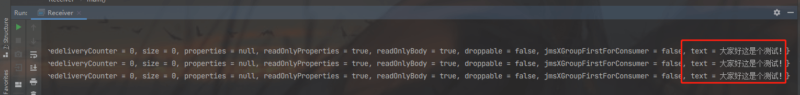

### **Spring 消息** 

Java消息服务（Java Message Service，JMS）应用程序接口是一个Java平台中关于面向消息中间件（MOM）的API，用于在两个应用程序之间或分布式系统中发送消息，进行异步通信。Java消息服务是一个与具体平台无关的API，绝大多数MOM提供商都对JMS提供支持。

Java消息服务的规范包括两种消息模式，**点对点**和**发布者/订阅者**。许多提供商支持这一通用框架。因此，程序员可以在他们的分布式软件中实现面向消息的操作，这些操作将具有不同面向消息中间件产品的可移植性。

Java消息服务支持同步和异步的消息处理，在某些场景下，异步消息是必要的，而且比同步消息操作更加便利。
Java消息服务**支持面向事件的方法接收消息**，**事件驱动的程序设计**现在被广泛认为是一种富有成效的程序设计范例，程序员们都相当熟悉。

在应用系统开发时，Java消息服务可以推迟选择面对消息中间件产品，也可以在不同的面对消息中间件切换。

#### **JMS的独立使用**

尽管大多数的Java消息服务的使用都会跟Spring相结合，但是，我们还是非常有必要了解消息的独立使用方法，这对于我们了解消息的实现原理以及后续的与Spring整合实现分析都非常重要。当然在消息服务的使用前，需要我们先开启消息服务器，如果是Windows系统下可以直接双击ActiveMQ安装目录下的bin目录下的activemq.bat文件来启动消息服务器。

消息服务的使用除了要开启消息服务器外，还需要构建消息的发送端与接收端，发送端主要用来将包含业务逻辑的消息发送至消息服务器，而消息接收端则用于将服务器中的消息提取并进行相应的处理。

添加一些依赖

```xml
<!--    ActiveMQ    -->
<!-- https://mvnrepository.com/artifact/org.apache.activemq/activemq-all -->
<dependency>
    <groupId>org.apache.activemq</groupId>
    <artifactId>activemq-all</artifactId>
    <version>5.16.3</version>
</dependency>
<!-- https://mvnrepository.com/artifact/org.apache.activemq/activemq-spring -->
<dependency>
    <groupId>org.apache.activemq</groupId>
    <artifactId>activemq-spring</artifactId>
    <version>5.16.3</version>
</dependency>
<dependency>
    <groupId>org.springframework</groupId>
    <artifactId>spring-jms</artifactId>
    <version>5.2.4.RELEASE</version>
</dependency>
```

##### （1）发送端实现

发送端主要用于发送消息到消息服务器，以下为发送消息测试，尝试发送三条消息到消息服务器，消息的内容为“大家好这是个测试”。

```java 
package springtest.jms;


import org.apache.activemq.ActiveMQConnectionFactory;


import javax.jms.*;


/**
* @author Vin lan
* @className Sender
* @description
* @createTime 2021-10-25  16:12
**/
public class Sender {
    public static void main(String[] args) throws Exception {
        ConnectionFactory connectionFactory = new ActiveMQConnectionFactory();
        Connection connection = connectionFactory.createConnection("admin", "admin");
//        connection.start();
        Session session = connection.createSession(Boolean.TRUE, Session.AUTO_ACKNOWLEDGE);
        Destination queue = session.createQueue("my-queue");
        MessageProducer producer = session.createProducer(queue);


        for (int i = 0; i < 3; i++) {
            TextMessage textMessage = session.createTextMessage("大家好这是个测试！");
            Thread.sleep(1000);
            producer.send(textMessage);
        }


        session.commit();
        session.close();
        connection.close();
    }
}
```

运行之后（代码也就结束了），可以从管理平台（http://127.0.0.1:8161/admin/index.jsp 默认的登录名和密码是 admin:admin）看到有三个 pending messages，刚才代码里创建的 ”my-queue“也显示出来了。


从 my-queue 点进去看到如下：


##### （2）接收端实现。

接收端主要用于连接消息服务器并接收服务器上的消息。

```java 
package springtest.jms;


import org.apache.activemq.ActiveMQConnectionFactory;


import javax.jms.*;


/**
* @author Vin lan
* @className Receiver
* @description
* @createTime 2021-10-25  16:38
**/
public class Receiver {
    public static void main(String[] args) throws Exception {
        ConnectionFactory connectionFactory = new ActiveMQConnectionFactory();
        Connection connection = connectionFactory.createConnection("admin", "admin");
        connection.start();
        Session session = connection.createSession(Boolean.TRUE, Session.AUTO_ACKNOWLEDGE);
        Destination queue = session.createQueue("my-queue");
        MessageConsumer consumer = session.createConsumer(queue);
        int i = 0;
        while (i < 3) {
            i++;
            TextMessage message = (TextMessage) consumer.receive();
            session.commit();
            System.out.println("收到消息：" + message);
        }
        session.close();
        connection.close();
    }
}
```

程序测试的顺序是首先开启发送端，然后向服务器发送消息，接着再开启接收端，不出意外，就会接收到发送端发出的消息。运行代码之后，控制台输出效果：




activeMQ 管理平台，pending 的消息为 0 了


#### **Spring 整合 ActiveMQ** 

整个消息的发送与接收过程非常简单，但是其中却参杂着大量的冗余代码，比如Connection的创建与关闭，Session的创建与关闭等，为了消除这一冗余工作量，Spring进行了进一步的封装。Spring下的ActiveMQ使用方式如下。

##### （1）Spring配置文件。

配置文件是Spring的核心，Spring整合消息服务的使用也从配置文件配置开始。类似于数据库操作，Spring也将ActiveMQ中的操作统一封装至JmsTemplate中，以方便我们统一使用。所以，在Spring的核心配置文件中首先要注册JmsTemplate类型的bean。当然，ActiveMQConnectionFactory用于连接消息服务器，是消息服务的基础，也要注册。ActiveMQQueue则用于指定消息的目的地。

```xml
<?xml version="1.0" encoding="UTF-8"?>
<beans xmlns="http://www.springframework.org/schema/beans"
       xmlns:context="http://www.springframework.org/schema/context" xmlns:p="http://www.springframework.org/schema/p"
       xmlns:aop="http://www.springframework.org/schema/aop" xmlns:tx="http://www.springframework.org/schema/tx"
       xmlns:xsi="http://www.w3.org/2001/XMLSchema-instance"
       xsi:schemaLocation="http://www.springframework.org/schema/beans http://www.springframework.org/schema/beans/spring-beans-4.2.xsd
    http://www.springframework.org/schema/context http://www.springframework.org/schema/context/spring-context-4.2.xsd
    http://www.springframework.org/schema/aop http://www.springframework.org/schema/aop/spring-aop-4.2.xsd http://www.springframework.org/schema/tx http://www.springframework.org/schema/tx/spring-tx-4.2.xsd
    http://www.springframework.org/schema/util http://www.springframework.org/schema/util/spring-util-4.2.xsd">


    <!-- 配置能够产生connection的connectionfactory，由JMS对应的服务厂商提供 -->
    <bean id="tagertConnectionFactory" class="org.apache.activemq.ActiveMQConnectionFactory">
        <constructor-arg name="brokerURL" value="tcp://localhost:61616"/>
    </bean>
    <!-- 配置spring管理真正connectionfactory的connectionfactory，相当于spring对connectionfactory的一层封装 -->
    <bean id="connectionFactory" class="org.springframework.jms.connection.SingleConnectionFactory">
        <property name="targetConnectionFactory" ref="tagertConnectionFactory"/>
    </bean>
    <!-- 配置生产者 -->
    <!-- Spring使用JMS工具类，可以用来发送和接收消息 -->
    <bean id="jmsTemplate" class="org.springframework.jms.core.JmsTemplate">
        <!-- 这里是配置的spring用来管理connectionfactory的connectionfactory -->
        <property name="connectionFactory" ref="connectionFactory"/>
    </bean>
    <!-- 配置destination -->
    <!-- 队列目的地 -->
    <bean id="queueDestination" class="org.apache.activemq.command.ActiveMQQueue">
        <constructor-arg value="spring-queue"/>
    </bean>
    <!-- 话题目的地 -->
<!--    <bean id="itemAddTopic" class="org.apache.activemq.command.ActiveMQTopic">-->
<!--        <constructor-arg value="item-add-topic"/>-->
<!--    </bean>-->
</beans>
```

##### （2）发送端。

有了以上的配置，Spring就可以根据配置信息简化我们的工作量。Spring中使用发送消息到消息服务器，省去了冗余的Connection以及Session等的创建与销毁过程，简化了工作量。

```java 
package springtest.jms.spring;


import org.springframework.context.ApplicationContext;
import org.springframework.context.support.ClassPathXmlApplicationContext;
import org.springframework.jms.core.JmsTemplate;
import org.springframework.jms.core.MessageCreator;
import springtest.aop.TestBean;


import javax.jms.Destination;
import javax.jms.JMSException;
import javax.jms.Message;
import javax.jms.Session;


/**
* @author Vin lan
* @className HelloWorldQueue
* @description
* @createTime 2021-10-25  17:01
**/
public class HelloWorldSender {
    public static void main(String[] args) {
        ApplicationContext context = new ClassPathXmlApplicationContext("classpath:applicationContext-activemq.xml");
        JmsTemplate jmsTemplate = (JmsTemplate) context.getBean("jmsTemplate");
        Destination destination = (Destination) context.getBean("queueDestination");
        jmsTemplate.send(destination, new MessageCreator() {
            @Override
            public Message createMessage(Session session) throws JMSException {
                return session.createTextMessage("大家好这个是测试");
            }
        });
    }
}
```

##### （3）接收端。

同样，在Spring中接收消息也非常方便，Spring中连接服务器接收消息的示例如下：

```java 
package springtest.jms.spring;


import org.springframework.context.ApplicationContext;
import org.springframework.context.support.ClassPathXmlApplicationContext;
import org.springframework.jms.core.JmsTemplate;
import org.springframework.jms.core.MessageCreator;


import javax.jms.*;


/**
* @author Vin lan
* @className HelloWorldReceiver
* @description
* @createTime 2021-10-25  17:06
**/
public class HelloWorldReceiver {
    public static void main(String[] args) throws JMSException {
        ApplicationContext context = new ClassPathXmlApplicationContext("classpath:applicationContext-activemq.xml");
        JmsTemplate jmsTemplate = (JmsTemplate) context.getBean("jmsTemplate");
        Destination destination = (Destination) context.getBean("queueDestination");
        // 只能接收一次消息
        TextMessage message = (TextMessage) jmsTemplate.receive(destination);
        System.out.println("received msg is:" + message.getText());
    }
}
```

到这里我们已经完成了Spring消息的发送与接收操作。但是，如HelloWorldReciver中所示的代码，使用jmsTemplate.receive(destination)方法**只能接收一次消息，如果未接收到消息，则会一直等待**，当然用户可以通过设置timeout属性来控制等待时间，但是一旦接收到消息本次接收任务就会结束，虽然用户可以通过while(true)的方式来实现循环监听消息服务器上的消息，还有一种更好的解决办法：**创建消息监听器**。消息监听器的使用方式如下。

##### 循环监听消息

###### （1）创建消息监听器。

用于监听消息，一旦有新消息Spring会将消息引导至消息监听器以方便用户进行相应的逻辑处理。

```java 
package springtest.jms.spring;


import javax.jms.JMSException;
import javax.jms.Message;
import javax.jms.MessageListener;
import javax.jms.TextMessage;


/**
* @author Vin lan
* @className MyMessageListener
* @description
* @createTime 2021-10-25  17:14
**/
public class MyMessageListener implements MessageListener {
    @Override
    public void onMessage(Message message) {
       TextMessage msg = (TextMessage) message;
       try {
           System.out.println(this.getClass().getSimpleName() + " " + msg.getText());
       } catch (JMSException e) {
           e.printStackTrace();
       }
    }
}
```

###### （2）修改配置文件。

为了使用消息监听器，需要在配置文件中注册消息容器，并将消息监听器注入到容器中。

```xml
<?xml version="1.0" encoding="UTF-8"?>
<beans xmlns="http://www.springframework.org/schema/beans"
       xmlns:context="http://www.springframework.org/schema/context" xmlns:p="http://www.springframework.org/schema/p"
       xmlns:aop="http://www.springframework.org/schema/aop" xmlns:tx="http://www.springframework.org/schema/tx"
       xmlns:xsi="http://www.w3.org/2001/XMLSchema-instance"
       xsi:schemaLocation="http://www.springframework.org/schema/beans http://www.springframework.org/schema/beans/spring-beans-4.2.xsd
    http://www.springframework.org/schema/context http://www.springframework.org/schema/context/spring-context-4.2.xsd
    http://www.springframework.org/schema/aop http://www.springframework.org/schema/aop/spring-aop-4.2.xsd http://www.springframework.org/schema/tx http://www.springframework.org/schema/tx/spring-tx-4.2.xsd
    http://www.springframework.org/schema/util http://www.springframework.org/schema/util/spring-util-4.2.xsd">


    <!-- 配置能够产生connection的connectionfactory，由JMS对应的服务厂商提供 -->
    <bean id="tagertConnectionFactory" class="org.apache.activemq.ActiveMQConnectionFactory">
        <constructor-arg name="brokerURL" value="tcp://localhost:61616"/>
    </bean>
    <!-- 配置spring管理真正connectionfactory的connectionfactory，相当于spring对connectionfactory的一层封装 -->
    <bean id="connectionFactory" class="org.springframework.jms.connection.SingleConnectionFactory">
        <property name="targetConnectionFactory" ref="tagertConnectionFactory"/>
    </bean>
    <!-- 配置生产者 -->
    <!-- Spring使用JMS工具类，可以用来发送和接收消息 -->
    <bean id="jmsTemplate" class="org.springframework.jms.core.JmsTemplate">
        <!-- 这里是配置的spring用来管理connectionfactory的connectionfactory -->
        <property name="connectionFactory" ref="connectionFactory"/>
    </bean>
    <!-- 配置destination -->
    <!-- 队列目的地 -->
    <bean id="queueDestination" class="org.apache.activemq.command.ActiveMQQueue">
        <constructor-arg value="spring-queue"/>
    </bean>
    <!-- 话题目的地 -->
<!--    <bean id="itemAddTopic" class="org.apache.activemq.command.ActiveMQTopic">-->
<!--        <constructor-arg value="item-add-topic"/>-->
<!--    </bean>-->


    <!--  新增的内容  -->
    <!--  添加监听器  -->
    <bean id="myMessageListener" class="springtest.jms.spring.MyMessageListener"/>
    <!--  配置消费者  -->
    <bean id="javaConsumer" class="org.springframework.jms.listener.DefaultMessageListenerContainer">
        <property name="connectionFactory" ref="tagertConnectionFactory"/>
        <property name="destination" ref="queueDestination"/>
        <property name="messageListener" ref="myMessageListener"/>
    </bean>
</beans>
```

运行发送端，消息监听器就会监听消息了。 

#### 源码分析 

尽管消息接收可以使用消息监听器的方式替代模版方法，但是在发送的时候是无法替代的，在Spring中必须要使用JmsTemplate提供的方法来进行发送操作，可见**JmsTemplate**类的重要性，那么我们对于Spring整合消息服务的分析就从JmsTemplate开始。 


​																				结构图

首先还是按照一贯的分析套路，提取我们感兴趣的接口InitializingBean，接口方法实现是在JmsAccessor类中，如下：


发现函数中只是一个验证的功能，并没有逻辑实现。丢掉这个线索，我们转向实例代码的分析。首先以发送为例，在Spring中发送消息可以通过JmsTemplate中提供的方法来实现。

public void send(final Destination destination, final MessageCreatormessageCreator) throws JmsException 


我们就跟着程序流，进入函数send查看其源代码：


现在的风格不得不让我们回想起JdbcTemplate的类实现风格，极为相似，都是提取一个公共的方法作为最底层、最通用的功能实现，然后又通过回调函数的不同来区分个性化的功能。我们首先查看通用代码的抽取实现。

##### **1.通用代码抽取**

根据之前分析JdbcTemplate的经验，我们推断，在execute中一定是封装了Connection以及Session的创建操作。

```java 
public <T> T execute(SessionCallback<T> action, boolean startConnection) throws JmsException {
    Assert.notNull(action, "Callback object must not be null");
    Connection conToClose = null;
    Session sessionToClose = null;


    Object var6;
    try {
        Session sessionToUse = ConnectionFactoryUtils.doGetTransactionalSession(this.getConnectionFactory(), this.transactionalResourceFactory, startConnection);
        if (sessionToUse == null) {
// 创建 connection
            conToClose = this.createConnection();
// 根据 connection 创建 session
            sessionToClose = this.createSession(conToClose);
            if (startConnection) {
                conToClose.start();
            }


            sessionToUse = sessionToClose;
        }


        if (this.logger.isDebugEnabled()) {
            this.logger.debug("Executing callback on JMS Session: " + sessionToUse);
        }

// 调用回调函数
        var6 = action.doInJms(sessionToUse);
    } catch (JMSException var10) {
        throw this.convertJmsAccessException(var10);
    } finally {
        JmsUtils.closeSession(sessionToClose);
// 释放连接
        ConnectionFactoryUtils.releaseConnection(conToClose, this.getConnectionFactory(), startConnection);
    }

    return var6;
}
```

在展示单独使用activeMQ时，我们知道为了发送一条消息需要做很多工作，需要很多的辅助代码，而这些代码又都是千篇一律的，没有任何的差异，所以execute方法的目的就是帮助我们抽离这些冗余代码使我们更加专注于业务逻辑的实现。从函数中看，这些冗余代码包括创建Connection、创建Session、当然也包括关闭Session和关闭Connection。而在准备工作结束后，调用回调函数将程序引入用户自定义实现的个性化处理。**至于如何创建Session与Connection，有兴趣的读者可以进一步研究Mybatis的源码**。

##### **2.发送消息的实现**  

回调回这个函数，有了基类辅助实现，使Spring更加专注于个性的处理，也就是说Spring使用execute方法中封装了冗余代码，而将个性化的代码实现放在了回调函数doInJms函数中。在发送消息的功能中回调函数通过局部类实现。

```java 
public void send(final Destination destination, final MessageCreator messageCreator) throws JmsException {
    this.execute(new SessionCallback<Object>() {
        public Object doInJms(Session session) throws JMSException {
            JmsTemplate.this.doSend(session, destination, messageCreator);
            return null;
        }
    }, false);
}
```

此时的发送逻辑已经完全被转向了doSend方法，这样使整个功能实现变得更加清晰。


在演示独立使用消息功能的时候，我们大体了解了消息发送的基本套路，虽然这些步骤已经被Spring拆得支离破碎，但是我们还是能捕捉到一些影子。在发送消息还是遵循着消息发送的规则，比如根据Destination创建MessageProducer、创建Message，并使用MessageProducer实例来发送消息。

##### 3 接收消息

我们通常使用jmsTemplate.receive(destination)来接收简单的消息，那么这个功能Spring是如何封装的呢？

```java 
public Message receive(Destination destination) throws JmsException {
    return this.receiveSelected((Destination)destination, (String)null);
}

public Message receiveSelected(final Destination destination, final String messageSelector) throws JmsException {
    return (Message)this.execute(new SessionCallback<Message>() {
        public Message doInJms(Session session) throws JMSException {
            return JmsTemplate.this.doReceive(session, destination, messageSelector);
        }
    }, true);
}

protected Message doReceive(Session session, Destination destination, String messageSelector) throws JMSException {
    return this.doReceive(session, this.createConsumer(session, destination, messageSelector));
}

protected Message doReceive(Session session, MessageConsumer consumer) throws JMSException {
    Message var7;
    try {
        long timeout = this.getReceiveTimeout();
        JmsResourceHolder resourceHolder = (JmsResourceHolder)TransactionSynchronizationManager.getResource(this.getConnectionFactory());
        if (resourceHolder != null && resourceHolder.hasTimeout()) {
            timeout = Math.min(timeout, resourceHolder.getTimeToLiveInMillis());
        }

        Message message = this.receiveFromConsumer(consumer, timeout);
        if (session.getTransacted()) {
            if (this.isSessionLocallyTransacted(session)) {
                JmsUtils.commitIfNecessary(session);
            }
        } else if (this.isClientAcknowledge(session) && message != null) {
            message.acknowledge();
        }

        var7 = message;
    } finally {
        JmsUtils.closeMessageConsumer(consumer);
    }

    return var7;
}
```

实现的套路与发送差不多，同样还是使用execute函数来封装冗余的公共操作，而最终的目标还是通过consumer.receive()来接收消息，其中的过程就是对于MessageConsumer的创建以及一些辅助操作。

##### **监听器容器**

消息监听器容器是一个用于查看JMS目标等待消息到达的特殊bean，一旦消息到达它就可以获取到消息，并通过调用onMessage()方法将消息传递给一个MessageListener实现。Spring中消息监听器容器的类型如下。

（1）SimpleMessageListenerContainer：最简单的消息监听器容器，只能处理固定数量的JMS会话，且不支持事务。

（2）DefaultMessageListenerContainer：这个消息监听器容器建立在SimpleMessageListener Container容器之上，添加了对事务的支持。

（3）serversession.ServerSessionMessage.ListenerContainer：这是功能最强大的消息监听器，与DefaultMessageListenerContainer相同，它支持事务，但是它还允许动态地管理JMS

下面以DefaultMessageListenerContainer为例进行分析，看看消息监听器容器的实现。在之前消息监听器的使用示例中，我们了解到在使用消息监听器容器时一定要将自定义的消息监听器置入到容器中，这样才可以在收到信息时，容器把消息转向监听器处理。查看DefaultMessageListenerContainer层次结构图，如图13-2所示。DefaultMessageListenerContainer 继承了 AbstractMessageListenerContainer


​																		 图13-2 DefaultMessageListener Container层次结构图 

同样，我们看到此类实现了 **IntializingBean** 接口，按照以往风格我们还是查看接口方法 afterPropertiesSet() 的逻辑，其方法实现在其父类 AbstractJmsListenerContainer 中。 

```java 
public void afterPropertiesSet() {
    super.afterPropertiesSet();// 验证 connectionFactory
    this.validateConfiguration(); // 验证配置文件
    this.initialize(); // 初始化
}

public void initialize() throws JmsException {
    try {
        synchronized(this.lifecycleMonitor) {
            this.active = true;
            this.lifecycleMonitor.notifyAll();
        }

        this.doInitialize();
    } catch (JMSException var6) {
        synchronized(this.sharedConnectionMonitor) {
            ConnectionFactoryUtils.releaseConnection(this.sharedConnection, this.getConnectionFactory(), this.autoStartup);
            this.sharedConnection = null;
        }

        throw this.convertJmsAccessException(var6);
    }
}
方法在：org.springframework.jms.listener.DefaultMessageListenerContainer#doInitialize 中
protected void doInitialize() throws JMSException {
    synchronized(this.lifecycleMonitor) {
        for(int i = 0; i < this.concurrentConsumers; ++i) {
            this.scheduleNewInvoker();
        }
    }
}
```

这里用到了concurrentConsumers属性，网络中对此属性用法的说明如下。消息监听器允许创建多个Session和MessageConsumer来接收消息。具体的个数由concurrentConsumers属性指定。需要注意的是，应该只是在Destination为Queue的时候才使用多个MessageConsumer（Queue中的一个消息只能被一个Consumer接收），虽然使用多个MessageConsumer会提高消息处理的性能，但是消息处理的顺序却得不到保证。消息被接收的顺序仍然是消息发送时的顺序，但是由于消息可能会被并发处理，因此消息处理的顺序可能和消息发送的顺序不同。此外，不应该在Destination为Topic的时候使用多个MessageConsumer，因为多个MessageConsumer会接收到同样的消息。

对于具体的实现逻辑我们只能继续查看源码：

```java 
private void scheduleNewInvoker() {
    DefaultMessageListenerContainer.AsyncMessageListenerInvoker invoker = new DefaultMessageListenerContainer.AsyncMessageListenerInvoker();
    if (this.rescheduleTaskIfNecessary(invoker)) {
        this.scheduledInvokers.add(invoker);
    }
}
protected final boolean rescheduleTaskIfNecessary(Object task) {
    if (this.running) {
        try {
            this.doRescheduleTask(task);
        } catch (RuntimeException var3) {
            this.logRejectedTask(task, var3);
            this.pausedTasks.add(task);
        }


        return true;
    } else if (this.active) {
        this.pausedTasks.add(task);
        return true;
    } else {
        return false;
    }
}

然后上面的方法调用子类的：org.springframework.jms.listener.DefaultMessageListenerContainer#doRescheduleTask
protected void doRescheduleTask(Object task) {
    this.taskExecutor.execute((Runnable)task);
}
```

分析源码得知，根据concurrentConsumers数量建立了对应数量的线程，即使读者不了解线程池的使用，至少根据以上代码可以推断出doRescheduleTask函数其实是在开启一个线程执行Runnable。我们反追踪这个传入的参数，可以看到这个参数其实是AsyncMessageListenerInvoker类型实例。**因此我们可以推断，Spring根据concurrentConsumers数量建立了对应数量的线程，而每个线程都作为一个独立的接收者在循环接收消息**。

于是我们把所有的焦点转向AsyncMessageListenerInvoker这个类的实现，由于它是作为一个Runnable角色去执行，所以对以这个类的分析从run方法开始。

```java 
public void run() {
   synchronized (lifecycleMonitor) { // 并发控制
      activeInvokerCount++;
      lifecycleMonitor.notifyAll();
   }
   boolean messageReceived = false;
   try {
      if (maxMessagesPerTask < 0) { // 小于 0 默认为无限制，一直接收消息
         messageReceived = executeOngoingLoop();
      }
      else {
         int messageCount = 0;
         while (isRunning() && messageCount < maxMessagesPerTask) { // 消息数量控制，一旦超出数量则停止循环
            messageReceived = (invokeListener() || messageReceived);
            messageCount++;
         }
      }
   }
   catch (Throwable ex) {
      clearResources(); // 清理操作，包括关闭 session 等
      if (!this.lastMessageSucceeded) {
         // We failed more than once in a row or on startup -
         // wait before first recovery attempt.
         waitBeforeRecoveryAttempt();
      }
      this.lastMessageSucceeded = false;
      boolean alreadyRecovered = false;
      synchronized (recoveryMonitor) {
         if (this.lastRecoveryMarker == currentRecoveryMarker) {
            handleListenerSetupFailure(ex, false);
            recoverAfterListenerSetupFailure();
            currentRecoveryMarker = new Object();
         }
         else {
            alreadyRecovered = true;
         }
      }
      if (alreadyRecovered) {
         handleListenerSetupFailure(ex, true);
      }
   }
   finally {
      synchronized (lifecycleMonitor) {
         decreaseActiveInvokerCount();
         lifecycleMonitor.notifyAll();
      }
      if (!messageReceived) {
         this.idleTaskExecutionCount++;
      }
      else {
         this.idleTaskExecutionCount = 0;
      }
      synchronized (lifecycleMonitor) {
         if (!shouldRescheduleInvoker(this.idleTaskExecutionCount) || !rescheduleTaskIfNecessary(this)) {
            // We're shutting down completely.
            scheduledInvokers.remove(this);
            if (logger.isDebugEnabled()) {
               logger.debug("Lowered scheduled invoker count: " + scheduledInvokers.size());
            }
            lifecycleMonitor.notifyAll();
            clearResources();
         }
         else if (isRunning()) {
            int nonPausedConsumers = getScheduledConsumerCount() - getPausedTaskCount();
            if (nonPausedConsumers < 1) {
               logger.error("All scheduled consumers have been paused, probably due to tasks having been rejected. " +
                     "Check your thread pool configuration! Manual recovery necessary through a start() call.");
            }
            else if (nonPausedConsumers < getConcurrentConsumers()) {
               logger.warn("Number of scheduled consumers has dropped below concurrentConsumers limit, probably " +
                     "due to tasks having been rejected. Check your thread pool configuration! Automatic recovery " +
                     "to be triggered by remaining consumers.");
            }
         }
      }
   }
}
```

以上函数中主要根据变量maxMessagesPerTask的值来分为不同的情况处理，当然，函数中还使用了大量的代码处理异常机制的数据维护，但是我相信大家跟我一样更加关注程序的正常流程是如何处理的。其实核心的处理就是调用invokeListener来接收消息并激活消息监听器，但是之所以两种情况分开处理，正是考虑到在无限制循环接收消息的情况下，用户可以通过设置标志位running来控制消息接收的暂停与恢复，并维护当前消息监听器的数量。

其实核心的处理就是调用invokeListener来接收消息并激活消息监听器，但是之所以两种情况分开处理，正是考虑到在无限制循环接收消息的情况下，用户可以通过设置标志位running来控制消息接收的暂停与恢复，并维护当前消息监听器的数量。

```java 
private boolean executeOngoingLoop() throws JMSException {
   boolean messageReceived = false;
   boolean active = true;
   while (active) {
      synchronized (lifecycleMonitor) {
         boolean interrupted = false;
         boolean wasWaiting = false;
         while ((active = isActive()) && !isRunning()) { // 如果当前任务已经处于激活状态但是却给了暂时终止的命令
            if (interrupted) {
               throw new IllegalStateException("Thread was interrupted while waiting for " +
                     "a restart of the listener container, but container is still stopped");
            }
            if (!wasWaiting) {// 如果并非处于等待状态则说明是第一次执行，需要将激活任务数量减少
               decreaseActiveInvokerCount();
            }
            wasWaiting = true; // 开始进入等待状态，等待任务的恢复命令
            try {
               lifecycleMonitor.wait(); // 通过 wait 等待，也就是等待 notify 或者 notifyAll 
            }
            catch (InterruptedException ex) {
               // Re-interrupt current thread, to allow other threads to react.
               Thread.currentThread().interrupt();
               interrupted = true;
            }
         }
         if (wasWaiting) {
            activeInvokerCount++;
         }
         if (scheduledInvokers.size() > maxConcurrentConsumers) {
            active = false;
         }
      }
      if (active) { // 正常流程处理
         messageReceived = (invokeListener() || messageReceived);
      }
   }
   return messageReceived;
}
```

如果按照正常的流程其实是不会进入while循环中的，而是直接进入函数invokeListener()来接收消息并激活监听器，但是，我们不可能让循环一直持续下去，我们要考虑到暂停线程或者恢复线程的情况，这时，isRunning()函数就派上用场了。

isRunning()用来检测标志位this.running状态进而判断是否需要进入while循环。由于要维护当前线程激活数量，所以引入了wasWaiting变量，用来判断线程是否处于等待状态。如果线程首次进入等待状态，则需要减少线程激活数量计数器。 

当然，还有一个地方需要提一下，就是线程等待不是一味地采用while循环来控制，因为如果单纯地采用while循环会浪费CPU的始终周期，给资源造成巨大的浪费。这里，Spring采用的是使用全局控制变量lifecycleMonitor的wait()方法来暂停线程，所以，如果终止线程需要再次恢复的话，除了更改this.running标志位外，还需要调用lifecycleMonitor.notify或者lifecycleMonitor.notifyAll来使线程恢复。

接下来就是消息接收的处理了。

```java 
private boolean invokeListener() throws JMSException {
   this.currentReceiveThread = Thread.currentThread();
   try {
      initResourcesIfNecessary(); // 初始化资源包括首次创建的时候创建 session 与 consumer
      boolean messageReceived = receiveAndExecute(this, this.session, this.consumer);
      this.lastMessageSucceeded = true; // 改变标志位，信息成功处理
      return messageReceived;
   }
   finally {
      this.currentReceiveThread = null;
   }
}

/**
* Execute the listener for a message received from the given consumer,
* wrapping the entire operation in an external transaction if demanded.
* @param session the JMS Session to work on
* @param consumer the MessageConsumer to work on
* @return whether a message has been received
* @throws JMSException if thrown by JMS methods
* @see #doReceiveAndExecute
*/
protected boolean receiveAndExecute(
      Object invoker, @Nullable Session session, @Nullable MessageConsumer consumer)
      throws JMSException {


   if (this.transactionManager != null) {
      // Execute receive within transaction.
      TransactionStatus status = this.transactionManager.getTransaction(this.transactionDefinition);
      boolean messageReceived;
      try {
         messageReceived = doReceiveAndExecute(invoker, session, consumer, status);
      }
      catch (JMSException | RuntimeException | Error ex) {
         rollbackOnException(this.transactionManager, status, ex);
         throw ex;
      }
      this.transactionManager.commit(status);
      return messageReceived;
   }


   else {
      // Execute receive outside of transaction.
      return doReceiveAndExecute(invoker, session, consumer, null);
   }
}
```

在介绍消息监听器容器的分类时，已介绍了DefaultMessageListenerContainer消息监听器容器建立在SimpleMessageListenerContainer容器之上，添加了对事务的支持，那么此时，事务特性的实现已经开始了。如果用户配置了this.transactionManager，也就是配置了事务，那么，消息的接收会被控制在事务之内，一旦出现任何异常都会被回滚，而回滚操作也会交由事务管理器统一处理，比如this.transactionManager.rollback(status)。

doReceiveAndExecute包含了整个消息的接收处理过程，由于参杂着事务，所以并没有复用模板中的方法。

```java 
protected boolean doReceiveAndExecute(Object invoker, @Nullable Session session,
      @Nullable MessageConsumer consumer, @Nullable TransactionStatus status) throws JMSException {


   Connection conToClose = null;
   Session sessionToClose = null;
   MessageConsumer consumerToClose = null;
   try {
      Session sessionToUse = session;
      boolean transactional = false;
      if (sessionToUse == null) {
         sessionToUse = ConnectionFactoryUtils.doGetTransactionalSession(
               obtainConnectionFactory(), this.transactionalResourceFactory, true);
         transactional = (sessionToUse != null);
      }
      if (sessionToUse == null) {
         Connection conToUse;
         if (sharedConnectionEnabled()) {
            conToUse = getSharedConnection();
         }
         else {
            conToUse = createConnection();
            conToClose = conToUse;
            conToUse.start();
         }
         sessionToUse = createSession(conToUse);
         sessionToClose = sessionToUse;
      }
      MessageConsumer consumerToUse = consumer;
      if (consumerToUse == null) {
         consumerToUse = createListenerConsumer(sessionToUse);
         consumerToClose = consumerToUse;
      }
      Message message = receiveMessage(consumerToUse);
      if (message != null) {
         if (logger.isDebugEnabled()) {
            logger.debug("Received message of type [" + message.getClass() + "] from consumer [" +
                  consumerToUse + "] of " + (transactional ? "transactional " : "") + "session [" +
                  sessionToUse + "]");
         }
// 模板方法，当消息接收且在未处理前给子类机会做相应处理，当前空实现
         messageReceived(invoker, sessionToUse);
         boolean exposeResource = (!transactional && isExposeListenerSession() &&
               !TransactionSynchronizationManager.hasResource(obtainConnectionFactory()));
         if (exposeResource) {
            TransactionSynchronizationManager.bindResource(
                  obtainConnectionFactory(), new LocallyExposedJmsResourceHolder(sessionToUse));
         }
         try {
            doExecuteListener(sessionToUse, message); // 激活监听器
         }
         catch (Throwable ex) {
            if (status != null) {
               if (logger.isDebugEnabled()) {
                  logger.debug("Rolling back transaction because of listener exception thrown: " + ex);
               }
               status.setRollbackOnly();
            }
            handleListenerException(ex);
            // Rethrow JMSException to indicate an infrastructure problem
            // that may have to trigger recovery...
            if (ex instanceof JMSException) {
               throw (JMSException) ex;
            }
         }
         finally {
            if (exposeResource) {
               TransactionSynchronizationManager.unbindResource(obtainConnectionFactory());
            }
         }
         // Indicate that a message has been received.
         return true;
      }
      else {
         if (logger.isTraceEnabled()) {
            logger.trace("Consumer [" + consumerToUse + "] of " + (transactional ? "transactional " : "") +
                  "session [" + sessionToUse + "] did not receive a message");
         }
// 接收到空消息的处理
         noMessageReceived(invoker, sessionToUse);
         // Nevertheless call commit, in order to reset the transaction timeout (if any).
         if (shouldCommitAfterNoMessageReceived(sessionToUse)) {
            commitIfNecessary(sessionToUse, null);
         }
         // Indicate that no message has been received.
         return false;
      }
   }
   finally {
      JmsUtils.closeMessageConsumer(consumerToClose);
      JmsUtils.closeSession(sessionToClose);
      ConnectionFactoryUtils.releaseConnection(conToClose, getConnectionFactory(), true);
   }
}
```

上面函数代码看似繁杂，但是真正的逻辑并不多，大多是固定的套路，而我们最关心的就是监听器的激活处理。 

```java 
protected void doExecuteListener(Session session, Message message) throws JMSException {
   if (!isAcceptMessagesWhileStopping() && !isRunning()) {
      if (logger.isWarnEnabled()) {
         logger.warn("Rejecting received message because of the listener container " +
               "having been stopped in the meantime: " + message);
      }
      rollbackIfNecessary(session);
      throw new MessageRejectedWhileStoppingException();
   }


   try {
      invokeListener(session, message);
   }
   catch (JMSException | RuntimeException | Error ex) {
      rollbackOnExceptionIfNecessary(session, ex);
      throw ex;
   }
   commitIfNecessary(session, message);
}

protected void invokeListener(Session session, Message message) throws JMSException {
   Object listener = getMessageListener();


   if (listener instanceof SessionAwareMessageListener) {
      doInvokeListener((SessionAwareMessageListener) listener, session, message);
   }
   else if (listener instanceof MessageListener) {
      doInvokeListener((MessageListener) listener, message);
   }
   else if (listener != null) {
      throw new IllegalArgumentException(
            "Only MessageListener and SessionAwareMessageListener supported: " + listener);
   }
   else {
      throw new IllegalStateException("No message listener specified - see property 'messageListener'");
   }
}

protected void doInvokeListener(MessageListener listener, Message message) throws JMSException {
   listener.onMessage(message); // 至此，最后调用到了我们自己定义的 listener 了
}
```

通过层层调用，最终提取监听器并使用listener.onMessage(message)激活了监听器，也就是激活了用户自定义的监听器逻辑。这里还有一句重要的代码很容易被忽略掉，commitIfNecessary(session, message)，完成的功能是 session.commit() 。

完成消息服务的事务提交，涉及两个事务，**我们常说的DefaultMessageListenerContainer增加了事务的支持，是通用的事务，也就是说我们在消息接收过程中如果产生其他操作**，比如向数据库中插入数据，一旦出现异常时就需要全部回滚，包括回滚插入数据库中的数据。但是，除了我们常说的事务之外，**对于消息本身还有一个事务，当接收一个消息的时候，必须使用事务提交的方式，这是在告诉消息服务器本地已经正常接收消息，消息服务器接收到本地的事务提交后便可以将此消息删除，否则，当前消息会被其他接收者重新接收**。 

后续可以继续重看一下(^o^)

