###### 2.1 CGLIB创建代理源码分析

完成CGLIB代理的类是委托给Cglib2AopProxy类去实现的，我们进入这个类一探究竟。按照前面提供的示例，我们容易判断出来，Cglib2AopProxy的入口应该是在getProxy，也就是说在Cglib2AopProxy类的getProxy方法中实现了Enhancer的创建及接口封装。

```java 
// org.springframework.aop.framework.CglibAopProxy#getProxy
public Object getProxy(@Nullable ClassLoader classLoader) {
   if (logger.isTraceEnabled()) {
      logger.trace("Creating CGLIB proxy: " + this.advised.getTargetSource());
   }

   try {
      Class<?> rootClass = this.advised.getTargetClass();
      Assert.state(rootClass != null, "Target class must be available for creating a CGLIB proxy");
		// 代理的目标类
      Class<?> proxySuperClass = rootClass;
      if (rootClass.getName().contains(ClassUtils.CGLIB_CLASS_SEPARATOR)) {
         proxySuperClass = rootClass.getSuperclass();
         Class<?>[] additionalInterfaces = rootClass.getInterfaces();
         for (Class<?> additionalInterface : additionalInterfaces) {
            this.advised.addInterface(additionalInterface);
         }
      }

      // Validate the class, writing log messages as necessary.
      validateClassIfNecessary(proxySuperClass, classLoader);

      // Configure CGLIB Enhancer... 设置各种参数来构建 Enhancer
      Enhancer enhancer = createEnhancer();
      if (classLoader != null) {
         enhancer.setClassLoader(classLoader);
         if (classLoader instanceof SmartClassLoader &&
               ((SmartClassLoader) classLoader).isClassReloadable(proxySuperClass)) {
            enhancer.setUseCache(false);
         }
      }
      enhancer.setSuperclass(proxySuperClass);
      enhancer.setInterfaces(AopProxyUtils.completeProxiedInterfaces(this.advised));
      enhancer.setNamingPolicy(SpringNamingPolicy.INSTANCE);
      enhancer.setStrategy(new ClassLoaderAwareGeneratorStrategy(classLoader));

      Callback[] callbacks = getCallbacks(rootClass); // 设置拦截器---方法的增强点
      Class<?>[] types = new Class<?>[callbacks.length];
      for (int x = 0; x < types.length; x++) {
         types[x] = callbacks[x].getClass();
      }
      // fixedInterceptorMap only populated at this point, after getCallbacks call above 可以添加一些过滤器来过滤掉不想执行的增强
      enhancer.setCallbackFilter(new ProxyCallbackFilter(
            this.advised.getConfigurationOnlyCopy(), this.fixedInterceptorMap, this.fixedInterceptorOffset));
      enhancer.setCallbackTypes(types);

      // Generate the proxy class and create a proxy instance. 生成代理类以及创建代理
      return createProxyClassAndInstance(enhancer, callbacks);
   }
   catch (CodeGenerationException | IllegalArgumentException ex) {
      throw new AopConfigException("Could not generate CGLIB subclass of " + this.advised.getTargetClass() +
            ": Common causes of this problem include using a final class or a non-visible class",
            ex);
   }
   catch (Throwable ex) {
      // TargetSource.getTarget() failed
      throw new AopConfigException("Unexpected AOP exception", ex);
   }
}
```

以上函数完整地阐述了一个创建Spring中的Enhancer的过程，读者可以参考Enhancer的文档查看每个步骤的含义，这里最重要的是通过**getCallbacks**方法设置拦截器链。

```java 
private Callback[] getCallbacks(Class<?> rootClass) throws Exception {
   // Parameters used for optimization choices...
   boolean exposeProxy = this.advised.isExposeProxy();
   boolean isFrozen = this.advised.isFrozen();
   boolean isStatic = this.advised.getTargetSource().isStatic();


   // Choose an "aop" interceptor (used for AOP calls). 将拦截器封装在 DynamicAdvisedInterceptor 中
   Callback aopInterceptor = new DynamicAdvisedInterceptor(this.advised);


   // Choose a "straight to target" interceptor. (used for calls that are
   // unadvised but can return this). May be required to expose the proxy.
   Callback targetInterceptor;
   if (exposeProxy) {
      targetInterceptor = (isStatic ?
            new StaticUnadvisedExposedInterceptor(this.advised.getTargetSource().getTarget()) :
            new DynamicUnadvisedExposedInterceptor(this.advised.getTargetSource()));
   }
   else {
      targetInterceptor = (isStatic ?
            new StaticUnadvisedInterceptor(this.advised.getTargetSource().getTarget()) :
            new DynamicUnadvisedInterceptor(this.advised.getTargetSource()));
   }


   // Choose a "direct to target" dispatcher (used for
   // unadvised calls to static targets that cannot return this).
   Callback targetDispatcher = (isStatic ?
         new StaticDispatcher(this.advised.getTargetSource().getTarget()) : new SerializableNoOp());


   Callback[] mainCallbacks = new Callback[] {
         aopInterceptor,  // for normal advice 将拦截器链加入 CallBack 中
         targetInterceptor,  // invoke target without considering advice, if optimized
         new SerializableNoOp(),  // no override for methods mapped to this
         targetDispatcher, this.advisedDispatcher,
         new EqualsInterceptor(this.advised),
         new HashCodeInterceptor(this.advised)
   };

   Callback[] callbacks;

   // If the target is a static one and the advice chain is frozen,
   // then we can make some optimizations by sending the AOP calls
   // direct to the target using the fixed chain for that method.
   if (isStatic && isFrozen) {
      Method[] methods = rootClass.getMethods();
      Callback[] fixedCallbacks = new Callback[methods.length];
      this.fixedInterceptorMap = new HashMap<>(methods.length);


      // TODO: small memory optimization here (can skip creation for methods with no advice)
      for (int x = 0; x < methods.length; x++) {
         Method method = methods[x];
         List<Object> chain = this.advised.getInterceptorsAndDynamicInterceptionAdvice(method, rootClass);
         fixedCallbacks[x] = new FixedChainStaticTargetInterceptor(
               chain, this.advised.getTargetSource().getTarget(), this.advised.getTargetClass());
         this.fixedInterceptorMap.put(method, x);
      }


      // Now copy both the callbacks from mainCallbacks
      // and fixedCallbacks into the callbacks array.
      callbacks = new Callback[mainCallbacks.length + fixedCallbacks.length];
      System.arraycopy(mainCallbacks, 0, callbacks, 0, mainCallbacks.length);
      System.arraycopy(fixedCallbacks, 0, callbacks, mainCallbacks.length, fixedCallbacks.length);
      this.fixedInterceptorOffset = mainCallbacks.length;
   }
   else {
      callbacks = mainCallbacks;
   }
   return callbacks;
}
```

在getCallback中Spring考虑了很多情况，但是对于我们来说，只需要理解最常用的就可以了，比如将advised属性封装在DynamicAdvisedInterceptor并加入在callbacks中，这么做的目的是什么呢，如何调用呢？

###### 2.2 CGLIB执行代理源码分析

创建的代理对象中的数据如下：

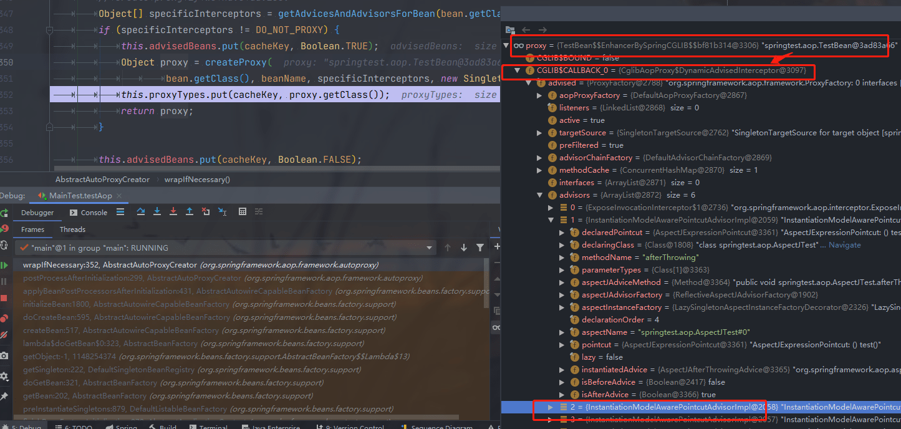

查看CGLIB代理生成的代理类：可以添加`System.setProperty(DebuggingClassWriter.DEBUG_LOCATION_PROPERTY, "D:\\projects\\ownJavaDemo");` 指定代理类生成的位置。

```java
public class TestBean$$EnhancerBySpringCGLIB$$66c14ce9 extends TestBean implements SpringProxy, Advised, Factory {
    private boolean CGLIB$BOUND;
    public static Object CGLIB$FACTORY_DATA;
    private static final ThreadLocal CGLIB$THREAD_CALLBACKS;
    private static final Callback[] CGLIB$STATIC_CALLBACKS;
    private MethodInterceptor CGLIB$CALLBACK_0;
    private MethodInterceptor CGLIB$CALLBACK_1;
    private NoOp CGLIB$CALLBACK_2;
    private Dispatcher CGLIB$CALLBACK_3;
    private Dispatcher CGLIB$CALLBACK_4;
    private MethodInterceptor CGLIB$CALLBACK_5;
    private MethodInterceptor CGLIB$CALLBACK_6;
    private static Object CGLIB$CALLBACK_FILTER;
    // test 是代理的方法
    private static final Method CGLIB$test$0$Method;
    private static final MethodProxy CGLIB$test$0$Proxy;
    ...
    public final void test(Pa var1) {
        MethodInterceptor var10000 = this.CGLIB$CALLBACK_0;
        if (var10000 == null) {
            CGLIB$BIND_CALLBACKS(this);
            var10000 = this.CGLIB$CALLBACK_0;
        }

        if (var10000 != null) {
            var10000.intercept(this, CGLIB$test$0$Method, new Object[]{var1}, CGLIB$test$0$Proxy);
        } else {
            super.test(var1);
        }
    }

    public void setCallbacks(Callback[] var1) {
        this.CGLIB$CALLBACK_0 = (MethodInterceptor)var1[0];
        this.CGLIB$CALLBACK_1 = (MethodInterceptor)var1[1];
        this.CGLIB$CALLBACK_2 = (NoOp)var1[2];
        this.CGLIB$CALLBACK_3 = (Dispatcher)var1[3];
        this.CGLIB$CALLBACK_4 = (Dispatcher)var1[4];
        this.CGLIB$CALLBACK_5 = (MethodInterceptor)var1[5];
        this.CGLIB$CALLBACK_6 = (MethodInterceptor)var1[6];
    }
}
```

由上面代码和图可知道，`CGLIB$CALLBACK_0`是`CglibAopProxy$DynamicAdvisedInterceptor`，所以回调到`CglibAopProxy$DynamicAdvisedInterceptor`类的`intercept()`方法中（方法源代码）如下：

> 具体分析可以参考博客：[吃透Spring源码（二十）：AOP拦截器链执行过程](https://blog.csdn.net/u013277209/article/details/114739792) 

在前面的示例中，我们了解到CGLIB中对于方法的拦截是**通过将自定义的拦截器（实现MethodInterceptor接口）加入Callback中并在调用代理时直接激活拦截器中的intercept方法来实现的**，那么在getCallback中正是实现了这样一个目的，**DynamicAdvisedInterceptor继承自MethodInterceptor，加入Callback中后，在再次调用代理时会直接调用DynamicAdvisedInterceptor中的intercept方法**，由此推断，对于CGLIB方式实现的代理，其核心逻辑必然在**DynamicAdvisedInterceptor**中的**intercept**中。

**org.springframework.aop.framework.CglibAopProxy.DynamicAdvisedInterceptor#intercept**

```java 
public Object intercept(Object proxy, Method method, Object[] args, MethodProxy methodProxy) throws Throwable {
   Object oldProxy = null;
   boolean setProxyContext = false;
   Object target = null;
   TargetSource targetSource = this.advised.getTargetSource();
   try {
      if (this.advised.exposeProxy) {
         // Make invocation available if necessary.
         oldProxy = AopContext.setCurrentProxy(proxy);
         setProxyContext = true;
      }
      // Get as late as possible to minimize the time we "own" the target, in case it comes from a pool...
      target = targetSource.getTarget();
      Class<?> targetClass = (target != null ? target.getClass() : null);
// 获取拦截器链
      List<Object> chain = this.advised.getInterceptorsAndDynamicInterceptionAdvice(method, targetClass);
      Object retVal;
      // 如果没有aop通知配置，那么直接调用target对象的调用方法
      // Check whether we only have one InvokerInterceptor: that is,
      // no real advice, but just reflective invocation of the target.
      if (chain.isEmpty() && Modifier.isPublic(method.getModifiers())) {
         // We can skip creating a MethodInvocation: just invoke the target directly.
         // Note that the final invoker must be an InvokerInterceptor, so we know
         // it does nothing but a reflective operation on the target, and no hot
         // swapping or fancy proxying.
          // 如果拦截器链为空则直接激活原方法
         Object[] argsToUse = AopProxyUtils.adaptArgumentsIfNecessary(method, args);
         retVal = methodProxy.invoke(target, argsToUse); 
      }
      else {
          // 通过cglibMethodInvocation来启动advice通知
         // We need to create a method invocation... 进入链
         retVal = new CglibMethodInvocation(proxy, target, method, args, targetClass, chain, methodProxy).proceed();
      }
      retVal = processReturnType(proxy, target, method, retVal);
      return retVal;
   }
   finally {
      if (target != null && !targetSource.isStatic()) {
         targetSource.releaseTarget(target);
      }
      if (setProxyContext) {
         // Restore old proxy.
         AopContext.setCurrentProxy(oldProxy);
      }
   }
}
```

上述的实现与JDK方式实现代理中的invoke方法大同小异，都是首先构造链，然后封装此链进行串联调用，稍有些区别就是在JDK中直接构造ReflectiveMethodInvocation，而在cglib中使用CglibMethodInvocation。CglibMethodInvocation继承自ReflectiveMethodInvocation，但是proceed方法并没有重写。

intercept()方法主要完成如下步骤：

1. **获取适合当前方法的拦截器链**
2. **如果拦截器链为空，则直接通过反射执行目标方法**
3. **若拦截器链不为空，则创建方法调用 ReflectiveMethodInvocation 对象的 proceed() 方法启动拦截器链**

###### 2.2.1 获取拦截器链

```java
public class DefaultAdvisorChainFactory implements AdvisorChainFactory, Serializable {
@Override
public List<Object> getInterceptorsAndDynamicInterceptionAdvice(
		Advised config, Method method, @Nullable Class<?> targetClass) {

	// AdvisorAdapterRegistry这个类的主要作用是将Advice适配为Advisor 将Advisor适配为对应的MethodInterceptor
	AdvisorAdapterRegistry registry = GlobalAdvisorAdapterRegistry.getInstance();
	Advisor[] advisors = config.getAdvisors();
	// 创建一个初始大小为 之前获取到的 通知个数的集合
	List<Object> interceptorList = new ArrayList<>(advisors.length);
	// 如果目标类为null的话，则从方法签名中获取目标类
	Class<?> actualClass = (targetClass != null ? targetClass : method.getDeclaringClass());

	// 循环目标方法匹配的通知
	for (Advisor advisor : advisors) {
		// 如果是PointcutAdvisor类型的实例
		if (advisor instanceof PointcutAdvisor) {
			// Add it conditionally.
			PointcutAdvisor pointcutAdvisor = (PointcutAdvisor) advisor;
			// 如果提前进行过切点的匹配了或者当前的Advisor适用于目标类
			if (config.isPreFiltered() || pointcutAdvisor.getPointcut().getClassFilter().matches(actualClass)) {
				MethodMatcher mm = pointcutAdvisor.getPointcut().getMethodMatcher();
				boolean match;
				//检测Advisor是否适用于此目标方法
				if (mm instanceof IntroductionAwareMethodMatcher) {
					if (hasIntroductions == null) {
						hasIntroductions = hasMatchingIntroductions(advisors, actualClass);
					}
					match = ((IntroductionAwareMethodMatcher) mm).matches(method, actualClass, hasIntroductions);
				}
				else {
					match = mm.matches(method, actualClass);
				}
				if (match) {
					// 拦截器链是通过AdvisorAdapterRegistry来加入的，这个AdvisorAdapterRegistry对advice织入具备很大的作用
					MethodInterceptor[] interceptors = registry.getInterceptors(advisor);
					// 使用MethodMatchers的matches方法进行匹配判断
					if (mm.isRuntime()) {
						// 动态切入点则会创建一个InterceptorAndDynamicMethodMatcher对象
						// 这个对象包含MethodInterceptor和MethodMatcher的实例
						for (MethodInterceptor interceptor : interceptors) {
							interceptorList.add(new InterceptorAndDynamicMethodMatcher(interceptor, mm));
						}
					}
					else {
						// 添加到列表中
						interceptorList.addAll(Arrays.asList(interceptors));
					}
				}
			}
		}
	}

	return interceptorList;
}
```

这里先要拿到之前我们创建好的`advisors`，在创建的时候已经执行`sortAdvisors()`方法进行排序，这里拿过来的是已经排好序列的列表：

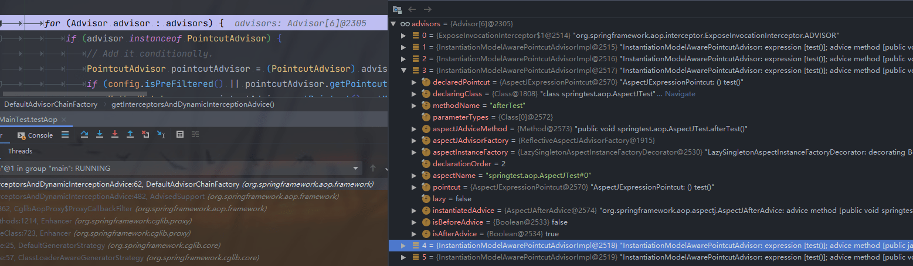

下面会去循环遍历每个advisor，判断`advisor`是否和当前方法`test(Pa pa)`匹配，先匹配类，再匹配方法，如果都能匹配就把当前`Advisor`转化为`MethodInterceptor`，加入到`interceptorList`集合里面并返回。


最后返回匹配到的拦截器链：

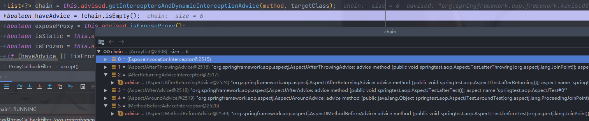

###### 创建方法调用

`new CglibMethodInvocation(proxy, target, method, args, targetClass, chain, methodProxy).proceed()` 这里创建一个类用来调用方法，进去能够观察到，方法会对需要代理的方法进行修饰符的判断，为 public 的才会进行代理。

```java
private static class CglibMethodInvocation extends ReflectiveMethodInvocation {

   @Nullable
   private final MethodProxy methodProxy;

   public CglibMethodInvocation(Object proxy, @Nullable Object target, Method method,
         Object[] arguments, @Nullable Class<?> targetClass,
         List<Object> interceptorsAndDynamicMethodMatchers, MethodProxy methodProxy) {
		// interceptorsAndDynamicMethodMatchers 这个值即是我们上面获取到的执行链，也就是那些增强方法
      super(proxy, target, method, arguments, targetClass, interceptorsAndDynamicMethodMatchers);

      // Only use method proxy for public methods not derived from java.lang.Object
      this.methodProxy = (Modifier.isPublic(method.getModifiers()) &&
            method.getDeclaringClass() != Object.class && !AopUtils.isEqualsMethod(method) &&
            !AopUtils.isHashCodeMethod(method) && !AopUtils.isToStringMethod(method) ?
            methodProxy : null);
   }

   @Override
   @Nullable
   public Object proceed() throws Throwable {
      try {
         return super.proceed();
      }
      catch (RuntimeException ex) {
         throw ex;
      }
      catch (Exception ex) {
         if (ReflectionUtils.declaresException(getMethod(), ex.getClass())) {
            throw ex;
         }
         else {
            throw new UndeclaredThrowableException(ex);
         }
      }
   }

   /**
    * Gives a marginal performance improvement versus using reflection to
    * invoke the target when invoking public methods.
    */
   @Override
   protected Object invokeJoinpoint() throws Throwable {
      if (this.methodProxy != null) {
         return this.methodProxy.invoke(this.target, this.arguments);
      }
      else {
         return super.invokeJoinpoint();
      }
   }
}
```

随后调用proceed()方法，进入后发现调用了 super.proceed()，也就是去到了 ReflectiveMethodInvocation 类。这个类中的proceed()方法是一个循环调用的方法，首先根据 `++this.currentInterceptorIndex` 获取第0个拦截器进行方法调用。执行链的这些类都不是InterceptorAndDynamicMethodMatcher实例，所以 ExposeInvocationInterceptor 拦截器，首先不是  InterceptorAndDynamicMethodMatcher 类型，所以走下面的else分支了。

```java
public Object proceed() throws Throwable {
   // We start with an index of -1 and increment early.
   if (this.currentInterceptorIndex == this.interceptorsAndDynamicMethodMatchers.size() - 1) {
      return invokeJoinpoint();
   }

   Object interceptorOrInterceptionAdvice =
         this.interceptorsAndDynamicMethodMatchers.get(++this.currentInterceptorIndex);
   if (interceptorOrInterceptionAdvice instanceof InterceptorAndDynamicMethodMatcher) {
      // Evaluate dynamic method matcher here: static part will already have
      // been evaluated and found to match.
      InterceptorAndDynamicMethodMatcher dm =
            (InterceptorAndDynamicMethodMatcher) interceptorOrInterceptionAdvice;
      Class<?> targetClass = (this.targetClass != null ? this.targetClass : this.method.getDeclaringClass());
      if (dm.methodMatcher.matches(this.method, targetClass, this.arguments)) {
         return dm.interceptor.invoke(this);
      }
      else {
         // Dynamic matching failed.
         // Skip this interceptor and invoke the next in the chain.
         return proceed();
      }
   }
   else {
      // It's an interceptor, so we just invoke it: The pointcut will have
      // been evaluated statically before this object was constructed.
      return ((MethodInterceptor) interceptorOrInterceptionAdvice).invoke(this);
   }
}
```

###### 2.2.2 执行拦截器链

###### 1 **ExposeInvocationInterceptor**

首先执行`ExposeInvocationInterceptor`，也就是拦截器链中下标为 0 的拦截器，执行其`invoke()`方法：

```java
public final class ExposeInvocationInterceptor implements MethodInterceptor, PriorityOrdered, Serializable {
    @Override
	public Object invoke(MethodInvocation mi) throws Throwable {
		MethodInvocation oldInvocation = invocation.get();
		invocation.set(mi);
		try {
            // 返回
			return mi.proceed();
		}
		finally {
			invocation.set(oldInvocation);
		}
	}
}
```

发现并没有执行什么，直接返回。

此时开始处理拦截器链中下标为 1 的拦截器，也就是`AspectJAfterThrowingAdvice`。

###### 2 AspectJAfterThrowingAdvice

```java
public class AspectJAfterThrowingAdvice extends AbstractAspectJAdvice
		implements MethodInterceptor, AfterAdvice, Serializable {
    @Override
	public Object invoke(MethodInvocation mi) throws Throwable {
		try {
			// 返回
			return mi.proceed();
		}
		catch (Throwable ex) {
			// 抛出异常
			if (shouldInvokeOnThrowing(ex)) {
				// 执行异常通知
				invokeAdviceMethod(getJoinPointMatch(), null, ex);
			}
			throw ex;
		}
	}
}
```

执行第一行代码又返回回去了。此时开始处理拦截器链中下标为 2 的拦截器，也就是`AfterReturningAdviceInterceptor`。

###### 3 AfterReturningAdviceInterceptor

```java 
public class AfterReturningAdviceInterceptor implements MethodInterceptor, AfterAdvice, Serializable {
    @Override
	public Object invoke(MethodInvocation mi) throws Throwable {
		// 返回
		Object retVal = mi.proceed();
		// 返回通知方法
		this.advice.afterReturning(retVal, mi.getMethod(), mi.getArguments(), mi.getThis());
		return retVal;
	}
}
```

###### 4 AspectJAfterAdvice

```java
public class AspectJAfterAdvice extends AbstractAspectJAdvice
		implements MethodInterceptor, AfterAdvice, Serializable {
    @Override
	public Object invoke(MethodInvocation mi) throws Throwable {
		try {
			// 执行下一个通知/拦截器
			return mi.proceed();
		}
		finally {
			// 后置通知的方法总是会被执行,原因就在这finally
			invokeAdviceMethod(getJoinPointMatch(), null, null);
		}
	}
}
```

执行第一行代码又返回回去了。此时开始处理拦截器链中下标为 4 的拦截器，也就是`AspectJAroundAdvice`

###### 5 AspectJAroundAdvice

```java
public class AspectJAroundAdvice extends AbstractAspectJAdvice implements MethodInterceptor, Serializable {
    @Override
	public Object invoke(MethodInvocation mi) throws Throwable {
		ProxyMethodInvocation pmi = (ProxyMethodInvocation) mi;
		ProceedingJoinPoint pjp = lazyGetProceedingJoinPoint(pmi);
		JoinPointMatch jpm = getJoinPointMatch(pmi);
		return invokeAdviceMethod(pjp, jpm, null, null);
	}
}
```

下面调用around方法：

```java
protected Object invokeAdviceMethodWithGivenArgs(Object[] args) throws Throwable {
    Object[] actualArgs = args;
    try {
        ReflectionUtils.makeAccessible(this.aspectJAdviceMethod);

        // 反射调用通知方法
        return this.aspectJAdviceMethod.invoke(this.aspectInstanceFactory.getAspectInstance(), actualArgs);
    }
}
```

最后调用到目标方法 TestBean 的test()的增强方法 around()方法中：

```java
@Around("test()")
public Object aroundTest(ProceedingJoinPoint p) {
    System.out.println("@Around 方法 before");
    Object o = null;
    try {
        o = p.proceed();
    } catch (Throwable e) {
        e.printStackTrace();
    }
    System.out.println("@Around 方法 after");
    return o;
}
```

执行了第一个打引之后，又调用了`p.proceed()`方法进行返回，此时我们看到控制台只有第一行打印输出：`@Around 方法 before`，

调用了`p.proceed(args)`方法进行返回，此时开始处理拦截器链中下标为 5 的拦截器，也就是最后一个拦截器了`MethodBeforeAdviceInterceptor`。

###### 6 MethodBeforeAdviceInterceptor

```java
public class MethodBeforeAdviceInterceptor implements MethodInterceptor, BeforeAdvice, Serializable {
    public Object invoke(MethodInvocation mi) throws Throwable {
		// 执行前置通知的方法
		this.advice.before(mi.getMethod(), mi.getArguments(), mi.getThis());
		// 执行下一个通知/拦截器，但是该拦截器是最后一个了，所以会调用目标方法
		return mi.proceed();
	}
}
```

执行`before()`方法，会调用到`Logutil`的before()方法：

```java
@Before("test()")
public void beforeTest(JoinPoint joinPoint) {
    System.out.println("@Before beforeTest");
}
```

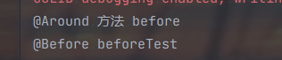

接下来会执行`mi.proceed()`方法继续返回：由于已经执行到了最后一个方法了，所以会调用目标方法：

```java
public void test(Pa pa) {
    System.out.println(pa.id + "," + pa.name);
    System.out.println("testgg");
    obj.testInner(pa);
}
```

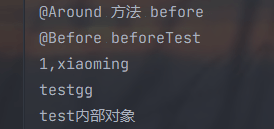

**执行完目标方法之后会沿着上面执行流程一个个的返回回去**，因为是递归调用的。

###### 7 返回到AspectJAroundAdvice

继续执行LogUtil的around()方法的后面部分：

```java
@Around("test()")
public Object aroundTest(ProceedingJoinPoint p) {
    System.out.println("@Around 方法 before");
    Object o = null;
    try {
        o = p.proceed();
    } catch (Throwable e) {
        e.printStackTrace();
    }
    // 执行这部分代码
    System.out.println("@Around 方法 after");
    return o;
}
```

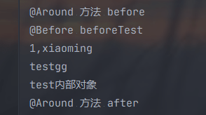

###### 8 返回到AspectJAfterAdvice

执行后面finally部分的代码后，继续返回

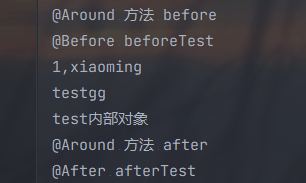

###### 9 返回到AfterReturningAdviceInterceptor

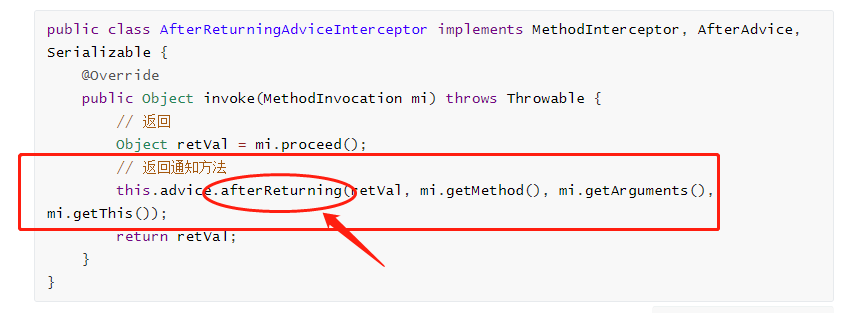

会执行到注解 `@AfterReturning` 方法上，最后打印后，继续返回。

```java
@AfterReturning("test()")
public void afterReturning() {
    System.out.println("@AfterReturning");
}
```

##### 执行顺序

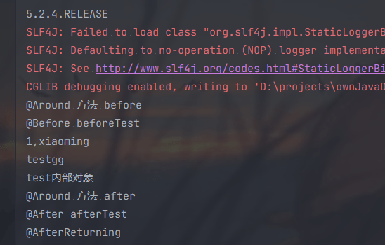

如果有异常的话，@AfterThrowing，执行顺序发生改变。

> @Around 方法 before
>
> @Before beforeTest
>
> 1,xiaoming
>
> @After afterTest
>
> @AfterThrowing 方法

上面是spring的5.2.4.RELEASE版本，下面是5.2.7.RELEASE的版本，执行顺序发生了改变。

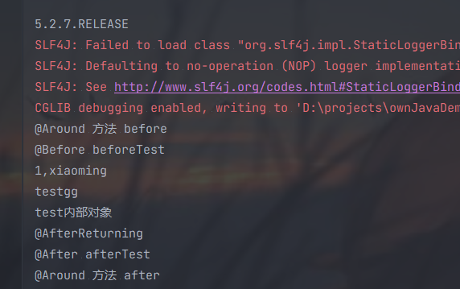

如果发生异常

> @Around 方法 before
>
> @Before beforeTest
>
> 1,xiaoming
>
> @AfterThrowing 方法
>
> @After afterTest

###### 10 返回到AspectJAfterThrowingAdvice

```java
public class AspectJAfterThrowingAdvice extends AbstractAspectJAdvice
		implements MethodInterceptor, AfterAdvice, Serializable {
    @Override
	public Object invoke(MethodInvocation mi) throws Throwable {
		try {
			// 执行下一个通知/拦截器  methodInvocation
			return mi.proceed();
		}
		catch (Throwable ex) {
			// 抛出异常
			if (shouldInvokeOnThrowing(ex)) {
				// 执行异常通知
				invokeAdviceMethod(getJoinPointMatch(), null, ex);
			}
			throw ex;
		}
	}
}
```

没有任何异常，所以不输出。继续返回

###### 11 返回到ExposeInvocationInterceptor

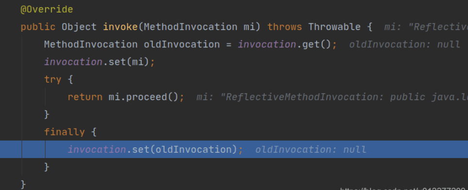

设置一个空值，然后继续返回。然后执行完毕，以上就是拦截器链的执行过程。

上面的执行链图。

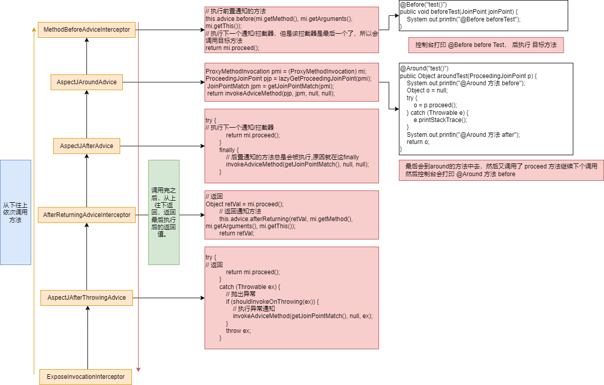

##### 5.2.7 版本之后，返回的执行链的顺序发生了改变

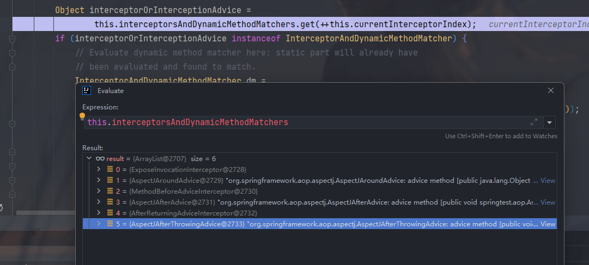

所以上面的执行顺序也发生了改变了。上面的这些类都不是 InterceptorAndDynamicMethodMatcher 类实例，所以走的都是else分支。

```java
public Object proceed() throws Throwable {
   // We start with an index of -1 and increment early.
   if (this.currentInterceptorIndex == this.interceptorsAndDynamicMethodMatchers.size() - 1) {
      return invokeJoinpoint();
   }

   Object interceptorOrInterceptionAdvice =
         this.interceptorsAndDynamicMethodMatchers.get(++this.currentInterceptorIndex);
   if (interceptorOrInterceptionAdvice instanceof InterceptorAndDynamicMethodMatcher) {
      // Evaluate dynamic method matcher here: static part will already have
      // been evaluated and found to match.
      InterceptorAndDynamicMethodMatcher dm =
            (InterceptorAndDynamicMethodMatcher) interceptorOrInterceptionAdvice;
      Class<?> targetClass = (this.targetClass != null ? this.targetClass : this.method.getDeclaringClass());
      if (dm.methodMatcher.matches(this.method, targetClass, this.arguments)) {
         return dm.interceptor.invoke(this);
      }
      else {
         // Dynamic matching failed.
         // Skip this interceptor and invoke the next in the chain.
         return proceed();
      }
   }
   else {
      // It's an interceptor, so we just invoke it: The pointcut will have
      // been evaluated statically before this object was constructed.
      return ((MethodInterceptor) interceptorOrInterceptionAdvice).invoke(this);
   }
}
```

我们通过idea的debug查看方法的调用链：

###### 1 AspectJAroundAdvice 执行

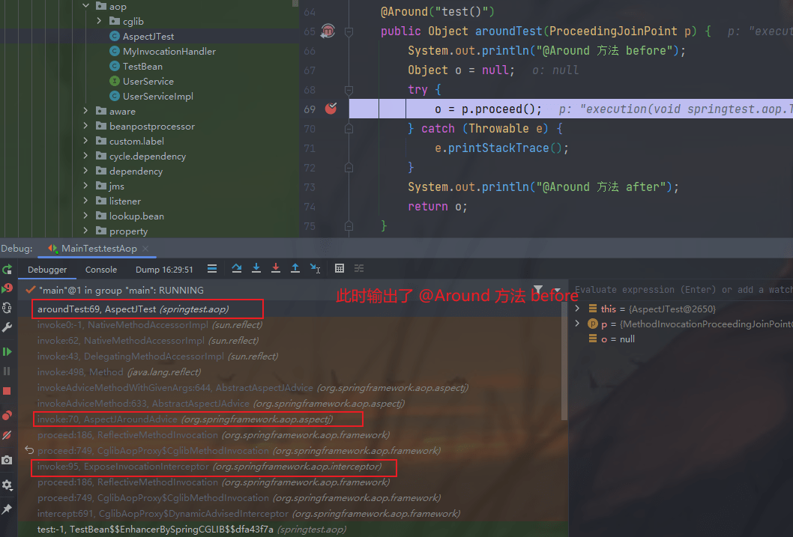

###### 2 AspectJMethodBeforeAdvice

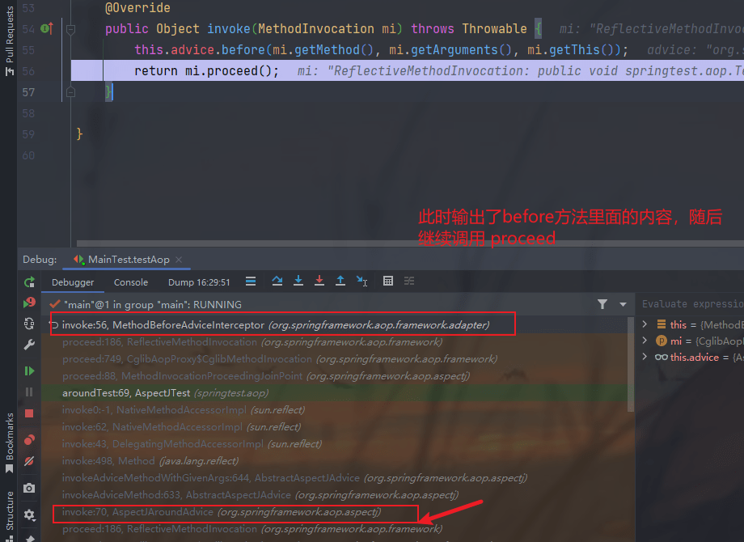

控制台此时的输出：

@Around 方法 before
@Before beforeTest

###### 3 AspectJAfterAdvice

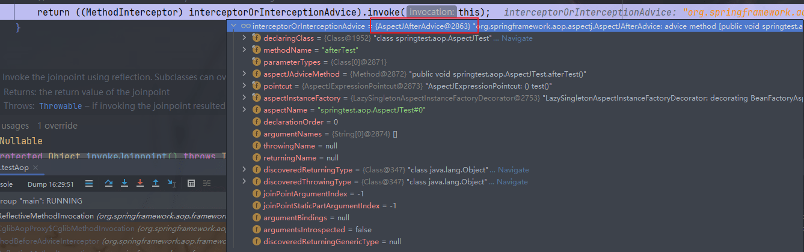

调用它的proceed()方法后，是直接去到了下一个执行链中了。

```java
public Object invoke(MethodInvocation mi) throws Throwable {
   try {
      return mi.proceed();
   }
   finally {
      invokeAdviceMethod(getJoinPointMatch(), null, null);
   }
}
```

可以看到此时的方法调用栈帧是这样的：

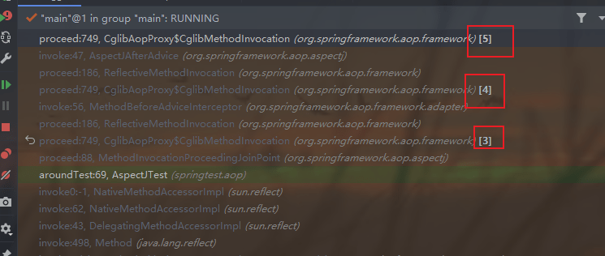

###### 4 AfterReturningAdviceInterceptor

```java
public Object invoke(MethodInvocation mi) throws Throwable {
   Object retVal = mi.proceed();
   this.advice.afterReturning(retVal, mi.getMethod(), mi.getArguments(), mi.getThis());
   return retVal;
}
```

先调用了下一个执行逻辑，然后在调用 afterReturning 方法。

###### 5 AspectJAfterThrowingAdvice

```java
public Object invoke(MethodInvocation mi) throws Throwable {
   try {
      return mi.proceed();
   }
   catch (Throwable ex) {
      if (shouldInvokeOnThrowing(ex)) {
         invokeAdviceMethod(getJoinPointMatch(), null, ex);
      }
      throw ex;
   }
}
```

###### 6 继续往下，下一步终止

这里也是直接调用了下一个逻辑，发现下一个逻辑没有了，走到了最后，终止了递归调用，然后返回。

```java
if (this.currentInterceptorIndex == this.interceptorsAndDynamicMethodMatchers.size() - 1) {
      return invokeJoinpoint();
   }
```

查看此时的调用栈，这个返回了一个null值。

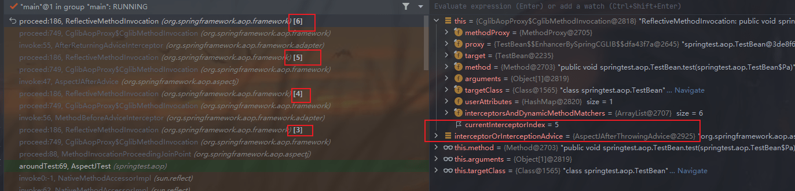

然后依次返回

###### 7 返回 AspectJAfterThrowingAdvice

这里返回到调用层，上面有调用的代码，是没有其他操作的，只有一个catch异常，然后继续返回到上一层调用。

###### 8 返回到 AfterReturningAdviceInterceptor

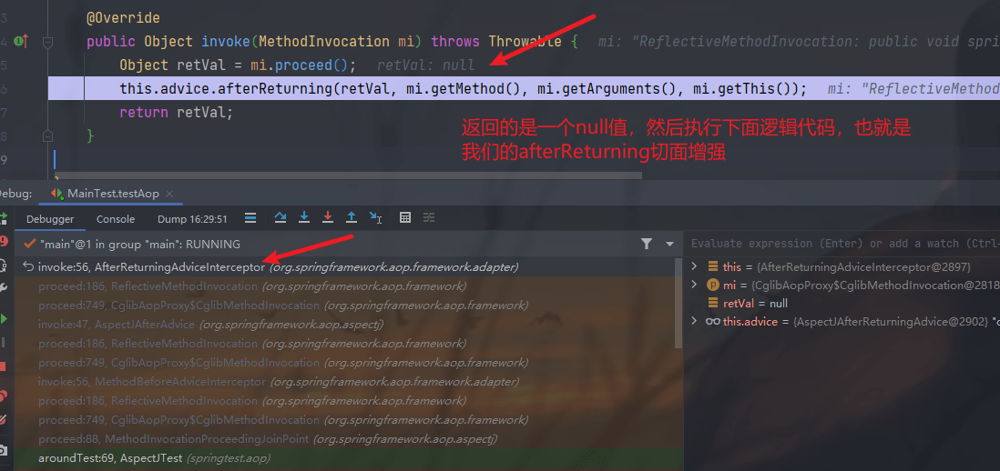

此时的控制台输出只有around before和 before 方法和目标方法的输出

```java
@Around 方法 before
@Before beforeTest
1,xiaoming
testgg
test内部对象
```

执行 afterReturning 方法之后，控制台多出了一个输出。

```java
@Around 方法 before
@Before beforeTest
1,xiaoming
testgg
test内部对象
@AfterReturning
```

然后继续返回到调用的地方，查看代码：

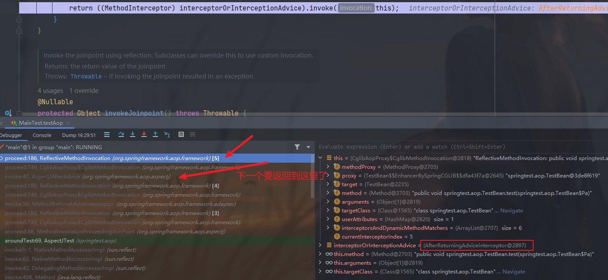

###### 9 返回到 AspectJAfterAdvice

发现这边的代码也是直接返回了的，只是有一个finally代码块：

```java
public Object invoke(MethodInvocation mi) throws Throwable {
   try {
      return mi.proceed();
   }
   finally {
      invokeAdviceMethod(getJoinPointMatch(), null, null);
   }
}
```

执行后finally块之后继续返回到上一层调用方。此时我们发现控制台又多出了一个输出：

```java
@Around 方法 before
@Before beforeTest
1,xiaoming
testgg
test内部对象
@AfterReturning
@After afterTest
```

查看此时调用的代码


###### 10 返回到 MethodBeforeAdviceInterceptor

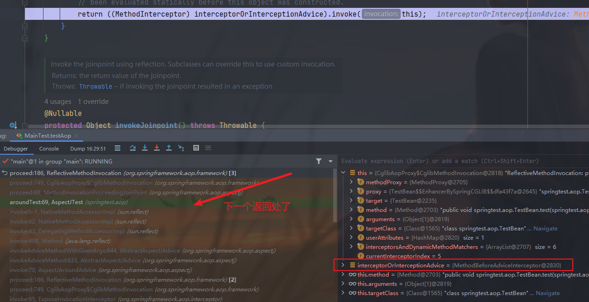

###### 11 around 方法的调用处

先前是从这里继续调用了  p.proceed(); 方法的

```java
@Around("test()")
public Object aroundTest(ProceedingJoinPoint p) {
    System.out.println("@Around 方法 before");
    Object o = null;
    try {
        o = p.proceed();
    } catch (Throwable e) {
        e.printStackTrace();
    }
    System.out.println("@Around 方法 after");
    return o;
}
```

此时的返回值为 null，然后执行下面的输出。查看控制台的输出，继续返回。

```java
@Around 方法 before
@Before beforeTest
1,xiaoming
testgg
test内部对象
@AfterReturning
@After afterTest
@Around 方法 after
```

###### 12 返回到AspectJAroundAdvice  开始调用 around 方法拦截器的地方

```java
protected Object invokeAdviceMethod(JoinPoint jp, @Nullable JoinPointMatch jpMatch,
      @Nullable Object returnValue, @Nullable Throwable t) throws Throwable {

   return invokeAdviceMethodWithGivenArgs(argBinding(jp, jpMatch, returnValue, t));
}
```

查看此时的调用方代码，看到调用栈还有一个，需要返回的。

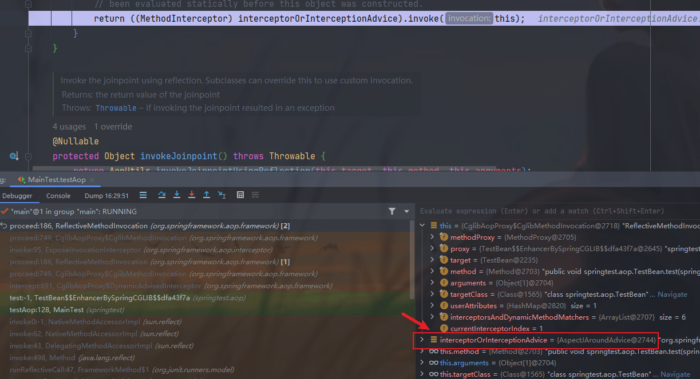

###### 13 返回到 ExposeInvocationInterceptor

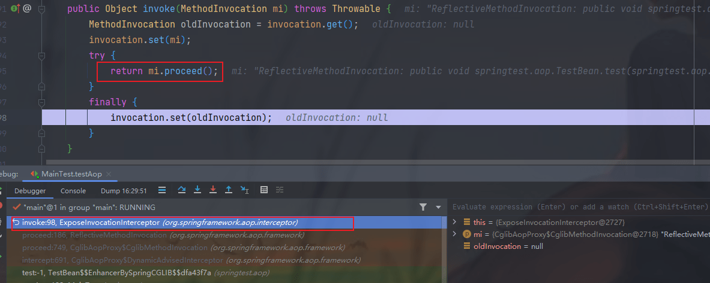

###### 14 最终返回到一开始调用的地方

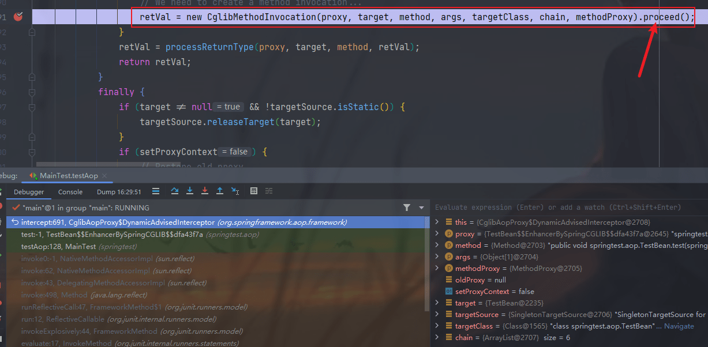

查看此时的返回值为 null。到此新的版本的执行调用顺序就完成了，控制台也输出了完成的输出信息。

```java
@Around 方法 before
@Before beforeTest
1,xiaoming
testgg
test内部对象
@AfterReturning
@After afterTest
@Around 方法 after
```

