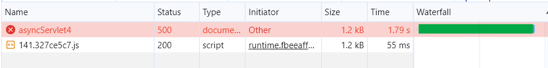
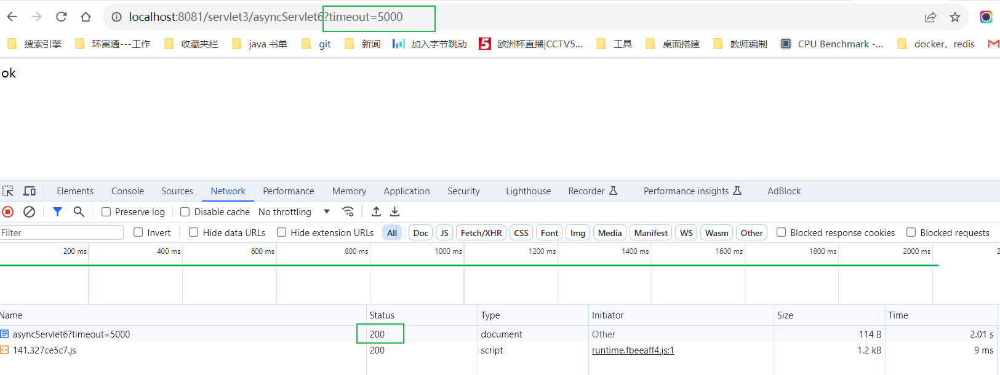

https://cloud.tencent.com/developer/article/1810816

https://blog.csdn.net/weixin_43767015/article/details/113446646

### Servlet3.0 新特性：异步处理

#### 1 早期的 servlet 请求

servlet3.0 之前，一个请求过来之后，处理过程如下图：


从上图可以看出：请求过来后，从主线程池获取一个线程，处理业务，响应请求，然后将线程还回线程池，整个过程都是由同一个主线程在执行。

这里存在一个问题，通常 web [容器](https://cloud.tencent.com/product/tke?from_column=20065&from=20065)中的主线程数量是有限的，若执行业务的比较耗时，大量请求过来之后，主线程被耗光，新来的请求就会处于等待状态。如果一个请求需要进行IO操作，比如访问数据库(或者调用第三方服务接口等)，那么其所对应的线程将同步地等待IO操作完成， 而IO操作是非常慢的，所以此时的线程并不能及时地释放回线程池以供后续使用，在并发量越来越大的情况下，这将带来严重的性能问题。

在在tomcat7/8中，能够同时处理到达的请求的线程数量默认为200），默认情况下，在响应完成前，该线程资源都不会被释放。**也就是说，处理HTTP请求和执行具体业务代码的线程是同一个线程！**

而 servlet3.0 中对这个过程做了改进，主线程可以将请求转交给其他线程去处理，比如开发者可以自定义一个线程，然后在自定义的线程中处理请求。

#### 2 servlet 3.0 异步处理流程

在接收到请求之后，Servlet线程可以将耗时的操作委派给另一个线程来完成，自己在不生成响应的情况下返回至容器，以便能处理另一个请求。此时当前请求的响应将被延后，在异步处理完成后时再对客户端进行响应（异步线程拥有 ServletRequest 和 ServletResponse 对象的引用）。

开启异步请求处理之后，Servlet 线程不再是一直处于阻塞状态以等待业务逻辑的处理，而是启动异步线程之后可以立即返回。异步处理的特性可以帮助应用节省容器中的线程，特别适合执行时间长而且用户需要得到响应结果的任务，这将大大减少服务器资源的占用，并且提高并发处理速度。如果用户不需要得到结果，那么直接将一个Runnable对象交给内存中的Executor并立即返回响应即可。

**我们还能发现，实际上这里的异步请求处理对于客户端浏览器来说仍然是同步输出，它并没有提升响应速度，用户是没有感知的，但是异步请求处理解放了服务器端的请求处理线程的使用，处理请求线程并没有卡在业务代码那里等待，当前的业务逻辑被转移给其他线程去处理了，能够让tomcat同时接受更多的请求，从而提升了并发处理请求的能力**！

Servlet3.0 中提供的异步请求处理机制又被实际应用过吗？实际上是有的，并且被应用的很广泛：

1. Apollo配置更新使用异步Servlet技术。
2. Dubbo服务端提供者的异步调用参考了异步Servlet。
3. Nacos配置更新使用异步Servlet技术。


#### 3 servlet3.0 异步处理使用步骤

##### （1）开启异步支持

设置@WebServlet 的 asyncSupported 属性为 true，表示支持异步处理

```java
@WebServlet(name = "AsynchronousServlet", value = {"/asynchronousServlet"}, asyncSupported = true)
```

##### （2）启动异步请求

启动异步处理：调用 req.startAsync(request,response)方法，获取异步处理上下文对象 AsyncContext

```java
AsyncContext asyncCtx = request.startAsync();
// 或者
AsyncContext asyncContext = request.startAsync(request, response);
```

##### （3）异步处理业务&完成异步处理

其他线程中执行业务操作，输出结果，并调用 asyncContext.complete()完成异步处理，比如下面 2 种方式：

方式 1：启动一个新的线程来处理请求，代码如下：

```java
new Thread(()->{
 System.out.println("子线程：" + Thread.currentThread() + "-" + System.currentTimeMillis() + "-start");
    try {
        //这里休眠2秒，模拟业务耗时
        TimeUnit.SECONDS.sleep(2);
        //这里是子线程，请求在这里被处理了
        asyncContext.getResponse().getWriter().write("ok");
        //调用complete()方法，表示请求请求处理完成
        asyncContext.complete();
    } catch (Exception e) {
        e.printStackTrace();
    }
    System.out.println("子线程：" + Thread.currentThread() + "-" + 		System.currentTimeMillis() + "-end");
})
```

方式 2：如下代码，调用 asyncContext.start 方法来处理请求，传递的是一个 Runnable 对象，asyncContext.start 会将传递的 Runnable 放在新的线程中去执行

```java
asyncContext.start(() -> {
    System.out.println("子线程：" + Thread.currentThread() + "-" + System.currentTimeMillis() + "-start");
    try {
        //这里休眠2秒，模拟业务耗时
        TimeUnit.SECONDS.sleep(2);
        //这里是子线程，请求在这里被处理了
        asyncContext.getResponse().getWriter().write("ok");
        //5、调用complete()方法，表示请求请求处理完成
        asyncContext.complete();
    } catch (Exception e) {
        e.printStackTrace();
    }
    System.out.println("子线程：" + Thread.currentThread() + "-" + System.currentTimeMillis() + "-end");
});
```

#### 4 代码实战

##### 1 模拟耗时的请求任务

```java
@WebServlet(name = "AsynchronousServlet", value = {"/asynchronousServlet"}, asyncSupported = true)
public class AsynchronousServlet extends HttpServlet {
    protected void doPost(HttpServletRequest request, HttpServletResponse response) throws ServletException, IOException {

    }

    protected void doGet(HttpServletRequest request, HttpServletResponse response) throws ServletException, IOException {
        System.out.println(("主线程开始。。。"));

        long startTime = System.currentTimeMillis();
        System.out.println("AsynchronousServlet Start::Name="
                + Thread.currentThread().getName() + "::ID="
                + Thread.currentThread().getId());

        request.setAttribute("org.apache.catalina.ASYNC_SUPPORTED", true);

        String time = request.getParameter("time");
        int secs = Integer.parseInt(time);
        // max 10 seconds
        if (secs > 10000) {
            secs = 10000;
        }

        AsyncContext asyncCtx = request.startAsync();
        asyncCtx.addListener(new AsynchronousThreadListener());
        // 异步servlet的超时时间,异步Servlet有对应的超时时间，如果在指定的时间内没有执行完操作，response依然会走原来Servlet的结束逻辑，后续的异步操作执行完再写回的时候，可能会遇到异常。
        asyncCtx.setTimeout(9000);

        ThreadPoolExecutor executor = (ThreadPoolExecutor) request
                .getServletContext().getAttribute("executor");

        executor.execute(new AsyncRequestProcessor(asyncCtx, secs));
        // 或者使用new Thread()进行启动一个线程
//        new Thread(new AsyncRequestProcessor(asyncCtx, secs)).start();

        long endTime = System.currentTimeMillis();
        System.out.println("AsynchronousServlet End::Name="
                + Thread.currentThread().getName() + "::ID="
                + Thread.currentThread().getId() + "::Time Taken="
                + (endTime - startTime) + " ms.");
        System.out.println(("主线程结束。。。"));
    }
}
```

AsyncRequestProcessor类实现了 runnable，也是上面方法1的变体

```java
import javax.servlet.AsyncContext;
import javax.servlet.http.HttpServletRequest;

public class AsyncRequestProcessor implements Runnable {

    private AsyncContext asyncContext;
    private long time;

    public AsyncRequestProcessor(AsyncContext asyncContext, long time) {
        this.asyncContext = asyncContext;
        this.time = time;
    }

    public AsyncRequestProcessor() {
    }

    /**
     * 如果使用了servlet中的对象，request或者response对象，线程就会阻塞
     */
    @Override
    public void run() {
        System.out.println("Async Supported? "
                + asyncContext.getRequest().isAsyncSupported());

        try {
            Thread.sleep(time);

            /*PrintWriter writer = asyncContext.getResponse().getWriter();
            writer.print("Processing done for " + time + " milliseconds!!");*/
            HttpServletRequest request = (HttpServletRequest) asyncContext.getRequest();
            request.getSession().setAttribute("name", "兰文权");
        } catch (Exception e) {
            e.printStackTrace();
        }
        // 通知异步线程执行完毕,用于结束异步操作，并将与当前异步对象相关的request与response对象销毁
        asyncContext.complete();
        // 在结束异步操作的同时，会将参数所制定的页面内容包含到当前异步对象相关的标准输出流中
//        asyncContext.dispatch();
    }
}
```

同时可以添加执行任务线程的监听器 AsynchronousThreadListener。

```java
import javax.servlet.AsyncEvent;
import javax.servlet.AsyncListener;
import java.io.IOException;

/**
 * @program: javaDemo->AsynchronousThreadListener
 * @description: 子线程的监听器，异步监听器
 * @author: lanwenquan
 * @date: 2020-03-17 20:27
 */
public class AsynchronousThreadListener implements AsyncListener {
    @Override
    public void onComplete(AsyncEvent asyncEvent) throws IOException {
        System.out.println("AppAsyncListener onComplete");
    }

    @Override
    public void onTimeout(AsyncEvent asyncEvent) throws IOException {
        System.out.println("AppAsyncListener onTimeout");
    }

    @Override
    public void onError(AsyncEvent asyncEvent) throws IOException {
        System.out.println("AppAsyncListener onError");
    }

    @Override
    public void onStartAsync(AsyncEvent asyncEvent) throws IOException {
        System.out.println("AppAsyncListener onStartAsync");
    }
}
```

在servlet初始化之后添加线程池，上面使用的线程池就是在这里添加并获取的。

```java
import javax.servlet.ServletContextEvent;
import javax.servlet.ServletContextListener;
import javax.servlet.annotation.WebListener;
import java.util.concurrent.ArrayBlockingQueue;
import java.util.concurrent.ThreadPoolExecutor;
import java.util.concurrent.TimeUnit;

// 这里需要加上注解，不然会识别不到
@WebListener()
public class AsynchronousServletListener implements ServletContextListener {

    // Public constructor is required by servlet spec
    public AsynchronousServletListener() {
    }

    // -------------------------------------------------------
    // ServletContextListener implementation
    // -------------------------------------------------------
    public void contextInitialized(ServletContextEvent sce) {
      /* This method is called when the servlet context is
         initialized(when the Web application is deployed). 
         You can initialize servlet context related data here.
      */
      // 在这边初始化线程池
        ThreadPoolExecutor threadPoolExecutor = new ThreadPoolExecutor(100, 200, 50000L, TimeUnit.MILLISECONDS,
                new ArrayBlockingQueue<Runnable>(100));
        sce.getServletContext().setAttribute("executor", threadPoolExecutor);
    }

    public void contextDestroyed(ServletContextEvent sce) {
      /* This method is invoked when the Servlet Context 
         (the Web application) is undeployed or 
         Application Server shuts down.
      */
    }

}
```

##### 案例1 **使用 asyncContext.start 处理异步请求**

下面案例代码会输出 4 条日志，注意日志中包含的信息：时间、线程信息、耗时，通过这些信息可以分析主线程什么时候结束的。

```java
package asychronous_servlet;

import javax.servlet.AsyncContext;
import javax.servlet.ServletException;
import javax.servlet.annotation.WebServlet;
import javax.servlet.http.HttpServlet;
import javax.servlet.http.HttpServletRequest;
import javax.servlet.http.HttpServletResponse;
import java.io.IOException;
import java.util.concurrent.TimeUnit;

/**
 * 公众号：路人甲java，专注于java干货分享
 * 个人博客：http://itsoku.com/
 * 已推出的系列有：【spring系列】、【java高并发系列】、【MySQL系列】、【MyBatis系列】、【Maven系列】
 * git地址：https://gitee.com/javacode2018
 */
//1.设置@WebServlet的asyncSupported属性为true，表示支持异步处理
@WebServlet(name = "AsyncServlet1",
        urlPatterns = "/asyncServlet1",
        asyncSupported = true
)
public class AsyncServlet1 extends HttpServlet {
    @Override
    protected void service(HttpServletRequest request, HttpServletResponse response) throws ServletException, IOException {
        long st = System.currentTimeMillis();
        System.out.println("主线程：" + Thread.currentThread() + "-" + System.currentTimeMillis() + "-start");
        //2、启动异步处理：调用req.startAsync(request,response)方法，获取异步处理上下文对象AsyncContext
        AsyncContext asyncContext = request.startAsync(request, response);
        //3、调用start方法异步处理，调用这个方法之后主线程就结束了
        asyncContext.start(() -> {
            long stSon = System.currentTimeMillis();
            System.out.println("子线程：" + Thread.currentThread() + "-" + System.currentTimeMillis() + "-start");
            try {
                //这里休眠2秒，模拟业务耗时
                TimeUnit.SECONDS.sleep(2);
                //这里是子线程，请求在这里被处理了
                asyncContext.getResponse().getWriter().write(System.currentTimeMillis() + ",ok");
                //4、调用complete()方法，表示异步请求处理完成
                asyncContext.complete();
            } catch (Exception e) {
                e.printStackTrace();
            }
            System.out.println("子线程：" + Thread.currentThread() + "-" + System.currentTimeMillis() + "-end,耗时(ms):" + (System.currentTimeMillis() - stSon));
        });
        System.out.println("主线程：" + Thread.currentThread() + "-" + System.currentTimeMillis() + "-end,耗时(ms):" + (System.currentTimeMillis() - st));

    }
}
```

访问后输出

```java
主线程：Thread[http-nio-8081-exec-5,5,main]-1702304795609-start
主线程：Thread[http-nio-8081-exec-5,5,main]-1702304795612-end,耗时(ms):3
子线程：Thread[http-nio-8081-exec-6,5,main]-1702304795612-start
子线程：Thread[http-nio-8081-exec-6,5,main]-1702304797615-end,耗时(ms):2003
```

主线程耗时 0 毫秒，并不是耗时是 0，而是小于 1 毫秒，太快了，子线程中 sleep 了 2 秒，所以耗时是 2000 毫秒。

大家注意看下浏览器中的请求，在`asyncContext.complete();`被调用之前，浏览器中的请求一直处于阻塞状态，当这个方法执行完毕之后，浏览器端才会受到响应。如果没有`asyncContext.complete();`这行代码，请求等上一段时间会超时，异步请求是默认是有超时时间的，tomcat 默认是 30 秒，大家可以试试，在浏览器中通过 F12 可以看到 30 秒后会响应超时。

##### **案例 2：自定义线程处理异步请求**

案例 1 中，我们使用`asyncContext.start`来处理异步请求，start 方法内部会使用 web 容器中默认的线程池来处理请求，我们也可以自定义线程来处理异步请求，将案例 1 中`asyncContext.start`代码替换为下面代码，大家也可以自定义一个线程池，将请求丢到线程池中去处理。

```java
protected void service(HttpServletRequest request, HttpServletResponse response) throws ServletException, IOException {
    long st = System.currentTimeMillis();
    System.out.println("主线程：" + Thread.currentThread() + "-" + System.currentTimeMillis() + "-start");
    //2、启动异步处理：调用req.startAsync(request,response)方法，获取异步处理上下文对象AsyncContext
    AsyncContext asyncContext = request.startAsync(request, response);
    //3、自定义一个线程来处理异步请求
    Thread thread = new Thread(() -> {
        long stSon = System.currentTimeMillis();
        System.out.println("子线程：" + Thread.currentThread() + "-" + System.currentTimeMillis() + "-start");
        try {
            //这里休眠2秒，模拟业务耗时
            TimeUnit.SECONDS.sleep(2);
            //这里是子线程，请求在这里被处理了
            asyncContext.getResponse().getWriter().write(System.currentTimeMillis() + ",ok");
            //4、调用complete()方法，表示异步请求处理完成
            asyncContext.complete();
        } catch (Exception e) {
            e.printStackTrace();
        }
        System.out.println("子线程：" + Thread.currentThread() + "-" + System.currentTimeMillis() + "-end,耗时(ms):" + (System.currentTimeMillis() - stSon));
    });
    thread.setName("自定义线程");
    thread.start();
    System.out.println("主线程：" + Thread.currentThread() + "-" + System.currentTimeMillis() + "-end,耗时(ms):" + (System.currentTimeMillis() - st));
}
```

##### **案例 3：通过 asyncContext.dispatch 结束异步请求**

上面 2 个案例都是通过`asyncContext.complete()`来结束异步请求的，结束请求还有另外一种方式，子线程中处理完毕业务之后，将结果放在 request 中，然后调用`asyncContext.dispatch()`转发请求，此时请求又会进入当前 servlet，此时需在代码中判断请求是不是异步转发过来的，如果是的，则从 request 中获取结果，然后输出，这种方式就是 springmvc 处理异步的方式，所以这种看懂了，springmvc 就一目了然了，代码如下

```java
import javax.servlet.AsyncContext;
import javax.servlet.DispatcherType;
import javax.servlet.ServletException;
import javax.servlet.annotation.WebServlet;
import javax.servlet.http.HttpServlet;
import javax.servlet.http.HttpServletRequest;
import javax.servlet.http.HttpServletResponse;
import java.io.IOException;
import java.util.concurrent.TimeUnit;

//1.设置@WebServlet的asyncSupported属性为true，表示支持异步处理
@WebServlet(name = "AsyncServlet3",
        urlPatterns = "/asyncServlet3",
        asyncSupported = true
)
public class AsyncServlet3 extends HttpServlet {
    @Override
    protected void service(HttpServletRequest request, HttpServletResponse response) throws ServletException, IOException {
        System.out.println("请求类型：" + request.getDispatcherType());
        //@1：判断请求类型，如果是异步类型（DispatcherType.ASYNC），则说明是异步转发过来的，将结果输出
        if (request.getDispatcherType() == DispatcherType.ASYNC) {
            System.out.println("响应结果：" + Thread.currentThread() + "-" + System.currentTimeMillis() + "-start");
            //从request中获取结果，然后输出
            Object result = request.getAttribute("result");
            response.getWriter().write(result.toString());
            System.out.println("响应结果：" + Thread.currentThread() + "-" + System.currentTimeMillis() + "-end");
        } else {
            long st = System.currentTimeMillis();
            System.out.println("主线程：" + Thread.currentThread() + "-" + System.currentTimeMillis() + "-start");
            //2、启动异步处理：调用req.startAsync(request,response)方法，获取异步处理上下文对象AsyncContext
            AsyncContext asyncContext = request.startAsync(request, response);
            //3、调用start方法异步处理，调用这个方法之后主线程就结束了
            asyncContext.start(() -> {
                long stSon = System.currentTimeMillis();
                System.out.println("子线程：" + Thread.currentThread() + "-" + System.currentTimeMillis() + "-start");
                try {
                    //这里休眠2秒，模拟业务耗时
                    TimeUnit.SECONDS.sleep(2);
                    //将结果丢到request中
                    asyncContext.getRequest().setAttribute("result", "ok");
                    //转发请求，调用这个方法之后，请求又会被转发到当前的servlet，又会进入当前servlet的service方法
                    //此时请求的类型（request.getDispatcherType()）是DispatcherType.ASYNC，所以通过这个值可以判断请求是异步转发过来的
                    //然后在request中将结果取出，对应代码@1，然后输出
                    asyncContext.dispatch();
                } catch (Exception e) {
                    e.printStackTrace();
                }
                System.out.println("子线程：" + Thread.currentThread() + "-" + System.currentTimeMillis() + "-end,耗时(ms):" + (System.currentTimeMillis() - stSon));
            });
            System.out.println("主线程：" + Thread.currentThread() + "-" + System.currentTimeMillis() + "-end,耗时(ms):" + (System.currentTimeMillis() - st));
        }
    }
}
```

访问后输出

```java
请求类型：REQUEST
主线程：Thread[http-nio-8081-exec-10,5,main]-1702305098501-start
主线程：Thread[http-nio-8081-exec-10,5,main]-1702305098502-end,耗时(ms):1
子线程：Thread[http-nio-8081-exec-1,5,main]-1702305098502-start
子线程：Thread[http-nio-8081-exec-1,5,main]-1702305100515-end,耗时(ms):2013
请求类型：ASYNC
响应结果：Thread[http-nio-8081-exec-2,5,main]-1702305100517-start
响应结果：Thread[http-nio-8081-exec-2,5,main]-1702305100518-end
```

##### **案例 4：设置异步处理超时时间**

```java
asyncContext.setTimeout(超时时间，毫秒，默认是30秒);
```

我们案例 1 的代码进行改造，添加一行代码，如下，设置超时时间为 1 秒



##### **案例 5：设置监听器**

还可以为异步处理添加监听器，当异步处理完成、发生异常错误、出现超时的时候，会回调监听器中对应的方法，如下：

```java
import javax.servlet.AsyncContext;
import javax.servlet.AsyncEvent;
import javax.servlet.AsyncListener;
import javax.servlet.ServletException;
import javax.servlet.annotation.WebServlet;
import javax.servlet.http.HttpServlet;
import javax.servlet.http.HttpServletRequest;
import javax.servlet.http.HttpServletResponse;
import java.io.IOException;
import java.util.concurrent.TimeUnit;

//1.设置@WebServlet的asyncSupported属性为true，表示支持异步处理
@WebServlet(name = "AsyncServlet5",
        urlPatterns = "/asyncServlet5",
        asyncSupported = true
)
public class AsyncServlet5 extends HttpServlet {
    @Override
    protected void service(HttpServletRequest request, HttpServletResponse response) throws ServletException, IOException {
        long st = System.currentTimeMillis();
        System.out.println("主线程：" + Thread.currentThread() + "-" + System.currentTimeMillis() + "-start");
        //2、启动异步处理：调用req.startAsync(request,response)方法，获取异步处理上下文对象AsyncContext
        AsyncContext asyncContext = request.startAsync(request, response);
        response.setContentType("text/html;charset=UTF-8");
        //@1:设置异步处理超时时间
        Long timeout = Long.valueOf(request.getParameter("timeout"));
        asyncContext.setTimeout(timeout);
        //添加监听器
        asyncContext.addListener(new AsyncListener() {
            @Override
            public void onComplete(AsyncEvent event) throws IOException {
                //异步处理完成会被回调
                System.out.println(Thread.currentThread() + "-" + System.currentTimeMillis() + "-onComplete()");
                event.getAsyncContext().getResponse().getWriter().write("<br>onComplete");
            }

            @Override
            public void onTimeout(AsyncEvent event) throws IOException {
                //超时会被回调
                System.out.println(Thread.currentThread() + "-" + System.currentTimeMillis() + "-onTimeout()");
                event.getAsyncContext().getResponse().getWriter().write("<br>onTimeout");
            }

            @Override
            public void onError(AsyncEvent event) throws IOException {
                //发生错误会被回调
                System.out.println(Thread.currentThread() + "-" + System.currentTimeMillis() + "-onError()");
                event.getAsyncContext().getResponse().getWriter().write("<br>onError");
            }

            @Override
            public void onStartAsync(AsyncEvent event) throws IOException {
                //开启异步请求调用的方法
                System.out.println(Thread.currentThread() + "-" + System.currentTimeMillis() + "-onStartAsync()");
                event.getAsyncContext().getResponse().getWriter().write("<br>onStartAsync");
            }
        });
        //3、调用start方法异步处理，调用这个方法之后主线程就结束了
        asyncContext.start(() -> {
            long stSon = System.currentTimeMillis();
            System.out.println("子线程：" + Thread.currentThread() + "-" + System.currentTimeMillis() + "-start");
            try {
                //@2:这里休眠2秒，模拟业务耗时
                TimeUnit.SECONDS.sleep(2);
                //这里是子线程，请求在这里被处理了
                asyncContext.getResponse().getWriter().write(System.currentTimeMillis() + ",ok");
                //4、调用complete()方法，表示异步请求处理完成
                asyncContext.complete();
            } catch (Exception e) {
                e.printStackTrace();
            }
            System.out.println("子线程：" + Thread.currentThread() + "-" + System.currentTimeMillis() + "-end,耗时(ms):" + (System.currentTimeMillis() - stSon));
        });
        System.out.println("主线程：" + Thread.currentThread() + "-" + System.currentTimeMillis() + "-end,耗时(ms):" + (System.currentTimeMillis() - st));

    }
}
```

访问  http://localhost:8081/servlet3/asyncServlet5?timeout=100  后输出：

```java
主线程：Thread[http-nio-8081-exec-3,5,main]-1702305443119-start
主线程：Thread[http-nio-8081-exec-3,5,main]-1702305443120-end,耗时(ms):1
子线程：Thread[http-nio-8081-exec-4,5,main]-1702305443120-start
Thread[http-nio-8081-exec-5,5,main]-1702305443900-onTimeout()
Thread[http-nio-8081-exec-5,5,main]-1702305443900-onComplete()
java.lang.IllegalStateException: The request associated with the AsyncContext has already completed processing.
	at org.apache.catalina.core.AsyncContextImpl.check(AsyncContextImpl.java:523)
	at org.apache.catalina.core.AsyncContextImpl.getResponse(AsyncContextImpl.java:229)
	at asychronous_servlet.AsyncServlet5.lambda$service$0(AsyncServlet5.java:74)
	at org.apache.catalina.core.AsyncContextImpl$RunnableWrapper.run(AsyncContextImpl.java:549)
	at java.util.concurrent.ThreadPoolExecutor.runWorker(ThreadPoolExecutor.java:1149)
	at java.util.concurrent.ThreadPoolExecutor$Worker.run(ThreadPoolExecutor.java:624)
	at org.apache.tomcat.util.threads.TaskThread$WrappingRunnable.run(TaskThread.java:61)
	at java.lang.Thread.run(Thread.java:748)
子线程：Thread[http-nio-8081-exec-4,5,main]-1702305445135-end,耗时(ms):2015
```

代码中出现了异常，为什么？

是因为发生超时的时候，onTimeOut 方法执行完毕之后，异步处理就结束了，此时，子线程还在运行，子线程执行到下面这样代码，向客户端输出信息，所以报错了。

```java
asyncContext.getResponse().getWriter().write(System.currentTimeMillis() + ",ok");
```

##### **案例 6：对案例 5 进行改造**

对案例 5 进行改造，如下代码，看一下`@3`处的代码，通过一个原子变量来控制请求是否处理完毕了，代码中有 3 处可能会修改这个变量，通过 cas 操作来控制谁会修改成功，修改成功者，将结果设置到 request.setAttribute 中，然后调用`asyncContext.dispatch();`转发请求，这种处理方式很好的解决案例 5 中异常问题，springmvc 中异步处理过程这个过程类似，所以这段代码大家一定要好好看看，若能够理解，springmvc 中异步处理的代码可以秒懂。

```java
import javax.servlet.AsyncContext;
import javax.servlet.AsyncEvent;
import javax.servlet.AsyncListener;
import javax.servlet.DispatcherType;
import javax.servlet.ServletException;
import javax.servlet.annotation.WebServlet;
import javax.servlet.http.HttpServlet;
import javax.servlet.http.HttpServletRequest;
import javax.servlet.http.HttpServletResponse;
import java.io.IOException;
import java.util.concurrent.TimeUnit;
import java.util.concurrent.atomic.AtomicBoolean;

//1.设置@WebServlet的asyncSupported属性为true，表示支持异步处理
@WebServlet(name = "AsyncServlet6",
        urlPatterns = "/asyncServlet6",
        asyncSupported = true
)
public class AsyncServlet6 extends HttpServlet {
    @Override
    protected void service(HttpServletRequest request, HttpServletResponse response) throws ServletException, IOException {
        if (request.getDispatcherType() == DispatcherType.ASYNC) {
            response.setContentType("text/html;charset=UTF-8");
            response.getWriter().write(request.getAttribute("result").toString());
        } else {
            long st = System.currentTimeMillis();
            System.out.println("主线程：" + Thread.currentThread() + "-" + System.currentTimeMillis() + "-start");
            //2、启动异步处理：调用req.startAsync(request,response)方法，获取异步处理上下文对象AsyncContext
            AsyncContext asyncContext = request.startAsync(request, response);

            //@1:设置异步处理超时时间
            Long timeout = Long.valueOf(request.getParameter("timeout"));
            asyncContext.setTimeout(timeout);
            //用来异步处理是否已完成，在这3个地方（子线程中处理完毕时、onComplete、onTimeout）将其更新为true
            AtomicBoolean completed = new AtomicBoolean(false);
            //添加监听器
            asyncContext.addListener(new AsyncListener() {
                @Override
                public void onComplete(AsyncEvent event) throws IOException {
                    //异步处理完成会被回调
                    System.out.println(Thread.currentThread() + "-" + System.currentTimeMillis() + "-onComplete()");
                    if (completed.compareAndSet(false, true)) { // 更新
                        event.getAsyncContext().getRequest().setAttribute("result", "onComplete");
                        //转发请求
                        asyncContext.dispatch();
                    }
                }

                @Override
                public void onTimeout(AsyncEvent event) throws IOException {
                    //超时会被回调
                    System.out.println(Thread.currentThread() + "-" + System.currentTimeMillis() + "-onTimeout()");
                    if (completed.compareAndSet(false, true)) {
                        event.getAsyncContext().getRequest().setAttribute("result", "onTimeout");
                        //转发请求
                        asyncContext.dispatch();
                    }
                }

                @Override
                public void onError(AsyncEvent event) throws IOException {
                    //发生错误会被回调
                    System.out.println(Thread.currentThread() + "-" + System.currentTimeMillis() + "-onError()");
                    event.getAsyncContext().getResponse().getWriter().write("<br>onError");
                }

                @Override
                public void onStartAsync(AsyncEvent event) throws IOException {
                    //开启异步请求调用的方法
                    System.out.println(Thread.currentThread() + "-" + System.currentTimeMillis() + "-onStartAsync()");
                    event.getAsyncContext().getResponse().getWriter().write("<br>onStartAsync");
                }
            });
            //3、调用start方法异步处理，调用这个方法之后主线程就结束了
            asyncContext.start(() -> {
                long stSon = System.currentTimeMillis();
                System.out.println("子线程：" + Thread.currentThread() + "-" + System.currentTimeMillis() + "-start");
                try {
                    //@2:这里休眠2秒，模拟业务耗时
                    TimeUnit.SECONDS.sleep(2);
                    if (completed.compareAndSet(false, true)) {
                        asyncContext.getRequest().setAttribute("result", "ok");
                        //转发请求
                        asyncContext.dispatch();
                    }
                } catch (Exception e) {
                    e.printStackTrace();
                }
                System.out.println("子线程：" + Thread.currentThread() + "-" + System.currentTimeMillis() + "-end,耗时(ms):" + (System.currentTimeMillis() - stSon));
            });
            System.out.println("主线程：" + Thread.currentThread() + "-" + System.currentTimeMillis() + "-end,耗时(ms):" + (System.currentTimeMillis() - st));
        }
    }
}
```

**模拟超时请求**

访问 http://localhost:8081/servlet3/asyncServlet6?timeout=100 输出

```java
主线程：Thread[http-nio-8081-exec-1,5,main]-1702305782371-start
主线程：Thread[http-nio-8081-exec-1,5,main]-1702305782371-end,耗时(ms):0
子线程：Thread[http-nio-8081-exec-3,5,main]-1702305782371-start
Thread[http-nio-8081-exec-5,5,main]-1702305783027-onTimeout()
Thread[http-nio-8081-exec-5,5,main]-1702305783028-onComplete()
子线程：Thread[http-nio-8081-exec-3,5,main]-1702305784384-end,耗时(ms):2013
```


**模拟非超时请求**

http://localhost:8081/servlet3/asyncServlet6?timeout=5000

输出

```jav
主线程：Thread[http-nio-8081-exec-7,5,main]-1702305943207-start
主线程：Thread[http-nio-8081-exec-7,5,main]-1702305943207-end,耗时(ms):0
子线程：Thread[http-nio-8081-exec-9,5,main]-1702305943207-start
子线程：Thread[http-nio-8081-exec-9,5,main]-1702305945213-end,耗时(ms):2006
Thread[http-nio-8081-exec-8,5,main]-1702305945213-onComplete()
```

页面返回



##### **案例 7：模拟一个业务场景**

###### **业务场景**

ServiceA 接受到一个请求之后，将请求发送到 mq，然后主线程就结束了，另外一个服务 ServiceB 从 mq 中取出这条消息，然后对消息进行处理，将处理结果又丢到 mq 中，ServiceA 中监听器监听 mq 中的结果，然后将结果再输出。

```java
package asychronous_servlet;

import javax.servlet.AsyncContext;
import javax.servlet.ServletException;
import javax.servlet.annotation.WebServlet;
import javax.servlet.http.HttpServlet;
import javax.servlet.http.HttpServletRequest;
import javax.servlet.http.HttpServletResponse;
import java.io.IOException;
import java.util.Map;
import java.util.concurrent.ConcurrentHashMap;

//1.设置@WebServlet的asyncSupported属性为true，表示支持异步处理
@WebServlet(name = "AsyncServlet7",
        urlPatterns = "/asyncServlet7",
        asyncSupported = true
)
public class AsyncServlet7 extends HttpServlet {
    Map<String, AsyncContext> orderIdAsyncContextMap = new ConcurrentHashMap<>();

    @Override
    protected void service(HttpServletRequest request, HttpServletResponse response) throws ServletException, IOException {
        String orderId = request.getParameter("orderId");
        String result = request.getParameter("result");
        AsyncContext async;
        if (orderId != null && result != null && (async = orderIdAsyncContextMap.get(orderId)) != null) {
            async.getResponse().getWriter().write(String.format("<br/>" +
                    "%s:%s:result:%s", Thread.currentThread(), System.currentTimeMillis(), result));
            async.complete();
        } else {
            AsyncContext asyncContext = request.startAsync(request, response);
            orderIdAsyncContextMap.put("1", asyncContext);
            asyncContext.getResponse().setContentType("text/html;charset=utf-8");
            asyncContext.getResponse().getWriter().write(String.format("%s:%s:%s", Thread.currentThread(), System.currentTimeMillis(), "start"));
        }
    }
}
```

测试过程

```java
step1、启动项目
step2、浏览器中访问：http://localhost:8080/asyncServlet7，会发现浏览器中请求一直处于等待中
step3、等待5秒，用来模拟ServiceB处理耗时
step4、浏览器中访问：http://localhost:8080/asyncServlet7?orderId=1&result=success；用来模拟将结果通知给请求者，这步执行完毕之后，step2会立即收到响应
```


**这里稍微扩展下**

可能有些朋友已经想到了，通常我们的项目是集群部署的，假如这个业务场景中 ServiceA 是集群部署的，有 3 台机器【ServiceA1、ServiceA2、ServiceA3】，如果 ServiceB 将处理完成的结果消息丢到 mq 后，如果消息类型是点对点的，那么消息只能被一台机器消费，需要确保 ServiceA 中接受用户请求的机器和最终接受 mq 中消息结果的机器是一台机器才可以，如果接受请求的机器是 ServceA1，而消费结果消息的机器是 ServiceA2，那么 ServiceA1 就一直拿不到结果，直到超时，如何解决？

此时需要广播消息，ServiceB 将处理结果广播出去，ServiceA 所有机器都会监听到这条广播消息。

可以使用 redis 的发布订阅功能解决这个问题，有兴趣的朋友可以研究一下 redis 发布定义的功能。