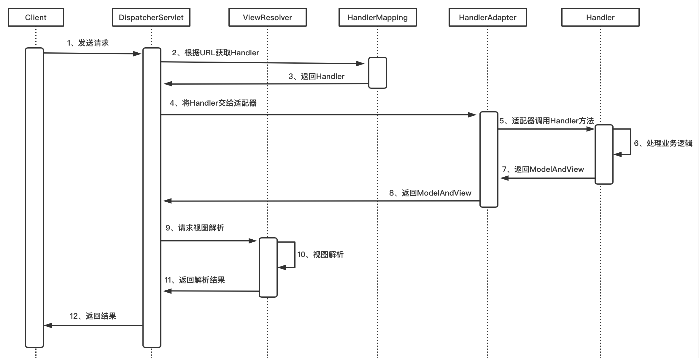

博客：[SpringMVC实现原理解析 - Lucky帅小武 - 博客园 (cnblogs.com)](https://www.cnblogs.com/jackion5/p/15611758.html) 

### 二、SpringMVC核心组件

DispatcherServlet：中央控制器，统一调度其他组件的调用，是整个请求响应的控制中心，本质是一个Servlet；

HandlerMapping：处理器映射器，客户端请求URL和业务处理器的映射关系，根据请求URL可以找到对应的业务处理器；

Handler：业务处理器，处理客户端的具体请求和返回处理结果，通常存在形式就是各种Controller；

HandlerAdapter：处理器适配器，负责调用业务处理器的具体方法，返回逻辑视图ModelAndView对象；

ViewResolver：视图解析器，负责将业务处理器返回的视图ModelAndView对象解析成JSP；

### 三、SpringMVC工作流程

1、客户端发送请求，所有请求都有中央处理器DispatcherServlet处理；

2、DispatcherServlet通过处理器映射器HandlerMapping根据客户端请求URL获取对应的业务处理器Handler对象；

3、DispatcherServlet调用HandlerAdapter处理器适配器，通知HandlerAdapter执行具体哪个Handler；

4、HandlerAdapter调用具体Handler(Controller)的方法并得到返回的结果ModelAndView，且将结果返回给DispatcherServlet；

5、DispatcherServlet将ModelAndView交给ViewReslover视图解析器解析，然后返回真正的视图；

6、DispatcherServlet将模型数据填充到视图中；

7、DispatcherServlet将结果响应给用户。

### 四、SpringMVC流程图



### 五、源码解析 

#### 1启动流程 

需要先在 web.XML 中配置 DispatcherServlet。

```xml
<?xml version="1.0" encoding="UTF-8"?>
<web-app xmlns="http://xmlns.jcp.org/xml/ns/javaee"
         xmlns:xsi="http://www.w3.org/2001/XMLSchema-instance"
         xsi:schemaLocation="http://xmlns.jcp.org/xml/ns/javaee http://xmlns.jcp.org/xml/ns/javaee/web-app_4_0.xsd"
         version="4.0" metadata-complete="false">
<!--metadata-complete:
    这个值表为true，则表示对三大组件的注册方式就只有web.xml中的注册起作用，将会忽略注解的注册；
    为false表示可以两个同时使用
-->
  <display-name>Archetype Created Web Application</display-name>
  <welcome-file-list>
    <welcome-file>index.jsp</welcome-file>
  </welcome-file-list>
<!--  MVC 配置-->
  <listener>
    <listener-class>org.springframework.web.context.ContextLoaderListener</listener-class>
  </listener>

  <context-param>
    <param-name>contextConfigLocation</param-name>
    <param-value>classpath:springmvc.xml</param-value>
  </context-param>

  <servlet>
    <servlet-name>dispatcherServlet</servlet-name>
    <servlet-class>org.springframework.web.servlet.DispatcherServlet</servlet-class>
    <init-param>
      <param-name>contextConfigLocation</param-name>
      <param-value>classpath:springmvc.xml</param-value>
    </init-param>
    <load-on-startup>1</load-on-startup>
  </servlet>

  <servlet-mapping>
    <servlet-name>dispatcherServlet</servlet-name>
    <url-pattern>/</url-pattern>
  </servlet-mapping>
</web-app>
```

项目启动时会创建DispatcherServlet并会执行DispatcherServlet的初始化init方法，查看DispatcherServlet的类图可以发现，DispatcherServlet继承FrameworkServlet，最先开始调用的是 HttpServlet 的init 方法。这个方法是空方法，留给子类覆盖了。而 HttpServletBean 覆盖了这个方法，所以会调用到这个类的 init 方法里面去。至于为什么会调用 HttpServlet 的init方法，还要分析查找下。(应该和tomcat启动有关，这里是servlet的生命周期有关，先调用init方法)


```java
// org.springframework.web.servlet.HttpServletBean#init
public final void init() throws ServletException {

   // Set bean properties from init parameters.
   PropertyValues pvs = new ServletConfigPropertyValues(getServletConfig(), this.requiredProperties);
   if (!pvs.isEmpty()) {
      try {
         BeanWrapper bw = PropertyAccessorFactory.forBeanPropertyAccess(this);
         ResourceLoader resourceLoader = new ServletContextResourceLoader(getServletContext());
         bw.registerCustomEditor(Resource.class, new ResourceEditor(resourceLoader, getEnvironment()));
         initBeanWrapper(bw);
         bw.setPropertyValues(pvs, true);
      }
      catch (BeansException ex) {
         if (logger.isErrorEnabled()) {
            logger.error("Failed to set bean properties on servlet '" + getServletName() + "'", ex);
         }
         throw ex;
      }
   }

   // Let subclasses do whatever initialization they like.
   initServletBean();
}
```

initServletBean(); 则调用到了 `org.springframework.web.servlet.FrameworkServlet#initServletBean`里去。

```java
protected final void initServletBean() throws ServletException {
   getServletContext().log("Initializing Spring " + getClass().getSimpleName() + " '" + getServletName() + "'");
   if (logger.isInfoEnabled()) {
      logger.info("Initializing Servlet '" + getServletName() + "'");
   }
   long startTime = System.currentTimeMillis();

   try {
       // 初始化操作
      this.webApplicationContext = initWebApplicationContext();
      initFrameworkServlet();
   }
   ....
}
```

调用路径：


继续深入调用分析：`initWebApplicationContext()`，IOC 容器 WebApplicationContext

```java
protected WebApplicationContext initWebApplicationContext() {
    /** 1. 尝试获取WebApplicationContext */
   WebApplicationContext rootContext =
         WebApplicationContextUtils.getWebApplicationContext(getServletContext());
   WebApplicationContext wac = null;

   if (this.webApplicationContext != null) {
      // A context instance was injected at construction time -> use it
      wac = this.webApplicationContext;
      if (wac instanceof ConfigurableWebApplicationContext) {
         ConfigurableWebApplicationContext cwac = (ConfigurableWebApplicationContext) wac;
         if (!cwac.isActive()) {
            // The context has not yet been refreshed -> provide services such as
            // setting the parent context, setting the application context id, etc
            if (cwac.getParent() == null) {
               // The context instance was injected without an explicit parent -> set
               // the root application context (if any; may be null) as the parent
               cwac.setParent(rootContext);
            }
            configureAndRefreshWebApplicationContext(cwac);
         }
      }
   }
   if (wac == null) {
      // No context instance was injected at construction time -> see if one
      // has been registered in the servlet context. If one exists, it is assumed
      // that the parent context (if any) has already been set and that the
      // user has performed any initialization such as setting the context id
      wac = findWebApplicationContext();
   }
    /** 2.如果当前没有WebApplicationContext就初始化并刷新WebApplicationContext */
   if (wac == null) {
      // No context instance is defined for this servlet -> create a local one
      wac = createWebApplicationContext(rootContext);
   }

   if (!this.refreshEventReceived) {
      // Either the context is not a ConfigurableApplicationContext with refresh
      // support or the context injected at construction time had already been
      // refreshed -> trigger initial onRefresh manually here.
      synchronized (this.onRefreshMonitor) {
          /** 3.WebApplicationContext初始化并刷新后,执行onRefresh方法*/
         onRefresh(wac);
      }
   }

   if (this.publishContext) {
      // Publish the context as a servlet context attribute.
      String attrName = getServletContextAttributeName();
      getServletContext().setAttribute(attrName, wac);
   }

   return wac;
}
```

通过createWebApplicationContext方法创建IOC容器WebApplicationContext并启动刷新容器，当Spring容器启动后再执行onRefresh方法刷新Servlet，Spring容器启动刷新逻辑不再细看，onRefresh方法实际是交给了子类DispatcherServlet实现，DispatcherServlet的onRefresh方法源码如下：

```java
// org.springframework.web.servlet.FrameworkServlet#onRefresh
protected void onRefresh(ApplicationContext context) {
   // For subclasses: do nothing by default.
}
```

是由子类实现的；org.springframework.web.servlet.DispatcherServlet#onRefresh

```java
protected void onRefresh(ApplicationContext context) {
   initStrategies(context);
}

/**
 * Initialize the strategy objects that this servlet uses.
 * <p>May be overridden in subclasses in order to initialize further strategy objects.
 */
protected void initStrategies(ApplicationContext context) {
   initMultipartResolver(context);
   initLocaleResolver(context);
   initThemeResolver(context);
    /** 初始化处理器映射器HandlerMapping */
    initHandlerMappings(context);
    /** 初始化处理器适配器handlerAdapter */
    initHandlerAdapters(context);
    initHandlerExceptionResolvers(context);
    initRequestToViewNameTranslator(context);
    /** 初始化视图解析器ViewResolver */
    initViewResolvers(context);
   initFlashMapManager(context);
}
```

初始化处理器适配器之后有三个对应的 handlerAdapter，其中一个支持的话就直接返回。


#### 2 请求访问流程源码解析

首先浏览器发送请求，DispatcherServlet 作为统一处理前端请求的 servlet，实际上也是 servlet，继承了 HttpServlet，当识别到 get、post、put 请求的时候会执行 doGet()、doPost()等方法。

doGet() 方法继续调用到子类 FrameworkServlet 中（因为我们当前是DispatcherServlet）的 doGet() 方法，进而继续调用到 FrameworkServlet  的processRequest() 方法中，实际上这个方法的核心是 doDispatch(request, response) 分发请求，源码如下：

调用链：


调用 doDispatch(request, response) 后

```java
protected void doService(HttpServletRequest request, HttpServletResponse response) throws Exception {
   logRequest(request);
/** 1.请求参数快照,将请求参数缓存起来 */
   // Keep a snapshot of the request attributes in case of an include,
   // to be able to restore the original attributes after the include.
   Map<String, Object> attributesSnapshot = null;
   if (WebUtils.isIncludeRequest(request)) {
      attributesSnapshot = new HashMap<>();
      Enumeration<?> attrNames = request.getAttributeNames();
      while (attrNames.hasMoreElements()) {
         String attrName = (String) attrNames.nextElement();
         if (this.cleanupAfterInclude || attrName.startsWith(DEFAULT_STRATEGIES_PREFIX)) {
            attributesSnapshot.put(attrName, request.getAttribute(attrName));
         }
      }
   }

    /** 2.请求参数添加配置 */
   // Make framework objects available to handlers and view objects.
   request.setAttribute(WEB_APPLICATION_CONTEXT_ATTRIBUTE, getWebApplicationContext());
   request.setAttribute(LOCALE_RESOLVER_ATTRIBUTE, this.localeResolver);
   request.setAttribute(THEME_RESOLVER_ATTRIBUTE, this.themeResolver);
   request.setAttribute(THEME_SOURCE_ATTRIBUTE, getThemeSource());

   if (this.flashMapManager != null) {
      FlashMap inputFlashMap = this.flashMapManager.retrieveAndUpdate(request, response);
      if (inputFlashMap != null) {
         request.setAttribute(INPUT_FLASH_MAP_ATTRIBUTE, Collections.unmodifiableMap(inputFlashMap));
      }
      request.setAttribute(OUTPUT_FLASH_MAP_ATTRIBUTE, new FlashMap());
      request.setAttribute(FLASH_MAP_MANAGER_ATTRIBUTE, this.flashMapManager);
   }

   try {
       /** 重点逻辑 */
      doDispatch(request, response);
   }
   ...
}
```

继续查看核心逻辑 

```java
protected void doDispatch(HttpServletRequest request, HttpServletResponse response) throws Exception {
   HttpServletRequest processedRequest = request;
   HandlerExecutionChain mappedHandler = null;
   boolean multipartRequestParsed = false;

   WebAsyncManager asyncManager = WebAsyncUtils.getAsyncManager(request);

   try {
      ModelAndView mv = null;
      Exception dispatchException = null;

      try {
         processedRequest = checkMultipart(request);
         multipartRequestParsed = (processedRequest != request);

         // Determine handler for the current request.
          /** 1.根据请求从HandlerMapping中查询具体的业务处理器 也就是获取对应的 controller 对应的 handler*/
         mappedHandler = getHandler(processedRequest);
         if (mappedHandler == null) {
            noHandlerFound(processedRequest, response);
            return;
         }
/** 2.根据业务处理器查询对应业务处理器适配器 */
         // Determine handler adapter for the current request.
         HandlerAdapter ha = getHandlerAdapter(mappedHandler.getHandler());

         // Process last-modified header, if supported by the handler.
         String method = request.getMethod();
         boolean isGet = "GET".equals(method);
         if (isGet || "HEAD".equals(method)) {
            long lastModified = ha.getLastModified(request, mappedHandler.getHandler());
            if (new ServletWebRequest(request, response).checkNotModified(lastModified) && isGet) {
               return;
            }
         }

         if (!mappedHandler.applyPreHandle(processedRequest, response)) {
            return;
         }
  /** 3.调用处理器适配器的handle方法处理具体的业务逻辑，返回ModelAndView对象 */
         // Actually invoke the handler. mv == ModelAndView
         mv = ha.handle(processedRequest, response, mappedHandler.getHandler());

         if (asyncManager.isConcurrentHandlingStarted()) {
            return;
         }

         applyDefaultViewName(processedRequest, mv);
         mappedHandler.applyPostHandle(processedRequest, response, mv);
      }
      catch (Exception ex) {
         dispatchException = ex;
      }
      catch (Throwable err) {
         // As of 4.3, we're processing Errors thrown from handler methods as well,
         // making them available for @ExceptionHandler methods and other scenarios.
         dispatchException = new NestedServletException("Handler dispatch failed", err);
      }
        /** 4.处理请求执行结果 */
      processDispatchResult(processedRequest, response, mappedHandler, mv, dispatchException);
   }
   // ....
}
```

初始化处理器适配器之后有三个对应的 handlerAdapter，其中一个支持的话就直接返回。


`ModelAndView mv = ha.handle(processedRequest, response, mappedHandler.getHandler());`

这里处理完了之后返回的是视图 ModelAndView 了。

#### 总结：

核心逻辑比较清晰，先从处理器映射器中查询请求对应的业务处理器，然后再根据业务处理器找到处理器适配器，然后调用适配器的handle方法处理业务，最终执行processDispatchResult方法处理请求的处理结果。

getHandler逻辑就是从集合handlerMappings中找到匹配的处理器；

getHandlerAdapter就是从集合handlerAdapters中找到对应的适配器；

handle方法就是通过反射机制执行对应处理器的方法；

processDispatchResult就是将执行结果封装成ModelAndView对象； 