## Spring 源码解析（一）

结构图

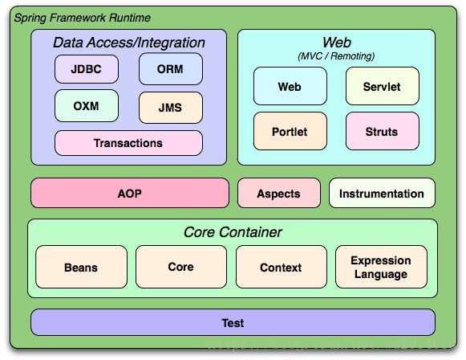

**Spring Core**

核心模块， Spring 其他所有的功能基本都需要依赖于该类库，主要提供 IoC 依赖注入功能的支持。

**Spring Aspects**

该模块为与 AspectJ 的集成提供支持。

**Spring AOP**

提供了面向切面的编程实现。

**Spring Data Access/Integration ：**

Spring Data Access/Integration 由 5 个模块组成：

- spring-jdbc : 提供了对数据库访问的抽象 JDBC。不同的数据库都有自己独立的 API 用于操作数据库，而 Java 程序只需要和 JDBC API 交互，这样就屏蔽了数据库的影响。
- spring-tx : 提供对事务的支持。
- spring-orm : 提供对 Hibernate 等 ORM 框架的支持。
- spring-oxm ： 提供对 Castor 等 OXM 框架的支持。
- spring-jms : Java 消息服务。

**Spring Web**

Spring Web 由 4 个模块组成：

- spring-web ：对 Web 功能的实现提供一些最基础的支持。
- spring-webmvc ： 提供对 Spring MVC 的实现。
- spring-websocket ： 提供了对 WebSocket 的支持，WebSocket 可以让客户端和服务端进行双向通信。
- spring-webflux ：提供对 WebFlux 的支持。WebFlux 是 Spring Framework 5.0 中引入的新的响应式框架。与 Spring MVC 不同，它不需要 Servlet API，是完全异步

（介绍参考：[JavaGuide](https://javaguide.cn/system-design/framework/spring/spring-knowledge-and-questions-summary.html#列举一些重要的-spring-模块) ）

### 一、Spring 的结构组成 

使用的测试类代码：

```java
Public void BeanFactoryTest {
    @Test
        public void testSimpleLoad() {
            BeanFactory bf = new XmlBeanFactory( new ClassPathResource("beanFactoryTest.xml");
            MyTestBean  bean = (MyTestBean)bf.getBean("myTestBean");
            assertEquals("testStr", bean.getTestStr())
         }
}
```

#### 1 核心类介绍 

##### 1.1 **DefaultListableBeanFactory**

**加载及注册 bean 的默认实现**。

 **XmlBeanFactory** 继承自 **DefaultListableBeanFactory** ，**而 DefaultListableBeanFactory 是整个 bean 加载的核心部分，是 Spring 注册及加载 bean 的默认实现**，而对于 XmlBeanFactory 与 DefaultListableBeanFactory 不同的地方其实是在 XmlBeanFactory 中使用了自定义的XML读取器XmlBeanDefinitionReader，实现了个性化的 BeanDefinitionReader 读取， DefaultListableBeanFactory 继承了 AbstractAutowireCapableBeanFactory 并实现了 ConfigurableListableBeanFactory 以及 BeanDefinitionRegistry 接口。 

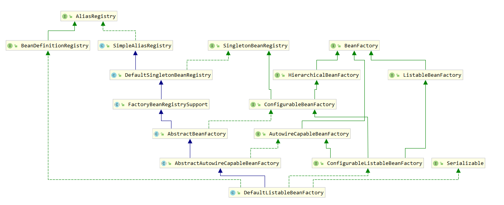

从类图中可以很清晰地从全局角度了解 DefaultListableBeanFactory 的脉络。 

- **AliasRegistry**：定义了对 alias 的简单增删改查等操作。
- **BeanDefinitionRegistry**：定义对BeanDefinition的各种增删改操作。
- **SimpleAliasRegistry**：主要使用 map 作为 alias 的缓存，并对接口 AliasRegistry 进行实现。
- **SingletonBeanRegistry**：定义对单例的注册及获取。
- **BeanFactory**：定义获取bean及bean的各种属性。
- **DefaultSingletonBeanRegistry**：对接口SingletonBeanRegistry各函数的实现。
- **HierarchicalBeanFactory**：继承BeanFactory，也就是在BeanFactory定义的功能的基础上增加了对parentFactory的支持。
- **ListableBeanFactory**：根据各种条件获取bean的配置清单。
- **FactoryBeanRegistrySupport**：在 DefaultSingletonBeanRegistry 基础上增加了对 FactoryBean 的特殊处理功能。
- **ConfigurableBeanFactory**：提供配置Factory的各种方法。 
- **AbstractBeanFactory**：综合 FactoryBeanRegistrySupport 和 ConfigurableBeanFactory 的功能。
- **AutowireCapableBeanFactory**：提供创建bean、自动注入、初始化以及应用bean的后处理器。 
- **AbstractAutowireCapableBeanFactory**：综合AbstractBeanFactory并对接口Autowire CapableBeanFactory进行实现。 
- **ConfigurableListableBeanFactory**：BeanFactory配置清单，指定忽略类型及接口等。 
- **DefaultListableBeanFactory**：综合上面所有功能，主要是对Bean注册后的处理。

**XmlBeanFactory对DefaultListableBeanFactory类进行了扩展**，**主要用于从XML文档中读取BeanDefinition**，对于注册及获取Bean都是使用从父类DefaultListableBeanFactory继承的方法去实现，而唯独与父类不同的个性化实现就是增加了XmlBeanDefinitionReader类型的reader属性。**在XmlBeanFactory中主要使用reader属性对资源文件进行读取和注册**。

##### 1.2 **XmlBeanDefinitionReader**

 XML配置文件的读取是Spring中重要的功能，因为Spring的大部分功能都是以配置作为切入点的，那么我们可以从XmlBeanDefinitionReader中梳理一下资源文件读取、解析及注册的大致脉络，首先我们看看各个类的功能。

- **ResourceLoader**：定义资源加载器，主要应用于根据给定的资源文件地址返回对应的Resource。
- **BeanDefinitionReader**：主要定义资源文件读取并转换为BeanDefinition的各个功能。
- **EnvironmentCapable**：定义获取Environment方法。
- **DocumentLoader**：定义从资源文件加载到转换为Document的功能。
- **AbstractBeanDefinitionReader**：对EnvironmentCapable、BeanDefinitionReader类定义的功能进行实现。
- **BeanDefinitionDocumentReader**：定义读取Docuemnt并注册BeanDefinition功能。
- **BeanDefinitionParserDelegate**：定义解析Element的各种方法

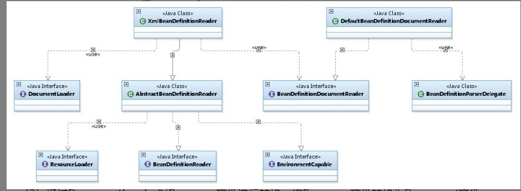

（1）通过继承自AbstractBeanDefinitionReader中的方法，来使用ResourLoader将资源文件路径转换为对应的Resource文件。

（2）通过DocumentLoader对Resource文件进行转换，将Resource文件转换为Document文件。

（3）通过实现接口BeanDefinitionDocumentReader的DefaultBeanDefinitionDocumentReader类对Document进行解析，并使用BeanDefinitionParserDelegate对Element进行解析。

#### 2 **容器的基础 XmlBeanFactory** 

代码的入口：

```java
BeanFactory bf = new XmlBeanFactory( new ClassPathResource("beanFactoryTest.xml");
```

XmlBeanFactory 初始化的时序图，以及代码逻辑。

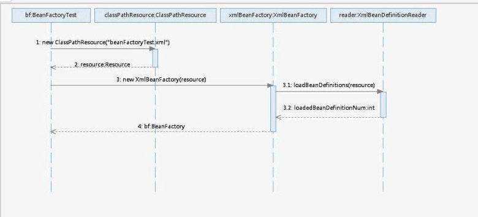

在代码中首先调用了ClassPathResource的构造函数来构造Resource资源文件的实例对象，这样后续的资源处理就可以用Resource提供的各种服务来操作了，当我们有了Resource后就可以进行XmlBeanFactory的初始化了。那么Resource资源是如何封装的呢？ 

##### 2.1 **配置文件封装** 

Spring的配置文件读取是通过ClassPathResource进行封装的，如 new ClassPathResource("beanFactoryTest.xml")，那么ClassPathResource完成了什么功能呢？  

 在Java中，**将不同来源的资源抽象成URL，通过注册不同的handler（URLStreamHandler）来处理不同来源的资源的读取逻辑**，一般handler的类型使用不同前缀（协议，Protocol）来识别，如**“file:”、“http:”、“jar:”**等，然而URL没有默认定义相对 Classpath 或 ServletContext 等资源的handler，虽然可以注册自己的URLStreamHandler来解析特定的URL前缀（协议），比如“classpath:”，然而这需要了解URL的实现机制，而且URL也没有提供一些基本的方法，如检查当前资源是否存在、检查当前资源是否可读等方法。因而Spring对其内部使用到的资源实现了自己的抽象结构：**Resource接口来封装底层资源**。 

```java
public interface InputStreamSource {
    InputStream getInputStream() throws IOException;
}
// spring 自己抽象的
public interface Resource extends InputStreamSource {
    boolean exists();

    default boolean isReadable() {
        return this.exists();
    }

    default boolean isOpen() {
        return false;
    }


    default boolean isFile() {
        return false;
    }

    URL getURL() throws IOException;

    URI getURI() throws IOException;

    File getFile() throws IOException;

    default ReadableByteChannel readableChannel() throws IOException {
        return Channels.newChannel(this.getInputStream());
    }

    long contentLength() throws IOException;

    long lastModified() throws IOException;

    Resource createRelative(String var1) throws IOException;

    @Nullable
    String getFilename();

    String getDescription();
}
```

Resource接口抽象了所有Spring内部使用到的底层资源：File、URL、Classpath等。

对不同来源的资源文件都有相应的Resource实现：文件（FileSystemResource）、Classpath资源（ClassPathResource）、URL资源（UrlResource）、InputStream资源（InputStreamResource）、Byte数组（ByteArrayResource）等。 相关类图如下所示。

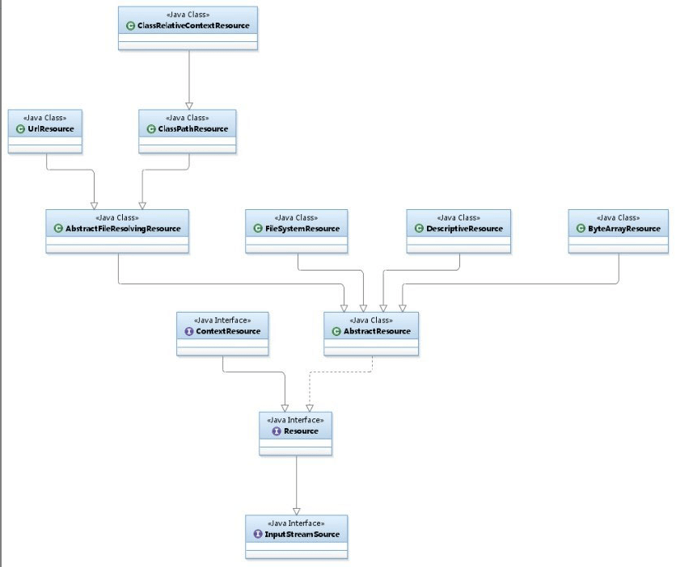

跟踪源代码：

```java
public class XmlBeanFactory extends DefaultListableBeanFactory {

    private final XmlBeanDefinitionReader reader = new XmlBeanDefinitionReader(this);
    public XmlBeanFactory(Resource resource) throws BeansException {
       this(resource, null);
    }

    public XmlBeanFactory(Resource resource, BeanFactory parentBeanFactory) throws BeansException {
        super(parentBeanFactory);
        this.reader.loadBeanDefinitions(resource);
    }
}
```


```java
public DefaultListableBeanFactory(@Nullable BeanFactory parentBeanFactory) {
   super(parentBeanFactory);
}
// org.springframework.beans.factory.support.AbstractAutowireCapableBeanFactory#AbstractAutowireCapableBeanFactory(org.springframework.beans.factory.BeanFactory)
public AbstractAutowireCapableBeanFactory(@Nullable BeanFactory parentBeanFactory) {
    this();
    setParentBeanFactory(parentBeanFactory);
}
```

源码调用跟踪到`AbstractAutowireCapableBeanFactory`类的构造函数，其中有使用 ：

```java
public AbstractAutowireCapableBeanFactory() {
   super();
   ignoreDependencyInterface(BeanNameAware.class);
   ignoreDependencyInterface(BeanFactoryAware.class);
   ignoreDependencyInterface(BeanClassLoaderAware.class);
}
```

这里有必要提及一下ignoreDependencyInterface方法。ignoreDependencyInterface的主要功能是忽略给定接口的自动装配功能，那么，这样做的目的是什么呢？会产生什么样的效果呢？ 

举例来说，**当A中有属性B，那么当Spring在获取A的Bean的时候如果其属性B还没有初始化，那么Spring会自动初始化B，这也是Spring中提供的一个重要特性**。但是，***某些情况下，B不会被初始化***，**其中的一种情况就是B实现了BeanNameAware接口**。Spring中是这样介绍的：自动装配时忽略给定的依赖接口，典型应用是通过其他方式解析Application上下文注册依赖，类似于BeanFactory通过BeanFactoryAware进行注入或者ApplicationContext通过ApplicationContextAware进行注入。

##### 2.2 加载 bean 

**加载 bean definitions 的操作是在 XmlBeanDefinitionReader 类中调用 doLoadBeanDefinitions(inputSource,encodedResource.getResource()) 方法的**。 

###### **2.2.1 加载 Bean 之前做的准备工作**： 

（1）封装资源文件。当进入XmlBeanDefinitionReader后首先对参数Resource使用EncodedResource类进行封装。

（2）获取输入流。从Resource中获取对应的InputStream并构造InputSource。

（3）通过构造的InputSource实例和Resource实例继续调用函数doLoadBeanDefinitions。 

我们再次整理一下数据准备阶段的逻辑，首先对传入的resource参数做封装，目的是考虑到Resource可能存在编码要求的情况，其次，通过SAX读取XML文件的方式来准备InputSource对象，最后将准备的数据通过参数传入真正的核心处理部分doLoadBeanDefinitions(inputSource,encodedResource.getResource())。 **doLoadBeanDefinitions(inputSource,encodedResource.getResource())** 在这个方法中，加入不考虑异常类的代码，其实只做了三件事情，这三件事的每一件都必不可少。 

**（1）获取对XML文件的验证模式**。

**（2）加载XML文件，并得到对应的Document**。

**（3）根据返回的Document注册Bean信息**。

##### **2.3 获取对XML文件的验证模式** 

xml 文件可能有 DTD 和 XSD 两种。 

- **DTD（Document Type Definition）即文档类型定义，是一种XML约束模式语言，是XML文件的验证机制，属于XML文件组成的一部分**。DTD是一种保证XML文档格式正确的有效方法，可以通过比较XML文档和DTD文件来看文档是否符合规范，元素和标签使用是否正确。一个DTD文档包含：元素的定义规则，元素间关系的定义规则，元素可使用的属性，可使用的实体或符号规则。

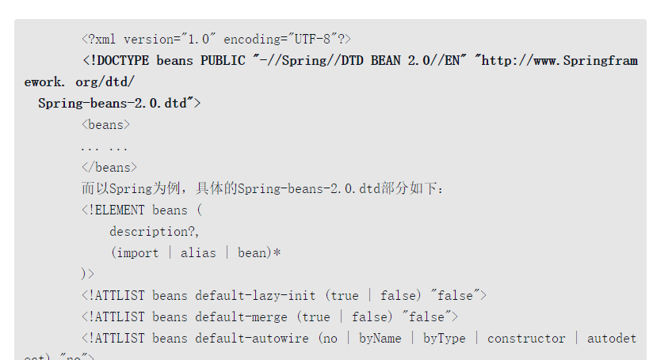

- **XML Schema语言就是XSD（XML Schemas Definition）**。XML Schema描述了XML文档的结构。可以用一个指定的XML Schema来验证某个XML文档，以检查该XML文档是否符合其要求。文档设计者可以通过XML Schema指定一个XML文档所允许的结构和内容，并可据此检查一个XML文档是否是有效的。XML Schema本身是一个XML文档，它符合XML语法结构。可以用通用的XML解析器解析它。

在使用XML Schema文档对XML实例文档进行检验，除了**要声明名称空间外**（xmlns=[http://www.Springframework.org/schema/beans](http://www.springframework.org/schema/beans)），还**必须指定该名称空间所对应的XML Schema文档的存储位置**。**通过schemaLocation属性来指定名称空间所对应的XML Schema文档的存储位置**，它包含两个部分，**一部分是名称空间的URI，另一部分就是该名称空间所标识的XMLSchema文件位置或URL地址**（xsi:schemaLocation="[http://www.Springframework.org/schema/beans](http://www.springframework.org/schema/beans)    [http://www.Springframework.org/schema/beans/Spring-beans.xsd](http://www.springframework.org/schema/beans/Spring-beans.xsd)）。

```xml
<?xml version="1.0" encoding="UTF-8"?>
<beans xmlns="http://www.springframework.org/schema/beans"
       xmlns:xsi="http://www.w3.org/2001/XMLSchema-instance"
       xsi:schemaLocation="http://www.springframework.org/schema/beans
       http://www.springframework.org/schema/beans/spring-beans.xsd">
</beans>
```

具体的源码在 XmlBeanDefinitionReader 类中的 getValidationModeForResource 方法里面。

```java
protected Document doLoadDocument(InputSource inputSource, Resource resource) throws Exception {
   return this.documentLoader.loadDocument(inputSource, getEntityResolver(), this.errorHandler,
         getValidationModeForResource(resource), isNamespaceAware());
}

protected int getValidationModeForResource(Resource resource) {
   int validationModeToUse = getValidationMode();
   if (validationModeToUse != VALIDATION_AUTO) {
      return validationModeToUse;
   }
   int detectedMode = detectValidationMode(resource);
   if (detectedMode != VALIDATION_AUTO) {
      return detectedMode;
   }
   // Hmm, we didn't get a clear indication... Let's assume XSD,
   // since apparently no DTD declaration has been found up until
   // detection stopped (before finding the document's root tag).
   return VALIDATION_XSD;
}
```

**Spring用来检测验证模式的办法就是判断是否包含DOCTYPE，如果包含就是DTD，否则就是XSD。** 

##### **2.4 获取 Document**  

经过了验证模式准备的步骤就可以进行Document加载了，同样XmlBeanFactoryReader类对于文档读取并没有亲力亲为，而是委托给了DocumentLoader去执行，这里的**DocumentLoader**是个接口，而真正调用的是**DefaultDocumentLoader**，代码如下，是使用 SAX 解析 xml 文件的方式解析的。

```java
// 这个是在  XmlBeanFactoryReader 中
protected Document doLoadDocument(InputSource inputSource, Resource resource) throws Exception {
   return this.documentLoader.loadDocument(inputSource, getEntityResolver(), this.errorHandler,
         getValidationModeForResource(resource), isNamespaceAware());
}
// 下面的是在 DefaultDocumentLoader 中
/**
* Load the {@link Document} at the supplied {@link InputSource} using the standard JAXP-configured
* XML parser.
*/
@Override
public Document loadDocument(InputSource inputSource, EntityResolver entityResolver,
      ErrorHandler errorHandler, int validationMode, boolean namespaceAware) throws Exception {


   DocumentBuilderFactory factory = createDocumentBuilderFactory(validationMode, namespaceAware);
   if (logger.isTraceEnabled()) {
      logger.trace("Using JAXP provider [" + factory.getClass().getName() + "]");
   }
   DocumentBuilder builder = createDocumentBuilder(factory, entityResolver, errorHandler);
   return builder.parse(inputSource);
}
```

对于这部分代码其实并没有太多可以描述的，因为通过SAX解析XML文档的套路大致都差不多，Spring在这里并没有什么特殊的地方，同样首先创建DocumentBuilderFactory，再通过DocumentBuilderFactory创建DocumentBuilder，进而解析inputSource来返回Document对象。 

###### 2.4.1 EntityResolver用法

在loadDocument方法中涉及一个参数**EntityResolver**，何为EntityResolver？官网这样解释:**如果SAX应用程序需要实现自定义处理外部实体，则必须实现此接口并使用setEntityResolver方法向SAX驱动器注册一个实例**。也就是说，对于解析一个XML，SAX首先读取该XML文档上的声明，根据声明去寻找相应的DTD定义，以便对文档进行一个验证。**默认的寻找规则，即通过网络（实现上就是声明的DTD的URI地址）来下载相应的DTD声明，并进行认证。下载的过程是一个漫长的过程，而且当网络中断或不可用时，这里会报错，就是因为相应的DTD声明没有被找到的原因**。  

<u>EntityResolver的作用是项目本身就可以提供一个如何寻找DTD声明的方法，即由程序来实现寻找DTD声明的过程，比如我们将DTD文件放到项目中某处，在实现时直接将此文档读取并返回给SAX即可。这样就避免了通过网络来寻找相应的声明</u>。 

<!---->

```java
public interface EntityResolver {
public abstract InputSource resolveEntity (String publicId,
                                           String systemId)
    throws SAXException, IOException;
}
```

之前已经提到过，验证文件默认的加载方式是通过URL进行网络下载获取，这样会造成延迟，用户体验也不好，一般的做法都是将验证文件放置在自己的工程里，那么怎么做才能将这个URL转换为自己工程里对应的地址文件呢？

我们以加载DTD文件为例来看看Spring中是如何实现的。 

根据之前Spring中通过getEntityResolver()方法对EntityResolver的获取，我们知道，**Spring中使用DelegatingEntityResolver类为EntityResolver的实现类**，resolveEntity实现方法如下： 

```java
protected EntityResolver getEntityResolver() {
   if (this.entityResolver == null) {
      // Determine default EntityResolver to use.
      ResourceLoader resourceLoader = getResourceLoader();
      if (resourceLoader != null) {
         this.entityResolver = new ResourceEntityResolver(resourceLoader);
      }
      else {
         this.entityResolver = new DelegatingEntityResolver(getBeanClassLoader());
      }
   }
   return this.entityResolver;
}
// DelegatingEntityResolver 构造器
public DelegatingEntityResolver(@Nullable ClassLoader classLoader) {
   this.dtdResolver = new BeansDtdResolver();
   this.schemaResolver = new PluggableSchemaResolver(classLoader);
}

public InputSource resolveEntity(@Nullable String publicId, @Nullable String systemId)
      throws SAXException, IOException {


   if (systemId != null) {
      if (systemId.endsWith(DTD_SUFFIX)) {
         return this.dtdResolver.resolveEntity(publicId, systemId);
      }
      else if (systemId.endsWith(XSD_SUFFIX)) {
         return this.schemaResolver.resolveEntity(publicId, systemId);
      }
   }


   // Fall back to the parser's default behavior.
   return null;
}
```

##### 2.5 **解析及注册 BeanDefinitions** 

```java
public int registerBeanDefinitions(Document doc, Resource resource) throws BeanDefinitionStoreException {
    //  使用 DefaultBeanDefinitionDocumentReader  实例化 BeanDefinitionDocumentReader, 这个类功能上面提到过： BeanDefinitionDocumentReader：定义读取Docuemnt并注册BeanDefinition功能
   BeanDefinitionDocumentReader documentReader = createBeanDefinitionDocumentReader();
//  在实例化 BeanDefinitionDocumentReader 时候会将 BeanDefinitionRegister 传入，默认使用继承自 DefaultListableBeanFactory 的子类，记录统计前 BeanDefinition 的加载个数
   int countBefore = getRegistry().getBeanDefinitionCount();
// 加载及注册bean
   documentReader.registerBeanDefinitions(doc, createReaderContext(resource)); // 使用的是 DefaultBeanDefinitionDocumentReader 类
// 记录本次加载的 BeanDefinition 个数
   return getRegistry().getBeanDefinitionCount() - countBefore;
}
```

其中的参数doc是通过上一节loadDocument加载转换出来的。

**在这个方法中很好地应用了面向对象中单一职责的原则，将逻辑处理委托给单一的类进行处理，而这个逻辑处理类就是BeanDefinitionDocumentReader**。

BeanDefinitionDocumentReader是一个接口，而实例化的工作是在createBeanDefinitionDocumentReader()中完成的，而通过此方法，**BeanDefinitionDocumentReader真正的类型其实已经是DefaultBeanDefinitionDocumentReader了**，进入DefaultBeanDefinitionDocumentReader后，发现这个方法的重要目的之一就是提取root，以便于再次将root作为参数继续BeanDefinition的注册。 

随后进入方法 doRegisterBeanDefinitions 中，这个方法才算是真正的解析了，BeanDefinitionDocumentReader.doRegisterBeanDefinitions(root)

```java
protected void doRegisterBeanDefinitions(Element root) {
   // Any nested <beans> elements will cause recursion in this method. In
   // order to propagate and preserve <beans> default-* attributes correctly,
   // keep track of the current (parent) delegate, which may be null. Create
   // the new (child) delegate with a reference to the parent for fallback purposes,
   // then ultimately reset this.delegate back to its original (parent) reference.
   // this behavior emulates a stack of delegates without actually necessitating one.
   BeanDefinitionParserDelegate parent = this.delegate;
   this.delegate = createDelegate(getReaderContext(), root, parent);


   if (this.delegate.isDefaultNamespace(root)) {
      String profileSpec = root.getAttribute(PROFILE_ATTRIBUTE); // profile
      if (StringUtils.hasText(profileSpec)) {
         String[] specifiedProfiles = StringUtils.tokenizeToStringArray(
               profileSpec, BeanDefinitionParserDelegate.MULTI_VALUE_ATTRIBUTE_DELIMITERS);
         // We cannot use Profiles.of(...) since profile expressions are not supported
         // in XML config. See SPR-12458 for details.
         if (!getReaderContext().getEnvironment().acceptsProfiles(specifiedProfiles)) {
            if (logger.isDebugEnabled()) {
               logger.debug("Skipped XML bean definition file due to specified profiles [" + profileSpec +
                     "] not matching: " + getReaderContext().getResource());
            }
            return;
         }
      }
   }

   // 模板方法模式，这两个方法 preProcessXml 和 proProcessXml 留着子类去实现
   preProcessXml(root);
   parseBeanDefinitions(root, this.delegate);  // 真正解析的方法
   postProcessXml(root);


   this.delegate = parent;
}
```

如果继承自DefaultBeanDefinitionDocumentReader的子类需要在Bean解析前后做一些处理的话，那么只需要重写这两个方法就可以了。 

###### 2.5.1 **profile 属性使用**  


###### 2.5.2 **解析并注册 BeanDefinition**  

```java
protected void parseBeanDefinitions(Element root, BeanDefinitionParserDelegate delegate) {
// 对 beans  的处理
   if (delegate.isDefaultNamespace(root)) {
      NodeList nl = root.getChildNodes();
      for (int i = 0; i < nl.getLength(); i++) {
         Node node = nl.item(i);
         if (node instanceof Element) {
            Element ele = (Element) node;
            if (delegate.isDefaultNamespace(ele)) {
                // 对 bean 的处理 默认的标签
               parseDefaultElement(ele, delegate);
            }
            else { // 对 bean 的处理 自定义的标签
               delegate.parseCustomElement(ele);
            }
         }
      }
   }
   else {
      delegate.parseCustomElement(root);
   }
}
```

上面的代码看起来逻辑还是蛮清晰的，因为在Spring的XML配置里面有两大类Bean声明，

**一个是默认的**，如：`<bean id="test" class="test.TestBean">` ，

另一类就是**自定义的**，如：`<tx:annotation-driven>`

而两种方式的读取及解析差别是非常大的，如果采用Spring默认的配置，Spring当然知道该怎么做，但是如果是自定义的，那么就需要用户实现一些接口及配置了。

**对于根节点或者子节点如果是默认命名空间的话则采用parseDefaultElement方法进行解析，否则使用delegate.parseCustomElement方法对自定义命名空间进行解析**。

而**判断是否默认命名空间还是自定义命名空间的办法其实是使用node.getNamespaceURI()获取命名空间，并与Spring中固定的命名空间[http://www.Springframework.org/schema/beans](http://www.springframework.org/schema/beans) 进行比对**。如果一致则认为是默认，否则就认为是自定义。 

#### 3 默认标签的解析  

默认标签的解析是在parseDefaultElement函数中进行的，函数中的功能逻辑一目了然，分别对4种不同标签（import、alias、bean和beans）做了不同的处理。 

```java
private void parseDefaultElement(Element ele, BeanDefinitionParserDelegate delegate) {
   if (delegate.nodeNameEquals(ele, IMPORT_ELEMENT)) { // import
      importBeanDefinitionResource(ele);
   }
   else if (delegate.nodeNameEquals(ele, ALIAS_ELEMENT)) { // alias
      processAliasRegistration(ele);
   }
   else if (delegate.nodeNameEquals(ele, BEAN_ELEMENT)) { // bean
      processBeanDefinition(ele, delegate);
   }
   else if (delegate.nodeNameEquals(ele, NESTED_BEANS_ELEMENT)) { // beans
      // recurse
      doRegisterBeanDefinitions(ele);
   }
}
```

##### 3.1 **bean标签的解析及注册** 

```java
/**
* Process the given bean element, parsing the bean definition
* and registering it with the registry.
*/
protected void processBeanDefinition(Element ele, BeanDefinitionParserDelegate delegate) {
   BeanDefinitionHolder bdHolder = delegate.parseBeanDefinitionElement(ele);
   if (bdHolder != null) {
      bdHolder = delegate.decorateBeanDefinitionIfRequired(ele, bdHolder);
      try {
         // Register the final decorated instance.
         BeanDefinitionReaderUtils.registerBeanDefinition(bdHolder, getReaderContext().getRegistry());
      }
      catch (BeanDefinitionStoreException ex) {
         getReaderContext().error("Failed to register bean definition with name '" +
               bdHolder.getBeanName() + "'", ele, ex);
      }
      // Send registration event.
      getReaderContext().fireComponentRegistered(new BeanComponentDefinition(bdHolder));
   }
}
```

（1）首先委托**BeanDefinitionDelegate**类的parseBeanDefinitionElement方法进行元素解析，返回BeanDefinitionHolder类型的实例bdHolder，经过这个方法后，**bdHolder实例已经包含我们配置文件中配置的各种属性了**，例如class、name、id、alias之类的属性。

（2）当返回的bdHolder不为空的情况下若存在默认标签的子节点下再有自定义属性，还需要再次对自定义标签进行解析。

（3）解析完成后，需要对解析后的bdHolder进行注册，同样，注册操作委托给了BeanDefinitionReaderUtils的registerBeanDefinition方法。

（4）最后发出响应事件，通知想关的监听器，这个bean已经加载完成了。

```java
@Nullable
public BeanDefinitionHolder parseBeanDefinitionElement(Element ele) {
   return parseBeanDefinitionElement(ele, null);
}
public BeanDefinitionHolder parseBeanDefinitionElement(Element ele, @Nullable BeanDefinition containingBean) {
   String id = ele.getAttribute(ID_ATTRIBUTE); // 解析 id
   String nameAttr = ele.getAttribute(NAME_ATTRIBUTE); // 解析 name


   List<String> aliases = new ArrayList<>();
   if (StringUtils.hasLength(nameAttr)) {
      String[] nameArr = StringUtils.tokenizeToStringArray(nameAttr, MULTI_VALUE_ATTRIBUTE_DELIMITERS);
      aliases.addAll(Arrays.asList(nameArr));
   }


   String beanName = id;
   if (!StringUtils.hasText(beanName) && !aliases.isEmpty()) {
      beanName = aliases.remove(0);
      if (logger.isTraceEnabled()) {
         logger.trace("No XML 'id' specified - using '" + beanName +
               "' as bean name and " + aliases + " as aliases");
      }
   }


   if (containingBean == null) {
      checkNameUniqueness(beanName, aliases, ele);
   }

    // 解析其他的标签
   AbstractBeanDefinition beanDefinition = parseBeanDefinitionElement(ele, beanName, containingBean);
   if (beanDefinition != null) {
      if (!StringUtils.hasText(beanName)) {
         try {
            if (containingBean != null) { // 如果不存在 beanName 那么根据 spring 提供的命名规则为当前 bean 生成对应的 beanName
               beanName = BeanDefinitionReaderUtils.generateBeanName(
                     beanDefinition, this.readerContext.getRegistry(), true);
            }
            else {
               beanName = this.readerContext.generateBeanName(beanDefinition);
               // Register an alias for the plain bean class name, if still possible,
               // if the generator returned the class name plus a suffix.
               // This is expected for Spring 1.2/2.0 backwards compatibility.
               String beanClassName = beanDefinition.getBeanClassName();
               if (beanClassName != null &&
                     beanName.startsWith(beanClassName) && beanName.length() > beanClassName.length() &&
                     !this.readerContext.getRegistry().isBeanNameInUse(beanClassName)) {
                  aliases.add(beanClassName);
               }
            }
            if (logger.isTraceEnabled()) {
               logger.trace("Neither XML 'id' nor 'name' specified - " +
                     "using generated bean name [" + beanName + "]");
            }
         }
         catch (Exception ex) {
            error(ex.getMessage(), ele);
            return null;
         }
      }
      String[] aliasesArray = StringUtils.toStringArray(aliases);
      return new BeanDefinitionHolder(beanDefinition, beanName, aliasesArray);
   }


   return null;
}

-----------------------------------------
public AbstractBeanDefinition parseBeanDefinitionElement(
      Element ele, String beanName, @Nullable BeanDefinition containingBean) {


   this.parseState.push(new BeanEntry(beanName));


   String className = null;
   if (ele.hasAttribute(CLASS_ATTRIBUTE)) {   // class 属性
      className = ele.getAttribute(CLASS_ATTRIBUTE).trim();
   }
   String parent = null;
   if (ele.hasAttribute(PARENT_ATTRIBUTE)) {  // parent 属性
      parent = ele.getAttribute(PARENT_ATTRIBUTE);
   }


   try {// 创建用于承载属性的 AbstractBeanDefinition 类型的 GenericBeanDefinition
      AbstractBeanDefinition bd = createBeanDefinition(className, parent);
            // 硬编码解析默认的 bean 的各种属性
      parseBeanDefinitionAttributes(ele, beanName, containingBean, bd);
      bd.setDescription(DomUtils.getChildElementValueByTagName(ele, DESCRIPTION_ELEMENT));// 提取 description


      parseMetaElements(ele, bd); // 解析元数据
      parseLookupOverrideSubElements(ele, bd.getMethodOverrides()); // 解析 lookup-method 属性
      parseReplacedMethodSubElements(ele, bd.getMethodOverrides()); // 解析 replace-method 属性


      parseConstructorArgElements(ele, bd); // 解析 构造函数参数
      parsePropertyElements(ele, bd); // 解析 property 子元素
      parseQualifierElements(ele, bd); // 解析 qualifier 子元素


      bd.setResource(this.readerContext.getResource());
      bd.setSource(extractSource(ele));


      return bd;
   }
   catch (ClassNotFoundException ex) {
      error("Bean class [" + className + "] not found", ele, ex);
   }
   catch (NoClassDefFoundError err) {
      error("Class that bean class [" + className + "] depends on not found", ele, err);
   }
   catch (Throwable ex) {
      error("Unexpected failure during bean definition parsing", ele, ex);
   }
   finally {
      this.parseState.pop();
   }


   return null;
}
// 终于，bean 标签的所有属性，不论常用的还是不常用的都看到了。
```

###### **3.1.1 创建用于属性承载的BeanDefinition** 

BeanDefinition是一个接口，在Spring中存在三种实现：**RootBeanDefinition、ChildBeanDefinition以及GenericBeanDefinition**。**三种实现均继承了AbstractBeanDefiniton**，其中BeanDefinition是配置文件<bean>元素标签在容器中的内部表示形式。<bean>元素标签拥有class、scope、lazy-init等配置属性，BeanDefinition则提供了相应的beanClass、scope、lazyInit属性，BeanDefinition和<bean>中的属性是一一对应的。其中RootBeanDefinition是最常用的实现类，它对应一般性的<bean>元素标签，GenericBeanDefinition是自2.5版本以后新加入的bean文件配置属性定义类，是一站式服务类。

在配置文件中可以定义父<bean>和子<bean>，父<bean>用RootBeanDefinition表示，而子<bean>用ChildBeanDefiniton表示，而**没有父<bean>的<bean>就使用RootBeanDefinition表示**。AbstractBeanDefinition对两者共同的类信息进行抽象。 

Spring通过BeanDefinition将配置文件中的<bean>配置信息转换为容器的内部表示，**并将这些BeanDefiniton注册到BeanDefinitonRegistry中**。**Spring容器的BeanDefinitionRegistry就像是Spring配置信息的内存数据库，主要是以map的形式保存，后续操作直接从BeanDefinitionRegistry中读取配置信息**。 

```java
// BeanDefinitionParserDelegate
protected AbstractBeanDefinition createBeanDefinition(@Nullable String className, @Nullable String parentName)
      throws ClassNotFoundException {
   return BeanDefinitionReaderUtils.createBeanDefinition(
         parentName, className, this.readerContext.getBeanClassLoader());
}
// BeanDefinitionReaderUtils
public static AbstractBeanDefinition createBeanDefinition(
      @Nullable String parentName, @Nullable String className, @Nullable ClassLoader classLoader) throws ClassNotFoundException {


   GenericBeanDefinition bd = new GenericBeanDefinition();
   bd.setParentName(parentName);
   if (className != null) {
      if (classLoader != null) {
         bd.setBeanClass(ClassUtils.forName(className, classLoader));
      }
      else {
         bd.setBeanClassName(className);
      }
   }
   return bd;
}
```

###### 1 解析各种属性 

当我们创建了bean信息的承载实例后，便可以进行bean信息的各种属性解析了，首先我们进入parseBeanDefinitionAttributes方法。parseBeanDefinitionAttributes方法是对element所有元素属性进行解析：

```java
BeanDefinitionDelegate 的 parseBeanDefinitionAttributes 方法
/**
* Apply the attributes of the given bean element to the given bean * definition.
* @param ele bean declaration element
* @param beanName bean name
* @param containingBean containing bean definition
* @return a bean definition initialized according to the bean element attributes
*/
public AbstractBeanDefinition parseBeanDefinitionAttributes(Element ele, String beanName,
      @Nullable BeanDefinition containingBean, AbstractBeanDefinition bd) {

    // 解析  singleton 属性
   if (ele.hasAttribute(SINGLETON_ATTRIBUTE)) {  
      error("Old 1.x 'singleton' attribute in use - upgrade to 'scope' declaration", ele);
   }
   else if (ele.hasAttribute(SCOPE_ATTRIBUTE)) { // 解析 scope 属性
      bd.setScope(ele.getAttribute(SCOPE_ATTRIBUTE));
   }
   else if (containingBean != null) { // 在嵌入 beanDefinition 情况下且没有单独指定 scope 属性则使用父类默认的属性
      // Take default from containing bean in case of an inner bean definition.
      bd.setScope(containingBean.getScope());
   }


   if (ele.hasAttribute(ABSTRACT_ATTRIBUTE)) { // 解析 abstract 属性
      bd.setAbstract(TRUE_VALUE.equals(ele.getAttribute(ABSTRACT_ATTRIBUTE)));
   }


   String lazyInit = ele.getAttribute(LAZY_INIT_ATTRIBUTE); // 解析 lazy-init 属性
   if (isDefaultValue(lazyInit)) {
      lazyInit = this.defaults.getLazyInit();
   }
   bd.setLazyInit(TRUE_VALUE.equals(lazyInit)); // 没有设置的话都会被设置成 false


   String autowire = ele.getAttribute(AUTOWIRE_ATTRIBUTE); // 解析 autowire 属性
   bd.setAutowireMode(getAutowireMode(autowire));


   if (ele.hasAttribute(DEPENDS_ON_ATTRIBUTE)) { // 解析 depends-on 属性
      String dependsOn = ele.getAttribute(DEPENDS_ON_ATTRIBUTE);
      bd.setDependsOn(StringUtils.tokenizeToStringArray(dependsOn, MULTI_VALUE_ATTRIBUTE_DELIMITERS));
   }


   String autowireCandidate = ele.getAttribute(AUTOWIRE_CANDIDATE_ATTRIBUTE); // 解析 autowire-candidate 属性
   if (isDefaultValue(autowireCandidate)) {
      String candidatePattern = this.defaults.getAutowireCandidates();
      if (candidatePattern != null) {
         String[] patterns = StringUtils.commaDelimitedListToStringArray(candidatePattern);
         bd.setAutowireCandidate(PatternMatchUtils.simpleMatch(patterns, beanName));
      }
   }
   else {
      bd.setAutowireCandidate(TRUE_VALUE.equals(autowireCandidate));
   }


   if (ele.hasAttribute(PRIMARY_ATTRIBUTE)) {   // 解析 primary 属性
      bd.setPrimary(TRUE_VALUE.equals(ele.getAttribute(PRIMARY_ATTRIBUTE)));
   }


   if (ele.hasAttribute(INIT_METHOD_ATTRIBUTE)) { // 解析 init-method 属性
      String initMethodName = ele.getAttribute(INIT_METHOD_ATTRIBUTE);
      bd.setInitMethodName(initMethodName);
   }
   else if (this.defaults.getInitMethod() != null) {   
      bd.setInitMethodName(this.defaults.getInitMethod());
      bd.setEnforceInitMethod(false);
   }


   if (ele.hasAttribute(DESTROY_METHOD_ATTRIBUTE)) {  // 解析 destory-method 属性
      String destroyMethodName = ele.getAttribute(DESTROY_METHOD_ATTRIBUTE);
      bd.setDestroyMethodName(destroyMethodName);
   }
   else if (this.defaults.getDestroyMethod() != null) {
      bd.setDestroyMethodName(this.defaults.getDestroyMethod());
      bd.setEnforceDestroyMethod(false);
   }


   if (ele.hasAttribute(FACTORY_METHOD_ATTRIBUTE)) {  // 解析 factory-method 属性
      bd.setFactoryMethodName(ele.getAttribute(FACTORY_METHOD_ATTRIBUTE));
   }
   if (ele.hasAttribute(FACTORY_BEAN_ATTRIBUTE)) {   // 解析 factory-bean 属性
      bd.setFactoryBeanName(ele.getAttribute(FACTORY_BEAN_ATTRIBUTE));
   }


   return bd;
}
```

###### 2 解析子元素 meta 


###### 3 解析子元素 lookup-method  

同样，子元素lookup-method似乎并不是很常用，但是在某些时候它的确是非常有用的属性，通常我们称它为**获取器注入**。引用《Spring in Action》中的一句话：**获取器注入是一种特殊的方法注入，它是把一个方法声明为返回某种类型的bean，但实际要返回的bean是在配置文件里面配置的，此方法可用在设计有些可插拔的功能上，解除程序依赖**。 

```java 
// 1. 首先创建一个父类
public class User {
    public void showMe() {
        System.out.println("i am user");
    }
}
// 2. 创建子类
public class Teacher extends User {
    public void showMe() {
        System.out.println("i am teacher");
    }
}
// 3. 创建调用方法
public abstract class GetBeanTest {
    public void showMe() {
        this.getBean().showMe();
    }


    public abstract User getBean();
}
// 4. 测试
public class MainTest {
    public static void main(String[] args) {
        ClassPathXmlApplicationContext bf = new ClassPathXmlApplicationContext("lookupTest.xml");
        GetBeanTest test = (GetBeanTest) bf.getBean("getBeanTest");
        test.showMe();
    }
}
// 输出 i am teacher
// 配置文件
<?xml version="1.0" encoding="UTF-8"?>
<beans xmlns="http://www.springframework.org/schema/beans"
       xmlns:xsi="http://www.w3.org/2001/XMLSchema-instance"
       xsi:schemaLocation="http://www.springframework.org/schema/beans http://www.springframework.org/schema/beans/spring-beans.xsd">


    <bean id="getBeanTest" class="springtest.lookup.bean.GetBeanTest">
        <lookup-method name="getBean" bean="teacher"/>
    </bean>
    <bean id="teacher" class="springtest.lookup.bean.Teacher"/>
</beans>
```

如果有业务变更，这时我们需要添加新的逻辑类： 

```java
public class Student extends User {
    @Override
    public void showMe() {
        System.out.println("i am student");
    }
}
// 修改配置文件
<?xml version="1.0" encoding="UTF-8"?>
<beans xmlns="http://www.springframework.org/schema/beans"
       xmlns:xsi="http://www.w3.org/2001/XMLSchema-instance"
       xsi:schemaLocation="http://www.springframework.org/schema/beans http://www.springframework.org/schema/beans/spring-beans.xsd">


    <bean id="getBeanTest" class="springtest.lookup.bean.GetBeanTest">
        <lookup-method name="getBean" bean="student"/>
    </bean>
    <bean id="teacher" class="springtest.lookup.bean.Teacher"/>
    <bean id="student" class="springtest.lookup.bean.Student"/>
</beans>
// 输出  i am student
```

具体的解析要看源码。

###### 4 解析子元素 replace-method 

方法替换：可以在运行时用新的方法替换现有的方法。与之前的look-up不同的是， replaced-method不但可以动态地替换返回实体bean，而且还能动态地更改原有方法的逻辑。我们来看看使用示例。 

```java
public class TestChangeMethod {
    public void changeMe() {
        System.out.println("change me");
    }
}

public class TestMethodReplacer implements MethodReplacer {
    @Override
    public Object reimplement(Object obj, Method method, Object[] args) throws Throwable {
        System.out.println("我替换了原有的方法");
        return null;
    }
}
```

配置文件

```xml
<?xml version="1.0" encoding="UTF-8"?>
<beans xmlns="http://www.springframework.org/schema/beans"
       xmlns:xsi="http://www.w3.org/2001/XMLSchema-instance"
       xsi:schemaLocation="http://www.springframework.org/schema/beans http://www.springframework.org/schema/beans/spring-beans.xsd">


    <bean id="testChangeMethod" class="springtest.replace.bean.TestChangeMethod">
       <replaced-method name="changeMe" replacer="testMethodReplacer"/>
    </bean>
    <bean id="testMethodReplacer" class="springtest.replace.bean.TestMethodReplacer"/>
</beans>
```

测试：

```java
public class MainTest {
    public static void main(String[] args) {
/*        System.out.println(MainTest.class.getResource("/").getPath());
        ClassPathXmlApplicationContext bf = new ClassPathXmlApplicationContext("classpath:lookupTest.xml");
        GetBeanTest test = (GetBeanTest) bf.getBean("getBeanTest");
        test.showMe();*/

        // test replace method
        ClassPathXmlApplicationContext bf2 = new ClassPathXmlApplicationContext("classpath:replaceMethod.xml");
        TestChangeMethod testChangeMethod = (TestChangeMethod) bf2.getBean("testChangeMethod");
        testChangeMethod.changeMe();
    }
}
// 输出   我替换了原有的方法
```

具体的解析要看源码

###### 5 **解析子元素constructor-arg** 

默认是按照参数的顺序注入，当指定 index 索引后就可以改变注入参数的顺序。对于constructor-arg子元素的解析，Spring是通过parseConstructorArgElements函数来实现的。 BeanDefinitionParserDelegate 类中的 parseConstructorArgElements 方法进行的。

```java
/**
* Parse constructor-arg sub-elements of the given bean element.
*/
public void parseConstructorArgElements(Element beanEle, BeanDefinition bd) {
   NodeList nl = beanEle.getChildNodes();
   for (int i = 0; i < nl.getLength(); i++) {
      Node node = nl.item(i);
      if (isCandidateElement(node) && nodeNameEquals(node, CONSTRUCTOR_ARG_ELEMENT)) {
         parseConstructorArgElement((Element) node, bd);
      }
   }
}

public void parseConstructorArgElement(Element ele, BeanDefinition bd) {
   String indexAttr = ele.getAttribute(INDEX_ATTRIBUTE);  // 获取 index 属性
   String typeAttr = ele.getAttribute(TYPE_ATTRIBUTE);  // 获取 type 属性
   String nameAttr = ele.getAttribute(NAME_ATTRIBUTE);  // 获取 name 属性
   if (StringUtils.hasLength(indexAttr)) {
      try {
         int index = Integer.parseInt(indexAttr);
         if (index < 0) {
            error("'index' cannot be lower than 0", ele);
         }
         else {
            try {
               this.parseState.push(new ConstructorArgumentEntry(index));
               Object value = parsePropertyValue(ele, bd, null); // 解析 ele 对应的属性元素
               ConstructorArgumentValues.ValueHolder valueHolder = new ConstructorArgumentValues.ValueHolder(value);
               if (StringUtils.hasLength(typeAttr)) {
                  valueHolder.setType(typeAttr);
               }
               if (StringUtils.hasLength(nameAttr)) {
                  valueHolder.setName(nameAttr);
               }
               valueHolder.setSource(extractSource(ele));
               if (bd.getConstructorArgumentValues().hasIndexedArgumentValue(index)) { // 不允许重复指定相同参数
                  error("Ambiguous constructor-arg entries for index " + index, ele);
               }
               else {
                  bd.getConstructorArgumentValues().addIndexedArgumentValue(index, valueHolder);
               }
            }
            finally {
               this.parseState.pop();
            }
         }
      }
      catch (NumberFormatException ex) {
         error("Attribute 'index' of tag 'constructor-arg' must be an integer", ele);
      }
   }
   else { // 没有 index 属性的，忽略属性，自动寻找
      try {
         this.parseState.push(new ConstructorArgumentEntry());
         Object value = parsePropertyValue(ele, bd, null);
         ConstructorArgumentValues.ValueHolder valueHolder = new ConstructorArgumentValues.ValueHolder(value);
         if (StringUtils.hasLength(typeAttr)) {
            valueHolder.setType(typeAttr);
         }
         if (StringUtils.hasLength(nameAttr)) {
            valueHolder.setName(nameAttr);
         }
         valueHolder.setSource(extractSource(ele));
         bd.getConstructorArgumentValues().addGenericArgumentValue(valueHolder);
      }
      finally {
         this.parseState.pop();
      }
   }
}
```

上面一段看似复杂的代码让很多人失去了耐心，但是，涉及的逻辑其实并不复杂，首先是提取constructor-arg上必要的属性（index、type、name）。  

- 如果配置中指定了index属性，那么操作步骤如下。

  （1）解析constructor-arg的子元素。

  （2）使用ConstructorArgumentValues.ValueHolder类型来封装解析出来的元素。

  （3）将type、name和index属性一并封装在ConstructorArgumentValues.ValueHolder类型中并添加至当前BeanDefinition的constructorArgumentValues的**indexedArgumentValues**属性中。

- 如果没有指定index属性，那么操作步骤如下。

  （1）解析constructor-arg的子元素。

  （2）使用ConstructorArgumentValues.ValueHolder类型来封装解析出来的元素。

  （3）将type、name和index属性一并封装在ConstructorArgumentValues.ValueHolder类型中并添加至当前BeanDefinition的constructorArgumentValues的**genericArgumentValues**属性中。

可以看到，对于是否制定index属性来讲，Spring的处理流程是不同的，**关键在于属性信息被保存的位置**。 

那么了解了整个流程后，我们尝试着进一步了解解析构造函数配置中子元素的过程，进入parsePropertyValue：

```java
/**
* Get the value of a property element. May be a list etc.
* Also used for constructor arguments, "propertyName" being null in this case.
*/
@Nullable
public Object parsePropertyValue(Element ele, BeanDefinition bd, @Nullable String propertyName) {
   String elementName = (propertyName != null ?
         "<property> element for property '" + propertyName + "'" :
         "<constructor-arg> element");


   // Should only have one child element: ref, value, list, etc.
   NodeList nl = ele.getChildNodes();
   Element subElement = null;
   for (int i = 0; i < nl.getLength(); i++) {
      Node node = nl.item(i);
      if (node instanceof Element && !nodeNameEquals(node, DESCRIPTION_ELEMENT) &&
            !nodeNameEquals(node, META_ELEMENT)) {
         // Child element is what we're looking for.
         if (subElement != null) {
            error(elementName + " must not contain more than one sub-element", ele);
         }
         else {
            subElement = (Element) node;
         }
      }
   }


   boolean hasRefAttribute = ele.hasAttribute(REF_ATTRIBUTE); // 解析 construct-arg 上的 ref 属性
   boolean hasValueAttribute = ele.hasAttribute(VALUE_ATTRIBUTE); // 解析 construct-arg 上的 value 属性
   if ((hasRefAttribute && hasValueAttribute) ||
         ((hasRefAttribute || hasValueAttribute) && subElement != null)) { // 在 construct-arg 上不存在，1 同时既有 ref 属性又有 value 属性 2 存在 ref 属性或者 value 属性且又有子元素
      error(elementName +
            " is only allowed to contain either 'ref' attribute OR 'value' attribute OR sub-element", ele);
   }


   if (hasRefAttribute) { // ref 属性处理，使用 RuntimeBeanReference 封装对应的 ref 名称
      String refName = ele.getAttribute(REF_ATTRIBUTE);
      if (!StringUtils.hasText(refName)) {
         error(elementName + " contains empty 'ref' attribute", ele);
      }
      RuntimeBeanReference ref = new RuntimeBeanReference(refName);
      ref.setSource(extractSource(ele));
      return ref;
   }
   else if (hasValueAttribute) {  // value 属性，使用 TypedStringValue 封装 value 名称
      TypedStringValue valueHolder = new TypedStringValue(ele.getAttribute(VALUE_ATTRIBUTE));
      valueHolder.setSource(extractSource(ele));
      return valueHolder;
   }
   else if (subElement != null) { // 解析子元素，构造器里面的子元素
      return parsePropertySubElement(subElement, bd);
   }
   else {
      // Neither child element nor "ref" or "value" attribute found. 啥都没有，报错
      error(elementName + " must specify a ref or value", ele);
      return null;
   }
}
```

（1）略过description或者meta。

（2）提取constructor-arg上的ref和value属性，以便于根据规则验证正确性，其规则为在constructor-arg上不存在以下情况.

- 同时既有ref属性又有value属性。
- 存在ref属性或者value属性且又有子元素

（3）ref 属性的处理。使用 **RuntimeBeanReference** 封装对应的ref名称，如：<constructor-arg ref="a">

（4）value属性的处理。使用 **TypedStringValue** 封装，例如：<constructor-arg value="a">

（5）子元素的处理。例如：`<constructor-arg value="a"> <map><entry key="key" value="value"></map></constructor-arg>`而对于子元素的处理，例如这里提到的在构造函数中又嵌入了子元素map是怎么实现的呢？**parsePropertySubElement**中实现了对各种子元素的分类处理。自己去看源码，太多了。

###### 6 解析子元素 property 

parsePropertyElements函数完成了对property属性的提取，property使用方式如下：

```xml
<bean id="testChangeMethod" class="springtest.replace.bean.TestChangeMethod">
    <property name="str" value="aaa"/>
</bean>
```

源代码：

```java
/**
* Parse property sub-elements of the given bean element.
*/
public void parsePropertyElements(Element beanEle, BeanDefinition bd) {
   NodeList nl = beanEle.getChildNodes();
   for (int i = 0; i < nl.getLength(); i++) {
      Node node = nl.item(i);
      if (isCandidateElement(node) && nodeNameEquals(node, PROPERTY_ELEMENT)) {
         parsePropertyElement((Element) node, bd); // 类似于上面的流程
      }
   }
}
```

###### 7 **解析子元素qualifier** 

对于qualifier元素的获取，我们接触更多的是注解的形式，在使用Spring框架中进行自动注入时，Spring容器中匹配的候选Bean数目必须有且仅有一个。当找不到一个匹配的Bean时， Spring容器将抛出BeanCreationException异常，并指出必须至少拥有一个匹配的Bean。**Spring允许我们通过Qualifier指定注入Bean的名称**，这样歧义就消除了，而对于配置方式使用如： 

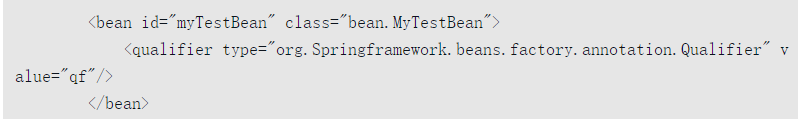

其解析过程与之前大同小异，这里不再重复叙述。

###### 3.1.2 **AbstractBeanDefinition属性** 

至此我们便完成了对XML文档到**GenericBeanDefinition**的转换，也就是说到这里，XML中所有的配置都可以在GenericBeanDefinition的实例类中找到对应的配置。GenericBeanDefinition只是子类实现，而大部分的通用属性都保存在了**AbstractBeanDefinition**中 ，具体的可以查看这个类的源码。

###### **3.1.3 解析默认标签中的自定义标签元素** 

回到一开始的解析入口， **DefaultBeanDefinitionDocumentReader** 中的方法。

```java
/**
* Process the given bean element, parsing the bean definition
* and registering it with the registry.
*/
protected void processBeanDefinition(Element ele, BeanDefinitionParserDelegate delegate) {
   BeanDefinitionHolder bdHolder = delegate.parseBeanDefinitionElement(ele);
   if (bdHolder != null) {
      bdHolder = delegate.decorateBeanDefinitionIfRequired(ele, bdHolder);
      try {
         // Register the final decorated instance.
         BeanDefinitionReaderUtils.registerBeanDefinition(bdHolder, getReaderContext().getRegistry());
      }
      catch (BeanDefinitionStoreException ex) {
         getReaderContext().error("Failed to register bean definition with name '" +
               bdHolder.getBeanName() + "'", ele, ex);
      }
      // Send registration event.
      getReaderContext().fireComponentRegistered(new BeanComponentDefinition(bdHolder));
   }
}
```

接下来，我们要进行 **bdHolder = delegate.decorateBeanDefinitionIfRequired(ele, bdHolder)** 代码的分析，首先大致了解下这句代码的作用，其实我们可以从语义上分析：**如果需要的话就对beanDefinition进行装饰**，那这句代码到底是什么功能呢？其实这句代码适用于这样的场景，如：

```xml
<bean id="test" class="test.MyClass">
    <mybean:user username="aaa"/>
</bean>
```

**当Spring中的bean使用的是默认的标签配置，但是其中的子元素却使用了自定义的配置时，这句代码便会起作用了**。可能有人会有疑问，之前讲过，对bean的解析分为两种类型，一种是默认类型的解析，另一种是自定义类型的解析，这不正是自定义类型的解析吗？为什么会在默认类型解析中单独添加一个方法处理呢？确实，这个问题很让人迷惑，但是，不知道聪明的读者是否有发现，**这个自定义类型并不是以Bean的形式出现的呢**？**我们之前讲过的两种类型的不同处理只是针对Bean的**，这里我们看到，这个自定义类型其实是属性。 好了，我们继续分析下这段代码的逻辑。 

###### 3.1.4 **注册解析的 BeanDefinition** 

对于配置文件，**解析也解析完了，装饰也装饰完了**，对于得到的beanDinition已经可以满足后续的使用要求了，**唯一还剩下的工作就是注册了**，也就是**processBeanDefinition**函数中的**BeanDefinitionReaderUtils.registerBeanDefinition(bdHolder,getReaderContext().getRegistry())代码的解析了**

```java
/**
* Register the given bean definition with the given bean factory.
* @param definitionHolder the bean definition including name and aliases
* @param registry the bean factory to register with
* @throws BeanDefinitionStoreException if registration failed
*/
public static void registerBeanDefinition(
      BeanDefinitionHolder definitionHolder, BeanDefinitionRegistry registry)
      throws BeanDefinitionStoreException {


   // Register bean definition under primary name.
   String beanName = definitionHolder.getBeanName();
   registry.registerBeanDefinition(beanName, definitionHolder.getBeanDefinition());


   // Register aliases for bean name, if any.
   String[] aliases = definitionHolder.getAliases();
   if (aliases != null) {
      for (String alias : aliases) {
         registry.registerAlias(beanName, alias);
      }
   }
}
```

从上面的代码可以看出，解析的 beanDefinition 都会被注册到 **BeanDefinitionRegistry** 类型的实例**registry**中，而对于beanDefinition的注册分成了两部分：**通过beanName的注册以及通过别名的注册**。 

###### 1 **通过beanName注册BeanDefinition**

对于beanDefinition的注册，或许很多人认为的方式就是将beanDefinition直接放入map中就好了，使用beanName作为key。确实，Spring就是这么做的，只不过除此之外，它还做了点别的事情。**BeanDefinitionRegistry 的实现类** **DefaultListableBeanFactory，上面我们有说到这个类是 spring 注册及加载 bean 的默认实现**。

```java
@Override
public void registerBeanDefinition(String beanName, BeanDefinition beanDefinition)
      throws BeanDefinitionStoreException {


   Assert.hasText(beanName, "Bean name must not be empty");
   Assert.notNull(beanDefinition, "BeanDefinition must not be null");


   if (beanDefinition instanceof AbstractBeanDefinition) {
      try {
// 注册前的最后一次校验，这里的校验不同于之前的校验，主要是对于 AbstractBeanDefinition 属性中的 methodOverrides 校验
// 检验 methodOverrides 是否与工厂方法并存或者 methodOverride 对应的方法并不存在
         ((AbstractBeanDefinition) beanDefinition).validate();
      }
      catch (BeanDefinitionValidationException ex) {
         throw new BeanDefinitionStoreException(beanDefinition.getResourceDescription(), beanName,
               "Validation of bean definition failed", ex);
      }
   }


   BeanDefinition existingDefinition = this.beanDefinitionMap.get(beanName); // 之前的版本这里是有一个 同步块
   if (existingDefinition != null) { // 处理已经注册的 beanName 的情况
      if (!isAllowBeanDefinitionOverriding()) { // 如果对应的 beanName 已经注册并且在配置中配置了 bean 不允许被覆盖，则抛出异常
         throw new BeanDefinitionOverrideException(beanName, beanDefinition, existingDefinition);
      }
      else if (existingDefinition.getRole() < beanDefinition.getRole()) {
         // e.g. was ROLE_APPLICATION, now overriding with ROLE_SUPPORT or ROLE_INFRASTRUCTURE
         if (logger.isInfoEnabled()) {
            logger.info("Overriding user-defined bean definition for bean '" + beanName +
                  "' with a framework-generated bean definition: replacing [" +
                  existingDefinition + "] with [" + beanDefinition + "]");
         }
      }
      else if (!beanDefinition.equals(existingDefinition)) { // 存在相同则替换
         if (logger.isDebugEnabled()) {
            logger.debug("Overriding bean definition for bean '" + beanName +
                  "' with a different definition: replacing [" + existingDefinition +
                  "] with [" + beanDefinition + "]");
         }
      }
      else {
         if (logger.isTraceEnabled()) {
            logger.trace("Overriding bean definition for bean '" + beanName +
                  "' with an equivalent definition: replacing [" + existingDefinition +
                  "] with [" + beanDefinition + "]");
         }
      }
      this.beanDefinitionMap.put(beanName, beanDefinition); // 放如到 beanDefinitionMap 中，注册 beanDefinition
   }
   else {
      if (hasBeanCreationStarted()) {  // 新创建的 bean
         // Cannot modify startup-time collection elements anymore (for stable iteration)
         synchronized (this.beanDefinitionMap) {
            this.beanDefinitionMap.put(beanName, beanDefinition);
            List<String> updatedDefinitions = new ArrayList<>(this.beanDefinitionNames.size() + 1);
            updatedDefinitions.addAll(this.beanDefinitionNames);
            updatedDefinitions.add(beanName);
            this.beanDefinitionNames = updatedDefinitions;
            removeManualSingletonName(beanName);
         }
      }
      else {
         // Still in startup registration phase
         this.beanDefinitionMap.put(beanName, beanDefinition); // 放到 beanDefinitionMap 中，注册 beanDefinition
         this.beanDefinitionNames.add(beanName); // 记录 beanName 
         removeManualSingletonName(beanName);
      }
      this.frozenBeanDefinitionNames = null;
   }


   if (existingDefinition != null || containsSingleton(beanName)) {
      resetBeanDefinition(beanName); // 重置所有对应 beanName 的缓存
   }
}
```

（1）对AbstractBeanDefinition的校验。在解析XML文件的时候我们提过校验，但是此校验非彼校验，之前的校验时针对于XML格式的校验，而此时的校验是针对于AbstractBean Definition的methodOverrides属性的。

（2）对beanName已经注册的情况的处理。如果设置了不允许bean的覆盖，则需要抛出异常，否则直接覆盖。

（3）加入map缓存。

（4）清除解析之前留下的对应beanName的缓存。

###### **2 通过别名注册 BeanDefinition** 

在理解了注册bean的原理后，理解注册别名的原理就容易多了。回到BeanDefinitionReaderUtils.registerBeanDefinition(bdHolder,getReaderContext().getRegistry()) 方法中查看别名注册beandefinition，具体的调用类是 **SimpleAliasRegistry** 

```java
public void registerAlias(String name, String alias) {
   Assert.hasText(name, "'name' must not be empty");
   Assert.hasText(alias, "'alias' must not be empty");
   synchronized (this.aliasMap) {
      if (alias.equals(name)) { // 如果 beanName 与 alias 相同的话，不记录 alias，并删除对应的 alias
         this.aliasMap.remove(alias);
         if (logger.isDebugEnabled()) {
            logger.debug("Alias definition '" + alias + "' ignored since it points to same name");
         }
      }
      else {
         String registeredName = this.aliasMap.get(alias); 
         if (registeredName != null) {
            if (registeredName.equals(name)) { // 注册的别名和 name 相同，不用设置别名
               // An existing alias - no need to re-register
               return;
            }
            if (!allowAliasOverriding()) { // 如果 alias 不允许被覆盖则抛出异常
               throw new IllegalStateException("Cannot define alias '" + alias + "' for name '" +
                     name + "': It is already registered for name '" + registeredName + "'.");
            }
            if (logger.isDebugEnabled()) {
               logger.debug("Overriding alias '" + alias + "' definition for registered name '" +
                     registeredName + "' with new target name '" + name + "'");
            }
         }
         checkForAliasCircle(name, alias); // 当 A->B 存在时，若再次出现 A->C->B 时候则会抛出异常
         this.aliasMap.put(alias, name); // 注册 别名
         if (logger.isTraceEnabled()) {
            logger.trace("Alias definition '" + alias + "' registered for name '" + name + "'");
         }
      }
   }
}
```

###### **3.1.5 通知监听器解析及注册完成**   

通过代码getReaderContext().fireComponentRegistered(newBeanComponentDefinition(bdHolder))完成此工作，这里的实现只为扩展，当程序开发人员需要对注册BeanDefinition事件进行监听时可以通过注册监听器的方式并将处理逻辑写入监听器中，目前在Spring中并没有对此事件做任何逻辑处理。

##### **3.2 alias 标签的解析** 

让我们回到一开始的解析元素的方法 **DefaultBeanDefinitionDocumentReader.parseDefaultElement(Element ele, BeanDefinitionParserDelegate delegate)**  

在对bean进行定义时，**除了使用id属性来指定名称之外，为了提供多个名称，可以使用alias标签来指定**。而所有的这些名称都指向同一个bean，在某些情况下提供别名非常有用，比如为了让应用的每一个组件能更容易地对公共组件进行引用。

**然而，在定义bean时就指定所有的别名并不是总是恰当的**。有时我们期望能在当前位置为那些在别处定义的bean引入别名。在XML配置文件中，可用单独的<alias/>元素来完成bean别名的定义。如配置文件中定义了一个JavaBean：

```xml
<bean id="testBean" class="com.Test"/>
```

要给这个JavaBean增加别名，以方便不同对象来调用。我们就可以直接使用bean标签中的name属性： 

```xml
<bean id="testBean" name="testBean,testBean2" class="com.Test"/>
```

同样，Spring 还有另外一种声明别名的方式:

```xml
<bean id="testBean" class="com.Test"/>
<alias name="testBean" alias="testBean,testBean2"/>
```

考虑一个更为具体的例子，组件A在XML配置文件中定义了一个名为componentA的DataSource类型的bean，但组件B却想在其XML文件中以componentB命名来引用此bean。而且在主程序MyApp的XML配置文件中，希望以myApp的名字来引用此bean。最后容器加载3个XML文件来生成最终的ApplicationContext。在此情形下，可通过在配置文件中添加下列alias元素来实现：

```xml
<alias name="componentA" alias="componentB"/>
<alias name="componentA" alias="myApp"/>
```

**这样一来，每个组件及主程序就可通过唯一名字来引用同一个数据源而互不干扰。** 

```java
/**
* Process the given alias element, registering the alias with the registry.
*/
protected void processAliasRegistration(Element ele) {
   String name = ele.getAttribute(NAME_ATTRIBUTE);  // 获取 beanName
   String alias = ele.getAttribute(ALIAS_ATTRIBUTE); // 获取 alias
   boolean valid = true;
   if (!StringUtils.hasText(name)) {
      getReaderContext().error("Name must not be empty", ele);
      valid = false;
   }
   if (!StringUtils.hasText(alias)) {
      getReaderContext().error("Alias must not be empty", ele);
      valid = false;
   }
   if (valid) {
      try {
         getReaderContext().getRegistry().registerAlias(name, alias); // 注册 alias
      }
      catch (Exception ex) {
         getReaderContext().error("Failed to register alias '" + alias +
               "' for bean with name '" + name + "'", ele, ex);
      }
      getReaderContext().fireAliasRegistered(name, alias, extractSource(ele)); // 别名注册后通知监听器做相应处理
   }
}
```

可以发现，跟之前讲过的bean中的alias解析大同小异，**都是将别名与beanName组成一对注册至registry中**。这里不再赘述。和上面的通过别名注册 beanDefinition 一样。 

##### 3.3 **import 标签的解析** 

对于Spring配置文件的编写，我想，经历过庞大项目的人，都有那种恐惧的心理，太多的配置文件了。不过，分模块是大多数人能想到的方法，但是，怎么分模块，那就仁者见仁，智者见智了。**使用import是个好办法**，例如我们可以构造这样的Spring配置文件：**applicationContext.xml**。

```java
<?xml version="1.0" encoding="UTF-8"?>
<beans xmlns="http://www.springframework.org/schema/beans"
       xmlns:xsi="http://www.w3.org/2001/XMLSchema-instance"
       xsi:schemaLocation="http://www.springframework.org/schema/beans http://www.springframework.org/schema/beans/spring-beans.xsd">


    <bean id="testChangeMethod" class="springtest.replace.bean.TestChangeMethod">
       <replaced-method name="changeMe" replacer="testMethodReplacer"/>
    </bean>
    <bean id="testMethodReplacer" class="springtest.replace.bean.TestMethodReplacer"/>
        <import resource="a.xml"/>
        <import resource="b.xml"/>
</beans>
```

applicationContext.xml 文件中使用import的方式导入有模块配置文件，以后若有新模块的加入，那就可以简单修改这个文件了。这样大大简化了配置后期维护的复杂度，并使配置模块化，易于管理。我们来看看**Spring是如何解析import配置文件的呢**？ 

```java
/**
* Parse an "import" element and load the bean definitions
* from the given resource into the bean factory.
*/
protected void importBeanDefinitionResource(Element ele) {
   String location = ele.getAttribute(RESOURCE_ATTRIBUTE);  // 获取 resource 属性
   if (!StringUtils.hasText(location)) { // 没有属性不做任何处理
      getReaderContext().error("Resource location must not be empty", ele);
      return;
   }


   // Resolve system properties: e.g. "${user.dir}"  获取通配符配置的路劲
   location = getReaderContext().getEnvironment().resolveRequiredPlaceholders(location);


   Set<Resource> actualResources = new LinkedHashSet<>(4);


   // Discover whether the location is an absolute or relative URI 判断时相对路径还是绝对路径
   boolean absoluteLocation = false;
   try {
      absoluteLocation = ResourcePatternUtils.isUrl(location) || ResourceUtils.toURI(location).isAbsolute();
   }
   catch (URISyntaxException ex) {
      // cannot convert to an URI, considering the location relative
      // unless it is the well-known Spring prefix "classpath*:"
   }


   // Absolute or relative?
   if (absoluteLocation) { // 绝对路径处理操作，直接根据地址加载对应的配置文件
      try {
         int importCount = getReaderContext().getReader().loadBeanDefinitions(location, actualResources);
         if (logger.isTraceEnabled()) {
            logger.trace("Imported " + importCount + " bean definitions from URL location [" + location + "]");
         }
      }
      catch (BeanDefinitionStoreException ex) {
         getReaderContext().error(
               "Failed to import bean definitions from URL location [" + location + "]", ele, ex);
      }
   }
   else { 
      // No URL -> considering resource location as relative to the current file.
      try {
         int importCount;  // 根据相对地址计算出绝对地址
         Resource relativeResource = getReaderContext().getResource().createRelative(location);
         if (relativeResource.exists()) {
            importCount = getReaderContext().getReader().loadBeanDefinitions(relativeResource);
            actualResources.add(relativeResource);
         }
         else {
            String baseLocation = getReaderContext().getResource().getURL().toString();
            importCount = getReaderContext().getReader().loadBeanDefinitions(
                  StringUtils.applyRelativePath(baseLocation, location), actualResources);
         }
         if (logger.isTraceEnabled()) {
            logger.trace("Imported " + importCount + " bean definitions from relative location [" + location + "]");
         }
      }
      catch (IOException ex) {
         getReaderContext().error("Failed to resolve current resource location", ele, ex);
      }
      catch (BeanDefinitionStoreException ex) {
         getReaderContext().error(
               "Failed to import bean definitions from relative location [" + location + "]", ele, ex);
      }
   }
   Resource[] actResArray = actualResources.toArray(new Resource[0]);
   getReaderContext().fireImportProcessed(location, actResArray, extractSource(ele));
}
```

##### **3.4 嵌入式 beans 标签的解析** 

待续。。。


#### 4 自定义标签的解析 

spring中存在默认标签与自定义标签两种，上一章中是 默认标签的解析，这一章节是自定义标签的解析。回到一开是解析标签的代码：**DefaultBeanDefinitionDocumentReader**。

```java
protected void parseBeanDefinitions(Element root, BeanDefinitionParserDelegate delegate) {
   if (delegate.isDefaultNamespace(root)) {
      NodeList nl = root.getChildNodes();
      for (int i = 0; i < nl.getLength(); i++) {
         Node node = nl.item(i);
         if (node instanceof Element) {
            Element ele = (Element) node;
            if (delegate.isDefaultNamespace(ele)) {
               parseDefaultElement(ele, delegate); // 默认标签解析
            }
            else {
               delegate.parseCustomElement(ele); // 自定义标签解析
            }
         }
      }
   }
   else {
      delegate.parseCustomElement(root);
   }
}
```

略。。。

##### **4.1 自定义标签使用**  

在很多情况下，我们需要为系统提供可配置化支持，简单的做法可以直接基于Spring的标准bean来配置，但配置较为复杂或者需要更多丰富控制的时候，会显得非常笨拙。一般的做法会用原生态的方式去解析定义好的XML文件，然后转化为配置对象。这种方式当然可以解决所有问题，但实现起来比较繁琐，特别是在配置非常复杂的时候，解析工作是一个不得不考虑的负担。Spring提供了可扩展Schema的支持，这是一个不错的折中方案，扩展Spring自定义标签配置大致需要以下几个步骤（前提是要把Spring的Core包加入项目中）。

- 创建一个需要扩展的组件。
- 定义一个XSD文件描述组件内容。
- 创建一个文件，实现BeanDefinitionParser接口，用来解析XSD文件中的定义和组件定义。
- 创建一个Handler文件，扩展自NamespaceHandlerSupport，目的是将组件注册到Spring容器。
- 编写Spring.handlers和Spring.schemas文件。

步骤：

```java
//（1）首先我们创建一个普通的 POJO，这个 POJO 没有任何特别之处，只用来接收配置文件
public class User {
    private String userName;
    private String email;

    // getter and setter
}

//（2）定义一个XSD文件描述组件内容。
user.xsd XSD文件是XML DTD的替代者
<?xml version="1.0" encoding="UTF-8"?>
<schema xmlns="http://www.w3.org/2001/XMLSchema"
        targetNamespace="http://www.lexueba.com/schema/user"
        xmlns:tns="http://www.lexueba.com/schema/user"
        elementFormDefault="qualified">
    <element name="user">
        <complexType>
            <attribute name="id" type="string"/>
            <attribute name="userName" type="string"/>
            <attribute name="email" type="string"/>
        </complexType>
    </element>
</schema>
            
//（3）创建一个文件，实现BeanDefinitionParser接口，用来解析XSD文件中的定义和组件定义。
package springtest.custom.label;

import org.springframework.beans.factory.support.BeanDefinitionBuilder;
import org.springframework.beans.factory.xml.AbstractSingleBeanDefinitionParser;
import org.springframework.util.StringUtils;
import org.w3c.dom.Element;

public class UserBeanDefinitionParse extends AbstractSingleBeanDefinitionParser {
    // element 对应的类
    @Override
    protected Class<?> getBeanClass(Element element) {
        return User.class;
    }
    // 从 element 中解析并提取对应的元素
    @Override
    protected void doParse(Element element, BeanDefinitionBuilder builder) {
//        super.doParse(element, builder);
        String userName = element.getAttribute("userName");
        String email = element.getAttribute("email");
        // 将提取到的数据放入到 builder 中
        if (StringUtils.hasText(userName)) {
            builder.addPropertyValue("userName", userName);
        }


        if (StringUtils.hasText(email)) {
            builder.addPropertyValue("email", email);
        }
    }
}

//（4）创建一个Handler文件，扩展自NamespaceHandlerSupport，目的是将组件注册到Spring容器。
package springtest.custom.label;

import org.springframework.beans.factory.xml.NamespaceHandlerSupport;

public class MyNamespaceHandler extends NamespaceHandlerSupport {
    @Override
    public void init() {
        registerBeanDefinitionParser("user", new UserBeanDefinitionParse());
    }
}

//（5）编写Spring.handlers和Spring.schemas文件，默认位置是在工程的/META-INF/文件夹下，当然，你可以通过Spring的扩展或者修改源码的方式改变路径。
 在 resources 下创建 META-INF 文件夹，并创建两个文件,user.xsd 也在这个文件夹下面
spring.handlers
http\://www.lexueba.com/schema/user=springtest.custom.label.MyNamespaceHandler

spring.schemas
http\://www.lexueba.com/schema/user.xsd=META-INF/user.xsd

到这里，自定义的配置就结束了，而Spring加载自定义的大致流程是遇到自定义标签然后就去Spring.handlers和Spring.schemas中去找对应的handler和XSD，默认位置是/META-INF/下，进而有找到对应的handler以及解析元素的Parser，从而完成了整个自定义元素的解析，也就是说自定义与Spring中默认的标准配置不同在于Spring将自定义标签解析的工作委托给了用户去实现。 
    
//（6）创建测试配置文件，在配置文件中引入对应的命名空间以及XSD后，便可以直接使用自定义标签了
<?xml version="1.0" encoding="UTF-8"?>
<beans xmlns="http://www.springframework.org/schema/beans"
       xmlns:xsi="http://www.w3.org/2001/XMLSchema-instance"
       xmlns:myname="http://www.lexueba.com/schema/user"
       xsi:schemaLocation="http://www.springframework.org/schema/beans http://www.springframework.org/schema/beans/spring-beans.xsd
        http://www.lexueba.com/schema/user http://www.lexueba.com/schema/user.xsd">

    <myname:user id="testBean" userName="aaa" email="bbb"/>
</beans>
        
        
// （7）测试
@Test
public void test() {
    ApplicationContext bf = new ClassPathXmlApplicationContext("classpath:customLabel.xml");
    User user = (User) bf.getBean("testBean");
    System.out.println(user.getUserName() + "," + user.getEmail());
}
// 输出 aaa,bbb
```

在Spring中自定义标签非常常用，例如我们熟知的事务标签：tx(<tx:annotation-driven>)。 常见的有一些类：

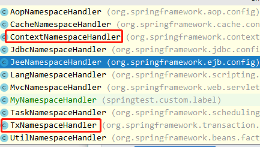

##### **4.2 自定义标签解析**   

先暂时略过。。。

这里我们可以看事务标签的一个解析过程：可以看到事务的标签是会走到自定义的解析判断中去的。

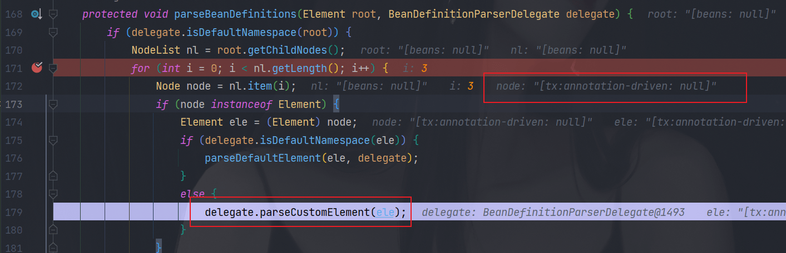

随后走到 org.springframework.beans.factory.xml.BeanDefinitionParserDelegate#parseCustomElement(org.w3c.dom.Element, org.springframework.beans.factory.config.BeanDefinition) 中来，根据事务标签对应的一个命名空间来判断用哪个解析器来解析。这里的解析器是在一开始的就已经注册进去了。

```java
public BeanDefinition parseCustomElement(Element ele, @Nullable BeanDefinition containingBd) {
   String namespaceUri = getNamespaceURI(ele);
   if (namespaceUri == null) {
      return null;
   }
   NamespaceHandler handler = this.readerContext.getNamespaceHandlerResolver().resolve(namespaceUri);
   if (handler == null) {
      error("Unable to locate Spring NamespaceHandler for XML schema namespace [" + namespaceUri + "]", ele);
      return null;
   }
   return handler.parse(ele, new ParserContext(this.readerContext, this, containingBd));
}
```

查看截图 namespaceUri = http://www.springframework.org/schema/tx, 继续往后面走，查看是具体的哪个handler。

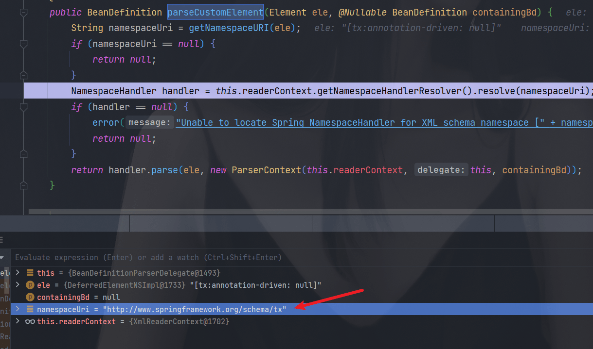

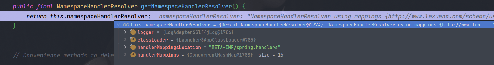

继续调用resolve，方法里面可以看到有一个map存储了所有的namespaceurl

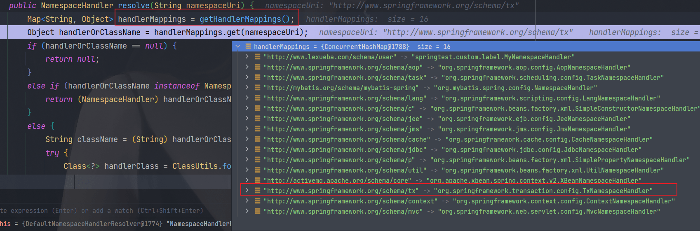

###### 注册事务的一些标签的解析器

在TxNamespaceHandler中调用了init方法，至于这个命名空间适合是加入到mapping的呢？

```java
public void init() {
   registerBeanDefinitionParser("advice", new TxAdviceBeanDefinitionParser());
   registerBeanDefinitionParser("annotation-driven", new AnnotationDrivenBeanDefinitionParser());
   registerBeanDefinitionParser("jta-transaction-manager", new JtaTransactionManagerBeanDefinitionParser());
}
```

随后这个对应的handler被初始化后，重新放入了mapping中：


###### 继续调用handler来解析这个标签

org.springframework.beans.factory.xml.NamespaceHandlerSupport#parse 中去判断用哪个parser来解析，随后去到 AnnotationDrivenBeanDefinitionParser 中去执行解析流程了。随后就是有关于事务相关的一些源码解析了，具体可以看事务的分析。

```java
public BeanDefinition parse(Element element, ParserContext parserContext) {
   BeanDefinitionParser parser = findParserForElement(element, parserContext);
   return (parser != null ? parser.parse(element, parserContext) : null);
}
```

#### 5 bean 的加载

经过前面的分析，我们终于结束了对XML配置文件的解析，接下来将会面临更大的挑战，就是对bean加载的探索。bean加载的功能实现远比bean的解析要复杂得多，同样，我们还是以本书开篇的示例为基础，对于加载bean的功能，在Spring中的调用方式为：

```java
GetBeanTest test = (GetBeanTest) bf.getBean("getBeanTest")
```

这句代码实现了什么样的功能？我们可以快速体验一下 Spring 中代码是如何实现的。 

```java
public Object getBean(String name) throws BeansException {
   return doGetBean(name, null, null, false);
}

protected <T> T doGetBean(final String name, @Nullable final Class<T> requiredType,
      @Nullable final Object[] args, boolean typeCheckOnly) throws BeansException {
// 提取对应的 beanName
   final String beanName = transformedBeanName(name);
   Object bean;

   // Eagerly check singleton cache for manually registered singletons.
/**
检查缓存中或者示例工厂中是否有对应的示例。为啥那么会有这个代码呢？因为在创建单例 bean 的时候会存在依赖注入的情况，而在创建依赖的时候为了避免循环依赖，spring 创建 bean 的原则是不等 bean 创建完成就会将 bean 的 ObjectFactory 提早曝光，也就是将 ObjectFactory 加入到缓存中，一旦下个 bean 创建时候需要依赖上一个 bean 则直接使用 ObjectFactory。  直接尝试从缓存中去获取或者 singletonFactories 中的 ObjectFactory 中获取。
*/
   Object sharedInstance = getSingleton(beanName);
   if (sharedInstance != null && args == null) {
      if (logger.isTraceEnabled()) {
         if (isSingletonCurrentlyInCreation(beanName)) {
            logger.trace("Returning eagerly cached instance of singleton bean '" + beanName +
                  "' that is not fully initialized yet - a consequence of a circular reference");
         }
         else {
            logger.trace("Returning cached instance of singleton bean '" + beanName + "'");
         }
      }
// 返回对应的实例，有时候存在诸如 BeanFactory 的情况并不是直接返回实例本身而是返回指定方法返回的实例
      bean = getObjectForBeanInstance(sharedInstance, name, beanName, null);
   }

   else {
      // Fail if we're already creating this bean instance:
      // We're assumably within a circular reference.
// 只有在单例模式下才会尝试解决循环依赖，原型模式下，如果存在 A 中有 B 的属性，B 中有 A 的属性，那么当依赖注入的时候，就会产生当 A 还未创建完的时候因为对于 B 的创建再次返回创建 A ，造成循环依赖，也就是下面的情况。
      if (isPrototypeCurrentlyInCreation(beanName)) {
         throw new BeanCurrentlyInCreationException(beanName);
      }


      // Check if bean definition exists in this factory. 如果 beanDefinitionMap 中也就是在所有已经加载的类中不包括 beanName 则尝试从parentBeanFactory检测
      BeanFactory parentBeanFactory = getParentBeanFactory();
      if (parentBeanFactory != null && !containsBeanDefinition(beanName)) {
         // Not found -> check parent.
         String nameToLookup = originalBeanName(name);
         if (parentBeanFactory instanceof AbstractBeanFactory) { // 继续递归到 BeanFactory 中寻找
            return ((AbstractBeanFactory) parentBeanFactory).doGetBean(
                  nameToLookup, requiredType, args, typeCheckOnly);
         }
         else if (args != null) {
            // Delegation to parent with explicit args.
            return (T) parentBeanFactory.getBean(nameToLookup, args);
         }
         else if (requiredType != null) {
            // No args -> delegate to standard getBean method.
            return parentBeanFactory.getBean(nameToLookup, requiredType);
         }
         else {
            return (T) parentBeanFactory.getBean(nameToLookup);
         }
      }

        // 如果不是仅仅做类型检查则是创建 bean ，这里要进行记录
      if (!typeCheckOnly) {
         markBeanAsCreated(beanName);
      }


      try {
// 将存储 xml 配置文件的 GenericBeanDefinition 转换成 RootBeanDefinition,如果指定 BeanName 是子 bean 的话同时会合并父类的属性
         final RootBeanDefinition mbd = getMergedLocalBeanDefinition(beanName);
         checkMergedBeanDefinition(mbd, beanName, args);


         // Guarantee initialization of beans that the current bean depends on.
// 如果存在依赖则需要递归实例化依赖的bean
         String[] dependsOn = mbd.getDependsOn();
         if (dependsOn != null) {
            for (String dep : dependsOn) {
               if (isDependent(beanName, dep)) {
                  throw new BeanCreationException(mbd.getResourceDescription(), beanName,
                        "Circular depends-on relationship between '" + beanName + "' and '" + dep + "'");
               }
               registerDependentBean(dep, beanName); // 缓存依赖调用
               try {
                  getBean(dep);
               }
               catch (NoSuchBeanDefinitionException ex) {
                  throw new BeanCreationException(mbd.getResourceDescription(), beanName,
                        "'" + beanName + "' depends on missing bean '" + dep + "'", ex);
               }
            }
         }


         // Create bean instance. 实例化 mbd 本身
         if (mbd.isSingleton()) { 
            sharedInstance = getSingleton(beanName, () -> {
               try {
                  return createBean(beanName, mbd, args);
               }
               catch (BeansException ex) {
                  // Explicitly remove instance from singleton cache: It might have been put there
                  // eagerly by the creation process, to allow for circular reference resolution.
                  // Also remove any beans that received a temporary reference to the bean.
                  destroySingleton(beanName);
                  throw ex;
               }
            });
            bean = getObjectForBeanInstance(sharedInstance, name, beanName, mbd);
         }


         else if (mbd.isPrototype()) { // 原型类型
            // It's a prototype -> create a new instance.
            Object prototypeInstance = null;
            try {
               beforePrototypeCreation(beanName);
               prototypeInstance = createBean(beanName, mbd, args);
            }
            finally {
               afterPrototypeCreation(beanName);
            }
            bean = getObjectForBeanInstance(prototypeInstance, name, beanName, mbd);
         }


         else { // 指定的 scope 
            String scopeName = mbd.getScope();
            final Scope scope = this.scopes.get(scopeName);
            if (scope == null) {
               throw new IllegalStateException("No Scope registered for scope name '" + scopeName + "'");
            }
            try {
               Object scopedInstance = scope.get(beanName, () -> {
                  beforePrototypeCreation(beanName);
                  try {
                     return createBean(beanName, mbd, args);
                  }
                  finally {
                     afterPrototypeCreation(beanName);
                  }
               });
               bean = getObjectForBeanInstance(scopedInstance, name, beanName, mbd);
            }
            catch (IllegalStateException ex) {
               throw new BeanCreationException(beanName,
                     "Scope '" + scopeName + "' is not active for the current thread; consider " +
                     "defining a scoped proxy for this bean if you intend to refer to it from a singleton",
                     ex);
            }
         }
      }
      catch (BeansException ex) {
         cleanupAfterBeanCreationFailure(beanName);
         throw ex;
      }
   }

   // Check if required type matches the type of the actual bean instance.
   if (requiredType != null && !requiredType.isInstance(bean)) {
      try {
         T convertedBean = getTypeConverter().convertIfNecessary(bean, requiredType);
         if (convertedBean == null) {
            throw new BeanNotOfRequiredTypeException(name, requiredType, bean.getClass());
         }
         return convertedBean;
      }
      catch (TypeMismatchException ex) {
         if (logger.isTraceEnabled()) {
            logger.trace("Failed to convert bean '" + name + "' to required type '" +
                  ClassUtils.getQualifiedName(requiredType) + "'", ex);
         }
         throw new BeanNotOfRequiredTypeException(name, requiredType, bean.getClass());
      }
   }
   return (T) bean;
}
```

对于加载过程中所涉及的步骤大致如下：

**（1）转换对应beanName**。

或许很多人不理解转换对应beanName是什么意思，传入的参数name不就是beanName吗？其实不是，这里传入的参数可能是别名，也可能是FactoryBean，所以需要进行一系列的解析，这些解析内容包括如下内容。

- 去除FactoryBean的修饰符，也就是如果name="&aa"，那么会首先去除&而使name="aa"。
- 取指定alias所表示的最终beanName，例如别名A指向名称为B的bean则返回B；若别名A指向别名B，别名B又指向名称为C的bean则返回C。

**（2）尝试从缓存中加载单例。**

**单例在Spring的同一个容器内只会被创建一次，后续再获取bean，就直接从单例缓存中获取了**。当然这里也只是尝试加载，首先尝试从缓存中加载，如果加载不成功则再次尝试从**singletonFactories**中加载。因为在创建单例bean的时候会存在依赖注入的情况，而在创建依赖的时候为了避免循环依赖，在Spring中创建bean的原则是不等bean创建完成就会将创建bean的ObjectFactory提早曝光加入到缓存中，一旦下一个bean创建时候需要依赖上一个bean则直接使用ObjectFactory（后面章节会对循环依赖重点讲解）。

**（3）bean的实例化。**

如果从缓存中得到了bean的原始状态，则需要对bean进行实例化。这里有必要强调一下，**缓存中记录的只是最原始的bean状态**，并不一定是我们最终想要的bean。举个例子，假如我们需要对工厂bean进行处理，那么这里得到的其实是工厂bean的初始状态，但是我们真正需要的是工厂bean中定义的factory-method方法中返回的bean，而getObjectForBeanInstance就是完成这个工作的，后续会详细讲解。 

**（4）原型模式的依赖检查。**

只有在单例情况下才会尝试解决循环依赖，如果存在A中有B的属性，B中有A的属性，那么当依赖注入的时候，就会产生当A还未创建完的时候因为对于B的创建再次返回创建A，造成循环依赖，也就是情况：isPrototypeCurrentlyInCreation(beanName)判断true。

**（5）检测parentBeanFactory。**

从代码上看，如果缓存没有数据的话直接转到父类工厂上去加载了，这是为什么呢？可能读者忽略了一个很重要的判断条件：parentBeanFactory != null && !containsBeanDefinition (beanName)，parentBeanFactory != null。parentBeanFactory如果为空，则其他一切都是浮云，这个没什么说的，但是!containsBeanDefinition(beanName)就比较重要了，它是在检测如果当前加载的XML配置文件中不包含beanName所对应的配置，就只能到parentBeanFactory去尝试下了，然后再去递归的调用getBean方法。

**（6）将存储XML配置文件的GernericBeanDefinition转换为RootBeanDefinition。**

 因为从XML配置文件中读取到的Bean信息是存储在GernericBeanDefinition中的，但是所有的Bean后续处理都是针对于RootBeanDefinition的，所以这里需要进行一个转换，转换的同时如果父类bean不为空的话，则会一并合并父类的属性。

**（7）寻找依赖。** 

因为bean的初始化过程中很可能会用到某些属性，而某些属性很可能是动态配置的，并且配置成依赖于其他的bean，那么这个时候就有必要先加载依赖的bean，所以，在Spring的加载顺寻中，在初始化某一个bean的时候首先会初始化这个bean所对应的依赖。

**（8）针对不同的scope进行bean的创建。**

 我们都知道，在Spring中存在着不同的scope，其中默认的是singleton，但是还有些其他的配置诸如prototype、request之类的。在这个步骤中，Spring会根据不同的配置进行不同的初始化策略。

**（9）类型转换。**

程序到这里返回bean后已经基本结束了，通常对该方法的调用参数requiredType是为空的，但是可能会存在这样的情况，返回的bean其实是个String，但是requiredType却传入Integer类型，那么这时候本步骤就会起作用了，它的功能是将返回的bean转换为requiredType所指定的类型。当然，String转换为Integer是最简单的一种转换，在Spring中提供了各种各样的转换器，用户也可以自己扩展转换器来满足需求。

经过上面的步骤后bean的加载就结束了，这个时候就可以返回我们所需要的bean了。

##### **5.1 FactoryBean 的使用** 

一般情况下，Spring通过反射机制利用bean的class属性指定实现类来实例化bean 。在某些情况下，实例化bean过程比较复杂，如果按照传统的方式，则需要在<bean>中提供大量的配置信息，配置方式的灵活性是受限的，这时采用编码的方式可能会得到一个简单的方案。

Spring为此提供了一个**org.Springframework.bean.factory.FactoryBean的工厂类接口，用户可以通过实现该接口定制实例化bean的逻辑**。 

##### BeanFactory 和 FactoryBean 的差别

**BeanFactory 则是用来加载和注册bean 的**。

FactoryBean接口对于Spring框架来说占有重要的地位，Spring自身就提供了70多个FactoryBean的实现。它们隐藏了实例化一些复杂bean的细节，给上层应用带来了便利。从Spring 3.0开始，FactoryBean开始支持泛型，即接口声明改为FactoryBean<T>的形式： 

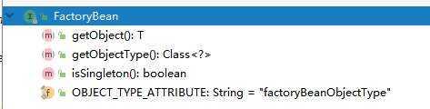

在该接口中还定义了以下3个方法。

- T getObject()：**返回由FactoryBean创建的bean实例，如果isSingleton()返回true，则该实例会放到Spring容器中单实例缓存池中**。
- boolean isSingleton()：返回由FactoryBean创建的bean实例的作用域是singleton还是prototype。Class<T> 
- getObjectType()：返回FactoryBean创建的bean类型。

当配置文件中<bean>的class属性配置的实现类是**FactoryBean时，通过getBean()方法返回的不是FactoryBean本身，而是FactoryBean#getObject()方法所返回的对象，相当于FactoryBean#getObject()代理了getBean()方法**。例如：如果使用传统方式配置下面Car的<bean>时，Car的每个属性分别对应一个<property>元素标签。

```java
public class Car {
    private int maxSpeed;
    private String brand;
    private double price;
// getter setter
}
public class CarFactoryBean implements FactoryBean<Car> {
    private String carInfo;
    @Override
    public Car getObject() throws Exception {
        Car car = new Car();
        String[] infos = carInfo.split(",");
        car.setBrand(infos[0]);
        car.setMaxSpeed(Integer.parseInt(infos[1]));
        car.setPrice(Double.parseDouble(infos[2]));
        return car;
    }


    @Override
    public Class<Car> getObjectType() {
        return Car.class;
    }


    @Override
    public boolean isSingleton() {
        return false;
    }


    public String getCarInfo() {
        return carInfo;
    }

    public void setCarInfo(String carInfo) {
        this.carInfo = carInfo;
    }
}

配置文件
<?xml version="1.0" encoding="UTF-8"?>
<beans xmlns="http://www.springframework.org/schema/beans"
       xmlns:xsi="http://www.w3.org/2001/XMLSchema-instance"
       xsi:schemaLocation="http://www.springframework.org/schema/beans http://www.springframework.org/schema/beans/spring-beans.xsd">


    <bean id="car" class="springtest.CarFactoryBean">
        <property name="carInfo" value="超级跑车,400, 200000"/>
    </bean>
</beans>
        
测试
@Test
public void testFactoryBean() {
    ClassPathXmlApplicationContext bf2 = new ClassPathXmlApplicationContext("classpath:test.xml");
    Car car = (Car) bf2.getBean("car");
    System.out.println(car.getBrand()); 
// 输出：超级跑车
}
```

##### **5.2 缓存中获取单例bean** 

```java
public Object getSingleton(String beanName) {
   return getSingleton(beanName, true);
}
protected Object getSingleton(String beanName, boolean allowEarlyReference) {
   Object singletonObject = this.singletonObjects.get(beanName); // 检查缓存中是否存在实例 一级缓存
   if (singletonObject == null && isSingletonCurrentlyInCreation(beanName)) {
      synchronized (this.singletonObjects) { // 如果为空，则锁定全局变量并进行处理
         singletonObject = this.earlySingletonObjects.get(beanName); // 如果此 bean 正在加载则不处理  二级缓存
         if (singletonObject == null && allowEarlyReference) {
// 当某些方法需要提前初始化的时候则会调用 addSingletonFactory 方法将对应的 ObjectFactory 初始化策略存储在 singletonFactories 中。 三级缓存
            ObjectFactory<?> singletonFactory = this.singletonFactories.get(beanName);  // 三级缓存
            
            if (singletonFactory != null) {
// 调用预先设定的 getObejct() 方法，
               singletonObject = singletonFactory.getObject();
// 记录在缓存中，earlySingletonObjects 和 singletonFactories 互斥
               this.earlySingletonObjects.put(beanName, singletonObject); // 添加二级缓存
               this.singletonFactories.remove(beanName); // 移除三级缓存
            }
         }
      }
   }
   return singletonObject;
}
```

**ObjectFactory：Defines a factory which can return an Object instance (possibly shared or independent) when invoked**.

这个方法首先尝试从**singletonObjects**里面获取实例，如果获取不到再从**earlySingletonObjects**里面获取，如果还获取不到，再尝试从**singletonFactories**里面获取beanName对应的ObjectFactory，然后调用这个ObjectFactory的getObject来创建bean，并放到earlySingletonObjects里面去，并且从singletonFacotories里面remove掉这个ObjectFactory，而对于后续的所有内存操作都只为了循环依赖检测时候使用，也就是在allowEarlyReference为true的情况下才会使用。

- **singletonObjects**：用于保存BeanName和创建bean实例之间的关系，bean name -->bean instance
- **earlySingletonObjects**：也是保存BeanName和创建bean实例之间的关系，与singletonObjects的不同之处在于，当一个单例bean被放到这里面后，那么当bean还在创建过程中，就可以通过getBean方法获取到了，**其目的是用来检测循环引用**。
- **singletonFactories**：用于保存BeanName和创建bean的工厂之间的关系，bean name -->ObjectFactory。

##### **5.3 从bean的实例中获取对象**  

在getBean方法中，getObjectForBeanInstance是个高频率使用的方法，无论是从缓存中获得bean还是根据不同的scope策略加载bean。总之，我们得到bean的实例后要做的第一步就是调用这个方法来检测一下正确性，**其实就是用于检测当前bean是否是FactoryBean类型的bean，如果是，那么需要调用该bean对应的FactoryBean实例中的getObject()作为返回值**。 

无论是从缓存中获取到的bean还是通过不同的scope策略加载的bean都只是最原始的bean状态，并不一定是我们最终想要的bean。举个例子，假如我们需要对工厂bean进行处理，那么这里得到的其实是**工厂bean的初始状态**，**但是我们真正需要的是工厂bean中定义的factory-method方法中返回的bean，而getObjectForBeanInstance方法就是完成这个工作的**。

尽可能保证所有bean初始化后都会调用注册的BeanPostProcessor的postProcessAfterInitialization方法进行处理，在实际开发过程中大可以针对此特性设计自己的业务逻辑。

##### **5.4 获取单例**  

之前我们讲解了从缓存中获取单例的过程，那么，**如果缓存中不存在已经加载的单例bean就需要从头开始bean的加载过程**了，而Spring中使用getSingleton的重载方法实现bean的加载过程。

```java
public Object getSingleton(String beanName, ObjectFactory<?> singletonFactory) {
   Assert.notNull(beanName, "Bean name must not be null");
   synchronized (this.singletonObjects) { // 全局变量需要同步
      Object singletonObject = this.singletonObjects.get(beanName); // 首先检查对应的 bean 是否已经加载过，因为 singleton 模式其实就是复用以创建 bean，所以这一步是必须的
      if (singletonObject == null) { // 如果为空才可以进行 singleton 的初始化
         if (this.singletonsCurrentlyInDestruction) {
            throw new BeanCreationNotAllowedException(beanName,
                  "Singleton bean creation not allowed while singletons of this factory are in destruction " +
                  "(Do not request a bean from a BeanFactory in a destroy method implementation!)");
         }
         if (logger.isDebugEnabled()) {
            logger.debug("Creating shared instance of singleton bean '" + beanName + "'");
         }
         beforeSingletonCreation(beanName); // 里面的工作是：记录 bean 的加载状态
         boolean newSingleton = false;
         boolean recordSuppressedExceptions = (this.suppressedExceptions == null);
         if (recordSuppressedExceptions) {
            this.suppressedExceptions = new LinkedHashSet<>();
         }
         try {
    // 初始化 bean
            singletonObject = singletonFactory.getObject();
            newSingleton = true;
         }
         catch (IllegalStateException ex) {
            // Has the singleton object implicitly appeared in the meantime ->
            // if yes, proceed with it since the exception indicates that state.
            singletonObject = this.singletonObjects.get(beanName);
            if (singletonObject == null) {
               throw ex;
            }
         }
         catch (BeanCreationException ex) {
            if (recordSuppressedExceptions) {
               for (Exception suppressedException : this.suppressedExceptions) {
                  ex.addRelatedCause(suppressedException);
               }
            }
            throw ex;
         }
         finally {
            if (recordSuppressedExceptions) {
               this.suppressedExceptions = null;
            }
            afterSingletonCreation(beanName); // 移除 bean 的加载状态
         }
         if (newSingleton) {
// 加入缓存
            addSingleton(beanName, singletonObject);
         }
      }
      return singletonObject;
   }
}
// 记录 bean 的加载状态
protected void beforeSingletonCreation(String beanName) {
   if (!this.inCreationCheckExclusions.contains(beanName) && !this.singletonsCurrentlyInCreation.add(beanName)) {
      throw new BeanCurrentlyInCreationException(beanName);
   }
}
// 移除 bean 的加载状态
protected void afterSingletonCreation(String beanName) {
   if (!this.inCreationCheckExclusions.contains(beanName) && !this.singletonsCurrentlyInCreation.remove(beanName)) {
      throw new IllegalStateException("Singleton '" + beanName + "' isn't currently in creation");
   }
}
```

上述代码中其实是使用了回调方法，使得程序可以在单例创建的前后做一些准备及处理操作，而真正的获取单例bean的方法其实并不是在此方法中实现的，其**实现逻辑是在ObjectFactory类型的实例singletonFactory中实现的**。而这些准备及处理操作包括如下内容。 

（1）检查缓存是否已经加载过。

（2）若没有加载，则记录beanName的正在加载状态。

（3）**加载单例前记录加载状态**。可能你会觉得beforeSingletonCreation方法是个空实现，里面没有任何逻辑，但其实不是，这个函数中做了一个很重要的操作：**记录加载状态，也就是通过this.singletonsCurrentlyInCreation.add(beanName)将当前正要创建的bean记录在缓存中，这样便可以对循环依赖进行检测**。 

（4）通过调用参数传入的ObjectFactory的个体Object方法实例化bean。

（5）加载单例后的处理方法调用。同步骤（3）的记录加载状态相似，**当bean加载结束后需要移除缓存中对该bean的正在加载状态的记录**。

（6）将结果记录至缓存并删除加载bean过程中所记录的各种辅助状态。

（7）返回处理结果。

```java
sharedInstance = getSingleton(beanName, () -> {
   try {
      return createBean(beanName, mbd, args);
   }
   catch (BeansException ex) {
      // Explicitly remove instance from singleton cache: It might have been put there
      // eagerly by the creation process, to allow for circular reference resolution.
      // Also remove any beans that received a temporary reference to the bean.
      destroySingleton(beanName);
      throw ex;
   }
});
```

ObjectFactory的核心部分其实只是调用了createBean的方法，所以我们还需要到createBean方法中追寻真理。

##### **5.5 准备创建bean**  

我们不可能指望在一个函数中完成一个复杂的逻辑，而且我们跟踪了这么多Spring代码，经历了这么多函数，或多或少也发现了一些规律：一个真正干活的函数其实是以do开头的，比如doGetObjectFromFactoryBean；而给我们错觉的函数，比如getObjectFromFactoryBean，其实只是从全局角度去做些统筹的工作。 这个规则对于createBean也不例外，那么让我们看看在createBean函数中做了哪些准备工作。 

```java
/**
* Central method of this class: creates a bean instance,
* populates the bean instance, applies post-processors, etc.
* @see #doCreateBean
*/
@Override
protected Object createBean(String beanName, RootBeanDefinition mbd, @Nullable Object[] args)
      throws BeanCreationException {

   if (logger.isTraceEnabled()) {
      logger.trace("Creating instance of bean '" + beanName + "'");
   }
   RootBeanDefinition mbdToUse = mbd;


   // Make sure bean class is actually resolved at this point, and
   // clone the bean definition in case of a dynamically resolved Class
   // which cannot be stored in the shared merged bean definition.
   Class<?> resolvedClass = resolveBeanClass(mbd, beanName);
   if (resolvedClass != null && !mbd.hasBeanClass() && mbd.getBeanClassName() != null) {
      mbdToUse = new RootBeanDefinition(mbd);
      mbdToUse.setBeanClass(resolvedClass);
   }


   // Prepare method overrides.
   try {
      mbdToUse.prepareMethodOverrides();
   }
   catch (BeanDefinitionValidationException ex) {
      throw new BeanDefinitionStoreException(mbdToUse.getResourceDescription(),
            beanName, "Validation of method overrides failed", ex);
   }


   try {
      // Give BeanPostProcessors a chance to return a proxy instead of the target bean instance.给 BeanPostProcessors 一个机会来返回代理来代理真正的实例
      Object bean = resolveBeforeInstantiation(beanName, mbdToUse);
      if (bean != null) {
         return bean;
      }
   }
   catch (Throwable ex) {
      throw new BeanCreationException(mbdToUse.getResourceDescription(), beanName,
            "BeanPostProcessor before instantiation of bean failed", ex);
   }


   try {
      Object beanInstance = doCreateBean(beanName, mbdToUse, args);
      if (logger.isTraceEnabled()) {
         logger.trace("Finished creating instance of bean '" + beanName + "'");
      }
      return beanInstance;
   }
   catch (BeanCreationException | ImplicitlyAppearedSingletonException ex) {
      // A previously detected exception with proper bean creation context already,
      // or illegal singleton state to be communicated up to DefaultSingletonBeanRegistry.
      throw ex;
   }
   catch (Throwable ex) {
      throw new BeanCreationException(
            mbdToUse.getResourceDescription(), beanName, "Unexpected exception during bean creation", ex);
   }
}
```

###### **5.5.1 处理ovverride属性**  


###### **5.5.2 实例化的前置处理** 

在真正调用doCreate方法创建bean的实例前使用了这样一个方法**resolveBeforeInstantiation(beanName, mbd)**对BeanDefinigiton中的属性做些前置处理。当然，无论其中是否有相应的逻辑实现我们都可以理解，因为真正逻辑实现前后留有处理函数也是可扩展的一种体现，但是，这并不是最重要的，在函数中还提供了一个短路判断，这才是最为关键的部分。

```java
if (bean != null) {
   return bean;
}
```

当经过前置处理后返回的结果如果不为空，**那么会直接略过后续的Bean的创建而直接返回结果**。这一特性虽然很容易被忽略，但是却起着至关重要的作用，*我们熟知的AOP功能就是基于这里的判断的*。

###### AOP在bean创建过程中的判断

这里主要的判断是里面有一个对接口 TargetSource 的实现才会创建aop代理类。

```java
// 应用实例化前的后处理器，解决指定 bean 是否有实例化前的快捷方式。 AbstractAutowireCapableBeanFactory 
protected Object resolveBeforeInstantiation(String beanName, RootBeanDefinition mbd) {
   Object bean = null;
// 如果还没有被解析
   if (!Boolean.FALSE.equals(mbd.beforeInstantiationResolved)) {
      // Make sure bean class is actually resolved at this point.
      if (!mbd.isSynthetic() && hasInstantiationAwareBeanPostProcessors()) {
         Class<?> targetType = determineTargetType(beanName, mbd);
         if (targetType != null) {
            bean = applyBeanPostProcessorsBeforeInstantiation(targetType, beanName);
            if (bean != null) {
               bean = applyBeanPostProcessorsAfterInitialization(bean, beanName);
            }
         }
      }
      mbd.beforeInstantiationResolved = (bean != null);
   }
   return bean;
}
```

**1 实例化前的后处理器应用** 

bean的实例化前调用，也就是将AbsractBeanDefinition转换为BeanWrapper前的处理。给子类一个修改BeanDefinition的机会，也就是说当程序经过这个方法后，bean可能已经不是我们认为的bean了，而是或许成为了一个经过处理的代理bean，可能是通过cglib生成的，也可能是通过其它技术生成的。这在第7章中会详细介绍，我们只需要知道，在bean的实例化前会调用后处理器的方法进行处理。

```java
protected Object applyBeanPostProcessorsBeforeInstantiation(Class<?> beanClass, String beanName) {
   for (BeanPostProcessor bp : getBeanPostProcessors()) {
      if (bp instanceof InstantiationAwareBeanPostProcessor) {
         InstantiationAwareBeanPostProcessor ibp = (InstantiationAwareBeanPostProcessor) bp;
         Object result = ibp.postProcessBeforeInstantiation(beanClass, beanName);
         if (result != null) {
            return result;
         }
      }
   }
   return null;
}
```

**2 实例化后的后处理器应用** 

在讲解从缓存中获取单例bean的时候就提到过，Spring中的规则是在**bean的初始化后尽可能保证将注册的后处理器的postProcessAfterInitialization方法应用到该bean中**，**因为如果返回的bean不为空，那么便不会再次经历普通bean的创建过程，所以只能在这里应用后处理器的postProcessAfterInitialization方法**。 

```java
public Object applyBeanPostProcessorsAfterInitialization(Object existingBean, String beanName)
      throws BeansException {
   Object result = existingBean;
   for (BeanPostProcessor processor : getBeanPostProcessors()) {
      Object current = processor.postProcessAfterInitialization(result, beanName);
      if (current == null) {
         return result;
      }
      result = current;
   }
   return result;
}
```

##### 5.6 循环依赖

另一个文件中

##### **5.7 创建 bean** 

再次回到创建bean的过程中来。当经历过resolveBeforeInstantiation方法后，程序有两个选择，如果创建了代理或者说重写了InstantiationAwareBeanPostProcessor的postProcessBeforeInstantiation方法并在方法postProcess BeforeInstantiation中改变了bean，则直接返回就可以了，否则需要进行常规bean的创建。而这常规bean的创建就是在doCreateBean中完成的。 

```java
protected Object doCreateBean(final String beanName, final RootBeanDefinition mbd, final @Nullable Object[] args)
      throws BeanCreationException {


   // Instantiate the bean.
   BeanWrapper instanceWrapper = null;
   if (mbd.isSingleton()) {
      instanceWrapper = this.factoryBeanInstanceCache.remove(beanName);
   }
   if (instanceWrapper == null) {
// 根据指定的 bean 使用对应的策略创建新的实例，如：工厂方法、构造函数、自动注入、简单初始化
      instanceWrapper = createBeanInstance(beanName, mbd, args);
   }
   final Object bean = instanceWrapper.getWrappedInstance();
   Class<?> beanType = instanceWrapper.getWrappedClass();
   if (beanType != NullBean.class) {
      mbd.resolvedTargetType = beanType;
   }


   // Allow post-processors to modify the merged bean definition. 一个扩展点
   synchronized (mbd.postProcessingLock) {
      if (!mbd.postProcessed) {
         try {
            applyMergedBeanDefinitionPostProcessors(mbd, beanType, beanName);
         }
         catch (Throwable ex) {
            throw new BeanCreationException(mbd.getResourceDescription(), beanName,
                  "Post-processing of merged bean definition failed", ex);
         }
         mbd.postProcessed = true;
      }
   }

    // 是否需要提早曝光，单例&允许循环依赖&当前bean正在创建中，检测循环依赖
   // Eagerly cache singletons to be able to resolve circular references
   // even when triggered by lifecycle interfaces like BeanFactoryAware.
   boolean earlySingletonExposure = (mbd.isSingleton() && this.allowCircularReferences &&
         isSingletonCurrentlyInCreation(beanName));
   if (earlySingletonExposure) {
      if (logger.isTraceEnabled()) {
         logger.trace("Eagerly caching bean '" + beanName +
               "' to allow for resolving potential circular references");
      }
// 为避免后期循环依赖，可以在 bean 初始化完成前将创建实例的 ObjectFactory 加入工厂， AOP 就是在这里将 advice 动态织入 bean 中，若没有直接返回 bean，不做任何处理
      addSingletonFactory(beanName, () -> getEarlyBeanReference(beanName, mbd, bean));
   }


   // Initialize the bean instance.
   Object exposedObject = bean;
   try {
// 对 bean 进行填充，将各个属性值注入，其中，可能存在依赖于其他 bean 的属性，则会递归初始依赖 bean
      populateBean(beanName, mbd, instanceWrapper);
// 调用初始化方法，比如 init-mehtod
      exposedObject = initializeBean(beanName, exposedObject, mbd);
   }
   catch (Throwable ex) {
      if (ex instanceof BeanCreationException && beanName.equals(((BeanCreationException) ex).getBeanName())) {
         throw (BeanCreationException) ex;
      }
      else {
         throw new BeanCreationException(
               mbd.getResourceDescription(), beanName, "Initialization of bean failed", ex);
      }
   }

    // 只有在检测到有循环依赖的情况下才走这个
   if (earlySingletonExposure) {
      Object earlySingletonReference = getSingleton(beanName, false);
      if (earlySingletonReference != null) {
         if (exposedObject == bean) { // 如果 exposeObject 没有在初始化方法中被改变，也就是没有被增强
            exposedObject = earlySingletonReference;
         }
         else if (!this.allowRawInjectionDespiteWrapping && hasDependentBean(beanName)) {
            String[] dependentBeans = getDependentBeans(beanName);
            Set<String> actualDependentBeans = new LinkedHashSet<>(dependentBeans.length);
            for (String dependentBean : dependentBeans) { // 检查依赖
               if (!removeSingletonIfCreatedForTypeCheckOnly(dependentBean)) {
                  actualDependentBeans.add(dependentBean);
               }
            }
// 因为 bean 创建后其所依赖的 bean 一定是已经创建的， actualDependentBeans 不为空，则表示当前 bean 所创建后其依赖的 bean 却没有完全创建完，也就是说存在循环依赖
            if (!actualDependentBeans.isEmpty()) {
               throw new BeanCurrentlyInCreationException(beanName,
                     "Bean with name '" + beanName + "' has been injected into other beans [" +
                     StringUtils.collectionToCommaDelimitedString(actualDependentBeans) +
                     "] in its raw version as part of a circular reference, but has eventually been " +
                     "wrapped. This means that said other beans do not use the final version of the " +
                     "bean. This is often the result of over-eager type matching - consider using " +
                     "'getBeanNamesOfType' with the 'allowEagerInit' flag turned off, for example.");
            }
         }
      }
   }

   // Register bean as disposable.
   try {
      registerDisposableBeanIfNecessary(beanName, bean, mbd);
   }
   catch (BeanDefinitionValidationException ex) {
      throw new BeanCreationException(
            mbd.getResourceDescription(), beanName, "Invalid destruction signature", ex);
   }

   return exposedObject;
}
```

尽管日志与异常的内容非常重要，但是在阅读源码的时候似乎大部分人都会直接忽略掉。在此不深入探讨日志及异常的设计，我们看看整个函数的概要思路。

（1）如果是单例则需要首先清除缓存。

（2）实例化bean，将BeanDefinition转换为BeanWrapper。转换是一个复杂的过程，但是我们可以尝试概括大致的功能，如下所示。

- 如果存在工厂方法则使用工厂方法进行初始化。
- 一个类有多个构造函数，每个构造函数都有不同的参数，所以需要根据参数锁定构造函数并进行初始化。
- 如果既不存在工厂方法也不存在带有参数的构造函数，则使用默认的构造函数进行bean的实例化。

（3）MergedBeanDefinitionPostProcessor的应用。

applyMergedBeanDefinitionPostProcessors 是spring的一个扩展点。本阶段是Spring提供的一个拓展点，通过MergedBeanDefinitionPostProcessor类型的后置处理器，可以对bean对应的BeanDefinition进行修改。Spring自身也充分利用该拓展点，做了很多初始化操作(并没有修改BeanDefinition)，比如查找标注了@Autowired、 @Resource、@PostConstruct、@PreDestory 的属性和方法，方便后续进行属性注入和初始化回调。当然，我们也可以自定义实现，用来修改BeanDefinition信息或者我们需要的初始化操作，https://blog.csdn.net/LBWNB_Java/article/details/127582973

```java
protected void applyMergedBeanDefinitionPostProcessors(RootBeanDefinition mbd, Class<?> beanType, String beanName) {
   for (BeanPostProcessor bp : getBeanPostProcessors()) {
      if (bp instanceof MergedBeanDefinitionPostProcessor) {
         MergedBeanDefinitionPostProcessor bdp = (MergedBeanDefinitionPostProcessor) bp;
         bdp.postProcessMergedBeanDefinition(mbd, beanType, beanName);
      }
   }
}
```

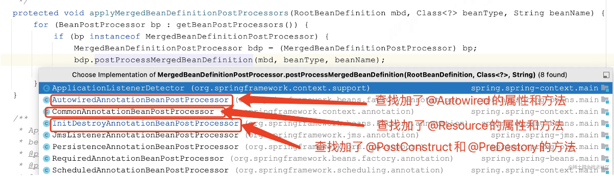


（4）依赖处理。

（5）属性填充。将所有属性填充至bean的实例中。

（6）循环依赖检查。之前有提到过，在Sping中解决循环依赖只对单例有效，而对于prototype的bean，Spring没有好的解决办法，唯一要做的就是抛出异常。在这个步骤里面会检测已经加载的bean是否已经出现了依赖循环，并判断是否需要抛出异常。

（7）注册DisposableBean。如果配置了destroy-method，这里需要注册以便于在销毁时候调用。

（8）完成创建并返回。 

###### **5.7.1 创建 bean 的实例**

深入到方法 createBeanInstance 开始。之前上面有分析过构造函数循环以来的时候有到这边来创建 bean 的实例。

```java 
protected BeanWrapper createBeanInstance(String beanName, RootBeanDefinition mbd, @Nullable Object[] args) {
   // Make sure bean class is actually resolved at this point.
   Class<?> beanClass = resolveBeanClass(mbd, beanName);


   if (beanClass != null && !Modifier.isPublic(beanClass.getModifiers()) && !mbd.isNonPublicAccessAllowed()) {
      throw new BeanCreationException(mbd.getResourceDescription(), beanName,
            "Bean class isn't public, and non-public access not allowed: " + beanClass.getName());
   }


   Supplier<?> instanceSupplier = mbd.getInstanceSupplier();
   if (instanceSupplier != null) {
      return obtainFromSupplier(instanceSupplier, beanName);
   }


   if (mbd.getFactoryMethodName() != null) {  // 如果工厂方法不为空则使用工厂方法初始化策略
      return instantiateUsingFactoryMethod(beanName, mbd, args);
   }


   // Shortcut when re-creating the same bean...
   boolean resolved = false;
   boolean autowireNecessary = false;
   if (args == null) { // 一个类有多个构造函数，每个构造函数有不同的参数，所以调用前需要先根据参数锁定构造函数或对应的工厂方法
      synchronized (mbd.constructorArgumentLock) {
         if (mbd.resolvedConstructorOrFactoryMethod != null) {
            resolved = true;
            autowireNecessary = mbd.constructorArgumentsResolved;
         }
      }
   }
   if (resolved) { // 如果已经解析过则是用解析好的构造函数方法不需要再次锁定
      if (autowireNecessary) {  // 构造函数自动注入
         return autowireConstructor(beanName, mbd, null, null);
      }
      else { // 默认的无参构造函数
         return instantiateBean(beanName, mbd);
      }
   }


   // Candidate constructors for autowiring? // 需要根据参数解析构造函数
   Constructor<?>[] ctors = determineConstructorsFromBeanPostProcessors(beanClass, beanName);
   if (ctors != null || mbd.getResolvedAutowireMode() == AUTOWIRE_CONSTRUCTOR ||
         mbd.hasConstructorArgumentValues() || !ObjectUtils.isEmpty(args)) {
      return autowireConstructor(beanName, mbd, ctors, args); // 构造函数自动注入
   }


   // Preferred constructors for default construction?
   ctors = mbd.getPreferredConstructors();
   if (ctors != null) { // 构造函数自动注入
      return autowireConstructor(beanName, mbd, ctors, null);
   }

 
   // No special handling: simply use no-arg constructor.  默认的无参构造函数
   return instantiateBean(beanName, mbd);
}
```

**1. autowireConstructor**  

对于实例的创建Spring中分成了两种情况，一种是通用的实例化，另一种是带有参数的实例化。带有参数的实例化过程相当复杂，因为存在着不确定性，所以在判断对应参数上做了大量工作。省略，查看 **autowireConstructor(beanName, mbd, ctors, null);**方法

**2. instantiateBean**  

经历了带有参数的构造函数的实例构造，相信你会非常轻松愉快地理解**不带参数的构造函数的实例化过程**。 

```java 
protected BeanWrapper instantiateBean(final String beanName, final RootBeanDefinition mbd) {
   try {
      Object beanInstance;
      final BeanFactory parent = this;
      if (System.getSecurityManager() != null) {
         beanInstance = AccessController.doPrivileged((PrivilegedAction<Object>) () ->
               getInstantiationStrategy().instantiate(mbd, beanName, parent),
               getAccessControlContext());
      }
      else {
         beanInstance = getInstantiationStrategy().instantiate(mbd, beanName, parent);
      }
      BeanWrapper bw = new BeanWrapperImpl(beanInstance);
      initBeanWrapper(bw);
      return bw;
   }
   catch (Throwable ex) {
      throw new BeanCreationException(
            mbd.getResourceDescription(), beanName, "Instantiation of bean failed", ex);
   }
}
protected InstantiationStrategy getInstantiationStrategy() {
   return this.instantiationStrategy;
}
this.instantiationStrategy -------> /** Strategy for creating bean instances. */
private InstantiationStrategy instantiationStrategy = new CglibSubclassingInstantiationStrategy();
```

**3. 实例化策略**

实例化过程中反复提到过实例化策略，那这又是做什么用的呢？其实，经过前面的分析，我们已经得到了足以实例化的所有相关信息，**完全可以使用最简单的反射方法直接反射来构造实例对象，但是Spring却并没有这么做**。 

`SimpleInstantiationStrategy.java`

```java 
public Object instantiate(RootBeanDefinition bd, @Nullable String beanName, BeanFactory owner) {
   // Don't override the class with CGLIB if no overrides.
如果有需要覆盖或者动态替换的方法则当然需要使用 CGLIB 进行动态代理，因为可以在创建代理的同时将动态方法织入类中，但是如果没有需要动态改变的方法，为了方便直接反射就可以了。
   if (!bd.hasMethodOverrides()) {
      Constructor<?> constructorToUse;
      synchronized (bd.constructorArgumentLock) {
         constructorToUse = (Constructor<?>) bd.resolvedConstructorOrFactoryMethod;
         if (constructorToUse == null) {
            final Class<?> clazz = bd.getBeanClass();
            if (clazz.isInterface()) {
               throw new BeanInstantiationException(clazz, "Specified class is an interface");
            }
            try {
               if (System.getSecurityManager() != null) {
                  constructorToUse = AccessController.doPrivileged(
                        (PrivilegedExceptionAction<Constructor<?>>) clazz::getDeclaredConstructor);
               }
               else {
                  constructorToUse = clazz.getDeclaredConstructor();
               }
               bd.resolvedConstructorOrFactoryMethod = constructorToUse;
            }
            catch (Throwable ex) {
               throw new BeanInstantiationException(clazz, "No default constructor found", ex);
            }
         }
      }
      return BeanUtils.instantiateClass(constructorToUse);
   }
   else {
      // Must generate CGLIB subclass.
      return instantiateWithMethodInjection(bd, beanName, owner);
   }
}
```

`CglibSubclassingInstantiationStrategy.java`

```java 
@Override
protected Object instantiateWithMethodInjection(RootBeanDefinition bd, @Nullable String beanName, BeanFactory owner) {
   return instantiateWithMethodInjection(bd, beanName, owner, null);
}
protected Object instantiateWithMethodInjection(RootBeanDefinition bd, @Nullable String beanName, BeanFactory owner,
      @Nullable Constructor<?> ctor, Object... args) {
   // Must generate CGLIB subclass...
   return new CglibSubclassCreator(bd, owner).instantiate(ctor, args);
}
public Object instantiate(@Nullable Constructor<?> ctor, Object... args) {
   Class<?> subclass = createEnhancedSubclass(this.beanDefinition);
   Object instance;
   if (ctor == null) {
      instance = BeanUtils.instantiateClass(subclass);
   }
   else {
      try {
         Constructor<?> enhancedSubclassConstructor = subclass.getConstructor(ctor.getParameterTypes());
         instance = enhancedSubclassConstructor.newInstance(args);
      }
      catch (Exception ex) {
         throw new BeanInstantiationException(this.beanDefinition.getBeanClass(),
               "Failed to invoke constructor for CGLIB enhanced subclass [" + subclass.getName() + "]", ex);
      }
   }
   // SPR-10785: set callbacks directly on the instance instead of in the
   // enhanced class (via the Enhancer) in order to avoid memory leaks.
   Factory factory = (Factory) instance;
   factory.setCallbacks(new Callback[] {NoOp.INSTANCE,
         new LookupOverrideMethodInterceptor(this.beanDefinition, this.owner),
         new ReplaceOverrideMethodInterceptor(this.beanDefinition, this.owner)});
   return instance;
}

/**
* Create an enhanced subclass of the bean class for the provided bean
* definition, using CGLIB.
*/
private Class<?> createEnhancedSubclass(RootBeanDefinition beanDefinition) {
   Enhancer enhancer = new Enhancer();
   enhancer.setSuperclass(beanDefinition.getBeanClass());
   enhancer.setNamingPolicy(SpringNamingPolicy.INSTANCE);
   if (this.owner instanceof ConfigurableBeanFactory) {
      ClassLoader cl = ((ConfigurableBeanFactory) this.owner).getBeanClassLoader();
      enhancer.setStrategy(new ClassLoaderAwareGeneratorStrategy(cl));
   }
   enhancer.setCallbackFilter(new MethodOverrideCallbackFilter(beanDefinition));
   enhancer.setCallbackTypes(CALLBACK_TYPES);
   return enhancer.createClass();
}
```

看了上面两个函数后似乎我们已经感受到了Spring的良苦用心以及为了能更方便地使用Spring而做了大量的工作。程序中，首先判断如果beanDefinition.getMethodOverrides()为空也就是用户没有使用**replace或者lookup**的配置方法，那么直接使用反射的方式，简单快捷，但是如果使用了这两个特性，在直接使用反射的方式创建实例就不妥了，因为需要将这两个配置提供的功能切入进去，所以就必须要使用动态代理的方式将包含两个特性所对应的逻辑的拦截增强器设置进去，这样才可以保证在调用方法的时候会被相应的拦截器增强，返回值为包含拦截器的代理实例。

###### **5.7.2 记录创建 bean 的 ObjectFactory**   

###### setter循环依赖中aop处理逻辑

在 doCreateBean 函数中有这样一段代码，在将这个逻辑放进去之后，如果有循环依赖，populateBean执行后，后面的initializeBean 是先不会执行的，而是会继续去创建对象所依赖的属性对象，比如A->B,B->A，最后再获取到A的时候会去执行这个lamada表达式的，也就是会执行创建AOP代理的过程。

```java 
 boolean earlySingletonExposure = (mbd.isSingleton() && this.allowCircularReferences &&
         isSingletonCurrentlyInCreation(beanName));
if (earlySingletonExposure) {
      if (logger.isTraceEnabled()) {
         logger.trace("Eagerly caching bean '" + beanName +
               "' to allow for resolving potential circular references");
      }
// 为避免后期循环依赖，可以在 bean 初始化完成前将创建实例的 ObjectFactory 加入工厂， AOP 就是在这里将 advice 动态织入 bean 中，若没有直接返回 bean，不做任何处理
      addSingletonFactory(beanName, () -> getEarlyBeanReference(beanName, mbd, bean));
   }
```

这段代码并不复杂，但是很多人不是太理解这段代码的作用，而且，这段代码仅从此函数中去理解也很难弄懂其中的含义，我们需要从全局的角度去思考Spring的依赖解决办法。

- earlySingletonExposure：从字面的意思理解就是提早曝光的单例，我们暂不定义它的学名叫什么，我们感兴趣的是有哪些条件影响这个值。

- mbd.isSingleton()：没有太多可以解释的，此RootBeanDefinition代表的是否是单例。

- this.allowCircularReferences：是否允许循环依赖，很抱歉，并没有找到在配置文件中如何配置，但是在AbstractRefreshableApplicationContext中提供了设置函数，可以通过硬编码的方式进行设置或者可以通过自定义命名空间进行配置，其中硬编码的方式代码如下。

  ```java 
  ClassPathXmlApplicationContext bf = new ClassPathXmlApplicationContext("classpath:lookupTest.xml");
  bf.setAllowCircularReferences(false);
  ```

- isSingletonCurrentlyInCreation(beanName)：该bean是否在创建中。在Spring中，会有个专门的属性默认为DefaultSingletonBeanRegistry的singletonsCurrentlyInCreation来记录bean的加载状态，在bean开始创建前会将beanName记录在属性中，在bean创建结束后会将beanName从属性中移除。那么我们跟随代码一路走来可是对这个属性的记录并没有多少印象，这个状态是在哪里记录的呢？不同scope的记录位置并不一样，我们以singleton为例，在singleton下记录属性的函数是在DefaultSingletonBeanRegistry类的public Object getSingleton(String beanName, ObjectFactory singletonFactory)函数的beforeSingletonCreation(beanName)和afterSingletonCreation(beanName)中，在这两段函数中分别this.singletonsCurrentlyInCreation(beanName)中，在这两段函数中分别this.singletonsCurrentlyInCreation.add(beanName)与this.singletonsCurrentlyIn Creation.remove(beanName)来进行状态的记录与移除。

当这3个条件都满足时会执行addSingletonFactory操作，**那么加入SingletonFactory的作用是什么呢？又是在什么时候调用呢？**

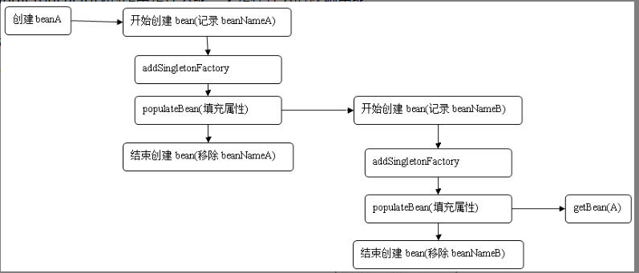

图中展示了创建beanA的流程，图中我们看到，在创建A的时候首先会记录类A所对应的beanName，并将beanA的创建工厂加入缓存中，而在对A的属性填充也就是调用populate方法的时候又会再一次的对B进行递归创建。同样的，因为在B中同样存在A属性，因此在实例化B的的populate方法中又会再次地初始化A，也就是图形的最后，调用getBean(A)。关键是在这里，有心的同学可以去找找这个代码的实现方式，我们之前已经讲过，**在这个函数中并不是直接去实例化A，而是先去检测缓存中是否有已经创建好的对应的bean，或者是否已经创建好的ObjectFactory，而此时对于A的ObjectFactory我们早已经创建，所以便不会再去向后执行，而是直接调用ObjectFactory去创建A**。这里最关键的是ObjectFactory的实现。

###### **5.7.3 属性注入** 

在了解循环依赖的时候，我们曾经反复提到了populateBean这个函数，也多少了解了这个函数的主要功能就是属性填充，那么究竟是如何实现填充的呢？ 

```java 
protected void populateBean(String beanName, RootBeanDefinition mbd, @Nullable BeanWrapper bw) {
   if (bw == null) {
      if (mbd.hasPropertyValues()) {
         throw new BeanCreationException(
               mbd.getResourceDescription(), beanName, "Cannot apply property values to null instance");
      }
      else {
         // Skip property population phase for null instance. 没有可填充的属性
         return;
      }
   }


   // Give any InstantiationAwareBeanPostProcessors the opportunity to modify the
   // state of the bean before properties are set. This can be used, for example,
   // to support styles of field injection. 用来至此属性注入的类型
   if (!mbd.isSynthetic() && hasInstantiationAwareBeanPostProcessors()) {
      for (BeanPostProcessor bp : getBeanPostProcessors()) {
         if (bp instanceof InstantiationAwareBeanPostProcessor) {
            InstantiationAwareBeanPostProcessor ibp = (InstantiationAwareBeanPostProcessor) bp;
            if (!ibp.postProcessAfterInstantiation(bw.getWrappedInstance(), beanName)) {
               return;
            }
         }
      }
   }


   PropertyValues pvs = (mbd.hasPropertyValues() ? mbd.getPropertyValues() : null);

   // 获取bean的注入类型
   int resolvedAutowireMode = mbd.getResolvedAutowireMode();
   if (resolvedAutowireMode == AUTOWIRE_BY_NAME || resolvedAutowireMode == AUTOWIRE_BY_TYPE) {
      MutablePropertyValues newPvs = new MutablePropertyValues(pvs);
      // Add property values based on autowire by name if applicable.
      if (resolvedAutowireMode == AUTOWIRE_BY_NAME) {
         autowireByName(beanName, mbd, bw, newPvs); // 根据名称自动注入
      }
      // Add property values based on autowire by type if applicable. 
      if (resolvedAutowireMode == AUTOWIRE_BY_TYPE) { // 根据类型自动注入
         autowireByType(beanName, mbd, bw, newPvs);
      }
      pvs = newPvs;
   }
// 后处理器已经初始化
   boolean hasInstAwareBpps = hasInstantiationAwareBeanPostProcessors();
   boolean needsDepCheck = (mbd.getDependencyCheck() != AbstractBeanDefinition.DEPENDENCY_CHECK_NONE); // 需要检查


   PropertyDescriptor[] filteredPds = null;
   if (hasInstAwareBpps) {
      if (pvs == null) {
         pvs = mbd.getPropertyValues();
      }
      for (BeanPostProcessor bp : getBeanPostProcessors()) {
         if (bp instanceof InstantiationAwareBeanPostProcessor) {
            InstantiationAwareBeanPostProcessor ibp = (InstantiationAwareBeanPostProcessor) bp;
// 对所有需要依赖的属性进行后处理，这里会完成 @Autowired @Resource 的属性填充
            PropertyValues pvsToUse = ibp.postProcessProperties(pvs, bw.getWrappedInstance(), beanName);
            if (pvsToUse == null) {
               if (filteredPds == null) {
                   // 需要注入的属性,会过滤掉Aware接口包含的属性(通过ignoreDependencyInterface添加)
                  filteredPds = filterPropertyDescriptorsForDependencyCheck(bw, mbd.allowCaching);
               }
               pvsToUse = ibp.postProcessPropertyValues(pvs, filteredPds, bw.getWrappedInstance(), beanName);
               if (pvsToUse == null) {
                  return;
               }
            }
            pvs = pvsToUse;
         }
      }
   }
   if (needsDepCheck) { // 需要检查，对应 depends-on 属性，3.0 已经弃用此属性
      if (filteredPds == null) {
         filteredPds = filterPropertyDescriptorsForDependencyCheck(bw, mbd.allowCaching);
      }
      checkDependencies(beanName, mbd, filteredPds, pvs);
   }


   if (pvs != null) { // 将属性应用到 bean 中
      applyPropertyValues(beanName, mbd, bw, pvs);
   }
}
```

在populateBean函数中提供了这样的处理流程。

（1）InstantiationAwareBeanPostProcessor处理器的postProcessAfterInstantiation函数的应用，此函数可以控制程序是否继续进行属性填充。

（2）根据注入类型（byName/byType），提取依赖的bean，并统一存入PropertyValues中。

（3）应用InstantiationAwareBeanPostProcessor处理器的postProcessPropertyValues方法，对属性获取完毕填充前对属性的再次处理，典型应用是RequiredAnnotationBeanPostProcessor类中对属性的验证。

这里这个是针对@Resource注解的注入 CommonAnnotationBeanPostProcessor，还可以有Autowired的。

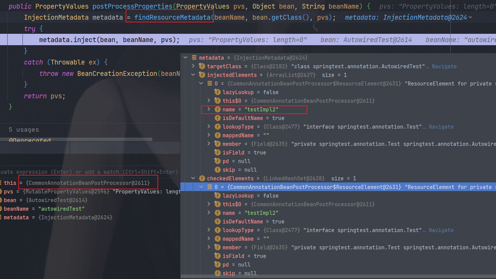

（4）将所有PropertyValues中的属性填充至BeanWrapper中。代码里有几个地方是我们比较感兴趣的。

**1 autowireByName** 

首先我们了解下 byName 功能是如何实现的。

```java 
protected void autowireByName(
      String beanName, AbstractBeanDefinition mbd, BeanWrapper bw, MutablePropertyValues pvs) {
// 寻找 bw 中需要依赖注入的属性
   String[] propertyNames = unsatisfiedNonSimpleProperties(mbd, bw);
   for (String propertyName : propertyNames) {
      if (containsBean(propertyName)) {
// 递归初始化相关的 bean
         Object bean = getBean(propertyName);
         pvs.add(propertyName, bean);
// 注册依赖
         registerDependentBean(propertyName, beanName);
         if (logger.isTraceEnabled()) {
            logger.trace("Added autowiring by name from bean name '" + beanName +
                  "' via property '" + propertyName + "' to bean named '" + propertyName + "'");
         }
      }
      else {
         if (logger.isTraceEnabled()) {
            logger.trace("Not autowiring property '" + propertyName + "' of bean '" + beanName +
                  "' by name: no matching bean found");
         }
      }
   }
}
```

**2 autowireByType**  

autowireByType与autowireByName对于我们理解与使用来说复杂程度都很相似，但是其实现功能的复杂度却完全不一样。 

```java 
protected void autowireByType(
      String beanName, AbstractBeanDefinition mbd, BeanWrapper bw, MutablePropertyValues pvs) {

   TypeConverter converter = getCustomTypeConverter();  // 类型转换器，之前构造器注入循环依赖也有用到
   if (converter == null) {
      converter = bw;
   }

   Set<String> autowiredBeanNames = new LinkedHashSet<>(4);
   String[] propertyNames = unsatisfiedNonSimpleProperties(mbd, bw); // 寻找 bw 中需要依赖注入的属性
   for (String propertyName : propertyNames) {
      try {
         PropertyDescriptor pd = bw.getPropertyDescriptor(propertyName);
         // Don't try autowiring by type for type Object: never makes sense,
         // even if it technically is a unsatisfied, non-simple property.
         if (Object.class != pd.getPropertyType()) {
                // 探测指定属性的 set 方法
            MethodParameter methodParam = BeanUtils.getWriteMethodParameter(pd);
            // Do not allow eager init for type matching in case of a prioritized post-processor.
            boolean eager = !(bw.getWrappedInstance() instanceof PriorityOrdered);
            DependencyDescriptor desc = new AutowireByTypeDependencyDescriptor(methodParam, eager);
// 解析指定 beanName 的属性所匹配到的值，并把解析到的属性名存储在 autowiredBeanNames 中，当属性存在多个封装bean时：如 @Autowired private List<A> alist;
// 将会找到所有匹配 A 类型的 bean 并注入
            Object autowiredArgument = resolveDependency(desc, beanName, autowiredBeanNames, converter); // 复杂
            if (autowiredArgument != null) {
               pvs.add(propertyName, autowiredArgument);
            }
            for (String autowiredBeanName : autowiredBeanNames) {
               registerDependentBean(autowiredBeanName, beanName); // 注册依赖
               if (logger.isTraceEnabled()) {
                  logger.trace("Autowiring by type from bean name '" + beanName + "' via property '" +
                        propertyName + "' to bean named '" + autowiredBeanName + "'");
               }
            }
            autowiredBeanNames.clear();
         }
      }
      catch (BeansException ex) {
         throw new UnsatisfiedDependencyException(mbd.getResourceDescription(), beanName, propertyName, ex);
      }
   }
}
```

实现根据名称自动匹配的第一步就是寻找bw中需要依赖注入的属性，同样对于根据类型自动匹配的实现来讲第一步也是寻找bw中需要依赖注入的属性，然后遍历这些属性并寻找类型匹配的bean，其中最复杂的就是寻找类型匹配的bean。同时，Spring中提供了对集合的类型注入的支持，如使用注解的方式： **@Autowired private List<A> alist**  

Spring将会把所有与Test匹配的类型找出来并注入到tests属性中，正是由于这一因素，所以在autowireByType函数中，新建了局部遍历autowiredBeanNames，用于存储所有依赖的bean，如果只是对非集合类的属性注入来说，此属性并无用处。 对于寻找类型匹配的逻辑实现封装在了resolveDependency函数中。 

待续。。。

**3 applyPropertyValues**  

程序运行到这里，**已经完成了对所有注入属性的获取**，但是获取的属性是以**PropertyValues**形式存在的，**还并没有应用到已经实例化的bean中**，这一工作是在applyPropertyValues中。 
`AbstractAutowireCapableBeanFactory.java`

```java 
protected void applyPropertyValues(String beanName, BeanDefinition mbd, BeanWrapper bw, PropertyValues pvs) {
   if (pvs.isEmpty()) {
      return;
   }

   if (System.getSecurityManager() != null && bw instanceof BeanWrapperImpl) {
      ((BeanWrapperImpl) bw).setSecurityContext(getAccessControlContext());
   }


   MutablePropertyValues mpvs = null;
   List<PropertyValue> original;


   if (pvs instanceof MutablePropertyValues) {
      mpvs = (MutablePropertyValues) pvs;
      if (mpvs.isConverted()) {
         // Shortcut: use the pre-converted values as-is.
         try {
            bw.setPropertyValues(mpvs);
            return;
         }
         catch (BeansException ex) {
            throw new BeanCreationException(
                  mbd.getResourceDescription(), beanName, "Error setting property values", ex);
         }
      }
      original = mpvs.getPropertyValueList();
   }
   else {
      original = Arrays.asList(pvs.getPropertyValues());
   }


   TypeConverter converter = getCustomTypeConverter();
   if (converter == null) {
      converter = bw;
   }
// 获取对应的解析器
   BeanDefinitionValueResolver valueResolver = new BeanDefinitionValueResolver(this, beanName, mbd, converter);

   // Create a deep copy, resolving any references for values.
   List<PropertyValue> deepCopy = new ArrayList<>(original.size());
   boolean resolveNecessary = false;
   for (PropertyValue pv : original) { // 遍历属性，将属性转换为对应类的对应属性的类型
      if (pv.isConverted()) {
         deepCopy.add(pv);
      }
      else {
         String propertyName = pv.getName();
         Object originalValue = pv.getValue();
         if (originalValue == AutowiredPropertyMarker.INSTANCE) {
            Method writeMethod = bw.getPropertyDescriptor(propertyName).getWriteMethod();
            if (writeMethod == null) {
               throw new IllegalArgumentException("Autowire marker for property without write method: " + pv);
            }
            originalValue = new DependencyDescriptor(new MethodParameter(writeMethod, 0), true);
         }
         Object resolvedValue = valueResolver.resolveValueIfNecessary(pv, originalValue);
         Object convertedValue = resolvedValue;
         boolean convertible = bw.isWritableProperty(propertyName) &&
               !PropertyAccessorUtils.isNestedOrIndexedProperty(propertyName);
         if (convertible) {
            convertedValue = convertForProperty(resolvedValue, propertyName, bw, converter);
         }
         // Possibly store converted value in merged bean definition,
         // in order to avoid re-conversion for every created bean instance.
         if (resolvedValue == originalValue) {
            if (convertible) {
               pv.setConvertedValue(convertedValue);
            }
            deepCopy.add(pv);
         }
         else if (convertible && originalValue instanceof TypedStringValue &&
               !((TypedStringValue) originalValue).isDynamic() &&
               !(convertedValue instanceof Collection || ObjectUtils.isArray(convertedValue))) {
            pv.setConvertedValue(convertedValue);
            deepCopy.add(pv);
         }
         else {
            resolveNecessary = true;
            deepCopy.add(new PropertyValue(pv, convertedValue));
         }
      }
   }
   if (mpvs != null && !resolveNecessary) {
      mpvs.setConverted();
   }

   // Set our (possibly massaged) deep copy.
   try {
      bw.setPropertyValues(new MutablePropertyValues(deepCopy));
   }
   catch (BeansException ex) {
      throw new BeanCreationException(
            mbd.getResourceDescription(), beanName, "Error setting property values", ex);
   }
}
```

###### **5.7.4 初始化 bean** 

大家应该记得在bean配置时bean中有一个**init-method**的属性，这个属性的作用是在bean实例化前调用init-method指定的方法来根据用户业务进行相应的实例化。我们现在就已经进入这个方法了，首先看一下这个方法的执行位置，**Spring中程序已经执行过bean的实例化，并且进行了属性的填充，而就在这时将会调用用户设定的初始化方法。** 

```java 
// AbstractAutowireCapableBeanFactory  doCreateBean
// Initialize the bean instance.
Object exposedObject = bean;
try {
   populateBean(beanName, mbd, instanceWrapper);
   exposedObject = initializeBean(beanName, exposedObject, mbd);
}
* Initialize the given bean instance, applying factory callbacks
* as well as init methods and bean post processors.
protected Object initializeBean(final String beanName, final Object bean, @Nullable RootBeanDefinition mbd) {
   if (System.getSecurityManager() != null) {
      AccessController.doPrivileged((PrivilegedAction<Object>) () -> {
         invokeAwareMethods(beanName, bean);
         return null;
      }, getAccessControlContext());
   }
   else {
// 对特殊的 bean 的处理：Aware、BeanClassLoaderAware、BeanFactoryAware
      invokeAwareMethods(beanName, bean);
   }

   Object wrappedBean = bean;
   if (mbd == null || !mbd.isSynthetic()) {
// 应用后处理器
      wrappedBean = applyBeanPostProcessorsBeforeInitialization(wrappedBean, beanName);
   }

   try {
// 激活用户自定义的 init 方法
      invokeInitMethods(beanName, wrappedBean, mbd);
   }
   catch (Throwable ex) {
      throw new BeanCreationException(
            (mbd != null ? mbd.getResourceDescription() : null),
            beanName, "Invocation of init method failed", ex);
   }
   if (mbd == null || !mbd.isSynthetic()) {
// 应用后处理器
      wrappedBean = applyBeanPostProcessorsAfterInitialization(wrappedBean, beanName);
   }
   return wrappedBean;
}
```

###### Aware方法

**1 激活 Aware 方法** 

在分析其原理之前，我们先了解一下Aware的使用。Spring中提供一些Aware相关接口，比如**BeanFactoryAware、ApplicationContextAware、ResourceLoaderAware、ServletContextAware**等，实现这些Aware接口的bean在被初始之后，可以取得一些相对应的资源，例如**实现BeanFactoryAware的bean在初始后，Spring容器将会注入BeanFactory的实例，而实现ApplicationContextAware的bean，在bean被初始后，将会被注入ApplicationContext的实例**等。我们首先通过示例方法来了解一下Aware的使用。

（1）定义普通的 bean

```java 
public class Hello {
    public void say() {
        System.out.println("hello");
    }
}
```

（2）定义BeanFactoryAware类型的bean。

```java 
public class TestAware implements BeanFactoryAware {
    private BeanFactory beanFactory;

    // 声明 bean 的时候 spring 会自动注入 BeanFactory
    @Override
    public void setBeanFactory(BeanFactory beanFactory) throws BeansException {
        this.beanFactory = beanFactory;
    }

    public void testAware() {
        // 通过 hello 这个 bean 从 beanFactory 获取实例
        Hello hello = (Hello) beanFactory.getBean("hello");
        hello.say();
    }
}
```

（3）测试

```xml
<?xml version="1.0" encoding="UTF-8"?>
<beans xmlns="http://www.springframework.org/schema/beans"
       xmlns:xsi="http://www.w3.org/2001/XMLSchema-instance"
       xsi:schemaLocation="http://www.springframework.org/schema/beans http://www.springframework.org/schema/beans/spring-beans.xsd">


    <bean id="car" class="springtest.CarFactoryBean">
        <property name="carInfo" value="超级跑车,400, 200000"/>
    </bean>


    <bean id="testAware" class="springtest.aware.TestAware"/>
    <bean id="hello" class="springtest.aware.Hello"/>
</beans>
```

```java 
@Test
public void testAware() {
    ApplicationContext context = new ClassPathXmlApplicationContext("classpath:test.xml");
    TestAware testAware = (TestAware) context.getBean("testAware");
    testAware.testAware();
    // 输出 hello
}
```

**2.处理器的应用** 

BeanPostProcessor相信大家都不陌生，这是Spring中开放式架构中一个必不可少的亮点，给用户充足的权限去更改或者扩展Spring，而除了BeanPostProcessor外还有很多其他的PostProcessor，当然大部分都是以此为基础，继承自BeanPostProcessor。

BeanPostProcessor的使用位置就是这里，在调用客户自定义初始化方法前以及调用自定义初始化方法后分别会调用BeanPostProcessor的postProcessBeforeInitialization和postProcessAfterInitialization方法，使用户可以根据自己的业务需求进行响应的处理。

**3.激活自定义的init方法** 

客户定制的初始化方法除了我们熟知的使用配置init-method外，还有使自定义的bean实现**InitializingBean**接口，并在afterPropertiesSet中实现自己的初始化业务逻辑。**init-method与afterPropertiesSet都是在初始化bean时执行，执行顺序是afterPropertiesSet先执行，而init-method后执行**。在**invokeInitMethods方法中就实现了这两个步骤的初始化方法调用**。 

```java 
protected void invokeInitMethods(String beanName, final Object bean, @Nullable RootBeanDefinition mbd)
      throws Throwable {
   boolean isInitializingBean = (bean instanceof InitializingBean);
   if (isInitializingBean && (mbd == null || !mbd.isExternallyManagedInitMethod("afterPropertiesSet"))) {
      if (logger.isTraceEnabled()) {
         logger.trace("Invoking afterPropertiesSet() on bean with name '" + beanName + "'");
      }
      if (System.getSecurityManager() != null) {
         try {
            AccessController.doPrivileged((PrivilegedExceptionAction<Object>) () -> {
               ((InitializingBean) bean).afterPropertiesSet();
               return null;
            }, getAccessControlContext());
         }
         catch (PrivilegedActionException pae) {
            throw pae.getException();
         }
      }
      else {
         ((InitializingBean) bean).afterPropertiesSet();
      }
   }

   if (mbd != null && bean.getClass() != NullBean.class) {
      String initMethodName = mbd.getInitMethodName();
      if (StringUtils.hasLength(initMethodName) &&
            !(isInitializingBean && "afterPropertiesSet".equals(initMethodName)) &&
            !mbd.isExternallyManagedInitMethod(initMethodName)) {
         invokeCustomInitMethod(beanName, bean, mbd);
      }
   }
}
```

**5.7.5 注册 DisposableBean** 

Spring中不但提供了对于初始化方法的扩展入口，同样也提供了销毁方法的扩展入口，对于销毁方法的扩展，除了我们熟知的配置属性**destroy-method**方法外，用户还可以注册后处理器**DestructionAwareBeanPostProcessor**来统一处理bean的销毁方法，代码如下：**AbstractAutowireCapableBeanFactory doCreateBean**

```java 
初始化后还有这个逻辑，
// Register bean as disposable.
try {
   registerDisposableBeanIfNecessary(beanName, bean, mbd);
}
catch (BeanDefinitionValidationException ex) {
   throw new BeanCreationException(
         mbd.getResourceDescription(), beanName, "Invalid destruction signature", ex);
}

protected void registerDisposableBeanIfNecessary(String beanName, Object bean, RootBeanDefinition mbd) {
   AccessControlContext acc = (System.getSecurityManager() != null ? getAccessControlContext() : null);
   if (!mbd.isPrototype() && requiresDestruction(bean, mbd)) {
      if (mbd.isSingleton()) {
         // Register a DisposableBean implementation that performs all destruction
         // work for the given bean: DestructionAwareBeanPostProcessors,
         // DisposableBean interface, custom destroy method.
         registerDisposableBean(beanName,
               new DisposableBeanAdapter(bean, beanName, mbd, getBeanPostProcessors(), acc));
      }
      else {
         // A bean with a custom scope...
         Scope scope = this.scopes.get(mbd.getScope());
         if (scope == null) {
            throw new IllegalStateException("No Scope registered for scope name '" + mbd.getScope() + "'");
         }
         scope.registerDestructionCallback(beanName,
               new DisposableBeanAdapter(bean, beanName, mbd, getBeanPostProcessors(), acc));
      }
   }
}
```

#### bean 的生命周期顺序

1. bean 的实例化（一个空白的bean）
2. 属性填充
3. 调用 bean 实现的相关 Aware 接口
4. 调用后处理器接口方法（实例化之前的，Before）beanProcessor.postProcessBeforeInitialization(result, beanName)

5. 执行实现了InitializingBean接口，并在afterPropertiesSet的方法里面执行逻辑 ((InitializingBean) bean).afterPropertiesSet();

6. 调用 bean 的 init-method 方法

7. 调用后处理器接口方法（实例化之后的，After）beanProcessor.postProcessAfterInitialization(result, beanName)

8. 当要销毁 bean 的时候

- （1）如果实现了 DestructionAwareBeanPostProcessor 接口，则先执行 processor.postProcessBeforeDestruction(this.bean, this.beanName) 方法。

- （2）再执行 DisposableBean 的 destory() 方法，((DisposableBean) this.bean).destroy();

- （3）最后再调用自定义的 destroyMethod 方法。


