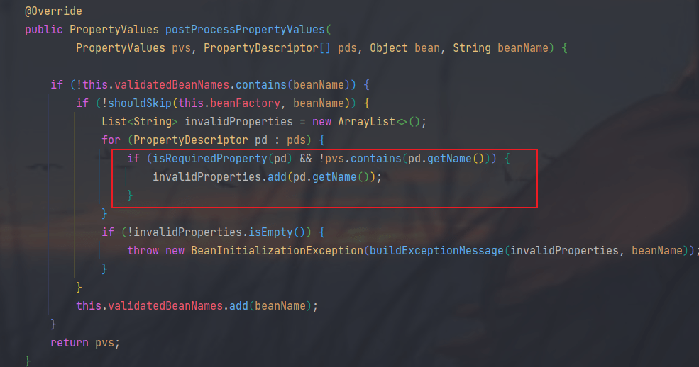

首先准备一些代码

#### xml配置文件

```xml
<?xml version="1.0" encoding="UTF-8"?>
<beans xmlns="http://www.springframework.org/schema/beans"
       xmlns:xsi="http://www.w3.org/2001/XMLSchema-instance"
       xmlns:context="http://www.springframework.org/schema/context"
       xsi:schemaLocation="http://www.springframework.org/schema/beans http://www.springframework.org/schema/beans/spring-beans.xsd
       http://www.springframework.org/schema/context https://www.springframework.org/schema/context/spring-context.xsd">

    <context:annotation-config/>
    <context:component-scan base-package="springtest.annotation.multipleResource"/>
</beans>
```

Java源代码，创建了一个配置类SpringConfiguration，里面2个bean-Service1和Service2，再新建了一个ResourceTest用来测试@Resource的属性注入。

```java
package springtest.annotation.multipleResource;

import org.springframework.context.annotation.Bean;
import org.springframework.context.annotation.Configuration;

/**
 * @author Lan
 * @createTime 2023-12-11  10:45
 **/
@Configuration
public class SpringConfiguration {

    @Bean(name = "service1")
    public Service1 service1() {
        return new Service1();
    }

    @Bean(name = "service2")
    public Service2 service2() {
        return new Service2();
    }
}

public class Service1 {
}
public class Service2 {
}

import org.springframework.context.annotation.Configuration;

import javax.annotation.Resource;

/**
 * @author Lan
 * @createTime 2023-12-11  10:53
 **/
@Configuration
public class ResourceTest {

    @Resource(name = "service1")
    private Service1 service1;

    @Resource(name = "service1")
    private Service1 service3;

    @Resource
    private Service2 service2;
}
```

测试代码：

```java
@Test
public void testResource() {
    ApplicationContext context = new ClassPathXmlApplicationContext("classpath:testResourceAnnotation.xml");
}
```

#### 分析流程

当我们初始化spring的上下文的时候，首先会先将一些类注册进去；当我们使用了注解开发的时候，spring解析到了 `<context:annotation-config>` 这些元素标签的时候，会自己注入一些类，用来解析。具体的注入位置代码是

```java
//org.springframework.beans.factory.xml.DefaultBeanDefinitionDocumentReader#parseBeanDefinitions
protected void parseBeanDefinitions(Element root, BeanDefinitionParserDelegate delegate) {
   if (delegate.isDefaultNamespace(root)) {
      NodeList nl = root.getChildNodes();
      for (int i = 0; i < nl.getLength(); i++) {
         Node node = nl.item(i);
         if (node instanceof Element) {
            Element ele = (Element) node;
            if (delegate.isDefaultNamespace(ele)) {
               parseDefaultElement(ele, delegate);
            }
            else {
               delegate.parseCustomElement(ele);
            }
         }
      }
   }
   else {
      delegate.parseCustomElement(root);
   }
}
```

后面走的是parseCustomElement这个方法里面的。能够看到解析的这个 namespaceHandler是ContextNamespaceHandler，加载的时候会去调用init方法的，具体的一些类，随后会注册这些类到容器中。

```java
public class ContextNamespaceHandler extends NamespaceHandlerSupport {

   @Override
   public void init() {
      registerBeanDefinitionParser("property-placeholder", new PropertyPlaceholderBeanDefinitionParser());
      registerBeanDefinitionParser("property-override", new PropertyOverrideBeanDefinitionParser());
      registerBeanDefinitionParser("annotation-config", new AnnotationConfigBeanDefinitionParser());
      registerBeanDefinitionParser("component-scan", new ComponentScanBeanDefinitionParser());
      registerBeanDefinitionParser("load-time-weaver", new LoadTimeWeaverBeanDefinitionParser());
      registerBeanDefinitionParser("spring-configured", new SpringConfiguredBeanDefinitionParser());
      registerBeanDefinitionParser("mbean-export", new MBeanExportBeanDefinitionParser());
      registerBeanDefinitionParser("mbean-server", new MBeanServerBeanDefinitionParser());
   }

}
```


随后走到具体的parser代码


再继续走到后面深层次的代码，我们会发现这边会找到这样的一些beandefinition，随后将这些类注册到registry中。


```java
//org.springframework.context.annotation.AnnotationConfigBeanDefinitionParser#parse
public BeanDefinition parse(Element element, ParserContext parserContext) {
   Object source = parserContext.extractSource(element);

   // Obtain bean definitions for all relevant BeanPostProcessors.
   Set<BeanDefinitionHolder> processorDefinitions =
         AnnotationConfigUtils.registerAnnotationConfigProcessors(parserContext.getRegistry(), source);

   // Register component for the surrounding <context:annotation-config> element.
   CompositeComponentDefinition compDefinition = new CompositeComponentDefinition(element.getTagName(), source);
   parserContext.pushContainingComponent(compDefinition);

   // Nest the concrete beans in the surrounding component.
   for (BeanDefinitionHolder processorDefinition : processorDefinitions) {
      parserContext.registerComponent(new BeanComponentDefinition(processorDefinition));
   }

   // Finally register the composite component.
   parserContext.popAndRegisterContainingComponent();

   return null;
}
```

`parserContext.getRegistry()`这个方法返回的就是我们默认的register：org.springframework.beans.factory.support.DefaultListableBeanFactory。	在上面的那几个类里面就有我们需要的类 **CommonAnnotationBeanPostProcessor**，从类的结构可以得知这个类实现了 BeanPostProcessor 接口。这个接口有两个方法：同样的，上面还有我们注解 `@AutoAutowired`所需要的类 **AutowiredAnnotationBeanPostProcessor**。

```java
default Object postProcessBeforeInitialization(Object bean, String beanName) throws BeansException {
   return bean;
}
default Object postProcessAfterInitialization(Object bean, String beanName) throws BeansException {
return bean;
}
```

当然我们现在这个子类是重写了这个方法的。

当解析完了之后做完了一些前置工作后就会去调用getBean的方法，随后会调用会调用到 `populateBean(beanName, mbd, instanceWrapper);`这个方法：


此时我们的getbean 的类是 resourceTest 的，记住前面这个类里面才使用了 @Resource 注解的，所以我们需要去看这个类的加载和解析属性的过程。

```java
protected void populateBean(String beanName, RootBeanDefinition mbd, @Nullable BeanWrapper bw) {
   if (bw == null) {
      if (mbd.hasPropertyValues()) {
         throw new BeanCreationException(
               mbd.getResourceDescription(), beanName, "Cannot apply property values to null instance");
      }
      else {
         // Skip property population phase for null instance.
         return;
      }
   }

   // Give any InstantiationAwareBeanPostProcessors the opportunity to modify the
   // state of the bean before properties are set. This can be used, for example,
   // to support styles of field injection. 
   if (!mbd.isSynthetic() && hasInstantiationAwareBeanPostProcessors()) {
      for (BeanPostProcessor bp : getBeanPostProcessors()) {
         if (bp instanceof InstantiationAwareBeanPostProcessor) {
            InstantiationAwareBeanPostProcessor ibp = (InstantiationAwareBeanPostProcessor) bp;
            if (!ibp.postProcessAfterInstantiation(bw.getWrappedInstance(), beanName)) {
               return;
            }
         }
      }
   }

   PropertyValues pvs = (mbd.hasPropertyValues() ? mbd.getPropertyValues() : null);

   int resolvedAutowireMode = mbd.getResolvedAutowireMode();
   if (resolvedAutowireMode == AUTOWIRE_BY_NAME || resolvedAutowireMode == AUTOWIRE_BY_TYPE) {
      MutablePropertyValues newPvs = new MutablePropertyValues(pvs);
      // Add property values based on autowire by name if applicable.
      if (resolvedAutowireMode == AUTOWIRE_BY_NAME) {
         autowireByName(beanName, mbd, bw, newPvs);
      }
      // Add property values based on autowire by type if applicable.
      if (resolvedAutowireMode == AUTOWIRE_BY_TYPE) {
         autowireByType(beanName, mbd, bw, newPvs);
      }
      pvs = newPvs;
   }

   boolean hasInstAwareBpps = hasInstantiationAwareBeanPostProcessors();
   boolean needsDepCheck = (mbd.getDependencyCheck() != AbstractBeanDefinition.DEPENDENCY_CHECK_NONE);

   PropertyDescriptor[] filteredPds = null;
   if (hasInstAwareBpps) {
      if (pvs == null) {
         pvs = mbd.getPropertyValues();
      }
      for (BeanPostProcessor bp : getBeanPostProcessors()) {  // 具体的一些流程就在这里面了，核心代码！！！
         if (bp instanceof InstantiationAwareBeanPostProcessor) {
            InstantiationAwareBeanPostProcessor ibp = (InstantiationAwareBeanPostProcessor) bp;
            PropertyValues pvsToUse = ibp.postProcessProperties(pvs, bw.getWrappedInstance(), beanName);
            if (pvsToUse == null) {
               if (filteredPds == null) {
                  filteredPds = filterPropertyDescriptorsForDependencyCheck(bw, mbd.allowCaching);
               }
               pvsToUse = ibp.postProcessPropertyValues(pvs, filteredPds, bw.getWrappedInstance(), beanName);
               if (pvsToUse == null) {
                  return;
               }
            }
            pvs = pvsToUse;
         }
      }
   }
   if (needsDepCheck) {
      if (filteredPds == null) {
         filteredPds = filterPropertyDescriptorsForDependencyCheck(bw, mbd.allowCaching);
      }
      checkDependencies(beanName, mbd, filteredPds, pvs);
   }

   if (pvs != null) {
      applyPropertyValues(beanName, mbd, bw, pvs);
   }
}
```

从代码上看来做了一个判断 `bp instanceof InstantiationAwareBeanPostProcessor`，满足才会去执行处理属性的逻辑。上面看的类 **CommonAnnotationBeanPostProcessor** 是实现了 InstantiationAwareBeanPostProcessor 这个接口的。

```java
public class CommonAnnotationBeanPostProcessor extends InitDestroyAnnotationBeanPostProcessor
      implements InstantiationAwareBeanPostProcessor, BeanFactoryAware, Serializable {
    ...
}
```

所以它是会走到 org.springframework.context.annotation.CommonAnnotationBeanPostProcessor#postProcessProperties 中去执行的！！！从执行的debug图可以看到，会先去找到需要注入的一些属性，然后执行注入。

#### @Autowired 注解是 AutowiredAnnotationBeanPostProcessor

```java
public PropertyValues postProcessProperties(PropertyValues pvs, Object bean, String beanName) {
   InjectionMetadata metadata = findAutowiringMetadata(beanName, bean.getClass(), pvs);
   try {
      metadata.inject(bean, beanName, pvs);
   }
   catch (BeanCreationException ex) {
      throw ex;
   }
   catch (Throwable ex) {
      throw new BeanCreationException(beanName, "Injection of autowired dependencies failed", ex);
   }
   return pvs;
}
```

#### 下面这些解析是 CommonAnnotationBeanPostProcessor 也就是 @Resource 注解 

#### 但是两个注解调用进去的方法是同一个，所以后面会有分支1和2，对应类型和name

#### 注入


继续往下看执行逻辑

```java
public void inject(Object target, @Nullable String beanName, @Nullable PropertyValues pvs) throws Throwable {
   Collection<InjectedElement> checkedElements = this.checkedElements;
   Collection<InjectedElement> elementsToIterate =
         (checkedElements != null ? checkedElements : this.injectedElements);
   if (!elementsToIterate.isEmpty()) {
      for (InjectedElement element : elementsToIterate) { // 遍历所有的resource属性元素，依次注入
         if (logger.isTraceEnabled()) {
            logger.trace("Processing injected element of bean '" + beanName + "': " + element);
         }
         element.inject(target, beanName, pvs);
      }
   }
}
```

spring使用 InjectionMetadata来表示一个类的元数据注入。 随后执行，判断如果是字段属性的话，就行set操作，如果是方法的话则执行 invoke。我们这里是属性来的，所以走上面分支

```java
// org.springframework.beans.factory.annotation.InjectionMetadata.InjectedElement#inject
protected void inject(Object target, @Nullable String requestingBeanName, @Nullable PropertyValues pvs)
      throws Throwable {

   if (this.isField) { // 属性
      Field field = (Field) this.member;
      ReflectionUtils.makeAccessible(field);
      field.set(target, getResourceToInject(target, requestingBeanName));
   }
   else { // 方法
      if (checkPropertySkipping(pvs)) {
         return;
      }
      try {
         Method method = (Method) this.member;
         ReflectionUtils.makeAccessible(method);
         method.invoke(target, getResourceToInject(target, requestingBeanName));
      }
      catch (InvocationTargetException ex) {
         throw ex.getTargetException();
      }
   }
}
```

执行 getResourceToInject(target, requestingBeanName)


继续往下可以看出最后会走到 autowireResource方法，org.springframework.context.annotation.CommonAnnotationBeanPostProcessor#autowireResource(BeanFactory factory, LookupElement element, @Nullable String requestingBeanName) 随后在这里面执行真正的逻辑。


#### 获取依赖的逻辑

首先这里需要介绍一下依赖的描述 ，首先是注入点 **InjectionPoint**，如果是方法的话，现在就要具体到参数了，如果是字段的话，则还是字段。


其次才是 **DependencyDescriptor** 继承了 InjectionPoint，其中有些属性如方法名，方法的参数以及参数索引，字段名，是否必须等等。

```java
public class DependencyDescriptor extends InjectionPoint implements Serializable {

   private final Class<?> declaringClass;

   @Nullable
   private String methodName;

   @Nullable
   private Class<?>[] parameterTypes;

   private int parameterIndex;

   @Nullable
   private String fieldName;

   private final boolean required;

   private final boolean eager;

   private int nestingLevel = 1;

   @Nullable
   private Class<?> containingClass;

   @Nullable
   private transient volatile ResolvableType resolvableType;

   @Nullable
   private transient volatile TypeDescriptor typeDescriptor;
```

最后就是对依赖描述的扩展

```java
private static class LookupDependencyDescriptor extends DependencyDescriptor {

   private final Class<?> lookupType;

   public LookupDependencyDescriptor(Field field, Class<?> lookupType) {
      super(field, true);
      this.lookupType = lookupType;
   }

   public LookupDependencyDescriptor(Method method, Class<?> lookupType) {
      super(new MethodParameter(method, 0), true);
      this.lookupType = lookupType;
   }

   @Override
   public Class<?> getDependencyType() {
      return this.lookupType;
   }
}
```

**把上面获取到的类型作为依赖描述里的依赖类型**。以上这些就是对依赖的描述，接下来就是按照这个依赖描述来从容器中找出符合的依赖


源码：在使用注解的时候，如果指定了name的话，element.isDefaultName 则会是false，没有指定则是 true。fallbackToDefaultTypeMatch 默认为 true。factory.containsBean(name) 判断此时这个属性所属的类是不是已经被注册到了 IOC 容器中。所以此时在 resourceTest 中注入属性 service1 的话这个值是true的，取反则是 false，因为我们前面注入了两个bean，service1 和 service2 。因此不会走这个逻辑，而是走 **resource = beanFactory.resolveBeanByName(name, descriptor);**逻辑。

```java
protected Object autowireResource(BeanFactory factory, LookupElement element, @Nullable String requestingBeanName)
      throws NoSuchBeanDefinitionException {

   Object resource;
   Set<String> autowiredBeanNames;
   String name = element.name;

   if (factory instanceof AutowireCapableBeanFactory) {
      AutowireCapableBeanFactory beanFactory = (AutowireCapableBeanFactory) factory;
      DependencyDescriptor descriptor = element.getDependencyDescriptor();
       //this.fallbackToDefaultTypeMatch默认为true @Resource(name )name没有指定，ioc容器不包含这个name的bean，此时是 service1
      if (this.fallbackToDefaultTypeMatch && element.isDefaultName && !factory.containsBean(name)) {
         autowiredBeanNames = new LinkedHashSet<>();
         resource = beanFactory.resolveDependency(descriptor, requestingBeanName, autowiredBeanNames, null);
         if (resource == null) {
            throw new NoSuchBeanDefinitionException(element.getLookupType(), "No resolvable resource object");
         }
      }
      else {
         resource = beanFactory.resolveBeanByName(name, descriptor);
         autowiredBeanNames = Collections.singleton(name);
      }
   }
   else {
      resource = factory.getBean(name, element.lookupType);
      autowiredBeanNames = Collections.singleton(name);
   }

   if (factory instanceof ConfigurableBeanFactory) {
      ConfigurableBeanFactory beanFactory = (ConfigurableBeanFactory) factory;
      for (String autowiredBeanName : autowiredBeanNames) {
         if (requestingBeanName != null && beanFactory.containsBean(autowiredBeanName)) {
            beanFactory.registerDependentBean(autowiredBeanName, requestingBeanName);
         }
      }
   }

   return resource;
}
```

可以看到依赖描述


##### 分支1-如果使用的是默认名称，且容器中不包含这个名称的bean，则按照类型去解析依赖

此时需要做一下修改，使其满足上面这个条件：此时容器中是不包含service的，

```java
@Resource
private Service2 service2;
// 修改为
@Resource
private Service2 service;
```

随后走到代码 org.springframework.beans.factory.support.DefaultListableBeanFactory#resolveDependency 执行这段代码

```java
Object result = getAutowireCandidateResolver().getLazyResolutionProxyIfNecessary(
      descriptor, requestingBeanName);
if (result == null) {
    // 核心逻辑
   result = doResolveDependency(descriptor, requestingBeanName, autowiredBeanNames, typeConverter);
}
return result;
```

#### 按照类型解析执行注入源码（@Autowire @Resource）

###### doResolveDependency

执行到doResolveDependency中的这段代码，会去查找满足条件的类。


```java
// ******************
Map<String, Object> matchingBeans = findAutowireCandidates(beanName, type, descriptor);
if (matchingBeans.isEmpty()) {
    if (isRequired(descriptor)) {
        raiseNoMatchingBeanFound(type, descriptor.getResolvableType(), descriptor);
    }
    return null;
}
String autowiredBeanName;
Object instanceCandidate;
// 报错位置！！！！ descriptor.resolveNotUnique(descriptor.getResolvableType(), matchingBeans); 返回的是一个异常
/* 	public Object resolveNotUnique(ResolvableType type, Map<String, Object> matchingBeans) throws BeansException {
		throw new NoUniqueBeanDefinitionException(type, matchingBeans.keySet());
	}
*/
if (matchingBeans.size() > 1) {
    autowiredBeanName = determineAutowireCandidate(matchingBeans, descriptor);
    if (autowiredBeanName == null) {
        if (isRequired(descriptor) || !indicatesMultipleBeans(type)) {
            return descriptor.resolveNotUnique(descriptor.getResolvableType(), matchingBeans);
        }
        else {
            // In case of an optional Collection/Map, silently ignore a non-unique case:
            // possibly it was meant to be an empty collection of multiple regular beans
            // (before 4.3 in particular when we didn't even look for collection beans).
            return null;
        }
    }
    instanceCandidate = matchingBeans.get(autowiredBeanName);
}
else {
    // We have exactly one match.
    Map.Entry<String, Object> entry = matchingBeans.entrySet().iterator().next();
    autowiredBeanName = entry.getKey();
    instanceCandidate = entry.getValue();
}

if (autowiredBeanNames != null) {
    autowiredBeanNames.add(autowiredBeanName);
}
if (instanceCandidate instanceof Class) {
    instanceCandidate = descriptor.resolveCandidate(autowiredBeanName, type, this);
}
Object result = instanceCandidate;
if (result instanceof NullBean) {
    if (isRequired(descriptor)) {
        raiseNoMatchingBeanFound(type, descriptor.getResolvableType(), descriptor);
    }
    result = null;
}
if (!ClassUtils.isAssignableValue(type, result)) {
    throw new BeanNotOfRequiredTypeException(autowiredBeanName, type, instanceCandidate.getClass());
}
return result;
```

org.springframework.beans.factory.support.DefaultListableBeanFactory#findAutowireCandidates(@Nullable String beanName, Class<?> requiredType, DependencyDescriptor descriptor)方法中去找到合适的类，也就是**根据类型查找的核心代码**。下面是调用过程

###### findAutowireCandidates

此时参数：beanName："resourceTest"；requiredType：

descriptor：

org/springframework/beans/factory/support/DefaultListableBeanFactory.java:1470 解析代码，此时 candidateNames 为 ["service2"]，


这几个类的一个解析作用不太清楚，目前是判断if都不通过，走了下面的代码

```java
for (String candidate : candidateNames) {
   if (!isSelfReference(beanName, candidate) && isAutowireCandidate(candidate, descriptor)) {
       // 走了这里
      addCandidateEntry(result, candidate, descriptor, requiredType);
   }
}

```

isSelfReference：这个方法是判断给定的 beanName 是否自引用，即是否指向原始 bean 或者原始 bean 上的工厂方法，这个判断跟本文案例关系不大。

isAutowireCandidate：这个方法从名字上就能看出来，判断这个 beanName 是否是一个候选的注入 beanName，很明显，这个跟本文案例相关，我们继续来看该方法

后续代码：

```java
//org.springframework.beans.factory.support.DefaultListableBeanFactory#addCandidateEntry
	/**
	 * Add an entry to the candidate map: a bean instance if available or just the resolved
	 * type, preventing early bean initialization ahead of primary candidate selection.
	 */
private void addCandidateEntry(Map<String, Object> candidates, String candidateName,
                               DependencyDescriptor descriptor, Class<?> requiredType) {

    if (descriptor instanceof MultiElementDescriptor) {
        Object beanInstance = descriptor.resolveCandidate(candidateName, requiredType, this);
        if (!(beanInstance instanceof NullBean)) {
            candidates.put(candidateName, beanInstance);
        }
    }// 一级缓存中是否包含
    else if (containsSingleton(candidateName) || (descriptor instanceof StreamDependencyDescriptor &&
                                                  ((StreamDependencyDescriptor) descriptor).isOrdered())) {
        // 这里核心代码
        Object beanInstance = descriptor.resolveCandidate(candidateName, requiredType, this);
        candidates.put(candidateName, (beanInstance instanceof NullBean ? null : beanInstance));
    }
    else {
        candidates.put(candidateName, getType(candidateName));
    }
}
```

再看一下descriptor这个类：


然后根据descriptor.resolveCandidate(candidateName, requiredType, this);会执行到 org.springframework.context.annotation.CommonAnnotationBeanPostProcessor.LookupDependencyDescriptor 类中，这个类是继承了 DependencyDescriptor 类的，所以会执行父类的方法。也就是下面的方法，随后又是去 beanFactory.getBean(beanName); 了。

```java
public Object resolveCandidate(String beanName, Class<?> requiredType, BeanFactory beanFactory)
      throws BeansException {

   return beanFactory.getBean(beanName);
}
```

最后findAutowireCandidates执行完成后返回了所需要的类。


至此查找属性所对应的类结束，接着就是注入进去就可以了。

##### 分支2-指定了名称或容器中包含这个名称的bean，则按照名称去解析依赖

最后面去到了 org.springframework.beans.factory.support.AbstractAutowireCapableBeanFactory#resolveBeanByName(String name, DependencyDescriptor descriptor)方法执行


可以看到最终到org.springframework.beans.factory.support.AbstractBeanFactory#getBean(java.lang.String, java.lang.Class<T>) 方法去执行了，也就是获取这个bean，获取成功后返回。可以看到下面这个就是已经获取到的对象。


#### 总结

如果使用的是默认名称，且容器中不包含这个名称的bean，则按照类型去解析依赖。

否则就是显式指定了名称或容器中包含这个名称的bean，则按照名称去解析依赖。

当然，如果容器不具有自动装配功能的话，则按照名称去容器中获取一个bean。

> 在面试时，几乎所有的人都会说@Resource是按名称进行依赖注入的，其实是不完全正确的。这可能是受官方文档的影响，所以大家都是这么用的，所以总是会显式指定注解的name属性。其实Spring对它的处理也支持按类型查找依赖的bean。

#### @Autowire 注解实现类超过2个以上报错源码分析

具体来说就是上面分支1后面找到所有满足要求的实现类之后，发现数量超过了1个，然后抛出异常。

```java
public Object doResolveDependency(DependencyDescriptor descriptor, @Nullable String beanName,
      @Nullable Set<String> autowiredBeanNames, @Nullable TypeConverter typeConverter) throws BeansException {

   InjectionPoint previousInjectionPoint = ConstructorResolver.setCurrentInjectionPoint(descriptor);
   try {
      Object shortcut = descriptor.resolveShortcut(this);
      if (shortcut != null) {
         return shortcut;
      }

      Class<?> type = descriptor.getDependencyType();
      Object value = getAutowireCandidateResolver().getSuggestedValue(descriptor);
      if (value != null) {
         if (value instanceof String) {
            String strVal = resolveEmbeddedValue((String) value);
            BeanDefinition bd = (beanName != null && containsBean(beanName) ?
                  getMergedBeanDefinition(beanName) : null);
            value = evaluateBeanDefinitionString(strVal, bd);
         }
         TypeConverter converter = (typeConverter != null ? typeConverter : getTypeConverter());
         try {
            return converter.convertIfNecessary(value, type, descriptor.getTypeDescriptor());
         }
         catch (UnsupportedOperationException ex) {
            // A custom TypeConverter which does not support TypeDescriptor resolution...
            return (descriptor.getField() != null ?
                  converter.convertIfNecessary(value, type, descriptor.getField()) :
                  converter.convertIfNecessary(value, type, descriptor.getMethodParameter()));
         }
      }

      Object multipleBeans = resolveMultipleBeans(descriptor, beanName, autowiredBeanNames, typeConverter);
      if (multipleBeans != null) {
         return multipleBeans;
      }
	// 核心代码！！！！
      Map<String, Object> matchingBeans = findAutowireCandidates(beanName, type, descriptor);
      if (matchingBeans.isEmpty()) {
         if (isRequired(descriptor)) {
            raiseNoMatchingBeanFound(type, descriptor.getResolvableType(), descriptor);
         }
         return null;
      }

      String autowiredBeanName;
      Object instanceCandidate;
	// 报错位置！！！！
      if (matchingBeans.size() > 1) {
         autowiredBeanName = determineAutowireCandidate(matchingBeans, descriptor);
         if (autowiredBeanName == null) {
            if (isRequired(descriptor) || !indicatesMultipleBeans(type)) {
               return descriptor.resolveNotUnique(descriptor.getResolvableType(), matchingBeans);
            }
            else {
               // In case of an optional Collection/Map, silently ignore a non-unique case:
               // possibly it was meant to be an empty collection of multiple regular beans
               // (before 4.3 in particular when we didn't even look for collection beans).
               return null;
            }
         }
         instanceCandidate = matchingBeans.get(autowiredBeanName);
      }
      else {
         // We have exactly one match.
         Map.Entry<String, Object> entry = matchingBeans.entrySet().iterator().next();
         autowiredBeanName = entry.getKey();
         instanceCandidate = entry.getValue();
      }

      if (autowiredBeanNames != null) {
         autowiredBeanNames.add(autowiredBeanName);
      }
      if (instanceCandidate instanceof Class) {
         instanceCandidate = descriptor.resolveCandidate(autowiredBeanName, type, this);
      }
      Object result = instanceCandidate;
      if (result instanceof NullBean) {
         if (isRequired(descriptor)) {
            raiseNoMatchingBeanFound(type, descriptor.getResolvableType(), descriptor);
         }
         result = null;
      }
      if (!ClassUtils.isAssignableValue(type, result)) {
         throw new BeanNotOfRequiredTypeException(autowiredBeanName, type, instanceCandidate.getClass());
      }
      return result;
   }
   finally {
      ConstructorResolver.setCurrentInjectionPoint(previousInjectionPoint);
   }
}
```

这段代码` return descriptor.resolveNotUnique(descriptor.getResolvableType(), matchingBeans);` 会到org.springframework.context.annotation.CommonAnnotationBeanPostProcessor.LookupDependencyDescriptor 中执行，随后到 org.springframework.beans.factory.config.DependencyDescriptor中，这个代码直接抛出了一个异常 `NoUniqueBeanDefinitionException`。

```java
@Nullable
public Object resolveNotUnique(ResolvableType type, Map<String, Object> matchingBeans) throws BeansException {
   throw new NoUniqueBeanDefinitionException(type, matchingBeans.keySet());
}
```

#### @Qualifier 注解

使用 @Autowired 注解是 **Spring** 依赖注入的绝好方法。但是有些场景下仅仅靠这个注解不足以让Spring知道到底要注入哪个 **bean**。 默认情况下，@Autowired 按类型装配 **Spring Bean**。

如果容器中有多个相同类型的 **bean**，则框架将抛出 NoUniqueBeanDefinitionException， 以提示有多个满足条件的 **bean** 进行自动装配。也就是我们上面源码分析到的异常。

通过使用 @Qualifier 注解，我们可以消除需要注入哪个 **bean** 的问题。

##### 1.1 指定 Bean 名称

说到 @Qualifier 注解，大家最容易想到的就是处理 Bean 注入的问题了，假设我有如下 Bean

```java
@Configuration
@ComponentScan
public class JavaConfig {
    @Bean(value = "b1")
    B b1() {
        return new B();
    }

    @Bean("b2")
    B b2() {
        return new B();
    }
}

```

将 B 向 Spring 容器中注册了两个，名字分别是 b1 和 b2。

现在在 A 中想要使用 B，如下

```java
@Component
public class A {
    @Autowired
    B b;
}
```

由于 @Autowired 注解是按照类型进行 Bean 的注入的，此时 Spring 容器中存在两个 B 实例，那么注入就会出错，通过 @Qualifier 注解我们可以指定具体想要使用哪一个 Bean：这样就指定了在注入时使用 b1 这个对象了。

```java
@Component
public class A {
    @Autowired
    @Qualifier("b1")
    B b;
}
```

##### 1.2 不指定 Bean 名称

在 1.1 小节中，我们使用 @Qualifier 注解时指定了需要注入的 Bean 名称，其实也可以不指定 Bean 名称，不指定 Bean 名称的话，我们就需要在两个地方进行配置。

首先在 Bean 注入的时候，添加 @Qualifier 注解：

```java
@Configuration
@ComponentScan
public class JavaConfig {
    @Bean(value = "b1")
    @Qualifier
    B b1() {
        return new B();
    }

    @Bean("b2")
    B b2() {
        return new B();
    }
}
```

大家看到，这里给 b1 添加了 @Qualifier 注解，但是未设置任何 value，然后在需要进行 B 对象注入的地方，也添加 @Qualifier 注解：

```java
@Component
public class A {
    @Autowired
    @Qualifier
    B b;
}
```

这样也能解决问题。

其他方式没有摘抄。

##### 源码分析

由于 @Qualifier 注解一般都是搭配 @Autowired 注解一起使用的，所以解析 @Qualifier 注解的源码离不开 @Autowired 的注入过程，上面我们分析过了@Autowired的源码注入过程。

在前面分析到DefaultListableBeanFactory#doResolveDependency：

```java
@Nullable
public Object doResolveDependency(DependencyDescriptor descriptor, @Nullable String beanName,
		@Nullable Set<String> autowiredBeanNames, @Nullable TypeConverter typeConverter) throws BeansException {
	    //...
		Map<String, Object> matchingBeans = findAutowireCandidates(beanName, type, descriptor);
		if (matchingBeans.isEmpty()) {
			if (isRequired(descriptor)) {
				raiseNoMatchingBeanFound(type, descriptor.getResolvableType(), descriptor);
			}
			return null;
		}
		//...
}
```

在这个方法中，首先调用了 findAutowireCandidates 方法去找到所有满足条件的 Class。Map 中的 key 就是 Bean 的名称，value 则是一个 Class，此时还没有实例化。

对于 @Qualifier 注解的处理就在 findAutowireCandidates 方法中。

```java
protected Map<String, Object> findAutowireCandidates(
		@Nullable String beanName, Class<?> requiredType, DependencyDescriptor descriptor) {
	String[] candidateNames = BeanFactoryUtils.beanNamesForTypeIncludingAncestors(
			this, requiredType, true, descriptor.isEager());
	//...
	for (String candidate : candidateNames) {
		if (!isSelfReference(beanName, candidate) && isAutowireCandidate(candidate, descriptor)) {
			addCandidateEntry(result, candidate, descriptor, requiredType);
		}
	}
    //...
	return result;
}
```

在这个方法中，首先调用 `BeanFactoryUtils.beanNamesForTypeIncludingAncestors` 方法查找出 B 这种类型的所有 beanName，从我们上面来看这个则是 "service"。

接下来就去遍历 candidateNames，在遍历的时候，有两个判断条件：

1. isSelfReference：这个方法是判断给定的 beanName 是否自引用，即是否指向原始 bean 或者原始 bean 上的工厂方法，这个判断跟本文案例关系不大。
2. isAutowireCandidate：这个方法从名字上就能看出来，判断这个 beanName 是否是一个候选的注入 beanName，很明显，这个跟本文案例相关，我们继续来看该方法。

在 isAutowireCandidate 方法，又依次调了三次 isAutowireCandidate 方法，

```java
/**
// 我们上面是   
    @Resource
    private Service2 service;
    然后此时beanName是 Service2，因为注入的属性需要的 Service2 这种类型的bean
*/
protected boolean isAutowireCandidate(
      String beanName, DependencyDescriptor descriptor, AutowireCandidateResolver resolver)
      throws NoSuchBeanDefinitionException {

   String bdName = BeanFactoryUtils.transformedBeanName(beanName);
   if (containsBeanDefinition(bdName)) { // 我们上面的是service2，已经被注册到容器中，所以会走这里
      return isAutowireCandidate(beanName, getMergedLocalBeanDefinition(bdName), descriptor, resolver);
   }
   else if (containsSingleton(beanName)) {
      return isAutowireCandidate(beanName, new RootBeanDefinition(getType(beanName)), descriptor, resolver);
   }

   BeanFactory parent = getParentBeanFactory();
   if (parent instanceof DefaultListableBeanFactory) {
      // No bean definition found in this factory -> delegate to parent.
      return ((DefaultListableBeanFactory) parent).isAutowireCandidate(beanName, descriptor, resolver);
   }
   else if (parent instanceof ConfigurableListableBeanFactory) {
      // If no DefaultListableBeanFactory, can't pass the resolver along.
      return ((ConfigurableListableBeanFactory) parent).isAutowireCandidate(beanName, descriptor);
   }
   else {
      return true;
   }
}
```

也就是说 isAutowireCandidate 方法一共调了四次之后，将会来到关键的 **QualifierAnnotationAutowireCandidateResolver#isAutowireCandidate** 方法中


org.springframework.beans.factory.annotation.QualifierAnnotationAutowireCandidateResolver#isAutowireCandidate

```java
@Override
public boolean isAutowireCandidate(BeanDefinitionHolder bdHolder, DependencyDescriptor descriptor) {
	boolean match = super.isAutowireCandidate(bdHolder, descriptor);
	if (match) {
		match = checkQualifiers(bdHolder, descriptor.getAnnotations());
		if (match) {
			MethodParameter methodParam = descriptor.getMethodParameter();
			if (methodParam != null) {
				Method method = methodParam.getMethod();
				if (method == null || void.class == method.getReturnType()) {
					match = checkQualifiers(bdHolder, methodParam.getMethodAnnotations());
				}
			}
		}
	}
	return match;
}
```

在当前方法中，首先会调用 `super.isAutowireCandidate` 方法去判断这个 Bean 将来是否被允许注入到其他 Bean 中：

```java
public boolean isAutowireCandidate(BeanDefinitionHolder bdHolder, DependencyDescriptor descriptor) {
   if (!super.isAutowireCandidate(bdHolder, descriptor)) {
      // If explicitly false, do not proceed with any other checks...
      return false;
   }
   return checkGenericTypeMatch(bdHolder, descriptor);
}
```

这里又是两件事，第一个是调用父类方法进行判断，这里单纯只是判断 autowireCandidate 属性是否为 true，如果这个属性为 false，就表示这个 Bean 不能被注入到其他 Bean 中，默认情况下该属性为 true，如果想要设置这个属性为 false，则可以在 @Bean 注解中设置，如下：

```java
@Bean(value = "b1",autowireCandidate = false)
B b1() {
    return new B();
}
```

checkGenericTypeMatch 则主要是用来检查类型是否匹配，这个就不去细看了。

现在回到前面的 isAutowireCandidate 方法中，super.isAutowireCandidate 方法的匹配结果为 true，那么接下来就该 checkQualifiers 方法了。

checkQualifiers 方法从名字上就能看出来，就是用来检查 @Qualifier 注解的。

```java
protected boolean checkQualifiers(BeanDefinitionHolder bdHolder, Annotation[] annotationsToSearch) {
   if (ObjectUtils.isEmpty(annotationsToSearch)) {
      return true;
   }
   SimpleTypeConverter typeConverter = new SimpleTypeConverter();
   for (Annotation annotation : annotationsToSearch) {
      Class<? extends Annotation> type = annotation.annotationType();
      boolean checkMeta = true;
      boolean fallbackToMeta = false;
      if (isQualifier(type)) {
         if (!checkQualifier(bdHolder, annotation, typeConverter)) {
            fallbackToMeta = true;
         }
         else {
            checkMeta = false;
         }
      }
      if (checkMeta) {
         // ...
   }
   return true;
}
```

这个方法会遍历传进来的注解，传进来的注解数组是 A 中 B 属性上的所有注解，以本文第一小节的案例为 1，这里是有两个注解，分别是 @Autowired 和 @Qualifier。

在这个方法中会去遍历注解数组，判断注解是否为 @Qualifier 类型的，如果是，则调用 checkQualifier 方法做进一步检查。

isQualifier 方法的逻辑很简单：

```java
protected boolean isQualifier(Class<? extends Annotation> annotationType) {
	for (Class<? extends Annotation> qualifierType : this.qualifierTypes) {
		if (annotationType.equals(qualifierType) || annotationType.isAnnotationPresent(qualifierType)) {
			return true;
		}
	}
	return false;
}
```

这个判断是遍历 qualifierTypes 集合，将集合中的注解类型挨个拿出来和传入的参数进行比对，之所以是一个集合而不是直接拿 @Qualifier 注解做比对，是因为这个注解在 JSR-330 中也有一个实现，如果项目用到了 JSR-330 的话，那么 qualifierTypes 集合中就有两个注解。

checkQualifier 方法算是整个 @Qualifier 处理最为核心的部分了：

```java
protected boolean checkQualifier(
      BeanDefinitionHolder bdHolder, Annotation annotation, TypeConverter typeConverter) {

   Class<? extends Annotation> type = annotation.annotationType();
   RootBeanDefinition bd = (RootBeanDefinition) bdHolder.getBeanDefinition();

   AutowireCandidateQualifier qualifier = bd.getQualifier(type.getName());// (1)
   if (qualifier == null) { // (2)
      qualifier = bd.getQualifier(ClassUtils.getShortName(type)); 
   }
   if (qualifier == null) {
      // First, check annotation on qualified element, if any
      Annotation targetAnnotation = getQualifiedElementAnnotation(bd, type); // (3)
      // Then, check annotation on factory method, if applicable
      if (targetAnnotation == null) {
         targetAnnotation = getFactoryMethodAnnotation(bd, type); // (4)
      }
      if (targetAnnotation == null) {
         RootBeanDefinition dbd = getResolvedDecoratedDefinition(bd); // (5)
         if (dbd != null) {
            targetAnnotation = getFactoryMethodAnnotation(dbd, type); // (6)
         }
      }
      if (targetAnnotation == null) {
         // Look for matching annotation on the target class
         if (getBeanFactory() != null) {
            try {
               Class<?> beanType = getBeanFactory().getType(bdHolder.getBeanName());
               if (beanType != null) {
                  targetAnnotation = AnnotationUtils.getAnnotation(ClassUtils.getUserClass(beanType), type);
               }
            }
            catch (NoSuchBeanDefinitionException ex) {
               // Not the usual case - simply forget about the type check...
            }
         }
         if (targetAnnotation == null && bd.hasBeanClass()) {
            targetAnnotation = AnnotationUtils.getAnnotation(ClassUtils.getUserClass(bd.getBeanClass()), type);
         }
      }
       // (7)
      if (targetAnnotation != null && targetAnnotation.equals(annotation)) {
         return true;
      }
   }
	// (8)
   Map<String, Object> attributes = AnnotationUtils.getAnnotationAttributes(annotation);
   if (attributes.isEmpty() && qualifier == null) {
      // If no attributes, the qualifier must be present
      return false;
   }
    // (9)
   for (Map.Entry<String, Object> entry : attributes.entrySet()) {
      String attributeName = entry.getKey();
      Object expectedValue = entry.getValue();
      Object actualValue = null;
      // Check qualifier first
      if (qualifier != null) {
         actualValue = qualifier.getAttribute(attributeName);
      }
      if (actualValue == null) {
         // Fall back on bean definition attribute
         actualValue = bd.getAttribute(attributeName);
      }
       // (10)
      if (actualValue == null && attributeName.equals(AutowireCandidateQualifier.VALUE_KEY) &&
            expectedValue instanceof String && bdHolder.matchesName((String) expectedValue)) {
         // Fall back on bean name (or alias) match
         continue;
      }
      if (actualValue == null && qualifier != null) {
         // Fall back on default, but only if the qualifier is present
         actualValue = AnnotationUtils.getDefaultValue(annotation, attributeName);
      }
      if (actualValue != null) {
         actualValue = typeConverter.convertIfNecessary(actualValue, expectedValue.getClass());
      }
      if (!expectedValue.equals(actualValue)) {
         return false;
      }
   }
   return true;
}
```

1. 该方法首先获取到注解的类型，一般情况下，这里拿到的注解就是 @Qualifier，如果使用了自定义注解的话，那么这里拿到的就是自定义注意，需要和小伙伴么强调一下，这里的注解是指 A 类中 B 属性上的注解（并非提供 B 对象的 Java 方法上的注解）。
2. 接下来会执行 bd.getQualifier 方法，分别以第 1 步中拿到的注解全路径（org.springframework.beans.factory.annotation.Qualifier）和短路径（Qualifier）为参数，去搜索看是否能够获取到一个 qualifier。那么什么时候能够获取到值呢？本文 1.4 小节的情况可以获取到值，如：A 类有一个 B 属性，B 属性上有一个 @MyQualifier 注解，那么这里就会尝试去 RootBeanDefinition 中也找到一个该注解，其实就是去看 XML 中是否有配置，XML 如果有配置，则直接进入第 8 步。
3. 当然，对于 1.4 小节这种案例启示我们日常开发中很少写，**所以一般情况下，经过第 2 步之后，qualifier 变量还是为 null**。**那么接下来就调用 getQualifiedElementAnnotation 方法去查找注解。这个方法松哥感觉也是一个特别冷门的用法**。**该方法的本质实际上去查找当前 Bean 的定义中，是否存在 qualifiedElement，如果存在，则直接读取 qualifiedElement 上的 @Qualifier 注解**。松哥举一个简单例子，来给大家演示一下什么情况下，getQualifiedElementAnnotation 方法返回值不为 null。

A 类和 1.1 小节的案例一样，依然是通过 @Qualifier 注解去描述想要注入一个名为 b1 的 Bean，B 类如下：

```java
@Qualifier("b1")
public class B {

}
```

然后在配置文件中加载：

```java
AnnotationConfigApplicationContext ctx = new AnnotationConfigApplicationContext();
ctx.scan("org.javaboy.bean.p3");
RootBeanDefinition bd = new RootBeanDefinition();
bd.setBeanClass(B.class);
bd.setQualifiedElement(B.class);
ctx.registerBeanDefinition("b1", bd);
ctx.refresh();
```

大家看到，在这个配置文件中，我向 Spring 容器手动注册了一个 BeanDefinition，并为这个 BeanDefinition 设置了 QualifiedElement 属性。如此之后，在上面第 3 步的方法中，系统就会找到这个 QualifiedElement（即 B.class），然后读取出来该类上面的注解，如果读取到了，就直接进入到第 7 步

回到主线，我们来继续看第 4 步。

4. 一般来说，第 3 步这种写法也很少见，所以基本上都会进入到第 4 步，现在是执行 getFactoryMethodAnnotation 方法，这个方法就是去找到 JavaConfig 配置类中 b1() 方法上的 @Qualifier 注解，这种是比较常见的，一般在这一步，就可以拿到 targetAnnotation 了，获取到 targetAnnotation 之后继续执行第 步。

5. 当然，**第 4 步也有可能没有拿到 targetAnnotation，虽然这种情况比较少见**，但是也和小伙伴们说一下，如果第 4 步没有获取到 targetAnnotation，那么接下来会调用 getResolvedDecoratedDefinition 方法获取到一个装饰之后的 BeanDefinition，然后继续获取从中获取 targetAnnotation。这里所谓的 DecoratedDefinition 其实就是一个 BeanDefinitionHolder，这个里边保存了一个 BeanDefinition，这种配置其实比较繁琐，一般我们很少用，给小伙伴们简单演示下，如下：这个日常开发中应该很少用，小伙伴们了解即可。

   ```java
   AnnotationConfigApplicationContext ctx = new AnnotationConfigApplicationContext();
   RootBeanDefinition rbd = new RootBeanDefinition();
   GenericBeanDefinition bd = new GenericBeanDefinition();
   bd.setBeanClass(B.class);
   rbd.setDecoratedDefinition(new BeanDefinitionHolder(bd, "b99"));
   rbd.setBeanClass(B.class);
   ctx.registerBeanDefinition("b99", rbd);
   ctx.register(JavaConfig.class);
   ctx.refresh();
   ```

6. 如果前面几步还是没有拿到 targetAnnotation，那么接下来就要去类上面查找，查看目标类上是否有 @Qualifier 注解了（如果我们在 B 类上添加了 @Qualifier 注解，就会在这里拿到），去类上面找注解的时候，分别先按照 bdHolder 中的名字找类型，按照类型找注解以及按照 db 类型找注解的方式去找。关于 targetAnnotation 的各种查找方式就上面这些，其实就是去找一下目标类上是否存在 @Qualifier 注解，存在的话，就拿到这个注解。

7. 接下来，会有一个有意思的判断，即，如果找到了 targetAnnotation，并且 targetAnnotation 还等于参数传进来的 annotation，那么这不就是 1.2 小节的情况吗？找到的 targetAnnotation 是 JavaConfig 类中 Bean 方法上的注解，参数传进来的则是 A 类中 B 属性上的注解，这俩相同的话，那没错了，这个 Bean 就正是需要的。

8. 如果前面几步都没能 return，那么接下来就把传入的参数 annotation 中的属性都提取出来，如果参数上没有任何属性，即相当于 A 类的 B 属性上，虽然有 @Qualifier 注解，但是只有该注解，没有任何属性，那么显然匹配不上，直接返回 false。

9. 当第 8 步成功拿到传入参数的 annotation 属性之后，接下来就遍历这些属性，获取到属性的 key 是 attributeName 以及 value 是 expectedValue，如果在前面第 2 步中拿到了 qualifier，那么就从 qualifier 中获取对应的属性值进行比较；如果 qualifier 中没有获取到 value，则从 BeanDefinition 的属性去获取也可以，但是很显然这些一般都是没有值的，拿不到。

10. 如果还没有拿到 actualValue，并且 attributeName 是 value，并且 expectedValue 是字符串类型，然后判断 bdHolder.matchesName 中是否包含 expectedValue，这个判断实质上就是查看 bdHolder 中定义的 Bean 名称、别名等，是否和 expectedValue 相等，本文 1.1 小节中的案例，将在这里被比对到然后 continue，这里之所以不急着直接 return，是担心后面还有其他属性不满足，如果后续其他属性都满足条件，那么直接在方法结尾处返回 true 即可。

11. 如果前面还是没能返回，并且 qualifier 不为空，那么就尝试去获取传入注解的默认值，然后进行比较。

以上就是 checkQualifier 方法完整的比较流程。总结一下，其实就两步：

- 先去找目标类上是否也存在 @Qualifier 注解，就是前面 7 步找 targetAnnotation 的过程，如果目标类上也存在该注解，直接做注解的比对即可，就不去管属性了。
- 如果没有 targetAnnotation，即 @Qualifier 注解只出现在需求的一方（A 类属性上才有），那么就把这个唯一的 @Qualifier 注解的属性拿出来，分别跟 XML 配置、BeanDefinition 属性、BeanName 等做比较，如果比对上了，就返回 true。

checkQualifier 方法看完了，现在我们回到 checkQualifiers 方法中，如果 checkQualifier 返回 true，那么 checkMeta 就会为 false，这个表示是否检查元注解，即如果 checkQualifier 比对失败，就会遍历当前注解的元注解，找到 @Qualifier，然后继续调用 checkQualifier 方法进行比较，后续逻辑和前面基本一致，我就不赘述了。

好了，经过上面一整套流程后，findAutowireCandidates 方法所返回的 matchingBeans 就只有一个目标 Bean 了。

参考博客：

> 作者：江南一点雨
> 链接：https://juejin.cn/post/7266789280336543803
> 来源：稀土掘金
> 著作权归作者所有。商业转载请联系作者获得授权，非商业转载请注明出处。

#### @Required注解

5.1 版本之后废弃了，不做学习。如果是之前的版本，使用了这个注解的话，最终会**在RequiredAnnotationBeanPostProcessor 里面校验是否配置的.**RequiredAnnotationBeanPostProcessor 进行校验。这里主要是迭代 判断 每一个属性上是否有 @ Required，并且是否属性里面有对应的值，如果没有找到就加到 列表 invalidProperties 里面, 最后判断 invalidProperties 如果不为空，就抛出 BeanInitializationException 类型异常。




