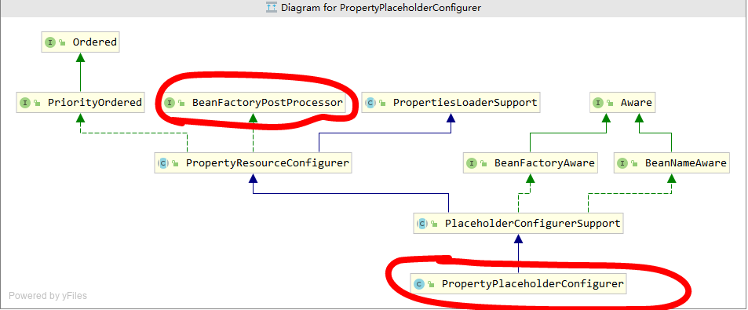
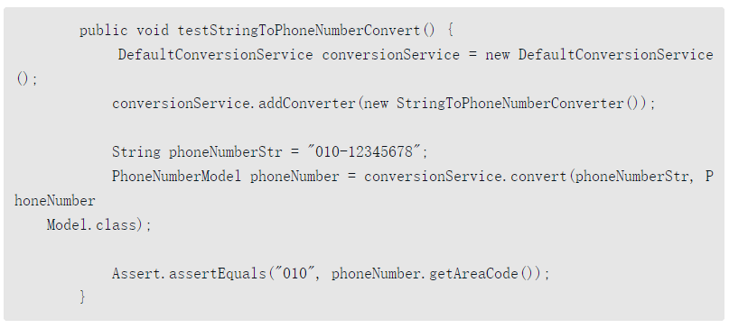

6 容器的功能扩展 

在前面的章节中我们一直以BeanFacotry接口以及它的默认实现类XmlBeanFactory为例进行分析，但是， Spring中还提供了另一个接口ApplicationContext，用于扩展BeanFacotry中现有的功能。

ApplicationContext和BeanFacotry两者都是用于加载Bean的，但是相比之下，ApplicationContext提供了更多的扩展功能，简单一点说：ApplicationContext包含BeanFactory的所有功能。通常建议比BeanFactory优先。

同样，我们还是以 ClassPathXmlApplicationContext作为切入点，开始对整体功能进行分析。

```java 
ApplicationContext context = new ClassPathXmlApplicationContext("classpath:test.xml");

public ClassPathXmlApplicationContext(String configLocation) throws BeansException {
   this(new String[] {configLocation}, true, null);
}
public ClassPathXmlApplicationContext(
      String[] configLocations, boolean refresh, @Nullable ApplicationContext parent)
      throws BeansException {
   super(parent);
   setConfigLocations(configLocations);
   if (refresh) {
      refresh();
   }
}
```

设置路径是必不可少的步骤，ClassPathXmlApplicationContext中可以将配置文件路径以数组的方式传入，ClassPathXmlApplicationContext可以对数组进行解析并进行加载。而对于解析及功能实现都在refresh()中实现

##### **6.1 设置配置路径**

 在ClassPathXmlApplicationContext中支持多个配置文件以数组方式同时传入：

```java 
public void setConfigLocations(@Nullable String... locations) {
   if (locations != null) {
      Assert.noNullElements(locations, "Config locations must not be null");
      this.configLocations = new String[locations.length];
      for (int i = 0; i < locations.length; i++) {
         this.configLocations[i] = resolvePath(locations[i]).trim(); 解析给定的路径
      }
   }
   else {
      this.configLocations = null;
   }
}
```

此函数主要时用于解析给定的路径数组，当然，如果数组中包含特殊符号，如 ${var}， 那么在 **resolvePath** 中会搜寻匹配的系统变量并替换

##### **6.2 扩展功能**  

设置了路径之后，便可以根据路径做配置文件的解析以及各种功能的实现了。可以说refresh函数中包含了几乎ApplicationContext中提供的全部功能，而且此函数中逻辑非常清晰明了，使我们很容易分析对应的层次及逻辑。**AbstractApplicationContext.java**

```java 
public void refresh() throws BeansException, IllegalStateException {
   synchronized (this.startupShutdownMonitor) {
      // Prepare this context for refreshing. 准备刷新的上下文环境
      prepareRefresh();

      // Tell the subclass to refresh the internal bean factory. 初始化 BeanFactory，并进行 XML 文件读取
      ConfigurableListableBeanFactory beanFactory = obtainFreshBeanFactory();

      // Prepare the bean factory for use in this context. 对 BeanFactory 进行各种功能填充
      prepareBeanFactory(beanFactory);

      try {
         // Allows post-processing of the bean factory in context subclasses. 子类覆盖方法做额外的处理
         postProcessBeanFactory(beanFactory);

         // Invoke factory processors registered as beans in the context. 激活各种BeanFactory处理器
         invokeBeanFactoryPostProcessors(beanFactory);

         // Register bean processors that intercept bean creation. 注册拦截 bean 创建的 bean 处理器，这里只是注册，真正的调用是在 getBean 时候
         registerBeanPostProcessors(beanFactory);

         // Initialize message source for this context. 初始化 message 源，国际化处理
         initMessageSource();

         // Initialize event multicaster for this context. 初始化应用广播器，并放入 ApplicationEventMulticaster bean中
         initApplicationEventMulticaster();

         // Initialize other special beans in specific context subclasses. 留给子类来初始化其他的 bean
         onRefresh();

         // Check for listener beans and register them. 在所有注册的bean中查找 Listener bean，注册到消息广播器中
         registerListeners();

         // Instantiate all remaining (non-lazy-init) singletons. 初始化剩下的单实例（非惰性的）
         finishBeanFactoryInitialization(beanFactory);

         // Last step: publish corresponding event. 完成刷新过程，通知生命周期处理器 lifecyleProcessor 刷新过程，同时发出 ContextRefreshEvent 通知别人
         finishRefresh();
      }

      catch (BeansException ex) {
         if (logger.isWarnEnabled()) {
            logger.warn("Exception encountered during context initialization - " +
                  "cancelling refresh attempt: " + ex);
         }

         // Destroy already created singletons to avoid dangling resources.
         destroyBeans();

         // Reset 'active' flag.
         cancelRefresh(ex);

         // Propagate exception to caller.
         throw ex;
      }

      finally {
         // Reset common introspection caches in Spring's core, since we
         // might not ever need metadata for singleton beans anymore...
         resetCommonCaches();
      }
   }
}
```

##### **6.3 环境准备** 

**prepareRefresh();** 函数主要是做些准备工作，例如对系统属性及环境变量的初始化及验证。 

```java 
/**
* Prepare this context for refreshing, setting its startup date and
* active flag as well as performing any initialization of property sources.
*/
protected void prepareRefresh() {
   // Switch to active.
   this.startupDate = System.currentTimeMillis();
   this.closed.set(false);
   this.active.set(true);

   if (logger.isDebugEnabled()) {
      if (logger.isTraceEnabled()) {
         logger.trace("Refreshing " + this);
      }
      else {
         logger.debug("Refreshing " + getDisplayName());
      }
   }

   // Initialize any placeholder property sources in the context environment.
   initPropertySources(); 留给子类覆盖

   // Validate that all properties marked as required are resolvable:
   // see ConfigurablePropertyResolver#setRequiredProperties 验证需要的属性文件是否都已经放入环境中
   getEnvironment().validateRequiredProperties();

   // Store pre-refresh ApplicationListeners...
   if (this.earlyApplicationListeners == null) {
      this.earlyApplicationListeners = new LinkedHashSet<>(this.applicationListeners);
   }
   else {
      // Reset local application listeners to pre-refresh state.
      this.applicationListeners.clear();
      this.applicationListeners.addAll(this.earlyApplicationListeners);
   }

   // Allow for the collection of early ApplicationEvents,
   // to be published once the multicaster is available...
   this.earlyApplicationEvents = new LinkedHashSet<>();
}

protected void initPropertySources() {
   // For subclasses: do nothing by default.
}
```

网上有人说其实这个函数没什么用，因为最后两句代码才是最为关键的，但是却没有什么逻辑处理，initPropertySources是空的，没有任何逻辑，而getEnvironment().validateRequiredProperties也因为没有需要验证的属性而没有做任何处理。

其实这都是因为没有彻底理解才会这么说，这个函数如果用好了作用还是挺大的。那么，该怎么用呢？我们先探索下各个函数的作用。

（1）initPropertySources正符合Spring的开放式结构设计，给用户最大扩展Spring的能力。用户可以根据自身的需要重写initPropertySources方法，并在方法中进行个性化的属性处理及设置。

（2）validateRequiredProperties则是对属性进行验证，那么如何验证呢？我们举个融合两句代码的小例子来帮助大家理解。

假如现在有这样一个需求，工程在运行过程中用到的某个设置（例如VAR）是从系统环境变量中取得的，而如果用户没有在系统环境变量中配置这个参数，那么工程可能不会工作。这一要求可能会有各种各样的解决办法，当然，在Spring中可以这样做，你可以直接修改Spring的源码，例如修改ClassPathXmlApplicationContext。当然，最好的办法还是对源码进行扩展.

```java 
public class MyClassPathXmlApplicationContext extends ClassPathXmlApplicationContext {
    public MyClassPathXmlApplicationContext(String... locations) {    
      super(locations);
    }
    protected void initPropertySources() {
        getEnvironment().setRequiredProperties("VAR");
    }
}
```

我们自定义了继承自ClassPathXmlApplicationContext的MyClassPathXmlApplicationContext，并重写了initPropertySources方法，在方法中添加了我们的个性化需求，那么在验证的时候也就是程序走到getEnvironment().validateRequiredProperties()代码的时候，如果系统并没有检测到对应VAR的环境变量，那么将抛出异常。 

##### **6.4 加载 BeanFactory**  

obtainFreshBeanFactory方法从字面理解是获取BeanFactory。之前有说过，ApplicationContext是对BeanFactory的功能上的扩展，不但包含了BeanFactory的全部功能更在其基础上添加了大量的扩展应用，那么**obtainFreshBeanFactory**正是实现BeanFactory的地方，也就是经过了这个函数后ApplicationContext就已经拥有了BeanFactory的全部功能。  

```java 
protected ConfigurableListableBeanFactory obtainFreshBeanFactory() {
   refreshBeanFactory();
   return getBeanFactory();
}
实现功能委托给了 refreshBeanFactory() 方法
@Override
protected final void refreshBeanFactory() throws BeansException {
   if (hasBeanFactory()) {
      destroyBeans();
      closeBeanFactory();
   }
   try {
    // 创建默认的 DefaultListableBeanFactory
      DefaultListableBeanFactory beanFactory = createBeanFactory();
      beanFactory.setSerializationId(getId());
// 定制 beanFactory，设置相关属性，包括是否允许覆盖同名称的不同定义的对象以及循环依赖以及设置 @Autowired 和 @Qualifier 注解解析器 QualifierAnnotationAutowireCandidateResolver
      customizeBeanFactory(beanFactory); 
// 初始化 DocumentReader，并进行 XML 文件读取和解析
      loadBeanDefinitions(beanFactory); 
      synchronized (this.beanFactoryMonitor) {
         this.beanFactory = beanFactory; // 使用全局变量记录 BeanFactory 类实例
      }
   }
   catch (IOException ex) {
      throw new ApplicationContextException("I/O error parsing bean definition source for " + getDisplayName(), ex);
   }
}
```

###### **6.4.1 定制的 BeanFactory** 

这里已经开始了对BeanFactory的扩展，在基本容器的基础上，增加了是否允许覆盖是否允许扩展的设置并提供了注解**@Qualifier和@Autowired**的支持。 

```java 
protected void customizeBeanFactory(DefaultListableBeanFactory beanFactory) {
   if (this.allowBeanDefinitionOverriding != null) {
      beanFactory.setAllowBeanDefinitionOverriding(this.allowBeanDefinitionOverriding);
   }
   if (this.allowCircularReferences != null) {
      beanFactory.setAllowCircularReferences(this.allowCircularReferences);
   }
}
这里没有书中的这两个注解的解析代码，当前版本：5.2.4，书里面应该是3.x。但是类还是有的： QualifierAnnotationAutowireCandidateResolver 
```

###### **6.4.2 加载 BeanDefinition** 

在第一步中提到了将ClassPathXmlApplicationContext与XmlBeanFactory创建的对比，在实现配置文件的加载功能中除了我们在第一步中已经初始化的DefaultListableBeanFactory外，还需要XmlBeanDefinitionReader来读取XML，那么在这个步骤中首先要做的就是初始化XmlBeanDefinitionReader。**AbstractXmlApplicationContext.java** 

```java 
protected void loadBeanDefinitions(DefaultListableBeanFactory beanFactory) throws BeansException, IOException {
   // Create a new XmlBeanDefinitionReader for the given BeanFactory.
   XmlBeanDefinitionReader beanDefinitionReader = new XmlBeanDefinitionReader(beanFactory);

   // Configure the bean definition reader with this context's
   // resource loading environment. 环境变量设置
   beanDefinitionReader.setEnvironment(this.getEnvironment());
   beanDefinitionReader.setResourceLoader(this);
   beanDefinitionReader.setEntityResolver(new ResourceEntityResolver(this)); 前一个文章有提到这个类的用法


   // Allow a subclass to provide custom initialization of the reader,
   // then proceed with actually loading the bean definitions.
   initBeanDefinitionReader(beanDefinitionReader);
   loadBeanDefinitions(beanDefinitionReader);
}
protected void loadBeanDefinitions(XmlBeanDefinitionReader reader) throws BeansException, IOException {
   Resource[] configResources = getConfigResources();
   if (configResources != null) {
      reader.loadBeanDefinitions(configResources);
   }
   String[] configLocations = getConfigLocations();
   if (configLocations != null) {
      reader.loadBeanDefinitions(configLocations);
   }
}
```

使用XmlBeanDefinitionReader的loadBeanDefinitions方法进行配置文件的加载机注册相信大家已经不陌生，这完全就是开始BeanFactory的套路。因为在XmlBeanDefinitionReader中已经将之前初始化的DefaultListableBeanFactory注册进去了，所以XmlBeanDefinitionReader所读取的BeanDefinitionHolder都会注册到DefaultListableBeanFactory中，也就是经过此步骤，类型DefaultListableBeanFactory的变量beanFactory已经包含了所有解析好的配置。

##### **6.5 功能扩展** 

进入函数**prepareBeanFactory（对 BeanFactory 进行各种功能填充）**前，Spring已经完成了对配置的解析，而ApplicationContext在功能上的扩展也由此展开。 

```java 
/**
* Configure the factory's standard context characteristics,
* such as the context's ClassLoader and post-processors.
* @param beanFactory the BeanFactory to configure
*/
protected void prepareBeanFactory(ConfigurableListableBeanFactory beanFactory) {
   // Tell the internal bean factory to use the context's class loader etc.
   beanFactory.setBeanClassLoader(getClassLoader()); // 设置 beanFactory 的 classloader 为当前 context 的classloader
   beanFactory.setBeanExpressionResolver(new StandardBeanExpressionResolver(beanFactory.getBeanClassLoader())); // 设置beanFactory的表达式语言处理，spring3增加了表达式语言的支持
   beanFactory.addPropertyEditorRegistrar(new ResourceEditorRegistrar(this, getEnvironment())); // 为beanFactory增加了一个默认的 propertyEditor，这个主要是对 bean 的属性等设置管理的一个工具

   // Configure the bean factory with context callbacks. 忽略几个自动装配的接口
   beanFactory.addBeanPostProcessor(new ApplicationContextAwareProcessor(this));
   beanFactory.ignoreDependencyInterface(EnvironmentAware.class);
   beanFactory.ignoreDependencyInterface(EmbeddedValueResolverAware.class);
   beanFactory.ignoreDependencyInterface(ResourceLoaderAware.class);
   beanFactory.ignoreDependencyInterface(ApplicationEventPublisherAware.class);
   beanFactory.ignoreDependencyInterface(MessageSourceAware.class);
   beanFactory.ignoreDependencyInterface(ApplicationContextAware.class);

   // BeanFactory interface not registered as resolvable type in a plain factory.
   // MessageSource registered (and found for autowiring) as a bean. 设置了几个自动装配的特殊规则
   beanFactory.registerResolvableDependency(BeanFactory.class, beanFactory);
   beanFactory.registerResolvableDependency(ResourceLoader.class, this);
   beanFactory.registerResolvableDependency(ApplicationEventPublisher.class, this);
   beanFactory.registerResolvableDependency(ApplicationContext.class, this);

   // Register early post-processor for detecting inner beans as ApplicationListeners.
   beanFactory.addBeanPostProcessor(new ApplicationListenerDetector(this));

   // Detect a LoadTimeWeaver and prepare for weaving, if found. 增加对 AspectJ 的支持
   if (beanFactory.containsBean(LOAD_TIME_WEAVER_BEAN_NAME)) {
      beanFactory.addBeanPostProcessor(new LoadTimeWeaverAwareProcessor(beanFactory));
      // Set a temporary ClassLoader for type matching.
      beanFactory.setTempClassLoader(new ContextTypeMatchClassLoader(beanFactory.getBeanClassLoader()));
   }

   // Register default environment beans. 添加默认环境的 bean
   if (!beanFactory.containsLocalBean(ENVIRONMENT_BEAN_NAME)) {
      beanFactory.registerSingleton(ENVIRONMENT_BEAN_NAME, getEnvironment());
   }
   if (!beanFactory.containsLocalBean(SYSTEM_PROPERTIES_BEAN_NAME)) {
      beanFactory.registerSingleton(SYSTEM_PROPERTIES_BEAN_NAME, getEnvironment().getSystemProperties());
   }
   if (!beanFactory.containsLocalBean(SYSTEM_ENVIRONMENT_BEAN_NAME)) {
      beanFactory.registerSingleton(SYSTEM_ENVIRONMENT_BEAN_NAME, getEnvironment().getSystemEnvironment());
   }
}
```

上面函数中主要进行了几个方面的扩展。

- 增加对SPEL语言的支持。
- 增加对属性编辑器的支持。
- 增加对一些内置类，比如EnvironmentAware、MessageSourceAware的信息注入。
- 设置了依赖功能可忽略的接口。
- 注册一些固定依赖的属性。
- 增加AspectJ的支持（会在第7章中进行详细的讲解）。
- 将相关环境变量及属性注册以单例模式注册。

###### **6.5.1 增加 SPEL 语言的支持** 

Spring表达式语言全称为“Spring Expression Language”，缩写为“SpEL”，类似于Struts 2x中使用的OGNL表达式语言，**能在运行时构建复杂表达式、存取对象图属性、对象方法调用等**，并且能与Spring功能完美整合，比如能用来配置bean定义。SpEL是单独模块，只依赖于core模块，不依赖于其他模块，可以单独使用。SpEL使用#{…}作为定界符，所有在大框号中的字符都将被认为是SpEL，使用格式如下： 

```xml
<bean id="hello" class="springtest.aware.Hello">
    <property name="aaa" value="#{saxophone}"/>
</bean>
相当于
<bean id="hello" class="springtest.aware.Hello">
    <property name="aaa" ref="saxophone"/>
</bean>
```

在源码中通过代码**beanFactory.setBeanExpressionResolver(new StandardBeanExpressionResolver())**注册语言解析器，就可以对SPEL进行解析了，那么在注册解析器后Spring又是在什么时候调用这个解析器进行解析呢？

之前我们讲解过Spring在bean进行初始化的时候会有属性填充的一步，而在这一步中Spring会调用AbstractAutowireCapableBeanFactory类的applyPropertyValues函数来完成功能。就在这个函数中，会通过构造BeanDefinitionValueResolver类型实例valueResolver来进行属性值的解析。

同时，也是在这个步骤中一般通过**AbstractBeanFactory中的evaluateBeanDefinitionString方法去完成SPEL的解析**。

###### **6.5.2 增加属性注册编辑器** 

在Spring DI注入的时候可以把普通属性注入进来，但是像Date类型就无法被识别。例如

```java 
public class User {
    private Date date;
    public Date getDate() {
        return date;
    }
    public void setDate(Date date) {
        this.date = date;
    }
    @Override
    public String toString() {
        return "User{" +
                "date=" + date +
                '}';
    }
}
配置文件
<bean id="hello" class="springtest.aware.User">
    <property name="date" value="2021-08-25"/>
</bean>
```

当获取到这个 bean，然后打印的时候会报错。因为在User中的dataValue属性是Date类型的，而在XML中配置的却是String类型的，所以当然会报异常。 Spring针对此问题提供了两种解决办法。

**1 使用自定义属性编辑器** 

```java 
public class DatePropertyEditor extends PropertyEditorSupport {
    private String format = "yyyy-MM-dd";
    public void setFormat(String format) {
        this.format = format;
    }
    @Override
    public void setAsText(String text) throws IllegalArgumentException {
        SimpleDateFormat simpleDateFormat = new SimpleDateFormat(format);
        try{
            Date d = simpleDateFormat.parse(text);
            this.setValue(d);
        } catch (ParseException e) {
            e.printStackTrace();
        }
    }
}
```

使用自定义属性编辑器，通过继承PropertyEditorSupport，重写setAsText方法

```java 
public class DatePropertyEditor extends PropertyEditorSupport {
    private String format = "yyyy-MM-dd";
    public void setFormat(String format) {
        this.format = format;
    }
    @Override
    public void setAsText(String text) throws IllegalArgumentException {
        SimpleDateFormat simpleDateFormat = new SimpleDateFormat(format);
        try{
            Date d = simpleDateFormat.parse(text);
            this.setValue(d);
        } catch (ParseException e) {
            e.printStackTrace();
        }
    }
}
```

```xml
<?xml version="1.0" encoding="UTF-8"?>
<beans xmlns="http://www.springframework.org/schema/beans"
       xmlns:xsi="http://www.w3.org/2001/XMLSchema-instance"
       xsi:schemaLocation="http://www.springframework.org/schema/beans http://www.springframework.org/schema/beans/spring-beans.xsd">
    <bean id="user" class="springtest.property.User">
        <property name="date" value="2021-08-25"/>
    </bean>

新版本设置不一样，参考：https://blog.csdn.net/qq_20641565/article/details/78633098

<bean class="org.springframework.beans.factory.config.CustomEditorConfigurer">
    <property name="customEditors">
        <map>
            <entry key="java.util.Date" value="springtest.property.DatePropertyEditor"/>
        </map>
    </property>
</bean>
</beans>
```

**2 注册Spring自带的属性编辑器CustomDateEditor** 

（1）定义属性编辑器，实现 **PropertyEditorRegistrar** 接口

```java 
public class DatePropertyEditorRegistrar implements PropertyEditorRegistrar {
    @Override
    public void registerCustomEditors(PropertyEditorRegistry registry) {
        registry.registerCustomEditor(Date.class, new CustomDateEditor(new SimpleDateFormat("yyyy-MM-dd"), true));
    }
}
```

（2）注册到 spring 中

```xml
<bean class="org.springframework.beans.factory.config.CustomEditorConfigurer">
    <property name="propertyEditorRegistrars">
        <list>
            <bean class="springtest.property.DatePropertyEditorRegistrar"/>
        </list>
    </property>
</bean>
```

通过在配置文件中将自定义的DatePropertyEditorRegistrar注册进入org.Springframework.beans.factory.config.CustomEditorConfigurer的propertyEditorRegistrars属性中，可以具有与方法1同样的效果。

我们了解了自定义属性编辑器的使用，但是，似乎这与本节中围绕的核心代码**beanFactory.addPropertyEditorRegistrar(new ResourceEditorRegistrar(this, getEnvironment()))**并无联系，因为在注册自定义属性编辑器的时候使用的是**PropertyEditorRegistry的registerCustomEditor方法，**而这里使用的是ConfigurableListableBeanFactory的addPropertyEditorRegistrar方法。我们不妨深入探索一下ResourceEditorRegistrar的内部实现，**在ResourceEditorRegistrar中，我们最关心的方法是registerCustomEditors**。

省略。。。

###### **6.5.3 添加ApplicationContextAwareProcessor处理器** 

了解了属性编辑器的使用后，接下来我们继续通过AbstractApplicationContext的prepareBeanFactory方法的主线来进行函数跟踪。对于beanFactory.addBeanPostProcessor(newApplicationContextAwareProcessor(this))其实主要目的就是注册个BeanPostProcessor，而真正的逻辑还是在ApplicationContextAwareProcessor中。 

 ApplicationContextAwareProcessor实现BeanPostProcessor接口，我们回顾下之前讲过的内容，在bean实例化的时候，也就是Spring激活bean的init-method的前后，会调用BeanPost Processor的postProcessBeforeInitialization方法和postProcessAfterInitialization方法。

同样，对于ApplicationContextAwareProcessor我们也关心这两个方法。**当前版本里面注册的不是 这个类**，而是beanFactory.addBeanPostProcessor(new ApplicationListenerDetector(this));猜测应该放到别的方法中去了

###### **6.5.4 设置忽略依赖**  

当Spring将ApplicationContextAwareProcessor注册后，那么在invokeAwareInterfaces方法中间接调用的Aware类已经不是普通的bean了，如ResourceLoaderAware、ApplicationEventPublisher Aware等，那么当然需要在Spring做bean的依赖注入的时候忽略它们。而ignoreDependencyInterface的作用正是在此。 

```java 
beanFactory.addBeanPostProcessor(new ApplicationContextAwareProcessor(this));
beanFactory.ignoreDependencyInterface(EnvironmentAware.class);
beanFactory.ignoreDependencyInterface(EmbeddedValueResolverAware.class);
beanFactory.ignoreDependencyInterface(ResourceLoaderAware.class);
beanFactory.ignoreDependencyInterface(ApplicationEventPublisherAware.class);
beanFactory.ignoreDependencyInterface(MessageSourceAware.class);
beanFactory.ignoreDependencyInterface(ApplicationContextAware.class);
```

###### **6.5.5 注册依赖**  

Spring中有了忽略依赖的功能，当然也必不可少地会有注册依赖的功能。

```java 
 // BeanFactory interface not registered as resolvable type in a plain factory.
   // MessageSource registered (and found for autowiring) as a bean. 设置了几个自动装配的特殊规则
   beanFactory.registerResolvableDependency(BeanFactory.class, beanFactory);
   beanFactory.registerResolvableDependency(ResourceLoader.class, this);
   beanFactory.registerResolvableDependency(ApplicationEventPublisher.class, this);
   beanFactory.registerResolvableDependency(ApplicationContext.class, this);
```

当**注册了依赖解析后**，例如当注册了对BeanFactory.class的解析依赖后，当bean的属性注入的时候，一旦检测到属性为BeanFactory类型便会将beanFactory的实例注入进去。 

##### **6.6 BeanFactory的后处理器** 

```java 
// Allows post-processing of the bean factory in context subclasses.
postProcessBeanFactory(beanFactory);
```

BeanFacotry作为Spring中容器功能的基础，用于存放所有已经加载的bean，为了保证程序上的高可扩展性，Spring针对BeanFactory做了大量的扩展，比如我们熟知的PostProcessor等都是在这里实现的。 

###### **6.6.1 激活注册的BeanFactoryPostProcessor** 

正式开始介绍之前我们先了解下BeanFactoryPostProcessor的用法。**BeanFactoryPostProcessor接口跟BeanPostProcessor类似，可以对bean的定义（配置元数据）进行处理。也就是说，Spring IoC容器允许BeanFactoryPostProcessor在容器实际实例化任何其他的bean之前读取配置元数据，并有可能修改它**。如果你愿意，你可以配置多个BeanFactoryPostProcessor。**你还能通过设置“order”属性来控制BeanFactoryPostProcessor的执行次序**（仅当BeanFactoryPostProcessor实现了Ordered接口时你才可以设置此属性，因此在实现BeanFactoryPostProcessor时，就应当考虑实现Ordered接口）。请参考BeanFactoryPostProcessor和Ordered接口的JavaDoc以获取更详细的信息。

**如果你想改变实际的bean实例（例如从配置元数据创建的对象），那么你最好使用BeanPostProcessor**。同样地，**BeanFactoryPostProcessor的作用域范围是容器级的。它只和你所使用的容器有关**。如果你在容器中定义一个BeanFactoryPostProcessor，它仅仅对此容器中的bean进行后置处理。BeanFactoryPostProcessor不会对定义在另一个容器中的bean进行后置处理，即使这两个容器都是在同一层次上。**在Spring中存在对于BeanFactoryPostProcessor的典型应用，比如PropertyPlaceholderConfigurer**


**1.BeanFactoryPostProcessor的典型应用：PropertyPlaceholderConfigurer** 

有时候，阅读Spring的Bean描述文件时，你也许会遇到类似如下的一些配置：

```xml
<bean id="reportService" class="com.etwealth.mo.server.services.ReportService" factory-method="getInstance">
   <property name="mes" value="${app.mes}"/>
</bean>
```

其中竟然出现了变量引用：${bean.message}。这就是Spring的分散配置，可以在另外的配置文件中为bean.message指定值。

如在bean.property配置如下定义：**“app.mes=Hi,can you find me?”**当访问名为message的bean时，mes属性就会被置为字符串“ Hi,can you find me?”，但Spring框架是怎么知道存在这样的配置文件呢？这就要靠**PropertyPlaceholderConfigurer**这个类的bean:

```xml
<bean id="placeholderConfig" class="com.etwealth.mo.server.connection.EncryptablePropertyPlaceholderConfigurer">
    <property name="location" value="classpath:com/etwealth/mo/server/app.properties" />
</bean>
public class EncryptablePropertyPlaceholderConfigurer extends PropertyPlaceholderConfigurer { ... }
```

在这个bean中指定了配置文件为config/bean.properties。到这里似乎找到问题的答案了，但是其实还有个问题。这个“placeholderConfig”只不过是Spring框架管理的一个bean，并没有被别的bean或者对象引用，Spring的beanFactory是怎么知道要从这个bean中获取配置信息的呢？ 

从类图中可以看到：PropertyPlaceholderConfigurer这个类间接继承了BeanFactoryPostProcessor接口。



这是一个很特别的接口，当Spring加载任何实现了这个接口的bean的配置时，都会**在bean工厂载入所有bean的配置之后执行postProcessBeanFactory方法**。

在**PropertyResourceConfigurer**类中实现了**postProcessBeanFactory**方法，在方法中先后调用了mergeProperties、convertProperties、processProperties这3个方法，分别得到配置，将得到的配置转换为合适的类型，最后将配置内容告知BeanFactory。 

**2 使用自定义的 BeanFactoryPostProcessor** 


**3 激活BeanFactoryPostProcessor**  

了解了BeanFactoryPostProcessor的用法后便可以深入研究BeanFactoryPostProcessor的调用过程了。具体是在下面这个方法调用的

```java 
// Invoke factory processors registered as beans in the context.
invokeBeanFactoryPostProcessors(beanFactory);

/**
* Instantiate and invoke all registered BeanFactoryPostProcessor beans,
* respecting explicit order if given.
* <p>Must be called before singleton instantiation.
*/
protected void invokeBeanFactoryPostProcessors(ConfigurableListableBeanFactory beanFactory) {
   PostProcessorRegistrationDelegate.invokeBeanFactoryPostProcessors(beanFactory, getBeanFactoryPostProcessors());

   // Detect a LoadTimeWeaver and prepare for weaving, if found in the meantime
   // (e.g. through an @Bean method registered by ConfigurationClassPostProcessor)
   if (beanFactory.getTempClassLoader() == null && beanFactory.containsBean(LOAD_TIME_WEAVER_BEAN_NAME)) {
      beanFactory.addBeanPostProcessor(new LoadTimeWeaverAwareProcessor(beanFactory));
      beanFactory.setTempClassLoader(new ContextTypeMatchClassLoader(beanFactory.getBeanClassLoader()));
   }
}
public static void invokeBeanFactoryPostProcessors(
      ConfigurableListableBeanFactory beanFactory, List<BeanFactoryPostProcessor> beanFactoryPostProcessors) {

   // Invoke BeanDefinitionRegistryPostProcessors first, if any.
   Set<String> processedBeans = new HashSet<>();

// 对特殊类型的 BeanDefinitionRegistry 的处理
   if (beanFactory instanceof BeanDefinitionRegistry) {
      BeanDefinitionRegistry registry = (BeanDefinitionRegistry) beanFactory;
      List<BeanFactoryPostProcessor> regularPostProcessors = new ArrayList<>();
      List<BeanDefinitionRegistryPostProcessor> registryProcessors = new ArrayList<>();

// 硬编码注册的后处理器 beanFactoryPostProcessors
      for (BeanFactoryPostProcessor postProcessor : beanFactoryPostProcessors) {
         if (postProcessor instanceof BeanDefinitionRegistryPostProcessor) {
            BeanDefinitionRegistryPostProcessor registryProcessor =
                  (BeanDefinitionRegistryPostProcessor) postProcessor;
            registryProcessor.postProcessBeanDefinitionRegistry(registry); // BeanFactoryPostProcessor 的基础上还有自己定义的方法，需要先调用
            registryProcessors.add(registryProcessor); // 记录BeanDefinitionRegistryPostProcessor
         }
         else {
            regularPostProcessors.add(postProcessor); // 记录常规的 BeanFactoryPostProcessor
         }
      }

      // Do not initialize FactoryBeans here: We need to leave all regular beans
      // uninitialized to let the bean factory post-processors apply to them!  
不要在这里初始化FactoryBeans:我们需要不初始化所有常规bean，以便让bean工厂的后处理器应用于它们!
      // Separate between BeanDefinitionRegistryPostProcessors that implement
      // PriorityOrdered, Ordered, and the rest. 分离实现了 PriorityOrdered 接口和 Ordered 接口的 BeanDefinitionRegistryPostProcessors
      List<BeanDefinitionRegistryPostProcessor> currentRegistryProcessors = new ArrayList<>();

      // First, invoke the BeanDefinitionRegistryPostProcessors that implement PriorityOrdered. 
// 首先获取 实现了 PriorityOrdered 接口的 BeanDefinitionRegistryPostProcessors
      String[] postProcessorNames =
            beanFactory.getBeanNamesForType(BeanDefinitionRegistryPostProcessor.class, true, false);
      for (String ppName : postProcessorNames) {
         if (beanFactory.isTypeMatch(ppName, PriorityOrdered.class)) {
            currentRegistryProcessors.add(beanFactory.getBean(ppName, BeanDefinitionRegistryPostProcessor.class));
            processedBeans.add(ppName);
         }
      }
// 排序，按照优先级
      sortPostProcessors(currentRegistryProcessors, beanFactory);
      registryProcessors.addAll(currentRegistryProcessors);
// 激活 PriorityOrdered 接口的 BeanDefinitionRegistryPostProcessors
      invokeBeanDefinitionRegistryPostProcessors(currentRegistryProcessors, registry);
      currentRegistryProcessors.clear();

======================
      // Next, invoke the BeanDefinitionRegistryPostProcessors that implement Ordered.
// 然后获取 实现了 Ordered接口的 BeanDefinitionRegistryPostProcessors
      postProcessorNames = beanFactory.getBeanNamesForType(BeanDefinitionRegistryPostProcessor.class, true, false);
      for (String ppName : postProcessorNames) {
// 判断是否是已经处理了的 bean 
         if (!processedBeans.contains(ppName) && beanFactory.isTypeMatch(ppName, Ordered.class)) {
            currentRegistryProcessors.add(beanFactory.getBean(ppName, BeanDefinitionRegistryPostProcessor.class));
            processedBeans.add(ppName);
         }
      }
// 按照 order 排序
      sortPostProcessors(currentRegistryProcessors, beanFactory);
      registryProcessors.addAll(currentRegistryProcessors);
//  执行调用
      invokeBeanDefinitionRegistryPostProcessors(currentRegistryProcessors, registry); 
      currentRegistryProcessors.clear();
=================
      // Finally, invoke all other BeanDefinitionRegistryPostProcessors until no further ones appear.
// 最后获取所有的 BeanDefinitionRegistryPostProcessors，直到没有一个出现
      boolean reiterate = true;
      while (reiterate) {
         reiterate = false;
         postProcessorNames = beanFactory.getBeanNamesForType(BeanDefinitionRegistryPostProcessor.class, true, false);
         for (String ppName : postProcessorNames) {
            if (!processedBeans.contains(ppName)) {
               currentRegistryProcessors.add(beanFactory.getBean(ppName, BeanDefinitionRegistryPostProcessor.class));
               processedBeans.add(ppName);
               reiterate = true;
            }
         }
         sortPostProcessors(currentRegistryProcessors, beanFactory);
         registryProcessors.addAll(currentRegistryProcessors);
         invokeBeanDefinitionRegistryPostProcessors(currentRegistryProcessors, registry);
         currentRegistryProcessors.clear();
      }

      // Now, invoke the postProcessBeanFactory callback of all processors handled so far.
      invokeBeanFactoryPostProcessors(registryProcessors, beanFactory);
      invokeBeanFactoryPostProcessors(regularPostProcessors, beanFactory);
   }

   else { // 对普通类型的  BeanFactoryPostProcessor 处理
      // Invoke factory processors registered with the context instance.
      invokeBeanFactoryPostProcessors(beanFactoryPostProcessors, beanFactory);
   }

   // Do not initialize FactoryBeans here: We need to leave all regular beans
   // uninitialized to let the bean factory post-processors apply to them!
   String[] postProcessorNames =
         beanFactory.getBeanNamesForType(BeanFactoryPostProcessor.class, true, false);

   // Separate between BeanFactoryPostProcessors that implement PriorityOrdered,
   // Ordered, and the rest.
   List<BeanFactoryPostProcessor> priorityOrderedPostProcessors = new ArrayList<>();
   List<String> orderedPostProcessorNames = new ArrayList<>();
   List<String> nonOrderedPostProcessorNames = new ArrayList<>();
// 对后处理器进行分类
   for (String ppName : postProcessorNames) { 
      if (processedBeans.contains(ppName)) {
         // skip - already processed in first phase above 已经处理过的
      }
      else if (beanFactory.isTypeMatch(ppName, PriorityOrdered.class)) {
         priorityOrderedPostProcessors.add(beanFactory.getBean(ppName, BeanFactoryPostProcessor.class));
      }
      else if (beanFactory.isTypeMatch(ppName, Ordered.class)) {
         orderedPostProcessorNames.add(ppName);
      }
      else {
         nonOrderedPostProcessorNames.add(ppName);
      }
   }

   // First, invoke the BeanFactoryPostProcessors that implement PriorityOrdered. 按照优先级排序
   sortPostProcessors(priorityOrderedPostProcessors, beanFactory);
   invokeBeanFactoryPostProcessors(priorityOrderedPostProcessors, beanFactory);

   // Next, invoke the BeanFactoryPostProcessors that implement Ordered.
   List<BeanFactoryPostProcessor> orderedPostProcessors = new ArrayList<>(orderedPostProcessorNames.size());
   for (String postProcessorName : orderedPostProcessorNames) {
      orderedPostProcessors.add(beanFactory.getBean(postProcessorName, BeanFactoryPostProcessor.class));
   }
   sortPostProcessors(orderedPostProcessors, beanFactory);
   invokeBeanFactoryPostProcessors(orderedPostProcessors, beanFactory);

   // Finally, invoke all other BeanFactoryPostProcessors.
   List<BeanFactoryPostProcessor> nonOrderedPostProcessors = new ArrayList<>(nonOrderedPostProcessorNames.size());
   for (String postProcessorName : nonOrderedPostProcessorNames) {
      nonOrderedPostProcessors.add(beanFactory.getBean(postProcessorName, BeanFactoryPostProcessor.class));
   }
   invokeBeanFactoryPostProcessors(nonOrderedPostProcessors, beanFactory);


   // Clear cached merged bean definitions since the post-processors might have
   // modified the original metadata, e.g. replacing placeholders in values...
   beanFactory.clearMetadataCache();
}
```

###### **6.6.2 注册BeanPostProcessor**   

上文中提到了BeanFacotoryPostProcessors的调用，现在我们来探索下BeanPostProcessor，但是这里并不是调用，而是注册。**真正的调用其实是在bean的实例化阶段进行的**。这是一个很重要的步骤，也是很多功能BeanFactory不支持的重要原因。  

**Spring中大部分功能都是通过后处理器的方式进行扩展的**，这是Spring框架的一个特性，但是在**BeanFactory中其实并没有实现后处理器的自动注册**，**所以在调用的时候如果没有进行手动注册其实是不能使用的**。但是**在ApplicationContext中却添加了自动注册功能**， 

```java 
<?xml version="1.0" encoding="UTF-8"?>
<beans xmlns="http://www.springframework.org/schema/beans"
       xmlns:xsi="http://www.w3.org/2001/XMLSchema-instance"
       xsi:schemaLocation="http://www.springframework.org/schema/beans http://www.springframework.org/schema/beans/spring-beans.xsd">

    <bean id="car" class="springtest.CarFactoryBean">
        <property name="carInfo" value="超级跑车,400, 200000"/>
    </bean>
    <bean id="testAware" class="springtest.aware.TestAware"/>
    <bean id="hello" class="springtest.aware.Hello"/>

    <bean id="myBeanPostProcessor" class="springtest.beanpostprocessor.MyInstantiationAwareBeanPostProcessor"/>
</beans>
实现类
public class MyInstantiationAwareBeanPostProcessor  implements InstantiationAwareBeanPostProcessor {
    @Override
    public Object postProcessBeforeInitialization(Object bean, String beanName) throws BeansException {
        System.out.println("=====");
        return null;
    }
}
测试：
@Test
public void testAware() {
    ApplicationContext context = new ClassPathXmlApplicationContext("classpath:test.xml");
    MyInstantiationAwareBeanPostProcessor myBeanPostProcessor = (MyInstantiationAwareBeanPostProcessor) context.getBean("myBeanPostProcessor");
}
// 输出： 我的配置文件里面有 3 个 bean
car =====
testAware =====
hello =====
```

那么使用BeanFactory方式进行Spring的bean的加载时是不会有任何改变的，但是使用ApplicationContext方式获取bean的时候会在获取每个bean时打印出“====”，而这个特性就是在registerBeanPostProcessors方法中完成的。 

```java 
refresh() 方法里面的
// Register bean processors that intercept bean creation.
registerBeanPostProcessors(beanFactory);

protected void registerBeanPostProcessors(ConfigurableListableBeanFactory beanFactory) {
   PostProcessorRegistrationDelegate.registerBeanPostProcessors(beanFactory, this);
}
public static void registerBeanPostProcessors(
      ConfigurableListableBeanFactory beanFactory, AbstractApplicationContext applicationContext) {

   String[] postProcessorNames = beanFactory.getBeanNamesForType(BeanPostProcessor.class, true, false);

   // Register BeanPostProcessorChecker that logs an info message when
   // a bean is created during BeanPostProcessor instantiation, i.e. when
   // a bean is not eligible for getting processed by all BeanPostProcessors.
// BeanPostProcessorChecker 是一个普通的信息打印，可能会有些情况，当 spring 的配置中的后处理器还没有被注册就已经开始了 bean 的初始化时，便会打印 BeanPostProcessorChecker 中设定的信息
   int beanProcessorTargetCount = beanFactory.getBeanPostProcessorCount() + 1 + postProcessorNames.length;
   beanFactory.addBeanPostProcessor(new BeanPostProcessorChecker(beanFactory, beanProcessorTargetCount));

   // Separate between BeanPostProcessors that implement PriorityOrdered,
   // Ordered, and the rest.
   List<BeanPostProcessor> priorityOrderedPostProcessors = new ArrayList<>(); // 使用 PriorityOrdered 保证顺序
   List<BeanPostProcessor> internalPostProcessors = new ArrayList<>(); // MergedBeanDefinitionPostProcessor
   List<String> orderedPostProcessorNames = new ArrayList<>(); // 使用 Ordered 保持顺序
   List<String> nonOrderedPostProcessorNames = new ArrayList<>(); // 无序 BeanPostProcessor
   for (String ppName : postProcessorNames) {
      if (beanFactory.isTypeMatch(ppName, PriorityOrdered.class)) {
         BeanPostProcessor pp = beanFactory.getBean(ppName, BeanPostProcessor.class);
         priorityOrderedPostProcessors.add(pp); // 添加的是后处理器
         if (pp instanceof MergedBeanDefinitionPostProcessor) {
            internalPostProcessors.add(pp); // 添加的是后处理器
         }
      }
      else if (beanFactory.isTypeMatch(ppName, Ordered.class)) {
         orderedPostProcessorNames.add(ppName); // 添加的是 name
      }
      else {
         nonOrderedPostProcessorNames.add(ppName); // 添加的是name
      }
   }

   // First, register the BeanPostProcessors that implement PriorityOrdered.
   sortPostProcessors(priorityOrderedPostProcessors, beanFactory);
   registerBeanPostProcessors(beanFactory, priorityOrderedPostProcessors);

   // Next, register the BeanPostProcessors that implement Ordered.
   List<BeanPostProcessor> orderedPostProcessors = new ArrayList<>(orderedPostProcessorNames.size());
   for (String ppName : orderedPostProcessorNames) {
      BeanPostProcessor pp = beanFactory.getBean(ppName, BeanPostProcessor.class);
      orderedPostProcessors.add(pp);
      if (pp instanceof MergedBeanDefinitionPostProcessor) {
         internalPostProcessors.add(pp);
      }
   }
   sortPostProcessors(orderedPostProcessors, beanFactory);
   registerBeanPostProcessors(beanFactory, orderedPostProcessors);

   // Now, register all regular BeanPostProcessors.
   List<BeanPostProcessor> nonOrderedPostProcessors = new ArrayList<>(nonOrderedPostProcessorNames.size());
   for (String ppName : nonOrderedPostProcessorNames) {
      BeanPostProcessor pp = beanFactory.getBean(ppName, BeanPostProcessor.class);
      nonOrderedPostProcessors.add(pp);
      if (pp instanceof MergedBeanDefinitionPostProcessor) {
         internalPostProcessors.add(pp);
      }
   }
   registerBeanPostProcessors(beanFactory, nonOrderedPostProcessors);

   // Finally, re-register all internal BeanPostProcessors.
   sortPostProcessors(internalPostProcessors, beanFactory);
   registerBeanPostProcessors(beanFactory, internalPostProcessors);

   // Re-register post-processor for detecting inner beans as ApplicationListeners,
   // moving it to the end of the processor chain (for picking up proxies etc).
   beanFactory.addBeanPostProcessor(new ApplicationListenerDetector(applicationContext));
}
```

首先我们会发现，对于BeanPostProcessor的处理与BeanFactoryPostProcessor的处理极为相似，但是似乎又有些不一样的地方。经过反复的对比发现，对于BeanFactoryPostProcessor的处理要区分两种情况，一种方式是通过**硬编码方式的处理**，另一种是通过**配置文件方式的处理**。 

那么为什么在BeanPostProcessor的处理中只考虑了配置文件的方式而不考虑硬编码的方式呢？

提出这个问题，还是因为读者没有完全理解两者实现的功能。

**对于BeanFactoryPostProcessor的处理，不但要实现注册功能，而且还要实现对后处理器的激活操作，所以需要载入配置中的定义，并进行激活**；**而对于BeanPostProcessor并不需要马上调用**，再说，硬编码的方式实现的功能是将后处理器提取并调用，这里并不需要调用，当然不需要考虑硬编码的方式了，这里的功能只需要将配置文件的BeanPostProcessor提取出来并注册进入beanFactory就可以了。

对于beanFactory的注册，也不是直接注册就可以的。

在Spring中支持对于BeanPost Processor的排序，比如根据PriorityOrdered进行排序、根据Ordered进行排序或者无序，而Spring在BeanPostProcessor的激活顺序的时候也会考虑对于顺序的问题而先进行排序。

这里可能有个地方读者不是很理解，对于internalPostProcessors中存储的后处理器也就是MergedBeanDefinitionPostProcessor类型的处理器，在代码中似乎是被重复调用了，如：

```java 
for (String ppName : postProcessorNames) {
    if (beanFactory.isTypeMatch(ppName, PriorityOrdered.class)) {
        BeanPostProcessor pp = beanFactory.getBean(ppName, BeanPostProcessor.class);
        priorityOrderedPostProcessors.add(pp); // 添加的是后处理器
        if (pp instanceof MergedBeanDefinitionPostProcessor) {
            internalPostProcessors.add(pp); // 添加的是后处理器
        }
    }
    else if (beanFactory.isTypeMatch(ppName, Ordered.class)) {
        orderedPostProcessorNames.add(ppName); // 添加的是 name
    }
    else {
        nonOrderedPostProcessorNames.add(ppName); // 添加的是name
    }
}
```

其实不是，我们可以看看对于registerBeanPostProcessors方法的实现方式。 

```java 
private static void registerBeanPostProcessors(
      ConfigurableListableBeanFactory beanFactory, List<BeanPostProcessor> postProcessors) {
   for (BeanPostProcessor postProcessor : postProcessors) {
      beanFactory.addBeanPostProcessor(postProcessor);
   }
}
AbstractBeanFactory.java
public void addBeanPostProcessor(BeanPostProcessor beanPostProcessor) {
   Assert.notNull(beanPostProcessor, "BeanPostProcessor must not be null");
   // Remove from old position, if any
   this.beanPostProcessors.remove(beanPostProcessor);
   // Track whether it is instantiation/destruction aware
   if (beanPostProcessor instanceof InstantiationAwareBeanPostProcessor) {
      this.hasInstantiationAwareBeanPostProcessors = true;
   }
   if (beanPostProcessor instanceof DestructionAwareBeanPostProcessor) {
      this.hasDestructionAwareBeanPostProcessors = true;
   }
   // Add to end of list
   this.beanPostProcessors.add(beanPostProcessor);
}
```

可以看到，在registerBeanPostProcessors方法的实现中其实已经确保了beanPostProcessor的唯一性，个人猜想，之所以选择在registerBeanPostProcessors中没有进行重复移除操作或许是为了保持分类的效果，使逻辑更为清晰吧。 

###### **6.6.3 初始化信息资源** 

Spring 国际化 

###### 6.6.4 初始化 ApplicationEventMulticaster  事件广播器

在讲解Spring的时间传播器之前，我们还是先来看一下Spring的事件监听的简单用法。 

（1）定义监听事件。 

```java 
/**
* @author Vin lan
* @className TestEvent
* @description 定义监听事件
* @createTime 2021-08-26  11:25
**/
public class TestEvent extends ApplicationEvent {
    public String msg;
    /**
     * Create a new {@code ApplicationEvent}.
     *
     * @param source the object on which the event initially occurred or with
     *               which the event is associated (never {@code null})
     */
    public TestEvent(Object source) {
        super(source);
    }

    public TestEvent(Object source, String msg) {
        super(source);
        this.msg = msg;
    }
    public void print() {
        System.out.println(msg);
    }
}
```

（2）定义监听器。

```java 
public class TestListener implements ApplicationListener<TestEvent> {
    @Override
    public void onApplicationEvent(TestEvent event) {
        event.print();
    }
}
```

（3）添加配置文件

```xml
<?xml version="1.0" encoding="UTF-8"?>
<beans xmlns="http://www.springframework.org/schema/beans"
       xmlns:xsi="http://www.w3.org/2001/XMLSchema-instance"
       xsi:schemaLocation="http://www.springframework.org/schema/beans http://www.springframework.org/schema/beans/spring-beans.xsd">


    <bean id="testListener" class="springtest.listener.TestListener"/>
</beans>
```

（4）测试

```java 
// 测试监听事件
@Test
public void testListener() {
    ApplicationContext context = new ClassPathXmlApplicationContext("classpath:listener.xml");
    TestEvent event = new TestEvent("hello", "msg");
    context.publishEvent(event);
}
// 输出： msg
```

当程序运行时，Spring会将发出的TestEvent事件转给我们自定义的TestListener进行进一步处理。或许很多人一下子会反映出设计模式中的**观察者模式**，这确实是个典型的应用，可以在比较关心的事件结束后及时处理。

那么我们看看ApplicationEventMulticaster是如何被初始化的，以确保功能的正确运行。initApplicationEventMulticaster的方式比较简单，无非考虑两种情况。

- 如果用户自定义了事件广播器，那么使用用户自定义的事件广播器。
- 如果用户没有自定义事件广播器，那么使用默认的ApplicationEventMulticaster。

```java 
protected void initApplicationEventMulticaster() {
   ConfigurableListableBeanFactory beanFactory = getBeanFactory();
   if (beanFactory.containsLocalBean(APPLICATION_EVENT_MULTICASTER_BEAN_NAME)) {
      this.applicationEventMulticaster =
            beanFactory.getBean(APPLICATION_EVENT_MULTICASTER_BEAN_NAME, ApplicationEventMulticaster.class);
      if (logger.isTraceEnabled()) {
         logger.trace("Using ApplicationEventMulticaster [" + this.applicationEventMulticaster + "]");
      }
   }
   else {
      this.applicationEventMulticaster = new SimpleApplicationEventMulticaster(beanFactory);
      beanFactory.registerSingleton(APPLICATION_EVENT_MULTICASTER_BEAN_NAME, this.applicationEventMulticaster);
      if (logger.isTraceEnabled()) {
         logger.trace("No '" + APPLICATION_EVENT_MULTICASTER_BEAN_NAME + "' bean, using " +
               "[" + this.applicationEventMulticaster.getClass().getSimpleName() + "]");
      }
   }
}
```

按照之前介绍的顺序及逻辑，我们推断，**作为广播器，一定是用于存放监听器并在合适的时候调用监听器**，那么我们不妨进入默认的广播器实现SimpleApplicationEventMulticaster来一探究竟。

其中一段代码是我们感兴趣的； 

```java 
public void multicastEvent(final ApplicationEvent event, @Nullable ResolvableType eventType) {
   ResolvableType type = (eventType != null ? eventType : resolveDefaultEventType(event));
   Executor executor = getTaskExecutor();
   for (ApplicationListener<?> listener : getApplicationListeners(event, type)) {
      if (executor != null) {
         executor.execute(() -> invokeListener(listener, event));
      }
      else {
         invokeListener(listener, event);
      }
   }
}
protected void invokeListener(ApplicationListener<?> listener, ApplicationEvent event) {
   ErrorHandler errorHandler = getErrorHandler();
   if (errorHandler != null) {
      try {
         doInvokeListener(listener, event);
      }
      catch (Throwable err) {
         errorHandler.handleError(err);
      }
   }
   else {
      doInvokeListener(listener, event);
   }
}
最终调用到了 这个方法，就是我们定义监听器里面的方法
private void doInvokeListener(ApplicationListener listener, ApplicationEvent event) {
   try {
      listener.onApplicationEvent(event); 
   }
   catch (ClassCastException ex) {
      String msg = ex.getMessage();
      if (msg == null || matchesClassCastMessage(msg, event.getClass())) {
         // Possibly a lambda-defined listener which we could not resolve the generic event type for
         // -> let's suppress the exception and just log a debug message.
         Log logger = LogFactory.getLog(getClass());
         if (logger.isTraceEnabled()) {
            logger.trace("Non-matching event type for listener: " + listener, ex);
         }
      }
      else {
         throw ex;
      }
   }
}
```

可以推断，当产生Spring事件的时候会默认使用SimpleApplicationEventMulticaster的multicastEvent来广播事件，遍历所有监听器，并使用监听器中的onApplicationEvent方法来进行监听器的处理。而对于每个监听器来说其实都可以获取到产生的事件，但是是否进行处理则由事件监听器来决定。 

###### **6.6.5 注册监听器**   

之前在介绍Spring的广播器时反复提到了事件监听器，那么在Spring注册监听器的时候又做了哪些逻辑操作呢？ 

```java 
/**
* Add beans that implement ApplicationListener as listeners.
* Doesn't affect other listeners, which can be added without being beans.
*/
protected void registerListeners() {
   // Register statically specified listeners first.  硬编码方式注册的监听器处理器，指的应该是用setter方法直接注册的
   for (ApplicationListener<?> listener : getApplicationListeners()) {
      getApplicationEventMulticaster().addApplicationListener(listener);
   }


   // Do not initialize FactoryBeans here: We need to leave all regular beans
   // uninitialized to let post-processors apply to them!  配置文件注册的监听器处理器
   String[] listenerBeanNames = getBeanNamesForType(ApplicationListener.class, true, false);
   for (String listenerBeanName : listenerBeanNames) {
      getApplicationEventMulticaster().addApplicationListenerBean(listenerBeanName);
   }

   // Publish early application events now that we finally have a multicaster...
   Set<ApplicationEvent> earlyEventsToProcess = this.earlyApplicationEvents;
   this.earlyApplicationEvents = null;
   if (earlyEventsToProcess != null) {
      for (ApplicationEvent earlyEvent : earlyEventsToProcess) {
         getApplicationEventMulticaster().multicastEvent(earlyEvent);
      }
   }
}
```

##### **6.7 初始化非延迟加载单例**  

完成BeanFactory的初始化工作，其中包括**ConversionService**的设置、配置冻结以及非延迟加载的bean的初始化工作。

```java 
/**
* Finish the initialization of this context's bean factory,
* initializing all remaining singleton beans.
*/
protected void finishBeanFactoryInitialization(ConfigurableListableBeanFactory beanFactory) {
   // Initialize conversion service for this context.
   if (beanFactory.containsBean(CONVERSION_SERVICE_BEAN_NAME) &&
         beanFactory.isTypeMatch(CONVERSION_SERVICE_BEAN_NAME, ConversionService.class)) {
      beanFactory.setConversionService(
            beanFactory.getBean(CONVERSION_SERVICE_BEAN_NAME, ConversionService.class));
   }

   // Register a default embedded value resolver if no bean post-processor
   // (such as a PropertyPlaceholderConfigurer bean) registered any before:
   // at this point, primarily for resolution in annotation attribute values.
   if (!beanFactory.hasEmbeddedValueResolver()) {
      beanFactory.addEmbeddedValueResolver(strVal -> getEnvironment().resolvePlaceholders(strVal));
   }

   // Initialize LoadTimeWeaverAware beans early to allow for registering their transformers early.
   String[] weaverAwareNames = beanFactory.getBeanNamesForType(LoadTimeWeaverAware.class, false, false);
   for (String weaverAwareName : weaverAwareNames) {
      getBean(weaverAwareName);
   }

   // Stop using the temporary ClassLoader for type matching.
   beanFactory.setTempClassLoader(null);

   // Allow for caching all bean definition metadata, not expecting further changes.
// 冻结所有的 bean 定义，说明注册的 bean 定义将不被修改或任何进一步的处理。
   beanFactory.freezeConfiguration();

   // Instantiate all remaining (non-lazy-init) singletons.
// 初始化剩下的单实例（非惰性的）
   beanFactory.preInstantiateSingletons();
}
```

首先我们来了解一下ConversionService类所提供的作用。 

###### **1 ConversionService的设置**  

之前我们提到过使用自定义类型转换器从String转换为Date的方式，那么，在Spring中还提供了另一种转换方式：**使用Converter**。同样，我们使用一个简单的示例来了解下Converter的使用方式。

（1）定义转换器

```java 
public class String2DateConverter implements Converter<String, Date> {
    @Override
    public Date convert(String source) {
        try {
            return new SimpleDateFormat("yyyy-MM-dd").parse(source);
        } catch (ParseException e) {
            e.printStackTrace();
            return null;
        }
    }
}
```

（2）配置文件注册

```xml
<bean id="conversionService" class="org.springframework.context.support.ConversionServiceFactoryBean">
    <property name="converters">
        <list>
            <bean class="springtest.property.String2DateConverter"/>
        </list>
    </property>
</bean>
```

（3）测试

```java 
public void testProperty() {
    ApplicationContext context = new ClassPathXmlApplicationContext("classpath:testProperty.xml");
    User u = (User) context.getBean("user");
    System.out.println(u);
}
// 输出：User{date=Wed Aug 25 00:00:00 CST 2021}
```

###### 另一个用法：



通过以上的功能我们看到了Converter以及ConversionService提供的便利功能，其中的配置就是在当前函数中被初始化的。  

**2 冻结配置**  

冻结所有的bean定义，说明注册的bean定义将不被修改或进行任何进一步的处理。

```java 
public void freezeConfiguration() {
   this.configurationFrozen = true;
   this.frozenBeanDefinitionNames = StringUtils.toStringArray(this.beanDefinitionNames);
}
```

**3 初始化非延迟加载** 

ApplicationContext实现的默认行为就是在启动时将所有单例bean提前进行实例化。提前实例化意味着作为初始化过程的一部分，ApplicationContext实例会创建并配置所有的单例bean。通常情况下这是一件好事，**因为这样在配置中的任何错误就会即刻被发现**（否则的话可能要花几个小时甚至几天）。而这个实例化的过程就是在**finishBeanFactoryInitialization**中完成的。 

`DefaultListableBeanFactory.java`

```java 
public void preInstantiateSingletons() throws BeansException {
   if (logger.isTraceEnabled()) {
      logger.trace("Pre-instantiating singletons in " + this);
   }

   // Iterate over a copy to allow for init methods which in turn register new bean definitions.
   // While this may not be part of the regular factory bootstrap, it does otherwise work fine.
   List<String> beanNames = new ArrayList<>(this.beanDefinitionNames);

   // Trigger initialization of all non-lazy singleton beans...
   for (String beanName : beanNames) {
      RootBeanDefinition bd = getMergedLocalBeanDefinition(beanName);
      if (!bd.isAbstract() && bd.isSingleton() && !bd.isLazyInit()) {
         if (isFactoryBean(beanName)) {
            Object bean = getBean(FACTORY_BEAN_PREFIX + beanName);
            if (bean instanceof FactoryBean) {
               final FactoryBean<?> factory = (FactoryBean<?>) bean;
               boolean isEagerInit;
               if (System.getSecurityManager() != null && factory instanceof SmartFactoryBean) {
                  isEagerInit = AccessController.doPrivileged((PrivilegedAction<Boolean>)
                              ((SmartFactoryBean<?>) factory)::isEagerInit,
                        getAccessControlContext());
               }
               else {
                  isEagerInit = (factory instanceof SmartFactoryBean &&
                        ((SmartFactoryBean<?>) factory).isEagerInit());
               }
               if (isEagerInit) {
                  getBean(beanName);
               }
            }
         }
         else {
            getBean(beanName);
         }
      }
   }

   // Trigger post-initialization callback for all applicable beans...
   for (String beanName : beanNames) {
      Object singletonInstance = getSingleton(beanName);
      if (singletonInstance instanceof SmartInitializingSingleton) {
         final SmartInitializingSingleton smartSingleton = (SmartInitializingSingleton) singletonInstance;
         if (System.getSecurityManager() != null) {
            AccessController.doPrivileged((PrivilegedAction<Object>) () -> {
               smartSingleton.afterSingletonsInstantiated();
               return null;
            }, getAccessControlContext());
         }
         else {
            smartSingleton.afterSingletonsInstantiated();
         }
      }
   }
}
```

##### **6.8 finishRefresh**  生命周期

在Spring中还提供了**Lifecycle**接口，Lifecycle中包含start/stop方法，实现此接口后Spring会保证在启动的时候调用其start方法开始生命周期，并在Spring关闭的时候调用stop方法来结束生命周期，通常用来配置后台程序，在启动后一直运行（如对MQ进行轮询等）。而ApplicationContext的初始化最后正是保证了这一功能的实现。 

**Lifecycle**

```java 
public interface Lifecycle {
        /**
         * 生命周期开始
         */
        void start();
        /**
         * 生命周期结束
         */
        void stop();
        /**
         * 判断当前bean是否是开始状态
         */
        boolean isRunning();
}
```


```java 
/**
* Finish the refresh of this context, invoking the LifecycleProcessor's
* onRefresh() method and publishing the
* {@link org.springframework.context.event.ContextRefreshedEvent}.
*/
protected void finishRefresh() {
   // Clear context-level resource caches (such as ASM metadata from scanning).
   clearResourceCaches();


   // Initialize lifecycle processor for this context.
   initLifecycleProcessor();


   // Propagate refresh to lifecycle processor first.
   getLifecycleProcessor().onRefresh();


   // Publish the final event.
   publishEvent(new ContextRefreshedEvent(this));


   // Participate in LiveBeansView MBean, if active.
   LiveBeansView.registerApplicationContext(this);
}
```

###### **1 initLifecycleProcessor **

当ApplicationContext启动或停止时，它会通过LifecycleProcessor来与所有声明的bean的周期做状态更新，而在LifecycleProcessor的使用前首先需要初始化。调用 initLifecycleProcessor 方法

```java 
public interface LifecycleProcessor extends Lifecycle {

    /**
     * 刷新容器,自动开始生命周期
     */
    void onRefresh();

    /**
     * 关闭容器,自动结束生命周期
     */
    void onClose();

}
```

LifeCycle 的接口的子接口 LifecycleProcessor。

Spring 容器是有生命周期的，因为 AbstractApplicationContext 实现了接口 ConfigurableApplicationContext，而该结构继承自 LifeCycle 接口，实现代码如下：

```java
LifecycleProcessor getLifecycleProcessor() throws IllegalStateException {
        if (this.lifecycleProcessor == null) {
            throw new IllegalStateException("LifecycleProcessor not initialized - " +
                    "call 'refresh' before invoking lifecycle methods via the context: " + this);
        }
        return this.lifecycleProcessor;
    }
// 实现的方法，
@Override
	public void start() {
		getLifecycleProcessor().start();
		publishEvent(new ContextStartedEvent(this));
	}

	@Override
	public void stop() {
		getLifecycleProcessor().stop();
		publishEvent(new ContextStoppedEvent(this));
	}

	@Override
	public boolean isRunning() {
		return (this.lifecycleProcessor != null && this.lifecycleProcessor.isRunning());
	}
```

而调用 finishRefresh() 方法后，里面调用的是  initLifecycleProcessor，默认不指定的话是使用的默认 DefaultLifecycleProcessor，否则从 ConfigurableListableBeanFactory 中获取 name 为 lifecycleProcessor 的bean。

```java 
/**
* Initialize the LifecycleProcessor.
* Uses DefaultLifecycleProcessor if none defined in the context.
* @see org.springframework.context.support.DefaultLifecycleProcessor
*/
protected void initLifecycleProcessor() {
   ConfigurableListableBeanFactory beanFactory = getBeanFactory();
   if (beanFactory.containsLocalBean(LIFECYCLE_PROCESSOR_BEAN_NAME)) {
      this.lifecycleProcessor =
            beanFactory.getBean(LIFECYCLE_PROCESSOR_BEAN_NAME, LifecycleProcessor.class);
      if (logger.isTraceEnabled()) {
         logger.trace("Using LifecycleProcessor [" + this.lifecycleProcessor + "]");
      }
   }
   else {
      DefaultLifecycleProcessor defaultProcessor = new DefaultLifecycleProcessor();
      defaultProcessor.setBeanFactory(beanFactory);
      this.lifecycleProcessor = defaultProcessor;
      beanFactory.registerSingleton(LIFECYCLE_PROCESSOR_BEAN_NAME, this.lifecycleProcessor);
      if (logger.isTraceEnabled()) {
         logger.trace("No '" + LIFECYCLE_PROCESSOR_BEAN_NAME + "' bean, using " +
               "[" + this.lifecycleProcessor.getClass().getSimpleName() + "]");
      }
   }
}
```

继续查看 DefaultLifecycleProcessor 里实现的 start，stop，isRunning 方法。

```java 
/**
    * 执行startBeans(false)方法开启所有实现了Lifecycle接口的bean的生命周期
     */
    @Override
    public void start() {
        startBeans(false);
        this.running = true;
    }

    /**
     * 执行stopBeans()方法关闭所有实现了Lifecycle接口的bean的生命周期
     */
    @Override
    public void stop() {
        stopBeans();
        this.running = false;
    }

    @Override
    public void onRefresh() {
        startBeans(true);
        this.running = true;
    }

    @Override
    public void onClose() {
        stopBeans();
        this.running = false;
    }

    @Override
    public boolean isRunning() {
        return this.running;
    }

```

startBeans 源码分析：start 方法是 false。

```java 
/** 开始bean的生命周期
     * @param autoStartupOnly:自动开启还是手动开启
     * */
    private void startBeans(boolean autoStartupOnly) {
        /**
         * 1.调用getLifecycleBeans方法获取所有实现了Lifecycle接口的bean
         *  实现逻辑就是调用BeanFactory的getBeanNamesForType(LifeCycle.class)方法来获取所有bean
         * */
        Map<String, Lifecycle> lifecycleBeans = getLifecycleBeans();
        Map<Integer, LifecycleGroup> phases = new HashMap<>();
        /**
         * 2.遍历所有Lifecycle的bean,按不同阶段进行分组,同组的封装为 LifecycleGroup对象
         * */
        lifecycleBeans.forEach((beanName, bean) -> {
            if (!autoStartupOnly || (bean instanceof SmartLifecycle && ((SmartLifecycle) bean).isAutoStartup())) {
                int phase = getPhase(bean);
                LifecycleGroup group = phases.get(phase);
                if (group == null) {
                    group = new LifecycleGroup(phase, this.timeoutPerShutdownPhase, lifecycleBeans, autoStartupOnly);
                    phases.put(phase, group);
                }
                group.add(beanName, bean);
            }
        });
        /**
         * 3.遍历所有LifecycleGroup,调用LifecycleGroup的start方法
         * */
        if (!phases.isEmpty()) {
            List<Integer> keys = new ArrayList<>(phases.keySet());
            Collections.sort(keys);
            for (Integer key : keys) {
                phases.get(key).start();
            }
        }
    }
```

LifecycleGroup对象的start方法源码如下：

```java 
public void start() {
    if (this.members.isEmpty()) {
        return;
    }
    if (logger.isDebugEnabled()) {
        logger.debug("Starting beans in phase " + this.phase);
    }
    Collections.sort(this.members);
    for (LifecycleGroupMember member : this.members) {
        doStart(this.lifecycleBeans, member.name, this.autoStartupOnly);
    }
}
```

这里的 doStart 才是回到了 DefaultLifecycleProcessor 类里面：

```java 
private void doStart(Map<String, ? extends Lifecycle> lifecycleBeans, String beanName, boolean autoStartupOnly) {
        /**
         * 1.根据beanName从集合中获取Lifecycle对象并移除
         * */
        Lifecycle bean = lifecycleBeans.remove(beanName);
        if (bean != null && bean != this) {
            /**
             * 2.如果有依赖,则先开启依赖bean的生命周期
             * */
            String[] dependenciesForBean = getBeanFactory().getDependenciesForBean(beanName);
            for (String dependency : dependenciesForBean) {
                doStart(lifecycleBeans, dependency, autoStartupOnly);
            }
            if (!bean.isRunning() &&
                    (!autoStartupOnly || !(bean instanceof SmartLifecycle) || ((SmartLifecycle) bean).isAutoStartup())) {
                try {
                    /**
                     * 3.调用Lifecycle对象的start方法开启生命周期
                     * */
                    bean.start();
                }
                catch (Throwable ex) {
                    throw new ApplicationContextException("Failed to start bean '" + beanName + "'", ex);
                }
            }
        }
    }
```

stopBeans的整体逻辑和startBeans完全一样，只不过一个是执行LifeCycle的start方法一个是执行LifeCycle的stop方法。

###### 2 onRefresh 

启动所有实现了Lifecycle接口的bean。

```java 
DefaultLifecycleProcessor.java
@Override
public void onRefresh() {
   startBeans(true);
   this.running = true;
}

private void startBeans(boolean autoStartupOnly) {
   Map<String, Lifecycle> lifecycleBeans = getLifecycleBeans();
   Map<Integer, LifecycleGroup> phases = new HashMap<>();
   lifecycleBeans.forEach((beanName, bean) -> {
      if (!autoStartupOnly || (bean instanceof SmartLifecycle && ((SmartLifecycle) bean).isAutoStartup())) {
         int phase = getPhase(bean);
         LifecycleGroup group = phases.get(phase);
         if (group == null) {
            group = new LifecycleGroup(phase, this.timeoutPerShutdownPhase, lifecycleBeans, autoStartupOnly);
            phases.put(phase, group);
         }
         group.add(beanName, bean);
      }
   });
   if (!phases.isEmpty()) {
      List<Integer> keys = new ArrayList<>(phases.keySet());
      Collections.sort(keys);
      for (Integer key : keys) {
         phases.get(key).start();
      }
   }
}
```

###### **3 publishEvent**  

当完成ApplicationContext初始化的时候，要通过Spring中的事件发布机制来发出ContextRefreshedEvent事件，以保证对应的监听器可以做进一步的逻辑处理。  

```java 
AbstractApplicationContext.java
/**
* Publish the given event to all listeners.
* @param event the event to publish (may be an {@link ApplicationEvent}
* or a payload object to be turned into a {@link PayloadApplicationEvent})
* @param eventType the resolved event type, if known
* @since 4.2
*/
protected void publishEvent(Object event, @Nullable ResolvableType eventType) {
   Assert.notNull(event, "Event must not be null");

   // Decorate event as an ApplicationEvent if necessary
   ApplicationEvent applicationEvent;
   if (event instanceof ApplicationEvent) {
      applicationEvent = (ApplicationEvent) event;
   }
   else {
      applicationEvent = new PayloadApplicationEvent<>(this, event);
      if (eventType == null) {
         eventType = ((PayloadApplicationEvent<?>) applicationEvent).getResolvableType();
      }
   }


   // Multicast right now if possible - or lazily once the multicaster is initialized
   if (this.earlyApplicationEvents != null) {
      this.earlyApplicationEvents.add(applicationEvent);
   }
   else {
      getApplicationEventMulticaster().multicastEvent(applicationEvent, eventType);
   }


   // Publish event via parent context as well...
   if (this.parent != null) {
      if (this.parent instanceof AbstractApplicationContext) {
         ((AbstractApplicationContext) this.parent).publishEvent(event, eventType);
      }
      else {
         this.parent.publishEvent(event);
      }
   }
}
```


