## Spring 事务 

学习：《Spring源码深度解析》

---

### 1 JDBC 方式下的事务使用示例

###### （1）创建数据表结构。

```sql
CREATE TABLE `suser` (
  `ID` bigint(20) unsigned NOT NULL,
  `email` varchar(64) DEFAULT NULL,
  `name` varchar(250) DEFAULT NULL,
  PRIMARY KEY (`ID`)
) ENGINE=InnoDB DEFAULT CHARSET=utf8
```

###### （2）创建对应数据表的PO。 

```java 
public class User {
    private String name;
    private Integer userId;
    private String email;
    ... 
       
}
```

###### （3）创建表与实体间的映射。 

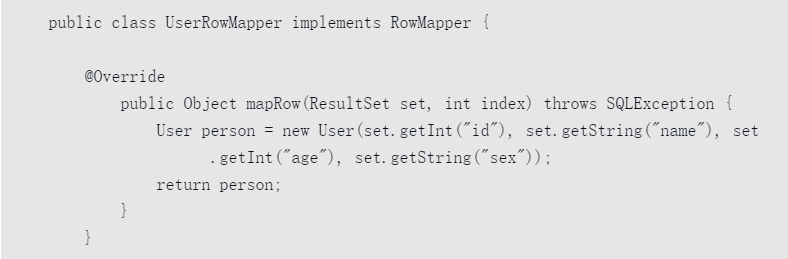

###### （4）创建数据操作接口。 

注意：这里使用了事务的注解 `@Transactional(propagation=Propagation.REQUIRED)`

```java
@Transactional(propagation = Propagation.REQUIRED)
public interface UserService {
    void save(User user) throws Exception;
}
```

###### （5）创建数据操作接口实现类。

```java
package springtest.tx;

import org.springframework.jdbc.core.JdbcTemplate;

import javax.sql.DataSource;
import java.sql.Types;

/**
 * @author Vin lan
 * @className UserServiceImpl
 * @description
 * @createTime 2021-11-24  09:46
 **/
public class UserServiceImpl implements UserService {
    private JdbcTemplate jdbcTemplate;

    public void setJdbcTemplate(DataSource dataSource) {
        this.jdbcTemplate = new JdbcTemplate(dataSource);
    }

    @Override
    public void save(User user) throws Exception {
        System.out.println("start add a user");
        System.out.println("added a user： " + user.toString());
        jdbcTemplate.update("insert into suser(ID, email, name) values (?, ?, ?)",
                new Object[] {user.getUserId(), user.getName(), user.getEmail()},
                new int[] {Types.INTEGER, Types.VARCHAR, Types.VARCHAR});
        System.out.println("end add a user");
//        事务测试，加上这句代码则数据不会保存到数据库里
//        throw new RuntimeException("aa");
    }
}
```

###### （6）创建Spring配置文件。

主要的核心配置文件，数据源使用的是 C3P0 的连接池。

```xml
<?xml version="1.0" encoding="UTF-8"?>
<beans xmlns="http://www.springframework.org/schema/beans"
       xmlns:xsi="http://www.w3.org/2001/XMLSchema-instance" xmlns:tx="http://www.springframework.org/schema/tx"
       xsi:schemaLocation="http://www.springframework.org/schema/beans http://www.springframework.org/schema/beans/spring-beans.xsd
       http://www.springframework.org/schema/tx http://www.springframework.org/schema/tx/spring-tx.xsd">

<!--    配置事务标签，使用注解 -->
    <tx:annotation-driven transaction-manager="transactionManager"/>

    <!-- 配置一个事务管理器 -->
    <bean id="transactionManager" class="org.springframework.jdbc.datasource.DataSourceTransactionManager">
        <property name="dataSource" ref="datasource"/>
    </bean>

<!--    配置一个数据源 -->
    <bean id="datasource" class="com.mchange.v2.c3p0.ComboPooledDataSource">
        <property name="driverClass" value="com.mysql.cj.jdbc.Driver"/>
        <property name="jdbcUrl" value="jdbc:mysql://localhost:3306/test?useSSL=false&amp;useUnicode=true&amp;characterEncoding=utf8"/>
        <property name="user" value="root"/>
        <property name="password" value="123456"/>
        <!-- 连接池启动时的初始值-->
        <property name="initialPoolSize" value="5"/>
        <property name="maxPoolSize" value="30"/>
        <property name="maxIdleTime" value="2"/>
        <property name="minPoolSize" value="5"/>
    </bean>

    <bean id="userService" class="springtest.tx.UserServiceImpl">
        <property name="jdbcTemplate" ref="datasource"/>
    </bean>
</beans>
```

注意这里不使用 SSL 进行连接，使用的话会报错

> jdbc:mysql://localhost:3306/test?useSSL=false&amp;useUnicode=true&amp;characterEncoding=utf8

（7）测试。

```java
/**
 * 事务源码分析，测试
 */
@Test
public void testTx() throws Exception {
    ApplicationContext context = new ClassPathXmlApplicationContext("classpath:testTx.xml");
    springtest.tx.UserService userService = (springtest.tx.UserService) context.getBean("userService");
    springtest.tx.User user = new springtest.tx.User();
    user.setEmail("1111@163.com");
    user.setName("zhang san");
    user.setUserId(1);
    userService.save(user);
}
```

上面的测试示例中，UserServiceImpl类对接口UserService中的save函数的实现最后加入了一句抛出异常的代码：throw new RuntimeException("aa")。当注掉这段代码执行测试类，那么会看到数据被成功的保存到了数据库中，但是如果加入这段代码时再次运行测试类，发现此处的操作并不会将数据保存到数据库中。

**注意** **默认情况下Spring中的事务处理只对RuntimeException方法进行回滚，所以，如果此处将Runtime Exception替换成普通的Exception不会产生回滚效果**。

### 2 事务自定义标签 

对于Spring中事务功能的代码分析，我们首先从配置文件开始入手，在配置文件中有这样一个配置：`<tx:annotation-driven />`。**可以说此处配置是事务的开关，如果没有此处配置，那么Spring中将不存在事务的功能**。

根据之前的分析，我们因此可以判断，在自定义标签中的解析过程中一定是做了一些辅助操作，于是我们先从自定义标签入手进行分析。

使用 idea 搜索关键字 annotation-driven，最终发现类：TxNamespaceHandler，在TxNamespaceHandler中的init方法中：

```java 
public void init() {
    registerBeanDefinitionParser("advice", new TxAdviceBeanDefinitionParser());
    registerBeanDefinitionParser("annotation-driven", new AnnotationDrivenBeanDefinitionParser());
    registerBeanDefinitionParser("jta-transaction-manager", new JtaTransactionManagerBeanDefinitionParser());
}
```

根据自定义标签的使用的规则以及以上的代码，可以知道，在遇到`<tx:annotation-driven>` 为开头的配置后，Spring 都会使用 `AnnotationDrivenBeanDefinitionParser` 类的 parse 方法进行解析。

```java
public BeanDefinition parse(Element element, ParserContext parserContext) {
    registerTransactionalEventListenerFactory(parserContext);
    String mode = element.getAttribute("mode");
    if ("aspectj".equals(mode)) {
        // mode="aspectj"
        registerTransactionAspect(element, parserContext);
        if (ClassUtils.isPresent("javax.transaction.Transactional", getClass().getClassLoader())) {
            registerJtaTransactionAspect(element, parserContext);
        }
    }
    else {
        // mode="proxy"
        AopAutoProxyConfigurer.configureAutoProxyCreator(element, parserContext);
    }
    return null;
}
```

**TransactionalEventListener**

第一部分用于向Spring容器注册TransactionalEventListener工厂，TransactionalEventListener是Spring4.2引入的新特性，允许我们自定义监听器监听事务的提交或其它动作。

在解析中存在对于mode属性的判断，根据代码，如果我们需要使用AspectJ的方式进行事务切入（Spring中的事务是以AOP为基础的），那么可以使用这样的配置： 

`<tx:annotation-driven transaction-manager="transactionManager" mode="aspectj" />`

添加了： `mode="aspectj"` 代码。

#### 2.1 注册 InfrastructureAdvisorAutoProxyCreator

上面有涉及到类 `AopAutoProxyConfigurer`，我们以默认配置为例子进行分析，进入AopAutoProxyConfigurer 类的 configureAutoProxyCreator：

```java 
public static void configureAutoProxyCreator(Element element, ParserContext parserContext) {
            /**
            重点语句！！！！！！
            */ 			AopNamespaceUtils.registerAutoProxyCreatorIfNecessary(parserContext, element);

			String txAdvisorBeanName = TransactionManagementConfigUtils.TRANSACTION_ADVISOR_BEAN_NAME;
			if (!parserContext.getRegistry().containsBeanDefinition(txAdvisorBeanName)) {
				Object eleSource = parserContext.extractSource(element);

                // ==========================
				// Create the TransactionAttributeSource definition.
                // 创建 TransactionAttributeSource 的 bean， 用于
				RootBeanDefinition sourceDef = new RootBeanDefinition(		"org.springframework.transaction.annotation.AnnotationTransactionAttributeSource");
				sourceDef.setSource(eleSource);
				sourceDef.setRole(BeanDefinition.ROLE_INFRASTRUCTURE);
                // 注册 bean，并使用 Spring 中的定义规则生成 beanName 
				String sourceName = parserContext.getReaderContext().registerWithGeneratedName(sourceDef);

                // ==========================
				// Create the TransactionInterceptor definition.
                // 创建 TransactionInterceptor 的 bean, 用于拦截的
				RootBeanDefinition interceptorDef = new RootBeanDefinition(TransactionInterceptor.class);
				interceptorDef.setSource(eleSource);
				interceptorDef.setRole(BeanDefinition.ROLE_INFRASTRUCTURE);
				registerTransactionManager(element, interceptorDef);
				interceptorDef.getPropertyValues().add("transactionAttributeSource", new RuntimeBeanReference(sourceName));
                // 注册 bean，并使用 Spring 中的定义规则生成 beanName 
				String interceptorName = parserContext.getReaderContext().registerWithGeneratedName(interceptorDef);

                // ====================================
				// Create the TransactionAttributeSourceAdvisor definition.
                // 创建 TransactionAttributeSourceAdvisor 的 bean
				RootBeanDefinition advisorDef = new RootBeanDefinition(BeanFactoryTransactionAttributeSourceAdvisor.class);
				advisorDef.setSource(eleSource);
				advisorDef.setRole(BeanDefinition.ROLE_INFRASTRUCTURE);
                // 将 【sourceName】 的 bean 注入 【advidsorDef】 的 【transactionAttributeSource】 属性中
				advisorDef.getPropertyValues().add("transactionAttributeSource", new RuntimeBeanReference(sourceName));
                // 将 【interceptorName】 的 bean注入 【advisorDef】 的 【adviceBeanName】 属性中
				advisorDef.getPropertyValues().add("adviceBeanName", interceptorName);
                // 如果配置了 order 属性，加入 bean 中
				if (element.hasAttribute("order")) {
					advisorDef.getPropertyValues().add("order", element.getAttribute("order"));
				}
                // 注册bean，txAdvisorBeanName = org.springframework.transaction.config.internalTransactionAdvisor
				parserContext.getRegistry().registerBeanDefinition(txAdvisorBeanName, advisorDef);

				CompositeComponentDefinition compositeDef = new CompositeComponentDefinition(element.getTagName(), eleSource);
				compositeDef.addNestedComponent(new BeanComponentDefinition(sourceDef, sourceName));
				compositeDef.addNestedComponent(new BeanComponentDefinition(interceptorDef, interceptorName));
				compositeDef.addNestedComponent(new BeanComponentDefinition(advisorDef, txAdvisorBeanName));
				parserContext.registerComponent(compositeDef);
			}
		}
	}
```

上面的代码注册了代理类及三个bean，很多读者会直接略过，认为只是注册三个bean而已，确实，这里只注册了三个bean，但是这三个bean支撑了整个的事务功能，那么这三个bean是怎么组织起来的呢？ 

首先，其中的两个 bean 被注册到了一个名为 **advidsorDef** 的 bean 中，advisorDef使用`BeanFactoryTransactionAttributeSourceAdvisor`作为其class属性。也就是说`BeanFactoryTransaction AttributeSourceAdvisor`代表着当前bean，具体代码如下：

```java 
advisorDef.getPropertyValues().add("adviceBeanName", interceptorName);
```

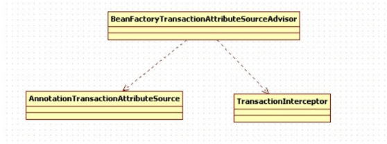

**BeanFactoryTransactionAttributeSourceAdvisor** 内部有 transactionAttributeSource 属性，为什么要这样组装呢？

```java
private TransactionAttributeSource transactionAttributeSource;
```

上面函数configureAutoProxyCreator中的第一句貌似很简单但却是很重要的代码：

```java
AopNamespaceUtils.registerAutoProxyCreatorIfNecessary(parserContext, element);
```

进入这个函数：

```java 
public static void registerAutoProxyCreatorIfNecessary(
    ParserContext parserContext, Element sourceElement) {

    BeanDefinition beanDefinition = AopConfigUtils.registerAutoProxyCreatorIfNecessary(
        parserContext.getRegistry(), parserContext.extractSource(sourceElement));
    
    useClassProxyingIfNecessary(parserContext.getRegistry(), sourceElement);
    registerComponentIfNecessary(beanDefinition, parserContext);
}

public static BeanDefinition registerAutoProxyCreatorIfNecessary(
    BeanDefinitionRegistry registry, @Nullable Object source) {

    return registerOrEscalateApcAsRequired(InfrastructureAdvisorAutoProxyCreator.class, registry, source);
}
```

对于解析来的代码流程AOP中已经有所分析，上面的两个函数主要目的是注册了**InfrastructureAdvisorAutoProxyCreator**类型的bean，那么注册这个类的目的是什么呢？查看这个类的层次，如图10-2所示。

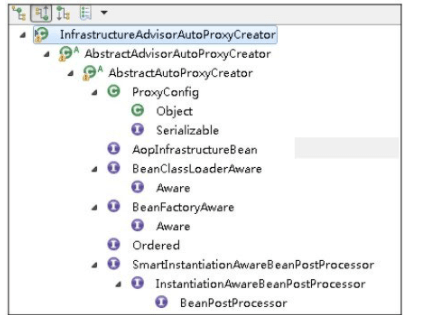

​							**图10-2 InfrastructureAdvisorAutoProxyCreator类的层次结构图**

##### 触发时机

从上面的层次结构中可以看到，InfrastructureAdvisorAutoProxyCreator间接实现了SmartInstantiationAwareBeanPostProcessor，而 SmartInstantiationAwareBeanPostProcessor 又继承自InstantiationAwareBeanPostProcessor，也就是说在Spring中，**所有bean实例化时Spring都会保证调用其postProcessAfterInitialization方法**，其实现是在父类 **AbstractAutoProxyCreator** 类中实现。

**前提是 InfrastructureAdvisorAutoProxyCreator 是调用源头，所以子类中覆盖了父类的方法的话会走子类的方法。**

以之前的示例为例，当实例化userService的bean时便会调用此方法，方法如下：

```java
public Object postProcessAfterInitialization(@Nullable Object bean, String beanName) {
   if (bean != null) {
       // 根据给定的 bean 的 class 和 name 构建出 key，beanClassName_beanName
      Object cacheKey = getCacheKey(bean.getClass(), beanName);
      // 是否是由于循环依赖而创建的 bean 代理
      if (this.earlyProxyReferences.remove(cacheKey) != bean) {
         return wrapIfNecessary(bean, beanName, cacheKey);
      }
   }
   return bean;
}
```

这里实现的主要目的是对指定bean进行封装，当然首先要确定是否需要封装，检测及封装的工作都委托给了**wrapIfNecessary**函数进行。

```java
protected Object wrapIfNecessary(Object bean, String beanName, Object cacheKey) {
    // 如果已经处理过
   if (StringUtils.hasLength(beanName) && this.targetSourcedBeans.contains(beanName)) {
      return bean;
   }

   if (Boolean.FALSE.equals(this.advisedBeans.get(cacheKey))) {
      return bean;
   }
      // 给定的 bean 类是否代表一个基础设施类，不应代理，或者配置了指定的bean不需要自动代理
   if (isInfrastructureClass(bean.getClass()) || shouldSkip(bean.getClass(), beanName)) {
      this.advisedBeans.put(cacheKey, Boolean.FALSE);
      return bean;
   }

   // Create proxy if we have advice.这里就是去找对应的拦截器也就是增强，事务或者是aop
   Object[] specificInterceptors = getAdvicesAndAdvisorsForBean(bean.getClass(), beanName, null);
   if (specificInterceptors != DO_NOT_PROXY) {
      this.advisedBeans.put(cacheKey, Boolean.TRUE);
      Object proxy = createProxy(
            bean.getClass(), beanName, specificInterceptors, new SingletonTargetSource(bean));
      this.proxyTypes.put(cacheKey, proxy.getClass());
      return proxy;
   }

   this.advisedBeans.put(cacheKey, Boolean.FALSE);
   return bean;
}
```

wrapIfNecessary函数功能实现起来很复杂，但是逻辑上理解起来还是相对简单的，在wrapIfNecessary函数中主要的工作如下。

（1）找出指定bean对应的增强器。

> ```java
> Object[] specificInterceptors = getAdvicesAndAdvisorsForBean(bean.getClass(), beanName, null);
> ```

（2）根据找出的增强器创建代理。

> ```java
>   Object proxy = createProxy(
>         bean.getClass(), beanName, specificInterceptors, new SingletonTargetSource(bean));
> ```

听起来似乎简单的逻辑，Spring中又做了哪些复杂的工作呢？对于创建代理的部分，通过之前的分析相信大家已经很熟悉了，但是对于增强器的获取，Spring又是怎么做的呢？

#### 2.2 获取对应class/method的增强器

获取指定bean对应的增强器，其中包含两个关键字：**增强器与对应**。

也就是说在 getAdvicesAndAdvisorsForBean 函数中，不但要找出增强器，而且还需要判断增强器是否满足要求。

```java
protected Object[] getAdvicesAndAdvisorsForBean(
      Class<?> beanClass, String beanName, @Nullable TargetSource targetSource) {

   List<Advisor> advisors = findEligibleAdvisors(beanClass, beanName);
   if (advisors.isEmpty()) {
      return DO_NOT_PROXY;
   }
   return advisors.toArray();
}
```

findEligibleAdvisors 具体的代码

`org.springframework.aop.framework.autoproxy.AbstractAdvisorAutoProxyCreator#findEligibleAdvisors` 类中

```java
protected List<Advisor> findEligibleAdvisors(Class<?> beanClass, String beanName) {
   List<Advisor> candidateAdvisors = findCandidateAdvisors();
   List<Advisor> eligibleAdvisors = findAdvisorsThatCanApply(candidateAdvisors, beanClass, beanName);
   extendAdvisors(eligibleAdvisors);
   if (!eligibleAdvisors.isEmpty()) {
      eligibleAdvisors = sortAdvisors(eligibleAdvisors);
   }
   return eligibleAdvisors;
}
```

其实我们也渐渐地体会到了Spring中代码的优秀，即使是一个很复杂的逻辑，在Spring中也会被拆分成若干个小的逻辑，然后在每个函数中实现，使得每个函数的逻辑简单到我们能快速地理解，而不会像有些人开发的那样，将一大堆的逻辑都罗列在一个函数中，给后期维护人员造成巨大的困扰。

同样，通过上面的函数，Spring又将任务进行了拆分，分成了获取**所有增强器与增强器是否匹配**两个功能点。

##### 1 寻找候选增强器 

在findCandidateAdvisors函数中完成的就是获取增强器的功能。

```java
protected List<Advisor> findCandidateAdvisors() {
   Assert.state(this.advisorRetrievalHelper != null, "No BeanFactoryAdvisorRetrievalHelper available");
   return this.advisorRetrievalHelper.findAdvisorBeans();
}
```

具体的执行方法在：`private BeanFactoryAdvisorRetrievalHelper advisorRetrievalHelper;` 类里面。此时这个：cachedAdvisorBeanNames 就是我们前面在 `AopAutoProxyConfigurer.configureAutoProxyCreator` 中调用的时候，注册的 `TRANSACTION_ADVISOR_BEAN_NAME=org.springframework.transaction.config.internalTransactionAdvisor`，也就是说会利用这个类去找增强，而这个bean name 对应的类则是：`BeanFactoryTransactionAttributeSourceAdvisor`，其中是有 `transactionAttributeSource` 属性的。

```java
public List<Advisor> findAdvisorBeans() {
   // Determine list of advisor bean names, if not cached already.
   String[] advisorNames = this.cachedAdvisorBeanNames;
   if (advisorNames == null) {
       // =====
      // Do not initialize FactoryBeans here: We need to leave all regular beans
      // uninitialized to let the auto-proxy creator apply to them!
      advisorNames = BeanFactoryUtils.beanNamesForTypeIncludingAncestors(
            this.beanFactory, Advisor.class, true, false);
       // =====
      this.cachedAdvisorBeanNames = advisorNames;
   }
   if (advisorNames.length == 0) {
      return new ArrayList<>();
   }

   List<Advisor> advisors = new ArrayList<>();
   for (String name : advisorNames) {
      if (isEligibleBean(name)) {
         if (this.beanFactory.isCurrentlyInCreation(name)) {
            if (logger.isTraceEnabled()) {
               logger.trace("Skipping currently created advisor '" + name + "'");
            }
         }
         else {
            try {
                // ******这里获取的就是 BeanFactoryTransactionAttributeSourceAdvisor 这个bean，同时它又是实现了 Advisor 接口的
               advisors.add(this.beanFactory.getBean(name, Advisor.class));
                // ******
            }
            catch (BeanCreationException ex) {
               Throwable rootCause = ex.getMostSpecificCause();
               if (rootCause instanceof BeanCurrentlyInCreationException) {
                  BeanCreationException bce = (BeanCreationException) rootCause;
                  String bceBeanName = bce.getBeanName();
                  if (bceBeanName != null && this.beanFactory.isCurrentlyInCreation(bceBeanName)) {
                     if (logger.isTraceEnabled()) {
                        logger.trace("Skipping advisor '" + name +
                              "' with dependency on currently created bean: " + ex.getMessage());
                     }
                     // Ignore: indicates a reference back to the bean we're trying to advise.
                     // We want to find advisors other than the currently created bean itself.
                     continue;
                  }
               }
               throw ex;
            }
         }
      }
   }
   return advisors;
}
```

对于上面的函数，你看懂其中的奥妙了吗？首先是通过BeanFactoryUtils类提供的工具方法获取所有对应Advisor.class的类，获取办法无非是使用ListableBeanFactory中提供的方法：

```java
public String[] getBeanNamesForType(@Nullable Class<?> type, boolean includeNonSingletons, boolean allowEagerInit) 
```

而当我们知道增强器在容器中的beanName时，获取增强器已经不是问题了，在BeanFactory中提供了这样的方法，可以帮助我们快速定位对应的bean实例。 

```java
public <T> T getBean(String name, Class<T> requiredType) throws BeansException {
   return doGetBean(name, requiredType, null, false);
}
```

或许你已经忘了之前留下的悬念，在我们讲解自定义标签时曾经注册了一个类型为**BeanFactoryTransactionAttributeSourceAdvisor**的bean，而在此bean中我们又注入了另外两个Bean，那么此时这个Bean就会被开始使用了，这个 bean 实现了 Advisor 接口的。

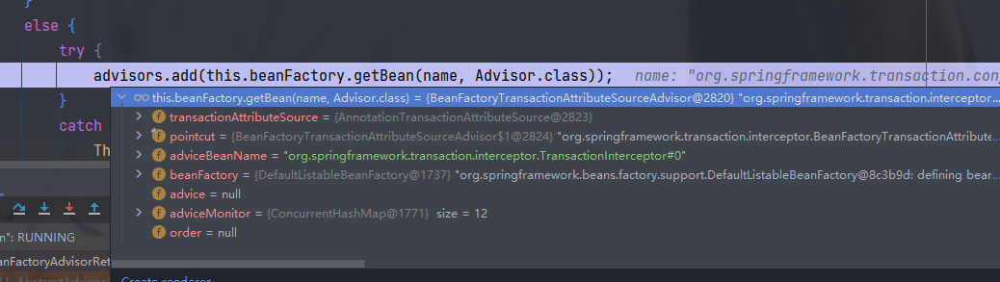

**因为BeanFactoryTransactionAttributeSourceAdvisor同样也实现了Advisor接口，那么在获取所有增强器时自然也会将此bean提取出来，并随着其他增强器一起在后续的步骤中被织入代理**。

> InfrastructureAdvisorAutoProxyCreator  这个类是一开始解析 那个自定义注解时候注册的。

##### 2 候选增强器中寻找到匹配项 

当找出对应的增强器后，接来的任务就是看这些增强器是否与对应的class匹配了，**当然不只是class，class内部的方法如果匹配也可以通过验证**。

```java 
protected List<Advisor> findAdvisorsThatCanApply(
      List<Advisor> candidateAdvisors, Class<?> beanClass, String beanName) {

   ProxyCreationContext.setCurrentProxiedBeanName(beanName);
   try {
      return AopUtils.findAdvisorsThatCanApply(candidateAdvisors, beanClass);
   }
   finally {
      ProxyCreationContext.setCurrentProxiedBeanName(null);
   }
}
```

具体的过程在下面：**candidateAdvisors 是前面获取的所有的增强器**

```java
public static List<Advisor> findAdvisorsThatCanApply(List<Advisor> candidateAdvisors, Class<?> clazz) {
   if (candidateAdvisors.isEmpty()) {
      return candidateAdvisors;
   }
   List<Advisor> eligibleAdvisors = new ArrayList<>();
    // 首先处理引介增强
   for (Advisor candidate : candidateAdvisors) {
      if (candidate instanceof IntroductionAdvisor && canApply(candidate, clazz)) {
         eligibleAdvisors.add(candidate);
      }
   }
   boolean hasIntroductions = !eligibleAdvisors.isEmpty();
   for (Advisor candidate : candidateAdvisors) {
           // 引介增强已经处理
      if (candidate instanceof IntroductionAdvisor) {
         // already processed
         continue;
      }
           // 对于普通 bean 的处理
      if (canApply(candidate, clazz, hasIntroductions)) {
         eligibleAdvisors.add(candidate);
      }
   }
   return eligibleAdvisors;
}
```

canyApply的源码，调用的debug，可以看到clazz是我们使用事务注解的类。

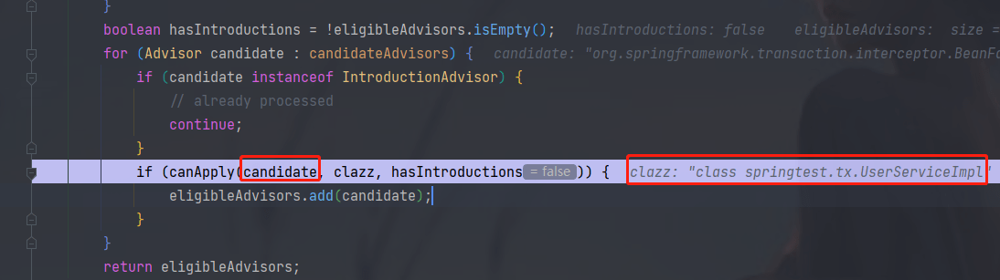

```java
public static boolean canApply(Advisor advisor, Class<?> targetClass, boolean hasIntroductions) {
   if (advisor instanceof IntroductionAdvisor) {
      return ((IntroductionAdvisor) advisor).getClassFilter().matches(targetClass);
   }
   else if (advisor instanceof PointcutAdvisor) { // ===重点===
       // 此时这个 advisor = BeanFactoryTransactionAttributeSourceAdvisor 
      PointcutAdvisor pca = (PointcutAdvisor) advisor; 
      return canApply(pca.getPointcut(), targetClass, hasIntroductions);
   }
   else {
      // It doesn't have a pointcut so we assume it applies.
      return true;
   }
}
```

当前我们分析的是对于UserService是否适用于此增强方法，那么当前的advisor就是之前查找出来的类型为BeanFactoryTransactionAttributeSourceAdvisor的bean实例，而通过类的层次结构我们又知道：BeanFactoryTransactionAttributeSourceAdvisor间接实现了PointcutAdvisor。

因此，在canApply函数中的第二个if判断时就会通过判断，会将

BeanFactory TransactionAttributeSourceAdvisor中的getPointcut()方法返回值作为参数继续调用canApply方法，而getPoint()方法返回的是**TransactionAttributeSourcePointcut**类型的实例。

对于transactionAttributeSource这个属性大家还有印象吗？这是在解析自定义标签时注入进去的。

```java
private final TransactionAttributeSourcePointcut pointcut = new TransactionAttributeSourcePointcut() {
   @Override
   @Nullable
   protected TransactionAttributeSource getTransactionAttributeSource() {
      return transactionAttributeSource;
   }
};

public Pointcut getPointcut() {
    return this.pointcut;
}
```

此时返回的pointcut如下，是先前属性设置进去的。

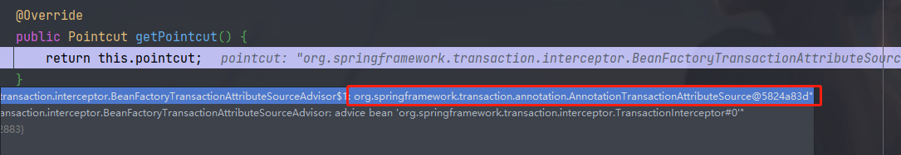

那么，使用`TransactionAttributeSourcePointcut`类型的实例作为函数参数继续跟踪canApply。

```java
// Pointcut = TransactionAttributeSourcePointcut
public static boolean canApply(Pointcut pc, Class<?> targetClass, boolean hasIntroductions) {
   Assert.notNull(pc, "Pointcut must not be null");
   if (!pc.getClassFilter().matches(targetClass)) {
      return false;
   }
// 返回的正是自身 TransactionAttributeSourcePointcut
   MethodMatcher methodMatcher = pc.getMethodMatcher();
   if (methodMatcher == MethodMatcher.TRUE) {
      // No need to iterate the methods if we're matching any method anyway...
      return true;
   }

   IntroductionAwareMethodMatcher introductionAwareMethodMatcher = null;
   if (methodMatcher instanceof IntroductionAwareMethodMatcher) {
      introductionAwareMethodMatcher = (IntroductionAwareMethodMatcher) methodMatcher;
   }
// 这里的 targetClass 是 UserServiceImpl
   Set<Class<?>> classes = new LinkedHashSet<>();
   if (!Proxy.isProxyClass(targetClass)) {
      classes.add(ClassUtils.getUserClass(targetClass));
   }
   classes.addAll(ClassUtils.getAllInterfacesForClassAsSet(targetClass));

   for (Class<?> clazz : classes) {
      Method[] methods = ReflectionUtils.getAllDeclaredMethods(clazz);
      for (Method method : methods) {
         if (introductionAwareMethodMatcher != null ?
               introductionAwareMethodMatcher.matches(method, targetClass, hasIntroductions) :
             // 走到这里
               methodMatcher.matches(method, targetClass)) {
            return true;
         }
      }
   }

   return false;
}
```

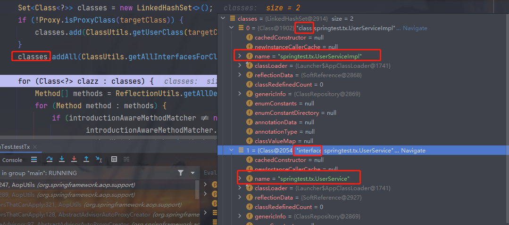

通过上面函数大致可以理清大体脉络，首先获取对应类的所有接口并连同类本身一起遍历，遍历过程中又对类中的方法再次遍历，一旦匹配成功便认为这个类适用于当前增强器。

到这里我们不禁会有疑问，对于事物的配置不仅仅局限于在函数上配置，我们都知道，在类或接口上的配置可以延续到类中的每个函数，那么，如果针对每个函数进行检测，在类本身上配置的事务属性岂不是检测不到了吗？带着这个疑问，我们继续探求matcher方法。

做匹配的时候methodMatcher.matches(method, targetClass)会使用TransactionAttributeSourcePointcut类的matches方法。

```java
public boolean matches(Method method, Class<?> targetClass) {
    // 自定义标签解析时注入 “org.springframework.transaction.annotation.AnnotationTransactionAttributeSource”
   TransactionAttributeSource tas = getTransactionAttributeSource();
   return (tas == null || tas.getTransactionAttribute(method, targetClass) != null);
}
```

此时的tas表示**AnnotationTransactionAttributeSource**类型，而AnnotationTransactionAttributeSource类型的getTransactionAttribute方法如下： 

```Java
public TransactionAttribute getTransactionAttribute(Method method, @Nullable Class<?> targetClass) {
   if (method.getDeclaringClass() == Object.class) {
      return null;
   }

   // First, see if we have a cached value.
   Object cacheKey = getCacheKey(method, targetClass);
   TransactionAttribute cached = this.attributeCache.get(cacheKey);
   if (cached != null) {
      // Value will either be canonical value indicating there is no transaction attribute,
      // or an actual transaction attribute.
      if (cached == NULL_TRANSACTION_ATTRIBUTE) {
         return null;
      }
      else {
         return cached;
      }
   }
   else {
      // We need to work it out. 核心==========
      TransactionAttribute txAttr = computeTransactionAttribute(method, targetClass);
      // Put it in the cache.
      if (txAttr == null) {
         this.attributeCache.put(cacheKey, NULL_TRANSACTION_ATTRIBUTE);
      }
      else {
         String methodIdentification = ClassUtils.getQualifiedMethodName(method, targetClass);
         if (txAttr instanceof DefaultTransactionAttribute) {
            ((DefaultTransactionAttribute) txAttr).setDescriptor(methodIdentification);
         }
         if (logger.isTraceEnabled()) {
            logger.trace("Adding transactional method '" + methodIdentification + "' with attribute: " + txAttr);
         }
         this.attributeCache.put(cacheKey, txAttr);
      }
      return txAttr;
   }
}
```

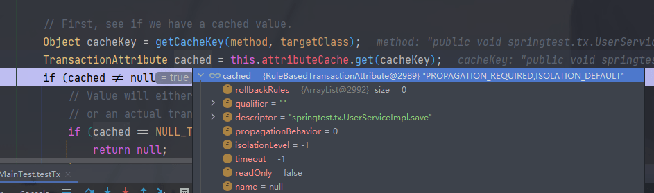

很遗憾，在getTransactionAttribute函数中并没有找到我们想要的代码，这里是指常规的一贯的套路。尝试从缓存加载，如果对应信息没有被缓存的话，工作又委托给了computeTransactionAttribute函数，在computeTransactionAttribute函数中终于的我们看到了事务标签的提取过程。

##### 3 提取事务标签

```Java
protected TransactionAttribute computeTransactionAttribute(Method method, @Nullable Class<?> targetClass) {
   // Don't allow no-public methods as required.这里就指明了，非 public 方法是不能有事务的
   if (allowPublicMethodsOnly() && !Modifier.isPublic(method.getModifiers())) {
      return null;
   }

   // The method may be on an interface, but we need attributes from the target class. method 代表接口中的方法，specificMethod 代表实现类中的方法
   // If the target class is null, the method will be unchanged.
   Method specificMethod = AopUtils.getMostSpecificMethod(method, targetClass);

   // First try is the method in the target class. 查看方法中是否在事务声明
   TransactionAttribute txAttr = findTransactionAttribute(specificMethod);
   if (txAttr != null) {
      return txAttr;
   }

   // Second try is the transaction attribute on the target class. 查看方法所在类中是否存在事务声明
   txAttr = findTransactionAttribute(specificMethod.getDeclaringClass());
   if (txAttr != null && ClassUtils.isUserLevelMethod(method)) {
      return txAttr;
   }

    // 如果存在接口，到接口中去寻找
   if (specificMethod != method) {
      // Fallback is to look at the original method. 查找接口方法
      txAttr = findTransactionAttribute(method);
      if (txAttr != null) {
         return txAttr;
      }
      // Last fallback is the class of the original method. 到接口中的类中去寻找
      txAttr = findTransactionAttribute(method.getDeclaringClass());
      if (txAttr != null && ClassUtils.isUserLevelMethod(method)) {
         return txAttr;
      }
   }

   return null;
}
```

对于事务属性的获取规则相信大家都已经很清楚，**如果方法中存在事务属性，则使用方法上的属性，否则使用方法所在的类上的属性，如果方法所在类的属性上还是没有搜寻到对应的事务属性，那么再搜寻接口中的方法，再没有的话，最后尝试搜寻接口的类上面的声明**。对于函数computeTransactionAttribute中的逻辑与我们所认识的规则并无差别，但是上面函数中并没有真正的去做搜寻事务属性的逻辑，而是搭建了个执行框架，将搜寻事务属性的任务委托给了**findTransactionAttribute**方法去执行。

`org.springframework.transaction.annotation.AnnotationTransactionAttributeSource#findTransactionAttribute(java.lang.reflect.Method)`

```java
protected TransactionAttribute findTransactionAttribute(Method method) {
   return determineTransactionAttribute(method);
}

protected TransactionAttribute determineTransactionAttribute(AnnotatedElement element) {
    for (TransactionAnnotationParser parser : this.annotationParsers) {
        TransactionAttribute attr = parser.parseTransactionAnnotation(element);
        if (attr != null) {
            return attr;
        }
    }
    return null;
}
```

**this.annotationParsers是在当前类AnnotationTransactionAttributeSource初始化的时候初始化的，其中的值被加入了SpringTransactionAnnotationParser**，也就是当进行属性获取的时候其实是使用**SpringTransactionAnnotationParser**类的**parseTransactionAnnotation**方法进行解析的。

```java
public TransactionAttribute parseTransactionAnnotation(AnnotatedElement element) {
   AnnotationAttributes attributes = AnnotatedElementUtils.findMergedAnnotationAttributes(
         element, Transactional.class, false, false);
   if (attributes != null) {
      return parseTransactionAnnotation(attributes);
   }
   else {
      return null;
   }
}
```

至此，我们终于看到了想看到的获取注解标记的代码。**首先会判断当前的类是否含有Transactional注解，这是事务属性的基础**，当然如果有的话会继续调用parseTransactionAnnotation方法解析详细的属性。

```java
protected TransactionAttribute parseTransactionAnnotation(AnnotationAttributes attributes) {
   RuleBasedTransactionAttribute rbta = new RuleBasedTransactionAttribute();
	// 解析 propagation
   Propagation propagation = attributes.getEnum("propagation");
   rbta.setPropagationBehavior(propagation.value());
   // 解析 isolation
   Isolation isolation = attributes.getEnum("isolation");
   rbta.setIsolationLevel(isolation.value());
   // 解析 timeout
   rbta.setTimeout(attributes.getNumber("timeout").intValue());
    // 解析 readOnly
   rbta.setReadOnly(attributes.getBoolean("readOnly"));
    // 解析 value
   rbta.setQualifier(attributes.getString("value"));

   List<RollbackRuleAttribute> rollbackRules = new ArrayList<>();
    // 解析 rollbackFor
   for (Class<?> rbRule : attributes.getClassArray("rollbackFor")) {
      rollbackRules.add(new RollbackRuleAttribute(rbRule));
   }
      // 解析 rollbackForClassName
   for (String rbRule : attributes.getStringArray("rollbackForClassName")) {
      rollbackRules.add(new RollbackRuleAttribute(rbRule));
   }
    // 解析 noRollbackFor
   for (Class<?> rbRule : attributes.getClassArray("noRollbackFor")) {
      rollbackRules.add(new NoRollbackRuleAttribute(rbRule));
   }
    // 解析 noRollbackForClassName
   for (String rbRule : attributes.getStringArray("noRollbackForClassName")) {
      rollbackRules.add(new NoRollbackRuleAttribute(rbRule));
   }
   rbta.setRollbackRules(rollbackRules);

   return rbta;
}
```

上面方法中实现了对对应类或者方法的事务属性解析，你会在这个类中看到任何你常用或者不常用的属性提取。

回顾一下，我们的现在的任务是**找出某个增强器是否适合于对应的类，而是否匹配的关键则在于是否从指定的类或类中的方法中找到对应的事务属性**，现在，我们以UserServiceImpl为例，已经在它的接口UserService中找到了事务属性，所以，它是与事务增强器匹配的，也就是它会被事务功能修饰。

======== **上面的分析都是事务的初始化而已** ===========

至此，**事务功能的初始化工作便结束了**，当判断某个bean适用于事务增强时，也就是适用于增强器**BeanFactoryTransactionAttributeSourceAdvisor**，没错，还是这个类，所以说，**在自定义标签解析时，注入的类成为了整个事务功能的基础**。

BeanFactoryTransactionAttributeSourceAdvisor作为Advisor的实现类，自然要遵从Advisor的处理方式，**当代理被调用时会调用这个类的增强方法，也就是此bean的Advise**，

又**因为在解析事务定义标签时我们把TransactionInterceptor类型的bean注入到了BeanFactoryTransactionAttributeSourceAdvisor中**，所以，**在调用事务增强器增强的代理类时会首先执行TransactionInterceptor进行增强，同时，也就是在TransactionInterceptor类中的invoke方法中完成了整个事务的逻辑**。  

最后返回创建的是一个JDK的代理，因为它是实现了接口的。

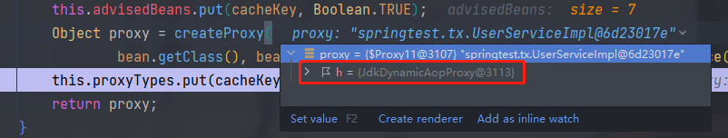

#### 总结 

##### 流程图

首先，我们可以简化一下配置文件为下面这种：没有配置 userService

```xml
   <?xml version="1.0" encoding="UTF-8"?>
   <beans xmlns="http://www.springframework.org/schema/beans"
          xmlns:xsi="http://www.w3.org/2001/XMLSchema-instance" xmlns:tx="http://www.springframework.org/schema/tx"
          xsi:schemaLocation="http://www.springframework.org/schema/beans http://www.springframework.org/schema/beans/spring-beans.xsd
          http://www.springframework.org/schema/tx http://www.springframework.org/schema/tx/spring-tx.xsd">
   
   <!--    配置事务标签，使用注解 -->
       <tx:annotation-driven transaction-manager="transactionManager"/>
<!-- 配置一个事务管理器 -->
    <bean id="transactionManager" class="org.springframework.jdbc.datasource.DataSourceTransactionManager">
        <property name="dataSource" ref="datasource"/>
    </bean>

<!--    配置一个数据源 -->
    <bean id="datasource" class="com.mchange.v2.c3p0.ComboPooledDataSource">
        <property name="driverClass" value="com.mysql.cj.jdbc.Driver"/>
        <property name="jdbcUrl" value="jdbc:mysql://localhost:3306/test?useSSL=false&amp;useUnicode=true&amp;characterEncoding=utf8"/>
        <property name="user" value="root"/>
        <property name="password" value="123456"/>
        <!-- 连接池启动时的初始值-->
        <property name="initialPoolSize" value="5"/>
        <property name="maxPoolSize" value="30"/>
        <property name="maxIdleTime" value="2"/>
        <property name="minPoolSize" value="5"/>
    </bean>
</beans>
```

流程如下：

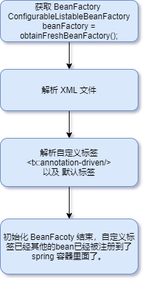

1. 根据配置文件（testTx.xml 配置文件）初始化 ClassPathXmlApplicationContext 类
   public ClassPathXmlApplicationContext(String configLocation)

2. 调用其中的 refresh()  方法，具体的调用是在父类：AbstractApplicationContext，中调用。

3. 获取 beanFactory：（AbstractApplicationContext.java）
   ConfigurableListableBeanFactory beanFactory = obtainFreshBeanFactory();

4. 继续往下，调用 refreshBeanFactory() 方法，位置：org.springframework.context.support.AbstractRefreshableApplicationContext#refreshBeanFactory

   这里面调用 loadBeanDefinitions(beanFactory) 解析 xml 文件。

5. 调用加载 beanDefinitions(beanFactory) beanFactory = DefaultListableBeanFactory 、

   会调用到org.springframework.context.support.AbstractXmlApplicationContext#loadBeanDefinitions(org.springframework.beans.factory.support.DefaultListableBeanFactory)

6. 根据 beanFactory 生成 beanDefinitionReader = new XmlBeanDefinitionReader(beanFactory) 用来读取配置文件，继续往下进入 loadBeanDefinitions(beanDefinitionReader) 

7. 调用 beanDefinitionReader.loadBeanDefinitions(configLocations); configLocations 是配置文件，是一个数组，我们此时这里只有一个

8. XmlBeanDefinitionReader 继承了 AbstractBeanDefinitionReader，所以调用的 loadBeanDefinitions(configLocations) 方法是在里运行的，只load一次，因为只有一个配置文件

9. 开始进行 loadBeanDefinitions(location == "tx.xml", null);

   > org.springframework.beans.factory.support.AbstractBeanDefinitionReader#loadBeanDefinitions(java.lang.String, java.util.Set<org.springframework.core.io.Resource>)

10. 根据不同的 Resource 返回统一的 ResourceLoader 接口，开始初始化代码的时候，ResourceLoader 是 ResourcePatternResolver 类的，调用这个类的 getResource(location) 获取到 Resource,再加载 Resources（此时我们返回的是 ClassPathResource）

11. 继续往下调用，构造一个 loadBeanDefinitions(new EncodedResource(resource)) 进行加载，有可能有不同的编码。 调用是在 XmlBeanDefinitionReader 中了

12. loadBeanDefinitions(EncodedResource encodedResource) 方法中 调用 doLoadBeanDefinitions(inputSource, encodedResource.getResource());

13. 这步则是，根据 XML 资源加载 Document ，然后在解析 Document，注册 bean
    Document doc = doLoadDocument(inputSource, resource);
    int count = registerBeanDefinitions(doc, resource);

14. 继续往下调用，DefaultBeanDefinitionDocumentReader 是后面的  documentReader.registerBeanDefinitions(doc, createReaderContext(resource)); 主要调用类

15. doRegisterBeanDefinitions(doc.getDocumentElement());开始加载注册了

16. 往下开始解析了	

    preProcessXml(root);
    parseBeanDefinitions(root, this.delegate); 真正的逻辑，BeanDefinitionParserDelegate 是这个代理解析类
    postProcessXml(root);

17. 解析 root 的标签，根据不同标签采用不同的解析，我们这里 <tx:...> 不是默认标签，所以走自定义标签 delegate.parseCustomElement(ele); ele 则是这个标签元素了。这个时候解析就由 delegate 执行了，不是上面的 DefaultBeanDefinitionDocumentReader 类了

18. 主要逻辑来了，根据这个 <tx:annotation> 获取命名空间，自定义的标签都需要一个命名空间才能够使用,这里是能获取到的。
    String namespaceUri = getNamespaceURI(ele); 
    `http://www.springframework.org/schema/tx`
    根据命名空间获取对应的处理器， 

    NamespaceHandler handler = this.readerContext.getNamespaceHandlerResolver().resolve(namespaceUri);
    DefaultNamespaceHandlerResolver 默认是使用的这个类，类里面有namespace 对应的 NamespaceHandler 的一个map对象，如其中一个；
    <"http://www.springframework.org/schema/tx ", "org.springframework.transaction.config.TxNamespaceHandler">
    根据类名也就是value创建这个类

19. namespaceHandler.init();初始化方法，注册解析标签的类，**所以说一开始就解析到这个命名空间，然后开始执行这个TxNamespaceHandler的parse方法，随后会将这几个类注册进来**。 		

    > registerBeanDefinitionParser("advice", new TxAdviceBeanDefinitionParser());
    > registerBeanDefinitionParser("annotation-driven", new AnnotationDrivenBeanDefinitionParser());
    > registerBeanDefinitionParser("jta-transaction-manager", new JtaTransactionManagerBeanDefinitionParser()); 放到了 TxNamespaceHandler 的parser 的map中去了
    >
    > 这几个类是在 `NamespaceHandler handler = this.readerContext.getNamespaceHandlerResolver().resolve(namespaceUri);` 的里面调用的时候就调用到了init方法。
    >
    > ```java
    > //org.springframework.beans.factory.xml.DefaultNamespaceHandlerResolver#resolve
    > NamespaceHandler namespaceHandler = (NamespaceHandler) BeanUtils.instantiateClass(handlerClass);
    > namespaceHandler.init();
    > handlerMappings.put(namespaceUri, namespaceHandler);
    > return namespaceHandler;
    > ```

20. 返回TxNamespaceHandler，随后调用 TxNamespaceHandler.parser(ele,new ParserContext(this.readerContext, this, containingBd)) 方法，ele 还是 <tx:..> 这个

21. parse(Element element, ParserContext parserContext)方法中，
    BeanDefinitionParser parser = findParserForElement(element, parserContext) 返回的便是刚刚注册的 AnnotationDrivenBeanDefinitionParser 类了，继而调用 该类的 parser.parse(element, parserContext) 方法。

    >```java
    >执行parse方法
    >public BeanDefinition parseCustomElement(Element ele, @Nullable BeanDefinition containingBd) {
    >String namespaceUri = getNamespaceURI(ele);
    >if (namespaceUri == null) {
    > return null;
    >}
    >NamespaceHandler handler = this.readerContext.getNamespaceHandlerResolver().resolve(namespaceUri);
    >if (handler == null) {
    > error("Unable to locate Spring NamespaceHandler for XML schema namespace [" + namespaceUri + "]", ele);
    > return null;
    >}
    >return handler.parse(ele, new ParserContext(this.readerContext, this, containingBd));
    >}
    >public class TxNamespaceHandler extends NamespaceHandlerSupport {...}
    >public abstract class NamespaceHandlerSupport implements NamespaceHandler {...}
    >```
    >
    >执行parse方法
    >
    >```java
    >return handler.parse(ele, new ParserContext(this.readerContext, this, containingBd));
    >```
    >
    >执行到  NamespaceHandlerSupport的parse
    >
    >```java
    >public BeanDefinition parse(Element element, ParserContext parserContext) {
    >BeanDefinitionParser parser = findParserForElement(element, parserContext);
    >return (parser != null ? parser.parse(element, parserContext) : null);
    >}
    >```
    >
    >最后又到了AnnotationDrivenBeanDefinitionParser中去执行了。
    
22. 随后就走到了判断 mode 是 aspectj 还是 proxy 的地方，往下走就走到了
    AopAutoProxyConfigurer.configureAutoProxyCreator(element, parserContext);解析的地放了

23. 继续往下则是：AopNamespaceUtils.registerAutoProxyCreatorIfNecessary(parserContext, element);

24. 继续调用 

    ```java
    BeanDefinition beanDefinition = AopConfigUtils.registerAutoProxyCreatorIfNecessary(
    parserContext.getRegistry(), parserContext.extractSource(sourceElement));
    registerOrEscalateApcAsRequired(InfrastructureAdvisorAutoProxyCreator.class, registry, source); 
    ```

    注册 InfrastructureAdvisorAutoProxyCreator 类了

25. 后面则是注册这个类的逻辑，注册完毕之后则回到23步.注册的bean是
    key："org.springframework.aop.config.internalAutoProxyCreator" 
    value: InfrastructureAdvisorAutoProxyCreator 
    后面的逻辑也就是文章里面解析的逻辑了 

26. 随后添加了文中提到的3个bean了，到目前位置，beanDefinitionsMap 一共有5个bena被注册进去了
    TransactionalEventListenerFactory
    
    InfrastructureAdvisorAutoProxyCreator
    
    AnnotationTransactionAttributeSource
    
    TransactionInterceptor
    
    BeanFactoryTransactionAttributeSourceAdvisor
    
    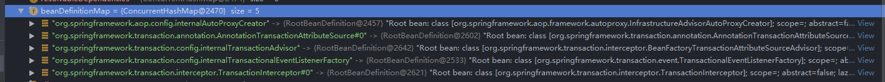
    
27. 最后回到一开始的调用方法 obtainFreshBeanFactory(); 这时候已经初始化完了 BeanFactory 为 DefaultListableBeanFactory 了。

---

##### 理解

在 refresh() 方法中 `finishBeanFactoryInitialization(beanFactory);` 这个方法会初始化所有 spring 容器中的bean，每个实现了

`BeanPostProcessor ` 接口的 bean 都会调用`postProcessAfterInitialization` 方法，而 继承了 `AbstractAutoProxyCreator` 类的都会去调用这个类的 `postProcessAfterInitialization`  方法，每初始化一个 bean，便会去查找这个 bean 的增强器，也就是 `Advisor` 。

当运行到 UserService 的初始化的时候，也就是调用下面方法的时候

> org.springframework.beans.factory.support.AbstractAutowireCapableBeanFactory#initializeBean(java.lang.String, java.lang.Object, org.springframework.beans.factory.support.RootBeanDefinition)，

这里复习下bean初始化顺序：

1. 分配属性
2. 调用 Aware 接口（如果实现了接口的话）
3. 调用 applyBeanPostProcessorsBeforeInitialization 方法
4. 调用 init-method 方法
   - 如果实现了 InitializingBean 接口，先调用 afterPropertiesSet 方法
   - 如果又 init-method 方法，则调用自定义的 init-method 方法
5. 调用 applyBeanPostProcessorsAfterInitialization 方法

UserService 使用了使用了注解 `@Transactional(propagation = Propagation.REQUIRED)` ，而这个类获取的 BeanPostProcessors 如下图所示：

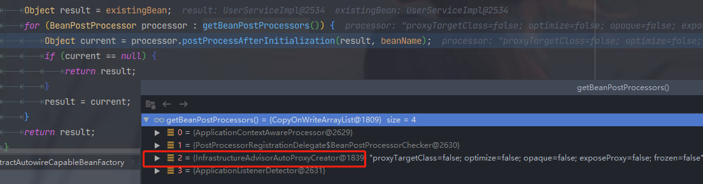

其中有一个是我们上面注册进去的：InfrastructureAdvisorAutoProxyCreator。具体的也就是这个类调用了查找 `Object[] specificInterceptors = getAdvicesAndAdvisorsForBean(bean.getClass(), beanName, null);` 的方法了。查找的结果如下图：

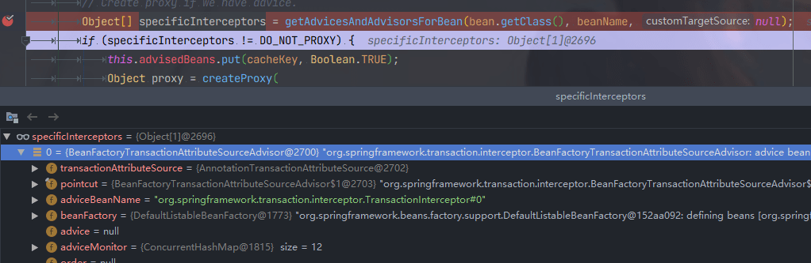

是 `BeanFactoryTransactionAttributeSourceAdvisor` 类，其中的 adviceBenaName 是 TransactionInterceptor。

随后创建完这个 UserService  类的代理类就返回了，但创建的这个类里面已经有了增强器：`BeanFactoryTransactionAttributeSourceAdvisor`  了。

---

### 3 事务增强器

当调用方法的时候，获取的到 bean 是spring使用 JDK代理创建的，所以会调用 JdkDynamicAopProxy 类的 invoke 方法。这里面有些判断会让流程走到下面这个类中。

```java
org.springframework.aop.framework.JdkDynamicAopProxy#invoke
org.springframework.aop.framework.ReflectiveMethodInvocation#proceed
```

在上面的方法里会调用到这个类**TransactionInterceptor**中的 invoke 方法里面来。

**TransactionInterceptor支撑着整个事务功能的架构**，逻辑还是相对复杂的，那么现在我们切入正题来分析此拦截器是如何实现事务特性的。

TransactionInterceptor类继承自MethodInterceptor，所以调用该类是从其invoke方法开始的，首先预览下这个方法：

```java
public Object invoke(MethodInvocation invocation) throws Throwable {
   // Work out the target class: may be {@code null}.
   // The TransactionAttributeSource should be passed the target class
   // as well as the method, which may be from an interface.
   Class<?> targetClass = (invocation.getThis() != null ? AopUtils.getTargetClass(invocation.getThis()) : null);

   // Adapt to TransactionAspectSupport's invokeWithinTransaction...
   return invokeWithinTransaction(invocation.getMethod(), targetClass, invocation::proceed);
}
```

```java
protected Object invokeWithinTransaction(Method method, @Nullable Class<?> targetClass,
      final InvocationCallback invocation) throws Throwable {

   // If the transaction attribute is null, the method is non-transactional. 获取对应事务属性
   TransactionAttributeSource tas = getTransactionAttributeSource();
   final TransactionAttribute txAttr = (tas != null ? tas.getTransactionAttribute(method, targetClass) : null);
    // 获取 beanFactory 中的 transactionManager 
   final TransactionManager tm = determineTransactionManager(txAttr);

   if (this.reactiveAdapterRegistry != null && tm instanceof ReactiveTransactionManager) {
      ReactiveTransactionSupport txSupport = this.transactionSupportCache.computeIfAbsent(method, key -> {
         if (KotlinDetector.isKotlinType(method.getDeclaringClass()) && KotlinDelegate.isSuspend(method)) {
            throw new TransactionUsageException(
                  "Unsupported annotated transaction on suspending function detected: " + method +
                  ". Use TransactionalOperator.transactional extensions instead.");
         }
         ReactiveAdapter adapter = this.reactiveAdapterRegistry.getAdapter(method.getReturnType());
         if (adapter == null) {
            throw new IllegalStateException("Cannot apply reactive transaction to non-reactive return type: " +
                  method.getReturnType());
         }
         return new ReactiveTransactionSupport(adapter);
      });
      return txSupport.invokeWithinTransaction(
            method, targetClass, invocation, txAttr, (ReactiveTransactionManager) tm);
   }

   PlatformTransactionManager ptm = asPlatformTransactionManager(tm);
    // 构造方法唯一标识(service.UserServiceImpl.save)
   final String joinpointIdentification = methodIdentification(method, targetClass, txAttr);

    // 编程式事务处理
   if (txAttr == null || !(ptm instanceof CallbackPreferringPlatformTransactionManager)) {
      // Standard transaction demarcation with getTransaction and commit/rollback calls. 创建 TransactionInfo
      TransactionInfo txInfo = createTransactionIfNecessary(ptm, txAttr, joinpointIdentification);

      Object retVal;
      try {
         // This is an around advice: Invoke the next interceptor in the chain.
         // This will normally result in a target object being invoked.
         retVal = invocation.proceedWithInvocation();
      }
      catch (Throwable ex) {
         // target invocation exception
         completeTransactionAfterThrowing(txInfo, ex);
         throw ex;
      }
      finally {
         cleanupTransactionInfo(txInfo);
      }

      if (vavrPresent && VavrDelegate.isVavrTry(retVal)) {
         // Set rollback-only in case of Vavr failure matching our rollback rules...
         TransactionStatus status = txInfo.getTransactionStatus();
         if (status != null && txAttr != null) {
            retVal = VavrDelegate.evaluateTryFailure(retVal, txAttr, status);
         }
      }

      commitTransactionAfterReturning(txInfo);
      return retVal;
   }

   else { // 声明式事务处理
      final ThrowableHolder throwableHolder = new ThrowableHolder();

      // It's a CallbackPreferringPlatformTransactionManager: pass a TransactionCallback in.
      try {
         Object result = ((CallbackPreferringPlatformTransactionManager) ptm).execute(txAttr, status -> {
            TransactionInfo txInfo = prepareTransactionInfo(ptm, txAttr, joinpointIdentification, status);
            try {
               Object retVal = invocation.proceedWithInvocation();
               if (vavrPresent && VavrDelegate.isVavrTry(retVal)) {
                  // Set rollback-only in case of Vavr failure matching our rollback rules...
                  retVal = VavrDelegate.evaluateTryFailure(retVal, txAttr, status);
               }
               return retVal;
            }
            catch (Throwable ex) {
               if (txAttr.rollbackOn(ex)) {
                  // A RuntimeException: will lead to a rollback.
                  if (ex instanceof RuntimeException) {
                     throw (RuntimeException) ex;
                  }
                  else {
                     throw new ThrowableHolderException(ex);
                  }
               }
               else {
                  // A normal return value: will lead to a commit.
                  throwableHolder.throwable = ex;
                  return null;
               }
            }
            finally {
               cleanupTransactionInfo(txInfo);
            }
         });

         // Check result state: It might indicate a Throwable to rethrow.
         if (throwableHolder.throwable != null) {
            throw throwableHolder.throwable;
         }
         return result;
      }
      catch (ThrowableHolderException ex) {
         throw ex.getCause();
      }
      catch (TransactionSystemException ex2) {
         if (throwableHolder.throwable != null) {
            logger.error("Application exception overridden by commit exception", throwableHolder.throwable);
            ex2.initApplicationException(throwableHolder.throwable);
         }
         throw ex2;
      }
      catch (Throwable ex2) {
         if (throwableHolder.throwable != null) {
            logger.error("Application exception overridden by commit exception", throwableHolder.throwable);
         }
         throw ex2;
      }
   }
}
```

从上面的函数中，我们尝试整理下事务处理的脉络，在Spring中支持两种事务处理的方式，分别是**声明式事务处理与编程式事务处理**，两者相对于开发人员来讲差别很大，但是对于Spring中的实现来讲，大同小异。

##### 两种事务类型

上面的事务使用的声明式的。[Spring笔记(4) - Spring的编程式事务和声明式事务详解](https://www.cnblogs.com/huangrenhui/p/13261655.html) 

> 事务类型
>
> 1. 数据库分为**本地事务和全局事务**
>    1. 本地事务：普通事务，独立一个数据库，能保证在该数据库上操作的ACID；
>    2. 分布式事务：涉及两个或多个数据库源的事务，即跨越多台同类或异类数据库的事务（由每台数据库的本地事务组成），分布式事务旨在保证这些本地事务的所有操作的ACID，使事务可以跨越多台数据库；
> 2. Java事务类型分为JDBC事务和JTA事务
>    1. JDBC事务：即为上面说的数据库事务中的本地事务，通过connection对象控制管理；
>    2. JTA事务：指Java事务API（Java Transaction API），是Java EE数据库事务规范，JTA只提供了事务管理接口，由应用程序服务器厂商（如WebSphere Application Server）提供实现，JTA事务比JDBC更强大，支持分布式事务；
> 3. 按是否通过编程分为声明式事务和编程式事务
>    1. 编程式事务：通过编程代码在业务逻辑时需要时自行实现，粒度更小；
>    2. 声明式事务：通过注解或XML配置实现；
>
> 管理事务两种方式
>
> - **编程式事务**：
>
>   - 是侵入性事务管理，直接使用底层的PlatformTransactionManager、使用TransactionTemplate(Spring推荐使用)；
>
>     编程式事务管理对基于 POJO 的应用来说是唯一选择。我们需要在代码中调用beginTransaction()、commit()、rollback()等事务管理相关的方法；
>
> - **声明式事务**：该事务是建立在AOP之上的，其本质是对方法前后进行拦截，然后在目标方法开始之前创建或加入一个事务，在执行完目标方法之后根据执行情况提交或回滚事务。
>
>   Spring配置文件中关于事务配置总是由三个组成部分，分别是DataSource、TransactionManager和代理机制这三部分，无论哪种配置方式，一般变化的只是代理机制这部分。
>
>   DataSource、TransactionManager这两部分只是会根据数据访问方式有所变化，比如使用Hibernate进行数据访问时，DataSource实际为SessionFactory，TransactionManager的实现为HibernateTransactionManager。

在invoke中我们也可以看到这两种方式的实现。考虑到对事务的应用比声明式的事务处理使用起来方便，也相对流行些，我们就以此种方式进行分析。对于声明式的事务处理主要有以下几个步骤。

（1）获取事务的属性。

（2）加载配置中配置的TransactionManager。

（3）不同的事务处理方式使用不同的逻辑。

对于声明式事务的处理与编程式事务的处理，

第一点区别在于事务属性上，因为编程式的事务处理是不需要有事务属性的，

第二点区别就是在TransactionManager上，CallbackPreferringPlatformTransactionManager实现PlatformTransactionManager接口，暴露出一个方法用于执行事务处理中的回调。

所以，这两种方式都可以用作事务处理方式的判断。

（4）在目标方法执行前获取事务并收集事务信息。

> 事务信息与事务属性并不相同，也就是TransactionInfo与TransactionAttribute并不相同，TransactionInfo中包含TransactionAttribute信息，但是，除了TransactionAttribute外还有其他事务信息，例如PlatformTransactionManager以及TransactionStatus相关信息。

（5）执行目标方法。

（6）一旦出现异常，尝试异常处理。

并不是所有异常，Spring都会将其回滚，默认只对RuntimeException回滚。

（7）提交事务前的事务信息清除。

（8）提交事务。

#### 3.1 创建事务 

```java
protected TransactionInfo createTransactionIfNecessary(@Nullable PlatformTransactionManager tm,
      @Nullable TransactionAttribute txAttr, final String joinpointIdentification) {

   // If no name specified, apply method identification as transaction name. 如果没有名称指定则使用方法唯一标识，并使用 DelegatingTransactionAttribute 封装txAttr
   if (txAttr != null && txAttr.getName() == null) {
      txAttr = new DelegatingTransactionAttribute(txAttr) {
         @Override
         public String getName() {
            return joinpointIdentification;
         }
      };
   }

   TransactionStatus status = null;
   if (txAttr != null) {
      if (tm != null) { // 获取 TransactionStatus
         status = tm.getTransaction(txAttr);
      }
      else {
         if (logger.isDebugEnabled()) {
            logger.debug("Skipping transactional joinpoint [" + joinpointIdentification +
                  "] because no transaction manager has been configured");
         }
      }
   }
    // 根据指定的属性与 status 准备一个 TransactionInfo
   return prepareTransactionInfo(tm, txAttr, joinpointIdentification, status);
}
```

（1）使用DelegatingTransactionAttribute封装传入的TransactionAttribute实例。

对于传入的TransactionAttribute类型的参数txAttr，当前的实际类型是RuleBasedTransactionAttribute，是由获取事务属性时生成，主要用于数据承载，而这里之所以使用DelegatingTransactionAttribute进行封装，当然是提供了更多的功能。

**（2）获取事务。**

（3）构建事务信息。

##### 1 获取事务 

Spring中使用getTransaction来处理事务的准备工作，包括事务获取以及信息的构建。

> org.springframework.transaction.support.AbstractPlatformTransactionManager#getTransaction

```java
public final TransactionStatus getTransaction(@Nullable TransactionDefinition definition)
      throws TransactionException {

   // Use defaults if no transaction definition given.
   TransactionDefinition def = (definition != null ? definition : TransactionDefinition.withDefaults());

   Object transaction = doGetTransaction();
   boolean debugEnabled = logger.isDebugEnabled();

   //（1） 判断当前线程是否存在事务，判断依据为当前线程记录的连接不为空且连接中（ConnectionHolder）的 TransactionActive 属性不为空
   if (isExistingTransaction(transaction)) {
      // Existing transaction found -> check propagation behavior to find out how to behave. 当前线程已经存在事务
      return handleExistingTransaction(def, transaction, debugEnabled);
   }

   // Check definition settings for new transaction. 事务超时验证
   if (def.getTimeout() < TransactionDefinition.TIMEOUT_DEFAULT) {
      throw new InvalidTimeoutException("Invalid transaction timeout", def.getTimeout());
   }

   // No existing transaction found -> check propagation behavior to find out how to proceed. 如果当前线程不存在事务，但是 PROPAGATION_MANDATORY 抛出异常
   if (def.getPropagationBehavior() == TransactionDefinition.PROPAGATION_MANDATORY) {
      throw new IllegalTransactionStateException(
            "No existing transaction found for transaction marked with propagation 'mandatory'");
   }
   else if (def.getPropagationBehavior() == TransactionDefinition.PROPAGATION_REQUIRED ||
         def.getPropagationBehavior() == TransactionDefinition.PROPAGATION_REQUIRES_NEW ||
         def.getPropagationBehavior() == TransactionDefinition.PROPAGATION_NESTED) {
       // PROPAGATION_REQUIRED PROPAGATION_REQUIRES_NEW PROPAGATION_NESTED 都需要新建事务
       // 空挂起
      SuspendedResourcesHolder suspendedResources = suspend(null);
      if (debugEnabled) {
         logger.debug("Creating new transaction with name [" + def.getName() + "]: " + def);
      }
      try {
          // 开始一个新事务
         return startTransaction(def, transaction, debugEnabled, suspendedResources);
      }
      catch (RuntimeException | Error ex) {
         resume(null, suspendedResources);
         throw ex;
      }
   }
   else {
      // Create "empty" transaction: no actual transaction, but potentially synchronization.
      if (def.getIsolationLevel() != TransactionDefinition.ISOLATION_DEFAULT && logger.isWarnEnabled()) {
         logger.warn("Custom isolation level specified but no actual transaction initiated; " +
               "isolation level will effectively be ignored: " + def);
      }
      boolean newSynchronization = (getTransactionSynchronization() == SYNCHRONIZATION_ALWAYS);
      return prepareTransactionStatus(def, null, true, newSynchronization, debugEnabled, null);
   }
}
```

代码（1）出，此时调用的是：

```java
protected boolean isExistingTransaction(Object transaction) {
   DataSourceTransactionObject txObject = (DataSourceTransactionObject) transaction;
   return (txObject.hasConnectionHolder() && txObject.getConnectionHolder().isTransactionActive());
}
```

这里有不同的数据源：

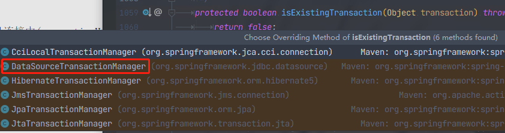

上面 startTransaction 调用的：

```java
/**
 * Start a new transaction.
 */
private TransactionStatus startTransaction(TransactionDefinition definition, Object transaction,
      boolean debugEnabled, @Nullable SuspendedResourcesHolder suspendedResources) {

   boolean newSynchronization = (getTransactionSynchronization() != SYNCHRONIZATION_NEVER);
   DefaultTransactionStatus status = newTransactionStatus(
         definition, transaction, true, newSynchronization, debugEnabled, suspendedResources);
   doBegin(transaction, definition);
   prepareSynchronization(status, definition);
   return status;
}
```

当然，在Spring中每个复杂的功能实现，并不是一次完成的，而是会通过入口函数进行一个框架的搭建，初步构建完整的逻辑，而将实现细节分摊给不同的函数。那么，让我们看看事务的准备工作都包括哪些。

（1）获取事务 

创建对应的事务实例，这里使用的是DataSourceTransactionManager中的doGetTransaction方法，创建基于JDBC的事务实例。如果当前线程中存在关于dataSource的连接，那么直接使用。这里有一个对保存点的设置，是否开启允许保存点取决于是否设置了允许嵌入式事务。

```java
protected Object doGetTransaction() {
   DataSourceTransactionObject txObject = new DataSourceTransactionObject();
   txObject.setSavepointAllowed(isNestedTransactionAllowed());
    // 如果当前线程已经记录数据库连接则使用原连接
   ConnectionHolder conHolder =
         (ConnectionHolder) TransactionSynchronizationManager.getResource(obtainDataSource());
    // false 表示非新创建连接
   txObject.setConnectionHolder(conHolder, false);
   return txObject;
}
```

（2）如果当先线程存在事务，则转向嵌套事务的处理。

（3）事务超时设置验证。

（4）事务propagationBehavior属性的设置验证。

（5）构建DefaultTransactionStatus。

（6）完善transaction，包括设置ConnectionHolder、隔离级别、timeout，如果是新连接，则绑定到当前线程。

对于一些隔离级别、timeout等功能的设置并不是由Spring来完成的，而是委托给底层的数据库连接去做的，而**对于数据库连接的设置就是在doBegin函数中处理的**。

```java
protected void doBegin(Object transaction, TransactionDefinition definition) {
   DataSourceTransactionObject txObject = (DataSourceTransactionObject) transaction;
   Connection con = null;

   try {
      if (!txObject.hasConnectionHolder() ||
            txObject.getConnectionHolder().isSynchronizedWithTransaction()) {
         Connection newCon = obtainDataSource().getConnection();
         if (logger.isDebugEnabled()) {
            logger.debug("Acquired Connection [" + newCon + "] for JDBC transaction");
         }
         txObject.setConnectionHolder(new ConnectionHolder(newCon), true);
      }

      txObject.getConnectionHolder().setSynchronizedWithTransaction(true);
      con = txObject.getConnectionHolder().getConnection(); // 连接

       // 设置隔离级别
      Integer previousIsolationLevel = DataSourceUtils.prepareConnectionForTransaction(con, definition);
      txObject.setPreviousIsolationLevel(previousIsolationLevel);
      txObject.setReadOnly(definition.isReadOnly());

      // Switch to manual commit if necessary. This is very expensive in some JDBC drivers,
      // so we don't want to do it unnecessarily (for example if we've explicitly
      // configured the connection pool to set it already). 由spring控制提交
      if (con.getAutoCommit()) {
         txObject.setMustRestoreAutoCommit(true);
         if (logger.isDebugEnabled()) {
            logger.debug("Switching JDBC Connection [" + con + "] to manual commit");
         }
         con.setAutoCommit(false);
      }
// 在事务开始后立即准备事务Connection 
      prepareTransactionalConnection(con, definition);
       // 设置判断当前线程是否存在事务的依据
      txObject.getConnectionHolder().setTransactionActive(true);

      int timeout = determineTimeout(definition);
      if (timeout != TransactionDefinition.TIMEOUT_DEFAULT) {
         txObject.getConnectionHolder().setTimeoutInSeconds(timeout);
      }

      // Bind the connection holder to the thread. 将当前获取到的连接绑定到当前线程
      if (txObject.isNewConnectionHolder()) {
         TransactionSynchronizationManager.bindResource(obtainDataSource(), txObject.getConnectionHolder());
      }
   }

   catch (Throwable ex) {
      if (txObject.isNewConnectionHolder()) {
         DataSourceUtils.releaseConnection(con, obtainDataSource());
         txObject.setConnectionHolder(null, false);
      }
      throw new CannotCreateTransactionException("Could not open JDBC Connection for transaction", ex);
   }
}
```

1. 尝试获取连接。

当然并不是每次都会获取新的连接，如果当前线程中的connectionHolder已经存在，则没有必要再次获取，或者，对于事务同步表示设置为true的需要重新获取连接。

2. 设置**隔离级别**以及**只读标识**。

你是否有过这样的错觉？事务中的只读配置是Spring中做了一些处理呢？Spring中确实是针对只读操作做了一些处理，但是**核心的实现是设置connection上的readOnly属性**。同样，**对于隔离级别的控制也是交由connection去控制的**。

```java
public static Integer prepareConnectionForTransaction(Connection con, @Nullable TransactionDefinition definition)
      throws SQLException {

   Assert.notNull(con, "No Connection specified");

   // Set read-only flag.
   if (definition != null && definition.isReadOnly()) {
      try {
         if (logger.isDebugEnabled()) {
            logger.debug("Setting JDBC Connection [" + con + "] read-only");
         }
         con.setReadOnly(true);
      }
      catch (SQLException | RuntimeException ex) {
         Throwable exToCheck = ex;
         while (exToCheck != null) {
            if (exToCheck.getClass().getSimpleName().contains("Timeout")) {
               // Assume it's a connection timeout that would otherwise get lost: e.g. from JDBC 4.0
               throw ex;
            }
            exToCheck = exToCheck.getCause();
         }
         // "read-only not supported" SQLException -> ignore, it's just a hint anyway
         logger.debug("Could not set JDBC Connection read-only", ex);
      }
   }

   // Apply specific isolation level, if any.
   Integer previousIsolationLevel = null;
   if (definition != null && definition.getIsolationLevel() != TransactionDefinition.ISOLATION_DEFAULT) {
      if (logger.isDebugEnabled()) {
         logger.debug("Changing isolation level of JDBC Connection [" + con + "] to " +
               definition.getIsolationLevel());
      }
      int currentIsolation = con.getTransactionIsolation();
      if (currentIsolation != definition.getIsolationLevel()) {
         previousIsolationLevel = currentIsolation;
         con.setTransactionIsolation(definition.getIsolationLevel());
      }
   }

   return previousIsolationLevel;
}
```

3. 更改默认的提交设置。

如果事务属性是自动提交，那么需要改变这种设置，而将提交操作委托给Spring来处理。

4. 设置标志位，标识当前连接已经被事务激活。

5. 设置过期时间。

6. 将connectionHolder绑定到当前线程。

7. 将事务信息记录在当前线程中。prepareSynchronization(status, definition);

   org.springframework.transaction.support.AbstractPlatformTransactionManager#startTransaction
   
   ```java
   /**
    * Initialize transaction synchronization as appropriate.
    */
   protected void prepareSynchronization(DefaultTransactionStatus status, TransactionDefinition definition) {
      if (status.isNewSynchronization()) {
         TransactionSynchronizationManager.setActualTransactionActive(status.hasTransaction());
         TransactionSynchronizationManager.setCurrentTransactionIsolationLevel(
               definition.getIsolationLevel() != TransactionDefinition.ISOLATION_DEFAULT ?
                     definition.getIsolationLevel() : null);
         TransactionSynchronizationManager.setCurrentTransactionReadOnly(definition.isReadOnly());
         TransactionSynchronizationManager.setCurrentTransactionName(definition.getName());
         TransactionSynchronizationManager.initSynchronization();
      }
   }
   ```

##### 2 处理已经存在的事务

之前讲述了普通事务建立的过程，但是Spring中支持多种事务的传播规则，比如**PROPAGATION_NESTED**、**PROPAGATION_REQUIRES_NEW**等，这些都是在已经存在事务的基础上进行进一步的处理，那么，对于已经存在的事务，准备操作是如何进行的呢？

返回到之前的代码 getTransaction 中，查看 handleExistingTransaction，源码中的体现，事务传播机制

```java
/**
 * Create a TransactionStatus for an existing transaction.
 */
private TransactionStatus handleExistingTransaction(
			TransactionDefinition definition, Object transaction, boolean debugEnabled)
			throws TransactionException {
// PROPAGATION_NEVER 不支持当前线程事务，如果当前线程事务存在，直接抛出异常
		if (definition.getPropagationBehavior() == TransactionDefinition.PROPAGATION_NEVER) {
			throw new IllegalTransactionStateException(
					"Existing transaction found for transaction marked with propagation 'never'");
		}
// PROPAGATION_NOT_SUPPORTED 不支持当前线程事务，挂起当前线程事务，以非事务方式运行
		if (definition.getPropagationBehavior() == TransactionDefinition.PROPAGATION_NOT_SUPPORTED) {
			if (debugEnabled) {
				logger.debug("Suspending current transaction");
			}
			Object suspendedResources = suspend(transaction);
			boolean newSynchronization = (getTransactionSynchronization() == SYNCHRONIZATION_ALWAYS);
			return prepareTransactionStatus(
					definition, null, false, newSynchronization, debugEnabled, suspendedResources);
		}
// PROPAGATION_REQUIRES_NEW 如果当前线程事务存在，挂起当前线程事务，开启一个新事务运行
		if (definition.getPropagationBehavior() == TransactionDefinition.PROPAGATION_REQUIRES_NEW) {
			if (debugEnabled) {
				logger.debug("Suspending current transaction, creating new transaction with name [" +
						definition.getName() + "]");
			}
			SuspendedResourcesHolder suspendedResources = suspend(transaction);
			try {
                // 新开启一个事务，加入当前事务，先执行这个事务
				return startTransaction(definition, transaction, debugEnabled, suspendedResources);
			}
			catch (RuntimeException | Error beginEx) {
				resumeAfterBeginException(transaction, suspendedResources, beginEx);
				throw beginEx;
			}
		}

   // PROPAGATION_NESTED 传播类型，嵌入式的事务处理
    // 以嵌套方式运行，如果当前事务存在，行为和PROPAGATION_REQUIRED一样，否则没有事务
		if (definition.getPropagationBehavior() == TransactionDefinition.PROPAGATION_NESTED) {
			if (!isNestedTransactionAllowed()) {
				throw new NestedTransactionNotSupportedException(
						"Transaction manager does not allow nested transactions by default - " +
						"specify 'nestedTransactionAllowed' property with value 'true'");
			}
			if (debugEnabled) {
				logger.debug("Creating nested transaction with name [" + definition.getName() + "]");
			}
			if (useSavepointForNestedTransaction()) {
				// Create savepoint within existing Spring-managed transaction,
				// through the SavepointManager API implemented by TransactionStatus.
				// Usually uses JDBC 3.0 savepoints. Never activates Spring synchronization. 如果没有可以使用保存点的方式控制事务回滚，那么在嵌入式事务的建立初始建立保存点
				DefaultTransactionStatus status =
						prepareTransactionStatus(definition, transaction, false, false, debugEnabled, null);
				status.createAndHoldSavepoint();
				return status;
			}
			else {
				// Nested transaction through nested begin and commit/rollback calls.
				// Usually only for JTA: Spring synchronization might get activated here
				// in case of a pre-existing JTA transaction. 有些情况不能使用保存点
				return startTransaction(definition, transaction, debugEnabled, null);
			}
		}

		// Assumably PROPAGATION_SUPPORTS or PROPAGATION_REQUIRED. 大概这两种
       // PROPAGATION_SUPPORTS 支持当前线程事务，如果当前线程事务存在，如果不存在以非事务方式运行
   // PROPAGATION_REQUIRED 支持当前线程事务，如果当前线程不存在，创建一个新事物，存在则不创建。
		if (debugEnabled) {
            // r日志：参与现有事务
			logger.debug("Participating in existing transaction");
		}
		if (isValidateExistingTransaction()) {
			if (definition.getIsolationLevel() != TransactionDefinition.ISOLATION_DEFAULT) {
				Integer currentIsolationLevel = TransactionSynchronizationManager.getCurrentTransactionIsolationLevel();
				if (currentIsolationLevel == null || currentIsolationLevel != definition.getIsolationLevel()) {
					Constants isoConstants = DefaultTransactionDefinition.constants;
					throw new IllegalTransactionStateException("Participating transaction with definition [" +
							definition + "] specifies isolation level which is incompatible with existing transaction: " +
							(currentIsolationLevel != null ?
									isoConstants.toCode(currentIsolationLevel, DefaultTransactionDefinition.PREFIX_ISOLATION) :
									"(unknown)"));
				}
			}
			if (!definition.isReadOnly()) {
				if (TransactionSynchronizationManager.isCurrentTransactionReadOnly()) {
					throw new IllegalTransactionStateException("Participating transaction with definition [" +
							definition + "] is not marked as read-only but existing transaction is");
				}
			}
		}
		boolean newSynchronization = (getTransactionSynchronization() != SYNCHRONIZATION_NEVER);
		return prepareTransactionStatus(definition, transaction, false, newSynchronization, debugEnabled, null);
	}
```

##### 事务传播机制

上面的参考连接博客里面的：[Spring笔记(4) - Spring的编程式事务和声明式事务详解](https://www.cnblogs.com/huangrenhui/p/13261655.html) 

1. TransactionDefinition.**PROPAGATION_REQUIRED**：默认值，能满足绝大部分业务需求，如果外层有事务，则当前事务加入到外层事务，一块提交，一块回滚。如果外层没有事务，新建一个事务执行；

2. TransactionDefinition.**PROPAGATION_REQUIRES_NEW**：该事务传播机制是每次都会新开启一个事务，同时把外层事务挂起，当当前事务执行完毕，恢复上层事务的执行。如果外层没有事务，执行当前新开启的事务即可； 

3. TransactionDefinition.**PROPAGATION_SUPPORTS**：如果外层有事务，则加入外层事务；如果外层没有事务，则直接以非事务的方式继续运行。完全依赖外层的事务；

4. TransactionDefinition.**PROPAGATION_NOT_SUPPORTED**：该传播机制不支持事务，如果外层存在事务则挂起，执行完当前代码，则恢复外层事务，无论是否异常都不会回滚当前的代码；

5. TransactionDefinition.**PROPAGATION_NEVER**：该传播机制不支持外层事务，即如果外层有事务就抛出异常；

6. TransactionDefinition.**PROPAGATION_MANDATORY**：与NEVER相反，如果外层有事务，则加入外层事务，如果外层没有事务，则抛出异常；

7. TransactionDefinition.**PROPAGATION_NESTED**：该传播机制的特点是可以保存状态保存点，当前事务回滚到某一个点，从而避免所有的嵌套事务都回滚，即各自回滚各自的，如果子事务没有把异常吃掉，基本还是会引起全部回滚的；

   > - Spring中允许嵌入事务的时候，则首选设置保存点的方式作为异常处理的回滚。
   >
   > - 对于其他方式，比如JTA无法使用保存点的方式，那么处理方式与PROPAGATION_REQUIRES_NEW相同，而一旦出现异常，则由Spring的事务异常处理机制去完成后续操作。

##### 3 准备事务信息

当已经建立事务连接并完成了事务信息的提取后，我们需要将所有的事务信息统一记录在TransactionInfo类型的实例中，这个实例包含了目标方法开始前的所有状态信息，一旦事务执行失败，Spring会通过TransactionInfo类型的实例中的信息来进行回滚等后续工作。

这里会到了一开始的地方：createTransactionIfNecessary

```java
protected TransactionInfo prepareTransactionInfo(@Nullable PlatformTransactionManager tm,
      @Nullable TransactionAttribute txAttr, String joinpointIdentification,
      @Nullable TransactionStatus status) {

   TransactionInfo txInfo = new TransactionInfo(tm, txAttr, joinpointIdentification);
   if (txAttr != null) {
      // We need a transaction for this method...
      if (logger.isTraceEnabled()) {
         logger.trace("Getting transaction for [" + txInfo.getJoinpointIdentification() + "]");
      }
      // The transaction manager will flag an error if an incompatible tx already exists. 记录事务状态
      txInfo.newTransactionStatus(status);
   }
   else {
      // The TransactionInfo.hasTransaction() method will return false. We created it only
      // to preserve the integrity of the ThreadLocal stack maintained in this class.
      if (logger.isTraceEnabled()) {
         logger.trace("No need to create transaction for [" + joinpointIdentification +
               "]: This method is not transactional.");
      }
   }

   // We always bind the TransactionInfo to the thread, even if we didn't create
   // a new transaction here. This guarantees that the TransactionInfo stack
   // will be managed correctly even if no transaction was created by this aspect.
   txInfo.bindToThread();
   return txInfo;
}
```

#### 3.2 回滚处理

这里还是要往前走到调用上面步骤的前面：

```java
// target invocation exception
completeTransactionAfterThrowing(txInfo, ex);
```

当出现错误的时候，Spring是怎么对数据进行恢复的呢？

```java
/**
 * Handle a throwable, completing the transaction.
 * We may commit or roll back, depending on the configuration.
 * @param txInfo information about the current transaction
 * @param ex throwable encountered
 */
protected void completeTransactionAfterThrowing(@Nullable TransactionInfo txInfo, Throwable ex) {
    // 当抛出异常时首先判断当前是否存在事务。这是基础依据
   if (txInfo != null && txInfo.getTransactionStatus() != null) {
      if (logger.isTraceEnabled()) {
         logger.trace("Completing transaction for [" + txInfo.getJoinpointIdentification() +
               "] after exception: " + ex);
      }
       // 异常是否时 RuntimeException 或 Error 的类型
      if (txInfo.transactionAttribute != null && txInfo.transactionAttribute.rollbackOn(ex)) {
         try {
          // 根据 TransactionStatus 信息进行回滚处理
         txInfo.getTransactionManager().rollback(txInfo.getTransactionStatus());
         }
         catch (TransactionSystemException ex2) {
            logger.error("Application exception overridden by rollback exception", ex);
            ex2.initApplicationException(ex);
            throw ex2;
         }
         catch (RuntimeException | Error ex2) {
            logger.error("Application exception overridden by rollback exception", ex);
            throw ex2;
         }
      }
      else {
         // We don't roll back on this exception. 否则还是会提交
         // Will still roll back if TransactionStatus.isRollbackOnly() is true.
         try {
            txInfo.getTransactionManager().commit(txInfo.getTransactionStatus());
         }
         catch (TransactionSystemException ex2) {
            logger.error("Application exception overridden by commit exception", ex);
            ex2.initApplicationException(ex);
            throw ex2;
         }
         catch (RuntimeException | Error ex2) {
            logger.error("Application exception overridden by commit exception", ex);
            throw ex2;
         }
      }
   }
}
```

在对目标方法的执行过程中，一旦出现Throwable就会被引导至此方法处理，但是并不代表所有的Throwable都会被回滚处理，比如我们最常用的Exception，默认是不会被处理的。默认情况下，即使出现异常，数据也会被正常提交，而这个关键的地方就是在txInfo.transactionAttribute.rollbackOn(ex)这个函数。

##### 1 回滚条件 

`org.springframework.transaction.interceptor.DefaultTransactionAttribute#rollbackOn`

```java
public boolean rollbackOn(Throwable ex) {
   return (ex instanceof RuntimeException || ex instanceof Error);
}
```

可以使用事务提供的属性设置，利用注解方式的使用，例如：

> @Transactional(propagation=Propagation.REQUIRED,rollbackFor=Exception.class)

##### 2 回滚处理 

当然，一旦符合回滚条件，那么Spring就会将程序引导至回滚处理函数中。

```java
public final void rollback(TransactionStatus status) throws TransactionException { // 如果事务已经完成，那么再次回滚会抛出异常
   if (status.isCompleted()) {
      throw new IllegalTransactionStateException(
            "Transaction is already completed - do not call commit or rollback more than once per transaction");
   }

   DefaultTransactionStatus defStatus = (DefaultTransactionStatus) status;
   processRollback(defStatus, false);
}
```

processRollback 的具体实现，（目前不懂啊啊啊啊）

```java
private void processRollback(DefaultTransactionStatus status, boolean unexpected) {
   try {
      boolean unexpectedRollback = unexpected;

      try {
          // 激活所有 TransactionSynchronization 中对应的方法
         triggerBeforeCompletion(status);

         if (status.hasSavepoint()) {
            if (status.isDebug()) {
               logger.debug("Rolling back transaction to savepoint");
            }
             // 如果有保存点，也就是当前事务为单独的线程则回退到保存点
            status.rollbackToHeldSavepoint();
         }
         else if (status.isNewTransaction()) {
            if (status.isDebug()) {
               logger.debug("Initiating transaction rollback");
            }
             // 如果当前事务为独立的新事物，则直接回退
            doRollback(status);
         }
         else {
            // Participating in larger transaction
            if (status.hasTransaction()) {
               if (status.isLocalRollbackOnly() || isGlobalRollbackOnParticipationFailure()) {
                  if (status.isDebug()) {
                     logger.debug("Participating transaction failed - marking existing transaction as rollback-only");
                  }
                   // 如果当前事务不是独立的事务，那么只能标记状态，等待事务链执行完毕后统一回滚
                  doSetRollbackOnly(status);
               }
               else {
                  if (status.isDebug()) {
                     logger.debug("Participating transaction failed - letting transaction originator decide on rollback");
                  }
               }
            }
            else {
               logger.debug("Should roll back transaction but cannot - no transaction available");
            }
            // Unexpected rollback only matters here if we're asked to fail early
            if (!isFailEarlyOnGlobalRollbackOnly()) {
               unexpectedRollback = false;
            }
         }
      }
      catch (RuntimeException | Error ex) {
         triggerAfterCompletion(status, TransactionSynchronization.STATUS_UNKNOWN);
         throw ex;
      }
// 激活所有 TransactionSynchronization 中对应的方法
      triggerAfterCompletion(status, TransactionSynchronization.STATUS_ROLLED_BACK);

      // Raise UnexpectedRollbackException if we had a global rollback-only marker
      if (unexpectedRollback) {
         throw new UnexpectedRollbackException(
               "Transaction rolled back because it has been marked as rollback-only");
      }
   }
   finally {
       // 清空记录的资源并将挂起的资源恢复
      cleanupAfterCompletion(status);
   }
}
```

同样，对于在Spring中的复杂的逻辑处理过程，在入口函数一般都会给出个整体的处理脉络，而把实现细节委托给其他函数去执行。我们尝试总结下Spring中对于回滚处理的大致脉络如下。

（1）首先是自定义触发器的调用，包括在回滚前、完成回滚后的调用，当然完成回滚包括正常回滚与回滚过程中出现异常，自定义的触发器会根据这些信息作进一步处理，而对于触发器的注册，常见是在回调过程中通过TransactionSynchronizationManager类中的静态方法直接注册：

```java
public void registerSynchronization(TransactionSynchronization synchronization)
```

（2）除了触发监听函数外，就是真正的回滚逻辑处理了。

- 当之前已经保存的事务信息中有保存点信息的时候，使用保存点信息进行回滚。常用于嵌入式事务，对于嵌入式的事务的处理，内嵌的事务异常并不会引起外部事务的回滚。

  根据保存点回滚的实现方式其实是根据底层的数据库连接进行的。

```java
/**
 * Roll back to the savepoint that is held for the transaction
 * and release the savepoint right afterwards.
 */
public void rollbackToHeldSavepoint() throws TransactionException {
   Object savepoint = getSavepoint();
   if (savepoint == null) {
      throw new TransactionUsageException(
            "Cannot roll back to savepoint - no savepoint associated with current transaction");
   }
   getSavepointManager().rollbackToSavepoint(savepoint);
   getSavepointManager().releaseSavepoint(savepoint);
   setSavepoint(null);
}
```

这里使用的是JDBC的方式进行数据库连接，那么getSavepointManager()函数返回的是JdbcTransactionObjectSupport，也就是说上面函数会调用JdbcTransactionObjectSupport中的rollbackToSavepoint方法。

```java
public void rollbackToSavepoint(Object savepoint) throws TransactionException {
   ConnectionHolder conHolder = getConnectionHolderForSavepoint();
   try {
      conHolder.getConnection().rollback((Savepoint) savepoint);
      conHolder.resetRollbackOnly();
   }
   catch (Throwable ex) {
      throw new TransactionSystemException("Could not roll back to JDBC savepoint", ex);
   }
}
```

- 当之前已经保存的事务信息中的事务为新事物，那么直接回滚。常用于单独事务的处理。对于没有保存点的回滚，Spring同样是使用底层数据库连接提供的API来操作的。由于我们使用的是DataSourceTransactionManager，那么doRollback函数会使用此类中的实现

  ```java
  protected void doRollback(DefaultTransactionStatus status) {
     DataSourceTransactionObject txObject = (DataSourceTransactionObject) status.getTransaction();
     Connection con = txObject.getConnectionHolder().getConnection();
     if (status.isDebug()) {
        logger.debug("Rolling back JDBC transaction on Connection [" + con + "]");
     }
     try {
        con.rollback();
     }
     catch (SQLException ex) {
        throw new TransactionSystemException("Could not roll back JDBC transaction", ex);
     }
  }
  ```

- 当前事务信息中表明是存在事务的，又不属于以上两种情况，多数用于JTA，只做回滚标识，等到提交的时候统一不提交。

##### 3 回滚后的信息清除

对于回滚逻辑执行结束后，无论回滚是否成功，都必须要做的事情就是事务结束后的收尾工作。

```java
private void cleanupAfterCompletion(DefaultTransactionStatus status) {
    // 设置完成状态
   status.setCompleted();
   if (status.isNewSynchronization()) {
      TransactionSynchronizationManager.clear();
   }
   if (status.isNewTransaction()) {
      doCleanupAfterCompletion(status.getTransaction());
   }
   if (status.getSuspendedResources() != null) {
      if (status.isDebug()) {
         logger.debug("Resuming suspended transaction after completion of inner transaction");
      }
      Object transaction = (status.hasTransaction() ? status.getTransaction() : null);
      // 结束之前事物的挂起状态
      resume(transaction, (SuspendedResourcesHolder) status.getSuspendedResources());
   }
}
```

从函数中得知，事务处理的收尾处理工作包括如下内容。

（1）设置状态是对事务信息作完成标识以避免重复调用。

（2）如果当前事务是新的同步状态，需要将绑定到当前线程的事务信息清除。

（3）如果是新事物需要做些清除资源的工作。

```java
protected void doCleanupAfterCompletion(Object transaction) {
   DataSourceTransactionObject txObject = (DataSourceTransactionObject) transaction;

   // Remove the connection holder from the thread, if exposed. 将数据库连接从当前线程中解除绑定
   if (txObject.isNewConnectionHolder()) {
      TransactionSynchronizationManager.unbindResource(obtainDataSource());
   }

   // Reset connection. 释放连接
   Connection con = txObject.getConnectionHolder().getConnection();
   try {
      if (txObject.isMustRestoreAutoCommit()) {
         con.setAutoCommit(true);
      }
       // 重置数据库连接
      DataSourceUtils.resetConnectionAfterTransaction(
            con, txObject.getPreviousIsolationLevel(), txObject.isReadOnly());
   }
   catch (Throwable ex) {
      logger.debug("Could not reset JDBC Connection after transaction", ex);
   }

   if (txObject.isNewConnectionHolder()) {
      if (logger.isDebugEnabled()) {
         logger.debug("Releasing JDBC Connection [" + con + "] after transaction");
      }
       // 如果当前事务是独立的新创建的事务则在事务完成时释放数据库连接
      DataSourceUtils.releaseConnection(con, this.dataSource);
   }

   txObject.getConnectionHolder().clear();
}
```

（4）如果在事务执行前有事务挂起，那么当前事务执行结束后需要将挂起事务恢复。

#### 3.3 事务提交

之前我们分析了Spring的事务异常处理机制，那么事务的执行并没有出现任何的异常，也就意味着事务可以走正常事务提交的流程了。

`commitTransactionAfterReturning(txInfo);`

```java
protected void commitTransactionAfterReturning(@Nullable TransactionInfo txInfo) {
   if (txInfo != null && txInfo.getTransactionStatus() != null) {
      if (logger.isTraceEnabled()) {
         logger.trace("Completing transaction for [" + txInfo.getJoinpointIdentification() + "]");
      }
      txInfo.getTransactionManager().commit(txInfo.getTransactionStatus());
   }
}
```

在真正的数据提交之前，还需要做个判断。不知道大家还有没有印象，在我们分析事务异常处理规则的时候，**当某个事务既没有保存点又不是新事物，Spring对它的处理方式只是设置一个回滚标识**。这个回滚标识在这里就会派上用场了，主要的应用场景如下。

某个事务是另一个事务的嵌入事务，但是，这些事务又不在Spring的管理范围内，或者无法设置保存点，那么Spring会通过设置回滚标识的方式来禁止提交。首先当某个嵌入事务发生回滚的时候会设置回滚标识，而等到外部事务提交时，一旦判断出当前事务流被设置了回滚标识，则由外部事务来统一进行整体事务的回滚。

所以，当事务没有被异常捕获的时候也并不意味着一定会执行提交的过程。

```java
public final void commit(TransactionStatus status) throws TransactionException {
   if (status.isCompleted()) {
      throw new IllegalTransactionStateException(
            "Transaction is already completed - do not call commit or rollback more than once per transaction");
   }

   DefaultTransactionStatus defStatus = (DefaultTransactionStatus) status;
    // 如果在事务链中已经被标记回滚，那么不会尝试提交事务，直接回滚
   if (defStatus.isLocalRollbackOnly()) {
      if (defStatus.isDebug()) {
         logger.debug("Transactional code has requested rollback");
      }
      processRollback(defStatus, false);
      return;
   }

   if (!shouldCommitOnGlobalRollbackOnly() && defStatus.isGlobalRollbackOnly()) {
      if (defStatus.isDebug()) {
         logger.debug("Global transaction is marked as rollback-only but transactional code requested commit");
      }
      processRollback(defStatus, true);
      return;
   }
// 处理事务提交
   processCommit(defStatus);
}
```

而当事务执行一切都正常的时候，便可以真正地进入提交流程了。

```java
private void processCommit(DefaultTransactionStatus status) throws TransactionException {
   try {
      boolean beforeCompletionInvoked = false;

      try {
         boolean unexpectedRollback = false;
          // 预留
         prepareForCommit(status);
          // 添加 TransactionSynchronization 中的对应方法的调用
         triggerBeforeCommit(status);
         triggerBeforeCompletion(status);
         beforeCompletionInvoked = true;

         if (status.hasSavepoint()) {
            if (status.isDebug()) {
               logger.debug("Releasing transaction savepoint");
            }
            unexpectedRollback = status.isGlobalRollbackOnly();
             // 如果存在保存点，则清除保存点信息
            status.releaseHeldSavepoint();
         }
         else if (status.isNewTransaction()) {
            if (status.isDebug()) {
               logger.debug("Initiating transaction commit");
            }
            unexpectedRollback = status.isGlobalRollbackOnly();
             // 如果是独立的事务则直接提交
            doCommit(status);
         }
         else if (isFailEarlyOnGlobalRollbackOnly()) {
            unexpectedRollback = status.isGlobalRollbackOnly();
         }

         // Throw UnexpectedRollbackException if we have a global rollback-only
         // marker but still didn't get a corresponding exception from commit.
         if (unexpectedRollback) {
            throw new UnexpectedRollbackException(
                  "Transaction silently rolled back because it has been marked as rollback-only");
         }
      }
      catch (UnexpectedRollbackException ex) {
         // can only be caused by doCommit
         triggerAfterCompletion(status, TransactionSynchronization.STATUS_ROLLED_BACK);
         throw ex;
      }
      catch (TransactionException ex) {
         // can only be caused by doCommit
         if (isRollbackOnCommitFailure()) {
            doRollbackOnCommitException(status, ex);
         }
         else {
            triggerAfterCompletion(status, TransactionSynchronization.STATUS_UNKNOWN);
         }
         throw ex;
      }
      catch (RuntimeException | Error ex) {
         if (!beforeCompletionInvoked) {
            triggerBeforeCompletion(status);
         }
         doRollbackOnCommitException(status, ex);
         throw ex;
      }

      // Trigger afterCommit callbacks, with an exception thrown there
      // propagated to callers but the transaction still considered as committed.
      try {
         triggerAfterCommit(status);
      }
      finally {
         triggerAfterCompletion(status, TransactionSynchronization.STATUS_COMMITTED);
      }

   }
   finally {
      cleanupAfterCompletion(status);
   }
}
```

在提交过程中也并不是直接提交的，而是考虑了诸多的方面，符合提交的条件如下。

-  当事务状态中有保存点信息的话便不会去提交事务。
-  当事务非新事务的时候也不会去执行提交事务操作。

此条件主要考虑内嵌事务的情况，对于内嵌事务，在Spring中正常的处理方式是将内嵌事务开始之前设置保存点，一旦内嵌事务出现异常便根据保存点信息进行回滚，但是如果没有出现异常，内嵌事务并不会单独提交，而是根据事务流由最外层事务负责提交，所以如果当前存在保存点信息便不是最外层事务，不做保存操作，对于是否是新事务的判断也是基于此考虑。

如果程序流通过了事务的层层把关，最后顺利地进入了提交流程，那么同样，Spring会将事务提交的操作引导至底层数据库连接的API，进行事务提交。

```java
org.springframework.jdbc.datasource.DataSourceTransactionManager#doCommit
protected void doCommit(DefaultTransactionStatus status) {
   DataSourceTransactionObject txObject = (DataSourceTransactionObject) status.getTransaction();
   Connection con = txObject.getConnectionHolder().getConnection();
   if (status.isDebug()) {
      logger.debug("Committing JDBC transaction on Connection [" + con + "]");
   }
   try {
      con.commit();
   }
   catch (SQLException ex) {
      throw new TransactionSystemException("Could not commit JDBC transaction", ex);
   }
}
```