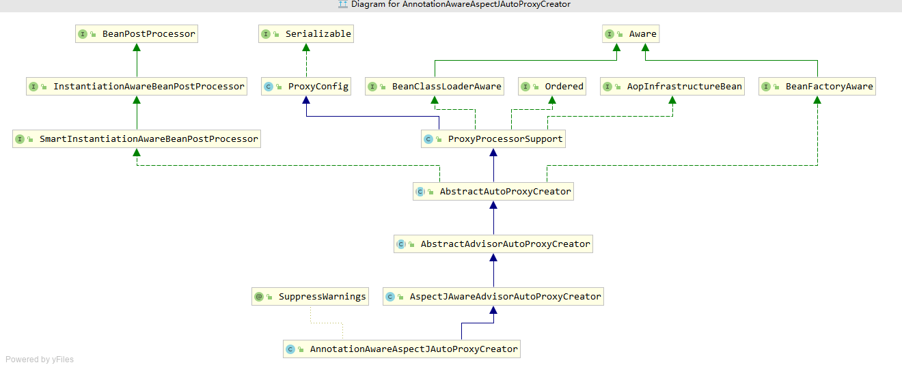
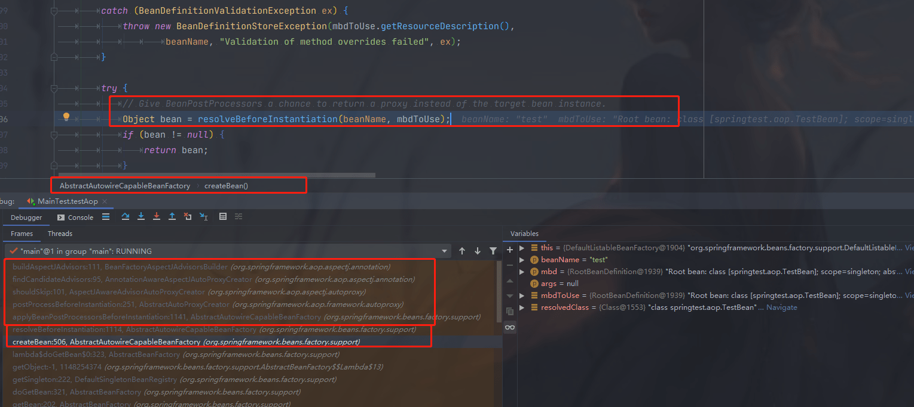
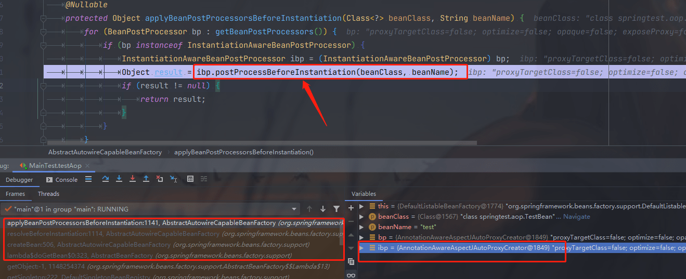
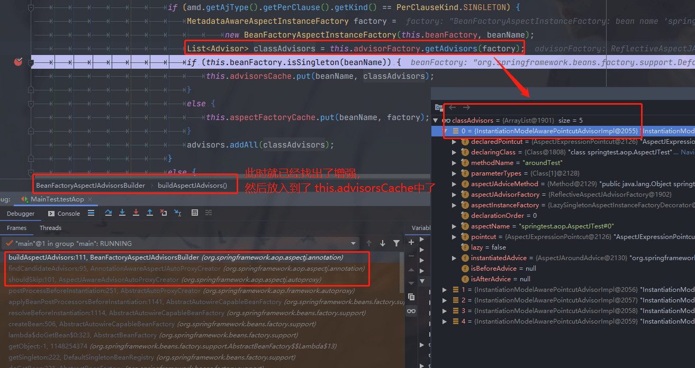
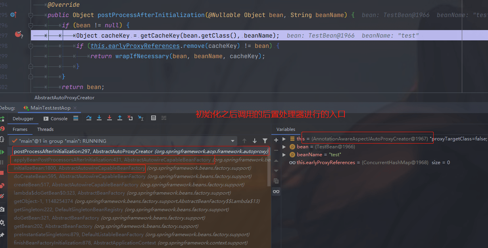
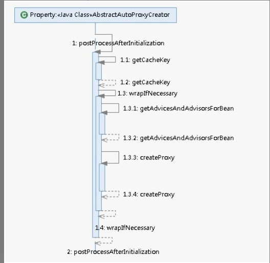
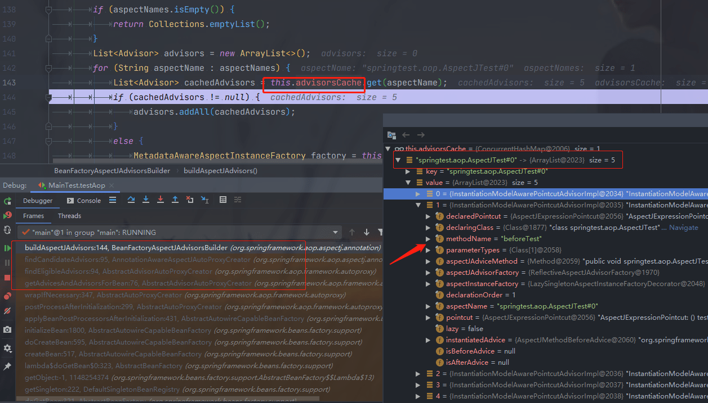
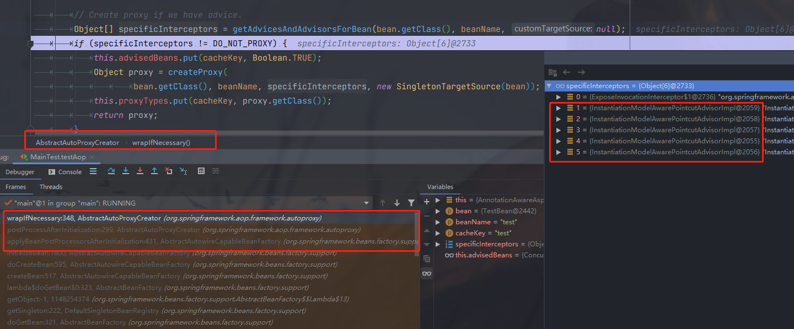
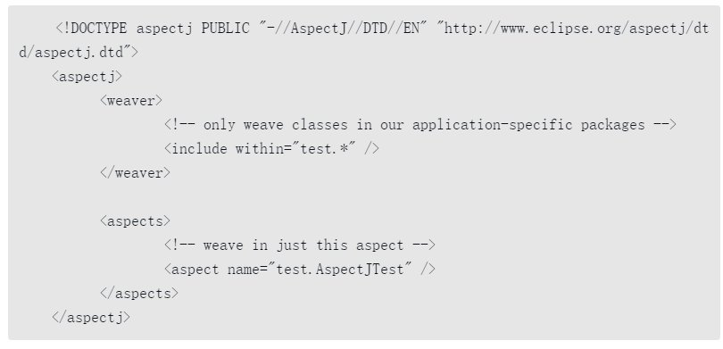

#### 7 AOP  

我们知道，使用**面向对象编程（OOP）**有一些弊端，**当需要为多个不具有继承关系的对象引入同一个公共行为时，例如日志、安全检测等，我们只有在每个对象里引用公共行为，这样程序中就产生了大量的重复代码，程序就不便于维护了**，所以就有了一个对面向对象编程的补充，即**面向方面编程（AOP），AOP所关注的方向是横向的，不同于OOP的纵向**。

Spring中提供了AOP的实现，但是在低版本Spring中定义一个切面是比较麻烦的，需要实现特定的接口，并进行一些较为复杂的配置。低版本Spring AOP的配置是被批评最多的地方。Spring听取了这方面的批评声音，并下决心彻底改变这一现状。在Spring 2.0中，Spring AOP已经焕然一新，你可以使用@AspectJ注解非常容易地定义一个切面，不需要实现任何的接口。

Spring 2.0采用**@AspectJ注解对POJO进行标注**，从而**定义一个包含切点信息**和增强横切逻辑的切面**。**

Spring 2.0可以将这个切面织入到匹配的目标Bean中。**@AspectJ注解使用AspectJ切点表达式语法进行切点定义，可以通过切点函数、运算符、通配符等高级功能进行切点定义**，拥有强大的连接点描述能力。我们先来直观地浏览一下Spring中的AOP实现。

具体一点的也可以参考博客：

[Spring AOP解析(1)--AOP的简介及使用 - Lucky帅小武 - 博客园 (cnblogs.com)](https://www.cnblogs.com/jackion5/p/13358657.html) 

[Spring AOP解析(2)--AOP的实现原理及源码解析 - Lucky帅小武 - 博客园 (cnblogs.com)](https://www.cnblogs.com/jackion5/p/13369376.html) 

> 前言：软件开发的目的是为了解决各种需求，而需求又分成业务需求和系统需求，比如有一个登录功能，那么用户输入密码之后登录就是业务需求，而在用户登录前后分别打印一行日志，这个就是系统需求；又或者用户访问系统的网页获取数据这个是业务需求，而用户每一次访问的时候，都需要进行一次用户权限校验，这个就是系统需求。可以看出业务需求是用户感知的，而系统需求是用户无感知的。业务需求和实现代码的对应关系往往是一一对应的关系，比如登录需求，就需要开发一个登录的接口；注册需求就需要开发一个注册接口。而系统需求往往是一对多的关系，比如打印用户操作日志功能，用户注册时需要打印日志，用户登录时还是需要打印日志。而如果在实现业务代码的时候，将系统需求的代码手动写入进去，那么就会导致系统需求的代码需要在每个业务代码中都需要加入，很显然就会导致很多的问题，比如维护比较困难，一旦需要改系统需求的代码，就需要将所有业务代码中的系统需求代码全部改一遍。如果我们将系统需求的实现代码抽离出来，由系统自动将系统需求的代码插入到业务代码中，很显然就解决了这个问题。而Spring的AOP思想就是这样的设计思想
>
> AOP，全称是Aspect Oriented Programming，也叫做面向方面编程，或者叫面向切面编程。比如日志打印、权限校验等系统需求就像一把刀一样，横切在各个业务功能模块之上，在AOP中这把刀就叫做切面。
>
> ###### 1.1、AOP基本概念
>
> joinPoint（连接点、切入点）：表示可以将横切的逻辑织入的地方，比如方法调用、方法执行、属性设置等
>
> pointCut（切点）：通过表达式定义的一组joinPoint的集合，比如定义一个pointCut为"com.lucky.test包下的所有Service中的add方法"，这样就可以定义哪些具体的joinPoint需要织入横切逻辑
>
> Advice（增强）：横切的具体逻辑，比如日志打印，权限校验等这些系统需求就需要在业务代码上增强功能，这些具体的横切逻辑就叫做Advice
>
> aspect（切面）：切点和增强组合一起就叫做切面，一个切面就定义了在哪些连接点需要织入什么横切逻辑
>
> target（目标）：需要织入切面的具体目标对象，比如在UserService类的addUser方法前面织入打印日志逻辑，那么UserService这个类就是目标对象
>
> weaving（织入）：将横切逻辑添加到目标对象的过程叫做织入
>
> 用这些概念造句总结就是：**在target的joinPoint处weaving一个或多个以Advice和pointCut组成的Aspect**
>
> #### 1.2、增强的类型
>
> 增强根据执行时机和完成功能的不同分成以下几种类型
>
> 1.2.1、前置增强（Before Advice）,在joinPoint代码执行之前执行，比如可以在前置增强中进行权限校验或者参数校验等,不合法的请求就可以直接在前置增强中处理掉了。
>
> 1.2.2、后置增强（After Advice）,后置增强根据时机又分成三种类型
>
> 1.2.2.1、返回增强（After Returning Advice）当joinPoint方法正常执行并返回结果时，返回增强才会执行
>
> 1.2.2.2、异常增强（After throwing Advice）当joinPoint方法抛异常之后，异常增强才会执行
>
> 1.2.2.3、最终增强（After Advice）无论joinPoint如何执行，都会执行最终增强，相当于是在finally中执行的逻辑一样
>
> 1.2.3、环绕增强（Around Advice）在joinPoint方法执行之前和之后都会执行增强逻辑，环绕增强相当于同时实现了前置增强和后置增强的功能
>
> 1.2.4、附加增强（Introuction）在不改变目标类的定义的情况下，为目标类附加了新的属性和行为，这就好比开发人员本来只需要干开发的工作，但是如果测试资源不足需要开发也参与测试工作，那么就需要在保持开发人员定义不变的情况下，附加测试人员的角色给开发人员身上，但是并没有改变此人是一个开发人员的本质。
>
> #### 1.3、织入的分类
>
> 根据织入的时机可以分成三种：
>
> 编译期织入：在编译时期就将Advice织入到目标对象中
>
> 类加载期织入：在目标对象所在类加载的时候织入Advice
>
> 运行时动态织入：在目标对象的方法运行时，动态织入Advice

PointCut 的类型： [@Pointcut切入点表达式](https://cloud.tencent.com/developer/article/1497814)   [spring aop中pointcut表达式完整版](https://www.cnblogs.com/itsoku123/p/10744244.html) 

##### **7.1 动态 AOP 使用示例**  

###### **（1）创建用于拦截的 bean** 

在实际工作中，此bean可能是满足业务需要的核心逻辑，例如**test方法中可能会封装着某个核心业务，但是，如果我们想在test前后加入日志来跟踪调试**，如果直接修改源码并不符合面向对象的设计方法，而且随意改动原有代码也会造成一定的风险，还好接下来的Spring帮我们做到了这一点。 

```java 
package springtest.aop;

/**
* @author Vin lan
* @className TestBean
* @description 创建用于拦截的 bean
* @createTime 2021-08-27  09:55
**/
public class TestBean {
    private String testStr = "testStr";

    public String getTestStr() {
        return testStr;
    }

    public void setTestStr(String testStr) {
        this.testStr = testStr;
    }
    public void test() {
        System.out.println("testgg");
    }
}
```

###### （2）创建 Advisor

Spring中摒弃了最原始的繁杂配置方式而采用 @AspectJ注解对POJO进行标注，使AOP的工作大大简化，例如，在AspectJTest类中，我们要做的就是**在所有类的test方法执行前在控制台中打印beforeTest，而在所有类的test方法执行后打印afterTest，同时又使用环绕的方式在所有类的方法执行前后再次分别打印before1和after1**。（我自己的版本：5.2.4）

```java 
package springtest.aop;

import org.aspectj.lang.ProceedingJoinPoint;
import org.aspectj.lang.annotation.*;

/**
* @author Vin lan
* @className AspectJTest
* @description 创建 advisor
* @createTime 2021-08-27  09:57
*
* execution(* com.sample.service.impl..*.*(..))
* execution（）     表达式的主体；
* 第一个 * 符号     表示返回值的类型任意；
* com.sample.service.impl AOP所切的服务的包名，即，我们的业务部分
* 包名后面的 ..    表示当前包及子包
* 第二个 *           表示类名,*即所有类。 此处可以自定义，
* .*(..)          表示任何方法名，括号表示参数，两个点表示任何参数类型，test后如果有 * 则表示以test开头的方法
**/
@Aspect
public class AspectJTest {
    @Pointcut("execution(* springtest.aop..*.test(..))")
    public void test() {
        System.out.println("AspectJTest test");
    }


    @Before("test()")
    public void beforeTest() {
        System.out.println("beforeTest");
    }


    @After("test()")
    public void afterTest() {
        System.out.println("afterTest");
    }


    @Around("test()")
    public Object aroundTest(ProceedingJoinPoint p) {
        System.out.println("before1");
        Object o = null;
        try {
            o = p.proceed();
        } catch (Throwable e) {
            e.printStackTrace();
        }
        System.out.println("after1");
        return o;
    }

}
```

###### （3）创建配置文件XML是Spring的基础。 

尽管Spring一再简化配置，并且大有使用注解取代XML配置之势，但是无论如何，至少现在XML还是Spring的基础。要在Spring中开启AOP功能，还需要在配置文件中作如下声明：

```xml
<?xml version="1.0" encoding="UTF-8"?>
<beans xmlns="http://www.springframework.org/schema/beans"
       xmlns:xsi="http://www.w3.org/2001/XMLSchema-instance" xmlns:aop="http://www.springframework.org/schema/aop"
       xsi:schemaLocation="http://www.springframework.org/schema/beans http://www.springframework.org/schema/beans/spring-beans.xsd http://www.springframework.org/schema/aop https://www.springframework.org/schema/aop/spring-aop.xsd">


    <aop:aspectj-autoproxy/>
    <bean id="test" class="springtest.aop.TestBean"/>
    <bean class="springtest.aop.AspectJTest"/>
</beans>
```

###### （4）测试 

```java 
// 测试AOP
@Test
public void testAop() {
    ApplicationContext context = new ClassPathXmlApplicationContext("classpath:testAop.xml");
    TestBean testBean = (TestBean) context.getBean("test");
    testBean.test();
}
// 输出：结果版本不同可能不一样
before1
beforeTest
testgg
after1
afterTest
```

Spring实现了对所有类的test方法进行增强，**使辅助功能可以独立于核心业务之外，方便与程序的扩展和解耦**。 

那么，Spring究竟是如何实现AOP的呢？

首先我们知道，Spring是否支持注解的AOP是由一个配置文件控制的，也就是**<aop:aspectj-autoproxy />**，当在配置文件中声明了这句配置的时候，Spring就会支持注解的AOP，那么我们的分析就从这句注解开始。（**自定义的标签类型和 tx（事务）的标签类型一样是自定义标签**） 

##### **7.2 动态AOP自定义标签** 

之前讲过Spring中的自定义注解，如果声明了自定义的注解，那么就一定会在程序中的某个地方注册了对应的解析器。我们搜索整个代码，尝试找到注册的地方，全局搜索后我们发现了在**AopNamespaceHandler**中对应着这样一段函数：（tx 有对应的：**TxNamespaceHandler** ） 

`AopNamespaceHandler.java`

```java 
public class AopNamespaceHandler extends NamespaceHandlerSupport {

   /**
    * Register the {@link BeanDefinitionParser BeanDefinitionParsers} for the
    * '{@code config}', '{@code spring-configured}', '{@code aspectj-autoproxy}'
    * and '{@code scoped-proxy}' tags.
    */
   @Override
   public void init() {
      // In 2.0 XSD as well as in 2.1 XSD.
      registerBeanDefinitionParser("config", new ConfigBeanDefinitionParser());
      registerBeanDefinitionParser("aspectj-autoproxy", new AspectJAutoProxyBeanDefinitionParser());
      registerBeanDefinitionDecorator("scoped-proxy", new ScopedProxyBeanDefinitionDecorator());


      // Only in 2.0 XSD: moved to context namespace as of 2.1
      registerBeanDefinitionParser("spring-configured", new SpringConfiguredBeanDefinitionParser());
   }

}
```

此处不再对Spring中的自定义注解方式进行讨论。有兴趣的读者可以回顾之前的内容。 

我们可以得知，在解析配置文件的时候，一旦遇到 aspectj-autoproxy 注解时就会使用解析器AspectJAutoProxyBeanDefinitionParser进行解析，那么我们来看一看**AspectJAutoProxyBeanDefinitionParser**的内部实现。

```java 
class AspectJAutoProxyBeanDefinitionParser implements BeanDefinitionParser {

   @Override
   @Nullable
   public BeanDefinition parse(Element element, ParserContext parserContext) {
      AopNamespaceUtils.registerAspectJAnnotationAutoProxyCreatorIfNecessary(parserContext, element);
      extendBeanDefinition(element, parserContext);
      return null;
   }
.....  
}
```

其中**registerAspectJAnnotationAutoProxyCreatorIfNecessary**函数是我们比较关心的，也是关键逻辑的实现。 

```java 
public static void registerAspectJAnnotationAutoProxyCreatorIfNecessary(
      ParserContext parserContext, Element sourceElement) {

   BeanDefinition beanDefinition = AopConfigUtils.registerAspectJAnnotationAutoProxyCreatorIfNecessary(
         parserContext.getRegistry(), parserContext.extractSource(sourceElement));
// 对于 proxy-target-class 以及 expose-proxy 属性的处理
   useClassProxyingIfNecessary(parserContext.getRegistry(), sourceElement);
// 注册组件并通知，便于监听器做进一步处理，其中 beanDefinition 的 className 为 AnnotationAwareAspectJAutoProxyCreator
   registerComponentIfNecessary(beanDefinition, parserContext);
}
```

在registerAspectJAnnotationAutoProxyCreatorIfNecessary方法中主要完成了3件事情，基本上每行代码就是一个完整的逻辑。

###### **1 注册或者升级AnnotationAwareAspectJAutoProxyCreator** 

对于AOP的实现，基本上都是靠 **AnnotationAwareAspectJAutoProxyCreator** 去完成，它可以根据@Point注解定义的切点来自动代理相匹配的bean。 

但是为了配置简便，Spring使用了自定义配置来帮助我们自动注册AnnotationAwareAspectJAutoProxyCreator，其注册过程就是在这里实现的。

下面是上面 BeanDefinition beanDefinition = AopConfigUtils.**registerAspectJAnnotationAutoProxyCreatorIfNecessary**(parserContext.getRegistry(), parserContext.extractSource(sourceElement)); 的方法实现

```java 
public static BeanDefinition registerAspectJAnnotationAutoProxyCreatorIfNecessary(
      BeanDefinitionRegistry registry, @Nullable Object source) {

   return registerOrEscalateApcAsRequired(AnnotationAwareAspectJAutoProxyCreator.class, registry, source);
}
// Escalate : （使）增强，使逐步上升

private static BeanDefinition registerOrEscalateApcAsRequired(
      Class<?> cls, BeanDefinitionRegistry registry, @Nullable Object source) {

   Assert.notNull(registry, "BeanDefinitionRegistry must not be null");
 /**
* The bean name of the internally managed auto-proxy creator.
*/
//  public static final String AUTO_PROXY_CREATOR_BEAN_NAME =
//      "org.springframework.aop.config.internalAutoProxyCreator";
// 如果已经存在了自动代理创建器且存在的自动代理创建器与现在的不一致那么需要根据优先级来判断到底需要使用哪个
   if (registry.containsBeanDefinition(AUTO_PROXY_CREATOR_BEAN_NAME)) {
      BeanDefinition apcDefinition = registry.getBeanDefinition(AUTO_PROXY_CREATOR_BEAN_NAME);
      if (!cls.getName().equals(apcDefinition.getBeanClassName())) {
         int currentPriority = findPriorityForClass(apcDefinition.getBeanClassName());
         int requiredPriority = findPriorityForClass(cls);
         if (currentPriority < requiredPriority) {
// 改变 bean 最重要的就是改变 bean 所对应的 className 属性
            apcDefinition.setBeanClassName(cls.getName());
         }
      }
// 如果已经存在自动代理创建器并且与将要创建的一直，那么无需再次创建
      return null;
   }

   RootBeanDefinition beanDefinition = new RootBeanDefinition(cls);
   beanDefinition.setSource(source);
   beanDefinition.getPropertyValues().add("order", Ordered.HIGHEST_PRECEDENCE);
   beanDefinition.setRole(BeanDefinition.ROLE_INFRASTRUCTURE);
   registry.registerBeanDefinition(AUTO_PROXY_CREATOR_BEAN_NAME, beanDefinition);
   return beanDefinition;
}
```

以上代码中实现了自动注册AnnotationAwareAspectJAutoProxyCreator类的功能，同时这里还涉及了一个优先级的问题，如果已经存在了自动代理创建器，而且存在的自动代理创建器与现在的不一致，那么需要根据优先级来判断到底需要使用哪个。  

###### 2.处理proxy-target-class以及expose-proxy属性 

```java 
// 对于 proxy-target-class 以及 expose-proxy 属性的处理
   useClassProxyingIfNecessary(parserContext.getRegistry(), sourceElement);

private static void useClassProxyingIfNecessary(BeanDefinitionRegistry registry, @Nullable Element sourceElement) {
   if (sourceElement != null) {
/**
* The {@code proxy-target-class} attribute as found on AOP-related XML tags.
*/
// public static final String PROXY_TARGET_CLASS_ATTRIBUTE = "proxy-target-class";
      boolean proxyTargetClass = Boolean.parseBoolean(sourceElement.getAttribute(PROXY_TARGET_CLASS_ATTRIBUTE));
      if (proxyTargetClass) {
         AopConfigUtils.forceAutoProxyCreatorToUseClassProxying(registry);
      }
/**
* The {@code expose-proxy} attribute as found on AOP-related XML tags.
*/
// private static final String EXPOSE_PROXY_ATTRIBUTE = "expose-proxy";
      boolean exposeProxy = Boolean.parseBoolean(sourceElement.getAttribute(EXPOSE_PROXY_ATTRIBUTE));
      if (exposeProxy) {
         AopConfigUtils.forceAutoProxyCreatorToExposeProxy(registry);
      }
   }
}
// 强制使用的过程其实也是一个属性设置的过程
public static void forceAutoProxyCreatorToUseClassProxying(BeanDefinitionRegistry registry) {
   if (registry.containsBeanDefinition(AUTO_PROXY_CREATOR_BEAN_NAME)) {
      BeanDefinition definition = registry.getBeanDefinition(AUTO_PROXY_CREATOR_BEAN_NAME);
      definition.getPropertyValues().add("proxyTargetClass", Boolean.TRUE);
   }
}
public static void forceAutoProxyCreatorToExposeProxy(BeanDefinitionRegistry registry) {
   if (registry.containsBeanDefinition(AUTO_PROXY_CREATOR_BEAN_NAME)) {
      BeanDefinition definition = registry.getBeanDefinition(AUTO_PROXY_CREATOR_BEAN_NAME);
      definition.getPropertyValues().add("exposeProxy", Boolean.TRUE);
   }
}
```

proxy-target-class：Spring AOP部分使用JDK动态代理或者CGLIB来为目标对象创建代理。（建议尽量使用JDK的动态代理），如果被代理的目标对象实现了至少一个接口，则会使用JDK动态代理。所有该目标类型实现的接口都将被代理。若该目标对象没有实现任何接口，则创建一个CGLIB代理。如果你希望强制使用CGLIB代理，（例如希望代理目标对象的所有方法，而不只是实现自接口的方法）那也可以。但是需要考虑以下两个问题。

（1）无法通知（advise）Final方法，因为它们不能被覆写。

（2）你需要将CGLIB二进制发行包放在classpath下面。

与之相较，JDK本身就提供了动态代理，强制使用CGLIB代理需要将<aop:config>的proxy-target-class属性设为true:  

```xml
<aop:config proxy-target-class="true"></aop:config>
```

当需要使用**CGLIB代理和@AspectJ自动代理支持**，可以按照以下方式设置<aop:aspectj-autoproxy>的proxy-target-class属性：

```xml
<aop:aspectj-autoproxy proxy-target-class="true"/>
```

而实际使用的过程中才会发现细节问题的差别，The devil is in the detail。 

- JDK动态代理：**其代理对象必须是某个接口的实现，它是通过在运行期间创建一个接口的实现类来完成对目标对象的代理**。
- CGLIB代理：**实现原理类似于JDK动态代理，只是它在运行期间生成的代理对象是针对目标类扩展的子类**。CGLIB是高效的代码生成包，底层是依靠ASM（开源的Java字节码编辑类库）操作字节码实现的，性能比JDK强。
- expose-proxy：**有时候目标对象内部的自我调用将无法实施切面中的增强**，如下示例：

```java 
public interface AService {
    public void a();
    public void b();
}

@Service 
public class AServiceImpl implements AService {
    @Transactional(propagation=Propagation.REQUIRED)
    public void a() {
        this.b();
    }
    @Transactional(propagation=Propagation.REQUIRES_NEW)
    public void b() {
        
    }
}
```

此处的this指向目标对象，因此调用this.b()将不会执行b事务切面，即不会执行事务增强，因此b方法的事务定义“@Transactional(propagation = Propagation.REQUIRES_NEW)”将不会实施，为了解决这个问题，我们可以这样做：  

```xml 
<aop:aspectj-autoproxy expose-proxy="true"/>
```

然后将以上代码中的“this.b();”修改为“((AService) AopContext.currentProxy()).b();”即可。通过以上的修改便可以完成对a和b方法的同时增强。 

##### **7.3 创建 AOP 代理** 

上文中讲解了通过自定义配置完成了对AnnotationAwareAspectJAutoProxyCreator类型的自动注册，那么这个类到底做了什么工作来完成AOP的操作呢？首先我们看看AnnotationAwareAspectJAutoProxyCreator类的层次结构，如图所示。



在类的层级中，我们看到AnnotationAwareAspectJAutoProxyCreator实现了BeanPostProcessor接口，而实现BeanPostProcessor后，当Spring加载这个Bean时会在实例化前调用其**postProcessAfterInitialization**方法，而我们对于AOP逻辑的分析也由此开始。  

在分析之前，创建bean的时候，有一个优化，分析如下。

```java
try {
   // Give BeanPostProcessors a chance to return a proxy instead of the target bean instance.
   Object bean = resolveBeforeInstantiation(beanName, mbdToUse);
   if (bean != null) {
      return bean;
   }
}

protected Object resolveBeforeInstantiation(String beanName, RootBeanDefinition mbd) {
    Object bean = null;
    if (!Boolean.FALSE.equals(mbd.beforeInstantiationResolved)) {
        // Make sure bean class is actually resolved at this point.
        if (!mbd.isSynthetic() && hasInstantiationAwareBeanPostProcessors()) {
            Class<?> targetType = determineTargetType(beanName, mbd);
            if (targetType != null) {
                // 在这里面会先执行 AnnotationAwareAspectJAutoProxyCreator 覆盖的发方法
                bean = applyBeanPostProcessorsBeforeInstantiation(targetType, beanName);
                if (bean != null) {
                    bean = applyBeanPostProcessorsAfterInitialization(bean, beanName);
                }
            }
        }
        mbd.beforeInstantiationResolved = (bean != null);
    }
    return bean;
}
```

继续往下走则会执行到寻找当前bean是否有增强位置，调用链如下：



执行初始化之前，先执行**postProcessBeforeInstantiation**方法org.springframework.aop.framework.autoproxy.AbstractAutoProxyCreator#postProcessBeforeInstantiation。执行链位置：



最终在这里的流程（也就是下面获取增强器的源码分析部分的流程）就已经去获取增强器并放入到了缓存 advisorsCache 中。



org.springframework.aop.framework.autoproxy.AbstractAutoProxyCreator#postProcessBeforeInstantiation源码分析。

```java
/** 目标对象源bean集合*/
    private final Set<String> targetSourcedBeans = Collections.newSetFromMap(new ConcurrentHashMap<>(16));
/** 提前曝光的代理引用集合*/
private final Map<Object, Object> earlyProxyReferences = new ConcurrentHashMap<>(16);

/** 代理类型集合*/
private final Map<Object, Class<?>> proxyTypes = new ConcurrentHashMap<>(16);

/** 增强bean集合,Advice、PointCut、Advisor、AopInfrastructureBean等类的bean会加入该集合*/
private final Map<Object, Boolean> advisedBeans = new ConcurrentHashMap<>(256);

@Override
public Object postProcessBeforeInstantiation(Class<?> beanClass, String beanName) {
    /**
     * 1.根据beanClass和beanName获取缓存的key
     * 如果是工厂bean则key = &beanName
     * 如果不是工厂bean则key = beanName
     * */
    Object cacheKey = getCacheKey(beanClass, beanName);

    /**
     * 2.如果targetSourcedBeans中不包含当前bean则进行判断
     * */
    if (!StringUtils.hasLength(beanName) || !this.targetSourcedBeans.contains(beanName)) {
        if (this.advisedBeans.containsKey(cacheKey)) {
            return null;
        }
        /**
         * 3.isInfrastructureClass方法是判断当前beanClass是否是AOP增强相关的接口
         *  判断beanClass是否是Advice、PointCut、Advisor、AopInfrastructureBean等接口的实现类
         *  如果是则加入到advisedBeans集合中
         * */
        if (isInfrastructureClass(beanClass) || shouldSkip(beanClass, beanName)) {
            this.advisedBeans.put(cacheKey, Boolean.FALSE);
            return null;
        }
    }

    /**
     * 4.根据beanClass和beanName获取自定义的TargetSource实例,如果存在的话则创建代理,如果不存在则直接跳过
     * TargetSource实例相当于就是目标对象bean的封装实例
     * */
    TargetSource targetSource = getCustomTargetSource(beanClass, beanName);
    if (targetSource != null) {
        if (StringUtils.hasLength(beanName)) {
            this.targetSourcedBeans.add(beanName);
        }
        /** 4.1.获取当前bean所有的增强数组  */
        Object[] specificInterceptors = getAdvicesAndAdvisorsForBean(beanClass, beanName, targetSource);
        /** 4.2.根据增强数组为目标对象创建代理对象 */
        Object proxy = createProxy(beanClass, beanName, specificInterceptors, targetSource);
        this.proxyTypes.put(cacheKey, proxy.getClass());
        /** 4.3.返回代理bean*/
        return proxy;
    }
    return null;
}
```

**核心步骤**，随后才是在调用 initializeBean 方法里面的后置处理器的 applyBeanPostProcessorsAfterInitialization 方法。在父类AbstractAutoProxyCreator的**postProcessAfterInitialization**中代码如下：



```java 
/**
* Create a proxy with the configured interceptors if the bean is
* identified as one to proxy by the subclass.
* @see #getAdvicesAndAdvisorsForBean
*/
@Override
public Object postProcessAfterInitialization(@Nullable Object bean, String beanName) {
   if (bean != null) {
// 根据指定的 bean 的 class 和 name 构建出个 key，格式：beanClassName_beanName
      Object cacheKey = getCacheKey(bean.getClass(), beanName);
// 如果它适合被代理，则需要封装指定的 bean
      if (this.earlyProxyReferences.remove(cacheKey) != bean) {
         return wrapIfNecessary(bean, beanName, cacheKey);
      }
   }
   return bean;
}

/**
* Wrap the given bean if necessary, i.e. if it is eligible for being proxied.
* @param bean the raw bean instance
* @param beanName the name of the bean
* @param cacheKey the cache key for metadata access
* @return a proxy wrapping the bean, or the raw bean instance as-is
*/
protected Object wrapIfNecessary(Object bean, String beanName, Object cacheKey) {
// 如果已经处理过了
   if (StringUtils.hasLength(beanName) && this.targetSourcedBeans.contains(beanName)) {
      return bean;
   }
// 无需增强
   if (Boolean.FALSE.equals(this.advisedBeans.get(cacheKey))) {
      return bean;
   }
// 给定的 bean 类是否代表一个基础设施类，基础设施类不应被代理，或者配置了指定 bean 不需要自动代理
   if (isInfrastructureClass(bean.getClass()) || shouldSkip(bean.getClass(), beanName)) {
      this.advisedBeans.put(cacheKey, Boolean.FALSE);
      return bean;
   }


   // Create proxy if we have advice. 如果存在增强方法则创建代理
   Object[] specificInterceptors = getAdvicesAndAdvisorsForBean(bean.getClass(), beanName, null);
// 如果获取到了增强则需要针对增强创建代理  
 if (specificInterceptors != DO_NOT_PROXY) {
      this.advisedBeans.put(cacheKey, Boolean.TRUE);
// 创建代理
      Object proxy = createProxy(
            bean.getClass(), beanName, specificInterceptors, new SingletonTargetSource(bean));
      this.proxyTypes.put(cacheKey, proxy.getClass());
      return proxy;
   }


   this.advisedBeans.put(cacheKey, Boolean.FALSE);
   return bean;
}
```

函数中我们已经看到了代理创建的雏形。当然，真正开始之前还需要经过一些判断，比如是否已经处理过或者是否是需要跳过的bean，而真正创建代理的代码是从getAdvicesAnd AdvisorsForBean开始的。 创建代理主要包含了两个步骤：

（1）获取增强方法或者增强器；

（2）根据获取的增强进行代理。核心逻辑的时序图如下图所示



​													AbstractAutoProxyCreator的postProcessAfterInitialization函数执行时序图  

虽然看似简单，但是每个步骤中都经历了大量复杂的逻辑。首先来看看获取增强方法的实现逻辑。类 `AbstractAdvisorAutoProxyCreator.java`

```java 
protected Object[] getAdvicesAndAdvisorsForBean(
      Class<?> beanClass, String beanName, @Nullable TargetSource targetSource) {


   List<Advisor> advisors = findEligibleAdvisors(beanClass, beanName);
   if (advisors.isEmpty()) {
      return DO_NOT_PROXY;
   }
   return advisors.toArray();
}
/**
* Find all eligible Advisors for auto-proxying this class.
* @param beanClass the clazz to find advisors for
* @param beanName the name of the currently proxied bean
* @return the empty List, not {@code null},
* if there are no pointcuts or interceptors
* @see #findCandidateAdvisors
* @see #sortAdvisors
* @see #extendAdvisors
*/
protected List<Advisor> findEligibleAdvisors(Class<?> beanClass, String beanName) {
   List<Advisor> candidateAdvisors = findCandidateAdvisors();
   List<Advisor> eligibleAdvisors = findAdvisorsThatCanApply(candidateAdvisors, beanClass, beanName);
   extendAdvisors(eligibleAdvisors);
   if (!eligibleAdvisors.isEmpty()) {
      eligibleAdvisors = sortAdvisors(eligibleAdvisors);
   }
   return eligibleAdvisors;
}
```

对于指定bean的增强方法的获取一定是包含两个步骤的，**获取所有的增强以及寻找所有增强中适用于bean的增强并应用**，那么findCandidateAdvisors与findAdvisorsThatCanApply便是做了这两件事情。当然，如果无法找到对应的增强器便返回DO_NOT_PROXY，其中DO_NOT_PROXY=null。  

###### **7.3.1 获取增强器**

由于我们分析的是**使用注解进行的AOP**，所以对于findCandidateAdvisors的实现其实是由**AnnotationAwareAspectJAutoProxyCreator**类完成的，我们继续跟踪AnnotationAwareAspectJAuto ProxyCreator的findCandidateAdvisors方法。 

```java 
@Override
protected List<Advisor> findCandidateAdvisors() {
   // Add all the Spring advisors found according to superclass rules. 当使用注解方式配置的 aop 的时候并不是丢弃了对 XML 配置的支持，在这里调用父类方法加载配置文件中的 AOP 声明
   List<Advisor> advisors = super.findCandidateAdvisors();
   // Build Advisors for all AspectJ aspects in the bean factory.
   if (this.aspectJAdvisorsBuilder != null) {
      advisors.addAll(this.aspectJAdvisorsBuilder.buildAspectJAdvisors());
   }
   return advisors;
}
```

AnnotationAwareAspectJAutoProxyCreator间接继承了AbstractAdvisorAutoProxyCreator，在实现获取增强的方法中除了保留父类的获取配置文件中定义的增强外，同时添加了获取Bean的注解增强的功能，那么其实现正是由this.aspectJAdvisorsBuilder.buildAspectJAdvisors()来实现的。

 在真正研究代码之前读者可以尝试着自己去想象一下解析思路，看看自己的实现与Spring是否有差别呢？或者我们一改以往的方式，先来了解函数提供的大概功能框架，读者可以在头脑中尝试实现这些功能点，看看是否有思路。

（1）获取所有beanName，这一步骤中所有在beanFacotry中注册的Bean都会被提取出来。

（2）遍历所有beanName，并找出声明AspectJ注解的类，进行进一步的处理。

（3）对标记为AspectJ注解的类进行增强器的提取。

（4）将提取结果加入缓存。

现在我们来看看函数实现，对Spring中所有的类进行分析，提取Advisor。

```java 
/**
* Look for AspectJ-annotated aspect beans in the current bean factory,
* and return to a list of Spring AOP Advisors representing them.
* <p>Creates a Spring Advisor for each AspectJ advice method.
* @return the list of {@link org.springframework.aop.Advisor} beans
* @see #isEligibleBean
*/
public List<Advisor> buildAspectJAdvisors() {
   List<String> aspectNames = this.aspectBeanNames;


   if (aspectNames == null) {
      synchronized (this) {
         aspectNames = this.aspectBeanNames;
         if (aspectNames == null) {
            List<Advisor> advisors = new ArrayList<>();
            aspectNames = new ArrayList<>();
// 获取所有的 beanName
            String[] beanNames = BeanFactoryUtils.beanNamesForTypeIncludingAncestors(
                  this.beanFactory, Object.class, true, false);
            for (String beanName : beanNames) {
// 不合格的bean 则略过，由子类定义规则，默认返回 true
               if (!isEligibleBean(beanName)) {
                  continue;
               }
               // We must be careful not to instantiate beans eagerly as in this case they
               // would be cached by the Spring container but would not have been weaved.
// 获取对应的 bean 的类型
               Class<?> beanType = this.beanFactory.getType(beanName);
               if (beanType == null) {
                  continue;
               }
// 如果存在 Aspect 注解
               if (this.advisorFactory.isAspect(beanType)) {
                  aspectNames.add(beanName);
                  AspectMetadata amd = new AspectMetadata(beanType, beanName);
                  if (amd.getAjType().getPerClause().getKind() == PerClauseKind.SINGLETON) {
                     MetadataAwareAspectInstanceFactory factory =
                           new BeanFactoryAspectInstanceFactory(this.beanFactory, beanName);
                     List<Advisor> classAdvisors = this.advisorFactory.getAdvisors(factory); // 解析标记 AspectJ 注解中的增强方法
                     if (this.beanFactory.isSingleton(beanName)) {
                        this.advisorsCache.put(beanName, classAdvisors);
                     }
                     else {
                        this.aspectFactoryCache.put(beanName, factory);
                     }
                     advisors.addAll(classAdvisors);
                  }
                  else {
                     // Per target or per this.
                     if (this.beanFactory.isSingleton(beanName)) {
                        throw new IllegalArgumentException("Bean with name '" + beanName +
                              "' is a singleton, but aspect instantiation model is not singleton");
                     }
                     MetadataAwareAspectInstanceFactory factory =
                           new PrototypeAspectInstanceFactory(this.beanFactory, beanName);
                     this.aspectFactoryCache.put(beanName, factory);
                     advisors.addAll(this.advisorFactory.getAdvisors(factory));
                  }
               }
            }
            this.aspectBeanNames = aspectNames;
            return advisors;
         }
      }
   }


   if (aspectNames.isEmpty()) {
      return Collections.emptyList();
   }
// 记录在缓存中
   List<Advisor> advisors = new ArrayList<>();
   for (String aspectName : aspectNames) {
      List<Advisor> cachedAdvisors = this.advisorsCache.get(aspectName);
      if (cachedAdvisors != null) {
         advisors.addAll(cachedAdvisors);
      }
      else {
         MetadataAwareAspectInstanceFactory factory = this.aspectFactoryCache.get(aspectName);
         advisors.addAll(this.advisorFactory.getAdvisors(factory));
      }
   }
   return advisors;
}
```



**可以看到这个增强的bean对象已经是找到了5个增强**。这里 advisorsCache 的数据是在初始化bean的时候，也就是createBean之后的入口，具体的执行链如下图。


至此，我们已经完成了Advisor的提取，在上面的步骤中最为重要也最为繁杂的就是增强器的获取。而这一功能委托给了getAdvisors方法去实现（this.advisorFactory.getAdvisors(factory)）。 

`ReflectiveAspectJAdvisorFactory.java`

```java 
public List<Advisor> getAdvisors(MetadataAwareAspectInstanceFactory aspectInstanceFactory) {
// 获取标记为 AspectJ 的类
   Class<?> aspectClass = aspectInstanceFactory.getAspectMetadata().getAspectClass();
// 获取标记为 AspectJ 的name
   String aspectName = aspectInstanceFactory.getAspectMetadata().getAspectName();
   validate(aspectClass); // 验证


   // We need to wrap the MetadataAwareAspectInstanceFactory with a decorator
   // so that it will only instantiate once.
   MetadataAwareAspectInstanceFactory lazySingletonAspectInstanceFactory =
         new LazySingletonAspectInstanceFactoryDecorator(aspectInstanceFactory);


   List<Advisor> advisors = new ArrayList<>();
// 获取增强的方法
   for (Method method : getAdvisorMethods(aspectClass)) {
      Advisor advisor = getAdvisor(method, lazySingletonAspectInstanceFactory, advisors.size(), aspectName);
      if (advisor != null) {
         advisors.add(advisor);
      }
   }


   // If it's a per target aspect, emit the dummy instantiating aspect.
   if (!advisors.isEmpty() && lazySingletonAspectInstanceFactory.getAspectMetadata().isLazilyInstantiated()) {
// 如果寻找的增强器不为空而且有配置了增强延迟初始化，那么需要在首位加入同步实例化增强器
      Advisor instantiationAdvisor = new SyntheticInstantiationAdvisor(lazySingletonAspectInstanceFactory);
      advisors.add(0, instantiationAdvisor);
   }


   // Find introduction fields.
   for (Field field : aspectClass.getDeclaredFields()) {
      Advisor advisor = getDeclareParentsAdvisor(field);
      if (advisor != null) {
         advisors.add(advisor);
      }
   }


   return advisors;
}

private List<Method> getAdvisorMethods(Class<?> aspectClass) {
   final List<Method> methods = new ArrayList<>();
   ReflectionUtils.doWithMethods(aspectClass, method -> {
      // Exclude pointcuts 排除  pointcuts 的方法
      if (AnnotationUtils.getAnnotation(method, Pointcut.class) == null) {
         methods.add(method);
      }
   }, ReflectionUtils.USER_DECLARED_METHODS);
   methods.sort(METHOD_COMPARATOR);
   return methods;
}
```

函数中首先完成了对增强器的获取，包括获取注解以及根据注解生成增强的步骤，然后考虑到在配置中可能会将增强配置成延迟初始化，那么需要在首位加入同步实例化增强器以保证增强使用之前的实例化，最后是对DeclareParents注解的获取，下面将详细介绍一下每个步骤。 

###### **1.普通增强器的获取 **

普通增强器的获取逻辑通过**getAdvisor**方法实现，实现步骤包括对切点的注解的获取以及根据注解信息生成增强。

```java 
public Advisor getAdvisor(Method candidateAdviceMethod, MetadataAwareAspectInstanceFactory aspectInstanceFactory,
      int declarationOrderInAspect, String aspectName) {

   validate(aspectInstanceFactory.getAspectMetadata().getAspectClass());
// 切点信息的获取
   AspectJExpressionPointcut expressionPointcut = getPointcut(
         candidateAdviceMethod, aspectInstanceFactory.getAspectMetadata().getAspectClass());
   if (expressionPointcut == null) {
      return null;
   }
// 根据切点信息生成增强器
   return new InstantiationModelAwarePointcutAdvisorImpl(expressionPointcut, candidateAdviceMethod,
         this, aspectInstanceFactory, declarationOrderInAspect, aspectName);
}
```

（1）**切点信息的获取**。所谓获取切点信息就是指定注解的表达式信息的获取，如**@Before("test()")。**  

```java 
private AspectJExpressionPointcut getPointcut(Method candidateAdviceMethod, Class<?> candidateAspectClass) {
   AspectJAnnotation<?> aspectJAnnotation =
         AbstractAspectJAdvisorFactory.findAspectJAnnotationOnMethod(candidateAdviceMethod); // 获取方法上的注解
   if (aspectJAnnotation == null) {
      return null;
   }
    // 使用  AspectJExpressionPointcut 示例封装获取到的信息
   AspectJExpressionPointcut ajexp =
         new AspectJExpressionPointcut(candidateAspectClass, new String[0], new Class<?>[0]);
// 提取得到的注解中的表达式  @Pointcut("execution(* springtest.aop..*.test(..))") 中的  execution(* springtest.aop..*.test(..)) 
   ajexp.setExpression(aspectJAnnotation.getPointcutExpression());
   if (this.beanFactory != null) {
      ajexp.setBeanFactory(this.beanFactory);
   }
   return ajexp;
}
/**
* Find and return the first AspectJ annotation on the given method
* (there <i>should</i> only be one anyway...).
*/
protected static AspectJAnnotation<?> findAspectJAnnotationOnMethod(Method method) {
   for (Class<?> clazz : ASPECTJ_ANNOTATION_CLASSES) {
      AspectJAnnotation<?> foundAnnotation = findAnnotation(method, (Class<Annotation>) clazz);
      if (foundAnnotation != null) {
         return foundAnnotation;
      }
   }
   return null;
}

private static final Class<?>[] ASPECTJ_ANNOTATION_CLASSES = new Class<?>[] {
      Pointcut.class, Around.class, Before.class, After.class, AfterReturning.class, AfterThrowing.class};

// 获取指定方法上的注解并使用 AspectJAnnotation 封装
private static <A extends Annotation> AspectJAnnotation<A> findAnnotation(Method method, Class<A> toLookFor) {
   A result = AnnotationUtils.findAnnotation(method, toLookFor);
   if (result != null) {
      return new AspectJAnnotation<>(result);
   }
   else {
      return null;
   }
}
```

（2）**根据切点信息生成增强**。

所有的增强都由Advisor的实现类**InstantiationModelAwarePointcutAdvisorImpl**统一封装的。 

```java 
public InstantiationModelAwarePointcutAdvisorImpl(AspectJExpressionPointcut declaredPointcut,
      Method aspectJAdviceMethod, AspectJAdvisorFactory aspectJAdvisorFactory,
      MetadataAwareAspectInstanceFactory aspectInstanceFactory, int declarationOrder, String aspectName) {

   this.declaredPointcut = declaredPointcut;
   this.declaringClass = aspectJAdviceMethod.getDeclaringClass();
   this.methodName = aspectJAdviceMethod.getName();
   this.parameterTypes = aspectJAdviceMethod.getParameterTypes();
   this.aspectJAdviceMethod = aspectJAdviceMethod;
   this.aspectJAdvisorFactory = aspectJAdvisorFactory;
   this.aspectInstanceFactory = aspectInstanceFactory;
   this.declarationOrder = declarationOrder;
   this.aspectName = aspectName;


   if (aspectInstanceFactory.getAspectMetadata().isLazilyInstantiated()) {
      // Static part of the pointcut is a lazy type.
      Pointcut preInstantiationPointcut = Pointcuts.union(
            aspectInstanceFactory.getAspectMetadata().getPerClausePointcut(), this.declaredPointcut);


      // Make it dynamic: must mutate from pre-instantiation to post-instantiation state.
      // If it's not a dynamic pointcut, it may be optimized out
      // by the Spring AOP infrastructure after the first evaluation.
      this.pointcut = new PerTargetInstantiationModelPointcut(
            this.declaredPointcut, preInstantiationPointcut, aspectInstanceFactory);
      this.lazy = true;
   }
   else {
      // A singleton aspect.
      this.pointcut = this.declaredPointcut;
      this.lazy = false;
      this.instantiatedAdvice = instantiateAdvice(this.declaredPointcut);
   }
}
```

在封装过程中只是简单地将信息封装在类的实例中，所有的信息单纯地赋值，在实例初始化的过程中还完成了对于增强器的初始化。因为不同的增强所体现的逻辑是不同的，比如@Before（“test()”）与@After（“test()”）**标签的不同就是增强器增强的位置不同，所以就需要不同的增强器来完成不同的逻辑，而根据注解中的信息初始化对应的增强器就是在instantiateAdvice函数中实现的**。 

```java 
private Advice instantiateAdvice(AspectJExpressionPointcut pointcut) {
   Advice advice = this.aspectJAdvisorFactory.getAdvice(this.aspectJAdviceMethod, pointcut,
         this.aspectInstanceFactory, this.declarationOrder, this.aspectName);
   return (advice != null ? advice : EMPTY_ADVICE);
}

public Advice getAdvice(Method candidateAdviceMethod, AspectJExpressionPointcut expressionPointcut,
      MetadataAwareAspectInstanceFactory aspectInstanceFactory, int declarationOrder, String aspectName) {


   Class<?> candidateAspectClass = aspectInstanceFactory.getAspectMetadata().getAspectClass();
   validate(candidateAspectClass);


   AspectJAnnotation<?> aspectJAnnotation =
         AbstractAspectJAdvisorFactory.findAspectJAnnotationOnMethod(candidateAdviceMethod);
   if (aspectJAnnotation == null) {
      return null;
   }


   // If we get here, we know we have an AspectJ method.
   // Check that it's an AspectJ-annotated class
   if (!isAspect(candidateAspectClass)) {
      throw new AopConfigException("Advice must be declared inside an aspect type: " +
            "Offending method '" + candidateAdviceMethod + "' in class [" +
            candidateAspectClass.getName() + "]");
   }


   if (logger.isDebugEnabled()) {
      logger.debug("Found AspectJ method: " + candidateAdviceMethod);
   }


   AbstractAspectJAdvice springAdvice;

// 根据不同的注解类型封装不同的增强器
   switch (aspectJAnnotation.getAnnotationType()) {
      case AtPointcut:
         if (logger.isDebugEnabled()) {
            logger.debug("Processing pointcut '" + candidateAdviceMethod.getName() + "'");
         }
         return null;
      case AtAround:
         springAdvice = new AspectJAroundAdvice(
               candidateAdviceMethod, expressionPointcut, aspectInstanceFactory);
         break;
      case AtBefore:
         springAdvice = new AspectJMethodBeforeAdvice(
               candidateAdviceMethod, expressionPointcut, aspectInstanceFactory);
         break;
      case AtAfter:
         springAdvice = new AspectJAfterAdvice(
               candidateAdviceMethod, expressionPointcut, aspectInstanceFactory);
         break;
      case AtAfterReturning:
         springAdvice = new AspectJAfterReturningAdvice(
               candidateAdviceMethod, expressionPointcut, aspectInstanceFactory);
         AfterReturning afterReturningAnnotation = (AfterReturning) aspectJAnnotation.getAnnotation();
         if (StringUtils.hasText(afterReturningAnnotation.returning())) {
            springAdvice.setReturningName(afterReturningAnnotation.returning());
         }
         break;
      case AtAfterThrowing:
         springAdvice = new AspectJAfterThrowingAdvice(
               candidateAdviceMethod, expressionPointcut, aspectInstanceFactory);
         AfterThrowing afterThrowingAnnotation = (AfterThrowing) aspectJAnnotation.getAnnotation();
         if (StringUtils.hasText(afterThrowingAnnotation.throwing())) {
            springAdvice.setThrowingName(afterThrowingAnnotation.throwing());
         }
         break;
      default:
         throw new UnsupportedOperationException(
               "Unsupported advice type on method: " + candidateAdviceMethod);
   }


   // Now to configure the advice...
   springAdvice.setAspectName(aspectName);
   springAdvice.setDeclarationOrder(declarationOrder);
   String[] argNames = this.parameterNameDiscoverer.getParameterNames(candidateAdviceMethod);
   if (argNames != null) {
      springAdvice.setArgumentNamesFromStringArray(argNames);
   }
   springAdvice.calculateArgumentBindings();


   return springAdvice;
}
```

从函数中可以看到，Spring会根据不同的注解生成不同的增强器，例如**AtBefore**会对应**AspectJMethodBeforeAdvice**，而在**AspectJMethodBeforeAdvice**中完成了增强方法的逻辑。我们尝试分析下几个常用的增强器实现。

- **MethodBeforeAdviceInterceptor**。 

我们首先查看**MethodBeforeAdviceInterceptor**类的内部实现。  

```java 
public class MethodBeforeAdviceInterceptor implements MethodInterceptor, BeforeAdvice, Serializable {

   private final MethodBeforeAdvice advice;
   /**
    * Create a new MethodBeforeAdviceInterceptor for the given advice.
    * @param advice the MethodBeforeAdvice to wrap
    */
   public MethodBeforeAdviceInterceptor(MethodBeforeAdvice advice) {
      Assert.notNull(advice, "Advice must not be null");
      this.advice = advice;
   }

   @Override
   public Object invoke(MethodInvocation mi) throws Throwable {
      this.advice.before(mi.getMethod(), mi.getArguments(), mi.getThis());
      return mi.proceed();
   }
}
其中的属性MethodBeforeAdvice代表着前置增强的AspectJMethodBeforeAdvice，跟踪before方法：
public class AspectJMethodBeforeAdvice extends AbstractAspectJAdvice implements MethodBeforeAdvice, Serializable {

   public AspectJMethodBeforeAdvice(
         Method aspectJBeforeAdviceMethod, AspectJExpressionPointcut pointcut, AspectInstanceFactory aif) {
      super(aspectJBeforeAdviceMethod, pointcut, aif);
   }

   @Override
   public void before(Method method, Object[] args, @Nullable Object target) throws Throwable {
      invokeAdviceMethod(getJoinPointMatch(), null, null);
   }

   @Override
   public boolean isBeforeAdvice() {
      return true;
   }

   @Override
   public boolean isAfterAdvice() {
      return false;
   }
}

protected Object invokeAdviceMethod(
      @Nullable JoinPointMatch jpMatch, @Nullable Object returnValue, @Nullable Throwable ex)
      throws Throwable {
   return invokeAdviceMethodWithGivenArgs(argBinding(getJoinPoint(), jpMatch, returnValue, ex));
}

protected Object invokeAdviceMethodWithGivenArgs(Object[] args) throws Throwable {
   Object[] actualArgs = args;
   if (this.aspectJAdviceMethod.getParameterCount() == 0) {
      actualArgs = null;
   }
   try {
      ReflectionUtils.makeAccessible(this.aspectJAdviceMethod);
      // TODO AopUtils.invokeJoinpointUsingReflection 激活增强方法
      return this.aspectJAdviceMethod.invoke(this.aspectInstanceFactory.getAspectInstance(), actualArgs);
   }
   catch (IllegalArgumentException ex) {
      throw new AopInvocationException("Mismatch on arguments to advice method [" +
            this.aspectJAdviceMethod + "]; pointcut expression [" +
            this.pointcut.getPointcutExpression() + "]", ex);
   }
   catch (InvocationTargetException ex) {
      throw ex.getTargetException();
   }
}
```

**invokeAdviceMethodWithGivenArgs**方法中的**aspectJAdviceMethod**正是对于前置增强的方法，在这里实现了调用。

- **AspectJAfterAdvice**。

后置增强与前置增强有稍许不一致的地方。回顾之前讲过的前置增强，大致的结构是在拦截器链中放置MethodBeforeAdviceInterceptor，而在MethodBeforeAdviceInterceptor中又放置了AspectJMethodBeforeAdvice，并在调用invoke时首先串联调用。但是在后置增强的时候却不一样，没有提供中间的类，而是直接在拦截器链中使用了中间的AspectJAfterAdvice。 

```java 
public class AspectJAfterAdvice extends AbstractAspectJAdvice
      implements MethodInterceptor, AfterAdvice, Serializable {


   public AspectJAfterAdvice(
         Method aspectJBeforeAdviceMethod, AspectJExpressionPointcut pointcut, AspectInstanceFactory aif) {
      super(aspectJBeforeAdviceMethod, pointcut, aif);
   }

   @Override
   public Object invoke(MethodInvocation mi) throws Throwable {
      try {
         return mi.proceed();
      }
      finally {
         invokeAdviceMethod(getJoinPointMatch(), null, null); 激活增强方法
      }
   }

   @Override
   public boolean isBeforeAdvice() {
      return false;
   }

   @Override
   public boolean isAfterAdvice() {
      return true;
   }
}
```

###### 2 增加同步实例化增强器 

如果寻找的增强器不为空而且又配置了增强延迟初始化，那么就需要在首位加入同步实例化增强器。同步实例化增强器SyntheticInstantiationAdvisor如下：

```java 
protected static class SyntheticInstantiationAdvisor extends DefaultPointcutAdvisor {
   public SyntheticInstantiationAdvisor(final MetadataAwareAspectInstanceFactory aif) {
      super(aif.getAspectMetadata().getPerClausePointcut(), (MethodBeforeAdvice)
            (method, args, target) -> aif.getAspectInstance());
   }
}
```

###### 3 获取DeclareParents注解  

**DeclareParents主要用于引介增强的注解形式的实现**，而其实现方式与普通增强很类似，只不过使用DeclareParentsAdvisor对功能进行封装。

`ReflectiveAspectJAdvisorFactory.getAdvisors`

```java 
// Find introduction fields.
for (Field field : aspectClass.getDeclaredFields()) {
   Advisor advisor = getDeclareParentsAdvisor(field);
   if (advisor != null) {
      advisors.add(advisor);
   }
}
private Advisor getDeclareParentsAdvisor(Field introductionField) {
   DeclareParents declareParents = introductionField.getAnnotation(DeclareParents.class);
   if (declareParents == null) {
      // Not an introduction field
      return null;
   }
   if (DeclareParents.class == declareParents.defaultImpl()) {
      throw new IllegalStateException("'defaultImpl' attribute must be set on DeclareParents");
   }
   return new DeclareParentsAdvisor(
         introductionField.getType(), declareParents.value(), declareParents.defaultImpl());
}
```

###### **7.3.2 寻找匹配的增强器**  

前面的函数中已经完成了所有增强器的解析，但是对于所有增强器来讲，并不一定都适用于当前的Bean，还要挑取出适合的增强器，也就是满足我们配置的通配符的增强器。

**引介增强：引介增强是一种特殊的增强，其它的增强是方法级别的增强，即只能在方法前或方法后添加增强。而引介增强则不是添加到方法上的增强， 而是添加到类方法级别的增强，即可以为目标类动态实现某个接口，或者动态添加某些方法**。参考博文：[spring学习笔记(14)引介增强详解：定时器实例：无侵入式动态增强类功能_jeanheo的博客-CSDN博客_引介增强](https://blog.csdn.net/qwe6112071/article/details/50962613)   

具体实现在**findAdvisorsThatCanApply**中。

**org.springframework.aop.framework.autoproxy.AbstractAdvisorAutoProxyCreator#findEligibleAdvisors**  

```java 
org.springframework.aop.framework.autoproxy.AbstractAdvisorAutoProxyCreator#findAdvisorsThatCanApply  
/**
* Search the given candidate Advisors to find all Advisors that
* can apply to the specified bean.
* @param candidateAdvisors the candidate Advisors
* @param beanClass the target's bean class
* @param beanName the target's bean name
* @return the List of applicable Advisors
* @see ProxyCreationContext#getCurrentProxiedBeanName()
*/
protected List<Advisor> findAdvisorsThatCanApply(
      List<Advisor> candidateAdvisors, Class<?> beanClass, String beanName) {
   ProxyCreationContext.setCurrentProxiedBeanName(beanName);
   try {
      return AopUtils.findAdvisorsThatCanApply(candidateAdvisors, beanClass);
   }
   finally {
      ProxyCreationContext.setCurrentProxiedBeanName(null);
   }
}
org.springframework.aop.support.AopUtils#findAdvisorsThatCanApply
public static List<Advisor> findAdvisorsThatCanApply(List<Advisor> candidateAdvisors, Class<?> clazz) {
   if (candidateAdvisors.isEmpty()) {
      return candidateAdvisors;
   }
   List<Advisor> eligibleAdvisors = new ArrayList<>();
   for (Advisor candidate : candidateAdvisors) { // 首先处理引介增强
      if (candidate instanceof IntroductionAdvisor && canApply(candidate, clazz)) {
         eligibleAdvisors.add(candidate);
      }
   }
   boolean hasIntroductions = !eligibleAdvisors.isEmpty();
   for (Advisor candidate : candidateAdvisors) {
      if (candidate instanceof IntroductionAdvisor) {
         // already processed   引介增强已经处理
         continue;
      }
      if (canApply(candidate, clazz, hasIntroductions)) { // 对于普通 bean 的处理
         eligibleAdvisors.add(candidate);
      }
   }
   return eligibleAdvisors;
}
```

findAdvisorsThatCanApply函数的主要功能是寻找所有增强器中适用于当前class的增强器。引介增强与普通的增强是处理不一样的，所以分开处理。而对于真正的匹配在canApply中实现。 

```java 
org.springframework.aop.support.AopUtils#canApply(org.springframework.aop.Advisor, java.lang.Class<?>, boolean)
public static boolean canApply(Advisor advisor, Class<?> targetClass, boolean hasIntroductions) {
   if (advisor instanceof IntroductionAdvisor) {
      return ((IntroductionAdvisor) advisor).getClassFilter().matches(targetClass);
   }
   else if (advisor instanceof PointcutAdvisor) {
      PointcutAdvisor pca = (PointcutAdvisor) advisor;
      return canApply(pca.getPointcut(), targetClass, hasIntroductions);
   }
   else {
      // It doesn't have a pointcut so we assume it applies.
      return true;
   }
}
org.springframework.aop.support.AopUtils#canApply(org.springframework.aop.Pointcut, java.lang.Class<?>, boolean)
* Can the given pointcut apply at all on the given class?
* <p>This is an important test as it can be used to optimize
* out a pointcut for a class.
public static boolean canApply(Pointcut pc, Class<?> targetClass, boolean hasIntroductions) {
   Assert.notNull(pc, "Pointcut must not be null");
   if (!pc.getClassFilter().matches(targetClass)) {
      return false;
   }


   MethodMatcher methodMatcher = pc.getMethodMatcher();
   if (methodMatcher == MethodMatcher.TRUE) {
      // No need to iterate the methods if we're matching any method anyway...
      return true;
   }


   IntroductionAwareMethodMatcher introductionAwareMethodMatcher = null;
   if (methodMatcher instanceof IntroductionAwareMethodMatcher) {
      introductionAwareMethodMatcher = (IntroductionAwareMethodMatcher) methodMatcher;
   }


   Set<Class<?>> classes = new LinkedHashSet<>();
   if (!Proxy.isProxyClass(targetClass)) {
      classes.add(ClassUtils.getUserClass(targetClass));
   }
   classes.addAll(ClassUtils.getAllInterfacesForClassAsSet(targetClass));


   for (Class<?> clazz : classes) {
      Method[] methods = ReflectionUtils.getAllDeclaredMethods(clazz);
      for (Method method : methods) {
         if (introductionAwareMethodMatcher != null ?
               introductionAwareMethodMatcher.matches(method, targetClass, hasIntroductions) :
               methodMatcher.matches(method, targetClass)) {
            return true;
         }
      }
   }


   return false;
}
```

###### **7.3.3 创建代理**  

在获取了所有对应bean的增强器后，便可以进行代理的创建了。 具体的创建代理的调用链如下：因为实现了后置处理器接口，所以会执行到。**此时 `specificInterceptors` 是由6个，所以当调用方法的时候会有多个执行连递归调用**。



```java 
org.springframework.aop.framework.autoproxy.AbstractAutoProxyCreator#wrapIfNecessary  

// Create proxy if we have advice.
Object[] specificInterceptors = getAdvicesAndAdvisorsForBean(bean.getClass(), beanName, null);
if (specificInterceptors != DO_NOT_PROXY) {
   this.advisedBeans.put(cacheKey, Boolean.TRUE);
   Object proxy = createProxy(
         bean.getClass(), beanName, specificInterceptors, new SingletonTargetSource(bean));
   this.proxyTypes.put(cacheKey, proxy.getClass());
   return proxy;
}
org.springframework.aop.framework.autoproxy.AbstractAutoProxyCreator#createProxy  

protected Object createProxy(Class<?> beanClass, @Nullable String beanName,
      @Nullable Object[] specificInterceptors, TargetSource targetSource) {

   if (this.beanFactory instanceof ConfigurableListableBeanFactory) {
      AutoProxyUtils.exposeTargetClass((ConfigurableListableBeanFactory) this.beanFactory, beanName, beanClass);
   }

   ProxyFactory proxyFactory = new ProxyFactory();
   proxyFactory.copyFrom(this); // 获取当前类中的相关属性

// 决定对于给定的 bean 是否应该使用 targetClass 而不是他的接口代理
   if (!proxyFactory.isProxyTargetClass()) {
      if (shouldProxyTargetClass(beanClass, beanName)) {
         proxyFactory.setProxyTargetClass(true);
      }
      else {
         evaluateProxyInterfaces(beanClass, proxyFactory);
      }
   }

   Advisor[] advisors = buildAdvisors(beanName, specificInterceptors);
   proxyFactory.addAdvisors(advisors); // 加入增强器
   proxyFactory.setTargetSource(targetSource); // 设置要代理的类
   customizeProxyFactory(proxyFactory);  // 定制代理

// 用来控制代理工厂被配置之后，是否还允许修改通知
   proxyFactory.setFrozen(this.freezeProxy);
   if (advisorsPreFiltered()) {
      proxyFactory.setPreFiltered(true);
   }

   return proxyFactory.getProxy(getProxyClassLoader());
}
```

对于代理类的创建及处理，Spring委托给了**ProxyFactory**去处理，而在此函数中主要是对ProxyFactory的初始化操作，进而对真正的创建代理做准备，这些初始化操作包括如下内容。

（1）获取当前类中的属性。

（2）添加代理接口。

（3）封装Advisor并加入到ProxyFactory中。

（4）设置要代理的类。

（5）当然在Spring中还为子类提供了定制的函数customizeProxyFactory，子类可以在此函数中进行对ProxyFactory的进一步封装。

（6）进行获取代理操作。

其中，封装Advisor并加入到ProxyFactory中以及创建代理是两个相对繁琐的过程，可以通过ProxyFactory提供的addAdvisor方法直接将增强器置入代理创建工厂中，但是将拦截器封装为增强器还是需要一定的逻辑的。

```java 
protected Advisor[] buildAdvisors(@Nullable String beanName, @Nullable Object[] specificInterceptors) {
   // Handle prototypes correctly...
   Advisor[] commonInterceptors = resolveInterceptorNames();

   List<Object> allInterceptors = new ArrayList<>();
   if (specificInterceptors != null) {
      allInterceptors.addAll(Arrays.asList(specificInterceptors));
      if (commonInterceptors.length > 0) {
         if (this.applyCommonInterceptorsFirst) {
            allInterceptors.addAll(0, Arrays.asList(commonInterceptors));
         }
         else {
            allInterceptors.addAll(Arrays.asList(commonInterceptors));
         }
      }
   }
   if (logger.isTraceEnabled()) {
      int nrOfCommonInterceptors = commonInterceptors.length;
      int nrOfSpecificInterceptors = (specificInterceptors != null ? specificInterceptors.length : 0);
      logger.trace("Creating implicit proxy for bean '" + beanName + "' with " + nrOfCommonInterceptors +
            " common interceptors and " + nrOfSpecificInterceptors + " specific interceptors");
   }


   Advisor[] advisors = new Advisor[allInterceptors.size()];
   for (int i = 0; i < allInterceptors.size(); i++) {
      advisors[i] = this.advisorAdapterRegistry.wrap(allInterceptors.get(i));
   }
   return advisors;
}
org.springframework.aop.framework.adapter.DefaultAdvisorAdapterRegistry#wrap
public Advisor wrap(Object adviceObject) throws UnknownAdviceTypeException {
   if (adviceObject instanceof Advisor) {
      return (Advisor) adviceObject;
   }
   if (!(adviceObject instanceof Advice)) {
      throw new UnknownAdviceTypeException(adviceObject);
   }
   Advice advice = (Advice) adviceObject;
   if (advice instanceof MethodInterceptor) {
      // So well-known it doesn't even need an adapter.
      return new DefaultPointcutAdvisor(advice);
   }
   for (AdvisorAdapter adapter : this.adapters) {
      // Check that it is supported.
      if (adapter.supportsAdvice(advice)) {
         return new DefaultPointcutAdvisor(advice);
      }
   }
   throw new UnknownAdviceTypeException(advice);
}
```

由于Spring中涉及过多的拦截器、增强器、增强方法等方式来对逻辑进行增强，**所以非常有必要统一封装成Advisor来进行代理的创建**，完成了增强的封装过程，那么解析最重要的一步就是代理的创建与获取了。 

```java 
org.springframework.aop.framework.ProxyFactory#getProxy(java.lang.ClassLoader)
public Object getProxy(@Nullable ClassLoader classLoader) {
   return createAopProxy().getProxy(classLoader);
}
```

最终创建完的代理对象中包含了拦截器：


###### 1 创建代理 

```java 
protected final synchronized AopProxy createAopProxy() {
   if (!this.active) {
      activate();
   }
   return getAopProxyFactory().createAopProxy(this);
}


代理工厂
private AopProxyFactory aopProxyFactory;
/**
* Return the AopProxyFactory that this ProxyConfig uses.
*/
public AopProxyFactory getAopProxyFactory() {
   return this.aopProxyFactory;
}


DefaultAopProxyFactory
public class DefaultAopProxyFactory implements AopProxyFactory, Serializable {


   @Override
   public AopProxy createAopProxy(AdvisedSupport config) throws AopConfigException {
      if (config.isOptimize() || config.isProxyTargetClass() || hasNoUserSuppliedProxyInterfaces(config)) {
         Class<?> targetClass = config.getTargetClass();
         if (targetClass == null) {
            throw new AopConfigException("TargetSource cannot determine target class: " +
                  "Either an interface or a target is required for proxy creation.");
         }
           /** 如果目标对象是一个接口,则创建JDK动态代理对象 */
         if (targetClass.isInterface() || Proxy.isProxyClass(targetClass)) {
            return new JdkDynamicAopProxy(config);
         }
          /**
             * 如果目标对象不是一个接口,则创建 CGLIB代理对象
             * */
         return new ObjenesisCglibAopProxy(config);
      }
      else {
          /** 创建 JDK动态代理对象 */
         return new JdkDynamicAopProxy(config);
      }
   }

   /**
    * Determine whether the supplied {@link AdvisedSupport} has only the
    * {@link org.springframework.aop.SpringProxy} interface specified
    * (or no proxy interfaces specified at all).
    */
   private boolean hasNoUserSuppliedProxyInterfaces(AdvisedSupport config) {
      Class<?>[] ifcs = config.getProxiedInterfaces();
      return (ifcs.length == 0 || (ifcs.length == 1 && SpringProxy.class.isAssignableFrom(ifcs[0])));
   }

}
```

到此已经完成了代理的创建，不管我们之前是否有阅读过Spring的源代码，但是都或多或少地听过对于Spring的代理中**JDKProxy**的实现和**CglibProxy**的实现。

Spring是如何选取的呢？网上的介绍到处都是，现在我们就从源代码的角度分析，看看到底Spring是如何选择代理方式的。

从if中的判断条件可以看到3个方面影响着Spring的判断。 

- optimize：用来控制通过CGLIB创建的代理是否使用激进的优化策略。除非完全了解AOP代理如何处理优化，否则不推荐用户使用这个设置。目前这个属性仅用于CGLIB代理，对于JDK动态代理（缺省代理）无效。
- proxyTargetClass：这个属性为true时，**目标类本身被代理而不是目标类的接口**。如果这个属性值被设为true，CGLIB代理将被创建，设置方式：**<aop:aspectj-autoproxy proxy-target-class="true"/>**。
- hasNoUserSuppliedProxyInterfaces：是否存在代理接口。 

下面是对JDK与Cglib方式的总结。

- **如果目标对象实现了接口，默认情况下会采用JDK的动态代理实现AOP**。
- **如果目标对象实现了接口，可以强制使用CGLIB实现AOP**。
- **如果目标对象没有实现了接口，必须采用CGLIB库，Spring会自动在JDK动态代理和CGLIB之间转换**。

JDK动态代理和CGLIB字节码生成的区别？

- **JDK动态代理只能对实现了接口的类生成代理，而不能针对类**。
- **CGLIB是针对类实现代理，主要是对指定的类生成一个子类，覆盖其中的方法，因为是继承，所以该类或方法最好不要声明成final**。

如何强制使用CGLIB实现AOP？

（1）添加CGLIB库，Spring_HOME/cglib/*.jar。

（2）在Spring配置文件中加入<aop:aspectj-autoproxy proxy-target-class="true"/>。

###### **2 获取代理** 

确定了使用哪种代理方式后便可以进行代理的创建了，但是创建之前有必要回顾一下两种方式的使用方法。

###### （1）JDK 代理使用示例

创建业务接口，业务对外提供的接口，包含着业务可以对外提供的功能。

```java 
public interface UserService {
    /**
     * 目标方法
     */
    public abstract void add();
}
```

创建业务接口实现类

```java 
public class UserServiceImpl implements  UserService {
    @Override
    public void add() {
        System.out.println("-------add()-----------");
    }
}
```

创建自定义的**InvocationHandler**，用于对接口提供的方法进行增强。

```java 
public class MyInvocationHandler implements InvocationHandler {
    // 目标对象
    private Object target;

    /**
     *
     * @param target 目标对象
     */
    public MyInvocationHandler(Object target) {
        super();
        this.target = target;
    }


    @Override
    public Object invoke(Object proxy, Method method, Object[] args) throws Throwable {
        System.out.println("-------------------before------------------");
        Object result = method.invoke(target, args);
        System.out.println("-------------------after-------------------");
        return result;
    }


    /**
     * 获取目标对象的代理对象
     * @return 代理对象
     */
    public Object getProxy() {
        return Proxy.newProxyInstance(Thread.currentThread().getContextClassLoader()
        ,target.getClass().getInterfaces(), this);
    }
}
```

测试：

```java 
// 测试 代理
@Test
public void testProxy() {
    // 实例化目标对象
    UserService userService = new UserServiceImpl();
    // 实例化 InvocationHandler
    MyInvocationHandler myInvocationHandler = new MyInvocationHandler(userService);
    // 根据目标对象生成代理对象
    UserService proxy = (UserService)myInvocationHandler.getProxy();
    // 调用代理对象的方法
    proxy.add();
}

输出：
-------------------before------------------
-------add()-----------
-------------------after-------------------
```

用起来很简单，其实这基本上就是AOP的一个简单实现了，在目标对象的方法执行之前和执行之后进行了增强。

Spring的AOP实现其实也是用了**Proxy和InvocationHandler**这两个东西的。

我们再次来回顾一下使用JDK代理的方式，在整个创建过程中，对于InvocationHandler的创建是最为核心的，在自定义的InvocationHandler中需要重写3个函数。 

- 构造函数，将代理的对象传入。
- invoke方法，此方法中实现了AOP增强的所有逻辑。
- getProxy方法，此方法千篇一律，但是必不可少。

###### 1.1 JDK代理执行源码分析

那么，我们看看Spring中的JDK代理实现是不是也是这么做的呢？继续之前的跟踪，到达JdkDynamicAopProxy的getProxy。 

```java 
public Object getProxy(@Nullable ClassLoader classLoader) {
   if (logger.isTraceEnabled()) {
      logger.trace("Creating JDK dynamic proxy: " + this.advised.getTargetSource());
   }
   Class<?>[] proxiedInterfaces = AopProxyUtils.completeProxiedInterfaces(this.advised, true);
   findDefinedEqualsAndHashCodeMethods(proxiedInterfaces);
   return Proxy.newProxyInstance(classLoader, proxiedInterfaces, this);
}
```

通过之前的示例我们知道，JDKProxy的使用关键是创建自定义的InvocationHandler，而InvocationHandler中包含了需要覆盖的函数getProxy，而当前的方法正是完成了这个操作。

再次确认一下JdkDynamicAopProxy也确实实现了InvocationHandler接口，那么我们就可以推断出，在JdkDynamicAopProxy中一定会有个invoke函数，并且**JdkDynamicAopProxy**会把AOP的核心逻辑写在其中。查看代码，果然有这样个函数：

```java 
public Object invoke(Object proxy, Method method, Object[] args) throws Throwable {
   Object oldProxy = null;
   boolean setProxyContext = false;


   TargetSource targetSource = this.advised.targetSource;
   Object target = null;


   try {
      if (!this.equalsDefined && AopUtils.isEqualsMethod(method)) { // equals 方法的处理
         // The target does not implement the equals(Object) method itself.
         return equals(args[0]);
      }
      else if (!this.hashCodeDefined && AopUtils.isHashCodeMethod(method)) { // hash 方法的处理
         // The target does not implement the hashCode() method itself.
         return hashCode();
      }
      else if (method.getDeclaringClass() == DecoratingProxy.class) {
         // There is only getDecoratedClass() declared -> dispatch to proxy config.
         return AopProxyUtils.ultimateTargetClass(this.advised);
      }
      else if (!this.advised.opaque && method.getDeclaringClass().isInterface() &&
            method.getDeclaringClass().isAssignableFrom(Advised.class)) {
         // Service invocations on ProxyConfig with the proxy config...
         return AopUtils.invokeJoinpointUsingReflection(this.advised, method, args);
      }


      Object retVal;
// 有时候目标对象内部的自我调用将无法实施切面中的增强则需要通过此属性暴露代理
      if (this.advised.exposeProxy) {
         // Make invocation available if necessary.
         oldProxy = AopContext.setCurrentProxy(proxy);
         setProxyContext = true;
      }


      // Get as late as possible to minimize the time we "own" the target,
      // in case it comes from a pool.
      target = targetSource.getTarget();
      Class<?> targetClass = (target != null ? target.getClass() : null);


      // Get the interception chain for this method. 获取当前方法的拦截链
      List<Object> chain = this.advised.getInterceptorsAndDynamicInterceptionAdvice(method, targetClass);


      // Check whether we have any advice. If we don't, we can fallback on direct
      // reflective invocation of the target, and avoid creating a MethodInvocation.
      if (chain.isEmpty()) { // 如果没有发现任何拦截器那么直接调用切点方法
         // We can skip creating a MethodInvocation: just invoke the target directly
         // Note that the final invoker must be an InvokerInterceptor so we know it does
         // nothing but a reflective operation on the target, and no hot swapping or fancy proxying.
         Object[] argsToUse = AopProxyUtils.adaptArgumentsIfNecessary(method, args);
         retVal = AopUtils.invokeJoinpointUsingReflection(target, method, argsToUse);
      }
      else {
         // We need to create a method invocation... 将拦截器封装在 ReflectiveMethodInvocation 中，以便于使用其 proceed进行拦截
         MethodInvocation invocation =
               new ReflectiveMethodInvocation(proxy, target, method, args, targetClass, chain);
         // Proceed to the joinpoint through the interceptor chain.
         retVal = invocation.proceed();
      }


      // Massage return value if necessary.
      Class<?> returnType = method.getReturnType();
      if (retVal != null && retVal == target &&
            returnType != Object.class && returnType.isInstance(proxy) &&
            !RawTargetAccess.class.isAssignableFrom(method.getDeclaringClass())) {
         // Special case: it returned "this" and the return type of the method
         // is type-compatible. Note that we can't help if the target sets
         // a reference to itself in another returned object.
         retVal = proxy;
      }
      else if (retVal == null && returnType != Void.TYPE && returnType.isPrimitive()) {
         throw new AopInvocationException(
               "Null return value from advice does not match primitive return type for: " + method);
      }
      return retVal;
   }
   finally {
      if (target != null && !targetSource.isStatic()) {
         // Must have come from TargetSource.
         targetSource.releaseTarget(target);
      }
      if (setProxyContext) {
         // Restore old proxy.
         AopContext.setCurrentProxy(oldProxy);
      }
   }
}
```

上面的函数中最主要的工作就是创建了一个拦截器链，并使用**ReflectiveMethodInvocation**类进行了链的封装，而在**ReflectiveMethodInvocation类的proceed方法中实现了拦截器的逐一调用，**那么我们继续来探究，在proceed方法中是怎么实现前置增强在目标方法前调用后置增强在目标方法后调用的逻辑呢？ 

```java 
public Object proceed() throws Throwable {
   // We start with an index of -1 and increment early. 执行完所有增强后 执行切点方法
   if (this.currentInterceptorIndex == this.interceptorsAndDynamicMethodMatchers.size() - 1) {
      return invokeJoinpoint();
   }
// 获取下一个要执行的拦截器
   Object interceptorOrInterceptionAdvice =
         this.interceptorsAndDynamicMethodMatchers.get(++this.currentInterceptorIndex);
   if (interceptorOrInterceptionAdvice instanceof InterceptorAndDynamicMethodMatcher) {
      // Evaluate dynamic method matcher here: static part will already have
      // been evaluated and found to match.  动态匹配
      InterceptorAndDynamicMethodMatcher dm =
            (InterceptorAndDynamicMethodMatcher) interceptorOrInterceptionAdvice;
      Class<?> targetClass = (this.targetClass != null ? this.targetClass : this.method.getDeclaringClass());
      if (dm.methodMatcher.matches(this.method, targetClass, this.arguments)) {
         return dm.interceptor.invoke(this);
      }
      else {
         // Dynamic matching failed.
         // Skip this interceptor and invoke the next in the chain.
         return proceed();
      }
   }
   else { 
      // It's an interceptor, so we just invoke it: The pointcut will have
      // been evaluated statically before this object was constructed. 普通拦截器，直接调用此拦截器
/**
* ExposeInvocationInterceptor, DelegatePerTargetObjectIntroductionInterceptor, MethodBeforeAdviceInterceptor, AspectJAroundAdvice, AspectJAfterAdvice
*/
      return ((MethodInterceptor) interceptorOrInterceptionAdvice).invoke(this);
   }
}
```

在proceed方法中，或许代码逻辑并没有我们想象得那么复杂，**ReflectiveMethodInvocation中的主要职责是维护了链接调用的计数器，记录着当前调用链接的位置，以便链可以有序地进行下去**，那么在这个方法中并没有我们之前设想的维护各种增强的顺序，而是将此工作委托给了各个增强器，使各个增强器在内部进行逻辑实现。 

###### （2）CGLIB使用示例 

CGLIB是一个强大的高性能的代码生成包。它广泛地被许多AOP的框架使用，例如Spring AOP和dynaop，为他们提供方法的Interception（拦截）。最流行的OR Mapping工具Hibernate也使用CGLIB来代理单端single-ended（多对一和一对一）关联（对集合的延迟抓取是采用其他机制实现的）。EasyMock和jMock是通过使用模仿（moke）对象来测试Java代码的包。它们都通过使用CGLIB来为那些没有接口的类创建模仿（moke）对象。 

CGLIB包的底层通过使用一个小而快的字节码处理框架ASM，来转换字节码并生成新的类。除了CGLIB包，脚本语言例如Groovy和BeanShell，也是使用ASM来生成Java的字节码。当然不鼓励直接使用ASM，因为它要求你必须对JVM内部结构包括class文件的格式和指令集都很熟悉。 

```java 
package springtest.aop.cglib;


import org.springframework.cglib.proxy.Enhancer;
import org.springframework.cglib.proxy.MethodInterceptor;
import org.springframework.cglib.proxy.MethodProxy;


import java.lang.reflect.Method;


/**
* @author Vin lan
* @className EnhancerDemo
* @description
* @createTime 2021-08-30  15:30
**/
public class EnhancerDemo {
    public static void main(String[] args) {
        Enhancer enhancer = new Enhancer();
        enhancer.setSuperclass(EnhancerDemo.class);
        enhancer.setCallback(new MethodInterceptorImpl());

        EnhancerDemo demo = (EnhancerDemo) enhancer.create();
        demo.test();
        System.out.println(demo);
    }

    public void test() {
        System.out.println("EnhancerDemo test()");
    }

    static class MethodInterceptorImpl implements MethodInterceptor {
        @Override
        public Object intercept(Object o, Method method, Object[] objects, MethodProxy methodProxy) throws Throwable {
            System.out.println("before invoke" + method);
            Object result = methodProxy.invokeSuper(o, objects);
            System.out.println("before invoke" + method);
            return result;
        }
    }
}

输出：
before invokepublic void springtest.aop.cglib.EnhancerDemo.test()
EnhancerDemo test()
before invokepublic void springtest.aop.cglib.EnhancerDemo.test()
before invokepublic java.lang.String java.lang.Object.toString()
before invokepublic native int java.lang.Object.hashCode()
before invokepublic native int java.lang.Object.hashCode()
before invokepublic java.lang.String java.lang.Object.toString()
springtest.aop.cglib.EnhancerDemo$$EnhancerByCGLIB$$c0ceece0@dcf3e99
```


##### **7.4 静态AOP使用示例**  

**加载时织入（Load-Time Weaving，LTW）指的是在虚拟机载入字节码文件时动态织入AspectJ切面**。Spring框架的值添加为AspectJ LTW在动态织入过程中提供了更细粒度的控制。使用Java（5+）的代理能使用一个叫“Vanilla”的AspectJ LTW，这需要在启动JVM的时候将某个JVM参数设置为开。这种JVM范围的设置在一些情况下或许不错，但通常情况下显得有些粗颗粒。而用Spring的LTW能让你在per-ClassLoader的基础上打开LTW，这显然更加细粒度并且对“单JVM多应用”的环境更具意义（例如在一个典型应用服务器环境中）。

另外，在某些环境下，这能让你使用LTW而不对应用服务器的启动脚本做任何改动，不然则需要添加**-javaagent:path/to/aspectjweaver.jar**或者（以下将会提及的）**-javaagent:path/to/Spring-agent.jar**。

开发人员只需简单修改应用上下文的一个或几个文件就能使用LTW，而不需依靠那些管理者部署配置，比如启动脚本的系统管理员。

我们还是以之前的AOP示例为基础，如果想从动态代理的方式改成静态代理的方式需要做如下改动。

（1）Spring全局配置文件的修改，加入LWT开关。

```xml
<?xml version="1.0" encoding="UTF-8"?>
<beans xmlns="http://www.springframework.org/schema/beans"
       xmlns:xsi="http://www.w3.org/2001/XMLSchema-instance" xmlns:aop="http://www.springframework.org/schema/aop"
       xmlns:context="http://www.springframework.org/schema/context"
       xsi:schemaLocation="http://www.springframework.org/schema/beans http://www.springframework.org/schema/beans/spring-beans.xsd http://www.springframework.org/schema/aop https://www.springframework.org/schema/aop/spring-aop.xsd http://www.springframework.org/schema/context https://www.springframework.org/schema/context/spring-context.xsd">


    <aop:aspectj-autoproxy/>
    <bean id="test" class="springtest.aop.TestBean"/>
    <bean class="springtest.aop.AspectJTest"/>
    <context:load-time-weaver/>
</beans>
```

（2）加入aop.xml。在class目录下的META-INF（没有则自己建立）文件夹下建立aop.xml，内容如下：



主要是告诉AspectJ需要对哪个包进行织入，并使用哪些增强器。我这里包是不同的：springtest.aop.TestBean 和 springtest.aop.AspectJTest 。

（3）加入启动参数。如果是在Eclipse中启动的话需要加上启动参数，如图7-3所示。

**-javaagent:path/to/aspectjweaver.jar**或者（以下将会提及的）**-javaagent:path/to/Spring-agent.jar**

（4）测试结果和动态 AOP 并无差别。


##### **7.5 创建 AOP 静态代理**

**AOP的静态代理主要是在虚拟机启动时通过改变目标对象字节码的方式来完成对目标对象的增强**，它与**动态代理相比具有更高的效率，因为在动态代理调用的过程中，还需要一个动态创建代理类并代理目标对象的步骤**，而**静态代理则是在启动时便完成了字节码增强**，当系统再次调用目标类时与调用正常的类并无差别，所以在效率上会相对高些。

###### 7.5.1 Instrumentation使用 


###### **7.5.2 自定义标签**  

在Spring中如果需要使用AspectJ的功能，首先要做的第一步就是在配置文件中加入配置：`<context:load-time-weaver/>`。

我们根据之前介绍的自定义命名空间的知识便可以推断，引用AspectJ的入口便是这里，可以通过查找load-time-weaver来找到对应的自定义命名处理类。通过Eclipse提供的字符串搜索功能，我们找到了**ContextNamespaceHandler**，在其中有这样一段函数。

常见的一些注解也在这边有注册

```java 
public class ContextNamespaceHandler extends NamespaceHandlerSupport {


   @Override
   public void init() {
      registerBeanDefinitionParser("property-placeholder", new PropertyPlaceholderBeanDefinitionParser());
      registerBeanDefinitionParser("property-override", new PropertyOverrideBeanDefinitionParser());
      registerBeanDefinitionParser("annotation-config", new AnnotationConfigBeanDefinitionParser());
      registerBeanDefinitionParser("component-scan", new ComponentScanBeanDefinitionParser());
      registerBeanDefinitionParser("load-time-weaver", new LoadTimeWeaverBeanDefinitionParser());
      registerBeanDefinitionParser("spring-configured", new SpringConfiguredBeanDefinitionParser());
      registerBeanDefinitionParser("mbean-export", new MBeanExportBeanDefinitionParser());
      registerBeanDefinitionParser("mbean-server", new MBeanServerBeanDefinitionParser());
   }

}
```

继续跟进LoadTimeWeaverBeanDefinitionParser，作为BeanDefinitionParser接口的实现类，他的核心逻辑是从parse函数开始的，而经过父类的封装，LoadTimeWeaverBeanDefinitionParser类的核心实现被转移到了doParse函数中，如下： 

调用则是在 parse 里面的 parseInternal 方法作为调用的入口，然后再调用了 doParse 函数 。  

```java 
protected void doParse(Element element, ParserContext parserContext, BeanDefinitionBuilder builder) {
   builder.setRole(BeanDefinition.ROLE_INFRASTRUCTURE);


   if (isAspectJWeavingEnabled(element.getAttribute(ASPECTJ_WEAVING_ATTRIBUTE), parserContext)) {
      if (!parserContext.getRegistry().containsBeanDefinition(ASPECTJ_WEAVING_ENABLER_BEAN_NAME)) {
private static final String ASPECTJ_WEAVING_ENABLER_CLASS_NAME =
      "org.springframework.context.weaving.AspectJWeavingEnabler";
         RootBeanDefinition def = new RootBeanDefinition(ASPECTJ_WEAVING_ENABLER_CLASS_NAME);
         parserContext.registerBeanComponent(
               new BeanComponentDefinition(def, ASPECTJ_WEAVING_ENABLER_BEAN_NAME));
      }


      if (isBeanConfigurerAspectEnabled(parserContext.getReaderContext().getBeanClassLoader())) {
         new SpringConfiguredBeanDefinitionParser().parse(element, parserContext);
      }
   }
}
```

其实之前在分析动态AOP也就是在分析配置`<aop:aspectj-autoproxy />`中已经提到了自定义配置的解析流程，对于`<aop:aspectj-autoproxy />`的解析无非是以标签作为标志，进而进行相关处理类的注册，那么对于自定义标签`<context:load-time-weaver />`其实是起到了同样的作用。 

上面函数的核心作用其实就是**注册一个对于ApectJ处理的类org.Springframework.context.weaving.AspectJWeavingEnabler**，它的注册流程总结起来如下。 

**（1）是否开启AspectJ。** 

之前虽然反复提到了在配置文件中加入了`<context:load-time-weaver/>`便相当于加入了AspectJ开关。但是，并不是配置了这个标签就意味着开启了AspectJ功能，这个标签中还有一个属性`aspectj-weaving`，这个属性有3个备选值，on、off和autodetect，默认为autodetect，也就是说，如果我们只是使用了`<context:load-time-weaver/>`，那么Spring会帮助我们检测是否可以使用AspectJ功能，而检测的依据便是文件META-INF/aop.xml是否存在，看看在Spring中的实现方式。 

```java 
protected boolean isAspectJWeavingEnabled(String value, ParserContext parserContext) {
   if ("on".equals(value)) {
      return true;
   }
   else if ("off".equals(value)) {
      return false;
   }
   else {
      // Determine default... 自动检测
      ClassLoader cl = parserContext.getReaderContext().getBeanClassLoader();
      return (cl != null && cl.getResource(AspectJWeavingEnabler.ASPECTJ_AOP_XML_RESOURCE) != null);
   }
}
```

**（2）将org.Springframework.context.weaving.AspectJWeavingEnabler封装在BeanDefinition中注册**。

当通过AspectJ功能验证后便可以进行AspectJWeavingEnabler的注册了，注册的方式很简单，无非是将类路径注册在新初始化的RootBeanDefinition中，在RootBeanDefinition的获取时会转换成对应的class。

尽管在init方法中注册了AspectJWeavingEnabler，但是对于标签本身Spring也会以bean的形式保存，也就是当Spring解析到`<context:load-time-weaver/>`标签的时候也会产生一个bean，而这个bean中的信息是什么呢？ 在LoadTimeWeaverBeanDefinitionParser类中有这样的函数： 

```java 
protected String getBeanClassName(Element element) {
   if (element.hasAttribute(WEAVER_CLASS_ATTRIBUTE)) {
      return element.getAttribute(WEAVER_CLASS_ATTRIBUTE);
   }
   return DEFAULT_LOAD_TIME_WEAVER_CLASS_NAME;
}

@Override
protected String resolveId(Element element, AbstractBeanDefinition definition, ParserContext parserContext) {
   return ConfigurableApplicationContext.LOAD_TIME_WEAVER_BEAN_NAME;
}
String LOAD_TIME_WEAVER_BEAN_NAME = "loadTimeWeaver";
private static final String DEFAULT_LOAD_TIME_WEAVER_CLASS_NAME =
      "org.springframework.context.weaving.DefaultContextLoadTimeWeaver";
private static final String WEAVER_CLASS_ATTRIBUTE = "weaver-class";
```

单凭以上的信息我们至少可以推断，当Spring在读取到自定义标签`<context:load-time-weaver/>`后会产生一个bean，而这个bean的id为loadTimeWeaver，class为org.Springframework.context.weaving. DefaultContextLoadTimeWeaver，也就是完成了**DefaultContextLoadTimeWeaver**类的注册。 

完成了以上的注册功能后，并不意味这在Spring中就可以使用AspectJ了，因为我们还有一个很重要的步骤忽略了，就是**LoadTimeWeaverAwareProcessor**的注册。在AbstractApplicationContext中的prepareBeanFactory函数中有这样一段代码：

`org.springframework.context.support.AbstractApplicationContext#prepareBeanFactory`

```java 
// Detect a LoadTimeWeaver and prepare for weaving, if found. 增加对 AspectJ 的支持
if (beanFactory.containsBean(LOAD_TIME_WEAVER_BEAN_NAME)) {
   beanFactory.addBeanPostProcessor(new LoadTimeWeaverAwareProcessor(beanFactory));
   // Set a temporary ClassLoader for type matching.
   beanFactory.setTempClassLoader(new ContextTypeMatchClassLoader(beanFactory.getBeanClassLoader()));
}
```

###### **7.5.3 织入**   

当我们完成了所有的AspectJ的准备工作后便可以进行织入分析了，首先还是从**LoadTimeWeaverAwareProcessor**开始。 

LoadTimeWeaverAwareProcessor实现**BeanPostProcessor**方法，那么对于BeanPostProcessor接口来讲，**postProcessBeforeInitialization**与**postProcessAfterInitialization**有着其特殊意义，也就是说在**所有bean的初始化之前与之后都会分别调用对应的方法**，那么在LoadTimeWeaverAwareProcessor中的postProcessBeforeInitialization函数中完成了什么样的逻辑呢？

```java 
public Object postProcessBeforeInitialization(Object bean, String beanName) throws BeansException {
   if (bean instanceof LoadTimeWeaverAware) {
      LoadTimeWeaver ltw = this.loadTimeWeaver;
      if (ltw == null) {
         Assert.state(this.beanFactory != null,
               "BeanFactory required if no LoadTimeWeaver explicitly specified");
         ltw = this.beanFactory.getBean(
               ConfigurableApplicationContext.LOAD_TIME_WEAVER_BEAN_NAME, LoadTimeWeaver.class);
      }
      ((LoadTimeWeaverAware) bean).setLoadTimeWeaver(ltw);
   }
   return bean;
}
```

我们综合之前讲解的所有信息，将所有相关信息串联起来一起分析这个函数。 

在LoadTimeWeaverAwareProcessor中的postProcessBeforeInitialization函数中，因为最开始的if判断注定这个后处理器只对LoadTimeWeaverAware类型的bean起作用，而纵观所有的bean，实现LoadTimeWeaver接口的类只有**AspectJWeavingEnabler**。

当在Spring中调用AspectJWeavingEnabler时，this.loadTimeWeaver尚未被初始化，那么，会直接调用beanFactory.getBean方法获取对应的DefaultContextLoadTimeWeaver类型的bean，并将其设置为AspectJWeavingEnabler类型bean的loadTimeWeaver属性中。 

当然AspectJWeavingEnabler同样实现了BeanClassLoaderAware以及Ordered接口，**实现BeanClassLoaderAware接口保证了在bean初始化的时候调用AbstractAutowireCapableBeanFactory的invokeAwareMethods的时候将beanClassLoader赋值给当前类**。**而实现Ordered接口则保证在实例化bean时当前bean会被最先初始化**。

上面方法

```java 
  ltw = this.beanFactory.getBean(
               ConfigurableApplicationContext.LOAD_TIME_WEAVER_BEAN_NAME, LoadTimeWeaver.class);
/**
LOAD_TIME_WEAVER_BEAN_NAME：loadTimeWeaver
*/
```

获取到的是：DefaultContextLoadTimeWeaver 类
上面有提到， DefaultContextLoadTimeWeaver 类是解析到自定义标签时候注册的一个代表这个自定标签的bean的class

*当Spring在读取到自定义标签`<context:load-time-weaver/>`后会产生一个bean，而这个bean的id为loadTimeWeaver，class为org.Springframework.context.weaving. DefaultContextLoadTimeWeaver，也就是完成了***DefaultContextLoadTimeWeaver**类的注册。

而**DefaultContextLoadTimeWeaver**类又同时实现了LoadTimeWeaver、BeanClassLoaderAware以及DisposableBean。其中DisposableBean接口保证在bean销毁时会调用destroy方法进行bean的清理，而BeanClassLoaderAware接口则保证在bean的初始化调用AbstractAutowireCapableBeanFactory的invokeAwareMethods时调用setBeanClassLoader方法。 会在 getBean 的时候进行调用这里说的 invokeAwareMethods 方法

```java 
public void setBeanClassLoader(ClassLoader classLoader) {
   LoadTimeWeaver serverSpecificLoadTimeWeaver = createServerSpecificLoadTimeWeaver(classLoader);
   if (serverSpecificLoadTimeWeaver != null) {
      if (logger.isDebugEnabled()) {
         logger.debug("Determined server-specific load-time weaver: " +
               serverSpecificLoadTimeWeaver.getClass().getName());
      }
      this.loadTimeWeaver = serverSpecificLoadTimeWeaver;
   }
   else if (InstrumentationLoadTimeWeaver.isInstrumentationAvailable()) {
      logger.debug("Found Spring's JVM agent for instrumentation");
// 检查当前虚拟机中的  InstrumentationLoadTimeWeaver 实例是否可用
      this.loadTimeWeaver = new InstrumentationLoadTimeWeaver(classLoader);
   }
   else {
      try {
         this.loadTimeWeaver = new ReflectiveLoadTimeWeaver(classLoader);
         if (logger.isDebugEnabled()) {
            logger.debug("Using reflective load-time weaver for class loader: " +
                  this.loadTimeWeaver.getInstrumentableClassLoader().getClass().getName());
         }
      }
      catch (IllegalStateException ex) {
         throw new IllegalStateException(ex.getMessage() + " Specify a custom LoadTimeWeaver or start your " +
               "Java virtual machine with Spring's agent: -javaagent:spring-instrument-{version}.jar");
      }
   }
}
```

*上面的函数中有一句很容易被忽略但是很关键的代码：* 

```java 
his.loadTimeWeaver = new InstrumentationLoadTimeWeaver(classLoader);
```

这句代码不仅仅是实例化了一个InstrumentationLoadTimeWeaver类型的实例，而且在实例化过程中还做了一些额外的操作

在实例化的过程中会对当前的this.instrumentation属性进行初始化，而初始化的代码如下：this.instrumentation = **getInstrumentation**()，也就是说在InstrumentationLoadTimeWeaver实例化后其属性Instrumentation已经被初始化为代表着当前虚拟机的实例了。综合我们讲过的例子，对于注册转换器，如addTransformer函数等，便可以直接使用此属性进行操作了。

```java 
/**
* Create a new InstrumentationLoadTimeWeaver for the given ClassLoader.
* @param classLoader the ClassLoader that registered transformers are supposed to apply to
*/
public InstrumentationLoadTimeWeaver(@Nullable ClassLoader classLoader) {
   this.classLoader = classLoader;
   this.instrumentation = getInstrumentation();
}
```

也就是经过以上程序的处理后，在Spring中的bean之间的关系如下： 

- **AspectJWeavingEnabler**类型的bean中的**loadTimeWeaver属性被初始化为DefaultContextLoadTimeWeaver**类型的bean；
- **DefaultContextLoadTimeWeaver**类型的bean中的**loadTimeWeaver属性被初始化为InstrumentationLoadTimeWeaver**。

因为AspectJWeavingEnabler类同样实现了BeanFactoryPostProcessor，所以当所有bean解析结束后会调用其postProcessBeanFactory方法。

```java 
@Override
public void postProcessBeanFactory(ConfigurableListableBeanFactory beanFactory) throws BeansException {
   enableAspectJWeaving(this.loadTimeWeaver, this.beanClassLoader);
}
public static void enableAspectJWeaving(
      @Nullable LoadTimeWeaver weaverToUse, @Nullable ClassLoader beanClassLoader) {


   if (weaverToUse == null) {
      if (InstrumentationLoadTimeWeaver.isInstrumentationAvailable()) {
         weaverToUse = new InstrumentationLoadTimeWeaver(beanClassLoader);
      }
      else {
         throw new IllegalStateException("No LoadTimeWeaver available");
      }
   }
// 使用 DefaultContextLoadTimeWeaver 类型的 bean 中的 loadTimeWeaver 属性注册转换器
   weaverToUse.addTransformer(
         new AspectJClassBypassingClassFileTransformer(new ClassPreProcessorAgentAdapter()));
}

/**
* ClassFileTransformer decorator that suppresses processing of AspectJ
* classes in order to avoid potential LinkageErrors.
* @see org.springframework.context.annotation.LoadTimeWeavingConfiguration
*/
private static class AspectJClassBypassingClassFileTransformer implements ClassFileTransformer {

   private final ClassFileTransformer delegate; // ClassPreProcessorAgentAdapter

   public AspectJClassBypassingClassFileTransformer(ClassFileTransformer delegate) {
      this.delegate = delegate;
   }

   @Override
   public byte[] transform(ClassLoader loader, String className, Class<?> classBeingRedefined,
         ProtectionDomain protectionDomain, byte[] classfileBuffer) throws IllegalClassFormatException {

      if (className.startsWith("org.aspectj") || className.startsWith("org/aspectj")) {
         return classfileBuffer;
      }
// 委托给 AspectJ 代理基础处理
      return this.delegate.transform(loader, className, classBeingRedefined, protectionDomain, classfileBuffer);
   }
}
```

AspectJClassBypassingClassFileTransformer的作用仅仅是告诉AspectJ以org.aspectj开头的或者org/aspectj开头的类不进行处理。  