##### **5.6 循环依赖**   

###### **5.6.1 什么是循环依赖**  

循环依赖就是循环引用，就是两个或多个bean相互之间的持有对方，比如CircleA引用CircleB，CircleB引用CircleC，CircleC引用CircleA，则它们最终反映为一个环。此处不是循环调用，循环调用是方法之间的环调用

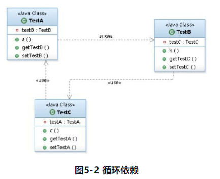

**循环调用是无法解决的，除非有终结条件，否则就是死循环，最终导致内存溢出错误。** 

###### **5.6.2 Spring如何解决循环依赖** 

Spring容器循环依赖包括**构造器循环依赖和setter循环依赖**，那Spring容器如何解决循环依赖呢？ 先让我们来定义循环引用类：

```java
public class TestA {
    private TestB testB;

public TestA(TestB testB) {
    this.testB = testB;
}
    public void a() {
        testB.b();
    }


    public TestB getTestB() {
        return testB;
    }


    public void setTestB(TestB testB) {
        this.testB = testB;
    }
}

public class TestB {
    private TestC testC;

public TestB(TestC testC) {
    this.testC = testC;
}
    public void b() {
        testC.c();
    }


    public TestC getTestC() {
        return testC;
    }


    public void setTestC(TestC testC) {
        this.testC = testC;
    }
}

public class TestC {
    private TestA testA;
public TestC(TestA testA) {
    this.testA = testA;
}
    public void c() {
        testA.a();
    }


    public TestA getTestA() {
        return testA;
    }


    public void setTestA(TestA testA) {
        this.testA = testA;
    }
}
```

###### **1 构造器循环依赖** 

**表示通过构造器注入构成的循环依赖，此依赖是无法解决的**，只能抛出BeanCurrentlyInCreationException异常表示循环依赖。

如在创建TestA类时，构造器需要TestB类，那将去创建TestB，在创建TestB类时又发现需要TestC类，则又去创建TestC，最终在创建TestC时发现又需要TestA，从而形成一个环，没办法创建。 

Spring容器将每一个正在创建的bean标识符放在一个“**当前创建bean池**”中，bean标识符在创建过程中将一直保持在这个池中，因此如果在创建bean过程中发现自己已经在“当前创建bean池”里时，将抛出BeanCurrentlyInCreationException异常表示循环依赖；而对于创建完毕的bean将从“当前创建bean池”中清除掉。 

我们通过一个直观的测试用例来进行分析。

```xml
<?xml version="1.0" encoding="UTF-8"?>
<beans xmlns="http://www.springframework.org/schema/beans"
       xmlns:xsi="http://www.w3.org/2001/XMLSchema-instance"
       xsi:schemaLocation="http://www.springframework.org/schema/beans http://www.springframework.org/schema/beans/spring-beans.xsd">


    <bean id="testA" class="springtest.cycle.dependency.TestA">
        <constructor-arg index="0" ref="testB"/>
    </bean>
    <bean id="testB" class="springtest.cycle.dependency.TestB">
        <constructor-arg index="0" ref="testC"/>
    </bean>
    <bean id="testC" class="springtest.cycle.dependency.TestC">
        <constructor-arg index="0" ref="testA"/>
    </bean>
</beans>
```

```java
// 测试循环依赖
@Test(expected = BeanCurrentlyInCreationException.class)
public void testCycleDependency() throws Throwable {
    try {
        new ClassPathXmlApplicationContext("classpath:cycleDependency.xml");
    } catch (Exception e) {
        // 因为要在创建 testC 时抛出
        Throwable el = e.getCause().getCause().getCause();
        throw el;
    }
}
```

针对以上代码的分析如下。

- Spring容器创建“testA”bean，首先去“当前创建bean池”查找是否当前bean正在创建，如果没发现，则继续准备其需要的构造器参数“testB”，并将“testA”标识符放到“当前创建bean池”。
- Spring容器创建“testB”bean，首先去“当前创建bean池”查找是否当前bean正在创建，如果没发现，则继续准备其需要的构造器参数“testC”，并将“testB”标识符放到“当前创建bean池”。
- Spring容器创建“testC”bean，首先去“当前创建bean池”查找是否当前bean正在创建，如果没发现，则继续准备其需要的构造器参数“testA”，并将“testC”标识符放到“当前创建Bean池”。
- 到此为止Spring容器要去创建“testA”bean，发现该bean标识符在“当前创建bean池”中，因为表示循环依赖，抛出BeanCurrentlyInCreationException。

**源码解析：解析XML的时候并不会报错，而是在实例化所有bean的时候会出现报错**

```java
public void refresh() throws BeansException, IllegalStateException {
   synchronized (this.startupShutdownMonitor) {
      // Prepare this context for refreshing.
      prepareRefresh();

      // Tell the subclass to refresh the internal bean factory.
      ConfigurableListableBeanFactory beanFactory = obtainFreshBeanFactory();

      // Prepare the bean factory for use in this context.
      prepareBeanFactory(beanFactory);

      try {
         // Allows post-processing of the bean factory in context subclasses.
         postProcessBeanFactory(beanFactory);

         // Invoke factory processors registered as beans in the context.
         invokeBeanFactoryPostProcessors(beanFactory);

         // Register bean processors that intercept bean creation.
         registerBeanPostProcessors(beanFactory);

         // Initialize message source for this context.
         initMessageSource();

         // Initialize event multicaster for this context.
         initApplicationEventMulticaster();

         // Initialize other special beans in specific context subclasses.
         onRefresh();

         // Check for listener beans and register them.
         registerListeners();

         // Instantiate all remaining (non-lazy-init) singletons. 在这里，实例化所有 非懒加载的 bean 的时候会报错
         finishBeanFactoryInitialization(beanFactory);

         // Last step: publish corresponding event.
         finishRefresh();
      }
      catch (BeansException ex) {
         if (logger.isWarnEnabled()) {
            logger.warn("Exception encountered during context initialization - " +
                  "cancelling refresh attempt: " + ex);
         }
         // Destroy already created singletons to avoid dangling resources.
         destroyBeans();

         // Reset 'active' flag.
         cancelRefresh(ex);

         // Propagate exception to caller.
         throw ex;
      }

      finally {
         // Reset common introspection caches in Spring's core, since we
         // might not ever need metadata for singleton beans anymore...
         resetCommonCaches();
      }
   }
}
// 再往后是：
/**
* Finish the initialization of this context's bean factory,
* initializing all remaining singleton beans.
*/
protected void finishBeanFactoryInitialization(ConfigurableListableBeanFactory beanFactory) {
.....
    // Instantiate all remaining (non-lazy-init) singletons.
    beanFactory.preInstantiateSingletons();
}
具体的调用是在一开始介绍的 DefaultListableBeanFactory 中的方法
@Override
public void preInstantiateSingletons() throws BeansException {
   if (logger.isTraceEnabled()) {
      logger.trace("Pre-instantiating singletons in " + this);
   }
// Iterate over a copy to allow for init methods which in turn register new bean definitions.
// While this may not be part of the regular factory bootstrap, it does otherwise work fine.
List<String> beanNames = new ArrayList<>(this.beanDefinitionNames);


// Trigger initialization of all non-lazy singleton beans...
for (String beanName : beanNames) {
   RootBeanDefinition bd = getMergedLocalBeanDefinition(beanName);
   if (!bd.isAbstract() && bd.isSingleton() && !bd.isLazyInit()) {
      if (isFactoryBean(beanName)) {
         Object bean = getBean(FACTORY_BEAN_PREFIX + beanName);
         if (bean instanceof FactoryBean) {
            final FactoryBean<?> factory = (FactoryBean<?>) bean;
            boolean isEagerInit;
            if (System.getSecurityManager() != null && factory instanceof SmartFactoryBean) {
               isEagerInit = AccessController.doPrivileged((PrivilegedAction<Boolean>)
                           ((SmartFactoryBean<?>) factory)::isEagerInit,
                     getAccessControlContext());
            }
            else {
               isEagerInit = (factory instanceof SmartFactoryBean &&
                     ((SmartFactoryBean<?>) factory).isEagerInit());
            }
            if (isEagerInit) {
               getBean(beanName);
            }
         }
      }
      else { // 不是 FactoryBean 走这里，我们上面例子是走这里加载的
         getBean(beanName);
      }
   }
}
....
}
然后回到 AbstractBeanFactory 
```

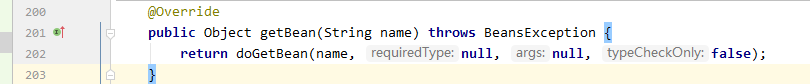

回到上面分析的 doGetBean() 方法中去了。然后开始初始化 testA  

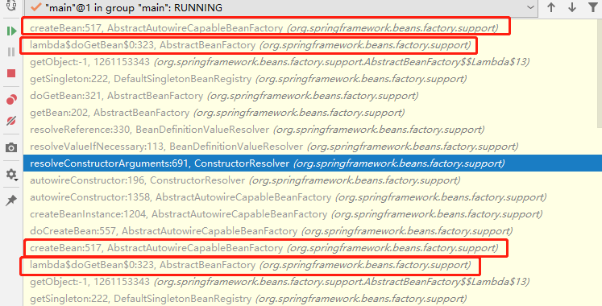

在类 AbstractAutowireCapableBeanFactory 中调用 createBean() 方法，然后继续调用 doCreateBean() 方法，在随后的方法 doCreateBean() 中进行实例化，进入了下面图中这一步：

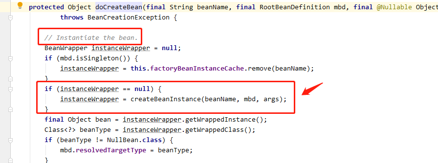

再继续深入到 createBeanInstance(beanName, mbd, args) 方法中查看。这个方法使用一个合适的实例化策略来创建指定的 bean

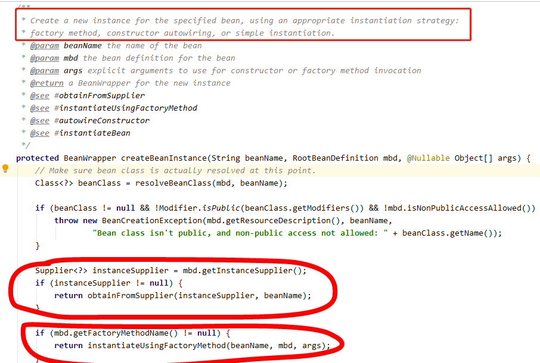


在这代码中也有对 构造器的方式进行初始化创建 bean 的方法。因为在解析 XML 的时候，mbd.hasConstructorArgumentValues() 值会被设值进去，所以会走这里，设置的值就是构造器的值和类。此时的 **beanName：testA， mbd：testA 的定义，ctors：null**，

```java
.......
// Candidate constructors for autowiring?
Constructor<?>[] ctors = determineConstructorsFromBeanPostProcessors(beanClass, beanName);
if (ctors != null || mbd.getResolvedAutowireMode() == AUTOWIRE_CONSTRUCTOR ||
      mbd.hasConstructorArgumentValues() || !ObjectUtils.isEmpty(args)) {
   return autowireConstructor(beanName, mbd, ctors, args);
}


// Preferred constructors for default construction?
ctors = mbd.getPreferredConstructors();
if (ctors != null) {
   return autowireConstructor(beanName, mbd, ctors, null);
}


// No special handling: simply use no-arg constructor.
return instantiateBean(beanName, mbd);
```

再继续深入这个方法，

```java
protected BeanWrapper autowireConstructor(
      String beanName, RootBeanDefinition mbd, @Nullable Constructor<?>[] ctors, @Nullable Object[] explicitArgs) {


   return new ConstructorResolver(this).autowireConstructor(beanName, mbd, ctors, explicitArgs);
}
// 上面的操作还在 AbstractAutowireCapableBeanFactory 类中， 现在要初始化一个构造器解决的类了，引用的 beanFactory 是上面传入的，所有的信息在这里面都有
public ConstructorResolver(AbstractAutowireCapableBeanFactory beanFactory) {
   this.beanFactory = beanFactory;
   this.logger = beanFactory.getLogger();
}
```

往下继续调用方法 autowireConstructor() ，在这里面调用了这个下面高亮的方法， **resolveConstructorArguments(beanName, mbd, bw, cargs, resolvedValues)**;

```java
public BeanWrapper autowireConstructor(String beanName, RootBeanDefinition mbd,
      @Nullable Constructor<?>[] chosenCtors, @Nullable Object[] explicitArgs) {
...
// Need to resolve the constructor.
boolean autowiring = (chosenCtors != null ||
      mbd.getResolvedAutowireMode() == AutowireCapableBeanFactory.AUTOWIRE_CONSTRUCTOR);
ConstructorArgumentValues resolvedValues = null;

int minNrOfArgs;
if (explicitArgs != null) {
   minNrOfArgs = explicitArgs.length;
}
else {
   ConstructorArgumentValues cargs = mbd.getConstructorArgumentValues();// 这里的 cargs 是 testA 的构造方法注入的 testB
   resolvedValues = new ConstructorArgumentValues(); 
   minNrOfArgs = resolveConstructorArguments(beanName, mbd, bw, cargs, resolvedValues);// beanName=testA
}
...
}
```

继续往下调用 resolveConstructorArguments(beanName, mbd, bw, cargs, resolvedValues); 方法，这是在 ConstructorResolver 类里面了，这里面解决构造器的实例化问题。

```java
private int resolveConstructorArguments(String beanName, RootBeanDefinition mbd, BeanWrapper bw,
      ConstructorArgumentValues cargs, ConstructorArgumentValues resolvedValues) {


   TypeConverter customConverter = this.beanFactory.getCustomTypeConverter();
   TypeConverter converter = (customConverter != null ? customConverter : bw);
   BeanDefinitionValueResolver valueResolver =
         new BeanDefinitionValueResolver(this.beanFactory, beanName, mbd, converter);


   int minNrOfArgs = cargs.getArgumentCount();

    // cargs.getIndexedArgumentValues().entrySet() 这里的值就是 testB 了 0:testB
   for (Map.Entry<Integer, ConstructorArgumentValues.ValueHolder> entry : cargs.getIndexedArgumentValues().entrySet()) {
      int index = entry.getKey();
      if (index < 0) {
         throw new BeanCreationException(mbd.getResourceDescription(), beanName,
               "Invalid constructor argument index: " + index);
      }
      if (index > minNrOfArgs) {
         minNrOfArgs = index + 1;
      }
      ConstructorArgumentValues.ValueHolder valueHolder = entry.getValue();
      if (valueHolder.isConverted()) {
         resolvedValues.addIndexedArgumentValue(index, valueHolder);
      }
      else {
         Object resolvedValue =
               valueResolver.resolveValueIfNecessary("constructor argument", valueHolder.getValue());
         ConstructorArgumentValues.ValueHolder resolvedValueHolder =
               new ConstructorArgumentValues.ValueHolder(resolvedValue, valueHolder.getType(), valueHolder.getName());
         resolvedValueHolder.setSource(valueHolder);
         resolvedValues.addIndexedArgumentValue(index, resolvedValueHolder);
      }
   }

   for (ConstructorArgumentValues.ValueHolder valueHolder : cargs.getGenericArgumentValues()) {
      if (valueHolder.isConverted()) {
         resolvedValues.addGenericArgumentValue(valueHolder);
      }
      else {
         Object resolvedValue =
               valueResolver.resolveValueIfNecessary("constructor argument", valueHolder.getValue());
         ConstructorArgumentValues.ValueHolder resolvedValueHolder = new ConstructorArgumentValues.ValueHolder(
               resolvedValue, valueHolder.getType(), valueHolder.getName());
         resolvedValueHolder.setSource(valueHolder);
         resolvedValues.addGenericArgumentValue(resolvedValueHolder);
      }
   }


   return minNrOfArgs;
}
```

深入方法：**valueResolver.resolveValueIfNecessary("constructor argument", valueHolder.getValue())** ，这里是我们之前 xml 解析bean 的构造器元素时候创建的是这个 RuntimeBeanReference 类来放的这个值，所以走的是这里（在 BeanDefinitionParserDelegate 类的 parseBeanDefinitionElement 方法中的 parseConstructorArgElements(ele, bd); 里面调用的 parsePropertyValue() 方法，）

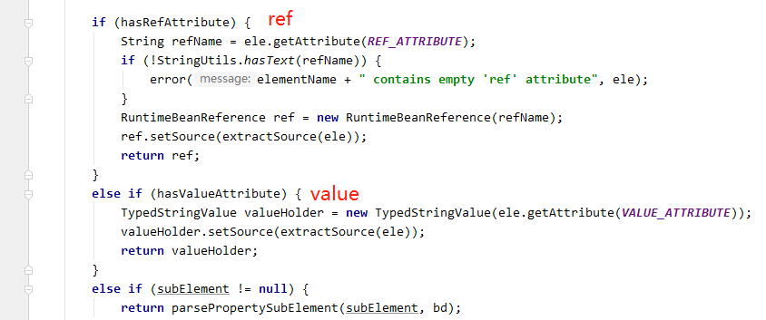

构造器解析的时候设置的 value 的类型

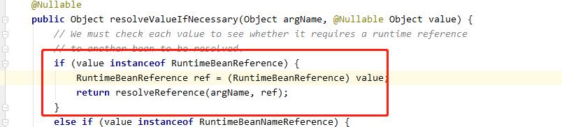

再往下查看，

```java
/**
* Resolve a reference to another bean in the factory. 解决一个引用的bean
*/
@Nullable
private Object resolveReference(Object argName, RuntimeBeanReference ref) {
   try {
      Object bean;
      Class<?> beanType = ref.getBeanType();
      if (ref.isToParent()) {
         BeanFactory parent = this.beanFactory.getParentBeanFactory();
         if (parent == null) {
            throw new BeanCreationException(
                  this.beanDefinition.getResourceDescription(), this.beanName,
                  "Cannot resolve reference to bean " + ref +
                        " in parent factory: no parent factory available");
         }
         if (beanType != null) {
            bean = parent.getBean(beanType);
         }
         else {
            bean = parent.getBean(String.valueOf(doEvaluate(ref.getBeanName())));
         }
      }
      else {
         String resolvedName;
         if (beanType != null) {
            NamedBeanHolder<?> namedBean = this.beanFactory.resolveNamedBean(beanType);
            bean = namedBean.getBeanInstance();
            resolvedName = namedBean.getBeanName();
         }
         else {
调用了这里的方法
            resolvedName = String.valueOf(doEvaluate(ref.getBeanName())); resolveName=testB
            bean = this.beanFactory.getBean(resolvedName); // 然后去获取 testB 这个 bean 了
         }
         this.beanFactory.registerDependentBean(resolvedName, this.beanName);
      }
      if (bean instanceof NullBean) {
         bean = null;
      }
      return bean;
   }
   catch (BeansException ex) {
      throw new BeanCreationException(
            this.beanDefinition.getResourceDescription(), this.beanName,
            "Cannot resolve reference to bean '" + ref.getBeanName() + "' while setting " + argName, ex);
   }
}
```

然后去获取 testB ，发现 testB 也没有创建，然后就创建 testB，后面步骤和创建 testA 基本一致，然后调用 

```java
if (mbd.isSingleton()) {
   sharedInstance = getSingleton(beanName, () -> {
      try {
         return createBean(beanName, mbd, args);
      }
      catch (BeansException ex) {
         // Explicitly remove instance from singleton cache: It might have been put there
         // eagerly by the creation process, to allow for circular reference resolution.
         // Also remove any beans that received a temporary reference to the bean.
         destroySingleton(beanName);
         throw ex;
      }
   });
   bean = getObjectForBeanInstance(sharedInstance, name, beanName, mbd);
}
```

这个方法，这个方法每次创建 bean 之前都会有一个前置操作和后置操作：**beforeSingletonCreation(beanName**); 和 **afterSingletonCreation(beanName)**;**后置操作在构造器的循环依赖里面是不会被调用到的**。

```java
public Object getSingleton(String beanName, ObjectFactory<?> singletonFactory) {
   Assert.notNull(beanName, "Bean name must not be null");
   synchronized (this.singletonObjects) {
      Object singletonObject = this.singletonObjects.get(beanName);
      if (singletonObject == null) {
         if (this.singletonsCurrentlyInDestruction) {
            throw new BeanCreationNotAllowedException(beanName,
                  "Singleton bean creation not allowed while singletons of this factory are in destruction " +
                  "(Do not request a bean from a BeanFactory in a destroy method implementation!)");
         }
         if (logger.isDebugEnabled()) {
            logger.debug("Creating shared instance of singleton bean '" + beanName + "'");
         }
         beforeSingletonCreation(beanName);
         boolean newSingleton = false;
         boolean recordSuppressedExceptions = (this.suppressedExceptions == null);
         if (recordSuppressedExceptions) {
            this.suppressedExceptions = new LinkedHashSet<>();
         }
         try {
            singletonObject = singletonFactory.getObject();
            newSingleton = true;
         }
         catch (IllegalStateException ex) {
            // Has the singleton object implicitly appeared in the meantime ->
            // if yes, proceed with it since the exception indicates that state.
            singletonObject = this.singletonObjects.get(beanName);
            if (singletonObject == null) {
               throw ex;
            }
         }
         catch (BeanCreationException ex) {
            if (recordSuppressedExceptions) {
               for (Exception suppressedException : this.suppressedExceptions) {
                  ex.addRelatedCause(suppressedException);
               }
            }
            throw ex;
         }
         finally {
            if (recordSuppressedExceptions) {
               this.suppressedExceptions = null;
            }
            afterSingletonCreation(beanName);
         }
         if (newSingleton) {
            addSingleton(beanName, singletonObject);
         }
      }
      return singletonObject;
   }
}
```

在最后面创建 testC 的时候，发现又要解决构造注入的 testA。这个 **beforeSingletonCreation**(beanName); 方法里面有进行判断 beanName的创建状态（也就是最后面的时候，会判断 testA 的创建状态，是为正在创建中）

```java
/**
单例创建之前的回调。
默认实现将单例注册为当前正在创建中。
* Callback before singleton creation.
* <p>The default implementation register the singleton as currently in creation.
* @param beanName the name of the singleton about to be created
* @see #isSingletonCurrentlyInCreation
*/
protected void beforeSingletonCreation(String beanName) {
   if (!this.inCreationCheckExclusions.contains(beanName) && !this.singletonsCurrentlyInCreation.add(beanName)) {
      throw new BeanCurrentlyInCreationException(beanName);
   }
}
```

这个是在最后面创建 testC 的时候又去获取 testA，发现 testA 没有创建，然后继续创建 testA，此时正在创建的单例有 testA、testB、testC三个了，现在又想创建 testA 发现这个 bean 已经是正在创建的状态了，所以这里符合循环创建的条件，抛出循环依赖创建异常。singletonsCurrentlyInCreation 是要给 Set*<*String*>* 的类型，此时再 add testA 的时候会返回 false, 前面的 inCreationCheckExclusions 是没有值的。

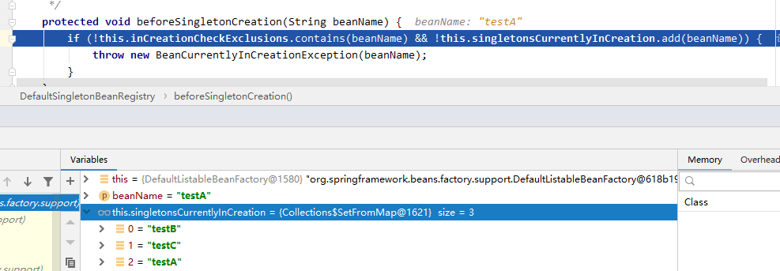 

**至此，构造器注入的循环依赖源码分析完毕，构造器注入导致的循环依赖，解决不了，Spring 直接抛出异常了**。 

###### **2 setter 循环依赖** 

**表示通过setter注入方式构成的循环依赖。对于setter注入造成的依赖是通过Spring容器提前暴露刚完成构造器注入但未完成其他步骤（如setter注入）的bean来完成的，而且只能解决单例作用域的bean循环依赖。通过提前暴露一个单例工厂方法，从而使其他bean能引用到该bean，如下代码所示：源码在 AbstractAutowireCapableBeanFactory 的doCreateBean **方法中；

```java
protected Object doCreateBean(final String beanName, final RootBeanDefinition mbd, final @Nullable Object[] args)
      throws BeanCreationException {


   // Instantiate the bean.
   BeanWrapper instanceWrapper = null;
   if (mbd.isSingleton()) {
      instanceWrapper = this.factoryBeanInstanceCache.remove(beanName);
   }
   if (instanceWrapper == null) { // 这里是创建一个 bean 实例的包装，上面 构造器的循环依赖就是在这里面调用创建bean 然后循环创建依赖的对象触发的
      instanceWrapper = createBeanInstance(beanName, mbd, args);
   }
   final Object bean = instanceWrapper.getWrappedInstance();
   Class<?> beanType = instanceWrapper.getWrappedClass();
   if (beanType != NullBean.class) {
      mbd.resolvedTargetType = beanType;
   }


   // Allow post-processors to modify the merged bean definition.
   synchronized (mbd.postProcessingLock) {
      if (!mbd.postProcessed) {
         try {
            applyMergedBeanDefinitionPostProcessors(mbd, beanType, beanName);
         }
         catch (Throwable ex) {
            throw new BeanCreationException(mbd.getResourceDescription(), beanName,
                  "Post-processing of merged bean definition failed", ex);
         }
         mbd.postProcessed = true;
      }
   }

    // 源码在这里
   // Eagerly cache singletons to be able to resolve circular references
   // even when triggered by lifecycle interfaces like BeanFactoryAware.
   boolean earlySingletonExposure = (mbd.isSingleton() && this.allowCircularReferences &&
         isSingletonCurrentlyInCreation(beanName));
   if (earlySingletonExposure) {
      if (logger.isTraceEnabled()) {
         logger.trace("Eagerly caching bean '" + beanName +
               "' to allow for resolving potential circular references");
      }
      addSingletonFactory(beanName, () -> getEarlyBeanReference(beanName, mbd, bean));
   }
//////

   // Initialize the bean instance.
   Object exposedObject = bean;
   try {
      populateBean(beanName, mbd, instanceWrapper);// 装备 bean的属性之类的
      exposedObject = initializeBean(beanName, exposedObject, mbd);
   }
   catch (Throwable ex) {
      if (ex instanceof BeanCreationException && beanName.equals(((BeanCreationException) ex).getBeanName())) {
         throw (BeanCreationException) ex;
      }
      else {
         throw new BeanCreationException(
               mbd.getResourceDescription(), beanName, "Initialization of bean failed", ex);
      }
   }
.....
}
```

具体步骤如下。

（1）Spring容器创建单例“testA”bean，首先根据无参构造器创建bean，**并暴露一个“ObjectFactory”用于返回一个提前暴露一个创建中的bean，并将“testA”标识符放到“当前创建bean池”**，然后进行setter注入“testB”。*这里是推断一个合适的初始化 bean 的方法，调用了无参构造，如果有具体的构造会调用具体的有参数的构造方法创建 bean*

（2）Spring容器创建单例“testB”bean，首先根据无参构造器创建bean，并**暴露一个“ObjectFactory”用于返回一个提前暴露一个创建中的bean，并将“testB”标识符放到“当前创建bean池”**，然后进行setter注入“testC”。

（3）Spring容器创建单例“testC”bean，首先根据无参构造器创建bean，并**暴露一个“ObjectFactory”用于返回一个提前暴露一个创建中的bean，并将“testC”标识符放到“当前创建bean池”**，然后进行setter注入“testA”。**进行注入“testA”时由于提前暴露了“ObjectFactory”工厂，从而使用它返回提前暴露一个创建中的bean**。

（4）最后在依赖注入“testB”和“testA”，完成setter注入。

代码进行测试：

```java
public class TestSetterA {
    private TestSetterB setterB;
    public TestSetterB getSetterB() {
        return setterB;
    }
    public void setSetterB(TestSetterB setterB) {
        this.setterB = setterB;
    }
}

public class TestSetterB {
    private TestSetterC setterC;
    public TestSetterC getSetterC() {
        return setterC;
    }
    public void setSetterC(TestSetterC setterC) {
        this.setterC = setterC;
    }
}

public class TestSetterC {
    private TestSetterA setterA;
    public TestSetterA getSetterA() {
        return setterA;
    }
    public void setSetterA(TestSetterA setterA) {
        this.setterA = setterA;
    }
}
```

配置文件

```xml
<?xml version="1.0" encoding="UTF-8"?>
<beans xmlns="http://www.springframework.org/schema/beans"
       xmlns:xsi="http://www.w3.org/2001/XMLSchema-instance"
       xsi:schemaLocation="http://www.springframework.org/schema/beans http://www.springframework.org/schema/beans/spring-beans.xsd">
<!--    setter 循环依赖 -->
    <bean id="testSetterA" class="springtest.cycle.dependency.TestSetterA">
        <property name="setterB" ref="testSetterB"/>
    </bean>
    <bean id="testSetterB" class="springtest.cycle.dependency.TestSetterB">
        <property name="setterC" ref="testSetterC"/>
    </bean>
    <bean id="testSetterC" class="springtest.cycle.dependency.TestSetterC">
        <property name="setterA" ref="testSetterA"/>
    </bean>
</beans>
```

**源码分析：**

不同于上面 **构造器的循环依赖**，**setter 的循环依赖**会先在 doCreateBean 方法中先成功**创建出一个 instanceWrapper 用来包装 bean**，再进行后续的操作。

**注意\*** ：在 setter 的循环依赖里面也还没有调用 org.springframework.beans.factory.support.**DefaultSingletonBeanRegistry**#**getSingleton**(java.lang.String, org.springframework.beans.factory.ObjectFactory<?>) 这个方法里面的 **afterSingletonCreation**(beanName); 的，

下面的这些操作都是调用了 **beforeSingletonCreation**(beanName); 之后，再调用 **singletonObject = singletonFactory.getObject()**; 方法，而这个方法则是 org.springframework.beans.factory.support.**AbstractAutowireCapableBeanFactory**#**createBean**(java.lang.String, org.springframework.beans.factory.support.RootBeanDefinition, java.lang.Object[]) 方法，然后再调用了里面的 doCreateBean() 方法来进行创建bean 的。

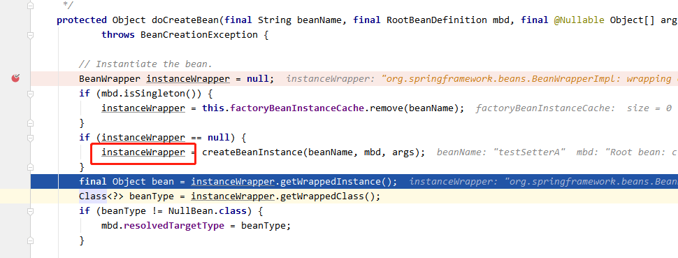

这里则是创建完初始的 bean 实例后，会进入到解决循环依赖的方法里，提前暴露出这个 bean 的 objectFactory ，是一个初始版本，还没有开始设置bean 的相关属性之类的。

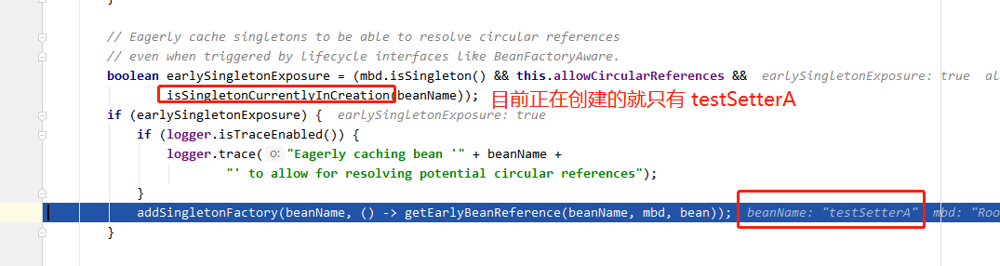

```java
public boolean isSingletonCurrentlyInCreation(String beanName) {
   return this.singletonsCurrentlyInCreation.contains(beanName);
}

```

这个类里面的值是在 beforeSingletonCreation(beanName); 这个方法里面将当前 beanName 为 testSetterA 添加进入的。所以上面会返回true，然后进入到了下面这个逻辑：添加这个为testSetterA 的 bean 的 ObjectFactory 到缓存中里面

再继续往下，进入到方法 getEarlyBeanReference 方法中。

```java
/**
* Obtain a reference for early access to the specified bean,
* typically for the purpose of resolving a circular reference.  获取对指定 bean 的早期访问的引用，通常用于解析循环引用
* @param beanName the name of the bean (for error handling purposes)
* @param mbd the merged bean definition for the bean
* @param bean the raw bean instance
* @return the object to expose as bean reference
*/
protected Object getEarlyBeanReference(String beanName, RootBeanDefinition mbd, Object bean) {
   Object exposedObject = bean;
   if (!mbd.isSynthetic() && hasInstantiationAwareBeanPostProcessors()) {
      for (BeanPostProcessor bp : getBeanPostProcessors()) {
         if (bp instanceof SmartInstantiationAwareBeanPostProcessor) {
            SmartInstantiationAwareBeanPostProcessor ibp = (SmartInstantiationAwareBeanPostProcessor) bp;
            exposedObject = ibp.getEarlyBeanReference(exposedObject, beanName);
         }
      }
   }
   return exposedObject;
}
```

然后再到 addSingleFactory 方法里面，这里有四个 map，**--------------缓存-------------** 

#### 三级缓存 

**singletonObjects**：Cache of singleton objects: bean name to bean instance.（一级缓存）

**earlySingletonObjects**: Cache of early singleton objects: bean name to bean instance.（二级缓存）

**singletonFactories**: Cache of singleton factories: bean name to ObjectFactory.（三级缓存）

**registeredSingletons**: Set of registered singletons, containing the bean names in registration order.

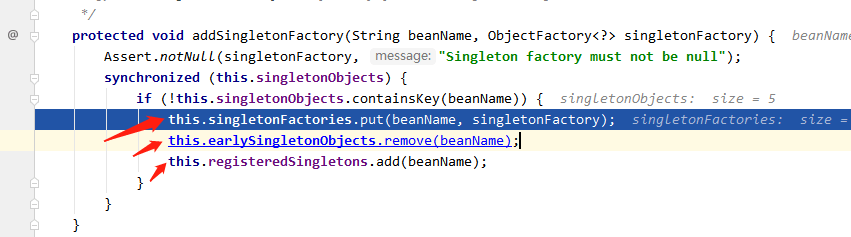

**将暴露的 ObjectFactory 添加到三级缓存中，并且移除二级缓存中的记录**。

**三级缓存是在这里添加记录**。

而**二级缓存的记录是在**org.springframework.beans.factory.support.DefaultSingletonBeanRegistry#getSingleton(java.lang.String, boolean) 添加的，这个方法是一开始的时候就尝试从这里（缓存）获取 bean。**这里面是添加二级缓存，删除三级缓存。**

而**一级缓存是在创建完成了 bean 之后，进行添加的**。这里面是**添加一级缓存，删除二级和三级缓存的 bean 的映射记录。**并且调用this.registeredSingletons.add(beanName); 加入到注册的 registeredSingletons 中。

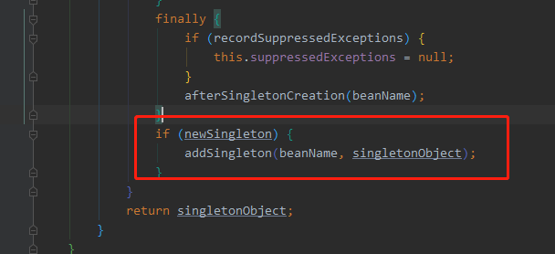

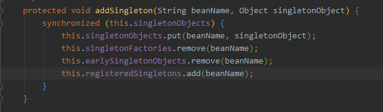

然后继续往下运行至方法：**populateBean()**：*Populate the bean instance in the given BeanWrapper with the property values from the bean definition.* 在这里继续调用了 applyPropertyValues() 方法，去设置属性值，因为我们使用的是 setter 属性注入的方法。在先前解析 xml 文件的时候就会将这个属性值放到 beanDefinition 中去，然后这边是能够拿到这个值的。 

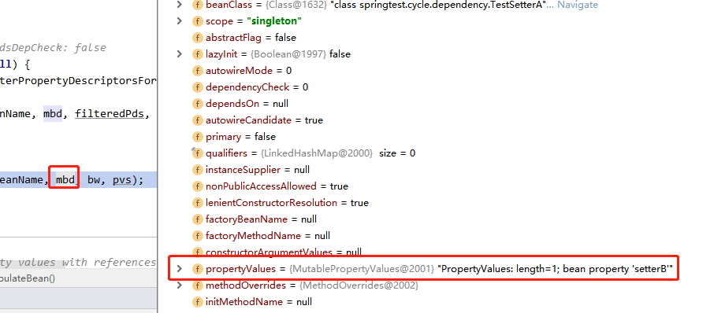

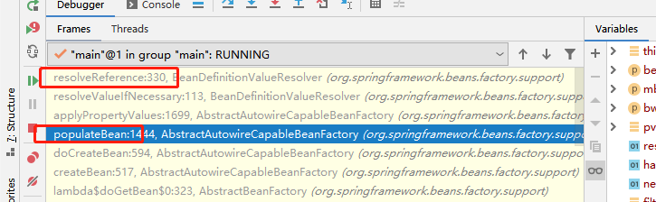

然后在 applyPropertyValues 方法中去，这个是这个方法的解释

```java 
Apply the given property values, resolving any runtime references
* to other beans in this bean factory. Must use deep copy, so we
* don't permanently modify this property.
一部分代码：
// Create a deep copy, resolving any references for values.在这里解决属性值的引用
List<PropertyValue> deepCopy = new ArrayList<>(original.size());
boolean resolveNecessary = false;
for (PropertyValue pv : original) {
   if (pv.isConverted()) {
      deepCopy.add(pv);
   }
   else {
      String propertyName = pv.getName();
      Object originalValue = pv.getValue();
      if (originalValue == AutowiredPropertyMarker.INSTANCE) {
         Method writeMethod = bw.getPropertyDescriptor(propertyName).getWriteMethod();
         if (writeMethod == null) {
            throw new IllegalArgumentException("Autowire marker for property without write method: " + pv);
         }
         originalValue = new DependencyDescriptor(new MethodParameter(writeMethod, 0), true);
      }
      Object resolvedValue = valueResolver.resolveValueIfNecessary(pv, originalValue); // 调用了这个方法
      Object convertedValue = resolvedValue;
      boolean convertible = bw.isWritableProperty(propertyName) &&
            !PropertyAccessorUtils.isNestedOrIndexedProperty(propertyName);
      if (convertible) {
         convertedValue = convertForProperty(resolvedValue, propertyName, bw, converter);
      }
      // Possibly store converted value in merged bean definition,
      // in order to avoid re-conversion for every created bean instance.
      if (resolvedValue == originalValue) {
         if (convertible) {
            pv.setConvertedValue(convertedValue);
         }
         deepCopy.add(pv);
      }
      else if (convertible && originalValue instanceof TypedStringValue &&
            !((TypedStringValue) originalValue).isDynamic() &&
            !(convertedValue instanceof Collection || ObjectUtils.isArray(convertedValue))) {
         pv.setConvertedValue(convertedValue);
         deepCopy.add(pv);
      }
      else {
         resolveNecessary = true;
         deepCopy.add(new PropertyValue(pv, convertedValue));
      }
   }
}
if (mpvs != null && !resolveNecessary) {
   mpvs.setConverted();
}
```

上面的 **Object resolvedValue = valueResolver.resolveValueIfNecessary(pv, originalValue); 方法调用，**其实最后面又回到了和构造器上面解决循环依赖时候的一样，然后再到这个方法里去获取 testSetterB 对象，发现这个对象并没有创建，然后继续创建这个对象，继续会到一开始的 doCreateBean() 方法里面去了，不过不同的地方是在，一开始会将这个创建的 半成品的bean 暴露出一个代表 bean 的 ObjectFactory 出来，用来判断bean 是否创建。

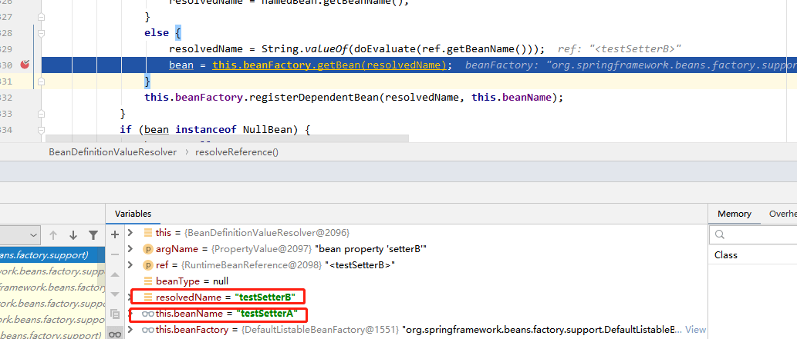

再次创建 testSetterB 的时候，和正常创建一个 bean 一致，都会将 testSetterB 加入到正在创建的 bean 池中去。下面的这个图是创建 testSetterB 的时候发现 testSetterC 没有创建，而去创建 testSetterC 的时候，正在创建的 bean池中的数据。

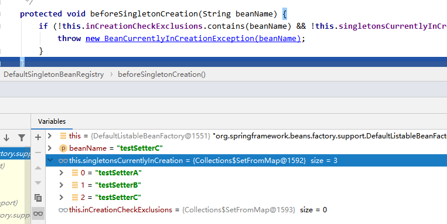

再次调用 addSingletonFactory() 方法的时候，其中的属性：singletonFactories 已经有了 3 个bean，它们目前都还是 ObjectFactory。

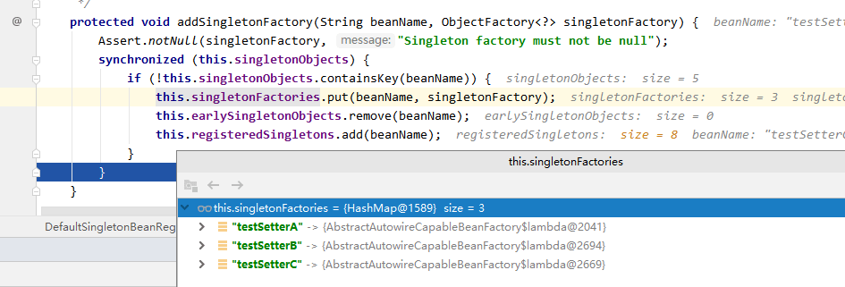

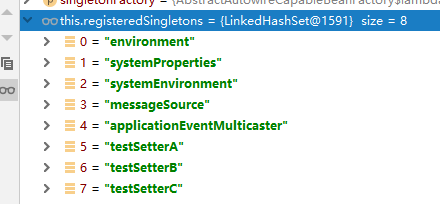

这里已经注册的 bean 已经有了这 3 个类了。后面再继续调用 populate()方法来应用了。后面再继续调用 populate()方法来应用 效果。继续解决引用依赖的问题，

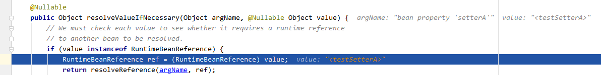

这里又去调用创建 testSetterA 了，**然后关键来了** 

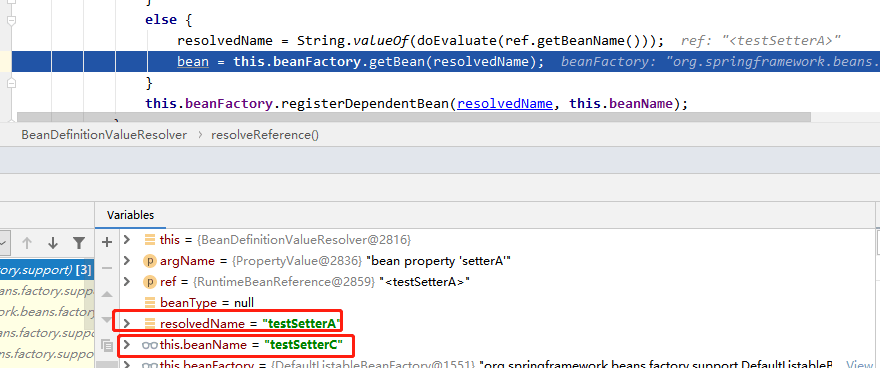

**获取getSingleton 的时候已经能够获取到 testSetterA 了，然后就不会创建而是直接返回了**。

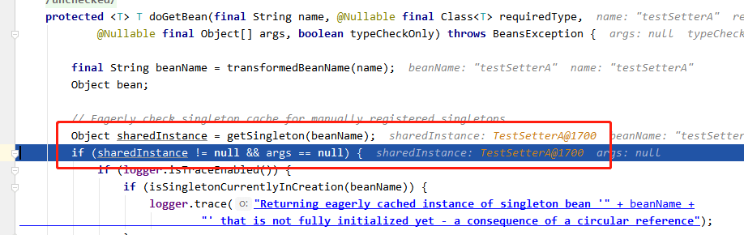

缓存中获取的过程：可以看到是从 **singletonFactories** 中获取的。

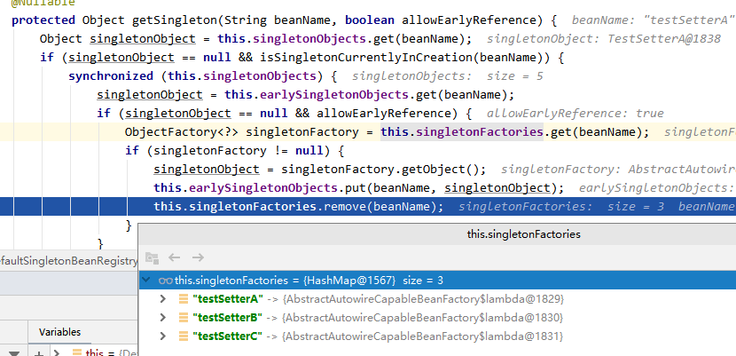

最后创建返回的 bean 是：TestSetterC ，它的属性 setterA 已经被注入了。

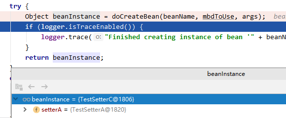

而对于构造器的循环依赖，不同之处是在于（**不会创建一个特定的 bean 出来的**），代码不会运行到 addSingletonFactory() 方法的位置上来，所以和setter 的循环依赖是不一样的。

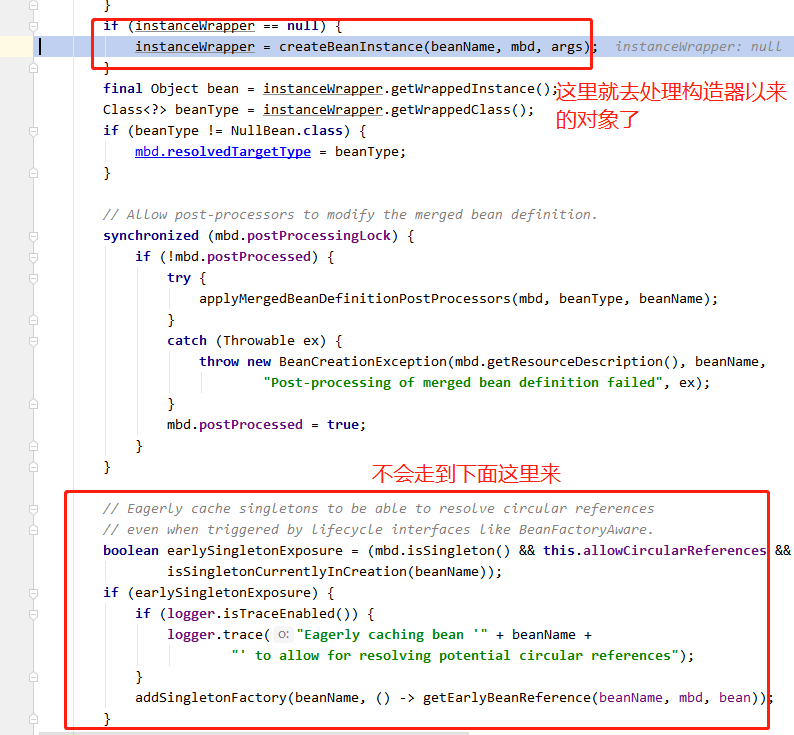

###### **3 prototype 范围的依赖处理** 

对于“prototype”作用域bean，**Spring容器无法完成依赖注入**，因为Spring容器不进行缓存“prototype”作用域的bean，因此无法提前暴露一个创建中的bean。

对于 prototype 类型的bean，**下面这个条件不满足，所以它并不会像 setter 那样，创建并提前暴露一个 bean 的 ObjectFactory 出来使用**

```java
配置文件
<?xml version="1.0" encoding="UTF-8"?>
<beans xmlns="http://www.springframework.org/schema/beans"
       xmlns:xsi="http://www.w3.org/2001/XMLSchema-instance"
       xsi:schemaLocation="http://www.springframework.org/schema/beans http://www.springframework.org/schema/beans/spring-beans.xsd">
<!--    setter 循环依赖 -->
    <bean id="testSetterA" class="springtest.cycle.dependency.TestSetterA" scope="prototype">
        <property name="setterB" ref="testSetterB"/>
    </bean>
    <bean id="testSetterB" class="springtest.cycle.dependency.TestSetterB" scope="prototype">
        <property name="setterC" ref="testSetterC"/>
    </bean>
    <bean id="testSetterC" class="springtest.cycle.dependency.TestSetterC" scope="prototype">
        <property name="setterA" ref="testSetterA"/>
    </bean>
</beans>

// Eagerly cache singletons to be able to resolve circular references
// even when triggered by lifecycle interfaces like BeanFactoryAware.
boolean earlySingletonExposure = (mbd.isSingleton() && this.allowCircularReferences &&
      isSingletonCurrentlyInCreation(beanName));
if (earlySingletonExposure) {
   if (logger.isTraceEnabled()) {
      logger.trace("Eagerly caching bean '" + beanName +
            "' to allow for resolving potential circular references");
   }
   addSingletonFactory(beanName, () -> getEarlyBeanReference(beanName, mbd, bean));
}
```

循环依赖可以参考： https://www.iflym.com/index.php/code/201208280001.html  

#### 为什么需要三级缓存，二级缓存就已经能够解决循环依赖问题了。

博客：[Spring源码最难问题《当Spring AOP遇上循环依赖》_bugpool的博客-CSDN博客](https://blog.csdn.net/chaitoudaren/article/details/105060882) 

具体就是因为，如果这个bean是被aop代理的类该如何处理。

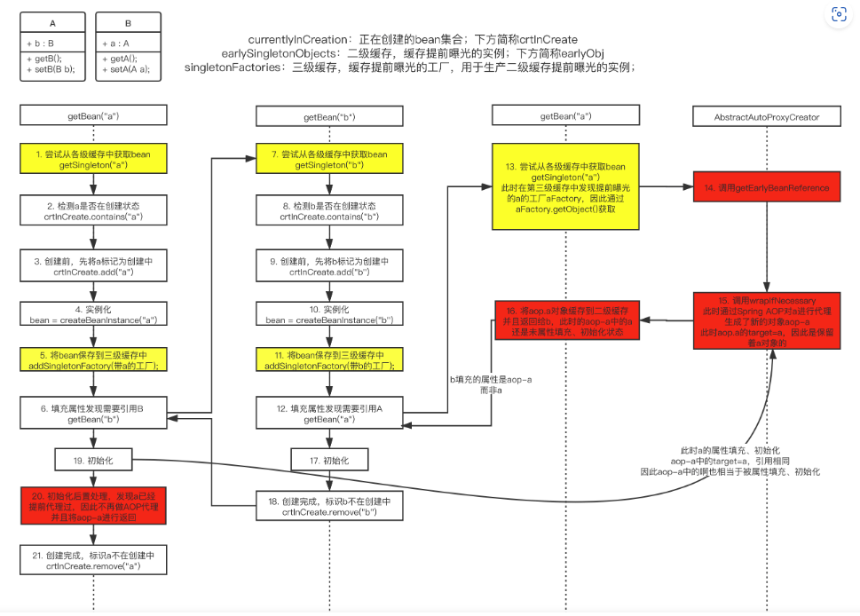

如果只是使用二级缓存的话，当开始的时候就将A保存到二级缓存中，二级缓存中保存的是lamda表达式，当创建A的时候，保存；随后A依赖B，随后去获取B，将B放入到二级缓存中；随后B依赖A，此时去注入A，getSingleton(A)，此时A是有AOP代理的，返回的则是AOP代理对象A，**那么此时我们需要删除二级缓存中的A**；此时返回B的创建，B中A的属性则是AOP代理的A对象；B创建完成，加入到一级缓存中；返回A的创建的B属性的注入，到此时，也就是上面的20步，初始化后置处理器，发现A是需要代理的，但是我们从二级缓存中获取不到AOP代理的A对象的，也就是说此时又会进行一次代理，返回一个新的AOP代理对象，这个B中的A的对象不一样，出问题了。

如果我们不删除二级缓存中的A的话，二级缓存存的式一个表达式，此时从表达式去get的话，返回的也是一个新的A的AOP代理对象，不会返回我们上一个在创建B过程中创建的A的AOP代理对象，因为这个A的代理对象是没有加入到一级缓存中去的。也会出现两个A的AOP代理对象。